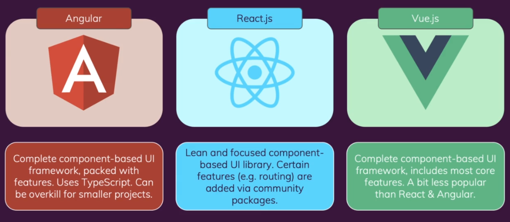
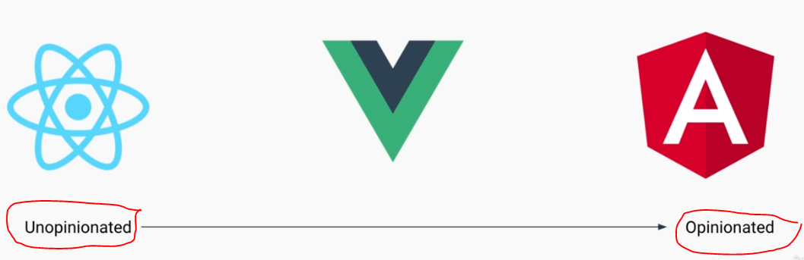
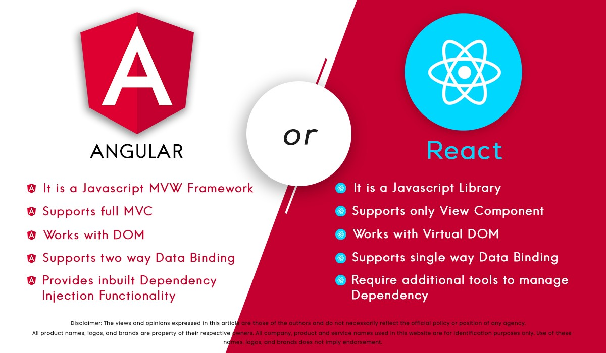

## INDEX

- [INDEX](#index)
- [Frameworks](#frameworks)
- [Types of Frameworks](#types-of-frameworks)
  - [Configuration-over-convention](#configuration-over-convention)
  - [convention-over-configuration](#convention-over-configuration)
- [Libraries vs Frameworks](#libraries-vs-frameworks)
  - [React](#react)
  - [Angular](#angular)
  - [Vue](#vue)
- [Comparison](#comparison)
  - [Vue vs React](#vue-vs-react)

---

## Frameworks

`JavaScript frameworks` are tried and tested tools for building scalable web applications. They contain a collection of JavaScript code libraries that provide pre-written JS code for standard programming features and tasks.

- A JavaScript framework guides developers on building complex applications faster and more efficiently by providing an ecosystem of tools that improves the developer experience. Frameworks enable you to add functionalities like testing and linting to ensure you're shipping error-free code.

> **Opinionated**: having strong opinions on how things should be done

---

## Types of Frameworks

### Configuration-over-convention

- easy to use
- freedom to structure however you please
- needs additional libraries to fill in missing features
- EX: `React`, `Vue`

---

### convention-over-configuration

- structure straight out of the box
- Provides solutions for common problems
- larger learning curve
- EX: `Angular`

---

## Libraries vs Frameworks

- A `JavaScript library` refers to packaged code, methods, and functions that can be reused and repurposed. On the other hand,
- A `JavaScript framework` defines the application design, **can call on a library, and use code within it**. It doesn't offer a single solution; instead, it gives you a set of blueprints for building web applications.

### React

- `React` is not technically a framework; it's a library for UI components, but it's seen colloquially as a framework
- React.js provides fast UIs for interactive apps which use data efficiently by instantly applying changes to elements rather than updating all occurrences at once as other libraries do. It also supports incremental use with the virtual DOM (document object model) to make fast updates to web page content. React also uses JSX, a domain-specific interface created by the same team.

### Angular

- Angular is a `component-based framework`.
  - It offers developers a collection of integrated libraries and tools to develop, test, and update their code. This makes it a robust option for building and deploying web applications.
- Angular combines declarative templates, dependency injection, solid end-to-end tooling, and an integrated set of best practices to solve development challenges.

---

### Vue

- It's a JavaScript framework for building user interfaces. It builds on top of standard HTML, CSS and JavaScript, and provides a **declarative and component-based programming model** that helps you efficiently develop user interfaces, be it simple or complex.

---

## Comparison

### Vue vs React

1- **Optimization Efforts**

- In React, when a component’s state changes, it triggers the re-render of the entire component sub-tree, starting at that component as root. To avoid unnecessary re-renders of child components, you need to either use `PureComponent` or implement `shouldComponentUpdate`
- In Vue, a component’s dependencies are **automatically** tracked during its render, so the system knows precisely which components actually need to re-render when state changes. Each component can be considered to have shouldComponentUpdate automatically implemented for you, without the nested component caveats.

2- **HTML & CSS**

- In React, everything is just JavaScript. Not only are HTML structures expressed via JSX, the recent trends also tend to put CSS management inside JavaScript as well.
- In Vue, we also have render functions and even support JSX, because sometimes you do need that power. However, as the default experience we offer templates as a simpler alternative. Any valid HTML is also a valid Vue template, and this leads to a few advantages of its own:
  - templates feel more natural to read and write
  - easier to progressively migrate existing applications to take advantage of Vue’s reactivity features.
  - You can even use pre-processors such as **Pug**

3- **Native Rendering**

- React Native enables you to write native-rendered apps for iOS and Android using the same React component model
- Vue has an official collaboration with **Weex**, a cross-platform UI framework

4- **more**:

- Basic configuration, CLI, and initial setup time [Vue ✅]
- Code writing ideology (JSX vs Templates) [ Vue ✅]
- Market strength [React ✅]
- Getting help when needed (documentation and support) [Draw]
- Compatibility with animations [Vue ✅]
- Manipulating changes in DOM [Vue ✅]
- Dependency injection ability [Vue ✅]
- Code hierarchy and refactoring Vue ✅]
- Broadcasting and remote event listening [Vue ✅]
