## INDEX

- [INDEX](#index)
- [Installation](#installation)
  - [Angular CLI](#angular-cli)
  - [ng-commands](#ng-commands)
- [Angular](#angular)
  - [Compilation](#compilation)
  - [Modules](#modules)
    - [Shared Modules](#shared-modules)
  - [Files](#files)
- [Components](#components)
  - [Component as html element](#component-as-html-element)
  - [Component as html attribute](#component-as-html-attribute)
  - [Presentational vs Smart components](#presentational-vs-smart-components)
- [Data-Binding](#data-binding)
- [Data flow between components](#data-flow-between-components)
  - [Local Reference (Template variable)](#local-reference-template-variable)
  - [Content projection](#content-projection)
- [LifeCycle Hooks](#lifecycle-hooks)
  - [ngOnInit()](#ngoninit)
    - [Difference between `Constructor` and `ngOnInit`](#difference-between-constructor-and-ngoninit)
- [Pipes](#pipes)
- [Directives](#directives)
  - [Attribute Directives](#attribute-directives)
  - [Structural Directives](#structural-directives)
- [Services](#services)
  - [Dependency injection](#dependency-injection)
    - [`Highrarical injection`](#highrarical-injection)
    - [`@injectable`](#injectable)
- [Forms](#forms)
  - [TEMPLATE-DRIVEN Forms](#template-driven-forms)
- [RxJS](#rxjs)
  - [Observables](#observables)
  - [`imperative approch`](#imperative-approch)
  - [`Declarative approch`](#declarative-approch)
    - [Flattening Operators](#flattening-operators)
- [Notes](#notes)
  - [`Expressions` vs `String Interpolation`](#expressions-vs-string-interpolation)
- [Router](#router)
  - [RouterModule.`forRoot`(ROUTES) vs RouterModule.`forChild`(ROUTES)](#routermoduleforrootroutes-vs-routermoduleforchildroutes)
  - [Generating Router Module](#generating-router-module)
  - [navigating to route programatically](#navigating-to-route-programatically)

---

## Installation

### Angular CLI

it's a utility tool for managing projects

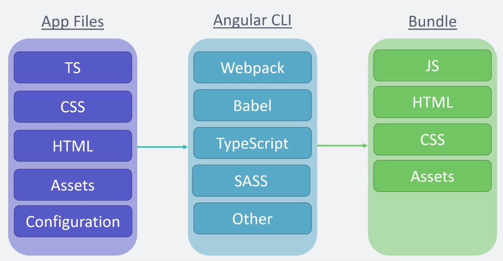

```bash
npm install -g @angular/cli
```

### ng-commands

```bash
ng new project_name

# Starting development server
npm start
# or
ng serve

# Generating new component
ng generate component <name of component>
# Generating new module
ng generate module <name of module>
```

- modules generated with `cli` are not registered in the app so you need import the module into the `app.module`

---

## Angular

### Compilation

transferring code to machine code

- types:

  - `Just-in-time compilation`
    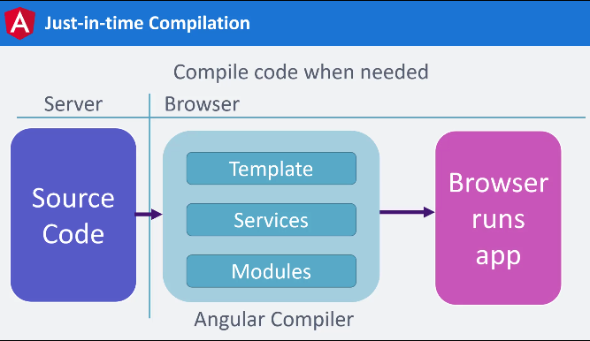

  - `Ahead-of-time compilation`

    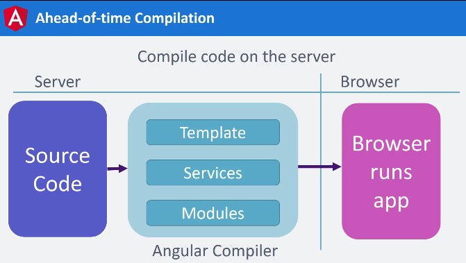

    - newer and better!

  - 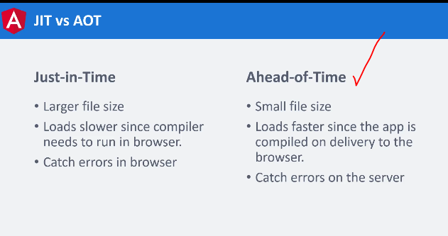

- selecting platform to run the app (`Compilation Strategy`)

  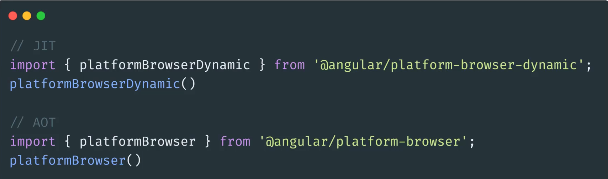

---

### Modules

Angular uses modules to `bundle` different components into packages

It's where we import components so that Angular knows that they exists

- BrowserModule
- CommonModule

they both import same components but difference is:

- `BrowserModule` provides additional services of running the app in the browser
- `CommonModule` is **re-exported** by `BrowserModule`, so when we import `CommonModule` we actually are importing 2 modules at the same time!

#### Shared Modules

Instead of importing these common modules and components in every feature module, you can create a shared module that has all these modules and components. Import them into a shared module and import this shared module into all feature modules. This will save imports and a lot of coding lines.

---

### Files

- `main.ts` : is like index.ts

  - --> it starts up `app.module.ts`

- `app/app.module.ts` : it's a gate to import the main app component -> `app.component.ts`

  - --> it starts up `app.component.ts`

- `app/app.component.ts` : it has the content that would be in the `app-root` tags in `index.html`
  - target can be html-code or `templateUrl` containing path for html file

---

## Components

components are just exported `classes`

- A component's job is to enable the user experience and nothing more. A component should present properties and methods for data binding, in order to mediate between the **view (rendered by the template)** and the **application logic (services) (which often includes some notion of a model)**.

### Component as html element

```ts
import { Component } from "@angular/core";

@Component({
  selector: "app-nav", // the html selector that will be represent this component
  templateUrl: "./nav.component.html", // the html file
  styleUrls: ["./nav.component.css"],
  // or
  // styles: [
  //   `
  //     p {
  //       color: red;
  //     }
  //   `,
  // ],
})
export class NavComponent {
  constructor() {}
}
```

- now in "nav.component.html" you can use this component like an html element
  ```html
  <app-nav></app-nav>
  ```

---

### Component as html attribute

```ts
selector: "[app-nav]";
```

```html
<div app-nav></div>
```

---

### Presentational vs Smart components

`Presentational components`: are responsible only for displaying data, without knowing where the data comes from. They receive the data via an `@Input()`, and return modified data through `@Output()` events

`Smart components`: are responsible for interacting with the service layer and retrieving the data, which then they pass to presentational components

---

## Data-Binding


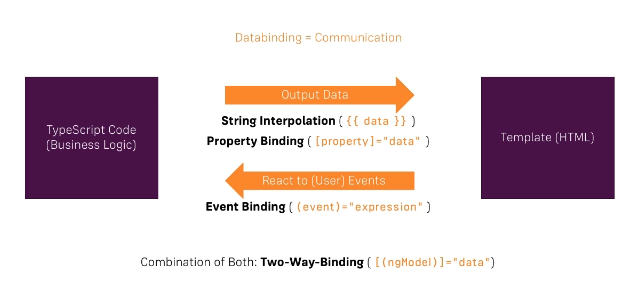

- `String-interpolation`:

  - `{{string_property in the class}}`

- `Property Binding`

  - it's like `Attribute Directives` as if the value is true you will add the attribute/class to the html element

  ```html
  <!-- in component.ts file: the propery_x:true or false -->
  <button [disable]="propery_x"></button>
  ```

- `Event Binding`

  - Here we write events-attribute in the html element without the "on": `click` instead of `onClick`
  - Here we usually call a method from the class

  ```html
  <!-- here we use the sayHi() method -->
  <div (click)="sayHi()"></div>
  ```

  - `$event` : it's a reserved word used with event binding so that you can use the event as an argument of the method

- `2-way-binding`

  - it's the ability to being able to listen to events and update a property simultaneously  
    

  ```html
  <div [(ngModel)]="some_property"></div>
  <!-- instead of this -->
  <div [ngModel]="some_property" (change)="ngModel=newValue"></div>
  ```

  - here the `ngModel` directive is doing 2 tasks:
    - set value of the attribute with property-binding
    - **Emit an event** when the property changes in the template

---

## Data flow between components

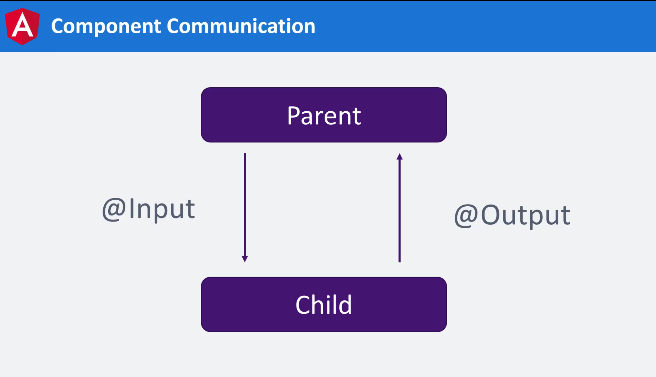

- data is passed using `property binding`

```ts
// in hero-child.component.ts
import { Component, Input } from "@angular/core";

import { Hero } from "./hero";

@Component({
  selector: "app-hero-child",
  template: `
    <h3>{{ hero.name }} says:</h3>
    <p>I, {{ hero.name }}, am at your service, {{ masterName }}.</p>
  `,
})
export class HeroChildComponent {
  @Input() hero!: Hero;
  @Input("master") masterName = ""; // here we use an "alias" so that in the parent component we use the alias not the othername(masterName)
}
```

```ts
// in hero-parent.component.ts
import { Component } from "@angular/core";

import { HEROES } from "./hero";

@Component({
  selector: "app-hero-parent",
  template: `
    <h2>{{ master }} controls {{ heroes.length }} heroes</h2>

    <app-hero-child *ngFor="let hero of heroes" [hero]="hero" [master]="master">
    </app-hero-child>
  `,
})
export class HeroParentComponent {
  heroes = HEROES;
  master = "Master";
}
```

---

### Local Reference (Template variable)

its a word that you use t mark an element and get access to it in the template to use it in another place in the **same template**

- it starts with `#`

- to access it in the template:

  ```html
  <input #serveNameInput />

  <button (click)="fun(serverNameInput.value)"></button>
  ```

- to access it in the .ts file:

  ```ts
  // in the class
  @viewChile('serveNameInput') serveNameInput:ElementRef;
  ```

- to access it in its child-.ts file:

  ```ts
  // in the class
  @contentChild('serveNameInput') serveNameInput:ElementRef;
  ```

---

### Content projection

Content projection is a pattern in which you `insert, or project`, the content you want to use inside another component. For example, you could have a Card component that accepts content provided by another component.

- Single-slot content projection

  ```html
  <!-- child -->
  <h2>Single-slot content projection</h2>
  <ng-content></ng-content>

  <!-- parent -->
  <child-component>
    <p>the projected content</p>
  </child-component>
  ```

- Multi-slot content projection

  - A component can have multiple slots. Each slot can specify a CSS selector that determines which content goes into that slot. This pattern is referred to as multi-slot content projection. With this pattern, you must specify where you want the projected content to appear. You accomplish this task by using the `select` attribute of `<ng-content>`.

  ```ts
  @Component({
    selector: "app-zippy-multislot",
    template: `
      <h2>Multi-slot content projection</h2>

      Default:
      <ng-content></ng-content>

      Question:
      <ng-content select="[question]"></ng-content>
    `,
  })
  export class ZippyMultislotComponent {}
  ```

  ```html
  <app-zippy-multislot>
    <p question>Is content projection cool?</p>
    <p>Let's learn about content projection!</p>
  </app-zippy-multislot>
  ```

---

## LifeCycle Hooks

A component instance has a lifecycle that

- `starts` when Angular instantiates the component class and renders the component view along with its child views.
- The lifecycle `continues` with change detection, as Angular checks to see when data-bound properties change, and updates both the view and the component instance as needed.
- The lifecycle `ends` when Angular destroys the component instance and removes its rendered template from the DOM.

[lifecycle hooks](https://angular.io/guide/glossary#lifecycle-hook)

[lifecycle events sequence](https://angular.io/guide/lifecycle-hooks#sequence-and-frequency-of-all-lifecycle-events)

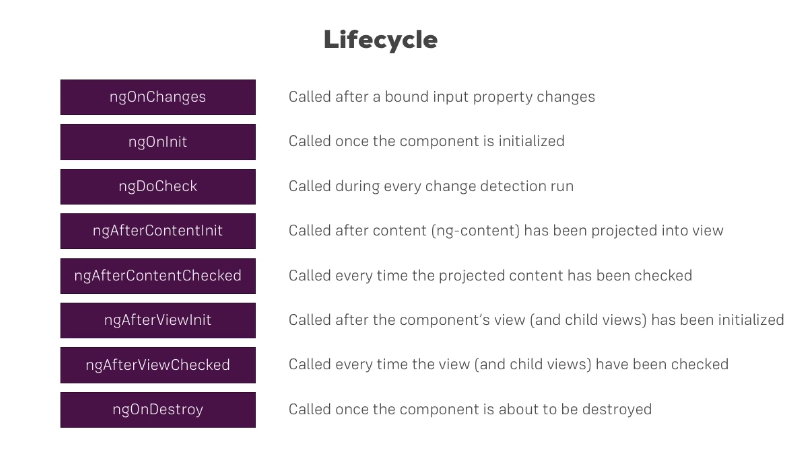

---

### ngOnInit()

- It's a callback method that is invoked immediately after the default change detector has checked the directive's data-bound properties for the first time, and before any of the view or content children have been checked. It is invoked only once when the directive is instantiated.
- it can be called normally or using an `interface`

```ts
import { Component, OnInit } from "@angular/core";

class MyComponent implements OnInit {
  ngOnInit() {
    // ...
  }
}
```

#### Difference between `Constructor` and `ngOnInit`

- The `Constructor` is a default method of the class that is executed when the class is instantiated and ensures proper initialisation of fields in the class and its subclasses.
- `ngOnInit` is a life cycle hook called by Angular to indicate that Angular is done creating the component (data is passed between components).
- Mostly we use `ngOnInit` for all the initialization/declaration and avoid stuff to work in the constructor. The `constructor` should only be used to initialize class members but shouldn't do actual "work".

---

## Pipes

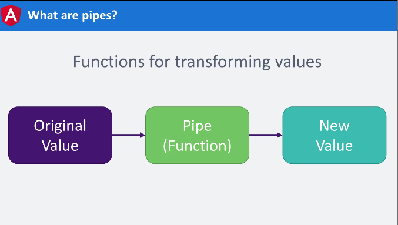

- [pipe reference](https://angular.io/api?type=pipe)

- [date pipe format options]([format options](https://angular.io/api/common/DatePipe#pre-defined-format-options))

---

## Directives

Angular directives are extended `HTML attributes` with the prefix `ng-`.

[Directives](https://angular.io/api?type=directive)


---

### Attribute Directives

- attribute directive changes the appearance or behavior of a DOM element
- used to add styles,classes (modify appearance through attributes)

- look here for full types and documentation [Attribute Directives](https://angular.io/guide/attribute-directives)

```ts
// in css-file we have class ".blue"
// in app.ts file we have property "blueClass=True"
<button (click)="blueClass"=!blueClass" [ngClass]="{blue:blueClass}">
// if blueClass property is equal to true --> the "blue" class is added
```

- or you can use `ng g directive` and use the

```sh
ng generate directive highlight
```

```ts
// in src/app/highlight.directive.ts
import { Directive, ElementRef } from "@angular/core";

@Directive({
  selector: "[appHighlight]",
})
export class HighlightDirective {
  constructor(private el: ElementRef) {
    this.el.nativeElement.style.backgroundColor = "yellow";
  }
}

// in html file
<p appHighlight>Highlight me!</p>;
```

---

### Structural Directives

- it can add or remove elements
- Angular makes the content inside of `<ng-template>` become hidden but Angular will be aware of it so that it can be used based on condition

```ts
// this element "<p>" will only show if the property "blueClass=True"
<ng-template [ngIf]="blueClass">
  <p>the button is blue</p>
</ng-template>

// or
<p *ngIf="blueClass">the button is blue</p>
// here we use * to tell angular to transform it to the other way above
```

- [Shorthand examples](https://angular.io/guide/structural-directives#shorthand-examples)

---

## Services

Service is a broad category encompassing any value, function, or feature that an application needs. A service is typically a class with a narrow, well-defined purpose. It should do something specific and do it well.

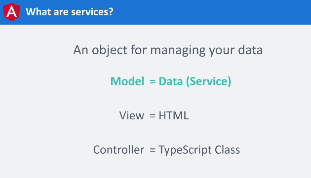

```bash
ng generate service services/modal
```

---

### Dependency injection

- it's a system that does 2 things:

  - looks in the `[providers] array in the component` and creates instences(objects) from the service-class so that it can be used in other components
  - pass them on to our classes

- we don't create instances manually as Angular creates them **automatically**
  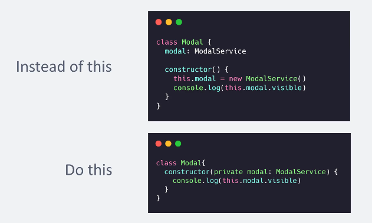

- in each component that uses the service, instead of creating one instance of the same class for each component, --> we use `Singleton`
  - `Singleton` is a **creational design pattern** that lets you ensure that a class has only one instance, while providing a global access point to this instance. more [here](https://refactoring.guru/design-patterns/singleton)
    

---

#### `Highrarical injection`

if service is initiates in a parent component -> it will be available for all of its children

- Highest component is the `app.module.ts` not `app.component.ts`
  - so to apply a service to the whole app you should inject it in the module-file

---

#### `@injectable`

- The injector is the main mechanism. Angular creates an application-wide injector for you during the bootstrap process, and additional injectors as needed. You don't have to create injectors.
- An injector creates dependencies and maintainsacontainer of dependency instances that it reuses, if possible.
- Aprovider is an object that tells an injector how to obtain or createadependency

---

## Forms

Angular provides two different approaches to handling user input through forms: `reactive` and `template-driven`. Both capture user input events from the view, validate the user input, create a form model and data model to update, and provide a way to track changes.

|                     | `REACTIVE`                                    | `TEMPLATE-DRIVEN`                                                 |
| ------------------- | --------------------------------------------- | ----------------------------------------------------------------- |
| Setup of form model | Explicit, created in component class manually | Implicit, created by directives (the class is created by Angular) |
| Data model          | Structured and immutable                      | Unstructured and mutable                                          |
| Data flow           | Synchronous                                   | Asynchronous                                                      |
| Form validation     | Functions                                     | Directives                                                        |
| Scalability         | Scalable                                      | better for small forms                                            |
| Selector            | `[FormGroup]` directive                       | `[ngForm]` directive                                              |

---

### TEMPLATE-DRIVEN Forms

- `ngModel` directive **with 2-way-binding** is added to the `input element`
- a local-reference equal to `ngModel` is added to the `input element`

```html
<input [(ngModel)]="credentials.password" #email="ngModel" />
```

---

## RxJS

It's a `library` for filtering,sorting and coordinating data.

### Observables

they are wrappers around a data-source

### `imperative approch`

```ts
import { Observable } from "rxjs";

const observable = new Observable((subscriber) => {
  subscriber.next(1);
  subscriber.next(2);
  subscriber.next(3);
  setTimeout(() => {
    subscriber.next(4);
    subscriber.complete(); // form memory-leak
  }, 1000);
});

observable.subscribe({
  next: (value) => {
    console.log(value);
  },
  complete:()==>{
    console.log("complete called!");
  },
  error: (err)=>{
    console.error(err)
  }
});
```

### `Declarative approch`

it uses [Operators](https://rxjs.dev/guide/operators)

- it uses operators(functions)

```ts
import { interval } from "rxjs";

  const observable = interval(1000)

  observable.subscribe({
    console.log // just that simple!
  });
```

#### Flattening Operators

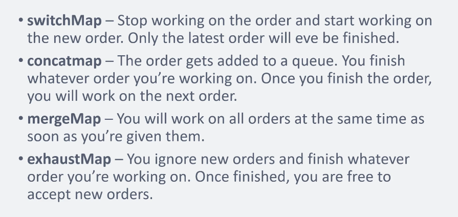

---

## Notes

### `Expressions` vs `String Interpolation`

- `Expressions` : the code inside `{{}}`
- `String Interpolation` : the process of replacing placeholders(expressions) into string values
- Angular handles expressions in `{{expression}}`

```ts
// in app.module.ts
export class AppModule {
  name = "John";
  imgURL = "url of img";
}

// in app.component.html
<p>hello {{ name }}</p>; // no need for this-keyword

 // Property Binding
<button (click)="onSave()">Save</button> // event binding

```

---

## Router

- Import `RouterModule` and `Routes` into your `routing module`.
- Each route in this array is a JavaScript object that contains two properties. The first property, path, defines the URL path for the route. The second property, component, defines the component Angular should use for the corresponding path.

```ts
// in app-routing.module.ts

const routes: Routes = [{ path: "first-component", component: FirstComponent }]; // sets up routes constant where you define your routes
```

- Html Template with

  - `routerLink` : to specify the link ( **instead of `href`** )
  - `routerLinkActive` : it's an attribute directive that applies a class if the router link is matched
  - `[routerLinkActiveOptions]="{exact:true}"` to prevent `Partial Matching Routes` to make it exact route **usually with route("/")**
  - `router-outlet` : place holder for the component that will show based on the router link

  ```html
  <h1>Angular Router App</h1>
  <!-- This nav gives you links to click, which tells the router which route to use (defined in the routes constant in  AppRoutingModule) -->
  <nav>
    <ul>
      <li>
        <a routerLink="/first-component" routerLinkActive="blue-text"
          >First Component</a
        >
      </li>
    </ul>
  </nav>
  <!-- The routed views render in the <router-outlet>-->
  <router-outlet></router-outlet>
  ```

---

### RouterModule.`forRoot`(ROUTES) vs RouterModule.`forChild`(ROUTES)

- `forRoot` is the method that configures the root routing module for your app. When called, you are asking Angular to instantiate an instance of the Router class `globally`.

  - it also provides the `AppRoutingModule` to import all of your child routes.

- `forChild` : When you are using the forChild static method, you are basically telling Angular, "**There is already a Router instance available in the app so please just register all of these routes with that instance.**". The forChild static method is useful by allowing you to maintain `separation of concerns` within your app.

---

### Generating Router Module

```sh
# To include the router inside of your new app
ng g module <Module_name> --routing
```

---

### navigating to route programatically

```ts
// inside a function
router.navigateByUrl("/");
```
