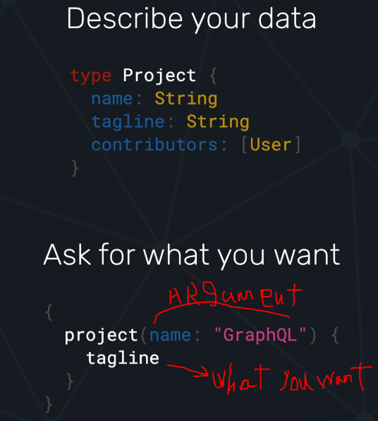
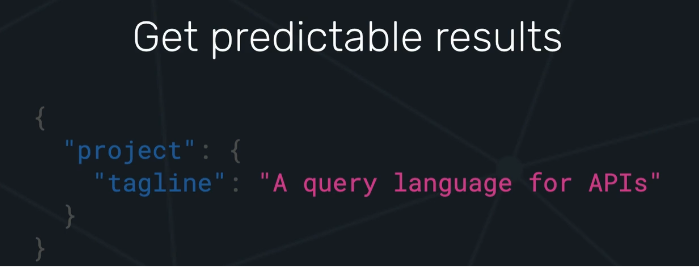

# INDEX

- [INDEX](#index)
  - [GraphQL](#graphql)
  - [GraphQL Vs. REST APIs](#graphql-vs-rest-apis)
  - [Using Node \& Express](#using-node--express)
    - [Install Dependencies](#install-dependencies)
    - [Node Code using graphql.buildSchema](#node-code-using-graphqlbuildschema)
    - [Node Code using @graphql-tools/schema](#node-code-using-graphql-toolsschema)
  - [GraphQL with React](#graphql-with-react)

---

## GraphQL

GraphQL is an open-source data query and manipulation language for APIs, and a runtime for fulfilling queries with existing data.

- GraphQL uses a strongly typed system to define the capabilities of an API. All the types that are exposed in an API are written down in a schema using the GraphQL Schema Definition Language (SDL) and/or code-first.




---

## GraphQL Vs. REST APIs

`GraphQL` is a specification, a query language, while `REST` is an architectural concept for network-based software.

- it enables frontend to ask for data in the shape he wants and not be restricted by the schema in the backend

- One of the most common limitations of REST out-of-the-box is that of `overfetching` and `underfetching`.

  - `Overfetching` means getting more information than you need and the frontend needs to `filter` the responses from the server.

    - if the endpoint holds data on burgers available at a restaurant, you’d hit the /burgers endpoint, and instead of only getting the names that you’re interested in, you may get everything that endpoint has to offer - including price, ingredients, calories, etc.

  - `underfetching` means we lose time as the each request doesn't give full information so we need to do more requests


---

## Using Node & Express

### Install Dependencies

```bash
# JavaScript reference implementation for GraphQL, a query language for APIs created by Facebook.
npm i graphql

# Create a GraphQL HTTP server with any HTTP web framework that supports connect styled middleware
npm i express-graphql

# or
npm i @graphql-tools/schema
```

### Node Code using [graphql.buildSchema](https://graphql.org/graphql-js/utilities/#buildschema)

```js
const { buildSchema } = require('graphql');
const { graphqlHTTP } = require('express-graphql'); //  middleware function that resposd to graphq queries

const schema = buildSchema(`
type Query {
  description: String
  price: Float
}
`);

const root = {
  description: 'Red Shoe',
  price: 42.12
};

// middleware connection POST-ENDPOINT
app.use(
  '/shoeStore',
  graphqlHTTP({
    schema: schema,
    rootValue: root
  })
);
```

---

### Node Code using [@graphql-tools/schema](https://www.npmjs.com/package/@graphql-tools/schema)

- `buildSchema` is from the official graphql-js package and `makeExecutableSchema` is from `Apollo`

  - `buildSchema` builds a schema object from schema language. It takes just one big string of Type definitions as an argument.

  - `makeExecutableSchema` combines schema and resolvers to make executable schema. It's part of a `graphql-tools` package that makes it easier to use the schema language while also writing resolvers.
    - So you define types and resolvers and pass them to makeExecutableSchema. You can pass an array of Schema definitions to it so that way you could merge multiple schemas together, modularize it.

```js
const { makeExecutableSchema } = require('@graphql-tools/schema');
const { loadFilesSync } = require('@graphql-tools/load-files');
const path = require('path');

const typesArray = loadFilesSync(path.join(__dirname, '**/*.graphql')); // get all graphq files into an array

const schema = makeExecutableSchema({
  typeDefs: typesArray
});
```

---

## GraphQL with React

[Guide-1](https://www.pluralsight.com/guides/how-to-set-up-graphql-in-a-react-app)
[Guide-2](https://www.smashingmagazine.com/2021/11/graphql-frontend-react-apollo/)
