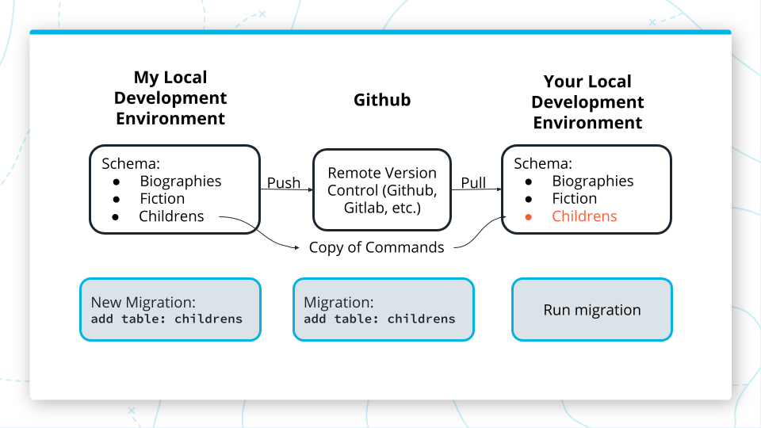
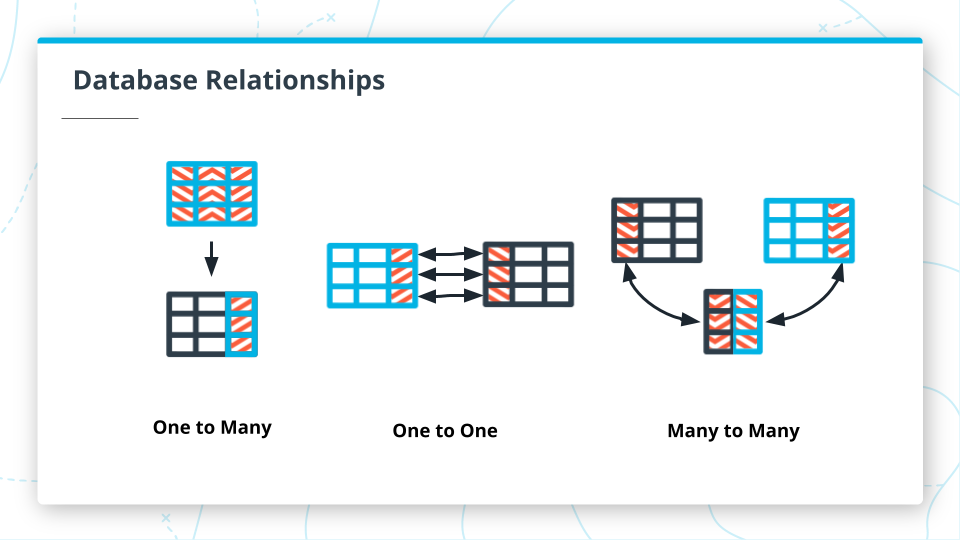

# INDEX

- [INDEX](#index)
  - [PostgreSQL](#postgresql)
    - [Postgres server](#postgres-server)
    - [psql CLI](#psql-cli)
    - [pgAdmin](#pgadmin)
  - [Environment Variables](#environment-variables)
  - [Connecting Node to a Postgres Database](#connecting-node-to-a-postgres-database)
  - [Migrations](#migrations)
    - [Instructions to install db-migrate](#instructions-to-install-db-migrate)
  - [Models](#models)
    - [Files and Folders](#files-and-folders)
    - [CRUD methods](#crud-methods)
    - [Testing Models](#testing-models)
      - [Steps](#steps)
  - [REST](#rest)
    - [Routes to Models](#routes-to-models)
    - [JWT](#jwt)
  - [SQL Relationships](#sql-relationships)
    - [Many to many](#many-to-many)
    - [Join Queries](#join-queries)
    - [Services](#services)

---

## PostgreSQL

It is a relational database management system (RDBMS) that uses the SQL (Structured Query Language) querying language to interact with data.

- `postgres server` is the software that manages the database and allows other programs to interact with it.
- `postgres database` is a collection of tables and other data structures that are organized in a way that makes it easy to access and manage the data.
- `postgres client` is a program that allows you to interact with the database.
  - The client we will use is called `psql` and it is a command line interface (CLI) for postgres.
  - another client is `pgAdmin` which is a `GUI` for postgres.

### Postgres server

- The postgres server is the software that manages the database and allows other programs to interact with it.
- It runs in the background and listens for requests from other programs.
- a pg server can manage multiple databases at the same time.
  - having multiple databases is useful for:
    - separating data and permissions.
    - working with more than one application.
    - working with different versions of the same application.

---

### psql CLI

- If you already know the name of the database you want to connect to, you can write `psql name_of_database`

  ```bash
  psql <name_of_database>

  # that would be equivalent to
  psql postgres
  \c <name_of_database>
  ```

- Common psql commands

  - Create user : `CREATE USER full_stack_user WITH PASSWORD 'password123';`
  - open psql: `psql postgres`
  - commands with `\` are called **meta-commands** : they are `system-level commands`
  - `\l` List databases
  - connect to a database: `\c <database_name>`
  - create a new database: `create database <database_name>`
  - get out of psql: `\q`
  - display tables in the database : `\dt`

- [Create a Superuser in postgres](https://stackoverflow.com/questions/57975093/create-a-superuser-in-postgres)

  - do this after

- Command to create a new table:

  ```sql
  <!-- structure -->
  CREATE TABLE [IF NOT EXISTS] <table_name> (
  column1_name column1_datatype,
  column2_name column2_datatype,
  column2_name column2_datatype
  );

  <!-- Example -->
  CREATE TABLE Plants (
    id SERIAL PRIMARY KEY,
    name VARCHAR(100),
    description text,
    indiveduals integer,
    date date);
  ```

- `SERIAL PRIMARY KEY` : A table column whose values are an auto incrementing number and are guaranteed to
  be unique to each row
- If you already know the name of the database you want to connect to, you can write `psql name_of_database` and that would be equivalent to `psql postgres` `\c name_of_database`
  - `psql <database name> <username>` --> to connect to database as user ..

---

### pgAdmin

- pgAdmin is a GUI for postgres, it's used to manage and interact with databases.
- It can connect to a local or remote database.

---

## Environment Variables

Working with sensitive information can be hard, especially when your application relies on keys and passwords in order to connect to and access databases or APIs. so we add a `library for environment variables` in Node so that we can safely store information away from public eyes without moving it out of reach.

- The library we will use for environment variables is called `dotenv` ---> [dotenv](https://github.com/motdotla/dotenv)
- Make a new file called `.env` in the root of the project.

- put the variables names in the `.env` file

  ```js
  POSTGRES_HOST=127.0.0.1
  POSTGRES_DB=full_stack_dev
  POSTGRES_USER=full_stack_user
  POSTGRES_PASSWORD=password123
  ```

- The `.env` file hides sensitive information and makes it available to our application via a variable, so it holds a lot of really important, secret information. Information we don't want shared **even in a respository**.
  - If a `gitignore` file exists in your project add the .env file there.
  - If you include your `.env` file in a public repository, you have completely negated the purpose of adding environment variables.

---

## Connecting Node to a Postgres Database

- create Database connection file --> `database.ts`
- install `pg`, `dotenv`

  - information to connect to a database
    - database location, database name
    - username, password
  - The `dotenv.config()` ->You can't access the env vars unless this line exists in your code, it typically goes as close to the beginning of the program as possible.

  ```ts
  import dotenv from 'dotenv';
  import { Pool } from 'pg';

  dotenv.config(); // initialize the environment variables

  // getting the information needed to connect to the database
  const { POSTGRES_HOST, POSTGRES_DB, POSTGRES_USER, POSTGRES_PASSWORD } = process.env;

  // connection to database, we'll call it "client"
  const client = new Pool({
    host: POSTGRES_HOST,
    database: POSTGRES_DB,
    user: POSTGRES_USER,
    password: POSTGRES_PASSWORD
  });

  export default client; // to be used to establish connection to database
  ```

---

## Migrations

Migrations are a record of a **changes** made to the `schema` of a database.

- Migrations contain instructions for how to enact and rollback a specific change to the database




- npm library we will use for database migrations: [DB-migrate](https://github.com/db-migrate/node-db-migrate)

### Instructions to install db-migrate

- ```bash
  npm install -g db-migrate  # globally to use its terminal comands
  npm install db-migrate db-migrate-pg  # create dependencies
  ```

- Add a `database.json` reference file in the root of the project.

  - this will allow us to specify what database we want to run migrations on

  ```json
  {
    "dev": {
      "driver": "pg",
      "host": "127.0.0.1",
      "database": "fantasy_worlds",
      "user": "magical_user",
      "password": "password123"
    },
    "test": {
      "driver": "pg",
      "host": "127.0.0.1",
      "database": "fantasy_worlds_test",
      "user": "test_user",
      "password": "password123"
    }
  }
  ```

- Create a migration

  ```bash
  # run this in terminal
  db-migrate create <table_name> --sql-file
  ```

- Add the SQL you need to the `up` and `down` sql files
  - Bring the migration up `db-migrate up`
  - Bring the migration down `db-migrate down`

---

## Models

- as all rows in a table have the same schema so we can treat:
  - `table` as a `Class`
  - `row` as a `instance of the class`
- performs `CRUD` operations on the database from within a Node program.

### Files and Folders

- `models` folder contains tables as each `js` file in it is for a table (class)
- The directory structure should look like this:
  `src --> models --> book.ts`

- Database table will hold many books, but **the model file is defining what a book is for our application**.
- The model is represented as a `class`
- Each book `row` in the database will be an `instance` of the book model.

---

### CRUD methods

- Example

```ts
import Client from '../database'; // Responsible for database connection

// type for the class
export type Book = {
  id: number;
  title: string;
  author: string;
  totalPages: number;
  summary: string;
};

export class BookStore {
  async index(): Promise<Book[]> {
    try {
      // @ts-ignore
      const conn = await Client.connect(); // Open connection
      const sql = 'SELECT * FROM books';

      const result = await conn.query(sql);

      conn.release(); // Close connection

      return result.rows;
    } catch (err) {
      throw new Error(`Could not get books. Error: ${err}`);
    }
  }

  async show(id: string): Promise<Book> {
    try {
      const sql = 'SELECT * FROM books WHERE id=($1)';
      // @ts-ignore
      const conn = await Client.connect();

      const result = await conn.query(sql, [id]);

      conn.release();

      return result.rows[0];
    } catch (err) {
      throw new Error(`Could not find book ${id}. Error: ${err}`);
    }
  }

  async create(b: Book): Promise<Book> {
    try {
      const sql =
        'INSERT INTO books (title, author, total_pages, summary) VALUES($1, $2, $3, $4) RETURNING *';
      // @ts-ignore
      const conn = await Client.connect();

      const result = await conn.query(sql, [b.title, b.author, b.totalPages, b.summary]);

      const book = result.rows[0];

      conn.release();

      return book;
    } catch (err) {
      throw new Error(`Could not add new book ${title}. Error: ${err}`);
    }
  }

  async delete(id: string): Promise<Book> {
    try {
      const sql = 'DELETE FROM books WHERE id=($1)';
      // @ts-ignore
      const conn = await Client.connect();

      const result = await conn.query(sql, [id]);

      const book = result.rows[0];

      conn.release();

      return book;
    } catch (err) {
      throw new Error(`Could not delete book ${id}. Error: ${err}`);
    }
  }
}
```

---

### Testing Models

`integration test` checks how the individual pieces of your application logic work together. The span of one integration test will cover multiple chunks of code (that can and should each have their own unit tests) and make sure that working correctly together in a flow or process.

#### Steps

1. Create the database

   - add a new database called `full_stack_test`

2. Add the Environment Variable
   - We need a new variable called `ENV` to the `.env file`.
   - Set `ENV=dev` so that the default environment is development.
3. Update the database connection file (database.ts)

   ```ts
   import dotenv from 'dotenv';
   import { Pool } from 'pg';

   dotenv.config();

   const { POSTGRES_HOST, POSTGRES_DB, POSTGRES_USER, POSTGRES_PASSWORD, POSTGRES_TEST_DB, ENV } =
     process.env;

   let client;
   console.log(ENV);

   if (ENV === 'test') {
     client = new Pool({
       host: POSTGRES_HOST,
       database: POSTGRES_DB,
       user: POSTGRES_USER,
       password: POSTGRES_PASSWORD
     });
   }

   if (ENV === 'dev') {
     client = new Pool({
       host: POSTGRES_HOST,
       database: POSTGRES_TEST_DB,
       user: POSTGRES_USER,
       password: POSTGRES_PASSWORD
     });
   }

   export default client;
   ```

4. Write the tests

   ```ts
   import { Book, BookStore } from '../book';

   const store = new BookStore();

   describe('Book Model', () => {
     // test if the method exists
     it('should have an index method', () => {
       expect(store.index).toBeDefined();
     });

     it('create method should add a book', async () => {
       const result = await store.create({
         title: 'Bridge to Terabithia',
         total_pages: 250,
         author: 'Katherine Paterson',
         type: 'Childrens'
       });
       expect(result).toEqual({
         id: '1',
         title: 'Bridge to Terabithia',
         total_pages: 250,
         author: 'Katherine Paterson',
         type: 'Childrens'
       });
     });

     // check for specific array result
     it('index method should return a list of books', async () => {
       const result = await store.index();
       expect(result).toEqual([
         {
           id: '1',
           title: 'Bridge to Terabithia',
           total_pages: 250,
           author: 'Katherine Paterson',
           type: 'Childrens'
         }
       ]);
     });

     it('show method should return the correct book', async () => {
       const result = await store.show('1');
       expect(result).toEqual({
         id: '1',
         title: 'Bridge to Terabithia',
         total_pages: 250,
         author: 'Katherine Paterson',
         type: 'Childrens'
       });
     });

     it('delete method should remove the book', async () => {
       store.delete('1');
       const result = await store.index();

       expect(result).toEqual([]);
     });
   });
   ```

5. Add the tset script

   ```json
   "test": "ENV=test db-migrate --env test up && jasmine-ts && db-migrate db:drop test",
   ```

---

## REST

### Routes to Models

in `restfull` architecture each entity or model in the app gets its own set of `RestFull routes`

```ts
// in helper file
import express, { Request, Response } from 'express'; // for Typescript
import { Article, ArticleStore } from '../models/article';

const store = new ArticleStore(); // new instance

// now we create CRUD functions

const index = async (_req: Request, res: Response) => {
  const articles = await store.index(); // get all articles
  res.json(articles);
};

const show = async (req: Request, res: Response) => {
  const article = await store.show(req.body.id);
  res.json(article);
};

const create = async (req: Request, res: Response) => {
  try {
    const article: Article = {
      title: req.body.title,
      content: req.body.content
    };

    const newArticle = await store.create(article);
    res.json(newArticle);
  } catch (err) {
    res.status(400);
    res.json(err);
  }
};

const destroy = async (req: Request, res: Response) => {
  const deleted = await store.delete(req.body.id);
  res.json(deleted);
};

// each route use one model
const articleRoutes = (app: express.Application) => {
  app.get('/articles', index);
  app.get('/articles/:id', show);
  app.post('/articles', create);
  app.delete('/articles', destroy);
};

export default articleRoutes; // to be used in the server file to have clean code
```

---

### JWT

- [npm jsonwebtoken](https://www.npmjs.com/package/jsonwebtoken)

- Creating `JWT` (Create JWT at user sign up)

  ```ts
  // handlers/users.ts

  // in helper file
  import express, { Request, Response } from 'express'; // for Typescript
  import { Article, ArticleStore } from '../models/article';
  const jwt = require('jsonwebtoken');

  const store = new ArticleStore(); // new instance

  // create method with JWT for Authorization
  const createNewUser = async (req: Request, res: Response) => {
    const user: User = {
      username: _req.body.username,
      password: _req.body.password
    };
    try {
      const newUser = await store.create(user);

      const token = jwt.sign({ user: newUser }, process.env.TOKEN_SECRET); // create a token

      res.json(token); // send the token so that it can be stored in the frontend and used for future-authorization with out API
    } catch (err) {
      res.status(400);
      res.json(err + user);
    }
  };

  export default articleRoutes; // to be used in the server file to have clean code
  ```

- Validating `JWT` (example to understand)

  ```ts
  // handlers/users.ts
  import express, { Request, Response } from 'express'; // for Typescript
  import { Article, ArticleStore } from '../models/article';
  const jwt = require('jsonwebtoken');

  const store = new WeaponStore(); // new instance

  const createNewWeapon = async (_req: Request, res: Response) => {
    const weapon: Weapon = {
      name: _req.body.name,
      type: _req.body.type,
      weight: _req.body.weight
    };

    // Validating the user's token to Authorize him to the next action
    try {
      jwt.verify(_req.body.token, process.env.TOKEN_SECRET);
    } catch (err) {
      res.status(401);
      res.json(`Invalid Token ${err}`);
    }

    try {
      const newWeapon = await store.create(weapon);
      res.json(newWeapon);
    } catch (err) {
      res.status(400);
      res.json(err);
    }
  };

  export default weaponsRoutes; // to be used in the server file to have clean code
  ```

- `Authorization: Bearer <token>`

  > Where `Bearer` is a string separated by the token with a space.

  ```js
  const authorizationHeader = req.headers.authorization;
  const token = authorizationHeader.split(' ')[1]; // Parsing the header
  ```

- Validating `JWT` (real life)

  ```ts
  // handlers/weapons.ts

  // middleware
  const verifyAuthToken = (req: Request, res: Response, next) => {
    try {
      const authHeader = req.headers.authorization;
      const token = authHeader.split(' ')[1];
      const decoded = jwt.verify(token, process.env.TOKEN_SECRET);

      next(); // !IMPORTANT
    } catch (error) {
      res.status(401);
    }
  };

  const create = async (req: Request, res: Response) => {
    //....rest of method is unchanged
  };

  // using the middleware function
  const mount = (app: express.Application) => {
    app.get('/users', index);
    app.get('/users/:id', show);
    app.post('/users', verifyAuthToken, create);
    app.put('/users/:id', verifyAuthToken, update);
    app.delete('/users/:id', verifyAuthToken, destroy);
  };

  export default mount;
  ```

---

## SQL Relationships



### Many to many


---

### Join Queries

```sql
SELECT * FROM products INNER JOIN order_products ON product.id = order_products.id;
```

---

### Services

- This `JOIN` query is **business logic** that does not belong in any model or handler, so we are going to put it in a new place, called a `service`.

- `service file` is a place to write extra business logic that does not belong in a handler or a model or orchestrates changes with multiple models.

- `services` -> `dashboard.ts`

  - Here, we can add various methods that get information from the database in the form of specialized select queries or joins.

  - The dashboard will run SQL queries to `READ` information from the database, but any actions on the database should be done through a `model`.

  - This dashboard file is simply allowing us to isolate our informational queries together in one place, rather than spread them out across all the models.

- We import the database client and create a connection in the method just like a model, because this service is running queries on the database, they will just be READ-ONLY queries, instead of updating tables, so this is ok.

```ts
// src/services/dashboard.ts --> orderedProducts

import Client from '../database';

export class DashboardQueries {
  // Get all products that have been included in orders
  async productsInOrders(): Promise<{ name: string; price: number; order_id: string }[]> {
    try {
      //@ts-ignore
      const conn = await Client.connect();
      const sql =
        'SELECT name, price, order_id FROM products INNER JOIN order_products ON product.id = order_products.id';

      const result = await conn.query(sql);

      conn.release();

      return result.rows;
    } catch (err) {
      throw new Error(`unable get products and orders: ${err}`);
    }
  }
}
```

- We will create a separate `handler file` for these methods.

  ```ts
  // src/handlers/dashboardHandlers.ts

  import express, { Request, Response } from 'express';

  import { DashboardQueries } from '../services/dashboard';

  const dashboard = new DashboardQueries();

  const productsInOrders = async (_req: Request, res: Response) => {
    const products = await dashboard.productsInOrders();
    res.json(products);
  };

  const usersWithOrders = async (_req: Request, res: Response) => {
    const users = await dashboard.usersWithOrders();
    res.json(users);
  };

  const dashboardRoutes = (app: express.Application) => {
    app.get('/products-in-orders', productsInOrders);
    app.get('/users-with-orders', usersWithOrders);
  };

  export default dashboardRoutes;
  ```
