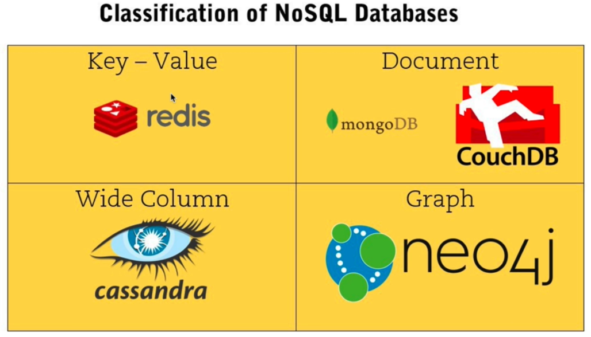

# INDEX

- [INDEX](#index)
  - [Redis](#redis)

---

## Redis

It's an open source **in-memory** database used to build **high performance, scalable** web applications.

- It's a `NoSql` database (`key-value` store)
  
- It's a `in-memory` database, meaning that:

  - It's used for short-lived data (like **sessions**)
    - data might be lost if the server crashes (not a concern because it's used for short-lived data), so we may sacrifice **durability** for **speed**
  - data stored is small (because it's stored in memory not on disk)
  - It's really fast

- usually used with cached data like sessions
  - **sessions**: have data for specified time then it expires
  - example: **JWT**
    - it's a token that has data about the user
    - is can be stored as a session in redis (because it's short-lived data)
- when you have small data that you want to access
