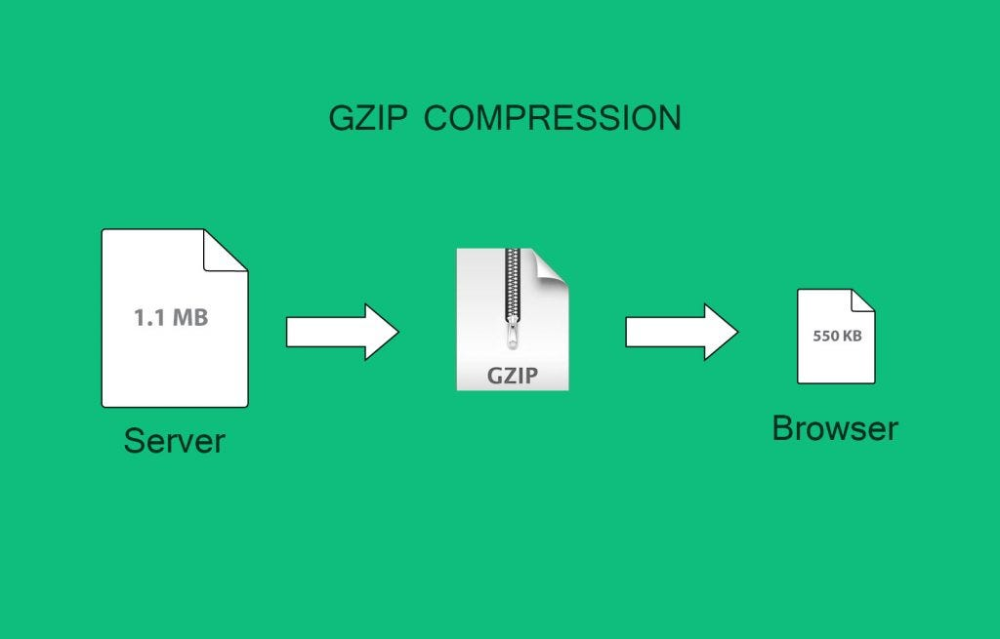

# INDEX

- [INDEX](#index)
  - [Using CDN](#using-cdn)
  - [Compression (GZIP)](#compression-gzip)
  - [Database Enhancements](#database-enhancements)
  - [Caching](#caching)
  - [Using a Load Balancer](#using-a-load-balancer)

---

## Using CDN

- It's a network of servers that deliver cached static content from websites to users based on the geographic locations of the user
- It's more related to performance on the backend side more than the frontend side
- It's used to reduce the load on the server and improve the performance of the website by **reducing the latency** and the number of requests to the server
  - It's used to cache the files and serve them to the users from the nearest server to them

---

## Compression (GZIP)

- It's a method of compressing files (`HTML`, `CSS`, `JS`) on the server before sending them to the browser
  
- You can check the headers of the response to see if the server is using `gzip` or not
  
- It reduces the size of the files and the time needed to transfer them to the browser

---

## Database Enhancements

- Identify inefficient queries
- Increase memory, which will increase the speed of the database queries
- Use `indexes` to speed up the queries
- Vertical scaling : increase the power of the server
- Sharding : splitting the database into multiple servers to reduce the load on each server
- Database type : use the database that fits your needs

---

## Caching

- It's the process of storing data in a cache
- It uses services that depend on storing on `RAM` or `Disk`

---

## Using a Load Balancer

- It's a device that acts as a reverse proxy and distributes network or application traffic across a number of servers
- It's used to increase the capacity and reliability of applications, thus improving the overall performance of applications

---

[⬆ back to top](#index)
