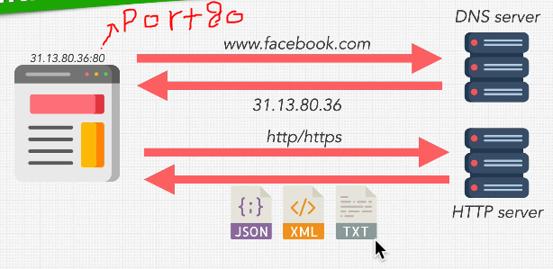
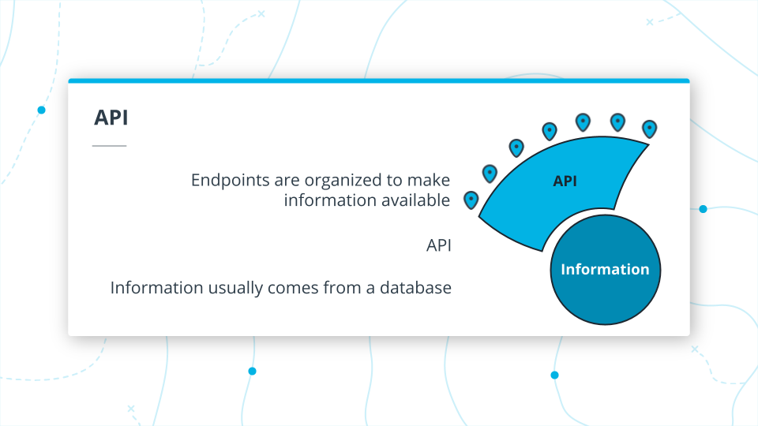

# INDEX

- [INDEX](#index)
  - [Web Server](#web-server)
  - [Backend](#backend)
    - [API](#api)
  - [How Does a Server Work?](#how-does-a-server-work)
    - [Common HTTP Requests](#common-http-requests)
    - [Query parameters](#query-parameters)
    - [HTTP Request](#http-request)
    - [HTTP Response](#http-response)
      - [HTTP Response Status Codes](#http-response-status-codes)
  - [same origin policy ( SOP ) \& CORS](#same-origin-policy--sop---cors)
    - [Origin](#origin)
    - [SOP](#sop)
    - [Cross-Origin Resource Sharing (CORS)](#cross-origin-resource-sharing-cors)
      - [The Problem with CORS](#the-problem-with-cors)
    - [Idempotency](#idempotency)
      - [Idempotency and Security](#idempotency-and-security)
  - [REST / RESTFULL API](#rest--restfull-api)
    - [REST](#rest)

---

## Web Server




---

## Backend

- The backend is responsible for processing the requests that come into the app and managing its data.

  

- we don't do all this in the `client-side` because we have things in server that shouldn't be done in browser like `security`,`transactions`,`authentication`

- **Backend** Consists of Three Parts:
  - `server` : the computing resource that listens to requests from the frontend
  - `Application` : code that runs on the server to process requests and return responses
  - `database` : the part of the backend that is responsible for storing and organizing data

---

### API

An API is the interface or gateway through which we interact with an external program or data set.



---

## How Does a Server Work?

### Common HTTP Requests

| GET    | retrieves data from the server |
| ------ | ------------------------------ |
| POST   | sends data to the server       |
| DELETE | removes data from the server   |
| PUT    | replaces data on the server    |
| PATCH  | updates data on the server     |

### Query parameters

- Query strings are parameters in the URL, identified by a `?`
- To chain multiple parameters together in a query string, use `&`


---

### HTTP Request


---

### HTTP Response


#### HTTP Response Status Codes


---

## same origin policy ( SOP ) & CORS

**The Same Origin Policy (SOP)** allows a browser to restrict access to resources relating to one origin to being permitted only via other resources from that same origin. (by default that is the behavior configured in browsers)

- both pages must agree for data exchange and must contain special JavaScript code that handles it.

- usually when using client-side on a port & server-side on another port
  - `React` : port3000
  - `node` : port8000

### Origin

- it's combination of (domain, scheme, or port)
- whenever one of these 3 changes, we get a different `origin`
  
  - even if the backend & the frontend are from the same `host`, like `localhost`, but they have different ports (`3000` & `8000`), this will result CORS error

---

### SOP

- when you browse `google`, the request for `facebook` will be denied unless `google` allows it with the use of `CORS`
- this is used for protecting data
  

---

### Cross-Origin Resource Sharing (CORS)

- It's an important factor in making and handling API requests
- It's an **HTTP-header** based mechanism that allows a server to indicate any `origins` other than its (own origin (in the URL)) from which a browser should permit loading resources.
  

  - in the image we have 2 options :
    - to make access for all sites `*`
    - to make access to specific websites only `list of sites`

- it uses `whitelisting` instead of `blacklisting`
  - `whitelisting`: is the practice of explicitly allowing access to a particular privilege or service.
- We can use CORS as a `middleware` on a route by route basis in `EXPRESS` --> [cors](https://www.npmjs.com/package/cors)
- **You don't need it if your `frontend` & `backend` have the same domain**

#### The Problem with CORS

The most visible problem with **CORS**, besides security, is the impact on the performance in web apps. When your frontend sends an HTTP request to a different domain or subdomain, the browser will send an additional HTTP called **"preflight request"**, to see whether the server accepts messages from the sender’s domain.

So for each HTTP request triggered by the frontend, the browser needs to send two HTTP requests, increasing the overall response time. In most cases, the added delay is visible in web apps and adversely affects user experience.

---

### Idempotency

- A request is said to be idempotent when making multiple requests to the API that are `identical` produce the same result.

- The only method not considered idempotent is `POST`

- `POST` adds a new resource each time; on the other hand, `GET`, `DELETE`, `PATCH`, and `PUT` act on the same resource each time with the same result.

#### Idempotency and Security

- `Get`:

  - Safe because the database doesn’t change
  - Endpoint is stored in session history
  - Can be cached
  - Often logged

- `Post`:
  - Endpoint not stored in session history
  - Protects user data from being inadvertently exposed

---

## REST / RESTFULL API


### REST

- `REST` : a pattern for organizing API endpoints
- There are five actionable RESTful routes for APIs:

  | URL `ROUTE`            | CRUD   | REST      |
  | ---------------------- | ------ | --------- |
  | GET `['/cats']`        | SHOW   | READ(ONE) |
  | GET `['/cats/:id']`    | INDEX  | READ(All) |
  | POST `['/cats']`       | CREATE | CREATE    |
  | PUT `['/cats/:id']`    | UPDATE | EDIT      |
  | DELETE `['/cats/:id']` | DELETE | DELETE    |

  - `INDEX` : gets a list of all items of the requested type
    - `GET ['/cats']`
  - `SHOW` : gets a single item back by specifying an id

    - `GET ['/cats/:id']`
    - ex :

      ```ts
      app.get('/articles/:id', (_req: Request, res: Response) => {
        try {
          res.send('this is the SHOW route');
        } catch (err) {
          res.status(400);
          res.json(err);
        }
      });
      ```

- `CREATE` :
  - `POST ['/cats']`
- `EDIT` :
  - `PUT ['/cats/:id']`
- `DELETE` :
  - `DELETE ['/cats/:id']`

---

[⬆ back to top](#index)
