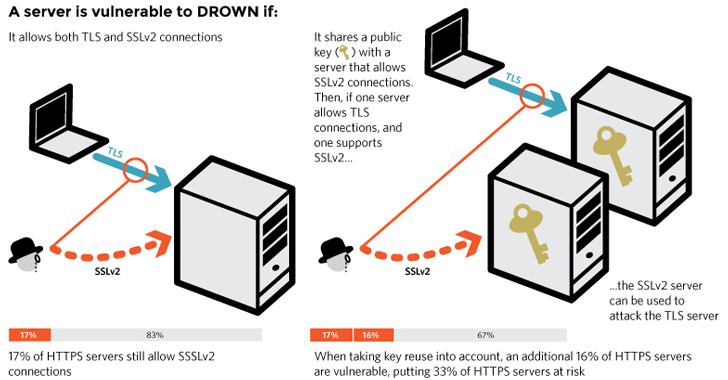

# INDEX

- [INDEX](#index)
  - [SSL, TLS and HTTPS](#ssl-tls-and-https)
    - [TLS Certificates](#tls-certificates)
    - [HTTPS with Node](#https-with-node)
  - [CORS with `node.js`](#cors-with-nodejs)
  - [Database Security](#database-security)
    - [Protecting Passwords (AUTHENTICATE)](#protecting-passwords-authenticate)
    - [`Hashing`](#hashing)
      - [`salt`](#salt)
  - [Authentication using JWT](#authentication-using-jwt)
    - [How JWT Works](#how-jwt-works)
    - [JSON Web Tokens (JWT) in depth](#json-web-tokens-jwt-in-depth)
    - [How Verifying JWT Works (Signing the JWT)](#how-verifying-jwt-works-signing-the-jwt)
      - [BE-Side](#be-side)
      - [FE-Side](#fe-side)
    - [Implementing JWT](#implementing-jwt)
  - [Authorization](#authorization)
    - [API Key](#api-key)
    - [Cookie-vs-Token](#cookie-vs-token)
    - [Sessions](#sessions)
  - [Oath2](#oath2)
    - [OAuth 2.0 With Google](#oauth-20-with-google)
      - [Passport.js](#passportjs)
  - [Security Best Practices](#security-best-practices)
    - [Compromised Database](#compromised-database)
    - [Brute Force Attacks](#brute-force-attacks)
    - [Cross-Site Scripting (XSS) Attacks](#cross-site-scripting-xss-attacks)
      - [Helmet](#helmet)
    - [Denial of Service (DOS) Attacks](#denial-of-service-dos-attacks)
    - [NOSQL Query Injection](#nosql-query-injection)
    - [Other Best Practices](#other-best-practices)

---

## SSL, TLS and HTTPS

- `SSL` stands for **Secure Sockets Layer** and, it's the standard technology for keeping an internet connection secure and safeguarding any sensitive data that is being sent between two systems, preventing criminals from reading and modifying any information transferred, including potential personal details. The two systems can be a server and a client or server to server

- `TLS` (**Transport Layer Security**) is just an updated, more secure, version of SSL. We still refer to our security certificates as SSL because it is a more commonly used term.

- `HTTPS` (**Hyper Text Transfer Protocol Secure**) appears in the URL when a website is secured by an SSL certificate.

### TLS Certificates


---

### HTTPS with Node



- video 184 for creating ssl-certificate using `openssl`, to use **HTTPS** with node

---

## CORS with `node.js`

- [npm cors](https://www.npmjs.com/package/cors)

```js
// in app.js file
const cors = require('cors');

// CORS
const corsOptions = {
  origin: 'http://localhost:3001',
  optionsSuccessStatus: 200 // some legacy browsers (IE11, various SmartTVs) choke on 204
};

// ---------------Middlewares--------------- //
app.use(cors(corsOptions)); // global Middleware to all routes
```

---

## Database Security

### Protecting Passwords (AUTHENTICATE)

- In case you have passwords in the database:
  - Never store plain text passwords! Not in the database and not in your code
- `Password Hashing` and `Salt` obscure passwords, so raw password strings are never stored or persisted

---

### `Hashing`


- hashed password run through a **function** that generates a long encrypted string from the original password.
- same input will always result same output, this is a weakness of `reverse-lookup` where a `hash` can be compared against dictionary of hashes and their passwords ----> `salt` solves this problem
- `hashing functions` work on one way only (can't be reversed)
  - you can't put a `hash` input and get a `string` output
  - you can only put a `string` and get out a `hash`
- `Bcrypt` is a very common library for password hashing in web apps
  - when hashing, it usually has an argument for the `cost` of hashing (how cpu-intensive is the hashing process)

---

#### `salt`

- By adding `Salt`, an extra string sequence to the beginning or end of a password before hashing it which makes it much harder for attackers to decrypt passwords


- `bcrypt` hashing method with `salt` and `pepper`
- [npm bcrypt](https://www.npmjs.com/package/bcrypt)

- **Steps**:

  1. `.env file`

     ```bash
     BCRYPT_PASSWORD=speak-friend-and-enter # the extra string can be anything
     SALT_ROUNDS=10 I
     ```

  2. `model.js`

     ```ts
     // in the class
     // create method
     async create(u: User): Promise<User> {
      try {
        // @ts-ignore
        const conn = await Client.connect()
        const sql = 'INSERT INTO users (username, password_digest) VALUES($1, $2) RETURNING *'

        // bcrypt
        const hash = bcrypt.hashSync(
          u.password + pepper,
          parseInt(saltRounds) // from data in .env above
        );
        // now we have the hashed-password to store in the database

        const result = await conn.query(sql, [u.username, hash])
        const user = result.rows[0]

        conn.release()

        return user
      } catch(err) {
        throw new Error(`unable create user (${u.username}): ${err}`)
      }
     };
     ```

     - or to `AUTHENTICATE`

     ```ts
     async authenticate(username: string, password: string): Promise<User | null> {
         const conn = await Client.connect()
         const sql = 'SELECT password_digest FROM users WHERE username=($1)'

         const result = await conn.query(sql, [username])

         console.log(password+pepper)

         if(result.rows.length) {

           const user = result.rows[0]

           console.log(user)

           if (bcrypt.compareSync(password+pepper, user.password_digest)) {
             return user
           }
         }

         return null
       }
     ```

---

## Authentication using JWT

> see Authentication section in the [database-notes file](../Databases/Database-SQL.md#jwt)

It's an **access token** which is like `api key` as it uniquely identify a specific user in an application, and then act as set of credentials for that user


**JWT:** is a stateless solution for authentication

> The most widely used alternative to authentication with JWT, is to store the user's log-in state on the server using [Sessions](#sessions)

- It's `Stateless`, so there's no need to store any session-state on the server which is perfect for Restful-APIs
- It's very useful when you have 2 or more separate servers or `load-balancers` that share the same `secret-key` and you can access them without having to `log in` each time
- It's based on **Modern Token Authentication** (Bearer Token)
  

---

### How JWT Works

The server creates `JWT` with a secret and sends the JWT to the client. The client stores the JWT (usually in local storage) and includes JWT in the header with every request. The server would then validate the JWT with every request from the client and sends response.


Steps:

1. user logs into the app. So the user's client starts by making a **post** request with the username or email and the password.
2. The application then checks if the user exists and if the password is correct.
3. And if so, a unique Json Web Token for only that user is created using a secret string that is stored on a server.
4. The server then sends that JWT back to the client which will store it either in a cookie or in local storage.
5. And just like this the user is authenticated and basically logged into our application **(without leaving any state on the server)**
   - So the server does in fact not know which users are actually logged in. But, the user knows that he's logged in because he has a valid Json Web Token

> **Note:** All this communication must happen over `HTTPS` in order to prevent that anyone can get access to passwords or JWT

---

### JSON Web Tokens (JWT) in depth

It's an encoded string made of 3 parts


- `Header`:

  - It's a meta-data about the token
  - consists of two parts: the type of the token, which is JWT, and the signing algorithm being used, such as `HMAC` `SHA256` or `RSA`.

- `Payload`:

  - It's the data encoded into the token
  - responsible for containing information specific to the currently authenticated user --> (who is making the request?) **NOT SECRET**

- `Signature` :
  - If the signature strings match, we can trust that the data within the JWT is **authentic**.
  - To create the signature part you have to take the encoded header, the encoded payload, a secret, the algorithm specified in the header, and sign that.
    
  - it's **SECRET**

The output is three Base64-URL strings separated by dots that can be easily passed in HTML and HTTP environments

- **Notes:**

  - the `header` and `payload` will be encoded but not encrypted, so anyone will be able to decode them and read them, so we can't store sensitive data here
  - the `signature` is created using the `header` and the `payload` and the (`secret` that is saved on the server)

- [JWT playground](https://jwt.io/)

---

### How Verifying JWT Works (Signing the JWT)

#### BE-Side


1. The signing algorithm takes the `header`, the `payload` and the `secret` to create a unique signature. Then together with the `header` and the `payload`, these signature forms the **JWT**, which then gets sent to the client.
2. once the server receives a JWT to grant access to a protected route, it needs to verify it in order to determine if the user really is who he claims to be
   - In other words, it will verify if no one changed the `header` and the `payload` data of the token.
   - this verification step will check if no third party actually altered either the `header` or the `payload` of the Json Web Token.
3. once the JWT is received, the verification will take it's `header` and `payload` and together with the secret that is still saved on the server, basically create a test `signature`. But the original signature that was generated
4. when the `JWT` was first created is still in the token, And that's the key for this verification.
5. Now all we have to do is to compare the test-signature with the original-signature.

   - If the test signature is the same as the original signature, then it means that the `payload` and the `header` have not been modified
   - And of course, if the two signatures are actually different, well, then it means that someone tampered with the data.
     - Usually by trying to change the `payload`.
     - But that third party manipulating the `payload` does of course not have access to the `secret`, so they cannot sign the JWT. And therefore, the verification will always fail

> **Note:** the TOKEN_SECRET should be kept as environment-variable and it **should be at least 32 characters**. You can use this command to generate a secret with a specified character-length:
>
> ```js
> node -e "console.log(require('crypto').randomBytes(256).toString('base64'));"
> ```

#### FE-Side

- When the user logs in, the server will send the `JWT` to the client, and the client will store it in the `local-storage`, `session-storage` or `cookie`

  - `local-storage` is the most common place to store the `JWT`
  - `session-storage` is a good place to store the `JWT` if you want to keep the user logged-in only for the current session
  - `cookie` is a good place to store the `JWT` if you want to keep the user logged-in for a long time

- After the user is logged-in, the client will send the `JWT` with every request to the server, and the server will verify the `JWT` and send the response

  - The `JWT` is usually sent in the `Authorization` header using this format:

    ```js
    // FE-side example of sending the jwt in the requests
    axios.defaults.headers.common['Authorization'] = `Bearer ${token}`;
    ```

  - In Node, we can locate the authorization header sent with a request like this:

    ```ts
    // BE-side example of getting the jwt from the requests
    const authorizationHeader = req.headers.authorization;
    const token = authorizationHeader.split(' ')[1]; // Parsing the header
    ```

---

### Implementing JWT

Using NPM library [jsonwebtoken](https://www.npmjs.com/package/jsonwebtoken)

- Usually handling `jwt` is done using `middleware` in the `routes` that we want to protect, ex: `requireAuth` middleware

  ```js
  // Middleware to protect routes
  exports.requireAuth = (req, res, next) => {
    const authorizationHeader = req.headers.authorization;
    const token = authorizationHeader.split(' ')[1]; // Parsing the header

    jwt.verify(token, process.env.TOKEN_SECRET, (err, decoded) => {
      if (err) {
        res.status(401).json({ error: 'Token is not valid!' });
      } else {
        req.decoded = decoded;
        next();
      }
    });
  };

  // in the routes
  router.get('/protected', requireAuth, (req, res) => {
    res.send('Hello World!');
  });
  ```

- creating user

  ```js
  exports.signup = catchAsync(async (req, res, next) => {
    // prevent anyone from logging-in as admin + allow only data we need
    const newUser = await User.create({
      name: req.body.name,
      email: req.body.email,
      password: req.body.password,
      passwordConfirm: req.body.passwordConfirm
    });

    const token = jwt.sign({ id: newUser._id }, process.env.JWT_SECRET, {
      expiresIn: process.env.JWT_EXPIRES_IN
    });

    res.status(201).json({
      status: 'success',
      token,
      data: {
        user: newUser
      }
    });
  });
  ```

- verifying the user
  - use the `jwt.verify` method
- in real life, the token will not be part of the request body. Instead, tokens live as part of the `request header`.

  - When we use JWTs, we pass them as a special header called the Authorization header using this format:

    ```js
    Authorization: Bearer <token>;
    ```

  - In Node, we can locate the authorization header sent with a request like this:

    ```ts
    const authorizationHeader = req.headers.authorization;
    const token = authorizationHeader.split(' ')[1]; // Parsing the header
    ```

- putting it all together

  ```ts
  const create = async (req: Request, res: Response) => {
      try {
          const authorizationHeader = req.headers.authorization
          const token = authorizationHeader.split(' ')[1]
          jwt.verify(token, process.env.TOKEN_SECRET)
      } catch(err) {
          res.status(401)
          res.json('Access denied, invalid token')
          return
      }

      ....rest of method is unchanged
  }
  ```

---

## Authorization

### API Key

is a code used to identify and authenticate an application or user.

- API keys are available through platforms, such as a white-labeled internal marketplace.
- They also act as a unique identifier and provide a secret token for authentication purposes.

---

HTTP is stateless. All the requests are stateless. However, there are situations where we would like our states to be remembered. To overcome the stateless nature of HTTP requests, we could use either a session or a token.

- There're 2 ways for user-authenticating
  - sessions
  - tokens
- The biggest difference here is that
  - in `JWT` : the user’s state is not stored on the server, as the state is stored inside the token on the `client side` instead.
  - in `sessions` : the server have to do additional step (make a request to the `database` to look up the session)
- Most of the modern web applications use JWT for authentication for reasons including scalability and mobile device authentication.

---

### Cookie-vs-Token

> More on cookies [here](../JavaScript/04-API.md#cookies)


There're pros and cons for each, and based on situation we choose what suits us, more on that [here](https://developer.okta.com/blog/2022/02/08/cookies-vs-tokens)

- **Web Token**:
  - It's an encoded `string` for storing data, used to transport data between the client and the server
    - digitally signed (can't modify the token or it will be invalid)
  - It's **stateless** (the server doesn't have to keep track of the user's state) because the token contains all the information needed to verify the user
  - We can have any data we want in the token (ex: user permissions, user roles, etc...), unlike cookies which are limited to `4KB`
  - It can serve native mobile apps, unlike `cookies` which are only for web apps that use a browser
  - Drawbacks:
    - The size of the token is usually larger than the size of a cookie which affects the speed of the requests
    - It stores sensitive data in the client-side and if stolen, it can be used to impersonate the user
    - It's not possible to invalidate a token (ex: when the user logs out), because the token is stored in the client-side
- **Cookies**:
  - It's a small piece of data stored in the browser and sent to the server with every request
  - It's sent automatically with every request
  - It's **stateful** (the server and the browser have to keep track of the user's state)
    - This requires session management on the server-side using a database like `Redis`
- **Stateless Authentication**:
  - the server doesn't actively keep track of who's logged in
  - a **token** is used to verify the user instead
    - the token is saved in the LocalStorage in the first auth request(login), and then it's sent in every request to the server when we request data related to the authenticated user (with the unique token)
      - > **Note:** when you have something in the local storage, you have to be aware that any script that runs on the browser will have access to the token in the local storage (search for this more)

---

### Sessions

**Sessions** are a way of storing data about current active user, ex: name of user, last page the user visited

- What we store in a session is data that we wouldn't want the user to modify in the browser directly, ex: user permissions
- the client can read and access data in sessions but can't modify it
- sessions have short life, and only kept during the time the user is interacting with it, unlike data in database which is permanent

  - sessions are tied to the specific browser and the temporary state of the application on that browser

- How to store sessions data
  - **server-side sessions**
    - lives in the server on a database and the sessions-data will get looked-up for each request that the user makes and potentially deleting it when the user logs-out or close the browser
    - in most cases we don't need to store the session in the server unless we have a very large session, which is good to be stored in a server-database
  - **client-side sessions** --> **Cookies**
    - lives in the browser's cookies


Here, the server will create a session for the user after the user logs in. The session id is then **stored on a cookie on the user’s browser**. While the user stays logged in, the cookie would be sent along with every subsequent request. The server can then compare the session id stored on the cookie against the session information stored in the memory to verify user’s identity and sends response with the corresponding state!

---

## Oath2

OAuth 2.0, which stands for "Open Authorization", is a standard designed to allow a website or application to access resources hosted by other web apps(ex: `google sign in`) on behalf of a user.

- It defines the flow (process) that goes behind the scenes when logging-in to a site like Google

> The problem that `Oath` tries to solve is that we want the users to access application without putting their passwords into untrusted sites

- Flow (Note: replace `okta` with `google` for more understanding)
  
- Different roles involved in the `Oath` process
  

- `OAuth 2.0` is an **authorization protocol** and NOT an authentication protocol.

  - it is designed primarily as a means of granting access to a set of resources, for example, remote APIs or user’s data.

- `Access Token` is a piece of data that represents the **authorization** to access resources on behalf of the end-user.
  - `JWT` format is often used

---

### OAuth 2.0 With Google

- [source](https://developers.google.com/identity/protocols/oauth2)
- Video 193

To use Oath with Node.js, we use `passport.js`

#### Passport.js

[passport_js](https://www.passportjs.org/) is authentication middleware for Node.js

- It's a NPM package that provide **authentication middleware** for Node.js

- It provides a common way for authentication regarding of the provider or flow you are using, it does so using some plugins (packages) that plug-in to `passport`, these packages are called **"Strategies"**
- We can make use of the multiple authentication strategies available [here](https://www.passportjs.org/packages/)
  - each `strategy` implies a package

---

## Security Best Practices

### Compromised Database

Means that attacker gained access to the DB, to avoid this:

- We must always encrypt passwords with salt and hash (bcrypt)
  - So that the attacker can't steal the users' passwords
- We must always encrypt passwords reset tokens (SHA 256)

  - So that the attacker can't reset the users' passwords

---

### Brute Force Attacks

It's where the attacker tries to guess a password by trying millions of random passwords until they find the right one. what we can do is (strategies):

- Make the login request really slow using the `bcrypt` package
- Implement rate limiting (`express-rate-limit`) which limits the number of requests coming from one single **IP**
- Implement a maximum number of login attempts for each user

---

### Cross-Site Scripting (XSS) Attacks

It's where the attacker tries to inject scripts into our page to run his malicious code from the client-side

- It allows the attacker to read the local storage, **which is the reason that we should never store the JSON web token in local storage**. instead, it should be stored in an HTTP-only cookie so that the browser can only receive and send the cookie, but can't access or modify it in any way.

  - by doing so, that makes it impossible for any attacker to steal the **JWT** that is stored in the cookie
  - this is done by using `httpOnly`
    

    ```js
    const cookieOptions = {
      // ...
      httpOnly: true // cookie can't be accessed or modified by the browser (To prevent XSS attacks)
    };

    // Send JWT via cookie
    res.cookie('jwt', token, cookieOptions);
    ```

- On the **Backend-side**, in order to prevent XSS attacks, we should sanitize user input data and set some special HTTP headers (`helmet` package) which makes these attacks a bit more difficult to happen

#### Helmet

[helmet](https://www.npmjs.com/package/helmet?activeTab=readme) is a NPM package that contains collection of middlewares that help us secure our servers by plugging all common issues that node.js server might have

- It should be at the top of the middleware-chain, so that every request passes through it

```js
// Middleware to set security HTTP headers
app.use(helmet());
```

---

### Denial of Service (DOS) Attacks

It happens when the attacker sends so many requests to a server that it breaks-down, and the application becomes unavailable

- Implementing **rate-limiting** is a good solution for this -> (`express-rate-limit`)
- Also, we should limit the amount of data that can be sent in a `body` in a `POST` or `PATCH` requests
- Also, we should avoid using (so called: **evil regular expressions**) to be in our code, which are regular expressions that takes an exponential time to run for non-matching inputs, and they can be exploited to bring the entire application down

---

### NOSQL Query Injection

It happens when the attacker injects some query (instead of inputting valid data) in order to create query-expressions that are going to be translated to `true`

> EX: logging in without providing a valid username or password

- Using **Mongoose** for **MongoDB** is a good strategy for preventing these kind of attacks, because a good schema forces each value to have a well-defined value using the **SchemaTypes**, which effectively makes this type of attacks very difficult to execute
- Also, it's still recommended to sanitize input data, just to be sure

---

### Other Best Practices

- ✅ Always use HTTPS
  - In production applications, all communication between server and client needs to happen over HTTPS, otherwise anyone can listen into the conversation and steal the user's JSON-Web-Token (JWT)
- ✅ Create random password reset tokens with expiry dates
  - It should be random and not generated from other things like dates, because they are effectively passwords and they should be treated as such
- ✅ Deny access to JWT after password change
  - We must revoke the token as soon as the user changes the password
- ✅ Don’t commit sensitive config data to Git
- ✅ Don’t send error details to clients
- ⚛ Prevent **Cross-Site Request Forgery** (`csurf` package)
  - It's an attack that forces a users to execute unwanted actions on a web application in which they are currently logged-in
- ⚛ Require re-authentication before a high-value action (ex: payment)
- ⚛ Implement a blacklist of untrusted JWT
- ⚛ Confirm user email address after first creating account
- ⚛ Keep user logged in with refresh tokens
- ⚛ Implement two-factor authentication
- ↘ Prevent parameter pollution causing Uncaught Exceptions
  - this attack is used to crash applications
