# INDEX

- [INDEX](#index)
  - [CSS Preprocessors](#css-preprocessors)
    - [SCSS vs SASS vs Less vs Stylus](#scss-vs-sass-vs-less-vs-stylus)
    - [Reasons to use a CSS Preprocessor](#reasons-to-use-a-css-preprocessor)
  - [Sass](#sass)
    - [When to use Sass over CSS](#when-to-use-sass-over-css)
  - [Installation](#installation)
    - [Using Extension](#using-extension)
    - [Using Task Runner: NPM (preferred way)](#using-task-runner-npm-preferred-way)
      - [Build Setup](#build-setup)
      - [Project Structure](#project-structure)
  - [Architecture and folder structure](#architecture-and-folder-structure)
  - [Partials](#partials)
    - [Importing](#importing)
      - [@forward](#forward)
      - [@use](#use)
  - [Nesting selectors](#nesting-selectors)
  - [Variables](#variables)
    - [css variables vs sass variables](#css-variables-vs-sass-variables)
  - [Placeholder and extending](#placeholder-and-extending)
    - [@extend](#extend)
    - [Placeholder](#placeholder)
  - [Control-flow](#control-flow)
  - [Comments](#comments)
    - [String interpolation in comments](#string-interpolation-in-comments)
  - [Interpolation](#interpolation)
  - [Loops and Iteration](#loops-and-iteration)
  - [Mixins](#mixins)
    - [Mixins null values](#mixins-null-values)
    - [passing declaration block](#passing-declaration-block)
  - [Functions](#functions)
    - [Error handling](#error-handling)
    - [Color Functions](#color-functions)
  - [Operators](#operators)
  - [Sass in BEM](#sass-in-bem)

---

## CSS Preprocessors

A CSS preprocessor is a scripting language that extends CSS and compile the code which is written using a special compiler. They then use that to create a CSS file, which can then be referenced by the main HTML document


- When using any CSS Preprocessor, you will be able to program in normal CSS just as you would if the preprocessor were not in place. The good thing is you also have more options available to you.
  - Some, such as SASS, has specific style standards which are meant make the writing of the document even easier, such as the freedom to omit braces if you want.
  - Some of the more useful features are:
    - Variables
    - Loops
    - If/Else Statements
    - mixins
    - nesting
    - importing
    - use logic and write less code
- There are three main preprocessors – `Sass`, `LESS` and `Stylus`

---

### SCSS vs SASS vs Less vs Stylus

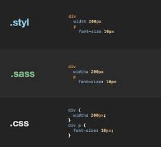

- `Sass` was built on Ruby and has frameworks like Gumby and Foundation. Sass also has great mixin libraries
- `SCSS` is like `Sass`, but is closer to regular CSS. **SCSS is fully CSS compliant**, meaning you can import regular CSS into a SCSS file, and it will work immediately.
  - 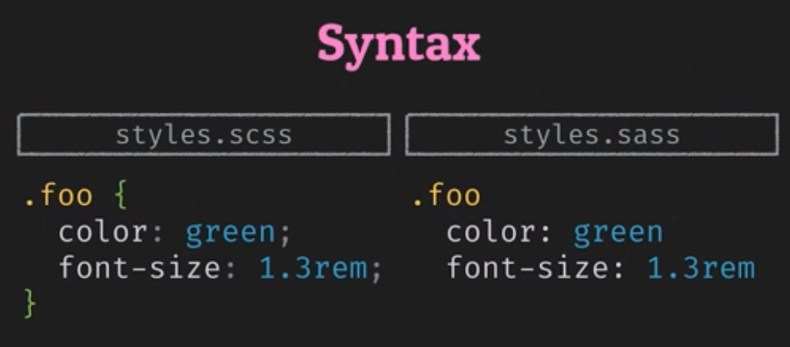
- `Less` runs inside Node Javascript, in the browser.
  - The main difference between LESS and other CSS preprocessors is that LESS allows real-time compilation via less.js in the browser.
  - With `Sass` or `Stylus`, when creating a mixin you create a group of CSS declarations, but in LESS you embed the mixin into the property of a class.
- `Stylus` is built on node.js, Stylus really strips down all of the extra characters that clog up your CSS. Stylus allows freedom in terms of syntax – you can omit braces, semicolons and even colons. Stylus incorporates powerful in-language functions and conditionals.

---

### Reasons to use a CSS Preprocessor

- It will make your code **faster to build** and **easier to maintain**
  - `variables`, `mixins` and `functions` that are declared at the beginning of the document which will make simple changes, like a color, easier to maintain.
- It will make your CSS **DRY**
- It will make your CSS more organized
  - nested definitions. This is an excellent feature and keeps things organized
- It will add stuff that should have been there.

---

## Sass

Sass is a CSS preprocessor, an extension of CSS that adds power and elegance to the basic language.

Sass has features that don't exist in CSS yet like nesting, mixins, inheritance that help you write robust, maintainable CSS.

- Once Sass is installed, you can compile your Sass to CSS using the sass command. You'll need to tell Sass which file to build from, and where to output CSS to.

  ```sh
  sass --watch input.scss output.css
  ```

### When to use Sass over CSS

in general

- it depends on many factors like
  - team preference
  - browser support

variables:

- use sass for global values that don't typically change: `color`, `font-family`, etc
- use **custom properties** for values that will change in the media queries: `font-size`, `margin`, `padding`, `widths`, `flex-basis`, etc

---

## Installation

### Using Extension

> use the updated and maintained version of `live sass compiler` extension as it supports new css syntax

when using `live sass compiler` extension, use these settings in your `settings.json` file in `VS.Code`:

```json
"liveSassCompile.settings.formats": [
  {
   "format": "expanded", // or "compressed" if you want to minify the CSS file
   "extensionName": ".css",
   "savePath": "/dist", // place of the generated CSS file instead of the same location of your sass file
   "savePathReplacementPairs": null
  }
 ],
```

---

### Using Task Runner: NPM (preferred way)

#### Build Setup

use this as the contents of a fresh `package.json`:

```json
{
  "name": "project",
  "version": "0.1.0",
  "description": "SASS compile|autoprefix|minimize and live-reload dev server using Browsersync for static HTML",
  "main": "public/index.html",
  "author": "5t3ph",
  "scripts": {
    "build:sass": "sass  --no-source-map src/sass:public/css",
    "copy:assets": "copyfiles -u 1 ./src/*assets/**/* public", // "**/*" means every file and every nested files
    "copy:html": "copyfiles -u 1 ./src/*.html public",
    "copy": "npm-run-all --parallel copy:*",
    "watch:assets": "onchange '/src/*assets/**/*' -- npm run copy:html",
    "watch:html": "onchange 'src/*.html' -- npm run copy:html",
    "watch:sass": "sass  --no-source-map --watch src/sass:public/css",
    "watch": "npm-run-all --parallel watch:*",
    "serve": "browser-sync start --server public --files public",
    "start": "npm-run-all copy --parallel watch serve",
    "build": "npm-run-all copy:html build:*",
    "postbuild": "postcss public/css/*.css -u autoprefixer cssnano -r --no-map"
  },
  "dependencies": {
    "autoprefixer": "^10.4.2",
    "browser-sync": "^2.27.7",
    "copyfiles": "^2.4.1",
    "cssnano": "^5.0.17",
    "npm-run-all": "^4.1.5",
    "onchange": "^7.1.0",
    "postcss-cli": "^9.1.0",
    "sass": "^1.49.8"
  }
}
```

- **Note**: You may encounter this message when running `npm install`: **"browser-sync had an unresolved issue with an old dependency"**
  - but since you will not deploy browser-sync as a production dependency, it is low impact.
- **Scripts**:
  - `npm start` - copies src files to public and starts Browsersync server at localhost:3000
  - `npm run build` - copies files to public and autoprefixes/minifies css

#### Project Structure

```sh
src/
- sass/
- - style.scss
- index.html

```

---

## Architecture and folder structure

- **7-1** pattern 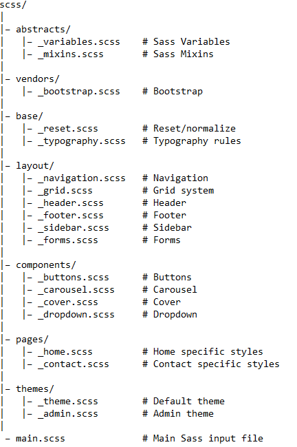

---

## Partials

These're scss files that starts with `_`, ex: `_layout.scss`

- it's for instead of working with one long css file, you can actually **split up** your styles into multiple files and be more organized with subfolders
  - also it can lower the chance of **code-conflict** between developers working on the same project as they won't be working in the same file
- partials are designed to be **imported** into other scss files and they **won't become css files** by themselves
- sass will ignore any file that starts with `_`
- The underscore lets Sass know that the file is only a partial file and that it should not be generated into a CSS file.
- `Sass` partials are used with the `@use` rule.

---

### Importing

- **old**: `@import ""`
  - using an `@import` in **CSS** results in a new round-trip HTTP request, this is a concern
  - using `@import` in **SASS** does something more powerful
    - now when importing we import **partials**
    - also here `@import` is not limited to partials, it can import other `sass` files and libraries too
- **new**: `@use ""`
  - the difference here is that when using `@use` the module / partial you imported will be **Namespaced** (to prevent naming collisions)

Now usually all the imports are done in a high level file usually called `app.scss` and this is the file that will be converted to `main.css` file

> **Note**: thing imported will be accessible only in the scope it was imported in

---

#### @forward

it's used to **take all** style rules in the `partials`, and **forward them out** as a singular thing to get loaded on the file it's called in all together without worrying about namespacing like in [@use](#use)

- no need to write the full partial-file name, you can omit the `_` and the file extension
- usually we use it in file with name `_index.scss` in the folder

  ```scss
  // _index.scss
  @forward 'boilerplate'; // instead of '_boilerplate.scss'
  @forward 'typography';
  ```

- you can use it to forward file named `_index.scss` in a folder by calling the folder's name

  ```scss
  // styles.scss
  @forward 'folder_name`
  ```

- used to get the abstract styles and partials unlike in `@use` where we may depend on namespacing.

---

#### @use

The `@use` rule loads `mixins`, `functions`, and `variables` from other Sass stylesheets, and combines CSS from multiple stylesheets together. Stylesheets loaded by @use are called "modules". Sass also provides built-in modules full of useful functions.

- **Choosing a Namespace**

  - By default, a module’s namespace is just the last component of its URL without a file extension. However, sometimes you might want to choose a different namespace—you might want to use a shorter name for a module you refer to a lot, or you might be loading multiple modules with the same filename. You can do this by writing `@use "<url>" as <namespace>`:

  ```scss
  // style.scss
  @use 'src/corners' as c;

  .button {
    @include c.rounded;
    padding: 5px + c.$radius;
  }

  // OR
  @use 'src/corners';

  .button {
    @include corners.rounded;
    padding: 5px + corners.$radius;
  }
  ```

  - You can even load a module without a **namespace** by writing `@use "<url>" as *`.
    - It's recommended that you only do this for stylesheets written by you, though; otherwise, they may introduce new members that cause name **conflicts**!

---

## Nesting selectors

- `&` -> Parent selector -> is for no space between nested selectors (class and class)
- `>` direct selectors
- in **Sass**, you can put (nest) the `media-query` code inside the selector's block, unlike in **Css** where it needs to be separated

  ```scss
  // Sass
  .smth {
    //some CSS
    @media (min-width: 768px) {
      //do Smth
    }
  }
  ```

  ```css
  /* Css */
  @media (min-width: 768px) {
    /* code */
  }
  ```

---

## Variables

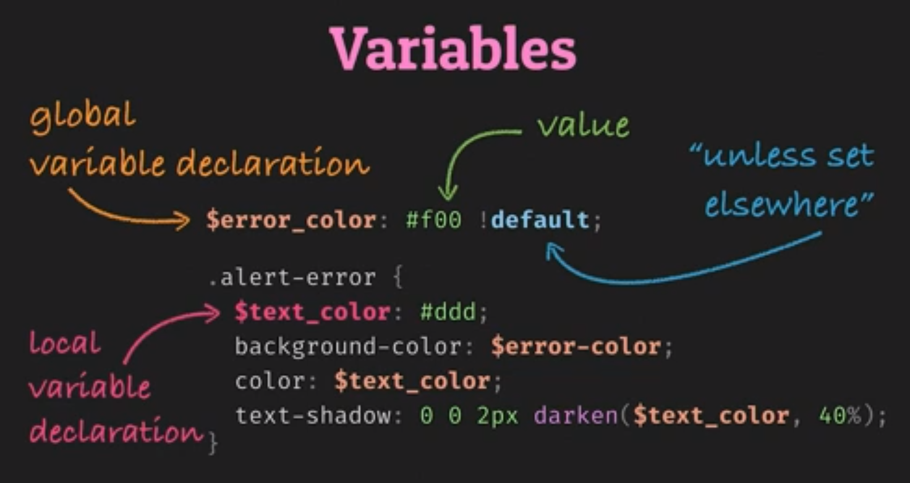

- starts with `$`
- there's global and local variables
  - you can **convert local** variables to **global variables** with `!global` flag
  - `!default` -> means that it will be used if the variable isn't declared in the file with different value
- usually variables are gathered in a `partial` file and imported where needed.

```scss
$primary-color: #eee !global;
```

### css variables vs sass variables

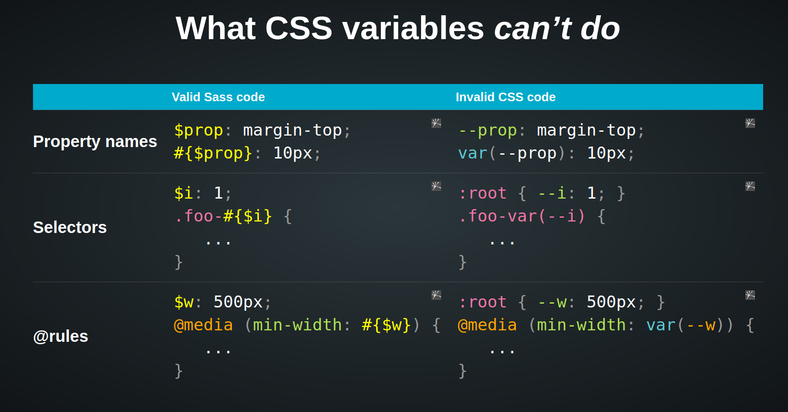
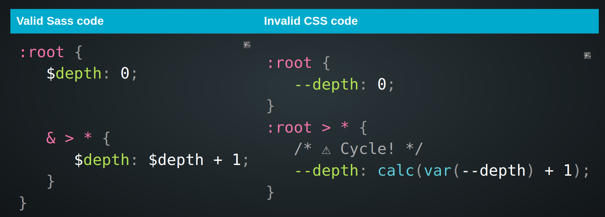

---

## Placeholder and extending

### @extend

- the difference here from `mixins` is that `placeholders` help keeping Sass writing **Dry**
  - `@extend` in Sass that allows for sharing of CSS properties from one selector to another with out rewrite repeated code.
    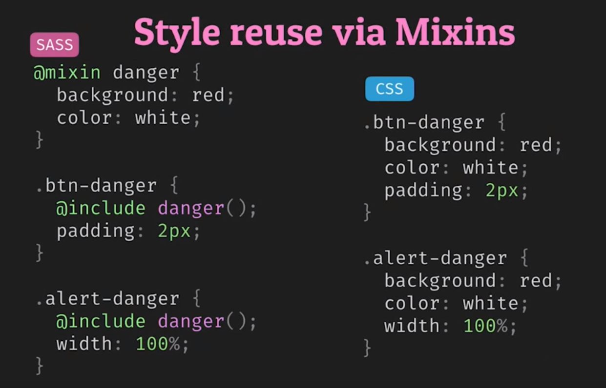
    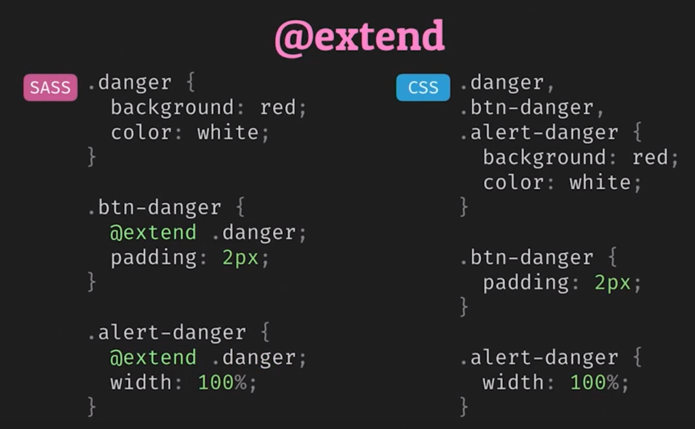

---

### Placeholder

- it's like [Mixins](#mixins) but without parameters
- it starts with `%`
- it's the safer way to use `@extend` without blowing in size with selectors in your `.css` file
- `@extend` in Sass that allows for sharing of CSS properties from one selector to another.

```scss
%main-box {
  // code
}

.article {
  @extend %main-box;
  // rest of code
}

// it can also work with normal selectors
.btn {
  // code
}

.btn-danger {
  @extend .btn;
}
```

---

## Control-flow

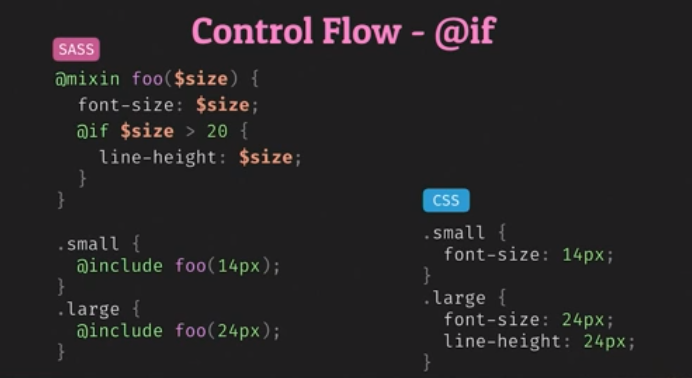

```scss
.main {
  @if $theme == 'light' {
    // code
  } @else {
    // else is not mandatory
    // code
  }
}
```

- one useful example is when you have different background and you want to decide using (black or white) font color:

  ```scss
  @if lightness($color) < 70% {
    color: white;
  }
  ```

---

## Comments

- `//` -> won't remain in css file
- `/* */` -> will remain in css file

### String interpolation in comments

```scss
/**
Hue is #{hue(green)}
*/

// will be in CSS file:
/**
Hue is 120deg
*/
```

---

## Interpolation

It's like function with arguments

```scss
$company == "google";

.ad #{$company}{
  // code
  background-image:url('img/#{$company}.png');
  // code
}
```

---

## Loops and Iteration

- usually useful when you want to create multiple **utility classes** for multiple spaces
- can be used with sass modules (data-structures) like **Lists** and **Maps (like object)**

  - one use of `maps` is mapping names for each breakpoint like:
  - to get value from a **Map**, we use: `map-get()` method:

    ```scss
    $breakpoints-up: (
      'medium': 700px,
      'large': 900px,
      'xlarge': 1440px
    );

    @mixin breakpoint($size) {
      @media (min-width: map-get($breakpoints-up, $size)) {
        @content;
      }
    }
    ```

```scss
@for $i from 1 through 10 {
  .class-#{$i} {
    font-size: #{$i + 10px};
  }
}
```

We can also iterate using `@each` keyword

```scss
$mylist: 0 0 2px #000; // list data structure
.foo {
  @each $i in $mylist {
    // code
  }
}
```

---

## Mixins

It's like a variable for a block of style-code (allow for re-use of style)

- A mixin lets you make groups of CSS declarations that you want to reuse throughout your site. It helps keep your Sass very **DRY**.
- mixins are used using `@include`
- You can even pass in values (**arguments**) to make your mixin more flexible.
  - this is one of the main purposes of mixin
  - you can use **Default Argument Values** in mixins to define default values for arguments
    - arguments can be provided **in order** or **by name**
    - when keyword `args` is used, order is ignored
  - if you want to re-use a block of style without **arguments**, you should use [Placeholder](#placeholder)

```scss
// mixin with an argument with a default value
@mixin theme($theme: DarkGray) {
  background: $theme;
  box-shadow: 0 0 1px rgba($theme, 0.25);
  color: #fff;
}

.info {
  @include theme;
}
.alert {
  @include theme($theme: DarkRed);
}
.success {
  @include theme($theme: DarkGreen);
}
```

### Mixins null values

if mixin has a property that doesn't apply to a specific element, the element will only take what is possible and ignore the `null` values

- so you don't need to worry about inheritance if no argument is provided


### passing declaration block

- it's like **(like slots in components)**

You can pass declaration block inside the mixin when invoking it using `@content`
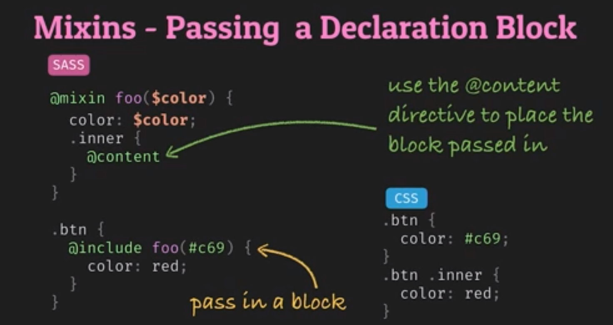

---

## Functions

Sass provides many built-in modules which contain useful functions (and the occasional mixin). These modules can be loaded with the `@use` rule like any user-defined stylesheet, and their functions can be called like any other module member.

- All built-in module URLs begin with sass: to indicate that they're part of Sass itself.
- some of the predefined functions available in Sass, specifically the color functions: [Built-In Modules](https://sass-lang.com/documentation/modules)
- sass functions return a **value** for a css property unlike mixins which return a block of css-code

---

### Error handling

You can use `@if` to check for errors in the code or usually in **Sass functions**:

```scss
@function add-10($number) {
  @if type-of($number) != 'number' {
    @warn "`#{$number}` is not a number of `add-10`.";
    @return false;
  }

  @return $number + 10;
}
```

---

### Color Functions

Usually they're very useful when you have a primary-color or a brand-color and want to create color-themes from this color

- `adjust-hue`
  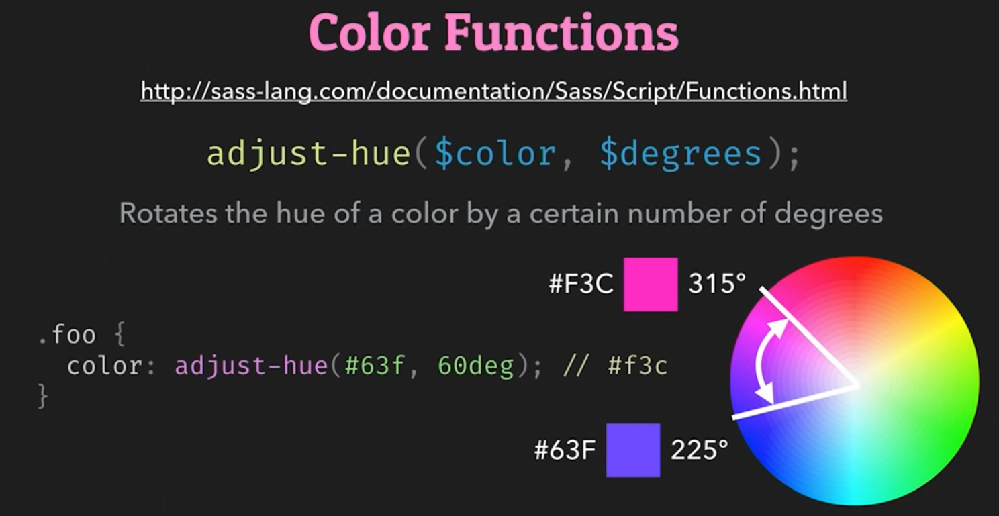
- `darken` / `lighten`
  - the percentage is the subtracted percent of the brightness, so if it was `100%`, you will get **black**
    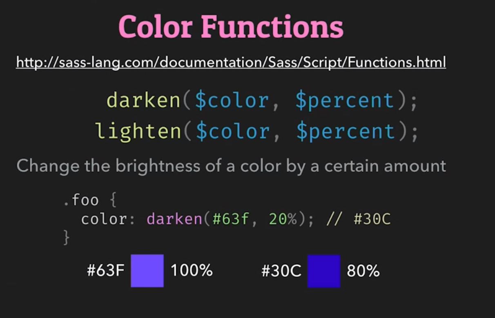
- `saturate` / `desaturate`
  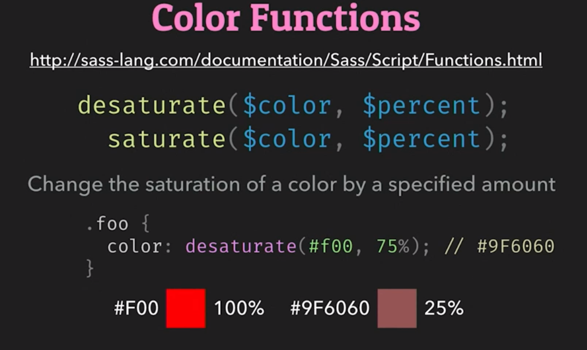

---

## Operators

It's for doing math in your CSS, as some normal operators don't work here like forward-slash `/` for division, which conflict with importing modules using `@forward` rule, so instead we use functions in the [math()](https://sass-lang.com/documentation/modules/math) module.

- it's a **Sass Built-in Module** so it needs to be imported

```scss
@use 'sass:math'; // load built-in sass-module

.container {
  display: flex;
}

article[role='main'] {
  width: math.div(600px, 960px) * 100%;
}

aside[role='complementary'] {
  width: math.div(300px, 960px) * 100%;
  margin-left: auto;
}
```

---

## Sass in BEM

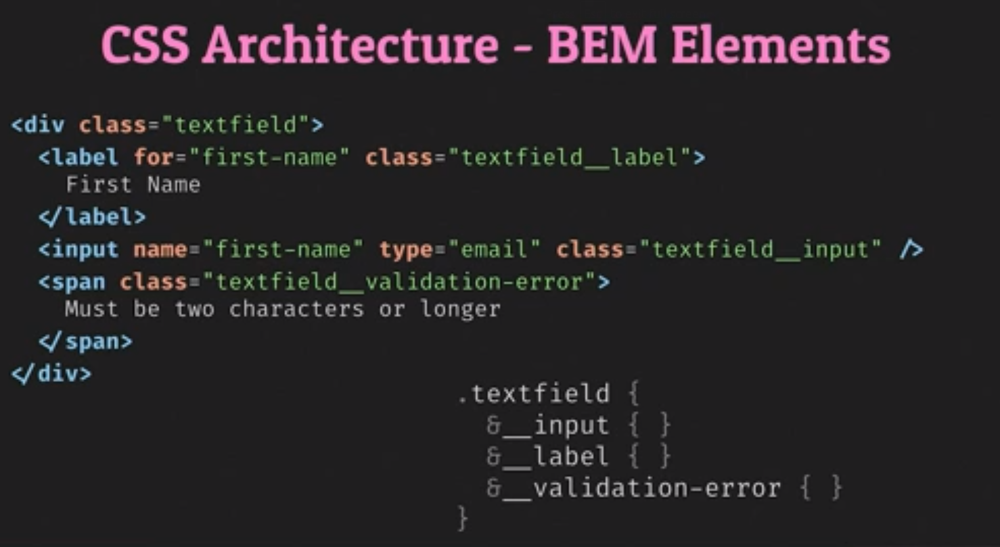
