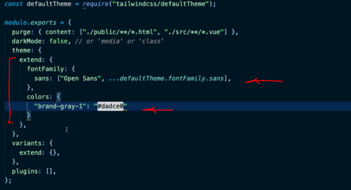

## INDEX

- [INDEX](#index)
- [Tailwind](#tailwind)
  - [TailwindCSS vs. Bootstrap](#tailwindcss-vs-bootstrap)
- [PurgeCSS](#purgecss)
  - [Configuring PurgeCSS in the Tailwind configuration file to remove unused CSS](#configuring-purgecss-in-the-tailwind-configuration-file-to-remove-unused-css)
- [Configuration](#configuration)
  - [Adding colors/fonts](#adding-colorsfonts)
- [Functions and Directives](#functions-and-directives)
  - [@apply](#apply)

---

## Tailwind

Tailwind CSS is a **utility-first CSS framework** for rapidly building custom user interfaces.

- Tailwind CSS is a collection of utility classes to set certain values of margins, paddings, font sizes, font weights and many more using classes directly.
  - Instead of adding extra padding to a button using a class such as `.button`, you only need to add the class `.p-3` or `p-4` and you’ll add padding directly to the element.

### TailwindCSS vs. Bootstrap

- Tailwind CSS is not a UI kit. Unlike UI kits such as Bootstrap, Bulma, and Foundation, Tailwind CSS doesn’t have a default theme or built-in UI components. Instead, it comes with pre-designed widgets you can use to build your site from scratch.
- Bootstrap is known for its **responsiveness**, whereas proponents of Tailwind CSS typically value the framework’s **customizability**.
- Another problem with Bootstrap, sites is that they almost always look alike, so this inhibits our ability to incorporate creativity into the dev environment. This is one of the advantages of Tailwind CSS: its ability to easily build complex user interfaces without encouraging any two sites to look the same.

- Tailwind CSS is a **utility-first library**, which means that, unlike Bootstrap, Tailwind doesn’t provide automatically **pre-styled UI-components**. Rather, it provides **utility classes** that help us style our components in certain ways (class for each separate property: width,margin-left,..) and allow us to build our own classes.

---

## PurgeCSS

By default, the uncompressed file size of Tailwind CSS is big, and when compressed it’s 46.2kB. In comparison, the uncompressed file size of Bootstrap CSS is only 143kB. So you might ask, why is it so large? Can I reduce the size of it? The answer is yes, definitely!

The downside is that there are thousands of these utility classes in Tailwind CSS and most of them are not used in the project and the default size of Tailwind CSS is fairly huge compared to other CSS frameworks.

- there is a pretty easy solution to all of this.
- All you need to do to reduce the file size of Tailwind CSS is to remove all of the unused utility classes from the main CSS file -> there is an awesome tool called **PurgeCSS** that goes through your HTML templates and decides which CSS classes are used and unused and based on that remove the unused ones from Tailwind CSS.

### Configuring PurgeCSS in the Tailwind configuration file to remove unused CSS

```js
// in tailwind.config.js
purge: {
    enabled: true,
    content: [
        './**/*.html'
    ]
}
```

---

## Configuration

[Guide](https://tailwindcss.com/docs/configuration)

Or: using **plugins**

### Adding colors/fonts

you can do that inside the `tailwind.config.js` file



---

## Functions and Directives

### @apply

It's used to inline any existing utility classes into your own custom CSS.

```css
.select2-search {
  @apply border border-gray-300 rounded;
}
```
