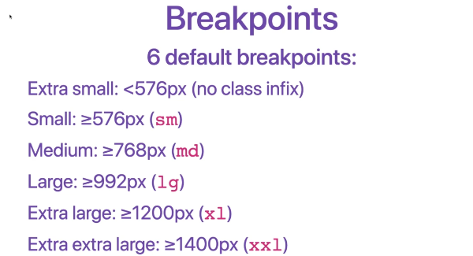

## INDEX

- [INDEX](#index)
- [Examples](#examples)
- [Installation](#installation)
  - [Download Files](#download-files)
- [Layouts](#layouts)
  - [Container](#container)
  - [Breakpoints](#breakpoints)
  - [Grid System](#grid-system)
  - [Columns](#columns)
  - [Gutters (gaps)](#gutters-gaps)

---

## Examples

[Bootstrap 5 Interactive CheatSheet](https://bootstrap-cheatsheet.themeselection.com/)
[Bootstrap 5 Learning Kit](./Bootstrap-Learning%20Kit/index.html)

---

## Installation

### Download Files

- Compiled CSS and JS

  - ready-to-use compiled code to easily drop into the project.
  - usually use:
    - `bootstrap.min.css`
    - `bootstrap.bundle.min.js`

- Source files
  - Compiling Bootstrap with your own asset pipeline by downloading our source Sass, JavaScript, and documentation files. This option requires some additional tooling

---

## Layouts

### Container

inside it you determine the `max-width`

- **fluid**: no max width

### Breakpoints

### Grid System

- 12 Columns in the grid
- 6 grid tiers based on minimum width
- col classes with device-infixes and numbers -> **Breakpoint & with of column**
  - if not specified the col takes `1fr`
  - `"col-lg-3 col-md-6"`: means that the column will take 3 spans on **large screens** and 6 spans on **medium screens**
- You can use the number on the **row itself** and it will apply to all columns inside it
- You can nest a grid inside of a grid (row inside a row)

### Columns

align, justify, wrapping, order, ...

### Gutters (gaps)

it goes from **1** (smallest) to **5** (biggest)

- `g-x`: column-gap (x-axis)
- `g-y`: row-gap (y-axis)
