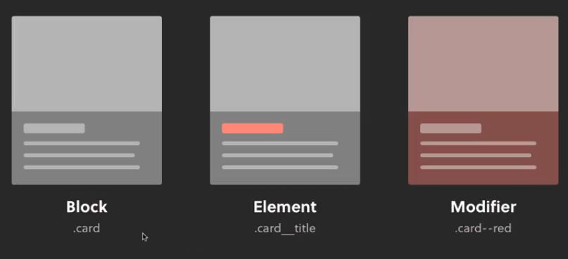

## INDEX

- [INDEX](#index)
- [Scalable Modular Architecture for CSS (SMACSS)](#scalable-modular-architecture-for-css-smacss)
- [Naming convention](#naming-convention)
  - [BEM](#bem)
  - [ITCSS](#itcss)
  - [BEMIT](#bemit)
    - [Responsive Suffixes](#responsive-suffixes)

---

## Scalable Modular Architecture for CSS (SMACSS)

> it's pronounced: **SMAX**

**SMACSS** is a CSS framework. it is more like a “**style guide**” than a rigid CSS framework. It focuses on five categories for its rules:

- **Base** is used for defaults like `html`, `body`, `a`, a`:hover`. This includes your CSS resets and would often be in its own base CSS file or at the start of your main CSS.

  - Element selectors
  - Css resets
  - Normalize

- **Layout** divides a page into sections with elements like `header`, `footer`, and `article`. Often developers show layout elements by prefixing the class with `l-`.
  

  - Major containing elements
  - Grid systems
  - How do you group your content?

- **Module** is a reusable, modular element in the design, the majority of your elements and thus doesn't require that you prefix them but you could do so if you choose.

  - Contained content
  - majority of your site
  - Child elements (su-modules) in SMACSS (like what an “element” is to a “block” in BEM) have the parent item prefixed with a **dash**. e.g. `menu` and `menu-item`.

- **State** is used for the variations possible for each element (e.g. `active`, `inactive`, `expanded`, `hidden`). These are **prefixed** with `is-`, e.g. `is-active`, `is-inactive`, `is-expanded`, `is-hidden` or are via pseudo-classes such as `:hover` and `:focus` or `media queries`.

  - `is-` prefix indicates:
    - likelihood of javascript dependency
    - a toggleable state

- **Theme** is similar to state but defines **how modules and layouts will look**. It is more applicable for larger sites with shared elements that look different throughout. You would add theme variations on a per page or per section basis.
  - ex: `fonts`, `color`
  - only for on-the-fly changes (like displaying chinese language)
  - usually aren't needed

---

## Naming convention

### BEM

BEM stands for Block Element Modifier and originated at Yandex. It provides a rather strict way to arrange your CSS classes into independent modules. There are a few variations on the idea but the most common one looks like this:

```css
.block {
}
.block__element {
}
.block--modifier {
}
.block__element--modifier {
}
```



- **Block**: The sole root of the component, represents an object in your website. For example:
  - a person
  - a login form
  - a menu
  - a search form
- **Element**: is a component within the block that performs a particular function. It should only make sense in the context of its block. For example:
  - a hand
  - a login button
  - a menu item
  - a search input field
- **Modifier**: is how we represent the variations of a block. For example:
  - a tall/short person
  - a condensed login form (e.g. we’re hiding the labels in one version)
  - a menu modified to look differently for a footer or sitemap
  - a search input field with a particular button style

```css
/* Example */
.menu {
}
.menu__item {
}
.menu__item--featured {
}
.menu--footer {
}
```

**Notes**:

- `BEM` helps us avoid **nesting**
  - BEM is a good way to build UI. The descriptive, sometimes long, class names are good for understanding straight away where this class/selector sits within your UI architecture. It also means you rarely need to nest selectors, a common downfall with Sass codebases. Usually when I’m nesting with BEM is when I want to target an element via HTML tag name, or to win a specificity battle when components styling overlaps.
  - also it proviedes more code-readability than nesting

---

### ITCSS

TCSS stands for **Inverted Triangle CSS**. It helps you organize your project CSS files/folders in such a way that you can better deal with CSS specifics like global namespace, cascade and selectors specificity.

The main idea of ITCSS is that it separates your CSS codebase into several sections (called layers), which can be represented as sections of an inverted triangle:


- **Settings** – used with general preprocessors and contain `font`, `colors` definitions, etc.
- **Tools** – globally used `mixins`, `functions`, `grids`, `display`.
- **Generic** – `reset` and/or `normalize styles`, `box-sizing` definition, etc. This is the first layer which generates actual CSS.
  - this can be also for **base**
- **Elements** – styling for `bare HTML elements` (like H1, A, etc.).
- **Objects** – `class-based selectors` which define undecorated design patterns
  - for example the media object (**Media Query**) known from `OOCSS`
  - it's for things like `circle`, `border-wrapper`, `date`, `cursor`, `icons`, `pop-up window`, and other things that aren't components
  - here we use `o` in the beginning of class-name
- **Components** – specific `UI components`. This is where most of our work takes place. We often compose UI components of Objects and Components
  - EX: analytic-chart component
  - here we use `c` in the beginning of class-name
- **Utilities or trumps** – utilities and helper classes with ability to **override** anything which goes before in the triangle, `e.g. hide helper class`
  - here we use `u` in the beginning of class-name
  - they use `!important` to override

---

### BEMIT

> The one thing missing from BEM is that it only tells us what classes to in relative terms, as in, how classes are related to each other. They don't really give us any idea of how things behave, act, or should be implemented in a global and non-relative sense.

Use the **BEMIT** naming convention, especially its Namespaces (`.c-user`, `.o-media`, etc.). This will allow you to focus on solving front-end challenges rather than thinking up style names and their location.

The most common types of namespace are

- `c-` for Components
- `o-` for Objects
- `u-` for Utilities
- `is-` / `has-` for States

```html
<!-------------------------- Example -------------------------->
<div class="o-media  c-user  c-user--premium">
  
  <p class="o-media__body  c-user__bio">...</p>
</div>
```

---

#### Responsive Suffixes

The next thing **BEMIT** adds to traditional BEM naming is responsive suffixes. These suffixes take the format ( **@<breakpoint>** ), and tell us this class when at this size:

```html
<!-------------------------- Example -------------------------->
<div class="o-media@md  c-user  c-user--premium">
  
  <p class="o-media__body@md  c-user__bio">...</p>
</div>
```

- Examples
  - `u-hidden@print` – a utility class to hide things when in print context.
  - `u-1/4@lg` – a utility to make something a quarter width in the large breakpoint.
  - `o-layout@md` – a layout object in the medium breakpoint.

> **NOTE**:
>
> - You have to escape the `@` symbol in your CSS file, like so:
>
> ```css
> @media print {
>   .u-hidden\@print {
>     display: none;
>   }
> }
> ```

---
