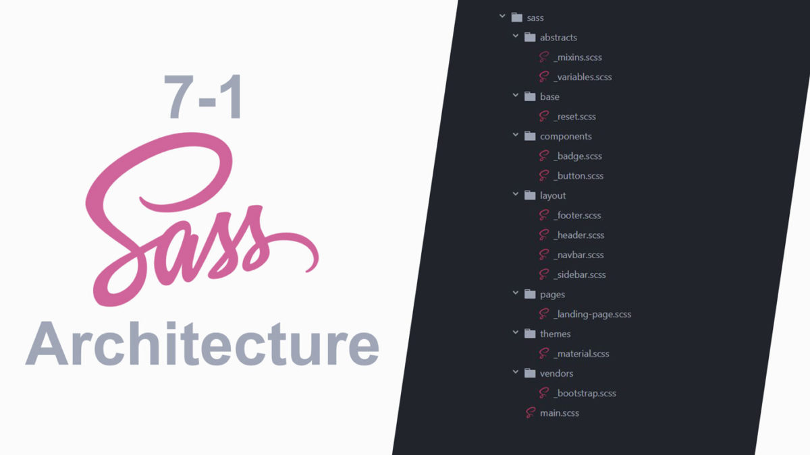

## INDEX

- [INDEX](#index)
- [Preprocessing](#preprocessing)
  - [SCSS vs SASS](#scss-vs-sass)
- [Architecture](#architecture)
  - [Partials](#partials)
  - [Importing](#importing)
- [Variables](#variables)
- [Placeholder](#placeholder)
- [Control-flow](#control-flow)
- [Comments](#comments)
- [Interpolation](#interpolation)
- [Loop](#loop)
- [Mixins](#mixins)
- [Operators](#operators)

---

## Preprocessing

Sass is a CSS preprocessor, an extension of CSS that
adds power and elegance to the basic language.

Sass has features that don't exist in CSS yet like nesting, mixins, inheritance that help you write robust, maintainable CSS.

- Once Sass is installed, you can compile your Sass to CSS using the sass command. You'll need to tell Sass which file to build from, and where to output CSS to.
  ```sh
  sass --watch input.scss output.css
  ```

### SCSS vs SASS


---

## Architecture

- **7-1** pattern 

### Partials

- sass will ignore any file that starts with `_`
- The underscore lets Sass know that the file is only a partial file and that it should not be generated into a CSS file.
- Sass partials are used with the @use rule.

### Importing

- old: `@import ""`
- new: `@use ""`

---

## Variables

- starts with `$`
- you can **convert local** variables to **global variables** with `!global`

```scss
$primary-color: #eee !global;
```

---

## Placeholder

- it's like inheritance in OOP
- it's like [Mixins](#mixins) but without parameters

```scss
%main-box {
  // code
}

.article {
  @extend %main-box;
  // rest of code
}
```

---

## Control-flow

```scss
.main {
  @if $theme == "light" {
    // code
  } @else {
    // code
  }
}
```

---

## Comments

- `//` -> won't show in css file
- `/* */` -> will show in css file

---

## Interpolation

It's like function with arguments

```scss
$company == "google";

.ad #{$company}{
  // code
  background-image:url('img/#{$company}.png');
  // code
}
```

---

## Loop

```scss
@for $i from 1 through 10 {
  .class-#{$i} {
    font-size: #{$i + 10px};
  }
}
```

---

## Mixins

It's like a variable for a block of code

A mixin lets you make groups of CSS declarations that you want to reuse throughout your site. It helps keep your Sass very **DRY**.

You can even pass in values to make your mixin more flexible.

```scss
@mixin theme($theme: DarkGray) {
  background: $theme;
  box-shadow: 0 0 1px rgba($theme, 0.25);
  color: #fff;
}

.info {
  @include theme;
}
.alert {
  @include theme($theme: DarkRed);
}
.success {
  @include theme($theme: DarkGreen);
}
```

---

## Operators

Doing math in your CSS

```scss
@use "sass:math";

.container {
  display: flex;
}

article[role="main"] {
  width: math.div(600px, 960px) * 100%;
}

aside[role="complementary"] {
  width: math.div(300px, 960px) * 100%;
  margin-left: auto;
}
```
