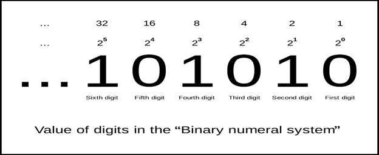
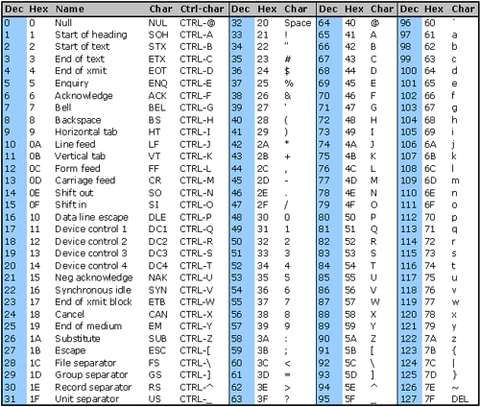
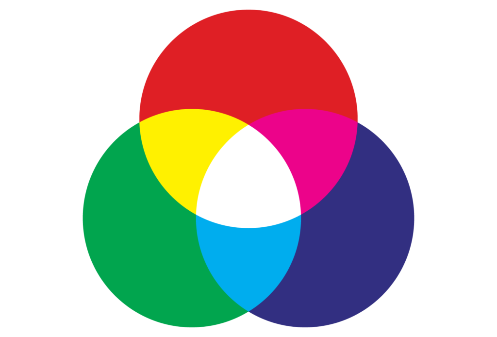
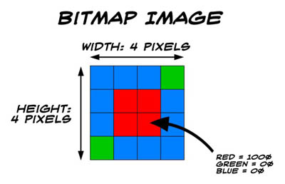
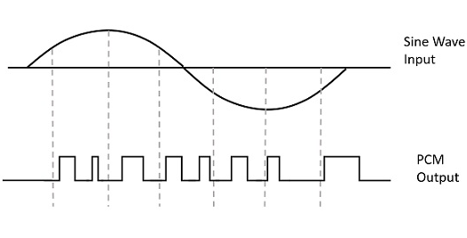

# INDEX

- [INDEX](#index)
  - [Computer Science](#computer-science)
  - [Binary System](#binary-system)
  - [Bits and Bytes](#bits-and-bytes)

---

## Computer Science

It is the study of computers and computational systems. Unlike electrical and computer engineers, computer scientists deal mostly with software and software systems; this includes their theory, design, development, and application.

---

## Binary System

It is a number system that uses only two digits, `0` and `1`. Computers operate in binary, meaning they store data and perform calculations using only zeros and ones.

- How can we use it to represent numbers?

  - We can use the binary system to represent numbers by using the **place value** of each digit.

    

  - The place value of each digit is determined by its position in the number. The first digit in a binary number is the **ones place**, the second digit is the **twos place**, the third digit is the **fours place**, and so on.

- How can we use it to represent text (characters)?

  - We can use the binary system to represent text by using the **ASCII** (American Standard Code for Information Interchange) table.

    

  - The ASCII table is a **7-bit** character code where every single bit represents a unique character. On this webpage you can see the ASCII table and the binary representation of each character.
  - Note that the character `"1"` is represented by the binary number `00110001` (`49` in decimal) and the character `"A"` is represented by the binary number `01000001` (`65` in decimal)

- How can we use it to represent colors?

  - We can use the binary system to represent colors by using the **RGB** (Red, Green, Blue) color model.

    

  - The RGB color model is an additive color model in which `red`, `green`, and `blue` light are added together in various ways to reproduce a broad array of colors.
  - Each color is represented by a number between `0` and `255` **(8 bits)**. For example, the color `#FF0000` is represented by the decimal number `16711680` (`111111110000000000000000` in binary).

- How can we use it to represent images?

  - We can use the binary system to represent images by using the **bitmap** image format.

    

  - The bitmap image format is a raster graphics image format used to store digital images. It is characterized by its use of pixels to encode an image, where each pixel is represented by a number between `0` and `255` **(8 bits)**.

- How can we use it to represent videos?

  - Same as images, But one frame at a time.

- How can we use it to represent sound?

  - We can use the binary system to represent sound by using the **Pulse-code modulation** (PCM) format **(Frequency, Amplitude, Time)**

    

  - The Pulse-code modulation is a method used to digitally represent sampled analog signals. It is the standard form of digital audio in computers, compact discs, digital telephony and other digital audio applications.

So, we can use the binary system to represent anything that can be represented with numbers, such as text, images, videos, etc. as long as we know how to convert them to binary. **This is how we communicate with computers as `bits` and `bytes`**.

---

## Bits and Bytes

- **Bit**: it is the smallest unit of data in a computer. It can only have one of two values, and may therefore be physically implemented with a two-state device. These values are most commonly represented as either a `0` or `1`.

  > Fun fact: the word "bit" is a portmanteau of "binary digit". ("bi" from "binary" and "t" from "digit")

  - The `7-bit` ASCII character set contains `128` characters. These include lower and upper case English letters, numbers, and punctuation symbols. but in order to represent more characters, we needed to add more bits -> **"Unicode"**.
    - **"Unicode"**: it is a computing industry standard for the consistent encoding, representation, and handling of text expressed in most of the world's writing systems.

- **Byte**: it is a unit of digital information that most commonly consists of **8 bits**.
  - Historically, the byte was the number of bits used to encode a single character of text in a computer and for this reason it is the smallest addressable unit of memory in many computer architectures.
