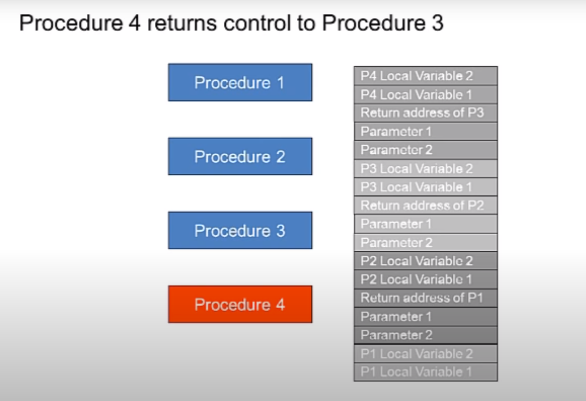

# INDEX

- [INDEX](#index)
  - [Computer architecture](#computer-architecture)
  - [Disk](#disk)
  - [RAM](#ram)
    - [Memory](#memory)
    - [Call Stack](#call-stack)
  - [CPU](#cpu)
    - [Cache](#cache)
  - [Distributed systems](#distributed-systems)

---

## Computer architecture

It's the science and art of selecting and interconnecting hardware components to create computers that meet functional, performance and cost goals.

- It's the design of the hardware components of a computer system.
- Computers are machines that process data and do a program:

  - **fixed program**: it's a program that can't be changed, do only one task and it's not flexible (e.g. calculator)
  - **stored program**: it's a program that can be changed, do multiple tasks and it's flexible by storing and executing instructions (e.g. computer)

- Components:
  

  - `Disk`
    - It stores **persisted** data
  - `RAM (memory))`
    - It stores **volatile** data and instructions that the `CPU` needs to execute
  - `CPU`
    - It's the brain of the computer, it executes instructions and has a `program counter` that points to the next instruction to execute in `RAM`
  - `ALU (Arithmetic Logic Unit)`
    - It's a part of the `CPU` that performs arithmetic and logic operations

- The computer takes a sequence of instructions from `RAM` and executes them one by one (in order) and can do predefined primitive instructions:

  - Arithmetic and logic operations
  - Data movement operations
  - Control operations
  - Input and output operations

  > So, any computable problem can be solved by a computer by breaking it down into primitive instructions and **if computed in one language, it can be computed in any other language**

---

## Disk

It stores **persisted** data

- `HDD` - Hard Disk Drive (slower than SSD)
- `SSD` - Solid State Drive (faster than HDD)
- measures in hundreds of GBs or TBs
  - TB - Terabyte -> `10^12` bytes

---

## RAM

It stores **volatile** data

- `RAM` - Random Access Memory
- measures in hundreds of MBs or GBs
  - GB - Gigabyte -> `10^9` bytes
  - MB - Megabyte -> `10^6` bytes
- It's more expensive than `disk` in term of cost per byte
- But it's cheaper than `disk` in term of resources per byte (writing and reading)
  - `RAM` is faster than `disk` in writing and reading data

---

### Memory

- It's a sequence of bytes (each byte is `8` bits), each byte has an address that stores data
- **Memory Layout**
  
  - `code segment / instructions` -> it stores the instructions that the `CPU` needs to execute
  - `data segment` -> it stores the data that the program needs to execute, like literal values, global variables, etc.
    - `initialized data` -> it stores the data that has an initial value
    - `uninitialized data` -> it stores the data that doesn't have an initial value
  - `heap` -> it stores the data that is dynamically allocated during runtime (place to store data temporarily while in runtime), the space is reclaimed by the `garbage collector` when it's not needed anymore
    - managed by programmer, or by `garbage collector` (in `Java`)
  - `stack` -> it stores the data that is dynamically allocated during runtime (place to store data temporarily while in runtime), (like local variables, method calls, etc.)
    - managed automatically by the compiler

---

### Call Stack

It is what a program uses to keep track of method/function calls.

- The call stack is made up of **stack frames** (one for each method call).

  - Each method-call creates its own stack frame, taking up space on the call stack.
    - That's important because it can impact the space complexity of an algorithm. Especially when we use **recursion**
    - The entire call stack takes up `O(n)` space even though our method itself doesn't create any data structures!, because each method call creates its own stack frame, taking up space on the call stack.
  - A stack frame usually stores:

    - local variables
    - method's arguments
    - return address --> what the program should do after the function returns (i.e. where to go back to)

      > This is based on the processor architecture. In some architectures (like `ARM`), the return address is stored in a register. In others, it's stored on the call-stack.

- The top of the stack is pointed to by the `stack pointer` **register**.

  - When a method is called, the `stack pointer` is incremented to make space for the new stack frame.
  - When a method returns, the `stack pointer` is decremented to remove the stack frame.

- **procedure call stack**:

  - The call stack is a `stack` data structure maintained inside computers and ran by the operating system. It stores information about when the active procedures and functions call each other, and how they pass parameters to each other.
    
    
  - Ex: when `procedure 1` calls `procedure 2`, `procedure 2` is pushed onto the stack. and so on when `3` calls `2`, ..., When `procedure 2` returns, it is popped off the stack and `procedure 1` resumes execution.
    
    

  - reference: [Procedures, Video 2: Call stack](https://www.youtube.com/watch?v=XbZQ-EonR_I)

- Call stack example:

  ```py
  def greet2(name):
    # ...

  def bye():
    # ...

  def greet(name):
    print(f"hello {name}")
    greet2(name) # calling another function here will add it to the call stack
    print("getting ready to say bye...")
    bye() # calling another function here will add it to the call stack
  ```

  
  
  
  
  
  

> **Note:** Using a stack is convenient but comes at a memory cost. Each function call consumes memory, and when the stack is too tall, your computer stores information for many calls. In such a situation, you have two options:
>
> - You can rewrite your code to use a loop instead.
> - You can use something called [tail recursion](./2-Algorithms.md#eliminating-tail-recursion). That's an advanced recursion topic. It's also only supported by some languages, not all.

- **StackOverFlow**
  - During the stack-framing process, if `JVM` encounters a situation where there is no space for a new stack frame to be created, it will throw a `StackOverflowError`.
  - causes:
    - unterminated/infinite recursion – too deep recursion in a particular code snippet.
    - It can also happen in a situation where an application keeps calling methods from within methods until the stack is exhausted. This is a rare case since no developer would intentionally follow bad coding practices.
    - Another rare cause is having a vast number of `local variables` inside a method.
    - Another interesting scenario that causes this error is if a class is being instantiated within the same class as an instance variable of that class. This will cause the constructor of the same class to be called again and again (recursively) which eventually results in a `StackOverflowError`.

---

## CPU

**Central Processing Unit**: it's the brain of the computer

- It's used to:

  - writing data to `disk` or `RAM`
  - reading data from `disk` or `RAM`
  - processing data (executing instructions)

- It's measured in `GHz` (Gigahertz)
- For faster reading from `RAM`, we can use `Cache`

### Cache

- It's a small amount of `RAM` that is closer to the `CPU` than the main `RAM`
- It's smaller than `RAM` and `Disk`
  - it's measured in `MB` (Megabytes)
- It's a lot faster than `RAM` and `Disk`
  - as it's closer to the `CPU` and it has a scale of `nano-seconds` (`10^-9` seconds)
- The `CPU` uses `Cache` to store data that it needs to access **frequently**
- The drawback of `Cache` is that it's **not persistent**

---

## Distributed systems

- As the speed of `CPU` won't increase much in the future, we need to use multiple `CPUs` to increase the speed of processing data
- We can use multiple `CPUs` in a single computer, but it's not enough, instead we need to use multiple computers
  - This is called `distributed systems`

---
