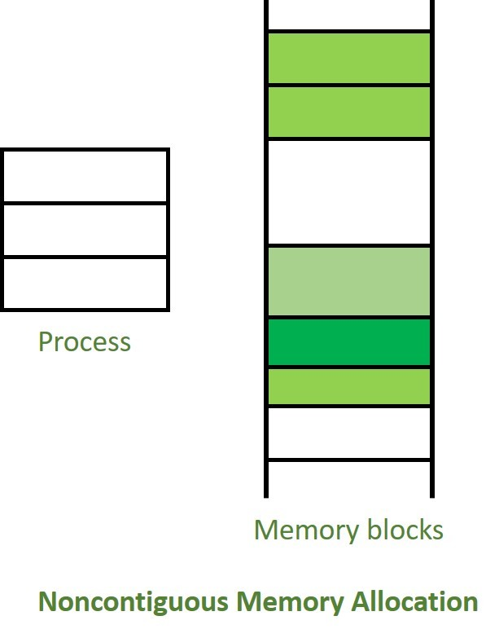
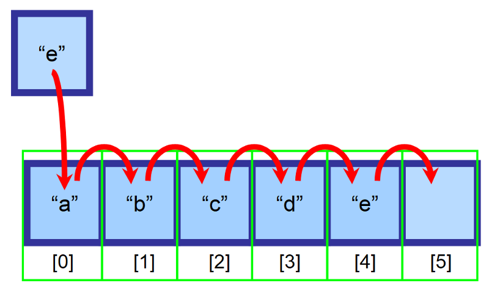
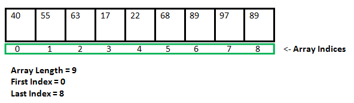

# INDEX

- [INDEX](#index)
  - [Data Structures](#data-structures)
    - [Storing data in the Memory](#storing-data-in-the-memory)
    - [Operations on data structures](#operations-on-data-structures)
  - [Arrays](#arrays)
    - [Static Array](#static-array)
      - [Downside of static array](#downside-of-static-array)
    - [Dynamic Array](#dynamic-array)
      - [How it works with capacity ?](#how-it-works-with-capacity-)
      - [Geometric Increase in Capacity and Arithmetic Progression (NOT important ⚠️)](#geometric-increase-in-capacity-and-arithmetic-progression-not-important-️)
    - [Implementing a Dynamic Array](#implementing-a-dynamic-array)
    - [Referential Arrays](#referential-arrays)
    - [Compact Arrays](#compact-arrays)
    - [Arrays Big O](#arrays-big-o)
    - [Array Notes](#array-notes)
  - [Linked lists](#linked-lists)
    - [Singly linked list](#singly-linked-list)
    - [Linked List Traversal](#linked-list-traversal)
    - [Circular linked list](#circular-linked-list)
    - [Doubly linked list](#doubly-linked-list)
  - [Arrays vs linked lists](#arrays-vs-linked-lists)
    - [Differences](#differences)
    - [Advantages of Arrays over linked-lists](#advantages-of-arrays-over-linked-lists)
    - [Advantages of linked-lists over Arrays](#advantages-of-linked-lists-over-arrays)
  - [Hash Tables (Map)](#hash-tables-map)
    - [Hash function](#hash-function)
      - [Good Hash functions](#good-hash-functions)
      - [Drawbacks of bad hash functions](#drawbacks-of-bad-hash-functions)
    - [Collision](#collision)
      - [Separate chaining (open hashing)](#separate-chaining-open-hashing)
      - [Linear probing ("Open Addressing" or "Closed Hashing")](#linear-probing-open-addressing-or-closed-hashing)
      - [Quadratic probing](#quadratic-probing)
      - [Rehashing](#rehashing)
      - [Double hashing](#double-hashing)
    - [Hash table implementation](#hash-table-implementation)
    - [Time complexity of HashMap](#time-complexity-of-hashmap)
    - [Maps (TreeMap)](#maps-treemap)
  - [Stacks and Queues](#stacks-and-queues)
    - [Stacks](#stacks)
      - [Array-Based Stack Implementation](#array-based-stack-implementation)
      - [Linked list based stack implementation](#linked-list-based-stack-implementation)
    - [Queues](#queues)
      - [Circular Queue (implementing a queue using a dynamic array)](#circular-queue-implementing-a-queue-using-a-dynamic-array)
      - [Implementing a Queue using linked-list](#implementing-a-queue-using-linked-list)
      - [Double-ended Queue (Deque)](#double-ended-queue-deque)
  - [Graphs](#graphs)
    - [How to store and represent graphs](#how-to-store-and-represent-graphs)
    - [Graphs implementation](#graphs-implementation)
  - [Trees](#trees)
    - [Types of Trees](#types-of-trees)
    - [Tree Implementation](#tree-implementation)
    - [Binary Tree](#binary-tree)
      - [Array-based Binary Tree](#array-based-binary-tree)
      - [Perfect vs Full vs Complete Binary Trees](#perfect-vs-full-vs-complete-binary-trees)
      - [Binary Search Tree (BST)](#binary-search-tree-bst)
      - [Tree Traversal](#tree-traversal)
    - [TreeMap](#treemap)
  - [Priority Queue / Heap](#priority-queue--heap)
    - [Implementation of Priority Queue](#implementation-of-priority-queue)
    - [Binary Heap](#binary-heap)
      - [Binary heap methods](#binary-heap-methods)
      - [Array-based representation of Binary Heap](#array-based-representation-of-binary-heap)
    - [Implementing a Priority queue with a Heap](#implementing-a-priority-queue-with-a-heap)
    - [Python `heapq` module](#python-heapq-module)
  - [Tries (Prefix Trees)](#tries-prefix-trees)
    - [Trie Implementation](#trie-implementation)
    - [Hybrid Tries](#hybrid-tries)

---

## Data Structures

it's a collection of value **stored in memory** that can be manipulated by a set of operations (**Algorithms**). It's a systematic way of organizing and accessing data

> They're ways to organize information with **optimal runtime complexity** for different operations or optimal business logic for the case

- Most programming languages have built-in data structures, but in interviews, you may still be asked about **"inferior"** data structures like `queues` and `linked lists`.

  - this is done by using the built-in data structures and getting the same result
    - ex: to add to queue -> use array equivalent: `array.insert()`
  - also if we want to make a class to the data-structure, we can use the built-in data-structure to make it **(Polymorphism)**
    - ex: to make a queue class -> use array to make it and remove some unwanted array-methods
      

- There're 2 types of data structures:
  - **Linear** -> data is organized sequentially, one after the other
    - are called “linear” data structures because they all have a logical start and a logical end.
    - ex: `array`, `stack`, `queue`, `linked-list`
  - **Non-Linear** -> data is not organized sequentially
    - ex: `tree`, `graph`

---

### Storing data in the Memory


Each data type has a number of bits associated with it and that needs to get stored in the system and **the system allocates data storage and then the CPU reads from that storage**

A computer system will have a huge number of **bytes** of memory (`1 byte` = `8 bits`), and each byte has a unique **memory address**.

- **Memory address** is a unique number that identifies the location of a byte in memory
- Usually numbers are stored in **32 bits (4 bytes) or 64 bits (8 bytes)**
  - `integers` are stored in as a **32-bit** value, so it takes 4 (8-bits) locations (blocks)
    
- computer hardware is designed, in theory, so that any byte of the main memory can be efficiently accessed based upon its memory address. In this sense, we say that a computer’s main memory performs as **random access memory (RAM)**.

  > It's called "Random Access" because it's just as easy to retrieve byte `#8675309` as it is to retrieve byte `#309`, we don't have to go through all the bytes to get to the wanted byte

  - Array elements can be quickly accessed (constant time) by using the formula `start + cellSize * index`, where "start" is the memory address, "cellSize" is the bytes per element, and "index" is the desired element's position.
    - Ex: cell `4` begins at memory location `2146+2*4 = 2154`.

---

### Operations on data structures

- Insertion
- Deletion
- Traversal -> accessing each data-item **only once** so that it can be processed
- Searching / Accessing
- Sorting -> sort data-items in the data-structure to be ordered (next to each other in memory in order)
- Updating
- Merging

---

## Arrays

Arrays are data structures that store lists of elements **(contiguously in adjacent memory locations)**, which means that all elements of the array are stored next to each other in memory **(Sequence)**. This is why we can access any element of an array in constant time, as long as we know the index of that element.

- Contiguous vs Non-contiguous memory allocation

  - Contiguous memory is a sequence of addresses that are next to each other in memory
    
  - Non-contiguous memory is a sequence of addresses that are not next to each other in memory
    

- Note that the addresses in the image below are not real addresses, they are just used to illustrate the concept of contiguous memory. also they are incremented by `4` as each **number** element is `4 bytes` (32 bits)
  

  - This will differ if storing **ASCII** characters as each character is `1 byte` (8 bits)
    
  - If storing **Unicode** characters as each character is `2 bytes` (16 bits)

- Arrays can store `numbers`, `strings`, `boolean` values, `objects`, and so on. But once you define the type of values that your array will store, all its elements must be of that same type. You can’t “mix” different types of data.
  
- Different programming languages have different definitions of Array and Lists, for example, Javascript has `Array` and `List` as different data structures, while Python has `List` only and it's a dynamic array

  ```js
  // ------------------- Javascript ------------------- //

  // this is not an array, it's a list
  let array = [1, 2, 3, 4, 5];

  // these are arrays
  let array = new ArrayList(5); // Array with 5 elements
  let array = new Unit16Array(5); // Array with 5 elements of 16 bits each
  ```

  ```py
  # ---------------------- Python ---------------------- #

  # this is a list
  array = [1, 2, 3, 4, 5]

  # this is an array
  array = array.array('I', [1, 2, 3, 4, 5]) # Array with 5 elements of 32 bits each
  ```

---

### Static Array

**static** -> fixed size declared at initiation and can't be changed

- A low-level array requires an explicitly declared size for proper memory allocation.
- Expanding the capacity of an array is not straightforward because neighboring memory is allocated for other data. However, this limitation doesn't affect Python tuple or str instances, as they are immutable, allowing a fixed array size at instantiation.
- Array cells must have a consistent byte size, enabling constant-time access by index. Given the starting memory address, bytes per element, and desired index, you can compute the memory address efficiently.
  - Formula: `memory_address = start + cellSize * index`
    - By this formula, the cell at index `0` begins precisely at the start of the array, the cell at index `1` begins precisely `cellSize` bytes beyond the start of the array, and so on. As an example, cell `4` begins at memory location `2146+2 * 4 = 2146+8 = 2154`

#### Downside of static array

The downside of this approach is that the size of the array must be specified in advance, and it remains fixed for the lifetime of the array.

- This is not memory-efficient. You are reserving memory for future operations that may not occur.
- If the array is too small to hold all the items, it will be necessary to create a new, larger array and then copy the old array into the new one.
  

  > We can't just add the new element to a new memory location, because we need to keep the array **contiguous** in memory

  - This operation takes `O(n)` time, where `n` is the current number of items. In addition, if the array becomes overfull, it will be necessary to create a new, smaller array and copy the items again. Once again, this operation takes `O(n)` time.
    

- Reserving extra memory can be wasteful if not needed, because we're reserving memory for future operations that may not occur.
  - **This is why arrays are recommended in situations when you know beforehand how many elements you;re going to store.**

So specifying the size of the array in advance is a good workaround, but it's not a perfect solution. [Linked lists](#linked-lists) provide a more flexible alternative. As **with linked lists, the items can be anywhere in memory**.

---

### Dynamic Array

A dynamic array maintains an underlying array with greater capacity than its current length, allowing easy appending of new elements to the list.

> **dynamic** -> can change size after initiation based on the need

- this is where languages differ in allocating (managing) memory:

  - language like `c++` requires to have static array and to change it you need to redeclare another array with the new size which will be in **different memory location**
  - language like `python` and `javascript` are dynamic and it automatically manages memory for us
    - `Python`'s `list` class offers an intriguing abstraction. While it has a specific length at construction, it allows adding elements without an apparent capacity limit, achieved through a technique called a `dynamic array`.

- When a user keeps appending elements to a list and exhausts the reserved capacity, the Array-class requests a new, larger array from the system. It initializes the new array with a matching prefix to the existing smaller array. The old array is then reclaimed by the system as it's no longer needed.
  
  

  - In `Python`, the `sys` module provides a `getSizeOf()` function, which reports the number of `bytes` used to store an object. For a list, it reports the bytes allocated for the array and other instance variables but not the space for the elements referenced by the list.
    - Note: Because a list is a referential structure, the result of `getSizeOf()` for a list instance only includes the size for representing its primary structure; it does not account for memory used by the objects that are elements of the list.

---

#### How it works with capacity ?

- **The capacity problem**: When specifying the capacity of the new array to copy the old array into, it must be large enough to hold all the old elements. Adding just `1` element to the capacity for each new element is inefficient, as it would require creating and copying the array repeatedly.

  - Ex: We have array of length `3` and we increase it like this:
    - `insertions = (4+5+6+...+N)` --> `O(N^2)` -> **Time series**
      
  - This is not efficient, so we increase the capacity (by `8` for example) to reduce number of `insertions`
    - `insertions = (11+19+27+...+N)` --> `O(N^2)` as well
      
      

- **Solution: Efficient Dynamic Arrays**

  - Goal: We want to reduce the number of **resizes** which reduces the number of **insertions** as well
  - Suggestions:

    1. Increase the `capacity` by a constant amount `C` each time a resize occurs

       - `insertions = (4+9+14+...+N)` --> `O(N^2)`

    2. Increase the capacity by a constant factor `F` each time a resize occurs --> **This is the best solution** ✅ as it reduces the number of **resizes** and **insertions** as well

       - `insertions = (4+8+16+...+N)` --> `O(2N)` --> `O(N)`
       - `space` --> `O(2N)` --> `O(N)`

---

#### Geometric Increase in Capacity and Arithmetic Progression (NOT important ⚠️)

- When choosing the geometric base, there exists a tradeoff between run-time efficiency and memory usage. With a base of `2` (i.e., doubling the array capacity), if the last insertion causes a resize event, the array essentially ends up twice as large as it needs to be. If we instead increase the array by only `25%` of its current size (i.e., a geometric base of `1.25`), we do not risk wasting as much memory in the end, but there will be more intermediate resize events along the way.
- > The key to the performance is that the amount of additional space is proportional to the current size of the array
- To avoid reserving too much space at once, it might be tempting to implement a dynamic array with a strategy in which a constant number of additional cells are reserved each time an array is resized. Unfortunately, the overall performance of such a strategy is significantly worse. At an extreme, an increase of only one cell causes each append operation to resize the array, leading to a familiar `1+ 2+ 3+ ··· + n` summation and `Ω(n^2)` overall cost. Using increases of `2 or 3` at a time is slightly better, as portrayed in Figure 5.13, but the overall cost remains **quadratic**.
  

> look more into the **Amortized Analysis of Dynamic Arrays** in page 197 ("D&A in python" book)

---

### Implementing a Dynamic Array

steps:


1. Allocate a new array B with larger capacity. -> `(a)` in the picture
2. Set `B[i] = A[i]`, for `i = 0,...,n−1`, where `n` denotes current number of items. -> `(b)` in the picture
3. Set `A = B`, that is, we henceforth use B as the array supporting the list. -> `(c)` in the picture
4. Insert the new element in the new array.
5. (Not shown): is the future garbage collection of the old array

> We may notice that the total running time of `n` append operations is **`O(n)`**, as an (append operation) causes an overflow and a doubling of capacity. which means -> Copying the old elements (n) to the new array

---

### Referential Arrays

- Arrays use another way to keep a byte-reference for each item to randomly access it quickly as each item naturally has different lengths

  - Python uses an internal storage mechanism for `lists` and `tuples`, consisting of an array of **object references**. At the lowest level, it stores a sequence of memory addresses where the elements reside.
    
  - Although the relative size of the individual elements may vary, the number of bits used to store the memory address of each element is fixed (e.g., **64-bits per address**). In this way, Python can support constant-time access to a list or tuple element based on its `index`
  - Empty elements can be referenced to as `None` object.

- Lists are referential structures, allowing a single instance to have multiple references to the same object as elements. This means a single object can be in multiple lists since lists store references.
  

  - Slicing a list results in a new list that still references the same elements as the original.

- Notes for referential arrays in `python`:
  - it is a common practice to initialize an array of integers using a syntax such as `counters = [0] * 8`. This syntax produces a list of length eight, with all eight elements being the value zero. Technically, all eight cells of the list reference the same object
    
  - the `extend()` command is used to add all elements from one list to the end of another list. **The extended list does not receive copies of those elements, it receives references to those elements (shallow copy)**
    

---

### Compact Arrays

- Compact arrays are a way to store data in a contiguous block of memory, but without the need to store a byte-reference for each item as in referential arrays
- Compact arrays are used when we know the size of the data-type that we want to store in the array
  - Ex: if we want to store `integers` in the array, we know that each integer is `4 bytes` (32 bits), so we can store the first integer in the first `4 bytes` and the second integer in the next `4 bytes` and so on
  - Ex: if we want to store `floats` in the array, we know that each float is `8 bytes` (64 bits), so we can store the first float in the first `8 bytes` and the second float in the next `8 bytes` and so on
- it has an advantage when we're concerned about the memory usage, as we don't need to store a byte-reference for each item
- it has a fixed size, and it's not flexible like dynamic arrays, and **it's not used in `python`** as python is a dynamic language. It's used in `c++` and `java` as they are static languages

  ```c++
  // ------------------------------------ C++ ------------------------------------ //
  int array[5]; // array of 5 integers
  float array[5]; // array of 5 floats
  ```

---

### Arrays Big O


> always remember if we iterated over items in array -> **O(n)**

- Arrays are faster at **"reads"** because they provide **random access** instead of **sequential access**
- **Finding an Element in Array:** You have 3 options:

  1. If you know where it’s located, use the index -> `O(1)`
  2. If you don’t know where it’s located and your data is sorted, you can use algorithms to optimize your search, such as `Binary Search` -> `O(log n)`
  3. If you don’t know where it’s located and your data is not sorted, you will need to search through every element in the array and check if the current element is the element you are looking for -> `O(n)` or `O(n log n)`

- `lookup` & `push/append`(inserting from the end) are **O(1)**, as they doesn't iterate over other items in the array
  - In dynamic arrays, there's a slight chance that appending an element could trigger the creation of a new array, requiring the iteration of array items to move them to the new memory location, demonstrating **amortized** constant-time behavior.
    - the running time is proportional to the **length of the other list**, and amortized because the underlying array for the first list may be resized to accommodate the additional elements.
    - > **Amortized** -> the average time taken to perform an operation, considering all possible scenarios
    - we can further improve the practical execution time by using a **list comprehension** syntax to build up the temporary list, rather than by repeated calls to append.
- `inserting` (in the beginning / any location other that the end) or `deleting` (`unshift`) are **O(n-i) -> O(n)**, as they change the locations(indices) of other array items and we then have to **iterate** over all/some of them to change their address in memory and their new index
  - Inserting
    
  - Deleting
    
    
    
- **Extending a List**: Python provides a method named `extend()` that is used to add all elements of one list to the end of a second list.
  - In practice, the `extend()` method is preferable to repeated calls to `append()` because the constant factors hidden in the asymptotic analysis are significantly smaller.
    - **Advantages of `extend()` instead of `append()` (Not important ⚠️)**
      1. there is always some advantage to using an appropriate Python method, because those methods are often implemented natively in a compiled language (rather than as interpreted Python code).
      2. Second, there is less overhead to a single function call that accomplishes all the work, versus many individual function calls.
      3. Finally, increased efficiency of `extend()` comes from the fact that the resulting size of the updated list can be calculated in advance. If the second data set is quite large, there is some risk that the underlying dynamic array might be resized multiple times when using repeated calls to `append)_`. With a single call to `extend()`, at most one resize operation will be performed.

---

### Array Notes

- Arrays are classified as **Homogeneous Data Structures** because they store elements of the same type.
  - once you define the type of values that your array will store, all its elements must be of that same type. You can’t "mix" different types of data.
- A Python **string** embedded as an array of characters in the computer’s memory. We assume that each **Unicode character of the string requires two `bytes`** of memory
- when you want to do an operation on a **string**, think of it as an array, by converting it to array then do what you want

  ```py
  # Avoid this ❌
  letters = ''
  for c in document:
    if c.isalpha():
      letters += c # BAD O(n^2)

  # Do this: O(n  +  n) = O(2n) = O(n) ✅
  letters = ''.join([c for c in document if c.isalpha()])
  ```

- `tuples` are typically more memory efficient than `lists` because they are **immutable**
- Comparisons between two sequences are defined **"lexicographically"**. In the worst case, evaluating such a condition requires an iteration taking time proportional to the length of the shorter of the two sequences (because when one sequence ends, the lexicographic result can be determined).
  - However, in some cases the result of the test can be evaluated more efficiently. For example, if evaluating `[7, 3, ...] < [7, 5, ...]`, it is clear that the result is True without examining the remainders of those lists, because the second element of the left operand is strictly less than the second element of the right operand.
- To properly initialize a two-dimensional list, we must ensure that each cell of the primary list refers to an independent instance of a secondary list. This can be accomplished through the use of Python’s list comprehension syntax.

  ```py
  data = [c[0] for c in range(r)]
  ```

- **Best practices for constructing new lists**:

  - `List comprehension` syntax is significantly faster than building the list by repeatedly `appending` elements in a `for` loop.
  - it is a common `Python` idiom to initialize a list of constant values using the `multiplication` operator, as in `[0] * n` to produce a list of length `n` with all values equal to zero.

---

## Linked lists

It's a data structure that contains a sequence of elements that contains a `head`, `tail` and `length` properties and consist of **nodes** and each node has a `value` and a `pointer` to another node or `null`

- It relies on an object known as a **node** that has a `value` and a `pointer` to another node or `null`.

  - Each node maintains a reference to its element and one or more references to neighboring nodes in order to collectively represent the linear structure of the sequence.

- it can contain any type of data, and it can be **heterogeneous** (different types of data), it also can be sorted or unsorted.
- It's a **dynamic data structure** -> It doesn't have a predetermined fixed size, It uses space proportionally to its current number of elements.

  - It's a bunch of random memory addresses that are **linked together**

- It's an excellent alterative to arrays when `insertion` and `deletion` at the beginning are frequently required
- First node is called `head`, and last node is called `tail`
- linked lists are called **null-terminated**, which signified the tail node as it points to `null`

---

### Singly linked list


- **single-linked** list contains a set of nodes, each node has 2 elements:

  - data to store -> `value`
  - pointer to the next node -> `next`

- **Singly linked list operations**

  - **Accessing element**

    - If we want to access to a node with a specific `index`, we will have to traverse the list and **manually count each `.next` operation** until we reach wanted node.

      ```py
      # Get the index'th node in the linked list.
      def get(self, index):
        if index < 0 or index >= self.length:
          return None

        counter = 0
        cur = self.head
        while counter != index and cur:
          cur = cur.next
          counter += 1
        return cur
      ```

  - **Remove element from start or end**

    - removing first node is `O(1)` as we only need to change the `head` pointer
    - removing last node is `O(n)` as we need to traverse the whole list to get to the last node

      - > To solve this, we use **doubly linked list** which has a pointer to the previous node

      ```py
      # Remove the first node in the linked list.
      def pop(self):
        if !self.head:
          return None

        current = self.head
        self.head = self.head.next
        self.length -= 1
        return current

      # Remove the last node in the linked list.
      def removeLast(self):
        if !self.head:
          return None

        # traverse to the last node
        current = self.head
        while current.next:
          previous = current
          current = current.next

        previous.next = None
        this.tail = previous
        self.length -= 1
        return current
      ```

  - **Remove element at specific index**

    - removing element at specific index is `O(n)` as we need to traverse the whole list to get to the wanted node
    - We need to keep track of:
      - ( previous & next ) nodes, so we can update the `.next` pointer of the previous node to point to the next node
      - current node, so we can return the value of the node that was removed

    ```py
    def removeAt(self, index):
      # if list is empty
      if not self.head:
        return None
      # if index is out of range
      if index < 0 or index >= self.length:
        return None
      # if index is the head
      if index == 0:
        self.head = self.head.next
        return self.head

      counter = 0
      current = self.head
      previous = None # to keep track of the previous node so we can update the `.next` pointer of the previous node to point to the next node

      # traverse the list until we reach the wanted node or the end of the list
      while counter != index and current:
        previous = current
        current = current.next
        counter += 1

      # if we reached the end of the list
      if !current:
        return None

      # if we reached the wanted node
      previous.next = current.next # delete it my moving removing the connection between the previous node and the current node
      self.length -= 1
      return current
    ```

    - When deleting a node, The 2 neighbors of the node that we want to delete, will point to each other, so the node will be reclaimed by the system and deleted from the memory (because there's no reference to it anymore)
      

  - **Inserting element**

    - We track the `previous`, `current`, and `next` nodes to update their `.next` pointers accordingly.

      ```py
      def insertAt(self, index, value):
        newNode = Node(value)  # create a new node with the value passed to the function and next pointer set to None
        counter = 0
        current = self.head
        previous = None

        # if list is empty
        if !current:
          self.head = newNode
          return self.head
        # if index is out of range
        if index < 0 or index >= self.length:
          return None
        # if index is the head
        if index == 0:
          newNode.next = self.head
          self.head = newNode
          return self.head

        while counter != index:
          previous = current
          current = current.next
          counter += 1
        previous.next = newNode
        newNode.next = current
        self.length += 1
        return self.head
      ```

---

### Linked List Traversal

To be able to loop through a linked list using `for` loop, we need to have a way to traverse through the linked list, using generator function:

```py
def traverse(self):
  current = self.head
  while current:
    yield current.value
    current = current.next
```

---

### Circular linked list

Here, the `tail` of the list points to the `head` instead of pointing to `null`


- **Advantages of circular linked list**

  - Any node can be a starting point. We can traverse the whole list by starting from any point. We just need to stop when the first visited node is visited again.
  - Useful for implementation of `queue`. Unlike this implementation, we don’t need to maintain two pointers for front and rear if we use circular linked list. We can maintain a pointer to the last inserted node and front can always be obtained as next of last.

---

### Doubly linked list

It's almost identical to `singly-linked-list`, except every node has another pointer, to the previous node.


- **Downside** here compared to the `singly-linked-list` is that we have to hold a little bit more memory to take advantage of the more flexibility that the `double-linked-list` provides --> (Tradeoff)
- it can be traversed both from the front and the back easily
- `.pop()` here is easer as we have access to the node previous to the `tail`
- `.Get(index)` here we can use the same technique as in `singly-linked-list` or we can leverage the `previous` pointer here, as we can see if the wanted `index` is more closer to the `head` or `tail` **(we know this by comparing the index to the half of the length of the linked-list)**, and then go from there

  ```py
  def get(self, index):
    if index < 0 or index >= self.length:
      return None

    if index <= self.length/2:
      # traverse from the head
      counter = 0
      current = self.head
      while counter != index:
        current = current.next
        counter += 1
      return current
    else:
      # traverse from the tail
      counter = self.length - 1
      current = self.tail
      while counter != index:
        current = current.prev
        counter -= 1
      return current
  ```

---

## Arrays vs linked lists

### Differences


- **Size**
  - data can only be stored in contiguous blocks of memory in an array, its size cannot be altered at runtime due to the risk of overwriting other data.
  - in a linked list, each node points to the next one such that data can exist at scattered (non-contiguous) addresses; this allows for a dynamic size that can change at runtime.
- **Memory Allocation**
  - For static arrays, the size of the array is fixed, and the memory is allocated at `compile time`.
  - For dynamic arrays, the size of the array is not fixed, and the memory is allocated at `runtime`.
  - For linked lists, the size of the list is not fixed, and the memory is allocated at `runtime`.
- **Access**
  - Arrays store elements in contiguous memory locations, resulting in easily calculable addresses for the elements stored and this allows faster access to an element at a specific index.
    
  - Linked lists are less rigid in their storage structure and elements are usually not stored in contiguous locations, hence they need to be stored with additional tags giving a reference to the next element.
    
- **Memory efficiency**
  - For the same number of elements, linked lists use more memory as a reference to the next node is also stored along with the data. However, size flexibility in linked lists may make them use less memory overall
- **Dependency**

  - In an array, values are independent of each other
  - In the case of linked list nodes are dependent on each other. one node is dependent on its previous node. If the previous node is lost then we can’t find its next subsequent nodes.

---

### Advantages of Arrays over linked-lists

- Arrays are better for **random access (lookups)** as we can access any element in the array in constant time

  - Arrays store elements in **contiguous memory locations**, resulting in easily calculable addresses for the elements stored and this allows faster access to an element at a specific index.
    - this allows for no memory shortage or overflow, As the array is of fixed size and stored in contiguous memory locations
  - because you can look up any element in your array instantly. With a linked list, the elements aren't next to each other, so you can't instantly calculate the position of the ith element in memory—you have to go to the first element to get the address to the second element, then go to the second element to get the address of the third element, and so on until you get to the `ith` element.

- in array, elements are **indexed**, but in linked-list -> you start with the **head**, then you **traverse** the list until you get to item that you want
  - so, instead of using **iteration** between indexes of a list, we are traversing the list until you hit `null`
  - That's why, in linked-lists, we use **sequential access** which is "reading elements one by one starting from first element" instead of **random access**
  - > **Note:** In linked-lists, Random access is not allowed. We have to access elements sequentially starting from the first node. So **we cannot do a binary search with linked lists**.
- iterating through a linked-list is a bit slower that iterating through items in array, even though they're technically both `O(n)`
- Arrays allow for **cache locality** which is faster when accessing its items in memory because they're right next to each other
- Arrays use proportionally less memory than linked lists, You may think that arrays use the same memory because of the **resizing** that happens in dynamic arrays `O(2n)`, but this is not true, as the resizing happens in a different memory location and the old array is deleted, plus that linked lists have to store a reference to the next node (or also the previous node in doubly linked lists) making its space complexity `O(2n)` (or `O(3n)` in doubly linked lists)

---

### Advantages of linked-lists over Arrays

> Linked list provides the following two advantages over arrays:
>
> 1. Dynamic size
> 2. Ease of insertion/deletion

- Linked lists are better for **insertion** and **deletion** as we don't have to shift the indexes of the elements in the array -> **O(1)**

  - Linked lists are less rigid in their storage structure and elements are usually not stored in contiguous locations, hence they need to be stored with additional tags giving a reference to the next element.
  - because you don't have to shift the elements in memory to make room for a new element or to fill in the gap when you delete an element. With an array, you have to shift all the elements after the deleted element over one space in memory.
    

- We don't need to know the number of elements to be stored beforehand, as we can dynamically allocate memory at runtime unlike arrays which are static in nature and need to be declared with a fixed size in advance.
- Wastage of memory is the main problem in the array. If the array size is big the less allocation of memory leads to wastage of memory.
- insertions/deletions that we can do in the **middle** of a linked-list is a lot better that an array, as we don't have to do any shifting the indexes, as nodes are scattered in the memory like in hash-table
  - This is done using the `PositionalList` ADT, which provides a way to access the elements of a sequence by their position within that sequence.
    - > The `PositionalList` ADT is a generalization of the `Stack` and `Queue` ADTs, which provide access to the first and last element of a sequence, respectively.
- unlike `hash-table`, here we have ordered (sorted) data as each node points to the next one
- **pointer**: is a reference to some value in memory

---

## Hash Tables (Map)

It's a key-value data structure that uses a hash function to map keys to values by taking a `bucket-array` and a `hash function`, and using them to store and retrieve values in constant time.

- Here we have **Key/value pairs**
  - Here, unlike Arrays, instead of the key being an index, it can be any type of data
- It's used when (insertion, deletion, lookup) operations are frequent and priority
- In order to look-up values by key, we need a way to convert keys into valid memory addresses. This is where **hash functions** come in.
  

  ```py
  hash = hashfunc(key)
  index = hash % array_size
  ```

- Arrays and lists map straight to memory, but hash tables are smarter. They use a hash function to intelligently figure out where to store elements.
  - array like a data structure where `keys` (`integers`) can be used directly as an index to store values. However, in cases where the keys are large and cannot be used directly as an index, you should use **hashing**.
- Hash tables are great for:
  1. creating a mapping from one thing to another
  2. looking something up
- **Use cases:**

  - create a mapping from one thing to another thing
    - In technical terminology, we’d say that a hash function “maps strings to numbers.”
  - look-ups
  - Modeling relationships from one thing to another thing
  - prevent duplicate entries (Filtering out duplicates)
  - DNS resolution
    - `Google.com` -> `74.125.239.133`
  - Caching/memorizing data instead of making your server do work

    - When you visit a website, your browser stores webpage content on your computer, allowing future visits to load the page from memory using a hash function. If not stored, the browser sends a server request.

    > **Caching** is a common way to make things faster. All big websites use caching. And that data is cached in a hash!

---

### Hash function

The goal of hash function is to **convert** a `key` to an `index` in the array.

- the resulted hash-value is converted to **index-biased** which is pointer to where the value of the `key` is in the memory
  - this is great for accessing values of a hash-table as we only give it a `key` and it gets the value from the location immediately -> `O(1)`
- it's **one way** function, which means that you can't get the `input` from the `output`
  

- Simple example of a hash function:

  ```py
  def hash(self, key):
      index = 0
      for char in key:
          index += ord(char)
      return index % self.size

  hash('hello') # 532 % 10 = 2
  ```

#### Good Hash functions

1. **Easy to compute**
   - It should be easy to compute and must not become an algorithm in itself, and should make use of all the characters of the key.
2. **Uniform distribution:**
   - The hash function should map the possible inputs as evenly as possible over the output range.
     
3. **Less collisions**
   - Collisions occur when pairs of elements are mapped to the same hash value. The more collisions, the more complex the hash table becomes. The hash function should be able to minimize collisions as much as possible.
     

#### Drawbacks of bad hash functions

If the entire hash table is totally empty except for one slot. And that slot has a giant linked list! Every single element in this hash table is in the linked list. hat’s as bad as putting everything in a linked list to begin with. It’s going to slow down your hash table.


- Your hash function is really important. If your hash function mapped all the keys to a single slot. Ideally, your hash function would map keys evenly all over the hash.
- If those linked lists get long, it slows down your hash table a lot. But they won’t get long if you use a good hash function!

- **Time complexity:** The time complexity of a hash table is `O(1)` for insertions, deletions, and lookups. But that’s only true if you have a good hash function. If you have a bad hash function, you could end up with a hash table that’s as slow as a linked list, and then the time complexity would be `O(n)`.
  - Average case: `O(1)`
  - Worst case: `O(n)`

---

### Collision

with enough data and limited memory, sometimes `keys` are hashed to the same `value` (2 keys have been assigned the same memory slot) so they have the same address in memory(**memory-space**) as there's no concept of ordering keys(indexes), which causes collision

- when we have a collision **(worst case)**, the performance becomes `O(n/k) -> O(n)`, where `n` is the number of elements(entries) in the hash-table and `k` is the number of slots in the hash-table

Irrespective of how good a hash function is, collisions are bound to occur. Therefore, to maintain the performance of a hash table, it is important to manage collisions through various collision resolution techniques. Assume that you’ll get the average case performance: **constant time**.

- To avoid collisions, we want to distribute our values evenly throughout, So we need:

  - A low **load factor**

    > **load factor** is the ratio of the number of elements in the hash table to the size of the hash table.

    - It measures how many empty slots remain in your hash table.
    - It is defined as `(m/n)` where:
      - `n` is the total size of the hash table
      - `m` is the total number of slots (preferred number of entries that can be inserted before an increment in the size of the underlying data structure is required).
      - Hash tables use an array for storage, so you count the number of occupied slots in an array. For example, this hash table has a load factor of `2/5`, or `0.4`. 
    - Note: Having a load factor greater than `1` means you have more items than slots in your array. Once the load factor starts to grow, you need to add more slots to your hash table. his is called **resizing**.
      - With a lower load factor, you’ll have fewer collisions, and your table will perform better. **A good rule of thumb is, resize when your load factor is greater than `0.7`**.

- There're many strategies for dealing with collisions:
  - separate chaining (open hashing)
  - linear probing ("Open Addressing" or "Closed Hashing")
  - quadratic probing
  - Rehashing
  - double hashing

#### Separate chaining (open hashing)


- at each index in our array we store values using more sophisticated data-structure like (array or linked-list)
  
- The cost of a lookup depends on the average number of keys per linked list, assuming uniform key distribution. Thus, they stay efficient even when table entries significantly outnumber slots.

#### Linear probing ("Open Addressing" or "Closed Hashing")

> The name `"open addressing"` refers to the fact that the location or address of the item is not determined by its hash value.


- Here, entry records are stored directly in the array instead of linked lists. When inserting a new entry, the hashed index is computed and the array is checked from that index onwards.

  - If the slot at the hashed index is empty, the entry is inserted there. Otherwise, it follows a probe sequence until an empty slot is found.
  - when we find a collision, we search through the array to find the next empty slot.
  - When searching for an entry, the array is scanned in the same sequence until either the target element is found or an unused slot is found. This indicates that there is no such key in the table.
  - it requires that the `load factor` be kept less than `1`.

- **Linear probing** is when the interval between successive probes is fixed (usually to `1`). Let’s assume that the hashed index for a particular entry is index. The probing sequence for linear probing will be:

  ```py
  index = index % hashTableSize
  index = (index + 1) % hashTableSize
  index = (index + 2) % hashTableSize
  index = (index + 3) % hashTableSize

  # Implementation:
  while(hashTable[index] != "")
      index = (index + 1) % hashTableSize;
  hashTable[index] = s;
  ```

- Also here, we may improve the **time complexity**, but we might also accidentally increase the **space complexity** as a tradeoff by creating an object and storing values inside it in the memory
- also this may result in a `O(n)` time complexity in the worst case, as we may have to search through the entire array to find an empty slot

#### Quadratic probing

- Similar to `linear probing`, but instead of using a constant "skip" value, we use a quadratic function to determine the next index to check.

  ```py
  index = index % hashTableSize
  index = (index + 12) % hashTableSize
  index = (index + 22) % hashTableSize
  index = (index + 32) % hashTableSize
  ```

#### Rehashing

- When the `load factor` of the hash table increases, the hash table is re-hashed (i.e., the `size` of the table is increased approximately by a factor of `2` and the table is rehashed -> like **dynamic arrays**).
- Note that when doing so, we will have to re-compute the hash values for all the keys that are already stored in the hash table.
  - This is because the old hash function will return values that are out of the range or in wrong positions in the new hash table.

#### Double hashing

- Similar to linear probing, but instead of using a constant "skip" value, we use a second hash function to determine the next index to check -> (the interval between probes is computed by using two hash functions).

  ```py
  index = (index + 1 * indexH) % hashTableSize;
  index = (index + 2 * indexH) % hashTableSize;
  # indexH is the hash value that is computed by another hash function
  ```

---

### Hash table implementation

It's implemented using an array of a fixed size, and a hash function that maps keys to values by taking a `bucket-array` and a `hash function`, and using them to store and retrieve values in constant time.

- `set`:
  - accepts a key and a value + hashes the key
  - stores the key-value pair in the hash table array via **separate chaining**
- `get`:
  - accepts a key + hashes the key + retrieves the key-value pair in the hash table
  - if the key isn't found, returns `undefined`

```py
class HashTable:
    def __init__(self, size=53):
        self.keyMap = [None] * size

    def _hash(self, key):
        # Hashing logic
        idx = 0
        for c in key:
            idx += ord(c)
        return idx % len(self.keyMap)

    def set(self, key, value):
        index = self._hash(key)

        # Open addressing (Linear probing)
        if self.keyMap[index] is None:
            self.keyMap[index] = [key, value]
        else:
            # try to find an empty slot
            while self.keyMap[index] is not None:
                index += 1
            self.keyMap[index] = [key, value]

    def get(self, key):
        index = self._hash(key)
         # check for collisions (Open addressing)
        while self.keyMap[index] is not None:
            if self.keyMap[index][0] == key:
                return self.keyMap[index][1]
            index += 1
        return None

    def keys(self):
        # returns all the keys in the hash table
        keys = []
        for i in range(len(self.keyMap)):
            if self.keyMap[i]:
                keys.append(self.keyMap[i][0]) # if we're using separate chaining, we need to loop through the linked-list
        return keys

    def values(self):
        # returns all the values in the hash table
        values = []
        for i in range(len(self.keyMap)):
            if self.keyMap[i]:
                values.append(self.keyMap[i][1])
        return values
```

---

### Time complexity of HashMap

- Insertion: `O(1)*` (if no collision), `O(n)` (if collision)
- Deletion: `O(1)`
- Access: `O(1)`

> Note that these are not the worst case time complexities. In the worst case, all the keys hash to the same index and we have to iterate through a linked list to find the key. In that case, the time complexity would be `O(n)`. But if we have a good hash function, we can avoid this situation and have `O(1)` time complexity for all operations.

---

### Maps (TreeMap)

It's a data structure that stores key-value pairs **in a sorted order**, and it's implemented using a **binary search tree**.

- in python: `sortedDict`

  ```py
  from sortedcontainers import SortedDict

  treeMap = SortedDict({'c': 3, 'a': 1, 'b': 2}) # {'a': 1, 'b': 2, 'c': 3}
  ```

- Comparison between `HashMap` and `TreeMap`:

  |     Operation     | HashMap (Hash Table) | TreeMap (Binary Search Tree) |
  | :---------------: | :------------------: | :--------------------------: |
  |      Search       |        `O(1)`        |          `O(log n)`          |
  |     Insertion     |        `O(1)`        |          `O(log n)`          |
  |     Deletion      |        `O(1)`        |          `O(log n)`          |
  | Inorder Traversal |     `O(n log n)`     |            `O(n)`            |

---

## Stacks and Queues

They are linear data structures that enable us to limit the operations we can do on other data structures like `Arrays` and `linked-lists`, this is an advantage as to control whoever uses this data-structure performs only their right operations that are efficient.

- They're called: **"linear Data structures"** as they allow us to **traverse** (go through data elements sequentially one by one in which only one data element can be directly reached)
- here there's no random-access-operations like in `lists`, as we can only reach first or last element

### Stacks

A stack is a collection of elements that are inserted and removed according to the **last-in, first-out (LIFO)** principle.

- In a `LIFO` data structure, the newest element added to the collection will be processed first.

- used in

  - programming languages when calling functions in the **call stack**
  - some commands like: `undo`
  - Internet Web browsers store the addresses of recently visited sites in a stack. Each time a user visits a new site, that site’s address is “pushed” onto the stack of addresses. The browser then allows the user to “pop” back to previously visited sites using the “back” button

---

#### Array-Based Stack Implementation

stacks can be implemented using **Arrays(lists)** or **linked-lists**, as:

- we can use the **"Adapter Pattern"**

  > The "Adapter design pattern" aligns an existing class with the methods of a related class or interface by creating a new class that uses the existing class as a hidden field. This offers similar functionality in a more convenient format.

  - Always when using the **"Adapter Pattern"**, try to remember the different Error-type-raised from different data-structures, as a `List` would raise an `IndexError` if the list is empty; so we need to raise another Error-type if the stack is empty

    ```py
    if self.is_empty():
      raise Empty('Stack is empty')
    ```

- `Arrays / Lists` allow for **cache locality** which is faster when accessing its items in memory because they're right next to each other, unlike `linked lists` which are scattered in the memory (slower access)
  

- Implementation:

  ```py
  class ArrayStack:
    def __init__(self):
      self._data = [] # nonpublic list instance

    def __len__(self):
      return len(self._data)

    def is_empty(self):
      return len(self._data) == 0

    def push(self, e):
      self._data.append(e) # new item stored at end of list

    def peak(self):
      if self.is_empty():
        raise Exception('Stack is empty')
      return self._data[-1] # the last item in the list

    def pop(self):
      if self.is_empty():
        raise Exception('Stack is empty')
      return self._data.pop() # remove last item from list
  ```

---

#### Linked list based stack implementation

By implementing a stack using linked-list, we get all of the stack methods in constant time `O(1)`, but we lose the cache locality advantage that we get with arrays.

- Note that we add and remove from the `head` (Top) of the linked-list, as it's more efficient than adding and removing from the `tail` of the linked-list

```py
class LinkedStack:
  #-------------------------- nested _Node class --------------------------
  class _Node:
    def __init__(self, element, next): # initialize node's fields
      self._element = element # reference to user's element
      self._next = next # reference to next node

  #------------------------------- stack methods -------------------------------
  def __init__(self):
    """Create an empty stack."""
    self._head = None # reference to the head node
    self._size = 0 # number of stack elements

  def __len__(self):
    return self._size

  def is_empty(self):
    return self._size == 0

  def push(self, e):
    self._head = self._Node(e, self._head) # create and link a new node
    self._size += 1

  def peak(self):
    if self.is_empty():
      raise Exception('Stack is empty')
    return self._head._element # top of stack is at head of list

  def pop(self):
    if self.is_empty():
      raise Exception('Stack is empty')
    data = self._head._element
    self._head = self._head._next # bypass the former top node
    self._size -= 1
    return data
```

---

### Queues


it's based on **FIFO** (first in - first out)

- In a `FIFO` data structure, the first element added to the queue will be processed first.

- used in:

  - Background tasks
  - uploading resources
  - printing / task processing

- `enqueue` --> is to add to the end of the queue (push)
- `denqueue` --> is to remove first item from queue (pop)
- creating `Queues` from `arrays` is really bad, as `arrays` have indexes associated with them, so if we removed first item then we now need to shift the indexes over --> `O(n)`,
- **so we should build `queues` with `linked-lists`**, as we just change the `head` --> `O(1)`

- Queues Drawbacks:

  - Not very efficient for
    - searching for an item
    - deleting an item
    - randomly accessing an item

#### Circular Queue (implementing a queue using a dynamic array)

In a circular queue, we use 2 pointers: the `tail` pointer still points to the last element, but the `head` pointer points to the next position of the last element. **This is to reuse the wasted storage**

- Here, the `head` and `tail` pointers are dynamic not static like in the normal queue
  

- One of the benefits of the circular queue is that we can make use of the spaces in front of the queue. In a normal queue, once the queue becomes full, we cannot insert the next element even if there is a space in front of the queue. But using the circular queue, we can use the space to store new values.
- When the queue is full (we use to check if a queue is empty or full) -> by checking if the `head` and `tail` pointers point to the same position.
- When updating the pointers, we need to use the modulo operator `%` to make sure that the pointers are updated correctly. The reason is that after updating the pointers, the new position may exceed the capacity of our array. In that case, we need to move the pointer back to the beginning of the array.

  ```py
  # When dequeuing
  self.head = (self.head + 1) % self.maxSize
  ```

```py
class MyCircularQueue:
  def __init__(self, k: int):
    self.queue = [None] * k
    self.head = 0
    self.tail = 0
    self.maxSize = k

  def enqueue(self, value: int) -> bool:
    if self.isFull():
      return False
    self.queue[self.tail] = value
    self.tail = (self.tail + 1) % self.maxSize # circular increment of the tail
    return True

  def dequeue(self) -> bool:
    if self.isEmpty():
      return False
    self.queue[self.head] = None
    self.head = (self.head + 1) % self.maxSize # circular increment of the head
    return True

  def Front(self) -> int:
    return -1 if self.isEmpty() else self.queue[self.head]

  def Rear(self) -> int:
    return -1 if self.isEmpty() else self.queue[self.tail - 1]

  def isEmpty(self) -> bool:
    return self.head == self.tail and self.queue[self.head] == None

  def isFull(self) -> bool:
    return self.head == self.tail and self.queue[self.head] != None
```

- Notes:

  - When `enqueue()` is called at a time when the size of the queue equals the size of the array, we need to double the size of the array and copy the elements to the new array (like **dynamic arrays** but with more steps) -> not implemented in the example above
    
  - Same thing goes for `dequeue()`, when the size of the queue is less than or equal to one-fourth of the size of the array, we need to shrink the size of the array to **half of the original size** and copy the elements to the new array -> not implemented in the example above
  - Considering these notes, the time complexity of circular queue:
    

---

#### Implementing a Queue using linked-list

- We can implement a queue using a **singly linked list** by maintaining a pointer to the `tail` of the linked list.

  - all methods will be `O(1)`

  ```py
  class Queue:
    def __init__(self):
      self.head = None
      self.tail = None

    def enqueue(self, value):
      new_node = Node(value)
      if self.tail is not None:
        self.tail.next = new_node
      self.tail = new_node
      if self.head is None:
        self.head = new_node

    def dequeue(self):
      if self.head is None:
        return None
      value = self.head.value
      self.head = self.head.next
      if self.head is None:
        self.tail = None
      return value
  ```

- Implementation using `Doubly linked list`:

  ```py
  class Queue:
    def __init__(self):
      self.queue = DoublyLinkedList()

    def enqueue(self, value):
      self.queue.append(value)

    def dequeue(self):
      return self.queue.pop(0)

    def peek(self):
      return self.queue[0]

    def is_empty(self):
      return len(self.queue) == 0

    def __len__(self):
      return len(self.queue)

    def __str__(self):
      return str(self.queue)
  ```

  - The implementation above is straightforward but is inefficient in some cases. With the movement of the `start (head)` pointer, more and more space is wasted. And it will be unacceptable when we only have a space limitation.
    - To improve efficiency, avoid `pop(0)` and use a pointer to track the `start (head)` position. Replace the dequeued element with `None` and move the pointer to the next element, eliminating the need to shift elements. Ensure to reset the pointer to the array's beginning when needed. This is called: [circular queue](#circular-queue-implementing-a-queue-using-a-dynamic-array).

---

#### Double-ended Queue (Deque)

- A double-ended queue, or deque, supports inserting and removing elements from either ends (front or back).

> It's pronounced "deck" to avoid confusion with the `dequeue` method or the regular queue data structure.

- Python provides a `deque` class that is a double-ended queue. It can be used to add or remove elements from both ends.
  

  ```py
  from collections import deque
  queue = deque([1, 2, 3])
  queue.append(4) # add to the right -> [1, 2, 3, 4]
  queue.popleft() # remove from the left -> [2, 3, 4]
  ```

---

## Graphs

They're nodes (vertices) connected via "Edges"


> **Vertex**: node
> **Edge**: connection between nodes

- There're many ways to categorize graphs:

  - **Directed** and **undirected** graphs:
    
    - `Directed` -> (graph that goes in one direction): If you made a twitter follow to someone; you follow him, but he doesn't automatically follow you
    - `Undirected` -> If you made a facebook friend-request to someone; you become his friend and he becomes your friend
  - **Complete** and **incomplete** graphs:
    
    - `complete` -> all nodes are connected to each other
    - `incomplete` -> not all nodes are connected to each other
  - **weighted** and **unweighted**
    - values assigned to distances between nodes
  - **cyclic** and **Acyclic**

---

### How to store and represent graphs


- **Adjacency Matrix**
  
  

  - In an `undirected` graph, an adjacency matrix will be symmetric. In a directed graph, it will not (necessarily) be.
  - Here, `1` means that there's an edge between the two vertices, and `0` means that there's no edge between them
  - It's not commonly used, as it's not very space-efficient, as it's `O(n^2)` space complexity
    - This is because we have to store a value for every possible edge (either `0` or `1`)

- **Adjacency List** (most common) ✅
  - Here:
    - we use `hash-table` to store the edges with the vertex as the key and the edges as the value array -> `neighbors`
      
    - Or we can use `array` to store the edges with the vertex as the index and the edges as the value array -> `neighbors`
      - this is **more space-efficient** than using `hash-table` as we don't have to store the keys as the `indices` are the keys
        
  - Here it's more space-efficient, as it's `O(n + e)` space complexity. This is because we only have to store the values for the edges that actually exist in an array for each node
  - it's the most used, as most data in real-world tends to lend itself to sparser and/or larger graphs

---

### Graphs implementation

- Adding a Vertex:
  
- Adding an Edge:
  
  

- Approach 1:

  ```py
  class GraphNode:
    def __init__(self, value):
      self.value = value
      self.edges = []

  class Graph:
    def __init__(self, nodes):
      self.nodes = nodes

    def add_edge(self, node1, node2):
      node1.edges.append(node2)
      node2.edges.append(node1)

  # Using it
  input_nodes = [GraphNode(0), GraphNode(1), GraphNode(2)]
  edge_list = [(0, 1), (0, 2), (1, 2)]

  graph = Graph(input_nodes)
  for edge in edge_list:
    graph.add_edge(input_nodes[edge[0]], input_nodes[edge[1]])
  ```

- Approach 2:

  ```py
  class Graph:
    def __init__(self):
      self.numberOfNodes = 0
      self.adjacentList = {}

    def addVertex(self, node):
      self.adjacentList[node] = []
      self.numberOfNodes += 1

    def addEdge(self, node1, node2):
      # undirected Graph
      self.adjacentList[node1].append(node2) # add node2 to node1's list
      self.adjacentList[node2].append(node1) # add node1 to node2's list

  # Using it
  myGraph = Graph()
  myGraph.addVertex('0')
  myGraph.addVertex('1')
  myGraph.addVertex('2')

  myGraph.addEdge('0', '1')
  myGraph.addEdge('0', '2')
  myGraph.addEdge('1', '2')

  # 0 --> 1, 2
  # 1 --> 0, 2
  # 2 --> 0, 1
  ```

---

## Trees

It's a special type of graph, where no edges point back to the root node (no cycles). It consists of nodes in a **parent/child relationship**

> A tree is actually a type of graph, but not all graphs are trees. Simply put, a tree is a connected graph without cycles.


- They have **Hierarchical (non-linear) structure** unlike other data-structures which are **Linear structure**
  > "Hierarchical" means that some objects are **above** and some are **below** others.
- If a tree has `N` vertices(nodes) than the number of edges is always one less than the number of nodes(vertices) i.e `N-1`.
  - If it has more than `N-1` edges it is called a `graph` not a `tree`.
- Other important concepts to understand are:

  - `depth` of a node is the number of edges from the desired `node` to the `root`.

    - Or: the number of ancestors a node has.
      - It's one plus the depth of its parent -> `1 + depth(parent(current_node))`
    - depth of the root node is `0`
    - Time complexity: `O(d + 1)` -> `O(n)` where `d` is the depth of the node

      ```py
      def depth(node):
        if node is None:
          return -1
        return 1 + depth(node.parent)
      ```

  - `height` of a node is the maximum number of edges from the desired `node` to its deepest `leaf` node.

    - So, height of a tree is the number of edges from the `root` to the furthest `leaf`.
    - height of a leaf node is `0`

    - Time complexity: `O(c + 1)` -> `O(n)` where `c` is the number of children of the node

      ```py
      def height(node):
        if node is None:
          return -1
        left_height = height(node.left)
        right_height = height(node.right)
        return 1 + max(left_height, right_height)
      ```

  - `leaves` are the last nodes on a tree. They are nodes without children. Like real trees, we have the `root`, `branches`, and finally the `leaves`.

- Trees are used in:
  - the **HTML DOM**
  - Network Routing
  - AI
  - computer File Systems (folders/files)
- `nodes`
  - can only point to their children (child node can't point to it;s parent or it's siblings) -> don't have to reference their parent
  - each node must have only one parent node

---

### Types of Trees

- General Tree
  
  - A tree that has no constraints on how its nodes are arranged, and where nodes can have any number of children
- Binary Tree
  
  - A tree where each node has **at most** two children, the children are referred to as `left` child or `right` child
  - It's one of the most commonly used trees.
  - When certain constraints and properties are imposed on a binary tree, it results in a number of variations of binary trees.
- Binary Search Tree
  
  - It's a **Sorted Binary Tree**.
    - A binary tree where the `left` child is less than the parent and the `right` child is greater than the parent.
    - These sorting rules are recursive, meaning that they apply to every (node & sub-tree) in the tree
  - This property of Binary Search Tree makes it suitable for **searching operations** as at each node we can decide accurately whether the value will be in left subtree or right subtree. Therefore, it is called a Search Tree.
- AVL Tree
  - A self-balancing binary search tree. It is named after its two inventors, **Adelson-Velsky** and **Landis**.
  - It's a binary search tree in which the difference of heights of left and right subtrees of any node is less than or equal to one.

---

### Tree Implementation

- `nodes` can be implemented using `classes` or `objects`
- `edges` can be implemented using `arrays` or `lists`
- `trees` can be implemented using `arrays` or `lists` or `objects`
- Traverse a tree using `BFS` or `DFS`
  - **`BFS` Steps:**
    - create a `queue` (this can be an array) and a variable to store the values of nodes visited
    - place the `root` node in the `queue`
    - loop as long as there is anything in the `queue`
      - dequeue a node from the `queue` and push the value of the node into the variable that stores the nodes
      - if there are children on the node dequeued - add them to the `queue`
    - return the variable that stores the values
  - **`DFS` Steps:**
    - create a `stack` (this can be an array) and a variable to store the values of nodes visited
    - store the `root` of the `BST` in a variable called `current`
    - write a helper function which accepts a node
      - push the value of the node to the variable that stores the values
      - if there are children on the node dequeued - add them to the queue
    - return the array of values

```py
class Node:
  def __init__(self, value):
    self.value = value
    self.children = []

  def add_child(self, child_node):
    self.children.append(child_node)

  def remove_child(self, child_node):
    self.children = [child for child in self.children if child is not child_node]

# ----------------------------------------------------------------------------------------- #

class Tree:
  def __init__(self, root_node=None):
    self.root = root_node

  def bfs_traverse(self):
    if self.root is None:
      return
    # create a list to store the nodes that we need to visit
    queue = [self.root]
    while queue:
      current_node = queue.pop(0) # "pop(0)" is to remove the first item in the list
      print(current_node.value)
      queue += current_node.children # "queue += current_node.children" is to add the children of the current node to the queue

  def dfs_traverse(self):
    if self.root is None:
      return
    # create a list to store the nodes that we need to visit
    stack = [self.root]
    while stack:
      current_node = stack.pop() # "pop()" is to remove the last item in the list
      print(current_node.value)
      stack += current_node.children
```

---

### Binary Tree

- It's an ordered tree with the following properties:
  - Each `node` can only have either `0`, `1` or `2` child-nodes
  - Each child can have only one parent
  - Each child node is labeled as being either a `left-child` or a `right-child`, and the `left-child` node precedes the `right-child` node in the order of children of a `node`
  - It can't have cycles (it's an `acyclic` graph)
- A `node` represent a certain state which has 3 properties:
  
  1. **value**
  2. pointer to the **left** side of the tree
  3. pointer to the **right** side of the tree

---

#### Array-based Binary Tree

An alternative representation of a binary tree is to have a single array `A` of size `n` that has, in each cell, a pointer to the parent node and two pointers to the children nodes.

- It's based on way of numbering the positions of the nodes in the tree, which is called **"level-order traversal"**.
  

- The level-numbering is based on the potential positions within the tree
- Advantages:

  - a position `p` can be represented by an integer index, and the `root`, `parent`, `left-child`, and `right-child` of `p` can be computed with simple arithmetic operations:

    ```py
    # p is the index of the node in the array
    parent(p) = p // 2
    left-child(p) = 2p
    right-child(p) = 2p + 1
    ```

- Disadvantages:
  - some **update** operations for trees can't be done efficiently with this representation
    - Ex: deleting a node from the tree and promoting its children to its position -> this will require updating all the pointers in the array -> **O(n)** time complexity

---

#### Perfect vs Full vs Complete Binary Trees

- **Full Binary Tree**: A Binary Tree is full if every `node` has `0` or `2` children. Following are examples of a full binary tree.

  ```sh
           18
         /    \
       15      20
      /  \
     40   50
    / \
  30   50
  ```

- **Complete Binary Tree**: A Binary Tree is complete Binary Tree if all levels are completely filled **except possibly the last level** and the last level has all keys as left as possible.

  ```sh
              18
           /      \
        15         30
      /   \       /  \
    40     5    100   40
   / \    /
  8   7  9
  ```

- **Perfect Binary Tree**: A Binary tree is Perfect Binary Tree in which all internal nodes have two children and all leaves are at same level.

  ```sh
          18
       /       \
     15          30
    /  \        /  \
  40    50     100   40
  ```

  - this type is really efficient and desirable as they have 2 interesting properties:
    1. The number of total `nodes` on each level **doubles** as we move down the tree.
    2. The number of `nodes` on the last level is equal to (the sum of the number of nodes on all the other levels **plus** `1`), which means that **"half of our nodes are on the last level"**
       - this is very useful as it can enable us to avoid visiting every `node` if the `node` we're looking for is at the very bottom-level --> this introduces the `O(log n)` notation

---

#### Binary Search Tree (BST)


**Binary Search Tree (BST)** is an extension of Binary tree with some added constraints / rules:

- **Rules:**

  - Every parent node has **at most** 2 children
  - value of the left child is always less than the parent node
  - value of the right child is always greater than the parent node
  - Differences to a Binary Tree:
    - Binary Tree doesn't have any rules on how to order values
    - Binary Tree can have more than 2 children

- It's somehow similar to `Quick Sort` algorithm, where we have a `pivot` point and all the values to the left of the `pivot` are less than the `pivot` and all the values to the right of the `pivot` are greater than the `pivot`

- **Advantages:**

  - searching (look-ups) -> `O(log(n))` **(not guaranteed! as we may have unbalanced-search-tree)** which is much faster as we won't loop like in arrays (better than `O(n)`)
    - > this is also facilitated by that (even if the number of nodes doubled, then we'll find that we only increase the number of steps to `insert`/`find` by **1** step) 
  - fast insertion
  - ordered
  - flexible size

- **Problems:**

  - **unbalanced search tree** - it's when we have a side that is more occupied than the other side, which make us move from **`O(log n)`** to **`O(height) = O(n)`** as it turns more into a long **linked list**
    
    

    - this is solved by:
      - selecting another **root** node and reorder the tree
      - Algorithms which balance an unbalanced-trees, like : `AVL Tree`, `Red Black Tree`

    > Usually in interviews, we assume that the tree is **balanced**.

  - no `O(1)` operations like in `hash-tables`
  - removing elements is a bit tricky, as we need keep track to a reference to the **parentNode**, so that we know what the deleted node is replaced with

- **Notes:**

  - **Why do we use BST when we can have a normal list?**
    - Answer:
      - because we can do **binary search** on it, which is much faster than looping through the list
      - Also, we can do **insertion** and **deletion** in `O(log(n))` time, which is much faster than `O(n)` in arrays
  - If a binary search tree is not balanced, how long might it take (worst case) to find an element in it?
    - Answer: `O(n)`
  - Binary Search Tree is sometimes called **Ordered** or **Sorted** Binary Tree.
    - it keeps its values in sorted order, so that lookup and other operations can use the principle of binary search
    - This is why it's sometimes used instead of sorted arrays:
      > binary search trees provide more flexibility, in that we can always **insert/delete a node in `O(log(n))` time**, but searching for an element in a sorted array takes `O(log(n))` time in the average case and `O(n)` in the worst case.

- **Finding a node (lookup):**
  

  ```py
  def search(root, target):
    if not root:
      return False
    if target > root.value:
      return search(root.right, target)
    elif target < root.value:
      return search(root.left, target)
    else:
      return True
  ```

- **Inserting a node:**
  

  ```py
  # O(log(n))
  def insert(root, val):
    if not root:
      return TreeNode(val)

    if val > root.val:
      root.right = insert(root.right, val)
    elif val < root.val:
      root.left = insert(root.left, val)

    return root
  ```

- **Removing a node:**

  - Cases:
    
    
    

  - Here, when we need to remove a node that has children, we need to
    - find the **minimum value** in the **right subtree (largest side)** and replace the node with it, then remove the minimum value from the right subtree
    - or find the **maximum value** in the **left subtree (smallest side)** and replace the node with it, then remove the maximum value from the left subtree

  ```py
  def remove(root, target):
    if not root:
      return None

    # First, search for the node to remove
    if target > root.val:
      root.right = remove(root.right, target)
    elif target < root.val:
      root.left = remove(root.left, target)

    # Then we found it and we can remove it
    else:
      # case 1: no children
      if not root.left and not root.right:
        return None # remove the node

      # case 2: one child
      elif not root.left and root.right:
        return root.right
      elif not root.right and root.left:
        return root.left

      # case 3: two children
      else:
        # find the minimum value in the right subtree because it's the next largest value in the tree
        min_val = find_min(root.right)
        root.val = min_val # replace the node with the minimum value
        # then recursively delete the minimum value in the right subtree
        root.right = remove(root.right, min_val)

    return root

   # Helper function to find the minimum value in a tree
   def find_min(root):
     while root.left:
       root = root.left
     return root.val
  ```

  - This is one of the advantages of BST over sorted Arrays, as we can do insertion and deletion in `O(log(n))` time, which is much faster than `O(n)` in arrays

---

#### Tree Traversal

There're 3 types of traversals:


1. [In-order traversal](./2-Algorithms.md#inorder-dfs-traversal) (`left` -> `root` -> `right`)
2. [Pre-order traversal](./2-Algorithms.md#preorder-dfs-traversal) (`root` -> `left` -> `right`)
3. [Post-order traversal](./2-Algorithms.md#postorder-dfs-traversal) (`left` -> `right` -> `root`)

> It's covered in [Traversals section in Algorithms.md](./2-Algorithms.md#graph-traversals)

---

### TreeMap

It's a `BST` that uses `keys` instead of `values` to store data in the tree

- Time complexity:
  - `O(log n)` for insertion, deletion, and lookup

```py
from sortedcontainers import SortedDict

treeMap = SortedDict({"a": 1, "b": 2, "c": 3})
```

---

## Priority Queue / Heap

It's a type of queue where each element has a priority associated with it. Elements with higher priorities are served before elements with lower priorities (Arranged based on their priority).

- When element is added to the queue, it's provided with `associated priority (key)` and `inserted` in such a way that the `highest priority` element is always at the `front` of the queue.
- ex with `binary-heap`:
  
- Usage:

  - Priority queues are often used in **real-time systems**, where the order in which elements are processed can have significant consequences. They are also used in algorithms to improve their efficiencies like `Dijkstra’s algorithm` for finding the shortest path in a graph.

- Priority Queue is an extension of the queue with the following properties:

  1. Every item has a priority associated with it.
     - In a priority queue, generally, the `value` of an element is considered for assigning the priority.
  2. An element with high priority is dequeued before an element with low priority.
  3. If two elements have the same priority, they are served according to their order in the queue.

- **Types of Priority Queue:**
  1. Ascending Order Priority Queue
     - the element with a lower priority-value is given a higher priority in the priority list -> `min-heap`
  2. Descending order Priority Queue
     - the element with a higher priority-value is given a higher priority in the priority list -> `max-heap`

### Implementation of Priority Queue

- we can implement it using `Array` or `linked-list`, but it's not efficient, as we will need to iterate over the entire thing to find the highest/lowest priority element `O(n)`
  - `enqueue` -> `O(1)`
  - `dequeue` -> `O(n)`
  - `peek` -> `O(n)`
- Instead we use a **Heap**, as it's more efficient, as it's a **complete binary tree** (all levels are filled except the last level) and it's **ordered** (parent nodes are always larger than child nodes)

  - `enqueue` -> `O(log n)`
  - `dequeue` -> `O(log n)`
  - `peek` -> `O(1)`

- **Inserting**:
  - When a new element is inserted in a priority queue, it moves to the empty slot from top to bottom and left to right. However, if the element is not in the correct place then it will be compared with the parent node. If the element is not in the correct order, the elements are swapped. The swapping process continues until all the elements are placed in the correct position.
- **Deletion**:
  - As you know that in a `max heap`, the maximum element is the `root` node. And it will remove the element which has maximum priority first. Thus, you remove the root `node` from the queue. This removal creates an empty slot, which will be further filled with new insertion. Then, it compares the newly inserted element with all the elements inside the queue to maintain the heap invariant.


---

### Binary Heap

It's a more efficient data structure for presenting Priority-queue.

- It's very similar to Binary-search-tree, but with some different rules: **(It's not a BST)**

  - It's a **complete binary tree** (all levels are filled except the last level)
    - Nodes are added from `left` to `right` in the tree -> This will guarantee that the tree is always "complete".
  - There's no order to nodes in `left` and `right` nodes **(Weak order)**, but there's an order between the parent node and its children nodes **(Heap order)**
    - `left` and `right` child nodes can be any value as long as they're less than the upper node
  - in a **MinBinaryHeap**, parent nodes are always smaller than child nodes

    - for every position `p` in the heap, the `key` stored at `p` is **greater** than or equal to the `key` stored at `p's parent`
      

  - in a **MaxBinaryHeap**, parent nodes are always larger than child nodes
    
  - Every parent node has **at most** 2 children

- **Time complexity:**

  - it has a **`O(n)`** for lookup as it's less ordered than Binary-trees; so it turns to looping in a linked list or array to find a value
  - it has a **`O(log(n))`** for inserting/removing

- It's used in:

  - Implementing **Priority Queues**
  - used with **Graph-traversal** Algorithms

- Heap's efficiency comes from the structural property requirement that **it must be "complete"**
  

- Heap of height `h` is "complete" if its levels have the maximum number of nodes possible

  - level `i` has `2^i` nodes for `0 <= i <= h-1`
  - remaining nodes at level `h` reside the leftmost possible positions at that level

- This will make the height of the heap `h` equal to `lon(n)` where `n` is number of nodes (elements) in the heap

---

#### Binary heap methods

> note that this is based on the implementation of the heap, as it can be implemented using an `array` or a `linked-list` which will affect the time complexity
>
> - `array` implementation is more efficient than `linked-list` implementation, as it's more space-efficient and it's easier to access the elements in the array than in the linked-list
> - `linked-list` implementation is less efficient than `array` implementation, as it's less space-efficient and it's harder to access the elements in the linked-list than in the array **but** it's easier to insert/remove elements in the linked-list than in the array

- search: `O(n)` -> because it's **not ordered** like `BST`, so we need to loop through the entire thing to find the element
- `heapify`: `O(n)` -> because we need to loop through the entire thing to find the element

- **Inserting / Pushing** -> `O(log n)` -> height of the tree

  - when inserting, we first add item to the end of the `values` array, then we **bubble-up** (swap it up until it finds its correct spot)
    

- **Popping / Removing** -> `O(log n)` -> height of the tree
  1. remove the root (because it's the highest priority)
  2. swap its position with the most recently added (last element in values array) -> **bubble-up** to the top.
  3. adjust (**sink/bubble-down**) until we have correct spots
     

---

#### Array-based representation of Binary Heap

- When representing a Binary-heap, we can use an `Array` to store the values, as it's more efficient than using `Nodes` and `Pointers` like in `Binary-trees`
  - this is because we don't need to store the `left` and `right` nodes-pointers, as we can calculate them using the index of the parent node as the elements of the heap will be stored in a specific location in the array


- For any parent node of an Array at index `n`:
  
  - We may start at index `1` to make the math easier, but it's more common to start at index `0`
  - the `left` child is stored at `2n + 1`
  - the `right` child is stored at `2n + 2`
- For any child node at index `n`:
  - its parent is at index `(n - 1) / 2` **floored**
- Here, we are guaranteed not to have empty slots in the array, because we're adding elements from left to right, and it's a **complete binary tree**

---

### Implementing a Priority queue with a Heap

With every operation in the binary heap, we need to make sure that the **heap-order and structure** are maintained.

- order -> parent nodes are always smaller than child nodes (min-heap)
- structure -> every level is filled except the last level, and nodes are added from left to right (complete binary tree)
  - this is important in `dequeue` operation, as we need to remove the root node and replace it with the (**last node in the heap**) because we need to maintain the structure of the heap, then we need to **bubble-down** the new root node until it finds its correct spot

```py
class Node:
    def __init__(self, value, priority):
        self.value = value
        self.priority = priority

class PriorityQueue:
    def __init__(self):
        self.values = []

    def enqueue(self, value, priority):
        newNode = Node(value, priority)
        self.values.append(newNode) # add the new node to the end of the array
        self.bubbleUp() # to move the node up the tree until it finds its correct spot

    def bubbleUp(self):
        """
        moves the node up the tree until it finds its correct spot
        """
        idx = len(self.values) - 1 # last index
        element = self.values[idx] # last element
        while idx > 0 and element.priority < self.values[(idx - 1) // 2].priority:
            # swap the element with its parent
            parentIdx = (idx - 1) // 2
            self.values[idx], self.values[parentIdx] = self.values[parentIdx], self.values[idx]


    def dequeue(self):
        if len(self.values) == 0:
            return None
        if len(self.values) == 1:
            return self.values.pop()

        root = self.values[0]
        end = self.values.pop() # remove the last element in the array
        if len(self.values) > 0:
            self.values[0] = end # replace the root with the last element to start the sinking down process
            self.sinkDown() # move the node down the tree until it finds its correct spot
        return root

    def sinkDown(self):
        idx = 0
        length = len(self.values)
        element = self.values[0]

        while 2 * idx + 1 < length:
            # Helper data
            leftChildIdx = 2 * idx + 1
            rightChildIdx = 2 * idx + 2
            leftChild = self.values[leftChildIdx]
            rightChild = self.values[rightChildIdx]

            # if left child is smaller than the element and right child
            if leftChild.priority < element.priority and leftChild.priority < rightChild.priority:
                self.values[idx], self.values[leftChildIdx] = self.values[leftChildIdx], self.values[idx]
                idx = leftChildIdx
            elif rightChild.priority < element.priority and rightChild.priority < leftChild.priority:
                self.values[idx], self.values[rightChildIdx] = self.values[rightChildIdx], self.values[idx]
                idx = rightChildIdx
            else:
                break # the element is in the correct spot
```

---

### Python `heapq` module

Python provides a `heapq` module that implements a priority queue using a binary heap. It provides the following functions that allow a standard python list to be used as a heap:

- `heappush(heap, item)` - inserts a new item into the heap and restore the heap property order -> `O(log n)`
- `heappop(heap)` - pop and return the smallest item from the heap and reestablishes the heap property order -> `O(log n)`
- `heappushpop(heap, item)` - inserts a new item into the heap and removes the largest item from the heap and returns it -> `O(log n)`
- `heapreplace(heap, item)` - removes the smallest item from the heap first, and then inserts a new item into the heap -> `O(log n)`
- `heapify(heap)` - converts a regular list to a heap using "bottom-up" heap construction algorithm -> `O(n)` -> because it has to move every element in the list

  - If you want to sort an array by converting it to a heap, you can use the `heapify()` function to convert the array to a heap in-place, and then use the `heappop()` function to retrieve all the elements in sorted order.
    - `O(n log n)` -> `O(n)` for `heapify()` + `O(n log n)` for `heappop()`
    - Note: Heap is not used to sort an array

  ```py
  import heapq

  # create an empty heap
  heap = []

  # insert 5 into heap
  heapq.heappush(heap, 5)

  # insert 6 into heap
  heapq.heappush(heap, 6)

  # insert 2 into heap
  heapq.heappush(heap, 2)

  # insert 1 into heap
  heapq.heappush(heap, 1)

  # insert 9 into heap
  heapq.heappush(heap, 9)

  print("After pushing, heap looks like: {}".format(heap))

  # pop and return smallest element from the heap
  smallest = heapq.heappop(heap)

  print("Smallest element in the original list was: {}".format(smallest))

  print("After popping, heap looks like: {}".format(heap))

  # pop and return smallest element from the heap
  smallest = heapq.heappop(heap)

  print("Smallest element in the original list was: {}".format(smallest))

  print("After popping, heap looks like: {}".format(heap))
  ```

- To create a `max-heap`, we can use the `heapq` module by simply negating the values when inserting them into the heap and negating them again when removing them from the heap

  ```py
  # create an empty heap
  heap = []

  # insert 5 into heap
  heapq.heappush(heap, -5)
  # insert 1 into heap
  heapq.heappush(heap, -1)
  # insert 9 into heap
  heapq.heappush(heap, -9)

  # pop and return smallest element from the heap (the largest element in the original list)
  largest = -heapq.heappop(heap)
  ```

- Note: heap can be used for sorting -> [heap sort](./2-Algorithms.md#heap-sort)

---

## Tries (Prefix Trees)

It's a special type of tree, where each node is a letter (character), and each node can have multiple children

> It's called `prefix tree` because each node represents a prefix of a word, and each path from the root to the leaf node represents a word

- It's a specialized tree used in **searching prefixes** most often with text, It provides fast prefix searching

  - The problem with hash tables is that they don't provide a way to search for all words that begin with a given prefix, they just provide instant lookups for exact matches

- It's similar to a `Hash set` but it's more efficient when it comes to looking up prefixes of words
- It's often used to store words, as each node is a letter, and each node can have multiple children

  - Each node represents a prefix of a word (letter) and it can have up to `26` children (`26` letters in the alphabet), that's why it's better to use `hash tables` to store `children` of nodes if the number of `children` is large
  - Also for each node, we can store a `boolean` value to indicate if the node is the **end** of a word or not
  - each sequence of letters from the root to the leaf node represents a word
    

A trie constructs a tree of nodes based on the letters in the keys added to it. The tree starts with a single root node that holds no values. When a new key/value pair is added, the trie adds nodes for each letter in the key that doesn’t already exist. It also marks the last node in the key as a leaf node, which holds the value.


- The `height` of a trie is equal to the length of the longest word in the trie

- used in:

  - autocomplete
  - spell check
  - IP routing (Longest prefix matching)
  - T9 predictive text
  - Solving word games

- it's used to tell if a (word or a part of a word) exists in a body of text
- it has a lookup time complexity of -> **`O(length of word)`**

---

### Trie Implementation

- when using it for looking up words, Don't look up each prefix from the root, instead build on the previous results (calls) by:

  - keeping track of the current `node`

- **Insertion**

  - we start from the root node, and we check if the current letter exists in the children of the current node
  - if it exists, we move to that node and check the next letter
  - if it doesn't exist, we add it to the children of the current node, and move to that node and check the next letter
  - we repeat this process until we reach the end of the word
  - Example:
    
    

- Trie implementation using `hash tables`:

  ```py
  class TrieNode:
      def __init__(self):
          self.children = {}
          self.endOfWord = False

  class Trie:
      def __init__(self):
          self.root = TrieNode()

      def insert(self, word):
          current = self.root
          for c in word:
              # 1. if the letter doesn't exist in the children of the current node -> add it
              if c not in current.children:
                  current.children[c] = TrieNode()
              # 2. move to the next node
              current = current.children[c]
          # 3. mark the end of the word at the last node (after the loop is done)
          current.endOfWord = True

      def search(self, word):
          current = self.root
          for c in word:
              if c not in current.children:
                  current.children[c] = TrieNode()
              current = current.children[c]
          return current.endOfWord # return True if the endOfWord is True

      def startWith(self, prefix):
          current = self.root
          for c in prefix:
              if c not in current.children:
                  return False
              current = current.children[c]
          return True

      # ----------------------- Not Important ------------------------- #
      def delete(self, word):
          self.deleteRecursively(self.root, word, 0)

      def deleteRecursively(self, current, word, index):
          if index == len(word):
              if not current.endOfWord:
                  return False
              current.endOfWord = False
              return len(current.children) == 0
          letter = word[index]
          node = current.children.get(letter)
          if node is None:
              return False
          shouldDeleteCurrentNode = self.deleteRecursively(node, word, index + 1)
          if shouldDeleteCurrentNode:
              del current.children[letter]
              return len(current.children) == 0
          return False
  ```

---

### Hybrid Tries

- It's a special type of tries, where each node can have multiple children, but it's not limited to letters, it can be any type of data
