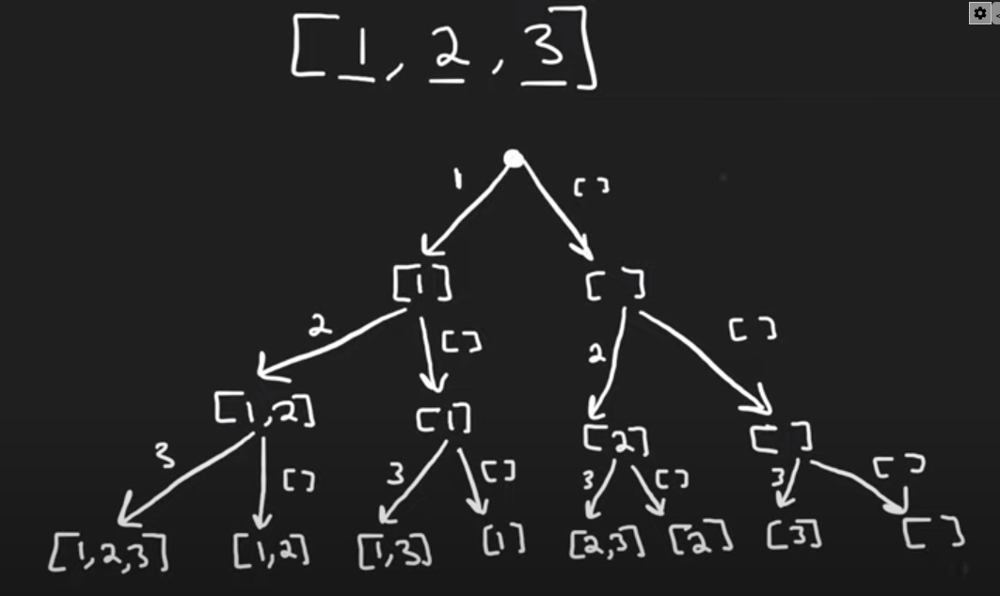
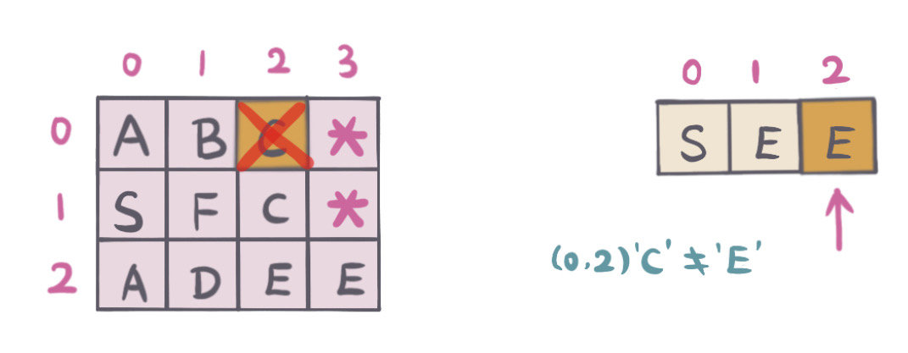

# INDEX

- [INDEX](#index)
  - [Notes](#notes)
  - [Fibonacci Number](#fibonacci-number)
    - [Recursion solution steps](#recursion-solution-steps)
    - [Fibonacci looping solution](#fibonacci-looping-solution)
  - [Restore IP Addresses (Compute all valid IP addresses)](#restore-ip-addresses-compute-all-valid-ip-addresses)
  - [Permutations](#permutations)
  - [Permutations II](#permutations-ii)
  - [Letter Case Permutation](#letter-case-permutation)
  - [Combinations](#combinations)
  - [Subsets](#subsets)
  - [Subsets II](#subsets-ii)
  - [Sum of All Subset XOR Totals](#sum-of-all-subset-xor-totals)
  - [Count Number of Maximum Bitwise-OR Subsets](#count-number-of-maximum-bitwise-or-subsets)
  - [Find Unique Binary String](#find-unique-binary-string)
  - [Partition to K Equal Sum Subsets](#partition-to-k-equal-sum-subsets)
  - [Letter combinations of a phone number](#letter-combinations-of-a-phone-number)
  - [N-Queens](#n-queens)
  - [N-Queens II](#n-queens-ii)
  - [Combination Sum](#combination-sum)
  - [Combination Sum II](#combination-sum-ii)
  - [Word Break](#word-break)
  - [Word Search](#word-search)
  - [Word Search II](#word-search-ii)
  - [Generate Parentheses](#generate-parentheses)
  - [Palindrome Partitioning](#palindrome-partitioning)
  - [Matchsticks to Square](#matchsticks-to-square)
  - [Splitting a String Into Descending Consecutive Values](#splitting-a-string-into-descending-consecutive-values)
  - [Concatenated Words](#concatenated-words)

---

## Notes

- Usually the time complexity of backtracking is `O(2^n)`
  - `2` because we have two choices at each step
  - `n` because we have to make `n` decisions which is usually the `height` of the decision tree

---

## Fibonacci Number

| Video Solution                                                | Hint                                                                                                         |
| ------------------------------------------------------------- | ------------------------------------------------------------------------------------------------------------ |
| [Video Solution](https://www.youtube.com/watch?v=dDokMfPpfu4) | Use **Recursion** to solve this problem. base case: `n < 2`, Use **Memoization** to improve the performance. |

The Fibonacci sequence is a series of numbers where a number is the sum of the two preceding numbers. The sequence starts with `0, 1, 1, 2, 3, 5, 8, 13, 21, 34, ...`

- EX: nth entry = `fib(4) --> 3`

### Recursion solution steps

- The function takes an integer n as input, which represents the position of the number we want to find in the Fibonacci sequence.
- If n is not 0 or 1, the function returns the sum of the previous two numbers in the sequence, which are found by recursively calling the function with `n-1` and `n-2` as inputs.

  - For example, if we call `fib(5)`, the function will return the sum of the previous two numbers in the sequence: `fib(4)` + `fib(3)`. To find `fib(4)`, it will call `fib(3)` and `fib(2)`, and so on, until it reaches the base cases of `fib(0)` and `fib(1)`.
    
  - we will neglect `fib(0)` as it returns 0, and will only focus on `fib(1)`, which returns 1. This means that `fib(2)` will return 1, and `fib(3)` will return 2. This means that `fib(4)` will return 3, and `fib(5)` will return 5.
    

- Solution 1 - using recursion `O(2^n)` --> exponential time (BAD)

  - Time complexity: `O(2^n)` because we're calling the function twice for each number in the sequence and doing this for each level(`n` levels)
  - Space complexity: `O(n)` because we're using `n` levels in the **call stack**

  ```py
  def fib(n):
      if n < 2:
          return n
      return fib(n - 1) + fib(n - 2)
  ```

**INTERVIEW QUESTION:** How can we improve this `O(2^n)` performance?

- **Memoization:** In the current implementation, the function recalculates the same values multiple times, which can be inefficient. We can use memoization to store the results of previous calculations and avoid redundant calculations.
  

  - Time complexity: `O(n)` because we are only calculating each number once (we are only going through each level once) ✅

  ```py
  cache = {}

  def fib(n):
      if n in cache:
          return cache[n]
      elif n < 2:
          return n
      else:
          result = fib(n-1) + fib(n-2)
          cache[n] = result
          return result
  ```

- using generic memoization function (useful for interviews) **(NOT IMPORTANT ❌)**

  ```py
  def slowFib(n):
    if (n < 2):
      return n
    return fib(n - 1) + fib(n - 2)

  # generic memoization function
  def memoize(fn):
    cache = {}
    def memoized(*args):
      if args in cache:
        return cache[args]
      res = fn(*args)
      cache[args] = res
      return res
    return memoized

  # apply memoization to fib function
  fib = memoize(slowFib)
  ```

---

### Fibonacci looping solution

```py
# O(n)
def fib(n):
    total = 0
    fib0, fib1 = 0, 1
    for x in range(n+1):
        if x > 0:
            if x == 1:
                total = 1
            else:
                total = fib0 + fib1
                fib0 = fib1
                fib1 = total
    return total
```

---

## Restore IP Addresses (Compute all valid IP addresses)

| Video Solution                                                | Hint                                                                                                                                                                                                                               |
| ------------------------------------------------------------- | ---------------------------------------------------------------------------------------------------------------------------------------------------------------------------------------------------------------------------------- |
| [Video Solution](https://www.youtube.com/watch?v=61tN4YEdiTM) | Use **Backtracking** to solve this problem. base case: `number of dots == 4` and `index == len(s)`. Then check if the current string is a valid IP address. if it is, add it to the result list. if not, check other combinations. |

Given a string s containing only digits, return all possible valid IP addresses that can be obtained from s. You can return them in any order.

A valid IP address consists of exactly four decimal strings separated by periods, each integer is between `0` and `255`, separated by single dots and cannot have leading zeros. For example, `"0.1.2.201"` and `"192.168.1.1"` are valid IP addresses and `"0.011.255.245"`, `"192.168.1.312"` and `"

- Ex: `s = "25525511135"`

  - Output: `["255.255.11.135", "255.255.111.35"]`

- Explanation:

  - There're 3 periods in a valid IP address, so we can enumerate all possible placements of these periods, and check whether all four corresponding substrings are between `0` and `255`.
    - We can reduce the number of placements considered by spacing the periods `1` to `3` places apart.
    - We can also prune by stopping as soon as the substring is not valid (no leading zeros, and less than `256`).
  - What we want to do is to just know **where to insert the dots**.
  - Bruteforce solution is where we use **Backtracking** to solve this problem. ✅
  - We can use **Decision Tree** to solve this problem.
    - we can put the first `dot` after the first number, **or** after the second number, **or** after the third number.
      - this will result `3` possible combinations for each number
        
      - for each of these combinations, We check if it's valid -> **(if the number is less than `256` or it doesn't start with `0`)**. If it's valid, we then can put the second `dot` after the second number **or** after the third number and so on.
        
        - The "doesn't start with `0`" part is vague, because the problem says that we can't have **leading** zeros, so leading zero means that the number starts with `0` and not just contains `0` in the middle of the number.
          - Ex: `"01"` is not valid, but `"10"` is valid, `"0"` is valid, `"00"` is not valid.
          - So, we can check if `i == j` or `s[i] != '0'` to make sure that the number consists of only 1 number or that it doesn't start with `0`.
  - We can do this by using a helper function that will add the dots to the string. We can then use a `for` loop to iterate through the string and add the dots to the string. We can then use a helper function to check if the current string is a valid IP address. If it is, we can add it to the result list. We can then return the result list.
    - > To check if the IP is valid before adding it to the result list, we can check that we have `4` dots in the string and that the current index is equal to the length of the string.
  - Time complexity: `O(3^4) = O(1)` because we are only checking `3` possible combinations for each number, and we have a total of `4` numbers (`4` levels).
  - Space complexity: call stack `O(4)` because we have `4` levels in the call stack.

```py
def restoreIpAddresses(s):
    res = []
    # check if the string is valid
    if len(s) > 12 or len(s) < 4:
        return res

    def isValidPart(s):
        return len(s) == 1 or (s[0] != '0' and int(s) <= 255)

    def backtrack(i, dots, curIP):
      """
      i: current index in the string
      dots: number of inserted dots in the current IP address so far
      curIP: current IP address that we are building
      """
      # base case
      if dots == 4 and i == len(s):
        res.append(curIP[:-1]) # remove the last dot and append to the result
        return
      if dots > 4:
        return # not a valid IP address

      # loop through the string and add the dots to the string (using min -> to avoid index out of range error if the string is less than 3 characters)
      for j in range(i, min(i+3, len(s))):
        subString = s[i:j+1]
        if isValidPart(subString):
          backtrack(j+1, dots+1, curIP + subString + '.') # add the current string to the current IP address and add a dot

    backtrack(0, 0, '')
    return res
```

- Example with steps for explanation
  
  
  
  
  
  
  
  

---

## Permutations

| Video Solution                                                | Hint                                                                                                                                                                                                                        |
| ------------------------------------------------------------- | --------------------------------------------------------------------------------------------------------------------------------------------------------------------------------------------------------------------------- |
| [Video Solution](https://www.youtube.com/watch?v=KukNnoN-SoY) | Use **Backtracking** to solve this problem. base case: `len(nums) == 0`. Then loop through the array and remove the current element and get the permutations of the remaining elements until we have no more elements left. |

Given an array `nums` of distinct integers, return all the possible permutations. You can return the answer in **any order**.

- Ex: `nums = [1, 2, 3]`

  - Output: `[[1,2,3], [1,3,2], [2,1,3], [2,3,1], [3,1,2], [3,2,1]]`
  - explanation: `permutation` is defined as the **re-arrengement** of the elements of the array. So, `[1,2,3]` and `[2,1,3]` are different permutations.

- Solution 1: **Recursive + Backtracking** ✅

  - Explanation:

    - We can use **Decision Tree** to solve this problem.
    - For each element, we can either choose to include it in the permutation or not include it in the permutation.
      
      - if we choose to include it in the permutation, we can then choose to include the next element in the permutation or not include the next element in the permutation.
      - if we choose to not include it in the permutation, we can then choose to include the next element in the permutation or not include the next element in the permutation.
        
    - We can do so by dividing the problem into subproblems by removing the element and getting the permutations of the remaining elements until we have no more elements left.
      
      
    - Then we can go up the tree and add the element back to the permutation and remove the next element and get the permutations of the remaining elements.
      
      
    - When we have no more elements left, we can append the current permutation to the result list.
      

    

  - Time complexity: `O(n * n!)` -> `O(n!)` because we are generating all the permutations and `O(n)` because we are looping through the array.

  ```py
  def permute(nums):
      res = []

      def backtrack(nums, cur):
          # base case
          if not nums:
              res.append(cur)
              return

          # loop through the nums and remove the current element and get the permutations of the remaining elements
          for i in range(len(nums)):
              backtrack(nums[:i] + nums[i+1:], cur + [nums[i]])

      backtrack(nums, [])
      return res
  ```

- **Solution 2: Iterative**

  - Explanation:

    - We can follow `BFS` approach to solve this problem.
      1. We can start with an empty permutation `[]` and then add each element to the permutation.
      2. When adding the next element to the permutation:
      - we can add it to all the existing permutations
      - we should add it to all possible positions in the permutation
        

  - Time complexity: `O(n * n!)` -> `O(n!)` because we are generating all the permutations and `O(n)` because we are looping through the array.

  ```py
  def permute(nums):
      res = [[]]

      for num in nums:
          new_res = []
          for perm in res:
              # add the current element to all possible positions in the permutation
              for i in range(len(perm)+1):
                  new_res.append(perm[:i] + [num] + perm[i:])
          res = new_res

      return res
  ```

---

## Permutations II

| Video Solution                                                | Hint                                                                                                                                                                                                                                                                                                      |
| ------------------------------------------------------------- | --------------------------------------------------------------------------------------------------------------------------------------------------------------------------------------------------------------------------------------------------------------------------------------------------------- |
| [Video Solution](https://www.youtube.com/watch?v=qhBVWf0YafA) | The trick here is to **sort** the array first. Then we can check if the current element is the same as the previous element. If it is, we can skip it. else we can use the same approach as the previous problem. **OR** we can use a **HashMap** to keep track of the elements that we have seen so far. |

Given a collection of numbers, `nums`, that might contain duplicates, return all possible unique permutations in any order.

- Ex: `nums = [1, 1, 2]`

  - Output: `[[1,1,2], [1,2,1], [2,1,1]]`

- Solution 1: **sorting**

  - Explanation:
    - We can use **Decision Tree** to solve this problem.
    - Same as the previous problem, but we need to check if the current element is the same as the previous element. If it is, we can skip it.
      - This is done by **sorting** the array first. so that the same elements are next to each other.

  ```py
  def permuteUnique(nums):
      res = []
      nums.sort()

      def backtrack(nums, cur):
          # base case
          if not nums:
              res.append(cur)
              return

          for i in range(len(nums)):
              # skip the current element if it is the same as the previous element
              if i > 0 and nums[i] == nums[i-1]:
                  continue
              backtrack(nums[:i] + nums[i+1:], cur + [nums[i]])

      backtrack(nums, [])
      return res
  ```

- Solution 2: **HashMap**

  - Explanation:
    - Same as the previous problem, but we need to check if the current element is the same as the previous element. If it is, we can skip it.
      - This is done using a **HashMap** to keep track of the elements that we have seen so far.
    - We create a Hashmap with the count of each element in the array. to have unique keys
      
    - we use this hashmap to create the decision tree.
      - we update the hashmap by decrementing the count of the current element on each level of the decision tree.
        

  ```py
  def permuteUnique(nums):
      res = []
      count = {}
      for num in nums:
          count[num] = count.get(num, 0) + 1

      def backtrack(cur):
          # base case
          if cur and len(cur) == len(nums):
              res.append(cur)
              return

          # loop through the hashmap (unique keys) and add the current element to the permutation if the count is greater than 0
          for num in count:
              if count[num] > 0:
                  count[num] -= 1
                  backtrack(cur + [num])
                  count[num] += 1

      backtrack([])
      return res
  ```

---

## Letter Case Permutation

Given a string `s`, we can transform every letter individually to be lowercase or uppercase to create another string. Return a list of all possible strings we could create. You can return the output in **any order**.

- Ex: `s = "a1b2"`

  - Output: `["a1b2", "a1B2", "A1b2", "A1B2"]`

- **Recursive solution**

  ```py
  def letterCasePermutation(s):
      res = []
      def backtrack(i, cur):
          # base case
          if i == len(s):
              res.append(cur)
              return
          # include the current character in the permutation
          backtrack(i+1, cur + s[i])
          # include the current character in the permutation after converting it to uppercase or lowercase
          if s[i].isalpha():
              backtrack(i+1, cur + s[i].swapcase())
      backtrack(0, '')
      return res
  ```

- **Iterative solution**
  

  ```py
  def letterCasePermutation(s):
      res = [s] # start with the original string
      for i in range(len(s)):
          if s[i].isalpha():
              # loop through the result list and add the current character to the permutation after converting it to uppercase or lowercase
              for j in range(len(res)):
                  char = res[j][i]
                  res.append(res[j][:i] + char.swapcase() + res[j][i+1:])

      return res
  ```

---

## Combinations

Given two integers `n` and `k`, return all possible combinations of `k` numbers out of the range `[1, n]`.

You may return the answer in **any order**.

- Ex: `n = 4, k = 2`

  - Output: `[[1,2], [1,3], [1,4], [2,3], [2,4], [3,4]]`

> - **Compination:** s a mathematical technique that determines the number of possible arrangements in a collection of items where the **order of the selection does not matter**

- Explanation:

  - We can use **Decision Tree** to solve this problem. (Backtracking)
  - For each element, we can either choose to include it in the combination or not include it in the combination.
  - The height of the decision tree is `k` because we need to choose `k` elements.
    
  - As this is a `combination` problem and not a `permutation` problem, meaning that the order doesn't matter so we don't want duplicates like (`[1,2]` and `[2, 1]`)
    - So, we need to make sure that we don't include the same element twice in the combination.
    - To do so, we need to keep track of the `start` index of the elements that we can choose from. so that we don't choose the same element twice.

  

```py
# Time complexity: O(K * n^k) -> O(n^k) Exponential
def combine(n, k):
    res = []

    def backtrack(start, cur):
        # base case
        if len(cur) == k:
            res.append(cur)
            return

        # loop through the numbers from start to n (including n)
        for i in range(start, n+1):
            backtrack(i+1, cur + [i])

    backtrack(1, [])
    return res
```

---

## Subsets

Given an integer array `nums` of **unique** elements, return all possible subsets (the power set).

The solution set **must not** contain duplicate subsets. Return the solution in **any order**.

- Ex: `nums = [1, 2, 3]`

  - Output: `[[], [1], [2], [3], [1,2], [1,3], [2,3], [1,2,3]]`

- **Recursion DFS solution**

  - Explanation:

    - We can use **Decision Tree** to solve this problem.
      - For each element, we can either choose to include it in the subset or not include it in the subset.
        
        - if we choose to include it in the subset, we can then **choose to include the next element in the subset or not**.
        - if we choose to not include it in the subset, we can then choose to include the next element in the subset or not include the next element in the subset.

    

  - Steps:

    - We can use a helper function `dfs` to build the subsets.
    - We can then use a `for` loop to iterate through the array and call the helper function.
    - We can then return the result list.
    - Time complexity: `O(2^n)` because we are making 2 decisions for each element in the array.

  - Time complexity: `O(n * 2^n)`

  ```py
  def subsets(nums):
      res = []

      def dfs(i, cur):
          # base case
          if i == len(nums):
              res.append(cur)
              return

          # decision to include the current element in the subset
          dfs(i+1, cur + [nums[i]])
          # decision to not include the current element in the subset
          dfs(i+1, cur)

      dfs(0, [])
      return res
  ```

- **Iterative Bfs solution**

  - Explanation:

    - We can start with an empty subset and then add each element to the subset.
    - Example: `[1, 5, 3]`
      
      1. We start with an empty subset `[]`
      2. We add the first number `1` to all the existing subsets to create new subsets -> `[[], [1]]`
      3. We add the second number `5` to all the existing subsets to create new subsets -> `[[], [1], [5], [1,5]]`
      4. We add the third number `3` to all the existing subsets to create new subsets -> `[[], [1], [5], [1,5], [3], [1,3], [5,3], [1,5,3]]`

  - Time complexity: `O(2^n)`, because we are making 2 decisions for each element in the array.
  - Space complexity: `O(2^n)`, because we are creating 2^n subsets.

  ```py
  def subsets(nums):
      res = [[]]

      for num in nums:
          for i in range(len(res)):
              res.append(res[i] + [num])

      return res
  ```

---

## Subsets II

Given an integer array `nums` that may contain duplicates, return all possible subsets (the power set).

The solution set **must not** contain duplicate subsets. Return the solution in **any order**.

- Ex: `nums = [1, 2, 2]`

  - Output: `[[], [1], [1,2], [1,2,2], [2], [2,2]]`

- **Recursive DFS Solution**

  - Explanation:
    - Difference between this problem and the previous problem is that this problem contains duplicates.
      
    - To avoid duplicates, we can sort the array first. then we can **skip** the current element if it is the same as the previous element (by checking `nums[i] == nums[i+1]` and that the next-index is not out of bounds) and then we can skip the current element. by `i += 1`.
      - We **only skip it for the second decision**, for example, if we are at the first decision which to include/exclude `2` in the subset, we can't skip it because we need to make sure that we include `2` in the subset. So we add it to the left subtree.
        
      - But if we include it in the right subtree, we will have duplicates. So we need to skip it (by moving the index to the next element)
        
        

  ```py
  def subsetsWithDup(nums):
      res = []
      nums.sort()

      def dfs(i, cur):
          # base case
          if i == len(nums):
              res.append(cur)
              return

          # include the current element in the subset
          dfs(i+1, cur + [nums[i]])

          # skip the current element if it is the same as the next element
          while i+1 < len(nums) and nums[i] == nums[i+1]:
            i += 1

          # not include the current element in the subset
          dfs(i+1, cur)

      dfs(0, [])
      return res
  ```

- **Iterative BFS Solution**

  - Explanation

    - The same approach as the previous problem, but we need to check if the current element is the same as the previous element. If it is, we can skip it.
    - To do so, first we need to sort the array. This will ensure that all duplicate numbers are next to each other
    - Following the same approach as the previous problem, we can start with an empty subset and then add each element to the subset, But whenever we are about to process duplicate elements, we only add the duplicate element to the right subtree (subset that we created in previous step)
      

  ```py
  def subsetsWithDup(nums):
      res = [[]]
      nums.sort()
      startIdx, endIdx = 0, 0

      for i in range(len(nums)):
          startIdx = 0
          if i > 0 and nums[i] == nums[i-1]:
              startIdx = endIdx + 1
          endIdx = len(res) - 1

          for j in range(startIdx, endIdx+1):
              res.append(res[j] + [nums[i]])

      return res
  ```

---

## Sum of All Subset XOR Totals

The **XOR total** of an array is defined as the bitwise `XOR` of **all its elements**, or `0` if the array is **empty**.

- Ex: `nums = [1, 3]`

  - Output: `6`
  - Explanation: `1 XOR 3 = 2`

- Explanation:

  - We can use **Decision Tree** to solve this problem.
  - we need to get all the `XOR` of all the **subsets**.
    - getting the subsets is the same as the previous problems. (include the current element in the subset or not include the current element in the subset)
    - Then we can get the `XOR` of each subset and add it to the result.

- `XOR` is calculated by `^` operator.

```py
def subsetXORSum(nums):
    res = 0

    def dfs(i, cur):
        nonlocal res
        # base case
        if i == len(nums):
            res += cur
            return

        # include the current element in the subset
        dfs(i+1, cur ^ nums[i])

        # not include the current element in the subset
        dfs(i+1, cur)

    dfs(0, 0)
    return res
```

---

## Count Number of Maximum Bitwise-OR Subsets

Given an integer array `nums`, find the **maximum** possible `bitwise OR` of a **subset** of `nums` and return the number of different **non-empty** subsets with the **maximum** `bitwise OR`.

An array `a` is a **subset** of an array `b` if `a` can be obtained from `b` by deleting some (possibly zero) elements of `b`. Two subsets are considered **different** if the indices of the elements chosen are different.

The `bitwise OR` of an array `a` is equal to `a[0] OR a[1] OR ... OR a[a.length - 1]` (**0-indexed**).

- Ex: `nums = [3, 1]`

  - Output: `2`
  - Explanation: The maximum possible bitwise OR of a subset is `3`. There are `2` subsets with a bitwise OR of `3`:
    - `[3]`
    - `[3,1]`

- Explanation:

  - **We just want to count the number of subsets that have the maximum `bitwise OR`**.
  - We can use **Decision Tree** to solve this problem.
    - For each element, we can either choose to include it in the subset or not include it in the subset.
  - **Maximum Bitwise-OR Subsets** is the maximum bitwise `OR` of a subset -> so we calculate the maximum bitwise `OR` of the array first.
    - which is the (`OR` of all the elements in the array).
  - Time complexity: `O(2^n)` because we are making 2 decisions for each element in the array.

- `OR` is calculated by `|` operator.

```py
def countMaxOrSubsets(nums):
    res = 0
    max_or = 0
    for num in nums:
        max_or |= num

    def dfs(i, cur):
        nonlocal res
        # base case
        if i == len(nums):
            # max is the maximum bitwise OR of a subset which is the max number in the array
            if cur == max_or:
                res += 1
            return

        # include the current element in the subset
        dfs(i+1, cur | nums[i])

        # not include the current element in the subset
        dfs(i+1, cur)

    dfs(0, 0)
    return res
```

---

## Find Unique Binary String

Given an array of strings `nums` containing `n` **unique** binary strings each of length `n`, return _a binary string of length `n` that does not appear in `nums`_. If there are multiple answers, you may return **any of them**.

- EX: `nums = ["01", "10"]`

  - Output: `"11"`
  - Explanation: `"11"` does not appear in `nums` (`"00"` would also be correct) . All the other binary strings of length `2` do appear in `nums`.

- Explanation

  - This is actually a **permutation or subsets** problem.
  - We can use **Decision Tree** to solve this problem.
  - For each element, we can either choose to include `0` in the permutation or include `1` in the permutation.
  - The height of the decision tree is `n` because we need to choose `n` elements.

- Time complexity: `O(2^n)` because we are making 2 decisions for each element in the array.
  - > But actually it's `O(n^2)` because we are making `n` decisions for each element in the array and we will return the first string that is not in the array and not continue to the end of the tree.

```py
def findDifferentBinaryString(nums):
    strSet = set(nums)

    def backtrack(i, cur):
      if i == len(nums):
        res = ''.join(cur)
        return None if res in strSet else res

      # include 0 in the permutation
      res = backtrack(i+1, cur + '0')
      if res: return res

      # include 1 in the permutation
      res = backtrack(i+1, cur + '1')
      if res: return res

    return backtrack(0, '')
```

---

## Partition to K Equal Sum Subsets

Given an integer array `nums` and an integer `k`, return `true` if it is possible to divide this array into `k` non-empty subsets whose sums are all equal.

- Ex: `nums = [4, 3, 2, 3, 5, 2, 1], k = 4`

  - Output: `true`
  - Explanation: It's possible to divide it into 4 subsets (5), (1, 4), (2,3), (2,3) with equal sums.

```py
def canPartitionKSubsets(nums, k):
    target, rem = divmod(sum(nums), k)
    if rem: return False

    def backtrack(i, cur):
        if i == len(nums):
            return True
        if cur == target:
            return backtrack(0, 0)
        for j in range(i, len(nums)):
            if cur + nums[j] <= target:
                nums[i], nums[j] = nums[j], nums[i]
                if backtrack(i+1, cur + nums[i]):
                    return True
                nums[i], nums[j] = nums[j], nums[i]
        return False

    return backtrack(0, 0)
```

---

## Letter combinations of a phone number

| Video Solution                                                | Hint                                                                                                                                                                                                                                                                                                                                                                                                       |
| ------------------------------------------------------------- | ---------------------------------------------------------------------------------------------------------------------------------------------------------------------------------------------------------------------------------------------------------------------------------------------------------------------------------------------------------------------------------------------------------- |
| [Video Solution](https://www.youtube.com/watch?v=0snEunUacZY) | Use **Backtracking** to solve this problem. We can use a **Decision Tree** to solve this problem. For each digit, we can either choose to include it in the combination or not include it in the combination. We can then use a `for` loop to iterate through the letters of the current digit and add it to the combination. Append the combination to the result list when we reach the required length. |

Given a string containing digits from `2-9` inclusive, return all possible letter combinations that the number could represent. Return the answer in **any order**.

- A mapping of digit to letters (just like on the telephone buttons) is given below. Note that `1` does not map to any letters.
  

- EX:

  - Input: `digits = "23"`

- Explanation:
  - For a `7` digit phone number, the brute-force approach is to form `7` ranges of characters, one for each digit.
    - We will need to use `7` nested for-loops to iterate through all the possible combinations.
    - For example, if the number is `"2276696"`:
      - The first digit is `2`, so we form a range of characters from `a` to `c`.
      - The second digit is `2`, so we form a range of characters from `a` to `c`.
      - The third digit is `7`, so we form a range of characters from `p` to `r`.
      - The fourth digit is `6`, so we form a range of characters from `m` to `o`.
      - The fifth digit is `6`, so we form a range of characters from `m` to `o`.
      - The sixth digit is `9`, so we form a range of characters from `w` to `y`.
      - The seventh digit is `6`, so we form a range of characters from `m` to `o`.
    - The drawback of this is its repeated code and the fact that it is not scalable. If the number of digits is `10`, we will need to form `10` ranges of characters, and use `10` nested for-loops to iterate through all the possible combinations.
  - We can use a **backtracking / recursion** approach to solve this problem.
    
    1. We can start with an empty string and then append each letter of the first digit to the string.
    2. Then we can **recursively** call the function with the next digit and append each letter of the next digit to the string. We can continue this process until we reach the end of the string.
    3. Once we reach the end of the string, we can add the string to the result array.
  - Time complexity: `O(n.4^n)` where `n` is the length of the input string; `4` **because some digits has 4 letters at most for each digit**.
    - `4` because we have `4` decisions (branches) for each digit in the input string.
    - `^n` because we have `n` digits in the input string (height of the decision tree).
    - `n` because we are looping through the input string.

```py
def letterCombinations(digits):
    # create a dictionary to store the mapping of each digit to its letters
    digit_letters = {
        '2': 'abc',
        '3': 'def',
        '4': 'ghi',
        '5': 'jkl',
        '6': 'mno',
        '7': 'pqrs',
        '8': 'tuv',
        '9': 'wxyz'
    }

    # create an array to store the result
    result = []

    # create a helper function to do the backtracking
    def backtrack(i, curStr):
        """
        i: the index of the current digit in input digits
        curStr: the current string that we're building
        """
        # if we reached the end of the string, add the string to the result array
        if i == len(digits):
            result.append(curStr)
            return

        # Else: we continue building the string
        # iterate through the letters of the current digit
        for letter in digit_letters[digits[i]]:
            # recursively call the function with the next digit (i+1 because we're moving to the next digit, and add the updated string)
            backtrack(i+1, curStr+letter)

    # call the helper function
    if digits:
        backtrack(0, '')
    return result
```

---

## N-Queens

The **n-queens** puzzle is the problem of placing `n` queens on an `n x n` chessboard such that no two queens attack each other.

Given an integer `n`, return _all distinct solutions to the **n-queens puzzle**_. You may return the answer in **any order**.

Each solution contains a distinct board configuration of the n-queens' placement, where `'Q'` and `'.'` both indicate a queen and an empty space, respectively.

- Ex: `n = 4`
  

  - Output: `[[".Q..","...Q","Q...","..Q."],["..Q.","Q...","...Q",".Q.."]]`

- Explanation:
  - To prevent any queen from attacking another queen, we need to make sure that no two queens are in the same row, column, or diagonal. as the queen moves like this: (Horizontal, Vertical, Positive/Negative Diagonals)
    
  - So:
    - Each queen must be in a different `row`
    - Each queen must be in a different `column`
    - Each queen must be in a different `diagonal`
      
      - Negative diagonals goes from top left to bottom right **(DOWN)**
        
      - Positive diagonals goes from bottom left to top right **(UP)**
        
  - We can use **Decision Tree** to solve this problem.
    
  - Each time we place a queen, we will move to the next row and then, We will need to maintain 3 sets:
    
    - `cols`: to keep track of the columns that have been used
    - `positive_diagonals`: to keep track of the positive diagonals that have been used
    - `negative_diagonals`: to keep track of the negative diagonals that have been used

```py
def solveNQueens(n):
    colSet = set()
    posDiag = set() # (row + col) is the same for all cells in the same positive diagonal (r + c)
    negDiag = set() # (row - col) is the same for all cells in the same negative diagonal (r - c)

    # create a board with all empty cells
    board = [['.'] * n for _ in range(n)]

    # create an array to store the result
    res = []

    def backtrack(row):
        # if we reached the end of the board, add the board to the result array
        if row == n:
            res.append([''.join(row) for row in board])
            return

        # iterate through the columns
        for col in range(n):
            # check if the current column is not used and the current positive diagonal is not used and the current negative diagonal is not used
            if col not in colSet and (row + col) not in negDiag and (row - col) not in posDiag:
                # place the queen and add the current pos to our sets
                board[row][col] = 'Q'
                colSet.add(col)
                negDiag.add(row + col)
                posDiag.add(row - col)

                backtrack(row + 1)

                # remove the queen and remove the current pos from our sets
                board[row][col] = '.'
                colSet.remove(col)
                negDiag.remove(row + col)
                posDiag.remove(row - col)

    backtrack(0)
    return res
```

---

## N-Queens II

The **n-queens** puzzle is the problem of placing `n` queens on an `n x n` chessboard such that no two queens attack each other.

Given an integer `n`, return _the number of distinct solutions to the **n-queens puzzle**_.

- Ex: `n = 4`

  - Output: `2`

- Explanation:

  - Same as the previous problem, but we need to return the number of distinct solutions instead of the solutions themselves.

- Time complexity: `O(n!)` because we are making `n` decisions for each row in the board.
  - **factorial** because we are making `n` decisions for each row in the board. so it's like `n^n` but we are not making `n` decisions for the last row because we are only placing one queen in the last row. so it's like `n!`

```py
def totalNQueens(n):
    colSet = set()
    posDiag = set() # (row + col) is the same for all cells in the same positive diagonal (r + c)
    negDiag = set() # (row - col) is the same for all cells in the same negative diagonal (r - c)
    res = 0

    def backtrack(row):
        # if we reached the end of the board, increase the result by 1
        if row == n:
            res += 1
            return

        # iterate through the columns
        for col in range(n):
            # check if the current column is not used and the current positive diagonal is not used and the current negative diagonal is not used
            if col not in colSet and (row + col) not in negDiag and (row - col) not in posDiag:
                # place the queen and add the current pos to our sets
                colSet.add(col)
                negDiag.add(row + col)
                posDiag.add(row - col)

                backtrack(row + 1)

                # remove the queen and remove the current pos from our sets
                colSet.remove(col)
                negDiag.remove(row + col)
                posDiag.remove(row - col)

    backtrack(0)
    return res
```

---

## Combination Sum

Given an array of **distinct** integers `candidates` and a target integer `target`, return a list of all **unique combinations** of `candidates` where the chosen numbers sum to `target`. You may return the combinations in **any order**.

The **same** number may be chosen from `candidates` an **unlimited number of times**. Two combinations are unique if the frequency of at least one of the chosen numbers is different.

- Ex: `candidates = [2, 3, 6, 7], target = 7`

  - Output: `[[2, 2, 3], [7]]`

- Explanation:

  - Here we won't be able to solve it like [combination-sum-2](#combinations), because we want **Unique** combinations and if we used the same decision tree, we will have duplicate combinations like this:
    
  - To overcome this problem, we will use the same same decision tree in [subsets](#subsets) problem, because it will not lead to duplicate combinations as it doesn't use the same element twice in the same combination.
    - For each element, we can either choose to include it in the combination or not include it in the combination.
    - we can use the decision tree below, because it will not lead to duplicate combinations as it doesn't use the same element twice in the same combination.
      
    - Now we garentee that we will not have duplicate combinations, because in the second side of the tree, we will not include the same element twice in the same combination.
    - if we choose to include it in the combination, we can then choose to include the next element in the combination or not include the next element in the combination.
    - if we choose to not include it in the combination, we can then choose to include the next element in the combination or not include the next element in the combination.


- Time complexity: `O(2^target)` because we are making `2` decisions for each element in the array, and we have `target` levels (height of the decision tree).

```py
def combinationSum(candidates, target):
    res = []

    def dfs(i, cur, total):
        """
        i: pointer to the current index in the array
        cur: current combination that we are building
        total: total sum of the current combination (used instead of sum(cur) to avoid calling sum() function -> O(n)) each time
        """
        if total == target:
            res.append(cur)
            return
        if i >= len(candidates) or total > target:
            return

        # decision to include or not the current element in the combination
        dfs(i, cur + [candidates[i]], total + candidates[i]) # i stays the same because we can use the same element multiple times

        dfs(i+1, cur, total) # i increases by 1 because we want to skip the current element to avoid duplicate combinations

    dfs(0, [], 0)
    return res
```

---

## Combination Sum II

Given a collection of candidate numbers (`candidates`) and a target number (`target`), find all unique combinations in `candidates` where the candidate numbers sum to `target`.

Each number in `candidates` may only be used **once** in the combination. -> **The solution set must not contain duplicate combinations**

- Ex: `candidates = [10, 1, 2, 7, 6, 1, 5], target = 8`

  - Output: `[[1, 1, 6], [1, 2, 5], [1, 7], [2, 6]]`
  - Notice how `1` is used **twice** in the same combination, but it is not used twice in the same combination.

- Explanation:

  - Same as the previous problem, but we need to avoid duplicate combinations.
  - we do so by sorting the array, and then skipping the duplicates.

- Time complexity: `O(nlog(n) . 2^target)`

```py
def combinationSum2(candidates, target):
    res = []
    candidates.sort()

    def dfs(i, cur, total):
        if total == target:
            res.append(cur)
            return
        if i >= len(candidates) or total > target:
            return

        dfs(i+1, cur + [candidates[i]], total + candidates[i])

        # skip the duplicates
        while i < len(candidates) - 1 and candidates[i] == candidates[i+1]:
            i += 1

        dfs(i+1, cur, total)

    dfs(0, [], 0)
    return res
```

---

## Word Break

Given a string `s` and a dictionary of strings `wordDict`, return `true` if `s` can be segmented into a space-separated sequence of one or more dictionary words.

> Note that the same word in the dictionary may be reused multiple times in the segmentation.

- Ex: `s = "leetcode", wordDict = ["leet", "code"]`

  - Output: `true`
  - Explanation: Return true because "leetcode" can be segmented as "leet code".

- Explanation:

  - What we want is to find the index on which we split the string into two substrings, and both substrings are in the dictionary.
    - This is done by using **Dynamic Programming (Backtracking)**.
  - We can check each substring of the string, and check if it is in the dictionary.
    - If it is in the dictionary, then we can check the rest of the string.
      
    - If it is not in the dictionary, then we can skip it and check the next substring.
      
  - We can use a `dp` array to store the result of the subproblems.
    - `dp[i]` will be `true` if the substring `s[:i]` can be segmented into a space-separated sequence of one or more dictionary words.
  - We can iterate through the string, and for each index `i`, we can check if the substring `s[:i]` can be segmented into a space-separated sequence of one or more dictionary words.
    - We can do so by iterating through the string from `0` to `i`, and for each index `j`, we can check if the substring `s[:j]` can be segmented into a space-separated sequence of one or more dictionary words, and if the substring `s[j:i]` is in the dictionary.
  - So if we can get to the **last index** in the `db` and then:
    - If both conditions are `true`, then we can set `dp[i]` to `true`.
      
    - Else: we set `dp[i]` to `false`.
      
    - We can return `dp[-1]` as the result.

- Time complexity: `O(n.m)` where `n` is the length of the string, and `m` is the length of the dictionary.

- Solution 1 ❌❌ (Doesn't work)

  - This solution doesn't work because it doesn't check all the possible combinations.
  - ex: `s = "aaaaaaa", wordDict = ["aaaa", "aaa"]`
    - Output: `false`
    - Explanation: We can't split the string into two substrings, and both substrings are in the dictionary.

  ```py
  def wordBreak(s, wordDict):
      res = [False] * (len(s))
      l = 0
      for r in range(len(s)):
          if s[l:r+1] in wordDict:
              while l <= r:
                  res[l]  True
                  l += 1
      return res[-1]
  ```

- Solution 2 ✅

  - This solution works because it checks all the possible combinations.
  - ex: `s = "aaaaaaa", wordDict = ["aaaa", "aaa"]`
    - Output: `true`
    - Explanation: We can split the string into two substrings, and both substrings are in the dictionary.

  ```py
  def wordBreak(s, wordDict):
      dp = [False] * (len(s) + 1)
      dp[0] = True

      for i in range(1, len(s) + 1):
          for j in range(i):
              if dp[j] and s[j:i] in wordDict:
                  dp[i] = True
                  break

      return dp[-1]

  # ----------------------------------------------------------

  # Solution 2
  def wordBreak(s, wordDict):
      dp = [False] * (len(s) + 1)
      dp[len(s)] = True # base case -> empty string is in the dictionary

      for i in range(len(s)-1, -1, -1):
          for w in wordDict:
              # check if the substring s[i:] is in the dictionary (we first check if there is enough characters to check the substring s[i:])
              if i + len(w) <= len(s) and s[i:i+len(w)] == w:
                  dp[i] = dp[i+len(w)]
              if dp[i]:
                  # if the substring s[i:] is in the dictionary, then we can break the loop
                  break

      # return the result of the subproblem s[:0]
      return dp[0]
  ```

---

## Word Search

Given an `m x n` grid of characters `board` and a string `word`, return `true` if `word` exists in the grid.

The word can be constructed from letters of sequentially adjacent cells, where adjacent cells are horizontally or vertically neighboring. The same letter cell may not be used more than once.

- Ex: `board = [["A","B","C","E"],["S","F","C","S"],["A","D","E","E"]], word = "SEE"`

  - Output: `true`
    img
    
  - Output: `true`

- Explanation:

  - We can use **Backtracking** to solve this problem.
    1. Scan board, find starting position with matching word first letter
    2. From starting position, DFS (4 (`up`, `down`, `left`, `right` **4 directions**) match word's rest letters)
    3. For each visited letter, mark it as visited, by adding it to the `path` set.
       - This is done so that if we started at a letter, and then we went to the right, then when calling `dfs` again on the new letter, we don't go back to the letter we started at (left).
    4. If found any matching, terminate, Otherwise, no matching found, return false.

- Solution Example
  
  
  
  
  
  
  

- Time complexity: `O(n.m.4^s)` where:
  - `n` is the number of rows
  - `m` is the number of columns
  - `s` is the length of the word -> `4` because we have `4` directions

```py
def exist(board, word):
    ROWS, COLS = len(board), len(board[0])
    path = set() # to keep track of the current path and make sure we don't visit the same cell twice

    def dfs(r, c, i):
        if i == len(word):
            return True

        # check if out of bounds or if the current cell is not equal to the current character of the word or if the current cell is in the current path
        if r < 0 or r >= ROWS or c < 0 or c >= COLS or (r, c) in path or board[r][c] != word[i]:
            return False

        # Else we can add the current cell to the current path
        path.add((r, c))

        # Check the neighbors
        res = (
            dfs(r + 1, c, i + 1)
            or dfs(r - 1, c, i + 1)
            or dfs(r, c + 1, i + 1)
            or dfs(r, c - 1, i + 1)
        )

        # Remove the current cell from the current path
        path.remove((r, c))

        return res

    for r in range(ROWS):
      for c in range(COLS):
        if dfs(r, c, 0):
          return True

    return False
```

---

## Word Search II

Given an `m x n` `board` of characters and a list of strings `words`, return all words on the board.

Each word must be constructed from letters of sequentially adjacent cells, where adjacent cells are horizontally or vertically neighboring. **The same letter cell may not be used more than once in a word**.

- Ex: `board = [["o","a","a","n"],["e","t","a","e"],["i","h","k","r"],["i","f","l","v"]], words = ["oath","pea","eat","rain"]`
  

  - Output: `["eat","oath"]`

- Explanation:

  - The difference here between this problem and the previous one is that we have a list of words instead of one word.
    - So if we used the same solution as the previous problem, we will have to call the `exist` function for each word in the list of words, which will result in a **bad** time complexity as we use the `dfs` function for each word in the list of words without making use of current iterations in other words
  - So the better solution is to use a **Trie** data structure to store the list of words and make use of the **prefixes**, and then we can use the `dfs` function to check if the current word is in the Trie or not.
    - If it is, then we can add it to the result list, otherwise, we can continue searching for other words.
  - Steps:
    1. start with the prefix from the board, ex: `"a"` and check if it is in the Trie or not
       
    2. do the same for `"ap"` and so on
       
       
    3. if we didn't have a word with prefix `"ap"` in the Trie, then we can stop searching for other words with the same prefix
       
    4. if we found a word (in the path that we're maintaining), ex: called `"ape"` then we can add it to the result list
       

- Time complexity: `O(n.m.4^s + w.l)` where:
  - `n` is the number of rows
  - `m` is the number of columns
  - `s` is the length of the word -> `4` because we have `4` directions
  - `w` is the number of words
  - `l` is the length of the longest word

```py
class TrieNode:
    def __init__(self):
        self.children = {}
        self.isWord = False # mark if the current node is the end of a word
        self.refs = 0 # to keep track of the number of words that end at the current node

    def addWord(self, word):
        cur = self
        cur.refs += 1 # increment the number of words that end at the current node
        for c in word:
            if c not in cur.children:
                cur.children[c] = TrieNode() # insert the current character in the Trie
            cur = cur.children[c] # move to the next character
            cur.refs += 1 # increment the number of words that end at the current node

        cur.isWord = True # mark the end of the word

    def removeWord(self, word):
        cur = self
        cur.refs -= 1
        for c in word:
            if c in cur.children:
                cur = cur.children[c]
                cur.refs -= 1

class Solution:
    def findWords(self, board: List[List[str]], words: List[str]) -> List[str]:
        # build the Trie
        root = TrieNode()
        for w in words:
            root.addWord(w)

        ROWS, COLS = len(board), len(board[0])
        res, visit = set(), set() # to avoid duplicates

        def dfs(r, c, node, word):
            # node is the current node in the Trie
            # Base case
            if (
              r not in range(ROWS)  or
              c not in range(COLS) or
              board[r][c] not in node.children or
              node.children[board[r][c]].refs < 1 or
              (r, c) in visit
            ):
                return

            visit.add((r, c)) # mark the current cell as visited

            # update node & word
            node = node.children[board[r][c]]
            word += board[r][c]

            if node.isWord:
                res.add(word)
                node.isWord = False # to avoid duplicates
                root.removeWord(word) # to avoid duplicates

            # check the neighbors
            dfs(r + 1, c, node, word)
            dfs(r - 1, c, node, word)
            dfs(r, c + 1, node, word)
            dfs(r, c - 1, node, word)

            visit.remove((r, c)) # backtrack

        for r in range(ROWS):
            for c in range(COLS):
                dfs(r, c, root, "")

        return res
```

---

## Generate Parentheses

Given `n` pairs of parentheses, write a function to generate all combinations of well-formed parentheses.

- Ex: `n = 3`

  - Output: `["((()))","(()())","(())()","()(())","()()()"]`

- Explanation:

  - We can use **Backtracking** to solve this problem.
    - We can start with an empty string and then append `(` to the string and then recursively call the function with the next `(` and then append `)` to the string and then recursively call the function with the next `)` and so on.
    - We can use a `left` variable to keep track of the number of `(` that we have used so far, and a `right` variable to keep track of the number of `)` that we have used so far.
      - We can only add `(` if `left < n` and we can only add `)` if `right < left`.
      - We can stop when `left == right == n`.
    - We can use a `res` array to store the result.
    - We can use a `cur` string to store the current combination that we are building.
    - We can use a `dfs` function to do the backtracking.
      - The base case is when `left == right == n`, we can add the current combination to the result array.
      - Else: we can continue building the combination.
        - If `left < n`, we can add `(` to the current combination and then recursively call the function with the next `(`.
        - If `right < left`, we can add `)` to the current combination and then recursively call the function with the next `)`.


```py
def generateParenthesis(n):
    res = []

    def dfs(left, right, cur):
        if left == right == n:
            res.append(cur)
            return

        if left < n:
            dfs(left + 1, right, cur + '(')

        if right < left:
            dfs(left, right + 1, cur + ')')

    dfs(0, 0, '')
    return res
```

---

## Palindrome Partitioning

Given a string `s`, partition `s` such that every substring of the partition is a **palindrome**. Return all possible palindrome partitioning of `s`.

A **palindrome** string is a string that reads the same backward as forward.

- Ex: `s = "aab"`

  - Output: `[["a","a","b"],["aa","b"]]`

- Explanation:

  - We know that a string with single character is a palindrome. this is because the string reads the same backward as forward.
  - So we can use backtracking to partition the input so that each substring is a palindrome.
    - We can start with an empty array and then add each character of the string to the array and then recursively call the function with the next character and so on.
    - we only add the current character to the array if the current substring is a palindrome.
      - we check if it is a palindrome by checking if the current substring is equal to the reversed substring.


```py
def partition(s):
    res = []

    def dfs(l, cur):
        if l == len(s):
            res.append(cur)
            return

        # Else: we continue building the array
        for r in range(l, len(s)):
            # check if s[l:r+1] is a palindrome
            if s[l:r+1] == s[l:r+1][::-1]:
                dfs(r + 1, cur + [s[l:r+1]])

    dfs(0, [])
    return res
```

---

## Matchsticks to Square

You are given an integer array `matchsticks` where `matchsticks[i]` is the length of the `ith` matchstick. You want to use **all the matchsticks** to make one square. You should **not break** any stick, but you can **link** them up, and each matchstick must be used **exactly one time**.

Return `true` if you can make this square and `false` otherwise.


- Ex: `matchsticks = [1,1,2,2,2]`

  - Output: `true`
  - Explanation: You can form a square with length 2, one side of the square came two sticks with length 1.

- Explanation:

  - We can use **Backtracking** to solve this problem.
    - We can create a decision tree, where each node represents a matchstick and each level represents a side of the square **(`left`, `right`, `top`, `bottom`)**.
    - We can start with the first matchstick and then we can add it to the first side of the square and then recursively call the function with the next matchstick and then add it to the first side of the square and so on.
      
      
    - if a side of the square is bigger than the target length, then we can stop searching for other combinations as we won't be able to make a square from this combination. And if so we **BACKTRACK**.
      
    - We do this recursively until we reach the last matchstick.
      - If we reached the last matchstick and we were able to make a square, then we can return `True`, otherwise, we can return `False`.

- Time complexity: `O(4^n)` where `n` is the number of matchsticks.
  - We are making `4` decisions for each matchstick, and we have `n` matchsticks.

```py
def makesquare(matchsticks):
    length = sum(matchsticks) // 4
    sides = [0] * 4

    if sum(matchsticks) % 4 != 0:
        return False

    # sort the matchsticks in descending order to make the backtracking faster (exit the decision tree at the beginning)
    matchsticks.sort(reverse=True)

    def dfs(i):
        """
        i: pointer to the current index in the matchsticks array
        """
        # Base case (if we reached the end of the matchsticks array)
        if i == len(matchsticks):
            return True

        # Else: we continue building the square
        for j in range(4):
            # check if the current matchstick can be added to the current side of the square
            if sides[j] + matchsticks[i] <= length:
                sides[j] += matchsticks[i]
                if dfs(i + 1):
                    return True
                # BACKTRACK -> remove the current matchstick from the current side of the square after processing it
                sides[j] -= matchsticks[i]

        return False

    return dfs(0)
```

---

## Splitting a String Into Descending Consecutive Values

You are given a string `s` that consists of only digits.

Check if we can split `s` into two or more **non-empty** substrings such that:

1. the **numerical values** of the substrings are in **descending order**
2. the **difference** between **numerical values** of every two **adjacent** substrings is equal to `1`.

- Ex: `s = "1234"`

  - Output: `false`
  - Explanation: There is no valid way to split s.

- Explanation:
  - We can use **Backtracking** to solve this problem.
    - We can start with an empty string and then add each character of the string to the string and then recursively call the function with the next character and so on.
      
    - We can use a `prev` variable to keep track of the previous substring.
      - We can check if the current substring is equal to the previous substring + 1.
        
      - If so, we can continue building the string.
      - Else: we can stop building the string.

```py
def splitString(s):
    def dfs(i, prev):
        if i == len(s):
            return True

        # Else: we continue building the string
        for j in range(i, len(s)):
            cur = int(s[i:j+1])
            # check if the current substring is equal to the previous substring - 1 (DESCENDING ORDER)
            if cur == prev - 1 and dfs(j + 1, cur):
                return True

        return False

    for i in range(len(s) - 1): # -1 because we need at least 2 substrings
        val = int(s[:i+1])
        if dfs(i + 1, val):
            return True

    return False
```

---

## Concatenated Words

Given an array of strings `words` (without duplicates), return all the concatenated words in the given list of words.

TODO: watch [neetcode video](https://www.youtube.com/watch?v=iHp7fjw1R28)

```py
def findAllConcatenatedWordsInADict(words):
    def dfs(word):
        if word in memo:
            return memo[word]

        for i in range(1, len(word)):
            prefix = word[:i]
            suffix = word[i:]

            if prefix in word_set and suffix in word_set:
                memo[word] = True
                return True

            if prefix in word_set and dfs(suffix):
                memo[word] = True
                return True

        memo[word] = False
        return False

    memo = {}
    word_set = set(words)
    ans = []

    for word in words:
        if dfs(word):
            ans.append(word)

    return ans
```
