# INDEX

- [INDEX](#index)
  - [Notes](#notes)
  - [Min Cost Climbing Stairs](#min-cost-climbing-stairs)
  - [Climbing Stairs](#climbing-stairs)
  - [Best Time to Buy and Sell Stock](#best-time-to-buy-and-sell-stock)
  - [Best Time to Buy and Sell Stock II](#best-time-to-buy-and-sell-stock-ii)
  - [Best Time to Buy and Sell Stock III](#best-time-to-buy-and-sell-stock-iii)
  - [Counting Bits](#counting-bits)
  - [House Robber](#house-robber)
  - [House Robber II](#house-robber-ii)
  - [Best Time to Buy and Sell Stock with Cooldown](#best-time-to-buy-and-sell-stock-with-cooldown)
  - [Knight Probability in Chessboard](#knight-probability-in-chessboard)
  - [Knight Dialer](#knight-dialer)
  - [Coin Change](#coin-change)
  - [Coin Change II](#coin-change-ii)
  - [Student Attendance Record II](#student-attendance-record-ii)
  - [Longest Common Subsequence](#longest-common-subsequence)
  - [Unique Paths](#unique-paths)
  - [Maximum Profit in Job Scheduling](#maximum-profit-in-job-scheduling)
  - [Jump Game](#jump-game)
  - [Jump Game II](#jump-game-ii)
    - [Valid Parenthesis String](#valid-parenthesis-string)
  - [0 or 1 Knapsack Pattern](#0-or-1-knapsack-pattern)
    - [0/1 Knapsack](#01-knapsack)
    - [Unbounded KnapSack](#unbounded-knapsack)
    - [Partition Equal Subset Sum](#partition-equal-subset-sum)
    - [Partition Array Into Two Arrays to Minimize Sum Difference](#partition-array-into-two-arrays-to-minimize-sum-difference)
    - [Target Sum](#target-sum)

---

## Notes

- Usually when you see `min` or `max` in the problem, it's a sign that we can use **dynamic programming**. because we will be using the results of the subproblems to solve the main problem and is a way of optimizing recursive algorithms.
- When solving `DP` problems, we usually need to figure out the **base cases** and the **recurrence relation**.
  - **Base cases** are the simplest cases that we can solve without using the results of the subproblems.
  - **Recurrence relation** is the relation between the current problem and the subproblems. -> what is memoized.
- Usually `Bottom-up` approach is better than `Top-down` approach because it doesn't use recursion and it's faster.
  - `Bottom-up` usually is Iterative and `Top-down` is Recursive.
  - `Bottom-up` Time complexity is usually `O(n)` and `Top-down` is usually `O(n^2)`.
  - `Bottom-up` Space complexity is usually `O(n)` and `Top-down` is usually `O(n)`.

---

## Min Cost Climbing Stairs

| Video Solution                                                | Hint                                                                                                                                                                                                                                                                                                                                                                                                  |
| ------------------------------------------------------------- | ----------------------------------------------------------------------------------------------------------------------------------------------------------------------------------------------------------------------------------------------------------------------------------------------------------------------------------------------------------------------------------------------------- |
| [Video Solution](https://www.youtube.com/watch?v=ktmzAZWkEZ0) | Try using dynamic programming. Suppose you have solved the problem for `i - 1`. How can you extend that to solve it for `i`? you solve it by finding the minimum cost to get to the `i - 1th` and `i - 2th` step, and adding that to the cost of climbing on top from there. This gives you a new array, `dp` of size `n`. **OR** use a top-down approach (memoization) with a `dfs` helper function. |

You are given an integer array `cost` where `cost[i]` is the cost of `ith` step on a staircase. Once you pay the cost, you can either climb one or two steps.

You can either start from the step with index `0`, or the step with index `1`.

Return the minimum cost to reach the top of the floor.

- Ex:

  - Input: `cost = [10,15,20]`
  - Output: `15`
  - Explanation: Cheapest is: start on cost[1], pay that cost, and go to the top.

- Explanation:

  - This is a `DP` problem, because we will be using the results of the subproblems to solve the main problem.

- **Top-down approach (memoization)**

  - Here, we start at the top step and try to reach the bottom step.
  - We can then create a `dfs helper` function that takes the current step as an argument
  - We can create a `memo` dictionary to store the minimum cost to reach each step

  ```py
  # O(n) time | O(n) space
  def minCostClimbingStairs(cost: List[int]) -> int:
      memo = {} # key=index, value=minCost

      def dfs(index):
          if index >= len(cost):
              return 0

          if index in memo:
              return memo[index]

          memo[index] = min(dfs(index + 1), dfs(index + 2)) + cost[index]
          return memo[index]

      return min(dfs(0), dfs(1))
  ```

- **Bottom-up approach** ✅

  - Here, we start at the bottom step **(Base cases)** and try to reach the top step.
  - We can create an array of size `n` to store the minimum cost to reach each step
    - last step is the top step and will have default value of `0` which is the minimum cost to reach it
    - the step before the top step and will also have default value of `0` which is the minimum cost to reach the top step
  - We can then loop through the array and calculate the minimum cost to reach each step
    - The minimum cost to reach the current step is equal to `the minimum cost to reach the previous step + the cost of the current step`.
      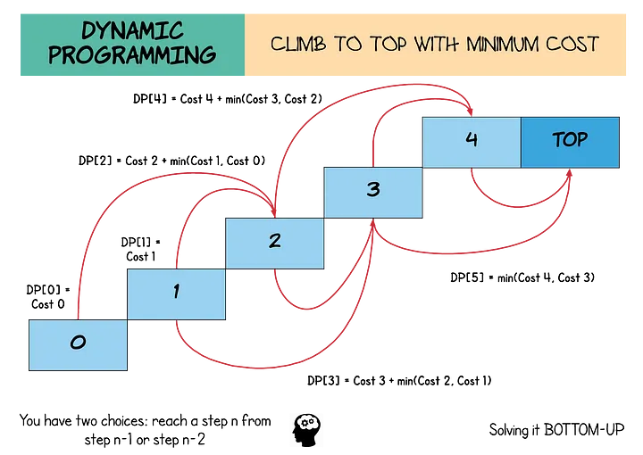
    - We can then return the **minimum between the last two elements** in the array which indicates the minimum cost to reach the top step

  ```py
  def minCostClimbingStairs(cost: List[int]) -> int:
      # Array with minimum cost to reach each step
      dp = [0] * len(cost)

      # Set the first two elements in the array to the cost of the first two steps
      dp[0] = cost[0]
      dp[1] = cost[1]

      # Loop through the array and calculate the minimum cost to reach each step
      for i in range(2, len(cost)):
          # The minimum cost to reach the current step is equal to the minimum cost to reach the previous step + the cost of the current step
          dp[i] = min(dp[i - 1], dp[i - 2]) + cost[i]

      # Return the minimum between the last two elements in the array
      return min(dp[-1], dp[-2])

  # Optimizing space complexity
  def minCostClimbingStairs(cost: List[int]) -> int:
      # Set the first two elements in the array to the cost of the first two steps
      first = cost[0]
      second = cost[1]

      for i in range(2, len(cost)):
          current = min(first, second) + cost[i]
          first = second
          second = current

      # Return the minimum between the last two elements in the array
      return min(first, second)
  ```

---

## Climbing Stairs

| Video Solution                                                | Hint                                                                                                                                                                                                                                                                                                                                                                                                                                                                                                                                                                                                                         |
| ------------------------------------------------------------- | ---------------------------------------------------------------------------------------------------------------------------------------------------------------------------------------------------------------------------------------------------------------------------------------------------------------------------------------------------------------------------------------------------------------------------------------------------------------------------------------------------------------------------------------------------------------------------------------------------------------------------- |
| [Video Solution](https://www.youtube.com/watch?v=Y0lT9Fck7qI) | use a top-down approach (memoization) with a `dfs` helper function, by checking if we reached the top step and return `1` if we did, otherwise return `0` Then we can calculate the number of ways to reach the current step by adding the number of ways to reach the previous step and the number of ways to reach the step before the previous step (because we can take 1 or 2 steps at a time), **OR** use a bottom-up approach by creating an array of size `n + 1` to store the number of ways to reach each step ans starting from the last 2 steps and calculating the number of ways to reach each step backwards. |

You are climbing a staircase. It takes `n` steps to reach the top.

Each time you can either climb `1` or `2` steps. In how many distinct ways can you climb to the top?
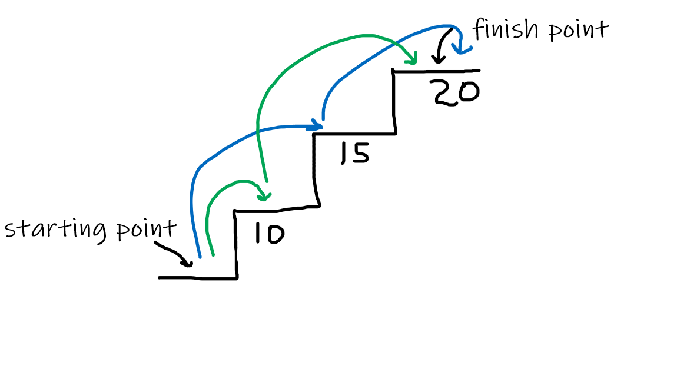

- Ex:

  - Input: `n = 4` -> `5` steps

- **Explanation**

  - We can use **dynamic programming** to solve this problem using a **bottom-up** approach or a **top-down (memoization)** approach.

- Solution 1: Memoization

  - Here, we start at `0` and try to reach the top step.
  - We can then create a `dfs helper` function that takes the current step as an argument
    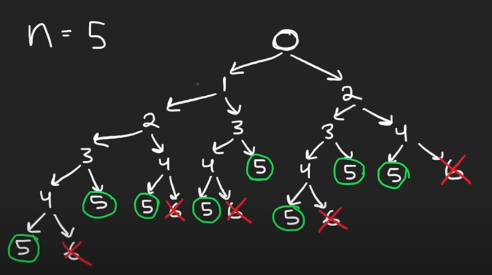
  - We can create a `memo` dictionary to store the number of ways to reach each step
    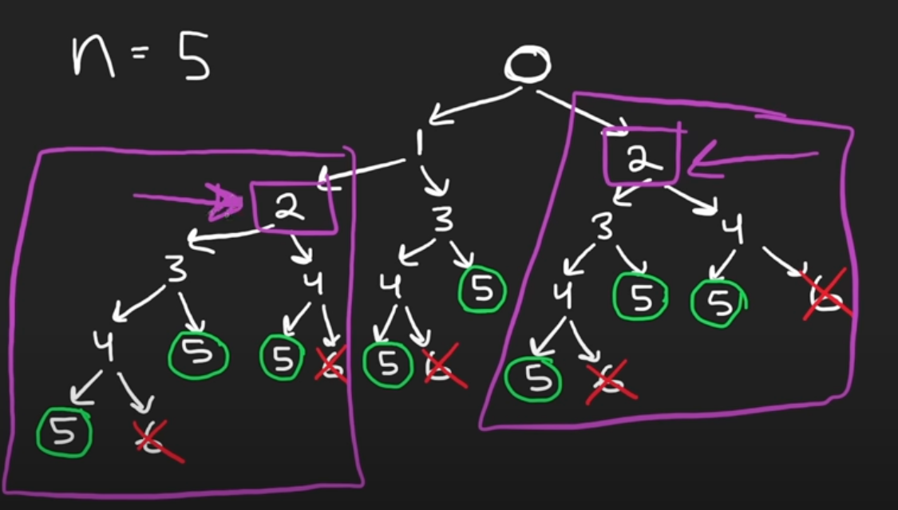

  ```py
  # Without memoization
  # O(2^n) time | O(n) space
  def climbStairs(n):
      def dfs(step):
          if step == n: return 1
          if step > n: return 0
          return dfs(step + 1) + dfs(step + 2)

      return dfs(0)

  # -------------------------------------------------------------------

  # With memoization
  # O(n) time | O(n) space
  def climbStairs(n):
      memo = {}
      def dfs(step):
          # If we reach the top step, return 1
          if step == n:
              return 1
          # If we go beyond the top step, return 0
          if step > n:
              return 0
          # If we already calculated the number of ways to reach the current step, return it
          if step in memo:
              return memo[step]
          # Calculate the number of ways to reach the current step
          memo[step] = dfs(step + 1) + dfs(step + 2)
          return memo[step]

      return dfs(0)
  ```

- Solution 2: Bottom-up

  - Here, we start at `n` and try to reach the bottom step (`0` step)
    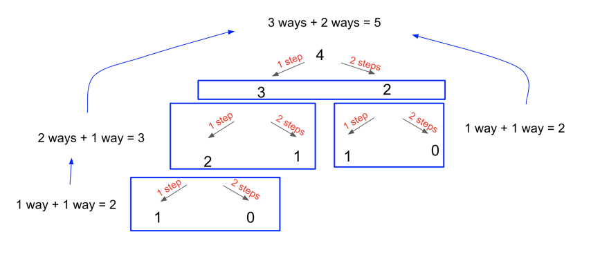
  - We can create an array of size `n + 1` to store the number of ways to reach each step
    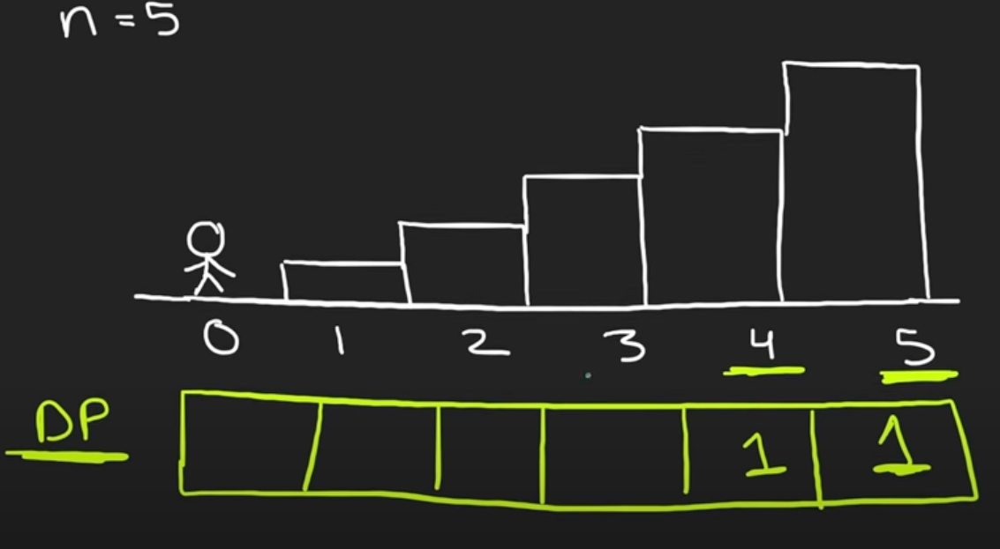
    - last step is the top step and will have default value of `1` which is the number of ways to reach it
    - the step before the top step and will also have default value of `1` which is the number of ways to reach the top step
  - We can then loop through the array and calculate the number of ways to reach each step
    - The number of ways to reach the current step is equal to the number of ways to reach the previous step + the number of ways to reach the step before the previous step **(because we can take 1 or 2 steps at a time)**
      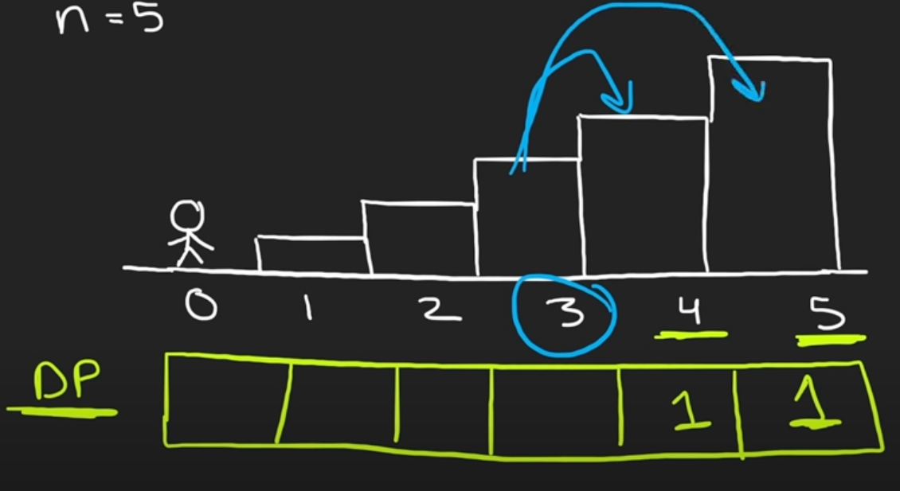
    - We can then return the last element in the array which indicates the number of ways to reach the bottom step

  ```py
  # O(n) time | O(n) space
  def climbStairs(n):
      # create an array of size n + 1 to store the number of ways to reach each step
      dp = [0] * (n + 1)

      # set the first two elements in the array to 1
      dp[0] = 1 # can reach the first step in 1 way
      dp[1] = 1 # can reach the second step in 1 way

      # loop through the array and calculate the number of ways to reach each step
      for i in range(2, n + 1):
          dp[i] = dp[i - 1] + dp[i - 2]

      # return the last element in the array
      return dp[-1]

  # ------------------------------------------------------------------------------------
  # Another solution with O(1) space
  def climbStairs(n):
      first = 1
      second = 1
      for i in range(2, n + 1):
          temp = first + second
          first = second
          second = temp
      return second
  ```

---

## Best Time to Buy and Sell Stock

| Video Solution                                                | Hint                                                                                                                                                                                                                                                      |
| ------------------------------------------------------------- | --------------------------------------------------------------------------------------------------------------------------------------------------------------------------------------------------------------------------------------------------------- |
| [Video Solution](https://www.youtube.com/watch?v=1pkOgXD63yU) | Use **2 pointers** to keep track of the minimum price so far and the maximum profit so far if the current price is greater than the minimum price so far, else move the left pointer to the right pointer because we can't sell a stock before buying it. |

Choose a single day to buy one stock and choose a different day in the future to sell that stock. Return the maximum profit that can be achieved from this transaction. If no profit can be achieved, return `0`.

- Ex:

  - Input: `prices = [7,1,5,3,6,4]`
  - Output: `5`
  - Explanation: Buy on day 2 (price = 1) and sell on day 5 (price = 6), profit = 6-1 = 5.

- Solution 1: DP

  - TODO: add explanation

  ```py
  def maxProfit(prices: List[int]) -> int:
      currMin = float('inf')
      maxProfit = 0

      for price in prices:
          if price < currMin:
              currMin = price
          elif price - currMin > maxProfit:
              maxProfit = price - currMin
      return maxProfit

  # ------------------------------------ OR ------------------------------------

  def maxProfit(prices: List[int]) -> int:
      min_price_so_far = float('inf')
      max_profit = 0

      for price in prices:
          max_profit_sell_today = price - min_price_so_far
          max_profit = max(max_profit, max_profit_sell_today)
          min_price_so_far = min(min_price_so_far, price)

      return max_profit
  ```

- Solution 2: **2 pointers** ✅

  ```py
  def maxProfit(prices: List[int]) -> int:
      maxProfit = 0
      l = 0

      for r in range(1, len(prices)):
          if prices[l] < prices[r]:
              maxProfit = max(maxProfit, prices[r] - prices[l])
          else:
              l = r # move the left pointer to the right pointer

      return maxProfit
  ```

---

## Best Time to Buy and Sell Stock II

| Video Solution                                                | Hint                                                                                                                                                                                                                                                                                                          |
| ------------------------------------------------------------- | ------------------------------------------------------------------------------------------------------------------------------------------------------------------------------------------------------------------------------------------------------------------------------------------------------------- |
| [Video Solution](https://www.youtube.com/watch?v=3SJ3pUkPQMc) | Use **2 pointers** to keep track of the minimum price so far and the maximum profit so far if the current price is greater than the previous price, then update the left pointer to the right pointer because we can't sell a stock before buying it. **(It's like a sliding window with a fixed size of 2)** |

You are given an integer array `prices` where `prices[i]` is the price of a given stock on the `ith` day. On each day, you may decide to buy and/or sell the stock. You can only hold **at most one** share of the stock at any time. However, you can buy it then immediately sell it on the **same day**.

Find and return _the **maximum** profit you can achieve_.

- Ex:

  - Input: `prices = [7,1,5,3,6,4]`
  - Output: `7`
  - Explanation: Buy on day 2 (price = 1) and sell on day 3 (price = 5), profit = 5-1 = 4. Then buy on day 4 (price = 3) and sell on day 5 (price = 6), profit = 6-3 = 3.

- Solution 1: DP

  ```py
  def maxProfit(prices: List[int]) -> int:
      maxProfit = 0

      for i in range(1, len(prices)):
          if prices[i] > prices[i - 1]:
              maxProfit += prices[i] - prices[i - 1]

      return maxProfit
  ```

- Solution 2: 2 pointers

  ```py
  def maxProfit(prices: List[int]) -> int:
      l = 0
      maxProfit = 0

      for r in range(1, len(prices)):
          if prices[l] < prices[r]:
              maxProfit += prices[r] - prices[l]
          l = r # move the left pointer to the right pointer

      return maxProfit
  ```

---

## Best Time to Buy and Sell Stock III

You are given an array `prices` where `prices[i]` is the price of a given stock on the `ith` day. Find the maximum profit you can achieve. You may complete **at most two transactions**.

**Note:** You may not engage in multiple transactions simultaneously (i.e., you must sell the stock before you buy again).

- Ex:

  - Input: `prices = [3,3,5,0,0,3,1,4]`
  - Output: `6`
  - Explanation: Buy on day 4 (price = 0) and sell on day 6 (price = 3), profit = 3-0 = 3. Then buy on day 7 (price = 1) and sell on day 8 (price = 4), profit = 4-1 = 3.

- Explanation:

  - The brute force solution is to try all possible combinations of buying and selling the stock which will take `O(n^4)` time. because we have `O(n^2)` possible combinations and each combination takes `O(n)` time to calculate the profit.
  - We can use **dynamic programming** to solve this problem using a **bottom-up** approach.
  - We can take advantage of the fact that we can only complete at most two transactions. so we can divide the problem into two subproblems:
    - Find the maximum profit for the first transaction.
    - Find the maximum profit for the second transaction. and add it to the maximum profit for the first transaction.
  - we can find the max profit for the first transaction using the same approach in the previous problem **(Best Time to Buy and Sell Stock)**. and then iterate backwards and find the max profit for the second transaction. Then we combine the two profits and return the maximum profit.

```py
def buyAndSellStockTwice(prices: List[int]) -> int:
    max_total_profit, min_price_so_far = 0, float('inf')
    first_buy_sell_profits = [0] * len(prices) # max profit for the first buy and sell

    # Forward phase. For each day, we record maximum profit if we sell on that day
    for i, price in enumerate(prices):
        min_price_so_far = min(min_price_so_far, price)
        max_total_profit = max(max_total_profit, price - min_price_so_far)
        first_buy_sell_profits[i] = max_total_profit

    # Backward phase. For each day, find the maximum profit if we make the second buy on that day
    max_price_so_far = float('-inf')
    for i, price in reversed(list(enumerate(prices[1:], 1))):
        max_price_so_far = max(max_price_so_far, price)
        max_total_profit = max(max_total_profit, max_price_so_far - price + first_buy_sell_profits[i - 1])

    return max_total_profit

# ---------------------------------------------------------------------------------------------

# Another solution
def buyAndSellStockTwice(prices: List[int]) -> int:
    if not prices: return 0

    # initialize variables for first buy, first sell, second buy, and second sell
    buy1, buy2 = float('inf'), float('inf')
    sell1, sell2 = 0, 0

    # iterate over prices to update buy and sell values
    for price in prices:
        # update first buy and sell values
        buy1 = min(buy1, price)
        sell1 = max(sell1, price - buy1)
        # update second buy and sell values
        buy2 = min(buy2, price - sell1)
        sell2 = max(sell2, price - buy2)  return sell2

    return sell2
```

---

## Counting Bits

| Video Solution                                                | Hint                                                                                                                                                                                                                                                                                                                                                                     |
| ------------------------------------------------------------- | ------------------------------------------------------------------------------------------------------------------------------------------------------------------------------------------------------------------------------------------------------------------------------------------------------------------------------------------------------------------------ |
| [Video Solution](https://www.youtube.com/watch?v=RyBM56RIWrM) | Use a bottom-up dynamic programming approach to solve this problem. Initialize a dp array to store the count of 1s in the binary representation of each number. Start with 0 for the first element. For each number, if it's even, its 1s count is the same as that of the number divided by 2. If it's odd, the count is one more than that of the number divided by 2. |

Given an integer `n`, return an array ans of length n + 1 such that for each i (0 <= i <= n), ans[i] is the number of 1's in the binary representation of i.

- Ex:

  - Input: `n = 2`
  - Output: `[0,1,1]`
  - Explanation:
    - `0` --> `0`
    - `1` --> `1`
    - `2` --> `10`

- Explanation:

  - To count the number of `1s` in the binary representation of a number, we can **integer-divide (`//`)** the number by `2` and count the number of `1s` in the binary representation of the quotient.

    ```py
    # Ex: 3 --> O(log(n)
    3 % 2 = 1 # count = 1
    3 // 2 = 1 # shift the number to the right by 1 bit
    1 % 2 = 1 # count = 2
    1 // 2 = 0 # shift the number to the right by 1 bit
    0 % 2 = 0 # count = 2 (END)
    ```

  - This is a `DP` problem, because we will be using the results of the subproblems to solve the main problem.
  - We will use a `dp` array to store the number of `1s` in the binary representation of each number.
    - We will start by filling the first element in the array with `0` because the number `0` has no `1s` in its binary representation.
    - We will then loop through the array and calculate the number of `1s` in the binary representation of each number.
    - If the number is even, then the number of `1s` in its binary representation is equal to the number of `1s` in the binary representation of the number divided by `2`.
    - If the number is odd, then the number of `1s` in its binary representation is equal to the number of `1s` in the binary representation of the number divided by `2` + `1`.

```py
def countBits(n):
    # create an array of size n + 1 to store the number of 1s in the binary representation of each number
    dp = [0] * (n + 1)

    # loop through the array and calculate the number of 1s in the binary representation of each number
    for i in range(1, n + 1):
        # if the number is even, then the number of 1s in its binary representation is equal to the number of 1s in the binary representation of the number divided by 2
        if i % 2 == 0:
            dp[i] = dp[i // 2]
        # if the number is odd, then the number of 1s in its binary representation is equal to the number of 1s in the binary representation of the number divided by 2 + 1
        else:
            dp[i] = dp[i // 2] + 1

    # return the array
    return dp
```

---

## House Robber

| Video Solution                                                | Hint                                                                                                                                                                                                                                                                                                                                                                                                              |
| ------------------------------------------------------------- | ----------------------------------------------------------------------------------------------------------------------------------------------------------------------------------------------------------------------------------------------------------------------------------------------------------------------------------------------------------------------------------------------------------------- |
| [Video Solution](https://www.youtube.com/watch?v=73r3KWiEvyk) | Use a bottom-up dynamic programming approach. Initialize a dp array to store the maximum money we can rob per house. The maximum money from each house is the maximum of (money from the previous house OR money from the house before the previous plus money from the current house). **Alternatively**, use naive approach by looping twice to rob even and odd houses separately, and return the maximum sum. |

You are a professional robber planning to rob houses along a street. Each house has a certain amount of money stashed, the only constraint stopping you from robbing each of them is that **adjacent houses have security systems connected** and **it will automatically contact the police if two adjacent houses were broken into on the same night**.

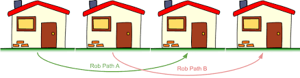

Given an integer array `nums` representing the amount of money of each house, return the maximum amount of money you can rob tonight **without alerting the police**.

- Ex:

  - Input: `nums = [1,2,3,1]`
  - Output: `4`
  - Explanation: Rob house `1` (money = 1) and then rob house `3` (money = 3).
    - Total amount you can rob = `1 + 3` = `4`.

- Explanation:

  - This is a `DP` problem, because we will be using the results of the subproblems to solve the main problem.
  - We will use a `dp` array to store the maximum amount of money we can rob for each house.
    - We will start by filling the first element in the array with the amount of money in the first house.
    - We will then loop through the array and calculate the maximum amount of money we can rob for each house.
    - The maximum amount of money we can rob for the current house is equal to the maximum amount of money we can rob for the previous house + the amount of money in the current house.
    - We will return the last element in the array which indicates the maximum amount of money we can rob for the last house.

- Solution 1: using `dp` array

  ```py
  def rob(nums: List[int]) -> int:
      # Arrya with maximum amount of money we can rob for each house
      dp = [0] * len(nums)

      # set the first element in the array to the amount of money in the first house
      dp[0] = nums[0]

      # loop through the array and calculate the maximum amount of money we can rob for each house
      for i in range(1, len(nums)):
          # the maximum amount of money we can rob for the current house is equal to the maximum amount of money we can rob for the previous house + the amount of money in the current house
          dp[i] = max(dp[i - 1], dp[i - 2] + nums[i])

      # return the last element in the array
      return dp[-1]
  ```

- Solution 2: using 2 variables ✅

  ```py
  def rob(nums: List[int]) -> int:
      prev1 = 0 # maximum amount of money we can rob for the previous house
      prev2 = 0 # maximum amount of money we can rob for the house before the previous house

      for num in nums:
          # the maximum amount of money we can rob for the current house is equal to the maximum amount of money we can rob for the previous house + the amount of money in the current house
          temp = prev1
          prev1 = max(prev1, prev2 + num)
          prev2 = temp

      return prev1
  ```

- Solution 3: Naive approach ✅

  - loop 2 times, one time to rob the even houses and one time to rob the odd houses, and return the maximum between the two sums.
  - Time complexity: `O(n)`
  - Space complexity: `O(1)`

  ```py
  def rob(nums: List[int]) -> int:
      even_sum = 0
      odd_sum = 0

      for i in range(len(nums)):
          if i % 2 == 0:
              even_sum += nums[i]
          else:
              odd_sum += nums[i]

      return max(even_sum, odd_sum)

  # ------------------------------------ OR ------------------------------------

  def rob(nums: List[int]) -> int:
      even_sum = 0
      odd_sum = 0

      for i in range(0, len(nums), 2):
          even_sum += nums[i]
      for i in range(1, len(nums), 2):
          odd_sum += nums[i]

      return max(even_sum, odd_sum)
  ```

---

## House Robber II

| Video Solution                                                | Hint                                                                                                                                                                                                    |
| ------------------------------------------------------------- | ------------------------------------------------------------------------------------------------------------------------------------------------------------------------------------------------------- |
| [Video Solution](https://www.youtube.com/watch?v=rWAJCfYYOvM) | Use same approach as previous problem, but wrap the implementation in a helper function and call it twice: one with `nums[:-1]` and one with `nums[1:]`. Then return the maximum between the two calls. |

You are a professional robber planning to rob houses along a street. Each house has a certain amount of money stashed. All houses at this place are **arranged in a circle**. That means the first house is the neighbor of the last one. Meanwhile, adjacent houses have a security system connected, and it will automatically contact the police if two adjacent houses were broken into on the same night.

Given an integer array `nums` representing the amount of money of each house, return the maximum amount of money you can rob tonight **without alerting the police**.

- Ex:

  - Input: `nums = [2,3,2]`
  - Output: `3`
  - Explanation: You cannot rob `house 1` (money = 2) and then rob `house 3` (money = 2), because they are adjacent houses.

- Explanation:

  - Difference between this problem and the previous one is that the houses are arranged in a circle. So we can't rob the first and last houses at the same time.
  - We can solve this problem by dividing it into two problems:
    - Rob houses from `0` to `n - 2` -> `dp1`
    - Rob houses from `1` to `n - 1` -> `dp2`
  - Then we can return the maximum between `dp1` and `dp2`.

  - Here we will use the same solution as the previous problem, but we will wrap the implementation in a helper function and call it twice:
    - one with `nums[:-1]` -> `dp1`
    - one with `nums[1:]` -> `dp2`
  - Then we can return the maximum between `dp1` and `dp2`.

```py
def rob(nums: List[int]) -> int:
    if len(nums) == 1:
        return nums[0]

    def robHelper(nums):
        prevBy1 = 0 # maximum amount of money we can rob for theprevious house
        prevBy2 = 0 # maximum amount of money we can rob for the housebefore the previous house

        for num in nums:
            # the maximum amount of money we can rob for the current house is equal to the maximum amount of money we can rob for the previous house + the amount of money in the current house
            temp = prevBy1
            prevBy1 = max(prevBy1, prevBy2 + num)
            prevBy2 = temp

        return prevBy1

    return max(robHelper(nums[:-1]), robHelper(nums[1:]))

# ------------------------------------ OR ------------------------------------

# Same solution with different variable names
def rob(nums: List[int]) -> int:
    if len(nums) == 1: return nums[0]

    def robHelper(nums):
        prevMax = 0
        currMax = 0

        for num in nums:
            temp = currMax
            currMax = max(currMax, prevMax + num)
            prevMax = temp

        return currMax

    return max(robHelper(nums[:-1]), robHelper(nums[1:]))
```

---

## Best Time to Buy and Sell Stock with Cooldown

You are given an array `prices` where `prices[i]` is the price of a given stock on the `ith` day.

Find the maximum profit you can achieve. You may complete as many transactions as you like (i.e., buy one and sell one share of the stock multiple times) with the following restrictions:

- After you sell your stock, you cannot buy stock on the next day (i.e., cooldown one day).

- Ex:

  - Input: `prices = [1,2,3,0,2]`
  - Output: `3`
  - Explanation: transactions = [buy, sell, cooldown, buy, sell]

- **Solution 1: Using Decision tree + caching** ✅

  - We start with `profit = 0`, so we can buy the stock on the first day or do nothing (cooldown).
    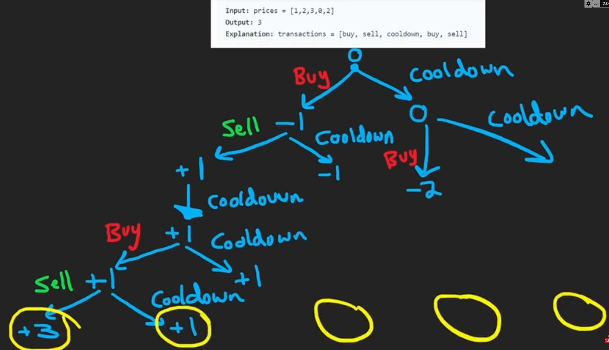
    - If we buy the stock on the first day, then we can sell it on the second day and make a profit of `prices[1] - prices[0]` **or** we can do nothing on the first day and make a profit of `0`.
    - the moment we sell, we can't buy on the next day, so we will have to cooldown for one day.
    - this is repeated for the rest of the days -> then we return the maximum profit on the last day (end of the decision tree).
  - We will use a `dfs()` function to traverse the decision tree.
    - The function will take the index of the current day and a state boolean indicating if we can buy or not.
    - if **buy** -> we will call the function with `i + 1` and `sell` state (`true`)
    - if **sell** -> we will call the function with `i + 2` and `buy` state (`false`)
  - Time complexity: `O(n^2)`
    - and using **caching**, the time complexity will be `O(n)`.

  ```py
  def maxProfit(prices: List[int]) -> int:
      memo = {} # key=(i, buying), value=max_profit

      def dfs(i, buying):
          if i >= len(prices):
              return 0

          if (i, buying) in memo:
              return memo[(i, buying)]

          profit = 0
          if buying:
              # incriment index by 1 to buy
              profit = max(
                  dfs(i + 1, False) - prices[i], # buy
                  dfs(i + 1, True) # cooldown
              )
          else:
              # incriment index by 2 to sell (cooldown for 1 day)
              profit = max(
                  dfs(i + 2, True) + prices[i], # sell
                  dfs(i + 1, False) # cooldown
              )

          memo[(i, buying)] = profit
          return profit

      return dfs(0, True)
  ```

- **Solution 2: using `dp` array**

  ```py
  def maxProfit(prices: List[int]) -> int:
      # Array with maximum profit we can achieve for each day
      dp = [0] * len(prices)

      # loop through the array and calculate the maximum profit we can achieve for each day
      for i in range(1, len(prices)):
          # the maximum profit we can achieve for the current day is equal to the maximum profit we can achieve for the previous day + the amount of money we can make by selling the stock on the current day
          dp[i] = max(dp[i - 1], prices[i] - prices[i - 1] + dp[i - 2] if i >= 2 else 0)

      # return the last element in the array
      return dp[-1]
  ```

- **Solution 3: using 3 variables**

  ```py
  def maxProfit(prices: List[int]) -> int:
      prevBy1 = 0 # maximum profit we can achieve for the previous day
      prevBy2 = 0 # maximum profit we can achieve for the day before the previous day
      currBy1 = 0 # maximum profit we can achieve for the current day

      for i in range(1, len(prices)):
          # the maximum profit we can achieve for the current day is equal to the maximum profit we can achieve for the previous day + the amount of money we can make by selling the stock on the current day
          currBy1 = max(currBy1, prices[i] - prices[i - 1] + prevBy2)
          prevBy2 = prevBy1
          prevBy1 = currBy1

      return currBy1
  ```

---

## Knight Probability in Chessboard

| Video Solution                                                | Hint                                                                                                                                                                                                                                                                                                                                                                                                                                                                                                                                |
| ------------------------------------------------------------- | ----------------------------------------------------------------------------------------------------------------------------------------------------------------------------------------------------------------------------------------------------------------------------------------------------------------------------------------------------------------------------------------------------------------------------------------------------------------------------------------------------------------------------------- |
| [Video Solution](https://www.youtube.com/watch?v=a0YESUy2BAc) | Use a top-down dynamic programming approach with memoization. Use a `dfs` helper function to calculate the probability of the knight remaining on the board for each cell. The probability of the knight remaining on the board for the current cell is equal to the sum of the probabilities of the knight remaining on the board for each neighbor cell divided by `8`. Note that the `directions` array here for the neighbors is different than the one used in the previous problems because the knight moves in an `L` shape. |

On an `n x n` chessboard, a knight starts at the cell `(row, column)` and attempts to make exactly `k` moves. The rows and columns are 0-indexed, so the top-left cell is `(0, 0)`, and the bottom-right cell is `(n - 1, n - 1)`.

A chess knight has eight possible moves it can make, as illustrated below. Each move is two cells in a cardinal direction, then one cell in an orthogonal direction.


Each time the knight is to move, it chooses one of eight possible moves uniformly at random (even if the piece would go off the chessboard) and moves there.

The knight continues moving until it has made exactly `k` moves or has moved off the chessboard. Return the probability that the knight remains on the board after it has stopped moving.

- Ex:

  - Input: `n = 6, k = 2, row = 2, column = 2`
    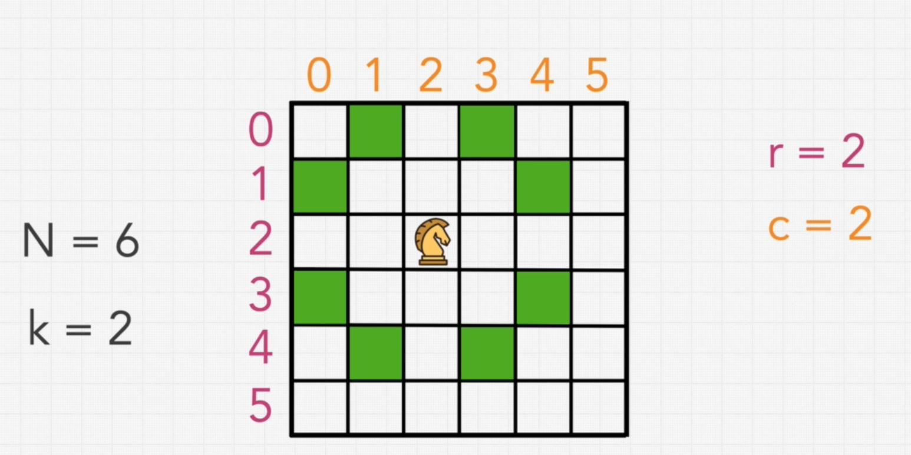
  - Output: `0.62500`
  - Explanation: There are `6` possible paths for the knight to move. Out of the `6` paths, only `2` of them are staying on the chessboard. Therefore, the answer is `2 / 6 = 0.62500`
    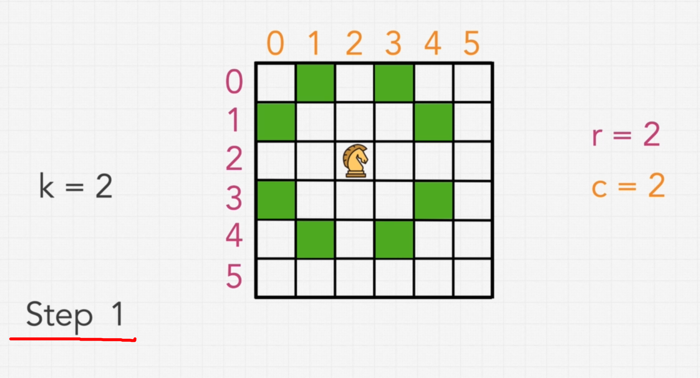
    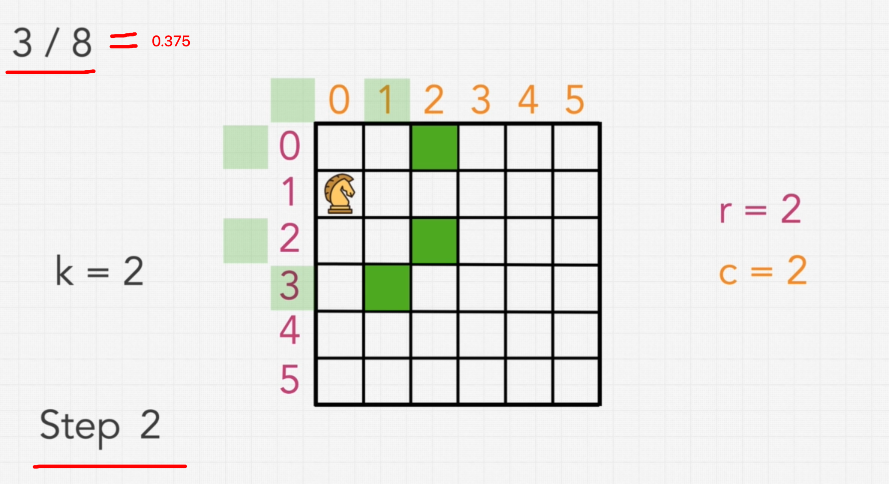
    - and so on until we get all the possible paths with possible probabilities.

- Explanation:

  - This is a `DP` problem, because we will be optimizing the process of generating all the possible paths.
  - We will use a `dp` matrix to store the probability of the knight remaining on the board for each cell.
    - Here we use a `3D` matrix because we need to store the probability of the knight remaining on the board for each cell for each move. **(we need to store the probability of the knight remaining on the board for each cell for each move because the knight can move to `8` different cells)**
  - We will start by filling the first row with `1` because the knight can only stand on the first row.
  - Then we will iterate over the matrix and for each cell we will calculate the probability of the knight remaining on the board for the current cell.
  - The probability of the knight remaining on the board for the current cell is equal to the sum of the probabilities of the knight remaining on the board for each neighbor cell divided by `8` **(because the knight can move to `8` different cells)**.

- Time complexity: `O(n^2 * k)` -> `O(n^3)`
  - without `memoization`, the time complexity will be `O(8^k)` -> `O(8^n)`
    - `8` -> because the knight can move to `8` different cells.
  - with `memoization`, the time complexity will be `O(n^2 * k)` -> `O(n^3)` because we are calculating the probability of the knight remaining on the board for each cell for each move.
    - `3` -> because we are using a `3D` matrix.

```py
def knightProbability(n: int, k: int, row: int, column: int) -> float:
    # Create a 3D dp matrix to store the probability of the knight remaining on the board for each cell
    dp = [[[0] * n for _ in range(n)] for _ in range(k + 1)]
    # startPoint -> [possible moves]
    directions = [
        (2,1), (1,2), (-1,2), (-2,1),
        (-2,-1), (-1,-2), (1,-2), (2,-1)
    ]

    def knightProb(r, c, k):
        # If the knight is out of the board, return 0
        if r < 0 or r >= n or c < 0 or c >= n:
            return 0
        # Memoization
        if dp[k][r][c] != 0:
            return dp[k][r][c]
        # If we reached the last move, return 1
        if k == 0:
            return 1

        # Calculate the probability of the knight remaining on the board for the current cell
        for dr, dc in directions:
            dp[k][r][c] += knightProb(r + dr, c + dc, k - 1) / 8

        return dp[k][r][c]

    return knightProb(row, column, k)
```

- Solution 2: using top-down approach ✅

  - Time complexity: `O(n^2 * k)` -> `O(n^3)`
    - without `memoization`, the time complexity will be `O(8^k)` -> `O(8^n)`
      - `8` -> because the knight can move to `8` different cells.
    - with `memoization`, the time complexity will be `O(n^2 * k)` -> `O(n^3)` because we are calculating the probability of the knight remaining on the board for each cell for each move.
      - `3` -> because we are using a `3D` matrix.
  - Space complexity: `O(n^2 * k)` -> `O(n^3)`
    - without `memoization`, the space complexity will be `O(k)` -> `O(n)`
    - with `memoization`, the space complexity will be `O(n^2 * k)` -> `O(n^3)` because we are storing the probability of the knight remaining on the board for each cell for each move.

  ```py
  def knightProbability(n: int, k: int, row: int, column: int) -> float:
      memo = {}
      ROWS = COLS = n
      directions = [(2,1), (1,2), (-1,2), (-2,1), (-2,-1), (-1,-2), (1,-2), (2,-1)]

      def dfs(r, c, k):
          if (
            r not in range(ROWS) or
            c not in range(COLS) or
            k < 0
          ):
              return 0

          if k == 0: return 1
          if (r, c, k) in memo: return memo[(r, c, k)]

          prob = 0
          for dr, dc in directions:
              nr, nc = r + dr, c + dc
              prob += dfs(nr, nc, k - 1) / 8 # 8 -> because the knight can move to 8 different cells

          memo[(r, c, k)] = prob
          return prob

      return dfs(row, column, k)
  ```

---

## Knight Dialer

| Video Solution                                                | Hint                                                                                                                                                                                                                                                                                                                                                                                                                                                                                                                                                                                     |
| ------------------------------------------------------------- | ---------------------------------------------------------------------------------------------------------------------------------------------------------------------------------------------------------------------------------------------------------------------------------------------------------------------------------------------------------------------------------------------------------------------------------------------------------------------------------------------------------------------------------------------------------------------------------------- |
| [Video Solution](https://www.youtube.com/watch?v=vlsUUm_qqsY) | Use a bottom-up dynamic programming approach. Use a `dp` matrix to store the number of distinct phone numbers of length `n` we can dial for each number. Start by filling the first row with `1` because we can dial a number of length `1` by placing the knight over any numeric cell of the `10` cells. Then iterate over the matrix and for each cell calculate the number of distinct phone numbers of length `n` we can dial for the number `j` (use a `neighbors` dictionary to store the possible moves for each number). Finally, return the sum of the last row in the matrix. |

A chess knight can move as indicated in the chess diagram below:

We have a chess knight and a phone pad as shown below, the knight can only stand on a numeric cell (i.e. blue cell).

Given an integer `n`, return how many distinct phone numbers of length `n` we can dial.

- Ex:

  - Input: `n = 1`
  - Output: `10`
  - Explanation: We need to dial a number of length 1, so placing the knight over any numeric cell of the 10 cells is sufficient.

- **Solution 1:** Bottom-up approach (fast) ✅

  - We will use a `dp` matrix to store the number of distinct phone numbers of length `n` we can dial for each number.

    - `dp[i][j]` -> number of distinct phone numbers of length `i` we can dial for the number `j`.

    ```py
    # Matrix example for n = 5
    dp =
    [
      [1, 1, 1, 1, 1, 1, 1, 1, 1, 1], # n = 1
      [1, 2, 2, 2, 2, 2, 2, 2, 2, 1], # n = 2
      [2, 2, 4, 4, 4, 4, 4, 4, 2, 2], # n = 3
      [2, 4, 4, 8, 8, 8, 8, 4, 4, 2], # n = 4
      [4, 4, 8, 8, 16, 16, 8, 8, 4, 4] # n = 5
    ]
    ```

  - We will start by filling the first row with `1` because we can dial a number of length `1` by placing the knight over any numeric cell of the `10` cells.
  - Then we will iterate over the matrix and for each cell we will calculate the number of distinct phone numbers of length `n` we can dial for the number `j`.
    - `dp[i][j] = dp[i - 1][neighbor1] + dp[i - 1][neighbor2] + ... + dp[i - 1][neighborN]`
    - `dp[i - 1][neighbor1]` -> number of distinct phone numbers of length `i - 1` we can dial for the number `neighbor1`.
    - `dp[i - 1][neighbor2]` -> number of distinct phone numbers of length `i - 1` we can dial for the number `neighbor2`.
    - `dp[i - 1][neighborN]` -> number of distinct phone numbers of length `i - 1` we can dial for the number `neighborN`.
  - Finally, we will return the sum of the last row in the matrix.
    - last row indicates the number of distinct phone numbers of length `n` we can dial for each number.
    - > we return the sum modulo by `10 ** 9 + 7` to avoid overflow as given in the problem.

  ```py
  def knightDialer(n: int) -> int:
      # Create a dp matrix to store the number of distinct phone numbers of length n we can dial for each number
      dp = [[0] * 10 for _ in range(n)]

      # Fill the first row with 1 because we can dial a number of length 1 by placing the knight over any numeric cell of the 10 cells
      for c in range(10):
          dp[0][c] = 1

      # startPoint -> [possible moves]
      neighbors = {
          0: [4, 6],
          1: [6, 8],
          2: [7, 9],
          3: [4, 8],
          4: [0, 3, 9],
          5: [],
          6: [0, 1, 7],
          7: [2, 6],
          8: [1, 3],
          9: [2, 4]
      }

      for r in range(1, n):
          for c in range(10):
              for neighbor in neighbors[c]:
                  # number of distinct phone numbers of length r we can dial for the number c
                  dp[r][c] += dp[r - 1][neighbor]

      return sum(dp[-1]) % (10 ** 9 + 7)
  ```

- **Solution 2:** Top-down approach (works but slow) ❌

  - Time complexity: `O(n * 10 * 3)` -> `O(n)`
    - `n` -> because we are looping `n` times.
    - `10` -> because we are looping `10` times.
    - `3` -> because the knight can move to `3` different cells.
  - Space complexity: `O(n * 10)` -> `O(n)`
    - `n` -> because we are using a `n` sized array.
    - `10` -> because we are using a `10` sized array.

  ```py
  def knightDialer(n: int) -> int:
      memo = {}
      ROWS = n
      COLS = 10
      visited = set()
      neighbors = {
          0: [4, 6],
          1: [6, 8],
          2: [7, 9],
          3: [4, 8],
          4: [0, 3, 9],
          5: [],
          6: [0, 1, 7],
          7: [2, 6],
          8: [1, 3],
          9: [2, 4]
      }

      def dfs(r, c, n):
          if (
            r not in range(ROWS) or
            c not in range(COLS) or
            (r, c) in visited
          ):
              return 0

          if n == 0: return 1
          if (r, c, n) in memo: return memo[(r, c, n)]

          visited.add((r, c))
          prob = 0
          for neighbor in neighbors[c]:
              prob += dfs(neighbor, c, n - 1)
          visited.remove((r, c))

          memo[(r, c, n)] = prob
          return prob

      return sum(dfs(0, c, n - 1) for c in range(10)) % (10 ** 9 + 7)
  ```

---

## Coin Change

You are given an integer array `coins` representing coins of different denominations and an integer `amount` representing a total amount of money.

Return the fewest number of coins that you need to make up that amount. If that amount of money cannot be made up by any combination of the coins, return `-1`.

You may assume that you have an infinite number of each kind of coin.

- Ex:

  - Input: `coins = [1,2,5], amount = 11`
    - Output: `3`
  - Input: `coins = [2], amount = 3`
    - Output: `-1`

- Explanation:

  - This is a "combination sum" problem, because we are trying to find the fewest number of coins that we can use to make up the amount.
  - We can solve this problem using **dynamic programming**.

- **Solution 1: using dfs + memoization (Slow ❌)**

  - This is a "Top-down" approach, because we will divide the subsetting logic into smaller decisions each time we make a new decision (**with updated `amount` and `index`**)
    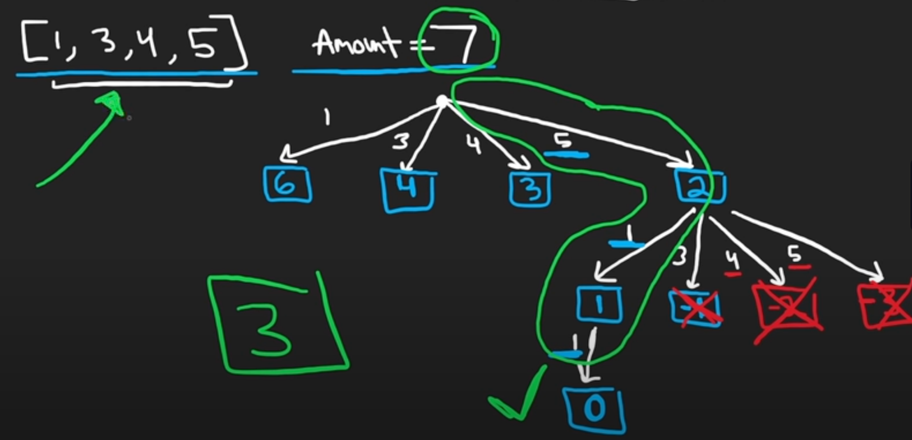
  - We will use a `dfs()` function to traverse the decision tree.
  - The function will take the current `index` and the current `amount` as arguments.
    - If the current amount is `0`, then we have a valid path.
    - If the current amount is less than `0` or the current index is greater than or equal to the length of the array, then we don't have a valid path.
  - If the current index and amount are in the `memo` dictionary, then we return the value in the dictionary.
  - Otherwise, we will call the function with the current index and the current amount - the coin at the current index **(because we are trying to find a combination with sum equal to the amount)**.
  - We will also call the function with the current index + 1 and the current amount **(because we are trying to find a combination with sum equal to the amount)**.
  - We will return the minimum between the two calls + 1 **(because we took a coin)**.
  - If the minimum is equal to `float('inf')`, then we will return `-1`.

  ```py
  def coinChange(coins: List[int], amount: int) -> int:
      memo = {} # key=(index, amount), value=minCoins

      def dfs(index, amount):
          if amount == 0:
              return 0
          if index >= len(coins) or amount < 0:
              return float('inf')

          if (index, amount) in memo:
              return memo[(index, amount)]

          comb1 = dfs(index + 1, amount) # don't take the coin at the current index
          comb2 = 1 + dfs(index, amount - coins[index]) # take the coin at the current index and incriment the number of coins by 1 (because we took a coin)
          memo[(index, amount)] = min(comb1, comb2)
          return memo[(index, amount)]

      return dfs(0, amount) if dfs(0, amount) != float('inf') else -1
  ```

- **Solution 2: using dp array (Fast ✅)**

  - This is a "Bottom-up" approach, because we will use the results of the subproblems to solve the main problem.
    

    - Instead of solving the problem from the top (`amount = 7`), we will solve it from the bottom (`amount = 0`). and try to build up the solution ->

      ```py
      # [1, 3, 4, 5], amount = 7
      dp[0] = 0 # we can make up the amount 0 with 0 coins
      dp[1] = 1 # we can make up the amount 1 with 1 coin at index 0
      dp[2] = dp[1] + 1 # we can make up the amount 2 with 1 coin at index 0 + 1 coin at index 1
      dp[3] = dp[2] + 1
      dp[4] = min(dp[3], dp[0]) + 1
      dp[5] = min(dp[4], dp[1]) + 1
      dp[6] = min(dp[5], dp[2]) + 1
      dp[7] = min(dp[6], dp[3]) + 1
      ```

  ```py
  # Time: O(n * amount) | Space: O(amount
  def coinChange(coins: List[int], amount: int) -> int:
      # Array with minimum number of coins we can use to make up the amount
      dp = [float('inf')] * (amount + 1)

      # we can make up the amount 0 with 0 coins
      dp[0] = 0

      # loop through the array and calculate the minimum number of coins we can use to make up the amount
      for i in range(1, amount + 1):
          for c in coins:
              # if the current amount is greater than or equal to the coin at the current index to get valid index (bounded)
              if i - c >= 0:
                  dp[i] = min(dp[i], dp[i - c] + 1)

      # return the last element in the array
      return dp[-1] if dp[-1] != float('inf') else -1
  ```

---

## Coin Change II

Same as the previous problem, but this time we want to find the number of combinations that make up the amount.

- Ex:

  - Input: `amount = 5, coins = [1,2,5]`
  - Output: `4`
  - Explanation: there are four ways to make up the amount:
    - `1 + 1 + 1 + 1 + 1 = 5`
    - `1 + 1 + 1 + 2 = 5`
    - `1 + 2 + 2 = 5`
    - `5 = 5`

- **Solution 1: using dfs + memoization**

  - This is a "Top-down" approach

  ```py
  def change(amount: int, coins: List[int]) -> int:
      memo = {} # key=(index, amount), value=numberOfCombinations

      def dfs(index, amount):
          if amount == 0:
              return 1
          if index >= len(coins) or amount < 0:
              return 0

          if (index, amount) in memo:
              return memo[(index, amount)]

          comb1 = dfs(index + 1, amount) # don't take the coin at the current index
          comb2 = dfs(index, amount - coins[index]) # take the coin at the current index
          memo[(index, amount)] = comb1 + comb2
          return memo[(index, amount)]

      return dfs(0, amount)
  ```

- **Solution 2: using dp array**

  - This is a "Bottom-up" approach
  - We use index `i-c` because we are trying to find the number of combinations that make up the amount `i` using the coin at the current index `c`.
    - Ex: `dp[5] = dp[5 - 1] + dp[5 - 2]+ .. + dp[5 - 5]`

  ```py
  def change(amount: int, coins: List[int]) -> int:
      dp = [0] * (amount + 1)

      # we can make up the amount 0 with 1 combination (don't take any coin)
      dp[0] = 1

      # calculate the number of combinations we can use to make up the amount
      for c in coins:
          for i in range(1, amount + 1):
              # check valid index
              if i - c >= 0:
                  dp[i] += dp[i - c]

      # return the last element in the array
      return dp[-1]
  ```

---

## Student Attendance Record II

Given an integer `n`, return the number of all possible attendance records with length `n`, which will be regarded as **rewardable**. The answer may be very large, return it after mod `10^9 + 7`.

- `A` -> Absent
- `L` -> Late
- `P` -> Present
- A record is regarded as **rewardable** if it doesn't contain **more than one `A` (absent)** or **more than two continuous `L` (late)**.

- Ex:

  - Input: `n = 2`
  - Output: `8`
  - Explanation:
    - There are 8 records with length 2 will be regarded as rewardable:
      - `"PP"` , `"AP"`, `"PA"`, `"LP"`, `"PL"`, `"AL"`, `"LA"`, `"LL"`
      - Only `"AA"` won't be regarded as rewardable owing to more than one absent times.

- Explanation:

  - This is a "combination sum" problem, because we are trying to find the number of all possible attendance records with length `n`.

- **Solution 1: using dfs + memoization**

  - will result **Time Limit Exceeded** ❌

  ```py
  def checkRecord(n: int) -> int:
      memo = {} # key=(index, absentCount, lateCount), val=numberOfRecords
      def dfs(index, absentCount, lateCount):
          if absentCount > 1 or lateCount > 2:
              return 0
          if index == n:
              return 1
          if (index, absentCount, lateCount) in memo:
              return memo[(index, absentCount, lateCount)]

          comb1 = dfs(index + 1, absentCount, 0) # present
          comb2 = dfs(index + 1, absentCount + 1, 0) # absent
          comb3 = dfs(index + 1, absentCount, lateCount + 1) # late

          memo[(index, absentCount, lateCount)] = comb1 + comb2 + comb3
          return memo[(index, absentCount, lateCount)]

      return dfs(0, 0, 0) % (10 ** 9 + 7)
  ```

- **Solution 2: using dp array** ✅

  - We will use a 2D `dp` matrix of size `2x3` filled with zeros, where `dp[i][j]` -> number of all possible attendance records with length `i` and `j` absent days.
    - We will set `dp[0][0] = 1` because we can have a record with length `0` and `0` absent days -> **Empty record**
  - iterate `n` times and for each iteration we will calculate the number of all possible attendance records with length `i` and `j` absent days.
    - `dp[i][0]` -> number of all possible attendance records with length `i` and `0` absent days -> **No absent days**
    - `dp[i][1]` -> number of all possible attendance records with length `i` and `1` absent days -> **One absent day**
    - `dp[i][2]` -> number of all possible attendance records with length `i` and `2` absent days -> **Two absent days**
  - Compute the sum of all the elements in the matrix and return the result modulo by `10 ** 9 + 7` to avoid overflow as given in the problem.

  ```py
  def checkRecord(n: int) -> int:
      kMod = 10**9 + 7
      dp = [[0] * 3 for _ in range(2)]
      dp[0][0] = 1

      for i in range(n):
          p0, p1, p2, q0, q1, q2 = dp[0][0], dp[0][1], dp[0][2], dp[1][0], dp[1][1], dp[1][2]

          dp[0][0] = (p0 + p1 + p2) % kMod # Append P
          dp[0][1] = p0 # Append L
          dp[0][2] = p1 # Append L
          dp[1][0] = (p0 + p1 + p2 + q0 + q1 + q2) % kMod # Append A or append P
          dp[1][1] = q0 # Append L
          dp[1][2] = q1 # Append L

      return sum(dp[0] + dp[1]) % kMod
  ```

---

## Longest Common Subsequence

| Video Solution                                                                                  | Hint                                                                                                                                                                                                                                                                                                                                         |
| ----------------------------------------------------------------------------------------------- | -------------------------------------------------------------------------------------------------------------------------------------------------------------------------------------------------------------------------------------------------------------------------------------------------------------------------------------------- |
| [Video Solution](https://www.youtube.com/watch?v=ASoaQq66foQ) Or `LCS` video on neetcode course | Use a bottom-up dynamic programming approach. Use a `dp` matrix to store the length of the longest common subsequence for each pair of characters. Then iterate over the matrix and for each cell calculate the length of the longest common subsequence for the current pair of characters. Finally, return the last element in the matrix. |

Given two strings `text1` and `text2`, return the length of their longest common subsequence. If there is no common subsequence, return `0`.

A subsequence of a string is a new string generated from the original string with some characters (can be none) deleted without changing the relative order of the remaining characters. **(It doesn't have to be contiguous, but the order should be maintained)**
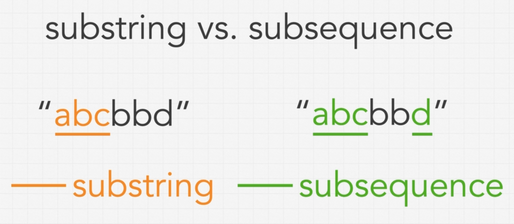

A common subsequence of two strings is a subsequence that is common to both strings.

- Ex:

  - Input: `text1 = "abcde", text2 = "ace"`
  - Output: `3`
  - Explanation: The longest common subsequence is `"ace"`.

- Explanation:

  - This is a `DP` problem, because we will be using the results of the subproblems to solve the main problem.
  - The subproblem is comparing 2 characters at a time and finding the longest common subsequence for each pair of characters.
    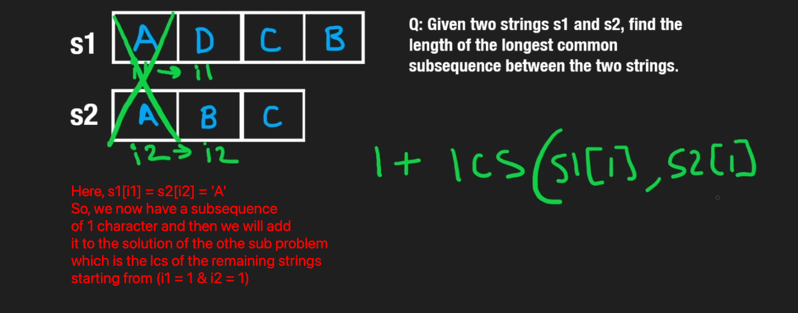

- **Solution 1: using dfs + memoization**

  - We will use 2 pointers `i` and `j` to iterate over the strings and for each pair of characters we will calculate the length of the longest common subsequence.
  - at each decision, we choose to increment `i` or `j` or both.
    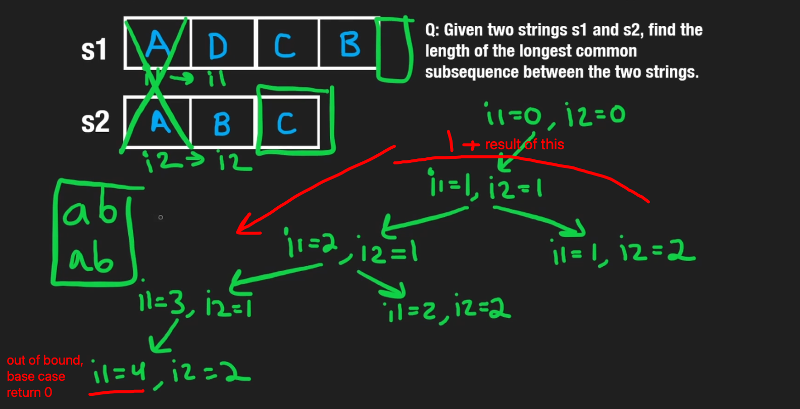
    - choice 1 -> `i + 1` and `j + 1` if the current characters are equal.
    - choice 2 -> `i + 1` if the current characters are not equal.
    - choice 3 -> `j + 1` if the current characters are not equal.
    - we will return the maximum between the 3 choices.
  - if we reach a pointer that is out of the string, we will return `0`.
  - the height of the decision tree will be `len(text1) + len(text2)`. because we will stop when both pointers reach the end of the strings.
  - We will have repeated subproblems, so we will use a `memo` dictionary to store the results of the subproblems.
    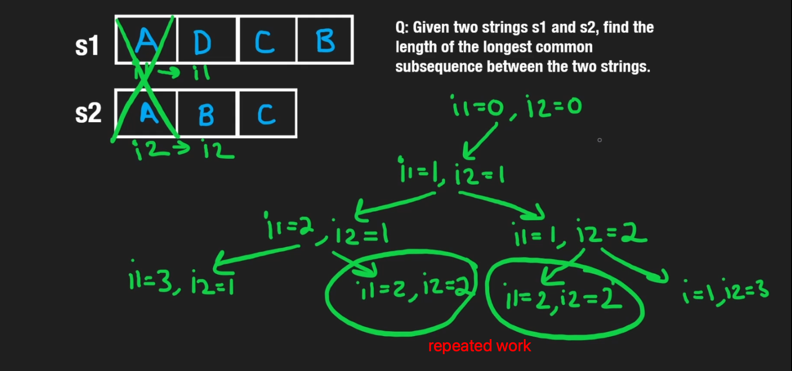

  - Time complexity: `O(2^(m + n))` -> `O(2^n)`
    - With the use of memoization, the time complexity will be `O(m * n)` because we are calculating the length of the longest common subsequence for each pair of characters.
  - Space complexity: `O(n)` -> `O(n)`

  ```py
  def longestCommonSubsequence(text1: str, text2: str) -> int:
      memo = {}
      def dfs(i, j):
          if i == len(text1) or j == len(text2):
              return 0
          if (i, j) in memo:
              return memo[(i, j)]
          if text1[i] == text2[j]:
              memo[(i, j)] = 1 + dfs(i + 1, j + 1) # 1 plus the result of the smaller subproblem
          else:
              memo[(i, j)] = max(dfs(i + 1, j), dfs(i, j + 1)) # the maximum between the results of the smaller subproblems
          return memo[(i, j)]

      return dfs(0, 0)
  ```

- **Solution 2: using dp array**

  - We will use a `dp` matrix to store the length of the longest common subsequence for each pair of characters.
    - The matrix will have extra row and column for the empty string. which will be filled with `0`, because there is no common subsequence for an empty string.
      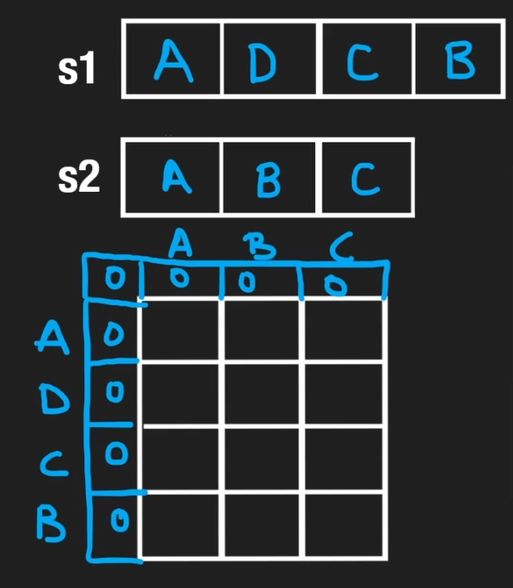
  - Then we will iterate over the matrix and for each cell we will calculate the length of the longest common subsequence for the current pair of characters.
    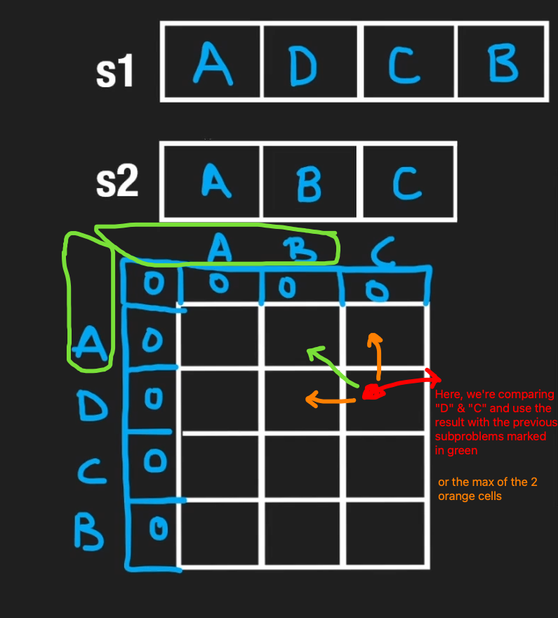
    - If the current characters are equal, then the length of the longest common subsequence for the current pair of characters is equal to the length of the longest common subsequence for the previous pair of characters **+ `1`**.
    - Otherwise, the length of the longest common subsequence for the current pair of characters is equal to the **maximum** between the length of the longest common subsequence for the previous pair of characters in the same row and the length of the longest common subsequence for the previous pair of characters in the same column.
  - Finally, we will return the last element in the matrix.
    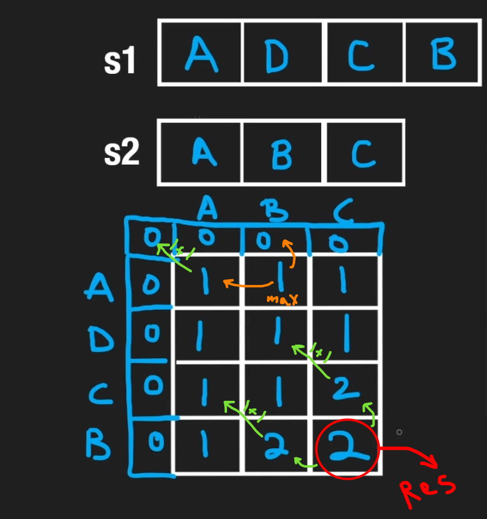
  - Time complexity: `O(m * n)`
    - where `m` is the length of the first string and `n` is the length of the second string.
  - Space complexity: `O(m * n)`
    - where `m` is the length of the first string and `n` is the length of the second string.

  ```py
  def longestCommonSubsequence(text1: str, text2: str) -> int:
      m, n = len(text1), len(text2)
      dp = [[0] * (n + 1) for _ in range(m + 1)]

      for i in range(1, m + 1):
          for j in range(1, n + 1):
              if text1[i - 1] == text2[j - 1]:
                  dp[i][j] = dp[i - 1][j - 1] + 1
              else:
                  dp[i][j] = max(dp[i - 1][j], dp[i][j - 1])

      return dp[-1][-1]
  ```

---

## Unique Paths

A robot is located at the top-left corner of a `m x n` grid. Given the two integers `m` and `n`, return the number of possible unique paths that the robot can take to reach the bottom-right corner.

- Ex:
  

  - Input: `m = 3, n = 7`
  - Output: `28`

- Explanation:

  - This is a `DP` problem, because we will be using the results of the subproblems to solve the main problem.
    - Actually you would figure that out if you tried to solve it using `recursion` and `backtracking` (`DFS`) as you will get `TIME LIMIT` error.
  - We will use a `dp` matrix to store the number of unique paths for each cell.
    - `dp[i][j]` -> number of unique paths to reach the cell at `i`th row and `j`th column.
  - We will start by filling the first row and first column with `1` because there is only one way to reach them.
  - Then we will iterate over the matrix and for each cell we will calculate the number of unique paths to reach it.
    - `dp[i][j] = dp[i - 1][j] + dp[i][j - 1]`
    - `dp[i - 1][j]` -> number of unique paths to reach the cell above the current cell.
    - `dp[i][j - 1]` -> number of unique paths to reach the cell on the left of the current cell.
  - Time and space complexity: `O(mn)`, where `m` is the number of rows and `n` is the number of columns.

- dp top-down solution

  ```py
  def uniquePaths(m: int, n: int) -> int:
      # Create a dp matrix to store the number of unique paths for each cell
      dp = [[1] * n for _ in range(m)]

      for r in range(1, m):
          for c in range(1, n):
              # number of unique paths to reach the cell at rth row and cth column
              dp[r][c] = dp[r - 1][c] + dp[r][c - 1]

      return dp[-1][-1]
  ```

- dp memoization solution

  ```py
  def uniquePaths(m: int, n: int) -> int:
      memo = {}
      def dfs(r, c):
          if r == 0 or c == 0: # base case
              return 1
          if (r, c) in memo:
              return memo[(r, c)]
          # we can only move down or right, meaning go to the cell above or the cell on the left
          memo[(r, c)] = dfs(r - 1, c) + dfs(r, c - 1)
          return memo[(r, c)]
      return dfs(m - 1, n - 1) # start from the bottom-right cell
  ```

  - If there were obstacles in the grid, then we would have to check if the current cell is an obstacle or not.
    - If it's an obstacle, then we will return `0`.
    - Otherwise, we will calculate the number of unique paths to reach the current cell.

---

## Maximum Profit in Job Scheduling

---

## Jump Game

You are given an integer array `nums`. You are initially positioned at the array's **first index**, and each element in the array represents your maximum jump length at that position.

Return `true` if you can reach the last index, or `false` otherwise.

- Ex:

  - Input: `nums = [2,3,1,1,4]`
    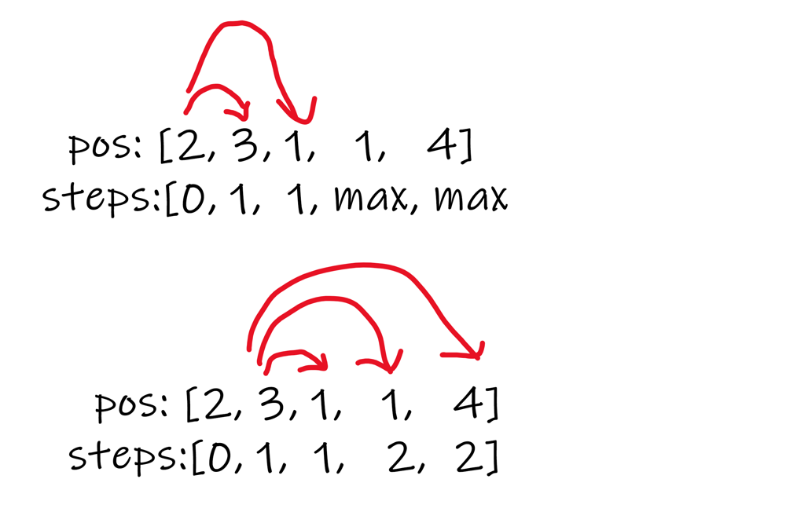
  - Output: `true`
  - Explanation: Jump 1 step from index 0 to 1, then 3 steps to the last index.

- **Solution 1: DB**

  - We will use a `maxIndex` variable to store the maximum index we can reach. and we will update it each time we iterate over the array.
  - If the current index is greater than the maximum index we can reach, then we can't reach the last index. because we can't jump to the current index.
  - Time complexity: `O(n)`, where `n` is the length of the array.

  ```py

  ```

- **Solution 2: Greedy** ✅

  - This is a `Greedy` problem, because we will be making the locally optimal choice at each step to reach the globally optimal solution.
  - We will use a `furthest_reach_so_far` variable to store the furthest index we can reach.
  - We will iterate over the array and for each index we will check if we can reach the last index. This is done by checking if the current index is less than or equal to the furthest index we can reach.
    - for example in `[2,3,1,1,4]`:
      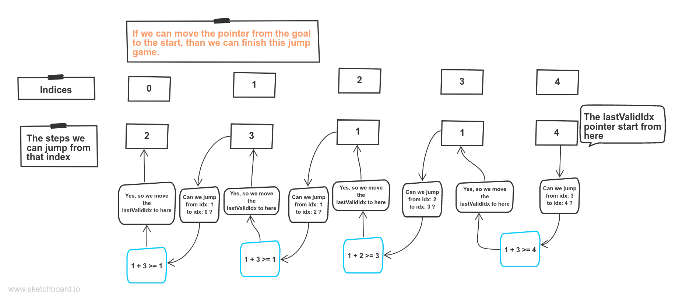
      - we can use the `2` steps to reach the `1`st index and then use the `3` steps to reach the `4`th index.
      - or we can use the `2` steps to reach the `3`rd index and then use the `1` step to reach the `4`th index.
    - So, we get the maximum index we can reach by using the `max()` function.

  ```py
  def canJump(nums: List[int]) -> bool:
      goal = len(nums) - 1

      # loop through the array in reverse order and check if we can reach the goal
      for i in range(len(nums) - 1, -1, -1):
          # if we can reach the goal, then update the goal to the current index
          if i + nums[i] >= goal:
              goal = i

      # After the loop, if the goal should be 0 which is the first index, which means we can reach the last index
      return goal == 0

  # ------------------------------ OR ------------------------------

  def canJump(nums: List[int]) -> bool:
      # maximum index we can reach
      maxIndex = 0

      # loop through the array
      for i in range(len(nums)):
          # if the current index is greater than the maximum index we can reach, then we can't reach the last index
          if i > maxIndex:
              return False

          # update the maximum index we can reach
          maxIndex = max(maxIndex, i + nums[i])

      return True

  # ------------------------------ OR ------------------------------

  def canJump(nums: List[int]) -> bool:
      furthest_reach_so_far = 0
      last_index = len(nums) - 1
      i = 0

      # check if we can reach the last index
      while i <= furthest_reach_so_far and furthest_reach_so_far < last_index:
          furthest_reach_so_far = max(furthest_reach_so_far, i + nums[i])
          i += 1

      return furthest_reach_so_far >= last_index
  ```

---

## Jump Game II

You are given an integer array `nums`. You are initially positioned at the array's **first index**, and each element in the array represents your maximum jump length at that position.

Return the **minimum number of jumps** required to reach the last index.

You can assume that you can always reach the last index.

- Ex:

  - Input: `nums = [2,3,1,1,4]`
    
  - Output: `2`
  - Explanation: The minimum number of jumps to reach the last index is `2`. Jump `1` step from index `0` to `1`, then `3` steps to the last index.

- Explanation
  - This is a `Greedy` problem, because we will be making the locally optimal choice at each step to reach the globally optimal solution.
  - It's like `BFS`, because we will be making a jump each time we reach the maximum index we can reach.
  - time complexity: `O(n)`, where `n` is the length of the array. unlike in DP where the time complexity is `O(n^2)`.

```py
def jump(nums: List[int]) -> int:
    currIndex = 0
    maxIndex = 0 # maximum index we can reach
    jumps = 0

    for i in range(len(nums)):
        # if the current index is greater than the maximum index we can reach, then we can't reach the last index
        if i > maxIndex:
            return -1

        # if the current index is greater than or equal to the last index, then we reached the last index
        if currIndex >= len(nums) - 1:
            return jumps

        # update the maximum index we can reach
        maxIndex = max(maxIndex, i + nums[i])

        # if we reached the maximum index we can reach, then we will make a jump
        if i == currIndex:
            jumps += 1
            currIndex = maxIndex

    return jumps
```

---

### Valid Parenthesis String

| Video Solution                                                | Hint                                                                                                                                                                                                                                                                                                                                                                                                     |
| ------------------------------------------------------------- | -------------------------------------------------------------------------------------------------------------------------------------------------------------------------------------------------------------------------------------------------------------------------------------------------------------------------------------------------------------------------------------------------------- |
| [Video Solution](https://www.youtube.com/watch?v=QhPdNS143Qg) | Use **two counters** `min` and `max` to keep track of the minimum and maximum number of opening brackets that we need to balance the closing brackets. Each time we encounter an `opening` bracket, we increment both counters. Each time we encounter a `closing` bracket, we decrement both counters. Each time we encounter a `star`, we increment the `max` counter and decrement the `min` counter. |

Given a string `s` containing only three types of characters: `'('`, `')'`, and `'*'`, return `true` if `s` is a valid string.

The following rules define a valid string: Any left or right parenthesis `'('` and `')'` must have a corresponding parenthesis, `'*'` could be treated as a single right parenthesis `')'` or a single left parenthesis `'('` or an empty string.

- EX:

  - `s = "(*))"` --> `true`
  - `s = "(((*)"` --> `false`

- Explanation:

  - This is a Greedy problem, because we will be making the locally optimal choice at each step to reach the globally optimal solution.
  - You might initially think that we will need one counter to keep track of the number of opening brackets and another counter to keep track of the number of closing brackets. But this is not the case, because we can use the `star` as an empty string or as an `opening` bracket or as a `closing` bracket. **So, we will need two counters `min` and `max`**.
  - We will use two counters `min` and `max` to keep track of the minimum and maximum number of opening brackets that we need to balance the closing brackets.
  - Each time we encounter an `opening` bracket, we increment both counters.
    - Because we need to add one `closing` bracket to balance the `opening` bracket.
  - Each time we encounter a `closing` bracket, we decrement both counters.
    - Because we have found a matching `closing` bracket.
  - Each time we encounter a `star`, we increment the `max` counter and decrement the `min` counter.
    - Because we can use the `star` as an `empty` string or as a `opening` bracket or as an empty string.
  - At the end, if the `min` counter is not equal to `0`, then we return `false`.
    - Because we have more `closing` brackets than `opening` brackets.
  - Otherwise, we return `true`.
    - Because we have the same number of `opening` brackets and `closing` brackets.

- Time complexity: `O(n)`, where `n` is the length of the string.
- Space complexity: `O(1)`

```py
def checkValidString(s):
    leftMin = leftMax = 0

    for char in s:
        if char == '(':
            leftMin += 1
            leftMax += 1
        elif char == ')':
            leftMin -= 1
            leftMax -= 1
        else:
            leftMin -= 1 # use the star as a closing bracket
            leftMax += 1 # use the star as an opening bracket

        if leftMax < 0:
            return False

        leftMin = max(leftMin, 0)

    return leftMin == 0
```

---

## 0 or 1 Knapsack Pattern

In this pattern, when solving the problem with a brute-force recursive solution, we will find that we're solving the same problem repeatedly.

- We use **memoization** to store the results of the subproblems and use them to solve the main problem.

### 0/1 Knapsack

Given two integer arrays `profit` and `weight` of length `n`, we need to find a subset of these items which will give us maximum profit such that their cumulative weight is not more than a given number `capacity`. Each item can only be selected once, which means either we put an item in the knapsack or we skip it.

- EX:

  - Input: `items = ['apple', 'orange', 'banana', 'melon'], profit = [4, 5, 3, 7], weight = [2, 3, 1, 4], capacity = 5`
  - Output: `10`
  - Explanation: `banana + melon` is the best combination as it gives us the maximum profit.
    - apple + orange (total weight 5) -> profit = 9
    - apple + banana (total weight 3) -> profit = 7
    - orange + banana (total weight 4) -> profit = 8
    - banana + melon (total weight 5) -> profit = **10** ✅

- **Solution 1: Top-down approach (memoization)**

  - Basic brute-force solution is to try all combinations of the given items to choose the subset of items with the maximum profit and a weight that doesn't exceed `capacity`.
    
    - Time complexity: `O(2^n)` -> `O(2^4)`
    - Space complexity: `O(n)` -> recursion stack
  - We will notice that we're solving the same subproblems repeatedly, so we can use **memoization** to store the results of the subproblems and use them to solve the main problem.
    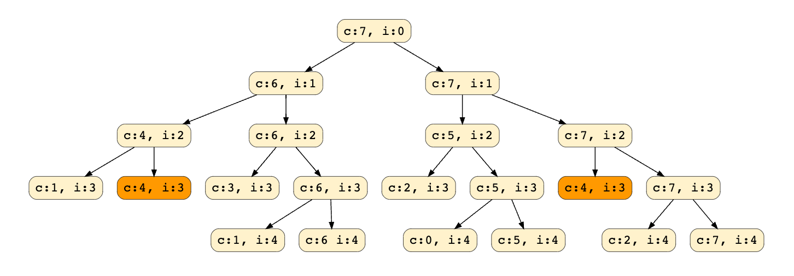
    - since we have 2 changing values (`capacity` and `index`), we will use a `2D` array to store the results of the subproblems.
    - Time complexity: `O(n * c)`
      - we will not have more than `n * c` subproblems because we have `n` items and `c` capacity in the `dp` array.
    - Space complexity: `O(n * c)` -> memoization array

  ```py
  def knapsack(profit: List[int], weight: List[int], capacity: int) -> int:
      n = len(profit)
      dp = [[-1] * (capacity + 1) for _ in range(n)] # dp[i][c] -> max profit for the first i items and capacity c

      def dfs(index, capacity):
          if index >= n or capacity <= 0:
              return 0

          if dp[index][capacity] != -1:
              return dp[index][capacity]

          profit1, profit2 = 0, 0

          # include the current item
          if capacity >= weight[index]:
              profit1 = profit[index] + dfs(index + 1, capacity - weight[index])

          # exclude the current item
          profit2 = dfs(index + 1, capacity)

          dp[index][capacity] = max(profit1, profit2)
          return dp[index][capacity]

      return dfs(0, capacity)
  ```

- **Solution 2: Bottom-up approach** ✅

  - Here, we start at the bottom and try to reach the top.
  - We can create a `dp` array of size `n` to store the maximum profit for each item.
    - the last element in the array will be the maximum profit for all the items.
  - We can then loop through the array and calculate the maximum profit for each item.

    - We have 2 options:
      
      1. Include the current item -> `dp[i-1][c - weight[i]] + profit[i]`
         - if we include an item, we jump to the remaining profit to find more items that can fit in the remaining capacity.
      2. Exclude the current item -> `dp[i-1][c]`
         - if we skip an item, we take the profit from the remaining items.
    - The maximum profit for the current item is equal to `the maximum profit for the previous item + the profit of the current item`.

      ```py
      dp[i][c] = max(dp[i-1][c - weight[i]] + profit[i], dp[i-1][c])
      ```

  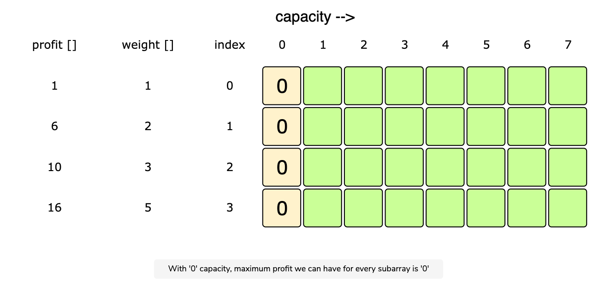
  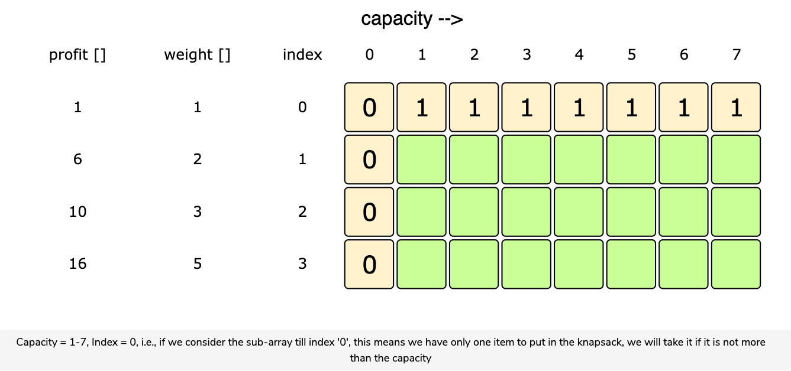
  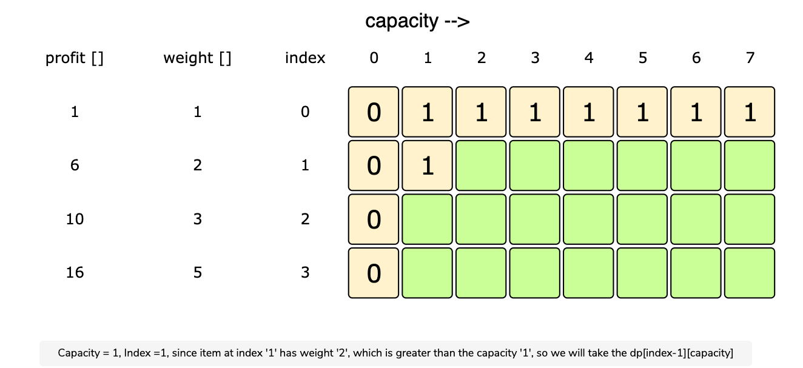
  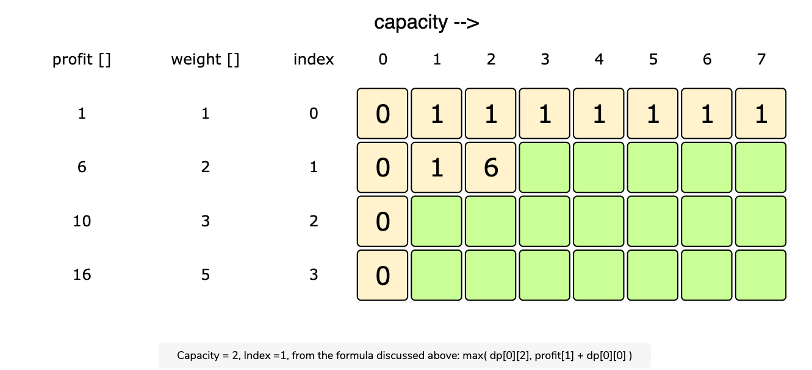
  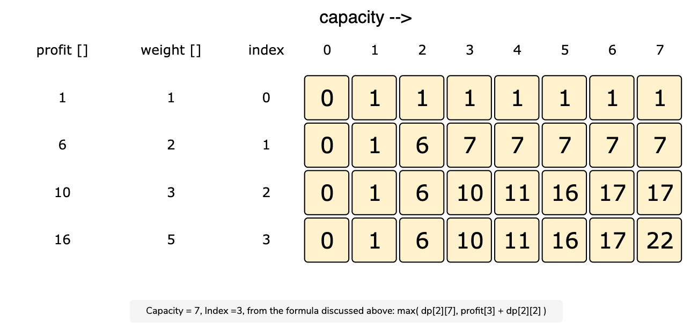

  - Time complexity: `O(n * c)`
  - Space complexity: `O(c)` -> `dp` array

  ```py
  def knapsack(profit: List[int], weight: List[int], capacity: int) -> int:
      n = len(profit)
      dp = [[0] * (capacity + 1) for _ in range(n)] # dp[i][c] -> max profit for the first i items and capacity c

      # Fill the first row
      for c in range(capacity + 1):
          if c >= weight[0]:
              dp[0][c] = profit[0]

      for i in range(1, n):
          for c in range(1, capacity + 1):
              profit1, profit2 = 0, 0
              if c >= weight[i]:
                  profit1 = profit[i] + dp[i - 1][c - weight[i]]
              profit2 = dp[i - 1][c]
              dp[i][c] = max(profit1, profit2)

      return dp[-1][-1]
  ```

---

### Unbounded KnapSack

Given a list of `n` items, and a backpack with a limited capacity, return the maximum total profit that can be contained in the backpack. The i-th item's profit is `profit[i]` and its weight is `weight[i]`.

- EX:

  - Input: `capacity = 8, profit = [15, 50, 60, 90], weight = [1, 3, 4, 5]`
  - Output: `140`
  - Explanation: We can take items with indices `1` and`3`, and leave the rest.

- Solution 1: Top-down approach (memoization)

  - For each item, we can choose to take it or leave it.
    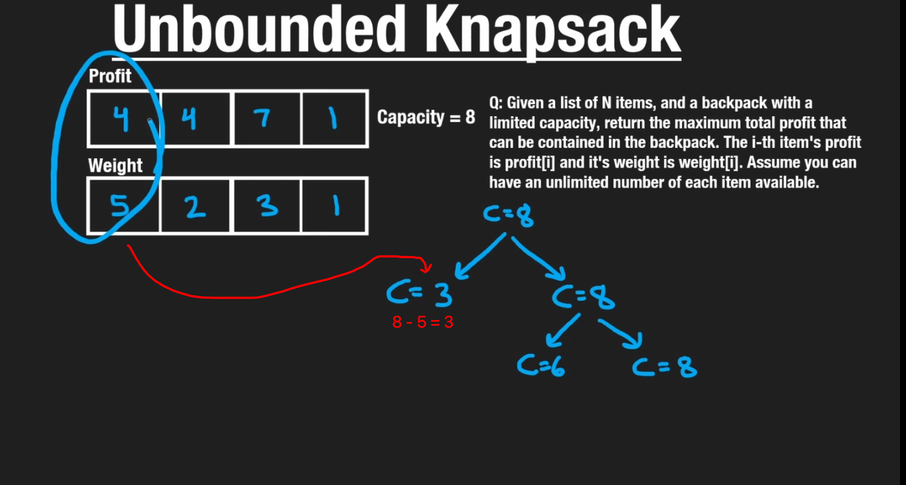
    - if we take an item, then we will jump to the remaining capacity to find more items that can fit in the remaining capacity.
    - if we leave an item, then we take the profit from the remaining items.
  - The difference here, is that we have an unlimited number of each item. So we can take an item multiple times.
    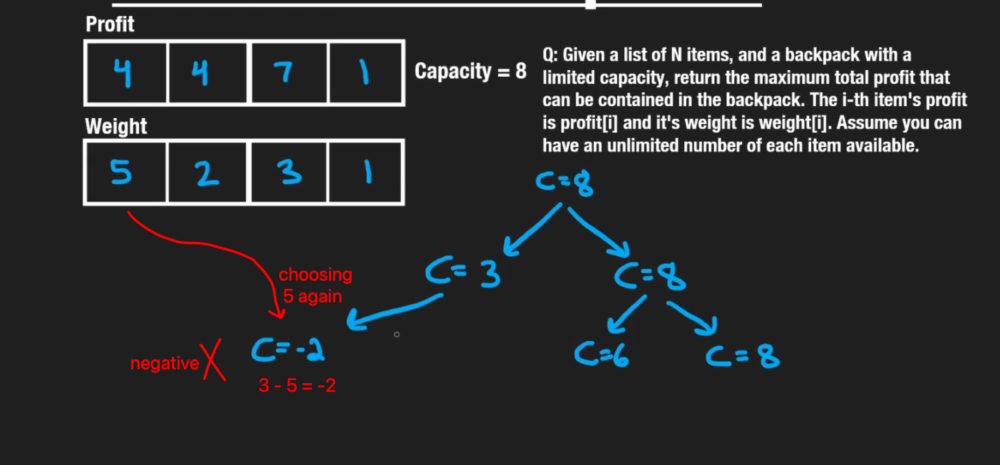
  - We can continue building the decision tree until we reach the end of the array or until the `capacity` reaches `0`. and then we can calculate the maximum `profit` for each item.
    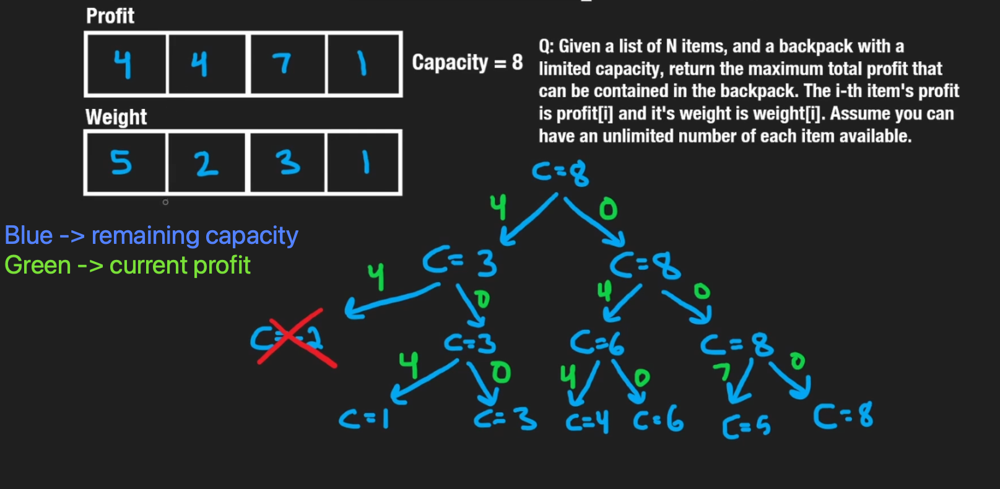

    - In this case the height of the tree can be more than `n` because we can take an item multiple times.
    - So the time complexity will be `O(n * 2^c)`. where `c` is the `capacity`.

  ```py
  def unboundedKnapsack(capacity: int, profit: List[int], weight: List[int]) -> int:
      memo = {}
      def dfs(i, capacity):
          if i == len(profit): return 0
          if (i, capacity) in memo: return memo[(i, capacity)]

          # skip item i
          maxProfit = dfs(i+1, capacity)
          # include item i
          newCap = capacity - weight[i]
          if newCap >= 0:
            p = profit[i] + dfs(i, newCap)
            maxProfit = max(maxProfit, p)

          memo[(i, capacity)] = maxProfit
          return maxProfit

      return dfs(0, capacity)

  ```

  - Time complexity: `O(n * c)`
    - `n` is the number of items, `c` is the capacity
  - Space complexity: `O(n * c)`

- Solution 2: TODO: watch the "2.Unbounded Knapsack video"

  - We can solve this problem using **dynamic programming**. by using a `dp` array to store the maximum profit for each item. and then loop through the array and calculate the maximum profit for each item.

  ```py
  def unboundedKnapsack(capacity: int, profit: List[int], weight: List[int]) -> int:
      n = len(profit)
      dp = [[0] * (capacity + 1) for _ in range(n)] # dp[i][c] -> max profit for the first i items and capacity c

      # Fill the first row
      for c in range(capacity + 1):
          if c >= weight[0]:
              dp[0][c] = profit[0] * (c // weight[0])

      for i in range(1, n):
          for c in range(1, capacity + 1):
              profit1, profit2 = 0, 0
              if c >= weight[i]:
                  profit1 = profit[i] + dp[i][c - weight[i]]
              profit2 = dp[i - 1][c]
              dp[i][c] = max(profit1, profit2)

      return dp[-1][-1]
  ```

---

### Partition Equal Subset Sum

Given a non-empty array `nums` containing only positive integers, find if the array can be partitioned into two subsets such that the sum of elements in both subsets is equal.

- Ex:

  - Input: `nums = [1,5,11,5]`
  - Output: `true`
  - Explanation: The array can be partitioned as `[1, 5, 5]` and `[11]`.

- **Solution 1: Top-down approach (memoization)**

  - we want to divide the array into two subsets with equal sum (sum of elements in both subsets is equal).
    - For example, if the array is `[1, 5, 11, 5]`:
      - The sum of elements in the array is `22`.
      - The required sum of elements in each subset is `11`.
      - we can divide the array into two subsets with sum `11`:
        - `[1, 5, 5]` -> sum = `11`
        - `[11]` -> sum = `11`
      - So the `target` will be `sum(nums) // 2` -> `11` for a path in the decision tree to be valid.
        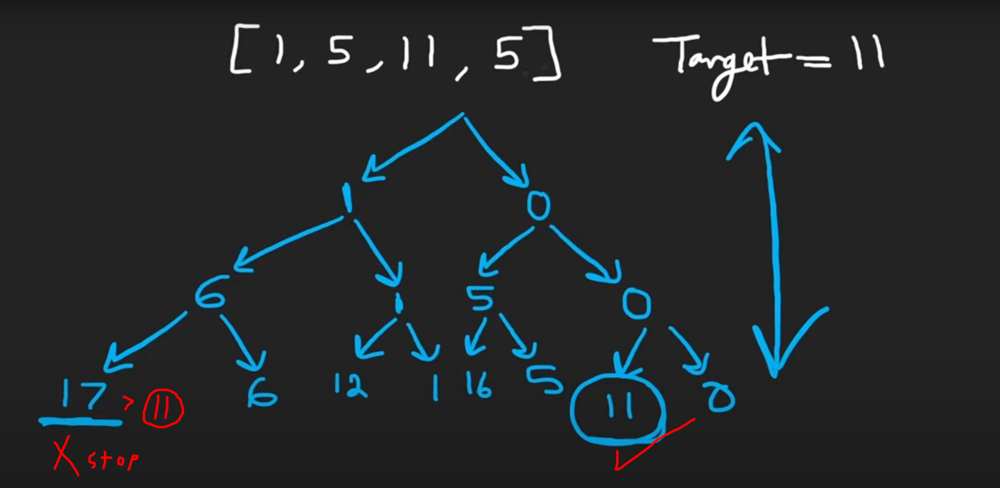
  - we can solve this problem using **dynamic programming**.

    - we will divide the subsetting logic into smaller decisions each time we make a new decision (**with updated `target` and `index`**)
      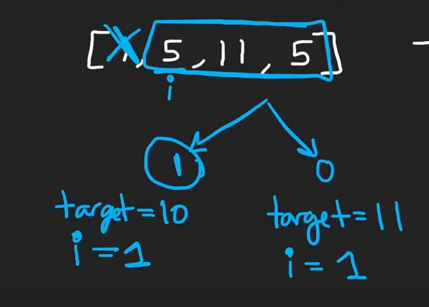

  - We will use a `dfs()` function to traverse the decision tree.
    - The function will take the current `index` and the current `target` as arguments.
    - If the current target is `0`, then we have a valid path.
    - If the current target is less than `0` or the current index is greater than or equal to the length of the array, then we don't have a valid path.
    - If the current index and target are in the `memo` dictionary, then we return the value in the dictionary.
    - Otherwise, we will call the function with the current index + 1 and the current target - the number at the current index **(because we are trying to find a subset with sum equal to the target)**.
    - We will also call the function with the current index + 1 and the current target **(because we are trying to find a subset with sum equal to the target)**.
    - We will return `True` if any of the two calls return `True`, otherwise we will return `False`.

  ```py
  def canPartition(nums: List[int]) -> bool:
      total = sum(nums)
      # If the sum of elements in the array is odd, then we can't divide the array into two subsets with equal sum
      if total % 2 != 0:
          return False

      memo = {} # key=(index, target), value=canPartition

      def dfs(index, target):
          if target == 0:
              # Means that we have a subset branch with sum equal to target
              return True
          if index >= len(nums) or target < 0:
              return False

          if (index, target) in memo:
              return memo[(index, target)]

          memo[(index, target)] = dfs(index + 1, target - nums[index]) or dfs(index + 1, target)
          return memo[(index, target)]

      return dfs(0, total // 2)
  ```

- **Solution 2: Bottom-up approach** ✅

  - Here, we want to find if we can make all possible sums with every subset. This means `dp[i][s]` will be `true` if we can make the sum `s` from the first `i` numbers.
  - We will have 2 options: include or exclude the current number.

    - if either options is `true`, then `dp[i][s]` will be `true`.
      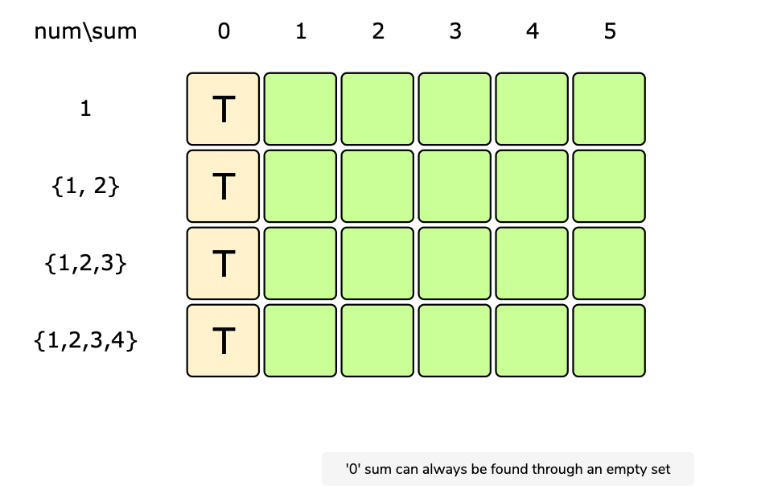
      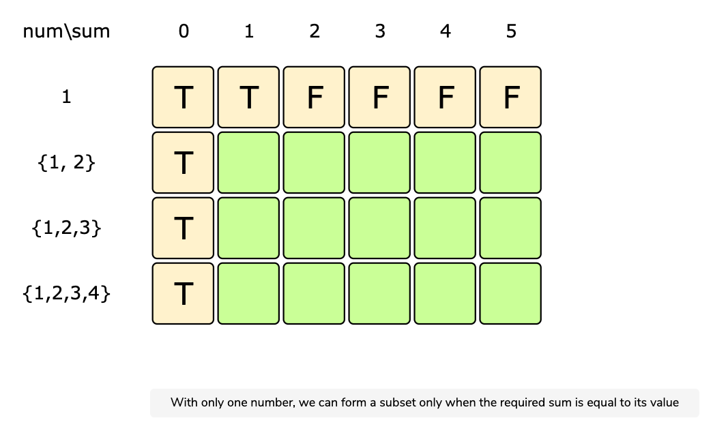
      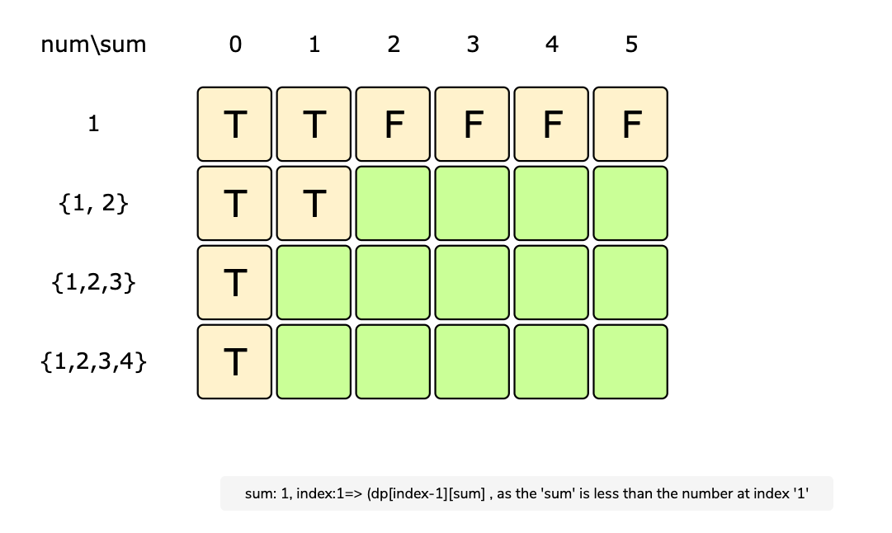
      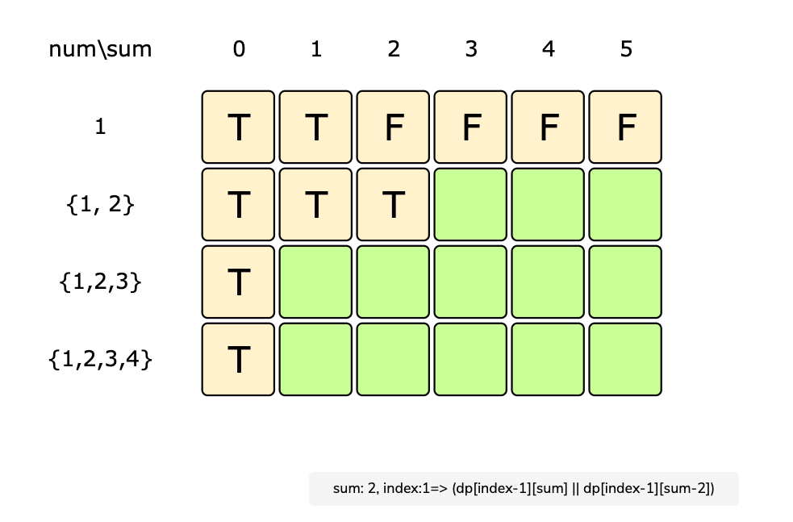
      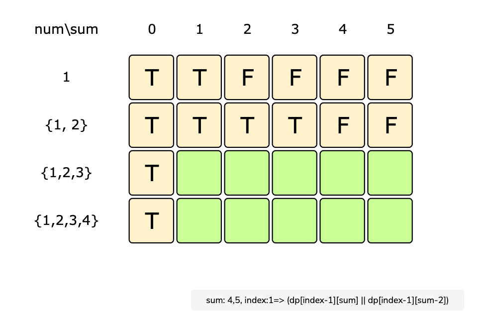
      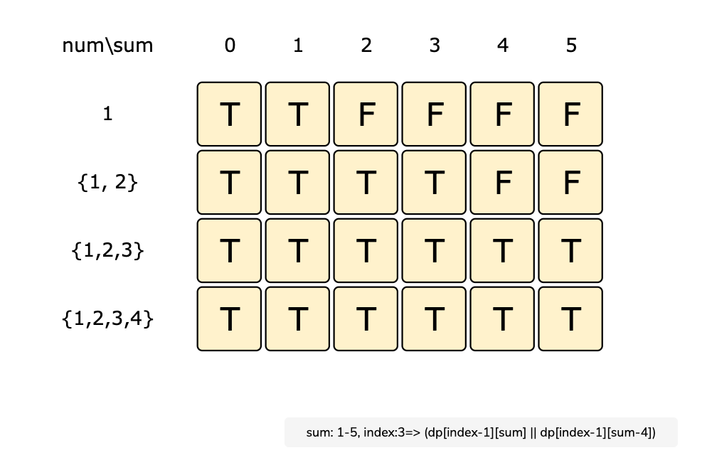

  - Time complexity: `O(n * s)`

  ```py
  def canPartition(nums: List[int]) -> bool:
      total = sum(nums)
      # If the sum of elements in the array is odd, then we can't divide the array into two subsets with equal sum
      if total % 2 != 0:
          return False

      n = len(nums)
      target = total // 2
      dp = [[False] * (target + 1) for _ in range(n)]

      # Fill the first column
      for i in range(n):
          dp[i][0] = True

      # Fill the first row
      for s in range(1, target + 1):
          if s == nums[0]:
              dp[0][s] = True

      for i in range(1, n):
          for s in range(1, target + 1):
              if dp[i - 1][s]:
                  dp[i][s] = True
              elif s >= nums[i]:
                  dp[i][s] = dp[i - 1][s - nums[i]]

      return dp[-1][-1]
  ```

---

### Partition Array Into Two Arrays to Minimize Sum Difference

// TODO: not working, need to fix it

You are given an integer array `nums` of `2 * n` integers, You need to partition `nums` into two arrays of length `n` to minimize the absolute difference of the sum of the two arrays.

To partition `nums`, put each element of `nums` into one of the two arrays.

Return _the minimum possible absolute difference_ of the sum of the two arrays.

- Ex:

  - Input: `nums = [3,9,7,3]`
    
  - Output: `2`
  - Explanation: One optimal partition is `[3,9]` and `[7,3]`.
    - The absolute difference between the sums of the arrays is `|3+9 - (7+3)| = |12 - 10| = 2`.

- Explanation

  - if we have 2 subsets `s1` and `s2`, then we can try adding each element either in `s1` or `s2` in order to find the combination that gives the minimum sum difference between the two subsets.

    ```py
    for each number 'i'
      add number 'i' to 's1' and recursively process the remaining numbers
      add number 'i' to 's2' and recursively process the remaining numbers
    return the minimum absolute difference of the above two sets
    ```

- **Solution 1: Top-down approach (memoization)**

  - We can use **memoization** to store the results of the subproblems and use them to solve the main problem.
  - We will use a `dfs()` function to traverse the decision tree.
    - The function will take the current `index` and the current `sum1` as arguments.
    - If the current index is equal to the length of the array, then we have a valid path.
    - If the current index is greater than the length of the array, then we don't have a valid path.
    - If the current index and sum1 are in the `memo` dictionary, then we return the value in the dictionary.
    - Otherwise, we will call the function with the current index + 1 and the current sum1 + the number at the current index.
    - We will also call the function with the current index + 1 and the current sum1.
    - We will return the minimum absolute difference between the two calls.

  ```py
  def minimumDifference(nums: List[int]) -> int:
      n = len(nums)
      memo = {} # key=(index, sum1), value=minimumDifference

      def dfs(index, sum1, sum2):
          if index == n:
              # Means that we have a subset branch with sum equal to target
              return abs(sum1 - sum2)
          if index > n:
              return float('inf')

          if (index, sum1) in memo:
              return memo[(index, sum1)]

          diff_1 = dfs(index + 1, sum1 + nums[index], sum2)
          diff_2 = dfs(index + 1, sum1, sum2 + nums[index])

          memo[(index, sum1)] = min(diff_1, diff_2)
          return memo[(index, sum1)]

      return dfs(0, 0, 0)
  ```

---

### Target Sum

You are given an integer array `nums` and an integer `target`. You want to build an **expression** out of nums by adding one of the symbols `'+'` and `'-'` before each integer in nums and then concatenate all the integers.

For example, if `nums = [2, 1]`, you can add a `'+'` before `2` and a `'-'` before `1` and concatenate them to build the expression `"+2-1"`.

Return the number of different **expressions** that you can build, which evaluates to `target`.

- Ex:

  - Input: `nums = [1,1,1,1,1], target = 3`
  - Output: `5`
  - Explanation: There are 5 ways to assign symbols to make the sum of nums be target 3.
    - `+1 +1 +1 +1 +1 = 3`
    - `+1 +1 +1 -1 -1 = 3`
    - `+1 +1 -1 +1 -1 = 3`
    - `+1 -1 +1 +1 -1 = 3`
    - `-1 +1 +1 +1 +1 = 3`

```py
def findTargetSumWays(nums: List[int], target: int) -> int:
    memo = {} # key=(index, sum), value=number of ways

    def dfs(index, sum):
        if index == len(nums):
            if sum == target:
                return 1
            return 0

        if (index, sum) in memo:
            return memo[(index, sum)]

        subset1 = dfs(index + 1, sum + nums[index])
        subset2 = dfs(index + 1, sum - nums[index])

        memo[(index, sum)] = subset1 + subset2
        return memo[(index, sum)]

    return dfs(0, 0)
```

---
