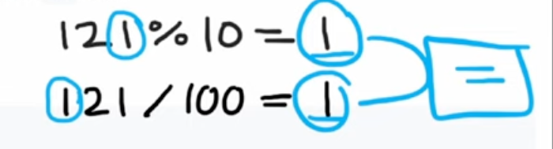

# INDEX

- [INDEX](#index)
  - [Numbers Manipulation](#numbers-manipulation)
    - [Numbers Notes](#numbers-notes)
    - [Reverse Integer](#reverse-integer)
    - [Palindrome Number (Check if a decimal integer is a palindrome)](#palindrome-number-check-if-a-decimal-integer-is-a-palindrome)
    - [Count Primes](#count-primes)
  - [Numbers \& Math](#numbers--math)
    - [Power of Two](#power-of-two)
    - [Pow(x, n)](#powx-n)
    - [Partitioning Into Minimum Number Of Deci-Binary Numbers](#partitioning-into-minimum-number-of-deci-binary-numbers)
  - [Dates](#dates)
    - [Dates Notes](#dates-notes)
    - [Number of Days Between Two Dates](#number-of-days-between-two-dates)

---

## Numbers Manipulation

### Numbers Notes

- To get the nth digit of a number, we can use the **modulus** operator and the **division** operator

  ```py
  123 % 10 = 3 # get the last digit
  123 % 100 = 23 # get the last 2 digits

  123 // 10 = 12 # get the number without the last digit
  123 // 100 = 1 # get the first digit
  ```

- To loop through the digits of a number, we can use the **modulus** operator and the **division** operator and use a `while` loop until the number is `0`

  ```py
  x = 123
  while x:
      # get the last digit of the number
      last_digit = x % 10
      print(last_digit)
      # get the number without the last digit
      x = x // 10

  # Output:
  # 3
  # 2
  # 1
  ```

---

### Reverse Integer

| Video Solution                                                | Hint                                                                                                                                                                                                                                                                                                                                                                                    |
| ------------------------------------------------------------- | --------------------------------------------------------------------------------------------------------------------------------------------------------------------------------------------------------------------------------------------------------------------------------------------------------------------------------------------------------------------------------------- |
| [Video Solution](https://www.youtube.com/watch?v=HAgLH58IgJQ) | Start by using the absolute value of the number and then check if the number is negative and save that in a variable. Then, loop through the digits of the number and get the last digit and add it to the result multiplied by 10. Then, divide the number by 10 to get the next digit. Finally, check if the number is out of range or is negative and return the result accordingly. |

Given a signed 32-bit integer `x`, return `x` _with its digits reversed_. If reversing `x` causes the value to go outside the signed 32-bit integer range `[-2^31, 2^31 - 1]`, then return `0`.

- Ex:

  - Input: `x = 123`
  - Output: `321`

- Explanation:
  - We can use the **modulus** operator to get the last digit of the number and then add it to the result
  - We can then divide the number by `10` to get the next digit
  - We repeat this process until the number is `0`
- Time Complexity: `O(log(x))` -> `O(n)` where `n` is the number of digits in `x`

```py
def reverse(x):
    result = 0
    is_negative = x < 0
    x_remaining = abs(x) # because python modulus operator returns a negative number if the number is negative -> ( -123 % 10 = 7 not -3 )

    while x_remaining:
        # get the last digit of the number
        last_digit = x_remaining % 10
        # add the last digit to the result (shifted to the left by 1 digit to make room for the next digit)
        result = result * 10 + last_digit
        # divide the number by 10 to get the next digit
        x_remaining = x_remaining // 10

    # check if the number is out of range (overflow)
    if result > 2 ** 31 - 1:
        return 0

    # return the result
    return -result if is_negative else result
```

---

### Palindrome Number (Check if a decimal integer is a palindrome)

| Video Solution                                                | Hint                                                                                                                                                                                                         |
| ------------------------------------------------------------- | ------------------------------------------------------------------------------------------------------------------------------------------------------------------------------------------------------------ |
| [Video Solution](https://www.youtube.com/watch?v=yubRKwixN-U) | Convert the number to a string and then loop through the string and check if the characters are different. **OR** Loop through the digits of the number and check if the digits on both sides are different. |

Given an integer `x`, return `true` if `x` is palindrome integer.

An integer is a palindrome when it reads the same backward as forward. For example, `121` is palindrome while `123` is not.

- Ex:

  - Input: `x = 121`
  - Output: `true`

- Solution 1: convert the number to a string and check if the string is a palindrome

  - Time Complexity: `O(n)` where `n` is the number of digits in `x`

  ```py
  def isPalindrome(x):
      # convert the number to a string
      x = str(x)

      # loop through the string
      for i in range(len(x) // 2):
          # check if the characters are different
          left_char = x[i]
          right_char = x[len(x) - i - 1]
          if left_char != right_char:
              return False

      return True
  ```

- Solution 2: loop through the digits of the number and check if the digits are different

  - First, we check if the number is negative and return `False` if it is
  - Then check the digits at the beginning and the end of the number and return `False` if they are different
    - First, we need to know the number of digits in the number, so that we can know what to divide the number by to get the first and last digits whether `10`, `100`, `1000`, etc...
    - To get the first digit of the number, we can use the `modulus` operator, and to get the last digit of the number, we can use the `division` operator divided by `10`
      
    - Then we need to update the number by removing the first and last digits
      
      - We remove the first digit by dividing the number by `10` to shift the digits to the right
      - We remove the last digit by using the `modulus` operator by the number of digits in the number to get the remainder of the division by `10` which is the last digit
  - Time Complexity: `O(log n)` -> `O(n)` where `n` is the number of digits in `x`

  ```py
  def isPalindrome(x):
      if x < 0:
          return False

      # get the number of digits in x
      num_digits = math.floor(math.log10(x)) + 1

      # loop through the digits of x
      for i in range(num_digits // 2):
          # get the i-th digit of x
          left_digit = x // 10 ** (num_digits - i - 1) % 10
          # get the (num_digits - i - 1)-th digit of x
          right_digit = x // 10 ** i % 10

          # check if the digits are different
          if left_digit != right_digit:
              return False

      return True
  ```

---

### Count Primes

| Video Solution                                                | Hint                                                                                                                                                                                                                                             |
| ------------------------------------------------------------- | ------------------------------------------------------------------------------------------------------------------------------------------------------------------------------------------------------------------------------------------------ |
| [Video Solution](https://www.youtube.com/watch?v=5LMkddl2NCk) | Use the **Sieve of Eratosthenes** algorithm: create a array with `True` values for the initial state and then loop through the numbers and mark the multiples of each number as `False`. Finally count the number of `True` values in the array. |

Given an integer `n`, return the number of prime numbers that are strictly less than `n`.

- Ex:

  - Input: `n = 10`
  - Output: `4`
  - Explanation: There are `4` prime numbers less than `10`, they are `2, 3, 5, 7`.

- Explanation:
  - Prime numbers are numbers that are only divisible by `1` and themselves
    
  - The brute-force solution would be to loop through the numbers from `2` to `n` and check if each number is prime by looping through the numbers from `2` to `n` and checking if the number is divisible by any of them (checking if remainder is `0`)
    - This will be `O(n * sqrt(n))` time and `O(1)` space
  - Instead, We can use the **Sieve of Eratosthenes** algorithm to find all the prime numbers less than `n`
    
    - We can start by creating a list of booleans from `2` to `n` and mark them as prime
    - Then, we loop through the numbers from `2` to `n` and mark all the multiples of each number as not prime
    - Finally, we count the number of prime numbers in the list
  - Time Complexity: `O(n * log(log(n)))` -> `O(n)` where `n` is the number of digits in `x`
    - because the number of times we loop through the numbers from `2` to `n` is `O(log(log(n)))` as we can see in the image above which is equivalent to `O(n)`

```py
# Naive solution (brute-force) -> O(n * sqrt(n)) ❌
def countPrimes(n):
    count = 0
    for i in range(2, n):
        is_prime = True
        for j in range(2, i):
            if i % j == 0:
                is_prime = False
                break

        # increment the count if the number is prime
        if is_prime:
            count += 1

    return count

# ---------------------------OR------------------------------

# Sieve of Eratosthenes -> O(n * log(log(n))) ✅
def countPrimes(n):
    # create a list of numbers from 2 to n and mark them as prime
    is_prime = [True] * n

    # loop through the numbers from 2 to n
    for i in range(2, n):
        # check if the number is prime
        if is_prime[i]:
            # mark all the multiples of the number as not prime
            for j in range(i * i, n, i):
                is_prime[j] = False

    # count the number of prime numbers in the list
    count = 0
    for i in range(2, n):
        if is_prime[i]:
            count += 1

    return count
```

---

## Numbers & Math

### Power of Two

| Video Solution                                                | Hint                                                                                                                                                                                                                                                        |
| ------------------------------------------------------------- | ----------------------------------------------------------------------------------------------------------------------------------------------------------------------------------------------------------------------------------------------------------- |
| [Video Solution](https://www.youtube.com/watch?v=H2bjttEV4Vc) | Use the **bitwise AND** operator between `n` and `n - 1` to check if `n` is a power of `2`. If the result is `0`, then `n` is a power of `2`. **OR** Start with `1` and multiply it by `2` until it is not less than `n` then check if `n` is equal to `x`. |

Given an integer `n`, return `true` if it is a power of two. Otherwise, return `false`.
An integer `n` is a power of two, if there exists an integer `x` such that `n == 2^x`.

- Solution 1: using loop (reusable for any number and not just `2`)

  - Here, we loop through the number and divide it by `2` until the number is `1`, but we also check if the number is `0` or negative and return `False` in that case
  - Another way to start with `1` and multiply it by `2` until it is not less than `n` anymore, and then check if `n` is equal to `x`

  ```py
  # O(log n)
  def is_power_of_two(n):
      if n <= 0:
          return False

      while n > 1:
          if n % 2 != 0:
            return False
          n /= 2

      return True

  # ---------------------------OR------------------------------

  # O(log n) ✅
  def is_power_of_two(n):
      x = 1
      while x < n:
          x *= 2
      return x == n
  ```

- Solution 2: using bitwise operators **(interview question: Can you solve this problem without loops?)**

  - Any multiple of `2` will have only one `1` in its binary representation
    
  - We can check this by using the **bitwise AND** operator between `n` and `n - 1`
    - This is because `n` and `n - 1` will have all the same bits as `n`, except for the rightmost `1` in `n`, **so all the bits in `n` and `n - 1` will be different**
      

  ```py
  # O(1)
  def is_power_of_two(n):
      return n > 0 and n & (n - 1) == 0
  ```

---

### Pow(x, n)

Implement `pow(x, n)`, which calculates `x` raised to the power `n` (i.e., `x^n`).

- Explanation:

  - instead of looping and multiplying `x` by itself `n` times, we can use **Divide & conquer** to reduce the number of multiplications
    - `x^n = x^(n/2) * x^(n/2) * x^(n%2)`
    - `x^10` = `x^5 * x^5`
      - `x^5` = `x^2 * x^2 * x`
        - `x^2` = `x * x`
          - `x^1` = `x`
            - `x^0` = `1`

- Time complexity: `O(log n)`

```py
def my_pow(x, n):
    if n == 0:
        return 1

    if n > 0:
        partial = my_pow(x, n // 2)
        if n % 2 == 0:
            return partial * partial
        else:
            return partial * partial * x
    else:
        partial = my_pow(x, -n // 2)
        if n % 2 == 0:
            return 1 / (partial * partial)
        else:
            return 1 / (partial * partial * x)

# ---------------------------OR------------------------------

def my_pow(x, n):
    def helper(x, n):
      if x == 0: return 0 # base case
      if n == 0: return 1 # base case

      res = helper(x, n // 2)
      return res * res * x if n % 2 else res * res

    return helper(x, n) if n >= 0 else 1 / helper(x, -n)
```

---

### Partitioning Into Minimum Number Of Deci-Binary Numbers

A decimal number is called **deci-binary** if each of its digits is either `0` or `1` without any leading zeros. For example, `101` and `1100` are **deci-binary**, while `112` and `3001` are not.

Given a string `n` that represents a positive decimal integer, return the **minimum** number of positive **deci-binary** numbers needed so that they sum up to `n`.

- EX:

  - Input: `n = "32"`
    - Output: `3`
    - Explanation: `10 + 11 + 11 = 32`
  - Input: `n = "82734"`
  - Output: `8`

- Explanation:

  - If each deci-binary number has no higher than a `1` in the each position, then it will take at least `x` numbers to sum up to `n`, where `x` is the largest digit in `n`
  - This means that the largest character in any position in `n` will determine how many deci-binary numbers must be added together to obtain `n`.
    
    

  ```py
  # 82734 - 11111 = 71623
  # 71623 - 11111 = 60512
  # 60512 - 10111 = 50401
  # 50401 - 10101 = 40300
  # 40300 - 10100 = 30200
  # 30200 - 10100 = 20100
  # 20100 - 10100 = 10000
  # 10000 - 10000 = 0

  # -> 8 times

  # 42 - 1111 = 37
  # 37 - 1111 = 26
  # 26 - 1111 = 15
  # 15 - 1111 = 4
  # 4 - 1111 = -7 (stop)
  ```

```py
def min_partitions(n):
    # convert the string to a list of integers
    nums = [int(num) for num in n] # don't forget to convert the string to an integer or the max function will return the largest character in the string and not the largest number

    # return the largest digit in the list
    return max(nums)
```

---

## Dates

### Dates Notes

- To get the current date, we can use the `datetime` module

  ```py
  from datetime import datetime

  now = datetime.now() # get the current date and time

  today = datetime.today() # get the current date
  #equivalent to
  today = datetime.now().date()
  ```

---

### Number of Days Between Two Dates

Write a program to count the number of days between two dates.

The two dates are given as strings, their format is `YYYY-MM-DD` as shown in the examples.

- Ex:

  - Input: `date1 = "2020-01-15", date2 = "2019-12-31"`
  - Output: `15`

- Explanation:

  - We can convert the dates to `datetime` objects and then subtract the two dates to get the difference in days
    - To do so, we need to split the dates into their components (year, month, day)
  - Then get the difference between the two dates and return the absolute value of the difference

- Time Complexity: `O(1)`
- Space Complexity: `O(1)`

```py
from datetime import date
def daysBetweenDates(date1, date2):
    year1, month1, day1 = map(int, date1.split('-'))
    year2, month2, day2 = map(int, date2.split('-'))
    # or year1, month1, day1 = (int(d) for d in date1.split('-'))

    # convert the dates to datetime objects
    date1 = date(year1, month1, day1)
    date2 = date(year2, month2, day2)

    diff = date1 - date2
    return abs(diff.days)
```
