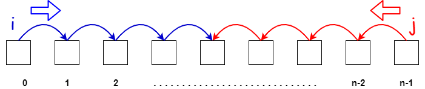
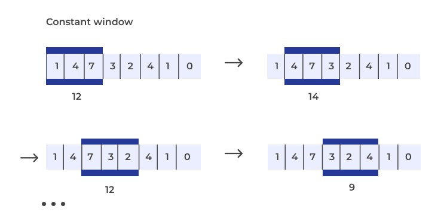
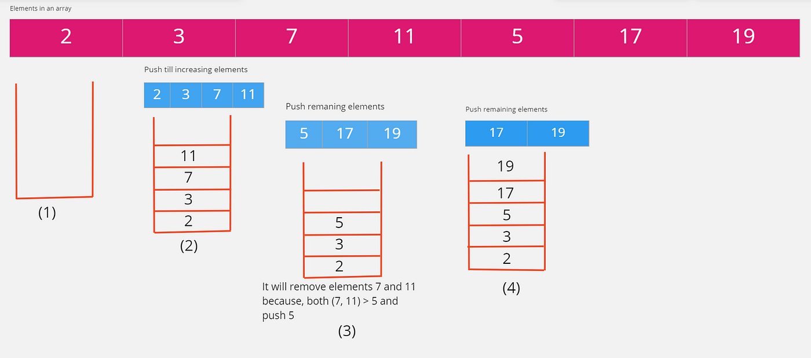
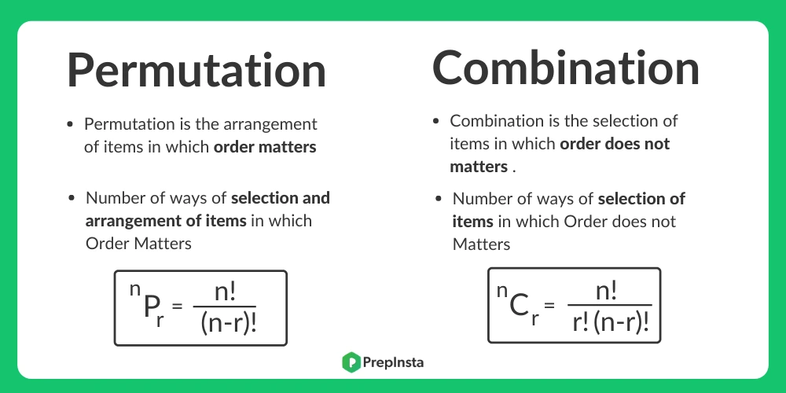

# INDEX

- [INDEX](#index)
  - [Problem Solving](#problem-solving)
    - [Problem Solving Steps](#problem-solving-steps)
    - [Problem Solving Patterns](#problem-solving-patterns)
      - [Frequency Counter](#frequency-counter)
      - [Two Pointers (multiple pointers)](#two-pointers-multiple-pointers)
      - [Sliding Window](#sliding-window)
      - [Monotonic decreasing stack](#monotonic-decreasing-stack)
      - [Monotonic decreasing queue](#monotonic-decreasing-queue)
      - [Divide and Conquer](#divide-and-conquer)
        - [Inductive proofs](#inductive-proofs)
      - [Combination \& Permutation (تباديل و توافيق)](#combination--permutation-تباديل-و-توافيق)
      - [Shortest path](#shortest-path)
      - [Greedy Algorithms](#greedy-algorithms)
  - [Testing and Debugging](#testing-and-debugging)
    - [Testing](#testing)
      - [Test fail situations](#test-fail-situations)
      - [Testing order](#testing-order)
    - [Debugging](#debugging)
  - [Notes](#notes)
  - [Creating Shapes](#creating-shapes)
    - [Steps shape](#steps-shape)
    - [Pyramid](#pyramid)
    - [Pascal's Triangle](#pascals-triangle)
  - [Numbers \& Math](#numbers--math)
    - [Power of Two](#power-of-two)
    - [Pow(x, n)](#powx-n)
    - [Partitioning Into Minimum Number Of Deci-Binary Numbers](#partitioning-into-minimum-number-of-deci-binary-numbers)

---

## Problem Solving

### Problem Solving Steps

It's important to follow these steps when solving a problem:

1. Verify the constraints

   - check if there's any constraints on the input like:
     - is all the input numbers are positive or can there be negative numbers?
     - is the input sorted or not?
     - are there any duplicates in the input?
     - will there always be a result or can there be no result? and what to return in that case? (edge cases)

2. write test cases (and focus on edge cases)

3. Break it down and figure out a solution without code

   - Here, don't focus on getting optimal solution, just focus on getting a working solution

4. Write solution in code

   - first write a brute force solution
   - then test it with the test cases
   - then try to optimize it

5. Double check for errors before submitting

   - check for syntax/logical errors

6. Test your code with different inputs using the test cases

7. Analyze the time and space complexity of the solution
   - Check if the input size in increased, how much will the time and space complexity increase?
   - If you found that:
     - the time complexity is `O(n^2)` or `O(n^3)` or `O(2^n)` or `O(n!)`
     - and the space complexity is `O(n)` or `O(1)
     - then you can try to optimize it by using the`Problem Solving Patterns` below. and use some space to save time.

---

### Problem Solving Patterns

#### Frequency Counter

- uses objects or sets to collect Values/frequencies of Values
- this can often avoid the need for nested loops or `O(n^2)` operations with arrays / strings
- this is done by: instead of looping over the first array and then checking for each value in a sub-loop over the second array, we can loop over each array one time individually.
  - this will give us `O(2n) ~= O(n)` instead of `O(n^2)`

---

#### Two Pointers (multiple pointers)

Creating pointers or values that correspond to an `index` or `position` and move towards the beginning, and/or middle based on certain condition



- It's used in problems where maintaining a pointer to 2 different positions in an array/string is useful. It's often used on a **sorted array/string**, where we can adjust the pointers until we find a desired condition.
- very efficient for solving problems with minimal **space-complexity**.
- `EX`: function that accepts **sorted** array of integers and find the first pair where the sum is `0`.

  - instead of creating nested-loop to check for every element and the elements after it, we can use the `multiple pointers` pattern
  - here we select 2 pairs(first and last elements of the array) as the array is sorted(they will be smallest and biggest number)
  - then we check these pair for the desired condition, and if not we change one of the numbers in pair and check again and so on...

  ```py
  # time-complexity: O(n), space-complexity: O(1)
  def sum_zero(arr):
    left = 0
    right = len(arr) -1
    while left < right:
      sum = arr[left] + arr[right]
      if sum == 0:
        return [arr[left], arr[right]]
      elif sum > 0:
        right -= 1 # as the right is the bigger number as arr is sorted
      else:
        left += 1 # as the left is the smaller number as arr is sorted
  ```

---

#### Sliding Window

In this pattern, we consider a **contiguous** window or subset of elements while iterating through the array. For some problems, this window is of a fixed size while, for others, we grow and shrink the size of the window subject to the rules of the problem.

- In terms of implementation, we employ this pattern by maintaining a `left` and `right` pointer just like in the two-pointer case but this time these pointers are pointing to the boundaries (edges) of the window
- depending on a certain condition, the window either increases or closes (and a new window is created)
- very useful for keeping track of a subset of data in an `array`/`string`


- EX: finding max-sum of window of 3 elements in an array:
  - instead of summing the first 3 elements and then do a nested loop to check for the remaining sum of windows -> `O(n^2`
  - we instead use a "sliding-window" pattern to keep track of the sum of the window and then compare it with a temporary sum of other windows
    - the sum here is calculated by not looping again, but with subtracting the previous number and adding the next number
      

---

#### Monotonic decreasing stack



It's a stack that is always sorted in a decreasing order, so the top of the stack is always the smallest element in the stack

- usually used in problems that require finding the next greater/smaller element in an array
  

---

#### Monotonic decreasing queue

It's a queue that is always sorted in a decreasing order, so the front of the queue is always the smallest element in the queue

- usually used in problems that require finding the next greater/smaller element in an array

---

#### Divide and Conquer

This pattern involves dividing a dataset into smaller chunks and then repeating a process with a subset of data

- How it works:

  1. Figure out a simple case as the base case
  2. Figure out how to reduce your problem and get to the base case

- Divide and conquer algorithms are often recursive algorithms, To solve a problem using `D&C`, we need to:

  1. Divide (decrease) the problem into a number of subproblems that are smaller instances of the same problem until it becomes the base case.
  2. Conquer the subproblems by solving them recursively. If they are small enough, solve the subproblems as base cases.
  3. Combine the solutions to the subproblems into the solution for the original problem.

- this pattern can tremendously decrease **time-complexity**
- EX: **Binary Search**, **Merge Sort**, **Quick Sort**

##### Inductive proofs

**Inductive proofs** are a way to prove that an algorithm works and involve two steps: (Base case and the inductive case). In the case of `quicksort`, the algorithm's effectiveness is proven for arrays of different sizes through the base case and the inductive case. Inductive proofs are considered fun and complement the Divide and Conquer technique.

- Ex: for `quicksort`. In the base case, The algorithm works for the base case: arrays of size `0` and `1`. In the inductive case, It's shown that if `quicksort` works for an array of size `1`, it will work for an array of size `2`. And if it works for arrays of size `2`, it will work for arrays of size `3`, and so on. hen I can say that quicksort will work for all arrays of any size.

---

#### Combination & Permutation (تباديل و توافيق)

- **Permutation**: is a way of selecting items from a collection, such that the order of selection does matter (because we are arranging items, not selecting them).
  - EX:
    - factorial: `n! = n * (n-1) * (n-2) * ... * 1` -> permutation of `n` items
    - if we have 3 letters `a`, `b`, `c`, then the permutations are:
      - `abc`, `acb`, `bac`, `bca`, `cab`, `cba`
- **Combination**: is a way of selecting items from a collection, such that the order of selection does not matter (because we are selecting items, not arranging them).
  - EX:
    - if we have 3 letters `a`, `b`, `c`, then the combinations are:
      - `abc`, `acb`, `bac`, `bca`, `cab`, `cba`
      - `ab`, `ac`, `ba`, `bc`, `ca`, `cb`
      - `a`, `b`, `c`



---

#### Shortest path

It's a path between two vertices in a graph such that the sum of the weights of its constituent edges is minimized.

you can use `BFS` or `Dijkstra's algorithm` to find the shortest path

- Use `BFS` when the graph is **unweighted**
- Use `Dijkstra's algorithm` when the graph is **weighted**

---

#### Greedy Algorithms

It's an algorithm that makes the locally **optimal** choice at each stage with the hope of finding a global optimum.

- It only applies when working with **optimization problems**.

  - Optimization problems: problems that require us to find the **maximum** or **minimum** value of a function.
  - `minimization` problems: problems that require us to find the **minimum** value of a function.

- Ex: **Dijkstra's algorithm** for finding the shortest path between two nodes in a graph.

---

## Testing and Debugging

Testing is the process of experimentally checking the correctness of a program, while debugging is the process of tracking the execution of a program and discovering the errors in it.

### Testing

- we should aim at executing the program on a representative subset of `inputs`. At the very minimum, we should make sure that every method of a class is tested at least once (**method coverage**). Even better, each code statement in the program should be executed at least once (statement coverage).

#### Test fail situations

Programs often tend to fail on a lot of situations like these:

- special **inputs** to the program
  - For example, when testing a method that `sorts` a sequence of integers, we should consider the following inputs:
    - The sequence has zero length (no elements).
    - The sequence has one element.
    - All the elements of the sequence are the same.
    - The sequence is already sorted.
    - The sequence is reverse sorted.
- special conditions for the **structures** used by the program:
  - For example, if we use a Python list to store data, we should make sure that **boundary cases**, such as `inserting` or `removing` at the beginning or end of the list, are properly handled.

#### Testing order

The dependencies among the classes and functions of a program induce a hierarchy. Namely, a component A is above a component B in the hierarchy if A depends upon B, such as when function A calls function B, or function A relies on a parameter that is an instance of class B. There are two main testing strategies, **top-down** and **bottom-up**, which differ in the order in which components are tested.

- **Top-down** testing proceeds from the top to the bottom of the program hierarchy. It is typically used in conjunction with **stubbing**, a boot-strapping technique that replaces a lower-level component with a **"stub"**,
  - > `stub`: a replacement for the component that simulates the functionality of the original.
  - > For example, if function A calls function B to get the first line of a file, when testing A we can replace B with a stub that returns a fixed string.
- **Bottom-up** testing proceeds from lower-level components to higher-level components. For example, bottom-level functions, which do not invoke other functions, are tested first, followed by functions that call only bottom-level functions, and so on. Similarly a class that does not depend upon any other classes can be tested before another class that depends on the former. This form of testing is usually described as **"unit testing"**,
  - as the functionality of a specific component is tested in isolation of the larger software project.

---

### Debugging

The simplest debugging technique consists of using `print` statements to track the values of variables during the execution of the program. A problem with this approach is that eventually the print statements need to be removed or commented out, so they are not executed when the software is finally released.

A better approach is to run the program within a **debugger**, which is a specialized environment for controlling and monitoring the execution of a program. The basic functionality provided by a debugger is the insertion of breakpoints within the code. When the program is executed within the debugger, it stops at each breakpoint. While the program is stopped, the current value of variables can be inspected.

---

## Notes

- When using pointers, and you want to skip duplicates, you can:
  - use a `while` loop and check if the current element is equal to the **next element**, if so, skip it by incrementing the pointer
    - EX: `while nums[i] == nums[i+1]: i+= 1`
  - or if you are inside a `for` loop, you can check if the current element is equal to the **previous element**, if so, skip it by using `continue`
    - EX: `if nums[i] == nums[i+1]: continue`
- If you want to use **Tail Recursion** in your solution, make sure to let the interviewer know that you are using it, as it's not supported in all languages
  - not supported in `python` and `java` but supported in `javascript` and `c++`

---

## Creating Shapes

### Steps shape

Write a function that accepts a positive number N. The function should print a step shape with N levels using the # character. Make sure the step has **spaces** on the right hand side!

- EX: `steps(3) --> '#  ', '## ', '###'`

```py
# Solution 1 - using for loops
def print_steps(n):
    for i in range(1, n + 1):
        step = '#' * i
        spaces = ' ' * (n - i)
        print(step + spaces)

# -------------------------------------------------

# Solution 2 - using recursion
def print_steps(n, row=0, step=''):
    # Base case: when we've printed all rows, stop recursion
    if n == row:
        return

    # If we've printed all the #s for the current row, print a new line and start a new row
    if n == len(step):
        print(step)
        return print_steps(n, row + 1) # must return to stop the function from executing the rest of the code

    # If we're still printing characters in the current row, decide whether to add a '#' or ' '
    if len(step) <= row:
        step += '#'
    else:
        step += ' '

    # Recursively call print_steps to print the next character in the current row
    print_steps(n, row, step)
```

---

### Pyramid

Write a function that accepts a positive number N. The function should console log a pyramid shape with N levels using the # character. Make sure the pyramid has spaces on both the left and right hand sides!

- EX:

  ```py
  pyramid(3)
  '  #  '
  ' ### '
  '#####'`
  ```

- Solution 1 - using for loops

  - steps:

    1. Find the midpoint of the row
    2. Add the # to the left of the midpoint
    3. Add the # to the right of the midpoint
    4. Repeat until you reach N levels

  ```py
  def pyramid(n):
      midpoint = (2 * n - 1) // 2

      # loop through each row in the pyramid (n rows)
      for row in range(n):
          level = ''
          for column in range(2 * n - 1):
              if midpoint - row <= column <= midpoint + row:
                  level += '#' # add a # to the level when the column is within the range of the midpoint +/- the current row
              else:
                  level += ' '
          print(level)
  ```

- Solution 2 - using recursion

  ```py
  def pyramid(n):
      if N == 0:
          return

      print_pyramid(N - 1)

      num_chars = 2 * N - 1
      num_spaces = (2 * N - 1 - num_chars) // 2
      level = " " * num_spaces + "#" * num_chars + " " * num_spaces

      print(level)

  # ---------------------------OR------------------------------

  def pyramid(n, row=0, level=''):
      # Base case: when we've printed all rows, stop recursion
      if n == row:
          return

      # If we've printed all the #s for the current row, print a new line and start a new row
      if len(level) == 2 * n - 1:
          print(level)
          return pyramid(n, row + 1) # must return to stop the function from executing the rest of the code

      midpoint = (2 * n - 1) // 2
      add = ''
      if midpoint - row <= len(level) <= midpoint + row:
          add = '#'
      else:
          add = ' '

      # Recursively call pyramid to print the next character in the current row
      pyramid(n, row, level + add)
  ```

---

### Pascal's Triangle

Given a non-negative integer `numRows`, generate the first `numRows` of Pascal's triangle.


- Explanation:
  - The trick here, is to notice that each row is a list of the sum of the previous row's elements
  - So, we can add `[1]` to the result list and then loop through the result list and add the sum of the previous row's elements to the result list
  - We can do this until we reach the `numRows`

```py
def generate(numRows):
    res = [[1]]
    for i in range(1, numRows):
        prevRow = res[-1]
        newRow = [1] + [prevRow[j] + prevRow[j + 1] for j in range(len(prevRow) - 1)] + [1]
        res.append(newRow)

    return res
```

---

## Numbers & Math

### Power of Two

Given an integer `n`, return `true` if it is a power of two. Otherwise, return `false`.
An integer `n` is a power of two, if there exists an integer `x` such that `n == 2^x`.

- Solution 1: using loop (reusable for any number and not just `2`)

  ```py
  # O(log n)
  def is_power_of_two(n):
      if n == 0:
          return False

      while n > 1:
          if n % 2 != 0:
            return False
          n //= 2

      return True
  ```

- Solution 2: using bitwise operators

  

  - We can check this by using the **bitwise AND** operator between `n` and `n - 1`
  - This is because `n` and `n - 1` will have all the same bits as `n`, except for the rightmost `1` in `n`, **so all the bits in `n` and `n - 1` will be different**
    

  ```py
  # O(1)
  def is_power_of_two(n):
      return n > 0 and n & (n - 1) == 0
  ```

---

### Pow(x, n)

Implement `pow(x, n)`, which calculates `x` raised to the power `n` (i.e., `x^n`).

- Explanation:

  - instead of looping and multiplying `x` by itself `n` times, we can use **Divide & conquer** to reduce the number of multiplications
    - `x^n = x^(n/2) * x^(n/2) * x^(n%2)`
    - `x^10` = `x^5 * x^5`
      - `x^5` = `x^2 * x^2 * x`
        - `x^2` = `x * x`
          - `x^1` = `x`
            - `x^0` = `1`

- Time complexity: `O(log n)`

```py
def my_pow(x, n):
    if n == 0:
        return 1

    if n > 0:
        partial = my_pow(x, n // 2)
        if n % 2 == 0:
            return partial * partial
        else:
            return partial * partial * x
    else:
        partial = my_pow(x, -n // 2)
        if n % 2 == 0:
            return 1 / (partial * partial)
        else:
            return 1 / (partial * partial * x)

# ---------------------------OR------------------------------

def my_pow(x, n):
    def helper(x, n):
      if x == 0: return 0 # base case
      if n == 0: return 1 # base case

      res = helper(x, n // 2)
      return res * res * x if n % 2 else res * res

    return helper(x, n) if n >= 0 else 1 / helper(x, -n)
```

---

### Partitioning Into Minimum Number Of Deci-Binary Numbers

A decimal number is called **deci-binary** if each of its digits is either `0` or `1` without any leading zeros. For example, `101` and `1100` are **deci-binary**, while `112` and `3001` are not.

Given a string `n` that represents a positive decimal integer, return the **minimum** number of positive **deci-binary** numbers needed so that they sum up to `n`.

- EX:

  - Input: `n = "32"`
    - Output: `3`
    - Explanation: `10 + 11 + 11 = 32`
  - Input: `n = "82734"`
  - Output: `8`

- Explanation:

  - If each deci-binary number has no higher than a `1` in the each position, then it will take at least `x` numbers to sum up to `n`, where `x` is the largest digit in `n`
  - This means that the largest character in any position in `n` will determine how many deci-binary numbers must be added together to obtain `n`.
    
    

  ```py
  # 82734 - 11111 = 71623
  # 71623 - 11111 = 60512
  # 60512 - 10111 = 50401
  # 50401 - 10101 = 40300
  # 40300 - 10100 = 30200
  # 30200 - 10100 = 20100
  # 20100 - 10100 = 10000
  # 10000 - 10000 = 0

  # -> 8 times

  # 42 - 1111 = 37
  # 37 - 1111 = 26
  # 26 - 1111 = 15
  # 15 - 1111 = 4
  # 4 - 1111 = -7 (stop)
  ```

```py
def min_partitions(n):
    # convert the string to a list of integers
    nums = [int(num) for num in n]

    # return the largest digit in the list
    return max(nums)
```

---
