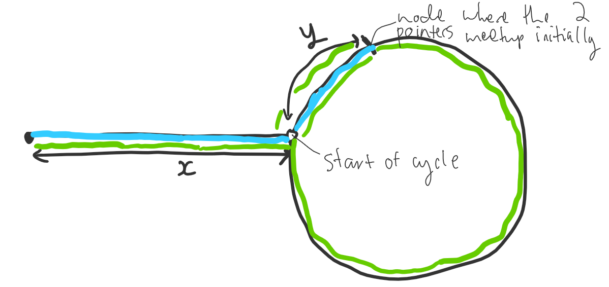
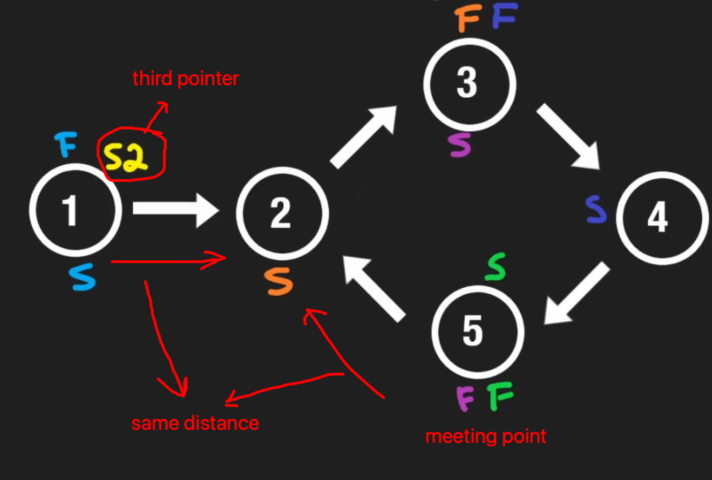
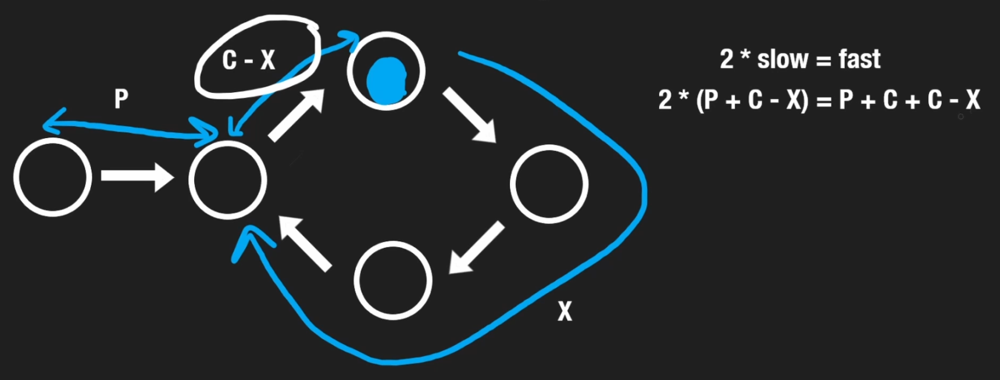
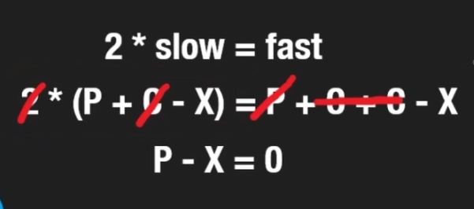
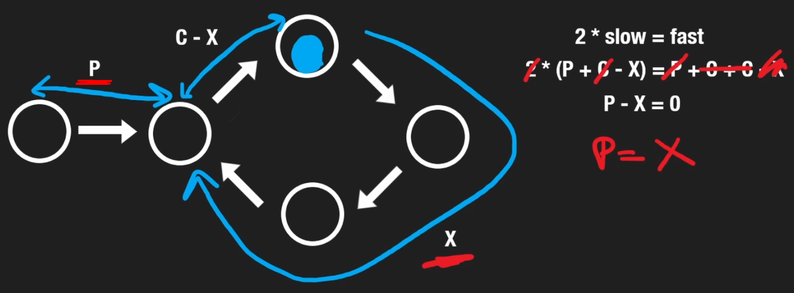

# INDEX

- [INDEX](#index)
  - [Problem Solving Steps](#problem-solving-steps)
  - [Problem Solving Patterns](#problem-solving-patterns)
    - [Frequency Counter](#frequency-counter)
    - [Two Pointers (multiple pointers)](#two-pointers-multiple-pointers)
    - [Sliding Window](#sliding-window)
    - [Have \& Need Technique](#have--need-technique)
    - [Kadane's Algorithm](#kadanes-algorithm)
    - [Prefix Sum (cumulative sum)](#prefix-sum-cumulative-sum)
    - [Iterating in reverse order](#iterating-in-reverse-order)
    - [Fast and Slow pointers](#fast-and-slow-pointers)
    - [Monotonic decreasing stack](#monotonic-decreasing-stack)
    - [Monotonic decreasing queue](#monotonic-decreasing-queue)
    - [Top / Least K elements](#top--least-k-elements)
    - [Divide and Conquer](#divide-and-conquer)
      - [Inductive proofs](#inductive-proofs)
    - [Combination \& Permutation (تباديل و توافيق)](#combination--permutation-تباديل-و-توافيق)
    - [Shortest path](#shortest-path)
    - [Greedy Algorithms](#greedy-algorithms)
  - [Testing and Debugging](#testing-and-debugging)
    - [Testing](#testing)
      - [Test fail situations](#test-fail-situations)
      - [Testing order](#testing-order)
    - [Debugging](#debugging)
  - [Template for solving problems in interviews](#template-for-solving-problems-in-interviews)
  - [Notes](#notes)
  - [Creating Shapes](#creating-shapes)
    - [Steps shape](#steps-shape)
    - [Pyramid](#pyramid)

---

## Problem Solving Steps

It's important to follow these steps when solving a problem:

1. Verify the constraints

   - check if there's any constraints on the input like:
     - is all the input numbers are positive or can there be negative numbers?
     - is the input sorted or not?
     - are there any duplicates in the input?
     - will there always be a result or can there be no result? and what to return in that case? (edge cases)

2. write test cases (and focus on edge cases)

3. Break it down and figure out a solution without code

   - Here, don't focus on getting optimal solution, just focus on getting a working solution

4. Write solution in code

   - first write a brute force solution
   - then test it with the test cases
   - then try to optimize it

5. Double check for errors before submitting

   - check for syntax/logical errors

6. Test your code with different inputs using the test cases

7. Analyze the time and space complexity of the solution
   - Check if the input size in increased, how much will the time and space complexity increase?
   - If you found that:
     - the time complexity is `O(n^2)` or `O(n^3)` or `O(2^n)` or `O(n!)`
     - and the space complexity is `O(n)` or `O(1)
     - then you can try to optimize it by using the`Problem Solving Patterns` below. and use some space to save time.

---

## Problem Solving Patterns

Recognizing similarities between new problems and ones you've solved before is a valuable skill for interviews and your career. Many interview problems share common techniques, known as **problem patterns**.

- Problem patterns are not a substitute for a strong foundational understanding of a topic. It's not enough to memorize patterns for Arrays/Vectors. To be interview-ready, you need a solid understanding of each topic, including implementation details, runtimes for data structure operations, and an intuition for how well-known algorithms work.
  - [Data Structures](./1-Data-Structures.md)
  - [Algorithms](./2-Algorithms.md)

### Frequency Counter

- uses objects or sets to collect Values/frequencies of Values
- this can often avoid the need for nested loops or `O(n^2)` operations with arrays / strings
- this is done by: instead of looping over the first array and then checking for each value in a sub-loop over the second array, we can loop over each array one time individually.
  - this will give us `O(2n) ~= O(n)` instead of `O(n^2)`

---

### Two Pointers (multiple pointers)

It's about creating pointers or values that correspond to an `index` or `position` and move towards the beginning, and/or middle based on certain condition


- It's used in problems where maintaining a pointer to 2 different positions in an array/string is useful. It's often used on a **sorted array/string**, where we can adjust the pointers until we find a desired condition.
- very efficient for solving problems with minimal **space-complexity**.
- `EX`: function that accepts **sorted** array of integers and find the first pair where the sum is `0`.

  - instead of creating nested-loop to check for every element and the elements after it, we can use the `two pointers` pattern
  - here we select 2 pairs(first and last elements of the array) as the array is sorted(they will be smallest and biggest number)
  - then we check these pair for the desired condition, and if not we change one of the numbers in pair and check again and so on...

  ```py
  # time-complexity: O(n), space-complexity: O(1)
  def sum_zero(arr):
    left = 0
    right = len(arr) -1
    while left < right:
      sum = arr[left] + arr[right]
      if sum == 0:
        return [arr[left], arr[right]]
      elif sum > 0:
        right -= 1 # as the right is the bigger number as arr is sorted
      else:
        left += 1 # as the left is the smaller number as arr is sorted
  ```

- Notes:
  - for `N sum` problems (2sum, 3sum, 4sum, etc...) we can use a `helper` function for searching to make the code cleaner

---

### Sliding Window

In this pattern, we consider a **contiguous** window or subset of elements while iterating through the array. For some problems, this window is of a fixed size while, for others, we grow and shrink the size of the window subject to the rules of the problem.

- In terms of implementation, we employ this pattern by maintaining a `left` and `right` pointer just like in the two-pointer case but this time these pointers are pointing to the boundaries (edges) of the window
- depending on a certain condition, the window either increases or closes (and a new window is created)
- very useful for keeping track of a subset of data in an `array`/`string`


- EX: finding max-sum of window of 3 elements in an array:

  - instead of summing the first 3 elements and then do a nested loop to check for the remaining sum of windows -> `O(n^2)`
  - we instead use a "sliding-window" pattern to keep track of the sum of the window and then compare it with a temporary sum of other windows
    - the sum here is calculated by not looping again, but with subtracting the previous number and adding the next number
      

- Note: There's good and back implementation of the sliding window pattern, so make sure to check the implementation before using it.

  - Bad implementation: `O(n * k)` -> `O(n^2)`, `k` is the window size ❌

    ```py
    # Given an array, return true if there're 2 elements within a window of size K that are equal
    def contains_duplicates(arr, k):
        for l in range(len(arr)):
            for r in range(l+1, min(l+k, len(arr))):
                if arr[l] == arr[r]:
                    return True
        return False
    ```

  - Good implementation: `O(n)` -> `O(n)` ✅

    ```py
    # Given an array, return true if there're 2 elements within a window of size K that are equal
    def contains_duplicates(arr, k):
        window = set()
        l = 0
        for r in range(len(arr)):
            if arr[r] in window:
                return True
            window.add(arr[r])
            if r - l + 1 == k: # window size
                window.remove(arr[l])
                l += 1
        return False
    ```

---

### Have & Need Technique

It's a technique that depends on [Sliding Window](#sliding-window) pattern, used when we want to run sliding window on 2 arrays/strings.

- `have` -> is number of matching cases in the current window
- `need` -> is number of cases in the desired window
- We usually have 2 hash tables for the 2 input strings where we have for example the count of each character in each string.
- This technique is a superset of the `sliding window` pattern, as it requires additional window handling to make sure that the window is valid. and to regularly update the `have` value depending on the current window.

---

### Kadane's Algorithm

It's used to find the **maximum sum** of a contiguous subarray within an array of numbers in `O(n)` time.

- It's based on the idea that a positive contiguous segment (`max_ending_here`) is added to the previous contiguous segment (`max_so_far`) only if the previous contiguous segment is `positive`. Otherwise, it is better to start a new contiguous segment from the current element because adding the current element to the previous contiguous segment will only decrease the sum.
  
- It's very similar to `sliding window` and `2 pointers` problems.
  - This is because we are keeping track of a contiguous subarray of elements.
  - Here, we don't have a required window size, unlike the `sliding window` pattern.

---

### Prefix Sum (cumulative sum)

It's an array where each `index` is the **sum** of all elements from `0` up to and including that `index` in the original array.

- This is used to prevent `O(n^2)` time complexity when calculating the sum of a subarray for each element in the array due to nested loops.
  - We do so by eliminating the inner `O(n)` loop by using a prefix array to calculate the sum of the subarray in `O(1)` time using this formula:
    - `prefix[i] = prefix[i-1] + nums[i]`
- **Note:** when calculating the prefix array, we add an extra element to the prefix array to make it easier to calculate the sum of the first element
  
  - `prefix = [0] * (len(nums) + 1)`
- To calculate the prefix sum for a given range `[i, j]`, we can use the following formula:

  - `rangeSum = prefix[j] - prefix[i-1]`

    ```py
    # for range [2, 5], we do:
    rangeSum = prefix[5] - prefix[1] # because we want to include the 2nd element, but remove all the elements before it
    ```

- It must start from the **beginning** of the array, and it must be continuous.

---

### Iterating in reverse order

This is a common pattern when we need to iterate over an array in reverse order in order to improve the time complexity of the algorithm.

- It's usually to make use of the already calculated values in the right side of the array and prevent the need to recalculate them again. Or to do something with the values in the right side of the array.
- To iterate over an array in reverse order, we can use:
  - the `range()` function and pass it the `start`, `stop`, and `step` arguments.
    - `range(start, stop, step)` -> `range(len(arr) - 1, -1, -1)`
  - iterating over a shallow copy of the reversed array
    - `reversed(arr)`
    - `arr[::-1]`

---

### Fast and Slow pointers

It's a technique that uses two pointers to traverse the list at different speeds (`slow` and `fast`).

- This is also known as the **runner technique**. The `fast` pointer moves two steps at a time while the `slow` pointer moves one step at a time.
- This technique is useful for:
  - solving problems involving cycles in linked lists.
  - finding the middle of a linked list.
    
  - detecting cycles in a linked list or array.
    
    - Using pointers here is better than using a `hash set` to keep track of the visited nodes, as it will be `O(1)` space complexity instead of `O(n)` space complexity. Also, in some problems we don't know if the nodes are unique or not.
  - finding the intersection of two linked lists.

```py
slow = head
fast = head

while fast and fast.next:
    slow = slow.next
    fast = fast.next.next
# now `slow` is at the middle of the list, and `fast` is at the end of the list
```

- It's also called: **Floyd's tortoise and hare algorithm**

  - It's a cycle detection algorithm that uses two pointers to traverse the list at different speeds. It's a solution that doesn't require extra space (space to store the nodes that have been visited).
    - "tortoise" 🐢 -> moves 1 step at a time (Slow)
    - "hare" 🐰 -> moves 2 steps at a time (Fast)
  - We can use two pointers, `fast` and `slow`. The `fast` pointer moves two steps at a time while the `slow` pointer moves one step. **If the list has a cycle, the `fast` pointer will eventually meet the `slow` pointer**.
    
    - This is because the distance between the `fast` and the `slow` pointers will be shrinking by `1` at each step in the cycle. Eventually, the `fast` pointer will be `1` step behind the `slow` pointer and then `0` steps behind the `slow` pointer. This means that the `fast` pointer will be at the same position as the `slow` pointer.
  - This will be a **Linear time algorithm** -> `O(2n) ~= O(n)`

- To find the head of the cycle, we can use the following these steps:
  
  - First, we find the intersection point of the two pointers. If there is no cycle, the `fast` pointer will reach the end of the list and we can return `None` as there is no cycle.
  - Then, we move the `slow` pointer back to the head of the list and keep the `fast` pointer at the intersection point.
  - Finally, we move both pointers at the same speed until they meet. The node where they meet is the head of the cycle.
  - Explanation:
    
    
    

---

### Monotonic decreasing stack

It's a stack that is always sorted in a decreasing order, so the top of the stack is always the smallest element in the stack (a stack that is either **strictly increasing** or **strictly decreasing**).

- The Monotonic Stacks technique is a useful technique that can be used in the following scenarios:

  - First element greater than an element, after (to the right of) it in the array - **(Monotonically Decreasing Stack)**.
  - First element greater than an element, before (to the left of) it in the array - **(Monotonically Decreasing Stack)**.
  - First element less than an element, after (to the right of) it in the array - **(Monotonically Increasing Stack)**.
  - First element less than an element, before (to the left of) it in the array - **(Monotonically Increasing Stack)**.

- Example:

  ```py
  arr = [2, 3, 7, 11, 5, 17, 19]

  # 1) starting state: stack = []
  # 2) stack is empty - push 2 onto the stack: [2]
  # 3) 3 is bigger than 2, so we push 3 onto the stack: [2, 3]
  # 4) 7 is bigger than 3, so we push 7 onto the stack: [2, 3, 7]
  # 5) 11 is bigger than 7, so we push 11 onto the stack: [2, 3, 7, 11]
  # 6) 5 is smaller than 11 and 7, so we pop 11 and 7 and push 5: [2, 3, 5]
  # 7) 17 is bigger than 5, so we push 17 onto the stack: [2, 3, 5, 17]
  # 8) 19 is bigger than 17, so we push 19 onto the stack: [2, 3, 5, 17, 19]
  # FINAL STATE: [2, 3, 5, 7, 17, 19] -> the stack is sorted in a decreasing order
  ```

  

  - instead of scanning the array to find the next greater/smaller element `O(n^2)`, we can use a monotonic stack to find it in `O(n)` time.

- Algorithm for using a monotonic decreasing stack:

  ```py
  stack = []
  for i in range(len(arr)):
      while stack and stack[-1] > arr[i]:
          stack.pop()
      stack.append(arr[i])
  ```

- usually used in problems that require finding the next greater/smaller element in an array
  

- It can also be **monotonic increasing stack**, where the top of the stack is always the biggest element in the stack
- It's used as a technique to solve problems that involve **finding the next greater/smaller element** in an array.
  - A simple solution to these problems is to sort and return the first / last `k` elements in the collections, but that would take `O(nlogn)` time.
  - Using a monotonic stack, we can solve these problems in `O(N log(k))` time and `O(k)` space.
- This technique is also used with a `heap` to solve problems that involve **finding the next greater/smaller element** in an array.

---

### Monotonic decreasing queue

It's a queue that is always sorted in a decreasing order, so the front of the queue is always the smallest element in the queue

- usually used in problems that require finding the next greater/smaller element in an array

---

### Top / Least K elements

A common task in problems is to find the Top or Least K elements in a collection (whether it's an Array, List, or some other collection of elements).

- `K` can be frequency, size, value, etc.

  - EX: find the top 3 most frequent elements in an array
  - EX: find the top 3 largest elements in an array
  - EX: find the top 3 smallest elements in an array

- Brute force solution: sort the array and then get the top `K` elements -> `O(nlog(n))`
- We can cut down the time complexity by using a **Heap** data structure to be `O(nlog(k))` instead of `O(nlog(n))`

  - `n` pointing that we'll loop over the array, and for each iteration we'll add/remove an element from the heap -> `O(log(k))`
    
  - The space complexity will be `O(k)` as we'll store `k` elements in the `heap`
    - it can be `O(1)` if the output is not included in the space complexity

- Example:

  ```py
  # Find top 3 Largest elements in an array
  arr = [5, 1, 4, 10, 2, 3, 7]

  # 1) starting state: heap = []
  # 2) heap is empty, we don't have 3 elements yet, so we add 5: heap = [5]
  # 3) heap has 1 element (we don't have 3 elements yet), we add 1: heap = [5, 1]
  # 4) heap has 2 elements (we don't have 3 elements yet), we add 4: heap = [5, 4, 1]
  # 5) heap has 3 elements now, We have to replace one of the elements with 10 because it's bigger than the top of the heap `1` (with is the smallest element in the heap): heap = [10, 5, 4]
  # 6) `2` is smaller than the top of the heap `4`, so we don't add it to the heap: heap = [10, 5, 4]
  # 7) `3` is smaller than the top of the heap `4`, so we don't add it to the heap: heap = [10, 5, 4]
  # 8) `7` is bigger than the top of the heap `4`, so we replace it with `7`: heap = [10, 7, 5]
  # FINAL STATE: [10, 7, 5] -> the heap contains top 3 largest elements in the array
  ```

  - When the heap doesn't have `k` elements yet, we add the element to the heap
  - When the heap has `k` elements, we compare the element with the top of the heap, if it's bigger, we replace the top of the heap with the element, if it's smaller, we don't add it to the heap
  - The heap will always contain the top `k` elements in the array

- Implementation:

  ```py
  heap = [] # min-heap
  for el in arr:
      if len(heap) < k:
          heapq.heappush(heap, el)
      elif el > heap[0]: # if the element is bigger than the top of the heap (smallest element in the heap)
          heapq.heappop(heap)
          heapq.heappush(heap, el)
  ```

---

### Divide and Conquer

This pattern involves dividing a dataset into smaller chunks and then repeating a process with a subset of data

- How it works:

  1. Figure out a simple case as the base case
  2. Figure out how to reduce your problem and get to the base case

- Divide and conquer algorithms are often recursive algorithms, we need to:

  1. Divide (decrease) the problem into a number of subproblems that are smaller instances of the same problem until it becomes the base case.
  2. Conquer the subproblems by solving them recursively. If they are small enough, solve the subproblems as base cases.
  3. Combine the solutions to the subproblems into the solution for the original problem.

- this pattern can tremendously decrease **time-complexity**
- EX: **Binary Search**, **Merge Sort**, **Quick Sort**

#### Inductive proofs

**Inductive proofs** are a way to prove that an algorithm works and involve two steps: (Base case and the inductive case). In the case of `quicksort`, the algorithm's effectiveness is proven for arrays of different sizes through the base case and the inductive case. Inductive proofs are considered fun and complement the Divide and Conquer technique.

- Ex: for `quicksort`. In the base case, The algorithm works for the base case: arrays of size `0` and `1`. In the inductive case, It's shown that if `quicksort` works for an array of size `1`, it will work for an array of size `2`. And if it works for arrays of size `2`, it will work for arrays of size `3`, and so on. hen I can say that quicksort will work for all arrays of any size.

---

### Combination & Permutation (تباديل و توافيق)

- **Permutation**: is a way of selecting items from a collection, such that the **order of selection matters** (because we are arranging items, not selecting them).
  - EX:
    - factorial: `n! = n * (n-1) * (n-2) * ... * 1` -> permutation of `n` items
    - if we have 3 letters `a`, `b`, `c`, then the permutations are:
      - `abc`, `acb`, `bac`, `bca`, `cab`, `cba`
- **Combination**: is a way of selecting items from a collection, such that the **order of selection does not matter** (because we are selecting items, not arranging them).
  - EX:
    - if we have 3 letters `a`, `b`, `c`, then the combinations are:
      - `abc`, `acb`, `bac`, `bca`, `cab`, `cba`
      - `ab`, `ac`, `ba`, `bc`, `ca`, `cb`
      - `a`, `b`, `c`


---

### Shortest path

It's a path between two vertices in a graph such that the sum of the weights of its constituent edges is minimized.

you can use `BFS` or `Dijkstra's algorithm` to find the shortest path

- Use `BFS` when the graph is **unweighted**
- Use `Dijkstra's algorithm` when the graph is **weighted**

---

### Greedy Algorithms

It's an algorithm that makes the locally **optimal** choice at each stage with the hope of finding a global optimum.

- It only applies when working with **optimization problems**.

  - Optimization problems: problems that require us to find the **maximum** or **minimum** value of a function.
  - `minimization` problems: problems that require us to find the **minimum** value of a function.

- Ex: **Dijkstra's algorithm** for finding the shortest path between two nodes in a graph.

---

## Testing and Debugging

Testing is the process of experimentally checking the correctness of a program, while debugging is the process of tracking the execution of a program and discovering the errors in it.

### Testing

- we should aim at executing the program on a representative subset of `inputs`. At the very minimum, we should make sure that every method of a class is tested at least once (**method coverage**). Even better, each code statement in the program should be executed at least once (statement coverage).

#### Test fail situations

Programs often tend to fail on a lot of situations like these:

- special **inputs** to the program
  - For example, when testing a method that `sorts` a sequence of integers, we should consider the following inputs:
    - The sequence has zero length (no elements).
    - The sequence has one element.
    - All the elements of the sequence are the same.
    - The sequence is already sorted.
    - The sequence is reverse sorted.
- special conditions for the **structures** used by the program:
  - For example, if we use a Python list to store data, we should make sure that **boundary cases**, such as `inserting` or `removing` at the beginning or end of the list, are properly handled.

#### Testing order

The dependencies among the classes and functions of a program induce a hierarchy. Namely, a component A is above a component B in the hierarchy if A depends upon B, such as when function A calls function B, or function A relies on a parameter that is an instance of class B. There are two main testing strategies, **top-down** and **bottom-up**, which differ in the order in which components are tested.

- **Top-down** testing proceeds from the top to the bottom of the program hierarchy. It is typically used in conjunction with **stubbing**, a boot-strapping technique that replaces a lower-level component with a **"stub"**,
  - > `stub`: a replacement for the component that simulates the functionality of the original.
  - > For example, if function A calls function B to get the first line of a file, when testing A we can replace B with a stub that returns a fixed string.
- **Bottom-up** testing proceeds from lower-level components to higher-level components. For example, bottom-level functions, which do not invoke other functions, are tested first, followed by functions that call only bottom-level functions, and so on. Similarly a class that does not depend upon any other classes can be tested before another class that depends on the former. This form of testing is usually described as **"unit testing"**,
  - as the functionality of a specific component is tested in isolation of the larger software project.

---

### Debugging

The simplest debugging technique consists of using `print` statements to track the values of variables during the execution of the program. A problem with this approach is that eventually the print statements need to be removed or commented out, so they are not executed when the software is finally released.

A better approach is to run the program within a **debugger**, which is a specialized environment for controlling and monitoring the execution of a program. The basic functionality provided by a debugger is the insertion of breakpoints within the code. When the program is executed within the debugger, it stops at each breakpoint. While the program is stopped, the current value of variables can be inspected.

---

## Template for solving problems in interviews

```py
# solution.py
import unittest

class Solution:
    def function_name(self, input):
        # code here
        return

class TestSolution(unittest.TestCase):
    def test_function_name(self):
        sol = Solution()

        # Test cases:
        arr = [1, 2, 3, 4, 5]
        arr2 = [1, 2, 3]
        arr3 = [4, 5]

        # Checking if the function returns the correct output
        # self.assertEqual(sol.function_name(input), output)
        self.assertEqual(sol.function_name(arr), 5)
        self.assertEqual(sol.function_name(arr2), 3)
        self.assertEqual(sol.function_name(arr3), 5)

# Run the tests
unittest.main()
```

- Run the tests:

  ```bash
  python3 solution.py
  ```

---

## Notes

- When using pointers, and you want to skip duplicates, you can:
  - use a `while` loop and check if the current element is equal to the **next element**, if so, skip it by incrementing the pointer
    - EX: `while nums[i] == nums[i+1]: i+= 1`
  - or if you are inside a `for` loop, you can check if the current element is equal to the **previous element**, if so, skip it by using `continue`
    - EX: `if nums[i] == nums[i+1]: continue`
- If you want to use **Tail Recursion** in your solution, make sure to let the interviewer know that you are using it, as it's not supported in all languages
  - not supported in `python` and `java` but supported in `javascript` and `c++`

---

## Creating Shapes

### Steps shape

Write a function that accepts a positive number N. The function should print a step shape with N levels using the # character. Make sure the step has **spaces** on the right hand side!

- EX: `steps(3) --> '#  ', '## ', '###'`

```py
# Solution 1 - using for loops
def print_steps(n):
    for i in range(1, n + 1):
        step = '#' * i
        spaces = ' ' * (n - i)
        print(step + spaces)

# -------------------------------------------------

# Solution 2 - using recursion
def print_steps(n, row=0, step=''):
    # Base case: when we've printed all rows, stop recursion
    if n == row:
        return

    # If we've printed all the #s for the current row, print a new line and start a new row
    if n == len(step):
        print(step)
        return print_steps(n, row + 1) # must return to stop the function from executing the rest of the code

    # If we're still printing characters in the current row, decide whether to add a '#' or ' '
    if len(step) <= row:
        step += '#'
    else:
        step += ' '

    # Recursively call print_steps to print the next character in the current row
    print_steps(n, row, step)
```

---

### Pyramid

Write a function that accepts a positive number N. The function should console log a pyramid shape with N levels using the # character. Make sure the pyramid has spaces on both the left and right hand sides!

- EX:

  ```py
  pyramid(3)
  '  #  '
  ' ### '
  '#####'`
  ```

- Solution 1 - using for loops

  - steps:

    1. Find the midpoint of the row
    2. Add the # to the left of the midpoint
    3. Add the # to the right of the midpoint
    4. Repeat until you reach N levels

  ```py
  def pyramid(n):
      midpoint = (2 * n - 1) // 2

      # loop through each row in the pyramid (n rows)
      for row in range(n):
          level = ''
          for column in range(2 * n - 1):
              if midpoint - row <= column <= midpoint + row:
                  level += '#' # add a # to the level when the column is within the range of the midpoint +/- the current row
              else:
                  level += ' '
          print(level)
  ```

- Solution 2 - using recursion

  ```py
  def pyramid(n):
      if N == 0:
          return

      print_pyramid(N - 1)

      num_chars = 2 * N - 1
      num_spaces = (2 * N - 1 - num_chars) // 2
      level = " " * num_spaces + "#" * num_chars + " " * num_spaces

      print(level)

  # ---------------------------OR------------------------------

  def pyramid(n, row=0, level=''):
      # Base case: when we've printed all rows, stop recursion
      if n == row:
          return

      # If we've printed all the #s for the current row, print a new line and start a new row
      if len(level) == 2 * n - 1:
          print(level)
          return pyramid(n, row + 1) # must return to stop the function from executing the rest of the code

      midpoint = (2 * n - 1) // 2
      add = ''
      if midpoint - row <= len(level) <= midpoint + row:
          add = '#'
      else:
          add = ' '

      # Recursively call pyramid to print the next character in the current row
      pyramid(n, row, level + add)
  ```

---
