# INDEX

- [INDEX](#index)
  - [Iterating in reverse order](#iterating-in-reverse-order)
    - [Replace Elements with Greatest Element on Right Side](#replace-elements-with-greatest-element-on-right-side)
    - [Plus One](#plus-one)
  - [Minimum Absolute Difference](#minimum-absolute-difference)
  - [Array Permutation](#array-permutation)
    - [Build Array from Permutation](#build-array-from-permutation)
    - [Next Permutation](#next-permutation)
    - [Compute a random permutation](#compute-a-random-permutation)
    - [Shuffle an Array](#shuffle-an-array)
  - [Two pointers](#two-pointers)
    - [Two Sum II](#two-sum-ii)
    - [3Sum (Triplet Sum to Zero)](#3sum-triplet-sum-to-zero)
    - [3Sum Closest](#3sum-closest)
    - [3Sum Smaller](#3sum-smaller)
    - [4Sum](#4sum)
    - [Remove Element](#remove-element)
    - [Remove Duplicates From Sorted Array](#remove-duplicates-from-sorted-array)
    - [Remove Duplicates from Sorted Array II](#remove-duplicates-from-sorted-array-ii)
    - [Container with most water](#container-with-most-water)
    - [Squares of a Sorted Array](#squares-of-a-sorted-array)
    - [Sort array based on parity](#sort-array-based-on-parity)
    - [Rearrange Array Elements by Sign](#rearrange-array-elements-by-sign)
    - [Trapping Rain Water](#trapping-rain-water)
  - [Sliding Window](#sliding-window)
    - [Maximum Average Subarray I](#maximum-average-subarray-i)
    - [Minimum Size Subarray Sum](#minimum-size-subarray-sum)
    - [Number of Sub-arrays of Size K and Average Greater than or Equal to Threshold](#number-of-sub-arrays-of-size-k-and-average-greater-than-or-equal-to-threshold)
    - [Fruit Into Baskets](#fruit-into-baskets)
    - [Longest Subarray of 1's After Deleting One Element](#longest-subarray-of-1s-after-deleting-one-element)
    - [Max Consecutive Ones III](#max-consecutive-ones-iii)
    - [Sliding Window Maximum](#sliding-window-maximum)
    - [Chunk Array](#chunk-array)
    - [Shortest Unsorted Continuous Subarray](#shortest-unsorted-continuous-subarray)
  - [Prefix / Prefix Sum](#prefix--prefix-sum)
    - [Range Sum Query - Immutable](#range-sum-query---immutable)
    - [Range Sum Query 2D - Immutable](#range-sum-query-2d---immutable)
    - [Product of Array Except Self](#product-of-array-except-self)
    - [Continuous SubArray Sum](#continuous-subarray-sum)
    - [Subarray Sum Equals K](#subarray-sum-equals-k)
    - [Find Pivot Index](#find-pivot-index)
  - [Kadane's Algorithm](#kadanes-algorithm)
    - [Maximum Subarray](#maximum-subarray)
    - [Maximum Sum Circular Subarray](#maximum-sum-circular-subarray)
    - [Longest Turbulent Subarray](#longest-turbulent-subarray)
  - [Fast and Slow Pointers](#fast-and-slow-pointers)
    - [Find the Duplicate Number](#find-the-duplicate-number)
  - [Merge Intervals Pattern](#merge-intervals-pattern)
    - [Merge Intervals](#merge-intervals)
    - [Insert Interval](#insert-interval)
    - [Interval List Intersections](#interval-list-intersections)
    - [Non-overlapping Intervals](#non-overlapping-intervals)
    - [Meeting Rooms](#meeting-rooms)
    - [Meeting Rooms II](#meeting-rooms-ii)
    - [Maximum CPU Load](#maximum-cpu-load)
    - [Employee Free Time](#employee-free-time)
  - [2D Array ( Matrix )](#2d-array--matrix-)
    - [Rotate Image](#rotate-image)
    - [Spiral Matrix](#spiral-matrix)
    - [Spiral Matrix II](#spiral-matrix-ii)
    - [Valid Tic-Tac-Toe State](#valid-tic-tac-toe-state)
    - [Pascal's Triangle](#pascals-triangle)
    - [Pascal's Triangle II](#pascals-triangle-ii)
    - [Valid Sudoku](#valid-sudoku)
    - [Robot Return to Origin](#robot-return-to-origin)
    - [Design Memory Allocator](#design-memory-allocator)

---

## Iterating in reverse order

This is a common pattern when we need to iterate over an array in reverse order in order to improve the time complexity of the algorithm.

- It's usually to make use of the already calculated values in the right side of the array and prevent the need to recalculate them again. Or to do something with the values in the right side of the array.
- To iterate over an array in reverse order, we can use:
  - the `range()` function and pass it the `start`, `stop`, and `step` arguments.
    - `range(start, stop, step)` -> `range(len(arr) - 1, -1, -1)`
  - iterating over a shallow copy of the reversed array
    - `reversed(arr)`
    - `arr[::-1]`

### Replace Elements with Greatest Element on Right Side

| Video Solution                                                | Hint                                                                                                                                                                                             |
| ------------------------------------------------------------- | ------------------------------------------------------------------------------------------------------------------------------------------------------------------------------------------------ |
| [Video Solution](https://www.youtube.com/watch?v=ZHjKhUjcsaU) | The trick here, is to start from the right side (end) of the array and iterate in reverse order and keep track of the `rightMax` and update it every time by comparing it to the current element |

Given an array `arr`, replace every element in that array with the greatest element among the elements to its right, and replace the last element with `-1`.

- Ex:

  - `arr = [17,18,5,4,6,1]` -> `[18,6,6,6,1,-1]`
  - Explanation:
    - index `0` --> The greatest element to the right of index `0` is index `1` (18).
    - index `1` --> The greatest element to the right of index `1` is index `4` (6).
    - index `2` --> The greatest element to the right of index `2` is index `4` (6).
    - index `3` --> The greatest element to the right of index `3` is index `4` (6).
    - index `4` --> The greatest element to the right of index `4` is index `5` (1).
    - index `5` --> There are no elements to the right of index `5`, so we put `-1`.

- Explanation:
  - Instead of using nested loops `O(n^2)`, we can loop through the array in reverse order and keep track of the maximum element we've seen so far.
    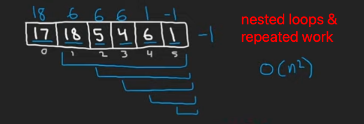
    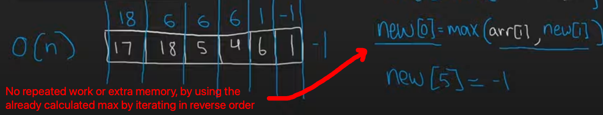
- Time complexity: `O(n)`

```py
def replaceElements(arr):
    # initialize the max element for the last element in the array
    rightMax = -1

    for i in range(len(arr) - 1, -1, -1):
        newMax = max(rightMax, arr[i])
        arr[i] = rightMax
        rightMax = newMax

    return arr
```

---

### Plus One

| Video Solution                                                | Hint                                                                                                                                                                                                  |
| ------------------------------------------------------------- | ----------------------------------------------------------------------------------------------------------------------------------------------------------------------------------------------------- |
| [Video Solution](https://www.youtube.com/watch?v=jIaA8boiG1s) | Loop through the array **in reverse order** and check if the current digit is less than `9`, if it is, increment it by `1` and return the array, if not, set it to `0` and continue to the next digit |

Given a **non-empty** array of decimal digits representing a non-negative integer, increment one to the integer.

The digits are stored such that the most significant digit is at the head of the list, and each element in the array contains a single digit.

You may assume the integer does not contain any leading zero, except the number 0 itself.

- Ex:

  - `digits = [1,2,3]` -> `[1,2,4]`
  - `digits = [1,2,9]` -> `[1,3,0]` because `129 + 1 = 130`
  - `digits = [0]` -> `[1]`

```py
def plusOne(digits):
    # loop through the array in reverse order
    for i in range(len(digits) - 1, -1, -1):
        # if the current digit is less than 9, increment it by 1 and return the array
        if digits[i] < 9:
            digits[i] += 1
            return digits
        # if the current digit is 9, set it to 0 and continue to the next digit
        else:
            digits[i] = 0

    # if we reach this point, it means that all the digits are 9, so we need to add a 1 at the beginning of the array
    return [1] + digits
```

---

## Minimum Absolute Difference

| Video Solution                                                | Hint                                                                                                                                                                                          |
| ------------------------------------------------------------- | --------------------------------------------------------------------------------------------------------------------------------------------------------------------------------------------- |
| [Video Solution](https://www.youtube.com/watch?v=dyEQ1plxH2U) | Sort the array first, then iterate over the array and keep track of the minimum difference between two adjacent elements. if you find a smaller difference, update the minimum and start over |

Given an array of distinct integers `arr`, find all pairs of elements with the minimum absolute difference of any two elements. Return a list of pairs in ascending order(with respect to pairs), each pair `[a, b]` follows

- `a, b` are from `arr`
- `a < b`
- `b - a` equals to the minimum absolute difference of any two elements in `arr`

- Ex:

  - `arr = [4, 2, 1, 3], --> [[1, 2], [2, 3], [3, 4]]`

- Explanation:
  - Instead of using nested loops `O(n^2)`, we can sort the array first `O(n.log(n))` and then iterate over the array and keep track of the minimum difference between two adjacent elements.
    - This is because **the minimum difference will be between two adjacent elements in the sorted array -> (closest elements are next to each other)**
  - if you find a smaller difference, update the minimum and start over
  - if you find the same difference, add the pair to the result

```py
def minimumAbsDifference(arr):
    arr.sort()
    minDiff = float('inf')
    res = []

    for i in range(1, len(arr)):
        diff = arr[i] - arr[i - 1]
        if diff < minDiff:
            minDiff = diff
            res = [[arr[i - 1], arr[i]]] # start over
        elif diff == minDiff:
            res.append([arr[i - 1], arr[i]]) # add to the result

    return res

# --------------------------------------------------

# Or using 2 different loops
def minimumAbsDifference(arr):
    arr.sort()
    minDiff = float('inf')
    res = []

    # find the minimum difference
    for i in range(1, len(arr)):
        diff = arr[i] - arr[i - 1]
        minDiff = min(minDiff, diff)

    # find all the pairs with the minimum difference
    for i in range(1, len(arr)):
        diff = arr[i] - arr[i - 1]
        if diff == minDiff:
            res.append([arr[i - 1], arr[i]])

    return res
```

---

## Array Permutation

A **Permutation** of an array of integers is an arrangement of its members into a sequence or linear order.

### Build Array from Permutation

| Video Solution                                                | Hint                                                                                                                                                                                               |
| ------------------------------------------------------------- | -------------------------------------------------------------------------------------------------------------------------------------------------------------------------------------------------- |
| [Video Solution](https://www.youtube.com/watch?v=1svjL7Docuo) | Iterate over the array and append the element at `nums[nums[i]]` to the result array, **OR** solve it without using extra space by using the modulo operator `%` to get the old value of `nums[i]` |

Given a **zero-based permutation** `nums` (0-indexed), build an array `ans` of the **same length** where `ans[i] = nums[nums[i]]` for each `0 <= i < nums.length` and return it.

A **zero-based permutation** `nums` is an array of **distinct** integers from `0` to `nums.length - 1` (inclusive).

- Ex:

  - `nums = [0,2,1,5,3,4]` -> `[0,1,2,4,5,3]`
  - Explanation: The array `ans` is built as follows:

    - `ans = [nums[nums[0]], nums[nums[1]], nums[nums[2]], nums[nums[3]], nums[nums[4]], nums[nums[5]]]`
    - `ans = [nums[0], nums[2], nums[1], nums[5], nums[3], nums[4]]`
    - `ans = [0,1,2,4,5,3]`

- **Solution 1:** using a extra result array (Brute force & Extra space)

  - Time complexity: `O(n)`
  - Space complexity: `O(n)`

  ```py
  def buildArray(nums):
      ans = []
      for i in range(len(nums)):
          ans.append(nums[nums[i]])
      return ans

      # Or using list comprehension
      # return [nums[nums[i]] for i in range(len(nums))]
  ```

- **Solution 2:** Without using extra space

  - In order to solve it without using extra space, have a reference to the old and new values of `nums[i]` in the same element. because we will need the old value of `nums[i]` to calculate the new value of `nums[i]`
    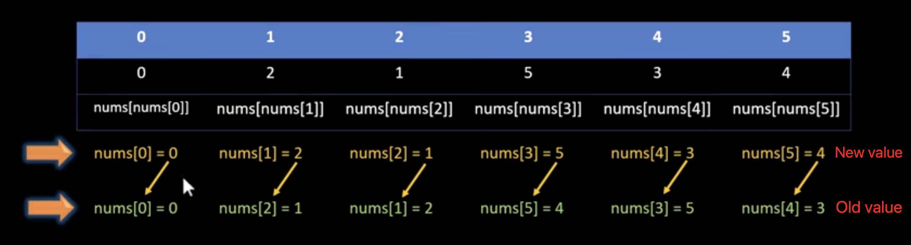
    - It's done by using this formula: `num1 + (some_constant) * num2`
      - `num1` is the old value of `nums[i]`
      - `num2` is the new value of `nums[i]`
      - `some_constant` is a constant that is greater than the maximum value in the array
        - we use it because the new value of `nums[i]` is greater than the maximum value in the array, so we need to get the old value of `nums[i]` by using the modulo operator `%`
  - After we have the reference to the old and new values of `nums[i]` in the same element, we need to recover the data, we can iterate over the array again and divide each element by `some_constant` to get the new value of `nums[i]`
    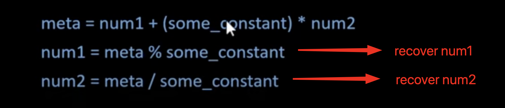
  - So:
    - to get old value of `nums[i]` -> `nums[i] % some_constant`
    - to get new value of `nums[i]` -> `nums[i] // some_constant`
  - The `some_constant` must be bigger than the maximum value in the array, which is given in the problem statement, so we can use the length of the array `n` as the `some_constant`

  - Time complexity: `O(n)`
  - Space complexity: `O(1)`

  ```py
  def buildArray(nums):
      CONST = len(nums)
      for i in range(len(nums)):
          a = nums[i]
          b = nums[a] % CONST
          nums[i] = a + CONST * b
      for i in range(len(nums)):
          nums[i] //= CONST
      return nums
  ```

---

### Next Permutation

| Video Solution                                                | Hint                                                                                                                                                                                                                                                                                                                                                                                                                 |
| ------------------------------------------------------------- | -------------------------------------------------------------------------------------------------------------------------------------------------------------------------------------------------------------------------------------------------------------------------------------------------------------------------------------------------------------------------------------------------------------------- |
| [Video Solution](https://www.youtube.com/watch?v=quAS1iydq7U) | The idea is to start from the **rightmost side** of the array and find the longest decreasing subarray. This is because the rightmost side is the least significant digit, and we want to increase the permutation by as little as possible. Then, we swap the element to the left of the subarray with the next largest element in the subarray. Then, we reverse the subarray to the right of the swapped element. |

Implement **next permutation**, which rearranges numbers into the lexicographically next greater permutation of numbers.

If such an arrangement is not possible, it must rearrange it as the lowest possible order (i.e., sorted in ascending order).

The replacement must be **in place** and use only constant extra memory.

- Ex:

  - `nums = [1,2,3]` -> `[1,3,2]`
  - `nums = [3,2,1]` -> `[1,2,3]`
  - `nums = [1]` -> `[1]`

- Explanation
  - We want to compute the next permutation given the current permutation. The idea is to find the next permutation by rearranging the existing values.
  - One brute force approach is to generate all permutations and find the given permutation and return the next permutation. However, this approach is not efficient because it generates all permutations `O(n!)` and finds the given permutation `O(n)`.
  - We can do better by understanding how permutations are generated. The idea is to start from the rightmost side of the array and find the longest decreasing subarray. This is because the rightmost side is the least significant digit, and we want to increase the permutation by as little as possible.
    - Find the longest decreasing subarray.
    - Swap the element to the left of the subarray with the next largest element in the subarray.
    - Reverse the subarray to the right of the swapped element.
  - The key insight is that we want to increase the permutation by as little as possible. The loose analogy is how a car's odometer increments. The difference is that we cannot change values, only reorder them. So, we want to increase the permutation by as little as possible by rearranging the existing values.
  - The idea is to start from the **rightmost side** of the array and find the longest decreasing subarray. This is because the rightmost side is the least significant digit, and we want to increase the permutation by as little as possible.
    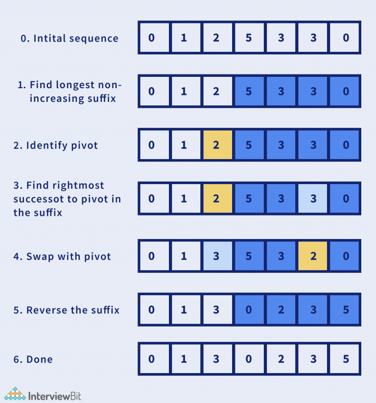
    - The longest decreasing subarray is the subarray that is already in descending order. For example, in the array `[0, 1, 2, 5, 3, 3, 0]`, the longest decreasing subarray is `[5, 3, 3, 0]`.
      - We can't get the next permutation by modifying this subarray because it is already in descending order. Instead, we need to modify the element to the left of this subarray. In this case, it is `2`. We need to find the next largest element to `2` in the subarray `[5, 3, 3, 0]`. This element is `3`. We swap `2` and `3` to get `[0, 1, 3, 5, 3, 2, 0]`.
  - Now, we have the next permutation, but it is not the smallest permutation. We need to sort the subarray to the right of `3` to get the smallest permutation. This is because the subarray to the right of `3` is in descending order. We need to sort it in ascending order to get the smallest permutation. We get `[0, 1, 3, 0, 2, 3, 5]`.
  - The final answer is `[0, 1, 3, 0, 2, 3, 5]`.

```py
def nextPermutation(nums):
    # find the longest decreasing subarray
    i = len(nums) - 1
    while i > 0 and nums[i] <= nums[i - 1]:
        i -= 1
    # now i points to the head of the suffix

    # if we found a decreasing subarray, then we need to rearrange the numbers to the right of nums[i−1] including itself
    if i > 0:
        j = len(nums) - 1
        while j >= i and nums[j] <= nums[i - 1]:
            j -= 1
        nums[i - 1], nums[j] = nums[j], nums[i - 1]

    # reverse the numbers to the right of nums[i−1] including itself
    nums[i:] = nums[i:][::-1]
```

---

### Compute a random permutation

| Video Solution | Hint                                                                                                                                                                                                         |
| -------------- | ------------------------------------------------------------------------------------------------------------------------------------------------------------------------------------------------------------ |
| NA             | Use the **Fisher-Yates shuffle** algorithm to generate a random permutation in `O(n)` time and `O(1)` space. The idea is to iterate over the array and swap each element with a random element to its right. |

Given an integer `n`, return a random permutation of `[0, 1, ..., n - 1]`.

- Ex:

  - `n = 3` -> `[1, 0, 2]` or `[2, 1, 0]` or `[0, 2, 1]`

- Explanation:
  - Generating random permutation is not as straightforward as it seems. The naive approach is to generate a random number and check if it is already in the permutation. If it is, then we discard it and generate another random number.
    - We can use a `hash table` to check if a number is already in the permutation. However, this approach is not efficient because it can take a long time to generate a random permutation.
  - A better approach is to use the **Fisher-Yates shuffle** algorithm. The idea is to iterate over the array and swap each element with a random element to its right. This algorithm is efficient because it generates a random permutation in `O(n)` time and `O(1)` space.
  - The algorithm works as follows:
    - Iterate over the array from left to right.
    - For each element, generate a random number between the current index and the last index.
    - Swap the current element with the element at the random index.

```py
import random

def computeRandomPermutation(n):
    permutation = list(range(n)) # [0, 1, ..., n - 1]
    for i in range(n):
        # generate a random index between i and n - 1
        rand = random.randint(i, n - 1)
        # swap the current element with the element at the random index
        permutation[i], permutation[rand] = permutation[rand], permutation[i]
    return permutation
```

---

### Shuffle an Array

| Video Solution | Hint                                                                                                                                                                                                         |
| -------------- | ------------------------------------------------------------------------------------------------------------------------------------------------------------------------------------------------------------ |
| NA             | Use the **Fisher-Yates shuffle** algorithm to generate a random permutation in `O(n)` time and `O(1)` space. The idea is to iterate over the array and swap each element with a random element to its right. |

Given an integer array `nums`, design an algorithm to randomly shuffle the array. All permutations of the array should be **equally likely** as a result of the shuffling.

- Implement the `Solution` class:

  - `Solution(int[] nums)` Initializes the object with the integer array nums.
  - `int[] reset()` Resets the array to its original configuration and returns it.
  - `int[] shuffle()` Returns a random shuffling of the array.

- Ex:

  - Input: `["Solution", "shuffle", "reset", "shuffle"] [[1, 2, 3], [], [], []]`
  - Output: `[null, [3, 1, 2], [1, 2, 3], [1, 3, 2]]`

- Explanation:
  - Similar to the [Compute a random permutation](#compute-a-random-permutation) problem, we can use the **Fisher-Yates shuffle** algorithm to shuffle the array.

```py
import random

class Solution:
    def __init__(self, nums):
        self.nums = nums
        self.original = list(nums)

    def reset(self):
        self.nums = self.original
        self.original = list(self.original)
        return self.nums

    def shuffle(self):
        for i in range(len(self.nums)):
            rand = random.randrange(i, len(self.nums))
            self.nums[i], self.nums[rand] = self.nums[rand], self.nums[i]
        return self.nums
```

---

## Two pointers

- Notes:
  - for `N sum` problems (2sum, 3sum, 4sum, etc...) we can use a `helper` function for searching to make the code cleaner

### Two Sum II

| Video Solution                                                | Hint                                                                                                                                                               |
| ------------------------------------------------------------- | ------------------------------------------------------------------------------------------------------------------------------------------------------------------ |
| [Video Solution](https://www.youtube.com/watch?v=cQ1Oz4ckceM) | Use **two pointers** to find the two numbers that sum to the target (making use of the fact that the array is sorted in ascending order), and return their indices |

Given a 1-indexed array of integers numbers that is already sorted in non-decreasing order, find two numbers such that they add up to a specific target number. Let these two numbers be `numbers[index1]` and `numbers[index2]` where `1 <= index1 < index2 <= numbers.length`.

Return the indices of the two numbers, `index1` and `index2`, **added by one** as an integer array `[index1, index2]` of length `2`.

- EX: `nums = [2, 7, 11, 15], target = 9` --> `[0, 1]` because `nums[0] + nums[1] == 9`

- Explanation:
  - We can use the **two pointers** pattern to find the two numbers that sum to the target (making use of the fact that the array is sorted in ascending order), and return their indices
    - We can set the `left` pointer to the first element in the array and the `right` pointer to the last element in the array
  - Check if the `sum` of the two pointers is equal to the `target`, if it is, then return the indices
    - If the `sum` is less than the `target`, then we need to move the `left` pointer to the right to get a larger value
    - If the `sum` is greater than the `target`, then we need to move the `right` pointer to the left to get a smaller value
  - if the target was not found, return `[-1, -1]` **Must ask the interviewer if the target will always be found**

```py
def two_sum(numbers, target):
    # Set the left and right pointers
    left = 0
    right = len(numbers) - 1

    while left < right:
        curSum = numbers[left] + numbers[right]
        # If the sum of the left and right pointers is the target, return the indices adding 1 to each since the problem is 1-indexed
        if curSum == target:
            return [left + 1, right + 1]
        elif curSum < target:
            left += 1
        else:
            right -= 1
    # If the target was not found, return [-1, -1]
    return [-1, -1]
```

---

### 3Sum (Triplet Sum to Zero)

| Video Solution                                                | Hint                                                                                                                                                                                                                                                                                      |
| ------------------------------------------------------------- | ----------------------------------------------------------------------------------------------------------------------------------------------------------------------------------------------------------------------------------------------------------------------------------------- |
| [Video Solution](https://www.youtube.com/watch?v=jzZsG8n2R9A) | Sort the array then, use **two pointers** to find the third element that sums to `zero`, instead of iterating over all possible pairs of elements. Avoid generating duplicate triplets by skipping over duplicates in the input array and avoiding identical pairs of `(i, j, k)` values. |

Given an array `nums` of n integers, are there elements a, b, c in `nums` such that a + b + c = 0? Find all unique triplets in the array which gives the sum of zero.

- EX: `nums = [-1, 0, 1, 2, -1, -4]` --> `[[-1, 0, 1], [-1, -1, 2]]`
- Explanation:

  - Bruteforce solution: `O(n^3)`

    - Iterate over all possible triplets of elements in the array and check if the sum is equal to zero

  - We can do better by using the **two pointers** pattern
    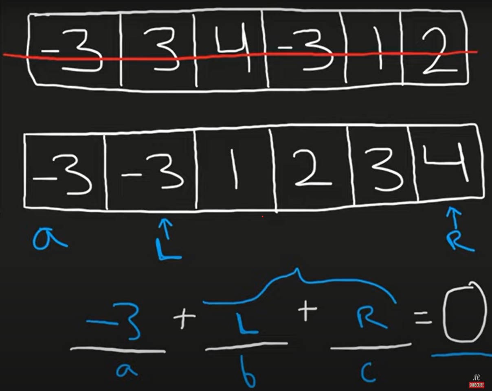
    - Sort the input array first. Use two pointers to find the third element that sums to `zero`, instead of iterating over all possible pairs of elements.
    - Avoid generating duplicate triplets by skipping over duplicates in the input array and avoiding identical pairs of `(i, j, k)` values.
      - or we can use a `set` to avoid duplicates
  - Time complexity: `O(n.log(n)) + O(n^2) = O(n^2)`
  - Space complexity: `O(n)` for the sorted array (some sorting algorithms are in-place based on the language)

```py
# Time: O(n.log(n)) + O(n^2) = O(n^2)
def three_sum(nums):
    nums.sort()
    result = []

    for i in range(len(nums)):
        # if the current value is the same as the previous value, skip it, because we've already tried it (To avoid duplicates)
        if i > 0 and nums[i] == nums[i-1]:
            continue

        # set left and right pointers to find the other two values
        left, right = i+1, len(nums)-1
        while left < right:
            total = nums[i] + nums[left] + nums[right]
            # if the sum is less than zero, move the left pointer to the right to get a larger value
            if total < 0:
                left += 1
            # if the sum is greater than zero, move the right pointer to the left to get a smaller value
            elif total > 0:
                right -= 1
            # otherwise, we have found the triplet
            else:
                result.append([nums[i], nums[left], nums[right]])
                # move both pointers to the middle to see if we have more triplets
                left += 1
                right -= 1
                # skip duplicates
                while left < right and nums[left] == nums[left-1]:
                    left += 1
                while left < right and nums[right] == nums[right+1]:
                    right -= 1
    return result
```

- **Modification:** using a `helper` function

  ```py
  def three_sum(nums):
      nums.sort()
      result = []

      for i in range(len(nums)):
          # if the current value is the same as the previous value, skip it, because we've already tried it (To avoid duplicates)
          if i > 0 and nums[i] == nums[i-1]:
              continue

          # find all pairs that sum to -nums[i]
          find_two_sum(nums, -nums[i], i+1, result)

      return result

  def find_two_sum(nums, target, left, result):
      right = len(nums) - 1

      while left < right:
          total = nums[left] + nums[right]
          if total < target:
              left += 1
          elif total > target:
              right -= 1
          else:
              result.append([-target, nums[left], nums[right]])
              left += 1
              right -= 1
              # skip duplicates
              while left < right and nums[left] == nums[left-1]:
                  left += 1
              while left < right and nums[right] == nums[right+1]:
                  right -= 1
  ```

---

### 3Sum Closest

| Video Solution                                                | Hint                                                                                                                                                                                                                                                                                                                                              |
| ------------------------------------------------------------- | ------------------------------------------------------------------------------------------------------------------------------------------------------------------------------------------------------------------------------------------------------------------------------------------------------------------------------------------------- |
| [Video Solution](https://www.youtube.com/watch?v=qBr2hq4daWE) | Sort the array then, use **two pointers** to find the third element that sums to `target`, instead of iterating over all possible pairs of elements. Avoid generating duplicate triplets by skipping over duplicates in the input array, keep track of the `closest` value to the target and update it if we find a closer value by using `abs()` |

Given an array `nums` of `n` integers and an integer `target`, find three integers in `nums` such that the sum is **closest** to `target`. Return the sum of the three integers.

You may assume that each input would have exactly one solution.

- EX: `nums = [-1, 2, 1, -4], target = 1` --> `2` because `(-1 + 2 + 1) = 2`

- Explanation:

  - it's very similar to the [3Sum](#3sum-triplet-sum-to-zero) problem, but instead of checking if the `sum` is equal to `zero`, we check if the `sum` is equal to the `target`
  - also, we need to keep track of the `closest` value to the `target` and update it if we find a closer value

    - to do that, we can use the `abs()` function to get the absolute value of the difference between the `sum` and the `target`, because if the difference is negative, then we need to make it positive to compare it with the `closest` value

      ```py
      if abs(total - target) < abs(closest - target):
                  closest = total
      ```

  - Time complexity: `O(n.log(n)) + O(n^2) = O(n^2)`
  - Space complexity: `O(n)` for the sorted array (some sorting algorithms are in-place based on the language)

```py
# Time: O(n^2)
def three_sum_closest(nums, target):
    nums.sort()
    closest = float('inf')

    for i in range(len(nums)):
        if i > 0 and nums[i] == nums[i-1]:
            continue

        left, right = i+1, len(nums)-1
        while left < right:
            total = nums[i] + nums[left] + nums[right]
            if total < target:
                left += 1
            elif total > target:
                right -= 1
            else:
                return total

            # update the closest value
            if abs(total - target) < abs(closest - target):
                closest = total
    return closest
```

---

### 3Sum Smaller

| Video Solution                                                | Hint                                                                                                                                                                                                                                                                                                                                             |
| ------------------------------------------------------------- | ------------------------------------------------------------------------------------------------------------------------------------------------------------------------------------------------------------------------------------------------------------------------------------------------------------------------------------------------ |
| [Video Solution](https://www.youtube.com/watch?v=qZ9XV3H6fL8) | Sort the array then, use **two pointers** to find the third element that sums to a value less than `target`, instead of iterating over all possible pairs of elements. Avoid generating duplicate triplets by skipping over duplicates in the input array, keep track of the `count` of the triplets `(right - left)` that satisfy the condition |

Given an array `nums` of `n` integers and an integer `target`, find the number of index triplets `i`, `j`, `k` with `0 <= i < j < k < n` that satisfy the condition `nums[i] + nums[j] + nums[k] < target`.

- EX: `nums = [-2, 0, 1, 3], target = 2` --> `2`

  - because `(-2 + 0 + 1) < 2` and `(-2 + 0 + 3) < 2`

- Explanation:

  - it's very similar to the [3Sum](#3sum-triplet-sum-to-zero) problem, but instead of checking if the `sum` is equal to `zero`, we check if the `sum` is less than the `target`
  - also, we need to keep track of the `count` of the triplets that satisfy the condition
    - `right - left` is the number of triplets that satisfy the condition
    - we can add it to the `count` and move the `left` pointer to the right to get a larger value

```py
# Time: O(n^2)
def three_sum_smaller(nums, target):
    nums.sort()
    count = 0

    for i in range(len(nums)):
        if i > 0 and nums[i] == nums[i-1]:
            continue

        left, right = i+1, len(nums)-1
        while left < right:
            total = nums[i] + nums[left] + nums[right]
            if total < target:
                count += right - left
                left += 1
            else:
                right -= 1
    return count
```

---

### 4Sum

| Video Solution                                                | Hint                                                                                                                                                                                                                                                                     |
| ------------------------------------------------------------- | ------------------------------------------------------------------------------------------------------------------------------------------------------------------------------------------------------------------------------------------------------------------------ |
| [Video Solution](https://www.youtube.com/watch?v=EYeR-_1NRlQ) | Sort the array then, loop through the array and use **three pointers** to find the fourth element that sums to `target`, instead of iterating over all possible pairs of elements. Avoid generating duplicate quadruplets by skipping over duplicates in the input array |

Given an array `nums` of `n` integers, return an array of all the **unique** quadruplets `[nums[a], nums[b], nums[c], nums[d]]` such that:

- `0 <= a, b, c, d < n`
- `a`, `b`, `c`, and `d` are **distinct**.
- `nums[a] + nums[b] + nums[c] + nums[d] == target`

You may return the answer in **any order**.

- EX: `nums = [1, 0, -1, 0, -2, 2], target = 0` --> `[[-2, -1, 1, 2], [-2, 0, 0, 2], [-1, 0, 0, 1]]`

- Explanation:
  - It's similar to the [3Sum](#3sum-triplet-sum-to-zero) problem, but with extra loop
  - Sort the array
  - Loop through the array
    - Avoid duplicates by skipping over duplicates in the input array
    - Move the left and right pointers to the next unique values to avoid duplicates

```py
# Time: O(n^3) N-triplets
def four_sum(nums, target):
    nums.sort()
    result = []

    for i in range(len(nums) - 3): # because we have 4 pointers
        # if the current value is the same as the previous value, skip it, because we've already tried it (To avoid duplicates)
        if i > 0 and nums[i] == nums[i-1]: continue

        for j in range(i+1, len(nums) - 2): # because we have 3 pointers
            if j > i+1 and nums[j] == nums[j-1]: continue

            # set left and right pointers to find the other two values
            left, right = j+1, len(nums)-1
            while left < right:
                total = nums[i] + nums[j] + nums[left] + nums[right]
                if total < target:
                    left += 1
                elif total > target:
                    right -= 1
                # otherwise, we have found the quadruplet
                else:
                    result.append([nums[i], nums[j], nums[left], nums[right]])
                    left += 1
                    right -= 1
                    # skip duplicates
                    while left < right and nums[left] == nums[left-1]: left += 1
                    while left < right and nums[right] == nums[right+1]: right -= 1
    return result
```

---

### Remove Element

| Video Solution                                                | Hint                                                                                     |
| ------------------------------------------------------------- | ---------------------------------------------------------------------------------------- |
| [Video Solution](https://www.youtube.com/watch?v=Pcd1ii9P9ZI) | Remove **in-place** by using pointers, and swapping elements with the last valid element |

Given an array `nums` and a value `val`, remove all instances of that value **in-place** and return the new length.

- Ex:

  - `nums = [3,2,2,3], val = 3` -> `2` (`nums = [2,2]`)

- Explanation:
  - we can use a **two pointers** pattern to check for all the elements in the array
  - we can use the first pointer (`lastIndex`) to keep track of the last val element in the array
  - and the second pointer to iterate over the array and check if the current element is equal to val `(i)`
    - if it is, then we skip it, if not, then we swap the current element with the last val element and increment the `lastIndex` **and then** update the `lastIndex`
      > it's similar to `Quick Sort` algorithm, where we partition the array into two parts, one part with all the elements less than the `pivot` and the other part with all the elements greater than the pivot

```py
def removeElement(nums, val):
    lastIndex = 0
    for i in range(len(nums)):
        if nums[i] != val:
            nums[lastIndex] = nums[i]
            lastIndex += 1
    return lastIndex
```

---

### Remove Duplicates From Sorted Array

| Video Solution                                                | Hint                                                                                      |
| ------------------------------------------------------------- | ----------------------------------------------------------------------------------------- |
| [Video Solution](https://www.youtube.com/watch?v=DEJAZBq0FDA) | Remove **in-place** by using pointers, and swapping elements with the last unique element |

Given a sorted array `nums`, remove the duplicates **in-place** such that each element appears only once and returns the new length.

You must use `O(1)` space.

- Ex:

  - `nums = [1,1,2]` -> `2` -> `(nums = [1,2,_])`
  - `nums = [0,0,1,1,1,2,2,3,3,4]` -> `5` -> `(nums = [0,1,2,3,4,_,_,_,_,_])`
    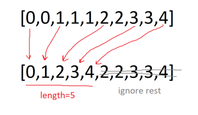

- Explanation:

  - One brute force solution is to iterate over the array and check if the current element is equal to the next element, if it is, then we remove it from the array and shift the elements to the left

    - but this solution is not efficient because we have to shift the elements to the left every time we remove an element: `(n-1)+(n-2)+...+1 = O(n^2)`

  - we can use a **two pointers** pattern to check for all the elements in the array an just swap the elements that are not unique without shifting the elements to the left
    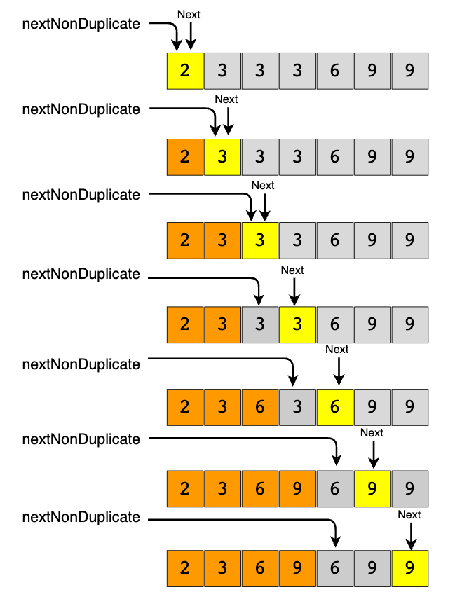
    - we can use the first pointer to keep track of the `last unique element` in the array
    - and the second pointer to iterate over the array and check if the current element is equal to the `last unique element`
    - if it is, then we skip it, if not, then we increment the last unique index **and then** update the `last unique element`

```py
def removeDuplicates(nums):
    if len(nums) == 0: return 0

    # initialize the index of the last unique element
    last_unique = 0

    for i in range(1, len(nums)):
        # if the current element is not equal to the last unique element, increment the last unique index and then update the last unique element
        if nums[i] != nums[last_unique]:
            last_unique += 1
            nums[last_unique] = nums[i]

    return last_unique + 1
```

---

### Remove Duplicates from Sorted Array II

| Video Solution                                                | Hint                                                                                                                                                       |
| ------------------------------------------------------------- | ---------------------------------------------------------------------------------------------------------------------------------------------------------- |
| [Video Solution](https://www.youtube.com/watch?v=ycAq8iqh0TI) | Remove **in-place** by using pointers, and swapping elements with the last unique element if the count of the current element is less than or equal to `2` |

Given a sorted array `nums`, remove the duplicates **in-place** such that duplicates appeared at most **twice** and return the new length.

return the new length.

- Ex:

  - `nums = [1,1,1,2,2,3]` -> `5` -> `(nums = [1,1,2,2,3,_,_])`

- Explanation:
  - we can use a **two pointers** pattern
  - we can use the first pointer to keep track of the `last unique` element in the array, and the second pointer to iterate over the array and check if the current element is equal to the last unique element
    - if it is equal, then we increment the `count` of the current element by `1` as duplicates are allowed at most twice
    - if it is not equal, then we reset the `count` of the current element to `1`
  - Because the array is sorted, the duplicates will be next to each other, so we can check the `count` of the current element and decide whether to increment the `last unique` index or not
    - if the `count` is less than or equal to `2`, then we increment the `last unique` index **and then** update the `last unique` element

```py
def removeDuplicates(nums):
    if len(nums) == 0: return 0

    last_unique = 0
    count = 1 # count of the current element

    for i in range(1, len(nums)):
        # if the current element is equal to the last unique element, increment the count
        if nums[i] == nums[last_unique]:
            count += 1
        # if the current element is not equal to the last unique element, reset the count to 1
        else:
            count = 1

        # if the count is less than or equal to 2, increment the last unique index and then update the last unique element
        if count <= 2:
            last_unique += 1
            nums[last_unique] = nums[i]

    return last_unique + 1

# ------------------------------------------------------------

# Another solution using 2 loops
def removeDuplicates(nums):
    l, r = 0, 0
    while r < len(nums):
      count = 1
      while r+1 < len(nums) and nums[r] == nums[r+1]:
        r += 1
        count += 1

      for i in range(min(2, count)):
        nums[l] = nums[r]
        l += 1

      r += 1

    return l
```

---

### Container with most water

| Video Solution                                                | Hint                                                                                                                                                    |
| ------------------------------------------------------------- | ------------------------------------------------------------------------------------------------------------------------------------------------------- |
| [Video Solution](https://www.youtube.com/watch?v=UuiTKBwPgAo) | Use **two pointers** to find the two lines that form the container, and move the pointer pointing to the shorter line towards the other end by one step |

Given n non-negative integers `a1`, `a2`, ..., `an` , where each represents a point at coordinate `(i, ai)`. `n` vertical lines are drawn such that the two endpoints of the line `i` is at `(i, ai)` and `(i, 0)`. Find two lines, which, together with the x-axis forms a container, such that the container contains the most water.

- EX: height =`[1, 8, 6, 2, 9, 4]`-->`24`
  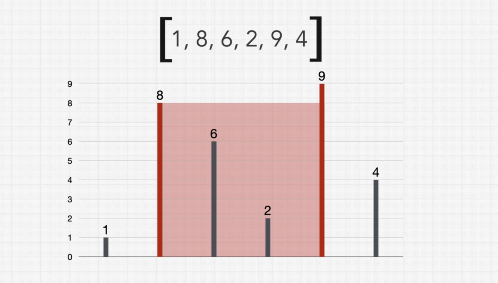

- Verify the constraints:

  - Does the thickness of the lines matter? No.
  - Do the left and right sides of the container form a wall? No.
  - Does a higher line inside the container affect the area, breaking it into 2 parts? No.
    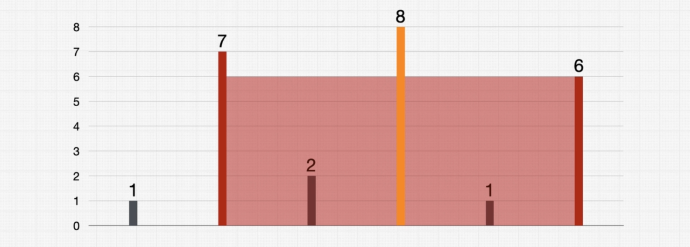

- Explanation:

  - Bruteforce solution: `O(n^2)`

    - Iterate over all possible pairs of lines and find the maximum area

  - Instead, Initialize **two pointers**, one at the beginning and one at the end of the array constituting the length of the lines.
  - At every step, find out the area formed between them
    - width = `right index - left index`
    - height = `min(height[left], height[right])`
  - update the result and move the pointer pointing to the shorter line towards the other end by one step.
    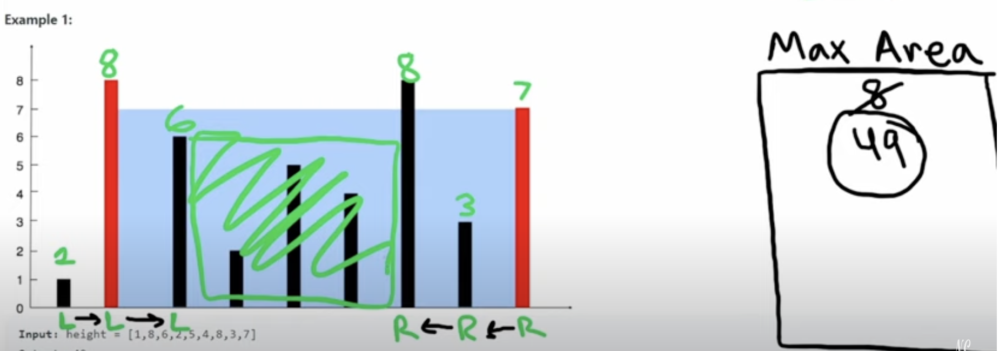
    - we choose which pointer to move by comparing the heights of the two lines and moving the pointer pointing to the shorter line towards the other end by one step
      - so that we may get a relatively longer line next time and possibly will be able to hold more water.
  - Time complexity: `O(n)`

```py
def max_area(height):
    max_area = 0
    # Two pointers at the beginning and the end of the array
    left, right = 0, len(height) - 1

    while left < right:
        # The width is the distance between them, and the height is the lower line.
        area = (right - left) * min(height[left], height[right])
        # Update max_area if we have a new maximum
        max_area = max(max_area, area)
        # Move the left and right pointers, depending on which line is shorter
        if height[left] < height[right]:
            left += 1
        else:
            right -= 1
    return max_area
```

---

### Squares of a Sorted Array

| Video Solution                                                | Hint                                                                                                                                                                                            |
| ------------------------------------------------------------- | ----------------------------------------------------------------------------------------------------------------------------------------------------------------------------------------------- |
| [Video Solution](https://www.youtube.com/watch?v=FPCZsG_AkUg) | Use **two pointers** to find the largest element, compare the absolute values of the two pointers elements and add the largest to the result array (from the end of the array to the beginning) |

Given an integer array `nums` sorted in **non-decreasing** order, return an array of **the squares of each number sorted in non-decreasing order**.

- EX: `[-4,-1,0,3,10] --> [0,1,9,16,100]`

- Explanation:
  - Bruteforce: We can solve it normally in `O(nlogn)` time by squaring each element and then sorting the array
  - But we can do better in `O(n)` time by using **2 pointers**
    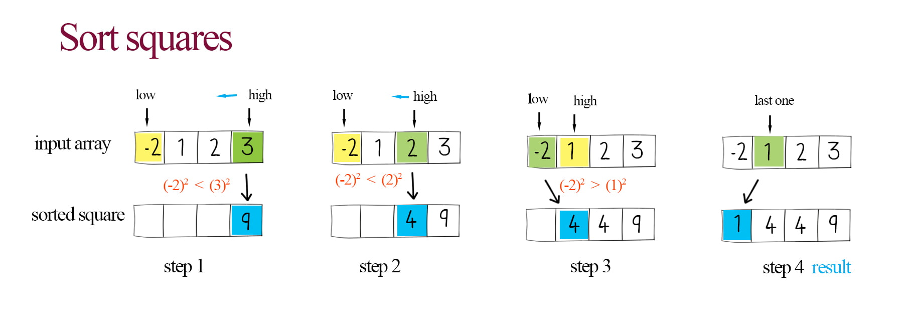
    - This is done by using 2 pointers, one at the start of the array and one at the end of the array
    - **Since the numbers at both the ends can give us the largest square**, an alternate approach could be to use two pointers starting at both the ends of the input array. At any step, whichever pointer gives us the bigger square we add it to the result array and move to the next/previous number according to the pointer.
      - this is because the array is sorted in **non-decreasing** order so we can get the largest element by comparing the `absolute` values of the 2 pointers (both sides)
    - we can then square the largest element and add it to the result array using the index of the responding pointer

```py
# Brute force solution: O(nlogn)
def sortedSquares(nums):
    for i in range(len(nums)):
        nums[i] = nums[i] ** 2
    nums.sort()
    return nums

# ------------------------------------------------------------

# Two pointers solution: O(n) ✅
def sortedSquares(nums):
    l, r = 0, len(nums) - 1
    result = [0] * len(nums)

    # iterate over the array in reverse order
    for i in range(len(nums) - 1, -1, -1):
        left_abs, right_abs = abs(nums[l]), abs(nums[r])
        # check if the left absolute value is greater than the right absolute value and change the result array accordingly
        if left_abs > right_abs:
            result[i] = left_abs ** 2
            l += 1
        else:
            result[i] = right_abs ** 2
            r -= 1

    return result
```

---

### Sort array based on parity

| Video Solution                                                | Hint                                                                                                                                                                                                                    |
| ------------------------------------------------------------- | ----------------------------------------------------------------------------------------------------------------------------------------------------------------------------------------------------------------------- |
| [Video Solution](https://www.youtube.com/watch?v=QC4c9fyr8As) | Use two arrays, one for the `even` numbers and one for the `odd` numbers, then concatenate them, **or** use **two pointers** to swap the `even` numbers with the last `even` number and increment the last `even` index |

Given an array of integers, sort the array such that all even numbers appear before all the odd numbers.

The trick here is not to use any extra space, so we can't create a new array and sort it.

- EX: `nums = [3, 1, 2, 4]` --> `[2, 4, 3, 1]`

- **Solution 1**: Brute force: `O(n) time` and `O(n) space`

  - We can create 2 arrays, one for the `even` numbers and one for the `odd` numbers, then we can concatenate them

  ```py
  def sort_array_by_parity(nums):
      even = []
      odd = []

      for num in nums:
          if num % 2 == 0:
              even.append(num)
          else:
              odd.append(num)

      return even + odd
  ```

- **Solution 2**: `O(n) time` and `O(1) space`

  - We can use the **two pointers** pattern to solve this problem
  - We can use the first pointer to keep track of the last even number in the array, and the second pointer to iterate over the array and check if the current element is even or odd
    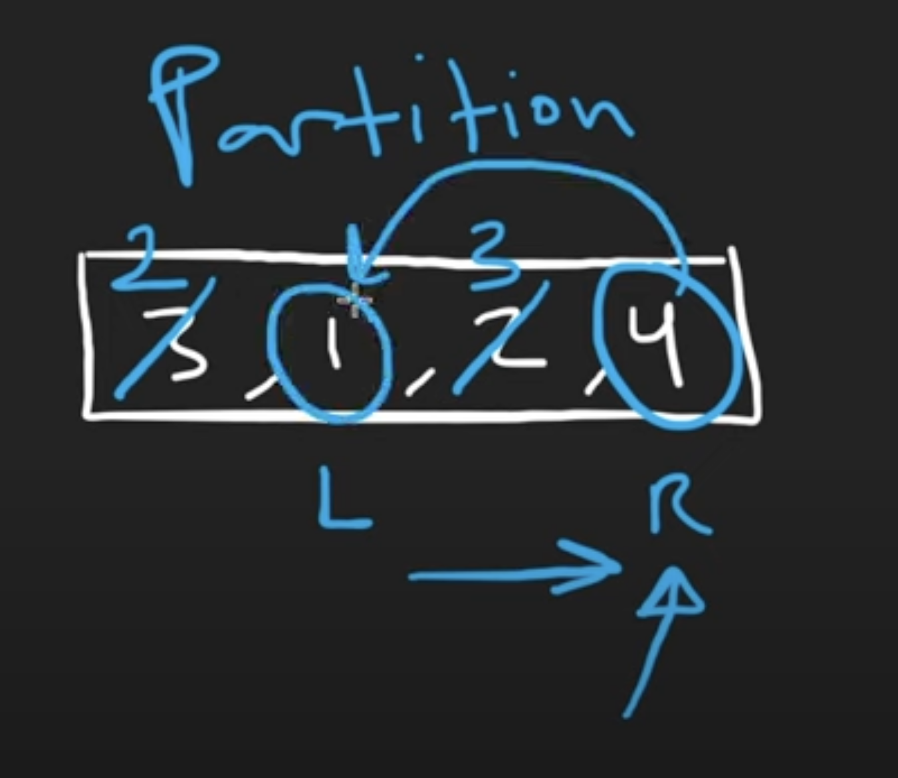
    - if it is even, then we swap it with the last even number and increment the last even index
    - if it is odd, then we skip it

  > It's similar to the portioning step in the `Quick Sort` algorithm

  ```py
  def sort_array_by_parity(nums):
      last_even = 0

      for i in range(len(nums)):
          # if the current element is even, swap it with the last even number and increment the last even index
          if nums[i] % 2 == 0:
              nums[i], nums[last_even] = nums[last_even], nums[i]
              last_even += 1

      return nums
  ```

---

### Rearrange Array Elements by Sign

| Video Solution                                                | Hint                                                                                                                                                                                                                                                                  |
| ------------------------------------------------------------- | --------------------------------------------------------------------------------------------------------------------------------------------------------------------------------------------------------------------------------------------------------------------- |
| [Video Solution](https://www.youtube.com/watch?v=tX5bmjinQJc) | Use two arrays, one for the `positive` numbers and one for the `negative` numbers, then concatenate them, **or** use **two pointers** to indicate the last positive and negative indices and increment them by `2` each time to get the next positive/negative number |

Given an array of integers `nums` of positive and negative numbers, rearrange it so that you have positive and negative numbers alternating in the array.

- Ex:

  - `nums = [3, 1, -2, -5, 2, -4]` -> `[3, -2, 1, -5, 2, -4]`

- Explanation:
  - we will use a **two pointers** pattern to check for all the elements in the array
  - we can use the first pointer to keep track of the last positive element in the array
  - and the second pointer to iterate over the array and check if the current element is positive `(i)`
    - if it is, then we skip it, if not, then we update the last positive element **and then** update the last positive index

```py
# Solution 1: Bruteforce: O(n) time and O(n) space
def rearrange(nums):
    positive = []
    negative = []

    for num in nums:
        if num >= 0:
            positive.append(num)
        else:
            negative.append(num)

    res = []
    i, j = 0, 0
    while i < len(positive) and j < len(negative):
        res.append(positive[i])
        res.append(negative[j])
        i += 1
        j += 1

    # add the remaining elements
    if i < len(positive):
        res += positive[i:]
    if j < len(negative):
        res += negative[j:]

    return res

# ------------------------------------------------------------

# Solution 2: Two pointers: O(n) time and O(n) space ✅
def rearrange(nums):
    if not nums: return nums

    new_nums = [0] * len(nums)
    i, j = 0, 1

    for num in nums:
        if num >= 0:
            new_nums[i] = num
            i += 2 # increment the last positive index by 2
        else:
            new_nums[j] = num
            j += 2 # increment the last negative index by 2

    return new_nums
```

---

### Trapping Rain Water

| Video Solution                                                | Hint                                                                                                                                                                                                                              |
| ------------------------------------------------------------- | --------------------------------------------------------------------------------------------------------------------------------------------------------------------------------------------------------------------------------- |
| [Video Solution](https://www.youtube.com/watch?v=ZI2z5pq0TqA) | Use two arrays, one for the `left max` and one for the `right max`, then loop through the array and calculate the amount of water above each point using the formula `min(left_max[i], right_max[i]) - height[i]` and add them up |

Given `n` non-negative integers representing an elevation map where the width of each bar is `1`, compute how much water it can trap after raining.

- EX: `height = [0,1,0,2,1,0,3,1,0,1,2]` --> `8` units of water
  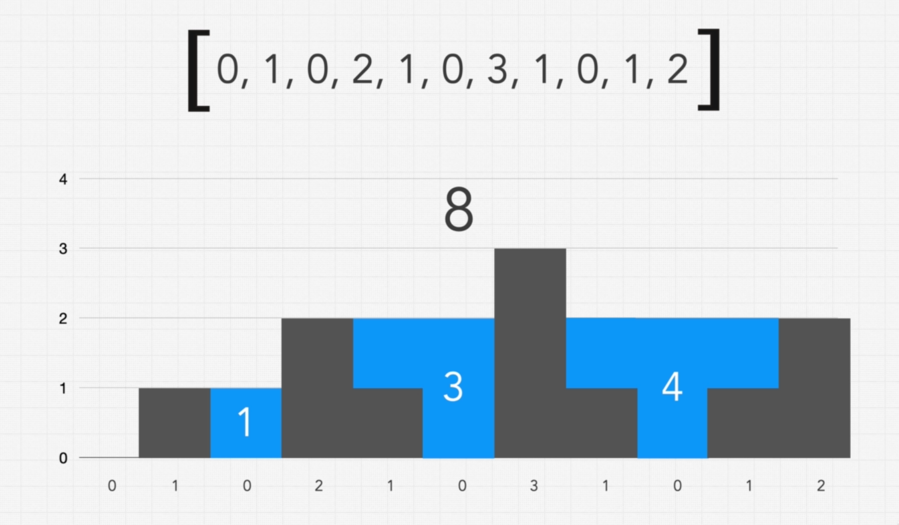

- **Explanation:**

  - By examining the diagram, we can see that the amount of water above each point depends on these factors:
    1. The height of the current wall (the current point)
    2. The height of the tallest wall to the left of the current wall.
    3. The height of the tallest wall to the right of the current wall.
    4. The height of the shorter wall between the left and right tallest walls.
       - We know that the height of water cannot exceed the height of the shorter wall.
  - So, the amount of water above each point is the difference between the height of the shorter (tallest walls) and the height of the current wall.
  - Formula for the area of water above any **point**:

    ```py
    current_water = min(left_max, right_max) - height[i]

    # height[i] is the height of the current wall
    # left_max is the height of the tallest wall to the left of the current wall.
    # right_max is the height of the tallest wall to the right of the current wall.
    ```

  - To get the wanted amount of water, we need to **find the area of water above each point and add them up**.
    - if the water is above the current wall, the area will be positive, otherwise it will be negative. So **we will only add the positive areas to the total**.

- **Solution 1**: Extra memory used (O(n) space)

  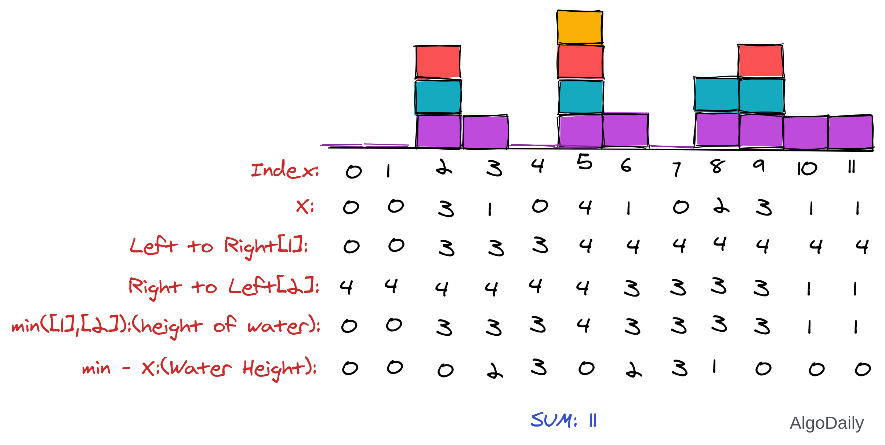
  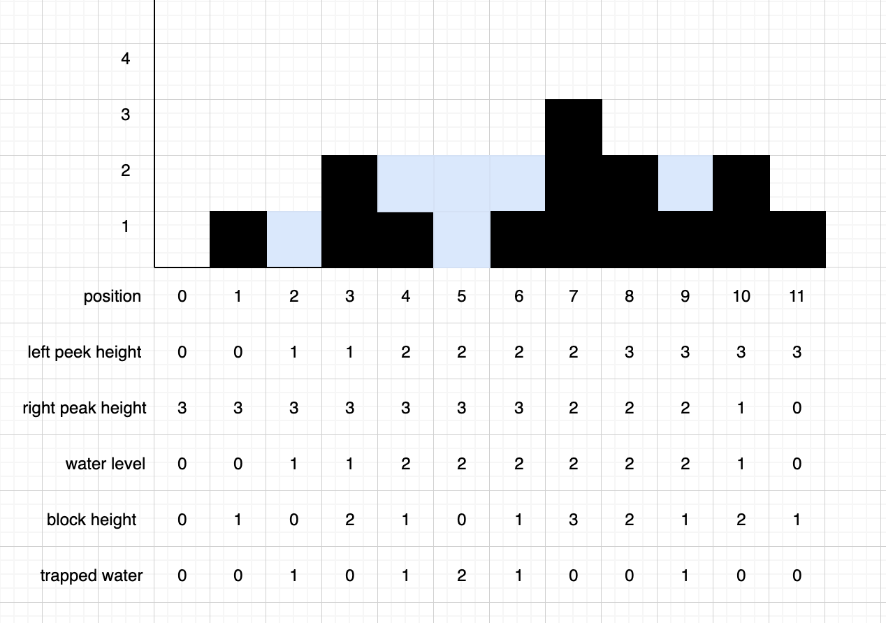

  - **Steps**:

    - Verify the constraints:

      - Do the left and right sides of the container form a wall? No.
      - will there be negative numbers? No.

    - Initialize variables to keep track of the maximum height on both the left and right sides of each bar

      - Loop through the list of heights to find the maximum height on the left side of each bar
      - Loop through the list of heights in reverse order to find the maximum height on the right side of each bar
      - Loop through the list of heights again and calculate the amount of water that can be trapped above each bar using the formula above.
      - Add up the amount of water trapped above each bar to get the total amount of water trapped.

  ```py
  def trap(height):
      # initialize two lists to store the max height of the left and right
      # of each position
      left_max = [0] * len(height)
      right_max = [0] * len(height)
      total_water = 0

      # calculate the max height of the left of each position
      max_height = 0
      for i in range(len(height)):
          left_max[i] = max_height
          max_height = max(max_height, height[i])

      # calculate the max height of the right of each position
      max_height = 0
      # loop through the list in reverse order
      for i in range(len(height)-1, -1, -1):
          right_max[i] = max_height
          max_height = max(max_height, height[i])

      # calculate the water in each position
      for i in range(len(height)):
          water = min(left_max[i], right_max[i]) - height[i]
          # add the water to the total if it's positive (above the current wall)
          if water > 0:
              total_water += water

      return total_water
  ```

- **Solution 2**: Two pointers Less memory used (O(1) space)

  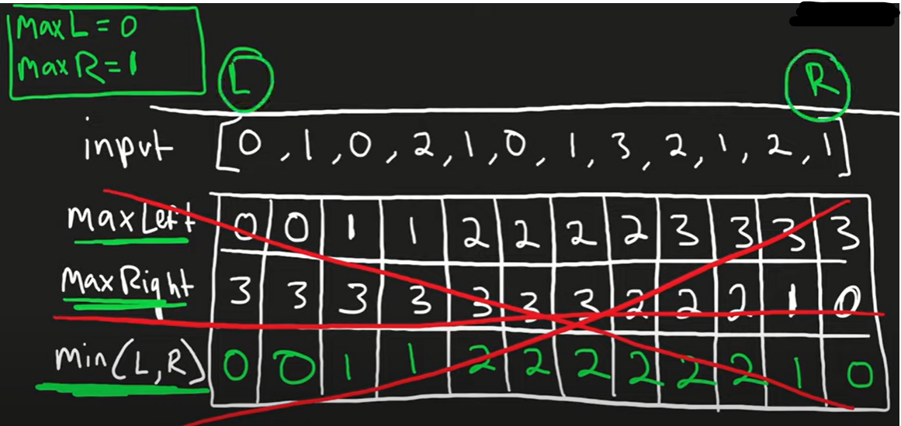

  - In solution 1, we actually used 2 pointers (1 individual pointer with one iteration for each) but we were iterating pointers **outwards**. Here we will use 2 pointers to iterate **inwards**.
    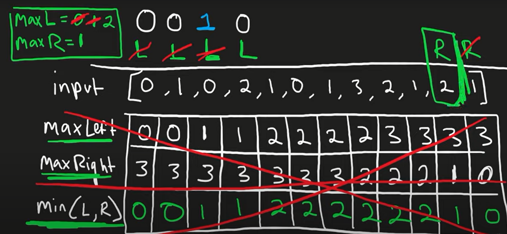
  - We can't use the 2 pointers in order to single handedly figure out what (the walls are for some container and the water inside), but what we can keep track of is the **maximum height of the left and right walls**.
  - So we will have 2 pointers, one at the beginning and one at the end of the array, and we will move the pointer that is pointing to the shorter wall inwards.

    - pointer 1: points to the left wall
    - pointer 2: points to the right wall
    - meaning that we keep track of every point that we have seen and keep track of the maximum value that is's seen and then decide which one to move inwards.
      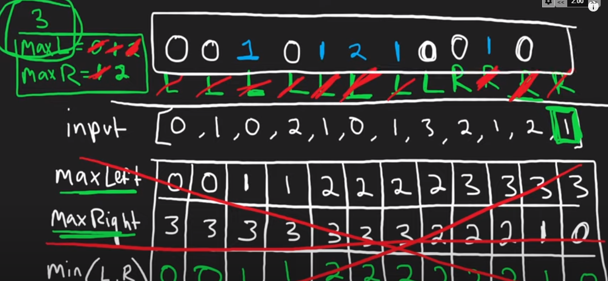

  - We only need the minimum of the two walls to calculate the water above the current wall. so if the `left wall pointer` is shorter, we move the `left pointer` inwards, otherwise we move the `right pointer` inwards. knowing that the minimum of the two walls is the maximum height of the water above the current wall.

  - Here, **we calculate water per vertical-block for each point and not the area**

  ```py
  def trap(height):
      # initialize two lists to store the max height of the left and right of each position
      left_max = 0
      right_max = 0
      total_water = 0

      # initialize two pointers, one at the beginning and one at the end
      l, r = 0, len(height) - 1

      while l < r:
          # check which pointer is shorter so that we can use it to calculate the water above the current wall and move it inwards
          if height[l] < height[r]:
              # 1. get current left wall height
              left_max = max(left_max, height[l]) # Update the left_max if the current wall is taller than the previous one
              # 2. calculate the water above the current wall
              total_water += left_max - height[l]
              # 3. move the left pointer inwards
              l += 1
          else:
              right_max = max(right_max, height[r])
              total_water += right_max - height[r]
              r -= 1

      return total_water
  ```

---

## Sliding Window

- The sliding window pattern is used to perform a required operation on a specific window size of a given array or linked list

  > It's common that the problem will contain this: _"sub-array with size `k`"_

- To move the sliding window at each step, we need to do two things:
  - Remove the element going out of the sliding window (if needed)
  - Add the new element getting included in the sliding window
- To prevent re-calculating the sum of the numbers within the sliding window, we can subtract the element going out of the sliding window and add the new element getting included in the sliding window
  - This prevent us from going through the whole subarray to find the sum and, as a result, the algorithm complexity will reduce to `O(n)` instead of `O(n^2)`

### Maximum Average Subarray I

| Video Solution                                                | Hint                                                                                                                                                     |
| ------------------------------------------------------------- | -------------------------------------------------------------------------------------------------------------------------------------------------------- |
| [Video Solution](https://www.youtube.com/watch?v=56TxHMG0qhQ) | Use sliding window to calculate the sum of the next subarray, and keep track of the maximum average, and update the window when it exceeds the given `k` |

Given an array consisting of `n` integers, find the contiguous subarray of given length `k` that has the maximum average value. And you need to output the maximum average value.

- EX: `nums = [1,12,-5,-6,50,3], k = 4` --> `12.75`

  - Explanation:
    - Maximum average is `(12-5-6+50)/4 = 51/4 = 12.75`

- Explanation

  - We can use the sliding window pattern to calculate the sum of the next subarray
    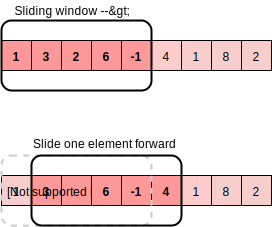
  - The efficient way to solve this problem would be to visualize each contiguous subarray as a sliding window of `k` elements. This means that when we move on to the next subarray, we will slide the window by one element.
    - To reuse the sum from the previous subarray, we will subtract the element going out of the window and add the element now being included in the sliding window.
    - This will save us from going through the whole subarray to find the sum and, as a result, the algorithm complexity will reduce to `O(N)`.

```py
def find_max_average(nums, k):
    maxSum = float('-inf')
    windowSum = 0.0
    l = 0

    for r in range(len(nums)):
        windowSum += nums[r]

        # when the window size starts to exceed k, we shrink the window
        if r >= k - 1:
            maxSum = max(maxSum, windowSum)
            windowSum -= nums[l]
            l += 1

    return maxSum / k
```

---

### Minimum Size Subarray Sum

| Video Solution                                                | Hint                                                                                                                                                                                                                                      |
| ------------------------------------------------------------- | ----------------------------------------------------------------------------------------------------------------------------------------------------------------------------------------------------------------------------------------- |
| [Video Solution](https://www.youtube.com/watch?v=aYqYMIqZx5s) | Use sliding window to calculate the sum of the next subarray, and keep track of the minimum length, and update the window when its sum is greater than or equal to `target` by shrinking the window from the left to get the minimum size |

Given an array of positive integers `nums` and a positive integer `target`, return the minimal length of a **contiguous subarray** `[nums[l], nums[l+1], ..., nums[r-1], nums[r]]` of which the sum is greater than or equal to `target`. If there is no such subarray, return `0` instead.

- Ex:

  - `nums = [2,3,1,2,4,3], target = 7` -> `2` (`[4,3]` is the smallest subarray with sum >= 7)

- Explanation

  - Bruteforce solution is to iterate over all possible subarrays and find the minimum length
    - Nested loops for all possible subarrays: `O(n^2)`
  - We can use the sliding window pattern to calculate the sum of the next subarray, but we need to keep track of the minimum length, and update the window when its sum is greater than or equal to `target` by shrinking the window from the left to get the minimum size
    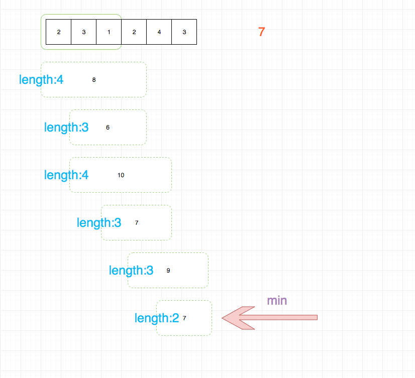

  - Time complexity: `O(n + n) = O(n)` because the outer `for` loop runs for all elements and the inner `while` loop processes each element **only once**, therefore the time complexity of the algorithm will be `O(n+n)` which is asymptotically equivalent to `O(n)`.
    - It's not `O(n^2)` because the inner `while` loop will process each element **only once**.

```py
# Time: O(n) -> O(n + n) = O(n)
def min_sub_array_len(target, nums):
    minLength = float('inf')
    start = 0
    windowSum = 0

    for end in range(len(nums)):
        windowSum += nums[end]

        while windowSum >= target:
            minLength = min(minLength, end - start + 1)
            windowSum -= nums[start]
            start += 1

    return minLength if minLength != float('inf') else 0
```

---

### Number of Sub-arrays of Size K and Average Greater than or Equal to Threshold

| Video Solution                                                | Hint                                                                                                                               |
| ------------------------------------------------------------- | ---------------------------------------------------------------------------------------------------------------------------------- |
| [Video Solution](https://www.youtube.com/watch?v=D8B4tKxMTnY) | Use sliding window to calculate the sum of the next subarray, and keep track of the number of subarrays that satisfy the condition |

Given an array of integers `arr` and two integers `k` and `threshold`. Return the number of sub-arrays of size `k` and average greater than or equal to `threshold`.

- Ex:

  - `arr = [2,2,2,2,5,5,5,8], k = 3, threshold = 4` -> `3`
    - Explanation:
      - Sub-arrays `[2,5,5]`,`[5,5,5]` and `[5,5,8]` have averages `4`, `5` and `6` respectively. All other sub-arrays of size `3` have averages less than `4` (the threshold).

- Explanation

  - Same as previous sliding-window problems where we need to calculate the sum of the next subarray, but we need to keep track of the number of subarrays that satisfy the condition, and update the window when its average is greater than or equal to `threshold` by shrinking the window from the left to get the minimum size
    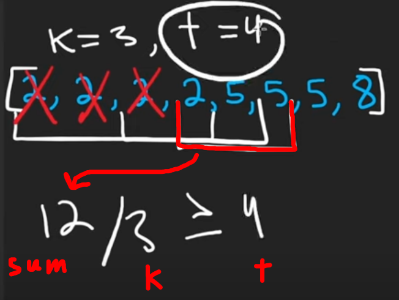

```py
def num_of_subarrays(arr, k, threshold):
    result = 0
    windowSum = 0
    windowStart = 0

    for windowEnd in range(len(arr)):
        windowSum += arr[windowEnd]

        if windowEnd >= k - 1: # (k-1) because we start from 0
            if windowSum / k >= threshold:
                result += 1
            windowSum -= arr[windowStart]
            windowStart += 1

    return result
```

---

### Fruit Into Baskets

Given an array of integers where each integer represents a fruit tree, you are given two baskets, and your goal is to put maximum number of fruits in each basket. The only restriction is that each basket can have only one type of fruit.

It's similar to the [Longest Substring with K Distinct Characters](./6-PS-Strings.md#longest-substring-with-k-distinct-characters) problem.

```py
def fruits_into_baskets(fruits):
    windowStart = 0
    maxLength = 0
    fruitFrequency = {}

    for windowEnd in range(len(fruits)):
        rightFruit = fruits[windowEnd]
        fruitFrequency[rightFruit] = fruitFrequency.get(rightFruit, 0) + 1

        # Shrink the sliding window, until we are left with '2' fruits in the fruit frequency dictionary
        while len(fruitFrequency) > 2:
            leftFruit = fruits[windowStart]
            fruitFrequency[leftFruit] -= 1
            if fruitFrequency[leftFruit] == 0:
                del fruitFrequency[leftFruit]
            windowStart += 1

        maxLength = max(maxLength, windowEnd - windowStart + 1)

    return maxLength
```

Note: the space complexity of the above algorithm will be `O(1)` not `O(n)`, because we can have a maximum of three types of fruits stored in the `fruitFrequency` dictionary.

---

### Longest Subarray of 1's After Deleting One Element

Same as the [Longest Repeating Character Replacement](./6-PS-Strings.md#longest-repeating-character-replacement) problem.

---

### Max Consecutive Ones III

Given a binary array `nums` and an integer `k`, return the maximum number of consecutive `1`'s in the array if you can flip at most `k` `0`'s.

- Solution 1: Sliding window like the [Longest Repeating Character Replacement](./6-PS-Strings.md#longest-repeating-character-replacement) problem.

- Solution 2: (Faster)

  ```py
  def longest_ones(nums, k):
      l = 0

      for r in range(len(nums)):
          if nums[r] == 0:
              k -= 1
          if k < 0: # If we have more than k zeros, move the left pointer to the right
              if nums[l] == 0:
                  k += 1
              l += 1

      return r - l + 1
  ```

---

### Sliding Window Maximum

You are given an array of integers `nums`, there is a sliding window of size `k` which is moving from the very left of the array to the very right. You can only see the `k` numbers in the window. Each time the sliding window moves right by one position.

Return the max sliding window.

- EX: `nums = [1, 3, -1, -3, 5, 3, 6, 7], k = 3` --> `[3, 3, 5, 5, 6, 7]`

  - Explanation:
    | Window Position | Max |
    | --------------- | --- |
    | [1 3 -1] -3 5 3 6 7 | 3 |
    | 1 [3 -1 -3] 5 3 6 7 | 3 |
    | 1 3 [-1 -3 5] 3 6 7 | 5 |
    | 1 3 -1 [-3 5 3] 6 7 | 5 |
    | 1 3 -1 -3 [5 3 6] 7 | 6 |
    | 1 3 -1 -3 5 [3 6 7] | 7 |

- **Explanation:** (recap: it's like (next greater element) using a stack, but we use dqueue to remove from left as well)

  - The brute force solution is to iterate on all windows of size `k` and find the maximum element in each window. This solution takes `O(n.k)` since we have `O(n-k+1)` windows and for each window we take `O(k)` time to find the maximum element in it.
    - to get a better solution, we will use the `next greater element` approach, using a **Monotonic decreasing queue (double-ended queue (`deque`))** to store the indices of the elements in the window.
    - > `deque` allows for fast appends and pops **from both ends**.
  - The first element in the `queue` is the index of the maximum element in the window.
  - When we move the window to the right, we need to remove the element that is out of the window, and remove all elements that are smaller than the current element. Then we add the current element to the queue.
    - This is done because we know that when going to the next window, the first element in the queue is out of the window, so we remove it. Then we remove all elements that are smaller than the current element, because **they will never be the maximum element in the window**. Then we add the current element to the queue.
  - we use queue and not a stack, because we want to remove elements from the left side of the queue, and we want to remove the first element in the queue, which is the maximum element in the window.

So, to recap: we use a `queue` to store the indices of the elements in the current window in a **decreasing order**. At each step, we add the current element to the queue, and then we pop from the `queue` (from the right) all the elements that are smaller than the current element. We then remove (from the left) the first element in the queue if it is outside of the current window. Finally, we add the first element of the queue to the output. **(The first element of the queue will always be the maximum element of the window because we are using a decreasing order)**

- **Steps:**
  1. Initialize a deque `q` to store the indices of the elements in the current sliding window, and initialize `l` and `r` pointers to `0`
  2. iterate over the array `nums` and do the following:
     - pop smaller values from `q` until we find a value that is greater than the current value
     - append the current index ('r') to `q`
     - remove the left val from the window
       - If the index of the oldest element in the sliding window (`l`) is outside of the current sliding window, remove it from the deque `q` using the `popleft()` method
     - check if the window is at least size `k` to add the maximum element (`nums[q[0]]`) to the result

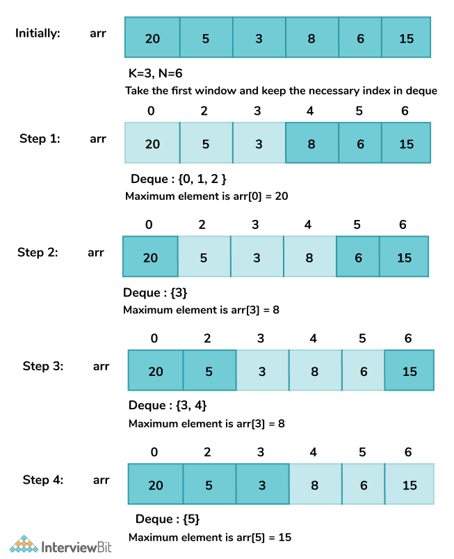

```py
def max_sliding_window(nums, k):
    if not nums: return []
    result = []
    q = collections.deque() # indices of the elements in the window
    l = r = 0

    while r < len(nums):
      # pop smaller values from q if the current value is greater than the last value in q to always make the queue contain the max element
      while q and nums[q[-1]] < nums[r]:
          q.pop()
      q.append(r)

      # remove left val from window if it is outside of the current window
      if l > q[0]:
        q.popleft()

      # check if the window is at least size k to start adding the maximum element to the result
      if (r+1) >= k:
        result.append(nums[q[0]])
        l += 1 # left pointer will only move when the window is at least size k
      r += 1

    return res
```

---

### Chunk Array

| Video Solution | Hint                                                                                                |
| -------------- | --------------------------------------------------------------------------------------------------- |
| NA             | Iterate over the array with step size equal to the chunk size and append the subarray to the result |

Given an array and chunk size, divide the array into many subarrays where each subarray is of length size.

- EX: `chunk([1, 2, 3, 4], 2) --> [[1, 2], [3, 4]]`

```py
# Time: O(n) ✅
def chunk(arr, size):
    chunked = []
    for i in range(0, len(arr), size):
        chunked.append(arr[i:i+size])
    return chunked

# --------------------------OR-----------------------------------

def chunk(arr, size):
    result = []
    subarray = []
    for i in arr:
        subarray.append(i)
        # if the subarray is full, append it to the result and reset the subarray
        if len(subarray) == size:
            result.append(subarray)
            subarray = []
    if subarray:
        result.append(subarray)
    return result
```

---

### Shortest Unsorted Continuous Subarray

| Video Solution                                                | Hint                                                                                                                                                                                                                                                                                                                                |
| ------------------------------------------------------------- | ----------------------------------------------------------------------------------------------------------------------------------------------------------------------------------------------------------------------------------------------------------------------------------------------------------------------------------- |
| [Video Solution](https://www.youtube.com/watch?v=p-O7FExDH1M) | Use **two pointers** to find the start and end of the unsorted subarray, and then find the minimum and maximum of the subarray, then extend the subarray to include any number which is bigger than the minimum or smaller than the maximum of the subarray. This way we can include all the numbers that are out of sorting order. |

Given an integer array `nums`, you need to find one **continuous subarray** that if you only sort this subarray in ascending order, then the whole array will be sorted in ascending order.

Return the **shortest** such subarray and output its length.

- EX: `nums = [2,6,4,8,10,9,15]` --> `5`

  - because the subarray `[6,4,8,10,9]` needs to be sorted in ascending order to make the whole array sorted in ascending order.

- **Solution 1**: using sorting (`O(nlogn)` time and `O(n)` space)

  - We can sort a copy of the array and compare it with the original array to find the first and the last elements that are out of sorting order.
  - The subarray between these two elements is the required unsorted subarray.
  - Time complexity: `O(nlogn)`

  ```py
  def find_unsorted_subarray(nums):
      sorted_nums = sorted(nums)
      # find the first element out of sorting order from the beginning
      start = 0
      while start < len(nums) and nums[start] == sorted_nums[start]:
          start += 1
      # find the first element out of sorting order from the end
      end = len(nums) - 1
      while end > 0 and nums[end] == sorted_nums[end]:
          end -= 1

      return end - start + 1 if end > start else 0
  ```

- **Solution 2:** using **two sliding windows** (`O(n)` time and `O(1)` space) ✅
  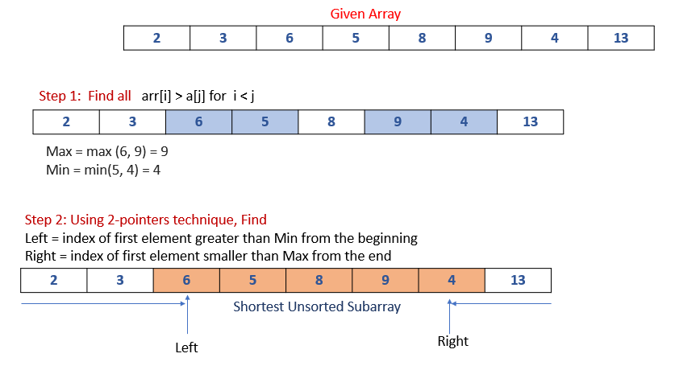

  - We know, once an array is sorted, the smallest element is at the beginning and the largest element is at the end of the array.
    - So if we start from the beginning of the array to find the first element which is out of sorting order i.e., (which is **smaller than its previous element**), and similarly from the end of array to find the first element (which is **bigger than its previous element**)
    - will sorting the subarray between these two numbers result in the whole array being sorted?
      - No, because there could be some intermediate numbers that are bigger than the number in the beginning of the array and smaller than the number at the end of the array.
      - We will need to include all such intermediate numbers while trying to find the smallest subarray to be sorted.
      - we do so by getting the `min` and `max` of the subarray
        - then we extend the subarray to include any number which is bigger than the minimum of the subarray
        - and extend the subarray to include any number which is smaller than the maximum of the subarray
        - this way we can include all the numbers that are out of sorting order
  - Time complexity: `O(n)`

  ```py
  def find_unsorted_subarray(nums):
      # find the start of the subarray
      l = 0
      while l < len(nums) - 1 and nums[l] <= nums[l+1]:
          l += 1
      # find the end of the subarray
      r = len(nums) - 1
      while r > 0 and nums[r] >= nums[r-1]:
          r -= 1

      # if the array is sorted
      if l == len(nums) - 1:
          return 0

      # find the maximum and minimum of the subarray
      subarray_max = max(nums[l:r+1])
      subarray_min = min(nums[l:r+1])

      # extend the subarray to include any number which is bigger than the minimum or smaller than the maximum of the subarray
      while l > 0 and nums[l-1] > subarray_min: l -= 1
      while r < len(nums) - 1 and nums[r+1] < subarray_max: r += 1

      return r - l + 1 if r > l else 0
  ```

---

## Prefix / Prefix Sum

It's an array where each `index` is the **sum** of all elements from `0` up to and including that `index` in the original array.

- This is used to prevent `O(n)` time complexity when calculating the sum of a subarray for each element in the array -> `O(n^2)`
- **Note:** when calculating the prefix array, we add an extra element to the prefix array to make it easier to calculate the sum of the first element
  
  - `prefix = [0] * (len(nums) + 1)`
- To calculate the prefix sum for a given range `[i, j]`, we can use the following formula: `prefix[j] - prefix[i-1]`
- It must start from the **beginning** of the array, and it must be continuous.

### Range Sum Query - Immutable

| Video Solution                                                | Hint                                                                                                                                                                                                                                                                                                            |
| ------------------------------------------------------------- | --------------------------------------------------------------------------------------------------------------------------------------------------------------------------------------------------------------------------------------------------------------------------------------------------------------- |
| [Video Solution](https://www.youtube.com/watch?v=2pndAmo_sMA) | Use **prefix sum** to store the sum of the first `i` elements of the array (use an extra element to make it easier to calculate), then we can get the sum of any `subarray` by subtracting the `prefix` of the element before the `start` of the subarray from the `prefix` of the last element of the subarray |

Given an integer array `nums`, find the sum of the elements between indices `left` and `right` inclusive, where `(left <= right)`

- EX:

  - Input: `['NumArray', 'sumRange', 'sumRange', 'sumRange'], [[[1, 2, 3, 4, 5]], [0, 2], [2, 4], [0, 4]]`
  - Output: `[null, 6, 12, 15]`

- Explanation:
  - The bruteforce solution is to calculate the sum of the subarray at each step, which takes `O(n)` time for each query -> `O(n^2)` time for all queries
  - This is a **prefix sum** problem, we can use a `prefix` array to store the sum of the first `i` elements of the array, and then we can get the sum of any `subarray` by subtracting the `prefix` of the element before the `start` of the subarray (`left`) from the `prefix` of the last element of the subarray (`right`).
  - We do this because we want to remove the sum of the elements before the `start` of the subarray from the sum of the elements before the `end` of the subarray, so we can get the sum of the subarray.
    - We do it by subtracting the `prefix` of the element before the `start` of the subarray from the `prefix` of the last element of the subarray.
      - `prefix[right+1] - prefix[left]`
    - because the `prefix` of the element before the `start` of the subarray contains the sum of the elements before the `start` of the subarray, and the `prefix` of the last element of the subarray contains the sum of the elements before the `end` of the subarray.
      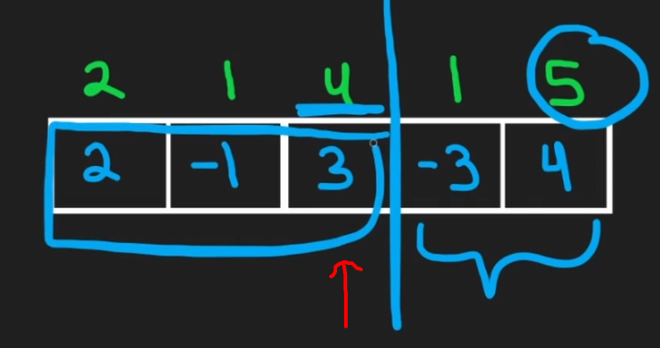

```py
# Best approach ✅
class NumArray:
    def __init__(self, nums):
        # we add an extra element to the prefix array to make it easier to calculate the sum of the first element
        self.prefix = [0] * (len(nums))
        for i in range(len(nums)):
            self.prefix[i+1] = self.prefix[i] + nums[i]

    def sumRange(self, left, right):
        return self.prefix[right+1] - self.prefix[left]

# Another approach
class NumArray:
    def __init__(self, nums):
        self.prefix = []
        curr_sum = 0
        for num in nums:
            curr_sum += num
            self.prefix.append(curr_sum)

    def sumRange(self, left, right):
        rightSum = self.prefix[right]
        leftSum = self.prefix[left-1] if left > 0 else 0
        return rightSum - leftSum
```

---

### Range Sum Query 2D - Immutable

| Video Solution                                                | Hint                                                                                                                                                                                                                                                           |
| ------------------------------------------------------------- | -------------------------------------------------------------------------------------------------------------------------------------------------------------------------------------------------------------------------------------------------------------- |
| [Video Solution](https://www.youtube.com/watch?v=KE8MQuwE2yA) | Use **prefix sum** to store the sum of the each point **to the left and above**, then we can get the sum of any `subarray` by subtracting the `prefix` of the element before the `start` of the subarray from the `prefix` of the last element of the subarray |

Given a 2D matrix `matrix`, handle multiple queries of the following type:

- Calculate the sum of the elements of `matrix` inside the rectangle defined by its **upper left corner** `(row1, col1)` and **lower right corner** `(row2, col2)`.
- Implement the NumMatrix class:

  - `NumMatrix(int[][] matrix)` Initializes the object with the integer matrix `matrix`.
  - `int sumRegion(int row1, int col1, int row2, int col2)` Returns the sum of the elements of `matrix` inside the rectangle defined by its **upper left corner** `(row1, col1)` and **lower right corner** `(row2, col2)`.


- **Solution 1**: Prefixing each row

  - Same as previous problem, but we need to prefix each row
  - Time complexity: `O(mn)` for the constructor and `O(1)` for each query
  - Space complexity: `O(mn)`

  ```py
  class NumMatrix:
      def __init__(self, matrix):
          self.prefix = [[0] * (len(matrix[0])+1) for _ in range(len(matrix))]
          for r in range(len(matrix)):
              for c in range(len(matrix[0])):
                  self.prefix[r][c+1] = matrix[r][c] + self.prefix[r][c]

      def sumRegion(self, row1, col1, row2, col2):
          sum = 0
          for r in range(row1, row2+1):
              print(self.prefix[r])
              sum += self.prefix[r][col2+1] - self.prefix[r][col1]
          return sum
  ```

- **Solution 2**: Prefixing each point to the left and above ✅

  - This will assume each point is the **bottom right corner** of the subarray, and we need to get the sum of the subarray from the **top left corner** to the current point
    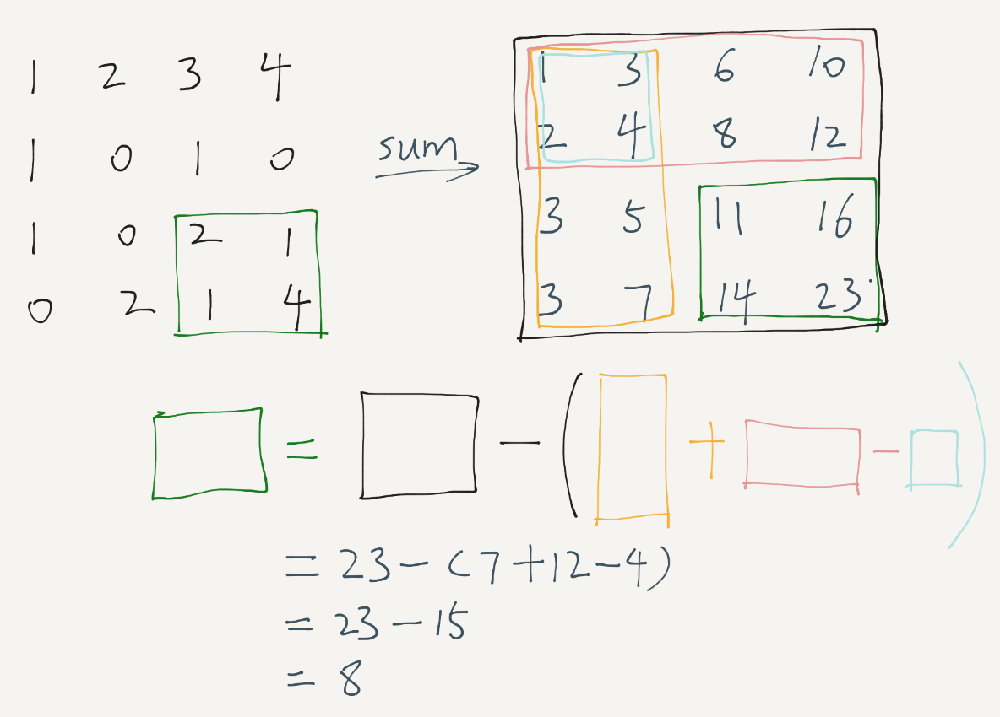
    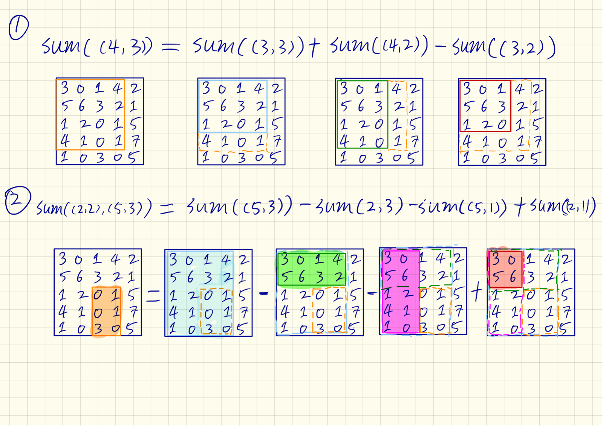
  - Calculating prefix sum for each point:
    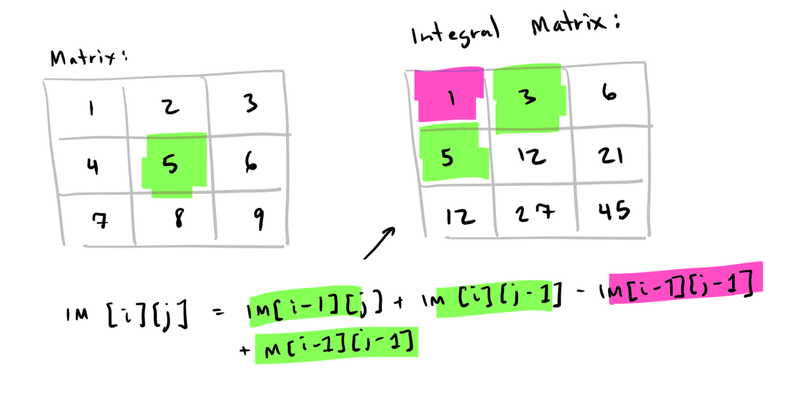
    - `sum = previousRowSum + previousColSum - previousRowColSum + currentMatrixPoint`
  - Calculating the sum of the subarray from the **top left corner** to the current point:
    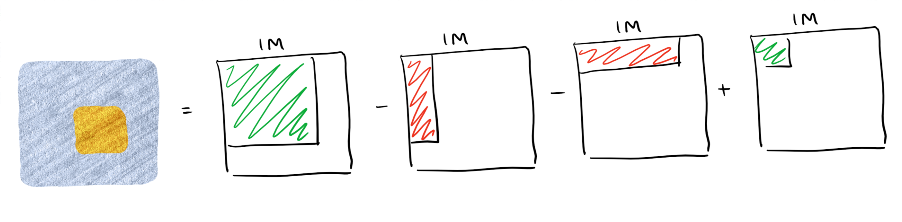
    - `sum = previousRowColSum - previousRowSum - previousColSum + currentMatrixPoint`
  - Also, in order to prevent checking for the existence first row and column, we can add an extra row and column to the matrix (filled with `0s`) to make it easier to calculate the sum of the first element
    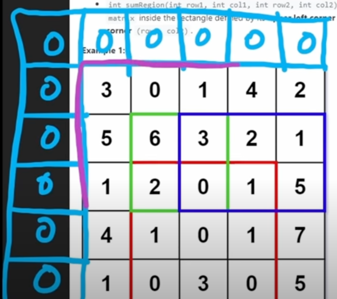
  - Time complexity:
    - generating the prefix matrix: `O(mn)`
    - each query: `O(1)`
    - Space complexity: `O(mn)`

  ```py
  class NumMatrix:
      def __init__(self, matrix):
          if not matrix or not matrix[0]: return
          self.prefix = [[0] * (len(matrix[0]) + 1) for _ in range(len(matrix) + 1)]
          for r in range(len(matrix)):
            prefix = 0
            for c in range(len(matrix[0])):
              prefix += matrix[r][c]
              above = self.prefix[r][c+1]
              self.prefix[r+1][c+1] = prefix + above


      def sumRegion(self, row1, col1, row2, col2):
          r1, c1, r2, c2 = row1+1, col1+1, row2+1, col2+1 # to include the extra row and column and make calculations easier
          bottomRight = self.prefix[r2][c2]
          topLeft = self.prefix[r1-1][c1-1]
          topRight = self.prefix[r1-1][c2]
          bottomLeft = self.prefix[r2][c1-1]

          return bottomRight - topRight - bottomLeft + topLeft
  ```

---

### Product of Array Except Self

| Video Solution                                                | Hint                                                                                                                                                                                                                                                                                                                          |
| ------------------------------------------------------------- | ----------------------------------------------------------------------------------------------------------------------------------------------------------------------------------------------------------------------------------------------------------------------------------------------------------------------------- |
| [Video Solution](https://www.youtube.com/watch?v=bNvIQI2wAjk) | Use **prefix multiplication** to store the product of the elements to the left and right of the current element, then we can get the product of all the elements except the current element by multiplying the prefix of the element before the `start` of the subarray from the `prefix` of the last element of the subarray |

Given an integer array `nums`, return an array `answer` such that `answer[i]` is equal to the product of all the elements of `nums` except `nums[i]`.

You must write an algorithm that runs in `O(n)` time and **without using the division operation**.

- EX: `nums = [1, 2, 3, 4]` --> `answer = [24, 12, 8, 6]`

  - `answer[0] = 2 * 3 * 4 = 24`
  - `answer[1] = 1 * 3 * 4 = 12`
  - `answer[2] = 1 * 2 * 4 = 8`
  - `answer[3] = 1 * 2 * 3 = 6`

- Explanation:

  - Brute force solution:

    - Loop through the array and multiply all the elements except the current element
    - Time complexity: `O(n^2)`
    - Space complexity: `O(n)`

  - Solution using division:

    - Loop through the array and calculate the product of all the elements
    - Loop through the array and divide the product by the current element to get the product of all the elements except the current element
    - Time complexity: `O(n)`
    - Space complexity: `O(n)`

  - Optimal solution: using **prefix multiplication** ✅

    - We can use two arrays to store the products of the elements to the left and right of the current element -> `prefix` and `postfix`
      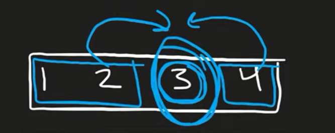

    - Then we can multiply the elements of the two arrays to get the final result
      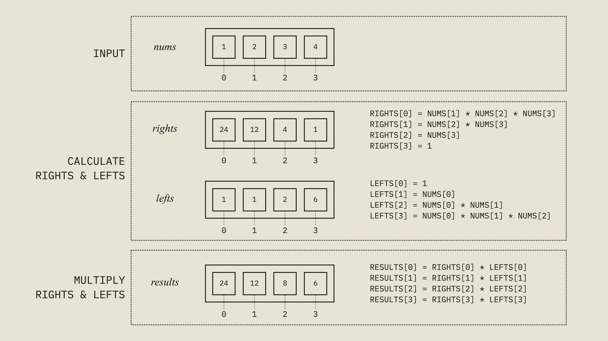
    - Time complexity: `O(n)`
    - Space complexity: `O(n)`

```py
def product_except_self(nums):
    # Create two arrays to store the products of the elements to the left and right of the current element
    prefix = [1] * len(nums) # Initialize the array with 1 because the product of the first element is (1 * first element = first element)
    postfix = [1] * len(nums)
    result = []

    for i in range(1, len(nums)):
        prefix[i] = prefix[i-1] * nums[i-1]
    for i in range(len(nums)-2, -1, -1):
        postfix[i] = postfix[i+1] * nums[i+1]

    # Multiply the elements of the two arrays to get the final result
    for i in range(len(nums)):
        result.append(prefix[i] * postfix[i])

    return result

# ----------------------------------------------------------------

# Time complexity: O(n) | Space complexity: O(1) as the output array does not count as extra space ✅
def product_except_self(nums):
    result = [1] * len(nums) # Initialize the array with 1 because the product of the first element is (1 * first element = first element)

    prefix = 1
    # Loop through the array and multiply all the elements to the left of the current element
    for i in range(len(nums)):
        result[i] = prefix
        prefix *= nums[i]

    postfix = 1
    # Loop through the array and multiply all the elements to the right of the current element
    for i in range(len(nums)-1, -1, -1):
        result[i] *= postfix # Multiply instead of assigning
        postfix *= nums[i]

    return result
```

---

### Continuous SubArray Sum

Given an integer array `nums` and an integer `k`, return `true` if `nums` has a continuous subarray of size at least two whose elements sum up to a multiple of `k`, or `false` otherwise.

An integer `x` is a multiple of `k` if there exists an integer `n` such that `x = n * k`. `0` is **always** a multiple of `k`.

- EX: `nums = [23, 2, 4, 6, 7], k = 6` --> `true` because `[2, 4]` is a continuous subarray of size 2 and sums up to 6 which is a multiple of 6.

- Explanation
  - the brute force solution is to loop through the array and check every possible subarray, but that would be `O(n^2)` time complexity
  - But we can solve it in `O(n)` time complexity using a **prefix sum** and a dictionary to store the `remainder` and its ending `index`:
    - Here, we want to use `prefix sum` because we want to know the sum of the elements between two indices **(range sum)**
      - range sum = `prefix_sum[j] - prefix_sum[i-1]`
    - The `remainder` will be the indicator of whether the sum of the elements between two indices is a multiple of `k`
      - If the `remainder` is in the dictionary, that means we have seen it before, and the difference between the current index and the index of the `remainder` is the size of the subarray **because the sum of the elements between the two indices is a multiple of `k`**
      - and if the difference is greater than 1, that means there is at least one element between the two indices, and the sum of the elements between the two indices is a multiple of `k`
    - If the `remainder` is in the dictionary, check if the difference between the current index and the index of the `remainder` is greater than `1`
      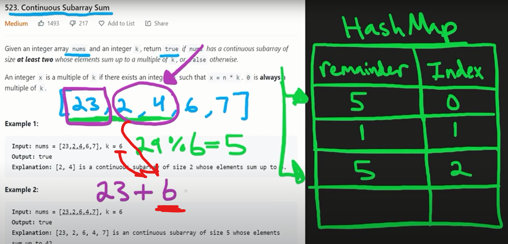
      - if so, return `True`
    - If the `remainder` is not in the dictionary, that means we have not seen it before, so we add it to the dictionary
    - **Note:** We initialize the dictionary with `0: -1` because the sum of the first element is 0 and the size of the subarray must be at least `2` and if the first element is a multiple of `k`, we will get index as `0` and `0 - (-1) = 1` which is not greater than `1`, so we need to initialize the dictionary with `0: -1` to avoid this case
      - So this will ensure that we won't return `true` if the first element is a multiple of `k`

```py
def check_subarray_sum(nums, k):
    # Create a dictionary to store the remainder and its index
    remaindersDict = {0: -1} # Initialize the dictionary with 0: -1 because the sum of the first element is 0 and the size of the subarray must be at least 2
    total = 0

    for i in range(len(nums)):
        total += nums[i]
        # If k is not 0, get the remainder of the sum by dividing by k
        if k != 0:
            remainder = total % k
        # If the remainder is in the dictionary, check if the difference between the current index and the index of the remainder is greater than 1 -> len(subarray) >= 2
        if remainder not in remaindersDict:
            # If the remainder is not in the dictionary, add it to the dictionary
            remaindersDict[remainder] = i
        elif i - remaindersDict[remainder] > 1:
            return True

    return False
```

---

### Subarray Sum Equals K

Given an array of integers `nums` and an integer `k`, return the total number of continuous subarrays whose sum equals to `k`.

- EX: `nums = [1, 1, 1], k = 2` --> `2` because `[1, 1]` and `[1, 1]` are the only two subarrays whose sum equals to `k`

- Explanation
  - we use `prefix sum` technique to solve this problem in `O(n)` time complexity
  - we create a dictionary to store the `prefix sum` and its `count`
    - we initialize the dictionary with `0: 1` because the sum of the first element is 0 and the size of the subarray must be at least `1`
  - We use formula `sum - k` to get the value we want to remove from the subarray's sum to get a sum of `k`
    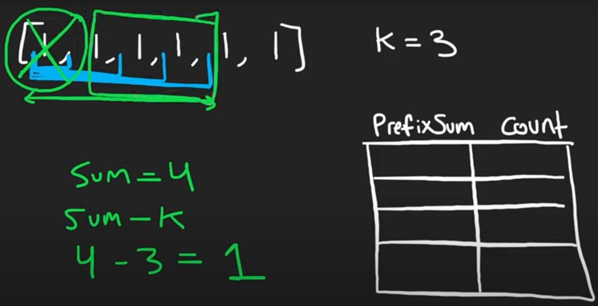
    - If the difference between the sum and `k` is in the dictionary, add the frequency of the difference to the count, because that means we have seen the difference before, and the difference between the current index and the index of the difference is the size of the subarray **because the sum of the elements between the two indices is `k`**
      - and if the difference is greater than `1`, that means there is at least one element between the two indices, and the sum of the elements between the two indices is `k`
    - If the sum is not in the dictionary, add it to the dictionary

```py
def subarray_sum(nums, k):
    count = 0
    sum = 0
    # Create a dictionary to store the prefix sum and its count
    dic = {0: 1} # Initialize the dictionary with 0: 1 because the sum of the first element is 0 and the size of the subarray must be at least 1

    for i in range(len(nums)):
        sum += nums[i]
        # If the difference between the sum and k is in the dictionary, add the frequency of the difference to the count
        if sum - k in dic:
            count += dic[sum - k]
        # If the sum is not in the dictionary, add it to the dictionary
        dic[sum] = dic.get(sum, 0) + 1

    return count
```

---

### Find Pivot Index

Given an array of integers `nums`, calculate the **pivot index** of this array.

```py
def pivot_index(nums):
    total = sum(nums)
    left_sum = 0

    for i in range(len(nums)):
        right_sum = total - left_sum - nums[i]
        if left_sum == right_sum:
            return i
        # Add the current element to the left sum
        left_sum += nums[i]

    return -1
```

---

## Kadane's Algorithm

Kadane's algorithm is used to find the **maximum sum** of a contiguous subarray within an array of numbers in `O(n)` time.


- It's based on the idea that a positive contiguous segment (`max_ending_here`) is added to the previous contiguous segment (`max_so_far`) only if the previous contiguous segment is `positive`. Otherwise, it is better to start a new contiguous segment from the current element because adding the current element to the previous contiguous segment will only decrease the sum.
- It's very common to `sliding window` and `2 pointers` problems.

### Maximum Subarray

Given an integer array `nums`, find the contiguous subarray (containing at least one number) which has the largest sum and return its sum.

- EX: `nums = [-2, 1, -3, 4, -1, 2, 1, -5, 4]` --> `6`

  - Explanation: `[4, -1, 2, 1]` has the largest sum = `6`

- **Explanation:**
  - Instead of using nested loops, we can use Kadane's algorithm to find the maximum sum of a contiguous subarray within an array of numbers in `O(n)` time.
  - We can use a variable `max_sum` to store the maximum sum of the subarray, and another variable `current_sum` to store the current sum of the subarray.
  - We iterate over the array and do the following:
    - If the `current_sum` is less than `0`, we reset it to `0` **because we don't want to add a negative number to the next element in the array**.
    - We then add the current element to the `current_sum`.
    - We then check if the `current_sum` is greater than the `max_sum`, and if it is, we set the `max_sum` to the `current_sum`.

```py
def max_subarray(nums):
    max_sum = nums[0]
    current_sum = 0

    for num in nums:
        if current_sum < 0:
            current_sum = 0
        current_sum += num
        max_sum = max(max_sum, current_sum)

    return max_sum
```

---

### Maximum Sum Circular Subarray

> Watch neetcode'∂s video ⚠️

Given a circular integer array `nums` of length `n`, return the maximum possible sum of a non-empty subarray of `nums`.

A circular array means the end of the array connects to the beginning of the array. Formally, the next element of `nums[i]` is `nums[(i + 1) % n]` and the previous element of `nums[i]` is `nums[(i - 1 + n) % n]`.

- EX: `nums = [1, -2, 3, -2]` --> `3`

  - Explanation: `[3]` has the maximum sum `3`

- **Explanation:**
  - Same as the previous problem, but we need to consider the case where the maximum sum is circular.
    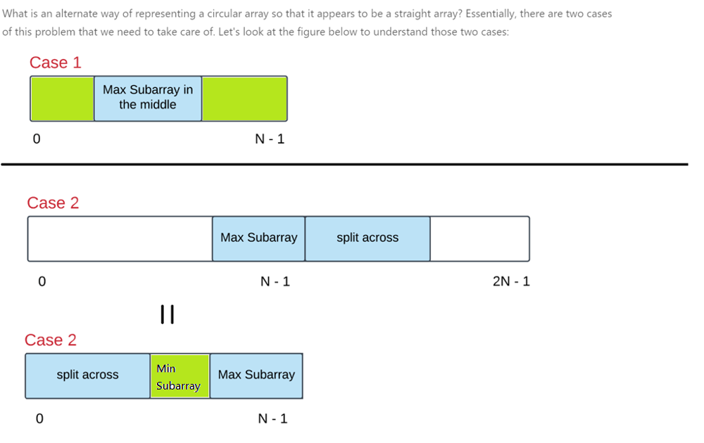
  - This is done by finding the `minimum` sum of a subarray and subtracting it from the total sum of the array.
    - The minimum sum of a subarray is found by using Kadane's algorithm on the negative of the array.
    - It's used to find the maximum sum of a subarray that wraps around the array.

```py
def maxSubarraySumCircular(nums):
    max_sum = nums[0]
    min_sum = nums[0]
    current_max = 0
    current_min = 0
    total_sum = 0

    for num in nums:
        current_max = max(current_max + num, num)
        max_sum = max(max_sum, current_max)

        current_min = min(current_min + num, num)
        min_sum = min(min_sum, current_min)

        total_sum += num

    if total_sum == min_sum:
        return max_sum

    return max(max_sum, total_sum - min_sum)
```

---

### Longest Turbulent Subarray

> Watch neetcode'∂s video ⚠️

Given an integer array `arr`, return the length of a maximum size turbulent subarray of `arr`.

> A subarray is **turbulent** if the comparison sign flips between each adjacent pair of elements in the subarray.
> More formally, a subarray `[arr[i], arr[i + 1], ..., arr[j]]` of `arr` is said to be turbulent if and only if:
>
> - For `i <= k < j`: `arr[k] > arr[k + 1]` when `k` is odd, and `arr[k] < arr[k + 1]` when `k` is even.
> - Or, for `i <= k < j`: `arr[k] > arr[k + 1]` when `k` is even, and `arr[k] < arr[k + 1]` when `k` is odd.

- EX: `arr = [9, 4, 2, 10, 7, 8, 8, 1, 9]` --> `5`

  - Explanation: `[4, 2, 10, 7, 8]` is the longest turbulent subarray.

- **Explanation:**
  - We can use Kadane's algorithm to find the longest turbulent subarray.
  - We can use two pointers `l` and `r` to keep track of the start and end of the subarray.
  - We can use a variable `res` to keep track of the longest turbulent subarray.
  - We can use a variable `prev` to keep track of the previous comparison sign.
    - If the previous comparison sign is `>` and the current comparison sign is `<`, we increment `r` and update `res`. because the subarray is still turbulent.
    - If the previous comparison sign is `<` and the current comparison sign is `>`, we increment `r` and update `res`. because the subarray is still turbulent.
    - If the previous comparison sign is `>` and the current comparison sign is `>`, we reset `l` and `r` to `r - 1` because the subarray is no longer turbulent.

```py
def maxTurbulenceSize(arr):
    l, r = 0, 1
    res, prev = 1, ""

    while r < len(arr):
        if arr[r - 1] > arr[r] and prev != ">":
            res = max(res, r - l + 1)
            r += 1
            prev = ">"
        elif arr[r - 1] < arr[r] and prev != "<":
            res = max(res, r - l + 1)
            r += 1
            prev = "<"
        else:
            r = r + 1 if arr[r - 1] == arr[r] else r
            l = r - 1
            prev = ""

    return res
```

---

## Fast and Slow Pointers

This pattern is used to solve problems with `linked lists` and `arrays` that involve finding a **loop / cycle** in the structure.

- More [here](./8-PS-Linked-Lists.md#fast--slow-pointer)

### Find the Duplicate Number

| Video Solution                                                | Hint                                                                                                                                                                                       |
| ------------------------------------------------------------- | ------------------------------------------------------------------------------------------------------------------------------------------------------------------------------------------ |
| [Video Solution](https://www.youtube.com/watch?v=wjYnzkAhcNk) | Use **Floyd's Cycle Detection** algorithm to find the intersection point of the two runners, then find the "entrance" to the cycle, which is the duplicate number that we are looking for. |

Given an array of integers `nums` containing `n + 1` integers where each integer is in the range `[1, n]` inclusive.

There is only **one repeated number** in `nums`, return this repeated number.

- You must solve the problem **without** modifying the array `nums` and uses only constant extra space.

- EX:

  - Input: `nums = [1,3,4,2,2]`
  - Output: `2`

- **Solution 1:** using HashMap **(not what the problem wants)** -> `O(n)` time and `O(n)` space

  ```py
  def findDuplicate(nums):
      # Create a dictionary to store the presence of each number
      presence = {}
      for num in nums:
          if num in presence:
              return num
          presence[num] = True
  ```

- **Solution 2:** using **Floyd's Cycle Detection** -> `O(n)` time and `O(1)` space ✅

  - The idea here, is to make use of the fact that the numbers in the array are in the range `[1, n]` and there is only one repeated number in the array. **So, we can use the numbers in the array as pointers (indices) to traverse the array**.
    - So, if there is a duplicate number in the array, it means that multiple numbers are pointing to the same index.
  - To solve this problem without using space, we can use Floyd's Cycle Detection algorithm.
  - This algorithm is used to detect cycles.
    - It works by using two pointers, a `slow` pointer and a `fast` pointer. The `slow` pointer moves one step at a time, while the `fast` pointer moves two steps at a time.
    - If the two pointers ever meet, it means that we found the beginning of the cycle **(intersection point)**
      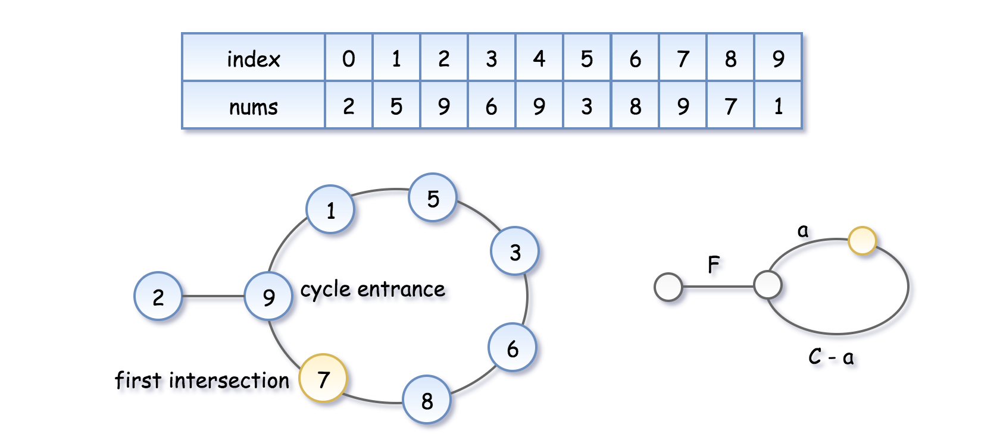
    - Once the two runners meet, we know that there is a cycle in the linked list. We then need to find the "entrance" to the cycle, which is the duplicate number that we are looking for.
      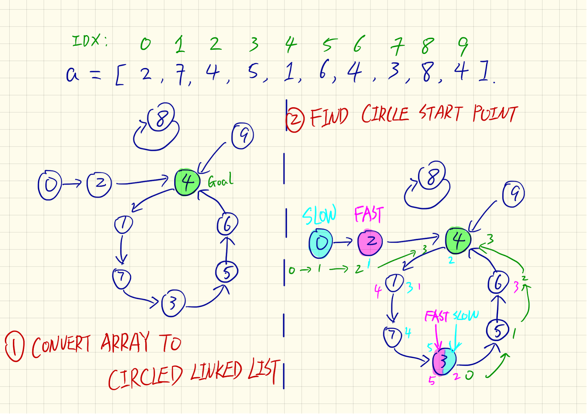
      - We start a new pointer at the beginning of the linked list and move it one step at a time. We also move the slow runner one step at a time. When the two runners meet, we have found the "entrance" to the cycle, which is the duplicate number that we are looking for.

  ```py
  def findDuplicate(nums):
      # Find the intersection point of the two runners
      slow = fast = 0
      while True:
          slow = nums[slow] # move 1 step
          fast = nums[nums[fast]] # move 2 steps
          if slow == fast:
              break # found the intersection point

      # Find the "entrance" to the cycle
      slow2 = 0
      while slow2 != fast:
          slow2 = nums[slow2] # move 1 step
          fast = nums[fast] # move 1 step

      return slow2
  ```

- **Solution 3:** using **cyclic sort**, [here](./10-PS-Sorting-Searching.md#find-the-duplicate-number)

---

## Merge Intervals Pattern

It's a pattern that can be used to solve problems that involve overlapping intervals, where we need to find the overlapping intervals or merge them.

- if we have 2 intervals `a` and `b`, there are 6 different ways they can relate to each other:
  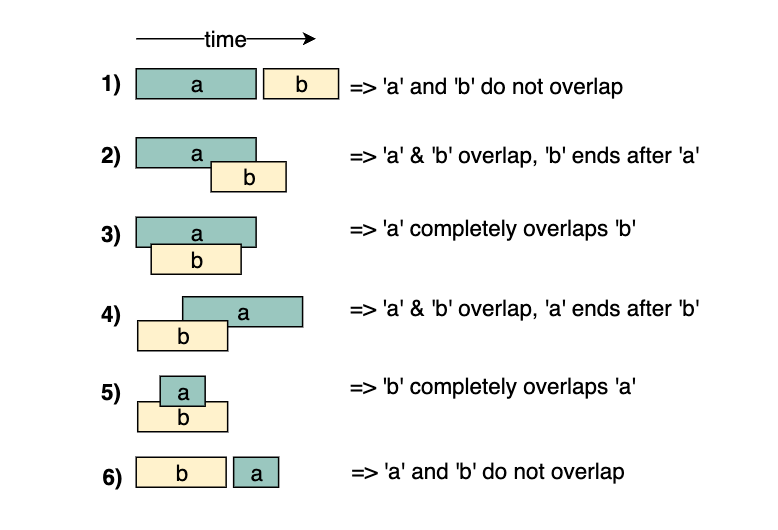
- Usually we **sort** the intervals by the `start` time

  ```py
  intervals.sort(key=lambda x: x[0])
  ```

- Then we can check if the current interval overlaps with the previous interval

  - If there is **no overlap**, then we can add the current interval to the merged intervals
  - If there is **overlap**, then we can merge the current interval with the previous interval

    ```py
    c.start = a.start
    c.end = max(a.end, b.end)
    ```

- Note: in problems where you have 2 lists of intervals, you will also need to use **2 pointers** to iterate over the two lists of intervals at the same time. and update the pointers accordingly based on which interval has the earlier end time.

  ```py
  i, j = 0, 0
  # move to the next interval that comes first
  if firstList[i][1] < secondList[j][1]:
      i += 1
  else:
      j += 1
  ```

### Merge Intervals

| Video Solution                                                | Hint                                                                                                                                                                                                                                                                                                        |
| ------------------------------------------------------------- | ----------------------------------------------------------------------------------------------------------------------------------------------------------------------------------------------------------------------------------------------------------------------------------------------------------- |
| [Video Solution](https://www.youtube.com/watch?v=44H3cEC2fFM) | Sort the intervals by the `start` time, then we can check if the current interval overlaps with the previous interval. If there is **no overlap**, then we can add the current interval to the merged intervals. If there is **overlap**, then we can merge the current interval with the previous interval |

Given an array of intervals where `intervals[i] = [starti, endi]`, merge all overlapping intervals, and return an array of the non-overlapping intervals that cover all the intervals in the input.

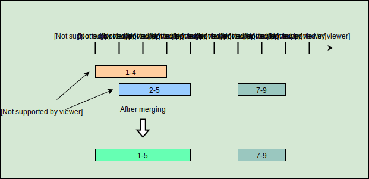

- Ex:

  - `intervals = [[1, 3], [2, 6], [8, 10], [15, 18]] --> [[1, 6], [8, 10], [15, 18]]`
    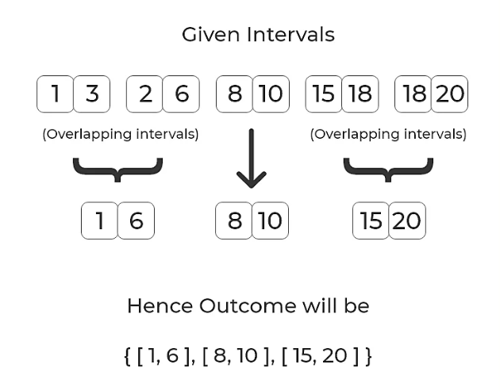

- Explanation:

  - goal is to merge the overlapping intervals like this:
    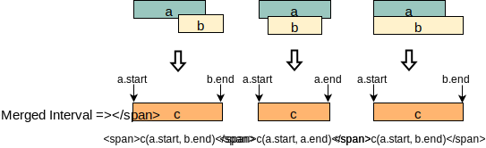
  - Bruteforce solution:
    - We can use nested loops to check if the current interval overlaps with the other intervals
    - Time complexity: `O(n^2)`
    - Space complexity: `O(n)`
  - We can sort the intervals by the `start` time
  - Then we can check if the current interval overlaps with the previous interval

    - If there is **no overlap**, then we can add the current interval to the merged intervals
    - If there is **overlap**, then we can merge the current interval with the previous interval

      ```py
      c.start = a.start
      c.end = max(a.end, b.end)
      ```

```py
def merge(intervals):
    # sort the intervals by the start time
    intervals.sort(key=lambda x: x[0])

    merged = []
    for interval in intervals:
        # check if interval does not overlap with the previous one
        if not merged or merged[-1][1] < interval[0]:
            merged.append(interval)
        else:
            # otherwise, there is overlap, so we merge the current and previous interval (which is the last interval in the `merged` list)
            merged[-1][1] = max(merged[-1][1], interval[1])

    return merged


# -----------------------------another way-----------------------------

def merge(intervals):
    intervals.sort(key=lambda x: x[0])

    res = [intervals[0]]
    for interval in intervals[1:]:
        lastEnd = res[-1][1]

        # check if start of current interval is less than or equal to the end of the last interval
        if interval[0] <= lastEnd:
            res[-1][1] = max(lastEnd, interval[1])
        else:
            res.append(interval)

    return res
```

---

### Insert Interval

| Video Solution                                                | Hint                                                                                                                                                                                                                                                                                                                                                                                |
| ------------------------------------------------------------- | ----------------------------------------------------------------------------------------------------------------------------------------------------------------------------------------------------------------------------------------------------------------------------------------------------------------------------------------------------------------------------------- |
| [Video Solution](https://www.youtube.com/watch?v=A8NUOmlwOlM) | We need to first find the position of the new interval in the intervals (we need to skip the intervals that come before the new interval). Once we find the position of the new interval, we can merge it with the intervals that overlap with it. Finally, we can add the new interval to the merged interval, then add the rest of the intervals that come after the new interval |

Given a set of `non-overlapping` intervals, insert a new interval into the intervals. such that the intervals are still sorted. and no overlapping intervals exist. (merge if necessary)

- Ex:

  - input: `intervals = [[1, 3], [6, 9]], newInterval = [2, 5]`
  - output: `[[1, 5], [6, 9]]`

- Explanation:
  - We need to first find the position of the new interval in the intervals (we need to skip the intervals that come before the new interval)
  - Once we find the position of the new interval, we can **merge** it with the intervals that overlap with it
    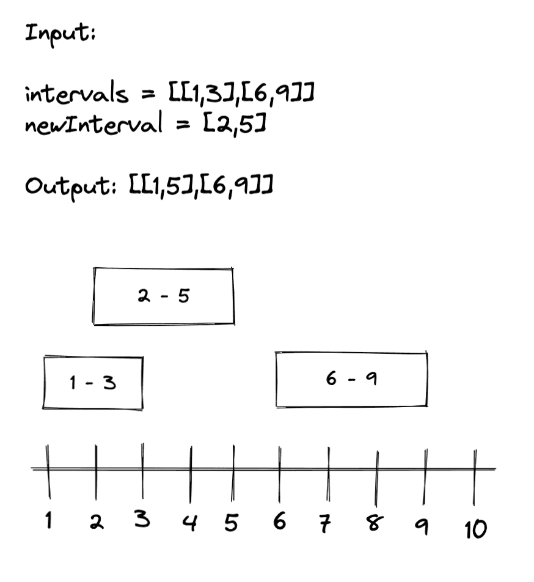
  - Finally, we can add the new interval to the merged intervals and add the rest of the intervals that come after the new interval

```py
def insert(intervals, newInterval):
    merged = []
    i = 0

    # add all the intervals that come before the new interval
    while i < len(intervals) and newInterval[0] > intervals[i][1]:
        merged.append(intervals[i])
        i += 1

    # merge all the intervals that overlap with the new interval
    while i < len(intervals) and newInterval[1] >= intervals[i][0]:
        newInterval[0] = min(newInterval[0], intervals[i][0])
        newInterval[1] = max(newInterval[1], intervals[i][1])
        i += 1

    # add the new interval
    merged.append(newInterval)

    # add all the intervals that come after the new interval
    if i < len(intervals):
        merged += intervals[i:]

    return merged

# -----------------------------another way-----------------------------

# Using For loop
def insert(intervals, newInterval):
    merged = []
    i = 0

    while i < len(intervals):
      if newInterval[0] > intervals[i][1]:
        merged.append(intervals[i])
        i += 1
      elif newInterval[1] >= intervals[i][0]:
        newInterval[0] = min(newInterval[0], intervals[i][0])
        newInterval[1] = max(newInterval[1], intervals[i][1])
        i += 1
      else:
        break

    merged.append(newInterval)
    merged += intervals[i:]
    return merged
```

---

### Interval List Intersections

| Video Solution                                                | Hint                                                                                                                                                                                                                                                           |
| ------------------------------------------------------------- | -------------------------------------------------------------------------------------------------------------------------------------------------------------------------------------------------------------------------------------------------------------- |
| [Video Solution](https://www.youtube.com/watch?v=3CtoB90-Hwc) | We can use two pointers to keep track of the current intervals in the two lists. We can then check if the current intervals overlap. If they do, we can get the intersection and add it to the result. Then we can move to the next interval that comes first. |

Given two lists of `closed` intervals, each list of intervals is pairwise disjoint and in sorted order. Return the intersection of these two interval lists.

The intersection of two closed intervals is a set of real numbers that are either empty or represented as a closed interval. For example, the intersection of `[1, 3]` and `[2, 4]` is `[2, 3]`.


- Ex:

  - input: `firstList = [[0, 2], [5, 10], [13, 23], [24, 25]], secondList = [[1, 5], [8, 12], [15, 24], [25, 26]]`
  - output: `[[1, 2], [5, 5], [8, 10], [15, 23], [24, 24], [25, 25]]`

- Explanation
  - We can use two pointers to keep track of the current intervals in the two lists. We can then check if the current intervals overlap. If they do, we can get the intersection and add it to the result.
  - Intersection is calculated as follows:
    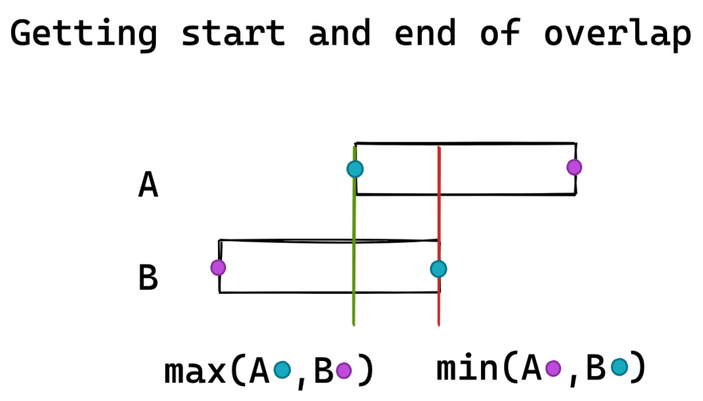
  - Then we can move to the next interval that comes first.
    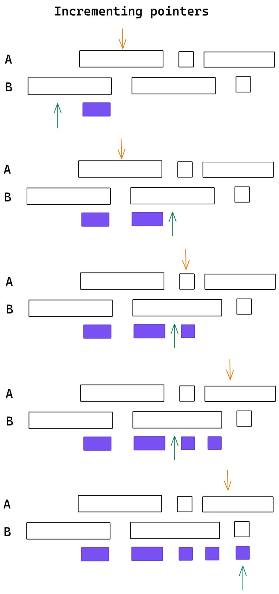

```py
# O(n + m) time and O(n + m) space
def intervalIntersection(firstList, secondList):
    res = []
    i, j = 0, 0

    while i < len(firstList) and j < len(secondList):
        firstStart, firstEnd = firstList[i][0], firstList[i][1]
        secondStart, secondEnd = secondList[j][0], secondList[j][1]

        # check if the intervals overlap
        if firstStart <= secondEnd and secondStart <= firstEnd:
            intersection = [max(firstStart, secondStart), min(firstEnd, secondEnd)]
            res.append(intersection)

        # move to the next interval that comes first
        if firstList[i][1] < secondList[j][1]:
            i += 1
        else:
            j += 1

    return res
```

---

### Non-overlapping Intervals

Given an array of intervals `intervals` where `intervals[i] = [starti, endi]`, return the **minimum** number of intervals you need to remove to make the rest of the intervals non-overlapping.

- Ex:

  - `intervals = [[1, 2], [2, 3], [3, 4], [1, 3]] --> 1`
  - Explanation: [1, 3] can be removed and the rest of intervals are non-overlapping.

- Explanation:
  - We can sort the intervals by the `start` time
  - Then we can check if the current interval overlaps with the previous interval
    - If there is no overlap, then we can add the current interval to the merged intervals
    - If there is overlap, then we can merge the current interval with the previous interval

```py
def eraseOverlapIntervals(intervals):
    # sort the intervals by the start time
    intervals.sort(key=lambda x: x[0])

    res = 0
    prevEnd = intervals[0][1]
    for start, end in intervals[1:]:
        # overlap
        if start < prevEnd:
            res += 1
            prevEnd = min(prevEnd, end) # remove the interval with the larger end time
        # no overlap
        else:
            prevEnd = end

    return res
```

---

### Meeting Rooms

Given an array of meeting time intervals `intervals` where `intervals[i] = [starti, endi]`, determine if a person could attend all meetings.

- EX: `intervals = [[0,30],[5,10],[15,20]]` --> `false`

- Solution : Sort and compare

- **Steps**:

  1. Sort the intervals **by the start time**
  2. Loop through the sorted intervals and check if the `end` time of the `current` interval is greater than the `start` time of the `next` interval. If it is, then return `false`.
     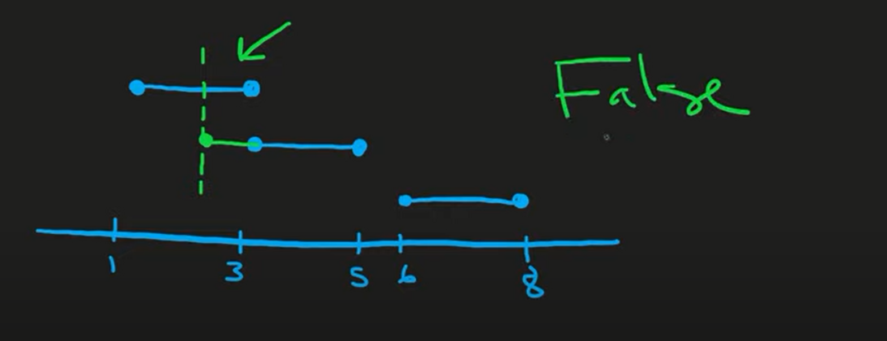
  3. If the loop finishes, return `true`.

```py
class Interval(object):
    def __init__(self, start, end):
        self.start = start
        self.end = end

def canAttendMeetings(intervals):
    # sort the intervals by the start time
    intervals.sort(key=lambda x: x.start)

    # loop through the sorted intervals (we start from the second interval because we need to compare it with the previous interval)
    for i in range(1, len(intervals)):
        # check if the end time of the previous interval is greater than the start time of the current interval
        if intervals[i-1].end > intervals[i].start:
            return False


    return True
```

---

### Meeting Rooms II

Given an array of meeting time intervals `intervals` where `intervals[i] = [starti, endi]`, return the **minimum** number of conference rooms required to hold all
the meetings.

- EX: `intervals = [[4,5], [2,3], [2,4], [3,5]]` --> `2`
  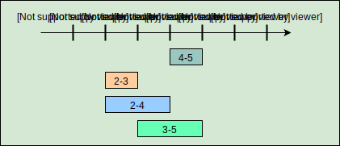

- Explanation:

  - We need to find the overlapping meetings, and keep track of the mutual exclusiveness of the overlapping meetings.

- **Solution 1: using `pointers`**

  1. use two arrays to keep track of the `start` times and `end` times separately.
  2. then sort the two arrays and use two pointers to iterate over them.
  3. We start with the first `start` time and the first `end` time. If the `start` time is less than the `end` time, we need to allocate a new room and move the `start` pointer forward.

     - we iterate over the `start` times array and compare each `start` time with the current `end` time. If the `start` time is less than the `end` time, we need to allocate a new room and move the `start` pointer forward.
     - If the `start` time is greater than or equal to the `end` time, we can reuse the room and move both pointers forward

  4. Finally, we return the number of rooms allocated, which represents the minimum number of meeting rooms required to schedule all the meetings.

  ```py
  class Interval(object):
      def __init__(self, start, end):
          self.start = start
          self.end = end

  def minMeetingRooms(intervals):
      if not intervals:
          return 0

      # initialize two arrays to keep track of the start times and end times
      start_times = sorted([interval.start for interval in intervals])
      end_times = sorted([interval.end for interval in intervals])

      # initialize two pointers to iterate over the start and end times
      start_ptr = end_ptr = 0
      num_rooms = 0

      while start_ptr < len(start_times):
          # check if the start time is less than the end time
          if start_times[start_ptr] < end_times[end_ptr]:
              num_rooms += 1
          else:
              end_ptr += 1

          start_ptr += 1

      return num_rooms
  ```

- **Solution 2: using `minHeap`**

  1. Sort all the meetings on their `start` time.
  2. Create a `minHeap` to store all the active meetings. This min-heap will also be used to find the active meeting with the **smallest** `end` time.
  3. Since the `minHeap` contains all the active meetings, so before scheduling `m1` we can remove all meetings from the heap that have ended before `m1`, i.e., remove all meetings from the `heap` that have an `end` time smaller than or equal to the `start` time of `m1`.
  4. The `heap` will always have all the overlapping meetings, so we will need rooms for all of them. Keep a counter to remember the maximum size of the heap at any time which will be the minimum number of rooms needed.

  ```py
  def minMeetingRooms(intervals):
      if not intervals:
          return 0

      # sort the intervals by the start time
      intervals.sort(key=lambda x: x.start)

      # initialize a minHeap to store the active meetings
      minHeap = []
      # add the first meeting to the minHeap
      heapq.heappush(minHeap, intervals[0].end)

      # loop through the remaining meetings
      for i in range(1, len(intervals)):
          # check if the start time of the current meeting is greater than or equal to the end time of the meeting at the top of the minHeap
          if intervals[i].start >= minHeap[0]:
              # remove the meeting at the top of the minHeap
              heapq.heappop(minHeap)

          # add the current meeting to the minHeap
          heapq.heappush(minHeap, intervals[i].end)

      # the size of the minHeap at the end will be the minimum number of rooms needed
      return len(minHeap)
  ```

---

### Maximum CPU Load

We are given a list of Jobs. Each job has a Start time, an End time, and a CPU load when it is running. Our goal is to find the **maximum CPU load** at any time if all the jobs are running on the same machine.

- EX: `jobs = [[1,4,3], [2,5,4], [7,9,6]]` --> `7`
  - explanation: Since `[1,4,3]` and `[2,5,4]` overlap, their maximum CPU load `(3+4=7)` will be when both the jobs are running at the same time i.e., during the time interval `(2,4)`.

```py
class Job:
    def __init__(self, start, end, cpu_load):
        self.start = start
        self.end = end
        self.cpu_load = cpu_load

def find_max_cpu_load(jobs):
    # sort the jobs by the start time
    jobs.sort(key=lambda x: x.start)

    max_cpu_load = 0
    current_cpu_load = 0
    minHeap = []

    for job in jobs:
        # remove all the jobs that have ended
        while len(minHeap) > 0 and job.start >= minHeap[0].end:
            current_cpu_load -= minHeap[0].cpu_load
            heapq.heappop(minHeap)

        # add the current job to the minHeap
        heapq.heappush(minHeap, job)
        current_cpu_load += job.cpu_load
        max_cpu_load = max(max_cpu_load, current_cpu_load)

    return max_cpu_load
```

---

### Employee Free Time

For ‘K’ employees, we are given a list of intervals representing the working hours of each employee. Our goal is to find out if there is a free interval that is common to all employees. You can assume that each list of employee working hours is **sorted** on the `start` time.

- EX: `schedule = [[[1,3], [9,12]], [[2,4]], [[6,8]]]` --> `[[4,6], [8,9]]`

  - Explanation: All employees are free between `[4,6]` and `[8,9]`.
    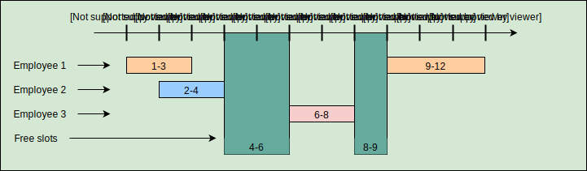

- Explanation:

  - We are given the intervals of working hours for each employee in a sorted order. So, a brute force solution could be to search for a common interval every time for all employees. If we don’t find a common interval, we can move on to the next interval of the employee with the smallest start time.
  - A better approach is to use a `minHeap`
    - We take the `first` interval of each employee and add it to a `minHeap`. This `minHeap` can always be used to find the interval with the smallest start time.
    - Once we have the interval with the smallest `start` time, we can then compare it with the next smallest `start` time interval (again from the `minHeap`) to find the `common interval (gap)`.
    - Whenever we take an interval out of the `minHeap`, we can insert the next interval of the same employee to the `minHeap`.
      - This means that we need to know which interval belongs to which employee.

```py
class Interval:
    def __init__(self, start, end):
        self.start = start
        self.end = end

def find_employee_free_time(schedule):
    # initialize a minHeap to store the intervals
    minHeap = []

    # add the first interval of each employee to the minHeap
    for i in range(len(schedule)):
        heapq.heappush(minHeap, (schedule[i][0].start, schedule[i][0].end, i, 0)) # (start, end, employee, index)

    # initialize a variable to keep track of the previous interval
    previous_interval = minHeap[0]
    # initialize a list to store the free intervals
    free_time = []

    while minHeap:
        # get the interval at the top of the minHeap
        start, end, employee, index = heapq.heappop(minHeap)

        # check if the previous interval is not overlapping with the current interval
        if previous_interval.end < start:
            free_time.append(Interval(previous_interval.end, start))
            previous_interval = Interval(start, end)
        # otherwise, the previous interval is overlapping with the current interval, check if the current interval ends after the previous interval
        elif previous_interval.end < end:
            previous_interval = Interval(previous_interval.start, end)

        # check if the current employee has more intervals
        if index + 1 < len(schedule[employee]):
            # add the next interval of the current employee to the minHeap
            heapq.heappush(minHeap, (schedule[employee][index + 1].start, schedule[employee][index + 1].end, employee, index + 1))

    return free_time
```

---

## 2D Array ( Matrix )

- Here, we will be using the `row` and `column` pointers to iterate over the matrix. We will start with the `top-left` element and iterate over the matrix until we reach the `bottom-right` element.
- Usually, we will be using a `while` loop to iterate over the matrix, and we will be using the `row` and `column` pointers to keep track of the current element in the matrix.

### Rotate Image

| Video Solution                                                | Hint                                                                                                                                                                                                                                                                                                                 |
| ------------------------------------------------------------- | -------------------------------------------------------------------------------------------------------------------------------------------------------------------------------------------------------------------------------------------------------------------------------------------------------------------- |
| [Video Solution](https://www.youtube.com/watch?v=fMSJSS7eO1w) | Use **4 pointers** to keep track of the `top`, `bottom`, `left`, and `right` boundaries of the current cycle. Iterate through all elements in the current cycle, from left to right, using a loop variable `i`. For each element in the current cycle, swap the element with its corresponding element in the cycle. |

You are given an n x n 2D matrix representing an image, rotate the image by 90 degrees (clockwise). You have to rotate the image **in-place**, which means you have to modify the input 2D matrix directly. **DO NOT** allocate another 2D matrix and do the rotation.

- EX: `matrix = [[1,2,3],[4,5,6],[7,8,9]]` --> `[[7,4,1],[8,5,2],[9,6,3]]`
  

- Explanation

  - The brute force solution is to create a new matrix and copy the elements of the original matrix to the new matrix in a rotated order using two nested loops ❌

    ```py
    def rotate(matrix):
        n = len(matrix)
        new_matrix = [[0 for _ in range(n)] for _ in range(n)]
        for r in range(n):
            for c in range(n):
                new_matrix[c][n - r - 1] = matrix[r][c]
        return new_matrix
    ```

- **Solution 1:** Transpose and then reverse

  - **Steps**:

    - perform a matrix transpose and then reverse each row of the resulting matrix.
    - **Transpose**: swap the elements of the matrix across the diagonal.
      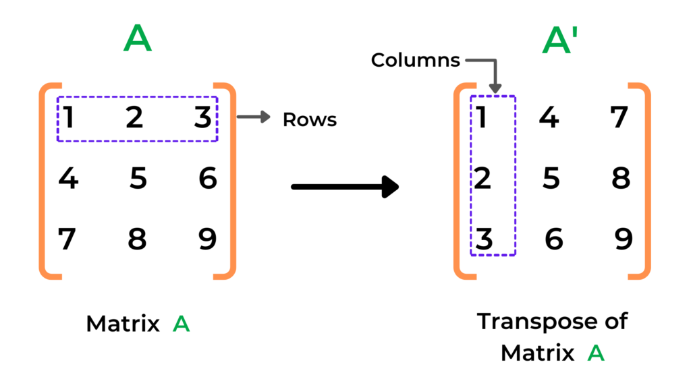

      - This is done by iterating through the matrix and swapping the element at index `[i]` `[j]` with the element at index `[j]` `[i]`.

        ```py
        matrix[i][j], matrix[j][i] = matrix[j][i], matrix[i][j]
        ```

    - The nested loop will iterate over the `range(row)`

      ```py
      # Time: O(n^2) | Space: O(1) -> (in-place)
      def rotate(matrix):
        # transpose the matrix
        for i in range(len(matrix)):
            for j in range(i):
                matrix[i][j], matrix[j][i] = matrix[j][i], matrix[i][j]
        # Reverse each row
        for row in matrix:
            row.reverse()
      ```

- **Solution 2:** using 4 pointers -> `left`, `right`, `top`, `bottom` ✅

  - We initialize two pointers `l` and `r` to point to the leftmost and rightmost columns of the matrix, respectively.
    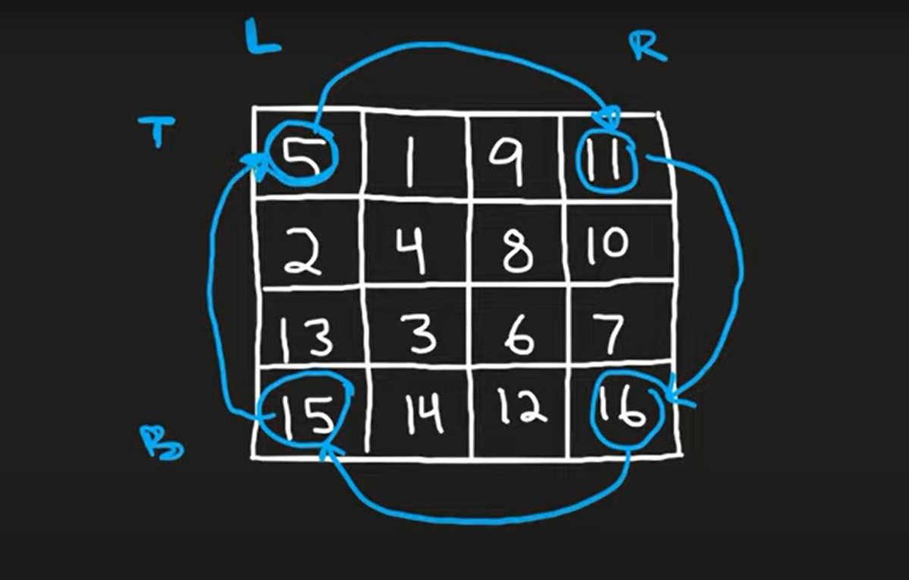
  - Swap each element in a cycle of four, using four pointers to keep track of the `top`, `bottom`, `left`, and `right` boundaries of the current cycle.
    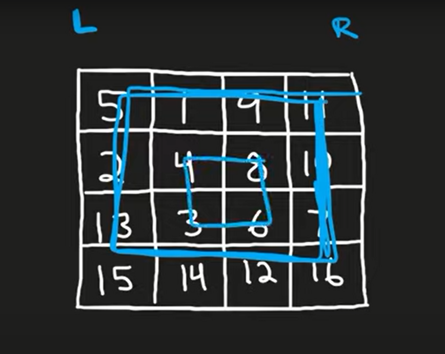
  - Iterate through all elements in the current cycle, from left to right, using a loop variable i.
  - For each element in the current cycle, swap the element with its corresponding element in the cycle, using four pointers to keep track of the top, bottom, left, and right boundaries of the cycle.
    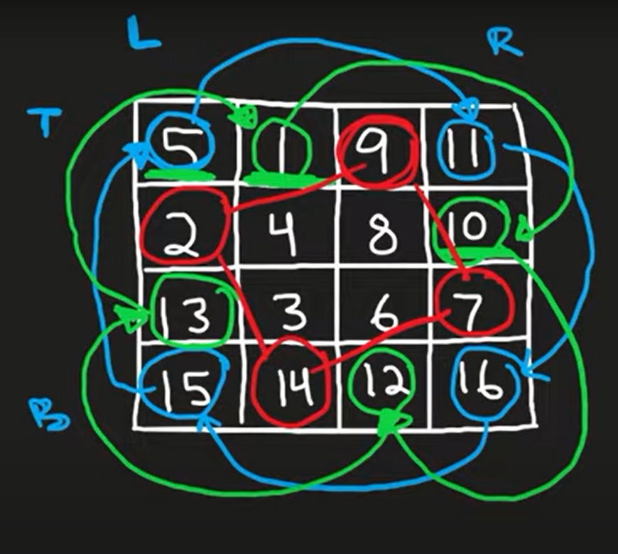
  - After swapping all elements in the current cycle, move the top pointer down by one row and the bottom pointer up by one row, and move the left pointer to the right by one column and the right pointer to the left by one column. This moves the boundaries of the current cycle inward by one element.
    - That's where we use the `for` loop to iterate over the current cycle. and the `i` variable to keep track of the current element in the cycle.
      - use the picture above as a reference to know how `i` is changed for each point. Ex:
        - top left -> `matrix[top][left + i]` instead of `matrix[top][left]`
  - Instead of moving points starting from `top-left`, which will make us need 3 temporary variables to store the elements at the four corners of the matrix.
    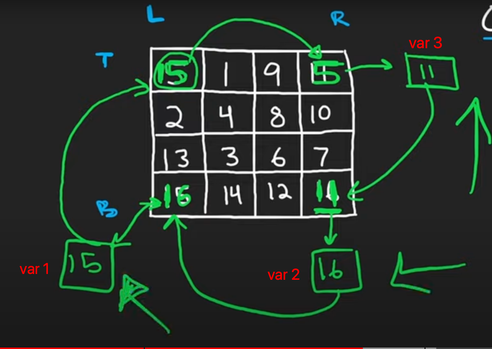
    - we can move the pointers starting from `top-right` and move them in a anti-clockwise direction.
      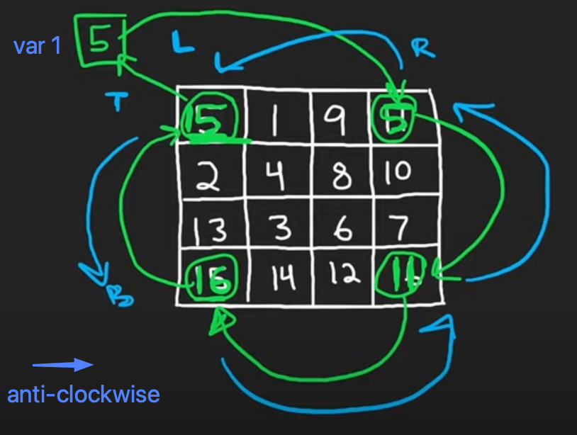

  ```py
  def rotate(matrix):
    # initialize the pointers to point to the leftmost and rightmost columns
    l,r = 0, len(matrix) - 1

    while l < r:
        # loop through the current depth (layer) of the matrix
        for i in range(r - l):
            top, bottom = l, r
            # Temporarily save the top-left element for later
            top_left = matrix[top][l + i]

            # 1. move the bottom-left element to the top-left
            matrix[top][l + i] = matrix[bottom - i][l]
            # 2. move the bottom-right element to the bottom-left
            matrix[bottom - i][l] = matrix[bottom][r - i]
            # 3. move the top-right element to the bottom-right
            matrix[bottom][r - i] = matrix[top + i][r]
            # 4. move the top-left element to the top-right
            matrix[top + i][r] = top_left


        # move the pointers to the next cycle
        l += 1
        r -= 1
  ```

---

### Spiral Matrix

| Video Solution                                                | Hint                                                                                                                                                                                                                                                                                                                                                                                                                                                                  |
| ------------------------------------------------------------- | --------------------------------------------------------------------------------------------------------------------------------------------------------------------------------------------------------------------------------------------------------------------------------------------------------------------------------------------------------------------------------------------------------------------------------------------------------------------- |
| [Video Solution](https://www.youtube.com/watch?v=BJnMZNwUk1M) | The idea here, is to keep track of the `top`, `bottom`, `left`, and `right` **boundaries** of the current cycle. We start by moving the `top` pointer from left to right, then we when we reach the end of the row, we move the `right` pointer down by one row, then we move the `bottom` pointer from right to left, then we move the `left` pointer up by one row. It's important to check the boundaries of the current cycle, and move the pointers accordingly. |

Given a matrix of m x n elements (m rows, n columns), return all elements of the matrix in spiral order.

- EX: `[[1, 2, 3], [4, 5, 6], [7, 8, 9]] --> [1, 2, 3, 6, 9, 8, 7, 4, 5]`
  

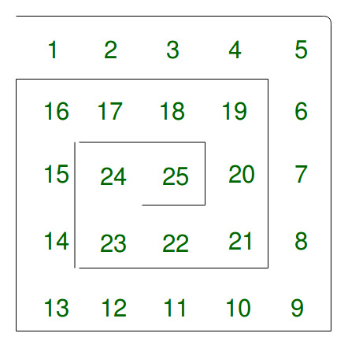

- Explanation:

  - The idea here, is to keep track of the `top`, `bottom`, `left`, and `right` **boundaries** of the current cycle.
  - We start by moving the `top` pointer from left to right, then we when we reach the end of the row, we move the `right` pointer down by one row, then we move the `bottom` pointer from right to left, then we move the `left` pointer up by one row.
    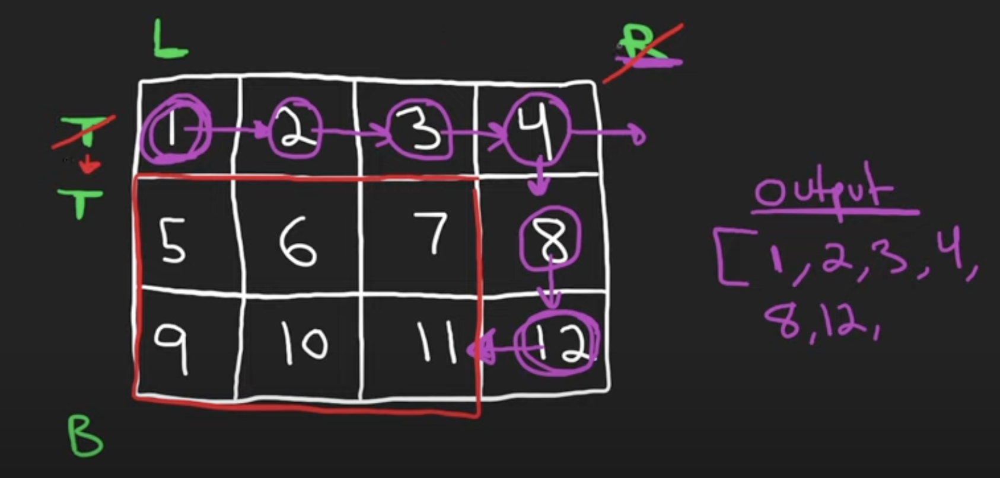
    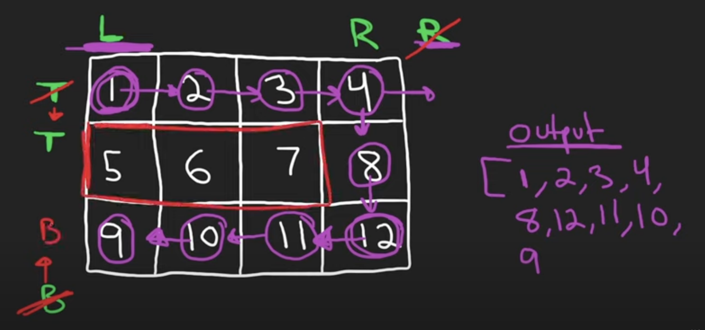
    - So we check the boundaries of the current cycle, and move the pointers accordingly.
    - if the `top` pointer is less than or equal to the `bottom` pointer, and the `left` pointer is less than or equal to the `right` pointer, then we can continue to the next cycle **(inner layer)**.
  - We keep doing this until the `top` pointer is greater than the `bottom` pointer, or the `left` pointer is greater than the `right` pointer. which means that we have reached the end of the matrix.

- **Solution 1**: using `pop()`

  - Time: O(n^2) | Space: O(n)
    - Because we are using `pop(0)` to remove the first element of each row, which takes O(n) time. and we are doing this for each row, which makes the time complexity O(n^2)

  ```py
  def spiral_matrix(matrix):
      result = []
      while matrix:
          # add the first row to the result
          result += matrix.pop(0)
          # add the last element of each row to the result
          for row in matrix:
              if row: result.append(row.pop())
          # add the last row to the result in reverse order
          if matrix:
              result += matrix.pop()[::-1]
          # add the first element of each row to the result in reverse order
          for row in matrix[::-1]:
              if row: result.append(row.pop(0))
      return result
  ```

- **Solution 2**: using pointers ✅

  - Time: O(n) | Space: O(n)

  ```py
  def spiral_matrix(matrix):
      result = []
      # initialize the pointers to point to the leftmost and rightmost columns and the topmost and bottommost rows
      left, right = 0, len(matrix[0]) - 1
      top, bottom = 0, len(matrix) - 1

      while left <= right and top <= bottom:
          # move the left pointer from left to right
          for i in range(left, right + 1):
              result.append(matrix[top][i])
          top += 1

          # move the bottom pointer from top to bottom
          for i in range(top, bottom + 1):
              result.append(matrix[i][right])
          right -= 1

          # move the right pointer from right to left
          if top <= bottom:
              for i in range(right, left - 1, -1):
                  result.append(matrix[bottom][i])
              bottom -= 1

          # move the top pointer from bottom to top
          if left <= right:
              for i in range(bottom, top - 1, -1):
                  result.append(matrix[i][left])
              left += 1

      return result
  ```

> **Note:** Both solutions are valid, but you need to ask the interviewer if you are allowed to modify the matrix or not. If you are allowed to modify the matrix, then you can use the first solution, otherwise you can use the second solution.

---

### Spiral Matrix II

| Video Solution                                                | Hint                                                                                                                                                                                                                                                                                                                                                                                              |
| ------------------------------------------------------------- | ------------------------------------------------------------------------------------------------------------------------------------------------------------------------------------------------------------------------------------------------------------------------------------------------------------------------------------------------------------------------------------------------- |
| [Video Solution](https://www.youtube.com/watch?v=RvLrWFBJ9fM) | We can use the same approach as the previous problem, but instead of adding the elements to the result, we can fill the matrix with the elements from `1` to `n^2` in spiral order. We can use the same pointers to keep track of the `top`, `bottom`, `left`, and `right` boundaries of the current cycle. We can use a variable `num` to keep track of the `number` to fill in the matrix with. |

Given a positive integer n, generate an n x n matrix filled with elements from 1 to n^2 in spiral order.

- EX: `n = 3` --> `[[1, 2, 3], [8, 9, 4], [7, 6, 5]]`

- Steps:
  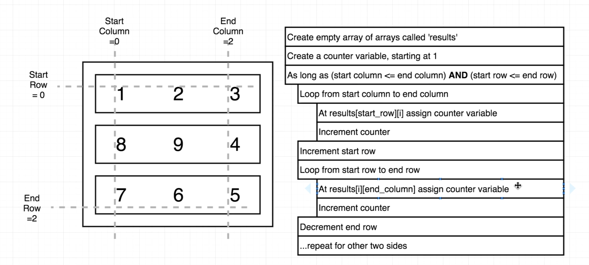

```py
def spiral_matrix(n):
    matrix = [[0] * n for _ in range(n)]
    left, right, top, bottom = 0, n - 1, 0, n - 1
    num = 1 # the number to fill in the matrix

    while left <= right and top <= bottom:
        # fill the top row
        for i in range(left, right + 1):
            matrix[top][i] = num
            num += 1
        top += 1

        # fill the right column
        for i in range(top, bottom + 1):
            matrix[i][right] = num
            num += 1
        right -= 1

        # fill the bottom row
        for i in range(right, left - 1, -1):
            matrix[bottom][i] = num
            num += 1
        bottom -= 1

        # fill the left column
        for i in range(bottom, top - 1, -1):
            matrix[i][left] = num
            num += 1
        start += 1

    return matrix
```

---

### Valid Tic-Tac-Toe State

A Tic-Tac-Toe board is given as a string array `board`. Return `true` if and only if it is possible to reach this board position during the course of a valid tic-tac-toe game.

- Ex:

  - `board = ["O  ", "   ", "   "] --> false` --> no one has won yet
  - `board = ["XOX", " X ", "   "] --> false` --> X has won, but the game is not over yet
  - `board = ["XXX", "   ", "OOO"] --> false` --> the game is over, but X didn't have the turn to play
  - `board = ["XOX", "O O", "XOX"] --> true` --> the game is over, and no one won

```py
def validTicTacToe(board):
    # count the number of Xs and Os
    numXs = sum(row.count('X') for row in board)
    numOs = sum(row.count('O') for row in board)

    # check if the number of Xs is equal to the number of Os or the number of Xs is 1 greater than the number of Os
    if numXs != numOs and numXs != numOs + 1:
        return False

    # check if X has won
    if hasWon(board, 'X') and numXs != numOs + 1:
        return False

    # check if O has won
    if hasWon(board, 'O') and numXs != numOs:
        return False

    return True

def hasWon(board, player):
    # check rows
    for row in board:
        if row.count(player) == 3:
            return True

    # check columns
    for col in range(3):
        if board[0][col] == player and board[1][col] == player and board[2][col] == player:
            return True

    # check diagonals
    if board[0][0] == player and board[1][1] == player and board[2][2] == player:
        return True
    if board[0][2] == player and board[1][1] == player and board[2][0] == player:
        return True

    return False
```

---

### Pascal's Triangle

| Video Solution                                                | Hint                                                                                                                |
| ------------------------------------------------------------- | ------------------------------------------------------------------------------------------------------------------- |
| [Video Solution](https://www.youtube.com/watch?v=nPVEaB3AjUM) | Initiate 2D array with 1s, then iterate over the rows and calculate the sum of the previous row's adjacent elements |

Given a non-negative integer `numRows`, generate the first `numRows` of Pascal's triangle.


- Explanation:
  - Here, Each entry is adjacent to one or two numbers in the row below it. The first row holds `1`. Each entry holds the sum of the numbers in the adjacent entries above it.
  - The trick here, is to notice that each row is a list of the sum of the previous row's elements
  - So, we can start by initializing the first row with 1s, then we can iterate over the rows and calculate the sum of the previous row's elements.
  - We can do this until we reach the `numRows`
  - Time: `O(n^2)` | Space: `O(n^2)`

```py
def generate(numRows):
    res = [[1] * (i + 1) for i in range(numRows)] # initialize the result list with 1s
    for i in range(2, numRows): # start from 2 because the first row is already initialized with 1s
        for j in range(1, i): # start from 1 because the first and last elements are 1s
            prevRow = res[i - 1]
            res[i][j] = prevRow[j - 1] + prevRow[j]

    return res
```

---

### Pascal's Triangle II

| Video Solution                                                | Hint                                                                                                                                                                                                 |
| ------------------------------------------------------------- | ---------------------------------------------------------------------------------------------------------------------------------------------------------------------------------------------------- |
| [Video Solution](https://www.youtube.com/watch?v=k1DNTyal77I) | Generate the first `rowIndex + 1` rows of Pascal's triangle, then return the `rowIndexth` row **Or** improve space complexity by using only one dimension array to store the previous row's elements |

Given an integer `rowIndex`, return the `rowIndexth` (0-indexed) row of the Pascal's triangle.


- EX:

  - input: `rowIndex = 3`
  - output: `[1, 3, 3, 1]`
  - Explanation:
    - The first row is `[1]`
    - The second row is `[1, 1]`
    - The third row is `[1, 2, 1]`
    - The fourth row is `[1, 3, 3, 1]`

- Solution 1: `O(n^2)` space

  - Same as the previous problem, but we only need to return the `rowIndexth` row.

  ```py
  def getRow(rowIndex):
      res = [[1]]
      for i in range(1, rowIndex + 1):
          prevRow = res[-1]
          newRow = [1] + [prevRow[j] + prevRow[j + 1] for j in range(len(prevRow) - 1)] + [1]
          res.append(newRow)

      return res[-1]

  # Or
  def getRow(rowIndex):
      res = [[1] * (i + 1) for i in range(rowIndex + 1)]
      for i in range(2, rowIndex + 1):
          for j in range(1, i):
              prevRow = res[i - 1]
              res[i][j] = prevRow[j - 1] + prevRow[j]

      return res[-1]
  ```

- Solution 2: `O(n)` space

  - We can use the same idea as the previous problem, but we can use only one dimension array to store the previous row's elements. and update the array in place. instead of creating a new array for each row.
    - This will reduce the space complexity from `O(n^2)` to `O(n)`
  - To do so, We know that to get the current row, we need the previous row. So, we can start by initializing the array with 1s, then we can iterate over the rows and calculate the sum of the previous row's elements using this formula:
    - `curRow[j] += prevRow[j]`
    - `curRow[j + 1] += prevRow[j]`

  ```py
  def getRow(rowIndex):
      res = [1]
      for i in range(rowIndex):
          curRow = [0] * (len(res) + 1)
          for j in range(len(res)):
              curRow[j] += res[j]
              curRow[j + 1] += res[j]

          res = curRow

      return res
  ```

---

### Valid Sudoku

Determine if a `9 x 9` Sudoku board is valid. Only the filled cells need to be validated according to the following rules:

- Each row must contain the digits `1-9` without repetition.
- Each column must contain the digits `1-9` without repetition.
- Each of the nine `3 x 3` sub-boxes of the grid must contain the digits `1-9` without repetition.

Note:

- A Sudoku board (partially filled) could be valid but is not necessarily solvable.
- Only the filled cells need to be validated according to the mentioned rules.

- Ex:

  ```py
  # Input
  board = [
      ["5","3",".",".","7",".",".",".","."],
      ["6",".",".","1","9","5",".",".","."],
      [".","9","8",".",".",".",".","6","."],
      ["8",".",".",".","6",".",".",".","3"],
      ["4",".",".","8",".","3",".",".","1"],
      ["7",".",".",".","2",".",".",".","6"],
      [".","6",".",".",".",".","2","8","."],
      [".",".",".","4","1","9",".",".","5"],
      [".",".",".",".","8",".",".","7","9"]
  ]

  # Output: true
  ```

- Explanation:
  - There's no algorithm optimization in this problem, we just need to check if the board is valid or not using clear code.
  - We can see that each row, column, and `3x3` sub-boxes of the Sudoku grid contains all the digits from `1` to `9` without repetition.
  - We can use a `hash map` to keep track of the digits that have been seen in each `row`, `column`, and `sub-boxes`.
  - We can use the formula `box_index = (row / 3) * 3 + columns / 3` to get the index of the sub-boxes.
  - We can iterate over the board and check if the current digit has been seen before in the current row, column, or sub-boxes.
    - If the current digit has been seen before, then the board is not valid.

```py
def isValidSudoku(board):
    cols = collections.defaultdict(set) # key = col, value = set of digits
    rows = collections.defaultdict(set) # key = row, value = set of digits
    squares = collections.defaultdict(set)  # key = (r /3, c /3), value = set of digits

    # or without defaultdict
    # cols = {i: set() for i in range(9)}

    for r in range(9):
        for c in range(9):
            if board[r][c] == ".":
                continue
            if (
                board[r][c] in rows[r] or
                board[r][c] in cols[c] or
                board[r][c] in squares[(r // 3, c // 3)]
            ):
                return False # means that the board is not valid because the current digit has been seen before

            # add the current digit to the set of digits of the current row, column, and sub-boxes
            cols[c].add(board[r][c])
            rows[r].add(board[r][c])
            squares[(r // 3, c // 3)].add(board[r][c])

    return True
```

---

### Robot Return to Origin

There is a robot starting at position `(0, 0)`, the origin, on a 2D plane. Given a sequence of its moves, judge if this robot **ends up at `(0, 0)`** after it completes its moves.

The move sequence is represented by a string, and the character `moves[i]` represents its `ith` move. Valid moves are `R` (right), `L` (left), `U` (up), and `D` (down). If the robot returns to the origin after it finishes all of its moves, return `true`. Otherwise, return `false`.

Note: The way that the robot is "facing" is irrelevant. "R" will always make the robot move to the right once, "L" will always make it move left, etc. Also, assume that the magnitude of the robot's movement is the same for each move.

- Ex:

  - `moves = "UD"` --> `true`
  - `moves = "LL"` --> `false`

```py
def judgeCircle(moves):
    # initialize the x and y coordinates of the robot
    x = y = 0

    for move in moves:
        if move == 'U':
            y += 1
        elif move == 'D':
            y -= 1
        elif move == 'R':
            x += 1
        elif move == 'L':
            x -= 1

    return x == y == 0
```

---

### Design Memory Allocator

problem: <https://leetcode.com/problems/design-memory-allocator/>

Implement a class `Allocator` that distributes variable allocations in the computer's memory.

Assume that the computer's memory consists of N bytes (N is a power of 2), addressed 0, 1, ..., N-1. The memory is managed by `Allocator` that can perform actions:

- `__init__(N)` - initializes the memory allocator with N bytes of memory.
- `allocate(size)` - allocates a variable of `size` bytes and returns the address of the first allocated byte. The `size` paramater is always `1, 4 or 8`. the variable needs to be allocated `size` consecutive bytes in the memory. If there is not enough space to allocate the variable, return `-1`.
- `free(address)` - frees the previously allocated variable that starts at the byte with the address `address`. If there is no variable allocated starting at the byte with the address `address`, do nothing.

```py
class Allocator:
    def __init__(self, N):
        self.N = N
        self.memory = [0] * N
        self.free_list = [0, N - 1] # [start, end]

    def allocate(self, size):
        # check if there is enough space to allocate the variable
        if self.free_list[1] - self.free_list[0] + 1 < size:
            return -1

        # get the address of the first allocated byte
        address = self.free_list[0]

        # update the free list
        self.free_list[0] += size

        return address

    def free(self, address):
        # check if the variable has been allocated
        if address < 0 or address >= self.N:
            return

        # update the free list
        self.free_list[0] = address
```

---

There're N segments numbered from 0 to N-1; length of the k-th segment is A[k]. Segments cannot be split into shorter segments. but can be merged to create longer ones. Margining segments of length X and Y will create a segment of length X+Y. what is the largest square we can build using those segments?

For example consider array A such that: `A= [3, 3, 3, 2, 1, 1]`, we can pick three segments with lengths 3, 2 and 1 respectively. Now we can merge the segments of length 1 and 2 to form a segment of length 3. Thus we have only two segments left, and it is easy to show that we cannot combine them to form a square. Thus the side of the largest square that can be constructed is 3.

write a function that given an array A of N integers, returns the maximum possible length of the side of a square we can build. if we can't build any square, the function should return 0.

ex:

- `A= [3, 3, 3, 2, 1, 1]` --> `3`
- `A= [5, 4, 3, 2, 1, 10] --> 0`

```py
def solution(A):
    # sort the array in descending order
    A.sort(reverse=True)

    # loop through the array
    for i in range(len(A)):
        # check if the current element is equal to the next element
        if A[i] == A[i + 1]:
            # check if the current element is equal to the next next element
            if A[i] == A[i + 2]:
                # return the current element
                return A[i]

            # check if the current element is greater than the next next element
            if A[i] > A[i + 2]:
                # return the next next element
                return A[i + 2]

            # check if the current element is less than the next next element
            if A[i] < A[i + 2]:
                # return the current element
                return A[i]

    # return 0 if we can't build any square
    return 0
```
