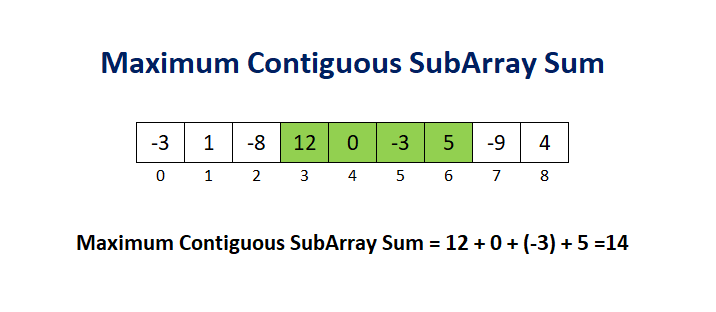
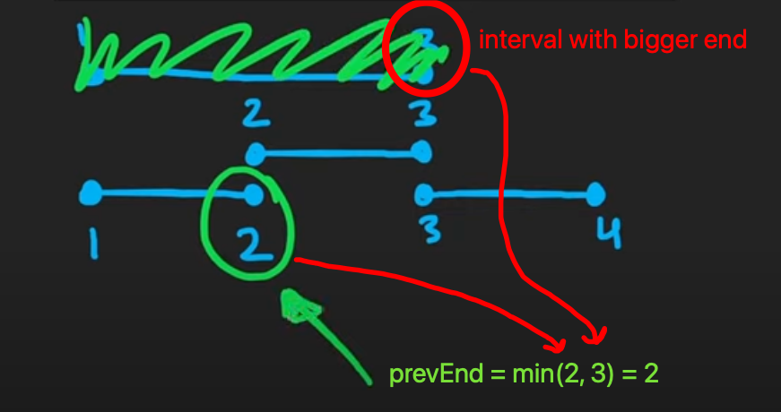

# INDEX

- [INDEX](#index)
  - [Iterating in reverse order](#iterating-in-reverse-order)
    - [Replace Elements with Greatest Element on Right Side](#replace-elements-with-greatest-element-on-right-side)
    - [Plus One](#plus-one)
  - [Array Permutation](#array-permutation)
    - [Build Array from Permutation](#build-array-from-permutation)
    - [Next Permutation](#next-permutation)
    - [Compute a random permutation](#compute-a-random-permutation)
    - [Shuffle an Array](#shuffle-an-array)
  - [Two pointers](#two-pointers)
    - [Two Sum II - Input Array Is Sorted](#two-sum-ii---input-array-is-sorted)
    - [3Sum (Triplet Sum to Zero)](#3sum-triplet-sum-to-zero)
    - [3Sum Closest](#3sum-closest)
    - [3Sum Smaller](#3sum-smaller)
    - [4Sum](#4sum)
    - [Minimum Absolute Difference](#minimum-absolute-difference)
    - [Remove Element](#remove-element)
    - [Remove Duplicates From Sorted Array](#remove-duplicates-from-sorted-array)
    - [Remove Duplicates from Sorted Array II](#remove-duplicates-from-sorted-array-ii)
    - [Container with most water](#container-with-most-water)
    - [Squares of a Sorted Array](#squares-of-a-sorted-array)
    - [Sort Array By Parity](#sort-array-by-parity)
    - [Rearrange Array Elements by Sign](#rearrange-array-elements-by-sign)
    - [Shortest Unsorted Continuous Subarray](#shortest-unsorted-continuous-subarray)
    - [Trapping Rain Water](#trapping-rain-water)
  - [Sliding Window](#sliding-window)
    - [Maximum Average Subarray I](#maximum-average-subarray-i)
    - [Minimum Size Subarray Sum](#minimum-size-subarray-sum)
    - [Longest Consecutive Equal Subarray](#longest-consecutive-equal-subarray)
    - [Longest Equal Subarray with at Most K Elements Removed](#longest-equal-subarray-with-at-most-k-elements-removed)
    - [Number of Sub-arrays of Size K and Average Greater than or Equal to Threshold](#number-of-sub-arrays-of-size-k-and-average-greater-than-or-equal-to-threshold)
    - [Fruit Into Baskets](#fruit-into-baskets)
    - [Longest Subarray of 1's After Deleting One Element](#longest-subarray-of-1s-after-deleting-one-element)
    - [Max Consecutive Ones III](#max-consecutive-ones-iii)
    - [Chunk Array](#chunk-array)
  - [Prefix / Prefix Sum](#prefix--prefix-sum)
    - [Range Sum Query - Immutable](#range-sum-query---immutable)
    - [Range Sum Query 2D - Immutable](#range-sum-query-2d---immutable)
    - [Product of Array Except Self](#product-of-array-except-self)
    - [Find Pivot Index](#find-pivot-index)
    - [Subarray Sum Equals K](#subarray-sum-equals-k)
  - [Kadane's Algorithm](#kadanes-algorithm)
    - [Maximum Subarray Sum](#maximum-subarray-sum)
    - [Maximum Subarray Range](#maximum-subarray-range)
    - [Maximum Sum Circular Subarray](#maximum-sum-circular-subarray)
    - [Longest Turbulent Subarray](#longest-turbulent-subarray)
  - [Fast and Slow Pointers](#fast-and-slow-pointers)
    - [Find the Duplicate Number](#find-the-duplicate-number)
  - [Merge Intervals Pattern](#merge-intervals-pattern)
    - [Merge Intervals](#merge-intervals)
    - [Insert Interval](#insert-interval)
    - [Interval List Intersections](#interval-list-intersections)
    - [Non-overlapping Intervals](#non-overlapping-intervals)
    - [Meeting Rooms](#meeting-rooms)
    - [Meeting Rooms II](#meeting-rooms-ii)
    - [Maximum CPU Load](#maximum-cpu-load)
    - [Single-Threaded CPU](#single-threaded-cpu)
    - [Employee Free Time](#employee-free-time)
  - [2D Array ( Matrix ) Problems](#2d-array--matrix--problems)
    - [Rotate Image](#rotate-image)
    - [Spiral Matrix](#spiral-matrix)
    - [Spiral Matrix II](#spiral-matrix-ii)
    - [Valid Tic-Tac-Toe State](#valid-tic-tac-toe-state)
    - [Pascal's Triangle](#pascals-triangle)
    - [Pascal's Triangle II](#pascals-triangle-ii)
    - [Valid Sudoku](#valid-sudoku)
    - [Robot Return to Origin](#robot-return-to-origin)
    - [Design Memory Allocator](#design-memory-allocator)

---

## Iterating in reverse order

### Replace Elements with Greatest Element on Right Side

| Video Solution                                                | Hint                                                                                                                                                                                              |
| ------------------------------------------------------------- | ------------------------------------------------------------------------------------------------------------------------------------------------------------------------------------------------- |
| [Video Solution](https://www.youtube.com/watch?v=ZHjKhUjcsaU) | The trick here, is to start from the right side (end) of the array and iterate in reverse order and keep track of the `rightMax` and update it every time by comparing it to the current element. |

Given an array `arr`, replace every element in that array with the greatest element among the elements to its right, and replace the last element with `-1`.

- Ex:

  - `arr = [17,18,5,4,6,1]` -> `[18,6,6,6,1,-1]`
  - Explanation:
    - index `0` --> The greatest element to the right of index `0` is index `1` -> `(18)`.
    - index `1` --> The greatest element to the right of index `1` is index `4` -> `(6)`.
    - index `2` --> The greatest element to the right of index `2` is index `4` -> `(6)`.
    - index `3` --> The greatest element to the right of index `3` is index `4` -> `(6)`.
    - index `4` --> The greatest element to the right of index `4` is index `5` -> `(1)`.
    - index `5` --> There are no elements to the right of index `5`, so we put `-1`.

- Explanation:
  - The brute force approach is to iterate over the array and for each element, find the maximum element to its right and replace it with that element. -> `O(n^2)`
    
  - Instead, we can loop through the array in reverse order and keep track of the maximum element we've seen so far.
    
- Time complexity: `O(n)`
- Space complexity: `O(1)` because we are modifying the array in-place

```py
def replaceElements(arr):
    # initialize the max element for the last element in the array
    rightMax = -1

    for i in range(len(arr) - 1, -1, -1):
        newMax = max(rightMax, arr[i]) # Important ⚠️: store the new max before updating the array
        arr[i] = rightMax
        rightMax = newMax

    return arr
```

---

### Plus One

| Video Solution                                                | Hint                                                                                                                                                                                                                                                         |
| ------------------------------------------------------------- | ------------------------------------------------------------------------------------------------------------------------------------------------------------------------------------------------------------------------------------------------------------ |
| [Video Solution](https://www.youtube.com/watch?v=jIaA8boiG1s) | Loop through the array **in reverse order** and check if the current digit is less than `9`, if it is, increment it by `1` and return the array, if not, set it to `0` and continue to the next digit -- Or just use remainder using the modulo `%` operator |

Given a **non-empty** array of decimal digits representing a non-negative integer, increment one to the integer.

The digits are stored such that the most significant digit is at the head of the list, and each element in the array contains a single digit.

You may assume the integer does not contain any leading zero, except the number 0 itself.

- Ex:

  - `digits = [1,2,3]` -> `[1,2,4]`
  - `digits = [1,2,9]` -> `[1,3,0]` because `129 + 1 = 130`
  - `digits = [0]` -> `[1]`

- Explanation:

  - Here, the case we want to handle is when the last digit is `9`, because if it's not `9`, we can just increment it by `1` and return the array
  - If the last digit is `9`, we need to set it to `0` and continue to the next digit
  - We also need to handle the case when all the digits are `9`, because if we reach this point, it means that all the digits are `9`, or the array is empty or has one digit, so we will run out of digits and we will need to add a `1` at the beginning of the array before returning it
    

- **Solution 1:** using basic math and early return

  ```py
  def plusOne(digits):
      for i in range(len(digits) - 1, -1, -1):
          # if the current digit is 9, set it to 0 and continue to the next digit
          if digits[i] == 9:
              digits[i] = 0
          # if the current digit is less than 9, increment it by 1 and return the array
          else:
              digits[i] += 1
              return digits

      # if we reach this point, it means that all the digits are 9, or arr is empty or has one digit so we need to add a 1 at the beginning of the array
      return [1] + digits
  ```

- **Solution 2:** using carry (remainder) variable (modulo operator `%` and integer division `//`)

  ```py
  def plusOne(digits):
      carry = 1
      for i in range(len(digits) - 1, -1, -1):
          digits[i] += carry
          carry = digits[i] // 10 # will be 0 if the digit is less than 10, otherwise it will be 1
          digits[i] %= 10

      if carry:
          digits = [1] + digits
      return digits
  ```

- Time complexity: `O(n)`
  - adding `1` to the beginning of the array is `O(n)` because we need to shift all the elements to the right -> `O(n + n) = O(2n) = O(n)`
- Space complexity: `O(1)` because we are modifying the array in-place
- Note for interview:
  - use these edge cases to test your code:
    - `[5]` -> `[6]` -> one digit less than `9`
    - `[9]` -> `[1, 0]` -> one digit equal to `9`
    - `[9, 9]` -> `[1, 0, 0]` -> all digits equal to `9`

---

## Array Permutation

A **Permutation** of an array of integers arranged such that `arr[i]` becomes `arr[arr[i]]` **(sequence or linear order)** with `O(1)` extra space.

### Build Array from Permutation

| Video Solution                                                | Hint                                                                                                                                                                                                                                                                |
| ------------------------------------------------------------- | ------------------------------------------------------------------------------------------------------------------------------------------------------------------------------------------------------------------------------------------------------------------- |
| [Video Solution](https://www.youtube.com/watch?v=1svjL7Docuo) | Iterate over the array and append the element at `nums[nums[i]]` to the result array, **OR** solve it without using extra space by storing both `nums[i]` and `nums[nums[i]]` in the same element. then loop again to extract `nums[nums[i]]` from the meta number. |

Given a **zero-based permutation** `nums` (0-indexed), build an array `ans` of the **same length** where `ans[i] = nums[nums[i]]` for each `0 <= i < nums.length` and return it.

A **zero-based permutation** `nums` is an array of **distinct** integers from `0` to `nums.length - 1` (inclusive).

- Ex:

  - `nums = [0,2,1,5,3,4]` -> `[0,1,2,4,5,3]`
  - Explanation: The array `ans` is built as follows:

    - `ans = [nums[nums[0]], nums[nums[1]], nums[nums[2]], nums[nums[3]], nums[nums[4]], nums[nums[5]]]`
    - `ans = [nums[0], nums[2], nums[1], nums[5], nums[3], nums[4]]`
    - `ans = [0,1,2,4,5,3]`

- **Solution 1:** using a extra result array (Brute force & Extra space)

  - Time complexity: `O(n)`
  - Space complexity: `O(n)`

  ```py
  def buildArray(nums):
      ans = []
      for i in range(len(nums)):
          ans.append(nums[nums[i]])
      return ans

      # Or using list comprehension
      # return [nums[nums[i]] for i in range(len(nums))]
  ```

- **Solution 2:** Without using extra space

  - In order to solve it without using extra space, have a reference to the old and new values of `nums[i]` in the same element. because we will need the old value of `nums[i]` to calculate the new value of `nums[i]`
    

    - It's done by using this formula: `num1 + (some_constant) * num2`

      - `num1` is the old value of `nums[i]`
      - `num2` is the new value of `nums[i]`
      - `some_constant` is a constant that is greater than the maximum value in the array
        - we use it because the new value of `nums[i]` is greater than the maximum value in the array, so we need to get the old value of `nums[i]` by using the modulo operator `%`

  - After we have the reference to the old and new values of `nums[i]` in the same element, we need to recover the data, we can iterate over the array again and divide each element by `some_constant` to get the new value of `nums[i]`
    
  - So:
    - to get old value of `nums[i]` -> `nums[i] % some_constant`
    - to get new value of `nums[i]` -> `nums[i] // some_constant`
  - EX:

    ```py
    num1 = 8
    num2 = 4
    constant = 10

    # meta number that stores both num1 and num2
    meta = num1 + constant * num2 # 48
    # get num1
    num1 = meta % constant # 48 % 10 = 8
    # get num2
    num2 = meta // constant # 48 // 10 = 4
    ```

  - Here:

    - We can use the length of the array `n` as the `constant`
    - `num1` is the old value of `nums[i]`
    - `num2` is the new value of `nums[i]` (the value we want to get)

  - Time complexity: `O(n)`
  - Space complexity: `O(1)`

  ```py
  def buildArray(nums):
      CONST = len(nums)
      # 1. Store both num1 and num2 in the same element
      for i in range(len(nums)):
          a = nums[i]
          b = nums[a] % CONST # get old value of nums[i] permuted
          nums[i] = a + CONST * b
      # 2. Extract num2 from the meta number
      for i in range(len(nums)):
          nums[i] //= CONST
      return nums
  ```

---

### Next Permutation

| Video Solution                                                | Hint                                                                                                                                                                                                                                                                                                                                                                     |
| ------------------------------------------------------------- | ------------------------------------------------------------------------------------------------------------------------------------------------------------------------------------------------------------------------------------------------------------------------------------------------------------------------------------------------------------------------ |
| [Video Solution](https://www.youtube.com/watch?v=quAS1iydq7U) | The idea is to start from the **rightmost side** of the array and find the longest decreasing subarray. Then get the `pivot` element which is the element to the left of the subarray. Then find the rightmost successor of the `pivot` element in the subarray and swap it with the `pivot` element. Finally, reverse the subarray to the right of the swapped element. |

A **permutation** is a rearrangement of the elements of an array. For example, `[2, 1, 3]` is a permutation of `[1, 2, 3]`.

The **next permutation** of an array arr is defined as the **lexicographically next** greater permutation of arr. If arr is the **lexicographically largest** permutation, then the next permutation is the **lexicographically smallest** permutation.

Given an integer array `nums`, return the **next permutation** of `nums`.

The replacement must be **in place** and use only constant extra memory.

- Ex:

  - `nums = [1,2,3]` -> `[1,3,2]`
  - `nums = [3,2,1]` -> `[1,2,3]`
  - `nums = [1]` -> `[1]`

- Explanation

  - First, let's remember how permutations are generated. The idea is to start from the rightmost side of the array and find the longest decreasing subarray. This is because the rightmost side is the least significant digit, and we want to increase the permutation by as little as possible.
    
    - From the image above, we notice that usually the order of the permutations generated is relevant to the input elements order
      - `A` comes before `B` in the input array, so `A` comes before `B` in the first 2 permutations, then `B` comes before `A` in the next 2 permutations, and so on...
  - One approach is to generate all permutations and find the given permutation and return the next permutation. However, this approach is not efficient because it generates all permutations in **Factorial time `O(n!)`** and finding the given permutation takes another `O(n)` ❌

  - Instead, We can find the next permutation by rearranging the existing values. By understanding how permutations are generated, we can start from the **rightmost side** of the array and find the longest decreasing subarray. This is because the rightmost side is the least significant digit, and we want to increase the permutation by as little as possible. ✅
    
    - Find the longest decreasing subarray.
    - Swap the element to the left of the subarray with the next largest element in the subarray. because it's the next permutation, so we need to increase it by as little as possible.
    - Reverse the subarray to the right of the swapped element. because we want to be in the first permutation starting from the element that we've swapped. Which means the elements next to it should be in the smallest order possible.
    - The [Video Solution](https://www.youtube.com/watch?v=quAS1iydq7U) explains it very good, so make sure to watch it.

- Time complexity: `O(n)`
- Space complexity: `O(1)`

```py
def nextPermutation(nums):
    # find the longest decreasing subarray
    i = len(nums) - 1
    while i > 0 and nums[i] <= nums[i - 1]:
        i -= 1
    # now i points to the head of the suffix

    # if we found a decreasing subarray, then we need to rearrange the numbers to the right of nums[i−1] including itself
    if i > 0:
        j = len(nums) - 1
        # find the next largest element in the right subarray
        while j >= i and nums[j] <= nums[i - 1]:
            j -= 1
        # swap the next largest element with the pivot element
        nums[i - 1], nums[j] = nums[j], nums[i - 1]

    # reverse the numbers to the right of nums[i−1] including itself
    nums[i:] = reversed(nums[i:])
```

---

### Compute a random permutation

| Video Solution | Hint                                                                                                                                                                                                         |
| -------------- | ------------------------------------------------------------------------------------------------------------------------------------------------------------------------------------------------------------ |
| NA             | Use the **Fisher-Yates shuffle** algorithm to generate a random permutation in `O(n)` time and `O(1)` space. The idea is to iterate over the array and swap each element with a random element to its right. |

Given an integer `n`, return a random permutation of `[0, 1, ..., n - 1]`.

- Ex:

  - `n = 3` -> `[1, 0, 2]` or `[2, 1, 0]` or `[0, 2, 1]`

- Explanation:
  - Generating random permutation is not as straightforward as it seems. The naive approach is to generate a random number and check if it is already in the permutation. If it is, then we discard it and generate another random number.
    - We can use a `hash table` to check if a number is already in the permutation. However, this approach is not efficient because it can take a long time to generate a random permutation.
  - A better approach is to use the **Fisher-Yates shuffle** algorithm. The idea is to iterate over the array and swap each element with a random element to its right. This algorithm is efficient because it generates a random permutation in `O(n)` time and `O(1)` space.
  - The algorithm works as follows:
    - Iterate over the array from left to right.
    - For each element, generate a random number between the current index and the last index.
    - Swap the current element with the element at the random index.

```py
import random

def computeRandomPermutation(n):
    permutation = list(range(n)) # [0, 1, ..., n - 1]
    for i in range(n):
        # generate a random index between i and n - 1
        rand = random.randint(i, n - 1)
        # swap the current element with the element at the random index
        permutation[i], permutation[rand] = permutation[rand], permutation[i]
    return permutation
```

---

### Shuffle an Array

| Video Solution | Hint                                                                                                                                                                                                                                                                                                                         |
| -------------- | ---------------------------------------------------------------------------------------------------------------------------------------------------------------------------------------------------------------------------------------------------------------------------------------------------------------------------- |
| NA             | Create `original` property as a copy to the array to avoid modifying it, then use **Fisher-Yates shuffle** algorithm to generate a random permutation. The idea is to iterate over the array and swap each element with a random element between the current index and the last index using the `random.randrange()` method. |

Given an integer array `nums`, design an algorithm to randomly shuffle the array. All permutations of the array should be **equally likely** as a result of the shuffling.

- Implement the `Solution` class:

  - `Solution(int[] nums)` Initializes the object with the integer array nums.
  - `int[] reset()` Resets the array to its original configuration and returns it.
  - `int[] shuffle()` Returns a random shuffling of the array.

- Ex:

  - Input: `["Solution", "shuffle", "reset", "shuffle"] [[1, 2, 3], [], [], []]`
  - Output: `[null, [3, 1, 2], [1, 2, 3], [1, 3, 2]]`

- Explanation:
  - Similar to the [Compute a random permutation](#compute-a-random-permutation) problem, we can use the **Fisher-Yates shuffle** algorithm to shuffle the array.
  - First, we need to create a copy of the array to avoid modifying it, so that we can have a backup of the original array to reset it later.
  - Then, we can use the **Fisher-Yates shuffle** algorithm to generate a random permutation.
    
    - The idea is to iterate over the array and swap each element with a random element using the `random.randrange()` method.
    - the random element should be between the current index and the last index. because we don't want to swap the current element with itself or with an element that we've already swapped.
  - Time complexity: `O(n)`
  - Space complexity: `O(n)` for the copy of the array

```py
import random

class Solution:
    def __init__(self, nums):
        self.data = nums
        self.original = nums.copy() # make a copy of the original array to avoid modifying it

    def reset(self):
        self.data = self.original.copy()
        return self.data

    def shuffle(self):
        for i in range(len(self.data)):
            rand = random.randrange(i, len(self.data))
            self.data[i], self.data[rand] = self.data[rand], self.data[i]
        return self.data
```

---

## Two pointers

### Two Sum II - Input Array Is Sorted

| Video Solution                                                | Hint                                                                                                                                                                                                                      |
| ------------------------------------------------------------- | ------------------------------------------------------------------------------------------------------------------------------------------------------------------------------------------------------------------------- |
| [Video Solution](https://www.youtube.com/watch?v=cQ1Oz4ckceM) | Use **two pointers** to find the two numbers that sum to the target (making use of the fact that the array is sorted in ascending order), and return their indices (add `1` to each index since the problem is 1-indexed) |

Given a 1-indexed array of integers numbers that is already sorted in non-decreasing order, find two numbers such that they add up to a specific target number. Let these two numbers be `numbers[index1]` and `numbers[index2]` where `1 <= index1 < index2 <= numbers.length`.

Return the indices of the two numbers, `index1` and `index2`, **added by one** as an integer array `[index1, index2]` of length `2`.

- EX: `nums = [2, 7, 11, 15], target = 9` --> `[0, 1]` because `nums[0] + nums[1] == 9`

- Explanation:
  - We can use the same approach as the [Two Sum](./9-PS-Hash-maps.md#two-sum) problem, but instead of using a `hash table`, we can use the fact that the array is sorted in ascending order and use **two pointers** to find the two numbers that sum to the target in `O(n)` time and `O(1)` space.
    
    - We can set the `left` pointer to the first element in the array and the `right` pointer to the last element in the array
  - Check if the `sum` of the two pointers is equal to the `target`, if it is, then return the indices
    - If the `sum` is less than the `target`, then we need to move the `left` pointer to the right to get a larger value
    - If the `sum` is greater than the `target`, then we need to move the `right` pointer to the left to get a smaller value
  - if the target was not found, return `[-1, -1]` **Must ask the interviewer if the target will always be found**

```py
def two_sum(numbers, target):
    # Set the left and right pointers
    left = 0
    right = len(numbers) - 1

    while left < right:
        curSum = numbers[left] + numbers[right]

        if curSum < target:
            left += 1
        elif curSum > target:
            right -= 1
        else:
            return [left + 1, right + 1] # return the indices adding 1 to each since the problem is 1-indexed
    # If the target was not found, return [-1, -1]
    return [-1, -1]
```

---

### 3Sum (Triplet Sum to Zero)

| Video Solution                                                | Hint                                                                                                                                                                                                                                                                                                                           |
| ------------------------------------------------------------- | ------------------------------------------------------------------------------------------------------------------------------------------------------------------------------------------------------------------------------------------------------------------------------------------------------------------------------ |
| [Video Solution](https://www.youtube.com/watch?v=jzZsG8n2R9A) | First, sort the array then, loop through the array and for each element, use **two pointers** to find the 2 other elements that sum to `zero`, and add them to the result array. **Make sure to skip duplicates** by checking if the current element is the same as the previous element. and also when updating the pointers. |

Given an array `nums` of n integers, are there elements a, b, c in `nums` such that a + b + c = 0? Find all unique triplets in the array which gives the sum of zero.

- EX: `nums = [-1, 0, 1, 2, -1, -4]` --> `[[-1, 0, 1], [-1, -1, 2]]`
- Explanation:

  - Bruteforce solution: `O(n^3)`

    - Iterate over all possible triplets of elements in the array and check if the sum is equal to zero and that the triplet is not already in the result array.

  - We can do better by using the **Three pointers**
    
    - Sort the input array first. Use two pointers to find the third element that sums to `zero`, instead of iterating over all possible pairs of elements.
      
  - When we find a triplet, Make sure when updating the pointers to **skip over duplicates** in the input array and avoid identical pairs of `(i, j, k)` values.

    ```py
    while l < r:
      # ...
      l += 1
      r -= 1
      while left < right and nums[left] == nums[left-1]:
          left += 1
      while left < right and nums[right] == nums[right+1]:
          right -= 1
    ```

  - **Avoid generating duplicate triplets** by skipping over duplicates in the input array and avoiding identical pairs of `(i, j, k)` values.

    ```py
    if i > 0 and nums[i] == nums[i-1]: continue
    ```

    - or we can use a `set` to avoid duplicates, but this will increase the space complexity to `O(n)` ❌

      ```py
      result = set()
      # ...
      return list(result)
      ```

  - Time complexity: `O(n.log(n)) + O(n^2) =~ O(n^2)`
    - `O(n.log(n))` for the sorting algorithm
    - `O(n^2)` for the two nested loops
  - Space complexity: `O(1)`
    - `O(1)` if we don't take into account the space required for the output array
    - it may be `O(n)` for the output array or based on the sorting algorithm used (as some sorting algorithms are in-place and some are not)

```py
# Time: O(n.log(n)) + O(n^2) = O(n^2)
def three_sum(nums):
    result = []
    nums.sort()

    for i in range(len(nums)):
        # if the current value is the same as the previous value, skip it, because we've already tried it (To avoid duplicates)
        if i > 0 and nums[i] == nums[i-1]: continue
        # set left and right pointers to find the other two values
        left, right = i+1, len(nums)-1

        while left < right:
            total = nums[i] + nums[left] + nums[right]
            # if the sum is less than zero, move the left pointer to the right to get a larger value
            if total < 0:
                left += 1
            # if the sum is greater than zero, move the right pointer to the left to get a smaller value
            elif total > 0:
                right -= 1
            # otherwise, we have found the triplet
            else:
                result.append([nums[i], nums[left], nums[right]])
                # move both pointers to the middle to see if we have more triplets
                left += 1
                right -= 1
                # skip duplicates
                while left < right and nums[left] == nums[left-1]:
                    left += 1
                while left < right and nums[right] == nums[right+1]:
                    right -= 1
    return result
```

---

### 3Sum Closest

| Video Solution                                                | Hint                                                                                                                                                                                                                                                                                                                 |
| ------------------------------------------------------------- | -------------------------------------------------------------------------------------------------------------------------------------------------------------------------------------------------------------------------------------------------------------------------------------------------------------------- |
| [Video Solution](https://www.youtube.com/watch?v=jEXPzp_Tfvs) | First, sort the array then, loop through the array and for each element, use **two pointers** to find the 2 other elements that sum to the `target`, keep track of the `minDiff` value to the `target` and update it and the `res` value if we find a closer value by using `abs()` when calculating the difference. |

Given an array `nums` of `n` integers and an integer `target`, find three integers in `nums` such that the sum is **closest** to `target`. Return the sum of the three integers.

You may assume that each input would have exactly one solution.

- EX: `nums = [-1, 2, 1, -4], target = 1` --> `2` because `(-1 + 2 + 1) = 2`

- Explanation:

  - it's very similar to the [3Sum](#3sum-triplet-sum-to-zero) problem, but instead of checking if the `sum` is equal to `zero`, we check if the `sum` is equal to the `target`
  - also, we need to keep track of the `closest` value to the `target` and update it if we find a closer value

    - to do that, we need to keep track of the `minDiff` value to the `target` and update it if we find a closer value that its difference to the `target` is less than the `minDiff` value
    - here, we need to calculate the **absolute value** of the difference between the `sum` and the `target` because if the difference is negative, then we need to make it positive to compare it with the `minDiff` value

      ```py
      diff = abs(total - target) # without abs(), the diff will be negative -> won't work
      ```

  - Time complexity: `O(n.log(n)) + O(n^2) ~= O(n^2)`
  - Space complexity: `O(1)`
    - `O(1)` if we don't take into account the space required for the output array
    - it may be `O(n)` for the output array or based on the sorting algorithm used (as some sorting algorithms are in-place and some are not)

```py
def three_sum_closest(nums, target):
    res = 0
    minDiff = float('inf')
    nums.sort()

    for i in range(len(nums)):
        left, right = i+1, len(nums)-1
        while left < right:
            total = nums[i] + nums[left] + nums[right]
            diff = abs(total - target)
            if total == target:
                return total
            elif total < target:
                left += 1
            else:
                right -= 1

            # update the values
            if diff < minDiff:
                minDiff = diff
                res = total
    return res
```

---

### 3Sum Smaller

| Video Solution                                                | Hint                                                                                                                                                                                                                                                                                                                                                                                     |
| ------------------------------------------------------------- | ---------------------------------------------------------------------------------------------------------------------------------------------------------------------------------------------------------------------------------------------------------------------------------------------------------------------------------------------------------------------------------------- |
| [Video Solution](https://www.youtube.com/watch?v=Px0nLMRebfU) | First, sort the array then, loop through the array and for each element, use **two pointers** to find the 2 other elements that sum to a `total` that is less than the `target`, keep track of the `count` of the triplets that satisfy the condition and update it by adding `right - left` to it (as it's the number of triplets that satisfy the condition in the current iteration). |

Given an array `nums` of `n` integers and an integer `target`, find the number of index triplets `i`, `j`, `k` with `0 <= i < j < k < n` that satisfy the condition `nums[i] + nums[j] + nums[k] < target`.

- EX: `nums = [-2, 0, 1, 3], target = 2` --> `2`

  - because `(-2 + 0 + 1) < 2` and `(-2 + 0 + 3) < 2`

- Explanation:

  - it's very similar to the [3Sum](#3sum-triplet-sum-to-zero) problem, but instead of checking if the `sum` is equal to `zero`, we check if the `sum` is less than the `target`
  - also, we need to keep track of the `count` of the triplets that satisfy the condition

    - if the `total` is less than the `target`, then we need to move the `left` pointer to the right to get a larger value, but if we increment it by `1`, we will miss some values that satisfy the condition (between `left` and `right`). so we need to increment it by `right - left` to get all the values that satisfy the condition
    - **Trick here:** -> `right - left` is the number of triplets that satisfy the condition, because by common scene, we want the total to stay lower than the target, and we know that `left` is larger than all the values to the left of it, so all the values between `left` and `right` will satisfy the condition.

      ```py
      # [-2, 0, 1, 3], target = 2

      # [-2, 0, 1, 3]
      #   ^  ^     ^
      #   i  l     r
      #      <----->
      #     right - left = 3 - 1 = 2 -> The number of triplets that satisfy the condition
      ```

      - It's like moving the `right` pointer to the left to get an even smaller value

    - we can add it to the `count` and move the `left` pointer to the right to get a larger value

- Time complexity: `O(n log(n)) + O(n^2) ~= O(n^2)`
- Space complexity: `O(1)`

```py
def three_sum_smaller(nums, target):
    nums.sort()
    count = 0

    for i in range(len(nums)):
        l, r = i+1, len(nums)-1
        while l < r:
            total = nums[i] + nums[l] + nums[r]
            if total < target:
                count += r - l
                l += 1
            else:
                r -= 1
    return count
```

---

### 4Sum

| Video Solution                                                | Hint                                                                                                                                                                                                                                                                     |
| ------------------------------------------------------------- | ------------------------------------------------------------------------------------------------------------------------------------------------------------------------------------------------------------------------------------------------------------------------ |
| [Video Solution](https://www.youtube.com/watch?v=EYeR-_1NRlQ) | Sort the array then, loop through the array and use **three pointers** to find the fourth element that sums to `target`, instead of iterating over all possible pairs of elements. Avoid generating duplicate quadruplets by skipping over duplicates in the input array |

Given an array `nums` of `n` integers, return an array of all the **unique** quadruplets `[nums[a], nums[b], nums[c], nums[d]]` such that:

- `0 <= a, b, c, d < n`
- `a`, `b`, `c`, and `d` are **distinct**.
- `nums[a] + nums[b] + nums[c] + nums[d] == target`

You may return the answer in **any order**.

- EX: `nums = [1, 0, -1, 0, -2, 2], target = 0` --> `[[-2, -1, 1, 2], [-2, 0, 0, 2], [-1, 0, 0, 1]]`

- Explanation:

  - It's similar to the [3Sum](#3sum-triplet-sum-to-zero) problem, but with extra loop
  - Sort the array
  - Loop through the array
    - Avoid duplicates by skipping over duplicates in the input array
    - Move the left and right pointers to the next unique values to avoid duplicates

- Solution 1: using 4 pointers

  - Time complexity: `O(n log(n)) + O(n^3) ~= O(n^3)`
  - Space complexity: `O(1)`

  ```py
  def four_sum(nums, target):
      nums.sort()
      result = []

      for i in range(len(nums) - 3): # because we have 4 pointers
          # if the current value is the same as the previous value, skip it, because we've already tried it (To avoid duplicates)
      # OR: for i in range(len(nums)): ✅
          if i > 0 and nums[i] == nums[i-1]: continue

          for j in range(i+1, len(nums) - 2): # because we have 3 pointers
          # OR: for j in range(i+1, len(nums)): ✅
              if j > i+1 and nums[j] == nums[j-1]: continue

              # set left and right pointers to find the other two values
              left, right = j+1, len(nums)-1
              while left < right:
                  total = nums[i] + nums[j] + nums[left] + nums[right]
                  if total < target:
                      left += 1
                  elif total > target:
                      right -= 1
                  # otherwise, we have found the quadruplet
                  else:
                      result.append([nums[i], nums[j], nums[left], nums[right]])
                      left += 1
                      right -= 1
                      # skip duplicates
                      while left < right and nums[left] == nums[left-1]: left += 1
                      while left < right and nums[right] == nums[right+1]: right -= 1
      return result
  ```

- Solution 2: for any `N SUM` problem (recursion)

  - Here, we can use recursion to solve any `N SUM` problem by using the **Two Sum** problem as a base case (where `N = 2`)
  - until we reach the base case, we can use recursion to solve the problem by reducing it to a smaller problem and calling the function again with:
    - `n - 1` -> to reduce the number of elements to `n - 1`
    - `start + 1` -> to reduce the number of elements to the right of the current element
    - `target - nums[i]` -> to reduce the target by the current element
  - When we finish the recursion, we can add the current element to the result array and return it

- Time complexity: `O(n log(n)) + O(n^(n-1)) ~= O(n^n)`
- Space complexity: `O(n)` for the recursion stack

  ```py
  def fourSum(nums, target):
      nums.sort()
      res, quadruplets = [], []

      def nSum(n, start, target):
          # Recursion base case -> Two Sum
          if n == 2:
              l, r = start, len(nums) - 1
              while l < r:
                  total = nums[l] + nums[r]
                  if total < target:
                      l += 1
                  elif total > target:
                      r -= 1
                  else:
                      quadruplets.append([nums[l], nums[r]])
                      l += 1
                      r -= 1
                      while l < r and nums[l] == nums[l-1]: l += 1
                      while l < r and nums[r] == nums[r+1]: r -= 1
          else:
              for i in range(start, len(nums) - n + 1):
                  if i > start and nums[i] == nums[i-1]: continue
                  nSum(n-1, i+1, target - nums[i])
                  for quad in quadruplets:
                      res.append([nums[i]] + quad)
                  quadruplets.clear()

      nSum(4, 0, target) # n = 4
      return res
  ```

---

### Minimum Absolute Difference

| Video Solution                                                | Hint                                                                                                                                                                                                                                   |
| ------------------------------------------------------------- | -------------------------------------------------------------------------------------------------------------------------------------------------------------------------------------------------------------------------------------- |
| [Video Solution](https://www.youtube.com/watch?v=fa3sjQ0XBzM) | Sort the array first, then iterate over the array using a `window` of size `2` to check the absolute difference between the two adjacent elements. Keep track of the minimum difference and update it if we find a smaller difference. |

Given an array of distinct integers `arr`, find all pairs of elements with the minimum absolute difference of any two elements. Return a list of pairs in ascending order(with respect to pairs), each pair `[a, b]` follows

- `a, b` are from `arr`
- `a < b`
- `b - a` equals to the minimum absolute difference of any two elements in `arr`

- Ex:

  - `arr = [4, 2, 1, 3], --> [[1, 2], [2, 3], [3, 4]]`

- Explanation:
  - Instead of using nested loops `O(n^2)`, we can sort the array first `O(n.log(n))` and then iterate over the array and keep track of the minimum difference between two adjacent elements.
  - We will use a `window` of size `2` to iterate over the array and check the absolute difference between the two elements
    - This is because **the minimum difference will be between two adjacent elements in the sorted array -> (closest elements are next to each other)**
  - if you find a smaller difference, update the minimum difference and start over in the `result` array
  - if you find the same difference, add the pair to the `result` array
- Time complexity: `O(n.log(n)) + O(n) = O(n.log(n))`
- Space complexity: `O(1)`

```py
# Using 2 pointers O(n.log(n)) + O(n) = O(n.log(n))
def minimumAbsDifference(arr):
    arr.sort()
    minDiff = float('inf')
    res = []

    for i in range(1, len(arr)):
        diff = abs(arr[i] - arr[i - 1])
        if diff < minDiff:
            minDiff = diff
            res = [[arr[i - 1], arr[i]]] # start over
        elif diff == minDiff:
            res.append([arr[i - 1], arr[i]]) # add to the result

    return res
```

---

### Remove Element

| Video Solution                                                | Hint                                                                                                                                                                    |
| ------------------------------------------------------------- | ----------------------------------------------------------------------------------------------------------------------------------------------------------------------- |
| [Video Solution](https://www.youtube.com/watch?v=Pcd1ii9P9ZI) | Remove **in-place** by using pointers, and swapping elements with the last valid element and updating the last valid index if the current element is not equal to `val` |

Given an array `nums` and a value `val`, remove all instances of that value **in-place** and return the new length.

- Ex:

  - `nums = [3,2,2,3], val = 3` -> `2` (`nums = [2,2]`)

- Explanation:
  - we can use a **two pointers** pattern to check for all the elements in the array
    
  - we can use the first pointer (`lastIndex`) to keep track of the index of the last non-`val` element in the array
  - and the second pointer to iterate over the array and check if the current element is equal to `val`
    - if it is, then we skip it, if not, then we swap the current element with the last val element and increment the `lastIndex` **and then** update the `lastIndex`
      > it's similar to `Quick Sort` algorithm, where we partition the array into two parts, one part with all the elements less than the `pivot` and the other part with all the elements greater than the pivot
- Time complexity: `O(n)`
- Space complexity: `O(1)`

```py
# Solution 1: just returning the length of elements that are not equal to val
def removeElement(nums, val):
    length = 0
    for num in nums:
        if num != val:
            length += 1
    return length

# ------------------------------------------------------------

# Solution 2: using two pointers to swap elements and return the mutated array (Not required for this problem)
def removeElement(nums, val):
    lastIndex = 0
    for i in range(len(nums)):
        if nums[i] != val:
            # Swap the current element with the last valid element
            nums[lastIndex], nums[i] = nums[i], nums[lastIndex]
            lastIndex += 1
    return nums
```

---

### Remove Duplicates From Sorted Array

| Video Solution                                                | Hint                                                                                        |
| ------------------------------------------------------------- | ------------------------------------------------------------------------------------------- |
| [Video Solution](https://www.youtube.com/watch?v=DEJAZBq0FDA) | Remove **in-place** by using 2 pointers, and swapping elements with the last unique element |

Given a sorted array `nums`, remove the duplicates **in-place** such that each element appears only once and returns the new length.

You must use `O(1)` space.

- Ex:

  - `nums = [1,1,2]` -> `2` -> `(nums = [1,2,_])`
  - `nums = [0,0,1,1,1,2,2,3,3,4]` -> `5` -> `(nums = [0,1,2,3,4,_,_,_,_,_])`
    

- Explanation:

  - One brute force solution is to iterate over the array and check if the current element is equal to the next element, if it is, then we remove it from the array and shift the elements to the left

    - but this solution is not efficient because we have to shift the elements to the left every time we remove an element: `(n-1)+(n-2)+...+1 = O(n^2)`

  - we can use a **two pointers** pattern to check for all the elements in the array an just swap the elements that are not unique without shifting the elements to the left
    
    - we can use the first pointer to keep track of the `last unique element` in the array
    - and the second pointer to iterate over the array and check if the current element is equal to the `last unique element`
    - if it is, then we skip it, if not, then we increment the last unique index **and then** update the `last unique element`

- Time complexity: `O(n)`
- Space complexity: `O(1)`

```py
# Approach 1: compare the current element with the last unique element
def removeDuplicates(nums):
    if len(nums) == 0: return 0

    # initialize the index of the last unique element
    last_unique = 0

    for i in range(1, len(nums)):
        # if the current element is not equal to the last unique element, increment the last unique index and then update the last unique element
        if nums[i] != nums[last_unique]:
            last_unique += 1
            nums[last_unique] = nums[i]

    return last_unique + 1 # return the length of the unique elements because the problem requires the length of the unique elements

# ------------------------------------------------------------

# Approach 2: using a window of size 2 and comparing the current element with the previous element
def removeDuplicates(nums):
    if len(nums) == 0: return 0
    lastIdx = 1

    for i in range(1, len(nums)):
        if nums[i] != nums[i-1]:
            nums[lastIdx] = nums[i]
            lastIdx += 1
    return lastIdx
```

---

### Remove Duplicates from Sorted Array II

| Video Solution                                                | Hint                                                                                                                                                                                                                                              |
| ------------------------------------------------------------- | ------------------------------------------------------------------------------------------------------------------------------------------------------------------------------------------------------------------------------------------------- |
| [Video Solution](https://www.youtube.com/watch?v=ycAq8iqh0TI) | Use 2 pointers to keep track of the last unique element and the `count` of the duplicates of the current element, If the count is less than or equal to `2`, then we swap it with the `last_unique` element and increment the `last_unique` index |

Given a sorted array `nums`, remove the duplicates **in-place** such that duplicates appeared at most **twice** and return the new length.

return the new length.

- Ex:

  - `nums = [1,1,1,2,2,3]` -> `5` -> `(nums = [1,1,2,2,3,_,_])`

- Explanation:

  - The brute-force solution is to iterate over the array and check if the current element is equal to the next element and that the current count of the element is less than or equal to `2`, if it is, then we remove it from the array and shift the elements to the left
    - but this solution is not efficient because we have to shift the elements to the left every time we remove an element: `(n-1)+(n-2)+...+1 = O(n^2)`
  - And, We can't use the same approach as the [Remove Duplicates From Sorted Array](#remove-duplicates-from-sorted-array) problem because we will end up with more than two duplicates even if we check if the current element is equal to the `last unique element`

    ```py
    # Won't work ❌❌❌
    if nums[i] == nums[last_unique] and i - last_unique < 2:
        continue
    else:
        last_unique += 1
        nums[last_unique] = nums[i]
    ```

  - **Instead**, we can use the first pointer to keep track of:
    - first pointer -> the index of the `last unique` element in the array
    - the second pointer to iterate over the array and check if the current element is equal to the last unique element
    - `count` variable -> the number of times the current element appeared in the array (it will be `1` at the beginning and will be incremented if the current element is equal to the last unique element and reset to `1` if it's not)
  - Because the array is sorted, the duplicates will be next to each other, so we can check the `count` of the current element and decide whether to increment the `last unique` index or not
    - if the `count` is less than or equal to `2`, then we increment the `last unique` index **and then** update the `last unique` element
      
    - if the `count` is greater than `2`, then we skip the current element
      
      
      

- Time complexity: `O(n)`
- Space complexity: `O(1)`

```py
def removeDuplicates(nums):
    l, r = 0, 0
    while r < len(nums):
        count = 1  # count of the current element
        while r + 1 < len(nums) and nums[r] == nums[r+1]:
            count += 1
            r += 1
        for _ in range(min(2, count)): # min(2, count) -> because we want to keep at most 2 duplicates
            # swap the current element with the last unique element and increment the last unique index
            nums[l] = nums[r]
            l += 1
        r += 1
    return l

# ------------------------------------------------------------

# Another approach without using count variable
def removeDuplicates(nums):
    l = 0
    for r in range(len(nums)):
        if l < 2 or nums[r] != nums[l-2]:
            nums[l] = nums[r]
            l += 1
    return l
```

---

### Container with most water

| Video Solution                                                | Hint                                                                                                                                                                                                                          |
| ------------------------------------------------------------- | ----------------------------------------------------------------------------------------------------------------------------------------------------------------------------------------------------------------------------- |
| [Video Solution](https://www.youtube.com/watch?v=UuiTKBwPgAo) | Use **two pointers** to find the two lines that form the container area, and move the pointer pointing to the shorter line towards the other end by one step, calculating the area at each step and updating the maximum area |

Given n non-negative integers `a1`, `a2`, ..., `an` , where each represents a point at coordinate `(i, ai)`. `n` vertical lines are drawn such that the two endpoints of the line `i` is at `(i, ai)` and `(i, 0)`. Find two lines, which, together with the x-axis forms a container, such that the container contains the most water.

- EX: height =`[1, 8, 6, 2, 9, 4]`-->`24`
  

- Verify the constraints:

  - Does the thickness of the lines matter? -> No
  - Do the left and right sides of the container form a wall? -> No
  - Does a higher line inside the container affect the area, breaking it into 2 parts? -> No
    

- Explanation:

  - Bruteforce solution is to iterate over all possible pairs of lines and find the maximum area out of those -> `O(n^2)` ❌

  - Instead, Initialize **two pointers**, one at the beginning and one at the end of the array constituting the length of the lines.
  - At every step, find out the area formed between them
    - width = `right_index - left_index`
    - height = `min(height[left], height[right])`
  - update the result and move the pointer pointing to the shorter line towards the other end by one step.
    
    - we choose which pointer to move by comparing the heights of the two lines and moving the pointer pointing to the shorter line towards the other end by one step, so that we may get a relatively higher line next time and possibly will be able to hold more water.

- Time complexity: `O(n)`
- Space complexity: `O(1)`

```py
def max_area(height):
    max_area = 0
    # Two pointers at the beginning and the end of the array
    left, right = 0, len(height) - 1

    while left < right:
        # The width is the distance between them, and the height is the lower line.
        area = (right - left) * min(height[left], height[right])
        # Update max_area if we have a new maximum
        max_area = max(max_area, area)
        # Move the left and right pointers, depending on which line is shorter
        if height[left] < height[right]: left += 1
        else: right -= 1
    return max_area
```

---

### Squares of a Sorted Array

| Video Solution                                                | Hint                                                                                                                                                                                                                                                                                                 |
| ------------------------------------------------------------- | ---------------------------------------------------------------------------------------------------------------------------------------------------------------------------------------------------------------------------------------------------------------------------------------------------- |
| [Video Solution](https://www.youtube.com/watch?v=FPCZsG_AkUg) | Use **two pointers** to find the largest element, compare the absolute values of the two pointers elements (starting at both ends of the array) and square the largest element and add it to the result array using the index of the responding pointer (from the end of the array to the beginning) |

Given an integer array `nums` sorted in **non-decreasing** order, return an array of **the squares of each number sorted in non-decreasing order**.

- EX: `[-4,-1,0,3,10] --> [0,1,9,16,100]`

- Explanation:

  - Brute-force: We can solve it by squaring each element and then sorting the array -> `O(nlogn)` ❌
  - But we can make use of the fact that the array is sorted in **non-decreasing** order and solve it in `O(n)` time
    
    - This is done by using 2 pointers, one at the start of the array and one at the end of the array
    - **Since the numbers at both the ends can give us the largest square**, an alternate approach could be to use two pointers starting at both the ends of the input array. At any step, whichever pointer gives us the bigger square we add it to the result array and move to the next/previous number according to the pointer.
      - this is because the array is sorted in **non-decreasing** order so we can get the largest element by comparing the `absolute` values of the 2 pointers (both sides)
    - we can then square the largest element and add it to the result array using the index of the responding pointer

- Time complexity: `O(n)`
- Space complexity: `O(n)`
  - if we don't take into account the space required for the output array -> `O(1)`

```py
def sortedSquares(nums):
    l, r = 0, len(nums) - 1
    result = [0] * len(nums)

    # iterate over the array in reverse order
    for i in range(len(nums) - 1, -1, -1):
        left_abs, right_abs = abs(nums[l]), abs(nums[r])
        # check if the left absolute value is greater than the right absolute value and change the result array accordingly
        if left_abs > right_abs:
            result[i] = left_abs ** 2
            l += 1
        else:
            result[i] = right_abs ** 2
            r -= 1

    return result
```

---

### Sort Array By Parity

| Video Solution                                                | Hint                                                                                                                                                                                                                                                                                                                                                                                      |
| ------------------------------------------------------------- | ----------------------------------------------------------------------------------------------------------------------------------------------------------------------------------------------------------------------------------------------------------------------------------------------------------------------------------------------------------------------------------------- |
| [Video Solution](https://www.youtube.com/watch?v=QC4c9fyr8As) | Use 2 pointers to partition the array into two parts, one pointing to the index of the last even number and the other to loop over the array and **if it is even ->** swap the current element with the last even number. **OR** use 2 arrays `odd` and `even` and loop over the array and append the elements to the corresponding array, and return the concatenation of the two arrays |

Given an array of integers, sort the array such that all even numbers appear before all the odd numbers.

**The trick here** is not to use any extra space, so we can't create a new array and sort it.

- EX: `nums = [3, 1, 2, 4]` --> `[2, 4, 3, 1]`

- **Solution 1**: `O(n) time` and `O(n) space`

  - We can create 2 arrays, one for the `even` numbers and one for the `odd` numbers, then we can concatenate them

  ```py
  def sort_array_by_parity(nums):
      even, odd = [], []
      for num in nums:
          if num % 2 == 0:
              even.append(num)
          else:
              odd.append(num)

      return even + odd

  # ------------------------------------------------------------

  # Another approach
  def sort_array_by_parity(nums):
      res = []
      for num in nums:
          if num % 2 == 0:
              res.append(num)
      for num in nums:
          if num % 2 != 0:
              res.append(num)
      return res
  ```

- **Solution 2**: In place -> `O(n) time` and `O(1) space` ✅

  - We can use the **two pointers** pattern to solve this problem
  - We can use the first pointer to keep track of the last even number in the array, and the second pointer to iterate over the array and check if the current element is even or odd
    
    - if it is even, then we swap it with the last even number and increment the last even index
    - if it is odd, then we skip it
  - By doing this, we will partition the array into two parts, one part with all the even numbers and the other part with all the odd numbers
    

    > It's similar to the portioning step in the `Quick Sort` algorithm

  - Time complexity: `O(n)`
  - Space complexity: `O(1)`

  ```py
  def sort_array_by_parity(nums):
      last_even = 0

      for i in range(len(nums)):
          # if the current element is even, swap it with the last even number and increment the last even index
          if nums[i] % 2 == 0:
              nums[i], nums[last_even] = nums[last_even], nums[i]
              last_even += 1

      return nums
  ```

---

### Rearrange Array Elements by Sign

| Video Solution                                                | Hint                                                                                                                                                                                                                                                                                                                                                   |
| ------------------------------------------------------------- | ------------------------------------------------------------------------------------------------------------------------------------------------------------------------------------------------------------------------------------------------------------------------------------------------------------------------------------------------------ |
| [Video Solution](https://www.youtube.com/watch?v=tX5bmjinQJc) | Use two arrays, one for the `positive` numbers and one for the `negative` numbers, then loop again and append the positive numbers first, then the negative numbers to the `result` array, **OR** use **two pointers** to indicate the last positive and negative indices and increment them by `2` each time to get the next positive/negative number |

Given an array of integers `nums` of positive and negative numbers, rearrange it so that you have positive and negative numbers alternating in the array.

- Ex:

  - `nums = [3, 1, -2, -5, 2, -4]` -> `[3, -2, 1, -5, 2, -4]`

- Explanation:

  - Solution 1:
    - We can use 2 arrays, one for the `positive` numbers and one for the `negative` numbers, then loop over the array and append the number to its corresponding array
    - Then, we can loop again and append the positive numbers first, then the negative numbers to the `result` array
  - Solution 2:
    - we will use a **two pointers** to check for all the elements in the array
      - one pointer to keep track of the `last positive` index and the other to keep track of the `last negative` index
    - Then loop over the array and check if the current element is positive or negative
      - if it is positive, then we add it to the `result` array and increment the `last positive` index by `2`
      - if it is negative, then we add it to the `result` array and increment the `last negative` index by `2`
    - We use `2` as the increment value because we want to get the next positive/negative number as the output should be alternating between positive and negative numbers

- Time complexity: `O(n)`
- Space complexity:
  - solution 1 -> `O(n)`
  - solution 2 -> `O(1)`

```py
# Solution 1 ✅
def rearrange(nums):
    positive, negative = [], []
    res = []

    for num in nums:
        if num >= 0:
            positive.append(num)
        else:
            negative.append(num)

    for i in range(len(positive)):
        res.append(positive[i])
        res.append(negative[i])

    return res

# ------------------------------------------------------------

# Solution 2
def rearrange(nums):
    if not nums: return nums

    res = [0] * len(nums)
    i, j = 0, 1

    for num in nums:
        if num >= 0:
            res[i] = num
            i += 2 # increment the last positive index by 2
        else:
            res[j] = num
            j += 2 # increment the last negative index by 2

    return res
```

---

### Shortest Unsorted Continuous Subarray

| Video Solution                                                | Hint                                                                                                                                                                                                                                                                                                                                                                                                                                                                                                                                                                                                                                                                                                                                                   |
| ------------------------------------------------------------- | ------------------------------------------------------------------------------------------------------------------------------------------------------------------------------------------------------------------------------------------------------------------------------------------------------------------------------------------------------------------------------------------------------------------------------------------------------------------------------------------------------------------------------------------------------------------------------------------------------------------------------------------------------------------------------------------------------------------------------------------------------ |
| [Video Solution](https://www.youtube.com/watch?v=-FcGrlGgoXY) | Use a sorted copy of the array and compare it with the original array to find the first and the last elements that are out of sorting order by looping through the array and find the first element that is out of sorting order from the beginning and the first element that is out of sorting order from the end and return the window size. **OR** use **two pointers** to find the first and the last elements that are out of sorting order by looping through the array and find the first element that is out of sorting order from the beginning and the first element that is out of sorting order from the end, then expand the subarray to include any number which is bigger than the minimum or smaller than the maximum of the subarray |

Given an integer array `nums`, you need to find one **continuous subarray** that if you only sort this subarray in ascending order, then the whole array will be sorted in ascending order.

Return the **shortest** such subarray and output its length.

- EX: `nums = [2,6,4,8,10,9,15]` --> `5`

  - because the subarray `[6,4,8,10,9]` needs to be sorted in ascending order to make the whole array sorted in ascending order.

- **Solution 1**: using sorting (`O(nlog(n))` time and `O(n)` space) ❌

  - We can use a sorted copy of the array and compare it with the original array to find the first and the last elements that are out of sorting order.
    - We will loop through the array and find the first element that is out of sorting order from the beginning and the first element that is out of sorting order from the end
  - The subarray between these two elements is the required unsorted subarray -> window size = `r - l + 1`
  - Time complexity: `O(nlog(n))`
  - Space complexity: `O(n)`

  ```py
  def find_unsorted_subarray(nums):
      sorted_nums = sorted(nums)
      # find the first element out of sorting order from the beginning
      l = 0
      while l < len(nums) and nums[l] == sorted_nums[l]:
          l += 1
      # find the first element out of sorting order from the end
      r = len(nums) - 1
      while r > 0 and nums[r] == sorted_nums[r]:
          r -= 1

      return r - l + 1
  ```

- **Solution 2:** using **two pointers** (`O(n)` time and `O(1)` space) ✅
  

  - We know, once an array is sorted, the smallest element is at the beginning and the largest element is at the end of the array.
    - So if we start from the beginning of the array to find the first element which is out of sorting order i.e., (which is **smaller than its previous element**), and similarly from the end of array to find the first element (which is **bigger than its previous element**)
    - will sorting the subarray between these two numbers result in the whole array being sorted?
      - No, because there could be some intermediate numbers that are bigger than the number in the beginning of the array and smaller than the number at the end of the array.
      - We will need to include all such intermediate numbers while trying to find the smallest subarray to be sorted.
      - we do so by getting the `min` and `max` of the subarray
        - then we extend the subarray to include any number which is bigger than the minimum of the subarray
        - and extend the subarray to include any number which is smaller than the maximum of the subarray
        - this way we can include all the numbers that are out of sorting order
  - Time complexity: `O(n)`
  - Space complexity: `O(1)`

  ```py
  def find_unsorted_subarray(nums):
      # find the start and end of the subarray
      l, r = 0, len(nums)-1
      while l < len(nums)-1 and nums[l] <= nums[l+1]: l += 1
      while r > 0 and nums[r] >= nums[r-1]: r -= 1

      # if the array is sorted
      if l == len(nums) - 1: return 0

      # find the maximum and minimum of the subarray
      subarray_max = max(nums[l:r+1])
      subarray_min = min(nums[l:r+1])

      # extend the subarray to include any number which is bigger than the minimum or smaller than the maximum of the subarray
      while l > 0 and nums[l-1] > subarray_min: l -= 1
      while r < len(nums) - 1 and nums[r+1] < subarray_max: r += 1

      return r - l + 1
  ```

---

### Trapping Rain Water

| Video Solution                                                | Hint                                                                                                                                                                                                                                                                                                                                                                                                         |
| ------------------------------------------------------------- | ------------------------------------------------------------------------------------------------------------------------------------------------------------------------------------------------------------------------------------------------------------------------------------------------------------------------------------------------------------------------------------------------------------ |
| [Video Solution](https://www.youtube.com/watch?v=ZI2z5pq0TqA) | Use two arrays, one for the `left max` and one for the `right max`, then loop through the array and calculate the amount of water above each point using the formula `min(left_max[i], right_max[i]) - height[i]` and add them up. **OR** use **two pointers** (`left` and `right`) to find the `left_max` and `right_max` and calculate the water above each point for the side which has the smaller `max` |

Given `n` non-negative integers representing an elevation map where the width of each bar is `1`, compute how much water it can trap after raining.

- EX: `height = [0,1,0,2,1,0,3,1,0,1,2]` --> `8` units of water
  

- **Explanation:**

  - By examining the diagram, we can see that the amount of water above each point depends on these factors:
    1. The height of the current wall (the current point)
    2. The height of the tallest wall to the left of the current wall.
    3. The height of the tallest wall to the right of the current wall.
    4. The height of the shorter wall between the left and right tallest walls.
       - We know that the height of water cannot exceed the height of the shorter wall.
  - So, the amount of water above each point is the difference between the height of the shorter (tallest walls) and the height of the current wall.
  - Formula for the area of water above any **point**:

    ```py
    current_water = min(left_max, right_max) - height[i]

    # height[i] is the height of the current wall
    # left_max is the height of the tallest wall to the left of the current wall.
    # right_max is the height of the tallest wall to the right of the current wall.
    ```

  - To get the wanted amount of water, we need to **find the area of water above each point and add them up**.
    - if the water is above the current wall, the area will be positive, otherwise it will be negative. So **we will only add the positive areas to the total**.
  - Here, **we calculate water per vertical-block for each point and not the area**

- **Solution 1**: Extra memory used (`O(n)` space)

  

  - **Steps**:

    - Verify the constraints:

      - Do the left and right sides of the container form a wall? No.
      - will there be negative numbers? No.

    - Initialize variables to keep track of the maximum height on both the left and right sides of each bar

      - Loop through the list of heights to find the maximum height on the left side of each bar
      - Loop through the list of heights in reverse order to find the maximum height on the right side of each bar
      - Loop through the list of heights again and calculate the amount of water that can be trapped above each bar using the formula above.
      - Add up the amount of water trapped above each bar to get the total amount of water trapped.

  - Time complexity: `O(n)`
  - Space complexity: `O(n)`

  ```py
  def trap(height):
      # initialize two lists to store the max height of the left and right
      # of each position
      left_max = [0] * len(height)
      right_max = [0] * len(height)

      # calculate the max height of the left of each position
      max_height = 0
      for i in range(len(height)):
          left_max[i] = max_height
          max_height = max(max_height, height[i])

      # calculate the max height of the right of each position
      max_height = 0
      # loop through the list in reverse order
      for i in range(len(height)-1, -1, -1):
          right_max[i] = max_height
          max_height = max(max_height, height[i])

      # calculate the water in each position
      total_water = 0
      for i in range(len(height)):
          water = min(left_max[i], right_max[i]) - height[i]
          # add the water to the total if it's positive (above the current wall)
          if water > 0:
              total_water += water

      return total_water
  ```

- **Solution 2**: Two pointers Less memory used (O(1) space)

  - In solution 1, we actually used 2 pointers (1 individual pointer with one iteration for each) but we were iterating pointers **outwards**. Here we will use 2 pointers to iterate **inwards**.
  - We can't use the 2 pointers in order to single handedly figure out what (the walls are for some container and the water inside), but what we can keep track of is the **maximum height of the left and right walls**.
  - So we will have 2 pointers, one at the beginning and one at the end of the array, and we will move the pointer that is pointing to the shorter wall inwards.

    - pointer 1: points to the left wall
    - pointer 2: points to the right wall
    - meaning that we keep track of every point that we have seen and keep track of the maximum value that is's seen and then decide which one to move inwards.
      
      
      

  - We only need the minimum of the two walls to calculate the water above the current wall. so if the `left wall pointer` is shorter, we move the `left pointer` inwards, otherwise we move the `right pointer` inwards. knowing that the minimum of the two walls is the maximum height of the water above the current wall.
    - This is the replacement of calculating the maximum height of the left and right walls for each position in the array. and then getting the minimum of the two walls to calculate the water above the current wall.
    - Instead now by using 2 pointers, we know that if the left wall is shorter then we don't need to calculate the maximum height of the left wall for the next position, because we know that the left wall is shorter than the right wall, so we can move the left pointer inwards and calculate the water above the current wall.

  ```py
  def trap(height):
      l, r = 0, len(height) - 1
      left_max, right_max = height[l], height[r]
      total_water = 0

      while l < r:
          if left_max < right_max:
              total_water += left_max - height[l]
              l += 1
              left_max = max(left_max, height[l])
          else:
              total_water += right_max - height[r]
              r -= 1
              right_max = max(right_max, height[r])

      return total_water
  ```

---

## Sliding Window

- The sliding window pattern is used to perform a required operation on a specific window size of a given array or linked list

  > It's common that the problem will contain this: _"sub-array with size `k`"_

- To move the sliding window at each step, we need to do two things:
  - Remove the element going out of the sliding window (if needed)
  - Add the new element getting included in the sliding window
- To prevent re-calculating the sum of the numbers within the sliding window, we can subtract the element going out of the sliding window and add the new element getting included in the sliding window
  - This prevent us from going through the whole subarray to find the sum and, as a result, the algorithm complexity will reduce to `O(n)` instead of `O(n^2)`

### Maximum Average Subarray I

| Video Solution                                                | Hint                                                                                                                                                                                                                    |
| ------------------------------------------------------------- | ----------------------------------------------------------------------------------------------------------------------------------------------------------------------------------------------------------------------- |
| [Video Solution](https://www.youtube.com/watch?v=56TxHMG0qhQ) | Use sliding window to calculate the sum of the current window, and keep track of the maximum average, and update the window size and maximum average when `r` exceeds `k - 1` (because the window size starts from `0`) |

Given an array consisting of `n` integers, find the contiguous subarray of given length `k` that has the maximum average value. And you need to output the maximum average value.

- EX: `nums = [1,12,-5,-6,50,3], k = 4` --> `12.75`

  - Explanation:
    - Maximum average is `(12-5-6+50)/4 = 51/4 = 12.75`

- Explanation

  - We can use the sliding window pattern to calculate the sum of the next subarray
    
  - The efficient way to solve this problem would be to visualize each contiguous subarray as a sliding window of `k` elements. This means that when we move on to the next subarray, we will slide the window by one element.
    - To reuse the sum from the previous subarray, we will subtract the element going out of the window and add the element now being included in the sliding window.
    - This will save us from going through the whole subarray to find the sum and, as a result, the algorithm complexity will reduce to `O(n)`.

- Time complexity: `O(n)`
- Space complexity: `O(1)`

```py
def find_max_average(nums, k):
    maxSum = float('-inf')
    windowSum = 0.0 # because the result should be a float
    l = 0

    for r in range(len(nums)):
        windowSum += nums[r]

        # when the window size starts to exceed k, we shrink the window
        if r >= k - 1: # (k-1) and not (k) because the window size starts from 0 (0 indexed)
            maxSum = max(maxSum, windowSum)
            windowSum -= nums[l]
            l += 1

    return maxSum / k
```

---

### Minimum Size Subarray Sum

| Video Solution                                                | Hint                                                                                                                                                                                                                                                                                                                                          |
| ------------------------------------------------------------- | --------------------------------------------------------------------------------------------------------------------------------------------------------------------------------------------------------------------------------------------------------------------------------------------------------------------------------------------- |
| [Video Solution](https://www.youtube.com/watch?v=aYqYMIqZx5s) | Use sliding window to calculate the sum of the current window, and keep track of the minimum length, and update the window size and minimum length when the sum is greater than or equal to `target` using a `while` loop. Handle edge case where the no window sum is greater than or equal to `target` and return `0` instead of `infinity` |

Given an array of positive integers `nums` and a positive integer `target`, return the minimal length of a **contiguous subarray** `[nums[l], nums[l+1], ..., nums[r-1], nums[r]]` of which the sum is greater than or equal to `target`. If there is no such subarray, return `0` instead.

- Ex:

  - `nums = [2,3,1,2,4,3], target = 7` -> `2` (`[4,3]` is the smallest subarray with sum >= 7)

- Explanation

  - Brute-force solution is to iterate over all possible sub-arrays and find the minimum length
    - Nested loops for all possible sub-arrays: `O(n^2)`
  - We can use the sliding window pattern to calculate the sum of the subarray, but we need to keep track of the `minimum window length`, and update the window when its sum is greater than or equal to `target` by shrinking the window from the left to get the minimum size
    

- **IMPORTANT:** Time complexity: `O(n + n) = O(n)` because the outer loop runs for all elements and the inner `while` loop processes each element **only once**, therefore the time complexity of the algorithm will be `O(n+n)` which is asymptotically equivalent to `O(n)`.
  - It's not `O(n^2)` because the inner `while` loop will process each element **only once**.

```py
# Time: O(n) -> O(n + n) = O(n)
def min_sub_array_len(target, nums):
    length = float('inf')
    windowSum = 0
    l = 0

    for r in range(len(nums)):
        windowSum += nums[r]
        while windowSum >= target: # IMPORTANT: use a while loop to shrink the window and not an if statement
            length = min(length, r - l + 1)
            windowSum -= nums[l]
            l += 1

    return length if length != float('inf') else 0
```

---

### Longest Consecutive Equal Subarray

| Video Solution | Hint                                                                                                                                                                                                                                                                                                                          |
| -------------- | ----------------------------------------------------------------------------------------------------------------------------------------------------------------------------------------------------------------------------------------------------------------------------------------------------------------------------- |
| NA             | Use sliding window to calculate the length of the subarray, and keep track of the longest subarray, and update the window when (the current `right` element is not equal to the `left` element) by moving the `left` pointer to the right directly, then compare the length of the current subarray with the longest subarray |

Find the length of the longest subarray with the same value in each element.

- Ex:

  - `nums = [4, 2, 2, 3, 3, 3]` -> `3` (`[3, 3, 3]` is the longest subarray with the same value)

- Explanation

  - We can use the sliding window pattern to calculate the length of the subarray, but we need to keep track of the `longest subarray`, and update the window when (the current `right` element is not equal to the `left` element) by moving the `left` pointer to the right directly, then compare the length of the current subarray with the longest subarray

```py
def longest_subarray(nums):
    length = 0
    l = 0

    for r in range(len(nums)):
        if nums[r] != nums[l]:
            l = r # move the left pointer to the right directly and not gradually
        length = max(length, r - l + 1)

    return length

# ------------------------------------------------------------

# Another approach
def longest_subarray(nums):
    length = 0
    count = 1

    for i in range(1, len(nums)):
        if nums[i] == nums[i-1]:
            count += 1
        else:
            length = max(length, count)
            count = 1

    return max(length, count)
```

---

### Longest Equal Subarray with at Most K Elements Removed

| Video Solution | Hint                                                                                                                                                                                                                                                                                                                                                                                                                                                                                                                                                                                                                         |
| -------------- | ---------------------------------------------------------------------------------------------------------------------------------------------------------------------------------------------------------------------------------------------------------------------------------------------------------------------------------------------------------------------------------------------------------------------------------------------------------------------------------------------------------------------------------------------------------------------------------------------------------------------------- |
| NA             | Use sliding window, First, create a dictionary to keep track of the count of each element in the current window, then loop through the array and increment the count of the current element, and keep track of the maximum count, Use this formula to update the window: `window size - maximum count > k`, if true, then we need to shrink the window from the `left` by removing the `left` element from the dictionary and incrementing the `left` pointer. Finally, the `maxCount` will be the length of the longest equal subarray because it's equal to the length of the subarray after removing at most `k` elements |

You are given an integer array `nums` and an integer `k`. A subarray is equal if all of its elements are equal. Note that empty subarray is an equal subarray.

Return the length of the longest possible equal subarray after deleting at most `k` elements from `nums`.

- Ex:

  - Input: `nums = [1,3,2,3,1,3], k = 3`
  - Output: `3`
  - Explanation: It's optimal to delete the elements at index `2` and index `4`. After deleting them, `nums` becomes equal to `[1, 3, 3, 3]`. The longest equal subarray starts at `i = 1` and ends at `j = 3` with length equal to `3`. It can be proven that no longer equal subarrays can be created.

- Explanation

  - We can use the sliding window pattern to calculate the length of the subarray, but we need to keep track of the `maximum count`, and update the window when (the window size - the maximum count is greater than `k`), then we need to shrink the window from the `left` by removing the `left` element from the dictionary and incrementing the `left` pointer
    
  - Formula: `window size - maximum count > k`
    - if true, then we need to shrink the window from the `left` by removing the `left` element from the dictionary and incrementing the `left` pointer
    - if false, then we don't need to shrink the window and continue to the next element
    - Finally, the `maxCount` will be the length of the longest equal subarray because it's equal to the length of the subarray after removing at most `k` elements

```py
def longestEqualSubarray(nums, k):
    maxCount = 0
    l = 0
    count = {}

    for r in range(len(nums)):
        rightNum = nums[r]
        count[rightNum] = count.get(rightNum, 0) + 1
        maxCount = max(maxCount, count[rightNum])

        if r - l + 1 - maxCount > k:
            leftNum = nums[l]
            count[leftNum] -= 1
            l += 1

    return maxCount
```

---

### Number of Sub-arrays of Size K and Average Greater than or Equal to Threshold

| Video Solution                                                | Hint                                                                                                                                                                                                                                                                                                                                                    |
| ------------------------------------------------------------- | ------------------------------------------------------------------------------------------------------------------------------------------------------------------------------------------------------------------------------------------------------------------------------------------------------------------------------------------------------- |
| [Video Solution](https://www.youtube.com/watch?v=D8B4tKxMTnY) | Use sliding window, loop through the array and add the current element to the window sum, then check if the window size is `k - 1` or bigger, if it is, then check if the average is greater than `threshold`, then increment the result and shrink the window by (removing the `left` element from the window sum and incrementing the `left` pointer) |

Given an array of integers `arr` and two integers `k` and `threshold`. Return the number of sub-arrays of size `k` and average greater than or equal to `threshold`.

- Ex:

  - `arr = [2,2,2,2,5,5,5,8], k = 3, threshold = 4` -> `3`
    - Explanation:
      - Sub-arrays `[2,5,5]`,`[5,5,5]` and `[5,5,8]` have averages `4`, `5` and `6` respectively. All other sub-arrays of size `3` have averages less than `4` (the threshold).

- Explanation

  - Same as previous sliding-window problems where we need to calculate the sum of the next subarray, but we need to keep track of the number of subarrays that satisfy the condition, and update the window when its average is greater than or equal to `threshold` by shrinking the window from the left to get the minimum size
  - We can have a `left` pointer and a `right` pointer, and we can keep track of the `windowSum` and the `result` (number of subarrays that satisfy the condition)
    
    - We start checking the average when the window size is `k - 1` because the window size starts from `0` (0 indexed)
    - We can then check if the average is greater than or equal to `threshold`, then increment the `result` and shrink the window by (removing the `left` element from the window sum and incrementing the `left` pointer)

- Time complexity: `O(n)`
- Space complexity: `O(1)`

```py
def num_of_subarrays(arr, k, threshold):
    result = 0
    windowSum = 0
    l = 0

    for r in range(len(arr)):
        windowSum += arr[r]

        if r >= k - 1: # (k-1) because we start from 0
            if windowSum / k >= threshold:
                result += 1
            windowSum -= arr[l]
            l += 1

    return result
```

---

### Fruit Into Baskets

| Video Solution                                                | Hint                                                                                                                                                                                                                                                                                                                                                                                          |
| ------------------------------------------------------------- | --------------------------------------------------------------------------------------------------------------------------------------------------------------------------------------------------------------------------------------------------------------------------------------------------------------------------------------------------------------------------------------------- |
| [Video Solution](https://www.youtube.com/watch?v=yYtaV0G3mWQ) | Use sliding window, Use a dictionary to keep track of the frequency of each fruit type, then loop through the array and add the current element to the dictionary, then check if the dictionary size is greater than `2` meaning that we have more than `2` types of fruits, then shrink the window by (decrementing the frequency of the `left` element and incrementing the `left` pointer) |

Given an array of integers where each integer represents a fruit tree, you are given two baskets, and your goal is to put maximum number of fruits in each basket. The only restriction is that each basket can have only one type of fruit.

- Ex:

  - `fruits = [1,2,3,2,2]` -> `4`
    - Explanation: We can pick from trees `[2,3,2,2]`, if we start at the first tree, we would only pick from trees `[1, 2]`.

- Explanation

  - Here, we need to know the number of trees in the current window, and the number of trees in the current window should not exceed `2`.
  - The brute-force solution would be to iterate over all possible sub-arrays and find the maximum length -> `O(n^2)`
  - Instead, In order to do so, we can use a `dictionary` to keep track of the `frequency` of each fruit type (tree), and then loop through the array and add the current element to the dictionary
    
    - then check if the dictionary size is greater than `2` meaning that we have more than `2` types of fruits, then shrink the window by (removing the `left` element from the dictionary and incrementing the `left` pointer)
      
    - if the dictionary size is less than or equal to `2`, then we can calculate the length of the current subarray and compare it with the longest subarray
      
  - Finally, the length of the longest subarray will be the result

- Time complexity: `O(n)`
  - It's `O(2n)` because the outer loop runs for all elements and the inner loop runs for each element **only once**, therefore the time complexity of the algorithm will be `O(2n)` which is asymptotically equivalent to `O(n)`
- Space complexity: `O(1)` ⚠️
  - You may think that it should be `O(n)` because we are using a dictionary, but the space complexity of the above algorithm will be `O(1)` not `O(n)`
  - because we can have a maximum of three types of fruits stored in the `fruitFrequency` dictionary -> `O(3)` in worst case which is `O(1)`

```py
def fruits_into_baskets(fruits):
    fruitFrequency = {}
    l = 0
    res = 0

    for r in range(len(fruits)):
        fruitFrequency[fruits[r]] = fruitFrequency.get(fruits[r], 0) + 1

        while len(fruitFrequency) > 2:
            f = fruits[l]
            fruitFrequency[f] -= 1
            if fruitFrequency[f] == 0:
                del fruitFrequency[f]
            l += 1

        res = max(res, r - l + 1)

    return res
```

---

### Longest Subarray of 1's After Deleting One Element

| Video Solution                                                | Hint                                                                                                                                                                                                                                                                                                                                                                                                                                                                                                    |
| ------------------------------------------------------------- | ------------------------------------------------------------------------------------------------------------------------------------------------------------------------------------------------------------------------------------------------------------------------------------------------------------------------------------------------------------------------------------------------------------------------------------------------------------------------------------------------------- |
| [Video Solution](https://www.youtube.com/watch?v=ZvmoqExPz68) | Use sliding window, Keep track of the number of `zeros` in the current window, then loop through the array and if the number of `zeros` becomes more than `1`, then shrink the window from the `left` by (reducing the `zerosCount` if the `left` element is `0` and incrementing the `left` pointer), then update the result by comparing the length of the current subarray with the longest subarray. Finally, return the length of the result subtracted by `1` because we are deleting one element |

Given a binary array `nums`, you should delete one element from it.

Return the size of the longest non-empty subarray containing only 1's in the resulting array.

- Ex:

  - `nums = [1,1,0,1]` -> `3`
    - Explanation: After deleting the number in position 2, `[1,1,1]` contains 3 numbers with value of 1's.

- Explanation

  - Same as the [Longest Repeating Character Replacement](./6-PS-Strings.md#longest-repeating-character-replacement) problem.
  - Here, we keep track of the number of `zeros` in the current window which should not exceed `1`
    - if `zeros` becomes more than `1`, we need to shrink the window from the `left` by (reducing the `zerosCount` if the `left` element is `0` and incrementing the `left` pointer)
  - We update the result by comparing the length of the current subarray with the longest subarray
  - Finally, we return the length of the longest subarray after deleting one element.

- Time complexity: `O(n)`
- Space complexity: `O(1)`

```py
def longest_subarray(nums):
    l = 0
    zerosCount = 0
    res = 0

    for r in range(len(nums)):
        if nums[r] == 0:
            zerosCount += 1

        while zerosCount > 1:
            if nums[l] == 0:
                zerosCount -= 1
            l += 1

        res = max(res, r - l + 1)

    return res - 1 # because we are deleting one element
```

---

### Max Consecutive Ones III

| Video Solution                                                | Hint                                                                                                                                                                                                                                                                                                                                                                                                     |
| ------------------------------------------------------------- | -------------------------------------------------------------------------------------------------------------------------------------------------------------------------------------------------------------------------------------------------------------------------------------------------------------------------------------------------------------------------------------------------------- |
| [Video Solution](https://www.youtube.com/watch?v=TAMLsfGiyOg) | Use sliding window, Keep track of the number of `zeros` in the current window, then loop through the array and if the number of `zeros` becomes more than `k`, then shrink the window from the `left` by (reducing the `zerosCount` if the `left` element is `0` and incrementing the `left` pointer), then update the result by comparing the length of the current subarray with the longest subarray. |

Given a binary array `nums` and an integer `k`, return the maximum number of consecutive `1`'s in the array if you can flip at most `k` `0`'s.

- Ex:

  - `nums = [1,1,1,0,0,0,1,1,1,1,0], k = 2` -> `6`
    - Explanation: `[1,1,1,0,0,(1),1,1,1,1,(1)]`
      - Numbers in parentheses were flipped from `0` to `1`. The longest subarray is underlined.

- Explanation

  - Similar to the previous problem, we keep track of the number of `zeros` in the current window which should not exceed `k`
    - if `zeros` becomes more than `k`, we need to shrink the window from the `left` by decrementing the `onesCount` and incrementing the `left` pointer

- Time complexity: `O(n)`
- Space complexity: `O(1)`

```py
def longest_ones(nums, k):
    l = 0
    zerosCount = 0
    maxLen = 0

    for r in range(len(nums)):
        if nums[r] == 0:
            zerosCount += 1

        while zerosCount > k:
            if nums[l] == 0:
                zerosCount -= 1
            l += 1

        maxLen = max(maxLen, r - l + 1)

    return maxLen
```

---

### Chunk Array

| Video Solution                                                | Hint                                                                                                                                                                                                                                                                                                                                                                        |
| ------------------------------------------------------------- | --------------------------------------------------------------------------------------------------------------------------------------------------------------------------------------------------------------------------------------------------------------------------------------------------------------------------------------------------------------------------- |
| [Video Solution](https://www.youtube.com/watch?v=VUN-O3B9ceY) | Iterate over the array with a step of `size` and append the sliced array from `i` to `i+size` to the `result`. **OR** use a current `subarray` and append it to the `result` when it's full (when its length is equal to `size`) and reset it. Handle the case where the last subarray is not full by checking if the `subarray` is not empty and append it to the `result` |

Given an array and chunk size, divide the array into many subarrays where each subarray is of length size.

- EX: `chunk([1, 2, 3, 4], 2) --> [[1, 2], [3, 4]]`

- Explanation

  - We can iterate over the array with a step of `size` and append the sliced array from `i` to `i+size` to the result
  - **OR** use a current `subarray` and append it to the result when it's full (when its length is equal to `size`) and reset it.
    - Here, we will need to handle the case where the last subarray is not full because we reached the end of the array, so we need to append it to the result by checking if the `subarray` is not empty

- Time complexity: `O(n)`
- Space complexity: `O(k)` where `k` is the size of the `subarray`

- **JavaScript solution**

  ```js
  function chunk(arr, size) {
    const chunked = [];
    for (let i = 0; i < arr.length; i += size) {
      chunked.push(arr.slice(i, i + size));
    }
    return chunked;
  }

  // --------------------------OR-----------------------------------

  function chunk(arr, size) {
    const result = [];
    let subarray = [];
    for (let i of arr) {
      subarray.push(i);
      if (subarray.length === size) {
        result.push(subarray);
        subarray = [];
      }
    }
    if (subarray.length) {
      result.push(subarray);
    }
    return result;
  }
  ```

- **Python solution**

  ```py
  def chunk(arr, size):
      chunked = []
      for i in range(0, len(arr), size):
          chunked.append(arr[i:i+size])
      return chunked

  # --------------------------OR-----------------------------------

  def chunk(arr, size):
      result = []
      subarray = []
      for i in arr:
          subarray.append(i)
          # if the subarray is full, append it to the result and reset the subarray
          if len(subarray) == size:
              result.append(subarray)
              subarray = []
      # if subarray is not empty, meaning that the last subarray is not full because we reached the end of the array, append it to the result
      if subarray:
          result.append(subarray)
      return result
  ```

---

## Prefix / Prefix Sum

### Range Sum Query - Immutable

| Video Solution                                                | Hint                                                                                                                                                                                                                                                                                                                                     |
| ------------------------------------------------------------- | ---------------------------------------------------------------------------------------------------------------------------------------------------------------------------------------------------------------------------------------------------------------------------------------------------------------------------------------- |
| [Video Solution](https://www.youtube.com/watch?v=2pndAmo_sMA) | Use a `prefix` array to store the incremented sum of the elements of the array, then we can get the sum of any `subarray` by subtracting the `prefix` of the element before the `left` of the subarray from the `prefix` of the `right` of the subarray. and handle the case when `left` is `0` when calculating the sum of the subarray |

Given an integer array `nums`, find the sum of the elements between indices `left` and `right` inclusive, where `(left <= right)`

> **OR:** Given an array of values, design a data structure that can query the sum of a subarray of the values.

- EX:

  - Input: `['NumArray', 'sumRange', 'sumRange', 'sumRange'], [[[1, 2, 3, 4, 5]], [0, 2], [2, 4], [0, 4]]`
  - Output: `[null, 6, 12, 15]`

- Explanation:

  - The brute-force solution is that for each time we query the sum of a subarray, we iterate over the subarray and calculate the sum of the elements in the given range -> `O(n)` for each query and `O(n^2)` for `n` queries ❌
    - Another brute-force solution is to calculate the sum of every possible subarray at first, and store them in a class property, which will take `O(n^2)` time, and then for each query, we can get the sum of the subarray from the stored subarrays in `O(1)` time for each query ❌
  - This is a **prefix sum** problem, we can use a `prefix` array to store the sum of the first `i` elements of the array
    - then for each query, we can get the sum of any `subarray` **(in constant time)** by subtracting the `prefix` of the element before the `start` of the subarray (`left`) from the `prefix` of the `end` of the subarray (`right`).
      
  - We do this because we want to remove the sum of the elements before the `start` of the subarray from the sum of the elements before the `end` of the subarray, so we can get the sum of the subarray.

    - because the `prefix` of the element before the `start` of the subarray contains the sum of the elements before the `start` of the subarray, and the `prefix` of the last element of the subarray contains the sum of the elements before the `end` of the subarray.
    - `prefix[right] - prefix[left - 1]`
      

  - We also need to handle case when `left` is `0` when calculating the sum of the subarray, because if `left` is `0`, we don't need to subtract anything from the `prefix` of the last element of the subarray, so the `leftSum` will be `0`

```py
class NumArray:
    def __init__(self, nums):
        self.prefix = []
        curr_sum = 0
        for num in nums:
            curr_sum += num
            self.prefix.append(curr_sum)

    def sumRange(self, left, right):
        rightSum = self.prefix[right]
        leftSum = self.prefix[left-1] if left > 0 else 0 # if left is 0, we don't need to subtract anything
        return rightSum - leftSum

# --------------------------OR-----------------------------------

# Another approach
class NumArray:
    def __init__(self, nums):
        # we add an extra element to the prefix array to make it easier to calculate the sum of the first element
        self.prefix = [0] * (len(nums))
        for i in range(len(nums)):
            self.prefix[i+1] = self.prefix[i] + nums[i]

    def sumRange(self, left, right):
        return self.prefix[right+1] - self.prefix[left]
```

---

### Range Sum Query 2D - Immutable

| Video Solution                                                | Hint                                                                                                                                                                                                                                                                                                                     |
| ------------------------------------------------------------- | ------------------------------------------------------------------------------------------------------------------------------------------------------------------------------------------------------------------------------------------------------------------------------------------------------------------------ |
| [Video Solution](https://www.youtube.com/watch?v=KE8MQuwE2yA) | Use **prefix sum** to store the sum of the each point **to the left and above**, then we can get the sum of any `rectangle` by summing the prefix of the `bottom right` corner with the prefix of the `top left` corner, and subtracting the prefix of the `top right` corner and the prefix of the `bottom left` corner |

Given a 2D matrix `matrix`, handle multiple queries of the following type:

- Calculate the sum of the elements of `matrix` inside the rectangle defined by its **upper left corner** `(row1, col1)` and **lower right corner** `(row2, col2)`.
- Implement the NumMatrix class:

  - `NumMatrix(int[][] matrix)` Initializes the object with the integer matrix `matrix`.
  - `int sumRegion(int row1, int col1, int row2, int col2)` Returns the sum of the elements of `matrix` inside the rectangle defined by its **upper left corner** `(row1, col1)` and **lower right corner** `(row2, col2)`.

- EX:

  - `matrix = [[3, 0, 1, 4, 2], [5, 6, 3, 2, 1], [1, 2, 0, 1, 5], [4, 1, 0, 1, 7], [1, 0, 3, 0, 5]]`
    
  - `sumRegion(2, 1, 4, 3)` -> `8` -> (sum of the red rectangle)
  - `sumRegion(1, 1, 2, 2)` -> `11` -> (sum of the green rectangle)
  - `sumRegion(1, 2, 2, 4)` -> `12` -> (sum of the blue rectangle)

- **Solution 1**: Prefixing each row

  - Same as previous problem, but we need to prefix each row when initializing the class
  - We get the sum of the subarrays in the given rectangle by calculating the prefix-sum of each row in the rectangle and then summing the sums of the rows
  - Time complexity:
    - For initializing the class and creating the prefix matrix: `O(mn)`
    - For each query: `O(m)` where `m` is the number of rows in the rectangle -> **SLOW ❌**
  - Space complexity: `O(mn)`

    ```py
    class NumMatrix:
        def __init__(self, matrix):
            self.prefix = [[0] * (len(matrix[0])) for _ in range(len(matrix))]
            for r in range(len(matrix)):
                curr_sum = 0
                for c in range(len(matrix[0])):
                    curr_sum += matrix[r][c]
                    self.prefix[r][c] = curr_sum

        def sumRegion(self, row1, col1, row2, col2):
            res = 0
            for r in range(row1, row2+1):
                leftSum = self.prefix[r][col1-1] if col1 > 0 else 0
                rightSum = self.prefix[r][col2]
                res += rightSum - leftSum
            return res
    ```

- **Solution 2**: Prefixing each point to the left and above ✅

  - The idea here is that we will change the way that we calculate the prefix sum, and we will calculate the sum of each point **to the `left` and `above`** instead of the just sum of the subarray **from the `left`**
    
    - `sum = previousRowSum + previousColSum - previousRowColSum + currentMatrixPoint`
      
  - So, now when we need to get the sum of the rectangle, we can get the sum of the subarray by summing the prefix of the `bottom right` corner of the rectangle with the prefix of the `top left` corner of the rectangle
    - prefix of the `bottom right` corner:
      - `prefix[bottomRight] - prefix[topRight] - prefix[bottomLeft]`
    - prefix of the `top left` corner:
      - `prefix[topLeft]`
  - So, the sum of the rectangle will be:

    - `prefix[bottomRight] - prefix[topRight] - prefix[bottomLeft] + prefix[topLeft]`
      
      
      
    - **Note:** we remove the `prefix[topLeft]` because it's added twice in the previous step, so we need to subtract it once

  - In order to prevent checking for the existence first row and column, we can add an extra row and column to the matrix (filled with `0s`) to make it easier to calculate the sum of the first element
    
  - Time complexity:
    - generating the prefix matrix: `O(mn)`
    - each query: `O(1)` ✅
  - Space complexity: `O(mn)`

  ```py
  class NumMatrix:
      def __init__(self, matrix):
          if not matrix or not matrix[0]: return
          ROWS, COLS = len(matrix), len(matrix[0])
          self.prefix = [[0] * (COLS + 1) for _ in range(ROWS + 1)]
          for r in range(ROWS):
            prefix = 0
            for c in range(COLS):
              prefix += matrix[r][c] # left sum
              above = self.prefix[r][c+1] # above sum
              self.prefix[r+1][c+1] = prefix + above


      def sumRegion(self, row1, col1, row2, col2):
          r1, c1, r2, c2 = row1+1, col1+1, row2+1, col2+1 # to include the extra zeros row and column and make calculations easier

          bottomRight = self.prefix[r2][c2]
          topLeft = self.prefix[r1-1][c1-1]
          topRight = self.prefix[r1-1][c2] # element above the top right corner
          bottomLeft = self.prefix[r2][c1-1] # element to the left of the bottom left corner

          return bottomRight - topRight - bottomLeft + topLeft
  ```

---

### Product of Array Except Self

| Video Solution                                                | Hint                                                                                                                                                                                                                                                                                                                                                                                                                                                     |
| ------------------------------------------------------------- | -------------------------------------------------------------------------------------------------------------------------------------------------------------------------------------------------------------------------------------------------------------------------------------------------------------------------------------------------------------------------------------------------------------------------------------------------------- |
| [Video Solution](https://www.youtube.com/watch?v=bNvIQI2wAjk) | Use **prefix multiplication**, initialize `result` array with `1` because the product of the first element is `1`, then loop through the array and multiply all the elements to the `left` of the current element using `prefix` variable, then loop through the array **in reverse order** and multiply all the elements to the `right` of the current element using `postfix` variable, and multiply it by corresponding element in the `result` array |

Given an integer array `nums`, return an array `answer` such that `answer[i]` is equal to the product of all the elements of `nums` except `nums[i]`.

You must write an algorithm that runs in `O(n)` time and **without using the division operation**.

- EX: `nums = [1, 2, 3, 4]` --> `answer = [24, 12, 8, 6]`

  - `answer[0] = 2 * 3 * 4 = 24`
  - `answer[1] = 1 * 3 * 4 = 12`
  - `answer[2] = 1 * 2 * 4 = 8`
  - `answer[3] = 1 * 2 * 3 = 6`

- Brute force solution:

  - Loop through the array and multiply all the elements except the current element
  - Time complexity: `O(n^2)`
  - Space complexity: `O(n)` -> the output array

- **Solution 1:** using division: (not allowed in the problem statement)

  - Loop through the array and calculate the product of all the elements
  - Loop through the array and divide the product by the current element to get the product of all the elements except the current element
  - Time complexity: `O(n)`
  - Space complexity: `O(1)` -> the output array does not count as extra space

- **Solution 2:** using prefix multiplication

  - We can use two arrays to store the products of the elements to the `left` and `right` of the current element -> `prefix` and `postfix`
  - Then we can multiply the elements of the two arrays to get the final result
    
  - Time complexity: `O(n)`
  - Space complexity: `O(n)`

  ```py
  def product_except_self(nums):
      # Create two arrays to store the products of the elements to the left and right of the current element
      prefix = [1] * len(nums) # Initialize the array with 1 because the product of the first element is (1 * first element = first element)
      postfix = [1] * len(nums)
      result = []

      for i in range(1, len(nums)):
          prefix[i] = prefix[i-1] * nums[i-1]
      for i in range(len(nums)-2, -1, -1):
          postfix[i] = postfix[i+1] * nums[i+1]

      # Multiply the elements of the two arrays to get the final result
      for i in range(len(nums)):
          result.append(prefix[i] * postfix[i])

      return result
  ```

- **Solution 3:** using prefix multiplication with `O(1)` space complexity ✅

  - We can use the `result` array to store the products of the elements, we can initialize the `result` array with `1` because the product of the first element is `1` and the product of the last element is `1`
  - Then, we will do 2 passes:
    

    - First pass: we will loop through the array and multiply all the elements to the `left` of the current element using `prefix` variable, and store the product in the `result` array
      
      
    - Second pass: we will loop through the array **in reverse order** and multiply all the elements to the `right` of the current element using `postfix` variable, and multiply it by the `result` array
      
      

  - Time complexity: `O(n)`
  - Space complexity: `O(1)` as the output array does not count as extra space

  ```py
  def product_except_self(nums):
      result = [1] * len(nums) # Initialize the array with 1 because the product of the first element is (1 * first element = first element)

      prefix = 1
      # Loop through the array and multiply all the elements to the left of the current element
      for i in range(len(nums)):
          result[i] = prefix
          prefix *= nums[i]

      postfix = 1
      # Loop through the array and multiply all the elements to the right of the current element
      for i in range(len(nums)-1, -1, -1):
          result[i] *= postfix # Multiply instead of assigning
          postfix *= nums[i]

      return result
  ```

---

### Find Pivot Index

| Video Solution                                                | Hint                                                                                                                                                                                                                                                                                                                                                                     |
| ------------------------------------------------------------- | ------------------------------------------------------------------------------------------------------------------------------------------------------------------------------------------------------------------------------------------------------------------------------------------------------------------------------------------------------------------------ |
| [Video Solution](https://www.youtube.com/watch?v=u89i60lYx8U) | First, calculate the `total sum` of the array, then iterate over the array and do the following: Calculate the `right sum` by subtracting the `left sum` (prefix sum) and the current element from the `total sum`, If the `left sum` is equal to the `right sum`, return the current index, Then add the current element to the left sum. If the loop ends, return `-1` |

Given an array of integers `nums`, calculate the **pivot index** of this array.

The **pivot index** is the index where the sum of all the numbers **strictly** to the left of the index is equal to the sum of all the numbers **strictly** to the index's right.

If the index is on the left edge of the array, then the left sum is `0` because there are no elements to the left. This also applies to the right edge of the array.

- EX: `nums = [1, 7, 3, 6, 5, 6]` --> `3` because the sum of the numbers to the left of index `3` (`1 + 7 + 3 = 11`) is equal to the sum of numbers to the right of index `3` (`5 + 6 = 11`)

- Explanation

  - Brute force solution:
    - Loop through the array and calculate the sum of the elements to the left of the current element and the sum of the elements to the right of the current element, and check if they are equal
    - Time complexity: `O(n^2)` ❌
    - Space complexity: `O(1)`
  - We can use `prefix sum` technique to solve this problem in `O(n)` time complexity ✅
  - We calculate the `total sum` of the array, then iterate over the array and do the following:
    
    - Calculate the `left sum` by adding the current element to the `left sum` (prefix sum)
    - Calculate the `right sum` by subtracting the `left sum` and the current element from the `total sum`
    - If the `left sum` is equal to the `right sum`, return the current `index`
    - else, add the current element to the `left sum`
  - If the loop ends, return `-1` because there is no pivot index

- Time complexity: `O(n)`
- Space complexity: `O(1)`

```py
def pivot_index(nums):
    total = sum(nums)
    left_sum = 0

    for i in range(len(nums)):
        right_sum = total - left_sum - nums[i]
        if left_sum == right_sum:
            return i
        # Add the current element to the left sum
        left_sum += nums[i]

    return -1
```

---

### Subarray Sum Equals K

| Video Solution                                                | Hint                                                                                                                                                                                                                                                                                                                                                                                                                                                                                                                              |
| ------------------------------------------------------------- | --------------------------------------------------------------------------------------------------------------------------------------------------------------------------------------------------------------------------------------------------------------------------------------------------------------------------------------------------------------------------------------------------------------------------------------------------------------------------------------------------------------------------------- |
| [Video Solution](https://www.youtube.com/watch?v=fFVZt-6sgyo) | Use a `dictionary` to store each `prefix sum` and its `count`, then loop through the array and do the following: update the `curSum` by adding the current element to it then check if the difference between the `curSum` and `k` is in the dictionary, if it is, add the `count` of the difference to the `result` because that means we have seen the difference before, then increment the `count` of the `curSum` in the dictionary. If the `curSum` is not in the dictionary, add it to the dictionary. return the `result` |

Given an array of integers `nums` and an integer `k`, return the total number of continuous subarrays whose sum equals to `k`.

- EX: `nums = [1, 1, 1], k = 2` --> `2` because `[1, 1]` and `[1, 1]` are the only two subarrays whose sum equals to `k`

- Explanation

  - Brute force solution:
    - Loop through the array and calculate the sum of all the subarrays and check if the sum is equal to `k` -> `O(n^2)` ❌
  - We can't use `sliding window` technique because the array can contains negative numbers, meaning that we won't know when to shrink the window because it might increase the sum of the subarray or decrease it ❌
  - Instead, we can use `prefix sum` technique to solve this problem in `O(n)` time complexity ✅
    - we create a dictionary to store each `prefix sum` and its `count`
      - we initialize the dictionary with `0: 1` because the `prefix sum` of the first element is `0` and the size of the subarray must be at least `1`
        
    - We will loop through the array and do the following:
      - Calculate the `sum` of the current subarray by adding the current element to the `prefixsum` of the previous element
      - Check if the difference between the `sum` and `k` is in the dictionary
        
        - If it is, add the `frequency` of the difference to the `count`, because that means we have seen the difference before, and the difference between the current index and the index of the difference is the size of the subarray **because the sum of the elements between the two indices is `k`**
          
        - and if the difference is greater than `1`, that means there is at least one element between the two indices, and the sum of the elements between the two indices is `k`
      - If the sum is not in the dictionary, add it to the dictionary

- Time complexity: `O(n)`
- Space complexity: `O(n)`

```py
def subarray_sum(nums, k):
    res = 0
    curSum = 0
    # Create a dictionary to store the prefix sum and its count
    dic = {0: 1} # Initialize the dictionary with 0: 1 because the sum of the first element is 0 and the size of the subarray must be at least 1

    for i in range(len(nums)):
        curSum += nums[i]
        # If the difference between the sum and k is in the dictionary, add the frequency of the difference to the count
        if curSum - k in dic:
            res += dic[curSum - k]
        # If the sum is not in the dictionary, add it to the dictionary
        dic[curSum] = dic.get(curSum, 0) + 1

    return res
```

---

## Kadane's Algorithm

- The algorithm is to look for all positive contiguous segments of the array (max_ending_here is used for this). And keep track of the maximum sum contiguous segment among all positive segments (max_so_far is used for this).
  - Each time we get a positive sum, we compare it with `max_so_far` and update `max_so_far` if it is greater than `max_so_far`

### Maximum Subarray Sum

| Video Solution                                                     | Hint                                                                                                                                                                                                                                                                                                                                                                                                                                                                                                                                                          |
| ------------------------------------------------------------------ | ------------------------------------------------------------------------------------------------------------------------------------------------------------------------------------------------------------------------------------------------------------------------------------------------------------------------------------------------------------------------------------------------------------------------------------------------------------------------------------------------------------------------------------------------------------- |
| [Video Solution](https://www.youtube.com/watch?v=5WZl3MMT0Eg&t=8s) | Use a variable `max_sum` to store the maximum sum of the subarray, and another variable `current_sum` to store the sum of the current subarray. We iterate over the array and do the following: If the `current_sum` is less than `0`, we reset it to `0` **because we don't want to add a negative number to the next element in the array**. We then add the current element to the `current_sum`. We then check if the `current_sum` is greater than the `max_sum`, and if it is, we set the `max_sum` to the `current_sum`. **OR** use a `sliding window` |

Given an integer array `nums`, find the contiguous subarray (containing at least one number) which has the largest sum and return its sum.

- EX: `nums = [-3, 1, -8, 12, 0, -3, 5, -9, 4] --> 14`

  - Explanation: - `nums` array has the following subarrays - The subarray `[12, 0, -3, 5]` has the largest sum `14`
    

- **Explanation:**

  - Instead of using nested loops (`O(n^2)`), we can use: **Sliding window** or **Kadane's algorithm**

- Solution 1: using **Kadane's algorithm**

  - We can use a variable `max_sum` to store the maximum sum of the subarray, and another variable `current_sum` to store the sum of the current subarray.
  - We iterate over the array and do the following:

    - If the `current_sum` is less than `0`, we reset it to `0` **because we don't want to add a negative number to the next element in the array**.
    - We then add the current element to the `current_sum`.
    - We then check if the `current_sum` is greater than the `max_sum`, and if it is, we set the `max_sum` to the `current_sum`.

  - Time complexity: `O(n)`
  - Space complexity: `O(1)`

  ```py
  def max_subarray(nums):
      max_sum = nums[0]
      current_sum = 0

      for num in nums:
          if current_sum < 0:
              current_sum = 0
          current_sum += num
          max_sum = max(max_sum, current_sum)

      return max_sum
  ```

- Solution 2: using **sliding window** ✅

  - We can use a variable `max_sum` to store the maximum sum of the subarray, and another variable `current_sum` to store the sum of the current subarray.
  - We use a `sliding window` to calculate the sum of the next subarray, and keep track of the maximum sum, and update the window when the current sum is less than `0` by subtracting the `left` pointer's value from the maximum sum and incrementing the `left` pointer

  - Time complexity: `O(n)`
  - Space complexity: `O(1)`

  ```py
  def max_subarray(nums):
      max_sum = nums[0]
      current_sum = 0
      l = 0

      for r in range(len(nums)):
          current_sum += nums[r]
          max_sum = max(max_sum, current_sum)
          while current_sum < 0:
              current_sum -= nums[l]
              l += 1

      return max_sum
  ```

---

### Maximum Subarray Range

Same as previous problem, but we need to return the range of the subarray (start and end indices)

- Here, we'll use mix between `sliding window` and `Kadane's algorithm`
  - It's closer to `Growing window` than `Sliding window` 😅, because we only move the `start` pointer when the `current_sum` is less than `0`

```py
def max_subarray_range(nums):
    max_sum = nums[0]
    current_sum = 0
    start = 0
    end = 0

    for i in range(len(nums)):
        if current_sum < 0:
            current_sum = 0
            start = i
        current_sum += nums[i]
        if current_sum > max_sum:
            max_sum = current_sum
            end = i

    return [start, end]

# or using sliding window
def max_subarray_range(nums):
    max_sum = nums[0]
    current_sum = 0
    l = 0
    start = 0
    end = 0
    for r in range(len(nums)):
        current_sum += nums[r]
        if current_sum > max_sum:
            max_sum = current_sum
            start = l
            end = r
        while current_sum < 0:
            current_sum -= nums[l]
            l += 1

    return [start, end]
```

---

### Maximum Sum Circular Subarray

| Video Solution                                                | Hint                                                                                                                                                                                                                                                                                                                                                                                                                                                                                  |
| ------------------------------------------------------------- | ------------------------------------------------------------------------------------------------------------------------------------------------------------------------------------------------------------------------------------------------------------------------------------------------------------------------------------------------------------------------------------------------------------------------------------------------------------------------------------- |
| [Video Solution](https://www.youtube.com/watch?v=fxT9KjakYPM) | Use **Kadane's algorithm** to find the maximum subarray sum. Calculate the total sum of the array. Iterate through the array, updating `cur_max` and `cur_min` by adding the current element or resetting to the current element if necessary. Update `global_max` and `global_min` based on `cur_max` and `cur_min`. Return the maximum of `global_max` and `total sum` - `global_min` if `global_max > 0`, else return the maximum element in the array (which is the `global_max`) |

Given a circular integer array `nums` of length `n`, return the maximum possible sum of a non-empty subarray of `nums`.

A circular array means the end of the array connects to the beginning of the array. Formally, the next element of `nums[i]` is `nums[(i + 1) % n]` and the previous element of `nums[i]` is `nums[(i - 1 + n) % n]`.

- EX: `nums = [1, -2, 3, -2]` --> `3`

  - Explanation: `[3]` has the maximum sum `3`

- **Explanation:**

  - Same as the previous problem, but we need to consider the case where the maximum sum is circular.
    
  - Following the same approach as the previous problem, we can use Kadane's algorithm to find the maximum sum of a subarray that wraps around the array.

    - We can use two variables `cur_max` and `global_max` to keep track of the maximum sum of the subarray and the maximum sum of the array.
    - we will loop through the array and do the following:
      
      
      
      

      - Calculate the `cur_max` by adding the current element to it, and check if it is less than the current element, and if it is, we set the `cur_max` to the current element. else, we add the current element to the `cur_max`.
      - Calculate the `global_max` by comparing it with the `cur_max`, and if the `cur_max` is greater than the `global_max`, we set the `global_max` to the `cur_max`.

      - This won't work here because the maximum sum of the subarray might wrap around the array ❌
        

  - To solve this problem, we can find the `minimum contiguous subarray` and subtract it from the `total sum` of the array to get the `maximum sum` of the subarray that wraps around the array.
    
    

    - The result will be the maximum between the `global_max` and the (`total sum` minus the `minimum sum` of the subarray).
      
    - Note that there's an edge case where the array contains only negative numbers, and the `maximum sum` of the subarray that wraps around the array is `0`, so we need to check if the `global_max` is `0`, and if it is, we return the `maximum element` in the array.
      - Because it's not logical / possible to return `0` if the array contains only negative numbers

- Time complexity: `O(n)`
- Space complexity: `O(1)`

```py
def maxSubarraySumCircular(nums):
    global_max, global_min = nums[0], nums[0] # Initialize the global max and min with the first element
    cur_max, cur_min = 0, 0
    total = 0

    for n in nums:
        # 1. check if the current element is greater than the sum of the current element and the previous element and update the current max
        cur_max = max(cur_max + n, n)
        # 2. check if the current element is less than the sum of the current element and the previous element and update the current min
        cur_min = min(cur_min + n, n)
        # 3. update the global max and min
        global_max = max(global_max, cur_max)
        global_min = min(global_min, cur_min)
        # 4. calculate the total sum of the array
        total += n

    # 5. return the maximum between the global max and the (total sum - global min) if the global max is greater than 0, else return the maximum element in the array
    return max(global_max, total - global_min) if global_max > 0 else global_max
```

---

### Longest Turbulent Subarray

| Video Solution                                                | Hint                                                                                                                                                                                                                                                                                                                                                                                                                                                                                                                                                                                                                                                                                                                                                                    |
| ------------------------------------------------------------- | ----------------------------------------------------------------------------------------------------------------------------------------------------------------------------------------------------------------------------------------------------------------------------------------------------------------------------------------------------------------------------------------------------------------------------------------------------------------------------------------------------------------------------------------------------------------------------------------------------------------------------------------------------------------------------------------------------------------------------------------------------------------------- |
| [Video Solution](https://www.youtube.com/watch?v=V_iHUhR8Dek) | Use a mix between **sliding window** and **Kadane's algorithm** to solve this problem. We can use two pointers `l` and `r` to keep track of the start and end of the subarray. We can use a variable `res` to keep track of the longest turbulent subarray. We can use a variable `prev` to keep track of the previous comparison sign. If the previous comparison sign is `>` and the current comparison sign is `<`, we increment `r` and update `res`. If the previous comparison sign is `<` and the current comparison sign is `>`, we increment `r` and update `res`. If the previous comparison sign is `>` and the current comparison sign is `>`, we reset `l` and `r` to `r + 1`. If we have an equal sign `=`, we reset `l` to `r` and increment `r` by `1`. |

Given an integer array `arr`, return the length of a maximum size turbulent subarray of `arr`.

> A subarray is **turbulent** if the comparison sign flips between each adjacent pair of elements in the subarray.
> More formally, a subarray `[arr[i], arr[i + 1], ..., arr[j]]` of `arr` is said to be turbulent if and only if:
>
> - For `i <= k < j`: `arr[k] > arr[k + 1]` when `k` is odd, and `arr[k] < arr[k + 1]` when `k` is even.
> - Or, for `i <= k < j`: `arr[k] > arr[k + 1]` when `k` is even, and `arr[k] < arr[k + 1]` when `k` is odd.

- EX: `arr = [9, 4, 2, 10, 7, 8, 8, 1, 9]` --> `5`
  

  - Explanation: `[4, 2, 10, 7, 8]` is the longest turbulent subarray.
    - `4` > `2` < `10` > `7` < `8`
      

- **Explanation:**

  - We can use a mix between **(sliding window and Kadane's algorithm)** to solve this problem.
  - We can use two pointers `l` and `r` to keep track of the start and end of the subarray.
  - We can use a variable `res` to keep track of the longest turbulent subarray.
  - We can use a variable `prev` to keep track of the previous comparison sign.

    - If the previous comparison sign is `>` and the current comparison sign is `<`, we increment `r` and update `res`.
      - because the subarray is still turbulent.
    - If the previous comparison sign is `<` and the current comparison sign is `>`, we increment `r` and update `res`.
      - because the subarray is still turbulent.
    - If the previous comparison sign is `>` and the current comparison sign is `>`, we reset `l` and `r` to `r + 1`
      - because the subarray is no longer turbulent.
    - If we have an equal sign `=`, we reset `l` to `r` and increment `r` by `1`
      - because we want to include the current element in the subarray.
    - EX
      
      
      
      

  - So, it's basically a sliding window that grows and shrinks based on the comparison sign between the current element and the previous element.

- Time complexity: `O(n)`
- Space complexity: `O(1)`

```py
def maxTurbulenceSize(arr):
    l, r = 0, 1
    res= 1 # Initialize the result with 1 because the size of the subarray must be at least 1
    prev = "" # Compare sign (">" or "<" or "=")

    while r < len(arr):
        # if previous value is greater than the current value and previous sign is not "<" (first element)
        if arr[r - 1] > arr[r] and prev != ">":
            res = max(res, r - l + 1)
            r += 1
            prev = ">" # update the previous sign
        elif arr[r - 1] < arr[r] and prev != "<":
            res = max(res, r - l + 1)
            r += 1
            prev = "<"
        else: # we have consecutive signs or equal signs
            if arr[r - 1] == arr[r]: r += 1
            l = r - 1
            prev = ""

    return res
```

---

## Fast and Slow Pointers

This pattern is used to solve problems with `linked lists` and `arrays` that involve finding a **loop / cycle** in the structure.

- More [here](./8-PS-Linked-Lists.md#fast--slow-pointer)

### Find the Duplicate Number

| Video Solution                                                | Hint                                                                                                                                                                                                                                                                                                                                                                                  |
| ------------------------------------------------------------- | ------------------------------------------------------------------------------------------------------------------------------------------------------------------------------------------------------------------------------------------------------------------------------------------------------------------------------------------------------------------------------------- |
| [Video Solution](https://www.youtube.com/watch?v=wjYnzkAhcNk) | Use **Floyd's Cycle Detection** algorithm to find the intersection point of the two runners, then find the "entrance" to the cycle, which is the duplicate number that we are looking for, by starting a new pointer at the beginning of the array and move it one step at a time, and move the slow runner one step at a time, and return the slow runner when the two runners meet. |

Given an array of integers `nums` containing `n + 1` integers where each integer is in the range `[1, n]` inclusive.

There is only **one repeated number** in `nums`, return this repeated number.

- You must solve the problem **without** modifying the array `nums` and uses only constant extra space.

- EX:

  - Input: `nums = [1,3,4,2,2]`
  - Output: `2`

- **Solution 1:** using HashMap / HashSet **(not what the problem wants)** -> `O(n)` time and `O(n)` space

  ```py
  def findDuplicate(nums):
      # Create a set to store the presence of the numbers
      presence = set()
      for num in nums:
          if num in presence:
              return num
          presence.add(num)
  ```

- **Solution 2:** using **Floyd's Cycle Detection** -> `O(n)` time and `O(1)` space ✅

  - The idea here, is to make use of the fact that the numbers in the array are in the range `[1, n]` and there is only one repeated number in the array. **So, we can use the numbers in the array as pointers (indices) to traverse the array**.
    
    - So, if there is a duplicate number in the array, it means that multiple numbers are pointing to the same index.
  - To solve this problem without using space, we can use **Floyd's Cycle Detection algorithm**. This algorithm is used to detect cycles.
    - It works by using two pointers, `slow` & `fast` pointers. The `slow` pointer moves one step at a time, while the `fast` pointer moves two steps at a time.
    - If the two pointers ever meet, it means that we found the beginning of the cycle **(intersection point)**
      
    - Once the two runners meet, we know that there is a cycle in the linked list. We then need to find the "entrance" to the cycle, which is the duplicate number that we are looking for.
      
      - We start a new pointer `slow2` at the beginning of the array and move it one step at a time, and also move the `slow` pointer one step at a time.
      - When the two pointers meet, we have found the "entrance" to the cycle, **which is the duplicate number** that we are looking for.

  ```py
  def findDuplicate(nums):
      # Find the intersection point of the two runners
      slow = fast = 0
      while True:
          slow = nums[slow] # move 1 step
          fast = nums[nums[fast]] # move 2 steps
          if slow == fast:
              break # found the intersection point

      # Find the "entrance" to the cycle
      slow2 = 0
      while slow2 != fast:
          slow2 = nums[slow2] # move 1 step
          fast = nums[fast] # move 1 step

      return slow2
  ```

- **Solution 3:** using **cyclic sort**, [here](./10-PS-Sorting-Searching.md#find-the-duplicate-number)

---

## Merge Intervals Pattern

It's a pattern that can be used to solve problems that involve overlapping intervals, where we need to find the overlapping intervals or merge them.

- if we have 2 intervals `a` and `b`, there are 6 different ways they can relate to each other:
  
- Usually we **sort** the intervals by the `start` time

  ```py
  intervals.sort(key=lambda x: x[0])
  ```

- Then we can check if the current interval overlaps with the previous interval

  - If there is **no overlap**, then we can add the current interval to the merged intervals
  - If there is **overlap**, then we can merge the current interval with the previous interval

    ```py
    c.start = a.start
    c.end = max(a.end, b.end)
    ```

- Always ask the interviewer of this edge case:

  - if one interval ends at the same time the other interval starts, does this count as an overlap?
    

- Note: in problems where you have 2 lists of intervals, you will also need to use **2 pointers** to iterate over the two lists of intervals at the same time. and update the pointers accordingly based on which interval has the earlier end time.

  ```py
  i, j = 0, 0
  # move to the next interval that comes first
  if firstList[i][1] < secondList[j][1]:
      i += 1
  else:
      j += 1
  ```

### Merge Intervals

| Video Solution                                                | Hint                                                                                                                                                                                                                                                                                                                                                                                              |
| ------------------------------------------------------------- | ------------------------------------------------------------------------------------------------------------------------------------------------------------------------------------------------------------------------------------------------------------------------------------------------------------------------------------------------------------------------------------------------- |
| [Video Solution](https://www.youtube.com/watch?v=44H3cEC2fFM) | Sort the intervals by the `start` time, then we can check if the current interval overlaps with the previous interval. If there is **no overlap**, then we can add the current interval to the merged intervals. If there is **overlap**, then we can merge the current interval with the previous interval by setting the `end` time of the previous interval to the `max` of the two intervals. |

Given an array of intervals where `intervals[i] = [starti, endi]`, merge all overlapping intervals, and return an array of the non-overlapping intervals that cover all the intervals in the input.


- Ex:

  - `intervals = [[1, 3], [2, 6], [8, 10], [15, 18]] --> [[1, 6], [8, 10], [15, 18]]`
    

- Explanation:

  - goal is to merge the overlapping intervals like this:
    
  - We can sort the intervals by the `start` time
  - Then we can check if the current interval overlaps with the previous interval

    - If there is **no overlap**, then we can add the current interval to the merged intervals
    - If there is **overlap**, then we can merge the current interval with the previous interval

      ```py
      c.start = a.start
      c.end = max(a.end, b.end)
      ```

- Time complexity: `O(nlogn)` because of the sorting
- Space complexity: `O(n)` because of the merged intervals (output)

```py
def merge(intervals):
    # sort the intervals by the start time
    intervals.sort(key=lambda interval: interval[0])

    merged = []
    for interval in intervals:
        # check if interval does not overlap with the previous one
        if not merged or merged[-1][1] < interval[0]:
            merged.append(interval)
        else:
            # otherwise, there is overlap, so we merge the current and previous interval (which is the last interval in the `merged` list)
            merged[-1][1] = max(merged[-1][1], interval[1])

    return merged


# -----------------------------another way-----------------------------

def merge(intervals):
    intervals.sort(key=lambda interval: interval[0])

    res = [intervals[0]]
    for interval in intervals[1:]:
        lastEnd = res[-1][1]

        # check if start of current interval is less than or equal to the end of the last interval
        if interval[0] <= lastEnd:
            res[-1][1] = max(lastEnd, interval[1])
        else:
            res.append(interval)

    return res
```

---

### Insert Interval

| Video Solution                                                | Hint                                                                                                                                                                              |
| ------------------------------------------------------------- | --------------------------------------------------------------------------------------------------------------------------------------------------------------------------------- |
| [Video Solution](https://www.youtube.com/watch?v=A8NUOmlwOlM) | Find the new interval's position in the array, skipping preceding intervals. Merge it with overlapping intervals, add it to the merged interval, then append remaining intervals. |

Given a set of `non-overlapping` intervals, insert a new interval into the intervals. such that the intervals are still sorted. and no overlapping intervals exist. (merge if necessary)

- Ex:

  - input: `intervals = [[1, 3], [6, 9]], newInterval = [2, 5]`
  - output: `[[1, 5], [6, 9]]`

- Explanation:

  - We need to first find the position of the new interval in the intervals, we do this by checking if the `start` time of the new interval is less than the `end` time of the current interval.
  - We have 3 possible cases:
    - new interval is before the current interval -> we add the current interval to the `merged` intervals and move to the next interval
    - new interval is after the current interval -> we add the new interval to the `merged` intervals and assign the current interval to be the new interval
    - new interval overlaps with the current interval -> we merge the two intervals and assign the current interval to be the new interval
  - Once we find the position of the new interval, we can **merge** it with the intervals that overlap with it
    

  - Merging is done by setting:

    - the `start` time of the new interval to the `min` of the `start` time of the new interval and the current interval
    - the `end` time of the new interval to the `max` of the `end` time of the new interval and the current interval

  - Finally, we can add the new interval to the merged intervals and add the rest of the intervals that come after the new interval

- Time complexity: `O(n)`
- Space complexity: `O(n)` because of the merged intervals (output)

```py
def insert(intervals, newInterval):
    merged = []
    i = 0

    # add all the intervals that come before the new interval
    while i < len(intervals) and newInterval[0] > intervals[i][1]:
        merged.append(intervals[i])
        i += 1

    # merge all the intervals that overlap with the new interval
    while i < len(intervals) and newInterval[1] >= intervals[i][0]:
        newInterval[0] = min(newInterval[0], intervals[i][0])
        newInterval[1] = max(newInterval[1], intervals[i][1])
        i += 1

    # add the new interval
    merged.append(newInterval)

    # add all the intervals that come after the new interval
    if i < len(intervals):
        merged += intervals[i:]

    return merged

# -----------------------------another way-----------------------------

# Using For loop ✅
def insert(intervals, newInterval):
    merged = []
    for interval in intervals:
        # if the current interval comes before the new interval, add it to the merged intervals
        if interval[1] < newInterval[0]:
            merged.append(interval)
        # if the current interval comes after the new interval, add the new interval to the merged intervals and add the rest of the intervals that come after the new interval
        elif interval[0] > newInterval[1]:
            merged.append(newInterval)
            newInterval = interval
        # if the current interval overlaps with the new interval, merge them
        else:
            newInterval[0] = min(newInterval[0], interval[0])
            newInterval[1] = max(newInterval[1], interval[1])

    merged.append(newInterval) # in the end, add the new interval to the merged intervals (if it's not added yet)
    return merged
```

---

### Interval List Intersections

| Video Solution                                                | Hint                                                                                                                                                                                  |
| ------------------------------------------------------------- | ------------------------------------------------------------------------------------------------------------------------------------------------------------------------------------- |
| [Video Solution](https://www.youtube.com/watch?v=ZjxhxTiahBQ) | Use two pointers to track current intervals in both lists. Check for overlap and append intersection to result if found. Move to the next earliest interval by comparing `end` times. |

Given two lists of `closed` intervals, each list of intervals is pairwise disjoint and in sorted order. Return the intersection of these two interval lists.

The intersection of two closed intervals is a set of real numbers that are either empty or represented as a closed interval. For example, the intersection of `[1, 3]` and `[2, 4]` is `[2, 3]`.


- Ex:

  - input: `firstList = [[0, 2], [5, 10], [13, 23], [24, 25]], secondList = [[1, 5], [8, 12], [15, 24], [25, 26]]`
  - output: `[[1, 2], [5, 5], [8, 10], [15, 23], [24, 24], [25, 25]]`

- Explanation

  - We can use two pointers to keep track of the current intervals in the two lists. and loop through the two lists of intervals using the two pointers.
  - We can then check if the current intervals overlap. If they do, we can get the intersection and add it to the result.
    - Intersection is calculated as follows:
      
  - Then we can move to the next interval that comes first, by incrementing the pointer of the interval that has the earlier end time as it's already processed and included in the intersection.
  - Example:
    

- Time complexity: `O(n + m)`
- Space complexity: `O(n)` if we don't count the space used to store the result (output) else `O(1)`

```py
def intervalIntersection(firstList, secondList):
    res = []
    i, j = 0, 0

    while i < len(firstList) and j < len(secondList):
        firstStart, firstEnd = firstList[i][0], firstList[i][1]
        secondStart, secondEnd = secondList[j][0], secondList[j][1]

        # check if the intervals overlap (don't forget to use (<=) instead of (<) because the intervals are closed)
        if firstStart <= secondEnd and secondStart <= firstEnd:
            intersection = [max(firstStart, secondStart), min(firstEnd, secondEnd)]
            res.append(intersection)

        # move to the next interval that comes first
        if firstEnd < secondEnd:
            i += 1
        else:
            j += 1

    return res
```

---

### Non-overlapping Intervals

| Video Solution                                                | Hint                                                                                                                                                                                                                                                                                                                                                                   |
| ------------------------------------------------------------- | ---------------------------------------------------------------------------------------------------------------------------------------------------------------------------------------------------------------------------------------------------------------------------------------------------------------------------------------------------------------------- |
| [Video Solution](https://www.youtube.com/watch?v=nONCGxWoUfM) | Sort intervals by `start` time. Use `prevEnd` to track the `end` of the previous interval. Loop through intervals. If the current `start` time is less than `prevEnd`, remove the interval with the larger `end` time (by setting `prevEnd` to the **minimum** of the two end times) and increment the `count`. Otherwise, update `prevEnd` to the current `end` time. |

Given an array of intervals `intervals` where `intervals[i] = [starti, endi]`, return the **minimum** number of intervals you need to remove to make the rest of the intervals non-overlapping.

- Ex:

  - `intervals = [[1, 2], [2, 3], [3, 4], [1, 3]] --> 1`
    
  - Explanation: `[1, 3]` can be removed and the rest of intervals are non-overlapping.

- Explanation:
  - The brute force solution is to try removing each interval and check if the rest of the intervals are non-overlapping. But this will take `O(n^2)` time. ❌
    - Each interval can be removed or not removed -> 2 choices for each interval -> `2^n` combinations
  - Instead, we can use a greedy approach to solve this problem, by going through the intervals in a specific order and removing the intervals that overlap with the previous interval. ✅
    - First, we need to sort the intervals by the `start` time to make it easier to find the overlapping intervals.
    - Then we initialize a variable `prevEnd` to keep track of the end time of the previous interval.
    - We loop through the sorted intervals and do the following:
      - If the current `start` time is less than `prevEnd`, means that the current interval overlaps with the previous interval, so we need to remove one of them to make the rest of the intervals non-overlapping.
        
        - we need to remove the interval that ends later, because it has more chances to overlap with the next intervals (which is the `greedy` part of the solution and the trick that will give us the **minimum** number of intervals we need to remove)
        - so we update `prevEnd` to the `min` of the two end times and increment the `count`.
          
      - If the current `start` time is greater than or equal to `prevEnd`, means that the current interval does not overlap with the previous interval, so we can update `prevEnd` to the current `end` time.
        
    - Finally, we return the `count` which represents the minimum number of intervals we need to remove to make the rest of the intervals non-overlapping.

```py
def eraseOverlapIntervals(intervals):
    # sort the intervals by the start time
    intervals.sort(key=lambda x: x[0])

    res = 0
    prevEnd = intervals[0][1]
    for start, end in intervals[1:]:
        # overlap
        if start < prevEnd:
            res += 1
            prevEnd = min(prevEnd, end) # remove the interval with the larger end time
        # no overlap
        else:
            prevEnd = end

    return res
```

---

### Meeting Rooms

| Video Solution                                                | Hint                                                                                                                                                                                                                                             |
| ------------------------------------------------------------- | ------------------------------------------------------------------------------------------------------------------------------------------------------------------------------------------------------------------------------------------------ |
| [Video Solution](https://www.youtube.com/watch?v=PaJxqZVPhbg) | Sort the intervals by the `start` time. Loop through the sorted intervals and check if the current interval overlaps with the previous interval. If it does, return `False`. If the loop finishes without returning `False`, then return `True`. |

Given an array of meeting time intervals `intervals` where `intervals[i] = [start-i, end-i]`, determine if a person could attend all meetings.

Note that `[0, 8]` and `[8, 10]` are not considered to be overlapping at `8`.

- EX:

  - input:`intervals = [[0,30],[5,10],[15,20]]`
  - output: `false`
  - explanation: `[5, 10]` and `[0, 30]` overlap

- Explanation:

  - Sort the intervals **by the start time** to make it easier to find the overlapping intervals.
  - Loop through the sorted intervals and check if the `current` interval overlaps with the `previous` interval.
    - we do this by checking if the `start` time of the `current` interval is less than the `end` time of the `previous` interval.
    - if it is, then return `False` because the person can't attend all the meetings -> (person can't attend the next meeting if the current meeting is still going on).
      
  - If the loop finishes without returning `False`, then return `True` because the person can attend all the meetings.

- Time complexity: `O(nlogn)`
- Space complexity: `O(1)`

```py
class Interval(object):
    def __init__(self, start, end):
        self.start = start
        self.end = end

def canAttendMeetings(intervals):
    # sort the intervals by the start time
    intervals.sort(key=lambda x: x.start)

    # loop through the sorted intervals (we start from the second interval because we need to compare it with the previous interval)
    for i in range(1, len(intervals)):
        # check if the end time of the previous interval is greater than the start time of the current interval
        if intervals[i-1].end > intervals[i].start:
            return False


    return True
```

---

### Meeting Rooms II

| Video Solution                                                | Hint                                                                                                                                                                                                                                                                                                                                                               |
| ------------------------------------------------------------- | ------------------------------------------------------------------------------------------------------------------------------------------------------------------------------------------------------------------------------------------------------------------------------------------------------------------------------------------------------------------ |
| [Video Solution](https://www.youtube.com/watch?v=FdzJmTCVyJU) | Create and sort two arrays for `start` and `end` times. Iterate over them with two pointers. If `start time` is less than `end time`, allocate a new room and move `start` pointer. If `start` time is greater or equal to `end` time, reuse the room and move both pointers. Return the number of rooms allocated, representing the minimum meeting rooms needed. |

Given an array of meeting time intervals `intervals` where `intervals[i] = [starti, endi]`, return the **minimum** number of conference rooms required to hold all the meetings.

- EX: `intervals = [[4,5], [2,3], [2,4], [3,5]]` --> `2`
  

  - First, `[2, 3]` and `[3, 5]` overlap, so we need to allocate a new room for `[3, 5]` -> number of current rooms = `2`
  - Then `[2, 3]` finishes at the same time `[4, 5]` starts, so we need to allocate a new room for `[4, 5]` -> number of current rooms = `2`
  - Then `[2, 4]` finishes at the same time `[4, 5]` starts, so we need to allocate a new room for `[4, 5]` -> number of current rooms = `2`
  - So, we need a minimum of `2` rooms to hold all the meetings.

- Explanation:

  - We need to find the maximum number of overlapping intervals at any time, which represents the minimum number of rooms needed to schedule all the meetings.
  - we will use a `count` variable to keep track of the number of rooms allocated.
  - We need to loop through the intervals and check if the `start` time of the **current** interval is less than the `end` time of the **previous** interval.
    - if it is, we need to allocate a new room by incrementing the `count` variable.
      
    - if it's not, we can reuse the room.
    - When a meeting ends, we can reuse the room by moving both pointers forward, and decrement the `count` variable.
      
  - We can use **2 arrays** to keep track of the `start` times and `end` times separately. Then we can sort the two arrays and use two pointers to iterate over them.

    ```py
    start_times = sorted([interval.start for interval in intervals])
    end_times = sorted([interval.end for interval in intervals])
    ```

    

    - we iterate over the `start` times array and compare each `start` time with the current `end` time. If the `start` time is less than the `end` time, we need to allocate a new room (increment the `count` variable) and move the `start` pointer forward.
      
      
    - Else if the `start` time is **greater than or equal to** the `end` time, we can reuse the room (decrement the `count` variable) and move the `end` pointer forward.
      

  - Finally, we return the number of rooms allocated, which represents the minimum number of meeting rooms required to schedule all the meetings.

- Time complexity: `O(nlogn)`
- Space complexity: `O(n)`

```py
class Interval(object):
    def __init__(self, start, end):
        self.start = start
        self.end = end

def minMeetingRooms(intervals):
    # initialize two arrays to keep track of the start times and end times
    start_times = sorted([interval.start for interval in intervals])
    end_times = sorted([interval.end for interval in intervals])
    # initialize two pointers to iterate over the start and end times
    i = 0 # start-times array pointer
    j = 0 # end-times array pointer
    res, count = 0, 0

    while i < len(start_times):
        # check if the start time is less than the end time
        if start_times[i] < end_times[j]:
            count += 1
            res = max(res, count)
            i += 1
        else:
            count -= 1
            j += 1

    return res
```

---

### Maximum CPU Load

| Video Solution                                                | Hint                                                                                                                                                                                                                                                                                                                                                                                                                                                                                                                                                                                                                                                             |
| ------------------------------------------------------------- | ---------------------------------------------------------------------------------------------------------------------------------------------------------------------------------------------------------------------------------------------------------------------------------------------------------------------------------------------------------------------------------------------------------------------------------------------------------------------------------------------------------------------------------------------------------------------------------------------------------------------------------------------------------------- |
| [Video Solution](https://www.youtube.com/watch?v=clmY3J9tHh4) | Create and sort two arrays for `start` and `end` times. Iterate over them with two pointers. If `start time` is less than `end time`, add the CPU load to the current load and update the maximum load. If `start` time is greater or equal to `end` time, remove the load of the job that has ended and update the maximum load. **OR** sort the jobs by the start time and use a `minHeap` to keep track of the jobs **by their `end` times**, and then calculate the maximum CPU load at any time by adding the current job to the `minHeap`, and remove the load of the jobs that have ended from the `current_cpu_load` and remove them from the `minHeap`. |

We are given a list of Jobs. Each job has a Start time, an End time, and a CPU load when it is running. Our goal is to find the **maximum CPU load** at any time if all the jobs are running on the same machine.

- EX: `jobs = [[1,4,3], [2,5,4], [7,9,6]]` --> `7`

  - explanation: Since `[1,4,3]` and `[2,5,4]` overlap, their maximum CPU load `(3+4=7)` will be when both the jobs are running at the same time i.e., during the time interval `(2,4)`.

- Explanation:
  - It's similar to the [Meeting Rooms II](#meeting-rooms-ii) problem, but instead of finding the minimum number of rooms, we need to find the maximum CPU load at any time.
  - We can use the same approach to solve this problem, by using two arrays to keep track of the `start` times and `end` times separately. Then we can sort the two arrays and use two pointers to iterate over them.
  - Or, we can use a `minHeap` to keep track of the jobs and their end times, and then calculate the maximum CPU load at any time.
    - We can use a `minHeap` to store the jobs by their `end` times, to keep track of the jobs that have ended and remove them from the `minHeap`.
    - We can then loop through the jobs and add the current job to the `minHeap`, and calculate the maximum CPU load at any time.
    - We can then remove the load of the jobs that have ended from the `current_cpu_load` and remove them from the `minHeap`.
    - Finally, we return the maximum CPU load at any time.

```py
class Job:
    def __init__(self, start, end, cpu_load):
        self.start = start
        self.end = end
        self.cpu_load = cpu_load

# Solution 1: using 2 pointers
def find_max_cpu_load(jobs):
    start_times = sorted([(job.start, job.cpu_load) for job in jobs])
    end_times = sorted([(job.end, job.cpu_load) for job in jobs])
    i = j = 0
    max_cpu_load = 0
    current_cpu_load = 0

    while i < len(start_times):
        if start_times[i][0] < end_times[j][0]:
            current_cpu_load += start_times[i][1]
            max_cpu_load = max(max_cpu_load, current_cpu_load)
            i += 1
        else:
            current_cpu_load -= end_times[j][1]
            j += 1

    return max_cpu_load


# Solution 2: using minHeap ❌
def find_max_cpu_load(jobs):
    # sort the jobs by the start time
    jobs.sort(key=lambda x: x.start)

    max_cpu_load = 0
    current_cpu_load = 0
    minHeap = []

    for job in jobs:
        # remove all the jobs that have ended
        while len(minHeap) > 0 and job.start >= minHeap[0][0]:
            popped_job = heapq.heappop(minHeap)
            current_cpu_load -= popped_job[1]

        # add the current job to the minHeap
        heapq.heappush(minHeap, [job.end, job.cpu_load])
        current_cpu_load += job.cpu_load
        max_cpu_load = max(max_cpu_load, current_cpu_load)

    return max_cpu_load

```

---

### Single-Threaded CPU

| Video Solution                                                | Hint                                                                                                                                                                                                                                                                                                                                                                                                                                                                                                           |
| ------------------------------------------------------------- | -------------------------------------------------------------------------------------------------------------------------------------------------------------------------------------------------------------------------------------------------------------------------------------------------------------------------------------------------------------------------------------------------------------------------------------------------------------------------------------------------------------- |
| [Video Solution](https://www.youtube.com/watch?v=RR1n-d4oYqE) | First, append the `index` to the tasks and sort them by the `enqueueTime`. Then, use a `minHeap` to store the tasks by their `processingTime` and `index`. Loop through the tasks and add the tasks that are available to process to the `minHeap` (have `enqueueTime` less than or equal to the `current_time`). Then process the task with the smallest `enqueueTime` and `index` **(which is at the top of the `minHeap`)** and append its `index` to the `order` array. Finally, return the `order` array. |

You are given `n` tasks labeled from `0` to `n - 1` represented by a 2D integer array `tasks`, where `tasks[i] = [enqueueTimei, processingTimei]` means that the `i-th` task will be available to process at `enqueueTimei` and will take `processingTimei` to finish processing.

You have a single-threaded CPU that can process **at most one** task at a time.

- If the CPU is **idle** and there are no available tasks to process, it remains idle.
- If the CPU is **idle** and there are available tasks, the CPU processes the task with the **shortest processing time**. If multiple tasks have the same shortest processing time, it will process the task with the **smallest index**.
- once a task is started, the CPU will process the entire task without stopping.
- The CPU can finish a task then start a new one instantly.

Return the order in which the CPU will process the tasks.

- EX: `tasks = [[1,2],[2,4],[3,2],[4,1]]` --> `[0,2,3,1]`

  - Explanation:
    - Tasks 0, 1, 2, and 3 are ordered in terms of processing time.
    - At time 1, only task 0 is available, so it is processed first.
    - At time 2, tasks 1 and 2 are available, task 1 is processed next.
    - At time 3, task 2 is available, and task 3 is available at time 4, so task 2 is processed next.
    - Task 3 is then processed at time 4.

- Explanation:

  - We need to process the tasks in the order of their `enqueueTime` and `processingTime`. because the CPU can finish a task then start a new one instantly.
    - We can use a `minHeap` to store the tasks and their `enqueueTime` and `index`. and keep track of the task with the shortest `processingTime` at the top of the `minHeap`.
  - We will sort the tasks by the `enqueueTime` to make it easier to find the available tasks to process, and start with the first task because the CPU is idle at time `0`.
  - We can then loop through the tasks and add the tasks that are available to process **(have `enqueueTime` less than or equal to the `current_time`)** to the `minHeap`.
  - Then we can check if the CPU is idle and there are available tasks to process, we can process the task with the smallest `enqueueTime` and `index` **(which is at the top of the `minHeap`)**.
  - Finally, we return the `order` array in which the CPU will process the tasks. (The `order` is the original indices of the tasks in the `tasks` array after they are processed)
    
    
    
    
    
    
    

```py
def getOrder(tasks):
    # First, append the index to the tasks and sort them by the enqueue time
    tasks = sorted([(t[0], t[1], i) for i, t in enumerate(tasks)])

    order, minHeap = [], []
    i, current_time = 0, tasks[0][0]

    while minHeap or i < len(tasks):
        # add the tasks that are available to process to the minHeap
        while i < len(tasks) and tasks[i][0] <= current_time:
            heapq.heappush(minHeap, (tasks[i][1], tasks[i][2])) # (processingTime, index)
            i += 1

        # check if the CPU is idle and there are no available tasks to process, so we just update the current time to the enqueue time of the next available task
        if not minHeap:
            current_time = tasks[i][0]
        else:
            # process the task with the smallest processing time and index
            processingTime, index = heapq.heappop(minHeap)
            current_time += processingTime
            order.append(index)

    return order
```

---

### Employee Free Time

| Video Solution                                                | Hint                                                                                                                                                                                                                                                                                                                                             |
| ------------------------------------------------------------- | ------------------------------------------------------------------------------------------------------------------------------------------------------------------------------------------------------------------------------------------------------------------------------------------------------------------------------------------------ |
| [Video Solution](https://www.youtube.com/watch?v=tafUkDPWIbM) | Merge all the intervals of all the employees. Then sort the merged intervals by the `start` time and loop through them to find the gaps between the intervals (`gap` has `start` time = `end` time of the previous interval and `end` time = `start` time of the current interval) and add them to the result. Finally, return the result array. |

We are given a list `schedule` of employees, which represents the working time for each employee.
Each employee has a list of non-overlapping `Intervals`, and these intervals are in sorted order.
Return the list of finite intervals representing **common, positive-length free time** for all employees, also in sorted order.

Even though we're representing `Intervals` in the form `[x, y]`, the objects inside are `Intervals`, not `Arrays`. For example, `schedule[0][0].start = 1`, `schedule[0][0].end = 2`, and `schedule[0][0][0]` is not defined.

- EX:

  - Input: `schedule = [[[1,3], [9,12]], [[2,4]], [[6,8]]]`
  - Output: `[[4,6], [8,9]]`
  - Explanation: All employees are free between `[4,6]` and `[8,9]`.
    

- **Solution 1:** Using a `merge` approach ✅

  - We can use a `merge` approach to solve this problem, by merging all the intervals of all the employees. and then finding the gaps between the merged intervals.
  - We can then **sort the merged intervals by the `start` time** and loop through them to find the gaps between the intervals.
    - gap has:
      - start time = `end` time of the previous interval
      - end time = `start` time of the current interval
  - Finally, we return the gaps between the intervals as the result.

  ```py
  def find_employee_free_time(schedule):
      merged = []
      for employee in schedule:
          for interval in employee:
              merged.append(interval)
          # or if employee is like this: [1,2,5,6], so we need to convert it to intervals by using 2 steps (1,2), (5,6)
          # for i in range(0, len(employee), 2):
          #     merged.append(Interval(employee[i], employee[i + 1]))
          # merged += employee

      merged.sort(key=lambda x: x.start)
      res = []
      prevEnd = merged[0].end

      for i in range(1, len(merged)):
          if merged[i].start > prevEnd:
              res.append([prevEnd, merged[i].start])
              prevEnd = merged[i].end
          else:
              prevEnd = max(prevEnd, merged[i].end)

      return res

  # -------------------------------------------------------------------
  # Testing it
  def main():
    inputs = [
      [Interval(1, 3), Interval(9, 12)],
      [Interval(2, 4)],
      [Interval(6, 8)]
    ]
    res = find_employee_free_time(inputs)
    print(res)

  main()
  ```

- **Solution 2:** Using a `minHeap`

  - We take the `first` interval of each employee and add it to a `minHeap`. This `minHeap` can always be used to find the interval with the smallest start time.
  - Once we have the interval with the smallest `start` time, we can then compare it with the next smallest `start` time interval (again from the `minHeap`) to find the `common interval (gap)`.
  - Whenever we take an interval out of the `minHeap`, we can insert the next interval of the same employee to the `minHeap`.
    - This means that we need to know which interval belongs to which employee.

  ```py
  class Interval:
      def __init__(self, start, end):
          self.start = start
          self.end = end

  def find_employee_free_time(schedule):
      minHeap = []
      for i, employee in enumerate(schedule):
          # (start, end, interval_index, employee_index)
          heapq.heappush(minHeap, (employee[0].start, employee[0].end, 0, i))

      res = []
      prevEnd = minHeap[0][1]

      while minHeap:
          start, end, interval_index, employee_index = heapq.heappop(minHeap)

          # if prevInterval is not overlapping with the current interval, add the gap to the result
          if prevEnd < start:
              res.append([prevEnd, start])
              prevEnd = end
          else:
              prevEnd = max(prevEnd, end)

          if interval_index + 1 < len(schedule[employee_index]):
              heapq.heappush(minHeap, (schedule[employee_index][interval_index + 1].start, schedule[employee_index][interval_index + 1].end, interval_index + 1, employee_index))

      return res

  # -------------------------------------------------------------------
  # Testing it
  def main():
    inputs = [
      [Interval(1, 3), Interval(9, 12)],
      [Interval(2, 4)],
      [Interval(6, 8)]
    ]
    res = find_employee_free_time(inputs)
    print(res)

  main()
  ```

---

## 2D Array ( Matrix ) Problems

- Here, we will be using the `row` and `column` pointers to iterate over the matrix. We will start with the `top-left` element and iterate over the matrix until we reach the `bottom-right` element.
- Usually, we will be using a `while` loop to iterate over the matrix, and we will be using the `row` and `column` pointers to keep track of the current element in the matrix.

### Rotate Image

| Video Solution                                                | Hint                                                                                                                                                                                                                                                                                                                 |
| ------------------------------------------------------------- | -------------------------------------------------------------------------------------------------------------------------------------------------------------------------------------------------------------------------------------------------------------------------------------------------------------------- |
| [Video Solution](https://www.youtube.com/watch?v=fMSJSS7eO1w) | Use **4 pointers** to keep track of the `top`, `bottom`, `left`, and `right` boundaries of the current cycle. Iterate through all elements in the current cycle, from left to right, using a loop variable `i`. For each element in the current cycle, swap the element with its corresponding element in the cycle. |

You are given an n x n 2D matrix representing an image, rotate the image by 90 degrees (clockwise). You have to rotate the image **in-place**, which means you have to modify the input 2D matrix directly. **DO NOT** allocate another 2D matrix and do the rotation.

- EX: `matrix = [[1,2,3],[4,5,6],[7,8,9]]` --> `[[7,4,1],[8,5,2],[9,6,3]]`
  

- Explanation

  - The brute force solution is to create a new matrix and copy the elements of the original matrix to the new matrix in a rotated order using two nested loops ❌

    ```py
    def rotate(matrix):
        n = len(matrix)
        new_matrix = [[0 for _ in range(n)] for _ in range(n)]
        for r in range(n):
            for c in range(n):
                new_matrix[c][n - r - 1] = matrix[r][c]
        return new_matrix
    ```

- **Solution 1:** Transpose and then reverse

  - **Steps**:

    - perform a matrix transpose and then reverse each row of the resulting matrix.
    - **Transpose**: swap the elements of the matrix across the diagonal.
      

      - This is done by iterating through the matrix and swapping the element at index `[i]` `[j]` with the element at index `[j]` `[i]`.

        ```py
        matrix[i][j], matrix[j][i] = matrix[j][i], matrix[i][j]
        ```

    - The nested loop will iterate over the `range(row)`

      ```py
      # Time: O(n^2) | Space: O(1) -> (in-place)
      def rotate(matrix):
        # transpose the matrix
        for i in range(len(matrix)):
            for j in range(i):
                matrix[i][j], matrix[j][i] = matrix[j][i], matrix[i][j]
        # Reverse each row
        for row in matrix:
            row.reverse()
      ```

- **Solution 2:** using 4 pointers -> `left`, `right`, `top`, `bottom` ✅

  - We initialize two pointers `l` and `r` to point to the leftmost and rightmost columns of the matrix, respectively.
    
  - Swap each element in a cycle of four, using four pointers to keep track of the `top`, `bottom`, `left`, and `right` boundaries of the current cycle.
    
  - Iterate through all elements in the current cycle, from left to right, using a loop variable i.
  - For each element in the current cycle, swap the element with its corresponding element in the cycle, using four pointers to keep track of the top, bottom, left, and right boundaries of the cycle.
    
  - After swapping all elements in the current cycle, move the top pointer down by one row and the bottom pointer up by one row, and move the left pointer to the right by one column and the right pointer to the left by one column. This moves the boundaries of the current cycle inward by one element.
    - That's where we use the `for` loop to iterate over the current cycle. and the `i` variable to keep track of the current element in the cycle.
      - use the picture above as a reference to know how `i` is changed for each point. Ex:
        - top left -> `matrix[top][left + i]` instead of `matrix[top][left]`
  - Instead of moving points starting from `top-left`, which will make us need 3 temporary variables to store the elements at the four corners of the matrix.
    
    - we can move the pointers starting from `top-right` and move them in a anti-clockwise direction.
      

  ```py
  def rotate(matrix):
    # initialize the pointers to point to the leftmost and rightmost columns
    l,r = 0, len(matrix) - 1

    while l < r:
        # loop through the current depth (layer) of the matrix
        for i in range(r - l):
            top, bottom = l, r
            # Temporarily save the top-left element for later
            top_left = matrix[top][l + i]

            # 1. move the bottom-left element to the top-left
            matrix[top][l + i] = matrix[bottom - i][l]
            # 2. move the bottom-right element to the bottom-left
            matrix[bottom - i][l] = matrix[bottom][r - i]
            # 3. move the top-right element to the bottom-right
            matrix[bottom][r - i] = matrix[top + i][r]
            # 4. move the top-left element to the top-right
            matrix[top + i][r] = top_left


        # move the pointers to the next cycle
        l += 1
        r -= 1
  ```

---

### Spiral Matrix

| Video Solution                                                | Hint                                                                                                                                                                                                                                                                                                                                                                                                                                                                  |
| ------------------------------------------------------------- | --------------------------------------------------------------------------------------------------------------------------------------------------------------------------------------------------------------------------------------------------------------------------------------------------------------------------------------------------------------------------------------------------------------------------------------------------------------------- |
| [Video Solution](https://www.youtube.com/watch?v=BJnMZNwUk1M) | The idea here, is to keep track of the `top`, `bottom`, `left`, and `right` **boundaries** of the current cycle. We start by moving the `top` pointer from left to right, then we when we reach the end of the row, we move the `right` pointer down by one row, then we move the `bottom` pointer from right to left, then we move the `left` pointer up by one row. It's important to check the boundaries of the current cycle, and move the pointers accordingly. |

Given a matrix of m x n elements (m rows, n columns), return all elements of the matrix in spiral order.

- EX: `[[1, 2, 3], [4, 5, 6], [7, 8, 9]] --> [1, 2, 3, 6, 9, 8, 7, 4, 5]`
  


- Explanation:

  - The idea here, is to keep track of the `top`, `bottom`, `left`, and `right` **boundaries** of the current cycle.
  - We start by moving the `top` pointer from left to right, then we when we reach the end of the row, we move the `right` pointer down by one row, then we move the `bottom` pointer from right to left, then we move the `left` pointer up by one row.
    
    
    - So we check the boundaries of the current cycle, and move the pointers accordingly.
    - if the `top` pointer is less than or equal to the `bottom` pointer, and the `left` pointer is less than or equal to the `right` pointer, then we can continue to the next cycle **(inner layer)**.
  - We keep doing this until the `top` pointer is greater than the `bottom` pointer, or the `left` pointer is greater than the `right` pointer. which means that we have reached the end of the matrix.

- **Solution 1**: using pointers ✅

  - Time: `O(n)`
  - Space: `O(n)` if we consider the result array as extra space. else `O(1)`

  ```py
  def spiral_matrix(matrix):
      result = []
      # initialize the pointers to point to the leftmost and rightmost columns and the topmost and bottommost rows
      left, right = 0, len(matrix[0]) - 1
      top, bottom = 0, len(matrix) - 1

      while left <= right and top <= bottom:
          # move the left pointer from left to right
          for i in range(left, right + 1):
              result.append(matrix[top][i])
          top += 1

          # move the bottom pointer from top to bottom
          for i in range(top, bottom + 1):
              result.append(matrix[i][right])
          right -= 1

          # move the right pointer from right to left
          if top <= bottom:
              for i in range(right, left - 1, -1):
                  result.append(matrix[bottom][i])
              bottom -= 1

          # move the top pointer from bottom to top
          if left <= right:
              for i in range(bottom, top - 1, -1):
                  result.append(matrix[i][left])
              left += 1

      return result
  ```

- **Solution 2**: using `pop()` ❌

  - Time: `O(n^2)` | Space: `O(n)`
    - Because we are using `pop(0)` to remove the first element of each row, which takes O(n) time. and we are doing this for each row, which makes the time complexity O(n^2)

  ```py
  def spiral_matrix(matrix):
      result = []
      while matrix:
          # add the first row to the result
          result += matrix.pop(0)
          # add the last element of each row to the result
          for row in matrix:
              if row: result.append(row.pop())
          # add the last row to the result in reverse order
          if matrix:
              result += matrix.pop()[::-1]
          # add the first element of each row to the result in reverse order
          for row in matrix[::-1]:
              if row: result.append(row.pop(0))
      return result
  ```

> **Note:** Both solutions are valid, but you need to ask the interviewer if you are allowed to modify the matrix or not. If you are allowed to modify the matrix, then you can use the first solution, otherwise you can use the second solution.

---

### Spiral Matrix II

| Video Solution                                                | Hint                                                                                                                                                                                                                                                                                                                                                                                                                                           |
| ------------------------------------------------------------- | ---------------------------------------------------------------------------------------------------------------------------------------------------------------------------------------------------------------------------------------------------------------------------------------------------------------------------------------------------------------------------------------------------------------------------------------------- |
| [Video Solution](https://www.youtube.com/watch?v=RvLrWFBJ9fM) | We can use the same approach as the previous problem, but instead of adding the elements to the result, we can fill the matrix with the elements from `1` to `n^2` in spiral order. We can use the same pointers to keep track of the `top`, `bottom`, `left`, and `right` boundaries of the current cycle. We can use a variable `num` to keep track of the `number` to fill in the matrix by incrementing it by `1` for each element we add. |

Given a positive integer n, generate an n x n matrix filled with elements from 1 to n^2 in spiral order.

- EX: `n = 3` --> `[[1, 2, 3], [8, 9, 4], [7, 6, 5]]`

- Explanation:

  - Use the same approach as the previous problem, but instead of adding the elements to the result, we can fill the matrix with the elements from `1` to `n^2` in spiral order.
    
  - Keep track of the `top`, `bottom`, `left`, and `right` boundaries of the current cycle.
    - `top` and `left` will start from `0`, and `bottom` and `right` will start from `n - 1`.
  - Use a variable `num` to keep track of the `number` to fill in the matrix by incrementing it by `1` for each element we add.

- Time complexity: `O(n^2)`
- Space complexity: `O(n^2)` if we consider the result matrix as extra space. else `O(1)`

```py
def spiral_matrix(n):
    matrix = [[0] * n for _ in range(n)]
    left, right, top, bottom = 0, n - 1, 0, n - 1
    num = 1 # the number to fill in the matrix

    while left <= right and top <= bottom:
        # fill the top row
        for i in range(left, right + 1):
            matrix[top][i] = num
            num += 1
        top += 1

        # fill the right column
        for i in range(top, bottom + 1):
            matrix[i][right] = num
            num += 1
        right -= 1

        # fill the bottom row
        for i in range(right, left - 1, -1):
            matrix[bottom][i] = num
            num += 1
        bottom -= 1

        # fill the left column
        for i in range(bottom, top - 1, -1):
            matrix[i][left] = num
            num += 1
        start += 1

    return matrix
```

---

### Valid Tic-Tac-Toe State

| Video Solution | Hint                                                                                                                                                                                                                                                                                                                                                                                                      |
| -------------- | --------------------------------------------------------------------------------------------------------------------------------------------------------------------------------------------------------------------------------------------------------------------------------------------------------------------------------------------------------------------------------------------------------- |
| NA             | To validate the board, we return `false` if any invalid conditions are met, and `true` otherwise. Invalid conditions are: **First:** The count of `Xs` isn't equal to `Os` or `Os` + 1. **Second:** `X` wins but `Xs` count isn't `Os` + 1. **Third:** `O` wins but `Xs` count isn't equal to `Os`. A helper function `hasWon` can check for a win by examining the board's rows, columns, and diagonals. |

A Tic-Tac-Toe board is given as a string array `board`. Return `true` if and only if it is possible to reach this board position during the course of a valid tic-tac-toe game.

- Ex:

  - `board = ["O  ", "   ", "   "] --> false` --> no one has won yet
  - `board = ["XOX", " X ", "   "] --> false` --> X has won, but the game is not over yet
  - `board = ["XXX", "   ", "OOO"] --> false` --> the game is over, but X didn't have the turn to play
  - `board = ["XOX", "O O", "XOX"] --> true` --> the game is over, and no one won

- Explanation:

  - We need to check multiple conditions to make sure that the board is valid, so we can check all the conditions where the game is invalid and return `false` if any of them is true. and at the end, we can return `true` if none of the conditions is true.
  - Conditions of invalid board:
    - The number of `Xs` is not equal to the number of `Os` and the number of `Xs` is not equal to the number of `Os` + 1.
    - X has won **but** the number of `Xs` is not equal to the number of `Os` + 1.
    - O has won **but** the number of `Xs` is not equal to the number of `Os`.
  - We can use a helper function `hasWon` to check if a player has won the game by checking the rows, columns, and diagonals of the board.
    - first we check if the player has filled an entire row, then we check if the player has filled an entire column, and finally we check if the player has filled one of the two diagonals.

- Time complexity: `O(1)` -> because the board is always 3x3
- Space complexity: `O(1)` -> because the board is always 3x3

```py
def validTicTacToe(board):
    # count the number of Xs and Os
    numXs = sum(row.count('X') for row in board)
    numOs = sum(row.count('O') for row in board)
    # or
    # numOs = 0
    # for row in board:
    #     for col in row:
    #         if col == 'O': numOs += 1

    # check if the number of Xs is equal to the number of Os or the number of Xs is 1 greater than the number of Os
    if numXs != numOs and numXs != numOs + 1:
        return False

    # check if X has won
    if hasWon(board, 'X') and numXs != numOs + 1:
        return False

    # check if O has won
    if hasWon(board, 'O') and numXs != numOs:
        return False

    return True

def hasWon(board, player):
    # check rows
    for row in board:
        if row.count(player) == 3:
            return True

    # check columns
    for col in range(3):
        if board[0][col] == player and board[1][col] == player and board[2][col] == player:
            return True

    # check diagonals
    if board[0][0] == player and board[1][1] == player and board[2][2] == player:
        return True
    if board[0][2] == player and board[1][1] == player and board[2][0] == player:
        return True

    return False
```

---

### Pascal's Triangle

| Video Solution                                                | Hint                                                                                                                                                                                                                    |
| ------------------------------------------------------------- | ----------------------------------------------------------------------------------------------------------------------------------------------------------------------------------------------------------------------- |
| [Video Solution](https://www.youtube.com/watch?v=nPVEaB3AjUM) | Initiate 2D array with `1s`, then iterate over the rows starting from the second row and loop through the elements in the current row and calculate the current element using the previous row's elements (`j-1` & `j`) |

Given a non-negative integer `numRows`, generate the first `numRows` of Pascal's triangle.


- Explanation:
  - Here, Each entry is adjacent to one or two numbers in the row below it. The first row holds `1`. Each entry holds the sum of the numbers in the adjacent entries above it.
  - The trick here, is to notice that each row is a list of the sum of the previous row's elements
  - So, we can start by initializing the first row with 1s, then we can iterate over the rows and calculate the sum of the previous row's elements.
  - We can do this until we reach the `numRows`
  - Time: `O(n^2)` | Space: `O(n^2)`

```py
def generate(numRows):
    res = [[1] * (i + 1) for i in range(numRows)] # initialize the result list with 1s
    for i in range(2, numRows): # start from 2 because the first row is already initialized with 1s
        prevRow = res[i - 1]
        for j in range(1, i): # start from 1 because the first and last elements are 1s
            res[i][j] = prevRow[j - 1] + prevRow[j]

    return res
```

---

### Pascal's Triangle II

| Video Solution                                                | Hint                                                                                                                                                                                                                                                                                                                   |
| ------------------------------------------------------------- | ---------------------------------------------------------------------------------------------------------------------------------------------------------------------------------------------------------------------------------------------------------------------------------------------------------------------- |
| [Video Solution](https://www.youtube.com/watch?v=k1DNTyal77I) | Generate the first `rowIndex + 1` rows of Pascal's triangle, then return the `rowIndexth` row **Or** improve space complexity by using only one dimension array to store the previous row's elements and update the array in place by calculating the sum of the previous row's elements using the index `j-1` and `j` |

Given an integer `rowIndex`, return the `rowIndexth` (0-indexed) row of the Pascal's triangle.


- EX:

  - input: `rowIndex = 3`
  - output: `[1, 3, 3, 1]`
  - Explanation:
    - The first row is `[1]`
    - The second row is `[1, 1]`
    - The third row is `[1, 2, 1]`
    - The fourth row is `[1, 3, 3, 1]`

- Solution 1:

  - Same as the previous problem, but we only need to return the `rowIndexth` row.
  - Time: `O(n^2)` | Space: `O(n^2)`

  ```py
  def getRow(rowIndex):
      res = [[1]]
      for i in range(1, rowIndex + 1):
          prevRow = res[-1]
          newRow = [1] + [prevRow[j] + prevRow[j + 1] for j in range(len(prevRow) - 1)] + [1]
          res.append(newRow)

      return res[-1]

  # Or
  def getRow(rowIndex):
      res = [[1] * (i + 1) for i in range(rowIndex + 1)]
      for i in range(2, rowIndex + 1):
          for j in range(1, i):
              prevRow = res[i - 1]
              res[i][j] = prevRow[j - 1] + prevRow[j]

      return res[-1]
  ```

- Solution 2:

  - We can use the same idea as the previous problem, but we can use only one dimension array to store the previous row's elements. and update the array in place. instead of creating a new array for each row.
    - This will reduce the space complexity from `O(n^2)` to `O(n)`
  - The trick here is knowing that each parent point generates two children points
    

    - So, if we start from the end of the array, we can update the current element using the previous element and the current element **in the previous row**.
    - So, every parent element (at index `i`) will have two children at index `i` and `i + 1`
      

  - To do so, We know that to get the current row, we need the previous row. So, we can start by initializing the array with 1s, then we can iterate over the rows and calculate the sum of the previous row's elements using this formula:
    - `curRow[j] += prevRow[j]`
    - `curRow[j + 1] += prevRow[j]`
  - Time: `O(n^2)` | Space: `O(n)` ✅

  ```py
  def getRow(rowIndex):
      res = [1]
      for i in range(rowIndex):
          nextRow = [0] * (len(res) + 1)
          for j in range(len(res)):
              nextRow[j] += res[j]
              nextRow[j + 1] += res[j]
          res = nextRow

      return res
  ```

---

### Valid Sudoku

| Video Solution                                                | Hint                                                                                                                                                                                                                                                                                                                                                                                                                                                                                                                                                                                                                                                                                                                    |
| ------------------------------------------------------------- | ----------------------------------------------------------------------------------------------------------------------------------------------------------------------------------------------------------------------------------------------------------------------------------------------------------------------------------------------------------------------------------------------------------------------------------------------------------------------------------------------------------------------------------------------------------------------------------------------------------------------------------------------------------------------------------------------------------------------- |
| [Video Solution](https://www.youtube.com/watch?v=TjFXEUCMqI8) | Use 3 `hash maps` to keep track of the digits that have been seen in each `row`, `column`, and `sub-boxes`. each `hash map` will have the digit as a key, and a `set` of the indices of the rows, columns, or sub-boxes that have the digit as a value (for the `sub-boxes`, we can use the formula `box_index = (row / 3) * 3 + columns / 3` to get the index of the sub-boxes). Then we can iterate over the board and check if the current digit has been seen before in the current row, column, or sub-boxes. If the current digit has been seen before, then the board is not valid. Else, we can add the current digit to the set of digits of the current row, column, and sub-boxes. Return `True` at the end. |

Determine if a `9 x 9` Sudoku board is valid. Only the filled cells need to be validated according to the following rules:

- Each row must contain the digits `1-9` without repetition.
- Each column must contain the digits `1-9` without repetition.
- Each of the nine `3 x 3` sub-boxes of the grid must contain the digits `1-9` without repetition.

Note:

- A Sudoku board (partially filled) could be valid but is not necessarily solvable.
- Only the filled cells need to be validated according to the mentioned rules.

- Ex:

  ```py
  # Input
  board = [
      ["5","3",".",".","7",".",".",".","."],
      ["6",".",".","1","9","5",".",".","."],
      [".","9","8",".",".",".",".","6","."],
      ["8",".",".",".","6",".",".",".","3"],
      ["4",".",".","8",".","3",".",".","1"],
      ["7",".",".",".","2",".",".",".","6"],
      [".","6",".",".",".",".","2","8","."],
      [".",".",".","4","1","9",".",".","5"],
      [".",".",".",".","8",".",".","7","9"]
  ]

  # Output: true
  ```

- Explanation:

  - There's no algorithm optimization in this problem, we just need to check if the board is valid or not using clear code.
  - We can see that each row, column, and `3x3` sub-boxes of the Sudoku grid contains all the digits from `1` to `9` without repetition.
  - We can use a `hash map` to keep track of the digits that have been seen in each `row`, `column`, and `sub-boxes`.
  - We can use the formula `box_index = (row / 3) * 3 + columns / 3` to get the index of the sub-boxes.
  - We can iterate over the board and check if the current digit has been seen before in the current row, column, or sub-boxes.
    - If the current digit has been seen before, then the board is not valid.

- Time complexity: `O(9 * 9)` --> `O(1)` | Space complexity: `O(9 * 3)` --> `O(1)` **IMPORTANT ⚠️**

```py
def isValidSudoku(board):
    cols = collections.defaultdict(set) # key = col, value = set of digits
    rows = collections.defaultdict(set) # key = row, value = set of digits
    squares = collections.defaultdict(set)  # key = (r /3, c /3), value = set of digits

    # or without defaultdict ✅
    # cols = {i: set() for i in range(9)}
    # rows = {i: set() for i in range(9)}
    # squares = {(i, j): set() for i in range(3) for j in range(3)}

    for r in range(9):
        for c in range(9):
          cur = board[r][c]
            if cur == ".": continue
            if (
                cur in rows[r] or
                cur in cols[c] or
                cur in squares[(r // 3, c // 3)]
            ):
                return False # means that the board is not valid because the current digit has been seen before

            # add the current digit to the set of digits of the current row, column, and sub-boxes
            cols[c].add(cur)
            rows[r].add(cur)
            squares[(r // 3, c // 3)].add(cur)

    return True
```

---

### Robot Return to Origin

| Video Solution                                                | Hint                                                                                                                                                                                                                |
| ------------------------------------------------------------- | ------------------------------------------------------------------------------------------------------------------------------------------------------------------------------------------------------------------- |
| [Video Solution](https://www.youtube.com/watch?v=lk5L_GsZFSw) | Start at the origin (initiate 2 variables: `x=0, y=0`), then loop through the moves and update the `x` and `y` coordinates accordingly. If the robot ends up at the origin, then return `True`, else return `False` |

There is a robot starting at position `(0, 0)`, the origin, on a 2D plane. Given a sequence of its moves, judge if this robot **ends up at `(0, 0)`** after it completes its moves.

The move sequence is represented by a string, and the character `moves[i]` represents its `ith` move. Valid moves are `R` (right), `L` (left), `U` (up), and `D` (down). If the robot returns to the origin after it finishes all of its moves, return `true`. Otherwise, return `false`.

Note: The way that the robot is "facing" is irrelevant. "R" will always make the robot move to the right once, "L" will always make it move left, etc. Also, assume that the magnitude of the robot's movement is the same for each move.

- Ex:

  - `moves = "UD"` --> `true`
  - `moves = "LL"` --> `false`

```py
def judgeCircle(moves):
    # initialize the x and y coordinates of the robot
    x = y = 0

    for move in moves:
        if move == 'U':
            y += 1
        elif move == 'D':
            y -= 1
        elif move == 'R':
            x += 1
        elif move == 'L':
            x -= 1

    return x == y == 0
```

---

### Design Memory Allocator

problem: [link](https://leetcode.com/problems/design-memory-allocator)

Implement a class `Allocator` that distributes variable allocations in the computer's memory.

Assume that the computer's memory consists of N bytes (N is a power of 2), addressed 0, 1, ..., N-1. The memory is managed by `Allocator` that can perform actions:

- `__init__(N)` - initializes the memory allocator with N bytes of memory.
- `allocate(size)` - allocates a variable of `size` bytes and returns the address of the first allocated byte. The `size` paramater is always `1, 4 or 8`. the variable needs to be allocated `size` consecutive bytes in the memory. If there is not enough space to allocate the variable, return `-1`.
- `free(address)` - frees the previously allocated variable that starts at the byte with the address `address`. If there is no variable allocated starting at the byte with the address `address`, do nothing.

```py
class Allocator:
    def __init__(self, N):
        self.N = N
        self.memory = [0] * N
        self.free_list = [0, N - 1] # [start, end]

    def allocate(self, size):
        # check if there is enough space to allocate the variable
        if self.free_list[1] - self.free_list[0] + 1 < size:
            return -1

        # get the address of the first allocated byte
        address = self.free_list[0]

        # update the free list
        self.free_list[0] += size

        return address

    def free(self, address):
        # check if the variable has been allocated
        if address < 0 or address >= self.N:
            return

        # update the free list
        self.free_list[0] = address
```

---
