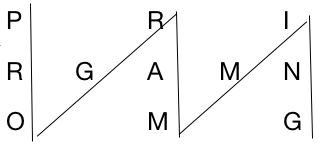
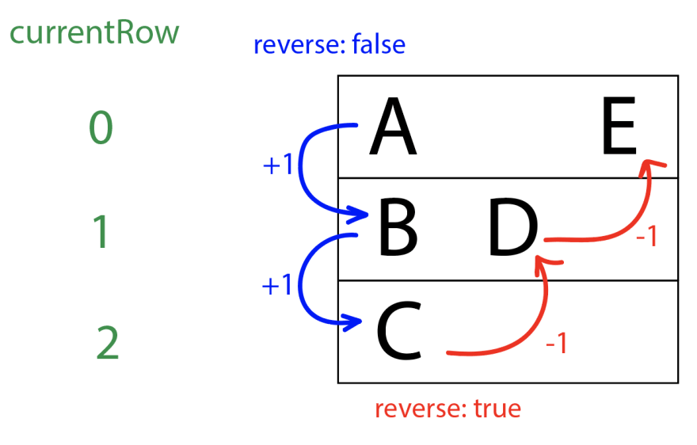

# INDEX

- [INDEX](#index)
  - [Notes](#notes)
  - [String to Numbers Problems](#string-to-numbers-problems)
    - [String to Integer (atoi)](#string-to-integer-atoi)
    - [Integer to String](#integer-to-string)
    - [Multiply Strings](#multiply-strings)
    - [Roman to Integer](#roman-to-integer)
  - [Substring (Sliding Window)](#substring-sliding-window)
    - [Longest Substring Without Repeating Characters](#longest-substring-without-repeating-characters)
    - [Longest Substring with K Distinct Characters](#longest-substring-with-k-distinct-characters)
    - [Longest Substring with At Least K Repeating Characters](#longest-substring-with-at-least-k-repeating-characters)
    - [Longest Repeating Character Replacement](#longest-repeating-character-replacement)
    - [Minimum Window Substring](#minimum-window-substring)
    - [Permutation in String](#permutation-in-string)
    - [Find All Anagrams in a String](#find-all-anagrams-in-a-string)
    - [Words Concatenation](#words-concatenation)
    - [Isomorphic Strings](#isomorphic-strings)
    - [Count Vowel Substrings of a String](#count-vowel-substrings-of-a-string)
    - [Longest Common Prefix](#longest-common-prefix)
  - [Reversing Problems](#reversing-problems)
    - [Valid Palindrome](#valid-palindrome)
    - [Valid Palindrome II](#valid-palindrome-ii)
    - [Length of Last Word](#length-of-last-word)
    - [Reverse Words in a String](#reverse-words-in-a-string)
  - [2 Pointers String Problems](#2-pointers-string-problems)
    - [Is Subsequence](#is-subsequence)
    - [Backspace String Compare](#backspace-string-compare)
  - [String Shapes](#string-shapes)
    - [Sinusoidal String](#sinusoidal-string)
    - [ZigZag Conversion](#zigzag-conversion)

---

## Notes

- Substring vs Subsequence:
  
  - Substring: a contiguous sequence of characters within a string
  - Subsequence: a sequence that can be derived from another sequence by deleting some or no elements without changing the order of the remaining elements
- In `string` problems, usually the brute-force solution uses `O(n)` space complexity, and the optimal solution uses `O(1)` space complexity, so we need to think of a way to solve the problem **without using extra space**
- Verify the constraints:
  - Are all the characters in the string lowercase/uppercase?
  - Are there any leading or trailing whitespaces?
  - Does case sensitivity matter? (e.g. "A" vs "a")

---

## String to Numbers Problems

### String to Integer (atoi)

| Video Solution | Hint                                                                                                                                                                                                                                                                      |
| -------------- | ------------------------------------------------------------------------------------------------------------------------------------------------------------------------------------------------------------------------------------------------------------------------- |
| NA             | We can perform the conversion digit by digit, by using a pointer to keep track of the current digit. We can use a variable `num` to keep track of the `number`. To add a digit to the number, we can multiply the current number by `10` and add the current digit to it. |

Implement the `myAtoi(string s)` function, which converts a string to a 32-bit signed integer (similar to C/C++'s `atoi` function).

- Requirements:

  - ignore all leading whitespaces at the beginning of the string
  - if the first non-whitespace character is not a digit or a sign (`+` or `-`), return `0`
  - read in the next characters of the string until the next non-digit character or the end of the input is reached

- EX:

  - `s = "42"` -> `42`
  - `s = "   -42"` -> `-42`
  - `s = "4193 with words"` -> `4193`

- Explanation:

  - We can perform the conversion digit by digit, by using a pointer to keep track of the current digit
  - We can use a variable `num` to keep track of the `number` to fill in the matrix with and a variable `sign` to keep track of the sign of the number
    - To add a digit to the number, we can multiply the current number by `10` and add the current digit to it
      - `55 = 5 * 10 + 5`
  - We can use some string methods like:
    - `str.isdigit()` to check if the current character is a digit
    - `str.isspace()` to check if the current character is a whitespace

- **Solution 1:** if using `int()` is allowed

  ```py
  def myAtoi(s):
      i = 0
      sign = 1

      # Remove all leading whitespaces
      while i < len(s) and s[i].isspace():
          i += 1

      # Check if the first non-whitespace character is not a digit or a sign (+ or -)
      if i < len(s) and (s[i] in ('+', '-')):
          sign = -1 if s[i] == '-' else 1
          i += 1

      # Read in the next characters of the string until the next non-digit character or the end of the input is reached
      num = 0
      while i < len(s) and s[i].isdigit():
          num = num * 10 + int(s[i])
          i += 1

      return max(-2**31, min(sign * num, 2**31 - 1))
  ```

- **Solution 2:** if using `int()` is not allowed

  - The trick here is to use the `ord()` function to convert the character to its ASCII value

  ```py
  def myAtoi(s):
      i = 0
      sign = 1

      # Remove all leading whitespaces
      while i < len(s) and s[i].isspace():
          i += 1

      # Check if the first non-whitespace character is not a digit or a sign (+ or -)
      if i < len(s) and (s[i] in ('+', '-')):
          sign = -1 if s[i] == '-' else 1
          i += 1

      # Read in the next characters of the string until the next non-digit character or the end of the input is reached
      num = 0
      while i < len(s) and s[i].isdigit():
          num = num * 10 + ord(s[i]) - ord('0')
          i += 1

      return max(-2**31, min(sign * num, 2**31 - 1))
  ```

---

### Integer to String

| Video Solution | Hint                                                                                                                                                                                                                                                                                                 |
| -------------- | ---------------------------------------------------------------------------------------------------------------------------------------------------------------------------------------------------------------------------------------------------------------------------------------------------- |
| NA             | Use `mod (%) 10` to get the last digit of the integer and `div (//) 10` to remove the last digit of the integer. As we can't use the `str()` function, we will use the `ord()` function to convert the digit to its ASCII value and add the `ASCII value of '0'` to it to get the digit as a string. |

Given an integer `x`, return a string representing `x`.

- EX:

  - `x = 123` -> `"123"`
  - `x = -123` -> `"-123"`

- Explanation:

  - Here, we can't loop over the integer `x` because we can't access the digits of an integer. Instead, we will use `mod (%) 10` to get the last digit of the integer and `div (//) 10` to remove the last digit of the integer

    - `123 % 10 = 3` -> get the last digit
    - `123 // 10 = 12` -> remove the last digit to get the remaining digits

  - As we can't use the `str()` function, we will use the `ord()` function to convert the digit to its ASCII value and add the `ASCII value of '0'` to it to get the digit as a string which is the same as adding `'0'` to it
    - `ord('0') = 48`
    - `ord('1') = 49`
    - `ord('2') = 50`
    - `ord('3') = 51`
    - `...`
  - We will use the `sign` variable to keep track of the sign of the number

```py
def intToString(x):
    sign = 1 if x >= 0 else -1
    x = abs(x)
    ans = ""

    while x > 0:
        ans += chr(x % 10 + ord('0'))
        x //= 10

    return ('-' if sign == -1 else '') + reversed(ans)
```

---

### Multiply Strings

| Video Solution                                                | Hint                                                                                                                                                                                                                                                                                                                                                                                              |
| ------------------------------------------------------------- | ------------------------------------------------------------------------------------------------------------------------------------------------------------------------------------------------------------------------------------------------------------------------------------------------------------------------------------------------------------------------------------------------- |
| [Video Solution](https://www.youtube.com/watch?v=1vZswirL8Y8) | We can use the same approach as the previous problem, but instead of adding the elements to the result, we can fill the matrix with the elements from `1` to `n^2` in spiral order. We can use the same pointers to keep track of the `top`, `bottom`, `left`, and `right` boundaries of the current cycle. We can use a variable `num` to keep track of the `number` to fill in the matrix with. |

Given two non-negative integers `num1` and `num2` represented as strings, return the product of `num1` and `num2`, also represented as a string.

**You must not use any built-in BigInteger library or convert the inputs to integer directly.**

- EX: `num1 = "2", num2 = "3"` -> `"6"`
- EX: `num1 = "123", num2 = "456"` -> `"56088"`

- Explanation
  - We can't convert the strings to integers because they are too large
  - We can use the grade-school algorithm for multiplication, which consists of multiplying each digit of the first number by each digit of the second number
    
  - The number of digits in the product is equal to the sum of the number of digits in the two numbers
    - `len(num1) + len(num2)` -> `58 * 14 = 812` -> `2 + 2 = 4`

```py
def multiply(num1, num2):
    # Corner case
    if "0" in (num1, num2): return "0"

    # Initialize a list to store the result
    result = [0] * (len(num1) + len(num2))

    # Iterate over the first number
    for i in range(len(num1)-1, -1, -1):
        # Iterate over the second number
        for j in range(len(num2)-1, -1, -1):
            # Calculate the product of the current digits
            product = int(num1[i]) * int(num2[j])
            # Calculate the index of the current digit in the result list
            index = i + j + 1
            # Add the product to the current digit in the result list
            result[index] += product % 10
            # Add the carry to the digit on the left
            result[index-1] += product // 10

    # Remove the leading zeros from the result list
    start = 0
    while start < len(result) and result[start] == 0:
        start += 1

    # Convert the result list to a string
    return ''.join(map(str, result[start:]))
    # or
    # return ''.join(str(i) for i in result[start:])
```

---

### Roman to Integer

| Video Solution                                                | Hint                                                                                                                                                                                                                                            |
| ------------------------------------------------------------- | ----------------------------------------------------------------------------------------------------------------------------------------------------------------------------------------------------------------------------------------------- |
| [Video Solution](https://www.youtube.com/watch?v=3jdxYj3DD98) | Use a `hash table` to keep track of the `value` of each character in the string and check if the current character is less than the next character to subtract the current character from the next character instead of adding it to the result |

Roman numerals are represented by seven different symbols: `I`, `V`, `X`, `L`, `C`, `D` and `M`.

| Symbol | Value |
| ------ | ----- |
| I      | 1     |
| V      | 5     |
| X      | 10    |
| L      | 50    |
| C      | 100   |
| D      | 500   |
| M      | 1000  |

For example, `2` is written as `II` in Roman numeral, just two one's added together. `12` is written as `XII`, which is simply `X + II`. The number `27` is written as `XXVII`, which is `XX + V + II`.

Roman numerals are usually written largest to smallest from left to right. However, the numeral for four is not `IIII`. Instead, the number four is written as `IV`. Because the one is before the five we subtract it making four. The same principle applies to the number nine, which is written as `IX`. There are six instances where subtraction is used:

- `I` can be placed before `V` (5) and `X` (10) to make 4 and 9.
- `X` can be placed before `L` (50) and `C` (100) to make 40 and 90.
- `C` can be placed before `D` (500) and `M` (1000) to make 400 and 900.

Given a roman numeral, convert it to an integer.

- EX: `s = "III"` -> `3`

- Explanation:

  - Roman numerals are usually written **largest to smallest from left to right**, So we need to handle cases like `IV` and `IX` where the smaller number is before the larger number
  - We can use a `hash table` to keep track of the `value` of each character in the string
  - We can iterate over the string and check if the current character is less than the next character to subtract the current character from the next character instead of adding it to the result
    - `IV` -> `5 - 1` -> `4`
    - `VI` -> `5 + 1` -> `6`

- Time Complexity: `O(n)`
- Space Complexity: `O(1)`
  - Not `O(n)` because we have a fixed number of characters in the Roman numerals (fixed hash table size)

```py
def romanToInt(s):
    roman_to_int = {
        'I': 1,
        'V': 5,
        'X': 10,
        'L': 50,
        'C': 100,
        'D': 500,
        'M': 1000
    }

    result = 0

    # Iterate over the string
    for i in range(len(s)):
        # Check if the current character is less than the next character to subtract the current character from the next character instead of adding it to the result
        if i < len(s) - 1 and roman_to_int[s[i]] < roman_to_int[s[i+1]]:
            result -= roman_to_int[s[i]]
        else:
            result += roman_to_int[s[i]]

    return result

# -------------------------------------------------------------------
# Another approach
# You can iterate over the string from right to left and add the current character to the result if the current character is greater than or equal to the next character, otherwise subtract it

# -------------------------------------------------------------------
# Another approach
def romanToInt(s):
    roman_to_int = {
        'I': 1,
        'V': 5,
        'X': 10,
        'L': 50,
        'C': 100,
        'D': 500,
        'M': 1000
    }

    # Using reduce function
    return reduce(lambda x, i: x + (-roman_to_int[s[i]] if roman_to_int[s[i]] < roman_to_int[s[i+1]] else roman_to_int[s[i]]), range(len(s)), 0)
```

---

## Substring (Sliding Window)

### Longest Substring Without Repeating Characters

| Video Solution                                                | Hint                                                                                                                                                                      |
| ------------------------------------------------------------- | ------------------------------------------------------------------------------------------------------------------------------------------------------------------------- |
| [Video Solution](https://www.youtube.com/watch?v=wiGpQwVHdE0) | Use **Sliding Window** and a `hash table` to keep track of the `last seen index` of each character in the window to prevent sliding inclemently until the window is valid |

Given a string `s`, find the length of the **longest substring** without repeating characters.

- EX: `s = "abcabcbb"` -> `3` (substring: `"abc"`)
- Explanation:

  - we can use a **sliding-window** pattern to check for all the substrings of the string
    
    
  - we use a hash set to keep track of the characters in the current window and a variable to keep track of the maximum window size
  - we iterate over the string and add the current character to the window if it is not already in it
    - if the current character is in the window, we remove it and slide the window to the right until it is not in the window
    - we update the maximum window size if the current window size is greater than the maximum window size
  - we return the maximum window size

- Solution 1: `O(n^2)` (slow) ❌

  ```py
  def lengthOfLongestSubstring(s):
      # Initialize a set to keep track of the characters in the current window
      window = set()

      # Initialize the sliding-window with the first character in the string
      ans = 0
      left = 0

      # Iterate over the string
      for right in range(len(s)):
          # If the current character is in the window, remove it and slide the window
          while s[right] in window:
              window.remove(s[left])
              # Slide the window to the right
              left += 1

          # Add the current character to the window
          window.add(s[right])

          # Update the maximum window size
          ans = max(ans, right - left + 1)

      return ans
  ```

- Solution 2: `O(n)` ✅

  - This is a faster solution because we don't need to slide the window to the right until the current character is not in the window, we can just update the left pointer to the `index of the last seen occurrence of the character + 1`

  ```py
  def lengthOfLongestSubstring(s):
      seen_chars = {} # char -> index of the last seen occurrence of the character
      res = 0
      l = 0

      for r, char in enumerate(s):
          if char in seen_chars:
              # update the left pointer to the index of the last seen occurrence of the character + 1
              l = max(l, seen_chars[char] + 1) # max, to make sure that it's in the window
          seen_chars[char] = r # update the index of the last seen occurrence of the character
          res = max(ans, r - l + 1)

      return res
  ```

---

### Longest Substring with K Distinct Characters

| Video Solution                                                | Hint                                                                                                                                                                                                                     |
| ------------------------------------------------------------- | ------------------------------------------------------------------------------------------------------------------------------------------------------------------------------------------------------------------------ |
| [Video Solution](https://www.youtube.com/watch?v=V1gF8FCHz60) | Use **Sliding Window** and a `hash table` to keep track of the `count` of each character in the window and check if the window is valid (valid means that each new character in the window has maximum frequency of `k`) |

Given a string `s`, find the length of the **longest substring** with **at most** `k` distinct characters.

- EX: `s = "eceba", k = 2` -> `3` (substring: `"ece"`)

- Steps:
  - We will insert characters into a dictionary and keep track of the number of distinct characters in the current window
  - we will keep track of the current window length using the `left` and `right` pointers
  - we will slide the window to the right until we have `k` distinct characters in the window
    
    
    - this is done by shrinking the window from the `left` until we have `k` distinct characters in the window (until the count of distinct characters in the window is equal to `k`)
      
    - while shrinking, we will decrement the count of the character at the `left` pointer and if the count is equal to `0`, we will remove the character from the dictionary
  - At the end of each step, we will check if the current window length is greater than the maximum window length and update the maximum window length if it is

Time complexity: `O(n + n)` = `O(n)`, this is because the inner `while` loop will only run `n` times

```py
def lengthOfLongestSubstringKDistinct(s, k):
    # Initialize a dictionary to keep track of the characters in the current window
    char_count = {}

    # Initialize the sliding-window with the first character in the string
    ans = 0
    left = 0

    # Iterate over the string
    for right in range(len(s)):
        # Add the current character to the window if it is not already in it
        char_count[s[right]] = char_count.get(s[right], 0) + 1

        # If the current window is invalid, slide the window to the right until it becomes valid
        while len(char_count) > k:
            char_count[s[left]] -= 1
            if char_count[s[left]] == 0:
                del char_count[s[left]]
            # Slide the window to the right
            left += 1

        # Update the maximum window size
        ans = max(ans, right - left + 1)

    return ans
```

---

### Longest Substring with At Least K Repeating Characters

| Video Solution                                                | Hint |
| ------------------------------------------------------------- | ---- |
| [Video Solution](https://www.youtube.com/watch?v=5QpMpO2CAb0) | NA   |

Given a string `s` and an integer `k`, return the length of the **longest substring** of `s` such that the frequency of each character in this substring is greater than or equal to `k`.

- EX: `s = "aaabb", k = 3` -> `3` (substring: `"aaa"`)

- Solution using resursion

  ```py
  def longestSubstring(s, k):
      if len(s) < k:
          return 0

      freq = {}
      for c in s:
          freq[c] = freq.get(c, 0) + 1

      for c in freq:
          if freq[c] < k:
              substrings = s.split(c) # split the string by the character with the lowest frequency
              return max(longestSubstring(substring, k) for substring in substrings)

      return len(s)
  ```

---

### Longest Repeating Character Replacement

| Video Solution                                                | Hint                                                                                                                                                                                                                                             |
| ------------------------------------------------------------- | ------------------------------------------------------------------------------------------------------------------------------------------------------------------------------------------------------------------------------------------------ |
| [Video Solution](https://www.youtube.com/watch?v=gqXU1UyA8pk) | Use **Sliding Window** and a `hash table` to keep track of the `count` of each character in the window and keep track of the `max character frequency` in the window to check if the window is valid (`windowSize - maxCharacterFrequency <= k`) |

You are given a string `s` and an integer `k`. You can choose any character of the string and change it to any other uppercase English character. You can perform this operation at most `k` times.

Return the length of the longest substring containing the same letter you can get after performing the above operations.

- EX: `s = "AABABBA", k = 1` -> `4` (substring: `"AABA"`)
- Explanation:

  - We can choose any of the underlined characters in the string, and turn them into 'B': "AABABBA" -> "AABBBBA"
  - After doing so, we have the longest substring of one repeating character of length `4`.

- **Steps:**
  
  1. we want to replace the (least frequent characters) in the current window with the (most frequent character in the window)
  2. to do this, we will need to keep track of the (character frequencies) inside the current window
  3. and check the `window length` against the `max character frequency` to see if the window is valid (valid means `<= k`)


```py
# O(n)
def characterReplacement(s, k):
    # Initialize a dictionary to keep track of the characters in the current window
    char_count = {}

    # Initialize the sliding-window with the first character in the string
    ans = 0
    left = 0
    max_character_frequency = 0

    # Iterate over the string
    for right in range(len(s)):
        # Add the current character to the window if it is not already in it
        char_count[s[right]] = char_count.get(s[right], 0) + 1

        # Update the maximum window size
        max_character_frequency = max(max_character_frequency, char_count[s[right]])

        # If the current window is invalid, slide the window to the right until it becomes valid
        while right - left + 1 - max_character_frequency > k:
            char_count[s[left]] -= 1
            # Slide the window to the right
            left += 1

        # Update the maximum window size if window is valid
        ans = max(res, right - left + 1)

    return ans
```

Time Complexity: `O(n)`
Space Complexity: `O(26)` = `O(1)` (because we have a fixed number of characters in the English alphabet)

---

### Minimum Window Substring

Given two strings `s` and `t` of lengths `m` and `n` respectively, return the **minimum window substring** of `s` such that every character in `t` (**including duplicates**) is included in the window. If there is no such substring, return the empty string `""`.

- EX: `s = "ADOBECODEBANC", t = "ABC"` -> `"BANC"`
- Explanation:

  - The minimum window substring `"BANC"` includes `'A'`, `'B'`, and `'C'` from string `t`.

- **Steps:**
  

  1. we want to find the smallest window in `s` that contains all the characters in `t`
  2. we can use a **sliding-window** pattern to check for all the substrings of the string
  3. then we check these pair for the desired condition, and if not we change one of the numbers in pair and check again and so on...

  - **Condition:** check if the current window contains all the characters in `t`
    - this is done by checking if the frequency of **each** character in the window in the `char_count` dictionary is greater than or equal to the frequency of the same character in the `target_count` dictionary
      - if we have enough of each character in the window, then we have a valid window
      - if not, then we need to slide the window **to the right** until we have a valid window

- **Slow Solution** (checks the entire character count dictionary for each character in the string each time)

  ```py
  # O(n)
  def minWindow(s, t):
      # Initialize dictionaries to keep track of the characters in the current window and the target string
      char_count = {}
      target_count = {}

      for c in t:
          target_count[c] = target_count.get(c, 0) + 1

      # Initialize the sliding-window with the first character in the string
      ans = ""
      min_window_size = float('inf')
      left = 0

      # Iterate over the string
      for right in range(len(s)):
          # Add the current character to the window if it is not already in it
          char = s[right]
          char_count[char] = char_count.get(char, 0) + 1

          # If the current window is invalid, slide the window to the right until it becomes valid
          while all(char_count.get(char, 0) >= target_count.get(char, 0) for char in target_count):
              # Update the minimum window size
              if right - left + 1 < min_window_size:
                  min_window_size = right - left + 1
                  ans = s[left:right+1]

              # keep popping values from the left until we have a valid window
              char_count[s[left]] -= 1
              # Slide the window to the right
              left += 1

      return ans
  ```

- **Faster Solution** (uses a counter to keep track of the number of characters in the window that are also in the target string) -> `have` and `need` counters

  - first, we initialize the `have` and `need` counters to `0` and `len(target_count)` respectively and we iterate over the string `s` using the sliding-window pattern
    
    
    
    
  - then if `have` is equal to `need` we have a valid window and we can update the answer, and try to find a smaller window by moving the left pointer to the right
    

  ```py
  # O(n)
  def minWindow(s, t):
      # edge case
      if t == "": return ""

      # Initialize dictionaries to keep track of the characters in the current window and the target string
      window_char_count = {}
      target_count = {}

      for c in t:
          target_count[c] = target_count.get(c, 0) + 1

      # Initialize the sliding-window with the first character in the string
      ans = ""
      min_window_size = float('inf')
      left = 0
      have, need = 0, len(target_count) # have is the number of characters in the window that are also in the target string

      # Iterate over the string
      for right in range(len(s)):
          # Add the current character to the window if it is not already in it
          char = s[right]
          window_char_count[char] = window_char_count.get(char, 0) + 1

          # if the current character is in the target string and the number of times it appears in the window is equal to the number of times it appears in the target string, then we have one more character in the window that is also in the target string
          if char in target_count and window_char_count[char] == target_count[char]:
              have += 1

          # here we only check if the current window is valid if we have all the characters in the target string in the window instead in the slow solution where we check if the current window is valid for each character in the string
          while have == need:
              # Update the minimum window size
              windowSize = right - left + 1
              if windowSize < min_window_size:
                  min_window_size = windowSize
                  ans = s[left : right+1]

              # keep popping values from the left until we have a valid window
              window_char_count[s[left]] -= 1
              # if the current character is in the target string and the number of times it appears in the window is less than the number of times it appears in the target string, then we have one less character in the window that is also in the target string
              if s[left] in target_count and window_char_count[s[left]] < target_count[s[left]]:
                  have -= 1
              # Slide the window to the right
              left += 1

      return ans
  ```

---

### Permutation in String

Given two strings `s1` and `s2`, return `true` if `s2` contains a permutation of `s1`, or `false` otherwise.

- EX: `s1 = "ab", s2 = "eidbaooo"` -> `true`

- `Permutation`: a permutation of a string is another string that contains the same characters, only the order of characters can be different

- Explanation:
  - We need to count the number of times each character appears in `s1` and store it in a dictionary
  - Then we need to iterate over `s2` using the sliding-window pattern and keep track of the number of times each character appears in the current window using a dictionary
  - If the number of times a character appears in the current window is equal to the number of times it appears in `s1` then we have one more character in the window that is also in `s1`
  - In order to have `O(n)` solution instead of `O(26 n)`, we need to keep track of the number of characters in the window that are also in `s1` using two counter-variables `have` and `need`

```py
def checkInclusion(s1, s2):
    char_count = {}
    target_count = {}

    for c in s1:
        target_count[c] = target_count.get(c, 0) + 1

    ans = 0
    left = 0
    have, need = 0, len(target_count) # have is the number of characters in the window that are also in the target string

    for right in range(len(s2)):
        current_char = s2[right]
        char_count[current_char] = char_count.get(current_char, 0) + 1

        if current_char in target_count and char_count[current_char] == target_count[current_char]:
            have += 1

        while have == need:
            if right - left + 1 == len(s1):
                return True

            # Else: keep popping values from the left until we have a valid window
            char_count[s2[left]] -= 1
            if s2[left] in target_count and char_count[s2[left]] < target_count[s2[left]]:
                have -= 1
            left += 1

    return False
```

---

### Find All Anagrams in a String

Given two strings `s` and `p`, return an array of all the start indices of `p`'s anagrams in `s`. You may return the answer in any order.

> An **anagram** is a word or phrase formed by rearranging the letters of a different word or phrase, typically using all the original letters exactly once. -> **It's actually a permutation of a string**

- It's very similar to the previous problem, but instead of returning `True` if we find an anagram, we will `append` the `left` pointer to the `answer` array

```py
def findAnagrams(s, p):
    char_count = {}
    target_count = {}

    for c in p:
        target_count[c] = target_count.get(c, 0) + 1

    ans = []
    left = 0
    have, need = 0, len(target_count)

    for right in range(len(s)):
        current_char = s[right]
        char_count[current_char] = char_count.get(current_char, 0) + 1

        if current_char in target_count and char_count[current_char] == target_count[current_char]:
            have += 1

        while have == need:
            if right - left + 1 == len(p):
                ans.append(left)

            char_count[s[left]] -= 1
            if s[left] in target_count and char_count[s[left]] < target_count[s[left]]:
                have -= 1
            left += 1

    return ans
```

---

### Words Concatenation

Given a string `s` and a list of words `words`, where each word is the same length, find all starting indices of substrings in `s` that is a concatenation of every word in `words` **exactly once**.

- EX: `s = "barfoothefoobarman", words = ["foo","bar"]` -> `[0,9]`

- Explanation:

  - Here, we will use a **sliding-window** pattern to check for all the substrings of the string
  - We will use a dictionary to keep track of the frequency of words in `words`
  - we will use a dictionary to keep track of the frequency of words in the current window
  - Starting from every index in the string, we will check if the current window is a valid window
  - if it is, we will append the index of the left pointer to the answer array
  - if not, we will slide the window to the right until we have a valid window

```py
def findSubstring(s, words):
    if not words or not s:
        return []

    word_count = {}
    for word in words:
        word_count[word] = word_count.get(word, 0) + 1

    ans = []
    word_length = len(words[0])
    window_length = len(words) * word_length # the required window length to check for the concatenation of every word in words exactly once

    for i in range(len(s) - window_length + 1):
        seen_words = {}
        for j in range(i, i + window_length, word_length):
            current_word = s[j:j+word_length]
            if current_word not in word_count:
                break
            seen_words[current_word] = seen_words.get(current_word, 0) + 1
            if seen_words[current_word] > word_count[current_word]:
                break
        else:
            # will enter this block if the for loop is not broken (not using "break" in the for loop)
            ans.append(i)

    return ans
```

---

### Isomorphic Strings

Given two strings `s` and `t`, determine if they are isomorphic.

> Two strings `s` and `t` are isomorphic if the characters in `s` can be replaced to get `t`.
> 

- EX: `s = "egg", t = "add"` -> `True`
- Explanation:

  - Note that "No two characters may map to the same character, but a character may map to itself.", so we need to map each character in `s` to a unique character in `t` and vice versa.
  - we must check if the characters in `s` can be replaced to get `t` and vice versa. This is done by:
    

    1. creating a dictionary to keep track of the corresponding characters in each string
    2. check if the current characters are in the dictionaries, if not, add them
    3. if they are in the dictionaries, check if they correspond to each other and if not return `False`

Time Complexity: `O(n)`

```py
def isIsomorphic(s, t):
    # Initialize dictionaries to keep track of the corresponding characters in each string
    mapST, mapTS = {}, {}

    for c1, c2 in zip(s, t):
        # If the current characters are not in the dictionaries, add them
        if c1 not in mapST and c2 not in mapTS:
            mapST[c1] = c2
            mapTS[c2] = c1
        # If the current characters are in the dictionaries, check if they correspond to each other
        elif mapST.get(c1) != c2 or mapTS.get(c2) != c1:
            return False

    return True
```

---

### Count Vowel Substrings of a String

Given a string `s` return the number of substrings that have **all vowels** in order.

- EX: `s = "abciiidef"` -> `3` (substrings: `"ae"`, `"ei"`, `"iii"`)
- Steps:
  - we can use a **sliding-window** pattern to check for all the substrings of the string
  - then we check these pair for the desired condition, and if not we change one of the numbers in pair and check again and so on...

```py
def countVowelSubstrings(word):
    # Store vowels in a set for O(1) lookup.
    vowels = {'a', 'e', 'i', 'o', 'u'}

    # Initialize the sliding-window with the first vowel in the string and the last vowel in the string
    ans = 0
    last_consonant = -1

    # Initialize a dictionary to keep track of the last seen vowel
    last_seen_vowels = {v: -2 for v in vowels} # -2 is the smallest possible index

    for i, x in enumerate(word):
        # If the current character is a consonant, update the last_consonant variable.
        if x not in vowels:
            last_consonant = i
        # Otherwise, we've found a vowel.
        else:
            # Update the last_seen_vowels dictionary with the current index.
            last_seen_vowels[x] = i
            # Update the answer variable with the maximum of the current value and the minimum of the last seen vowel's
            # index and the last consonant's index.
            ans += max(min(last_seen_vowels.values())-last_consonant, 0)
    return ans
```

---

### Longest Common Prefix

Write a function to find the longest common prefix string amongst an array of strings.

- EX: `strs = ["flower","flow","flight"]` -> `"fl"`
- Explanation:
  - we will start with the first string in the array and check other strings to check if they have the same prefix (same current character)
  - note that we need to check if we have reached the end of the other strings (out of bound), so that we would return the current prefix

```py
def longestCommonPrefix(strs):
   res = ''

   for i in range(len(strs[0])):
      for j in range(1, len(strs)):
         # if we have reached the end of the other string or the current character is not a prefix of the other string, return the result
         if i >= len(strs[j]) or strs[j][i] != strs[0][i]:
            return res
      res += strs[0][i]

    return res
```

---

## Reversing Problems

### Valid Palindrome

| Video Solution                                                | Hint                                                                                                                                                                                                                                                                                                                                                                                                                      |
| ------------------------------------------------------------- | ------------------------------------------------------------------------------------------------------------------------------------------------------------------------------------------------------------------------------------------------------------------------------------------------------------------------------------------------------------------------------------------------------------------------- |
| [Video Solution](https://www.youtube.com/watch?v=jJXJ16kPFWg) | Use **Two Pointers** to check if the string is a palindrome. We can use a pointer to iterate over the string from the `left` and another pointer to iterate over the string from the `right`. We can use a helper function to check if a character is alphanumeric and skip the character if it's not. We can use the built-in `isalnum()` string-method or use a function that checks the `ord()` range of the character |

A palindrome is a word, phrase, number, or other sequence of characters which **reads the same backward or forward**. Allowances may be made for adjustments to capital letters, punctuation, and word dividers.

- EX: `racecar`, `tacocat`, `madam`, `kayak`, `level`
- Here's a possible approach to solve this problem:

  1. Convert the string to lowercase to ignore any case differences.
  2. Remove any non-alphanumeric characters from the string.

     - > **Note:** numbers within the string will be considered alphanumeric.

  3. Use two pointers to iterate through the string from both ends.
  4. Compare the characters at each pointer position. If they are not equal, the string is not a palindrome. If they are equal, move both pointers towards the center of the string.
  5. If the pointers meet in the middle of the string, the string is a palindrome.

```py
# using two pointers
# helper
def isAlphaNum(char):
            # using ASCII values
           return (ord('A') <= ord(char) <= ord('Z') or
                   ord('a') <= ord(char) <= ord('z') or
                   ord('0') <= ord(char) <= ord('9'))
# or use the built-in isalnum() string-method

def is_palindrome(s):
  # First & last pointers
  l, r = 0, len(s)-1

  while l < r:
    while l < r and not isAlphaNum(s[l]):
      l += 1
    while l < r and not isAlphaNum(s[r]):
      r -= 1

    if s[l].lower() != s[r].lower():
      return False

    l += 1
    r -= 1

  return True

# --------------------------------------------------

# Or (Extra space)
newStr = ''
for char in s:
  if char.isalnum(): # using built-in string-method
    newStr += char.lower()

return newStr == newStr[::-1]

# --------------------------------------------------

# Or using regular expressions
import re
def is_palindrome(s):
  s = re.sub('[^a-z0-9]', '', s.lower()) # remove non-alphanumeric characters
  return s == s[::-1]
```

---

### Valid Palindrome II

| Video Solution                                                | Hint                                                                                                                                                                                                                                                                                                                          |
| ------------------------------------------------------------- | ----------------------------------------------------------------------------------------------------------------------------------------------------------------------------------------------------------------------------------------------------------------------------------------------------------------------------- |
| [Video Solution](https://www.youtube.com/watch?v=JrxRYBwG6EI) | Use **Two Pointers** to check if the string is a palindrome. When encountering a mismatch, we can check if the string without the character at the `left` pointer is a palindrome **or** the string without the character at the `right` pointer is a palindrome. Use a helper function to check if a string is a palindrome. |

Given a string `s`, return `true` if the `s` can be palindrome after deleting **at most one** character from it.

- EX: `s = "abca"` -> `true`

  - Explanation: You could delete the character `'c'` to get the palindrome `"aba"`, which is `true`.

- Explanation

  - Same as the previous problem, but we have to check if the string is a palindrome after deleting **at most one** character from it.

    - The **Brute Force** approach would be to check if the string is a palindrome after deleting each character from it, but this would take `O(n^2)` time, we can do better.

      ```py
      def validPalindrome(s):
          # helper function to check if a string is a palindrome
          def isPalindrome(s):
              return s == s[::-1]

          # iterate over the string
          for i in range(len(s)):
              # check if the string is a palindrome after deleting the current character
              if isPalindrome(s[:i] + s[i+1:]):
                  return True

          return False
      ```

  - to check which character to delete, we're sure that we have to delete a character that makes the string not a palindrome, so we can use a **two pointers** pattern to check for all the characters in the string
    - if we found the 2 characters that not equal, we check if the string without the character at the `left` pointer is a palindrome **or** the string without the character at the `right` pointer is a palindrome
      

```py
def validPalindrome(s):
    # helper function to check if a string is a palindrome
    def isPalindrome(s):
        return s == s[::-1]

    left, right = 0, len(s)-1
    while left < right:
        # if the characters at the left and right pointers are not equal, check if the string without the character at the left pointer is a palindrome or the string without the character at the right pointer is a palindrome
        if s[left] != s[right]:
            skipLeft = s[left+1:right+1]
            skipRight = s[left:right]
            return isPalindrome(skipLeft) or isPalindrome(skipRight)

        left += 1
        right -= 1

    return True
```

---

### Length of Last Word

| Video Solution                                                | Hint                                                                                                                                                                                                                                                                                                              |
| ------------------------------------------------------------- | ----------------------------------------------------------------------------------------------------------------------------------------------------------------------------------------------------------------------------------------------------------------------------------------------------------------- |
| [Video Solution](https://www.youtube.com/watch?v=KT9rltZTybQ) | Iterate over the string backwards and return the length of the first word we encounter. Pay attention to an edge case where the string does not end with an empty space (One word string). In this case, we will have to return the length of the last word anyway after we have iterated over the entire string. |

Given a string `s` consisting of some words separated by some number of spaces, return the length of the **last** word in the string.

- EX:

  - `s = "Hello World"` -> `5`
  - `s = "   fly me   to   the moon  "` -> `4`

- **Solution 1**: slow & extra memory ❌

  ```py
  def lengthOfLastWord(s):
      # split the string into words
      words = s.split()
      # return the length of the last word
      return len(words[-1]) if words else 0
  ```

- **Solution 2**: fast & less memory ✅

  - Instead of wasting time and iterating over the entire string, we can iterate over the string **backwards** and return the length of the first word we encounter
    - This is done by initializing a variable to keep track of the `length` of the last word and iterating over the string backwards until we reach the end of the last word (empty space)
  - pay attention to an edge case where the string does not end with an empty space (One word string)
    - In this case, we will have to return the length of the last word anyway after we have iterated over the entire string

  ```py
  def lengthOfLastWord(s):
      # initialize the length of the last word
      length = 0
      # iterate over the string backwards
      for i in range(len(s)-1, -1, -1):
          # if we have reached the end of the last word, return its length
          if s[i] == ' ' and length > 0:
              return length
          # if we have not reached the end of the last word, increment the length
          elif s[i] != ' ':
              length += 1

      # return the length of the last word if the string does not end with an empty space (One word string)
      return length
  ```

---

### Reverse Words in a String

Given an input string `s`, reverse the order of the **words**.

- EX: `s = "the sky is blue"` -> `"blue is sky the"`

- **Solution 1**: slow & extra memory ❌

  ```py
  def reverseWords(s):
      # split the string into words
      words = s.split()
      # reverse the words
      words.reverse()
      # join the words into a string
      return ' '.join(words)
  ```

- **Solution 2**: fast & less memory ✅ **(won't work because strings are immutable in python)**

  - Instead of allocating extra memory to store the words, we can use a **two pointers** pattern to iterate over the string and reverse the words in-place
  - For example, `"the sky is blue"` -> `"eulb si yks eht"`, then we can reverse each word to get the desired result `"blue is sky the"`
    - This is done by initializing a variable to keep track of the `start` of the current word and iterating over the string until we reach the end of the string
    - When we reach the end of the current word, we reverse it and update the `start` variable to the index of the next word

  ```py
  def reverseWords(s):
      # reverse the entire string
      s.reverse()

      def reverseWord(s, start, end):
          while start < end:
              s[start], s[end] = s[end], s[start]
              start += 1
              end -= 1

      start = 0
      for i in range(len(s)):
          if s[i] == ' ':
              reverseWord(s, start, i-1)
              start = i+1

      # reverse the last word (if the string does not end with an empty space)
      reverseWord(s, start, len(s)-1)

      return s
  ```

---

## 2 Pointers String Problems

### Is Subsequence

| Video Solution                                                | Hint                                                                                                                                                                                                                                                                                                                                                                                         |
| ------------------------------------------------------------- | -------------------------------------------------------------------------------------------------------------------------------------------------------------------------------------------------------------------------------------------------------------------------------------------------------------------------------------------------------------------------------------------- |
| [Video Solution](https://www.youtube.com/watch?v=99RVfqklbCE) | Use a counter variable to keep track of the number of characters in `s` that are also in `t`. Use a pointer to iterate over `t` and check if the current character is equal to the current character in `s`. If so, increment the counter variable. If the counter variable is equal to the length of `s`, return `True`, as this means that we have found all the characters in `s` in `t`. |

Given two strings `s` and `t`, return `true` if `s` is a **subsequence** of `t`, or `false` otherwise.

- Ex:

  - `s = "abc", t = "ahbgdc"` -> `true`
  - `s = "axc", t = "ahbgdc"` -> `false`

- Explanation:

  - As this is a subsequence problem, not a substring problem, we don't need to find the characters in `s` in the same order in `t`, we just need to find all the characters in `s` in `t` in any order.
  - Instead of using extra memory to store the characters of `s`, we can use a **two pointers** pattern to check for all the characters in `s` in `t`
    - we can use the first pointer to keep track of the current character in `s`
    - and the second pointer to iterate over `t` and check if the current character is equal to the current character in `s`
  - Finally we check if the first pointer is equal to the length of `s` to see if we have found all the characters in `s` in `t`

- Time complexity: `O(n)`

```py
def isSubsequence(s, t):
    matchedChars = 0
    for j in range(len(t)):
        if matchedChars == len(s)-1:
            break
        if s[i] == t[j]:
            i += 1

    return matchedChars == len(s)-1
```

---

### Backspace String Compare

| Video Solution                                                | Hint                                                                                                                                                                                                                                                                                                                                     |
| ------------------------------------------------------------- | ---------------------------------------------------------------------------------------------------------------------------------------------------------------------------------------------------------------------------------------------------------------------------------------------------------------------------------------- |
| [Video Solution](https://www.youtube.com/watch?v=k2qrymM_DOo) | Use a helper function to build the final string, the function Iterates over the string and checks if the current character is a backspace character. If so, `pop` the last character from the array. If not, append the current character to the array. Return the final string. Then compare the two strings using the helper function. |

Given two strings `s` and `t`, return `true` if they are equal when both are typed into empty text editors. `'#'` means a backspace character.

- Ex: `s = "ab#c", t = "ad#c"` -> `true`

  - Explanation: Both `s` and `t` become `"ac"`.

- Solution 1: Time: `O(n)`, Space: `O(s + t)` = `O(n)`
  

  ```py
  def backspaceCompare(s, t):
      # helper function to build the final string
      def buildString(s):
          arr = []
          for char in s:
              if char != '#':
                  arr.append(char)
              elif arr:
                  arr.pop()
          return ''.join(arr)

      return buildString(s) == buildString(t)
  ```

- Solution 2: Time: `O(m + n)` => `O(n), Space:`O(1)` ✅
  

  - we can use **two pointers** to iterate over the strings backwards and check if the current character is a backspace character
  - To do this we will have to iterate the strings **in reversed order**
    - We can have separate pointers, pointing to the **last element** of the given strings. We can start comparing the characters pointed out by both the pointers to see if the strings are equal.
    - If, at any stage, the character pointed out by any of the pointers is a backspace (`#`), we will skip and apply the backspace until we have a valid character available for comparison.

  ```py
  def backspaceCompare(s, t):
      i, j = len(s)-1, len(t)-1
      while i >= 0 or j >= 0:
          i = nextValidChar(s, i)
          j = nextValidChar(t, j)

          # if we have reached the end of both strings, return True
          if i < 0 and j < 0:
              return True
          # if we have reached the end of one of the strings, return False
          elif i < 0 or j < 0:
              return False

          # check if the current characters are equal
          if s[i] != t[j]:
              return False

          i -= 1
          j -= 1

      return True

  def nextValidChar(s, i):
      backspaceCount = 0
      while i >= 0:
          # if we have a backspace character, increment the backspaceCount (so that if we encountered another backspace character, we would have to increment the backspaceCount again)
          if s[i] == '#':
              backspaceCount += 1
          elif backspaceCount > 0:
              backspaceCount -= 1
          else:
              # if we have a valid character, return its index
              break
          i -= 1 # move to the next character

      return i
  ```

---

## String Shapes

### Sinusoidal String

Given a string, return it in a sinusoidal shape

- EX:

  - Input: `"Hello World!"`
  - Output: `"e_lHloWrdlo!"`

    - `_` represents a whitespace
    - Because the shape will be like this:

      ```txt
        e           _           l
      H     l    o     W     r     d
              l           o          !
      ```

- Explanation:
  - The brute-force approach would be to use a 2D array to store the characters in the string in a sinusoidal shape, then iterate over the array and return the string
  - However, observe that the result begins with the characters `s[1]`, `s[5]`, `s[9]`, ..., followed by `s[0]`, `s[2]`, `s[4]`, ..., and then `s[3]`, `s[7]`, `s[11]`, ... and so on. Therefore, we can create the result string by 3 iterations of the string, each time skipping a certain number of characters.

```py
def sinusoidalString(s):
    result = ''

    # first row (s[1], s[5], s[9], ...)
    for i in range(1, len(s), 4):
        result += s[i]

    # second row (s[0], s[2], s[4], ...)
    for i in range(0, len(s), 2):
        result += s[i]

    # third row (s[3], s[7], s[11], ...)
    for i in range(3, len(s), 4):
        result += s[i]

    return result

# ---------------------------------------------------------------------------

# Another solution using slicing
def sinusoidalString(s):
    return s[1::4] + s[::2] + s[3::4]
```

---

### ZigZag Conversion

The string `"PAYPALISHIRING"` is written in a zigzag pattern on a given number of rows like this:

```txt
P   A   H   N
A P L S I I G
Y   I   R
```



And then read line by line: `"PAHNAPLSIIGYIR"`

Write the code that will take a string and make this conversion given a number of rows.

- EX:

  - Input: `s = "PAYPALISHIRING", numRows = 3`
  - Output: `"PAHNAPLSIIGYIR"`

- Explanation:
  - Use a list of rows to store the characters in the string in a zigzag shape, then iterate over the list and return the string
  - We can use a variable to keep track of the current row and another variable to keep track of the direction (up or down)
    

```py
def convert(s, numRows):
    if numRows == 1:
        return s

    rows = [''] * numRows
    currentRow = 0
    goingDown = False

    for char in s:
        rows[currentRow] += char
        if currentRow == 0 or currentRow == numRows-1: # if we have reached the first or last row, change the direction
            goingDown = not goingDown
        currentRow += 1 if goingDown else -1

    return ''.join(rows)
```
