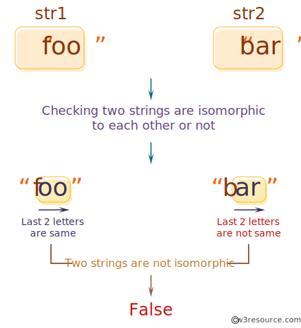
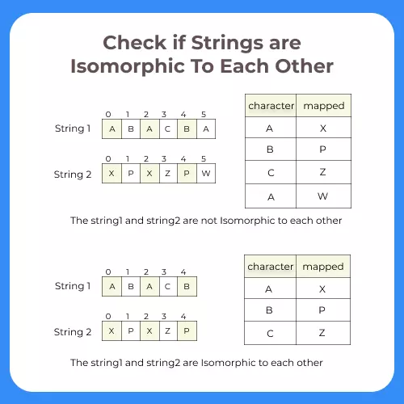

# INDEX

- [INDEX](#index)
  - [Notes](#notes)
  - [Multiply Strings](#multiply-strings)
  - [Two Pointers](#two-pointers)
    - [Valid Palindrome](#valid-palindrome)
  - [Substring (Sliding Window)](#substring-sliding-window)
    - [Longest Substring Without Repeating Characters](#longest-substring-without-repeating-characters)
    - [Longest Substring with K Distinct Characters](#longest-substring-with-k-distinct-characters)
    - [Longest Substring with At Least K Repeating Characters](#longest-substring-with-at-least-k-repeating-characters)
    - [Longest Repeating Character Replacement](#longest-repeating-character-replacement)
    - [Minimum Window Substring](#minimum-window-substring)
    - [Permutation in String](#permutation-in-string)
    - [Find All Anagrams in a String](#find-all-anagrams-in-a-string)
    - [Words Concatenation](#words-concatenation)
    - [Isomorphic Strings](#isomorphic-strings)
    - [Count Vowel Substrings of a String](#count-vowel-substrings-of-a-string)
    - [Longest Common Prefix](#longest-common-prefix)
  - [Reversing Problems](#reversing-problems)
    - [Valid Palindrome II](#valid-palindrome-ii)
    - [Reverse Integer](#reverse-integer)
    - [Length of Last Word](#length-of-last-word)
  - [2 Pointers String Problems](#2-pointers-string-problems)
    - [Is Subsequence](#is-subsequence)
    - [Backspace String Compare](#backspace-string-compare)

---

## Notes

- Substring vs Subsequence:
  
  - Substring: a contiguous sequence of characters within a string
  - Subsequence: a sequence that can be derived from another sequence by deleting some or no elements without changing the order of the remaining elements
- Verify the constraints:
  - Are all the characters in the string lowercase/uppercase?
  - Are there any leading or trailing whitespaces?
  - Does case sensitivity matter? (e.g. "A" vs "a")

---

## Multiply Strings

Given two non-negative integers `num1` and `num2` represented as strings, return the product of `num1` and `num2`, also represented as a string.

**You must not use any built-in BigInteger library or convert the inputs to integer directly.**

- EX: `num1 = "2", num2 = "3"` -> `"6"`
- EX: `num1 = "123", num2 = "456"` -> `"56088"`

- Explanation
  - We can't convert the strings to integers because they are too large
  - We can use the grade-school algorithm for multiplication, which consists of multiplying each digit of the first number by each digit of the second number
    
  - The number of digits in the product is equal to the sum of the number of digits in the two numbers
    - `len(num1) + len(num2)` -> `58 * 14 = 812` -> `2 + 2 = 4`

```py
def multiply(num1, num2):
    # Corner case
    if "0" in (num1, num2):
        return "0"

    # Initialize a list to store the result
    result = [0] * (len(num1) + len(num2))

    # Iterate over the first number
    for i in range(len(num1)-1, -1, -1):
        # Iterate over the second number
        for j in range(len(num2)-1, -1, -1):
            # Calculate the product of the current digits
            product = int(num1[i]) * int(num2[j])
            # Calculate the index of the current digit in the result list
            index = i + j
            # Add the product to the current digit in the result list
            result[index] += product
            # Add the carry to the digit on the left
            result[index-1] += result[index] // 10
            # Update the current digit
            result[index] %= 10

    # Remove the leading zeros from the result list
    while len(result) > 1 and result[0] == 0:
        result.pop(0)

    # Convert the result list to a string
    return ''.join(map(str, result))
    # or
    # return ''.join(str(i) for i in result)
```

---

## Two Pointers

### Valid Palindrome

A palindrome is a word, phrase, number, or other sequence of characters which **reads the same backward or forward**. Allowances may be made for adjustments to capital letters, punctuation, and word dividers.

- EX: `racecar`, `tacocat`, `madam`, `kayak`, `level`
- Here's a possible approach to solve this problem:

  1. Convert the string to lowercase to ignore any case differences.
  2. Remove any non-alphanumeric characters from the string.

     - > **Note:** numbers within the string will be considered alphanumeric.

  3. Use two pointers to iterate through the string from both ends.
  4. Compare the characters at each pointer position. If they are not equal, the string is not a palindrome. If they are equal, move both pointers towards the center of the string.
  5. If the pointers meet in the middle of the string, the string is a palindrome.

```py
# using two pointers
# helper
def isAlphaNum(char):
            # using ASCII values
           return (ord('A') <= ord(char) <= ord('Z') or
                   ord('a') <= ord(char) <= ord('z') or
                   ord('0') <= ord(char) <= ord('9'))
# or use the built-in isalnum() string-method

def is_palindrome(s):
  # First & last pointers
  left, right = 0, len(s)-1

  while left < right:
    while left < right and not isAlphaNum(s[left]):
      left += 1
    while left < right and not isAlphaNum(s[right]):
      right -= 1

    if s[left].lower() != s[right].lower():
      return False

    left += 1
    right -= 1

  return True

# --------------------------------------------------

# Or (Extra space)
newStr = ''
for char in s:
  if char.isalnum():
    newStr += char.lower()

return newStr == newStr[::-1]

# --------------------------------------------------

# Or using regular expressions
import re
def is_palindrome(s):
  s = re.sub('[^a-z0-9]', '', s.lower()) # remove non-alphanumeric characters
  return s == s[::-1]
```

---

## Substring (Sliding Window)

### Longest Substring Without Repeating Characters

Given a string `s`, find the length of the **longest substring** without repeating characters.

- EX: `s = "abcabcbb"` -> `3` (substring: `"abc"`)
- Explanation:

  - we can use a **sliding-window** pattern to check for all the substrings of the string
    
    
  - we use a hash set to keep track of the characters in the current window and a variable to keep track of the maximum window size
  - we iterate over the string and add the current character to the window if it is not already in it
    - if the current character is in the window, we remove it and slide the window to the right until it is not in the window
    - we update the maximum window size if the current window size is greater than the maximum window size
  - we return the maximum window size

- Solution 1: `O(n^2)` (slow) ❌

  ```py
  def lengthOfLongestSubstring(s):
      # Initialize a set to keep track of the characters in the current window
      window = set()

      # Initialize the sliding-window with the first character in the string
      ans = 0
      left = 0

      # Iterate over the string
      for right in range(len(s)):
          # If the current character is in the window, remove it and slide the window
          while s[right] in window:
              window.remove(s[left])
              # Slide the window to the right
              left += 1

          # Add the current character to the window
          window.add(s[right])

          # Update the maximum window size
          ans = max(ans, right - left + 1)

      return ans
  ```

- Solution 2: `O(n)` ✅

  ```py
  def lengthOfLongestSubstring(s):
      seen_chars = {} # char -> index of the last seen occurrence of the character
      res = 0
      l = 0

      for r, char in enumerate(s):
          if char in seen_chars:
              # update the left pointer to the index of the last seen occurrence of the character + 1
              l = max(l, seen_chars[char] + 1) # max, to make sure that it's in the window
          seen_chars[char] = r # update the index of the last seen occurrence of the character
          res = max(ans, r - l + 1)

      return res
  ```

---

### Longest Substring with K Distinct Characters

Given a string `s`, find the length of the **longest substring** with **at most** `k` distinct characters.

- EX: `s = "eceba", k = 2` -> `3` (substring: `"ece"`)

- Steps:
  - We will insert characters into a dictionary and keep track of the number of distinct characters in the current window
  - we will keep track of the current window length using the `left` and `right` pointers
  - we will slide the window to the right until we have `k` distinct characters in the window
    
    
    - this is done by shrinking the window from the `left` until we have `k` distinct characters in the window (until the count of distinct characters in the window is equal to `k`)
      
    - while shrinking, we will decrement the count of the character at the `left` pointer and if the count is equal to `0`, we will remove the character from the dictionary
  - At the end of each step, we will check if the current window length is greater than the maximum window length and update the maximum window length if it is

Time complexity: `O(n + n)` = `O(n)`, this is because the inner `while` loop will only run `n` times

```py
def lengthOfLongestSubstringKDistinct(s, k):
    # Initialize a dictionary to keep track of the characters in the current window
    char_count = {}

    # Initialize the sliding-window with the first character in the string
    ans = 0
    left = 0

    # Iterate over the string
    for right in range(len(s)):
        # Add the current character to the window if it is not already in it
        char_count[s[right]] = char_count.get(s[right], 0) + 1

        # If the current window is invalid, slide the window to the right until it becomes valid
        while len(char_count) > k:
            char_count[s[left]] -= 1
            if char_count[s[left]] == 0:
                del char_count[s[left]]
            # Slide the window to the right
            left += 1

        # Update the maximum window size
        ans = max(ans, right - left + 1)

    return ans
```

---

### Longest Substring with At Least K Repeating Characters

Given a string `s` and an integer `k`, return the length of the **longest substring** of `s` such that the frequency of each character in this substring is greater than or equal to `k`.

- EX: `s = "aaabb", k = 3` -> `3` (substring: `"aaa"`)

- Solution using resursion

  ```py
  def longestSubstring(s, k):
      if len(s) < k:
          return 0

      freq = {}
      for c in s:
          freq[c] = freq.get(c, 0) + 1

      for c in freq:
          if freq[c] < k:
              substrings = s.split(c) # split the string by the character with the lowest frequency
              return max(longestSubstring(substring, k) for substring in substrings)

      return len(s)
  ```

---

### Longest Repeating Character Replacement

You are given a string `s` and an integer `k`. You can choose any character of the string and change it to any other uppercase English character. You can perform this operation at most `k` times.

Return the length of the longest substring containing the same letter you can get after performing the above operations.

- EX: `s = "AABABBA", k = 1` -> `4` (substring: `"AABA"`)
- Explanation:

  - We can choose any of the underlined characters in the string, and turn them into 'B': "AABABBA" -> "AABBBBA"
  - After doing so, we have the longest substring of one repeating character of length `4`.

- **Steps:**
  
  1. we want to replace the (least frequent characters) in the current window with the (most frequent character in the window)
  2. to do this, we will need to keep track of the (character frequencies) inside the current window
  3. and check the `window length` against the `max character frequency` to see if the window is valid (valid means `<= k`)


```py
# O(n)
def characterReplacement(s, k):
    # Initialize a dictionary to keep track of the characters in the current window
    char_count = {}

    # Initialize the sliding-window with the first character in the string
    ans = 0
    left = 0
    max_character_frequency = 0

    # Iterate over the string
    for right in range(len(s)):
        # Add the current character to the window if it is not already in it
        char_count[s[right]] = char_count.get(s[right], 0) + 1

        # Update the maximum window size
        max_character_frequency = max(max_character_frequency, char_count[s[right]])

        # If the current window is invalid, slide the window to the right until it becomes valid
        while right - left + 1 - max_character_frequency > k:
            char_count[s[left]] -= 1
            # Slide the window to the right
            left += 1

        # Update the maximum window size if window is valid
        ans = max(res, right - left + 1)

    return ans
```

Time Complexity: `O(n)`
Space Complexity: `O(26)` = `O(1)` (because we have a fixed number of characters in the English alphabet)

---

### Minimum Window Substring

Given two strings `s` and `t` of lengths `m` and `n` respectively, return the **minimum window substring** of `s` such that every character in `t` (**including duplicates**) is included in the window. If there is no such substring, return the empty string `""`.

- EX: `s = "ADOBECODEBANC", t = "ABC"` -> `"BANC"`
- Explanation:

  - The minimum window substring `"BANC"` includes `'A'`, `'B'`, and `'C'` from string `t`.

- **Steps:**
  

  1. we want to find the smallest window in `s` that contains all the characters in `t`
  2. we can use a **sliding-window** pattern to check for all the substrings of the string
  3. then we check these pair for the desired condition, and if not we change one of the numbers in pair and check again and so on...

  - **Condition:** check if the current window contains all the characters in `t`
    - this is done by checking if the frequency of **each** character in the window in the `char_count` dictionary is greater than or equal to the frequency of the same character in the `target_count` dictionary
      - if we have enough of each character in the window, then we have a valid window
      - if not, then we need to slide the window **to the right** until we have a valid window

- **Slow Solution** (checks the entire character count dictionary for each character in the string each time)

  ```py
  # O(n)
  def minWindow(s, t):
      # Initialize dictionaries to keep track of the characters in the current window and the target string
      char_count = {}
      target_count = {}

      for c in t:
          target_count[c] = target_count.get(c, 0) + 1

      # Initialize the sliding-window with the first character in the string
      ans = ""
      min_window_size = float('inf')
      left = 0

      # Iterate over the string
      for right in range(len(s)):
          # Add the current character to the window if it is not already in it
          char = s[right]
          char_count[char] = char_count.get(char, 0) + 1

          # If the current window is invalid, slide the window to the right until it becomes valid
          while all(char_count.get(char, 0) >= target_count.get(char, 0) for char in target_count):
              # Update the minimum window size
              if right - left + 1 < min_window_size:
                  min_window_size = right - left + 1
                  ans = s[left:right+1]

              # keep popping values from the left until we have a valid window
              char_count[s[left]] -= 1
              # Slide the window to the right
              left += 1

      return ans
  ```

- **Faster Solution** (uses a counter to keep track of the number of characters in the window that are also in the target string) -> `have` and `need` counters

  - first, we initialize the `have` and `need` counters to `0` and `len(target_count)` respectively and we iterate over the string `s` using the sliding-window pattern
    
    
    
    
  - then if `have` is equal to `need` we have a valid window and we can update the answer, and try to find a smaller window by moving the left pointer to the right
    

  ```py
  # O(n)
  def minWindow(s, t):
      # edge case
      if t == "": return ""

      # Initialize dictionaries to keep track of the characters in the current window and the target string
      window_char_count = {}
      target_count = {}

      for c in t:
          target_count[c] = target_count.get(c, 0) + 1

      # Initialize the sliding-window with the first character in the string
      ans = ""
      min_window_size = float('inf')
      left = 0
      have, need = 0, len(target_count) # have is the number of characters in the window that are also in the target string

      # Iterate over the string
      for right in range(len(s)):
          # Add the current character to the window if it is not already in it
          char = s[right]
          window_char_count[char] = window_char_count.get(char, 0) + 1

          # if the current character is in the target string and the number of times it appears in the window is equal to the number of times it appears in the target string, then we have one more character in the window that is also in the target string
          if char in target_count and window_char_count[char] == target_count[char]:
              have += 1

          # here we only check if the current window is valid if we have all the characters in the target string in the window instead in the slow solution where we check if the current window is valid for each character in the string
          while have == need:
              # Update the minimum window size
              windowSize = right - left + 1
              if windowSize < min_window_size:
                  min_window_size = windowSize
                  ans = s[left : right+1]

              # keep popping values from the left until we have a valid window
              window_char_count[s[left]] -= 1
              # if the current character is in the target string and the number of times it appears in the window is less than the number of times it appears in the target string, then we have one less character in the window that is also in the target string
              if s[left] in target_count and window_char_count[s[left]] < target_count[s[left]]:
                  have -= 1
              # Slide the window to the right
              left += 1

      return ans
  ```

---

### Permutation in String

Given two strings `s1` and `s2`, return `true` if `s2` contains a permutation of `s1`, or `false` otherwise.

- EX: `s1 = "ab", s2 = "eidbaooo"` -> `true`

- `Permutation`: a permutation of a string is another string that contains the same characters, only the order of characters can be different

- Explanation:
  - We need to count the number of times each character appears in `s1` and store it in a dictionary
  - Then we need to iterate over `s2` using the sliding-window pattern and keep track of the number of times each character appears in the current window using a dictionary
  - If the number of times a character appears in the current window is equal to the number of times it appears in `s1` then we have one more character in the window that is also in `s1`
  - In order to have `O(n)` solution instead of `O(26 n)`, we need to keep track of the number of characters in the window that are also in `s1` using two counter-variables `have` and `need`

```py
def checkInclusion(s1, s2):
    char_count = {}
    target_count = {}

    for c in s1:
        target_count[c] = target_count.get(c, 0) + 1

    ans = 0
    left = 0
    have, need = 0, len(target_count) # have is the number of characters in the window that are also in the target string

    for right in range(len(s2)):
        current_char = s2[right]
        char_count[current_char] = char_count.get(current_char, 0) + 1

        if current_char in target_count and char_count[current_char] == target_count[current_char]:
            have += 1

        while have == need:
            if right - left + 1 == len(s1):
                return True

            # Else: keep popping values from the left until we have a valid window
            char_count[s2[left]] -= 1
            if s2[left] in target_count and char_count[s2[left]] < target_count[s2[left]]:
                have -= 1
            left += 1

    return False
```

---

### Find All Anagrams in a String

Given two strings `s` and `p`, return an array of all the start indices of `p`'s anagrams in `s`. You may return the answer in any order.

> An **anagram** is a word or phrase formed by rearranging the letters of a different word or phrase, typically using all the original letters exactly once. -> **It's actually a permutation of a string**

- It's very similar to the previous problem, but instead of returning `True` if we find an anagram, we will `append` the `left` pointer to the `answer` array

```py
def findAnagrams(s, p):
    char_count = {}
    target_count = {}

    for c in p:
        target_count[c] = target_count.get(c, 0) + 1

    ans = []
    left = 0
    have, need = 0, len(target_count)

    for right in range(len(s)):
        current_char = s[right]
        char_count[current_char] = char_count.get(current_char, 0) + 1

        if current_char in target_count and char_count[current_char] == target_count[current_char]:
            have += 1

        while have == need:
            if right - left + 1 == len(p):
                ans.append(left)

            char_count[s[left]] -= 1
            if s[left] in target_count and char_count[s[left]] < target_count[s[left]]:
                have -= 1
            left += 1

    return ans
```

---

### Words Concatenation

Given a string `s` and a list of words `words`, where each word is the same length, find all starting indices of substrings in `s` that is a concatenation of every word in `words` **exactly once**.

- EX: `s = "barfoothefoobarman", words = ["foo","bar"]` -> `[0,9]`

- Explanation:

  - Here, we will use a **sliding-window** pattern to check for all the substrings of the string
  - We will use a dictionary to keep track of the frequency of words in `words`
  - we will use a dictionary to keep track of the frequency of words in the current window
  - Starting from every index in the string, we will check if the current window is a valid window
  - if it is, we will append the index of the left pointer to the answer array
  - if not, we will slide the window to the right until we have a valid window

```py
def findSubstring(s, words):
    if not words or not s:
        return []

    word_count = {}
    for word in words:
        word_count[word] = word_count.get(word, 0) + 1

    ans = []
    word_length = len(words[0])
    window_length = len(words) * word_length # the required window length to check for the concatenation of every word in words exactly once

    for i in range(len(s) - window_length + 1):
        seen_words = {}
        for j in range(i, i + window_length, word_length):
            current_word = s[j:j+word_length]
            if current_word not in word_count:
                break
            seen_words[current_word] = seen_words.get(current_word, 0) + 1
            if seen_words[current_word] > word_count[current_word]:
                break
        else:
            # will enter this block if the for loop is not broken (not using "break" in the for loop)
            ans.append(i)

    return ans
```

---

### Isomorphic Strings

Given two strings `s` and `t`, determine if they are isomorphic.

> Two strings `s` and `t` are isomorphic if the characters in `s` can be replaced to get `t`.
> 

- EX: `s = "egg", t = "add"` -> `True`
- Explanation:

  - Note that "No two characters may map to the same character, but a character may map to itself.", so we need to map each character in `s` to a unique character in `t` and vice versa.
  - we must check if the characters in `s` can be replaced to get `t` and vice versa. This is done by:
    

    1. creating a dictionary to keep track of the corresponding characters in each string
    2. check if the current characters are in the dictionaries, if not, add them
    3. if they are in the dictionaries, check if they correspond to each other and if not return `False`

Time Complexity: `O(n)`

```py
def isIsomorphic(s, t):
    # Initialize dictionaries to keep track of the corresponding characters in each string
    mapST, mapTS = {}, {}

    for c1, c2 in zip(s, t):
        # If the current characters are not in the dictionaries, add them
        if c1 not in mapST and c2 not in mapTS:
            mapST[c1] = c2
            mapTS[c2] = c1
        # If the current characters are in the dictionaries, check if they correspond to each other
        elif mapST.get(c1) != c2 or mapTS.get(c2) != c1:
            return False

    return True
```

---

### Count Vowel Substrings of a String

Given a string `s` return the number of substrings that have **all vowels** in order.

- EX: `s = "abciiidef"` -> `3` (substrings: `"ae"`, `"ei"`, `"iii"`)
- Steps:
  - we can use a **sliding-window** pattern to check for all the substrings of the string
  - then we check these pair for the desired condition, and if not we change one of the numbers in pair and check again and so on...

```py
def countVowelSubstrings(word):
    # Store vowels in a set for O(1) lookup.
    vowels = {'a', 'e', 'i', 'o', 'u'}

    # Initialize the sliding-window with the first vowel in the string and the last vowel in the string
    ans = 0
    last_consonant = -1

    # Initialize a dictionary to keep track of the last seen vowel
    last_seen_vowels = {v: -2 for v in vowels} # -2 is the smallest possible index

    for i, x in enumerate(word):
        # If the current character is a consonant, update the last_consonant variable.
        if x not in vowels:
            last_consonant = i
        # Otherwise, we've found a vowel.
        else:
            # Update the last_seen_vowels dictionary with the current index.
            last_seen_vowels[x] = i
            # Update the answer variable with the maximum of the current value and the minimum of the last seen vowel's
            # index and the last consonant's index.
            ans += max(min(last_seen_vowels.values())-last_consonant, 0)
    return ans
```

---

### Longest Common Prefix

Write a function to find the longest common prefix string amongst an array of strings.

- EX: `strs = ["flower","flow","flight"]` -> `"fl"`
- Explanation:
  - we will start with the first string in the array and check other strings to check if they have the same prefix (same current character)
  - note that we need to check if we have reached the end of the other strings (out of bound), so that we would return the current prefix

```py
def longestCommonPrefix(strs):
   res = ''

   for i in range(len(strs[0])):
      for j in range(1, len(strs)):
         # if we have reached the end of the other string or the current character is not a prefix of the other string, return the result
         if i >= len(strs[j]) or strs[j][i] != strs[0][i]:
            return res
      res += strs[0][i]

    return res
```

---

## Reversing Problems

### Valid Palindrome II

Given a string `s`, return `true` if the `s` can be palindrome after deleting **at most one** character from it.

- EX: `s = "abca"` -> `true`

  - Explanation: You could delete the character `'c'` to get the palindrome `"aba"`, which is `true`.

- Explanation
  - Same as the previous problem, but we have to check if the string is a palindrome after deleting **at most one** character from it.
  - to check which character to delete, we apply the same approach as the previous problem, but we check if the characters at the left and right pointers are equal,
    - if not, we check if the string without the character at the left pointer is a palindrome or the string without the character at the right pointer is a palindrome
      

```py
def validPalindrome(s):
    # helper function to check if a string is a palindrome
    def isPalindrome(s):
        return s == s[::-1]

    left, right = 0, len(s)-1
    while left < right:
        # if the characters at the left and right pointers are not equal, check if the string without the character at the left pointer is a palindrome or the string without the character at the right pointer is a palindrome
        if s[left] != s[right]:
            return isPalindrome(s[left+1:right+1]) or isPalindrome(s[left:right])

        left += 1
        right -= 1

    return True
```

---

### Reverse Integer

1. Convert the integer to a string to access its individual digits.
2. Reverse the string using a string slicing operation.
3. Convert the reversed string back to an integer using the int() function.
4. Handle potential overflow by checking whether the reversed integer is within the range of a 32-bit signed integer (-2^31 to 2^31-1).

```py
def reverse_integer(num):
    sign = -1 if x < 0 else 1
      s = str(x)[::-1] # reverse the string using slicing
      # separate the sign from the rest of the reversed string before converting it to an integer if we have a negative sign at the end if the original integer (e.g. 123-)
      rev = sign * int(s[:-1]) if s[-1] == '-' else sign * int(s)
      if rev < -2147483648 or rev > 2147483647: # check for overflow
          return 0
      else:
          return rev
```

---

### Length of Last Word

Given a string `s` consisting of some words separated by some number of spaces, return the length of the **last** word in the string.

- EX:

  - `s = "Hello World"` -> `5`
  - `s = "   fly me   to   the moon  "` -> `4`

- Solution 1: slow

  ```py
  def lengthOfLastWord(s):
      # split the string into words
      words = s.split()
      # return the length of the last word
      return len(words[-1]) if words else 0
  ```

- Solution 2: fast & less memory ✅

  ```py
  def lengthOfLastWord(s):
      # initialize the length of the last word
      length = 0
      # iterate over the string backwards
      for i in range(len(s)-1, -1, -1):
          # if we have reached the end of the last word, return its length
          if s[i] == ' ' and length > 0:
              return length
          # if we have not reached the end of the last word, increment the length
          elif s[i] != ' ':
              length += 1
      # return the length of the last word
      return length
  ```

---

## 2 Pointers String Problems

### Is Subsequence

Given two strings `s` and `t`, return `true` if `s` is a **subsequence** of `t`, or `false` otherwise.

- Ex:

  - `s = "abc", t = "ahbgdc"` -> `true`
  - `s = "axc", t = "ahbgdc"` -> `false`

- Explanation:

  - Instead of using extra memory to store the characters of `s`, we can use a **two pointers** pattern to check for all the characters in `s` in `t`
    - we can use the first pointer to keep track of the current character in `s`
    - and the second pointer to iterate over `t` and check if the current character is equal to the current character in `s`
  - Finally we check if the first pointer is equal to the length of `s` to see if we have found all the characters in `s` in `t`

- Time complexity: `O(n)`

```py
def isSubsequence(s, t):
    i, j = 0, 0
    while i < len(s) and j < len(t):
        if s[i] == t[j]:
            i += 1
        j += 1
    return i == len(s)
```

---

### Backspace String Compare

Given two strings `s` and `t`, return `true` if they are equal when both are typed into empty text editors. `'#'` means a backspace character.

- Ex: `s = "ab#c", t = "ad#c"` -> `true`

  - Explanation: Both `s` and `t` become `"ac"`.

- Solution 1: Time: `O(n)`, Space: `O(s + t)` = `O(n)`
  

  ```py
  def backspaceCompare(s, t):
      # helper function to build the final string
      def buildString(s):
          arr = []
          for char in s:
              if char != '#':
                  arr.append(char)
              elif arr:
                  arr.pop()
          return ''.join(arr)

      return buildString(s) == buildString(t)
  ```

- Solution 2: Time: `O(m + n)` => `O(n), Space:`O(1)` ✅
  

  - we can use **two pointers** to iterate over the strings backwards and check if the current character is a backspace character
  - To do this we will have to iterate the strings **in reversed order**
    - We can have separate pointers, pointing to the **last element** of the given strings. We can start comparing the characters pointed out by both the pointers to see if the strings are equal.
    - If, at any stage, the character pointed out by any of the pointers is a backspace (`#`), we will skip and apply the backspace until we have a valid character available for comparison.

  ```py
  def backspaceCompare(s, t):
      i, j = len(s)-1, len(t)-1
      while i >= 0 or j >= 0:
          i = nextValidChar(s, i)
          j = nextValidChar(t, j)

          # if we have reached the end of both strings, return True
          if i < 0 and j < 0:
              return True
          # if we have reached the end of one of the strings, return False
          elif i < 0 or j < 0:
              return False

          # check if the current characters are equal
          if s[i] != t[j]:
              return False

          i -= 1
          j -= 1

      return True

  def nextValidChar(s, i):
      backspaceCount = 0
      while i >= 0:
          # if we have a backspace character, increment the backspaceCount (so that if we encountered another backspace character, we would have to increment the backspaceCount again)
          if s[i] == '#':
              backspaceCount += 1
          elif backspaceCount > 0:
              backspaceCount -= 1
          else:
              # if we have a valid character, return its index
              break
          i -= 1 # move to the next character

      return i
  ```
