# INDEX

- [INDEX](#index)
  - [Notes](#notes)
  - [Queue](#queue)
    - [Queue using two stacks](#queue-using-two-stacks)
  - [Stacks](#stacks)
    - [Implement Stack using Queues](#implement-stack-using-queues)
    - [Valid Parentheses](#valid-parentheses)
    - [Valid Parenthesis String](#valid-parenthesis-string)
    - [Minimum Remove to Make Valid Parentheses](#minimum-remove-to-make-valid-parentheses)
    - [Minimum Add to Make Parentheses Valid](#minimum-add-to-make-parentheses-valid)
    - [Tag Validator](#tag-validator)
  - [Monotonic Stack Technique](#monotonic-stack-technique)
    - [Next Greater Element](#next-greater-element)
    - [Next Greater Element II](#next-greater-element-ii)
    - [Daily Temperatures](#daily-temperatures)
  - [Maximum Frequency Stack](#maximum-frequency-stack)

---

## Notes

- You should think about using a stack or a queue when you have:
  - problem where the order of the elements matters -> `queue`
  - problem where the order of processing the elements matters -> `stack`
  - problem where you need to keep track of the last element -> `stack`

---

## Queue

### Queue using two stacks

Implement a queue data structure using two stacks. Do not create an array inside of the 'Queue' class. Queue should implement the methods 'add', 'remove', and 'peek'. Adding to the queue should store an element until it is removed.

- EX: `q = Queue()` --> `q.add(1)` --> `q.add(2)` --> `q.peek()` --> `1` --> `q.remove()` --> `1` --> `q.remove()` --> `2`

- verify the constraints:

  - Do the queue methods need to perform at the same complexity as a real queue? --> `No`, but they should be performant

- Explanation:

  - Here, we want to use two stacks to implement a queue.

    - We can use one stack for adding elements
    - and the other stack for removing elements.

    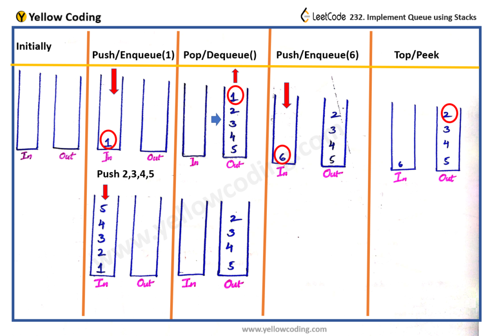

  - When we want to `add` an element, we just push it to the first stack.
  - When we want to `remove` an element, we move all elements from the first stack to the second stack, then pop the top element from the second stack.
  - When we want to `peek` an element, we move all elements from the first stack to the second stack, then peek the top element of the second stack.

```py
class Queue:
    def __init__(self):
        self.stack1 = []
        self.stack2 = []

    def add(self, item):
        self.stack1.append(item)

    def remove(self):
        # Move all items from stack1 to stack2
        if not self.stack2:
            while self.stack1:
                self.stack2.append(self.stack1.pop())
        return self.stack2.pop()

    def peek(self):
        # Move all items from stack1 to stack2
        if not self.stack2:
            while self.stack1:
                self.stack2.append(self.stack1.pop())
        return self.stack2[-1]

    def empty(self):
        return not self.stack1 and not self.stack2
```

---

## Stacks

### Implement Stack using Queues

```py
class MyStack:

    def __init__(self):
        self.q = collections.deque()

    def push(self, x: int) -> None:
        self.q.append(x)
        # rotate the queue so that the last element is the first one
        for _ in range(len(self.q) - 1):
            self.q.append(self.q.popleft())

    def pop(self) -> int:
        return self.q.popleft()

    def top(self) -> int:
        return self.q[0]

    def empty(self) -> bool:
        return len(self.q) == 0
```

---

### Valid Parentheses

Given a string `s` containing just the characters `'('`, `')'`, `'{'`, `'}'`, `'['` and `']'`, determine if the input string is valid.

- An input string is valid if:

  - Open brackets must be closed by the same type of brackets.
  - Open brackets must be closed in the correct order.

- EX: `s = "()[]{}"` --> `true`
- EX: `s = "([)]"` --> `false`

- Explanation:
  - Each time we encounter an `opening` bracket, we push it onto the stack.
  - Each time we encounter a `closing` bracket, we check if the top element of the stack is the corresponding opening bracket.
    - If it is, then we pop it off the stack. If it isn't, or if the stack is empty, then we return `false`.

```py
# Solution 1
def isValid(s):
    stack = []
    for char in s:
        if char == '(':
            stack.append(')')
        elif char == '[':
            stack.append(']')
        elif char == '{':
            stack.append('}')
        elif not stack or stack.pop() != char:
            return False
    return not stack
```

---

### Valid Parenthesis String

Same as [Valid Parentheses](#valid-parentheses) but here we have a third type of brackets `*` which can be used as a `left`, `right` or `empty` bracket.

- EX: `s = "(*))"` --> `true`
- EX: `s = "(*))"` --> `true`

```py
def checkValidString(s):
    left_stack = []
    star_stack = []

    for i in range(len(s)):
        if s[i] == '(':
            left_stack.append(i)
        elif s[i] == '*':
            star_stack.append(i)
        # if the current char is a right bracket
        else:
            # pop the top element from either the left_stack or the star_stack
            if left_stack:
                left_stack.pop()
            elif star_stack:
                star_stack.pop()
            # if both stacks are empty, return False
            else:
                return False

    while left_stack and star_stack:
        # if the top element of the left_stack is greater than the top element of the star_stack -> '*' is used as an empty string
        if left_stack[-1] > star_stack[-1]:
            return False
        # pop the top element of the left_stack and star_stack
        left_stack.pop()
        star_stack.pop()

    # if the left_stack is not empty -> there are more left brackets than right brackets
    if left_stack:
        return False

    return True
```

---

### Minimum Remove to Make Valid Parentheses

Given a string `s` of `'('` , `')'` and lowercase English characters. Remove the minimum number of parentheses ( `'('` or `')'`, in any positions ) so that the resulting parentheses string is valid and return **any** valid string.

- parenthesis string is valid if and only if:

  - It is the empty string, contains only lowercase characters, or
  - It can be written as `AB` (`A` concatenated with `B`), where `A` and `B` are valid strings, or
  - It can be written as `(A)`, where `A` is a valid string.

- EX: `s = "lee(t(c)o)de)"` --> `"lee(t(c)o)de"`

- Explanation:
  - To solve this problem, we need to use a stack to store the indices of the opening brackets.
  - so, it's better to convert the string into an array of characters, so we can modify it.
  - We iterate over the string and do the following:
    - If the current character is an opening bracket `(`, we push its `index` to the stack.
    - If the current character is a closing bracket `)`
      - if the stack is not empty, we pop the top element from the stack.
        - This indicates that we have found a matching opening bracket and closing bracket.
      - If the stack is empty, we replace the current character with an empty string `""`.
        - This means that the current closing bracket doesn't have a corresponding opening bracket, so we need to remove it.
    - at the end, if the stack is not empty, this means that there are more opening brackets than closing brackets, so we need to remove them. by replacing the indices of the opening brackets in the stack with empty strings `""`.

```py
def minRemoveToMakeValid(s):
    stack = []
    s = list(s)

    for i in range(len(s)):
        if s[i] == '(':
            stack.append(i)
        elif s[i] == ')':
            if stack:
                stack.pop()
            else:
                s[i] = ''

    # if the stack is not empty, this means that there are more opening brackets than closing brackets
    while stack:
        s[stack.pop()] = ''

    return ''.join(s)
```

---

### Minimum Add to Make Parentheses Valid

Given a string `s` of `'('` and `')'` parentheses, we add the minimum number of parentheses ( `'('` or `')'`, and in any positions ) so that the resulting parentheses string is valid.

- EX: `s = "())"` --> `1`
- EX: `s = "((("` --> `3`

- Explanation:
  - Same as previous problem, but we need to count the number of opening brackets that don't have a corresponding closing bracket.
  - So, we need to add the number of opening brackets that are left in the stack at the end to the result.
  - We don't need to check if the stack is empty or not, because we know that the string is valid, so the stack will be empty at the end.

```py
def minAddToMakeValid(s):
    res = 0
    stack = []

    for char in s:
        if char == '(':
            stack.append(char)
        elif char == ')':
            if stack:
                stack.pop()
            else:
                res += 1

    return res + len(stack) # add the number of opening brackets that are left in the stack at the end to the result
```

---

### Tag Validator

Given a string `code` representing a **valid** code snippet, implement a function `tag_validator` to parse the HTML code and return whether it is **valid**.

- EX: `code = "<DIV>This is the first line <![CDATA[<div>]]></DIV>"` --> `true`
  - Explanation:
    - The code is wrapped in a closed tag : `<DIV>`.
    - There is no leading or trailing whitespace.
    - The four tags ( `<DIV>`, `<![CDATA[`, `</DIV>` and `]]>`) are nested correctly.

```py
def tag_validator(code):
    stack = []
    i = 0

    while i < len(code):
        # check if the current tag is a closing tag
        if i > 0 and stack[-1] == '<':
            # get the tag name
            j = code.find('>', i)
            tag = code[i+1:j]
            # check if the tag name is valid
            if not tag.isupper() or len(tag) < 1 or len(tag) > 9:
                return False
            # check if the tag is the same as the last opening tag
            if not stack or stack.pop() != tag:
                return False
            i = j
        # check if the current tag is an opening tag
        elif code.startswith('<![CDATA[', i):
            # check if the stack is empty or the last element in the stack is not an opening tag
            if not stack or stack[-1] != '<':
                return False
            # get the index of the closing tag
            j = code.find(']]>', i)
            # check if the closing tag exists
            if j < 0:
                return False
            i = j + 3
        # check if the current tag is an opening tag
        elif code.startswith('</', i):
            # get the index of the closing tag
            j = code.find('>', i)
            # get the tag name
            tag = code[i+2:j]
            # check if the tag name is valid
            if not tag.isupper() or len(tag) < 1 or len(tag) > 9:
                return False
            # check if the stack is empty or the last element in the stack is not an opening tag
            if not stack or stack.pop() != tag:
                return False
            i = j
        # check if the current tag is an opening tag
        elif code.startswith('<', i):
            # get the index of the closing tag
            j = code.find('>', i)
            # get the tag name
            tag = code[i+1:j]
            # check if the tag name is valid
            if not tag.isupper() or len(tag) < 1 or len(tag) > 9:
                return False
            # add the tag to the stack
            stack.append(tag)
            i = j
        else:
            i += 1

    return not stack
```

---

## Monotonic Stack Technique

It's a stack that is either **strictly increasing** or **strictly decreasing**.

- The Monotonic Stacks technique is a useful technique that can be used in the following scenarios:

  - First element greater than an element, after (to the right of) it in the array - **(Monotonically Decreasing Stack)**.
  - First element greater than an element, before (to the left of) it in the array - **(Monotonically Decreasing Stack)**.
  - First element less than an element, after (to the right of) it in the array - **(Monotonically Increasing Stack)**.
  - First element less than an element, before (to the left of) it in the array - **(Monotonically Increasing Stack)**.

  ```py
  # EX of a Monotonically Increasing Stack
  arr = [5, 1, 7, 3, 0, 10, 2]

  # for arr[3]:
  # first element less than arr[3] after it in the array is arr[5] = 2
  # first element less than arr[3] before it in the array is arr[1] = 1
  # first element greater than arr[3] after it in the array is arr[2] = 7
  # first element greater than arr[3] before it in the array is arr[0] = 5
  ```

  - instead of scanning the array to find the next greater/smaller element `O(n^2)`, we can use a monotonic stack to find it in `O(n)` time.

- Example of `monotonic decreasing stack`:

  ```py
  # bottom --> [5, 4, 4, 2, 1] <-- top

  # 1.) bottom --> [5, 4, 4, 2, 1]: 1 is less than 3: pop() it!
  # 2.) bottom --> [5, 4, 4, 2]: 2 is less than 3: pop() it!
  # 3.) bottom --> [5, 4, 4]: 4 is not less than 3: push(3) onto the stack!
  # 4.) bottom --> [5, 4, 4, 3]: Done! :)
  ```

- It's used as a technique to solve problems that involve **finding the next greater/smaller element** in an array.
  - A simple solution to these problems is to sort and return the first / last `k` elements in the collections, but that would take `O(nlogn)` time.
  - Using a monotonic stack, we can solve these problems in `O(N log(k))` time and `O(k)` space.
- This technique is also used with a `heap` to solve problems that involve **finding the next greater/smaller element** in an array.

### Next Greater Element

You are given two arrays (without duplicates) `nums1` and `nums2` where `nums1`’s elements are subset of `nums2`. Find all the next greater numbers for `nums1`'s elements in the corresponding places of `nums2`.

The Next Greater Number of a number `x` in `nums1` is the first greater number to its right in `nums2`. If it does not exist, output -1 for this number.

- EX: `nums1 = [4, 1, 2], nums2 = [1, 3, 4, 2]` --> `[-1, 3, -1]`
  - For number `4` in the first array, you cannot find the next greater number for it in the second array, so output `-1`.
  - For number `1` in the first array, the next greater number for it in the second array is `3`.
  - For number `2` in the first array, there is no next greater number for it in the second array, so output `-1`.
- **Explanation**
  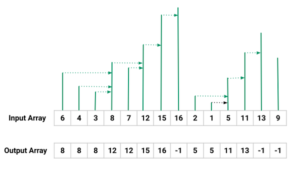
  
  

> **Note:** we start by checking the stack and not with appending to it because the last element in `nums2` won't have any next greater elements by default

```py
def next_greater_element(nums1, nums2):
  # create a stack to store the numbers that we have not found the next greater element for them
  stack = []
  # create a dictionary to store the index for each element in nums1
  nums1Idx = {num: i for i, num in enumerate(nums1)}
  # for each element in nums1, store its index in the dictionary
  res = [-1] * len(nums1)

  for cur in nums2:
    # if the stack is not empty and the current number is greater than the top element of the stack (using while loop to check all the elements in the stack that are smaller than the current number to get the next greater element for them)
    while stack and cur > stack[-1]:
      # pop the top element of the stack and store the next greater element for it
      val = stack.pop()
      idx = nums1Idx[val]
      res[idx] = cur

    # if the current number is in nums1, push it to the stack
    if cur in nums1Idx:
          stack.append(cur)

  return res
```

---

### Next Greater Element II

Given a circular array (the next element of the last element is the first element of the array), print the Next Greater Number for every element. The Next Greater Number of a number `x` is the first greater number to its traversing-order next in the array, which means you could search circularly to find its next greater number. If it doesn't exist, output -1 for this number.

- EX: `[1, 2, 1]` --> `[2, -1, 2]`
  - The first 1's next greater number is 2;
  - The number 2 can't find next greater number;
  - The second 1's next greater number needs to search circularly, which is also 2.
- **Steps:**
  1. We create an empty stack and an empty result array of the same length as the input array `nums`.
  2. We iterate through the input array `nums` twice, but treat it as a circular list by iterating through it (twice length of the array).
  3. Here, we don't use a hash map as we're going to be indexing the stack (adding indexes not values) -- we can use a hash map, but it will be un-useful space
  4. for each element in the input array, we check if the stack is not empty and the current number is greater than the top element of the stack. If so, we pop the top element of the stack and store the next greater element for it.

```py
def next_greater_element(nums):
    n = len(nums)
    # create a stack to store the indices of the numbers that we have not found the next greater element for them
    stack = []
    result = [-1] * n

    # we need to traverse the array twice because it is circular, so we need to double the length of the array
    for i in range(2 * n):
        # if the stack is not empty and the current number is greater than the top element of the stack
        while stack and nums[i % n] > nums[stack[-1]]:
            # pop the top element of the stack and store the next greater element for it
            result[stack.pop()] = nums[i % n]

        # push the current number to the stack
        stack.append(i % n)

    return result
```

---

### Daily Temperatures

Given a list of daily temperatures `T`, return a list such that, for each day in the input, tells you how many days you would have to wait until a warmer temperature. If there is no future day for which this is possible, put `0` instead.

- EX: `[73, 74, 75, 71, 69, 72, 76, 73]` --> `[1, 1, 4, 2, 1, 1, 0, 0]`
  - For the first 3 days, the next warmer day is just `1` day away.
  - For the rest of the days, you would have to wait until the next warmer day (`4` days for the `3rd` day, `2` days for the `4th` day, etc).
- Steps:
  

  - For each day, we need to find how many days we need to wait until a warmer temperature.
  - We use a **monotonic decreasing stack** to store the indices of the days that we have not found the next warmer day for them (days that are colder than the current day).
    - `mono-decreasing stack`: a stack that is sorted in a decreasing order (last element is the smallest element in the stack).
  - Then we get number of days we need to wait until a warmer temperature by subtracting the current day index from the top element of the stack (which is the index of the next warmer day).

  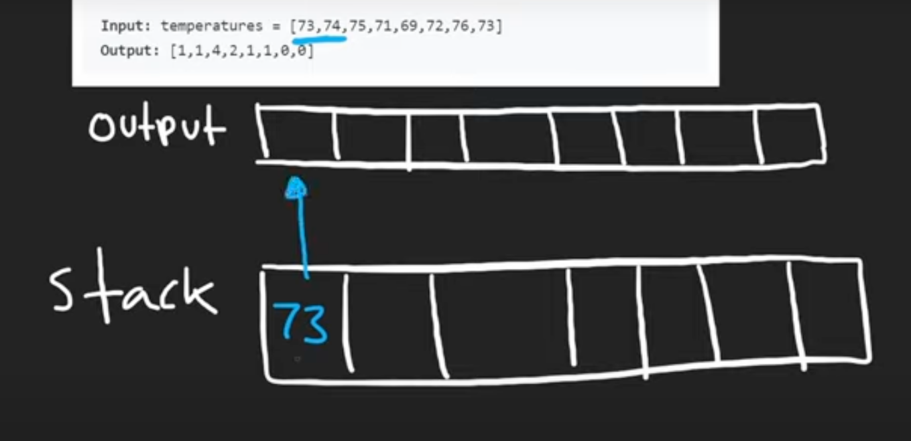
  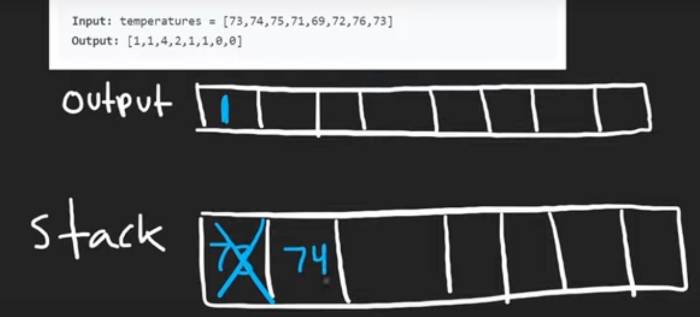
  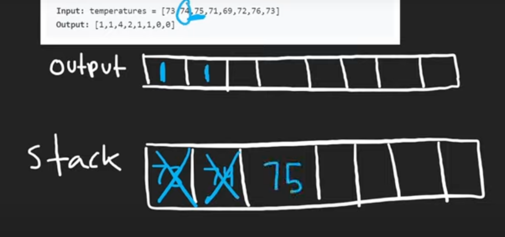
  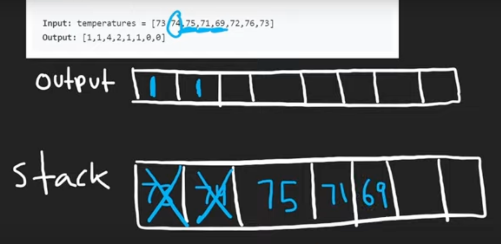
  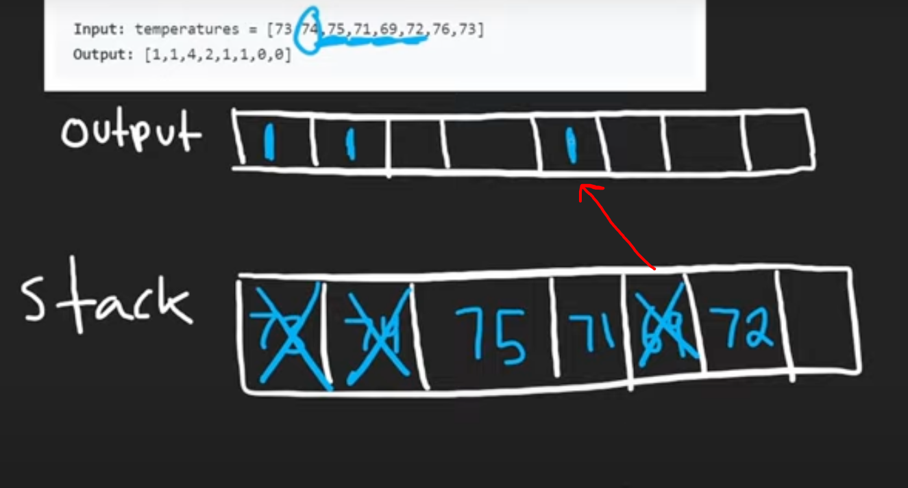
  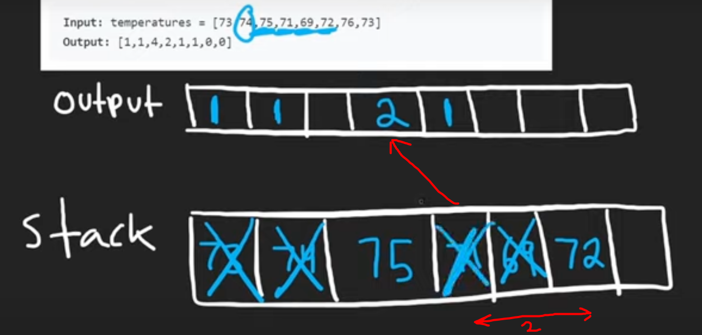
  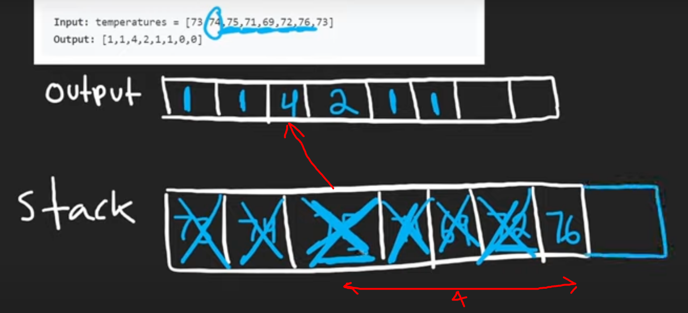
  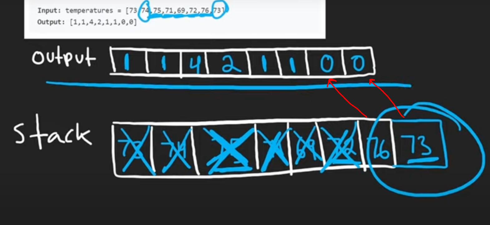

```py
def daily_temperatures(temperatures):
    res = [0] * len(temperatures)
    stack = []

    for i, t in enumerate(temperatures):
      while stack and t > temperatures[stack[-1]]:
          idx = stack.pop()
          res[idx] = i - idx
      stack.append(i)

    return res
```

---

## Maximum Frequency Stack

Implement `FreqStack`, a class which simulates the operation of a stack-like data structure.

`FreqStack` has two functions:

1. `push(int x)`, which pushes an integer `x` onto the stack.
2. `pop()`, which removes and returns the most frequent element in the stack.

- If there is a tie for most frequent element, the element closest to the top of the stack is removed and returned.

- EX:

  - `push(5)`, `push(7)`, `push(5)`, `push(7)`, `push(4)`, `push(5)`, `pop()`, `pop()`, `pop()`, `pop()` --> `[5, 7, 5, 4]`

- Explanation:
  - Although this is a "max frequency" problem, we won't use a `MaxHeap` because we may have elements with the same frequency, and we need to pop the element that is closest to the top of the stack. **So we will use a `Stack`**
  - We need to keep track of the frequency of each element, so we use a `hash map` to store the frequency of each element.
    - `freq = {5: 3, 7: 2, 4: 1}`
  - We also need to keep track of the elements with the same frequency, so we use a `hash map` to store the elements with the same frequency in a `list`.
    - `group = {1: [4], 2: [7], 3: [5]}`
    - It's like `Bucket Sort` where the key is the frequency and the value is the list of elements with the same frequency.
      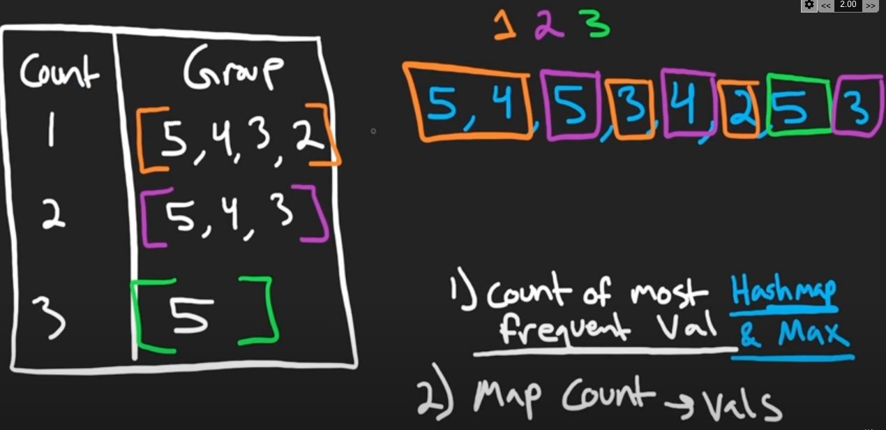
  - We also need to keep track of the maximum frequency, so we use a `maxfreq` variable to store the maximum frequency.

```py
class FreqStack:
    def __init__(self):
        self.freq = {}
        self.maxfreq = 0
        self.stacks = {} # dictionary of stacks

    def push(self, val):
        f = self.freq.get(val, 0) + 1
        self.freq[val] = f # update the frequency of the element

        if f > self.maxfreq:
            self.maxfreq = f
            self.stacks[self.maxfreq] = [] # create a new stack for the new maxfreq
        self.stacks[f].append(val)

    def pop(self):
        val = self.stacks[self.maxfreq].pop() # pop the element with the maxfreq
        self.freq[val] -= 1 # update the frequency of the element
        if not self.stacks[self.maxfreq]: # if the stack is empty
            self.maxfreq -= 1 # decrement the maxfreq

        return val
```
