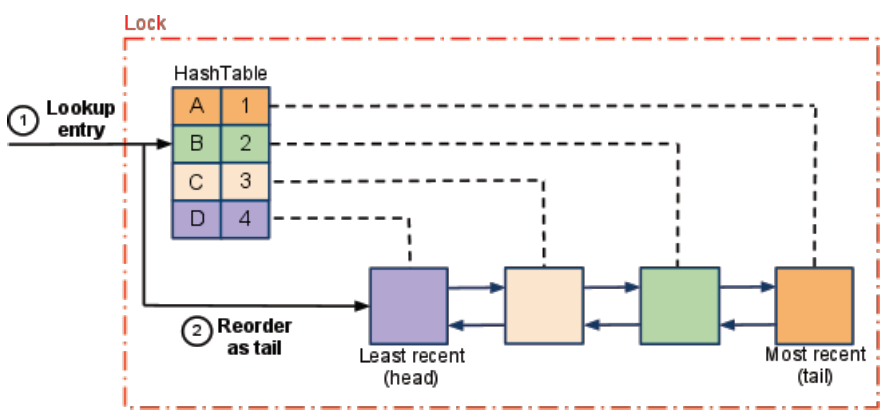

# INDEX

- [INDEX](#index)
  - [Two sum](#two-sum)
  - [Majority Element](#majority-element)
  - [Majority Element II](#majority-element-ii)
  - [Intersection of Two Arrays](#intersection-of-two-arrays)
  - [Valid Anagram](#valid-anagram)
  - [Group Anagrams](#group-anagrams)
  - [Unique Number of Occurrences](#unique-number-of-occurrences)
  - [Contains Duplicate II](#contains-duplicate-ii)
  - [Verifying an Alien Dictionary](#verifying-an-alien-dictionary)
  - [Isomorphic Strings](#isomorphic-strings)
  - [Hand of Straights](#hand-of-straights)
  - [4Sum II](#4sum-ii)
  - [Repeated DNA Sequences](#repeated-dna-sequences)
    - [Longest Consecutive Sequence](#longest-consecutive-sequence)
  - [LRU Cache](#lru-cache)

---

## Two sum

| Video Solution                                                | Hint                                                                                                                                   |
| ------------------------------------------------------------- | -------------------------------------------------------------------------------------------------------------------------------------- |
| [Video Solution](https://www.youtube.com/watch?v=KLlXCFG5TnA) | Use a dictionary to store the number and its index and then iterate through the array and check if the complement is in the dictionary |

---

Given an array of integers `nums` and an integer `target`, return indices of the two numbers such that they add up to `target`.

- You may assume that each input would have **exactly one solution**, and you may not use the same element twice.

- EX:

  - Input: `nums = [2,7,11,15], target = 9`
  - Output: `[0,1]`
  - Output: Because `nums[0] + nums[1] == 9`, we return `[0, 1]`.

- Explanation:
  - Bruteforce solution is that we can use `2` nested loops to iterate through the array and check if the sum of the current `2` numbers is equal to the target
    
  - if we know that the array has `2` numbers that add up to the `target`, we can find the second number by subtracting the first number from the target
  - we can use a dictionary to store the number and its index and then iterate through the array and check if the `complement` is in the dictionary
    
    - `dictionary = {num: index}`
    - `complement = target - num`
  - We iterate only once through the array, as we guarantee that the **previous** numbers will be in the dictionary

```py
def twoSum(self, nums: List[int], target: int) -> List[int]:
    # create a dictionary to store the number and its index
    prevDict = {}

    # iterate through the nums
    for i, num in enumerate(nums):
        complement = target - num
        # if the complement is in the dictionary, return the indices
        if complement in prevDict:
            return [prevDict[complement], i]
        # if the complement is not in the dictionary, add the number and its index to the dictionary
        prevDict[num] = i
```

---

## Majority Element

| Video Solution                                                | Hint                                                                                                                                  |
| ------------------------------------------------------------- | ------------------------------------------------------------------------------------------------------------------------------------- |
| [Video Solution](https://www.youtube.com/watch?v=7pnhv842keE) | Use a dictionary to store the frequency of each number and if the frequency of the current number is greater than `n // 2`, return it |

Given an array `nums` of size `n`, return the majority element.

The majority element is the element that appears more than `⌊n / 2⌋` times. You may assume that the majority element always exists in the array.

- EX:

  - Input: `nums = [3,2,3]`
  - Output: `3`

- Explanation:
  - Bruteforce solution is that we can use `2` nested loops to iterate through the array and check if the count of the current number is greater than `n/2`
  - we can use a dictionary to store the frequency of each number and then iterate through the dictionary and return the number with the max count

```py
def majorityElement(nums):
    count = {}
    for num in nums:
        freq = count.get(num, 0) + 1
        count[num] = freq

        if freq > len(nums) / 2:
            return num

    return -1
```

- **Follow-up:** Can you solve the problem in `O(1)` space complexity and `O(n)` time complexity?

  - We can use **Boyer-Moore Voting Algorithm** to solve this problem in `O(1)` space complexity and `O(n)` time complexity
  - The algorithm works as follows:
    - We maintain a `count` variable to store the count of the current number and a `candidate` variable to store the current candidate
    - We iterate through the array and check if the `count` is `0`, if it is, we set the current number as the `candidate`
    - If the current number is equal to the `candidate`, we increment the `count` by `1`, otherwise we decrement the `count` by `1`
    - At the end, we return the `candidate`

  ```py
  def majorityElement(nums):
      res, count = 0, 0

        for n in nums:
            if count == 0:
                res = n
            count += (1 if n == res else -1)

        return res
  ```

---

## Majority Element II

| Video Solution                                                | Hint                                                                                                                                                                                                                        |
| ------------------------------------------------------------- | --------------------------------------------------------------------------------------------------------------------------------------------------------------------------------------------------------------------------- |
| [Video Solution](https://www.youtube.com/watch?v=Eua-UrQ_ANo) | Use a dictionary to store the frequency of each number and then iterate through the dictionary and check if the frequency of the current number is greater than `n // 3`, return it **OR** use Boyer-Moore Voting Algorithm |

Given an integer array of size `n`, find all elements that appear more than `⌊ n/3 ⌋` times.

- EX:

  - Input: `nums = [3,2,3]`
  - Output: `[3]`

- Explanation:
  - Same as the previous problem, we can use a dictionary to store the frequency of each number and then iterate through the dictionary and check if the frequency of the current number is greater than `n // 3`, return it

```py
def majorityElement(nums):
    count = {}
    for num in nums:
        count[num] = count.get(num, 0) + 1

    res = []
    for num in count:
        if count[num] > len(nums) // 3:
            res.append(num)

    return res
```

- **Follow-up**: Could you solve the problem in linear time and in `O(1)` space?

  ```py
  def majorityElement(nums):
      res = []
      count1, count2, candidate1, candidate2 = 0, 0, 0, 1

      for n in nums:
          if n == candidate1:
              count1 += 1
          elif n == candidate2:
              count2 += 1
          elif count1 == 0:
              candidate1, count1 = n, 1
          elif count2 == 0:
              candidate2, count2 = n, 1
          else:
              count1 -= 1
              count2 -= 1

      for c in [candidate1, candidate2]:
          if nums.count(c) > len(nums) // 3:
              res.append(c)

      return res
  ```

---

## Intersection of Two Arrays

| Video Solution | Hint                                                                                                                                                                                            |
| -------------- | ----------------------------------------------------------------------------------------------------------------------------------------------------------------------------------------------- |
| NA             | Use a hash set to store the numbers in the first array and then iterate through the second array and check if the number is in the second array and not in the hash set, add it to the hash set |

Given two integer arrays `nums1` and `nums2`, return an array of their intersection. Each element in the result must be **unique** and you may return the result in **any order**.

- EX:

  - Input: `nums1 = [1,2,2,1], nums2 = [2,2]`
  - Output: `[2]`

```py
# Approach 1: using hash table
def intersection(nums1, nums2):
    # create a dictionary to store the frequency of each number in the first array
    count = {}
    for num in nums1:
        count[num] = count.get(num, 0) + 1

    # iterate through the second array and check if the number is in the dictionary
    result = []
    for num in nums2:
        if num in count:
            result.append(num)
            del count[num]

    return result

# ------------------------------------------------------

# Approach 2: using set
def intersection(nums1, nums2):
    res = set()

    for num in nums1:
        if num in nums1 and num not in res:
            res.add(num)

    return list(res)
```

- Time complexity: `O(n * m)` where `n` is the length of the first array and `m` is the length of the second array
  - This is because we iterate through the first array and for each number, we iterate through the second array to check if the number is in the second array
  - We can improve the time complexity by using a hash set to store the numbers in the first array and then iterate through the second array and check if the number is in the second array and not in the hash set, add it to the hash set -> `O(n + m)`
- Space complexity: `O(n)` where `n` is the length of the first array
  - This is because we use a dictionary / set to store the frequency of each number in the first array

---

## Valid Anagram

| Video Solution                                                | Hint                                                                                                                                                             |
| ------------------------------------------------------------- | ---------------------------------------------------------------------------------------------------------------------------------------------------------------- |
| [Video Solution](https://www.youtube.com/watch?v=9UtInBqnCgA) | Use 2 dictionaries to store the frequency of each character in each string and then compare the dictionaries to check if the count of each character is the same |

An anagram is a word or phrase formed by rearranging the letters of a different word or phrase, typically using all the original letters exactly once.

- EX: `cinema` and `iceman` are anagrams of each other.

```py
# Time: O(s) | Space: O(s + t)
def is_anagram(s, t):
    if len (s) != len(t):
        return False

    countS, countT = {}, {}
    for i in range(len(s)):
        countS[s[i]] = 1 + countS.get(s[i], 0)
        countT[t[i]] = 1 + countT.get(t[i], 0)
    for c in countS:
        if countS[c] != countT.get(c, 0):
            return False
    return True

# Solution: 2 (using O(1) memory)
# Time: O(n log(n)) | Space: O(1)
def is_anagram(s, t):
    return sorted(s) == sorted(t)
```

- Time complexity: `O(s + t) ~ O(n)` where `s` is the length of the first string and `t` is the length of the second string
- Space complexity: `O(s + t) ~ O(n)` where `s` is the length of the first string and `t` is the length of the second string

- **Follow up:** can you solve it in `O(1)` space complexity?

  - We can sort the strings and then compare them to check if they're anagrams of each other

    ```py
    def is_anagram(s, t):
        return sorted(s) == sorted(t)
    ```

  - Time complexity: `O(n log(n))` or base on the sorting algorithm used

---

## Group Anagrams

| Video Solution                                                | Hint                                                                                                                                                                                                                                                   |
| ------------------------------------------------------------- | ------------------------------------------------------------------------------------------------------------------------------------------------------------------------------------------------------------------------------------------------------ |
| [Video Solution](https://www.youtube.com/watch?v=vzdNOK2oB2E) | Use a dictionary to store the sorted string as the key and the list of anagrams as the value (don't forget to join the sorted string because the sorted function returns an array), **OR** store the charCount as a `tuple` of `26` numbers as the key |

Given an array of strings `strs`, group the anagrams together. You can return the answer in **any order**.

- EX:

  - Input: `strs = ["eat","tea","tan","ate","nat","bat"]`
  - Output: `[["bat"],["nat","tan"],["ate","eat","tea"]]`
    

- **Solution 1: O(m . n log(n))**

  - we can use a dictionary to store the sorted string as the key and the list of anagrams as the value
  - we can iterate through the array and sort each string and then add it to the dictionary
    - IMPORTANT: we need to `join` the sorted string because the sorted function returns an array
  - Time complexity: `O(m . n log(n))` where:
    - `m` is the length of the array
    - `n` is the length of the longest string in the array (because we're sorting each string)

  ```py
  def group_anagrams(strs):
      # key: sorted string | value: list of anagrams
      anagrams = {}

      for s in strs:
          sorted_s = ''.join(sorted(s)) # joining because sorted returns an array
          if sorted_s not in anagrams:
              anagrams[sorted_s] = [s]
          else:
              anagrams[sorted_s].append(s)

      return anagrams.values()

  # or using defaultdict
  def group_anagrams(strs):
      # key: sorted string | value: list of anagrams
      anagrams = defaultdict(list)

      for s in strs:
          sorted_s = ''.join(sorted(s))
          anagrams[sorted_s].append(s)

      return anagrams.values()
  ```

- **Solution 2: O(n)**

  - we can use a dictionary to store the (count of each characters in a string) as the key and the list of anagrams as the value
  - we can iterate through the array and count the frequency of each character and then add it to the dictionary
  - Time complexity: `O(n.m.26)` -> `O(n.m)` where:
    - `n` is the length of the array
    - `m` is the length of the longest string in the array
    - `26` is the number of characters in the alphabet
  - Space complexity: `O(n.m.26)` -> `O(n.m)` where:
    - `n` is the length of the array
    - `m` is the length of the longest string in the array

  ```py
  def group_anagrams(strs):
      # key: charCount | value: list of anagrams
      anagrams = {}

      for s in strs:
          # create an array to store the frequency of each character in the string
          count = [0] * 26 # a ... z
          for c in s:
              idx = ord(c) - ord('a') # a = 80 - 80 = 0, b = 81 - 80 = 1, ...
              count[idx] += 1

          # convert the array to a tuple to use it as a key in the dictionary
          key = tuple(count)

          if key not in anagrams:
              anagrams[key] = [s]
          else:
              anagrams[key].append(s)

      return anagrams.values()
  ```

---

## Unique Number of Occurrences

| Video Solution                                                | Hint                                                                                                                                                |
| ------------------------------------------------------------- | --------------------------------------------------------------------------------------------------------------------------------------------------- |
| [Video Solution](https://www.youtube.com/watch?v=vuYlOjpqxXs) | Use a dictionary to store the frequency of each number and then use a `hash set` to store check if the length of the dictionary `values` are unique |

Given an array of integers arr, return true if the number of occurrences of each value in the array is unique or false otherwise.

- EX:

  - Input: `arr = [1,2,2,1,1,3]`
  - Output: `true`
  - Explanation: The value `1` has 3 occurrences, 2 and 3 both have 2 occurrences, so the answer is `true`.

```py
def uniqueOccurrences(arr):
  # Count the number of occurrences of each value
  count = {}
  for num in arr:
      count[num] = count.get(num, 0) + 1

  # Check if the number of occurrences is unique
  occurrences = set(count.values())
  return len(occurrences) == len(count)
```

---

## Contains Duplicate II

| Video Solution                                                | Hint                                                                                                                                                                                                                                        |
| ------------------------------------------------------------- | ------------------------------------------------------------------------------------------------------------------------------------------------------------------------------------------------------------------------------------------- |
| [Video Solution](https://www.youtube.com/watch?v=ypn0aZ0nrL4) | Use a dictionary to store the index of each number and then iterate through the array and check if the current number is in the dictionary and if the difference between the indices is less than or equal `k`, **OR** use a sliding window |

Given an integer array `nums` and an integer `k`, return `true` if there are two distinct indices `i` and `j` in the array such that `nums[i] == nums[j]` and `abs(i - j) <= k`.

- EX:

  - Input: `nums = [1,2,3,1], k = 3`
  - Output: `true`

- **Solution 1:** using HashMap

  - Time complexity: `O(n)` where `n` is the length of the array
  - Space complexity: `O(n)` where `n` is the length of the array

  ```py
  def containsNearbyDuplicate(nums, k):
      num_index = {} # num: idx

      for i, num in enumerate(nums):
          if num in num_index and i - num_index[num] <= k:
              return True
          num_index[num] = i

      return False
  ```

- **Solution 2:** sliding window

  - Time complexity: `O(n)` where `n` is the length of the array
  - Space complexity: `O(k)` where `k` is the length of the window 🔥

  ```py
  def containsNearbyDuplicate(nums, k):
      window = set() # window must has length <= k
      l = 0
      for r in range(len(nums)):
          if nums[r] in window:
              return True
          window.add(nums[r])

          # shrink the window if invalid-window
          if (r - l + 1) > k:
              window.remove(nums[l])
              l += 1

      return False
  ```

---

## Verifying an Alien Dictionary

| Video Solution                                                | Hint                                                                                                                                                                                                                                                  |
| ------------------------------------------------------------- | ----------------------------------------------------------------------------------------------------------------------------------------------------------------------------------------------------------------------------------------------------- |
| [Video Solution](https://www.youtube.com/watch?v=ypn0aZ0nrL4) | Use a dictionary to store the index of each alien character and then iterate through the array and check if the current word is lexicographically greater than the next word, This is done by comparing each pair of adjacent characters in the words |

In an alien language, surprisingly they also use English lowercase letters, but possibly in a different order. The order of the alphabet is some permutation of lowercase letters.

Given a sequence of `words` written in the alien language, and the `order` of the alphabet, return `true` if and only if the given `words` are sorted lexicographicaly in this alien language.

- EX:

  - Input: `words = ["hello","leetcode"], order = "hlabcdefgijkmnopqrstuvwxyz"`
  - Output: `true`
  - Explanation: As 'h' comes before 'l' in this language, then the sequence is sorted.

- Explanation:
  - We can use a dictionary to store the order of each character in the alien language
  - Then we can iterate through the words and compare each pair of adjacent words
    - If the first word is a substring of the second word (`len(word1)` less than `len(word2)`), then the words are sorted
    - If the first word is lexicographically greater than the second word, then the words are not sorted
  - Time complexity: `O(n)` where `n` is the total number of characters in all the words
  - Space complexity: `O(1)`

```py
def isAlienSorted(words, order):
    # char -> index
    order_index = {c: i for i, c in enumerate(order)}

    # Iterate through the words and compare each pair words to check if they're in-order
    for i in range(len(words) - 1):
        w1 = words[i]
        w2 = words[i+1]

        # looping through the characters of the first word because the first word is a substring of the second word
        for j in range(len(w1)):
            # If we reached the end of word2 but not word1, then the words are not sorted
            if j == len(w2): return False
            # If the first word is lexicographically greater than the second word, then the words are not sorted
            if w1[j] != w2[j]:
                # check order index for each character
                if order_index[w1[j]] > order_index[w2[j]]: return False
                break # because we found the different character, and it's valid

    return True
```

---

## Isomorphic Strings

| Video Solution                                                | Hint                                                                                                                                                                                                                              |
| ------------------------------------------------------------- | --------------------------------------------------------------------------------------------------------------------------------------------------------------------------------------------------------------------------------- |
| [Video Solution](https://www.youtube.com/watch?v=7yF-U1hLEqQ) | Use 2 dictionaries to store the corresponding characters in each string and then iterate through the strings using `zip()` and check if the current characters are in the dictionaries in both directions, if not, return `False` |

Given two strings `s` and `t`, determine if they are isomorphic.

> Two strings `s` and `t` are isomorphic if the characters in `s` can be replaced to get `t`.
> 

- EX: `s = "egg", t = "add"` -> `True`
- Explanation:

  - Note that "No two characters may map to the same character, but a character may map to itself.", so we need to map each character in `s` to a unique character in `t` and vice versa.
  - we must check if the characters in `s` can be replaced to get `t` and vice versa. This is done by:
    

    1. creating a dictionary to keep track of the corresponding characters in each string
    2. check if the current characters are in the dictionaries, if not, add them
    3. if they are in the dictionaries, check if they correspond to each other and if not return `False`

Time Complexity: `O(n)`

```py
def isIsomorphic(s, t):
    # Initialize dictionaries to keep track of the corresponding characters in each string
    mapST, mapTS = {}, {}

    for c1, c2 in zip(s, t):
        if (c1 in mapST and mapST[c1] != c2) or (c2 in mapTS and mapTS[c2] != c1):
            return False
        mapST[c1] = c2
        mapTS[c2] = c1

    return True
```

---

## Hand of Straights

| Video Solution                                                | Hint                                                                                                                                                                                                                                                                                                                                                   |
| ------------------------------------------------------------- | ------------------------------------------------------------------------------------------------------------------------------------------------------------------------------------------------------------------------------------------------------------------------------------------------------------------------------------------------------ |
| [Video Solution](https://www.youtube.com/watch?v=amnrMCVd2YI) | Create a dictionary to store the frequency of each card and then use a `minHeap` to get the minimum value in `O(1)` time instead of getting the minimum of `freq.values()` each time in `O(n)` time, then iterate through the `minHeap` and check if the next `W` cards are consecutive by returning `False` if the next card is not in the dictionary |

Alice has a `hand` of cards, given as an array of integers. Now she wants to rearrange the cards into groups so that each group is size `W`, and consists of `W` **consecutive** cards. Return `true` if and only if she can.

- EX:

  - Input: `hand = [1,2,3,6,2,3,4,7,8], W = 3`
  - Output: `true`
  - Explanation: Alice's hand can be rearranged as `[1,2,3],[2,3,4],[6,7,8]`

- Explanation:

  - we can be **greedy** and look for the minimum value available each time and start a group from there

    - because we know that the minimum value will be the start of a group -> `[1, 2, 3]` and we can't have `1` again in the next group because it's already used

  - We can use a dictionary to store the frequency of each card
    
  - we will use a `minHeap` for this to get the minimum value in `O(1)` time instead of getting the minimum of `freq.values()` each time in `O(n)` time
    
  - We must have consecutive cards in each group, so we can iterate from the **current card value not index** to the required group size and check if the next `W` cards are consecutive (by returning `False` if the next card is not in the dictionary)

```py
def isNStraightHand(hand, groupSize):
    # if the hand is not divisible by the groupSize
    if len(hand) % groupSize != 0:
        return False

    # create a dictionary to store the frequency of each card
    freq = {}
    for card in hand:
        freq[card] = freq.get(card, 0) + 1

    # use a minHeap to get the minimum value in O(1) time
    minHeap = list(freq.keys())
    heapq.heapify(minHeap)

    while minHeap:
        # get the minimum value
        first = minHeap[0]

        for i in range(first, first + groupSize):
            # if the card is not in the dictionary, return False
            if i not in freq:
                return False
            # if the card is in the dictionary, decrement its frequency
            freq[i] -= 1
            # if the card's frequency is 0, remove it from the dictionary
            if freq[i] == 0:
                if i != first:
                    return False
                heapq.heappop(minHeap)

    return True
```

- Another solution: using a sorted array instead of a minHeap **(Better ✅)**

  ```py
  def isNStraightHand(self, hand: List[int], groupSize: int) -> bool:
      # if the hand is not dividable by the groupSize
      if len(hand) % groupSize != 0:
          return False

      # create a dictionary to store the frequency of each card
      freq = {}
      for card in hand:
          freq[card] = freq.get(card, 0) + 1

      # sort the hand
      hand.sort()

      # iterate through the hand
      for card in hand:
          # if the card is not in the dictionary, continue
          if card not in freq:
              continue

          # iterate through the next `groupSize` cards, starting from the current card because the hand is sorted and we want to check if the next `groupSize` cards are consecutive -> [card, card+1, card+2, ..., card+groupSize-1] -> [1, 2, 3, ..., groupSize], [2, 3, 4, ..., groupSize+1], [3, 4, 5, ..., groupSize+2], ...
          for i in range(card, card + groupSize):
              # if the card is not in the dictionary, return False
              if i not in freq:
                  return False
              # if the card is in the dictionary, decrement its frequency
              freq[i] -= 1
              # if the card's frequency is 0, remove it from the dictionary
              if freq[i] == 0:
                  del freq[i]

      # if the dictionary is empty, return True
      return len(freq) == 0
  ```

---

## 4Sum II

| Video Solution                                                | Hint                                                                                                                                                                                                                                     |
| ------------------------------------------------------------- | ---------------------------------------------------------------------------------------------------------------------------------------------------------------------------------------------------------------------------------------- |
| [Video Solution](https://www.youtube.com/watch?v=kku30O4XpOg) | Use a dictionary to store the sum of each pair of numbers in the first two arrays and then iterate through the second two arrays and check if the complement is in the first dictionary, add the product of the frequencies to the count |

Given four lists `A`, `B`, `C`, `D` of integer values, compute how many tuples `(i, j, k, l)` there are such that `A[i] + B[j] + C[k] + D[l]` is zero.

- Ex: `A = [ 1, 2], B = [-2,-1], C = [-1, 2], D = [ 0, 2]`

  - Output: `2`
  - Explanation: The two tuples are:
    1. `(0, 0, 0, 1)` -> `A[0] + B[0] + C[0] + D[1] = 1 + (-2) + (-1) + 2 = 0`
    2. `(1, 1, 0, 0)` -> `A[1] + B[1] + C[0] + D[0] = 2 + (-1) + (-1) + 0 = 0`

- Explanation:
  - We can use a dictionary to store the sum of each pair of numbers in the first two arrays
  - Then we can iterate through the second two arrays and check if the complement is in the first dictionary
  - If the complement is in the first dictionary, add the product of the frequencies to the count
    - We add the product of the frequencies because we want to count the number of tuples `(i, j, k, l)` there are such that `A[i] + B[j] + C[k] + D[l]` is zero
    - We don't add`1` because we want to count the number of tuples, not the number of sums that are equal to `0`

```py
def fourSumCount(A, B, C, D):
    # create a dictionary to store the sum of each pair of numbers in A and B
    sumAB = {}
    for a in A:
        for b in B:
            sumAB[a+b] = sumAB.get(a+b, 0) + 1

    # iterate through the keys of the first dictionary
    count = 0
    for c in C:
        for d in D:
            # if the complement is in the first dictionary, add the product of the frequencies to the count
            if -(c+d) in sumAB:
                count += sumAB[-(c+d)]

    return count
```

- Time complexity: `O(a * b + c * d)` where `a` is the length of the first array, `b` is the length of the second array, `c` is the length of the third array, and `d` is the length of the fourth array

  - This is because we iterate through the first two arrays and then iterate through the second two arrays
  - It will be `O(n^2)` if all the arrays have the same length
  - Space complexity: `O(a * b)` where `a` is the length of the first array and `b` is the length of the second array
    - This is because we store the sum of each pair of numbers in the first two arrays in a dictionary

---

## Repeated DNA Sequences

| Video Solution                                                | Hint                                                                                                                                                                 |
| ------------------------------------------------------------- | -------------------------------------------------------------------------------------------------------------------------------------------------------------------- |
| [Video Solution](https://www.youtube.com/watch?v=FzTYfsmtOso) | Use a dictionary to store the frequency of each substring (`s[i:i+10]`) and then iterate through the dictionary and return the substrings that occur more than once. |

The **DNA sequence** is composed of series of nucleotides abbreviated as `'A'`, `'C'`, `'G'`, and `'T'`.

- For example, `"ACGAATTCCG"` is a **DNA sequence**.

Given a **DNA sequence** `s`, return all the **10-letter-long** sequences (substrings) that occur more than once in a DNA molecule. You may return the answer in **any order**.

- Ex: `s = "AAAAACCCCCAAAAACCCCCCAAAAAGGGTTT"`

  - Output: `["AAAAACCCCC", "CCCCCAAAAA"]`
  - Explanation: `"AAAAACCCCC"` appears twice, and `"CCCCCAAAAA"` appears twice.

- Explanation:
  - We can use a dictionary to store the frequency of each substring and then iterate through the dictionary and return the substrings that occur more than once
    - substring: `s[i:i+10]`
  - Time complexity: `O(n)` where `n` is the length of the string
  - Space complexity: `O(n)` where `n` is the length of the string

```py
def findRepeatedDnaSequences(s):
    # create a dictionary to store the frequency of each substring
    count = {}
    for i in range(len(s)-9):
        cur = s[i:i+10]
        count[cur] = count.get(cur, 0) + 1

    # iterate through the dictionary and return the substrings that occur more than once
    res = []
    for key in count:
        if count[key] > 1:
            res.append(key)

    return res
```

---

### Longest Consecutive Sequence

| Video Solution                                                | Hint                                                                                                                                                                                                                                                                                                                                                                                                                                   |
| ------------------------------------------------------------- | -------------------------------------------------------------------------------------------------------------------------------------------------------------------------------------------------------------------------------------------------------------------------------------------------------------------------------------------------------------------------------------------------------------------------------------- |
| [Video Solution](https://www.youtube.com/watch?v=P6RZZMu_maU) | Use a `hash set` to store the numbers and then iterate through the `set` and check if the current number is the start of a sequence (by checking if the previous number is in the `set`), then check if the next number is in the `set` using a `while` loop to increment the current number and the current streak. Reset the current number and the current streak if the current number doesn't have a previous number in the `set` |

Given an unsorted array of integers `nums`, return the length of the longest consecutive elements sequence.

- Ex:

  - Input: `nums = [100,4,200,1,3,2]`
  - Output: `4`
  - Explanation: The longest consecutive elements sequence is `[1, 2, 3, 4]`. Therefore its length is `4`.

- Explanation

  - The brute force solution is to **sort** the array and then loop through the array and check if the current number is the start of a sequence, then loop through the array and check if the next number is in the array, and keep track of the longest sequence
    - Time complexity: `O(n log(n))` ❌
  - Instead, we can use a `hash set` to store the numbers, so that we can check if the current number is the start of a sequence by checking if the previous number is in the set
  - Then loop through the `set` and check if the next number is in the set, and keep track of the longest sequence by using a `while` loop to increment the current number and the current streak
    
  - We check if the current number is **the start of a sequence** by checking if the previous number is in the set, then we check if the next number is in the `hash set` or not (that's why we're using a`set` to store the numbers and be able to check if the next number is in the set in `O(1)` time)
    
    - if the current number doesn't have a previous number in the set, then it's the start of a sequence, then we **reset** the:
      - current number to the start of the sequence
      - current streak to `1`
  - We update the `longest streak` after reaching last valid number in the current sequence
  - After reaching the end of the set, we return the longest streak
    

- Time complexity: `O(n)`
- Space complexity: `O(n)` -> because we use a `set` to store the numbers

```py
# Solution 1: using hash set O(n) ✅
def longest_consecutive(nums):
    longest_streak = 0
    num_set = set(nums)

    for num in num_set:
        # check if the current number is the start of a sequence by checking if the previous number is in the set
        if num - 1 not in num_set: # num and not the index ⚠️
            current_num = num
            current_streak = 1

            # check if the next number is in the set
            while current_num + 1 in num_set:
                current_num += 1
                current_streak += 1

            longest_streak = max(longest_streak, current_streak)

    return longest_streak

# ------------------------------------------------------

# Solution 2: using sorting O(n log(n)) ❌
def longest_consecutive(nums):
    if not nums: return 0

    nums.sort()
    longest_streak = 1
    current_streak = 1

    for i in range(1, len(nums)):
        if nums[i] != nums[i-1]:
            if nums[i] == nums[i-1] + 1:
                current_streak += 1
            else:
                longest_streak = max(longest_streak, current_streak)
                current_streak = 1

    return max(longest_streak, current_streak)
```

---

## LRU Cache

Design a data structure that follows the constraints of a **Least Recently Used (LRU) cache**.

Implement the `LRUCache` class:

- `LRUCache(int capacity)` Initialize the LRU cache with **positive** size `capacity`.
- `int get(int key)` Return the value of the `key` if the key exists, otherwise return `-1`.
- `void put(int key, int value)` Update the value of the `key` if the `key` exists. Otherwise, add the `key-value` pair to the cache. If the number of keys exceeds the `capacity` from this operation, **evict** the least recently used key.

The functions `get` and `put` must each run in `O(1)` average time complexity.

- Ex:

  - Input
    - `["LRUCache", "put", "put", "get", "put", "get", "put", "get", "get", "get"]`
    - `[[2], [1, 1], [2, 2], [1], [3, 3], [2], [4, 4], [1], [3], [4]]`
  - Output
    - `[null, null, null, 1, null, -1, null, -1, 3, 4]`
  - Explanation
    - `LRUCache lRUCache = new LRUCache(2);`
    - `lRUCache.put(1, 1); // cache is {1=1}`
    - `lRUCache.put(2, 2); // cache is {1=1, 2=2}`
    - `lRUCache.get(1);    // return 1`
    - `lRUCache.put(3, 3); // LRU key was 2, evicts key 2, cache is {1=1, 3=3}`
    - `lRUCache.get(2);    // returns -1 (not found)`
    - `lRUCache.put(4, 4); // LRU key was 1, evicts key 1, cache is {4=4, 3=3}`
    - `lRUCache.get(1);    // return -1 (not found)`
    - `lRUCache.get(3);    // return 3`
    - `lRUCache.get(4);    // return 4`

TODO: See neetcode for more details

- Explanation:
  - When page/element is accessed, it is moved to the end of the queue (most recently used) and when the cache is full, the least recently used page/element is removed from the front of the queue
    
  - Data structures that we can use: `HashMap` and `Doubly Linked List` or `OrderedDict` in Python (which is a combination of `HashMap` and `Doubly Linked List`)
    - Or, we can use a `Queue` and a `HashMap` to store the key and the node in the queue

```py
class LRUCache:

    def __init__(self, capacity: int):
        self.capacity = capacity
        self.cache = {}
        self.queue = deque()

    def get(self, key: int) -> int:
        if key in self.cache:
            # move the key to the end of the queue
            self.queue.remove(key)
            self.queue.append(key)
            return self.cache[key]
        return -1

    def put(self, key: int, value: int) -> None:
        if key in self.cache:
            # move the key to the end of the queue
            self.queue.remove(key)
            self.queue.append(key)
            self.cache[key] = value
        else:
            # if the cache is full, remove the least recently used key
            if len(self.cache) == self.capacity:
                lru = self.queue.popleft()
                del self.cache[lru]
            # add the key to the end of the queue
            self.queue.append(key)
            self.cache[key] = value
```
