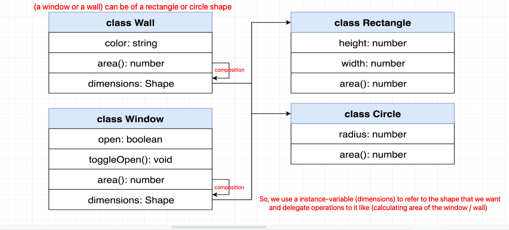
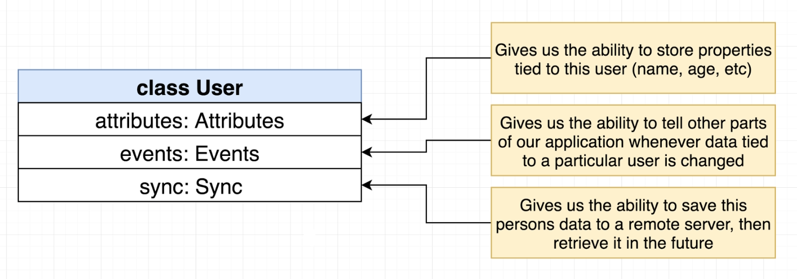

# INDEX

- [INDEX](#index)
  - [Object Oriented Programming (OOP)](#object-oriented-programming-oop)
    - [Fundamentals of OOP (A-P-I-E)](#fundamentals-of-oop-a-p-i-e)
      - [A - Abstraction](#a---abstraction)
      - [P - Polymorphism](#p---polymorphism)
      - [I - Inheritance](#i---inheritance)
      - [E - Encapsulation](#e---encapsulation)
    - [Interfaces](#interfaces)
  - [Object Oriented Design (OOD)](#object-oriented-design-ood)
    - [UML (Unified Modeling Language)](#uml-unified-modeling-language)
    - [Some OOD Principles](#some-ood-principles)

---

## Object Oriented Programming (OOP)

- **Object** is a self-contained entity that consists of both data and procedures to manipulate the data.

  - it combine variables and functions into a single unit.
  - it makes it easier to understand how a program works and to maintain it.

- In an object-oriented-program, rather than describing a sequence of steps to follow, we define a set of self-contained-objects that interact with each other.
  - Each object is responsible for its own data and behaviour.
- Objects are a **data abstraction** that captures 2 things:

  - **Internal representation** -> (what is the data representation of the object)
    - It hides the internal details of an object from the outside through `data attributes`
  - **Interface** -> (what operations can be performed on the object's data)
    - It hides the implementation details of an object from the outside, but exposes the behaviour of an object to the outside through `methods`

- When we create a `Class` that has a defined `data representation` and `interface`, we can create `Objects` from that class knowing that they will have the same `data representation` and `interface`. (Code reusability)

- Advantages of OOP:

  - **Modularity**: it makes it easier to build, maintain and debug software applications.
  - **Reusability**: it makes it easier to reuse code in different parts of the application.
  - **Extensibility**: it makes it easier to extend the application without breaking the existing code.

- `"Class"` is a blueprint (template) for creating objects.
  - it defines the data and behaviour of an object.
  - it defines a set of properties and methods that are common to all objects of one type.

---

### Fundamentals of OOP (A-P-I-E)

They're the four main concepts of OOP. they're short for **"A PIE"**.

#### A - Abstraction

It is the process of hiding the internal details and showing only the functionality.

- it helps us reduce complexity and allows us to focus on what's important.
- it helps us write maintainable code.
- it helps us reduce the impact of change.

#### P - Polymorphism

It is the ability to present the same interface for different data types. (having many forms)

- it allows us to perform a single action in different ways **(Same method name with different implementations)**.
- **Method Overloading**: it is a type of polymorphism in which a class has multiple methods with the same name but different parameters.

  ```py
  class Math:
    def add(self, a, b):
      return a + b

    def add(self, a, b, c):
      return a + b + c
  ```

- **Method Overriding**: it is a type of polymorphism in which a child class has the same method as a parent class.

  ```py
  class Animal:
    def speak(self):
      print("Animal is speaking")

  class Dog(Animal):
    def speak(self):
      print("Dog is barking")
  ```

#### I - Inheritance

It is the ability to create new classes based on an existing class.

- it allows us to reuse code.
- `superClass` -> `subClass` (parent -> child)
- **Inheritance vs Composition**:

  - **Inheritance**: it is an `is-a` relationship between classes.

    - it is used when we want to:
      - reuse the code of an existing class.
      - create a new class from an existing class.
      - create a hierarchy of classes.

    ```py
    class Animal:
      def eat(self):
        print("Animal is eating")

    class Dog(Animal):
      def bark(self):
        print("Dog is barking")

    dog = Dog()
    dog.eat() # it can still eat
    dog.bark()
    ```

  - **Composition**: it is a `has-a` relationship between classes.

    - it is used when we want to:

      - use the functionality of an existing class without modifying it.
      - using object in another object, by keeping an instance-variable that refers to an object, and delegating operations to it instead of inheriting from it.
        

    - Composition example 1️⃣

      ```py
      class Animal:
        def __init__(self, name):
          self.name = name

        def eat(self):
          print(f"{self.name} is eating")

      class Dog:
        def __init__(self, name):
          self.animal = Animal(name)

        def bark(self):
          print(f"{self.animal.name} is barking")

      dog = Dog("Dog")
      dog.animal.eat() # it can still eat but through the animal object
      dog.bark()
      ```

    - Composition example 2️⃣
      
      - Here, Class `User` has delegated the operations to multiple classes `Attributes, Events, Sync` instead of having a single class `User` that has all the operations. So we "compose" the `User` class from multiple classes.

#### E - Encapsulation

It is the process of wrapping data and code together into a single unit to prevent direct access to the data from outside the class (protecting the data).

- It's about reducing the complexity and increasing the reusability of our code -> The change in one place won't cause "domino effect" in other places.

```py
class Person:
  def __init__(self, name, age):
    self.name = name
    self.age = age

  def get_name(self):
    return self.name

  def set_name(self, name):
    self.name = name

  def get_age(self):
    return self.age

  def set_age(self, age):
    self.age = age

# This is a violation of the encapsulation. ❌
person = Person("Ahmed", 20)
person.name = "Mohamed"

# This is a better design. ✅
person = Person("Ahmed", 20)
person.set_name("Mohamed")
```

---

### Interfaces

It is a contract that defines the signature of the operations that a class must implement.

- It's a list of methods for a class to implement. It don't have any implementation.

- They're similar to `abstract classes` but they don't have any implementation.
  - `Abstract Classes` are classes that cannot be instantiated. They can only be used as a base class for other classes that extend them.
  - `Interfaces` are classes that contain only abstract methods. They are used to define the operations that the high-level classes should use.
- Interfaces usually start with `I` letter.

```py
from abc import ABC, abstractmethod

class IShape(ABC):
  @abstractmethod
  def draw(self):
    pass

# Using the interface
class Circle(IShape):
  def draw(self):
    print("Drawing a circle")
```

---

## Object Oriented Design (OOD)

It is the process of planning a system of interacting objects for the purpose of solving a software problem.

### UML (Unified Modeling Language)

It is a standardized way of documenting and modeling a system.

- it is a visual language for communicating ideas about object-oriented-systems using diagrams.

---

### Some OOD Principles

- **DRY (Don't Repeat Yourself)**: it is a principle of software development aimed at reducing repetition of software patterns.
- **KISS (Keep It Simple, Stupid)**: it states that most systems work best if they are kept simple rather than made complicated.
- **YAGNI (You Aren't Gonna Need It)**: it states that a programmer should not add functionality until deemed necessary.
