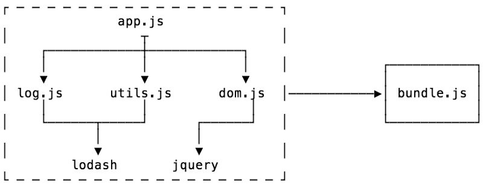
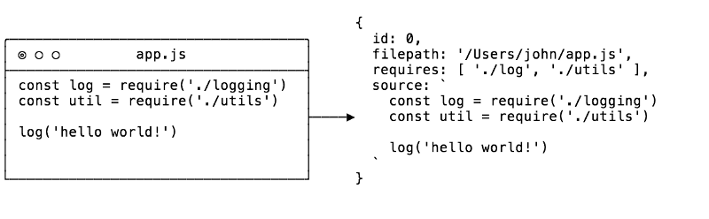
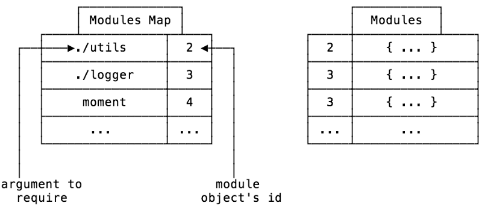

# INDEX

- [INDEX](#index)
  - [Modules](#modules)
    - [Problems with script loading](#problems-with-script-loading)
    - [History of Modules](#history-of-modules)
      - [CommonJS](#commonjs)
      - [EcmaScript Modules (ESM)](#ecmascript-modules-esm)
  - [Module Bundling](#module-bundling)
    - [Stages of a bundler](#stages-of-a-bundler)
      - [Module Representation](#module-representation)
      - [Module Map](#module-map)
      - [Dependency Resolution](#dependency-resolution)
      - [Packing](#packing)
        - [Packing Process](#packing-process)
  - [Parcel](#parcel)
  - [Babel (`transpiling` \& `Polyfilling`)](#babel-transpiling--polyfilling)
    - [Transpiling code for new language features](#transpiling-code-for-new-language-features)
      - [Configuring Webpack to use Babel](#configuring-webpack-to-use-babel)
    - [Polyfilling](#polyfilling)

---

## Modules

As our application grows bigger, we want to split it into multiple files, so called “modules”. A module may contain a class or a library of functions for a specific purpose.

### Problems with script loading

- We have some problems when trying to run javascript in the browser:

  - too many scripts
    - that exceeds the max number of default simultaneous persistent connections per server/proxy
  - unmaintainable scripts
    - `scope`, `size`, `readability`, `fragility`, `monolith files`

- solution:
  - using **IIFE's**, as we treat each file as IIFE (revealing module), also this enables us to (**concatenate** files together): we can safely combine files without concern of scope collision!
- we had other problems:
  - "Full rebuilds every time there's a change"
  - lots of IIFE's are **slow** -> [The cost of small modules](https://nolanlawson.com/2016/08/15/the-cost-of-small-modules/)

---

### History of Modules

When scripts became more and more complex, so the community invented a variety of ways to organize code into modules, special libraries to load modules on demand:

- **AMD** – one of the most ancient module systems, initially implemented by the library `require.js`.
- **CommonJS** – the module system created for `Node.js` server.
- **UMD** – one more module system, suggested as a universal one, compatible with `AMD` and `CommonJS`.

#### CommonJS

- With the creation of `Node.js`, we needed a way to run Javascript outside of the browser, this is where `commonJS` was born

  ```js
  const path = require('path');
  ```

- `NPM` was created as a package strategy to share **commonJS node modules** across the entire ecosystem
- Modules also had problems:
  - No live bindings
  - No browser support for commonJS
  - slow module loader (slow) -> as it's **synchronous**
- this is where **bundlers** and **linkers** started to get popular, but they also had problems
- this led to a solution which is -> **ESM**

#### EcmaScript Modules (ESM)

It's a standard pattern for importing JavaScript modules.

```js
import { uniq, forOf, bar } from 'lodash-es';
import * as utils from 'utils';

export const uniqConst = uniq([1, 2, 2, 4]);
```

- it's different from **ES2015**
- it's still not fully compatible with `Node.js`
- but you may ask: "How do they work in the browser?"
  - the answer is: "they're incredibly **SLOW**"; it's like unusable after 10 modules

> **This is where WEBPACK was born**

---

## Module Bundling

`JavaScript bundling` is an optimization technique you can use to reduce the number of **server requests** for JavaScript files. Bundling accomplishes this by merging multiple JavaScript files together into one file to reduce the number of page requests.

A JavaScript **module bundler** is:

- a tool that takes pieces of `JavaScript` and their dependencies and bundles them into a single file, usually for use in the browser.
- a tool that gets around the problem with a build step (which has access to the file system) to create a final output that is browser compatible (which doesn’t need access to the file system).
- It usually starts with an **entry file**, and from there it bundles up all of the code needed for that entry file.
  

> Difference:
>
> - Parcel is good for teaching and small examples as it doesn't require configuration
>   Webpack is better for large production

---

### Stages of a bundler

There are two main stages of a bundler:

1. Dependency resolution
2. Packing

- Starting from an **entry point** (such as `app.js` above), the goal of **dependency resolution** is to look for all of the dependencies of your code (other pieces of code that it needs to function) and construct a graph (called a dependency graph).
- Once this is done, you can then **pack** or convert your dependency graph into a single file that the application can use.

---

#### Module Representation

The graph structure gets built up through recursively checking for dependencies within each file.

- We are going to need four things for Module Representation:
  1. The name and an identifier of the file
  2. Where the file came from (in the file system)
  3. The code in the file
  4. What dependencies that file needs
- In JavaScript, the easiest way to represent such a set of data would be an **object**.
- in the `createModuleObject` function, the notable part is the call to a function called `detective`.
  - `Detective` is a library that can “find all calls to `require()` no matter how deeply nested”, and using it means we can avoid doing our own AST traversal!



---

#### Module Map

When you import modules in Node, you can do relative imports, like `require('./utils')`. So when your code calls this, how does the bundler know what is the right `./utils` file when everything is packaged?

That is the problem the module map solves.

- Our module object has a unique `id` key which will be our ‘source of truth’. So when we are doing our dependency resolution, for each module, we will keep a list of the names of what is being required along with their `id`. This way, we can get the correct module at run-time.
  - This also means that we can store all of the modules in a non-nested object, using the id as a key.



---

#### Dependency Resolution

> What is meant by ‘**resolve dependencies’**?
>
> - In `Node` there is a thing called the require.resolve, and it’s how Node figures out where the file that you are requiring is. This is because we can import relatively or from a `node_modules` folder.

- there’s an npm module named `resolve` which implements this algorithm for us. We just have to pass in the dependency and base URL arguments, and it will do all the hard work for us.
- At the end of the function, we are left with an array named **modules** which will contain module objects for every module/dependency in our project.

Now that we have that, we can move on to the final step: **packing**!

---

#### Packing

In the browser, there is no such thing as modules (kind of). But this means that there is no `require` function, and no `module.exports`. So even though we have all of our dependencies, we currently have no way to use them as modules.

- This is where `Module Factory Function` play its rule
- **Module Factory Function**:
  - A factory function is a function (that’s not a constructor) which returns an object. It is a pattern from object oriented programming, and one of its uses is to do encapsulation and dependency injection.
  - Using a factory function, we can both inject our own `require` function and `module.exports` object that can be used in our bundled code and give the module its own scope.

##### Packing Process

- First up is `modulesSource`. Here, we are going through each of the modules and transforming them into a string of sources.
  
  - Now it’s a little hard to read, but you can see that the **source is encapsulated**. We are providing `modules` and `require` using the factory function as mentioned.
  - We are also including the modules map that we constructed during the [Dependency Resolution](#dependency-resolution).
- The next string of code is an **IIFE**, which means that when you run that code in the browser (or anywhere else), the function will run immediately. IIFE is another pattern for encapsulating scope, and is used here so we don’t pollute the global scope with our require and modules.
- After this, we are defining a `module object` that the module can populate, and passing both functions into the factory, after which we return `module.exports`.
- Lastly, we call `require(0)` to require the module with an id of `0`, which is our entry file.

---

## Parcel

`parcel` is a **zero configuration** build tool for the web. It combines a great out-of-the-box development experience with a scalable architecture that can take your project from just getting started to massive production application.

- results will be in `dist` folder
- [parcel installation](https://parceljs.org/getting-started/webapp/)

  ```shell
  npm i parcel --save-dev
  // or
  npm i parcel -D

  npx parcel index.html  // this will run parcel in development mode
  ```

  - we specify an entry point => `index.html`
  - you can import something from a `package` and parcel will automatically find the path for the module, and even more : if `package` isn't installed => parcel will install it

    ```js
    // instead of this
    import cloneDeep from './node_modules/lodash-es/cloneDeep.js';

    // use this
    import cloneDeep from 'lodash-es';
    ```

  - importing any static assets like `images, icons,...` that are not `programming-files` when importing them (as its location is change when Bundling) => we do it like this:

    ```js
    import icons from '../img/icons.svg'; // Parcel version 1
    import icons from 'url:../../img/icons.svg'; // Parcel version 2 (now)
    ```

- `parcel` is also capable of bundling `sass` files into `css` files

  - this is done by `npm i sass`, and making sure that you are referencing the sass file in the `index.html` file

    ```html
    <link rel="stylesheet" href="src/sass/main.scss" />
    ```

---

## Babel (`transpiling` & `Polyfilling`)

How to make our modern code work on older engines that don’t understand recent features yet? -> There are two tools for that:

### Transpiling code for new language features

**Transpiling** code means converting the code in one language to code in another similar language. This is an important part of frontend development — since browsers are slow to add new features, new languages were created with experimental features that transpile to browser compatible languages.

**Transpilers** : special piece of software that translates source code to another source code. It can parse (“read and understand”) modern code and rewrite it using older syntax constructs, so that it’ll also work in outdated engines.

- **Babel** is not a new language but a transpiler that transpiles next generation JavaScript with features not yet available to all browsers (ES2015 and beyond) to older more compatible JavaScript (ES5).
- **Typescript** is a language that is essentially identical to next generation JavaScript, but also adds optional static typing. Many people choose to use babel because it’s closest to vanilla JavaScript.

```js
// before running the transpiler
height = height ?? 100;

// after running the transpiler
height = height !== undefined && height !== null ? height : 100;
```

- Usually, a developer runs the transpiler on their own computer, and then deploys the transpiled code to the server.
- **Babel** is one of the most prominent transpilers out there.

#### Configuring Webpack to use Babel

Modern project build systems, such as **webpack**, provide a means to run a transpiler automatically on every code change, so it’s very easy to integrate into the development process.

- We can configure webpack to use babel-loader by editing the webpack.`config.js` file as follows:

```js
// webpack.config.js
module.exports = {
  mode: 'development',
  entry: './index.js',
  output: {
    filename: 'main.js',
    publicPath: 'dist'
  },
  module: {
    rules: [
      {
        test: /\.js$/,
        exclude: /node_modules/,
        /* we’re telling webpack to look for any .js files (excluding ones in the node_modules folder) 
        and apply babel transpilation using babel-loader with the @babel/preset-env preset.
        */
        use: {
          loader: 'babel-loader',
          options: {
            presets: ['@babel/preset-env']
          }
        }
      }
    ]
  }
};
```

---

### Polyfilling

**Polyfills** : is a piece of code (usually JavaScript on the Web) used to provide modern **functionality** on older browsers that do not natively support it.

- New language features may include not only syntax constructs and operators, but also built-in **functions**. As we’re talking about new functions, not syntax changes, there’s no need to transpile anything here. We just need to declare the missing function.
- For example, `Math.trunc(n)` is a function that “cuts off” the decimal part of a number, e.g `Math.trunc(1.23)` returns 1.

  ```js
  if (!Math.trunc) {
    // if no such function

    Math.trunc = function (number) {
      // Math.ceil and Math.floor exist even in ancient JavaScript engines
      // they are covered later in the tutorial
      return number < 0 ? Math.ceil(number) : Math.floor(number);
    };
  }
  ```

- `Babel` is a JavaScript `transcompiler` that is mainly used to convert ECMAScript 2015+ (ES6+) code into a backwards compatible version of JavaScript that can be run by older JavaScript engines. Babel is a popular tool for using the newest features of the JavaScript programming language.

  - `Babel` can just convert normal `syntax` like `arrow funtion` to `function expression/declaration`, **but** it can't convert new ES6 features like `class`,`promise`, so we use => `polyfilling`.

- `polyfill` is a piece of code (usually JavaScript on the Web) used to provide modern functionality on older browsers that do not natively support it.

  - for it we use a library : `core-js`, `regenerator-runtime`

    ```javascript
    // in js file
    import 'core-js/stable';

    // Polifilling async functions
    import 'regenerator-runtime/runtime';

    // if they are not installed automatically, install them manually
    ```

---
