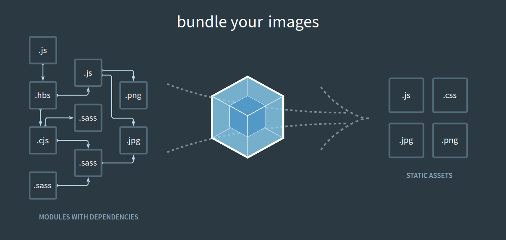
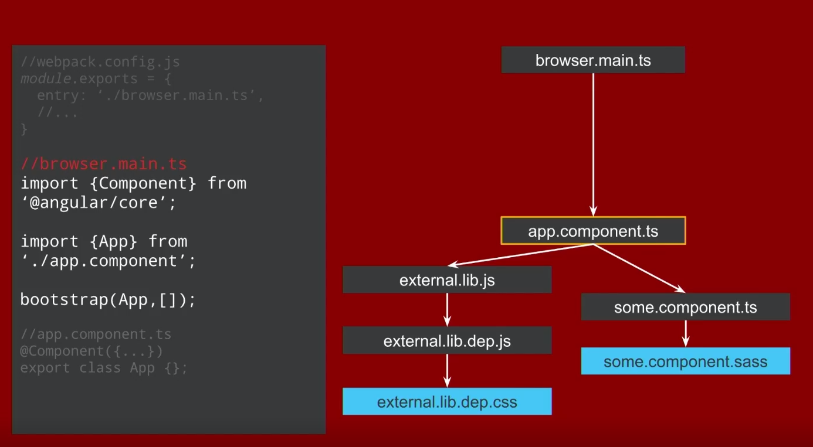
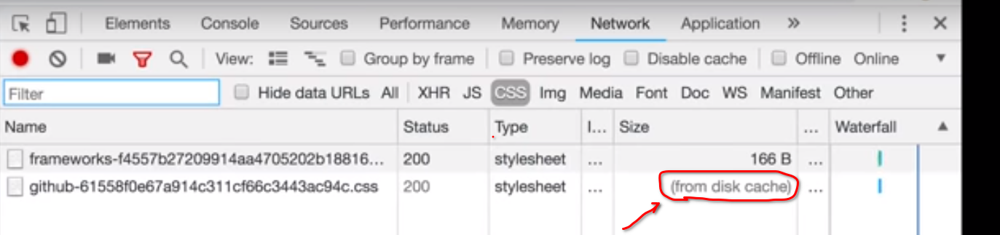
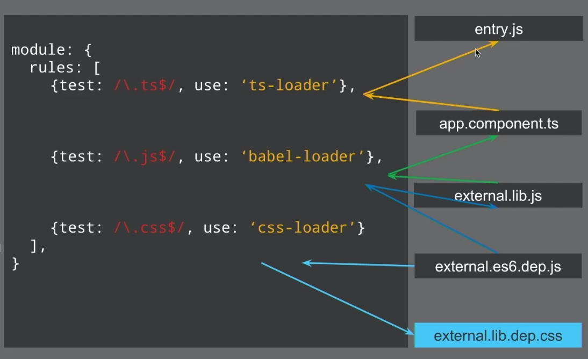
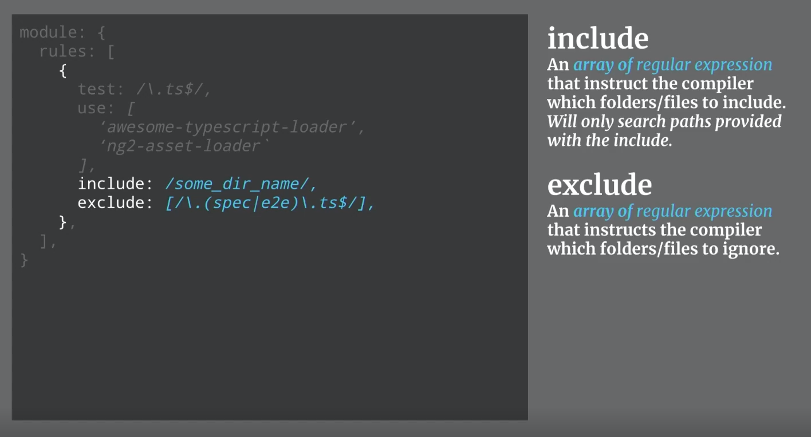
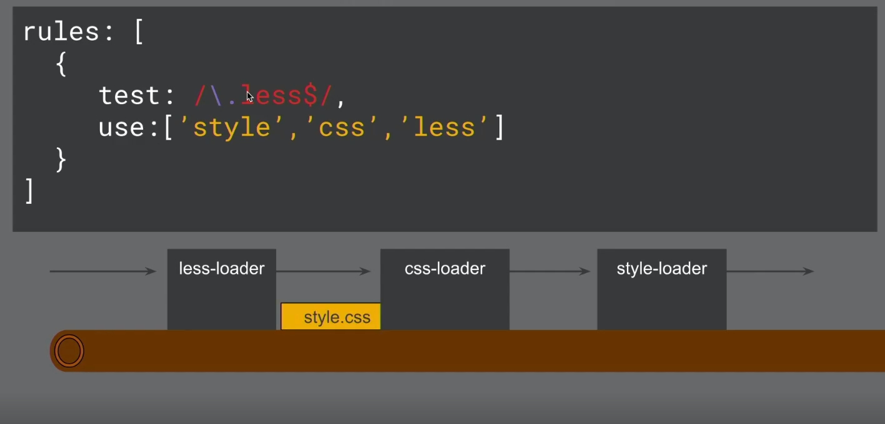

# INDEX

- [INDEX](#index)
  - [Modules](#modules)
    - [Problems with script loading](#problems-with-script-loading)
  - [History of Modules](#history-of-modules)
    - [CommonJS](#commonjs)
    - [EcmaScript Modules (ESM)](#ecmascript-modules-esm)
  - [Module Bundling](#module-bundling)
    - [Stages of a bundler](#stages-of-a-bundler)
      - [Module Representation](#module-representation)
      - [Module Map](#module-map)
      - [Dependency Resolution](#dependency-resolution)
      - [Packing](#packing)
        - [Packing Process](#packing-process)
  - [Parcel](#parcel)
  - [Webpack](#webpack)
    - [Why Webpack](#why-webpack)
    - [Webpack core concepts](#webpack-core-concepts)
      - [Entry and Output](#entry-and-output)
      - [Loaders](#loaders)
        - [How loaders work](#how-loaders-work)
      - [Plugins](#plugins)
    - [Installation and Configuration](#installation-and-configuration)
    - [Webpack different modes (Splitting Dev & Production)](#webpack-different-modes-splitting-dev--production)
      - [For Development](#for-development)
      - [webpack-dev-server](#webpack-dev-server)
      - [For Production](#for-production)
    - [Webpack Notes](#webpack-notes)
  - [Babel (`transpiling` & `Polyfilling`)](#babel-transpiling--polyfilling)
    - [Transpiling code for new language features](#transpiling-code-for-new-language-features)
      - [Configuring Webpack to use Babel](#configuring-webpack-to-use-babel)
    - [Polyfilling](#polyfilling)

---

## Modules

### Problems with script loading

- We have some problems when trying to run javascript in the browser:

  - too many scripts
    - that exceeds the max number of default simultaneous persistent connections per server/proxy
  - unmaintainable scripts
    - `scope`, `size`, `readability`, `fragility`, `monolith files`

- solution:
  - using **IIFE's**, as we treat each file as IIFE (revealing module), also this enables us to (**concatenate** files together): we can safely combine files without concern of scope collision!
- we had other problems:
  - "Full rebuilds every time there's a change"
  - lots of IIFE's are **slow** -> [The cost of small modules](https://nolanlawson.com/2016/08/15/the-cost-of-small-modules/)

---

## History of Modules

### CommonJS

- With the creation of `Node.js`, we needed a way to run Javascript outside of the browser, this is where `commonJS` was born

  ```js
  const path = require('path');
  ```

- `NPM` was created as a package strategy to share **commonJS node modules** across the entire ecosystem
- Modules also had problems:
  - No live bindings
  - No browser support for commonJS
  - slow module loader (slow) -> as it's **synchronous**
- this is where **bundlers** and **linkers** started to get popular, but they also had problems
- this led to a solution which is -> **ESM**

### EcmaScript Modules (ESM)

It's a standard pattern for importing JavaScript modules.

```js
import { uniq, forOf, bar } from 'lodash-es';
import * as utils from 'utils';

export const uniqConst = uniq([1, 2, 2, 4]);
```

- it's different from **ES2015**
- it's still not fully compatible with `Node.js`
- but you may ask: "How do they work in the browser?"
  - the answer is: "they're incredibly **SLOW**"; it's like unusable after 10 modules

> **This is where WEBPACK was born**

---

## Module Bundling

`JavaScript bundling` is an optimization technique you can use to reduce the number of **server requests** for JavaScript files. Bundling accomplishes this by merging multiple JavaScript files together into one file to reduce the number of page requests.

A JavaScript **module bundler** is:

- a tool that takes pieces of `JavaScript` and their dependencies and bundles them into a single file, usually for use in the browser.
- a tool that gets around the problem with a build step (which has access to the file system) to create a final output that is browser compatible (which doesn’t need access to the file system).
- It usually starts with an **entry file**, and from there it bundles up all of the code needed for that entry file.
  

> Difference:
>
> - Parcel is good for teaching and small examples as it doesn't require configuration
>   Webpack is better for large production

---

### Stages of a bundler

There are two main stages of a bundler:

1. Dependency resolution
2. Packing

- Starting from an **entry point** (such as `app.js` above), the goal of **dependency resolution** is to look for all of the dependencies of your code (other pieces of code that it needs to function) and construct a graph (called a dependency graph).
- Once this is done, you can then **pack** or convert your dependency graph into a single file that the application can use.

---

#### Module Representation

The graph structure gets built up through recursively checking for dependencies within each file.

- We are going to need four things for Module Representation:
  1. The name and an identifier of the file
  2. Where the file came from (in the file system)
  3. The code in the file
  4. What dependencies that file needs
- In JavaScript, the easiest way to represent such a set of data would be an **object**.
- in the `createModuleObject` function, the notable part is the call to a function called `detective`.
  - `Detective` is a library that can “find all calls to `require()` no matter how deeply nested”, and using it means we can avoid doing our own AST traversal!


---

#### Module Map

When you import modules in Node, you can do relative imports, like `require('./utils')`. So when your code calls this, how does the bundler know what is the right `./utils` file when everything is packaged?

That is the problem the module map solves.

- Our module object has a unique `id` key which will be our ‘source of truth’. So when we are doing our dependency resolution, for each module, we will keep a list of the names of what is being required along with their `id`. This way, we can get the correct module at run-time.
  - This also means that we can store all of the modules in a non-nested object, using the id as a key.


---

#### Dependency Resolution

> What is meant by ‘**resolve dependencies’**?
>
> - In `Node` there is a thing called the require.resolve, and it’s how Node figures out where the file that you are requiring is. This is because we can import relatively or from a `node_modules` folder.

- there’s an npm module named `resolve` which implements this algorithm for us. We just have to pass in the dependency and base URL arguments, and it will do all the hard work for us.
- At the end of the function, we are left with an array named **modules** which will contain module objects for every module/dependency in our project.

Now that we have that, we can move on to the final step: **packing**!

---

#### Packing

In the browser, there is no such thing as modules (kind of). But this means that there is no `require` function, and no `module.exports`. So even though we have all of our dependencies, we currently have no way to use them as modules.

- This is where `Module Factory Function` play its rule
- **Module Factory Function**:
  - A factory function is a function (that’s not a constructor) which returns an object. It is a pattern from object oriented programming, and one of its uses is to do encapsulation and dependency injection.
  - Using a factory function, we can both inject our own `require` function and `module.exports` object that can be used in our bundled code and give the module its own scope.

##### Packing Process

- First up is `modulesSource`. Here, we are going through each of the modules and transforming them into a string of sources.
  
  - Now it’s a little hard to read, but you can see that the **source is encapsulated**. We are providing `modules` and `require` using the factory function as mentioned.
  - We are also including the modules map that we constructed during the [Dependency Resolution](#dependency-resolution).
- The next string of code is an **IIFE**, which means that when you run that code in the browser (or anywhere else), the function will run immediately. IIFE is another pattern for encapsulating scope, and is used here so we don’t pollute the global scope with our require and modules.
- After this, we are defining a `module object` that the module can populate, and passing both functions into the factory, after which we return `module.exports`.
- Lastly, we call `require(0)` to require the module with an id of `0`, which is our entry file.

---

## Parcel

`parcel` is a **zero configuration** build tool for the web. It combines a great out-of-the-box development experience with a scalable architecture that can take your project from just getting started to massive production application.

- results will be in `dist` folder
- [parcel installation](https://parceljs.org/getting-started/webapp/)

  ```shell
  npm i parcel --save-dev
  // or
  npm i parcel -D

  npx parcel index.html  // this will run parcel in development mode
  ```

  - we specify an entry point => `index.html`
  - you can import something from a `package` and parcel will automatically find the path for the module, and even more : if `package` isn't installed => parcel will install it

    ```js
    // instead of this
    import cloneDeep from './node_modules/lodash-es/cloneDeep.js';

    // use this
    import cloneDeep from 'lodash-es';
    ```

  - importing any static assets like `images, icons,...` that are not `programming-files` when importing them (as its location is change when Bundling) => we do it like this:

    ```js
    import icons from '../img/icons.svg'; // Parcel version 1
    import icons from 'url:../../img/icons.svg'; // Parcel version 2 (now)
    ```

- `parcel` is also capable of bundling `sass` files into `css` files

  - this is done by `npm i sass`, and making sure that you are referencing the sass file in the `index.html` file

    ```html
    <link rel="stylesheet" href="src/sass/main.scss" />
    ```

---

## Webpack

It's a **module bundler** that lets you write any module format (mixed bunch of different assets/files **of different types**), compiles them for working in the **browser**.



There're 2 main things webpack does:

1. it bundles our code/assets together
2. it manages dependencies (modules)

- supports static Async bundling
- The most performant way to ship Javascript

> some people say that the problem of webpack is "that there isn't one way to do things" , and that is exactly why we have webpack in the web where everything is different as if every web application was created the same way, we wouldn't even need webpack but this is not the case

---

### Why Webpack

when you use different Javascript files that depend on each other, before we used to add multiple `<script>` tags to our `index.html` file with the correct order; Ex:

```html
<body>
  <!-- code -->
  <script src="./src/app/alert.service.js"></script>
  <script src="./src/app/utils/inputs-are-valid.js"></script>
  <script src="./src/app/utils/parse-inputs.js"></script>
  <!-- app.js must be the last one so that the other files are loaded already -->
  <script src="./src/app/app.js"></script>
</body>
```

- This will become tedious with managing more and more files and dependencies
- so we import files using ES6 imports/exports and then import the top level into an **entry file** that runs our code and webpack uses this file to create the **main javascript file** in the `dist` folder to be used in the `<script>` tag in the `index.html` file
- so we tell webpack how files are dependent on each other using `imports`/`exports`, and Webpack takes care of the rest making sure that everything is **loaded** in a valid order

---

### Webpack core concepts

#### Entry and Output

- **Entry**: the first Javascript file to load to "kick-off" your app

  - Webpack uses this as the starting point

  

- **Output**: tells webpack where and how to distribute bundles (compilations)
  

- **Cache Busting**:
  

  - When a static file (like `main-output.js` file) gets cached it can be stored for very long periods of time before it ends up expiring. This can be an annoyance in the event that you make an update to a site (use new output js file that contains new or updated logic)
    - however, since the cached version of the file is **stored in your visitors' browsers**, they may be unable to see the changes made.
    - This is due to the fact that a visitor's browser will locally store a cached copy of your static assets given that your website is configured to leverage browser caching.
      
  - Cache busting solves the browser caching issue by using a **unique file version identifier** to tell the browser that a new version of the file is available. Therefore the browser doesn't retrieve the old file from cache but rather makes a request to the origin server for the new file.
  - Cache busting is useful because it **allows your visitors to receive the most recently updated files without having to perform a hard refresh or clear their browser cache**. From a developer's point of view, using cache busting is beneficial so that the latest changes can be pushed out and become available to everyone immediately.
  - > So to summaries: **we bust outdated caches**
  - How to do it in webpack:

    ```js
    // webpack.config.js

    module.exports = {
      output: {
        path: '/dist',
        filename: 'bundle.[contentHash].js' // will be called like bundle.e883ce503b831d4dde09.js
      }
    };
    ```

  - You may think that this will cause another problem: **"How the html file is going to know what js file name it needs to use in the `<script>` tag ?"**
    - the answer is that now we won't be adding the `<script>` tag in the `html` file manually like we did; instead we will make Webpack build our `HTML` file and put it in the `dist` folder using [Plugins](#plugins) -> [HtmlWebpackPlugin](https://webpack.js.org/plugins/html-webpack-plugin/)

---

#### Loaders

webpack by default bundles Javascript files, so when we want to bundle **non-javascript-files**, we use **loaders**

> **Loaders**: are the transformations that are applied on the source code of a module. They allow you to **pre-process** files as you `import` or `load` them. Thus, loaders are kind of like (**tasks** in other build tools) and provide a powerful way to handle frontend build steps, or like (allowing you to `import` css files directly from your Javascript modules).
>
> Loaders can transform files from a different language like:
>
> - Typescript to Javascript
> - inline images to data URLs

**Loaders**: tells webpack how to interpret and translate files (on a per-file basis) before adding to the `dependency-graph`

- here, we define **rules** on how we want to treat:
  - (**files that are not Javascript**) or files that match what's in the loaders
  - `use` to apply(use) the specified loader to the matching files
    - we can add loaders to the `use` key as an array with loaders name
    - or we can use an object to add options to the loader
- they're also javascript **modules** (functions) that takes the `source file` and return it in a `modifies state`
- you can find built-in loaders [here](https://webpack.js.org/loaders/)

- Example for using loaders for css files

  ```js
  // webpack.config.js

  module.exports = {
    // as we said; It's a module
    module: {
      rules: [
        {
          test: /\.css$/i, // REGEX expression: if we used a file ends with ".css" in a javascript file
          use: ['style-loader', 'css-loader'] // use these loaders
          // here we need these 2 loaders (with the right order) to work together, as:
          // css-loader : translate CSS to Javascript
          // style-loader : take the translated Javascript and injects it to the DOM
        }
      ]
    }
  };
  ```

- Example for using loaders for images files and **"src" attributes** in the `` tags in html files
  - it uses the [html-loader](https://webpack.js.org/loaders/html-loader/)
- Example for using loaders with `options` key:

  ```js
  module.exports = {
    module: {
      rules: [
        {
          test: /\.(png|jpe?g|gif)$/i,
          loader: 'file-loader',
          options: {
            name: '[name].[hash].[ext]', // change the output image file name as you like
            outputPath: 'imgs'
          }
        }
      ]
    }
  };
  ```

  

---

##### How loaders work

- if webpack comes across something that matches one of the regular-expressions in the rule sets, then it applies (uses) the corresponding `node-module` to transform files while creating the `dependency-graph`
- This is a **per file process** and it doesn't happen in bulks

  

- There're different kinds of features that help you filter/include/exclude/ignore/.. when you want to transform files
  
  

- **Chaining Loaders**:

  - loaders execute from **right to left**
    
    
    
    

    ```js
    // it's like calling multiple functions:
    style(css(less()));
    ```

---

#### Plugins

They're instances of **Objects** with `apply` property, and they allow you to **hook into** the entire compilation lifecycle of events (the build process).

They add additional functionality to Compilations(optimized bundled modules). More powerful w/ more access to CompilerAPI. Does everything else you’d ever want to in webpack.

> - They work on a **bundle-level** and not file-level
>
> - A plugin is an ES5 ‘class’ which implements an apply function.
> - any built-it plugin begins with `webpack.` -> `new webpack.pluginName()`

- **How to use Plugins**:

  1. install the plugin
  2. `require()` plugin from `node_modules` into config.
  3. add **new instance** of plugin to plugins key in config object.
  4. provide additional info (data) for arguments

  ```js
  // require() from node_modules or webpack or local file
  var BellOnBundlerErrorPlugin = require(‘bell-on-error’);
  var webpack = require(‘webpack’);

  module.exports = {
    //...
    plugins: [
  new BellOnBundlerErrorPlugin(),

  // Just a few of the built in plugins
  new webpack.optimize.CommonsChunkPlugin(‘vendors’),
  new webpack.optimize.UglifyJsPlugin()
    ]
    //...
  }
  ```

---

### Installation and Configuration

```bash
# installation
npm install webpack webpack-cli webpack-dev-server --save-dev
```

How to use it ? -> three ways to use Webpack: `Webpack config`, `Webpack CLI`, and `Node API`

- **webpack.config.js**

  - It's afile with an exported object; yes, it's a module too!!!
  - it needs **entry(input)**, and **output**
  - without it, it will use default **vendors**(entry-file) (`.src/index.js`)
    - and if we have both it will load both -> (**Multiple Entrypoints**)

  ```js
  module.exports = {
    entry: {
      main: './src/main.browser.ts'
      vendor: './src/vendors.ts',
    },
    output: {
      filename: 'main.js',
      path: 'dist/'
    }
  };
  ```

  - now when you run webpack, you pass to it the config parameter:

    ```sh
    webpack --config webpack.config.js
    ```

- **Webpack CLI**

  ```sh
  webpack <entry.js> <result.js> --colors --progress

  webpack-dev-server --port=9000
  ```

- **Node API**

  ```js
  var webpack = require('webpack');

  // returns a Compiler instance
  webpack(
    {
      // configuration object here!
    },
    function (err, stats) {
      // …
      // compilerCallback
      console.error(err);
    }
  );
  ```

---

### Webpack different modes (Splitting Dev & Production)


- Usually we have 2 modes (`development`, `production`), so we usually have 3 files:

  - `webpack.common.js` : this will have the common configuration between dev and prod
  - `webpack.dev.js` : this will have the development configuration
  - `webpack.prod.js` : this will have the production configurations

- To merge all these files; we will `require` a merge function from `webpack-merge`. This merge function will allow us to merge configurations from different files

  ```js
  const { merge } = require('webpack-merge');
  ```

- Now, to merge both files (`dev + common` or `prod + common`), we add the following syntax to the end of the file:

  ```js
  module.exports = merge(commonConfig, devConfig);
  ```

> You can find more here: [Webpack for Common, Development, and Production](https://www.linkedin.com/pulse/webpack-common-development-production-rany-elhousieny-phd%25E1%25B4%25AC%25E1%25B4%25AE%25E1%25B4%25B0/) and here: [Webpack Documentation](https://webpack.js.org/guides/production/)

---

#### For Development

when you are in development mode, webpack does this:

- run the webpack tool that was installed in the `node_modules` folder, start with the `index.js` file, find any `require()` statements, and replace them with the appropriate code to create a single output file (which by default is **dist/main.js**).

  - The `--mode=development` argument is to keep the JavaScript readable for developers, as opposed to a minified output with the argument `--mode=production`.

  ```sh
  ./node_modules/.bin/webpack index.js --mode=development
  ```

- Note that we’ll need to run the webpack command each time we change `index.js`. This is tedious, Webpack can read options from a config file in the root directory of the project named webpack.`config.js`

  - create `webpack.config.js` file that contains this :

  ```js
  // webpack.config.js
  const path = require('path');

  module.exports = {
    mode: 'development', // here we specify the mode
    entry: './index.js',
    output: {
      filename: 'main.js',
      publicPath: 'dist'
    }
  };
  ```

  - Now each time we change `index.js`, we can run webpack with the command:

    ```sh
    ./node_modules/.bin/webpack
    ```

- and to use it with a task-runner, in `package.json` add this script :

  ```json
  // (--progress) option to show the percent progress
  "scripts": {
    "build": "webpack --progress --mode=production",
    "watch": "webpack --progress --watch"
    },
  ```

---

#### webpack-dev-server

You can also use **webpack-dev-server**, a separate tool which provides a simple web server with live reloading. To install it as a development dependency:

```sh
npm install webpack-dev-server --save-dev
```

```json
// package.json
"scripts": {
  "build": "webpack --progress -p",
  "watch": "webpack --progress --watch",
  "serve": "webpack-dev-server --open" // Here (starts the server + Opens the web page for us)
  },
```

> **Note:** Each time you make changes to `.config` file, you need to restart the server

- How it works:
  - it creates a live server based on (**webpack-dev-middleware** + **Express**), and saves the bundle in memory
  - it creates a **webSocket** to compare the bundle in memory and send a notification if the bundle changed
  - read more online...

---

#### For Production

- in `package.json` add this script :

  ```json
  "scripts": {
    "start": "webpack-dev-server",
    "build": "webpack --config webpack.config.prod.js"
    },
  ```

- install `clean-webpack-plugin` package to clean the `dist` folder whenever we **rebuild** the project

```bash
npm i --save-dev clean-webpack-plugin
```

- For `Production` --> create `webpack.config.prod.js` file that contains this :

  ```js
  const path = require('path');
  const CleanPlugin = require('clean-webpack-plugin');

  module.exports = {
    mode: 'production',
    entry: './src/app.ts',
    output: {
      filename: 'bundle.js',
      path: path.resolve(__dirname, 'dist')
    },
    devtool: 'none',
    plugins: [new CleanPlugin.CleanWebpackPlugin()]
  };
  ```

- Try to use commonJS imports and exports(default & named)

  - on example is in the `config` file where the config object is exporting using commonJS exports

    ```js
    module.exports = {
      // configs
    };
    ```

- try to only import what you're using instead of general imports or importing the entire file/library; as webpack bundles leverages this information to only bundle these information
  - This is called **Tree Shaking**
  - as it removes unused things
- if you saw the resulted bundled `.js` file, you would find that modules are treated as **IIFE** or **Array of IIFE's** to control scope.
  - this is sometimes called -> **"webpackBootstrap"**
- usually objects in resulted file are frozen (to prevent modifying it), so they use `getters` to get data
- in `production mode`, output files will be minified unlike in `development mode`

---

### Webpack Notes

- **Loaders**: process files that aren't Javascript (ex: `sass` to `css`) using rules
  - loaders are combined in the `use` array in the `rules`
- **Plugins**: tap into the entire compilation of the bundler lifecycle

- **Extract CSS & Minify HTML/CSS/JS**

  - In **production**, with the use of normal loaders for css like ['style-loader'](https://webpack.js.org/loaders/style-loader/), we find that the css is loaded(injected) into the internal `<styles>` tag in the `html` file (DOM) **(After it's loaded)**, which may cause (**flash of content**) due to the loading of the html file and displaying it before we inject the css in it which will display the page at first without styles
  - to avoid this behavior, we use a plugin called ["mini-css-extract-plugin"](https://www.npmjs.com/package/mini-css-extract-plugin), which will create external `css` file and add it to the `<link>` tag in our `html` file during the compilation process
  - > note that it's normal to use the `"style-loader"` in development mede, so we add it to the `webpack.dev.js` file and remove it from `webpack.prod.js`

- We don't minify in development mode, we do it only in production

---

## Babel (`transpiling` & `Polyfilling`)

How to make our modern code work on older engines that don’t understand recent features yet? -> There are two tools for that:

### Transpiling code for new language features

**Transpiling** code means converting the code in one language to code in another similar language. This is an important part of frontend development — since browsers are slow to add new features, new languages were created with experimental features that transpile to browser compatible languages.

**Transpilers** : special piece of software that translates source code to another source code. It can parse (“read and understand”) modern code and rewrite it using older syntax constructs, so that it’ll also work in outdated engines.

- **Babel** is not a new language but a transpiler that transpiles next generation JavaScript with features not yet available to all browsers (ES2015 and beyond) to older more compatible JavaScript (ES5).
- **Typescript** is a language that is essentially identical to next generation JavaScript, but also adds optional static typing. Many people choose to use babel because it’s closest to vanilla JavaScript.

```js
// before running the transpiler
height = height ?? 100;

// after running the transpiler
height = height !== undefined && height !== null ? height : 100;
```

- Usually, a developer runs the transpiler on their own computer, and then deploys the transpiled code to the server.
- **Babel** is one of the most prominent transpilers out there.

#### Configuring Webpack to use Babel

Modern project build systems, such as **webpack**, provide a means to run a transpiler automatically on every code change, so it’s very easy to integrate into the development process.

- We can configure webpack to use babel-loader by editing the webpack.`config.js` file as follows:

```js
// webpack.config.js
module.exports = {
  mode: 'development',
  entry: './index.js',
  output: {
    filename: 'main.js',
    publicPath: 'dist'
  },
  module: {
    rules: [
      {
        test: /\.js$/,
        exclude: /node_modules/,
        /* we’re telling webpack to look for any .js files (excluding ones in the node_modules folder) 
        and apply babel transpilation using babel-loader with the @babel/preset-env preset.
        */
        use: {
          loader: 'babel-loader',
          options: {
            presets: ['@babel/preset-env']
          }
        }
      }
    ]
  }
};
```

---

### Polyfilling

**Polyfills** : is a piece of code (usually JavaScript on the Web) used to provide modern **functionality** on older browsers that do not natively support it.

- New language features may include not only syntax constructs and operators, but also built-in **functions**. As we’re talking about new functions, not syntax changes, there’s no need to transpile anything here. We just need to declare the missing function.
- For example, `Math.trunc(n)` is a function that “cuts off” the decimal part of a number, e.g `Math.trunc(1.23)` returns 1.

  ```js
  if (!Math.trunc) {
    // if no such function

    Math.trunc = function (number) {
      // Math.ceil and Math.floor exist even in ancient JavaScript engines
      // they are covered later in the tutorial
      return number < 0 ? Math.ceil(number) : Math.floor(number);
    };
  }
  ```

- `Babel` is a JavaScript `transcompiler` that is mainly used to convert ECMAScript 2015+ (ES6+) code into a backwards compatible version of JavaScript that can be run by older JavaScript engines. Babel is a popular tool for using the newest features of the JavaScript programming language.

  - `Babel` can just convert normal `syntax` like `arrow funtion` to `function expression/declaration`, **but** it can't convert new ES6 features like `class`,`promise`, so we use => `polyfilling`.

- `polyfill` is a piece of code (usually JavaScript on the Web) used to provide modern functionality on older browsers that do not natively support it.

  - for it we use a library : `core-js`, `regenerator-runtime`

    ```javascript
    // in js file
    import 'core-js/stable';

    // Polifilling async functions
    import 'regenerator-runtime/runtime';

    // if they are not installed automatically, install them manually
    ```

---
