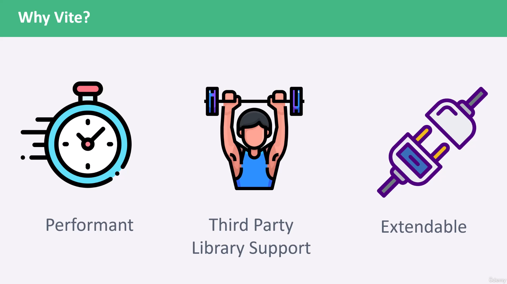
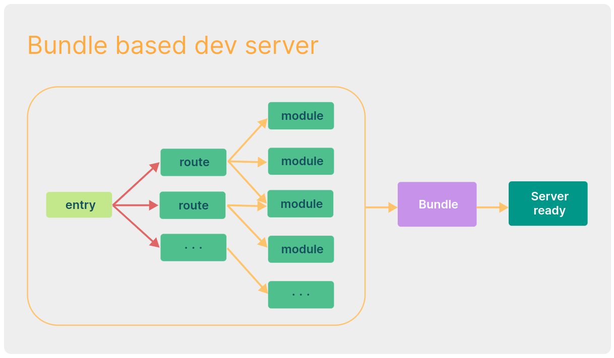
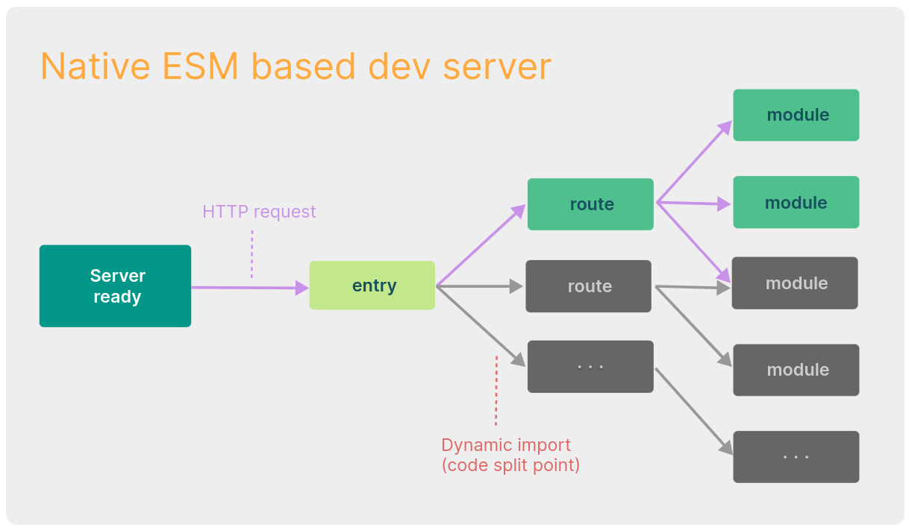

# INDEX

- [INDEX](#index)
  - [Vite](#vite)
    - [Why Vite](#why-vite)
      - [The Problems](#the-problems)
        - [Slow Server Start](#slow-server-start)
        - [Slow Updates](#slow-updates)
    - [Bundle-based vs Native-ESM-based Dev server](#bundle-based-vs-native-esm-based-dev-server)
      - [Bundle-based Dev Server](#bundle-based-dev-server)
      - [Native-ESM-based Dev Server](#native-esm-based-dev-server)
    - [Why Bundle for Production](#why-bundle-for-production)
    - [Why Not Bundle with esbuild?](#why-not-bundle-with-esbuild)
    - [Browser Support](#browser-support)
  - [esbuild](#esbuild)
  - [Difference between Vite and Webpack](#difference-between-vite-and-webpack)

---

## Vite

> Fun fact: It's a french word meaning **"Fast / Quick"**

It's a build tool (module bundler) that aims to provide a faster and leaner development experience for modern web projects. It consists of two major parts:

1. A **dev server** that provides rich feature enhancements over `native ES modules`, for example extremely fast `Hot Module Replacement (HMR)`.
2. A **build command** that bundles your code with `Rollup`, pre-configured to output highly optimized static assets for production.

in summary, Vite tries to let the browser do more work for us

### Why Vite

#### The Problems

- Before ES modules were available in browsers, developers had no native mechanism for authoring JavaScript in a **modularized** fashion. This is why we are all familiar with the concept of **"bundling"**: using tools that `crawl`, `process` and `concatenate` our source modules into files that can run in the browser.
- Over time we have seen tools like `webpack`, `Rollup` and `Parcel`, which greatly improved the development experience for frontend developers.
- It is not uncommon for large scale projects to contain thousands of modules. We are starting to hit a performance bottleneck for JavaScript based tooling: it can often take an unreasonably long wait (sometimes up to minutes!) to spin up a dev server, and even with `Hot Module Replacement (HMR)`, file edits can take a couple of seconds to be reflected in the browser.

Vite aims to address these issues by leveraging new advancements in the ecosystem: the availability of native **ES modules in the browser**, and the rise of **JavaScript tools written in compile-to-native languages**

---

##### Slow Server Start

- When cold-starting the dev server, a bundler-based build setup has to eagerly crawl and build your entire application before it can be served.
- Vite improves the dev server start time by first dividing the modules in an application into two categories: **dependencies** and **source code**.
  - **dependencies**: are mostly plain JavaScript that do not change often during development. Dependencies may also be shipped in various module formats (e.g. `ESM` or `CommonJS`).
    - **Vite** pre-bundles dependencies using [esbuild](https://esbuild.github.io/). `esbuild` is written in `Go` and pre-bundles dependencies **10-100x** faster than JavaScript-based bundlers.
  - **Source code**: often contains non-plain JavaScript that needs transforming (e.g. `JSX`, `CSS` or `Vue/Svelte components`), and **will be edited very often**. - Also, not all `source code` needs to be loaded at the same time (e.g. with **route-based code-splitting**). - Vite serves `source code` over [native ESM](https://developer.mozilla.org/en-US/docs/Web/JavaScript/Guide/Modules). This is essentially letting the browser take over part of the job of a bundler: **Vite only needs to transform and serve source code on demand, as the browser requests it**. - This means that Code behind conditional dynamic `imports` is only processed if actually used on the current screen.

---

##### Slow Updates

- When a file is edited in a bundler-based build setup, it is inefficient to rebuild the whole bundle for obvious reasons: the **update speed will degrade linearly with the size of the app**.
- In some bundlers, the dev server runs the bundling in memory so that it only needs to invalidate part of its module graph when a file changes (like in `Virtual DOM`), but it still needs to re-construct the entire bundle and reload the web page.
- Reconstructing the bundle can be expensive, and reloading the page blows away the current `state` of the application. This is why some bundlers support `Hot Module Replacement (HMR)`: **"allowing a module to "hot replace" itself without affecting the rest of the page"**. This greatly improves DX - however, in practice we've found that even HMR update speed deteriorates significantly as the size of the application grows.
  - In Vite, `HMR` is performed over `native ESM`. When a file is edited, Vite only needs to precisely invalidate the chain between the edited module and its closest HMR boundary (most of the time only the module itself), making HMR updates consistently fast regardless of the size of your application.
- Vite also leverages **HTTP headers** to speed up full page reloads (again, let the browser do more work for us): source code module requests are made conditional via `304 Not Modified`, and dependency module requests are strongly cached via `Cache-Control: max-age=31536000`,immutable so they don't hit the server again once cached.

---

### Bundle-based vs Native-ESM-based Dev server

#### Bundle-based Dev Server

1. bundles all your code/files (`entry-file`, `routes`, `modules`) into a single bundle
2. this single bundle will be served into a server, so that the browser can download this specific bundle (every time you make a development change)

#### Native-ESM-based Dev Server

1. At first, we have the server ready for us (the start point)
2. Vite only provide the server with the `entry file`, ex: `index.js`
3. (Optional) -> you can do now `bundle-splitting`, `dynamic-imports`, `lazy-loading`,....
4. as now most of the browsers supports `ESM modules` (`import`/`export` instead of common.js), so we use it for only loads what we need
   - The server takes care of loading the files we want to run separately on every single request (only loads the routes that it needs)

---

### Why Bundle for Production

- Even though `native ESM` is now widely supported, shipping unbundled ESM in production is still inefficient (even with `HTTP/2`) due to the additional network round trips caused by nested imports.
- To get the optimal loading performance in production, it is still better to bundle your code with `tree-shaking`, `lazy-loading` and `common chunk splitting` (for better caching).

---

### Why Not Bundle with esbuild?

- While `esbuild` is extremely fast and is already a very capable bundler for libraries, some of the important features needed for bundling applications are still work in progress - in particular `code-splitting` and `CSS handling`.
- For the time being, **Rollup** is more mature and flexible in these regards.

---

### Browser Support

- The default build targets browsers that support `native ES Modules`, `native ESM dynamic import`, and `import.meta`.
- Legacy browsers can be supported via the official [@vitejs/plugin-legacy](https://github.com/vitejs/vite/tree/main/packages/plugin-legacy)

---

## esbuild

It's an extremely fast JavaScript bundler

It's written in **Go** Language, this is ok as you may use whatever language other than Javascript for **Tooling**. but the language on the web is still Javascript

---

## Difference between Vite and Webpack

- while debugging in **devTools**, you will find that:
  - Webpack has one js file with its custom configuration, the problem is it may be difficult to read and understand
  - Vite on the other hand, requests all the used files as they are in your local files, so they are very easy to read and debug
- Webpack has more custom configuration as it's more mature
