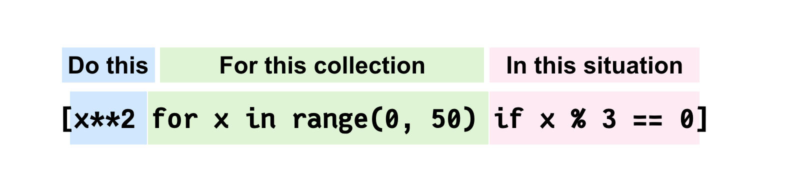

## INDEX

- [INDEX](#index)
- [Operators](#operators)
- [Loops](#loops)
  - [while loop](#while-loop)
  - [for loop](#for-loop)
- [Functions](#functions)
  - [parameter types](#parameter-types)
- [Scope (Namespaces) and NameBinding](#scope-namespaces-and-namebinding)
  - [Namespaces](#namespaces)
  - [NameBinding](#namebinding)
- [OOP](#oop)
  - [object memory location](#object-memory-location)
  - [constructor](#constructor)
  - [Encapsulation](#encapsulation)
- [List](#list)
  - [List methods](#list-methods)
  - [List comprehension](#list-comprehension)
- [Notes](#notes)

---

## Operators

- **floor division**: also called integer-division (results in an integer by discarding the fraction part)

  - it round down to a small value ->

    ```py
    print(14 // 8) # 1`
    print(-14 // 8) # -2`
    ```

  - floor dividing by 10s removes last digits

    ```py
    print(12345 // 10) # 1234`
    print(12345 // 1000) # 12`
    ```

- **modulus operator** `%` returns the remainder

  - module dividing by 10s gets last digits

    ```py
    print(12345 % 10) # 5`
    print(12345 % 1000) # 345`
    ```

- **multiple assignments**

  ```py
  m = 3
  m, n = 10 * m, m + 1 # 30, 4 (uses old value of m)
  # try not to do it complicated like that to avoid errors
  ```

- **operators precedence**:

  ```py
  -2**2 # -4
  (-2)**2 # 4
  ```

- **Relational operators**:

  - boolean operation are converted to **integer**

  ```py
  5 * (2 < 4) # 5
  5 * (2 > 4) # 0

  x = 2
  x += 2 < 8 # 3
  ```

- **strings comparison**: Based on English Dictionary (Letter by letter comparison)

  ```py
  # If a word has a smaller letter: it appears first
  print('love' < 'zebra') # True  l is before z
  print('love' < 'long')  # False: lo are common, but v > n
  print('love' != 'long') # True

  # If one word is done in comparison: the smaller in length comes first
  print('counter' < 'counterattack')  # True

  # Upper letters are smaller than small letters
  print('A' < 'a')            # True
  print('A' < 'z')            # True
  print('Z' < 'a')            # True
  print('loVE' < 'love')      # True V < v
  print('loVE' < 'long')      # True V < n

  print('' < 'A')             # True empty is smaller

  print(' ' < 'A')            # True: space smaller than letters
  print(' ' < 'a')            # True: space smaller than letters

  print('0' < 'A')            # True: Digits smaller than letters
  print('0' < 'a')            # True: Digits smaller than letters
  ```

- **Float comparison** try to avoid it

  ```py
  a = 3 / 7 # 0.42857142857142855
  b = 0.1 + 3/7 - 0.1 # 0.4285714285714286

  print(a == b)   # False

  x = 5.0
  y = 4.9999999999999999999999999999999999999
  print(x == y)   # True: y is approximated to 5
  ```

- **Membership operators** -> `in`, `not in` operators

  - **Prefix**: any string starts from the first character (n prefixes)
    - `ex`: "ahmed omar" -> "ahme"
  - **Suffix**: any string ends from the last character (n Suffix)
    - `ex`: "ahmed omar" -> "d omar"
  - **Substring**: starts and ends wherever, but consecutive
    - `ex`: "ahmed omar" -> "med oma"
  - **Sub-sequence**: not consecutive, but must be in order (next letter must has bigger index)
    - `ex`: "ahmed omar" -> "amd"

- **identity operator** -> `is`
  - returns True if two variables are the same object-reference **in memory**
  - don't use it with immutable objects

---

## Loops

### while loop

```py
while (condition):
  # do something
```

---

### for loop

```py
for i in range(5):
  print(i, end=' ') # 0 1 2 3 4
```

- range can be one number(0->number) or range (number1 -> number2) or you can also specify the value of each step
  - last number in the range is not included
  - if you used a negative value as a step, this means you decrease and not increase (**iterating backwards**)
- **enumerate function** : returns an enumerated object

  ```py
  for i, value in enumerate(range(5, 8)):
  print(i, value)

  for i, value in enumerate('ali'):
  print(i, value)
  ```

- `for else` -> loop that can have an optional (else block), the else part is executed if the items in the sequence used in for loop exhausts
  - else block is not executed (ignored) if you **break** from the loop

---

## Functions

### parameter types

- positional arguments

  ```py
  def f(a,b,c):
    print(a,b,c)
  f(1,3,2)
  ```

- keyword arguments (in-order or out-of-order)

  ```py
  def f(a,b,c):
    print(a,b,c)
  f(a=1,c=2,b=3)
  ```

---

## Scope (Namespaces) and NameBinding

### Namespaces

In python, there're 4 types of namespaces:

1. built-in -> like (len, int, max, sum, TypeError)
2. global
3. enclosing
4. local

order of using a variable in a function: (**python search order**):
`local` -> `enclosing` -> `global` -> `build-in`

- in functional-scope you can't access global variables

  - to access global variable inside a function --> use `global` word

  ```py
  b=20

  def f():
    global b
    b= 5

  f()
  print(b) # 5
  ```

- in block-scope (`if` / `loop`) you can access global variables

---

### NameBinding


---

## OOP

### object memory location

- `id()` method is used to return a unique id for the specified object -> **object memory address**
  
- when we have different variables pointing to the same address --> **Alias**
- every thing in python is an object (mutable (reference) / immutable (primitive))
- Immutable objects
  

---

### constructor

it initializes the data members of the class when an object of class is created

- it's done using **Dender (double underScore) init method** `__init__()` which is a reserved method called when an object is created

```py
class Person:
  def __init__(self, name, age):
    self.name = name
    self.age = age

p1 = Person("John", 36) # Object definition
```

- `__str__()` method is used to return string

  ```py
  class Person:
    def __init__(self, first_name, last_name, age):
        self.first_name = first_name
        self.last_name = last_name
        self.age = age

    def __str__(self):
        return f'Person({self.first_name},{self.last_name},{self.age})'

    john = Person('John', 'Sam', 36)
    print(str(john))
  ```

---

### Encapsulation

- it's grouping of variables and functions of a specific concept in a single component, named **class**
- in `c++`, `java`, this concept is more loaded with **hiding** things from outsiders
  - but `python` has another philosophy: **trust other programmers**

---

## List

- can have different data types
- we can use `in` operator to iterate

  ```py
  print(2 in my_list) # True / False

  for item in my_list:
    # code
  ```

- you can concatenate lists using `+` operator
  
- you can duplicate lists using `*` operator
- to create a list from a tuple -> `List()`

---

### List methods

- inserting items to list

  ```py
  my_list = [1, 5, 10, 17, 2]

  # append: add item to the end
  my_list.append('Hii') # 1 5 10 17 2 Hii

  # Extend the list by appending all the items from the iterable
  another_lst = [3, 1]
  my_list.extend(another_lst) # 1 5 10 17 2 Hii 3 1

  #TypeError: 'int' object is not iterable
  #my_list.extend(2)

  # Insert an item at a given position
  my_list.insert(2, 'Wow')
  # 1 5 Wow 10 17 2 Hii 3 1
  ```

- removing items from list

  ```py
  my_list = [1, 5, 10, 17, 2, 'Hii']

  # pop removes the item at a specific index and returns it.
  print(my_list.pop())    # Hii  - default last item
  # Now list is : 1 5 10 17 2

  print(my_list.pop(3))    # 17
  # Now list is : 1 5 10 2

  # del removes the item at a specific index:
  del my_list[0]  # 5 10 2

  # remove removes the first matching value, not a specific index:
  my_list.remove(10)  # 5 2

  # ValueError: list.remove(x): x not in list
  #my_list.remove('Hei')
  ```

  - to delete selectively from a list, don't iterate forwards as there will be conflict in indexes if you delete element, instead iterate backwards

- searching for item in list

  ```py
  my_list = [1, 15, 7, 'mostafa', 7, True, 0]

  # search and return the FIRST index
  print(my_list.index(7))     # 2
  print(my_list.index(True))  # (any index of the first value that isn't false) -> 0
  print(my_list.index(False)) # 6

  #ValueError: 'Wow' is not in list
  #print(my_list.index('Wow'))

  my_list.clear()
  print(len(my_list))  # 0
  ```

- Sorting

  - `sort` method

    ```py
    my_list = [5, 7, 2]

    # no new list -> in-place (memory-efficient)
    my_list.sort()  # [2, 5, 7]

    # common mistake:
    my_list = my_list,sort() # NONE
    ```

  - `sorted` function

    - returns a sorted list of a specified **iterable** object

    ```py
    my_list = [5, 7, 2]

    new_list = sorted(my_list)  # [2, 5, 7]
    # my_list doesn't change

     new_string = sorted('zacb')  # ['a', 'b', 'c', 'z']
    # my_list doesn't change

    # common mistake:
    my_list = my_list,sort() # NONE
    ```

  - same for `reverse` method and `reversed` function

- `all` & `any` functions
  - return `true/false` if all/some elements of the iterable are `true/false`
- `.copy()` -> creates a copy that is different from the original

---

### List comprehension

List comprehension offers a shorter syntax when you want to create a new list based on the values of an existing list.



```py
lst1 = [2, 3, 4, 1]

# Old syntax
lst2 = []
for i in lst1:
    lst2.append(i *i + 1)

print(lst2)     # [5, 10, 17, 2]

# new syntax
lst2 = [i*i+1   for i in lst1]
print(lst2)     # [5, 10, 17, 2]
```

---

## Notes

- `print()` can have second parameter which is the end after element:

  ```py
  # make separator "," instead of new line "\n"
  print(x, end=',')
  ```

- `del` -> removes the bind from name of variable to the value in memory, so the variable will equal `undefine` (**unboundLocalError**)
