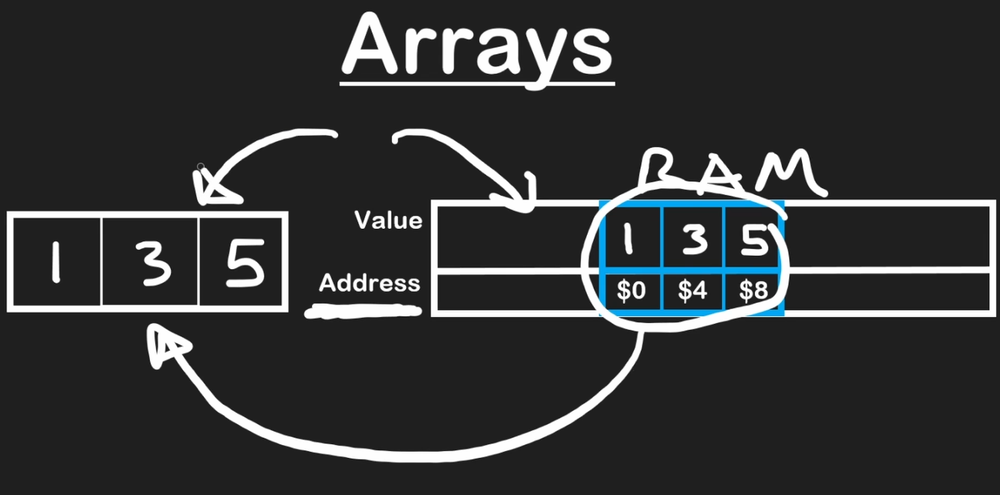
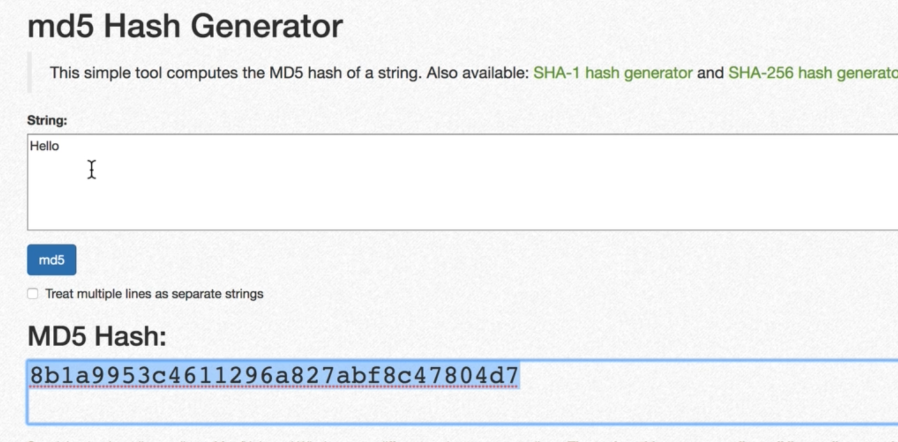

# INDEX

- [INDEX](#index)
  - [Data Structures](#data-structures)
    - [storing data in memory](#storing-data-in-memory)
  - [Operations on data structures](#operations-on-data-structures)
    - [Insertion](#insertion)
    - [Deletion](#deletion)
    - [Traversal](#traversal)
    - [Searching](#searching)
    - [Sorting](#sorting)
  - [Arrays](#arrays)
    - [Array Types](#array-types)
    - [Arrays big O](#arrays-big-o)
    - [Array Notes](#array-notes)
  - [Hash Tables](#hash-tables)

---

## Data Structures

it's a collection of values (can have relationships between them) which is being manipulated by steps of processes (**Algorithms**)

### storing data in memory

Each data type has a number of bits associated with it and that needs to get stored in the system and **the system allocates data storage and then the CPU reads from that storage**

- for example: **integers** are stored in as a **32-bit** value, so it takes 4 (8-bits) locations (blocks)
  

---

## Operations on data structures

### Insertion

inserting element into the data-structure

### Deletion

deleting element from the data-structure

### Traversal

access each data-item **only once** so that it can be processed

### Searching

find the location of data-item in a data-structure if it exists

### Sorting

sort data-items in the data-structure to be ordered (next to each other in memory in order)

---

## Arrays

### Array Types

- static -> fixed size declared at initiation
- dynamic -> can change size after initiation based on the need
  - this is where languages differ in allocating (managing) memory, as language like `c++` requires to have static array and to change it you need to redeclare another array with the new size which will be in **different memory location**
  - language like **python** are dynamic and it automatically manages memory for us

---

### Arrays big O

> always remember if we iterated over items in array -> **O(n)**

- `lookup` & `push` are **O(1)**, as they doesn't iterate over other items in the array
  - there's a small possibility in **dynamic arrays**, that appending(pushing) element will create a new array which iterate over the array items to make them in the new memory location
- `inserting` (in the beginning / any location other that the end) or `deleting` (`unshift`) are **O(n)**, as they change the locations of other array items and we then have to **iterate** over all/some of them to change their address in memory

---

### Array Notes

- when you want to do an operation on a **string**, think of it as an array, by converting it to array then do what you want

---

## Hash Tables

Here we have **Key/value pairs**

**Hash function:**

- it's a function that generates a value of fixed length for each input that it gets.
- it's one way
- the resulted hash-value is converted to **index-biased** which is pointer to where the value of the key is in the memory
  - this is great for accessing values of a hash-table as we only give it a **key** and it gets the value from the location immediately -> **O(1)**
    - unlike lists where we depended on the sequence of elements in the list

Problem of hash-tables:

- **collision** : with enough data and limited memory, sometimes keys are hashed to the same value so they have the same address in memory (**memory-space**) which causes collision, and it becomes **linked list**

when we have a collision, the performance becomes **O(n/k) -> O(n)**, which is `k` is the size of the hash-table
