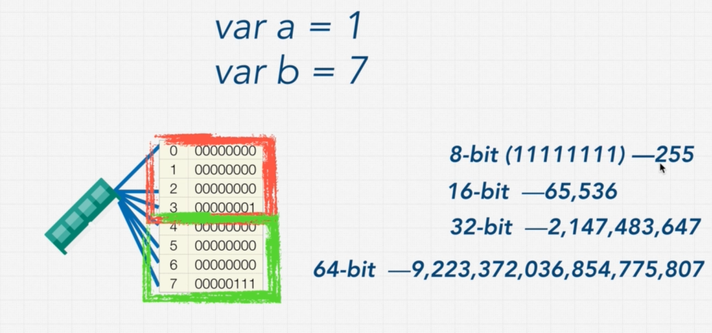
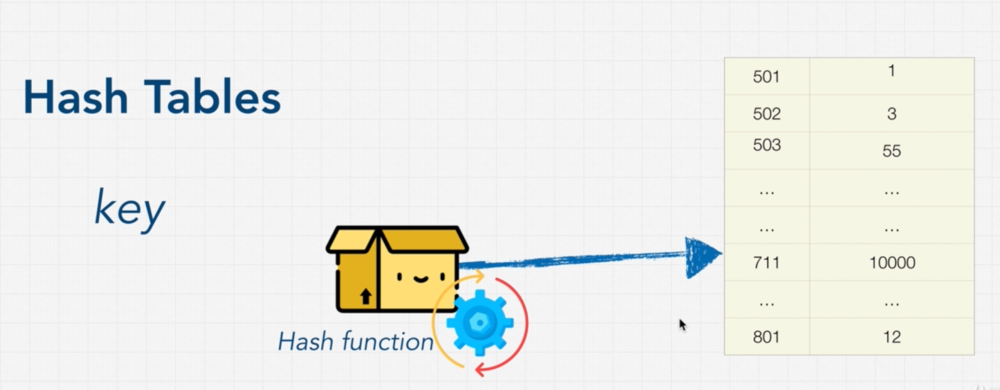

# INDEX

- [INDEX](#index)
  - [Data Structures](#data-structures)
    - [storing data in memory](#storing-data-in-memory)
  - [Operations on data structures](#operations-on-data-structures)
    - [Insertion](#insertion)
    - [Deletion](#deletion)
    - [Traversal](#traversal)
    - [Searching](#searching)
    - [Sorting](#sorting)
  - [Arrays](#arrays)
    - [Array Types](#array-types)
    - [Arrays big O](#arrays-big-o)
    - [Array Notes](#array-notes)
  - [Hash Tables](#hash-tables)
  - [Linked lists](#linked-lists)
    - [Singly linked list](#singly-linked-list)
    - [Doubly linked list](#doubly-linked-list)
    - [Arrays vs linked lists](#arrays-vs-linked-lists)
  - [Stacks and Queues](#stacks-and-queues)
    - [Stacks](#stacks)
    - [Queues](#queues)

---

## Data Structures

it's a collection of values (can have relationships between them) which is being manipulated by steps of processes (**Algorithms**)

### storing data in memory

Each data type has a number of bits associated with it and that needs to get stored in the system and **the system allocates data storage and then the CPU reads from that storage**

- for example: **integers** are stored in as a **32-bit** value, so it takes 4 (8-bits) locations (blocks)
  

---

## Operations on data structures

### Insertion

inserting element into the data-structure

### Deletion

deleting element from the data-structure

### Traversal

access each data-item **only once** so that it can be processed

### Searching

find the location of data-item in a data-structure if it exists

### Sorting

sort data-items in the data-structure to be ordered (next to each other in memory in order)

---

## Arrays

### Array Types

- static -> fixed size declared at initiation
- dynamic -> can change size after initiation based on the need
  - this is where languages differ in allocating (managing) memory, as language like `c++` requires to have static array and to change it you need to redeclare another array with the new size which will be in **different memory location**
  - language like **python** are dynamic and it automatically manages memory for us

---

### Arrays big O

> always remember if we iterated over items in array -> **O(n)**

- `lookup` & `push` are **O(1)**, as they doesn't iterate over other items in the array
  - there's a small possibility in **dynamic arrays**, that appending(pushing) element will create a new array which iterate over the array items to make them in the new memory location
- `inserting` (in the beginning / any location other that the end) or `deleting` (`unshift`) are **O(n)**, as they change the locations of other array items and we then have to **iterate** over all/some of them to change their address in memory

---

### Array Notes

- when you want to do an operation on a **string**, think of it as an array, by converting it to array then do what you want

---

## Hash Tables

Here we have **Key/value pairs**

**Hash function:**

- it's a function that generates a value of fixed length for each input that it gets.
- it's one way
- the resulted hash-value is converted to **index-biased** which is pointer to where the value of the key is in the memory
  - this is great for accessing values of a hash-table as we only give it a **key** and it gets the value from the location immediately -> **O(1)**
    - unlike lists where we depended on the sequence of elements in the list

Problem of hash-tables:

- **collision** : with enough data and limited memory, sometimes keys are hashed to the same value so they have the same address in memory (**memory-space**) as there's no concept of ordering keys)indexes), which causes collision, and it becomes **linked list**

  - when we have a collision, the performance becomes **O(n/k) -> O(n)**, which is `k` is the size of the hash-table
- also here, we may decrease the **time complexity**, but we might also accidentally increase the **space complexity** as a tradeoff by creating an object and storing values inside it in the memory

---

## Linked lists

### Singly linked list

- a **single-linked** list contains a set of nodes, each node has 2 elements:
  - data to store
  - pointer to the next node
- first node is called **Head**, and last node is called **tail**
- linked lists are called **null-terminated**, which signified the tail node as it points to `null`

### Doubly linked list

- Downside here is that we have to hold a little bit more memory
- it can be traversed both from the front and the back

### Arrays vs linked lists

- in array, elements are **indexed**, but in linked-list -> you start with the **head** , then you **traverse** the list until you get to item that you want
  - so, instead of using **iteration** between indexes of a list, we are traversing the list until you hit `null`
- iterating through a linked-list is a bit slower that iterating through items in array, even though they're technically both `O(n)`
- inserts that we can do in the **middle** of a linked-list is a lot better that an array, as we don't have to do any shifting the indexes, as nodes are scattered in the memory like in hash-table
- unlike `hash-table`, here we have ordered (sorted) data as each node points to the next one
- **pointer**: is a reference to some value in memory

---

## Stacks and Queues

they made us limit the operations we can do on other data structures like `lists` and `linked-lists`, this is an advantage as to control whoever uses this data-structure performs only their right operations that are efficient

### Stacks

it's based on **LIFO** (last in - first out)

- used in programming languages when calling functions in the **call stack**
- `peek` --> is to view the top most plate
- stacks can be implemented using **Arrays** or **linked-lists**, as arrays allow for **cache locality** which is faster when accessing its items in memory because they're right next to each other versus a `linked-list` that has them scattered all over memory

---

### Queues

it's based on **FIFO** (first in - first out)

- `enqueue` --> is to add to the queue (push)
- `denqueue` --> is to remove first item from queue (pop)
- creating `Queues` from `arrays` is really bad, as you will shift the other elements (O(n))
- You would never want to build a queue with an `array`, as `arrays` have indexes associated with them, so if we removed first item then we now need to shift the indexes over --> **O(n)**, **so we should build `queues` with `linked-lists`**, as we just change the `head` --> **O(1)**
