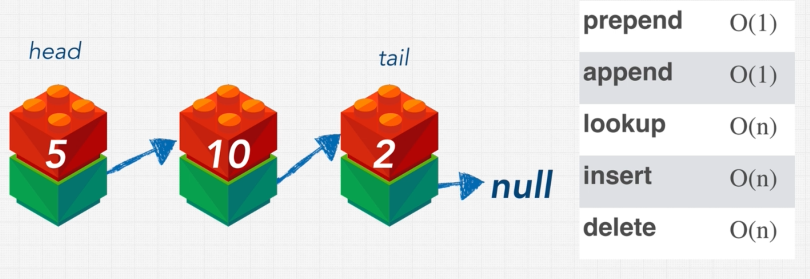
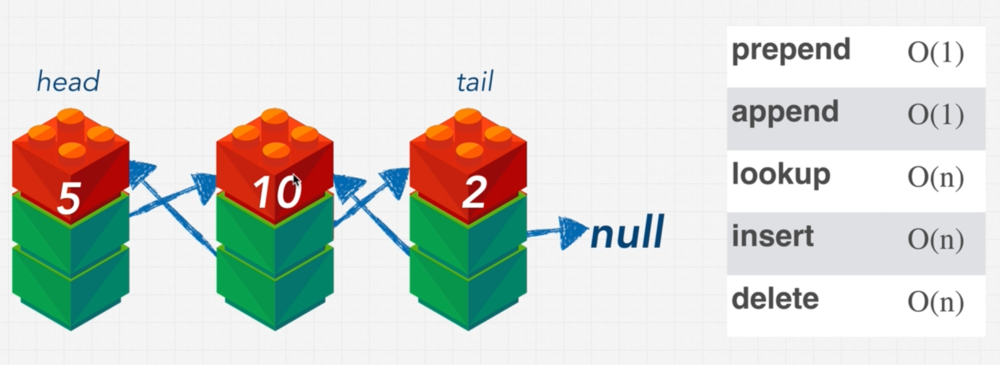
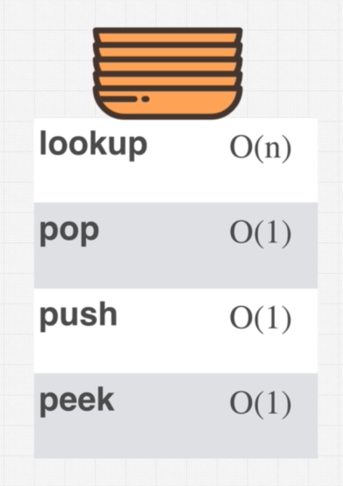
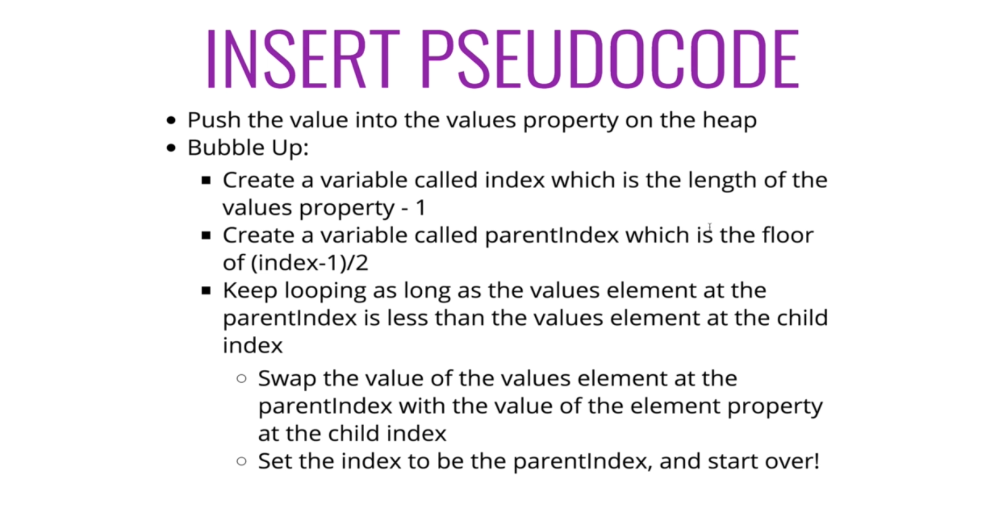

# INDEX

- [INDEX](#index)
  - [Data Structures](#data-structures)
    - [storing data in the Memory](#storing-data-in-the-memory)
  - [Operations on data structures](#operations-on-data-structures)
    - [Insertion](#insertion)
    - [Deletion](#deletion)
    - [Traversal](#traversal)
    - [Searching](#searching)
    - [Sorting](#sorting)
  - [Arrays](#arrays)
    - [Array Types](#array-types)
      - [Static Array](#static-array)
      - [Dynamic Array](#dynamic-array)
        - [How it works with capacity ?](#how-it-works-with-capacity-)
        - [Implementing a Dynamic Array](#implementing-a-dynamic-array)
        - [Geometric Increase in Capacity and Arithmetic Progression](#geometric-increase-in-capacity-and-arithmetic-progression)
    - [Referential Arrays](#referential-arrays)
    - [Arrays big O](#arrays-big-o)
    - [Array Notes](#array-notes)
  - [Hash Tables (Map)](#hash-tables-map)
    - [Hash function](#hash-function)
    - [Hash table implementation](#hash-table-implementation)
  - [Linked lists](#linked-lists)
    - [Arrays vs linked lists](#arrays-vs-linked-lists)
    - [Singly linked list](#singly-linked-list)
    - [Linked List Traversal](#linked-list-traversal)
    - [Doubly linked list](#doubly-linked-list)
  - [Stacks and Queues](#stacks-and-queues)
    - [Stacks](#stacks)
      - [Array-Based Stack Implementation](#array-based-stack-implementation)
    - [Queues](#queues)
  - [Trees](#trees)
    - [Tree Implementation](#tree-implementation)
    - [Binary Tree](#binary-tree)
      - [Perfect vs Full vs Complete Binary Trees](#perfect-vs-full-vs-complete-binary-trees)
      - [Binary Search Tree (BST)](#binary-search-tree-bst)
      - [Tree Traversal](#tree-traversal)
    - [Binary Heap](#binary-heap)
      - [Array implementation](#array-implementation)
      - [Heap methods](#heap-methods)
      - [Priority Queue](#priority-queue)
    - [Binary Trie](#binary-trie)
  - [Graphs](#graphs)
    - [How to store graphs](#how-to-store-graphs)
    - [Graphs implementation](#graphs-implementation)

---

## Data Structures

it's a collection of values (can have relationships between them) which is being manipulated by steps of processes (**Algorithms**)

They're ways to organize information with **optimal runtime complexity** for different operations

- Most programming languages have built-in data structures, but in interviews, you may still be asked about **"inferior"** data structures like queues and linked lists.
  - this is done by using the built-in data structures and getting the same result
    - ex: to add to queue -> use array equivalent: `array.insert()`
  - also if we want to make a class to the data-structure, we can use the built-in data-structure to make it
    - ex: to make a queue class -> use array to make it and remove some unwanted array-methods
      

### storing data in the Memory


Each data type has a number of bits associated with it and that needs to get stored in the system and **the system allocates data storage and then the CPU reads from that storage**

A computer system will have a huge number of bytes of memory, and to keep track of what information is stored in what byte, the computer uses an abstraction known as a memory address. In effect, each byte of memory is associated with a unique number that serves as its address (more formally, the binary representation of the number serves as the address).

> computer hardware is designed, in theory, so that any byte of the main memory can be efficiently accessed based upon its memory address. In this sense, we say that a computer’s main memory performs as **random access memory (RAM)**.
>
> - That is, it is just as easy to retrieve byte `#8675309` as it is to retrieve byte `#309`
> - what allows an arbitrary cell of the array to be accessed in constant time based on its index. Is: if one knows the memory address at which an array starts (e.g., `2146`), the number of bytes per element (e.g., `2` for a Unicode character), and a desired index within the array, the appropriate memory address can be computed using the calculation, **`start + cellSize * index`**. By this formula, the cell at index `0` begins precisely at the start of the array, the cell at index `1` begins precisely cellSize bytes beyond the start of the array, and so on.
>   - As an example, cell `4` begins at memory location `2146+2*4 = 2154`.
> - we say that any individual byte of memory can be stored or retrieved in `O(1)` time.

- for example: **integers** are stored in as a **32-bit** value, so it takes 4 (8-bits) locations (blocks)
  

- **Note**: A reference to the `None` object can be used as an element of the list to represent an empty location in the array (doesn't exist in the data-structure).

---

## Operations on data structures

### Insertion

inserting element into the data-structure

### Deletion

deleting element from the data-structure

### Traversal

access each data-item **only once** so that it can be processed

### Searching

find the location of data-item in a data-structure if it exists

### Sorting

sort data-items in the data-structure to be ordered (next to each other in memory in order)

---

## Arrays


### Array Types

#### Static Array

**static** -> fixed size declared at initiation

- When creating a low-level array in a computer system, the precise size of that array must be explicitly declared in order for the system to properly allocate a consecutive piece of memory for its storage
- Because the system might dedicate neighboring memory locations to store other data, the capacity of an array cannot trivially be increased by expanding into subsequent cells. In the context of representing a Python `tuple` or `str` instance, this constraint is no problem. Instances of those classes are immutable, so the correct size for an underlying array can be fixed when the object is instantiated.
- Each cell of an array must use the same number of bytes. This requirement is what allows an arbitrary cell of the array to be accessed in constant time based on its index. In particular, if one knows the memory address at which an array starts, the number of bytes per element (e.g., `2` for a Unicode character), and a desired index within the array, the appropriate memory address can be computed using the calculation
  - Formula = **`start + cellsize * index`**
  - By this formula, the cell at index 0 begins precisely at the start of the array, the cell at index 1 begins precisely cellsize bytes beyond the start of the array, and so on. As an example, cell 4 of Figure 5.2 begins at memory location `2146+2 * 4 = 2146+8 = 2154`

#### Dynamic Array

**dynamic** -> can change size after initiation based on the need

> **Dynamic array** is that a list instance maintains an underlying array that often has greater capacity than the current length of the list.
>
> - This extra capacity makes it easy to append a new element to the list by using the next available cell of the array.

- this is where languages differ in allocating (managing) memory, as language like `c++` requires to have static array and to change it you need to redeclare another array with the new size which will be in **different memory location**
- language like **python** are dynamic and it automatically manages memory for us
- Python’s `list` class presents a more interesting abstraction. Although a list has a particular length when constructed, the class allows us to add elements to the list, with no apparent limit on the overall capacity of the list. To provide this abstraction, Python relies on an algorithmic sleight of hand known as a **dynamic array**.
- If a user continues to append elements to a list, any reserved capacity will eventually be exhausted. In that case, the class requests a new, larger array from the system, and initializes the new array so that its prefix matches that of the existing smaller array.
  - > At that point in time, the old array is no longer needed, so it is reclaimed by the system.
  - We rely on a function named `getsizeof()` that is available from the sys module. This function reports the number of bytes that are being used to store an object in Python. For a list, it reports the number of bytes devoted to the array and other instance variables of the list, but not any space devoted to elements referenced by the list.
  - Because a list is a referential structure, the result of `getsizeof` for a list instance only includes the size for representing its primary structure; it does not account for memory used by the objects that are elements of the list.

##### How it works with capacity ?

- As soon as the first element is inserted into the list, we detect a change in the underlying size of the structure. In particular, we see the number of bytes jump from 72 to 104, an increase of exactly `32 bytes`. Usually, we run on a `64-bit` machine architecture, meaning that each memory address is a `64-bit` number (i.e., `8 bytes`). We speculate that the increase of `32 bytes` reflects the allocation of an underlying array capable of storing four object references. This hypothesis is consistent with the fact that we do not see any underlying change in the memory usage after inserting the second, third, or fourth element into the list.
  - `32 bytes = 4 \* 8 bytes(64bits)` --> 4 objects references

##### Implementing a Dynamic Array

steps:


1. Allocate a new array B with larger capacity
2. Set `B[i] = A[i]`, for `i = 0,...,n−1`, where `n` denotes current number of items.
3. Set `A = B`, that is, we henceforth use B as the array supporting the list.
4. Insert the new element in the new array.
5. > Not shown is the future garbage collection of the old array

> We may notice that the total running time of n append operations is **`O(n)`**, as an (append operation) causes an overflow and a doubling of capacity. which means -> Copying the old elements (n) to the new array

##### Geometric Increase in Capacity and Arithmetic Progression

- When choosing the geometric base, there exists a tradeoff between run-time efficiency and memory usage. With a base of `2` (i.e., doubling the array), if the last insertion causes a resize event, the array essentially ends up twice as large as it needs to be. If we instead increase the array by only `25%` of its current size (i.e., a geometric base of `1.25`), we do not risk wasting as much memory in the end, but there will be more intermediate resize events along the way.
- > The key to the performance is that the amount of additional
  > space is proportional to the current size of the array
- To avoid reserving too much space at once, it might be tempting to implement a dynamic array with a strategy in which a constant number of additional cells are reserved each time an array is resized. Unfortunately, the overall performance of such a strategy is significantly worse. At an extreme, an increase of only one cell causes each append operation to resize the array, leading to a familiar `1+ 2+ 3+ ··· + n` summation and `Ω(n2)` overall cost. Using increases of `2 or 3` at a time is slightly better, as portrayed in Figure 5.13, but the overall cost remains **quadratic**.
  

> look more into the **Amortized Analysis of Dynamic Arrays** in page 197 (D&A in python book)

---

### Referential Arrays

- Arrays and tuples use another way to keep a byte-reference for each item to randomly access it quickly as each item naturally has different lengths

  - Python represents a list or tuple instance using an internal storage mechanism of an array of **object references**. At the lowest level, what is stored is a consecutive sequence of memory addresses at which the elements of the sequence reside. A high-level diagram of such a list
    
  - Although the relative size of the individual elements may vary, the number of bits used to store the memory address of each element is fixed (e.g., **64-bits per address**). In this way, Python can support constant-time access to a list or tuple element based on its index
  - > The list will simply keep a sequence of references to those objects. Note as well that a reference to the **`None`** object can be used as an element of the list to represent an empty bed in the hospital.

- The fact that lists and tuples are referential structures is significant to the semantics of these classes. A single list instance may include multiple references to the same object as elements of the list, and it is possible for a single object to be an element of two or more lists, as those lists simply store references back to that object.
  - ex: when you compute a slice of a list, the result is a new list instance, but that new list has references to the same elements that are in the original list
    
- it is a common practice in Python to initialize an array of integers using a syntax such as `counters = [0] * 8`. This syntax produces a list of length eight, with all eight elements being the value zero. Technically, all eight cells of the list reference the same object
  
- the `extend` command is used to add all elements from one list to the end of another list. **The extended list does not receive copies of those elements, it receives references to those elements (shallow copy)**
  

---

### Arrays big O


> always remember if we iterated over items in array -> **O(n)**

- `lookup` & `push/append`(inserting from the end) are **O(1)**, as they doesn't iterate over other items in the array
  - there's a small possibility in **dynamic arrays**, that appending(pushing) element will create a new array which iterate over the array items to make them in the new memory location (exhibits **amortized** constant-time behavior)
    - we can further improve the practical execution time by using a **list comprehension** syntax to build up the temporary list, rather than by repeated calls to append.
- `inserting` (in the beginning / any location other that the end) or `deleting` (`unshift`) are **O(n)**, as they change the locations(indices) of other array items and we then have to **iterate** over all/some of them to change their address in memory and their new index
- **Extending a List**: Python provides a method named `extend` that is used to add all elements of one list to the end of a second list.
  - In practice, the `extend` method is preferable to repeated calls to `append` because the constant factors hidden in the asymptotic analysis are significantly smaller.
    - **Advantages of `extend` instead of `append`:**
      1. there is always some advantage to using an appropriate Python method, because those methods are often implemented natively in a compiled language (rather than as interpreted Python code).
      2. Second, there is less overhead to a single function call that accomplishes all the work, versus many individual function calls.
      3. Finally, increased efficiency of `extend` comes from the fact that the resulting size of the updated list can be calculated in advance. If the second data set is quite large, there is some risk that the underlying dynamic array might be resized multiple times when using repeated calls to `append`. With a single call to `extend`, at most one resize operation will be performed.
  - the running time is proportional to the **length of the other list**, and amortized because the underlying array for the first list may be resized to accommodate the additional elements.
- **Best practices for constructing new lists**:
  - Experiments should show that the list comprehension syntax is significantly faster than building the list by repeatedly appending
  - it is a common Python idiom to initialize a list of constant values using the multiplication operator, as in `[0] * n` to produce a list of length `n` with all values equal to zero.
    - Not only is this succinct for the programmer; it is more efficient than building such a list incrementally.

---

### Array Notes

- A Python **string** embedded as an array of characters in the computer’s memory. We assume that each **Unicode character of the string requires two bytes** of memory
- when you want to do an operation on a **string**, think of it as an array, by converting it to array then do what you want

  ```py
  # Avoid this:
  letters = ''
  for c in document:
    if c.isalpha():
      letters += c

  # Do this:
  letters = ''.join([c for c in document if c.isalpha()])
  ```

- `tuples` are typically more memory efficient than `lists` because they are **immutable**
- Comparisons between two sequences are defined **"lexicographically"**. In the worst case, evaluating such a condition requires an iteration taking time proportional to the length of the shorter of the two sequences (because when one sequence ends, the lexicographic result can be determined).
  - However, in some cases the result of the test can be evaluated more efficiently. For example, if evaluating `[7, 3, ...] < [7, 5, ...]`, it is clear that the result is True without examining the remainders of those lists, because the second element of the left operand is strictly less than the second element of the right operand.
- To properly initialize a two-dimensional list, we must ensure that each cell of the primary list refers to an independent instance of a secondary list. This can be accomplished through the use of Python’s list comprehension syntax.

  ```py
  data = [ [0] c for j in range(r) ]
  ```

---

## Hash Tables (Map)

Here we have **Key/value pairs**

> In order to look-up values by key, we need a way to convert keys into valid array indices


- use cases:
  - create a mapping from one thing to another thing
  - look-up
  - prevent duplicate entries
  - DNS resolution
    - `Google.com` -> `74.125.239.133`

### Hash function

- it's a function that generates a value of fixed length for each input that it gets.
- it's one way
- the resulted hash-value is converted to **index-biased** which is pointer to where the value of the key is in the memory
  - this is great for accessing values of a hash-table as we only give it a **key** and it gets the value from the location immediately -> **O(1)**
    - unlike lists where we depended on the sequence of elements in the list


Problem of hash-functions in hash-tables:

- **collision** : with enough data and limited memory, sometimes keys are hashed to the same value so they have the same address in memory (**memory-space**) as there's no concept of ordering keys)indexes), which causes collision, and it becomes **linked list**
  
  - when we have a collision, the performance becomes **O(n/k) -> O(n)**, which is `k` is the size of the hash-table
  - There're many strategies for dealing with collisions:
    1. **separate chaining**:
       
       - at each index in our array we store values using more sophisticated data-structure like (array or linked-list)
       - this allows us to store multiple key-value pairs at the same index
    2. **linear probing**:
       
       - when we find a collision, we search through the array to find the next empty slot
- also here, we may decrease the **time complexity**, but we might also accidentally increase the **space complexity** as a tradeoff by creating an object and storing values inside it in the memory

---

### Hash table implementation


- `set`:
  - accepts a key and a value + hashes the key
  - stores the key-value pair in the hash table array via **separate chaining**
- `get`:
  - accepts a key + hashes the key + retrieves the key-value pair in the hash table
  - if the key isn't found, returns `undefined`

---

## Linked lists

It's a data structure that contains a `head`, `tail` and `length` properties and consist of **nodes** and each node has a `value` and a `pointer` to another node or `null`

- It's an excellent alterative to arrays when insertion and deletion at the beginning are frequently required

### Arrays vs linked lists


- in array, elements are **indexed**, but in linked-list -> you start with the **head** , then you **traverse** the list until you get to item that you want
  - so, instead of using **iteration** between indexes of a list, we are traversing the list until you hit `null`
- iterating through a linked-list is a bit slower that iterating through items in array, even though they're technically both `O(n)`
- inserts that we can do in the **middle** of a linked-list is a lot better that an array, as we don't have to do any shifting the indexes, as nodes are scattered in the memory like in hash-table
- unlike `hash-table`, here we have ordered (sorted) data as each node points to the next one
- **pointer**: is a reference to some value in memory

---

### Singly linked list




- **single-linked** list contains a set of nodes, each node has 2 elements:
  - data to store
  - pointer to the next node
- first node is called **Head**, and last node is called **tail**
- linked lists are called **null-terminated**, which signified the tail node as it points to `null`
- `.Get(index)` here we don't have `index`, so if we want to **get** to a node with a specific index, we will have to **manually count each `.next` operation** until we reach wanted node

  ```js
  // Get the index'th node in the linked list.
  get(index) {
    // If the index is less than zero or greater than or equal to the length of the list, return null.
    if(index < 0 || index >= this.length) return null;

    // Initialize a counter variable at 0.
    let counter = 0;
    // Initialize a variable that will be used to traverse the linked list. Set it to the head of the list.
    let current  = this.head;

    // While the counter is not equal to the index...
    while(counter !== index) {
      // Set the current variable to be the next node in the linked list.
      current = current.next;
      // Increment the counter by 1.
      counter++;
    }
    // Return the current variable.
    return current;
  }
  ```

- `removeAt(index)`:

  - we need to keep track of the previous node, so we can update the `.next` pointer of the previous node to point to the next node
  - we need to keep track of the current node, so we can return the value of the node that was removed
  - we need to keep track of the next node, so we can update the `.next` pointer of the current node to point to the next node

  ```py
  def removeAt(self, index):
    counter = 0
    current = self.head
    previous = None # to keep track of the previous node so we can update the .next pointer of the previous node to point to the next node

    # if list is empty
    if !current:
      return None
    # if index is out of range
    if index < 0 or index >= self.length:
      return None
    # if index is the head
    if index == 0:
      self.head = self.head.next
      return self.head

    while counter != index:
      previous = current
      current = current.next
      counter += 1
    previous.next = current.next
    self.length -= 1
    return current
  ```

- `insertAt(index)`: we need to keep track of the previous node, so we can update the `.next` pointer of the previous node to point to the new node

  - we need to keep track of the current node, so we can update the `.next` pointer of the new node to point to the current node
  - we need to keep track of the next node, so we can update the `.next` pointer of the current node to point to the next node

  ```py
  def insertAt(self, index, value):
    newNode = Node(value)  # create a new node with the value passed to the function and next pointer set to None
    counter = 0
    current = self.head
    previous = None

    # if list is empty
    if !current:
      self.head = newNode
      return self.head
    # if index is out of range
    if index < 0 or index >= self.length:
      return None
    # if index is the head
    if index == 0:
      newNode.next = self.head
      self.head = newNode
      return self.head

    while counter != index:
      previous = current
      current = current.next
      counter += 1
    previous.next = newNode
    newNode.next = current
    self.length += 1
    return self.head
  ```

  > - when **inserting**, we can make use of the already existed methods: `push` and `unshift`:
  > - if the index is the same as the length, **push** a new node to the end of the list
  > - if the index is `0`, **unshift** a new node to the start of the list

---

### Linked List Traversal

To be able to loop through a linked list using `for` loop, we need to have a way to traverse through the linked list, using generator function:

```py
def traverse(self):
  current = self.head
  while current:
    yield current.value
    current = current.next
```

---

### Doubly linked list

It's almost identical to `singly-linked-list`, except every node has another pointer, to the previous node.




- Downside here compared to the `singly-linked-list` is that we have to hold a little bit more memory to take advantage of the more flexibility that the `double-linked-list` provides --> (Tradeoff)
- it can be traversed both from the front and the back easily
- `.pop()` here is easer as we have access to the node previous to the `tail`
- `.Get(index)` here we can use the same technique as in `singly-linked-list` or we can leverage the `previous` pointer here, as we can see if the wanted `index` is more closer to the `head` or `tail` **(we know this by comparing the index to the half of the length of the linked-list)**, and then go from there

  ```js
  get(index) {
    if(index < 0 || index >= this.length) return null;
    if(index <= this.length/2) {
      let counter = 0;
      let current  = this.head;
      while(counter !== index) {
        current = current.next;
        counter++;
      }
      return current;
    }
    else {
      let count = this.length - 1;
      let current  = this.tail;
      while(counter !== index) {
        current = current.prev;
        counter--;
      }
      return current;
    }
  }
  ```

---

## Stacks and Queues

They made us limit the operations we can do on other data structures like `lists` and `linked-lists`, this is an advantage as to control whoever uses this data-structure performs only their right operations that are efficient

- They're called: **"linear Data structures"** as they allow us to **traverse** (go through data elements sequentially one by one in which only one data element can be directly reached)
- here there's no random-access-operations like in `lists`, as we can only reach first or last element

### Stacks



A stack is a collection of objects that are inserted and removed according to the **last-in, first-out (LIFO)** principle.

- used in
  - programming languages when calling functions in the **call stack**
  - some commands like: `undo`
  - Internet Web browsers store the addresses of recently visited sites in a stack. Each time a user visits a new site, that site’s address is “pushed” onto the stack of addresses. The browser then allows the user to “pop” back to previously visited sites using the “back” button
- `peek` --> is to view the top most plate

#### Array-Based Stack Implementation

> Although a programmer could directly use the **list** class in place of a formal stack class, lists also include behaviors (e.g., adding or removing elements from arbitrary positions) that would break the abstraction that the stack ADT represents. Also, the terminology used by the list class does not precisely align with traditional nomenclature for a stack ADT, in particular the distinction between append and push. Instead, we demonstrate how to use a list for internal storage while providing a public interface consistent with a stack.

stacks can be implemented using **Arrays(lists)** or **linked-lists**, as:

- we can use the **"Adapter Pattern"**

  - > The adapter design pattern applies to any context where we effectively want to modify an existing class so that its methods match those of a related, but different, class or interface. One general way to apply the adapter pattern is to define a new class in such a way that it contains an instance of the existing class as a hidden field, and then to implement each method of the new class using methods of this hidden instance variable. By applying the adapter pattern in this way, we have created a new class that performs some of the same functions as an existing class, but repackaged in a more convenient way.
  - always when using the **"Adapter Pattern"**, try to remember the different Error-type-raised from different data-structures, as a `List` would raise an `IndexError` if the list is empty; so we need to raise another Error-type if the stack is empty

    ```py
    if self.is empty( ):
      raise Empty( 'Stack is empty' )
    ```

- `arrays` allow for **cache locality** which is faster when accessing its items in memory because they're right next to each other
  
- `linked-list`, but note that it has its items scattered all over memory, so it will be slower that `array`
  - also remember that `.pop()` in `singly-linked-list` is `O(n)` and not `O(1)` like in `doubly-linked-list`, so if you will implement a stack using linked-list, do it with `doubly-linked-list`

---

### Queues


it's based on **FIFO** (first in - first out)

- used in:

  - Background tasks
  - uploading resources
  - printing / task processing

- `enqueue` --> is to add to the queue (push)
- `denqueue` --> is to remove first item from queue (pop)
- creating `Queues` from `arrays` is really bad, as you will shift the other elements (O(n))
- You would never want to build a queue with an `array`, as `arrays` have indexes associated with them, so if we removed first item then we now need to shift the indexes over --> **O(n)**,
- **so we should build `queues` with `linked-lists`**, as we just change the `head` --> **O(1)**

---

## Trees

It's a data structure that consists of nodes in a **parent/child relationship**


They have **Hierarchical Data-structures** structure unlike other data-structures which are **Linear Data-structures**

- used in:
  - the **HTML DOM**
  - Network Routing
  - AI
  - computer File Systems (folders/files)
- `nodes`
  - can only point to their children (child node can't point to it;s parent or it's siblings)
  - each node must have only one parent node
  - don't have to reference their parent

---

### Tree Implementation

- `nodes` can be implemented using `classes` or `objects`
- `edges` can be implemented using `arrays` or `lists`
- `trees` can be implemented using `arrays` or `lists` or `objects`
- Traverse a tree using `BFS` or `DFS`
  - **`BFS` Steps:**
    - create a queue (this can be an array) and a variable to store the values of nodes visited
    - place the root node in the queue
    - loop as long as there is anything in the queue
      - dequeue a node from the queue and push the value of the node into the variable that stores the nodes
      - if there are children on the node dequeued - add them to the queue
    - return the variable that stores the values
  - **`DFS` Steps:**
    - create a stack (this can be an array) and a variable to store the values of nodes visited
    - create a variable to store the values of nodes visited
    - store the root of the BST in a variable called current
    - write a helper function which accepts a node
      - push the value of the node to the variable that stores the values
      - if there are children on the node dequeued - add them to the queue
    - return the array of values

```py
class Node:
  def __init__(self, value):
    self.value = value
    self.children = []

  def add_child(self, child_node):
    self.children.append(child_node)

  def remove_child(self, child_node):
    self.children = [child for child in self.children if child is not child_node]

# -------------------------------------------------------------

class Tree:
  def __init__(self, root_node=None):
    self.root = root_node

  def bfs_traverse(self):
    if self.root is None:
      return
    # create a list to store the nodes that we need to visit
    queue = [self.root]
    while queue:
      current_node = queue.pop(0) # "pop(0)" is to remove the first item in the list
      print(current_node.value)
      queue += current_node.children # "queue += current_node.children" is to add the children of the current node to the queue

  def dfs_traverse(self):
    if self.root is None:
      return
    # create a list to store the nodes that we need to visit
    stack = [self.root]
    while stack:
      current_node = stack.pop() # "pop()" is to remove the last item in the list
      print(current_node.value)
      stack += current_node.children
```

---

### Binary Tree


- It's a type of trees that has some rules:
  - Each `node` can only have either `0`, `1` or `2` child-nodes
  - Each child can only one parent
- a `node` represent a certain state which has 3 properties;

  1. **value**
  2. pointer to the **left** side of the tree
  3. pointer to the **right** side of the tree

#### Perfect vs Full vs Complete Binary Trees

- **Full Binary Tree**: A Binary Tree is full if every `node` has `0` or `2` children. Following are examples of a full binary tree.

  ```sh
          18
        /    \
      15      20
      / \
      40 50
      / \
      30 50
  ```

- **Complete Binary Tree**: A Binary Tree is complete Binary Tree if all levels are completely filled except possibly the last level and the last level has all keys as left as possible.

  ```sh
              18
          /      \
        15         30
      /  \       /  \
    40    5    100   40
  / \   /
  8  7  9
  ```

- **Perfect Binary Tree**: A Binary tree is Perfect Binary Tree in which all internal nodes have two children and all leaves are at same level.

  ```sh
          18
      /       \
    15         30
    /  \        /  \
  40    50    100   40
  ```

  - this type is really efficient and desirable as they have 2 interesting properties:
    1. The number of total `nodes` on each level **doubles** as we move down the tree.
    2. The number of `nodes` on the last level is equal to (the sum of the number of nodes on all the other levels **plus** `1`), which means that **"half of our nodes are on the last level"**
       - this is very useful as it can enable us to avoid visiting every `node` if the `node` we're looking for is at the very bottom-level --> this introduces the **"O(log N)"** notation

---

#### Binary Search Tree (BST)


- Rules:
  - Every parent node has **at most** 2 children
  - Every node to the left of a parent node is always less than the parent
  - Every node to the right of a parent node is always greater than the parent
    - this means if I keep going to the right, the number or the value of the node constantly increases
- Advantages:

  - searching, look-ups and inserting which here is `O(log(n))` **(not guaranteed! as we may have unbalanced-search-tree)** which is much faster as we won't loop like in arrays (better than `O(n)`)
    - > this is also facilitated by that (even if the number of nodes doubled, then we'll find that we only increase the number of steps to `insert`/`find` by **1** step) 
  - ordered
  - flexible size

- Problems:

  - **unbalanced search tree** - it's when we have a side that is more occupied than the other side, which make us move from **`O(log n)`** to **`O(n)`** as it turns more into a long **linked list**
    
    - this is solved by:
      - selecting another **root** node and reorder the tree
      - Algorithms which balance an unbalanced-trees, like : `AVL Tree`, `Red Black Tree`
  - no `O(1)` operations like in `hash-tables`
  - removing elements is a bit tricky, as we need keep track to a reference to the **parentNode**, so that we know whet the deleted node is replaced with

- Class Construction
  
- Inserting a node:
  
- Finding a node (lookup):
  

---

#### Tree Traversal

It's covered in [Traversals section in Algorithms.md](./2-Algorithms.md#traversals)

---

### Binary Heap

- It's very similar to Binary-search-tree, but with some different rules:

  

  - There's no order to nodes in left and right nodes
    - left and right child nodes can be any value as long as they're less than the upper node
  - in a **MaxBinaryHeap**, parent nodes are always larger than child nodes
  - in a **MinBinaryHeap**, parent nodes are always smaller than child nodes
  - Every parent node has **at most** 2 children

  - so it can be used in any algorithm where ordering is important
  - **O(n)**:
    - it has a **`O(n)`** for lookup as it's less ordered than Binary-trees; so it turns to looping in a linked list or array to find a value
    - it has a **`O(log(n))`** for inserting/removing

- A binary-heap is as compact as possible. All the children of each node are as full as they can be and **left children are filled out first**
- It's used in:
  - Implementing [Priority Queues](#priority-queue)
  - used with **Graph-traversal** Algorithms

#### Array implementation


- For any parent node of an Array at index `n`:
  - the left child is stored at `2n + 1`
  - the right child is stored at `2n + 2`
- For any child node at index `n`:
  - its parent is at index `(n - 1) / 2` **floored**

#### Heap methods

- Inserting:
  - when inserting, we first add item to the end of the `values` array, then we bubble-up (swap it up until it finds its correct spot)
    
    
- Removing (Extract max)

  1. remove the root
  2. replace with the most recently added (last element in values array)
  3. adjust (sink/bubble-down) until we have correct spots

  

---

#### Priority Queue

It's a data structure where each element has a priority. Elements with higher priorities are served before elements with lower priorities.

- we can implement it using `Array`, but it's not efficient, as we will need to iterate over the entire thing to find the highest priority element, so instead we use a **Heap**
- ex with `binary-heap`:
  

- Implementation

  - here we use the same steps like in [Binary Heap](#binary-heap) -> `values` array property, but we also have `priority` property
    

  

---

### Binary Trie

It's a specialized tree used in **searching** most often with text, in most cases it can outperform `binary search trees`, `hash-tables` and others


- it's used to tell if a (word or a part of a word) exists in a body of text
- it usually has a start point which is empty and then letters are added below it
- it has a lookup **`O(length of word)`**

---

## Graphs

They're nodes (vertices) connected via "Edges"


> **Vertex**: node
> **Edge**: connection between nodes

- There're many ways to categorize graphs:

  - **Directed** and **undirected** graphs:
    - directions assigned to distances between nodes
    - Undirected -> If you made a facebook friend-request to someone; you become his friend and he becomes your friend
    - directed -> (graph that goes in one direction): If you made a twitter follow to someone; you follow him, but he doesn't automatically follow you
  - **weighted** and **unweighted**
    - values assigned to distances between nodes
  - **cyclic** and **Acyclic**

### How to store graphs


- **Adjacency Matrix**
  
- **Adjacency List**
  
  - here, we use array to store the edges
  - it's the most used, as most data in real-world tends to lend itself to sparser and/or larger graphs

### Graphs implementation

- Adding a Vertex:
  
- Adding an Edge:
  
  
