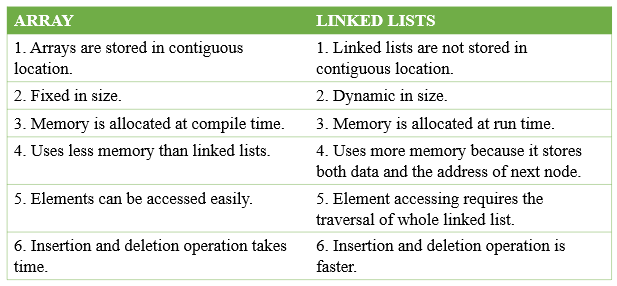
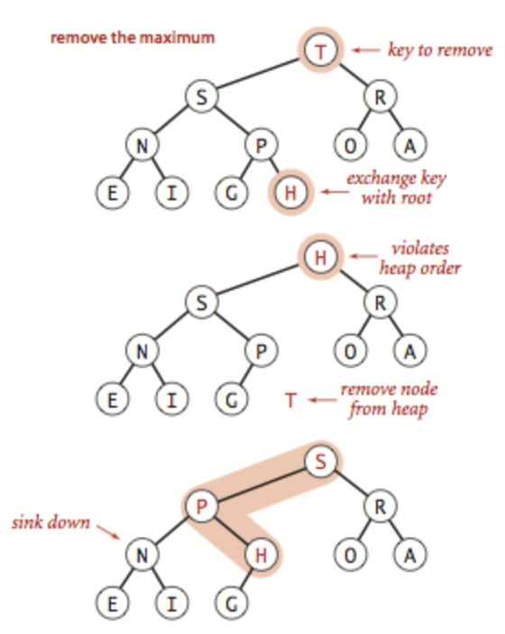

# INDEX

- [INDEX](#index)
  - [Data Structures](#data-structures)
    - [storing data in the Memory](#storing-data-in-the-memory)
  - [Operations on data structures](#operations-on-data-structures)
    - [Insertion](#insertion)
    - [Deletion](#deletion)
    - [Traversal](#traversal)
    - [Searching](#searching)
    - [Sorting](#sorting)
  - [Arrays](#arrays)
    - [Static Array](#static-array)
      - [Downside of static array](#downside-of-static-array)
    - [Dynamic Array](#dynamic-array)
      - [How it works with capacity ?](#how-it-works-with-capacity-)
        - [The capacity problem](#the-capacity-problem)
        - [Solution: Efficient Dynamic Arrays](#solution-efficient-dynamic-arrays)
      - [Implementing a Dynamic Array](#implementing-a-dynamic-array)
      - [Geometric Increase in Capacity and Arithmetic Progression](#geometric-increase-in-capacity-and-arithmetic-progression)
    - [Referential Arrays](#referential-arrays)
    - [Compact Arrays](#compact-arrays)
    - [Arrays big O](#arrays-big-o)
    - [Array Notes](#array-notes)
  - [Linked lists](#linked-lists)
    - [Singly linked list](#singly-linked-list)
      - [Singly linked list operations](#singly-linked-list-operations)
    - [Linked List Traversal](#linked-list-traversal)
    - [Circular linked list](#circular-linked-list)
    - [Doubly linked list](#doubly-linked-list)
  - [Arrays vs linked lists](#arrays-vs-linked-lists)
    - [Differences](#differences)
    - [Advantages of Arrays over linked-lists](#advantages-of-arrays-over-linked-lists)
    - [Advantages of linked-lists over Arrays](#advantages-of-linked-lists-over-arrays)
  - [Hash Tables (Map)](#hash-tables-map)
    - [Hash function](#hash-function)
      - [Good Hash functions](#good-hash-functions)
      - [Problem of Hash functions in hash-tables (bad hash functions)](#problem-of-hash-functions-in-hash-tables-bad-hash-functions)
      - [Collision](#collision)
        - [Drawbacks of bad hash functions](#drawbacks-of-bad-hash-functions)
    - [Hash table implementation](#hash-table-implementation)
  - [Stacks and Queues](#stacks-and-queues)
    - [Stacks](#stacks)
      - [Call Stack](#call-stack)
      - [Array-Based Stack Implementation](#array-based-stack-implementation)
      - [Linked list based stack implementation](#linked-list-based-stack-implementation)
    - [Queues](#queues)
      - [Circular Queue](#circular-queue)
      - [Implementing a Queue using single linked-list](#implementing-a-queue-using-single-linked-list)
      - [Double-ended Queue (Deque)](#double-ended-queue-deque)
  - [Graphs](#graphs)
    - [How to store graphs](#how-to-store-graphs)
    - [Graphs implementation](#graphs-implementation)
  - [Trees](#trees)
    - [Tree Implementation](#tree-implementation)
    - [Binary Tree](#binary-tree)
      - [Array-based Binary Tree](#array-based-binary-tree)
      - [Perfect vs Full vs Complete Binary Trees](#perfect-vs-full-vs-complete-binary-trees)
      - [Binary Search Tree (BST)](#binary-search-tree-bst)
      - [Tree Traversal](#tree-traversal)
    - [TreeMap](#treemap)
  - [Priority Queue](#priority-queue)
    - [Implementation of Priority Queue](#implementation-of-priority-queue)
    - [Binary Heap](#binary-heap)
      - [Binary heap efficiency \& performance](#binary-heap-efficiency--performance)
      - [Heap methods](#heap-methods)
        - [Adaptable Priority Queue (heap)](#adaptable-priority-queue-heap)
    - [Array-based representation of Binary Heap](#array-based-representation-of-binary-heap)
    - [Implementing a Priority queue with a Heap](#implementing-a-priority-queue-with-a-heap)
    - [Python `heapq` module](#python-heapq-module)
  - [Tries](#tries)
    - [Tries Implementation](#tries-implementation)
    - [Hybrid Tries](#hybrid-tries)

---

## Data Structures

it's a collection of values (can have relationships between them) which is being manipulated by steps of processes (**Algorithms**)

> Or: It's a systematic way of organizing and accessing data

They're ways to organize information with **optimal runtime complexity** for different operations

- Most programming languages have built-in data structures, but in interviews, you may still be asked about **"inferior"** data structures like queues and linked lists.

  - this is done by using the built-in data structures and getting the same result
    - ex: to add to queue -> use array equivalent: `array.insert()`
  - also if we want to make a class to the data-structure, we can use the built-in data-structure to make it
    - ex: to make a queue class -> use array to make it and remove some unwanted array-methods
      

- There're 2 types of data structures:
  - **Linear** -> data is organized sequentially, one after the other
    - are called “linear” data structures because they all have a logical start and a logical end.
    - ex: `array`, `stack`, `queue`, `linked-list`
  - **Non-Linear** -> data is not organized sequentially
    - ex: `tree`, `graph`

### storing data in the Memory


Each data type has a number of bits associated with it and that needs to get stored in the system and **the system allocates data storage and then the CPU reads from that storage**

A computer system will have a huge number of **bytes** of memory (`1 byte` = `8 bits`), and each byte has a unique **memory address**. The memory address is a number that the CPU uses to access a specific `byte` of memory.

> Usually numbers are stored in **32 bits (4 bytes) or 64 bits (8 bytes)**

To keep track of what information is stored in what `byte`, the computer uses an abstraction known as a memory address. In effect, each byte of memory is associated with a unique number that serves as its address (more formally, the binary representation of the number serves as the address).

> computer hardware is designed, in theory, so that any byte of the main memory can be efficiently accessed based upon its memory address. In this sense, we say that a computer’s main memory performs as **random access memory (RAM)**.
>
> - That is, it is just as easy to retrieve byte `#8675309` as it is to retrieve byte `#309`
> - what allows an arbitrary cell of the array to be accessed in constant time based on its index. Is: if one knows the memory address at which an array starts (e.g., `2146`), the number of bytes per element (e.g., `2` for a Unicode character), and a desired index within the array, the appropriate memory address can be computed using the calculation, **`start + cellSize * index`**. By this formula, the cell at index `0` begins precisely at the start of the array, the cell at index `1` begins precisely cellSize bytes beyond the start of the array, and so on.
>   - As an example, cell `4` begins at memory location `2146+2*4 = 2154`.
> - we say that any individual byte of memory can be stored or retrieved in `O(1)` time.

- for example: **integers** are stored in as a **32-bit** value, so it takes 4 (8-bits) locations (blocks)
  

- **Note**: A reference to the `None` object can be used as an element of the list to represent an empty location in the array (doesn't exist in the data-structure).

---

## Operations on data structures

### Insertion

inserting element into the data-structure

### Deletion

deleting element from the data-structure

### Traversal

access each data-item **only once** so that it can be processed

### Searching

find the location of data-item in a data-structure if it exists

### Sorting

sort data-items in the data-structure to be ordered (next to each other in memory in order)

---

## Arrays

Arrays are stored contiguously in memory, which means that all elements of the array are stored next to each other in memory. This is why we can access any element of an array in constant time, as long as we know the index of that element.


- Note that the addresses in the picture are not real addresses, they are just used to illustrate the concept of contiguous memory. also they are incremented by `4` as each **number** element is `4 bytes` (32 bits)
  - This will differ if storing **ASCII** characters as each character is `1 byte` (8 bits)
    
  - If storing **Unicode** characters as each character is `2 bytes` (16 bits)

### Static Array

**static** -> fixed size declared at initiation

- When creating a low-level array in a computer system, the precise size of that array must be explicitly declared in order for the system to properly allocate a consecutive piece of memory for its storage
- Because the system might dedicate neighboring memory locations to store other data, the capacity of an array cannot trivially be increased by expanding into subsequent cells. In the context of representing a Python `tuple` or `str` instance, this constraint is no problem. Instances of those classes are immutable, so the correct size for an underlying array can be fixed when the object is instantiated.
- Each cell of an array must use the same number of bytes. This requirement is what allows an arbitrary cell of the array to be accessed in constant time based on its index. In particular, if one knows the memory address at which an array starts, the number of bytes per element (e.g., `2` for a Unicode character), and a desired index within the array, the appropriate memory address can be computed using this calculation:
  - Formula: **`memory_address = start + cellSize * index`**
    - By this formula, the cell at index `0` begins precisely at the start of the array, the cell at index `1` begins precisely `cellSize` bytes beyond the start of the array, and so on. As an example, cell `4` begins at memory location `2146+2 * 4 = 2146+8 = 2154`

#### Downside of static array

The downside of this approach is that the size of the array must be specified in advance, and it remains fixed for the lifetime of the array.

- This is not memory-efficient. You are reserving memory for future operations that may not occur.
- If the array is too small to hold all the items, it will be necessary to create a new, larger array and then copy the old array into the new one.
  
  - This operation takes `O(n)` time, where `n` is the current number of items. In addition, if the array becomes overfull, it will be necessary to create a new, smaller array and copy the items again. Once again, this operation takes `O(n)` time.
    
- It may not need the extra capacity, and it may be wasteful to reserve memory that is never used. On the other hand, You may also fill the array again and it becomes overfull, it will be necessary to create a new, smaller array and copy the items again. Once again, this operation takes `O(n)` time.

> So specifying the size of the array in advance is a good workaround, but it's not a perfect solution. [Linked lists](#linked-lists) provide a more flexible alternative. As **with linked lists, the items can be anywhere in memory**.

---

### Dynamic Array

**dynamic** -> can change size after initiation based on the need

> **Dynamic array** is that a list instance maintains an underlying array that often has greater capacity than the current length of the list.
>
> - This extra capacity makes it easy to append a new element to the list by using the next available cell of the array.

- this is where languages differ in allocating (managing) memory, as language like `c++` requires to have static array and to change it you need to redeclare another array with the new size which will be in **different memory location**
- language like `python` and `javascript` are dynamic and it automatically manages memory for us
  - Python’s `list` class presents a more interesting abstraction. Although a list has a particular `length` when constructed, the class allows us to add elements to the list, with no apparent limit on the overall capacity of the list. To provide this abstraction, Python relies on an algorithmic sleight of hand known as a **dynamic array**.
- If a user continues to append elements to a list, Any reserved capacity will eventually be exhausted. In that case, the Array-class requests a new, larger array from the system, and initializes the new array so that its prefix matches that of the existing smaller array.
  - > At that point in time, the old array is no longer needed, so it is reclaimed by the system.
  - We rely on a function named `getSizeOf()` that is available from the sys module. This function reports the number of bytes that are being used to store an object in Python. For a list, it reports the number of bytes devoted to the array and other instance variables of the list, but not any space devoted to elements referenced by the list.
  - Because a list is a referential structure, the result of `getSizeOf` for a list instance only includes the size for representing its primary structure; it does not account for memory used by the objects that are elements of the list.

#### How it works with capacity ?

##### The capacity problem

- When specifying the capacity of the new array, we don't do so by adding `1` to the capacity as this will result in creating array and copy elements each time we want to insert one more element

  - Ex: We have array of length `3` and we increase it like this:
    - `insertions = (4+5+6+...+N)` --> `O(N^2)` -> **Time series**
      
  - This is not efficient, so we increase the capacity (by `8` for example) to reduce number of `insertions`
    - `insertions = (11+19+27+...+N)` --> `O(N^2)` as well
      
      

##### Solution: Efficient Dynamic Arrays

> **Goal:** We want to reduce the number of **resizes** which reduces the number of **insertions** as well

- Suggestions:

  1. Increase the capacity by a constant amount `C` each time a resize occurs
     - `insertions = (4+9+14+...+N)` --> `O(N^2)`
  2. Increase the capacity by a constant factor `F` each time a resize occurs --> **This is the best solution**
     - `insertions = (4+8+16+...+N)` --> `O(2N)` --> `O(N)`
     - `space` --> `O(2N)` --> `O(N)`

- As soon as the first element is inserted into the list, we detect a change in the underlying size of the structure. In particular, we see the number of bytes jump from 72 to 104, an increase of exactly `32 bytes`. Usually, we run on a `64-bit` machine architecture, meaning that each memory address is a `64-bit` number (i.e., `8 bytes`). We speculate that the increase of `32 bytes` reflects the allocation of an underlying array capable of storing four object references. This hypothesis is consistent with the fact that we do not see any underlying change in the memory usage after inserting the second, third, or fourth element into the list.
  - `32 bytes = 4 \* 8 bytes(64bits)` --> `4` objects references

---

#### Implementing a Dynamic Array

steps:


1. Allocate a new array B with larger capacity. -> `(a)` in the picture
2. Set `B[i] = A[i]`, for `i = 0,...,n−1`, where `n` denotes current number of items. -> `(b)` in the picture
3. Set `A = B`, that is, we henceforth use B as the array supporting the list. -> `(c)` in the picture
4. Insert the new element in the new array.
5. (Not shown): is the future garbage collection of the old array

> We may notice that the total running time of n append operations is **`O(n)`**, as an (append operation) causes an overflow and a doubling of capacity. which means -> Copying the old elements (n) to the new array

#### Geometric Increase in Capacity and Arithmetic Progression

- When choosing the geometric base, there exists a tradeoff between run-time efficiency and memory usage. With a base of `2` (i.e., doubling the array capacity), if the last insertion causes a resize event, the array essentially ends up twice as large as it needs to be. If we instead increase the array by only `25%` of its current size (i.e., a geometric base of `1.25`), we do not risk wasting as much memory in the end, but there will be more intermediate resize events along the way.
- > The key to the performance is that the amount of additional space is proportional to the current size of the array
- To avoid reserving too much space at once, it might be tempting to implement a dynamic array with a strategy in which a constant number of additional cells are reserved each time an array is resized. Unfortunately, the overall performance of such a strategy is significantly worse. At an extreme, an increase of only one cell causes each append operation to resize the array, leading to a familiar `1+ 2+ 3+ ··· + n` summation and `Ω(n^2)` overall cost. Using increases of `2 or 3` at a time is slightly better, as portrayed in Figure 5.13, but the overall cost remains **quadratic**.
  

> look more into the **Amortized Analysis of Dynamic Arrays** in page 197 ("D&A in python" book)

---

### Referential Arrays

- Arrays and tuples use another way to keep a byte-reference for each item to randomly access it quickly as each item naturally has different lengths

  - Python represents a list or tuple instance using an internal storage mechanism of an array of **object references**. At the lowest level, what is stored is a consecutive sequence of memory addresses at which the elements of the sequence reside. A high-level diagram of such a list
    
  - Although the relative size of the individual elements may vary, the number of bits used to store the memory address of each element is fixed (e.g., **64-bits per address**). In this way, Python can support constant-time access to a list or tuple element based on its index
  - Empty elements can be referenced to as **`None`** object.

- Lists and tuples are referential structures, which means that a single instance can have multiple references to the same object as elements. This also means that a single object can be an element in multiple lists as they simply store references. When slicing a list, the resulting new list instance still references the same elements as the original list.
  
- it is a common practice in Python to initialize an array of integers using a syntax such as `counters = [0] * 8`. This syntax produces a list of length eight, with all eight elements being the value zero. Technically, all eight cells of the list reference the same object
  
- the `extend()` command is used to add all elements from one list to the end of another list. **The extended list does not receive copies of those elements, it receives references to those elements (shallow copy)**
  

---

### Compact Arrays

- Compact arrays are a way to store data in a contiguous block of memory, but without the need to store a byte-reference for each item as in referential arrays
- Compact arrays are used when we know the size of the data-type that we want to store in the array
  - Ex: if we want to store `integers` in the array, we know that each integer is `4 bytes` (32 bits), so we can store the first integer in the first `4 bytes` and the second integer in the next `4 bytes` and so on
  - Ex: if we want to store `floats` in the array, we know that each float is `8 bytes` (64 bits), so we can store the first float in the first `8 bytes` and the second float in the next `8 bytes` and so on
- it has an advantage when we're concerned about the memory usage, as we don't need to store a byte-reference for each item
- it has a fixed size, and it's not flexible like dynamic arrays, and it's not used in python as python is a dynamic language

---

### Arrays big O

> `tuples` are more memory efficient than `lists` because they are **immutable**


> always remember if we iterated over items in array -> **O(n)**

- Arrays are faster at reads because they provide **random access** instead of **sequential access**
- **Finding an Element in Array:** You have 3 options:

  1. If you know where it’s located, use the index. -> **O(1)**
  2. If you don’t know where it’s located and your data is sorted, you can use algorithms to optimize your search, such as Binary Search. -> **O(log n)**
  3. If you don’t know where it’s located and your data is not sorted, you will need to search through every element in the array and check if the current element is the element you are looking for -> **O(n) or O(n log n)**

- `lookup` & `push/append`(inserting from the end) are **O(1)**, as they doesn't iterate over other items in the array
  - there's a small possibility in **dynamic arrays**, that appending(pushing) element will create a new array which iterate over the array items to make them in the new memory location (exhibits **amortized** constant-time behavior)
    - > **Amortized** -> the average time taken to perform an operation, considering all possible scenarios (we don't frequently double the array)
    - we can further improve the practical execution time by using a **list comprehension** syntax to build up the temporary list, rather than by repeated calls to append.
- `inserting` (in the beginning / any location other that the end) or `deleting` (`unshift`) are **O(n)**, as they change the locations(indices) of other array items and we then have to **iterate** over all/some of them to change their address in memory and their new index
- **Extending a List**: Python provides a method named `extend` that is used to add all elements of one list to the end of a second list.
  - In practice, the `extend` method is preferable to repeated calls to `append` because the constant factors hidden in the asymptotic analysis are significantly smaller.
    - **Advantages of `extend()` instead of `append()`:**
      1. there is always some advantage to using an appropriate Python method, because those methods are often implemented natively in a compiled language (rather than as interpreted Python code).
      2. Second, there is less overhead to a single function call that accomplishes all the work, versus many individual function calls.
      3. Finally, increased efficiency of `extend` comes from the fact that the resulting size of the updated list can be calculated in advance. If the second data set is quite large, there is some risk that the underlying dynamic array might be resized multiple times when using repeated calls to `append`. With a single call to `extend`, at most one resize operation will be performed.
  - the running time is proportional to the **length of the other list**, and amortized because the underlying array for the first list may be resized to accommodate the additional elements.
- **Best practices for constructing new lists**:
  - `List comprehension` syntax is significantly faster than building the list by repeatedly `appending` elements in a `for` loop.
  - it is a common Python idiom to initialize a list of constant values using the `multiplication` operator, as in `[0] * n` to produce a list of length `n` with all values equal to zero.

---

### Array Notes

- Arrays are classified as **Homogeneous Data Structures** because they store elements of the same type.
  - once you define the type of values that your array will store, all its elements must be of that same type. You can’t "mix" different types of data.
- A Python **string** embedded as an array of characters in the computer’s memory. We assume that each **Unicode character of the string requires two bytes** of memory
- when you want to do an operation on a **string**, think of it as an array, by converting it to array then do what you want

  ```py
  # Avoid this:
  letters = ''
  for c in document:
    if c.isalpha():
      letters += c # BAD O(n^2)

  # Do this: O(n  +  n) = O(2n) = O(n)
  letters = ''.join([c for c in document if c.isalpha()])
  # or using generator function:
  letters = ''.join(c for c in document if c.isalpha())
  ```

- `tuples` are typically more memory efficient than `lists` because they are **immutable**
- Comparisons between two sequences are defined **"lexicographically"**. In the worst case, evaluating such a condition requires an iteration taking time proportional to the length of the shorter of the two sequences (because when one sequence ends, the lexicographic result can be determined).
  - However, in some cases the result of the test can be evaluated more efficiently. For example, if evaluating `[7, 3, ...] < [7, 5, ...]`, it is clear that the result is True without examining the remainders of those lists, because the second element of the left operand is strictly less than the second element of the right operand.
- To properly initialize a two-dimensional list, we must ensure that each cell of the primary list refers to an independent instance of a secondary list. This can be accomplished through the use of Python’s list comprehension syntax.

  ```py
  data = [c[0] for c in range(r)]
  ```

---

## Linked lists

It's a data structure that contains a `head`, `tail` and `length` properties and consist of **nodes** and each node has a `value` and a `pointer` to another node or `null`

- It relies on a lightweight object known as a **node**.
  - Each node maintains a reference to its element and one or more references to neighboring nodes in order to collectively represent the linear structure of the sequence.

It doesn't have a predetermined fixed size, It uses space proportionally to its current number of elements. It's a **dynamic data structure**.

- It's an excellent alterative to arrays when insertion and deletion at the beginning are frequently required
- It's a bunch of random memory addresses that are **linked together**

### Singly linked list


- **single-linked** list contains a set of nodes, each node has 2 elements:
  - data to store
  - pointer to the next node
- first node is called **head**, and last node is called **tail**
- linked lists are called **null-terminated**, which signified the tail node as it points to `null`

#### Singly linked list operations

- Remove element
  - removing from start is **O(1)** as we only need to change the `head` pointer
  - removing from end is **O(n)** as we need to traverse the whole list to get to the node previous to the `tail` node.
    - > To solve this, we use **doubly linked list** which has a pointer to the previous node
- If we want to access to a node with a specific `index`, we will have to traverse the list and **manually count each `.next` operation** until we reach wanted node.

  ```py
  # Get the index'th node in the linked list.
  def get(self, index):
    if index < 0 or index >= self.length:
      return None
    counter = 0
    cur = self.head
    while counter != index:
      cur = cur.next
      counter += 1
    return cur
  ```

- `removeAt(index)`:

  - we need to keep track of the previous node, so we can update the `.next` pointer of the previous node to point to the next node
  - we need to keep track of the current node, so we can return the value of the node that was removed
  - we need to keep track of the next node, so we can update the `.next` pointer of the current node to point to the next node

  ```py
  def removeAt(self, index):
    counter = 0
    current = self.head
    previous = None # to keep track of the previous node so we can update the .next pointer of the previous node to point to the next node

    # if list is empty
    if !current:
      return None
    # if index is out of range
    if index < 0 or index >= self.length:
      return None
    # if index is the head
    if index == 0:
      self.head = self.head.next
      return self.head

    while counter != index:
      previous = current
      current = current.next
      counter += 1
    previous.next = current.next
    self.length -= 1
    return current
  ```

- `insertAt(index)`: we need to keep track of the previous node, so we can update the `.next` pointer of the previous node to point to the new node

  - we need to keep track of the current node, so we can update the `.next` pointer of the new node to point to the current node
  - we need to keep track of the next node, so we can update the `.next` pointer of the current node to point to the next node

  ```py
  def insertAt(self, index, value):
    newNode = Node(value)  # create a new node with the value passed to the function and next pointer set to None
    counter = 0
    current = self.head
    previous = None

    # if list is empty
    if !current:
      self.head = newNode
      return self.head
    # if index is out of range
    if index < 0 or index >= self.length:
      return None
    # if index is the head
    if index == 0:
      newNode.next = self.head
      self.head = newNode
      return self.head

    while counter != index:
      previous = current
      current = current.next
      counter += 1
    previous.next = newNode
    newNode.next = current
    self.length += 1
    return self.head
  ```

  > - when **inserting**, we can make use of the already existed methods: `push` and `unshift`:
  > - if the index is the same as the length, **push** a new node to the end of the list
  > - if the index is `0`, **unshift** a new node to the start of the list

---

### Linked List Traversal

To be able to loop through a linked list using `for` loop, we need to have a way to traverse through the linked list, using generator function:

```py
def traverse(self):
  current = self.head
  while current:
    yield current.value
    current = current.next
```

---

### Circular linked list

Here, the `tail` of the list points to the `head` instead of pointing to `null`


---

### Doubly linked list

It's almost identical to `singly-linked-list`, except every node has another pointer, to the previous node.


- Downside here compared to the `singly-linked-list` is that we have to hold a little bit more memory to take advantage of the more flexibility that the `double-linked-list` provides --> (Tradeoff)
- When deleting a node, The 2 neighbors of the node that we want to delete, will point to each other, so the node will be reclaimed by the system and deleted from the memory.
- it can be traversed both from the front and the back easily
- `.pop()` here is easer as we have access to the node previous to the `tail`
- `.Get(index)` here we can use the same technique as in `singly-linked-list` or we can leverage the `previous` pointer here, as we can see if the wanted `index` is more closer to the `head` or `tail` **(we know this by comparing the index to the half of the length of the linked-list)**, and then go from there

  ```js
  get(index) {
    if(index < 0 || index >= this.length) return null;
    if(index <= this.length/2) {
      let counter = 0;
      let current  = this.head;
      while(counter !== index) {
        current = current.next;
        counter++;
      }
      return current;
    }
    else {
      let count = this.length - 1;
      let current  = this.tail;
      while(counter !== index) {
        current = current.prev;
        counter--;
      }
      return current;
    }
  }
  ```

---

## Arrays vs linked lists



### Differences

- **Size**
  - data can only be stored in contiguous blocks of memory in an array, its size cannot be altered at runtime due to the risk of overwriting other data.
  - in a linked list, each node points to the next one such that data can exist at scattered (non-contiguous) addresses; this allows for a dynamic size that can change at runtime.
- **Memory Allocation**
  - For static arrays, the size of the array is fixed, and the memory is allocated at `compile time`.
  - For dynamic arrays, the size of the array is not fixed, and the memory is allocated at `runtime`.
  - For linked lists, the size of the list is not fixed, and the memory is allocated at `runtime`.
- **Memory efficiency**
  - For the same number of elements, linked lists use more memory as a reference to the next node is also stored along with the data. However, size flexibility in linked lists may make them use less memory overall
- **Dependency**

  - In an array, values are independent of each other
  - In the case of linked list nodes are dependent on each other. one node is dependent on its previous node. If the previous node is lost then we can’t find its next subsequent nodes.

---

### Advantages of Arrays over linked-lists

- Arrays are better for **random access (lookups)** as we can access any element in the array in constant time

  - Arrays store elements in **contiguous memory locations**, resulting in easily calculable addresses for the elements stored and this allows faster access to an element at a specific index.
    - this allows for no memory shortage or overflow, As the array is of fixed size and stored in contiguous memory locations
  - because you can look up any element in your array instantly. With a linked list, the elements aren't next to each other, so you can't instantly calculate the position of the ith element in memory—you have to go to the first element to get the address to the second element, then go to the second element to get the address of the third element, and so on until you get to the `ith` element.

- in array, elements are **indexed**, but in linked-list -> you start with the **head**, then you **traverse** the list until you get to item that you want
  - so, instead of using **iteration** between indexes of a list, we are traversing the list until you hit `null`
  - That's why, in linked-lists, we use **sequential access** which is "reading elements one by one starting from first element" instead of **random access**
  - > **Note:** In linked-lists, Random access is not allowed. We have to access elements sequentially starting from the first node. So **we cannot do a binary search with linked lists**.
- iterating through a linked-list is a bit slower that iterating through items in array, even though they're technically both `O(n)`
- Arrays allow for **cache locality** which is faster when accessing its items in memory because they're right next to each other
- Arrays use proportionally less memory than linked lists, You may think that arrays use the same memory because of the **resizing** that happens in dynamic arrays `O(2n)`, but this is not true, as the resizing happens in a different memory location and the old array is deleted, plus that linked lists have to store a reference to the next node (or also the previous node in doubly linked lists) making its space complexity `O(2n)` (or `O(3n)` in doubly linked lists)

---

### Advantages of linked-lists over Arrays

> Linked list provides the following two advantages over arrays:
>
> 1. Dynamic size
> 2. Ease of insertion/deletion

- Linked lists are better for **insertion** and **deletion** as we don't have to shift the indexes of the elements in the array -> **O(1)**

  - Linked lists are less rigid in their storage structure and elements are usually not stored in contiguous locations, hence they need to be stored with additional tags giving a reference to the next element.
  - because you don't have to shift the elements in memory to make room for a new element or to fill in the gap when you delete an element. With an array, you have to shift all the elements after the deleted element over one space in memory.
    

- We don't need to know the number of elements to be stored beforehand, as we can dynamically allocate memory at runtime unlike arrays which are static in nature and need to be declared with a fixed size in advance.
- Wastage of memory is the main problem in the array. If the array size is big the less allocation of memory leads to wastage of memory.
- insertions/deletions that we can do in the **middle** of a linked-list is a lot better that an array, as we don't have to do any shifting the indexes, as nodes are scattered in the memory like in hash-table
  - This is done using the `PositionalList` ADT, which provides a way to access the elements of a sequence by their position within that sequence.
    - > The `PositionalList` ADT is a generalization of the `Stack` and `Queue` ADTs, which provide access to the first and last element of a sequence, respectively.
- unlike `hash-table`, here we have ordered (sorted) data as each node points to the next one
- **pointer**: is a reference to some value in memory

---

## Hash Tables (Map)

The main idea of a hash table is that it maps keys to values by taking a `bucket-array` and a `hash function`, and using them to store and retrieve values in constant time.

Here we have **Key/value pairs**

> In order to look-up values by key, we need a way to convert keys into valid array indices


- Arrays and lists map straight to memory, but hash tables are smarter. hey use a hash function to intelligently figure out where to store elements.
  - array like a data structure where keys (integers) can be used directly as an index to store values. However, in cases where the keys are large and cannot be used directly as an index, you should use **hashing**.
- Hash tables are great for:
  1. creating a mapping from one thing to another
  2. looking something up
- Hash tables are not good for:
  1. storing -> `O(nlog(n))`
- **Use cases:**
  - create a mapping from one thing to another thing
    - In technical terminology, we’d say that a hash function “maps strings to numbers.”
  - look-ups
  - Modeling relationships from one thing to another thing
  - prevent duplicate entries (Filtering out duplicates)
  - Caching/memorizing data instead of making your server do work
    - When you visit a website, your browser stores some of the contents on your computer. The next time you visit the site, your browser can load the page without having to send another request to the server.
    - The browser uses a hash function to map the URL to a location in your computer’s memory. If the browser has already stored the page, it can retrieve the contents from memory. Otherwise, it will send a request to the server.
    - > **Caching** is a common way to make things faster. All big websites use caching. And that data is cached in a hash!
  - DNS resolution
    - `Google.com` -> `74.125.239.133`

### Hash function

The goal of hash function is to **convert** a **key** to an **index** in the array.

- it's a function that generates a value of **fixed length** for each input that it gets.
- it's one way
- the resulted hash-value is converted to **index-biased** which is pointer to where the value of the key is in the memory
  - this is great for accessing values of a hash-table as we only give it a **key** and it gets the value from the location immediately -> **O(1)**
    - unlike lists where we depended on the sequence of elements in the list


- Hashing is implemented in two steps:

  ```py
  hash = hashfunc(key)
  index = hash % array_size
  ```

  1. An element is converted into an integer by using a hash function. This element can be used as an `index` to store the original element, which falls into the hash table.
  2. The element is stored in the hash table where it can be quickly retrieved using hashed key.

#### Good Hash functions

To achieve a good hashing mechanism, It is important to have a good hash function with the following basic requirements:

1. **Easy to compute:** It should be easy to compute and must not become an algorithm in itself.
2. **Uniform distribution:** It should provide a uniform distribution across the hash table and should not result in clustering.
   
3. **Less collisions:** Collisions occur when pairs of elements are mapped to the same hash value. These should be avoided.

> Note: Irrespective of how good a hash function is, collisions are bound to occur. Therefore, to maintain the performance of a hash table, it is important to manage collisions through various collision resolution techniques. Assume that you’ll get the average case performance: constant time.

#### Problem of Hash functions in hash-tables (bad hash functions)

A bad hash function groups values together and produces a lot of **collisions**.


---

#### Collision

with enough data and limited memory, sometimes keys are hashed to the same value (2 keys have been assigned the same memory slot) so they have the same address in memory(**memory-space**) as there's no concept of ordering keys(indexes), which causes collision

- There're many ways to deal with this problem, but the most common one is **separate chaining** which is storing the values in a data-structure like (array or **linked-list**) at the same index
  
- when we have a collision **(worst case)**, the performance becomes **O(n/k) -> O(n)**, where `n` is the number of elements(entries) in the hash-table and `k` is the number of slots in the hash-table
  - > **Note:** `k` is usually a constant, so we can ignore it and say that the time complexity is `O(n)` which is the same as the time complexity of a linked-list
- There're many strategies for dealing with collisions:

  1. **separate chaining (open hashing)**: (most common)
     
     - at each index in our array we store values using more sophisticated data-structure like (array or linked-list)
     - this allows us to store multiple key-value pairs at the same index
  2. **linear probing ("Open Addressing" or closed hashing)**:
     
     
     
     - In `open addressing`, instead of in linked lists, all entry records are stored in the array itself. When a new entry has to be inserted, the hash index of the hashed value is computed and then the array is examined, starting with the hashed index. If the slot at the hashed index is unoccupied, then the entry record is inserted in slot at the hashed index else it proceeds in some probe sequence until it finds an unoccupied slot.
       - when we find a collision, we search through the array to find the next empty slot
       - it requires that the `load factor` be kept less than `1`.
       - When searching for an entry, the array is scanned in the same sequence until either the target element is found or an unused slot is found. This indicates that there is no such key in the table.
     - > The name `"open addressing"` refers to the fact that the location or address of the item is not determined by its hash value.
     - also here, we may improve the **time complexity**, but we might also accidentally increase the **space complexity** as a tradeoff by creating an object and storing values inside it in the memory
     - also this may result in a `O(n)` time complexity in the worst case, as we may have to search through the entire array to find an empty slot
  3. **Rehashing**: (most common)
     - When the load factor of the hash table increases, the hash table is rehashed (i.e., the size of the table is increased approximately by a factor of 2 and the table is rehashed -> like **dynamic arrays**).
     - > **Note:** The load factor is the ratio of the number of elements in the hash table to the size of the hash table.
  4. **double hashing**: Similar to linear probing, but instead of using a constant "skip" value, we use a second hash function to determine the next index to check.
  5. **quadratic probing**: Similar to `linear probing`, but instead of using a constant "skip" value, we use a quadratic function to determine the next index to check.

- To avoid collisions, we want to distribute our values evenly throughout, So we need:
  - A low **load factor**
    - Load factor measures how many empty slots remain in your hash table.
    - Load factor is defined as `(m/n)` where:
      - `n` is the total size of the hash table
      - `m` is the total number of slots (preferred number of entries that can be inserted before an increment in the size of the underlying data structure is required).
      - > Hash tables use an array for storage, so you count the number of occupied slots in an array. For example, this hash table has a load factor of `2/5`, or `0.4`. 
    - Note: Having a load factor greater than `1` means you have more items than slots in your array. Once the load factor starts to grow, you need to add more slots to your hash table. his is called **resizing**.
      - With a lower load factor, you’ll have fewer collisions, and your table will perform better. **A good rule of thumb is, resize when your load factor is greater than `0.7`**.
  - A good hash function

---

##### Drawbacks of bad hash functions

If the entire hash table is totally empty except for one slot. And that slot has a giant linked list! Every single element in this hash table is in the linked list. hat’s as bad as putting everything in a linked list to begin with. It’s going to slow down your hash table.


- Your hash function is really important. If your hash function mapped all the keys to a single slot. Ideally, your hash function would map keys evenly all over the hash.
- If those linked lists get long, it slows down your hash table a lot. But they won’t get long if you use a good hash function!

- **Time complexity:** The time complexity of a hash table is `O(1)` for insertions, deletions, and lookups. But that’s only true if you have a good hash function. If you have a bad hash function, you could end up with a hash table that’s as slow as a linked list, and then the time complexity would be `O(n)`.
  - Average case: `O(1)`
  - Worst case: `O(n)`

---

### Hash table implementation


- `set`:
  - accepts a key and a value + hashes the key
  - stores the key-value pair in the hash table array via **separate chaining**
- `get`:
  - accepts a key + hashes the key + retrieves the key-value pair in the hash table
  - if the key isn't found, returns `undefined`

---

## Stacks and Queues

They made us limit the operations we can do on other data structures like `lists` and `linked-lists`, this is an advantage as to control whoever uses this data-structure performs only their right operations that are efficient

- They're called: **"linear Data structures"** as they allow us to **traverse** (go through data elements sequentially one by one in which only one data element can be directly reached)
- here there's no random-access-operations like in `lists`, as we can only reach first or last element

### Stacks

A stack is a collection of objects that are inserted and removed according to the **last-in, first-out (LIFO)** principle.

- In a `LIFO` data structure, the newest element added to the queue will be processed first.

- used in

  - programming languages when calling functions in the **call stack**
  - some commands like: `undo`
  - Internet Web browsers store the addresses of recently visited sites in a stack. Each time a user visits a new site, that site’s address is “pushed” onto the stack of addresses. The browser then allows the user to “pop” back to previously visited sites using the “back” button

- `peek` --> is to view the top most plate

---

#### Call Stack

It is what a program uses to keep track of method/function calls.

- The call stack is made up of **stack frames** (one for each method call).

  - Each method call creates its own stack frame, taking up space on the call stack.
    - That's important because it can impact the space complexity of an algorithm. Especially when we use **recursion**
    - The entire call stack takes up `O(n)` space even though our method itself doesn't create any data structures!
  - A stack frame usually stores:
    - local variables
    - method arguments
    - return address --> what the program should do after the function returns

- **procedure call stack**:

  - The call stack is a stack data structure maintained inside computers and ran by the operating system. It stores information about when the active procedures and functions call each other, and how they pass parameters to each other.
    
    
  - Ex: when `procedure 1` calls `procedure 2`, `procedure 2` is pushed onto the stack. and so on when `3` calls `2`, ..., When `procedure 2` returns, it is popped off the stack and `procedure 1` resumes execution.
    
    

  - reference: [Procedures, Video 2: Call stack](https://www.youtube.com/watch?v=XbZQ-EonR_I)

- Call stack example:

  ```py
  def greet(name):
    print(f"hello {name}")
    greet2(name) # calling another function here will add it to the call stack
    print("getting ready to say bye...")
    bye() # calling another function here will add it to the call stack
  ```

  
  
  
  
  
  

> **Note:** Using the stack is convenient, but there's a cost: saving all that info can take up a lot of memory. Each of those function calls takes up some memory, and when your stack is too tall, that means your computer is saving information for many function calls. At that point, you have two options:
>
> - You can rewrite your code to use a loop instead.
> - You can use something called [tail recursion](./2-Algorithms.md#eliminating-tail-recursion). That's an advanced recursion topic. It's also only supported by some languages, not all.

- **StackOverFlow**
  - During the stack-framing process, if `JVM` encounters a situation where there is no space for a new stack frame to be created, it will throw a `StackOverflowError`.
  - causes:
    - unterminated/infinite recursion – too deep recursion in a particular code snippet.
    - It can also happen in a situation where an application keeps calling methods from within methods until the stack is exhausted. This is a rare case since no developer would intentionally follow bad coding practices.
    - Another rare cause is having a vast number of `local variables` inside a method.
    - Another interesting scenario that causes this error is if a class is being instantiated within the same class as an instance variable of that class. This will cause the constructor of the same class to be called again and again (recursively) which eventually results in a `StackOverflowError`.

---

#### Array-Based Stack Implementation

stacks can be implemented using **Arrays(lists)** or **linked-lists**, as:

- we can use the **"Adapter Pattern"**

  - > The "Adapter design pattern" modifies an existing class so that its methods match those of a related class or interface. This is done by defining a new class that contains an instance of the existing class as a hidden field, and implementing each method of the new class using methods of this hidden instance variable. This creates a new class that performs some of the same functions as the existing class, but repackaged in a more convenient way.
  - always when using the **"Adapter Pattern"**, try to remember the different Error-type-raised from different data-structures, as a `List` would raise an `IndexError` if the list is empty; so we need to raise another Error-type if the stack is empty

    ```py
    if self.is empty( ):
      raise Empty( 'Stack is empty' )
    ```

- `arrays` allow for **cache locality** which is faster when accessing its items in memory because they're right next to each other
  
- `linked-list`, but note that it has its items scattered all over memory, so it will be slower that `array`
  - also remember that `.pop()` in `singly-linked-list` is `O(n)` and not `O(1)` like in `doubly-linked-list`, so if you will implement a stack using linked-list, do it with `doubly-linked-list`

```py
class ArrayStack:
  def __init__(self):
    self._data = [] # nonpublic list instance

  def __len__(self):
    return len(self._data)

  def is_empty(self):
    return len(self._data) == 0

  def push(self, e):
    self._data.append(e) # new item stored at end of list

  def top(self):
    if self.is_empty():
      raise Empty('Stack is empty')
    return self._data[-1] # the last item in the list

  def pop(self):
    if self.is_empty():
      raise Empty('Stack is empty')
    return self._data.pop() # remove last item from list
```

---

#### Linked list based stack implementation

By implementing a stack using linked-list, we get all of the stack methods in constant time `O(1)`, but we lose the cache locality advantage that we get with arrays.

```py
class LinkedStack:
  #-------------------------- nested _Node class --------------------------
  class _Node:
    __slots__ = '_element', '_next' # streamline memory usage

    def __init__(self, element, next): # initialize node's fields
      self._element = element # reference to user's element
      self._next = next # reference to next node

  #------------------------------- stack methods -------------------------------
  def __init__(self):
    """Create an empty stack."""
    self._head = None # reference to the head node
    self._size = 0 # number of stack elements

  def __len__(self):
    return self._size

  def is_empty(self):
    return self._size == 0

  def push(self, e):
    self._head = self._Node(e, self._head) # create and link a new node
    self._size += 1

  def top(self):
    if self.is_empty():
      raise Empty('Stack is empty')
    return self._head._element # top of stack is at head of list

  def pop(self):
    if self.is_empty():
      raise Empty('Stack is empty')
    answer = self._head._element
    self._head = self._head._next # bypass the former top node
    self._size -= 1
    return answer
```

---

### Queues


it's based on **FIFO** (first in - first out)

- In a `FIFO` data structure, the first element added to the queue will be processed first.

- used in:

  - Background tasks
  - uploading resources
  - printing / task processing

- `enqueue` --> is to add to the queue (push)
- `denqueue` --> is to remove first item from queue (pop)
- creating `Queues` from `arrays` is really bad, as you will shift the other elements (O(n))
- You would never want to build a queue with an `array`, as `arrays` have indexes associated with them, so if we removed first item then we now need to shift the indexes over --> **O(n)**,
- **so we should build `queues` with `linked-lists`**, as we just change the `head` --> **O(1)**

  ```py
  class Queue:
    def __init__(self):
      self.queue = DoublyLinkedList()

    def enqueue(self, value):
      self.queue.append(value)

    def dequeue(self):
      return self.queue.pop(0)

    def peek(self):
      return self.queue[0]

    def is_empty(self):
      return len(self.queue) == 0

    def __len__(self):
      return len(self.queue)

    def __str__(self):
      return str(self.queue)
  ```

- Queues Drawbacks:

  - Not very efficient for
    - searching for an item
    - deleting an item
    - randomly accessing an item
  - The implementation above is straightforward but is inefficient in some cases. With the movement of the `start (head)` pointer, more and more space is wasted. And it will be unacceptable when we only have a space limitation.
    - A more efficient way is to avoid calling `pop(0)` and use a variable to keep track of the `start (head)` pointer. This way, we can use the space more efficiently. Also instead replace the dequeued element with `None` and move the `start (head)` pointer to the next element. This way, we don’t have to move the elements in the array. But we have to check if the `start (head)` pointer is at the end of the array and move it to the beginning of the array.
      - This is called: **circular queue**.

#### Circular Queue

In a circular queue, we use 2 pointers: the `tail` pointer still points to the last element, but the `head` pointer points to the next position of the last element.


- One of the benefits of the circular queue is that we can make use of the spaces in front of the queue. In a normal queue, once the queue becomes full, we cannot insert the next element even if there is a space in front of the queue. But using the circular queue, we can use the space to store new values.
- When the queue is full (we use to check if a queue is empty or full) -> by checking if the `head` and `tail` pointers point to the same position.
  

```py
class MyCircularQueue:
  def __init__(self, k: int):
    self.queue = [None] * k
    self.head = 0
    self.tail = 0
    self.maxSize = k

  def enqueue(self, value: int) -> bool:
    if self.isFull():
      return False
    self.queue[self.tail] = value
    self.tail = (self.tail + 1) % self.maxSize
    return True

  def dequeue(self) -> bool:
    if self.isEmpty():
      return False
    self.queue[self.head] = None
    self.head = (self.head + 1) % self.maxSize
    return True

  def Front(self) -> int:
    return -1 if self.isEmpty() else self.queue[self.head]

  def Rear(self) -> int:
    return -1 if self.isEmpty() else self.queue[self.tail - 1]

  def isEmpty(self) -> bool:
    return self.head == self.tail and self.queue[self.head] == None

  def isFull(self) -> bool:
    return self.head == self.tail and self.queue[self.head] != None
```

- Notes:

  - When `enqueue()` is called at a time when the size of the queue equals the size of the array, we need to double the size of the array and copy the elements to the new array (like **dynamic arrays** but with more steps) -> not implemented in the example above
    
  - Same thing goes for `dequeue()`, when the size of the queue is less than or equal to one-fourth of the size of the array, we need to shrink the size of the array to **half of the original size** and copy the elements to the new array -> not implemented in the example above
  - Considering these notes, the time complexity of circular queue:
    

---

#### Implementing a Queue using single linked-list

- We can implement a queue using a singly linked list by maintaining a pointer to the `tail` of the linked list.
- all methods will be `O(1)`

```py
class Queue:
  def __init__(self):
    self.head = None
    self.tail = None

  def enqueue(self, value):
    new_node = Node(value)
    if self.tail is not None:
      self.tail.next = new_node
    self.tail = new_node
    if self.head is None:
      self.head = new_node

  def dequeue(self):
    if self.head is None:
      return None
    value = self.head.value
    self.head = self.head.next
    if self.head is None:
      self.tail = None
    return value
```

---

#### Double-ended Queue (Deque)

- A double-ended queue, or deque, supports inserting and removing elements from either ends (front or back).

> It's pronounced "deck" to avoid confusion with the `dequeue` method or the regular queue data structure.

- Python provides a `deque` class that is a double-ended queue. It can be used to add or remove elements from both ends.
  

  ```py
  from collections import deque
  queue = deque([1, 2, 3])
  queue.append(4)
  queue.popleft()
  ```

---

## Graphs

They're nodes (vertices) connected via "Edges"


> **Vertex**: node
> **Edge**: connection between nodes

- There're many ways to categorize graphs:

  - **Directed** and **undirected** graphs:
    
    - directions assigned to distances between nodes
    - `Undirected` -> If you made a facebook friend-request to someone; you become his friend and he becomes your friend
    - `directed` -> (graph that goes in one direction): If you made a twitter follow to someone; you follow him, but he doesn't automatically follow you
  - **weighted** and **unweighted**
    - values assigned to distances between nodes
  - **cyclic** and **Acyclic**

### How to store graphs


- **Adjacency Matrix**
  
  
  - In an `undirected` graph, an adjacency matrix will be symmetric. In a directed graph, it will not (necessarily) be.
  - Here, `1` means that there's an edge between the two vertices, and `0` means that there's no edge between them
  - It's not commonly used, as it's not very space-efficient, as it's `O(n^2)` space complexity
    - This is because we have to store a value for every possible edge (either `0` or `1`)
- **Adjacency List** (most common)
  - here:
    - we use `hash-table` to store the edges with the vertex as the key and the edges as the value array
      
    - or we can use `array` to store the edges with the vertex as the index and the edges as the value array
      
      - this is more space-efficient than using `hash-table` as we don't have to store the keys as the `indices` are the keys
  - Here it's more space-efficient, as it's `O(n + e)` space complexity
    - This is because we only have to store the values for the edges that actually exist in an array for each node
  - it's the most used, as most data in real-world tends to lend itself to sparser and/or larger graphs

### Graphs implementation

- Adding a Vertex:
  
- Adding an Edge:
  
  

---

## Trees

It's a special type of graph, where no edges point back to the root node (no cycles). It consists of nodes in a **parent/child relationship**

> A tree is actually a type of graph, but not all graphs are trees. Simply put, a tree is a connected graph without cycles.


- They have **Hierarchical (non-linear) Data-structures** structure unlike other data-structures which are **Linear Data-structures**
  - "Hierarchical" means that some objects are **above** and some are **below** others.
- If a tree has `N` vertices(nodes) than the number of edges is always one less than the number of nodes(vertices) i.e `N-1`.
  - If it has more than `N-1` edges it is called a `graph` not a `tree`.
- Other important concepts to understand are:

  - `depth` of a node is the number of edges from the desired `node` to the `root`.
    - Or: the number of ancestors a node has.
      - It's one plus the depth of its parent -> `1 + depth(parent(current_node))`
    - Time complexity: `O(d + 1)` -> `O(n)` where `d` is the depth of the node
    - depth of the root node is `0`
  - `height` of a node is the maximum number of edges from the desired `node` to the `leaf`.

    - So, height of a tree is the number of edges from the `root` to the furthest `leaf`.
    - height of a leaf node is `0`

    ```py
    def height(node):
      if node is None:
        return -1
      left_height = height(node.left)
      right_height = height(node.right)
      return 1 + max(left_height, right_height)
    ```

    - Time complexity: `O(c + 1)` -> `O(n)` where `c` is the number of children of the node

  - `leaves` are the last nodes on a tree. They are nodes without children. Like real trees, we have the `root`, `branches`, and finally the `leaves`.

- Trees are used in:
  - the **HTML DOM**
  - Network Routing
  - AI
  - computer File Systems (folders/files)
- `nodes`
  - can only point to their children (child node can't point to it;s parent or it's siblings)
  - each node must have only one parent node
  - don't have to reference their parent

---

### Tree Implementation

- `nodes` can be implemented using `classes` or `objects`
- `edges` can be implemented using `arrays` or `lists`
- `trees` can be implemented using `arrays` or `lists` or `objects`
- Traverse a tree using `BFS` or `DFS`
  - **`BFS` Steps:**
    - create a queue (this can be an array) and a variable to store the values of nodes visited
    - place the root node in the queue
    - loop as long as there is anything in the queue
      - dequeue a node from the queue and push the value of the node into the variable that stores the nodes
      - if there are children on the node dequeued - add them to the queue
    - return the variable that stores the values
  - **`DFS` Steps:**
    - create a stack (this can be an array) and a variable to store the values of nodes visited
    - create a variable to store the values of nodes visited
    - store the root of the BST in a variable called current
    - write a helper function which accepts a node
      - push the value of the node to the variable that stores the values
      - if there are children on the node dequeued - add them to the queue
    - return the array of values

```py
class Node:
  def __init__(self, value):
    self.value = value
    self.children = []

  def add_child(self, child_node):
    self.children.append(child_node)

  def remove_child(self, child_node):
    self.children = [child for child in self.children if child is not child_node]

# -------------------------------------------------------------

class Tree:
  def __init__(self, root_node=None):
    self.root = root_node

  def bfs_traverse(self):
    if self.root is None:
      return
    # create a list to store the nodes that we need to visit
    queue = [self.root]
    while queue:
      current_node = queue.pop(0) # "pop(0)" is to remove the first item in the list
      print(current_node.value)
      queue += current_node.children # "queue += current_node.children" is to add the children of the current node to the queue

  def dfs_traverse(self):
    if self.root is None:
      return
    # create a list to store the nodes that we need to visit
    stack = [self.root]
    while stack:
      current_node = stack.pop() # "pop()" is to remove the last item in the list
      print(current_node.value)
      stack += current_node.children
```

---

### Binary Tree


- It's an ordered tree with the following properties:
  - Each `node` can only have either `0`, `1` or `2` child-nodes
  - Each child can have only one parent
  - Each child node is labeled as being either a `left-child` or a `right-child`, and the `left-child` node precedes the `right-child` node in the order of children of a `node`
- A `node` represent a certain state which has 3 properties:
  
  1. **value**
  2. pointer to the **left** side of the tree
  3. pointer to the **right** side of the tree

#### Array-based Binary Tree

An alternative representation of a binary tree is to have a single array `A` of size `n` that has, in each cell, a pointer to the parent node and two pointers to the children nodes.

- It's based on way of numbering the positions of the nodes in the tree, which is called **"level-order traversal"**.
  

- The level-numbering is based on the potential positions within the tree
- Advantages:

  - a position `p` can be represented by an integer index, and the `root`, `parent`, `left-child`, and `right-child` of `p` can be computed with simple arithmetic operations:

    ```py
    # p is the index of the node in the array
    parent(p) = p // 2
    left-child(p) = 2p
    right-child(p) = 2p + 1
    ```

- Disadvantages:
  - some **update** operations for trees can't be done efficiently with this representation
    - Ex: deleting a node from the tree and promoting its children to its position -> this will require updating all the pointers in the array -> **O(n)** time complexity

---

#### Perfect vs Full vs Complete Binary Trees

- **Full Binary Tree**: A Binary Tree is full if every `node` has `0` or `2` children. Following are examples of a full binary tree.

  ```sh
          18
        /    \
      15      20
      / \
      40 50
      / \
      30 50
  ```

- **Complete Binary Tree**: A Binary Tree is complete Binary Tree if all levels are completely filled **except possibly the last level** and the last level has all keys as left as possible.

  ```sh
              18
           /      \
        15         30
      /   \       /  \
    40     5    100   40
   / \    /
  8  7   9
  ```

- **Perfect Binary Tree**: A Binary tree is Perfect Binary Tree in which all internal nodes have two children and all leaves are at same level.

  ```sh
          18
       /       \
     15          30
    /  \        /  \
  40    50     100   40
  ```

  - this type is really efficient and desirable as they have 2 interesting properties:
    1. The number of total `nodes` on each level **doubles** as we move down the tree.
    2. The number of `nodes` on the last level is equal to (the sum of the number of nodes on all the other levels **plus** `1`), which means that **"half of our nodes are on the last level"**
       - this is very useful as it can enable us to avoid visiting every `node` if the `node` we're looking for is at the very bottom-level --> this introduces the **"O(log N)"** notation

---

#### Binary Search Tree (BST)


**Binary Search Tree (BST)** is an extension of Binary tree with some added constraints / rules:

- **Rules:**

  - Every parent node has **at most** 2 children
  - value of the left child is always less than the parent node
  - value of the right child is always greater than the parent node
    - this means if I keep going to the right, the number or the value of the node constantly increases

- **Advantages:**

  - searching, look-ups and inserting which here is `O(log(n))` **(not guaranteed! as we may have unbalanced-search-tree)** which is much faster as we won't loop like in arrays (better than `O(n)`)
    - > this is also facilitated by that (even if the number of nodes doubled, then we'll find that we only increase the number of steps to `insert`/`find` by **1** step) 
  - ordered
  - flexible size

- **Problems:**

  - **unbalanced search tree** - it's when we have a side that is more occupied than the other side, which make us move from **`O(log n)`** to **`O(height) = O(n)`** as it turns more into a long **linked list**
    
    - this is solved by:
      - selecting another **root** node and reorder the tree
      - Algorithms which balance an unbalanced-trees, like : `AVL Tree`, `Red Black Tree`
  - no `O(1)` operations like in `hash-tables`
  - removing elements is a bit tricky, as we need keep track to a reference to the **parentNode**, so that we know whet the deleted node is replaced with

- **Notes:**

  - If a binary search tree is not balanced, how long might it take (worst case) to find an element in it?
    - Answer: `O(n)`
  - Binary Search Tree is sometimes called **Ordered** or **Sorted** Binary Tree.
    - it keeps its values in sorted order, so that lookup and other operations can use the principle of binary search
    - This is why it's sometimes used instead of sorted arrays:
      - > binary search trees provide more flexibility, in that we can always **insert/delete a node in `O(log(n))` time**, but searching for an element in a sorted array takes `O(log(n))` time in the average case and `O(n)` in the worst case.

- Class Construction
  

- **Finding a node (lookup):**
  

  ```py
  # BST
  def search(root, target):
    if not root:
      return False
    if target > root.value:
      return search(root.right, target)
    elif target < root.value:
      return search(root.left, target)
    else:
      return True
  ```

- **Inserting a node:**
  

  ```py
  def insert(root, val):
    if not root:
      return TreeNode(val)

    if val > root.val:
      root.right = insert(root.right, val)
    elif val < root.val:
      root.left = insert(root.left, val)

    return root
  ```

- **Removing a node:**

  

  ```py
  def remove(root, target):
    if not root:
      return None

    # First, search for the node to remove
    if target > root.val:
      root.right = remove(root.right, target)
    elif target < root.val:
      root.left = remove(root.left, target)

    # Then we found it and we can remove it
    else:
      # case 1: no children
      if not root.left and not root.right:
        return None # remove the node

      # case 2: one child
      elif not root.left:
        return root.right
      elif not root.right:
        return root.left

      # case 3: two children
      else:
        # find the minimum value in the right subtree because it's the next largest value in the tree
        # copy that value to the current node
        # then recursively delete the minimum value in the right subtree
        min_val = find_min(root.right)
        root.val = min_val
        root.right = remove(root.right, min_val)

    return root

   # Helper function to find the minimum value in a tree
   def find_min(root):
     while root.left:
       root = root.left
     return root.val
  ```

---

#### Tree Traversal

- There're 3 types of traversals:
  1. [In-order traversal](./2-Algorithms.md#inorder-dfs-traversal) (`left` -> `root` -> `right`)
  2. [Pre-order traversal](./2-Algorithms.md#preorder-dfs-traversal) (`root` -> `left` -> `right`)
  3. [Post-order traversal](./2-Algorithms.md#postorder-dfs-traversal) (`left` -> `right` -> `root`)

> It's covered in [Traversals section in Algorithms.md](./2-Algorithms.md#graph-traversals)

---

### TreeMap

It's a `BST` that uses `keys` instead of `values` to store data in the tree

- Time complexity:
  - `O(log n)` for insertion, deletion, and lookup

```py
from sortedcontainers import SortedDict

treeMap = SortedDict({"a": 1, "b": 2, "c": 3})
```

---

## Priority Queue

It's a data structure where each element has a priority. Elements with higher priorities are served before elements with lower priorities.

- When element is added to the queue, it's provided with `associated priority (key)` and `inserted` in such a way that the `highest priority` element is always at the `front` of the queue.
- ex with `binary-heap`:
  
- Usage:

  - Priority queues are often used in real-time systems, where the order in which elements are processed can have significant consequences. They are also used in algorithms to improve their efficiencies like `Dijkstra’s algorithm` for finding the shortest path in a graph.

- Priority Queue is an extension of the queue with the following properties:

  1. Every item has a priority associated with it.
     - In a priority queue, generally, the `value` of an element is considered for assigning the priority.
  2. An element with high priority is dequeued before an element with low priority.
  3. If two elements have the same priority, they are served according to their order in the queue.

- **Types of Priority Queue:**
  1. Ascending Order Priority Queue
     - the element with a lower priority-value is given a higher priority in the priority list
  2. Descending order Priority Queue

### Implementation of Priority Queue

- we can implement it using `Array`, but it's not efficient, as we will need to iterate over the entire thing to find the highest/lowest priority element `O(n)`, so instead we use a **Heap**

- **Inserting**: When a new element is inserted in a priority queue, it moves to the empty slot from top to bottom and left to right. However, if the element is not in the correct place then it will be compared with the parent node. If the element is not in the correct order, the elements are swapped. The swapping process continues until all the elements are placed in the correct position.
- **Deletion**: As you know that in a max heap, the maximum element is the root node. And it will remove the element which has maximum priority first. Thus, you remove the root node from the queue. This removal creates an empty slot, which will be further filled with new insertion. Then, it compares the newly inserted element with all the elements inside the queue to maintain the heap invariant.


- here we use the same steps like in [Binary Heap](#binary-heap) -> `values` array property, but we also have `priority` property
  

  

---

### Binary Heap

It's a more efficient data structure for presenting Priority-queue.

- It's very similar to Binary-search-tree, but with some different rules:

  - There's no order to nodes in left and right nodes
    - left and right child nodes can be any value as long as they're less than the upper node
  - in a **MinBinaryHeap**, parent nodes are always smaller than child nodes
    - for every position `p` in the heap, the `key` stored at `p` is **greater** than or equal to the `key` stored at `p's parent`
  - in a **MaxBinaryHeap**, parent nodes are always larger than child nodes
    
  - Every parent node has **at most** 2 children

- Time complexity:

  - it has a **`O(n)`** for lookup as it's less ordered than Binary-trees; so it turns to looping in a linked list or array to find a value
  - it has a **`O(log(n))`** for inserting/removing

- It's used in:
  - Implementing [Priority Queues](#priority-queue)
  - used with **Graph-traversal** Algorithms

#### Binary heap efficiency & performance

Heap's efficiency comes from the structural property requirement that **it must be "complete"**


- Heap of height `h` is "complete" if its levels have the maximum number of nodes possible

  - level `i` has `2^i` nodes for `0 <= i <= h-1`
  - remaining nodes at level `h` reside the leftmost possible positions at that level

- This will make the height of the heap `h` equal to `lon(n)` where `n` is number of nodes (elements) in the heap

#### Heap methods

Time complexity:

- push/pop: `O(log n)` -> because of **bubbling up/down**
  - > note that this is based on the implementation of the heap, as it can be implemented using an `array` or a `linked-list` which will affect the time complexity
    - > `array` implementation is more efficient than `linked-list` implementation, as it's more space-efficient and it's easier to access the elements in the array than in the linked-list
    - > `linked-list` implementation is less efficient than `array` implementation, as it's less space-efficient and it's harder to access the elements in the linked-list than in the array **but** it's easier to insert/remove elements in the linked-list than in the array
- search: `O(n)`
- `heapify`: `O(n)`

- **Inserting / Pushing**

  - when inserting, we first add item to the end of the `values` array, then we **bubble-up** (swap it up until it finds its correct spot)
    

- **Popping / Removing**
  1. remove the root
  2. swap its position with the most recently added (last element in values array)
  3. adjust (**sink/bubble-down**) until we have correct spots
     

##### Adaptable Priority Queue (heap)

It's a priority queue that allows for efficient `remove` operations on arbitrary elements. It's implemented using a **Binary Heap**.

- It uses new methods like: `update`, `remove`, `replace`
- In order to implement these methods, we need to keep track of the position of each element in the heap
  - we can do this by returning a special `locator` object when we insert an element into the heap
  - this `locator` object will contain the position of the element in the heap

---

### Array-based representation of Binary Heap

- When representing a Binary-heap, we can use an `Array` to store the values, as it's more efficient than using `Nodes` and `Pointers` like in `Binary-trees`
  - this is because we don't need to store the `left` and `right` nodes-pointers, as we can calculate them using the index of the parent node as the elements of the heap will be stored in a specific location in the array


- For any parent node of an Array at index `n`:
  
  - the `left` child is stored at `2n + 1`
  - the `right` child is stored at `2n + 2`
- For any child node at index `n`:
  - its parent is at index `(n - 1) / 2` **floored**

---

### Implementing a Priority queue with a Heap

```py
class Node:
    def __init__(self, value, priority):
        self.value = value
        self.priority = priority

class PriorityQueue:
    def __init__(self):
        self.values = []

    def enqueue(self, value, priority):
        newNode = Node(value, priority)
        self.values.append(newNode)
        self.bubbleUp() # to move the node up the tree until it finds its correct spot

    def bubbleUp(self):
        """
        moves the node up the tree until it finds its correct spot
        """
        idx = len(self.values) - 1 # last index
        element = self.values[idx] # last element
        while idx > 0:
            parentIdx = (idx - 1) // 2
            parent = self.values[parentIdx]
            if element.priority <= parent.priority:
                break # we found the correct spot

            # else, swap the parent with the element
            self.values[parentIdx] = element
            self.values[idx] = parent
            idx = parentIdx

    def dequeue(self):
        max = self.values[0]
        end = self.values.pop()
        if len(self.values) > 0:
            self.values[0] = end # replace the root with the last element to start the sinking down process
            self.sinkDown() # move the node down the tree until it finds its correct spot
        return max

    def sinkDown(self):
        idx = 0
        length = len(self.values)
        element = self.values[0]
        while True:
            leftChildIdx = 2 * idx + 1
            rightChildIdx = 2 * idx + 2
            swap = None
            if leftChildIdx < length:
                leftChild = self.values[leftChildIdx]
                if leftChild.priority > element.priority:
                    swap = leftChildIdx
            if rightChildIdx < length:
                rightChild = self.values[rightChildIdx]
                if (
                    (swap is None and rightChild.priority > element.priority)
                    or (swap is not None and rightChild.priority > leftChild.priority)
                ):
                    swap = rightChildIdx
            if swap is None:
                break
            self.values[idx] = self.values[swap]
            self.values[swap] = element
            idx = swap
```

---

### Python `heapq` module

Python provides a `heapq` module that implements a priority queue using a binary heap. It provides the following functions that allow a standard python list to be used as a heap:

- `heappush(heap, item)` - inserts a new item into the heap and restore the heap property order -> `O(log n)`
- `heappop(heap)` - pop and return the smallest item from the heap and reestablishes the heap property order -> `O(log n)`
- `heappushpop(heap, item)` - inserts a new item into the heap and removes the largest item from the heap and returns it -> `O(log n)`
- `heapreplace(heap, item)` - removes the smallest item from the heap first, and then inserts a new item into the heap -> `O(log n)`
- `heapify(heap)` - converts a regular list to a heap using "bottom-up" heap construction algorithm -> `O(n)

  ```py
  import heapq

  # create an empty heap
  heap = []

  # insert 5 into heap
  heapq.heappush(heap, 5)

  # insert 6 into heap
  heapq.heappush(heap, 6)

  # insert 2 into heap
  heapq.heappush(heap, 2)

  # insert 1 into heap
  heapq.heappush(heap, 1)

  # insert 9 into heap
  heapq.heappush(heap, 9)

  print("After pushing, heap looks like: {}".format(heap))

  # pop and return smallest element from the heap
  smallest = heapq.heappop(heap)

  print("Smallest element in the original list was: {}".format(smallest))

  print("After popping, heap looks like: {}".format(heap))

  # pop and return smallest element from the heap
  smallest = heapq.heappop(heap)

  print("Smallest element in the original list was: {}".format(smallest))

  print("After popping, heap looks like: {}".format(heap))
  ```

- To create a `max-heap`, we can use the `heapq` module by simply negating the values when inserting them into the heap and negating them again when removing them from the heap

  ```py
  # create an empty heap
  heap = []

  # insert 5 into heap
  heapq.heappush(heap, -5)
  # insert 1 into heap
  heapq.heappush(heap, -1)
  # insert 9 into heap
  heapq.heappush(heap, -9)

  # pop and return smallest element from the heap (the largest element in the original list)
  largest = -heapq.heappop(heap)
  ```

- Note: heap can be used for sorting -> [heap sort](./2-Algorithms.md#heap-sort)

---

## Tries

It's a special type of tree, where each node is a letter (character), and each node can have multiple children

It's a specialized tree used in **searching** most often with text, in most cases it can outperform `binary search trees`, `hash-tables` and others

> Enabling this sort of suggest-as-you-type feature requires a fast, in-memory index. These indexes can use several different kinds of data structures depending on what kind of queries they need to answer. The data structure we commonly use when we need to find entries that match a prefix string is known as a `trie` (pronounced "tree" or "try"). The name comes from the word **"re`trie`val"**, which indicates that this structure is designed for search and retrieval operations, specifically searching for things that match a prefix string.

- It's often used to store words, as each node is a letter, and each node can have multiple children

  - each sequence of letters from the root to the leaf node represents a word
    
    

- used in:

  - autocomplete
  - spell check
  - IP routing (Longest prefix matching)
  - T9 predictive text
  - Solving word games

- it's used to tell if a (word or a part of a word) exists in a body of text
- it usually has a start point which is empty and then letters are added below it
- it has a lookup **`O(length of word)`**

### Tries Implementation

- when using it for looking up words, Don't look up each prefix from the root, instead build on the previous results (calls) by:

  - keeping track of the current `node`

- **Insertion**
  - we start from the root node, and we check if the current letter exists in the children of the current node
  - if it exists, we move to that node and check the next letter
  - if it doesn't exist, we add it to the children of the current node, and move to that node and check the next letter
  - we repeat this process until we reach the end of the word
  - EX:
    
    

```py
class TrieNode:
    def __init__(self):
        self.children = {}
        self.endOfWord = False

class Trie:
    def __init__(self):
        self.root = TrieNode()

    def insert(self, word):
        current = self.root
        for letter in word:
            # 1. if the letter doesn't exist in the children of the current node -> add it
            node = current.children.get(letter)
            if node is None:
                node = TrieNode()
                current.children[letter] = node
            # 2. move to the next node
            current = node
        # 3. mark the end of the word at the last node (after the loop is done)
        current.endOfWord = True

    def search(self, word):
        current = self.root
        for letter in word:
            node = current.children.get(letter)
            if node is None:
                return False
            current = node
        return current.endOfWord # return True if the endOfWord is True

    def delete(self, word):
        self.deleteRecursively(self.root, word, 0)

    def deleteRecursively(self, current, word, index):
        if index == len(word):
            if not current.endOfWord:
                return False
            current.endOfWord = False
            return len(current.children) == 0
        letter = word[index]
        node = current.children.get(letter)
        if node is None:
            return False
        shouldDeleteCurrentNode = self.deleteRecursively(node, word, index + 1)
        if shouldDeleteCurrentNode:
            del current.children[letter]
            return len(current.children) == 0
        return False
```

---

### Hybrid Tries

- It's a special type of tries, where each node can have multiple children, but it's not limited to letters, it can be any type of data
