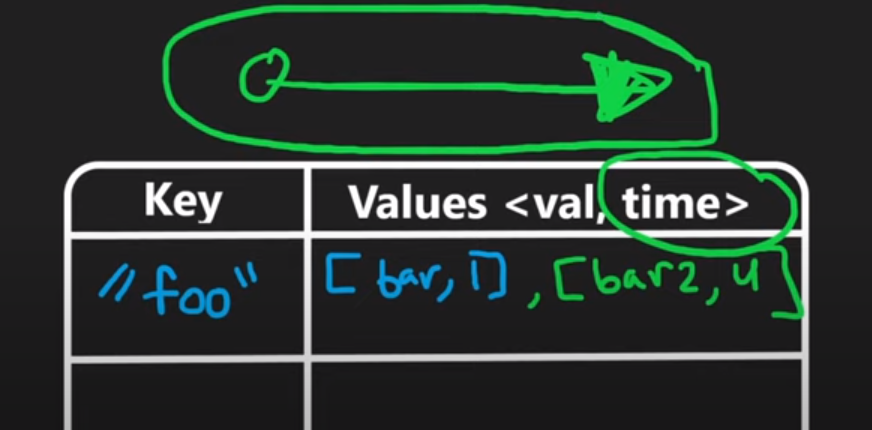
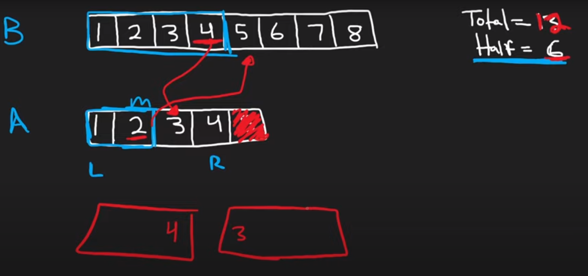

# INDEX

- [INDEX](#index)
  - [Notes](#notes)
  - [Searching](#searching)
    - [Binary Search](#binary-search)
    - [Search Insert Position](#search-insert-position)
    - [Find first and last position of element in sorted array](#find-first-and-last-position-of-element-in-sorted-array)
    - [Search a 2D Matrix](#search-a-2d-matrix)
    - [Koko Eating Bananas](#koko-eating-bananas)
    - [Two Crystal Balls Problem](#two-crystal-balls-problem)
    - [Search in Rotated Sorted Array](#search-in-rotated-sorted-array)
    - [Find Minimum in Rotated Sorted Array](#find-minimum-in-rotated-sorted-array)
    - [Time Based Key-Value Store](#time-based-key-value-store)
    - [Single Element in a Sorted Array](#single-element-in-a-sorted-array)
    - [Find First and Last Position of Element in Sorted Array](#find-first-and-last-position-of-element-in-sorted-array-1)
  - [Sorting](#sorting)
    - [Insertion Sort List](#insertion-sort-list)
    - [Largest Number](#largest-number)
    - [Sort colors](#sort-colors)
    - [Median of Two Sorted Arrays](#median-of-two-sorted-arrays)
  - [Cyclic Sort Pattern](#cyclic-sort-pattern)
    - [Cyclic Sort](#cyclic-sort)
    - [Missing Number](#missing-number)
    - [First Missing Positive](#first-missing-positive)
    - [Find the Duplicate Number](#find-the-duplicate-number)
    - [Find All Duplicates in an Array](#find-all-duplicates-in-an-array)
    - [Number of Good Pairs](#number-of-good-pairs)
    - [Find the Corrupt Pair](#find-the-corrupt-pair)
    - [Kth Missing Positive Number](#kth-missing-positive-number)

---

## Notes

---

## Searching

- **Note:** In `binary search`, when we get the middle element, we use: `mid = (low + high) // 2`, Actually this can lead to an **integer overflow**. Imagine that `low` and `high` are very large numbers. Adding them up will cause an integer overflow.
  - A better way is to compute `mid` as `mid = low + (high - low) // 2`. Dividing `high - low` before adding `low` avoids the integer overflow.

### Binary Search

```py
def binary_search(arr, target):
    l, r = 0, len(arr) - 1

    while l <= r:
        mid = (l + r) // 2
        # or: mid = l + (r - l) // 2

        if arr[mid] == target:
            return mid
        elif arr[mid] < target:
            l = mid + 1
        else:
            r = mid - 1

    return -1
```

> Interview question: what if `left` and `right` values are in the upper limit of the `32` bit integer? so adding them will result in an **"overflow"**
>
> - Answer: we can instead get the `mid` value by using `mid = left + (right - left) // 2`

---

### Search Insert Position

Given a sorted array of distinct integers and a `target` value, return the `index` if the `target` is found. If not, return the `index` where it would be if it were inserted in order.

- Ex:

  - `nums = [1, 3, 5, 6], target = 5 --> 2`
  - `nums = [1, 3, 5, 6], target = 2 --> 1`
  - `nums = [1, 3, 5, 6], target = 7 --> 4`

```py
def searchInsert(nums, target):
    l, r = 0, len(nums) - 1

    while l <= r:
        m = l + (r - l) // 2

        if nums[m] == target:
            return m
        elif nums[m] < target:
            l = m + 1
        else:
            r = m - 1

    # if the target value is not found in the array, then the left pointer will be pointing to the index where the target value should be inserted
    return l
```

---

### Find first and last position of element in sorted array

Given an array of integers `nums` sorted in ascending order, find the starting and ending position of a given `target` value. If `target` is not found in the array, return `[-1, -1]`.

**You must write an algorithm with `O(log n)` runtime complexity.**

- Ex:

  - `nums = [5, 7, 7, 8, 8, 10], target = 8 --> [3, 4]`
  - `nums = [5, 7, 7, 8, 8, 10], target = 6 --> [-1, -1]`

- Bad solution `O(n)` -> will eventually be `O(log(n))` if the target value is found in the array, but not the best solution ❌

  - `O(log(n)) + O(log(n/2)) + O(log(n/4)) + ... + O(log(1)) = O(log(n))`

  ```py
  def searchRange(nums, target):
      def search():
          l, r = 0, len(nums) - 1
          start, end = -1, -1

          while l <= r:
              m = l + (r - l) // 2

              if nums[m] == target:
                  # check if there's a value on the left of the current index that is equal to the target value
                  while m - 1 >= 0 and nums[m - 1] == target:
                      start = m - 1
                  while m + 1 < len(nums) and nums[m + 1] == target:
                      end = m + 1

                  return [start, end]

              elif nums[m] < target:
                  l = m + 1
              else:
                  r = m - 1

          return [start, end]

      return search()
  ```

- Good solution `O(log(n))` ✅

  ```py
  def searchRange(nums, target):
      def search(leftBias):
          """
          leftBias(boolean): True if we are looking for the left most index
          """
          l, r = 0, len(nums) - 1
          res = -1

          while l <= r:
              m = l + (r - l) // 2

              if nums[m] == target:
                  res = m
                  # If we are looking for the left most index, then we want to keep searching the left side
                  if leftBias:
                      r = m - 1
                  else:
                      l = m + 1
              elif nums[m] < target:
                  l = m + 1
              else:
                  r = m - 1

          return res

      return [search(True), search(False)]
  ```

---

### Search a 2D Matrix

You are given an `m x n` integer matrix `matrix` sorted in ascending order, and an integer `target`. Return `true` if `target` is in `matrix`, or `false` otherwise.

- Each row of `matrix` is sorted in ascending order.
- The first integer of each row is greater than the last integer of the previous row

- Ex:
  

  - `matrix = [[1, 3, 5, 7], [10, 11, 16, 20], [23, 30, 34, 60]]`
  - `target = 3 --> True`
  - `target = 13 --> False`

- Explanation
  

  - We can make use of that each row is sorted to perform a binary search on each row
    - this will be `O(m * log(n))`, where `m` is the number of rows and `n` is the number of columns
  - We can do even better, by performing a binary search on the entire matrix to make use of that the last element of each row is smaller than the first element of the next row
    - this will be `O(log(m) + log(n))`, where `m` is the number of rows and `n` is the number of columns

- Solution 1 -> `O(log(m) + log(n))` -> double binary-search

  ```py
  def searchMatrix(matrix, target):
      ROWS, COLS = len(matrix), len(matrix[0])
      top, bottom = 0, ROWS - 1

      # Perform binary search
      while top <= bottom:
        row = (top + bottom) // 2
        # if the target is smaller than the first element of the row, go up
        if target < matrix[row][0]:
          bottom = row - 1
        # if the target is bigger than the last element of the row, go down
        elif target > matrix[row][COLS - 1]:
          top = row + 1
        else:
          # Perform binary search on the row
          left, right = 0, COLS - 1
          while left <= right:
            mid = (left + right) // 2
            if target < matrix[row][mid]:
              right = mid - 1
            elif target > matrix[row][mid]:
              left = mid + 1
            else:
              return True
          return False # MUST RETURN FALSE HERE AND NOT OUTSIDE THE WHILE LOOP
  ```

- Solution 2 -> `O(m + n)`

  ```py
  def searchMatrix(matrix, target):
      if not matrix or not matrix[0]:
          return False

      row = 0
      col = len(matrix[0]) - 1

      # Perform binary search
      while row < len(matrix) and col >= 0:
          if matrix[row][col] == target:
              return True
          elif matrix[row][col] > target:
              col -= 1
          else:
              row += 1

      return False
  ```

---

### Koko Eating Bananas

Koko loves to eat bananas. There are `n` piles of bananas, the `ith` pile has `piles[i]` bananas. The guards have gone and will come back in `h` hours.

Koko can decide her bananas-per-hour eating speed of `k`. Each hour, she chooses some pile of bananas and eats `k` bananas from that pile. If the pile has less than `k` bananas, she eats all of them instead and will not eat any more bananas during this hour.

Return _the minimum integer_ `k` _such that she can eat all the bananas within_ `h` _hours_.

- Ex:

  - `piles = [3, 6, 7, 11], h = 8 --> 4`
  - `piles = [30, 11, 23, 4, 20], h = 5 --> 30`
  - `piles = [30, 11, 23, 4, 20], h = 6 --> 23`

- Explanation:

  - We want to get the minimum `k` number where `k` is the maximum number of bananas Koko can eat per hour (eating speed)
  - for example: `piles = [3, 6, 7, 11], h = 8`
    - `k = 1` -> we will require `3` hours to eat the first pile, then `6` hours to eat the second pile, then `7` hours to eat the third pile, then `11` hours to eat the fourth pile, this will exceed the `8` hours threshold
    - `k = 4` -> we will require `1` hour to eat the first pile, then `2` hours to eat the second pile, then `2` hours to eat the third pile, then `3` hours to eat the fourth pile, this will not exceed the `8` hours threshold so this is the minimum `k` number

- Steps:
  - Instead of brute-forcing all the possible `k` values (`1` -> `max(piles)`), we can use **binary search** to find the minimum `k` value
    
  - We can start with `k = 1` and `k = max(piles)`, then we can get the `mid` value and check if it is possible to eat all the bananas within `h` hours
    
  - If it is possible, then we can try to get a smaller `k` value, so we can set `right = mid - 1`
  - If it is not possible, then we can try to get a bigger `k` value, so we can set `left = mid + 1`
    

```py
def minEatingSpeed(piles, h):
    l, r = 1, max(piles)
    res = r # if we can't eat all the bananas within h hours, then we will return the upper bound

    while l <= r:
        # k = mid
        k = (l + r) // 2
        totalTime = 0
        for p in piles:
            totalTime += math.ceil(p / k)

        if totalTime <= h:
          res = min(res, k)
          r = k - 1
        else:
          l = k + 1

    return res
```

---

### Two Crystal Balls Problem

Given two crystal balls that will break if dropped from high enough distance, determine the exact spot in which it will break in the most optimized way.

To understand the problem, let us assume the crystal ball will break if dropped from a height of `8` meters. So, if we drop from `1` meter, the ball will not `break(0)`. If dropped from height of `2` meter, again the ball will not `break(0)`. We keep on doing it. When dropped from `8` meters, the ball will `break(1)`. If we list all 0s and 1s in an array, it will look like below:

`[0, 0, 0, 0, 0, 0, 0, 1, 1, 1, 1, ...]`

So, basically, we have to find the index of the first `1` in the array.

- Explanation:
  - the array is sorted, so we can use **binary search** to find the index of the first `1` in the array
  - since there're 2 balls, we can use first ball to find the breaking point by using `binary search`. Then we will do `linear search` in that interval to find the correct breaking point
    - This solution will take `O(log(n) + k)` time, where `n` is the number of floors and `k` is the number of floors in the interval where the first ball will break, So It's `O(n)` time in the worst case ❌
  - Instead, we can run it in `O(sqrt(n))` time by searching in intervals of `sqrt(n)` floors
    - We can drop the first ball from `sqrt(n)` floors, then we can drop the second ball from `sqrt(n) - 1` floors, then `sqrt(n) - 2` floors, and so on
    - This will take `O(sqrt(n))` time to find the interval where the first ball will break
    - Then we can do `linear search` in that interval to find the correct breaking point

```py
def twoCrystalBalls(arr):
    # find the interval where the first ball will break
    interval = int(math.sqrt(len(arr)))
    start = 0

    # looping through the array in intervals of sqrt(n)
    for i in range(interval, len(arr), interval):
        if arr[i] == 1:
            break # we found the interval where the first ball will break

    # Go back to the start of the interval and do linear search
    for i in range(i - interval, i + 1):
        if arr[i] == 1:
            return i # we found the breaking point

    return -1 # no breaking point found
```

---

### Search in Rotated Sorted Array

You are given an integer array `nums` sorted in ascending order, and an integer `target`. Suppose that `nums` is rotated at some pivot unknown to you beforehand (i.e., `[0, 1, 2, 4, 5, 6, 7]` might become `[4, 5, 6, 7, 0, 1, 2]`). Given `nums` and `target`, return the index of `target` if it is in `nums`, or `-1` if it is not in `nums`. **You must write an algorithm with `O(log n)` runtime complexity.**

- Ex:

  - `nums = [4, 5, 6, 7, 0, 1, 2], target = 0 --> 4`
  - `nums = [4, 5, 6, 7, 0, 1, 2], target = 3 --> -1`

- Steps:
  - We can use **binary search** to find the target value
  - We can check if the `mid` value is equal to the `target` value
  - Also we will chack if the left/right side of the `mid` value is sorted (we have 2 sorted halves in the array after the rotation)
    
  - to choose which side to search in, we can check if the `mid` value is greater than the `left` value or less than the `right` value
    
    - If the `left` side is sorted, then we can check if the `target` value is in the `left` side
    - If the `right` side is sorted, then we can check if the `target` value is in the `right` side
    - If the `target` value is not in the left/right side, then we can set `left = mid + 1` or `right = mid - 1`

```py
def search(nums, target):
    l, r = 0, len(nums) - 1

    while l <= r:
        mid = (l + r) // 2
        if nums[mid] == target:
            return mid

        # left sorted side
        if nums[l] <= nums[mid]:
            # check if the target is in the left side
            if nums[l] <= target <= nums[mid]:
                r = mid - 1
            else:
                l = mid + 1
        # left sorted side
        else:
            if nums[mid] <= target <= nums[r]:
                l = mid + 1
            else:
                r = mid - 1

    return -1
```

---

### Find Minimum in Rotated Sorted Array

Same as the previous problem, but instead of returning the index of the target value, we will return the minimum value in the array

- Explanation
  - We can use **binary search** to find the minimum value
  - We can check if the `mid` value in the `left` portion or the `right` portion
    - if we're in the `left` portion, then we can check if the `mid` value is less than the `right` value
      - This is because the `left` side will have values greater than every value in the `right` side, so the minimum value will be in the `right` side
        
  - To check if the `mid` value is in the `left` portion, we can check if the `mid` value is greater than the first value in the `left` portion
    
  - If the `mid` value is in the `right` portion, then we can check if the `mid` value is less than the `right` value and repeat
    

```py
def findMin(nums):
    l, r = 0, len(nums) - 1
    curMin = nums[0]

    while l <= r:
        mid = (l + r) // 2
        curMin = min(curMin, nums[mid])

        # right side is not sorted -> right side has the minimum value
        if nums[r] < nums[mid]:
            l = mid + 1
        # left side has the min
        else:
            r = mid - 1

    return curMin
```

---

### Time Based Key-Value Store

Design a time-based key-value data structure that can store multiple values for the same key at different time stamps and retrieve the key's value at a certain timestamp.

- Ex: 

- Solution:
  - `"All the timestamps timestamp of set are strictly increasing"` -> sorted
- Ex: 
  - So, we can use **binary search** to find the value at a certain timestamp

```py
class TimeMap:
    def __init__(self):
        self.store = {} # key: list of [val, timestamp]

    def set(self, key, val, timestamp):
        if key not in self.store:
            self.store[key] = []
        self.store[key].append([val, timestamp])

    def get(self, key, timestamp):
      res = ''
      values = self.store.get(key, []) # To handle the case where the key is not in the store

      # Binary search
      l, r = 0, len(values) - 1
      while l <= r:
        mid = (l + r) // 2
        if values[mid][1] <= timestamp:
          res = values[mid][0] # The closest value to the timestamp we've seen so far
          l = mid + 1
        else:
          r = mid - 1

      return res
```

---

### Single Element in a Sorted Array

You are given a sorted array consisting of only integers where every element appears exactly twice, except for one element which appears exactly once. Find this single element that appears only once. **Do it in O(logn) time and O(1) space**.

- Ex:

  - `nums = [1, 1, 2, 3, 3, 4, 4, 8, 8] --> 2`

- Explanation:
  - We can use **binary search** to find the single element
  - We will make use of that **"the array is sorted"**, We can check if the `mid` value is the single element by checking if the `mid` value is equal to the value before and after it
  - If the `mid` value is not the single element, then we want to know which side the single element is in
    - This can be figured out by also using another operation that **"All the elements are repeated twice, except for one element which appears exactly once"** -> So the length of the array will be **odd**
      
    - So we will use the length of the left/right sides to determine which side the single element is in
      - If the length of the left side is odd, then the single element is in the left side
      - If the length of the right side is odd, then the single element is in the right side

```py
def singleNonDuplicate(nums):
    l, r = 0, len(nums) - 1

    while l <= r:
        m = l + (r - l) // 2

        if (
          (m - 1 < 0 or nums[m - 1] != nums[m]) and
          (m + 1 >= len(nums) or nums[m + 1] != nums[m])
        ):
            return nums[m]

        leftSize = m - 1 if nums[m - 1] == nums[m] else m
        if leftSize % 2:
            r = m - 1
        else:
            l = m + 1
```

---

### Find First and Last Position of Element in Sorted Array

Given an array of integers `nums` sorted in ascending order, find the starting and ending position of a given `target` value. If `target` is not found in the array, return `[-1, -1]`.

**You must write an algorithm with `O(log n)` runtime complexity.**

- Ex:

  - `nums = [5, 7, 7, 8, 8, 10], target = 8 --> [3, 4]`
  - `nums = [5, 7, 7, 8, 8, 10], target = 6 --> [-1, -1]`

- Explanation:
  - We can use **binary search** to find the starting and ending position of the target value
  - We will use **two binary searches** to find the starting and ending position
    - The first binary search will find the starting position
      - If the `mid` value is equal to the target value, then we will check if the `mid` value is the starting position by checking if the value before it is less than the `mid` value
    - The second binary search will find the ending position
      - If the `mid` value is equal to the target value, then we will check if the `mid` value is the ending position by checking if the value after it is greater than the `mid` value

```py
def searchRange(nums, target):
    def search(leftBias):
        """
        leftBias(boolean): True if we are looking for the left most index
        """
        l, r = 0, len(nums) - 1
        res = -1

        while l <= r:
            m = l + (r - l) // 2

            if nums[m] == target:
                res = m
                # If we are looking for the left most index, then we want to keep searching the left side
                if leftBias:
                    r = m - 1
                else:
                    l = m + 1
            elif nums[m] < target:
                l = m + 1
            else:
                r = m - 1

        return res

    return [search(True), search(False)]
```

---

## Sorting

### Insertion Sort List

Sort a linked list using insertion sort.

- Ex:

  - `head = [4, 2, 1, 3] --> [1, 2, 3, 4]`
  - `head = [-1, 5, 3, 4, 0] --> [-1, 0, 3, 4, 5]`

```py
def insertionSortList(head):
    dummy = ListNode()
    cur = head

    while cur:
        prev = dummy
        # find the position to insert the current node
        while prev.next and prev.next.val < cur.val:
            prev = prev.next

        # insert the current node
        nextNode = cur.next
        cur.next = prev.next
        prev.next = cur

        # move to the next node
        cur = nextNode

    return dummy.next
```

---

### Largest Number

Given a list of non-negative integers `nums`, arrange them such that they form the largest number.

> Note: The result may be very large, so you need to return a string instead of an integer.

- Ex:

  - `nums = [10, 2] --> '210'`
  - `nums = [3, 30, 34, 5, 9] --> '9534330'`

- Explanation:
  - We can sort the numbers by comparing the first digit of each number
  - If the first digit of `a` is bigger than the first digit of `b`, then `a` should come before `b`
  - If the first digit of `a` is smaller than the first digit of `b`, then `b` should come before `a`
  - If the first digit of `a` is equal to the first digit of `b`, then we need to compare the second digit of each number
  - We can do this by converting the numbers to strings and comparing the strings

```py
def largestNumber(nums):
    def compare(x, y):
        if int(str(x)+str(y)) > int(str(y)+str(x)):
            return -1
        else:
            return 1

    # sort the numbers using the compare function
    nums = sorted(nums, key=cmp_to_key(compare))
    return str(int(''.join(map(str, nums))))
```

---

### Sort colors

Given an array `nums` with `n` objects colored red, white, or blue, sort them **in-place** so that objects of the same color are adjacent, with the colors in the order red, white, and blue.

- Ex:

  - `nums = [2, 0, 2, 1, 1, 0] --> [0, 0, 1, 1, 2, 2]`

- Explanation:

  - We know that the array only contains 3 colors: red, white, and blue (represented by 0, 1, and 2) -> **Finite range**
    - So we can use `bucket sort` to sort the array in-place
  - We can also use the 3-way partitioning algorithm to sort the array in-place

- Solution 1: Bucket sort

  ```py
  # O(n) time and O(n) space
  def sortColors(nums):
      # count the number of 0s, 1s, and 2s
      buckets = [0] * (1+max(nums))
      for num in nums:
          buckets[num] += 1

      # overwrite the original array with the sorted array
      i = 0
      for j in range(len(buckets)):
          while buckets[j] > 0:
              nums[i] = j
              i += 1
              buckets[j] -= 1
  ```

- Solution 2: (Two pointers) ✅

  - We will use 3 pointers: `2 pointers` to keep track of the `low` and `high` indices of the array, and `i pointer` to iterate through the array
  - while iterating, we will move the `0s` to the `left` side of the array **(before `low`)**, and the `2s` to the `right` side of the array **(after `high`)**
    

  ```py
  # O(n) time and O(1) space
  def sortColors(nums):
      low, high = 0, len(nums) - 1
      i = 0

      while i <= high:
          if nums[i] == 0:
              # if nums[i] == 0, then we swap it with the element at the beginning of the array
              nums[i], nums[low] = nums[low], nums[i]
              low += 1
              i += 1
          elif nums[i] == 2:
              # if nums[i] == 2, then we swap it with the element at the end of the array
              nums[i], nums[high] = nums[high], nums[i]
              high -= 1
          else:
              # if nums[i] == 1, then we don't need to swap just move to the next element
              i += 1
  ```

- Solution 3: using `minHeap`

  ```py
  # O(nlog(n)) time and O(n) space
  def sortColors(nums):
      heap = []
      for num in nums:
          heapq.heappush(heap, num)
      for i in range(len(nums)):
          nums[i] = heapq.heappop(heap)
  ```

---

### Median of Two Sorted Arrays

Given two sorted arrays `nums1` and `nums2` of size `m` and `n` respectively, return **the median** of the two sorted arrays.

**The overall run time complexity should be `O(log(m+n))`.**

- Ex:

  - `nums1 = [1, 3], nums2 = [2] --> 2.00000`
  - `nums1 = [1, 2], nums2 = [3, 4] --> 2.50000`
  - `nums1 = [0, 0], nums2 = [0, 0] --> 0.00000`
  - `nums1 = [], nums2 = [1] --> 1.00000`

- Explanation:
  - Here It requires solving it with `O(log(n+m))`, so we can't just merge the two arrays and find the median as we would do in `O(n+m)`
  - To do so, we can use the **binary search** algorithm
    - We will have 2 partitions, one in each array, and the `median` will be the average of the max of the left partition and the min of the right partition
      
      
      - if the total length of the two arrays is **odd**, then the median will be the middle element
        
      - if the total length of the two arrays is **even**, then the median will be the average of the middle 2 elements
        
  - The total number of elements in the left partition should be equal to the total number of elements in the right partition (half of the total number of elements in the two arrays)
    - `len(left_part) == len(right_part)`
    - `half` = `(len(nums1) + len(nums2) + 1) // 2`
  - we use the `half` to find the correct partition in the two arrays
    - `partitionX = (low + high) // 2`
      
    - `partitionY = half - partitionX`
      
  - Now We need to know if the `left` partition is correct or not
    - So, we will check if the overall left partition is less than the overall right partition
    - This is done by checking if the max of the left partition in `nums1` is less than the min of the right partition in `nums2` and vice versa
      
      - `maxLeftX <= minRightY`
      - `maxLeftY <= minRightX`
  - If the left partition is correct, then we can return the median
    
    - if the total length of the two arrays is **odd**, then the median will be the middle element which is the **minimum** of the `2 mins` of the right partitions
      
    - if the total length of the two arrays is **even**, then the median will be the average of the middle 2 elements which are:
      
      - the **maximum** of the `2 maxs` of the left partitions
      - the **minimum** of the `2 mins` of the right partitions
  - If the left partition is not correct, then we need to move the `low` or `high` pointer to the correct position
    - if `maxLeftX > minRightY`, then we need to move `high` pointer to the left
    - if `maxLeftY > minRightX`, then we need to move `low` pointer to the right
      
      

```py
def findMedianSortedArrays(nums1, nums2):
    A, B = nums1, nums2
    total = len(nums1) + len(nums2)
    half = total // 2

    # make sure that A is the smaller array
    if len(A) > len(B):
        A, B = B, A

    # set the low and high pointers
    low, high = 0, len(A) - 1

    # loop until we find the correct partition
    while True:
        # get the partition of A
        i = (low + high) // 2
        # get the partition of B
        j = half - i - 2 # -2 because we start from 0

        # get the elements of the left and right partitions
        Aleft = A[i] if i >= 0 else float('-inf')
        Aright = A[i + 1] if (i + 1) < len(A) else float('inf')
        Bleft = B[j] if j >= 0 else float('-inf')
        Bright = B[j + 1] if (j + 1) < len(B) else float('inf')

        # if the left partition is correct
        if Aleft <= Bright and Bleft <= Aright:
            # check if the total length is odd or even
            if total % 2:
                # return the median
                return min(Aright, Bright)
            else:
                # return the median
                return (max(Aleft, Bleft) + min(Aright, Bright)) / 2
        else:
            # if the max of the left partition in A is greater than the min of the right partition in B
            if Aleft > Bright:
                # move the high pointer to the left
                high = i - 1
            # if the max of the left partition in B is greater than the min of the right partition in A
            else:
                # move the low pointer to the right
                low = i + 1
```

---

## Cyclic Sort Pattern

- This pattern describes an interesting approach to deal with problems involving arrays containing numbers in a given range.

### Cyclic Sort

We are given an array containing `n` objects. Each object, when created, was assigned a unique number from the range `1` to `n` based on their creation sequence. This means that the object with sequence number `3` was created just before the object with sequence number `4`.

Write a function to sort the objects in-place on their creation sequence number in `O(n)` and without any extra space. For simplicity, let’s assume we are passed an integer array containing only the sequence numbers, though each number is actually an object.

- Ex:

  - `nums = [3, 1, 5, 4, 2] --> [1, 2, 3, 4, 5]`

- Explanation:
  - We can use **cyclic sort** to sort the array **in-place**
  - We will iterate through the array and swap the current element with the element at the correct index
    - The correct index is the index of the current element minus `1`
    - For example: if the current element is `3`, then the correct index is `3 - 1 = 2`
      
    - We will keep swapping until the current element is at the correct index
      
    - If the current element is already at the correct index, then we will move to the next element
      

```py
def cyclicSort(nums):
    i = 0
    while i < len(nums):
        # get the correct index
        j = nums[i] - 1
        # if the current element is not at the correct index
        if nums[i] != nums[j]:
            # swap the current element with the element at the correct index
            nums[i], nums[j] = nums[j], nums[i]
        else:
            # move to the next element
            i += 1

    return nums
```

---

### Missing Number

Given an array `nums` containing `n` distinct numbers in the range `[0, n]`, return the only number in the range that is missing from the array.

- Follow up: Could you implement a solution using only `O(1)` extra space complexity and `O(n)` runtime complexity?

- EX:

  - Input: `nums = [3,0,1]`
  - Output: `2`
  - Explanation: `n = 3` since there are `3` numbers, so all numbers are in the range `[0,3]`. `2` is the missing number in the range since it does not appear in `nums`.

- Explanation:

  - we can use a similar strategy as discussed in `Cyclic Sort` to place the numbers on their correct `index`. Once we have every number in its correct place, we can iterate the array to find the `index` which does not have the correct number, and that `index` will be our missing number.
  - note here that numbers are ranged from `0` to `n`, and not from `1` to `n`. This means that the first index will have the number `0`, the second index will have the number `1`, and so on.

- **Solution 1:** using cyclic sort -> `O(n)` time and `O(1)` space ✅

  ```py
  def missingNumber(nums):
      i = 0
      while i < len(nums):
          # get the correct index
          j = nums[i]
          # if element is positive and the current element is not at the correct index
          if nums[i] < len(nums) and nums[i] != nums[j]:
              # swap the current element with the element at the correct index
              nums[i], nums[j] = nums[j], nums[i]
          else:
              # move to the next element
              i += 1

      # find the first missing positive integer
      for i in range(len(nums)):
          if nums[i] != i:
              return i

      return len(nums) # Worst case
  ```

- **Solution 2:** using HashSet -> `O(n)` time and `O(n)` space ❌

  ```py
  def missingNumber(nums):
      seen = set(nums)
      for i in range(len(nums) + 1):
          if i not in seen:
              return i
  ```

- **Solution 3:** using `sum` function -> `O(n)` time and `O(1)` space

  ```py
  def missingNumber(nums):
    # Calculate the expected sum of the range [0, n]
    n = len(nums)
    expected_sum = n * (n + 1) // 2

    # Calculate the actual sum of the elements in the array
    actual_sum = sum(nums)

    # Return the difference between the expected sum and the actual sum
    return expected_sum - actual_sum
  ```

---

### First Missing Positive

Given an unsorted integer array `nums`, find the smallest missing positive integer. You must implement an algorithm that runs in `O(n)` time and uses constant extra space.

- Ex:

  - `nums = [1, 2, 0] --> 3`
  - explanation: the numbers in the range `[1, 2]` are all in the array, so the smallest missing positive integer is `3`

- Explanation:

  - The trick here is that we want to solve it in `O(n)` time and `constant` space, and not `O(nlog(n))` time and `O(n)` space using sorting
  - We can use **cyclic sort** to find the smallest missing positive integer which takes `O(n)` time and `constant` space
    - After sorting the array, we will iterate through the array and find the first missing positive integer
  - Another approach is to use a `hashset` to store all the numbers in the array, then we can iterate through the numbers starting from `1` and check if the number is in the `hashset`
    - This will take `O(n)` time and `O(n)` space

```py
def firstMissingPositive(nums):
    i = 0
    while i < len(nums):
        # get the correct index
        j = nums[i] - 1
        # if element is positive and the current element is not at the correct index
        if nums[i] > 0 and nums[i] <= len(nums) and nums[i] != nums[j]:
            # swap the current element with the element at the correct index
            nums[i], nums[j] = nums[j], nums[i]
        else:
            # move to the next element
            i += 1

    # find the first missing positive integer
    for i in range(len(nums)):
        if nums[i] != i + 1:
            return i + 1

    return len(nums) + 1 # Worst case
```

---

### Find the Duplicate Number

Problem is solved also in the [Fast and Slow Pointers Pattern](./5-PS-Arrays.md#find-the-duplicate-number)

```py
def findDuplicate(nums):
    i = 0
    while i < len(nums):
        # get the correct index
        j = nums[i] - 1
        # if element is positive and the current element is not at the correct index
        if nums[i] > 0 and nums[i] <= len(nums) and nums[i] != nums[j]:
            # swap the current element with the element at the correct index
            nums[i], nums[j] = nums[j], nums[i]
        else:
            # move to the next element
            i += 1

    # find the first duplicate number
    for i in range(len(nums)):
        if nums[i] != i + 1:
            return nums[i]

    return -1
```

---

### Find All Duplicates in an Array

Given an integer array `nums` of length `n` where all the integers of `nums` are in the range `[1, n]` and each integer appears once or twice, return an array of all the integers that appears twice.

You must write an algorithm that runs in `O(n)` time and uses only constant extra space.

- Ex:

  - `nums = [4, 3, 2, 7, 8, 2, 3, 1] --> [2, 3]`

```py
def findDuplicates(nums):
    i = 0
    while i < len(nums):
        j = nums[i] - 1
        if nums[i] > 0 and nums[i] <= len(nums) and nums[i] != nums[j]:
            nums[i], nums[j] = nums[j], nums[i]
        else:
            i += 1

    res = []
    for i in range(len(nums)):
        if nums[i] != i + 1:
            res.append(nums[i])

    return res
```

---

### Number of Good Pairs

Given an array of integers `nums`. A pair `(i, j)` is called good if `nums[i] == nums[j]` and `i < j`.

Return the number of good pairs.

- Ex:

  - `nums = [1, 2, 3, 1, 1, 3] --> 4`

```py
def numIdenticalPairs(nums):
    count = 0
    for i in range(len(nums)):
        for j in range(i + 1, len(nums)):
            if nums[i] == nums[j]:
                count += 1

    return count
```

---

### Find the Corrupt Pair

We are given an unsorted array containing ‘n’ numbers taken from the range 1 to ‘n’. The array originally contained all the numbers from 1 to ‘n’, but due to a data error, one of the numbers got duplicated which also resulted in one number going missing. Find both these numbers.

- Ex:
  - `nums = [3, 1, 2, 5, 2] --> [2, 4]`
  - because `2` is duplicated and `4` is missing

```py
def find_corrupt_numbers(nums):
    i = 0
    while i < len(nums):
        j = nums[i] - 1
        if nums[i] != nums[j]:
            nums[i], nums[j] = nums[j], nums[i]
        else:
            i += 1

    for i in range(len(nums)):
        if nums[i] != i + 1:
            return [nums[i], i + 1]

    return [-1, -1]
```

---

### Kth Missing Positive Number

Given an array `arr` of positive integers sorted in a strictly increasing order, and an integer `k`.

Find the `kth` positive integer that is missing from this array.

- Ex:

  - `arr = [2, 3, 4, 7, 11], k = 5 --> 9`
  - Explanation: The missing positive integers are `[1, 5, 6, 8, 9, 10, 12, 13, ...]`. The `5th` missing positive integer is `9`.

- Explanation:

  - The idea is to use **cyclic sort** to sort the array in-place, but we will also keep track of the missing numbers in a `set` because we need to find the `kth` missing number
  - After sorting the array, we will iterate through the array and find the missing numbers
  - Then we will iterate through the missing numbers and find the `kth` missing number

- Time complexity: `O(n + k)`
- Space complexity: `O(k)`

```py
def findKthPositive(arr, k):
    i = 0
    while i < len(arr):
        j = arr[i] - 1
        # check if index is out of range and if the current element is not at the correct index
        if arr[i] > 0 and arr[i] <= len(arr) and arr[i] != arr[j]:
            arr[i], arr[j] = arr[j], arr[i]
        else:
            i += 1

    missing = []
    extraNumbers = set()
    for i in range(len(arr)):
        if arr[i] != i + 1:
            missing.append(i + 1)
            extraNumbers.add(arr[i])

    # add the remaining missing numbers
    i = len(arr) + 1
    while len(missing) < k:
        if i not in extraNumbers:
            missing.append(i)
        i += 1

    return missing[k - 1]
```
