# INDEX

- [INDEX](#index)
  - [Notes](#notes)
  - [General Tree Questions](#general-tree-questions)
    - [Count Complete Tree Nodes](#count-complete-tree-nodes)
    - [Level Width](#level-width)
    - [Path Sum](#path-sum)
    - [Symmetric Tree](#symmetric-tree)
    - [Same Tree](#same-tree)
    - [Lowest Common Ancestor of a Binary Tree](#lowest-common-ancestor-of-a-binary-tree)
    - [Vertical Order Traversal of a Binary Tree](#vertical-order-traversal-of-a-binary-tree)
    - [Flatten Binary Tree to Linked List](#flatten-binary-tree-to-linked-list)
  - [Binary Search Trees (BST)](#binary-search-trees-bst)
    - [BST Insertion](#bst-insertion)
    - [Delete Node in a BST](#delete-node-in-a-bst)
    - [Validate Binary Search Tree](#validate-binary-search-tree)
    - [Binary Tree Inorder Traversal](#binary-tree-inorder-traversal)
    - [Binary Tree Postorder Traversal](#binary-tree-postorder-traversal)
    - [Binary Search Tree Iterator](#binary-search-tree-iterator)
    - [Binary Tree Level Order Traversal](#binary-tree-level-order-traversal)
    - [Binary Tree Level Order Traversal II](#binary-tree-level-order-traversal-ii)
    - [Average of Levels in Binary Tree](#average-of-levels-in-binary-tree)
    - [Minimum Depth of Binary Tree](#minimum-depth-of-binary-tree)
    - [Maximum Depth of Binary Tree](#maximum-depth-of-binary-tree)
    - [Level Order Successor](#level-order-successor)
    - [Populating Next Right Pointers in Each Node ( Connect Level Order Siblings )](#populating-next-right-pointers-in-each-node--connect-level-order-siblings-)
    - [Populating Next Right Pointers in Each Node II](#populating-next-right-pointers-in-each-node-ii)
    - [Check Completeness of a Binary Tree](#check-completeness-of-a-binary-tree)
    - [Binary Tree Zigzag Level Order Traversal](#binary-tree-zigzag-level-order-traversal)
    - [Sum of Left Leaves](#sum-of-left-leaves)
    - [Diameter of Binary Tree](#diameter-of-binary-tree)
    - [Minimum Absolute Difference in BST](#minimum-absolute-difference-in-bst)
    - [Invert Binary Tree](#invert-binary-tree)
    - [Kth Smallest Element in a BST](#kth-smallest-element-in-a-bst)
    - [Lowest Common Ancestor of a Binary Search Tree](#lowest-common-ancestor-of-a-binary-search-tree)
  - [Tries](#tries)
    - [Implement Trie (Prefix Tree)](#implement-trie-prefix-tree)

---

## Notes

- Trees usually have `O(log(n))` time complexity because it's the **height** of the tree -> `O(h)`
- **Trees Tips:**
  - Whenever you see the word **"width"** in any tree question, it's a **Breadth First Search** problem
  - Always ask if the tree is binary search tree (BST) or not, so that you can use the BST properties to solve the problem (e.g. left < root < right)
- When you find the word `"Autocomplete"` in a question, it's a **Trie** problem
- When verifying constraints, ask these questions:
  - are there any duplicates in the BST? and how to handle this case?

## General Tree Questions

### Count Complete Tree Nodes

Given the `root` of a **complete** binary tree, return the number of the nodes in the tree.

- Ex:

  - Input: `root = [1,2,3,4,5,6]`
  - Output: `6`

- Explanation:

  - tree is complete when all levels are filled except the last level
  - The brute force solution is to traverse the tree and count the number of nodes. But this solution is not efficient because it takes `O(n)` time to traverse the tree.
  - We're given that the tree is a **complete** binary tree, which means that the tree is **perfectly balanced**. This means that the left subtree and the right subtree of the root node have the same height.
    - So we can use this property to solve the problem and get a solution with `O(log(n))` time complexity.
    - We can break the problem into 2 sections:
      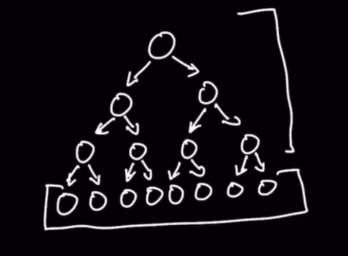
      1. Count the number of nodes above the last level -> `2^(h-1) - 1` -> because with each level, the number of nodes doubles (1, 2, 4, 8, ...)
         - To get `h`, we can traverse the left subtree and count the number of levels -> `O(log(n))`
      2. Count the number of nodes in the last level -> `O(log(n))`
         - in the last level, we know that the number of nodes is between `1` and `2^(h-1)`, so we can use a **Binary Search** to traverse the last level and count the number of nodes -> `O(log(n))`
         - when using `binary search`, we need to know the `mid` node of the last level, so we can use the `h` that we got from the previous step to calculate the `mid` node -> `2^(h-1)`
         - then we can use the `mid` node to check if the node exists or not:
           - if `mid` is not `None`, then we know that the node exists and we can move to the **right subtree**
           - if `mid` is `None`, then we know that the node doesn't exist and we can move to the **left subtree**
         - we can keep doing this until we reach the last level and count the number of nodes -> `O(log(n))`

- Bad solution: O(n) time complexity ❌

  ```py
  def countNodes(root):
      # helper function
      def dfs(node):
          if node is None:
              return 0

          return dfs(node.left) + dfs(node.right) + 1

      # return the result of the function
      return dfs(root)
  ```

- Good solution using Binary search: O(log(n)) time complexity ✅

  ```py
  def countNodes(root):
      # helper function to get the height of the tree
      def getHeight(node):
          height = 0
          while node.left:
              height += 1
              node = node.left
          return height

      # helper function to check if the node exists or not
      def exists(idx_to_find, height, node):
          left = 0
          right = (2 ** height) - 1
          for _ in range(height):
              mid = -(-(left + right) // 2) # use (-) to round up the result of the division
              # check if the index is in the left or right subtree
              if idx_to_find >= mid:
                  node = node.right
                  left = mid
              else:
                  node = node.left
                  right = mid - 1

          return node is not None

      # if the root is None, return 0
      if root is None:
          return 0

      # get the height of the tree
      height = getHeight(root)

      # if the height of the tree is 0, return 1
      if height == 0:
          return 1

      # get the number of nodes above the last level
      upperCount = (2 ** height) - 1

      # use binary search to get the number of nodes in the last level
      left = 0
      right = upperCount
      while left < right:
          mid = -(-(left + right) // 2)

          # check if the node exists or not
          if exists(mid, height, root):
              left = mid # move to the right subtree
          else:
              right = mid - 1 # move to the left subtree

      # return the total number of nodes
      return upperCount + left + 1
  ```

- Another good solution -> using recursion

  ```py
  def get_height(node):
     if not node:
         return 0
     return 1 + get_height(node.left)

     if not root:
         return 0
     left_height = get_height(root.left)
     right_height = get_height(root.right)
     if left_height == right_height:
         return (2 ** left_height) - 1 + self.countNodes(root.right) + 1
     else:
         return (2 ** right_height) - 1 + self.countNodes(root.left) + 1
  ```

---

### Level Width

Write a function that accepts a root node of a tree and return an array where each element is the width of the tree at each level.

- EX: this tree returns `[1, 3, 2]`
- explanation:

  - To solve this problem, we can use BFS (Breadth-First Search) to traverse the tree level by level. At each level, we can keep track of the indices of the leftmost and rightmost non-null nodes. The width of the level is then calculated as the difference between the indices plus one.

  - We can use a queue to store the nodes that we need to visit. We start by adding the root node to the queue along with its index, which we set to 0. We also initialize two variables, max_width and level_width, to 0. max_width will be used to store the maximum width we have seen so far, and level_width will be used to store the width of the current level.

  - Then, we start the BFS loop. In each iteration of the loop, we first get the number of nodes in the current level by getting the size of the queue. We then loop through all the nodes in the current level and update the leftmost and rightmost indices as necessary. We also add the children of each node to the queue along with their indices, which we calculate based on the indices of their parent node.

  - At the end of each level, we update the max_width variable with the level_width if it is greater than max_width. We then reset the level_width variable to 0 for the next level.

  - Once we have processed all the nodes in the tree, we return the max_width variable as the answer.

- **Steps:** (BFS)

  1. create an array to store the width of each level and initialize the array with `0`
  2. create an array to store the nodes of each level and initialize the array with (the root node and a `'s'` token)
     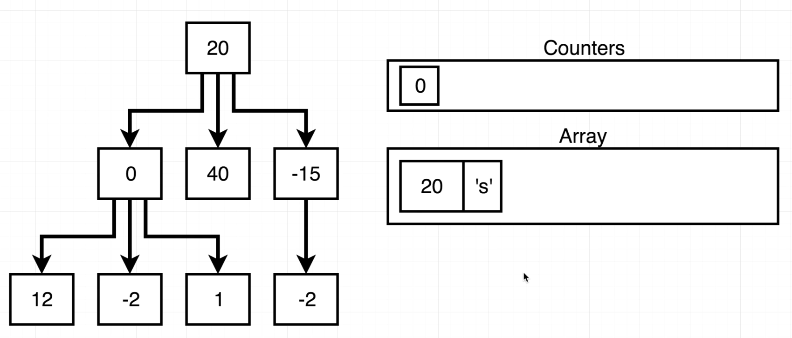
  3. while the nodes-array is not empty
     1. `pop` the first node in the array
        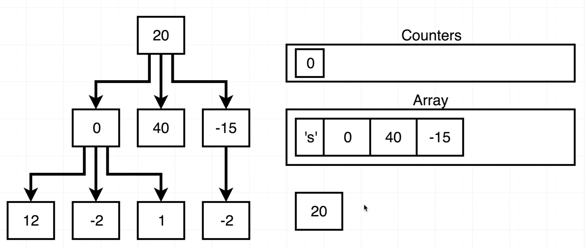
     2. if the node is a `'s' (reference token)`, it means we've reached the end of the current level
        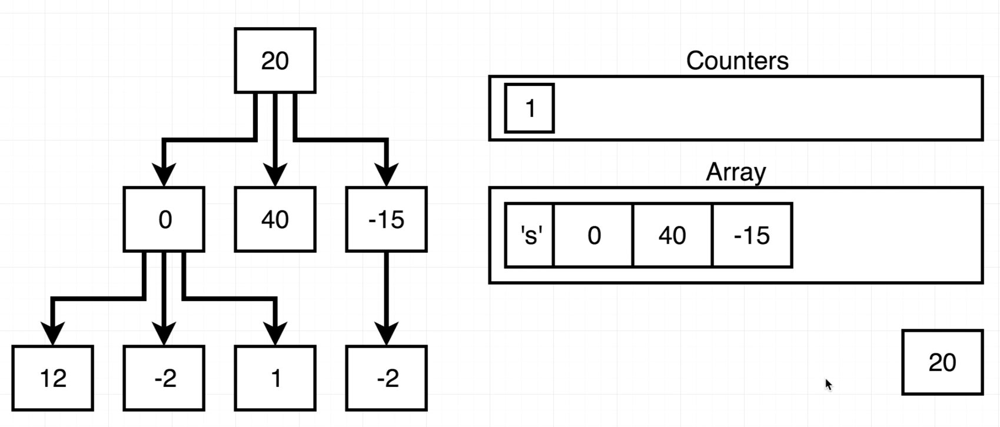
        1. add a `'s'` to the end of the array to mark the end of the next level
        2. add `0` to the end of the width array
           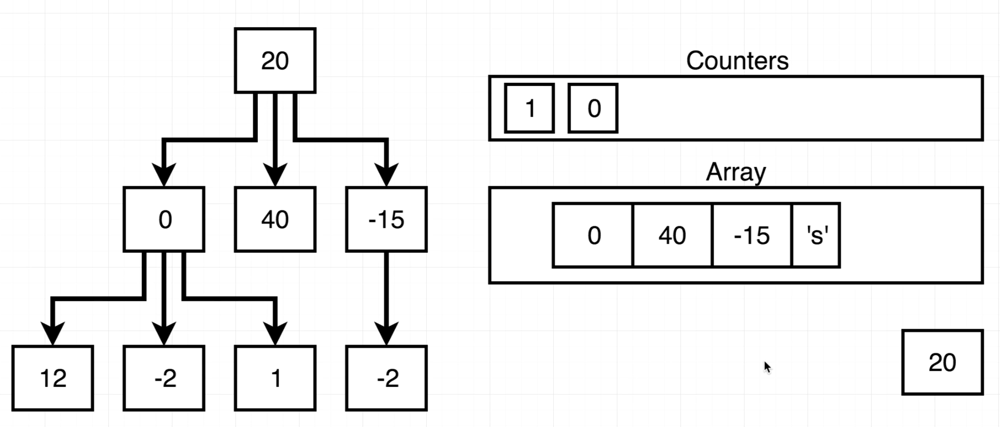
     3. if the node is not a `'s'`, add its children to the end of the array
     4. increment the last element in the width array by `1`
  4. return the width array

  ```sh
          0          # level 1
       /  |   \
     1    2    3     # level 2
    / \
   4   5             # level 3
  ```

```py
def level_width(root):
    # create an array to store the width of each level
    widths = [0]
    # create an array to store the nodes of each level
    # initialize the array with the root node
    nodes = [root, 's']

    # while the nodes-array is not empty (will be empty if it only contains one element which is the 's' token)
    while len(nodes) > 1:
        # pop the first node in the array
        node = nodes.pop(0)

        # if the node is a 's', it means we've reached the end of the current level
        # add a 's' to the end of the array to mark the end of the next level
        if node == 's':
            nodes.append('s')
            widths.append(0)
        # if the node is not a 's', add its children to the end of the array
        else:
            nodes.extend(node.children)
            # increment the width of the current level
            widths[-1] += 1
    return widths
```

---

### Path Sum

Given the `root` of a binary tree and an integer `targetSum`, return `true` if the tree has a **root-to-leaf** path such that adding up all the values along the path equals `targetSum`.

- Explanation:
  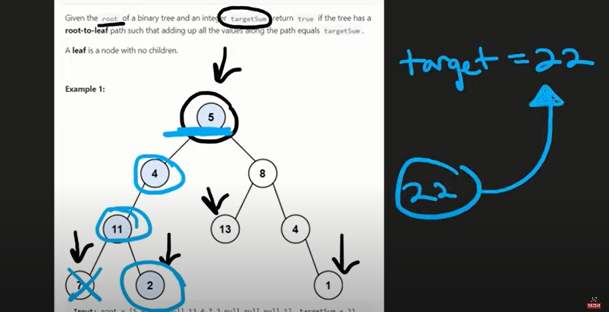

  - We can use a **Depth-First Search** to traverse the tree and keep track of the current sum of the path from the root to the current node. If we reach a leaf node and the current sum is equal to the target sum, then we return `True`. Otherwise, we return `False`.

- Solution 1: by subtracting the current node's value from the target sum

  ```py
  def hasPathSum(root, targetSum):
      if root is None:
          return False

      # if the root is a leaf node, check if the current sum is equal to the target sum
      if root.left is None and root.right is None:
        return root.val == targetSum

      targetSum -= root.val
      return hasPathSum(root.left, targetSum) or hasPathSum(root.right, targetSum)
  ```

- Solution 2: by adding the current node's value to the current sum

  ```py
  def hasPathSum(root, targetSum):
      def dfs(node, curSum):
          if node is None:
              return False

          curSum += node.val
          # if the root is a leaf node, check if the current sum is equal to the target sum
          if not node.left and not node.right:
              return curSum == targetSum

          return dfs(node.left, curSum) or dfs(node.right, curSum)

      return dfs(root, 0)
  ```

---

### Symmetric Tree

Given the `root` of a binary tree, check whether it is a mirror of itself (i.e., symmetric around its center).

- Explanation:
  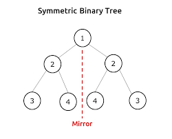

  - We can use a **Depth-First Search** to traverse the tree and check if the left subtree of the root is a mirror of the right subtree of the root.
  - because this is a mirror, we need to check:
    - if the `left` child of the `left` subtree is equal to the `right` child of the `right` subtree
    - and if the `right` child of the `left` subtree is equal to the `left` child of the `right` subtree
  - we will know that the tree is symmetric if the above conditions are true for all nodes in the tree and when we reach `null` nodes

- Time complexity: `O(n)` where `n` is the number of nodes in the tree
- Space complexity: `O(h)` where `h` is the height of the tree (as it's a `BFS` algorithm)

```py
def isSymmetric(root):
    def dfs(left, right):
        # if both nodes are null, return True
        if not left and not right:
            return True
        # if one of the nodes is null, return False
        if not left or not right:
            return False
        # if the values of the nodes are not equal, return False
        if left.val != right.val:
            return False

        return dfs(left.left, right.right) and dfs(left.right, right.left)

    return dfs(root.left, root.right)
```

---

### Same Tree

Given the roots of two binary trees `p` and `q`, write a function to check if they are the same or not.

It's very similar to the previous problem (Symmetric Tree), but in this problem we don't need to check if the left subtree is a mirror of the right subtree.

- Explanation:
  - Here, we want to check if the value & the structure of the two trees are the same. That's why we must use `DFS` to traverse the trees and check if the values of the nodes are equal.
  - if we used `BFS`, we would only check the values of the nodes in the same level, but we wouldn't be check the values of the nodes in the same position in the tree. **So we won't check its structure**.

```py
def isSameTree(p, q):
    def dfs(p, q):
        # if both nodes are null, means that we reached the end of the tree -> return True
        if not p and not q:
            return True
        # if one of the nodes is null, return False
        if not p or not q:
            return False
        # if the values of the nodes are not equal, return False
        if p.val != q.val:
            return False

        return dfs(p.left, q.left) and dfs(p.right, q.right)

    return dfs(p, q)
```

---

### Lowest Common Ancestor of a Binary Tree

Given a binary tree, find the lowest common ancestor (LCA) of two given nodes in the tree.

> "The lowest common ancestor is defined between two nodes `p` and `q` as the lowest node in `T` that has both `p` and `q` as descendants (where we allow **a node to be a descendant of itself**)."

- Ex:
  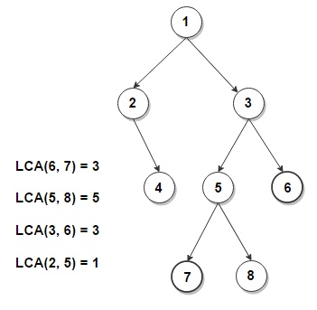

  - The lowest common ancestor of `p = 6` and `q = 7` is `3`.

- Explanation:
  - We can use a **Depth-First Search** to traverse the tree and check:
    - if the current node is equal to `p` or `q`
    - or if the current node is equal to the lowest common ancestor of `p` and `q`.
  - We can use a **Bottom-Up Approach** to solve this problem.
    1. We start by checking if the current node is equal to `p` or `q`. If it is, then we return the current node. Otherwise, we recursively call the function on the left and right subtrees.
    2. If both the left and right subtrees return a non-null value, then we know that the current node is the lowest common ancestor of `p` and `q`.
    3. Otherwise, we return the non-null value that was returned by either the left or right subtree.

```py
def lowestCommonAncestor(root, p, q):
    # base case
    if not root:
      return None

    # if the node is equal to p or q, then we know that the current node is the lowest common ancestor of p and q
    if root == p or root == q:
        return root

    # recursively call the function on the left and right subtrees
    left = lowestCommonAncestor(root.left, p, q)
    right = lowestCommonAncestor(root.right, p, q)

    # if both the left and right subtrees return a non-null value, then we know that the current node is the lowest common ancestor of p and q
    if left and right:
        return root
    # otherwise, we return the non-null value that was returned by either the left or right subtree
    return left or right
```

---

### Vertical Order Traversal of a Binary Tree

Given the `root` of a binary tree, calculate the **vertical order traversal** of the binary tree.

For each node at position `(row, col)`, its left and right children will be at positions `(row + 1, col - 1)` and `(row + 1, col + 1)` respectively. The root of the tree is at `(0, 0)`.

> The **vertical order traversal** of a binary tree is a list of top-to-bottom orderings for each column index starting from the leftmost column and ending on the rightmost column. There may be multiple nodes in the same row and same column. In such a case, sort these nodes by their values.


- Solution 1: using `queue`

  ```py
  def verticalTraversal(root):
      # dictionary to store the nodes of each column
      columns = {} # {col: [(row, val), (row, val), ...]}

      # queue to store the nodes that we need to visit
      queue = [(root, 0, 0)]

      # while the queue is not empty
      while queue:
          # pop the first node in the queue
          node, row, col = queue.pop(0)

          # if the node is not null, add it to the dictionary
          if node:
              columns[col] = columns.get(col, []) + [(row, node.val)]
              # add the left and right children of the node to the queue
              queue.append((node.left, row + 1, col - 1))
              queue.append((node.right, row + 1, col + 1))

      # sort the nodes of each column by their row and value
      result = []
      for col in sorted(columns):
          result.append([val for row, val in sorted(columns[col])])

      return result
  ```

- Solution 2: using `DFS`

  ```py
  def verticalTraversal(root):
      # dictionary to store the nodes of each column
      columns = {} # {col: [(row, val), (row, val), ...]}

      # helper function to do the DFS
      def dfs(node, row, col):
          if node:
              columns[col] = columns.get(col, []) + [(row, node.val)]
              dfs(node.left, row + 1, col - 1)
              dfs(node.right, row + 1, col + 1)

      # call the helper function
      dfs(root, 0, 0)

      # sort the nodes of each column by their row and value
      result = []
      for col in sorted(columns):
          result.append([val for row, val in sorted(columns[col])])

      return result
  ```

---

### Flatten Binary Tree to Linked List

Given the `root` of a binary tree, flatten the tree into a "linked list":

- The "linked list" should use the same `TreeNode` class where the `right` child pointer points to the next node in the list and the `left` child pointer is always `null`.
- The "linked list" should be in the same order as a **pre-order traversal** of the binary tree.
- Ex: `flatten(root) --> [1, null, 2, null, 3, null, 4, null, 5, null, 6]`
  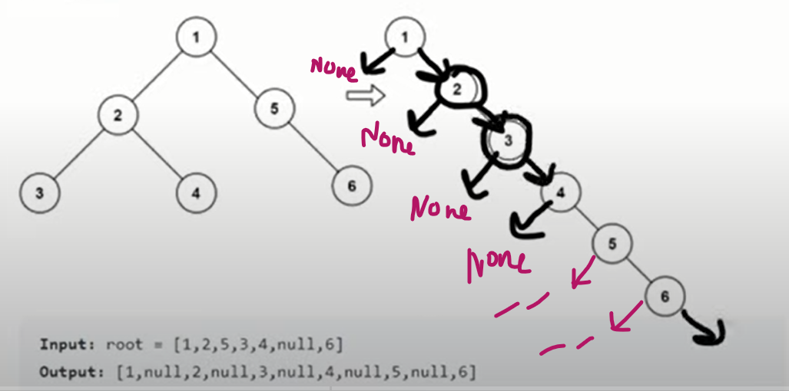

- Solution 1:

  - We can use a **Depth-First Search** to traverse the tree and keep track of the previous node in the linked list.
  - At each node, we set the previous node's `right` child to the current node and set the current node's `left` child to `null`.
  - We then update the previous node to the current node and recursively call the function on the left and right subtrees.

  ```py
  # Time complexity: O(n) where n is the number of nodes in the tree
  # Space complexity: O(h) where h is the height of the tree
  def flatten(root):
      prev = None # current tail of the linked list

      def dfs(node):
          if node:
              # set the previous node's right child to the current node
              # and set the current node's left child to null
              if prev:
                  prev.right = node
                  prev.left = None
              # update the previous node to the current node
              prev = node
              # recursively call the function on the left and right subtrees
              dfs(node.left)
              dfs(node.right)

      # call the helper function
      dfs(root)
  ```

- Another solution:

  ```py
  def flatten(root):
    # flatten the root tree and return the list tail
    def dfs(root):
      if not root:
        return

      leftTail = dfs(root.left)
      rightTail = dfs(root.right)

      if root.left:
        # connect the leftTail to the current root's right child
        leftTail.right = root.right
        # connect the current root's left child to the current root's right child
        root.right = root.left
        root.left = None

      last = rightTail or leftTail or root
      return last

    dfs(root)
  ```

---

## Binary Search Trees (BST)

- **Binary Search Trees Tips:**
  - When you're asked to find the **closest value** in a BST, you can use a **Depth First Search** to traverse the tree
  - When you're asked to find the **closest value** in a BST, you can use a **Breadth First Search** to traverse the tree
  - When you're asked to find the **closest value** in a BST, you can use a **Binary Search** to traverse the tree

### BST Insertion

Write a function that accepts a root node of a BST and a value to insert into the tree. The function should return the root node of the BST after the insertion.

- EX: `insert(root, 5) --> root`
  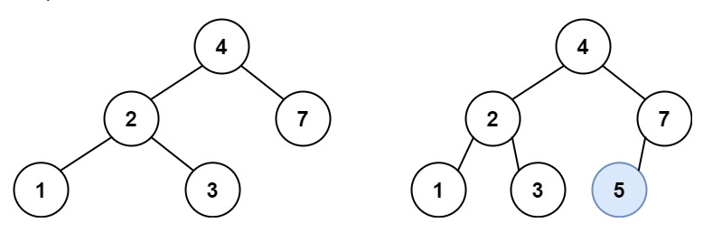

```py
def insert(root, value):
    # if the root is None, create a new node with the value and return it
    if root is None:
        return Node(value)

    # if the value is less than the root's value, insert it to the left
    if value < root.value:
        root.left = insert(root.left, value)
    # if the value is greater than the root's value, insert it to the right
    else:
        root.right = insert(root.right, value)

    return root
```

---

### Delete Node in a BST

- Explanation:

  - We can use a **Depth-First Search** to traverse the tree and find the node that we want to delete.
  - Once we find the node, we can use a **Bottom-Up Approach** to delete the node, and we have multiple cases to consider:
    1. If the node is a leaf node (has no childern), then we can simply delete the node by returning `None`.
    2. If the node has only one child, then we can delete the node by returning its child.
    3. If the node has two children, then we can delete the node by replacing its value with the value of its successor node (the smallest node in its right subtree) and then recursively call the function on the right subtree to delete the successor node.

```py
def deleteNode(root, key):
    # if the root is None, return None
    if root is None:
        return None

    # if the key is less than the root's value, delete the key from the left subtree
    if key < root.value:
        root.left = deleteNode(root.left, key)
    # if the key is greater than the root's value, delete the key from the right subtree
    elif key > root.value:
        root.right = deleteNode(root.right, key)
    # if the key is equal to the root's value, delete the key from the current node
    else:
        # if the node is a leaf node (has no childern), then we can simply delete the node by returning None
        if not root.left and not root.right:
            return None
        # if the node has only one child, then we can delete the node by returning its child
        elif not root.left:
            return root.right
        elif not root.right:
            return root.left
        # if the node has two children, then we can delete the node by replacing its value with the value of its successor node (the smallest node in its right subtree) and then recursively call the function on the right subtree to delete the successor node
        else:
            # find the successor node
            successor = root.right
            while successor.left:
                successor = successor.left
            # replace the root's value with the successor's value
            root.value = successor.value
            # delete the successor node
            root.right = deleteNode(root.right, successor.value)

    return root
```

---

### Validate Binary Search Tree

Write a function that accepts a root node of a BST and returns `True` if the tree is a valid BST and `False` if it is not.

- EX: `validate(root) --> True`
- Explanation:
  - The first solution that comes into mind is to check the `right` & `left` children of each node and check if they're less than or greater than the root node
    - but that's not enough because the right child of the root node might be less than the root node, but it's greater than the left child of the root node.
      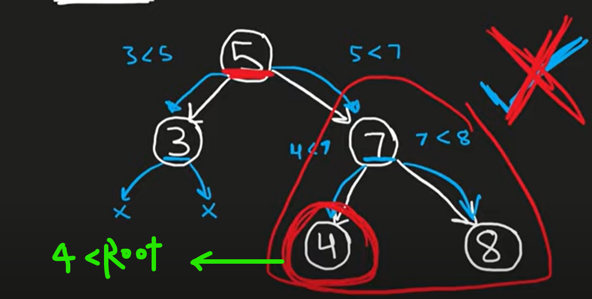
  - So we can't just check the neighbors and children one time and we have to check the whole tree for each node -> `O(n^2)` **BAD!**
- **Solution** is to use ranges for each point:
  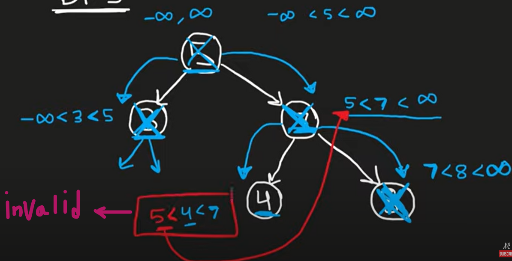

  - root node should be in the range of `(-inf, inf)`
    - we use infinity because we don't know the values of the nodes in the tree
  - left child of the root node should be in the range of `(-inf, root.value)`
  - right child of the root node should be in the range of `(root.value, inf)`

- **Solution 1:** Using `min` and `max` ranges

  - **Steps:**
    - create a function that accepts a `root` node, a `min` value and a `max` value

  ```py
  def isValidBST(root):
      # helper function
      def validate(root, min, max):
          if root is None: # if reached a leaf node,
              return True
          if root.value <= min or root.value >= max:
              return False

          # recursively call the function with the root's left/right node and the min/max value and the root's value
          return validate(root.left, min, root.value) and validate(root.right, root.value, max)

      # return the result of the function
      return validate(root, float('-inf'), float('inf'))
  ```

- **Solution 2:** Using In-Order Traversal

  - **Steps:**
    1. create a function that accepts a `root` node
    2. create an array to store the `values` of the nodes in the tree
    3. create a function that accepts a `root` node and adds the `values` of the nodes in the tree to the array, then call the function with the `root`'s `right` node
    4. call the function with the `root` node
    5. loop through the array and check if the values are in ascending order
    6. if the values are in ascending order, return `True`

  ```py
  def validate(root):
      # create an array to store the values of the nodes in the tree
      values = []

      # create a function that accepts a root node
      def traverse(root):
          # if the root is None, return
          if root is None:
              return

          # call the function with the root's left node
          traverse(root.left)
          # add the root's value to the array
          values.append(root.value)
          # call the function with the root's right node
          traverse(root.right)

      # call the function with the root node
      traverse(root)

      # loop through the array and check if the values are in ascending order
      for i in range(len(values) - 1):
          # if the values are not in ascending order, return False
          if values[i] > values[i + 1]:
              return False

      # if the values are in ascending order, return True
      return True
  ```

---

### Binary Tree Inorder Traversal

Given the `root` of a binary tree, return the inorder traversal of its nodes' values.

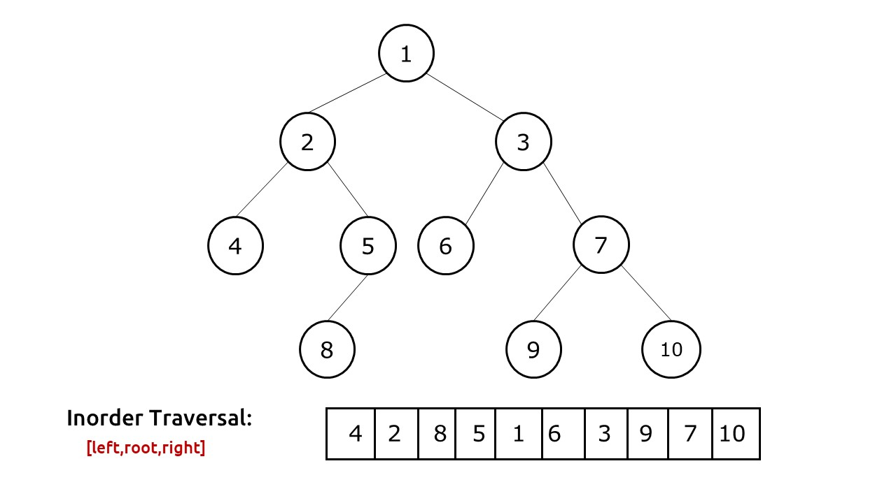

- Explanation:

  - **Inorder** means traversing the tree in a sorted order (smaller to larger) and to do so, we need to visit the left node first, then the root node, then the right node and so on

- Time complexity: `O(n)` where `n` is the number of nodes in the tree

- Solution 1: using `DFS` **recursively**

  - we do this by :
    1. recursively calling the function on the **left** node to reach the smallest node
    2. then we print the value of the node
    3. then we recursively call the function on the **right** node to reach the largest node
  - We can use a `DFS` to traverse the tree and add the values of the nodes to an array.
  - We can use a helper function to do the `DFS` and then return the array.

  ```py
  def inorderTraversal(root):
      values = []

      def traverse(root):
          if root is None:
              return
          # 1. recursively call the function with the root's left node until we reach a leaf node (None)
          traverse(root.left)
          # 2. add the root's value to the array
          values.append(root.value)
          # 3. recursively call the function with the root's right node until we reach a leaf node (None)
          traverse(root.right)

      traverse(root)
      return values
  ```

- Solution 2: using `DFS` + `stack` **iteratively**
  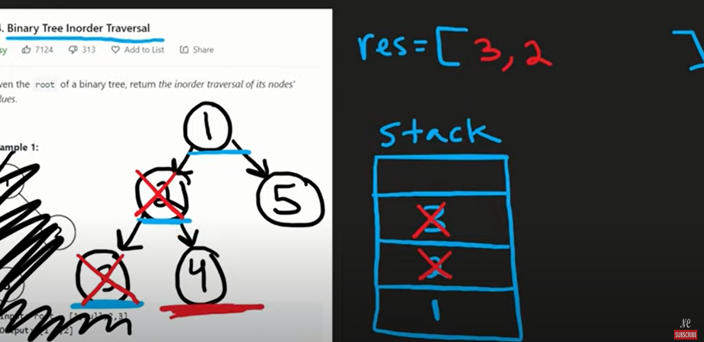

  ```py
  def inorderTraversal(root):
      values = []
      stack = []
      cur = root

      # while the stack is not empty or the cur is not None
      while stack or cur:
          # 1. loop through the left nodes of the cur and add them to the stack
          while cur:
              stack.append(cur)
              cur = cur.left

          # 2. add the node's value to the array
          node = stack.pop()
          values.append(node.value)
          # 4. set the root to the node's right node
          cur = node.right

      return values
  ```

---

### Binary Tree Postorder Traversal

Given the `root` of a binary tree, return the postorder traversal of its nodes' values.

- Solution 1: **Recursive**

  - the recursive solution uses the `call stack` to store the nodes of the tree

  ```py
  def postorderTraversal(root):
      values = []

      def traverse(root):
          if root is None:
              return
          # 1. recursively call the function with the root's left node until we reach a leaf node (None)
          traverse(root.left)
          # 2. recursively call the function with the root's right node until we reach a leaf node (None)
          traverse(root.right)
          # 3. add the root's value to the array
          values.append(root.value)

      traverse(root)
      return values
  ```

- Solution 2: **Iterative**

  - The iterative solution uses a `stack` to store the nodes of the tree
    - for each node, before going to the left node, we need to add the node and the right node to the stack **(to come back to them later)**
    - we only want to add the value of a node to the `result` array when we reach a leaf node (a node that has no children)
      - which means that when visiting the node for the second time, we need to check if the node has been visited before or not
        - if the node has been visited before, we can add its value to the `result` array
        - if the node has not been visited before, we need to add it to the stack and visit its left node

  ```py
  def postorderTraversal(root):
      stack = [root]
      visit = [False]
      res = []

      while stack:
        cur, visited = stack.pop(), visit.pop()
        if cur:
          if visited:
            res.append(cur.val)
          else:
            # append everything (right first because we want to visit it last)
            stack.append(cur)
            visit.append(True)
            stack.append(cur.right)
            visit.append(False)
            stack.append(cur.left)
            visit.append(False)

      return res
  ```

---

### Binary Search Tree Iterator

Implement the `BSTIterator` class that represents an iterator over the **in-order traversal** of a binary search tree (BST):

- `BSTIterator(TreeNode root)` Initializes an object of the `BSTIterator` class. The `root` of the BST is given as part of the constructor. The pointer should be initialized to a non-existent number smaller than any element in the BST.
- `boolean hasNext()` Returns `true` if there exists a number in the traversal to the right of the pointer, otherwise returns `false`.
- `int next()` Moves the pointer to the right, then returns the number at the pointer.
  - Notice that by initializing the pointer to a non-existent smallest number, the first call to `next()` will return the smallest element in the BST.
- Explanation:
  - The intuitive solution is to use **Inorder traversal** to traverse the tree and store the values in an array **(in the constructor)**, then we can use the array to implement the `next()` and `hasNext()` functions.
    - But this solution will take `O(n)` space and `O(n)` time to construct the array
    - We want to use `O(h)` space and `O(1)` time to implement the `next()` and `hasNext()` functions, So we will use **Iterative DFS** to solve this problem
      - We use `iterative DFS` instead of `recursive DFS` because it's simpler to implement here as we won't add all the nodes to the stack at once, we will only add the nodes that we need to visit next

```py
class BSTIterator:
    def __init__(self, root):
        self.stack = []
        self.cur = root

    def next(self):
        while self.cur:
            self.stack.append(self.cur)
            self.cur = self.cur.left # in-order traversal

        node = self.stack.pop() # (left-most node)
        self.cur = node.right # move to the right node
        return node.val

    def hasNext(self):
        return self.stack or self.cur # if the stack is not empty or the cur is not None
```

---

### Binary Tree Level Order Traversal

Given the `root` of a binary tree, return the level order traversal of its nodes' values. (i.e., from left to right, level by level).

- Ex:
  - Input: `root = [3,9,20,null,null,15,7]`
  - Output: `[[3],[9,20],[15,7]]`

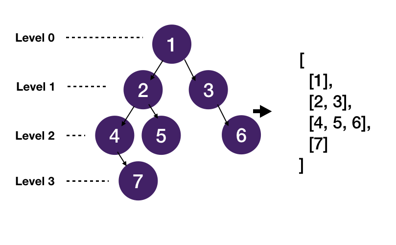

- Explanation
  - We can use a **Breadth-First Search** to traverse the tree level by level and add the values of the nodes to an array.
  - We can use a `queue` to store the nodes of each level, and a `level` array to store the values of the nodes of each level.
    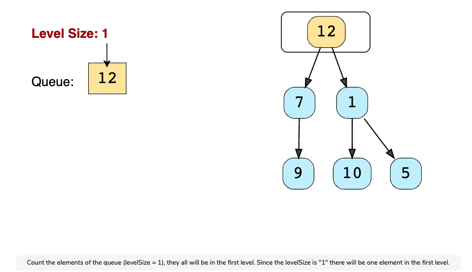
    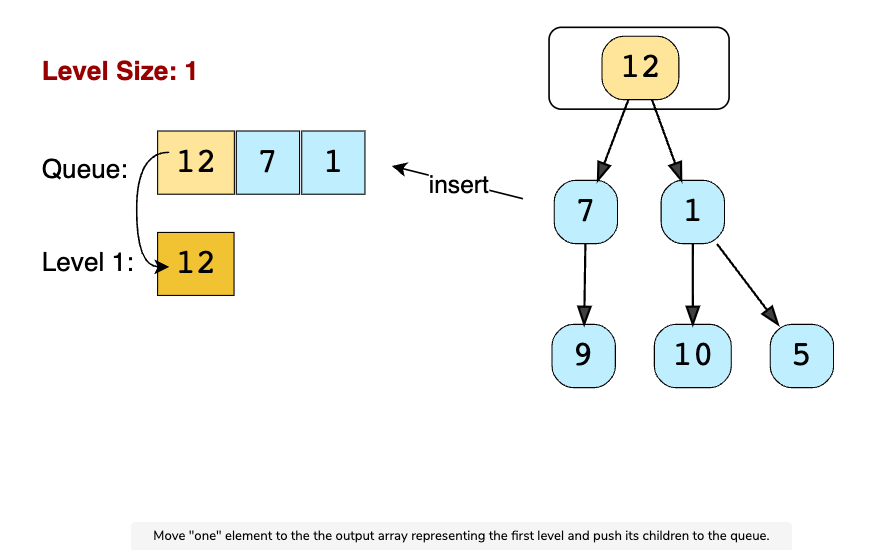
    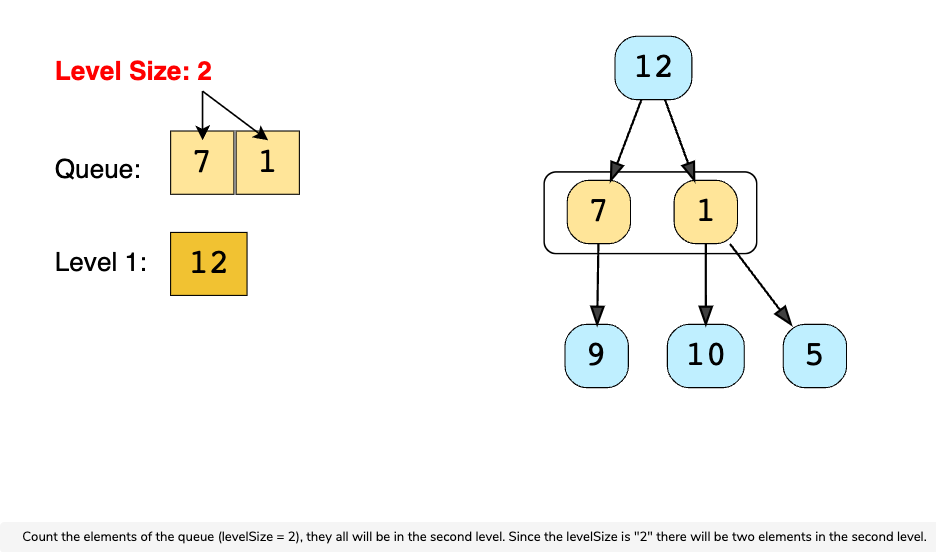
    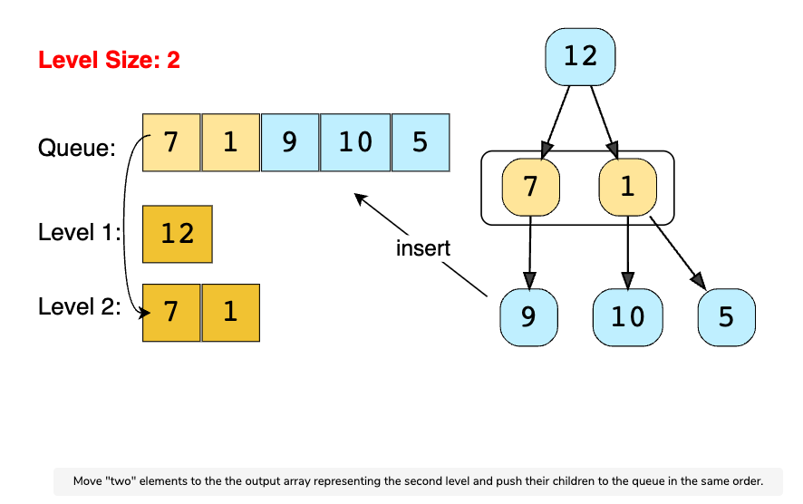
  - We can use a `while` loop to traverse the tree level by level and a `for` loop to traverse the nodes of each level.
    - We can use a `deque` to store the nodes of each level.

```py
def levelOrder(root):
    if root is None:
        return []

    result = []
    q = deque([root])

    # while the queue is not empty
    while q:
        # create an array to store the nodes of the current level
        level = []
        # loop through the queue
        for i in range(len(q)):
            # pop the first node in the queue
            node = q.popleft()
            # add the node's value to the level array
            level.append(node.value)
            # add the node's children to the queue
            if node.left:
                q.append(node.left)
            if node.right:
                q.append(node.right)

        # add the level array to the result array
        result.append(level)

    return result
```

---

### Binary Tree Level Order Traversal II

Given the `root` of a binary tree, return the **bottom-up** level order traversal of its nodes' values. (i.e., from left to right, level by level from leaf to root).

- Ex:
  

  - Input: `root = [3,9,20,null,null,15,7]`
  - Output: `[[15,7],[9,20],[3]]`

- Explanation:
  - It's the same as the previous problem, but we need to reverse the result array at the end.
  - We can use a `queue` to store the nodes of each level and a `result` array to store the values of the nodes of each level.
  - we will append the level array to the result queue from the left instead of the right

```py
def levelOrderBottom(root):
    if root is None:
        return []

    result = deque()
    q = deque([root])

    # while the queue is not empty
    while q:
        # create an array to store the nodes of the current level
        level = []
        # loop through the queue
        for i in range(len(q)):
            # pop the first node in the queue
            node = q.popleft()
            # add the node's value to the level array
            level.append(node.value)
            # add the node's children to the queue
            if node.left:
                q.append(node.left)
            if node.right:
                q.append(node.right)

        # add the level array to the result array
        result.appendleft(level)

    return result
```

---

### Average of Levels in Binary Tree

Given the `root` of a binary tree, return the average value of the nodes on each level in the form of an array. Answers within `10^-5` of the actual answer will be accepted.

- Ex:
  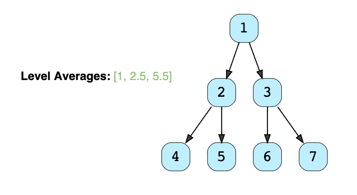
  - Input: `root = [1, 2, 3, 4, 5, 6, 7]`
  - Output: `[1, 2.5, 5.5]`

```py
def averageOfLevels(root):
    if root is None:
        return []

    result = []
    q = deque([root])

    # while the queue is not empty
    while q:
        # create an array to store the nodes of the current level
        level = []
        # loop through the queue
        for i in range(len(q)):
            # pop the first node in the queue
            node = q.popleft()
            # add the node's value to the level array
            level.append(node.value)
            # add the node's children to the queue
            if node.left:
                q.append(node.left)
            if node.right:
                q.append(node.right)

        # add the average of the level array to the result array
        result.append(sum(level) / len(level))

    return result
```

---

### Minimum Depth of Binary Tree

Given a binary tree, find its minimum depth.

The minimum depth is the number of nodes along the shortest path from the root node down to the nearest leaf node.

- Ex:
  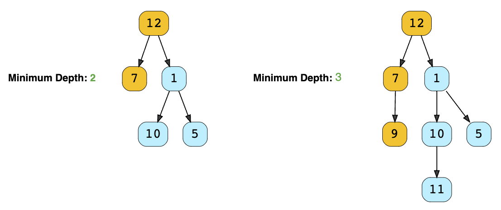

- Explanation:
  - Here, we can use `BFS` or `DFS` to traverse the tree level by level and return the level when we reach a leaf node.
    - `BFS` is better because it will return the minimum depth faster than `DFS` because it will traverse the tree level by level
    - `DFS` will traverse the tree until it reaches a `leaf` node, then it will **backtrack** to the `root` node and traverse the tree again until it reaches another `leaf` node and so on, each time it reaches a `leaf` node, it will compare the current level with the minimum level and update the minimum level if the current level is less than the minimum level.

```py
def minDepth(root):
    if root is None:
        return 0

    level = 0
    q = deque([root])

    # while the queue is not empty
    while q:
        # increment the level by 1
        level += 1
        # loop through the queue
        for i in range(len(q)):
            # pop the first node in the queue
            node = q.popleft()
            # if the node is a leaf node, return the level
            if not node.left and not node.right:
                return level
            # add the node's children to the queue
            if node.left:
                q.append(node.left)
            if node.right:
                q.append(node.right)
```

---

### Maximum Depth of Binary Tree

Given the `root` of a binary tree, return its maximum depth.

A binary tree's **maximum depth** is the number of nodes along the longest path from the root node down to the farthest leaf node.

- Explanation:

  - We can use `BFS` or `DFS` to traverse the tree level by level and return the level when we reach a leaf node.
    - `BFS` is better because it will return the maximum depth faster than `DFS` because it will traverse the tree level by level
    - `DFS` will traverse the tree until it reaches a `leaf` node, then it will **backtrack** to the `root` node and traverse the tree again until it reaches another `leaf` node and so on, each time it reaches a `leaf` node, it will compare the current level with the maximum level and update the maximum level if the current level is greater than the maximum level.
      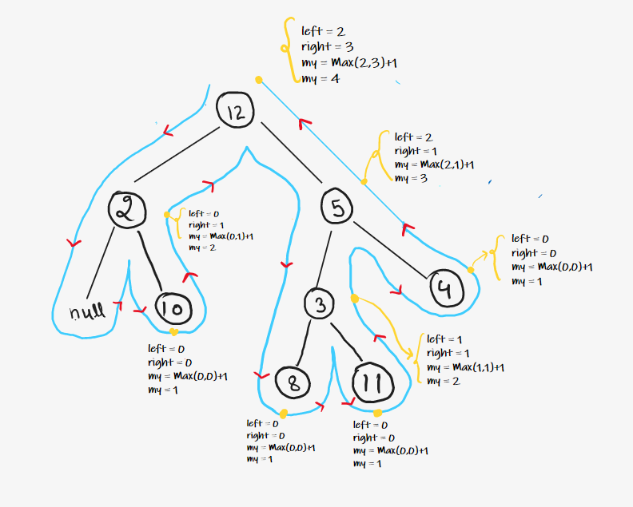

- Time complexity: `O(n)` where `n` is the number of nodes in the tree

  - best case: `O(log(n))` if the tree is balanced
  - worst case: `O(n)` if the tree is not balanced

- **Solution 1:** using recursive `DFS`

  ```py
  def maxDepth(root):
      # if the root is None, return 0
      if root is None:
          return 0

      # recursively call the function with the root's left node and the root's right node
      left = maxDepth(root.left)
      right = maxDepth(root.right)

      # return the maximum depth of the tree
      return max(left, right) + 1

  # ----------------------------------------------------------

  # same solution with tail recursion (Better) ✅
  def maxDepth(root, depth=0):
      # if the root is None, return 0
      if root is None:
          return depth

      # recursively call the function with the root's left node and the root's right node
      left = maxDepth(root.left, depth + 1)
      right = maxDepth(root.right, depth + 1)

      # return the maximum depth of the tree
      return max(left, right)
  ```

- **Solution 2:** using `BFS` + `queue` -> **level-order traversal**
  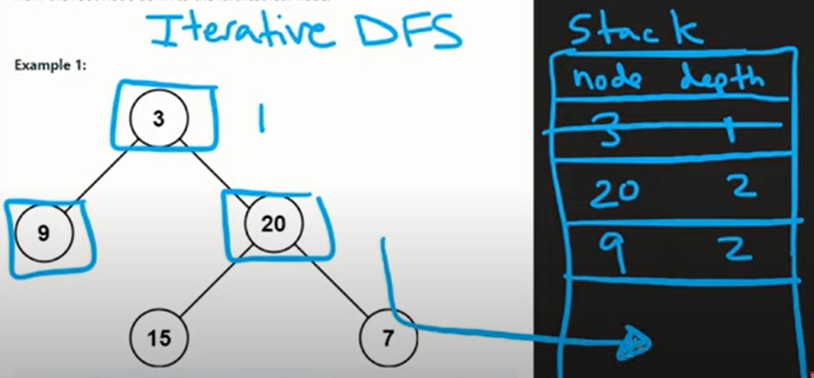

  ```py
  def maxDepth(root):
      if root is None:
          return 0

      level = 0
      q = deque([root])

      # while the queue is not empty
      while queue:
          # loop through the queue to add the children of each node to the queue (BFS) + update level when finished
          for i in range(len(queue)):
              # pop the first node in the queue
              node = q.popleft()
              if node.left:
                q.append(node.left)
              if node.right:
                q.append(node.right)
          # increment the level by 1
          level += 1

      return level
  ```

- **Solution 3:** using `DFS` + `stack`

  ```py
  def maxDepth(root):
      if root is None:
          return 0

      level = 0
      stack = [(root, 1)] # (node, level)

      # while the stack is not empty
      while stack:
          # pop the first node in the stack
          node, level = stack.pop()
          if node.left:
              stack.append((node.left, level + 1))
          if node.right:
              stack.append((node.right, level + 1))

      return level
  ```

---

### Level Order Successor

Given a binary tree and a node, find the level order successor of the given node in the tree. The level order successor is the node that appears right after the given node in the level order traversal.

- Ex:
  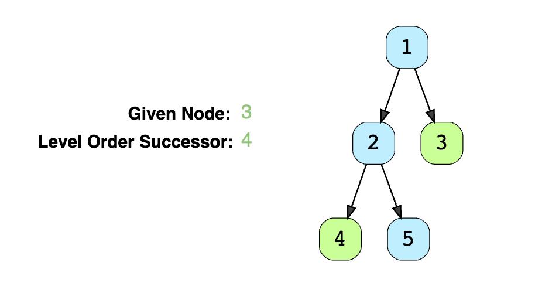
  - Input: `root = [1, 2, 3, 4, 5], key = 3`
  - Output: `4`

```py
def levelOrderSuccessor(root, key):
    if root is None:
        return None

    q = deque([root])

    while q:
        for i in range(len(q)):
            node = q.popleft()
            if node.left:
                q.append(node.left)
            if node.right:
                q.append(node.right)

            # if we found the key, return the first node in the queue
            if node.value == key:
                return q[0].value if q else None
```

---

### Populating Next Right Pointers in Each Node ( Connect Level Order Siblings )

// TODO: Watch the video

You are given a **perfect binary tree** where all leaves are on the same level, and every parent has two children. The binary tree has the following definition:

- EX:
  

  - Input: `root = [1, 2, 3, 4, 5, 6, 7]`
  - Output: `[1, #, 2, 3, #, 4, 5, 6, 7, #]`

- Explanation:
  - We can use `BFS` to traverse the tree level by level and connect the nodes of each level.
  - We can use a `for` loop to traverse the nodes of each level and connect them.
    - We can use a `prev` variable to store the previous node and connect it to the current node.

```py
def connect(root):
    if root is None:
        return None

    q = deque([root])
    while q:
        prev = None
        for i in range(len(q)):
            node = q.popleft()
            if prev:
                prev.next = node
            prev = node

            if node.left:
                q.append(node.left)
            if node.right:
                q.append(node.right)

    return root
```

---

### Populating Next Right Pointers in Each Node II

Same as the previous problem, but the tree is not a **perfect binary tree**.

- Ex:
  

  - Input: `root = [1, 2, 3, 4, 5, null, 7]`
  - Output: `[1, #, 2, 3, #, 4, 5, 7, #]`

```py
# Same solution as the previous problem
```

---

### Check Completeness of a Binary Tree

Given the `root` of a binary tree, determine if it is a **complete binary tree**. In a **complete binary tree**, every level, except possibly the last, is completely filled, and all nodes in the last level are as far left as possible. It can have between `1` and `2h` nodes inclusive at the last level `h`.

- EX: `isCompleteTree(root) --> True`

- Explanation:

  - in a complete binary tree, if we draw the tree level by level, we can see that the **last level is filled from left to right**
  - So, when we pop the last node in the queue, we should not see any more nodes in the queue
    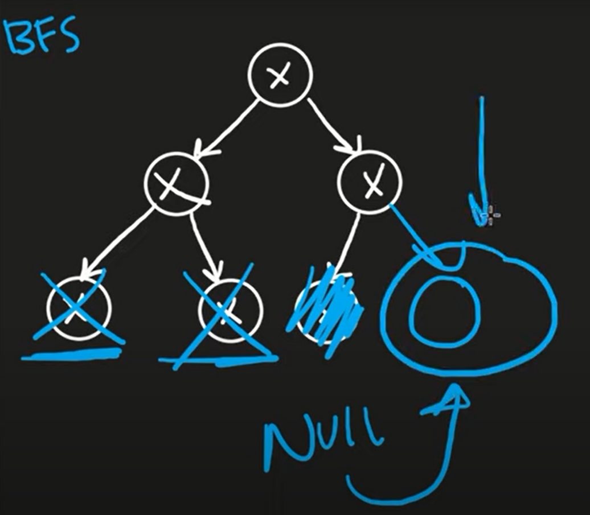
  - To do so, we'll use `BFS` because we want to traverse the tree **level by level**, and then check if the last level is filled from **left-to-right**
    - We know that the last level will be filled with `None` nodes
    - So when we reach the first `None` node, we should not see any more nodes in the queue when popping/
      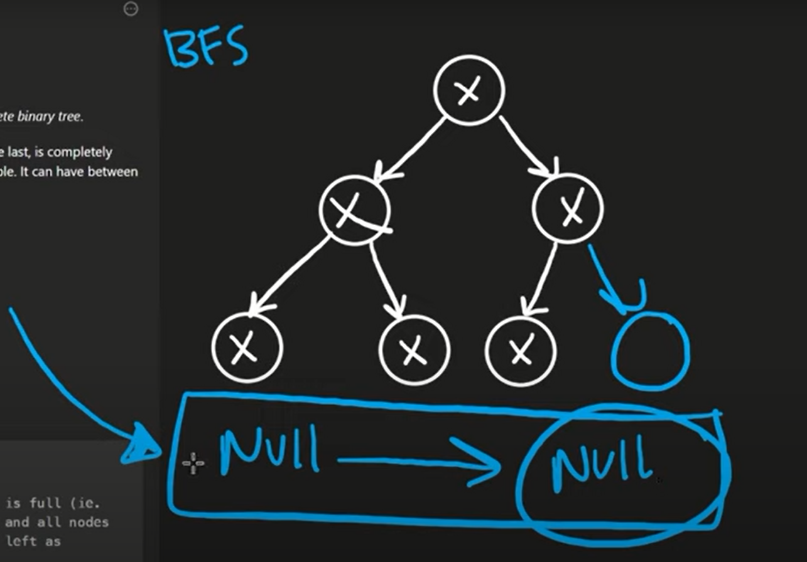

- **Solution:** using `BFS` + `queue`

  ```py
  # Time complexity: O(n), Space complexity: O(n)
  def isCompleteTree(root):
      if root is None:
          return True

      # create a queue to store the nodes of each level
      q = deque([root])
      # create a flag to indicate if we've reached the last level
      reached_last_level = False

      # while the queue is not empty
      while q:
          # pop the first node in the queue
          node = q.popleft()

          # if we've reached the last level, but the current node is not None, return False
          if reached_last_level and node is not None:
              return False

          # if the current node is None, set the flag to True
          if node is None:
              reached_last_level = True
          # else add its children to the queue
          else:
              q.append(node.left)
              q.append(node.right)

      # if we didn't return False, return True
      return True
  ```

- **Another solution** without using a boolean state variable:

  ```py
  def isCompleteTree(root):
      q = deque([root])

      while q:
          node = q.popleft()

          if node:
              q.append(node.left)
              q.append(node.right)
          else:
              while q:
                  # if we found a non-null node
                  if q.popleft():
                      return False

      return True
  ```

---

### Binary Tree Zigzag Level Order Traversal

Given the `root` of a binary tree, return the zigzag level order traversal of its nodes' values. (i.e., from `left` to `right`, then `right` to `left` for the next level and alternate between).

- Ex:

  - Input: `root = [3,9,20,null,null,15,7]`
  - Output: `[[3],[20,9],[15,7]]`

- Explanation:

  - we want to take every level and reverse it if it's an odd level and then add it to the result array
    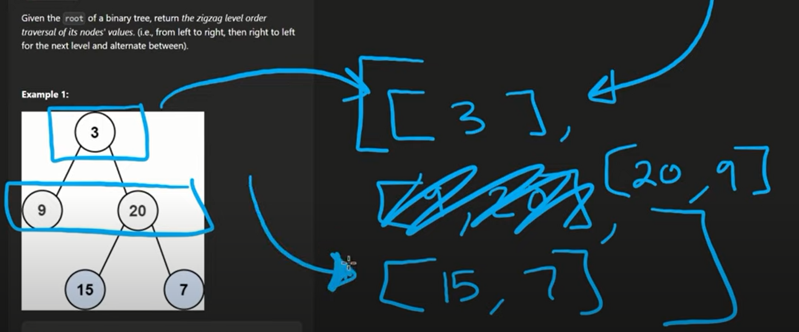
  - we can use BFS to traverse the tree level by level and:
    1. use a flag to indicate if we're going from left to right or from right to left and toggle it on each level
    2. use a double-ended queue (deque) to store the nodes of each level
    3. reverse the odd levels after adding them to the result array

- **Solution 1** `BFS` + Iterative + `deque`

  ```py
  def zigzagLevelOrder(root):
      if root is None:
          return []

      result = []
      # create a queue to store the nodes of each level
      q = deque([root])

      while q:
          # create an array to store the nodes of the current level
          level = []
          # loop through the queue
          for i in range(len(q)):
              # pop the first node in the queue
              node = q.popleft()
              # add the node's value to the level array
              level.append(node.value)
              # add the node's children to the queue
              if node.left:
                  q.append(node.left)
              if node.right:
                  q.append(node.right)

          # reverse if it's an odd level
          level = reversed(level) if len(result) % 2 else level
          result.append(level)

      return result
  ```

- **Solution 2**: `DFS` + recursive

  ```py
  def zigzagLevelOrder(root):
      if root is None:
          return []

      result = []

      def dfs(node, level):
          if node is None:
              return

          # if the current level is greater than the length of the result array, add a new array to the result array
          if level >= len(result):
              result.append([])

          # add the node's value to the array
          result[level].append(node.value)
          # recursively call the function with the node's left and right nodes and the next level
          dfs(node.left, level + 1)
          dfs(node.right, level + 1)

      dfs(root, 0)

      # reverse the odd levels
      for i in range(len(result)):
          if i % 2:
              result[i] = reversed(result[i])

      return result
  ```

---

### Sum of Left Leaves

Given the `root` of a binary tree, return the sum of all left leaves.

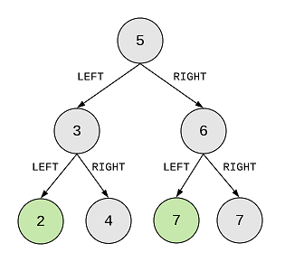

- **Solution 1:** using `DFS` + `stack`

  ```py
  def sumOfLeftLeaves(root):
      if root is None:
          return 0

      stack = [(root, False)] # (node, is_left)
      sum = 0

      while stack:
          node, is_left = stack.pop()
          # if the node is a left leaf, add its value to the sum
          if is_left and node.left is None and node.right is None:
              sum += node.value
          if node.left:
              stack.append((node.left, True))
          if node.right:
              stack.append((node.right, False))

      return sum
  ```

- **Solution 2:** using `BFS` + `recursion`

  ```py
  def sumOfLeftLeaves(root):
      if root is None:
          return 0

      # If root has a left child and the left child is a leaf node, add it to the sum
      if root.left and root.left.left is None and root.left.right is None:
          return root.left.value + sumOfLeftLeaves(root.right)
      # Otherwise, recursively call sumOfLeftLeaves on the left and right children
      else:
          return sumOfLeftLeaves(root.left) + sumOfLeftLeaves(root.right)
  ```

---

### Diameter of Binary Tree

Given the `root` of a binary tree, return the length of the **diameter** of the tree.

The diameter of a binary tree is the **length** of the longest path between any two nodes in a tree. This path may or may not pass through the `root`.
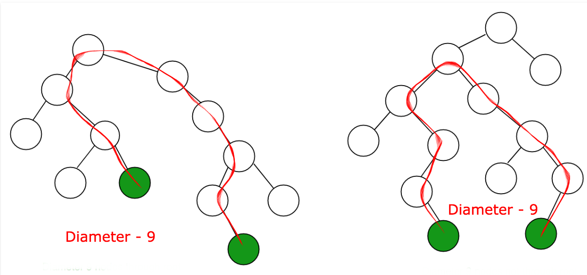

- **Explanation**
  - To solve this, we can use a **Depth First Search** to traverse the tree and keep track of the **diameter** of the tree
  - we do so by calculating the diameter for each node recursively and then return the maximum diameter
  - to calculate the diameter of a node, we need to calculate the **height** of the left subtree and the **height** of the right subtree and then add them together
    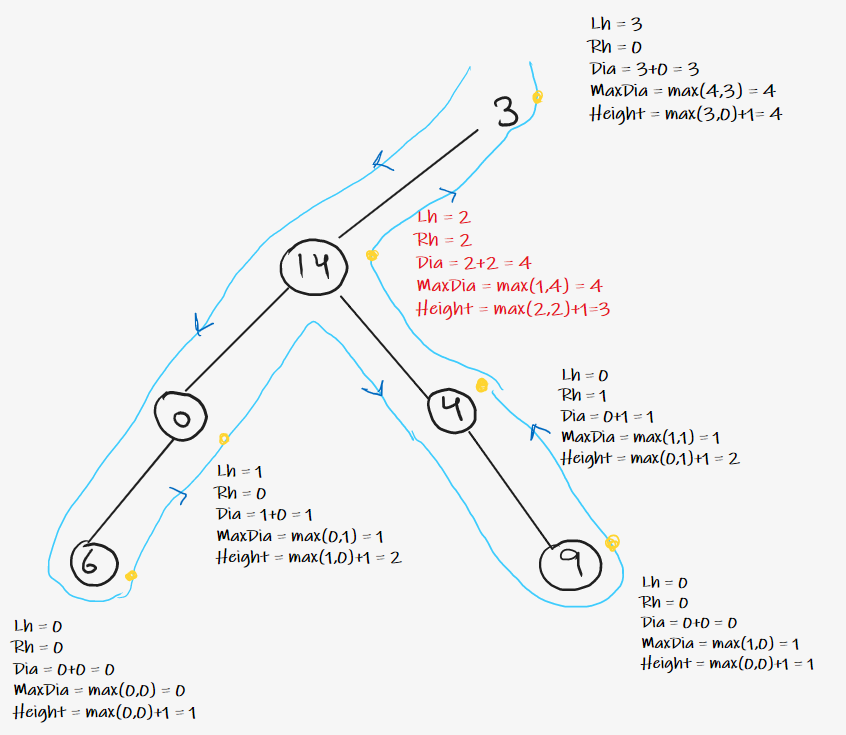
    - the **height** of a subtree is the number of edges between the root node and the farthest leaf node
    - `diameter` = `left_height` + `right_height`
    - we add them because the diameter of a node is the longest path between any two nodes in a tree and this path may or may not pass through the `root` (see picture)
      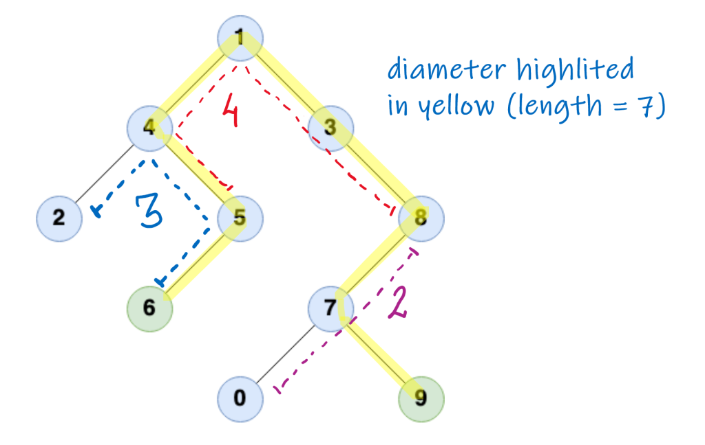
- So, the approach for solving this problem is to calculate the `height` of each node's `left` and `right` subtrees and find the maximum `sum` of heights for any node. This `sum` represents the longest path that passes through that node. We can do this recursively for each node in the tree and keep track of the maximum diameter found so far.

```py
def diameterOfBinaryTree(root):
    # create a variable to store the diameter of the tree
    diameter = 0

    # create a function that accepts a root node and returns the height of the tree
    def height(root):
        # if the root is None, return 0
        if root is None:
            return 0

        # recursively call the function with the root's left node and the root's right node
        left = height(root.left)
        right = height(root.right)

        # update the diameter of the tree
        diameter = max(diameter, left + right)

        # return the height of the tree (1 for the current node)
        return max(left, right) + 1

    height(root)
    return diameter
```

---

### Minimum Absolute Difference in BST

Given the `root` of a Binary Search Tree (BST), return the minimum absolute difference between the values of any two different nodes in the tree.

- Ex:

  - Input: `root = [4,2,6,1,3]`
  - Output: `1`

- **Explanation**
  - We can use a **inorder DFS** to traverse the tree and keep track of the **minimum absolute difference** between the values of any two different nodes in the tree
  - we do so by calculating the **absolute difference** between the current node's value and the **previous** node's value and then return the minimum absolute difference
    - > Here, `prev` is the node below and not above
  - we create a recursive function `traverse()`:
    - it takes a node as input and recursively traverses its **left subtree** until it reaches a leaf node
      - > because the values in the **left** subtree are less than the current node's value
    - then checks if the `prev` variable is not `None`. If it is not None, it calculates the absolute difference between the current node and the previous node, and updates the `min_diff` variable with the minimum of the current minimum absolute difference and the absolute difference between the current node and the previous node.
    - It then sets the `prev` variable to the current node and recursively traverses the **right subtree**.
      - we go to `left` subtree first because the values in the `left` subtree are less than the current node's value

```py
def getMinimumDifference(root):
    min_diff = float('inf')
    prev = None

    def traverse(root):
        if not root:
            return

        traverse(root.left)

        # if the previous node's value is not None, update the minimum absolute difference
        if prev:
            min_diff = min(min_diff, root.value - prev.val)

        # update the previous node's value
        prev = root

        # recursively call the function with the root's right node
        traverse(root.right)

    # call the function with the root node
    traverse(root)
    return min_diff
```

---

### Invert Binary Tree

Given the `root` of a binary tree, invert the tree, and return its root.

- Ex:
  

  - Input: `root = [4,2,7,1,3,6,9]`
  - Output: `[4,7,2,9,6,3,1]`

- Explanation:
  - here, we want to visit every node and swap its `left` and `right` children
  - do this recursively for each node with `DFS`

```py
def invertTree(root):
    if not root:
        return None

    # swap the children
    root.left, root.right = root.right, root.left

    # recursively call the function with the root's left node and the root's right node
    invertTree(root.left)
    invertTree(root.right)

    return root

# -------------------------------------------------------------------
# Different method (DFS)
def invertTree(root):
    if not root:
      return None

    # recursively call the function with the root's left node and the root's right node
    left = invertTree(root.left)
    right = invertTree(root.right)

    # swap the children
    root.left = right
    root.right = left

    return root
```

---

### Kth Smallest Element in a BST

Given the `root` of a binary search tree, and an integer `k`, return the `kth` smallest value (`1-indexed`) of all the values of the nodes in the tree.

- Ex:

  - Input: `root = [3,1,4,null,2], k = 1`
  - Output: `1`

- Explanation:
- **Solution 1:** using `DFS` + sorting **(recursively)**

  - we can use `DFS` to traverse the tree and add the values of the nodes to an array
  - then we can sort the array and return the `kth` smallest value

  ```py
  def kthSmallest(root, k):
      values = []

      def traverse(root):
          if root is None:
              return

          # Traverse in-order
          traverse(root.left)
          values.append(root.value)
          traverse(root.right)

      traverse(root)
      values.sort()
      return values[k - 1]
  ```

- **Solution 2:** using `DFS` + `stack` **(iteratively)**

  - we go left as far down as we can with adding the values to the stack and then go up by popping the nodes from the stack and adding their values to the array

    - we can use a `stack` to store the nodes of the tree in descending order
    - then we can pop the first `k` nodes from the stack and return the last node's value

    ```py
    def kthSmallest(root, k):
        stack = []
        cur = root

        while stack or cur:
            # loop through the left nodes of the cur and add them to the stack
            while cur:
                stack.append(cur)
                cur = cur.left

            # pop the first node in the stack
            node = stack.pop()
            k -= 1
            if k == 0:
                return node.value

            # set the root to the node's right node
            cur = node.right
    ```

---

### Lowest Common Ancestor of a Binary Search Tree

Given a binanaary search tree (BST), find the lowest common ancestor (LCA) of two given nodes in the BST.

> "The lowest common ancestor is defined between two nodes `p` and `q` as the lowest node in `T` that has both `p` and `q` as descendants (where we allow **a node to be a descendant of itself**)."

- Explanation:
  - This is different from the **lowest common ancestor of a binary tree** problem because in a **binary tree**, we can have nodes with only one child, and also the nodes can be in any order.
  - But in a **binary search tree**, we know that the nodes in the left subtree are less than the root node and the nodes in the right subtree are greater than the root node.
  - So, we can use this property to find the lowest common ancestor of two nodes in a BST.

```py
def lowestCommonAncestor(root, p, q):
    cur = root

    while cur:
      # if the current node is bigger than both p and q, go left (smaller value)
      if cur.value > p.value and cur.value > q.value:
        cur = cur.left
      # else if the current node is smaller than both p and q, go right (bigger value)
      elif cur.value < p.value and cur.value < q.value:
        cur = cur.right
      # else return the current node -> it's the lowest common ancestor
      else:
        return cur
```

---

## Tries

### Implement Trie (Prefix Tree)

A **trie** (pronounced as "try") or **prefix tree** is a tree data structure used to efficiently store and retrieve keys in a dataset of strings. There are various applications of this data structure, such as autocomplete and spellchecker.

- Steps
  - when inserting a word, we loop through each character in the word and check if the character is in the trie
    - if the character is in the trie, we move to the next character until we reach the end of the word
    - if the character is not in the trie, we add it to the trie by creating a node for that character
  - when adding all the characters of a word, we need to mark the last character as the end of the word by adding a `*` to the node

```py
class TrieNode:
    def __init__(self):
        """
        # Ex: children = {'a': TrieNode(), 'b': TrieNode()}
        # or: children['a'] = TrieNode()
        """
        self.children = {}
        self.end_of_word = False

class Trie:
    def __init__(self):
        self.root = TrieNode()

    def insert(self, word):
        cur = self.root

        for char in word:
            # if the character is not in the trie, add it
            if char not in cur.children:
                cur.children[char] = TrieNode()
            # move to the next character if it's in the trie
            cur = cur.children[char]

        # mark the last character as the end of the word
        cur.end_of_word = True

    def search(self, word):
        cur = self.root

        for char in word:
            # if the character is not in the trie, return False
            if char not in cur.children:
                return False
            # move to the next character
            cur = cur.children[char]

        # return True if the last character is the end of the word
        return cur.end_of_word

    def startsWith(self, prefix):
        cur = self.root

        for char in prefix:
            # if the character is not in the trie, return False
            if char not in cur.children:
                return False
            # move to the next character
            cur = cur.children[char]

        # return True if we reach the end of the prefix
        return True
```

---
