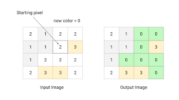
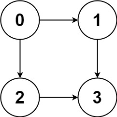
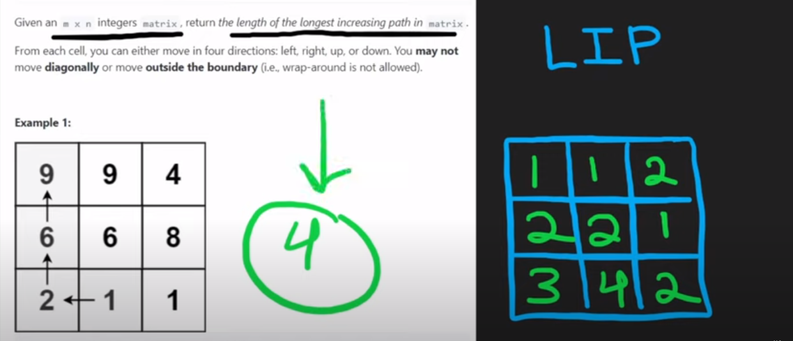

# INDEX

- [INDEX](#index)
  - [Notes](#notes)
  - [Flood Fill](#flood-fill)
  - [Number of islands](#number-of-islands)
  - [Max Area of Island](#max-area-of-island)
  - [Rotting Oranges](#rotting-oranges)
  - [Walls and Gates](#walls-and-gates)
  - [Sudoku Solver](#sudoku-solver)
  - [Time Needed to Inform All Employees](#time-needed-to-inform-all-employees)
  - [All Paths From Source to Target](#all-paths-from-source-to-target)
  - [Clone Graph](#clone-graph)
  - [Course Schedule](#course-schedule)
  - [Course Schedule II](#course-schedule-ii)
  - [Network Delay Time](#network-delay-time)
    - [Solution 1: `Dijkstra's Algorithm`](#solution-1-dijkstras-algorithm)
    - [Solution 2: `Bellman-Ford Algorithm` (SLOWER ❌)](#solution-2-bellman-ford-algorithm-slower-)
  - [Path with Maximum Probability](#path-with-maximum-probability)
  - [Redundant Connection](#redundant-connection)
  - [Accounts Merge](#accounts-merge)
  - [Sort Items by Groups Respecting Dependencies](#sort-items-by-groups-respecting-dependencies)
  - [Is Graph Bipartite?](#is-graph-bipartite)
  - [Find if Path Exists in Graph](#find-if-path-exists-in-graph)
  - [Check if There is a Valid Path in a Grid](#check-if-there-is-a-valid-path-in-a-grid)
  - [Shortest Path in Binary Matrix](#shortest-path-in-binary-matrix)
  - [Couples Holding Hands](#couples-holding-hands)
  - [Minimum Obstacle Removal to Reach Corner](#minimum-obstacle-removal-to-reach-corner)
  - [Trapping Rain Water II](#trapping-rain-water-ii)
  - [Longest Increasing Path in a Matrix](#longest-increasing-path-in-a-matrix)
  - [Circular Array Loop](#circular-array-loop)
  - [Escape a Large Maze](#escape-a-large-maze)

---

## Notes

- Usually when traversing 2D arrays, we use `DFS` or `BFS` or `sequential traversal`.
  - `DFS` is usually used when we want to visit all the nodes in the graph.
    - It's done by checking the `neighbors` of the current node and recursively calling the function on them.
  - `BFS` is usually used when we want to visit all the nodes in the graph **level by level**.
    - It's done by adding the current node to a `queue` and then looping through the `queue` and adding the `neighbors` of the current node to the `queue` and so on.
  - In both approaches, we need to:
    1. Keep track of the visited nodes to avoid infinite loops.
       - This can be done in 2 ways:
        1. Using a `visited` set.
        2. Modifying the grid by changing the value of the current node to `0` to mark it as visited.
    2. check if current node is bound or not (in the grid) by checking the `rows` and `columns` of the grid.

        ```py
        if (
          r not in range(ROWS) or
          c not in range(COLS) or
          (r, c) in visited
        ):
          return

        # Or
        if (
          r < 0 or r == ROWS or
          c < 0 or c == COLS or
          (r, c) in visited
        ):
          return
        ```

  - `Sequential traversal` is usually used when we want to visit all the nodes in the graph **sequentially**.
    - It's also called `ZigZag traversal`.
      
    - It's done by looping through the `rows` and `columns` of the grid and checking the `direction` of the traversal. if it's `up` or `down`.
      
      
    - We also need to check if the current node is bound or not (in the grid) by checking the `rows` and `columns` of the grid.

        ```py
        if (
          r not in range(ROWS) or
          c not in range(COLS)
        ):
          continue

        # Or
        if (
          r < 0 or r == ROWS or
          c < 0 or c == COLS
        ):
          continue
        ```

    - It doesn't need extra space to keep track of the visited nodes like `DFS` and `BFS`. because we are looping through the `rows` and `columns` of the grid sequentially.

---

## Flood Fill

An image is represented by an `m x n` integer grid `image` where `image[i][j]` represents the pixel value of the image.

You are also given three integers `sr`, `sc`, and `newColor`. You should perform a **flood fill** on the image starting from the pixel `image[sr][sc]`.

To perform a **flood fill**, consider the starting pixel, plus any pixels connected **4-directionally** to the starting pixel of the same color as the starting pixel, plus any pixels connected **4-directionally** to those pixels (also with the same color), and so on. Replace the color of all of the aforementioned pixels with `newColor`.

Return _the modified image after performing the flood fill_.

- Ex: `image = [[1,1,1],[1,1,0],[1,0,1]], sr = 1, sc = 1, newColor = 2`
  

  - Output: `[[2,2,2],[2,2,0],[2,0,1]]`


- Explanation:

  - From the center of the image `(sr, sc) = (1, 1)` (i.e., the red pixel), all pixels connected by a path of the same color as the starting pixel (i.e., the blue pixels) are colored with the new color.
    - Note the bottom corner is not colored 2, because it is not 4-directionally connected to the starting pixel.
  - Basically, we need to change the color of the current pixel and all the pixels that are connected to it (4-directionally) to the new color.
  - We can use **DFS** to solve this problem.
    - We start with the current pixel `(sr, sc)` and change its color to the new color.
    - Then we check the **horizontal/vertical** neighbors of the current pixel and if they have the same color as the current pixel, we change their color to the new color and do the same for their neighbors and so on.
      
    - We can use a `visited` set to keep track of the visited pixels to avoid infinite loops.
    - Base cases:
      
      - If the current pixel is not in the image (row/column out of bound), we return.
      - If the current pixel has a different color than the starting pixel, we return.
      - If the current pixel is already visited, we return.

- Time Complexity: `O(n.m)` -> `n` is the number of rows and `m` is the number of columns because in the worst case we will visit all the pixels in the image.
  
- Space Complexity: `O(n.m)` -> call stack + visited set
  

```py
class Solution:
    def floodFill(self, image: List[List[int]], sr: int, sc: int, newColor: int) -> List[List[int]]:
        ROWS, COLS = len(image), len(image[0])
        color = image[sr][sc]
        visit = set()

        def dfs(r, c):
            # Base case
            if (
              r not in range(ROWS) or
              c not in range(COLS) or
              image[r][c] != color or
              (r, c) in visit
            ):
                return

            visit.add((r, c)) # mark the current cell as visited
            image[r][c] = newColor # change the color of the current cell

            # check the neighbors (bottom, top, right, left)
            dfs(r + 1, c)
            dfs(r - 1, c)
            dfs(r, c + 1)
            dfs(r, c - 1)

        dfs(sr, sc)
        return image
```

---

## Number of islands

Given a 2D grid map of `'1'`s (land) and `'0'`s (water), count the number of islands. An island is surrounded by water and is formed by connecting adjacent lands horizontally or vertically. You may assume all four edges of the grid are all surrounded by water.


- EX: `numIslands(grid) --> 1`
  

- It can be solved using `BFS`, where we create layers of islands and keep track of the number of layers we have created.
  

  - We use `BFS` because we want to visit all the adjacent cells of the current cell **(neighbours)** before moving to the next cell in the `for loop`.

- **Solution 1:** -> `BFS` ✅

  - loop through the rows of the grid (i) and loop through the columns of the grid (j) and if the current cell is a `'1'`, increment the number of islands by 1 and call the helper function to mark the current island as visited
  - the bfs-helper-function (`bfs`) will mark the current cell as visited and then recursively call itself on the adjacent cells (up, down, left, right) that are `'1'`s
  - once the helper function is done, we return the number of islands
  - **Time Complexity:** `O(n.m)` = size of the grid -> `n` is the number of rows and `m` is the number of columns because in the worst case we will visit all the cells in the grid.
  - **Space Complexity:**
    - if using a stack: `O(n.m)` = size of the grid -> `n` is the number of rows and `m` is the number of columns because in the worst case we will visit all the cells in the grid.
    - if overriding array input: It's the maximum number of cells in the `queue` at the same time. which is the number of cells in the `diagonal` of the grid. -> `O(max(n, m))` = `O(n)` = number of rows

  ```py
  def numIslands(grid):
      ROWS, COLS = len(grid), len(grid[0])
      count = 0
      visit = set()

      def bfs(r, c):
          q = deque([(r, c)])
          directions = [(0, 1), (0, -1), (1, 0), (-1, 0)]

          while q:
              row, col = q.popleft()
              for dr, dc in directions:
                  nr, nc = row+dr, col+dc
                  if (
                      nr in range(ROWS) and
                      nc in range(COLS) and
                      (nr, nc) not in visit and
                      grid[nr][nc] == '1'
                  ):
                      visit.add((nr, nc))
                      bfs(nr, nc)

      for r in range(ROWS):
          for c in range(COLS):
              if grid[r][c] == '1' and (r, c) not in visit:
                  bfs(r, c)
                  count += 1

      return count
  ```

- Solution 2 -> `DFS`
  - Drawback here, is that space complexity will be `O(n.m)` = size of the grid -> `n` is the number of rows and `m` is the number of columns because in the worst case we will visit all the cells in the grid.
    - also this will happen if we didn't use a `visited` set to keep track of the visited cells. because we will keep calling the function on the same cell over and over again. and the `stack` will keep growing.

  ```py
  def numIslands(grid):
      # if the grid is empty, return 0
      if not grid:
          return 0

      # initialize number of islands to 0
      num_islands = 0
      # get dimensions of the grid
      rows, cols = len(grid), len(grid[0])
      # initialize set of visited islands to mark visited positions
      visited = set()

      # Helper BFS function to mark the current island as visited
      def dfs(r, c):
          if grid[r][c] != '1' or (r, c) in visited:
              return
          # mark the current cell as visited
          visited.add((r, c))
          # recursively call the helper function on the adjacent cells (up, down, left, right) that are '1's
          if r > 0:
              dfs(r - 1, c)
          if r < rows - 1:
              dfs(r + 1, c)
          if c > 0:
              dfs(r, c - 1)
          if c < cols - 1:
              dfs(r, c + 1)

      for r in range(rows):
          for c in range(cols):
              # if the current cell is a '1', increment the number of islands by 1
              # and call the helper function to mark the current island as visited
              if grid[r][c] == '1' and (r, c) not in visited:
                  dfs(r, c)
                  num_islands += 1

      return num_islands
  ```

- Solution 3: `Sequential traversal (BFS)` ✅
  - Time Complexity: `O(n.m)` = size of the grid -> `n` is the number of rows and `m` is the number of columns because in the worst case we will visit all the cells in the grid.
  - Space Complexity: `O(max(n, m))` = `O(n)` = number of rows (better than `DFS` and `BFS`)

  ```py
  def numIslands(grid):
      ROWS, COLS = len(grid), len(grid[0])
      count = 0

      for r in range(ROWS):
          for c in range(COLS):
              if grid[r][c] == '1':
                  count += 1
                  dfs(r, c)

      return count

  def dfs(r, c):
      if (
          r not in range(ROWS) or
          c not in range(COLS) or
          grid[r][c] != '1'
      ):
          return

      grid[r][c] = '0' # mark the current cell as visited

      dfs(r + 1, c)
      dfs(r - 1, c)
      dfs(r, c + 1)
      dfs(r, c - 1)
  ```

---

## Max Area of Island

You are given an `m x n` binary matrix `grid`. An island is a group of `1`'s (representing land) connected **4-directionally** (horizontal or vertical.) You may assume all four edges of the grid are surrounded by water.

The **area** of an island is the number of cells with a value `1` in the island.

Return _the maximum **area** of an island in `grid`_. If there is no island, return `0`.

- Ex: `grid = [[0,0,1,0,0,0,0,1,0,0,0,0,0],
[0,0,0,0,0,0,0,1,1,1,0,0,0],
[0,1,1,0,1,0,0,0,0,0,0,0,0],
[0,1,0,0,1,1,0,0,1,0,1,0,0],
[0,1,0,0,1,1,0,0,1,1,1,0,0],
[0,0,0,0,0,0,0,0,0,0,1,0,0],
[0,0,0,0,0,0,0,1,1,1,0,0,0],
[0,0,0,0,0,0,0,1,1,0,0,0,0]]`
  

  - Output: `6`
  - Explanation: The answer is not `11`, because the island must be connected 4-directionally.

- Time Complexity: `O(n.m)` = size of the grid -> `n` is the number of rows and `m` is the number of columns because in the worst case we will visit all the cells in the grid.

```py
class Solution:
    def maxAreaOfIsland(self, grid: List[List[int]]) -> int:
        ROWS, COLS = len(grid), len(grid[0])
        visit = set()

        def dfs(r, c):
            # Base case
            if (
              r < 0 or r == ROWS or
              c < 0 or c == COLS or
              grid[r][c] == 0 or
              (r, c) in visit
            ):
                return 0

            visit.add((r, c)) # mark the current cell as visited
            return (
              1 +
              dfs(r + 1, c) +
              dfs(r - 1, c) +
              dfs(r, c + 1) +
              dfs(r, c - 1)
            )

        max_area = 0
        for r in range(ROWS):
            for c in range(COLS):
                max_area = max(max_area, dfs(r, c))

        return max_area
```

- **Optimization:** if you don't want to use a `set`, You can ask the interviewer if you can modify the grid. If `yes`, you can change the value of the current cell to `0` to mark it as visited.

---

## Rotting Oranges

You are given an `m x n` grid `grid` where each cell can have one of three values:

- `0` representing an empty cell,
- `1` representing a fresh orange, or
- `2` representing a rotten orange.

Every minute, any fresh orange that is **4-directionally adjacent** to a rotten orange becomes rotten. Return _the minimum number of minutes that must elapse until no cell has a fresh orange_. If this is impossible, return `-1`.

- Ex: `grid = [[2,1,1],[1,1,0],[0,1,1]]`
  

  - Output: `4`
  - Explanation: The orange in the bottom left corner (row 2, column 0) is never rotten, because rotting only happens 4-directionally.

- Verify the constraints:
  - What do we return if it's not possible to rot all the oranges? -> `-1`
  
  - What do we return if we have no oranges? -> `0`
  - What do we return if we have no rotten oranges? -> `0`

- Explanation:

  - Here we can't use `DFS` because we need to know the time it takes for each orange to rot. as there may be multiple rotten oranges at the same time. which simultaneously rotting neibouring oranges.
  - So, we can use `BFS` to solve this problem. as it can simultaneously process all the nodes at the same level at the same time. -> **Multi source BFS**
    - Out sources will be the rotten oranges. which will be added to the `queue` at the beginning.
    - Then we add the neighboring oranges to the `queue` and mark them as rotten.
    - once we finish processing all the oranges in the **current level**, we increment the time by `1`.
    - once the queue is empty, we stop and return the time.
  - We also we need to store the `number of fresh oranges` in the grid. to know when to stop. if there are no fresh oranges left, we return the time. if there are still fresh oranges left, we return `-1`.

- Time and Space Complexity: `O(n.m)` = size of the grid

```py
class Solution:
    def orangesRotting(self, grid: List[List[int]]) -> int:
        ROWS, COLS = len(grid), len(grid[0])
        queue = deque()
        fresh_oranges = 0
        time = 0

        # Step 1). build the initial queue of rotten oranges and count the fresh oranges
        for r in range(ROWS):
            for c in range(COLS):
                # check if it's a rotten orange, then add it to the queue so that we can process it later
                if grid[r][c] == 2:
                    queue.append((r, c))
                # check if it's a fresh orange, then increment the number of fresh oranges
                elif grid[r][c] == 1:
                    fresh_oranges += 1

        directions = [(1, 0), (-1, 0), (0, 1), (0, -1)]

        while queue and fresh_oranges > 0:
            # process all the rotten oranges at the current level then increment the time by 1
            for _ in range(len(queue)):
                r, c = queue.popleft()

                for dr, dc in directions:
                    nr, nc = r + dr, c + dc
                    # check if is in bound or it's not a fresh orange
                    if (
                      nr < 0 or nr == ROWS or
                      nc < 0 or nc == COLS or
                      grid[nr][nc] != 1
                    ):
                        continue

                    # if it's a fresh orange, set it as rotten
                    grid[nr][nc] = 2
                    fresh_oranges -= 1
                    queue.append((nr, nc))

            # after this level, increment the time by 1
            time += 1

        return time if fresh_oranges == 0 else -1
```

---

## Walls and Gates

You are given an `m x n` grid `rooms` initialized with these three possible values.

1. `-1` A wall or an obstacle.
2. `0` A gate.
3. `INF` Infinity means an empty room. We use the value `2^31 - 1 = 2147483647` to represent `INF` as you may assume that the distance to a gate is less than `2147483647`.

Fill each empty room with the distance to its nearest gate. If it is impossible to reach a gate, it should be filled with `INF`.
  

- Ex: `rooms = [[INF,-1,0,INF],[INF,INF,INF,-1],[INF,-1,INF,-1],[0,-1,INF,INF]]`
  
  

  - Output: `[[3,-1,0,1],[2,2,1,-1],[1,-1,2,-1],[0,-1,3,4]]`

- Solution 1: `BFS`
  - Here, we should use `BFS` to solve this problem. because we need to visit all the cells in the grid **level by level** to know the distance of each cell from the gate.
  - We start by **adding all the gates to the `queue`** and mark them as `visited`.
  - Then we process all the cells in the `queue` and add their `neighbors` to the `queue` and mark them as `visited` and set their distance to the current cell + 1.
  - We also need to check if the current cell is a `wall` or not. if it's a `wall`, we skip it.

  ```py
  def wallsAndGates(rooms):
      ROWS, COLS = len(rooms), len(rooms[0])
      queue = deque()
      directions = [(1, 0), (-1, 0), (0, 1), (0, -1)]

      # Step 1). build the initial queue of gates
      for r in range(ROWS):
          for c in range(COLS):
              # check if it's a gate, then add it to the queue so that we can process it later
              if rooms[r][c] == 0:
                  queue.append((r, c))

      # Step 2). start the BFS traversal from all gates at the same time
      while queue:
          r, c = queue.popleft()

          for dr, dc in directions:
              nr, nc = r + dr, c + dc
              # check if is in bound or it's not an empty room (not infinity)
              if (
                nr < 0 or nr == ROWS or
                nc < 0 or nc == COLS or
                rooms[nr][nc] != 2147483647
              ):
                  continue

              # if it's an empty room, set its distance to the current cell + 1
              rooms[nr][nc] = rooms[r][c] + 1
              queue.append((nr, nc))
  ```

- Solution 2: `DFS`
  - Time complexity: `O(n.m)` = size of the grid
  - Space complexity: `O(n.m)` = size of the grid (in the `call stack`)

  ```py
  def wallsAndGates(rooms):
      ROWS, COLS = len(rooms), len(rooms[0])
      directions = [(1, 0), (-1, 0), (0, 1), (0, -1)]

      def dfs(r, c, distance):
          # Base case
          if (
            r < 0 or r == ROWS or
            c < 0 or c == COLS or
            rooms[r][c] < distance
          ):
              return

          rooms[r][c] = distance # set the distance of the current cell
          for dr, dc in directions:
              dfs(r + dr, c + dc, distance + 1)

      for r in range(ROWS):
          for c in range(COLS):
              if rooms[r][c] == 0:
                  dfs(r, c, 0)
  ```

---

## Sudoku Solver

Write a program to solve a Sudoku puzzle by filling the empty cells.

A sudoku solution must satisfy **all of the following rules**:

1. Each of the digits `1-9` must occur exactly once in each row.
2. Each of the digits `1-9` must occur exactly once in each column.
3. Each of the digits `1-9` must occur exactly once in each of the 9 `3x3` sub-boxes of the grid.
  

- The `9x9` board is initially partially filled with digits from `1-9` and empty cells. The empty cells are represented by the character `'.'`.

- Ex:
  

- Explanation:

  - We can use `backtracking` to solve this problem.
  - We start by looping through the rows and columns of the grid and if the current cell is empty, we try to fill it with a number from `1` to `9` and check if it's valid or not. if it's valid, we recursively call the function on the next cell. if it's not valid, we try another number.
    - We also need to check if the current cell is empty or not. if it's not empty, we skip it.
    
  - We also need to check if the current number is valid or not. we can do that by checking the current row, column and sub-box of the current cell.
    - we use **sub-box** to check if the current number is valid or not. because we need to check if the current number is valid in the current sub-box. which is a `3x3` box.
      
      - `subRow` = `(r // 3) * 3` -> `(4 // 3) * 3` -> `1 * 3` -> `3`
      - `subCol` = `(c // 3) * 3` -> `(4 // 3) * 3` -> `1 * 3` -> `3`

- Time Complexity: `O(9^(n.m))` -> `n` is the number of rows and `m` is the number of columns because in the worst case we will try all the numbers from `1` to `9` for each cell in the grid.

```py
class Solution:
    def solveSudoku(self, board: List[List[str]]) -> None:
        ROWS, COLS = len(board), len(board[0])
        digits = {'1', '2', '3', '4', '5', '6', '7', '8', '9'} # set of digits

        # Helper function
        def is_valid(r, c, num):
            # check if the current row is valid
            for col in range(COLS):
                if board[r][col] == num:
                    return False

            # check if the current column is valid
            for row in range(ROWS):
                if board[row][c] == num:
                    return False

            # check if the current sub-box is valid (3x3)
            sub_box_r = (r // 3) * 3
            sub_box_c = (c // 3) * 3 
            for row in range(sub_box_r, sub_box_r + 3):
                for col in range(sub_box_c, sub_box_c + 3):
                    if board[row][col] == num:
                        return False

            return True

        def backtrack(r, c):
            # Base case
            if r == ROWS or c == COLS:
                return True

            # if the current cell is not empty, skip it
            if board[r][c] != '.':
                nr = r + 1 if c == COLS - 1 else r # go to the next row if we reached the end of the current row
                nc = 0 if c == COLS - 1 else c + 1 # go to the first column if we reached the end of the current row
                return backtrack(nr, nc)

            # try to fill the current cell with a number from 1 to 9
            for num in digits:
                if is_valid(r, c, num):
                    board[r][c] = num
                    nr = r + 1 if c == COLS - 1 else r # go to the next row if we reached the end of the current row
                    nc = 0 if c == COLS - 1 else c + 1 # go to the first column if we reached the end of the current row
                    if backtrack(nr, nc):
                        return True
                    board[r][c] = '.' # reset the current cell

            return False

        backtrack(0, 0)
```

---

## Time Needed to Inform All Employees

A company has `n` employees with a unique ID for each employee from `0` to `n - 1`. The head of the company has is the one with `headID`.

Each employee has one direct manager given in the `manager` array where `manager[i]` is the direct manager of the `i-th` employee, `manager[headID] = -1`. Also, it is guaranteed that the subordination relationships have a tree structure.
  
  

The head of the company wants to inform all the employees of the company of an urgent piece of news. He will inform his direct subordinates, and they will inform their subordinates, and so on until all employees know about the urgent news.

The `i-th` employee needs `informTime[i]` minutes to inform all of his direct subordinates (i.e., After informTime[i] minutes, all his direct subordinates can start spreading the news).
  

Return _the number of minutes needed to inform all the employees about the urgent news_.

- Ex: `n = 6, headID = 2, manager = [2,2,-1,2,2,2], informTime = [0,0,1,0,0,0]`
  

  - Output: `1`
  - Explanation: The head of the company with id = 2 is the direct manager of all the employees in the company and needs 1 minute to inform them all.

- Verify the constraints:
  - is the graph directed or undirected? -> directed
  - is the graph acyclic or cyclic? (can employees have more than one manager?) -> acyclic (each employee has only one manager)
    - This is because the subordination relationships have a **tree** structure.
  - is the graph weighted or unweighted? -> weighted
  - is the graph connected or disconnected? -> connected

- Explanation:

  - This is a graph problem. where:
    - the `headID` is the `root` of the graph
    - the `manager` array is the `adjacency list` of the graph
    - the `informTime` array is the `weight` of the graph. which is the time needed to inform the current employee's subordinates.
  - We want to know the `max_time` needed to inform all the employees which is the `max_path` from the `root` to the `leaf` nodes.
  
  - We can use `DFS` to solve this problem:
    - We start from the `root` and keep going until we reach the `leaf` nodes.
    - We keep track of the `max_time` and update it whenever we reach a `leaf` node.
    - We also keep track of the `current_time` and update it whenever we reach a `leaf` node.
    - We return the `max_time` at the end.

```py
# DFS
def numOfMinutes(n, headID, manager, informTime):
    graph = defaultdict(list)
    # or: graph = [[] for _ in range(n)]

    # build the graph (adjacency list)
    for i, m in enumerate(manager):
        if m != -1:
            graph[m].append(i) # m is the manager of i

    def dfs(node, current_time):
        if not graph[node]:
            nonlocal max_time # if using python2, use: global max_time or max_time = [0]
            max_time = max(max_time, current_time)
            return

        for neighbor in graph[node]:
            dfs(neighbor, current_time + informTime[node])

    max_time = 0
    dfs(headID, 0)
    return max_time

# ----------------------------------------------------------------------------------------------

# BFS
def numOfMinutes(n, headID, manager, informTime):
    graph = defaultdict(list)

    # build the graph (adjacency list)
    for i, m in enumerate(manager):
        if m != -1:
            graph[m].append(i) # m is the manager of i

    queue = deque([(headID, 0)])
    max_time = 0

    while queue:
        node, current_time = queue.popleft()

        if not graph[node]:
            max_time = max(max_time, current_time)
            continue

        for neighbor in graph[node]:
            queue.append((neighbor, current_time + informTime[node]))

    return max_time
```

---

## All Paths From Source to Target

Given a directed acyclic graph (**DAG**) of `n` nodes labeled from `0` to `n - 1`, find all possible paths from node `0` to node `n - 1`, and return them in any order.

The graph is given as follows: `graph[i]` is a list of all nodes you can visit from node `i` (i.e., there is a directed edge from node `i` to node `graph[i][j]`).

- Ex: `graph = [[1,2],[3],[3],[]]`

  

  - Output: `[[0,1,3],[0,2,3]]`
  - Explanation: There are two paths: 0 -> 1 -> 3 and 0 -> 2 -> 3.

- Explanation:

  - > "Acyclic graph" means that there are no cycles in the graph. So we can't visit the same node twice. So we won't ge stuck in an infinite loop.
  - Here, in the input array:
    - index means the node
    - value means the neighbors of the node
    - So, node `0` has neighbors `1` and `2`
  - We can use `DFS` to solve this problem.
    
  - We start from node `0` and keep going until we reach node `n-1`
    - We keep track of the current `path` and add it to the result when we reach node `n-1`.

- **Solution 1:** `DFS` with backtracking

  - Time and Space Complexity: `O(2^n)` = number of nodes in the graph

  ```py
  def allPathsSourceTarget(graph):
      def dfs(node, path):
          # Base case
          if node == len(graph) - 1:
              result.append(path)
              return

          for neighbor in graph[node]:
              dfs(neighbor, path + [neighbor])

      result = []
      dfs(0, [0])
      return result
  ```

- **Solution 2:** `BFS`

  - We will use a `queue` to store the current `node` and the current `path`.
  - Time and Space Complexity: `O(2^n)` = number of nodes in the graph

  ```py
  def allPathsSourceTarget(graph):
      queue = deque([(0, [0])])
      result = []
      end = len(graph) - 1

      while queue:
          node, path = queue.popleft()

          if node == end:
              result.append(path)
              continue

          for neighbor in graph[node]:
              queue.append((neighbor, path + [neighbor]))

      return result
  ```

---

## Clone Graph

Given a reference of a node in a **connected** undirected graph. Return a **deep copy** (clone) of the graph.

- The clone should have the exact structure and values as the original graph.
  

- Explanation:

  - We will need to clone each node and also its neighbors **(recursively)**.
  - We will create a `HashMap` to keep track of the cloned nodes.
    - The key will be the original node, and the value will be the cloned node.
    - We will use this `HashMap` to check if we already cloned a node or not, so that we don't clone it again and just return the cloned node from the `HashMap`.
    - if a node is already cloned, then we make it double sided (pointing to each other).
      
  - We will use `DFS` to clone the graph.

    - This is because when adding the neighbors to the cloned node, we can't just add its neighbors, we need to clone them first.
    - And to do that we need to recursively use `DFS` to clone the neighbors of the neighbors and so on.

      ```py
      for neighbor in node.neighbors:
        clone.neighbors.append(dfs(neighbor))
      ```

    - To avoid creating duplicate nodes, we keep track of visited nodes using a `hashMap`. The `oldToNew` dictionary is used to map each original node to its corresponding copy in the new graph. The line `oldToNew[node] = clone` is executed before the `for` loop that iterates through the neighbors of the current node to ensure that we mark the current node as visited and create its copy **before recursively visiting its neighbors**.
      - This guarantees that we always return the same copy of a node if we encounter it again later in the traversal and create a proper deep copy of the original graph with no duplicate nodes.

- Time and Space Complexity: `O(V+E)` = `O(numCourses + prerequisites)` = `O(n)`
  - This is because we may visit all nodes (`V`) and edges (`E`) in the graph, because we need to create a clone for each one

```py
def cloneGraph(node):
    # Create a HashMap to keep track of the cloned nodes
    oldToNew = {}

    def dfs(node):
        # Check if the node is already cloned
        if node in oldToNew:
            return oldToNew[node] # Return the cloned node to double-side it

        # Create a clone for the node
        clone = Node(node.val, [])

        # Add the node to the HashMap
        oldToNew[node] = clone

        # Loop through the neighbors of the node
        for neighbor in node.neighbors:
            # Clone the neighbor and add it to the clone's neighbors
            clone.neighbors.append(dfs(neighbor))

        return clone

    return dfs(node) if node else None
```

---

## Course Schedule

There are a total of `numCourses` courses you have to take, labeled from `0` to `numCourses - 1`. You are given an array `prerequisites` where `prerequisites[i] = [ai, bi]` indicates that you must take course `bi` first if you want to take course `ai`.

For example, the pair `[0, 1]`, indicates that to take course `0` you have to first take course `1`. Return `true` if you can finish all courses. Otherwise, return `false`.

- Ex: `numCourses = 2, prerequisites = [[1,0]]`
  - Output: `true`
  - Explanation: There are a total of 2 courses to take. To take course 1 you should have finished course 0. So it is possible.
- Ex: `numCourses = 2, prerequisites = [[1,0],[0,1]]`

  - Output: `false`
  - Explanation: There are a total of 2 courses to take. To take course 1 you should have finished course 0, and to take course 0 you should also have finished course 1. So it is impossible.

- **Solution 1: `BFS / DFS`** (not the best solution ❌)

  - To check if we can take any course, we need to check if there is a **cycle** or not in the graph.
  - We create a graph from the prerequisites in the adjacency list format.
    - This is because we want to know if for each node, can we reach the end node or not (finish all courses).
      
    - We notice that our `base` cases are the nodes that don't have any prerequisites (no neighbours).
      - To keep track of these nodes, **we use a `HashMap` with adjacency list**.
        
  - Then we use `DFS` to check if there is a cycle or not.
    - we run it from `[0 : n-1]` nodes, and we check if we can reach the end node or not by running `DFS` on its prequisites in the `HashMap`.
      
    - To prevent running `DFS` on the same node twice, we remove its `value` from the `HashMap` after we run `DFS` on it and knowing that it can be completed **(because it now has no prerequisites)**, and then go back to the previous node and repeat the process.
      
    - if all nodes can be completed, then we return `true`
      
    - If there is a cycle, then we return `false`.
      
      
      - A cycle is detected using a `visited` set .
        

  - Time complexity: `O(V+E)` = `O(numCourses + prerequisites)` = `O(n)`
    - This is because we may visit all nodes (`V`) and edges (`E`) in the graph.
  - Space complexity: `O(n^2)` = `O(numCourses^2)`
    - This is because we may have a graph with `n` nodes and `n` edges.
    - the adjacency list will have `n` nodes and each node will have `n` edges.

  ```py
  def canFinish(numCourses, prerequisites):
      # Create a graph from the prerequisites (Adjacency List)
      preMap = {i: [] for i in range(numCourses)}
      # preMap = collections.defaultdict(list)
      for course, pre in prerequisites:
          preMap[course].append(pre)

      # Create a set to keep track of the visited nodes
      visited = set()

      def dfs(node):
          # Base case
          if node in visited:
              return False
          if preMap[node] == []:
              # means that the node has no prerequisites
              return True

          # 1. Add the node to the visited set
          visited.add(node)

          # 2. Loop through the prerequisites of the node
          for pre in preMap[node]:
              # Check if there is a cycle
              if not dfs(pre):
                  return False

          # 3. Remove the node from the visited set
          visited.remove(node)
          # 4. Remove the node from the graph map
          preMap[node] = []

          return True

      # we have to run dfs on all nodes to handle if the graph isn't connected so that we'd cover all nodes in the graph
      for node in range(numCourses):
          if dfs(node) == False:
              return False

      # Else
      return True

  # ----------------------------------------------------------------------------------------------

  # BFS
  def canFinish(numCourses, prerequisites):
      # Create a graph from the prerequisites (Adjacency List)
      preMap = {i: [] for i in range(numCourses)}
      # preMap = collections.defaultdict(list)
      for course, pre in prerequisites:
          preMap[course].append(pre)

      # Create a set to keep track of the visited nodes
      visited = set()

      # Create a queue to keep track of the nodes to visit
      queue = deque()

      for node in range(numCourses):
          if preMap[node] == []:
              # means that the node has no prerequisites
              queue.append(node)

      while queue:
          node = queue.popleft()

          if node in visited:
              return False

          visited.add(node)

          for pre in preMap[node]:
              queue.append(pre)

          preMap[node] = []

      # Else
      return True
  ```

- **Solution 2: `Topological Sort`** (better solution ✅)
  - This problem can also be solved using `Topological Sort` because we can use it to detect cycles in a graph (if there is a cycle, then we can't finish all courses).
  - First, we need to build the `indegre` array.
    - This is because we need to know which nodes have no prerequisites (no incoming edges).
      
    - We can do that by looping through the prerequisites and incrementing the `indegree` of the node by `1`.
      
  - Time and Space Complexity: `O(V+E)` = `O(numCourses + prerequisites)` = `O(n)`
    - This is because we may visit all nodes (`V`) and edges (`E`) in the graph.
  - Space complexity: `O(n^2)` = `O(numCourses^2)`
    - This is because we may have a graph with `n` nodes and `n` edges.
    - the adjacency list will have `n` nodes and each node will have `n` edges.
  
  ```py
  def canFinish(numCourses, prerequisites):
      # Create a graph from the prerequisites (Adjacency List) & an indegree array
      preMap = [[] for _ in range(numCourses)]
      indegree = [0] * numCourses
      for course, pre in prerequisites:
          indegree[pre] += 1
          preMap[course].append(pre)

      # Create a stack to keep track of the nodes to visit
      stack = []

      for node in range(numCourses):
          if indegree[node] == 0:
              stack.append(node)

      # Create a set to keep track of the visited nodes
      count = 0 # or use a set() and check if len(set) == numCourses

      while stack:
          node = stack.pop()
          count += 1 # increment the count of visited nodes

          # Loop through the prerequisites of the node and decrement their indegree by 1 and add them to the stack if their indegree is 0
          for pre in preMap[node]:
              indegree[pre] -= 1
              if indegree[pre] == 0:
                  stack.append(pre)

      return count == numCourses
  ```

---

## Course Schedule II

Same as above, but return the order of the courses to take.

- Ex: `numCourses = 2, prerequisites = [[1,0]]`

  - Output: `[0,1]`
  - Explanation: There are a total of 2 courses to take. To take course 1 you should have finished course 0. So the correct course order is `[0,1]`.

- Explanation:

  - We use the same approach as above, with a preMap to create a graph from the prerequisites.
    
  - We use `DFS` to check if there is a cycle or not.
    - we run it from `[0 : n-1]` nodes, and we check if we can reach the end node or not by running `DFS` on its prequisites in the `HashMap`.
      
    - To prevent running `DFS` on the same node twice, we remove it from the `HashMap` after we run `DFS` on it and knowing that it can be completed, and then go back to the previous node and repeat the process.
      
      
      
    - if all nodes can be completed, then we return `true`
      
    - If there is a cycle, then we return `false`.
      - A cycle is detected using a `visited` set .

- Time and Space Complexity: `O(V+E)` = `O(numCourses + prerequisites)`
  - This is because we may visit all nodes (`V`) and edges (`E`) in the graph.

```py
def findOrder(numCourses, prerequisites):
    # Create a graph from the prerequisites (Adjacency List)
    preMap = {course: [] for course in range(numCourses)}
    for course, pre in prerequisites:
        preMap[course].append(pre)

    # Create sets to keep track of the visited nodes and potential cycles
    visited, cycleSet = set(), set()

    # Create a output to keep track of the order of the courses
    output = []

    def dfs(node):
        # Base case
        if node in cycle:
            return False # because there is a cycle
        if node in visited:
            return True # so that we don't stop the algotithm

        # Add the node to the cycle set
        cycleSet.add(node)

        # Loop through the prerequisites of the node
        for pre in preMap[node]:
            # Check if there is a cycle
            if not dfs(pre):
                return False # Terminate the algorithm

        # Remove the node from the cycle set
        cycleSet.remove(node)

        # Finally add the node to the visited set
        visited.add(node)

        # Add the node to the output after visiting all its prerequisites
        output.append(node)
        return True

    for course in range(numCourses):
        if dfs(course) == False:
            return []

    # Else
    return output
```

---

## Network Delay Time

You are given a network of `n` nodes, labeled from `1` to `n`. You are also given `times`, a list of travel times as directed edges `times[i] = (ui, vi, wi)`, where `ui` is the source node, `vi` is the target node, and `wi` is the time it takes for a signal to travel from source to target.

We will send a signal from a given node `k`. Return the time it takes for all the `n` nodes to receive the signal. If it is impossible for all the `n` nodes to receive the signal, return `-1`.

- Ex: `times = [[2,1,1],[2,3,1],[3,4,1]], n = 4, k = 2`
  

  - Output: `2`
  - Explanation: The signal will take 1 minute to travel from node 2 to node 1, and 1 minute to travel from node 2 to node 3.
    - Then, it will take 1 minute for all the nodes to receive the signal.

- Verify the constraints:
  - is the graph connected or disconnected? -> It can be disconnected, so account for that
  - is the graph weighted or unweighted? -> weighted
    - can the weights be negative? -> no (because it's a time)

### Solution 1: `Dijkstra's Algorithm`

- We use `Dijkstra's Algorithm` to find the shortest path from the source node to all other nodes.
- This is also a `BFS` algorithm, but we use a `Priority Queue` to keep track of the shortest path.
  - `BFS` because we will go through the neighbors of the source node first, then the neighbors of the neighbors, and so on. -> **Layer by Layer**
      
  - Here, we will use a `minHeap` to keep track of the shortest path.
    - It's logical to search the node with shortest distance, So we will use the `min heap` to pop the node with the shortest distance from the source node and add its neighbors to the `Priority Queue` with their distance from the source node.
        
    - > So the `minHeap` tells us which node to visit next by popping the **node with the shortest distance from the source node**. For example in the picture below, we have 2 paths from node `1`, and the `minHeap` will give us the path with the shortest distance from the source node. `(path 1)` > 
- Starting at the source node `k`, we loop through its neighbors and add them to the `Priority Queue` with their distance from the source node.
    
    

- Time complexity: `O(ElogV)`
  - `E` is the number of edges
  - `V` is the number of vertices

```py
def networkDelayTime(times, n, k):
    # Create a graph from the times (Adjacency List)
    graph = collections.defaultdict(list)
    for u, v, w in times:
        graph[u].append((v, w))

    # Create a minHeap to keep track of the shortest path
    minHeap = [(0, k)] # (path-distance, node) -> we start with the given node k

    visit = set()
    res = 0

    while minHeap:
      # get the node with the shortest distance from the source node
      w1, n1 = heapq.heappop(minHeap) # w: weight, n: node

      if n1 not in visit:
        visit.add(n1)
        res = max(res, w1) # max because we want the path to the farthest node (n-1) which indicate the biggest delay time

        # Loop through the neighbors of the node
        for n2, w2 in graph[n1]:
          heapq.heappush(minHeap, (w1 + w2, n2))

    return res if len(visit) == n else -1 # if len(visit) != n, then there is a node that we didn't visit
```

### Solution 2: `Bellman-Ford Algorithm` (SLOWER ❌)

- We use `Bellman-Ford Algorithm` to find the shortest path from the source node to all other nodes. **(If there is a negative weight in the graph)**
- We will use `Dynamic Programming` in the algorithm

```py
def networkDelayTime(times, n, k):
    # Create a dist array to keep track of the shortest distance from the source node to all other nodes
    dist = [float('inf')] * (n + 1) # +1 because the nodes are labeled from 1 to n
    dist[k] = 0 # the distance from the source node to itself is 0

    # Loop through the nodes
    for _ in range(n):
        # Loop through the edges
        for u, v, w in times:
            # Relax the edges (update the shortest distance)
            if dist[u] + w < dist[v]:
                dist[v] = dist[u] + w

    # Check for negative cycles
    for u, v, w in times:
        if dist[u] + w < dist[v]:
            return -1 # there is a negative cycle

    # Else return the max distance
    return -1 if max(dist[1:]) == float('inf') else max(dist[1:]) # we start from 1 because the nodes are labeled from 1 to n
```

---

## Path with Maximum Probability

You are given an undirected weighted graph of `n` nodes `(0-indexed)`, represented by an edge list where `edges[i] = [a, b]` is an undirected edge connecting the nodes `a` and `b` with a probability of success of traversing that edge `succProb[i]`.

Given two nodes `start` and `end`, find the path with the maximum probability of success to go from `start` to `end` and return its success probability.

If there is no path from `start` to `end`, return `0`.

- Ex: `n = 3, edges = [[0,1],[1,2],[0,2]], succProb = [0.5,0.5,0.2], start = 0, end = 2`

  

  - Output: `0.25`
  - Explanation: There are two paths from start to end, one having a probability of success = 0.2 and the other has 0.5 \* 0.5 = 0.25.

- Explanation:

  - Here, we want to find the path with the maximum probability of success to go from `start` to `end`. So we can use `Dijkstra's Algorithm` to find the shortest path from `start` to `end`, but instead of keeping track of the shortest path, we keep track of the path with the maximum probability of success aka "longest path".
  - We will use a `Priority Queue` to keep track of the path with the maximum probability of success.
    - Here we will usre a `max heap` to keep track of the path with the maximum probability of success.
      - we will use the `max heap` to pop the node with the maximum probability of success from the source node and add its neighbors to the `Priority Queue` with their probability of success.
        
        
    - Python doesn't have a `max heap`, so we will use a `min heap` and multiply the probability of success by `-1` to get the maximum probability of success.
      - `heapq.heappush(minHeap, (-1 * w1 * w2, n2))`
      - `heapq.heappop(minHeap)[0] * -1`

- Time complexity: `O(E.log(V))`
  - `E` is the number of edges (from generating the adjacency list), `V` is the number of vertices (`log(V)` because we use a `Priority Queue`)

```py
def maxProbability(n, edges, succProb, start, end):
    # Create a graph from the edges
    graph = collections.defaultdict(list)
    for i in range(len(edges)):
        src, dst = edges[i]
        # Add the probability of success to the graph to the 2 sides of the edge
        graph[src].append((dst, succProb[i]))
        graph[dst].append((src, succProb[i]))


    # Create a max heap to keep track of the path with the maximum probability of success
    minHeap = [(-1, start)] # (path-probability, node)

    visit = set()

    while minHeap:
      prob, cur = heapq.heappop(minHeap)
      visit.add(cur)

      if cur == end:
        return prob * -1

      for nei, edgeProb in graph[cur]:
        if nei not in visit:
          heapq.heappush(minHeap, (prob * edgeProb, nei))

    # If there is no path from start to end
    return 0
```

---

## Redundant Connection

In this problem, a tree is an undirected graph that is connected and has no cycles.

You are given a graph that started as a tree with `n` nodes labeled from `1` to `n`, with one additional edge added. The added edge has two different vertices chosen from `1` to `n`, and was not an edge that already existed. The graph is represented as an array `edges` of length `n` where `edges[i] = [ai, bi]` indicates that there is an edge between nodes `ai` and `bi` in the graph.

Return an edge that can be removed so that the resulting graph is a tree of `n` nodes. If there are multiple answers, return the answer that occurs last in the input.

- Ex: `edges = [[1,2],[1,3],[2,3]]`

  

  - Output: `[2,3]`


- Explanation:

  - The problem is called "Redundant Connection" because we want to find the edge that is `redundant` aka the edge that we can remove to make the graph a tree.
  - We want to know what edge we can remove to make the graph a tree **(no cycles)**.
  - We can use **Union Find** to find the redundant connection.
    - This is because we know that a tree is an undirected graph that is **connected** and has no cycles.
    - So if we find a cycle in the graph, then we know that the edge that created the cycle is the **redundant connection**.
    - `union find` algo will be used in 2 steps:
      1. `union` the nodes together if they don't have the same parent -> **no cycle**
         
      2. `find` the parent of each node and check if the parent of the 2 nodes are the same -> **cycle**

- Solution 1: Union Find ✅

  - explanation in solution 2
  - Time complexity: `O(nlogn)`

  ```py
  class UnionFind:
    def __init__(self, n):
        self.par = [i for i in range(n)]

    def find(self, x):
        p = self.par[x]
        while p != self.par[p]:
            p = self.par[p]
        return p

    def union(self, x1, x2):
        p1, p2 = self.find(x1), self.find(x2)
        self.par[p1] = p2 # make the parent of node1 the parent of node2

  class Solution:
    def findRedundantConnection(self, edges: List[List[int]]) -> List[int]:
        uf = UnionFind(len(edges) + 1) # +1 because the nodes are 1-indexed
        for node1, node2 in edges:
            # If the parent of the 2 nodes are the same, then we found a cycle and this is the redundant connection
            if uf.find(node1) == uf.find(node2):
                return [node1, node2]
            # else, union the nodes together to make a tree
            uf.union(node1, node2)
  ```

- Solution 1: Union Find by **rank**

  - Time complexity: `O(nlogn)`
  - Steps:
    1. We start with nodes that are not connected to any other nodes, and the rank of each node is `1` -> size of the starting tree.
       
    2. we will go through each edge and `union` (connecting) the nodes together in the shape of a `tree` if they don't have the same parent.
       - If the parent of the 2 nodes are the same, then we found a cycle.
       - If the parent of the 2 nodes are not the same, then we `union` the nodes together and update:
         - the rank of the parent node as the size of the tree will increase by `1`.
           
         - The parent of the node1 as the parent of the `node2`.
           
    3. repeat step 2 until we find a cycle in the graph.
       
       

  ```py
  def findRedundantConnection(edges):
      # Create a parent array to keep track of the parent of each node
      parent = [i for i in range(len(edges) + 1)]
      # Create a rank array to keep track of the rank of each node
      rank = [1 for i in range(len(edges) + 1)]

      def find(node):
          p = parent[node] # going up the parent of the node
          # If the parent of the node is itself, then we found the Top parent
          while p != parent[p]:
              parent[p] = parent[parent[p]] # path compression to make the tree flat -> O(logn)
              p = parent[p]
          return p

      # Union the nodes together if they don't have the same parent
      def union(node1, node2):
          p1, p2 = find(node1), find(node2)

          # If the parent of the 2 nodes are the same, then we found a cycle
          if p1 == p2:
              return False

          # check the rank of the 2 nodes to see which one is the parent and update the rank of the parent
          if rank[p1] > rank[p2]:
              parent[p2] = p1
              rank[p1] += rank[p2]
          else:
              parent[p1] = p2
              rank[p2] += rank[p1]

          return True

      for node1, node2 in edges:
          # If the parent of the 2 nodes are the same, then we found a cycle
          if not union(node1, node2):
              return [node1, node2]
  ```

---

## Accounts Merge

problem: [Here](https://leetcode.com/problems/accounts-merge/)

- Explanation:

  - first string will be the `name` of the account, and the rest of the strings will be the `emails` of the account.
    - The problem is that they might be multiple accounts that belong to the same person (same name), and we want to merge them together.
    - We will know that 2 accounts belong to the same person if they have at least 1 email in common.
  - So eventually, we want to merge (union) all the accounts that belong to the same person together, and return the result in the form of a list of lists.
  - So this is a **Graph** problem and can be solved using `union find`.
    - After connecting all the nodes together, we will have a graph that looks like this:
      
    - We will go through each node and do a `DFS` to find all the nodes that belong to the same person and append them to a list.
    - We will also keep track of the emails that we have visited so that we don't visit the same email twice.
    - We will also sort the emails in the list so that we can return the result in the correct order.

- Time and space complexity:

  - Time: `O(nlogn)` where `n` is the number of accounts
  - Space: `O(n)`

- Solution 1: without Rank ✅

  ```py
  class UnionFind:
    def __init__(self, n):
        self.par = [i for i in range(n)]

    def find(self, x):
        p = self.par[x]
        while p != self.par[p]:
            p = self.par[p]
        return p

    def union(self, x1, x2):
        p1, p2 = self.find(x1), self.find(x2)
        self.par[p1] = p2 # make the parent of node1 the parent of node2

  class Solution:
    def accountsMerge(self, accounts: List[List[str]]) -> List[List[str]]:
        uf = UnionFind(len(accounts))
        emailToAcc = {} # email -> index of acc

        # 1. Loop through the accounts and union the accounts that have the same email
        for i, acc in enumerate(accounts):
            # Loop through the emails of the account and union them together if they don't have the same parent
            for email in acc[1:]:
                if email in emailToAcc:
                    uf.union(i, emailToAcc[email])
                else:
                    emailToAcc[email] = i # add the email to the emailToAcc map

        # 2. Loop through the accounts and group the emails of the same account together (same parent)
        emailGroup = defaultdict(list) # index of acc -> list of emails
        for email, i in emailToAcc.items():
            p = uf.find(i)
            emailGroup[p].append(email) # add the email to the emailGroup map

        # 3. Loop through the emailGroup and return the result
        res = []
        for i, emails in emailGroup.items():
            name = accounts[i][0]
            res.append([name] + sorted(emails)) # array concat
        return res
  ```

- Solution 2: with Rank

  ```py
  class UnionFind:
    def __init__(self, n):
        self.par = [i for i in range(n)]
        self.rank = [1] * n

    def find(self, x):
        while x != self.par[x]:
            self.par[x] = self.par[self.par[x]]
            x = self.par[x]
        return x

    def union(self, x1, x2):
        p1, p2 = self.find(x1), self.find(x2)
        if p1 == p2:
            return False
        if self.rank[p1] > self.rank[p2]:
            self.par[p2] = p1
            self.rank[p1] += self.rank[p2]
        else:
            self.par[p1] = p2
            self.rank[p2] += self.rank[p1]
        return True

  class Solution:
    def accountsMerge(self, accounts: List[List[str]]) -> List[List[str]]:
        uf = UnionFind(len(accounts))
        emailToAcc = {} # email -> index of acc

        for i, a in enumerate(accounts):
            for e in a[1:]:
                if e in emailToAcc:
                    uf.union(i, emailToAcc[e])
                else:
                    emailToAcc[e] = i

        emailGroup = defaultdict(list) # index of acc -> list of emails
        for e, i in emailToAcc.items():
            leader = uf.find(i)
            emailGroup[leader].append(e)

        res = []
        for i, emails in emailGroup.items():
            name = accounts[i][0]
            res.append([name] + sorted(emailGroup[i])) # array concat
        return res
  ```

---

## Sort Items by Groups Respecting Dependencies

problem: [Here](https://leetcode.com/problems/sort-items-by-groups-respecting-dependencies/)

- Explanation:

  - At first glance it is clear that this is a **topological sorting** problem, but its difficulty rise from the fact that there is **grouping**, thus we need to think about dependancies between the nodes(items) in each group and between groups as a whole.
  - We start by creating a new representation for the groups using dictionaries where each `groups[groupId]` is a set of all nodes with `id == groupId`, and we create a new group for each node that is not in any group.
    - We can think of it as **adjacency list** for the groups.
    - > So we need to do Typological sort for the groups and for the items inside each group.
  - Then we find the dependencies within each `group` and between `groups`.
    - to know if a group comes before another group, we need to know if all the items in the first group come before all the items in the second group.
      
  - lastly we sort each group by it self using the depenancies between the nodes inside a group, and the groups by their `id` using the (between groups depencancy) topologically and merge the results.

> So mainly, **we need to do Typological sort for the groups and for the items inside each group**.

- Time and space complexity:

  - Time: `O(n + m)` where `n` is the number of items and `m` is the number of dependencies.
  - Space: `O(n + m)`

```py
def sortItems(n, m, group, beforeItems):
    # Helper function: returns topological order of a graph, if it exists
    def getTopOrder(graph, indegree):
        """
        graph: adjacency list
        indegree: array of indegree of each node
        """
        # Create a queue to keep track of the nodes with indegree = 0
        queue = deque()
        for node in range(len(indegree)):
            if indegree[node] == 0:
                queue.append(node)

        # Create a list to keep track of the topological order
        topOrder = []
        while queue:
            node = queue.popleft()
            topOrder.append(node)
            for nei in graph[node]:
                # decrement the indegree of the neighbor so that we know that we visited it
                indegree[nei] -= 1
                # If the indegree of the neighbor is 0, then add it to the queue to visit it later
                if indegree[nei] == 0:
                    queue.append(nei)

        # If there is a cycle, then return an empty list
        return topOrder if len(topOrder) == len(indegree) else []

    # STEP 1: Create a new group for each item that belongs to no group
    for i in range(n):
        if group[i] == -1:
            group[i] = m
            m += 1 # increment the number of groups

    # STEP 2: Create a graph for the groups and the items inside each group
    groupGraph = [[] for _ in range(m)]
    groupIndegree = [0] * m

    itemGraph = [[] for _ in range(n)]
    itemIndegree = [0] * n

    # Loop through the items and their prerequisites to create the graph
    for item in range(n):
        curGroup = group[item]
        for pre in beforeItems[item]:
            preGroup = group[pre]
            # If the item and its prerequisite are in the same group, then add them to the itemGraph
            if preGroup == curGroup:
                itemGraph[pre].append(item)
                itemIndegree[item] += 1
            # If the item and its prerequisite are in different groups, then add them to the groupGraph
            else:
                groupGraph[preGroup].append(curGroup)
                groupIndegree[curGroup] += 1

    # STEP 3: Find the topological order of the groups &  the items inside each group
    groupOrder = getTopOrder(groupGraph, groupIndegree)
    itemOrders = getTopOrder(itemGraph, itemIndegree)
    if not groupOrder or not itemOrders:
        return []

    # STEP 4: Find the topological order of the items inside each group
    # Create a map to keep track of the items inside each group
    groupToItems = defaultdict(list)
    for item in range(n):
        groupToItems[group[item]].append(item)

    # STEP 5: Merge the results
    res = []
    for groupId in groupOrder:
        res += groupToItems[groupId]
    return res
```

---

## Is Graph Bipartite?

problem: [Here](https://leetcode.com/problems/is-graph-bipartite/)

return `true` if and only if it is bipartite.

- Explanation:

  - > A **bipartite graph** is a graph that can be colored such that no two adjacent nodes share a color. The algorithm for coloring and checking this graph is pretty straightforward. We start at some arbitrary source node, assign it a color and then assign each of this neighbours the opposite of that color. We continue this process for each node we see in the graph, returning false if we ever find a neighbour that is already colored the same as the current node.
    > 
  - We can use `BFS` to check if the graph is bipartite or not.
    - We will use a `color` array to keep track of the color of each node. (2 groups `red` and `blue`)
      - `color[i] = 0` -> not colored yet
      - `color[i] = 1` -> color 1 (red)
      - `color[i] = -1` -> color 2 (blue)
    - We will use a `queue` to keep track of the nodes that we need to visit.
    - We will start by coloring the first node with `color = 1` and add it to the queue.
    - Then we will loop through the queue and color the neighbors of the current node **with the opposite color** and add them to the queue.
      - If we find a neighbor that has the same color as the current node, then the graph is not bipartite.
      - If we can color all the nodes without finding a neighbor with the same color, then the graph is bipartite.

```py
def isBipartite(graph: List[List[int]]) -> bool:
    n = len(graph)
    colors = [0] * n

    for i in range(n):
        if colors[i] == 0:
            colors[i] = 1 # color 1 (red)
            queue = deque([i])
            while queue:
                node = queue.popleft()
                for nei in graph[node]:
                    # If the neighbor is not colored yet, color it with the opposite color and add it to the queue
                    if colors[nei] == 0:
                        colors[nei] = -colors[node]
                        queue.append(nei)
                    # If the neighbor has the same color as the current node, then the graph is not bipartite
                    elif colors[nei] == colors[node]:
                        return False
    return True
```

---

## Find if Path Exists in Graph

problem: [Here](https://leetcode.com/problems/find-if-path-exists-in-graph/description/)

- BFS

  ```py
  def validPath(n: int, edges: List[List[int]], start: int, end: int) -> bool:
      graph = defaultdict(list)
      for u, v in edges:
          graph[u].append(v)
          graph[v].append(u)

      visited = set()
      queue = deque([start])
      while queue:
          node = queue.popleft()
          if node == end:
              return True
          if node in visited:
              continue
          visited.add(node)
          for nei in graph[node]:
              queue.append(nei)
      return False
  ```

- DFS

  ```py
  def validPath(n: int, edges: List[List[int]], start: int, end: int) -> bool:
      graph = defaultdict(list)
      for u, v in edges:
          graph[u].append(v)
          graph[v].append(u)

      visited = set()
      def dfs(node):
          if node == end:
              return True
          if node in visited:
              return False
          visited.add(node)
          for nei in graph[node]:
              if dfs(nei):
                  return True
          return False

      return dfs(start)
  ```

---

## Check if There is a Valid Path in a Grid

problem: [Here](https://leetcode.com/problems/check-if-there-is-a-valid-path-in-a-grid/)

- Explanation:

  - The idea is to use a `directions` dictionary to store the possible directions for each type of street.
  - Then we will use `DFS` to traverse the grid and check if we can reach the bottom right cell.

- Time and space complexity: `O(m * n)`

```py
def hasValidPath(grid: List[List[int]]) -> bool:
    ROWS, COLS = len(grid), len(grid[0])
    directions = {
        1: [(0, -1), (0, 1)],
        2: [(-1, 0), (1, 0)],
        3: [(0, -1), (1, 0)],
        4: [(0, 1), (1, 0)],
        5: [(0, -1), (-1, 0)],
        6: [(0, 1), (-1, 0)]
    }

    # Backtracking
    def dfs(r, c):
        # If we reach the bottom right square, it means we've found a path
        if r == ROWS - 1 and c == COLS - 1:
            return True
        # If we reach a square that has been visited or is a wall, we can't move forward
        if grid[r][c] == -1:
            return False
        # Mark the current square as visited
        oldVal = grid[r][c]
        grid[r][c] = -1

        # Try to move in each direction
        for dr, dc in directions[oldVal]:
            nr, nc = r + dr, c + dc
            # If we can move in a direction, return True if we can reach the bottom right square from there
            if 0 <= nr < ROWS and 0 <= nc < COLS and grid[nr][nc] != -1:
                # negative dr and dc because we are going backwards in the path
                if (-dr, -dc) in directions[grid[nr][nc]]:
                    if dfs(nr, nc):
                        return True
        # Backtrack
        return False

    return dfs(0, 0)
```

---

## Shortest Path in Binary Matrix

problem: [Here](https://leetcode.com/problems/shortest-path-in-binary-matrix/)

- Explanation:
  - As this is a shortest path problem, we can use `BFS` to find the shortest path from the top left cell to the bottom right cell.
  - We use `BFS` beacuse we want to go through the neighbors of the current cell first, then the neighbors of the neighbors, and so on. -> **Layer by Layer**
    - the first time we will reach the bottom right cell, we will have the shortest path **(FASTEST)**.
  - The trick here, that we can move in **8 directions** not just **4**, so we will use a `directions` array to store the possible directions.
    - possible directions:
      
      - `(0, 1)` -> right
      - `(0, -1)` -> left
      - `(1, 0)` -> down
      - `(-1, 0)` -> up
      - `(1, 1)` -> down right
      - `(1, -1)` -> down left
      - `(-1, 1)` -> up right
      - `(-1, -1)` -> up left

```py
def shortestPathBinaryMatrix(grid: List[List[int]]) -> int:
    N = len(grid)
    q = deque([(0, 0, 1)]) # (row, col, path length)
    visit = set((0, 0))
    directions = [(0, 1), (0, -1), (1, 0), (-1, 0), (1, 1), (1, -1), (-1, 1), (-1, -1)]

    while q:
        r, c, pathLen = q.popleft()
        # Check if we can/can't move in the current direction
        if min(r, c) < 0 or max(r, c) >= N or grid[r][c] == 1:
            continue
        # Check if we reached the bottom right cell (VALID PATH)
        if r == N - 1 and c == N - 1:
            return pathLen
        # Try to move in each direction
        for dr, dc in directions:
            nr, nc = r + dr, c + dc
            if 0 <= nr < N and 0 <= nc < N and grid[nr][nc] == 0 and (nr, nc) not in visit:
                visit.add((nr, nc))
                q.append((nr, nc, pathLen + 1))

    return -1
```

---

## Couples Holding Hands

There are `n` couples sitting in `2n` seats arranged in a row and want to hold hands. The people and seats are represented by an integer array `row` where `row[i]` is the ID of the person sitting in the `i`th seat. The couples are numbered in order, the first couple being `(0, 1)`, the second couple being `(2, 3)`, and so on with the last couple being `(2n - 2, 2n - 1)`.

Return the minimum number of swaps so that every couple is sitting side by side. A swap consists of choosing any two people, then they stand up and switch seats.

- Ex:

  - Input: row = [0, 2, 1, 3]
  - Output: 1
  - Explanation: We only need to swap the second (row[1]) and third (row[2]) person.

- Explanation:

  - The idea is to use a `couples` dictionary to store the index of each couple. Then we will iterate over the array and for each couple we will check if they are sitting side by side, if not we will swap the current person with the person sitting next to their partner.
  - This is a Graph problem, we can also solve it using `DFS` or `BFS`. We will create a graph where each node is a person and each edge is a couple, then we will count the number of connected components.
  - Time and space complexity: `O(n)`, where `n` is the number of couples.

- Look at this explanation: [https://medium.com/@jolyon129/765-couples-holding-hands-a9ce4d50b25e](https://medium.com/@jolyon129/765-couples-holding-hands-a9ce4d50b25e)

- Solution 1: `Greedy`

  ```py
  def minSwapsCouples(row: List[int]) -> int:
      swaps = 0
      couples = {}
      for i, person in enumerate(row):
          couples[person] = i

      # Iterate over the array by pairs
      for i in range(0, len(row), 2):
          # Get the partner of the current person using XOR
          partner = row[i] ^ 1 # XOR
          if row[i + 1] != partner:
              swaps += 1

              # Swap the current person with the person sitting next to their partner
              row[couples[partner]], row[i + 1] = row[i + 1], row[couples[partner]]

              # Update the index of the partner
              couples[row[couples[partner]]] = couples[partner]
              couples[partner] = i + 1
      return swaps
  ```

- Solution 2: `Union-Find`

  ```py
  class UnionFind:
      def __init__(self, n):
          self.parent = list(range(n))
          self.count = n # Number of connected components

      def find(self, x):
          if self.parent[x] != x:
              self.parent[x] = self.find(self.parent[x])
          return self.parent[x]

      def union(self, x, y):
          px, py = self.find(x), self.find(y)
          if px != py:
              self.parent[px] = py
              self.count -= 1 # Decrease the number of connected components

  def minSwapsCouples(row: List[int]) -> int:
      n = len(row) // 2
      uf = UnionFind(n)
      for i in range(0, len(row), 2):
          uf.union(row[i] // 2, row[i + 1] // 2)
      return n - uf.count
  ```

---

## Minimum Obstacle Removal to Reach Corner

Problem: [Here](https://leetcode.com/problems/minimum-obstacle-removal-to-reach-corner/)

- Explanation:

  - This can be solved using `Dijsktra` algorithm or `BFS`.

- Solution 1: `BFS`

  ```py
  def minimumEffortPath(heights: List[List[int]]) -> int:
      rows = len(grid)
      cols = len(grid[0])
      dist = [[1] * cols for _ in range(rows)]
      dist[0][0] = 0
      dq = deque([(0, 0, 0)])
      directions = [[0,1],[0,-1],[1,0],[-1,0]]

      while dq:
          count, r, c = dq.popleft()
          for dr, dc in directions:
              row = r + dr
              col = c + dc
              if 0 <= row < rows and 0 <= col < cols and dist[row][col] == 1:
                  if grid[row][col] == 1:
                      dist[row][col] = count + 1
                      dq.append((count + 1, row, col))
                  else:
                      dist[row][col] = count
                      dq.appendleft((count, row, col))
      return dist[-1][-1]
  ```

- Solution 2: `Dijkstra`

  ```py
  m, n = len(grid), len(grid[0])
  distance = collections.defaultdict(int)
  for i in range(m):
      for j in range(n):
          distance[(i,j)] = float("inf")

  distance[(0,0)] = grid[0][0]
  stack = [(0,0,0)]

  while stack:
      weight, i, j = heapq.heappop(stack)

      if i == m-1 and j == n-1:
          return weight

      for ni,nj in [(i-1,j),(i+1,j),(i,j-1),(i,j+1)]:
          if 0 <= ni < m and 0 <= nj < n and distance[(ni,nj)] > weight + grid[ni][nj]:
              distance[(ni,nj)] = weight + grid[ni][nj]
              heapq.heappush(stack,(weight+grid[ni][nj],ni,nj))
  ```

---

## Trapping Rain Water II

Given an `m x n` integer matrix `heightMap` representing the height of each unit cell in a 2D elevation map, return the volume of water it can trap after raining.

- Ex:
  

  - Input: heightMap = [[1,4,3,1,3,2],[3,2,1,3,2,4],[2,3,3,2,3,1]]
  - Output: 4
  - Explanation: After the rain, water is trapped between the blocks.
    - We have two small pounds 1 and 3 units trapped.
    - The total volume of water trapped is 4.

- Explanation:

  - It's a `Graph` problem, because we will will be going to each `node` and then look into its neighbors to see if it can trap water.
  - This is a `BFS` problem, we will use a `priority queue` to store the cells with the lowest height.
    - We use a `priority queue` (`min heap`) because **we want to start with the lowest height**.
  - We will start by adding the cells on the **border** to the queue and mark them as visited. so that we can start at the boundaries and move **inwards**.
    
    - border cells because they can't trap water.
  - Then we will iterate over the queue and for each cell we will check its neighbors to calculate the amount of water it can trap.
    
    - Formula: `min(current_cell_height, neighbor_height) - current_cell_height`
    - if the neighbor is lower than the current cell, we will add the difference between the heights to the result and update the height of the neighbor to the current cell height.
    - Then we will add the neighbor to the queue.
      - when doing so we want to make the height of the neighbor the maximum between the current cell height and the neighbor height. so that it can trap water.
  - Time and space complexity: `O(mnlog(mn))`, where `m` is the number of rows and `n` is the number of columns.

```py
def trapRainWater(heightMap: List[List[int]]) -> int:
    ROWS, COLS = len(heightMap), len(heightMap[0])
    visited = [[False] * COLS for _ in range(ROWS)]

    # Add the cells on the border to the queue and mark them as visited
    pq = []
    for r in range(ROWS):
        for c in range(COLS):
            if r == 0 or r == ROWS - 1 or c == 0 or c == COLS - 1:
                heapq.heappush(pq, (heightMap[r][c], r, c))
                visited[r][c] = True

    result = 0
    while pq:
        height, r, c = heapq.heappop(pq)

        # Check the neighbors for all 4 directions for each cell
        for dr, dc in [(0, 1), (0, -1), (1, 0), (-1, 0)]:
            nr, nc = r + dr, c + dc # new row, new column

            # check if the neighbor is in the grid and not visited
            if 0 <= nr < ROWS and 0 <= nc < COLS and not visited[nr][nc]:
                visited[nr][nc] = True
                # water = neighbor_height - current_cell_height, if neighbor_height < current_cell_height to prevent negative values
                result += max(0, height - heightMap[nr][nc])
                # update the height of the neighbor to the current cell height if it's higher
                heapq.heappush(pq, (max(height, heightMap[nr][nc]), nr, nc))

    return result
```

---

## Longest Increasing Path in a Matrix

Given an `m x n` integers matrix, return the length of the longest increasing path in matrix.

From each cell, you can either move in four directions: left, right, up, or down. You may not move diagonally or move outside the boundary (i.e., wrap-around is not allowed).

- Ex:

  

  - Input: `matrix = [[9,9,4],[6,6,8],[2,1,1]]`
  - Output: `4`
  - Explanation: The longest increasing path is `[1, 2, 6, 9]`.

- Explanation:

  - It's a `Graph` problem, because we will will be going to each `node` and then look into its neighbors to see if it can trap water.
  - Using `DFS`, we will use a `memoization` matrix to store the length of the longest increasing path for each cell.
    - We use a `memoization` because we will be visiting the same cell multiple times inside the recursion of the `dfs` function.
      
  - We will start by iterating over the matrix and for each cell we will call the `dfs` function.
    - The `dfs` function will return the length of the longest increasing path for the current cell.
    - We will check if the length is already calculated and return it if it is.
    - Then we will iterate over the neighbors of the current cell and call the `dfs` function for each neighbor.
      
      - We will only call the `dfs` function if the neighbor is greater than the current cell.
      - We will store the maximum length of the neighbors in a variable.

- Time and space complexity: `O(mn)`, where `m` is the number of rows and `n` is the number of columns.

```py
def longestIncreasingPath(matrix: List[List[int]]) -> int:
    ROWS, COLS = len(matrix), len(matrix[0])
    memo = [[0] * COLS for _ in range(ROWS)]

    def dfs(r, c):
        if memo[r][c] != 0:
            return memo[r][c]

        result = 1 # minimum length is 1 -> the cell itself
        for dr, dc in [(0, 1), (0, -1), (1, 0), (-1, 0)]:
            nr, nc = r + dr, c + dc
            # check if the neighbor is in the grid and greater than the current cell
            if 0 <= nr < ROWS and 0 <= nc < COLS and matrix[nr][nc] > matrix[r][c]:
                result = max(result, dfs(nr, nc) + 1)

        memo[r][c] = result
        return result

    result = 0
    for r in range(ROWS):
        for c in range(COLS):
            result = max(result, dfs(r, c))

    return result

# Or

def longestIncreasingPath(matrix: List[List[int]]) -> int:
    ROWS, COLS = len(matrix), len(matrix[0])
    memo = {} # (r, c) -> LTP

    def dfs(r, c, prevVal):
        if (
          r < 0 or r >= ROWS or
          c < 0 or c >= COLS or
          matrix[r][c] <= prevVal
          ):
            return 0

        if (r, c) in memo:
            return memo[(r, c)]

        res = 1 + max(
            dfs(r + 1, c, matrix[r][c]),
            dfs(r - 1, c, matrix[r][c]),
            dfs(r, c + 1, matrix[r][c]),
            dfs(r, c - 1, matrix[r][c])
        )

        memo[(r, c)] = res
        return res

    for r in range(ROWS):
        for c in range(COLS):
            dfs(r, c, -float('inf'))

    return max(memo.values())
```

---

## Circular Array Loop

problem: [Here](https://leetcode.com/problems/circular-array-loop/)

if there is a cycle in the array, return `true` otherwise, return `false`.

- EX:
  

  - Input: `nums = [2,-1,1,2,2]`
  - Output: `true`
  - Explanation: There is a cycle from index 0 -> 2 -> 3 -> 0 -> ...

```py
def circularArrayLoop(nums: List[int]) -> bool:
    if len(nums) < 2:
        return False

    for i, num in enumerate(nums):
        if num == 0:
            continue
        slow, fast = i, next(nums, i)

        # Check if the direction of the cycle is the same
        while num * nums[fast] > 0 and num * nums[getNextIndex(nums, fast)] > 0:
            if slow == fast:
                # Check if the cycle has length > 1
                if slow == getNextIndex(nums, slow):
                    break
                return True

            slow = getNextIndex(nums, slow)
            fast = getNextIndex(nums, getNextIndex(nums, fast))

        # Mark the current cycle as visited by setting all its elements to 0
        slow, val = i, nums[i]
        while val * nums[slow] > 0:
            nums[slow] = 0
            slow = getNextIndex(nums, slow)

def getNextIndex(nums, i):
    n = len(nums)
    return (i + nums[i]) % n # ensure that the next index is in the range [0, n - 1]
```

---

## Escape a Large Maze

problem: [Here](https://leetcode.com/problems/escape-a-large-maze/)

Return `true` if and only if it is possible to reach the `target` square from the `starting` square through a sequence of valid moves.

- Ex:
  - Input: `blocked = [[0,1],[1,0]], source = [0,0], target = [0,2]`
  -  

- Explanation:

  - It's a `Graph` problem, because we will will be going to each `node` and then look into its neighbors to see if it can trap water.
  - This is a `BFS` problem, we will use a `queue` to store the cells that we need to visit.
    - We use a `queue` because **we want to visit the cells in the order that we added them**.
  - We will start by adding the `source` and `target` cells to the queue and mark them as `visited`.
  - Then we will iterate over the queue and for each cell we will check its `neighbors` to see if we can reach the target cell.
    - We will check if the neighbor is in the grid and not visited.
    - If the neighbor is the target cell, then we can reach it.
    - If the neighbor is not the target cell, then we will add it to the queue and mark it as visited.
  - **Tha main trick here is:** we will call the `bfs` function twice, once with the `source` and `target` cells and once with the `target` and `source` cells.
    - This is because the `blocked` array can be very large, so we will limit the number of cells that we visit to `20000` for each `bfs` call.
    - If we can reach the `target` cell from the `source` cell and vice versa, then we can reach the `target` cell from the `source` cell.
    - If we can't reach the `target` cell from the `source` cell or vice versa, then we can't reach the target cell from the source cell.
  - Time and space complexity: `O(n)`, where `n` is the number of cells in the grid.

```py
def isEscapePossible(blocked: List[List[int]], source: List[int], target: List[int]) -> bool:
    escapeDist = len(blocked) # maximum number of cells that we can visit
    
    def dfs(start, end, blockedSet):
        nonlocal escapeDist
        stack = [start] # (row, col)
        r, c = start
        blockedSet.add((r, c))

        while stack:
            r, c = stack.pop()
            # check if we can reach the end cell from the current cell
            if abs(start[0] - r) + abs(start[1] - c) >= escapeDist:
                return True

            # check the neighbors
            directions = [(0, 1), (0, -1), (1, 0), (-1, 0)]
            for dr, dc in directions:
                nr, nc = r + dr, c + dc
                if 0 <= nr < 10**6 and 0 <= nc < 10**6 and (nr, nc) not in blockedSet:
                    stack.append((nr, nc))
                    blockedSet.add((nr, nc))

        # check if we can reach the end cell from the start cell after visiting 20000 cells
        return (end[0], end[1]) in blockedSet

    # convert the blocked array to a set to make the lookup faster
    blocked = {(a[0], a[1]) for a in blocked}
    # Check if we can escape from start to destination, and vice versa
    return dfs(source, target, set(blocked)) and dfs(target, source, set(blocked))
```
