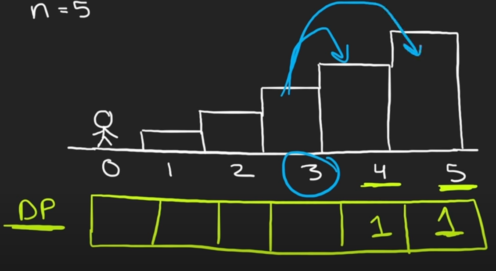

# INDEX

- [INDEX](#index)
  - [Notes](#notes)
  - [Unbounded KnapSack (Revisit again)](#unbounded-knapsack-revisit-again)
  - [Min Cost Climbing Stairs](#min-cost-climbing-stairs)
  - [Climbing Stairs](#climbing-stairs)
  - [Best Time to Buy and Sell Stock](#best-time-to-buy-and-sell-stock)
  - [Counting Bits](#counting-bits)
  - [House Robber](#house-robber)
  - [House Robber II](#house-robber-ii)
  - [Best Time to Buy and Sell Stock with Cooldown](#best-time-to-buy-and-sell-stock-with-cooldown)
  - [Knight Probability in Chessboard](#knight-probability-in-chessboard)
  - [Knight Dialer](#knight-dialer)
  - [Partition Equal Subset Sum](#partition-equal-subset-sum)
  - [Coin Change](#coin-change)
  - [Coin Change II](#coin-change-ii)
  - [Student Attendance Record II](#student-attendance-record-ii)
  - [Unique Paths](#unique-paths)

---

## Notes

- Usually when you see `min` or `max` in the problem, it's a sign that we can use **dynamic programming**. because we will be using the results of the subproblems to solve the main problem and is a way of optimizing recursive algorithms.
- When solving `DP` problems, we usually need to figure out the **base cases** and the **recurrence relation**.
  - **Base cases** are the simplest cases that we can solve without using the results of the subproblems.
  - **Recurrence relation** is the relation between the current problem and the subproblems. -> what is memoized.
- Usually `Bottom-up` approach is better than `Top-down` approach because it doesn't use recursion and it's faster.
  - `Bottom-up` usually is Iterative and `Top-down` is Recursive.
  - `Bottom-up` Time complexity is usually `O(n)` and `Top-down` is usually `O(n^2)`.
  - `Bottom-up` Space complexity is usually `O(n)` and `Top-down` is usually `O(n)`.

---

## Unbounded KnapSack (Revisit again)

Given a list of `n` items, and a backpack with a limited capacity, return the maximum total profit that can be contained in the backpack. The i-th item's profit is `profit[i]` and its weight is `weight[i]`.

- EX:

  - Input: `capacity = 8, profit = [15, 50, 60, 90], weight = [1, 3, 4, 5]`
  - Output: `140`
  - Explanation: We can take items with indecies `1 and`3`, and leave the rest.

```py
def unboundedKnapsack(capacity: int, profit: List[int], weight: List[int]) -> int:
    n = len(profit)
    dp = [[0] * (capacity + 1) for _ in range(n)] # dp[i][c] -> max profit for the first i items and capacity c

    # Fill the first row
    for c in range(capacity + 1):
        if c >= weight[0]:
            dp[0][c] = profit[0] * (c // weight[0])

    for i in range(1, n):
        for c in range(1, capacity + 1):
            profit1, profit2 = 0, 0
            if c >= weight[i]:
                profit1 = profit[i] + dp[i][c - weight[i]]
            profit2 = dp[i - 1][c]
            dp[i][c] = max(profit1, profit2)

    return dp[-1][-1]
```

---

## Min Cost Climbing Stairs

You are given an integer array `cost` where `cost[i]` is the cost of `ith` step on a staircase. Once you pay the cost, you can either climb one or two steps.

You can either start from the step with index `0`, or the step with index `1`.

Return the minimum cost to reach the top of the floor.

- Ex:

  - Input: `cost = [10,15,20]`
  - Output: `15`
  - Explanation: Cheapest is: start on cost[1], pay that cost, and go to the top.

- Explanation:

  - This is a `DP` problem, because we will be using the results of the subproblems to solve the main problem.

- **Top-down approach (memoization)**

  - Here, we start at the top step and try to reach the bottom step.
  - We can then create a `dfs helper` function that takes the current step as an argument
  - We can create a `memo` dictionary to store the minimum cost to reach each step

  ```py
  # O(n) time | O(n) space
  def minCostClimbingStairs(cost: List[int]) -> int:
      memo = {} # key=index, value=minCost

      def dfs(index):
          if index >= len(cost):
              return 0

          if index in memo:
              return memo[index]

          memo[index] = min(dfs(index + 1), dfs(index + 2)) + cost[index]
          return memo[index]

      return min(dfs(0), dfs(1))
  ```

- **Bottom-up approach** ✅

  - Here, we start at the bottom step **(Base cases)** and try to reach the top step.
  - We can create an array of size `n` to store the minimum cost to reach each step
    - last step is the top step and will have default value of `0` which is the minimum cost to reach it
    - the step before the top step and will also have default value of `0` which is the minimum cost to reach the top step
  - We can then loop through the array and calculate the minimum cost to reach each step
    - The minimum cost to reach the current step is equal to `the minimum cost to reach the previous step + the cost of the current step`.
    
    - We can then return the **minimum between the last two elements** in the array which indicates the minimum cost to reach the top step

  ```py
  def minCostClimbingStairs(cost: List[int]) -> int:
      # Array with minimum cost to reach each step
      dp = [0] * len(cost)

      # Set the first two elements in the array to the cost of the first two steps
      dp[0] = cost[0]
      dp[1] = cost[1]

      # Loop through the array and calculate the minimum cost to reach each step
      for i in range(2, len(cost)):
          # The minimum cost to reach the current step is equal to the minimum cost to reach the previous step + the cost of the current step
          dp[i] = min(dp[i - 1], dp[i - 2]) + cost[i]

      # Return the minimum between the last two elements in the array
      return min(dp[-1], dp[-2])
  
  # Optimizing space complexity
  def minCostClimbingStairs(cost: List[int]) -> int:
      # Set the first two elements in the array to the cost of the first two steps
      first = cost[0]
      second = cost[1]

      for i in range(2, len(cost)):
          current = min(first, second) + cost[i]
          first = second
          second = current

      # Return the minimum between the last two elements in the array
      return min(first, second)
  ```

---

## Climbing Stairs

You are climbing a staircase. It takes `n` steps to reach the top.

Each time you can either climb `1` or `2` steps. In how many distinct ways can you climb to the top?


- Ex:

  - Input: `n = 4` -> `5` steps

- **Explanation**

  - We can use **dynamic programming** to solve this problem using a **bottom-up** approach or a **top-down (memoization)** approach.

- Solution 1: Memoization

  - Here, we start at `0` and try to reach the top step.
  - We can then create a `dfs helper` function that takes the current step as an argument
    
  - We can create a `memo` dictionary to store the number of ways to reach each step
    

  ```py
  # O(n) time | O(n) space
  def climbStairs(n):
      memo = {}
      def dfs(step):
          # If we reach the top step, return 1
          if step == n:
              return 1
          # If we go beyond the top step, return 0
          if step > n:
              return 0
          # If we already calculated the number of ways to reach the current step, return it
          if step in memo:
              return memo[step]
          # Calculate the number of ways to reach the current step
          memo[step] = dfs(step + 1) + dfs(step + 2)
          return memo[step]

      return dfs(0)
  ```

- Solution 2: Bottom-up

  - Here, we start at `n` and try to reach the bottom step (`0` step)
    
  - We can create an array of size `n + 1` to store the number of ways to reach each step
    
    - last step is the top step and will have default value of `1` which is the number of ways to reach it
    - the step before the top step and will also have default value of `1` which is the number of ways to reach the top step
  - We can then loop through the array and calculate the number of ways to reach each step
    - The number of ways to reach the current step is equal to the number of ways to reach the previous step + the number of ways to reach the step before the previous step **(because we can take 1 or 2 steps at a time)**
      
    - We can then return the last element in the array which indicates the number of ways to reach the bottom step

  ```py
  # O(n) time | O(n) space
  def climbStairs(n):
      # create an array of size n + 1 to store the number of ways to reach each step
      dp = [0] * (n + 1)

      # set the first two elements in the array to 1
      dp[0] = 1 # can reach the first step in 1 way
      dp[1] = 1 # can reach the second step in 1 way

      # loop through the array and calculate the number of ways to reach each step
      for i in range(2, n + 1):
          dp[i] = dp[i - 1] + dp[i - 2]

      # return the last element in the array
      return dp[-1]

  # ------------------------------------------------------------------------------------
  # Another solution with O(1) space
  def climbStairs(n):
      first = 1
      second = 1
      for i in range(2, n + 1):
          temp = first + second
          first = second
          second = temp
      return second
  ```

---

## Best Time to Buy and Sell Stock

Choose a single day to buy one stock and choose a different day in the future to sell that stock. Return the maximum profit that can be achieved from this transaction. If no profit can be achieved, return `0`.

- Ex:

  - Input: `prices = [7,1,5,3,6,4]`
  - Output: `5`
  - Explanation: Buy on day 2 (price = 1) and sell on day 5 (price = 6), profit = 6-1 = 5.

- Solution 1: DP

  ```py
  def maxProfit(prices: List[int]) -> int:
      currMin = float('inf')
      maxProfit = 0

      for price in prices:
          if price < currMin:
              currMin = price
          elif price - currMin > maxProfit:
              maxProfit = price - currMin
      return maxProfit
  ```

- Solution 2: 2 pointers

  ```py
  def maxProfit(prices: List[int]) -> int:
      l, r = 0, 1
      maxProfit = 0

      while r < len(prices):
          if prices[l] < prices[r]:
              maxProfit = max(maxProfit, prices[r] - prices[l])
          else:
              l = r # move the left pointer to the right pointer
          r += 1

      return maxProfit
  ```

---

## Counting Bits

Given an integer `n`, return an array ans of length n + 1 such that for each i (0 <= i <= n), ans[i] is the number of 1's in the binary representation of i.

- Ex:

  - Input: `n = 2`
  - Output: `[0,1,1]`
  - Explanation:
    - `0` --> `0`
    - `1` --> `1`
    - `2` --> `10`

- Explanation:

  - To count the number of `1s` in the binary representation of a number, we can **integer-divide (`//`)** the number by `2` and count the number of `1s` in the binary representation of the quotient.

    ```py
    # Ex: 3 --> O(log(n)
    3 % 2 = 1 # count = 1
    3 // 2 = 1 # shift the number to the right by 1 bit
    1 % 2 = 1 # count = 2
    1 // 2 = 0 # shift the number to the right by 1 bit
    0 % 2 = 0 # count = 2 (END)
    ```

  - This is a `DP` problem, because we will be using the results of the subproblems to solve the main problem.
  - We will use a `dp` array to store the number of `1s` in the binary representation of each number.
    - We will start by filling the first element in the array with `0` because the number `0` has no `1s` in its binary representation.
    - We will then loop through the array and calculate the number of `1s` in the binary representation of each number.
    - If the number is even, then the number of `1s` in its binary representation is equal to the number of `1s` in the binary representation of the number divided by `2`.
    - If the number is odd, then the number of `1s` in its binary representation is equal to the number of `1s` in the binary representation of the number divided by `2` + `1`.

```py
def countBits(n):
    # create an array of size n + 1 to store the number of 1s in the binary representation of each number
    dp = [0] * (n + 1)

    # loop through the array and calculate the number of 1s in the binary representation of each number
    for i in range(1, n + 1):
        # if the number is even, then the number of 1s in its binary representation is equal to the number of 1s in the binary representation of the number divided by 2
        if i % 2 == 0:
            dp[i] = dp[i // 2]
        # if the number is odd, then the number of 1s in its binary representation is equal to the number of 1s in the binary representation of the number divided by 2 + 1
        else:
            dp[i] = dp[i // 2] + 1

    # return the array
    return dp
```

---

## House Robber

You are a professional robber planning to rob houses along a street. Each house has a certain amount of money stashed, the only constraint stopping you from robbing each of them is that **adjacent houses have security systems connected** and **it will automatically contact the police if two adjacent houses were broken into on the same night**.


Given an integer array `nums` representing the amount of money of each house, return the maximum amount of money you can rob tonight **without alerting the police**.

- Ex:

  - Input: `nums = [1,2,3,1]`
  - Output: `4`
  - Explanation: Rob house `1` (money = 1) and then rob house `3` (money = 3).
    - Total amount you can rob = `1 + 3` = `4`.

- Explanation:

  - This is a `DP` problem, because we will be using the results of the subproblems to solve the main problem.
  - We will use a `dp` array to store the maximum amount of money we can rob for each house.
    - We will start by filling the first element in the array with the amount of money in the first house.
    - We will then loop through the array and calculate the maximum amount of money we can rob for each house.
    - The maximum amount of money we can rob for the current house is equal to the maximum amount of money we can rob for the previous house + the amount of money in the current house.
    - We will return the last element in the array which indicates the maximum amount of money we can rob for the last house.

- Solution 1: using `dp` array

  ```py
  def rob(nums: List[int]) -> int:
      # Arrya with maximum amount of money we can rob for each house
      dp = [0] * len(nums)

      # set the first element in the array to the amount of money in the first house
      dp[0] = nums[0]

      # loop through the array and calculate the maximum amount of money we can rob for each house
      for i in range(1, len(nums)):
          # the maximum amount of money we can rob for the current house is equal to the maximum amount of money we can rob for the previous house + the amount of money in the current house
          dp[i] = max(dp[i - 1], dp[i - 2] + nums[i])

      # return the last element in the array
      return dp[-1]
  ```

- Solution 2: using 2 variables ✅

  ```py
  def rob(nums: List[int]) -> int:
      prev1 = 0 # maximum amount of money we can rob for the previous house
      prev2 = 0 # maximum amount of money we can rob for the house before the previous house

      for num in nums:
          # the maximum amount of money we can rob for the current house is equal to the maximum amount of money we can rob for the previous house + the amount of money in the current house
          temp = prev1
          prev1 = max(prev1, prev2 + num)
          prev2 = temp

      return prev1
  ```

---

## House Robber II

You are a professional robber planning to rob houses along a street. Each house has a certain amount of money stashed. All houses at this place are **arranged in a circle**. That means the first house is the neighbor of the last one. Meanwhile, adjacent houses have a security system connected, and it will automatically contact the police if two adjacent houses were broken into on the same night.

Given an integer array `nums` representing the amount of money of each house, return the maximum amount of money you can rob tonight **without alerting the police**.

- Ex:

  - Input: `nums = [2,3,2]`
  - Output: `3`
  - Explanation: You cannot rob `house 1` (money = 2) and then rob `house 3` (money = 2), because they are adjacent houses.

- Explanation:

  - Difference between this problem and the previous one is that the houses are arranged in a circle. So we can't rob the first and last houses at the same time.
  - We can solve this problem by dividing it into two problems:
    - Rob houses from `0` to `n - 2` -> `dp1`
    - Rob houses from `1` to `n - 1` -> `dp2`
  - Then we can return the maximum between `dp1` and `dp2`.

- Here we will use the same solution as the previous problem, but we will call the function twice.

  - one with `nums[:-1]` -> `dp1`
  - one with `nums[1:]` -> `dp2`

```py
def rob(nums: List[int]) -> int:
    if len(nums) == 1:
        return nums[0]

    def robHelper(nums):
        prev1 = 0 # maximum amount of money we can rob for theprevious house
        prev2 = 0 # maximum amount of money we can rob for the housebefore the previous house

        for num in nums:
            # the maximum amount of money we can rob for the current house is equal to the maximum amount of money we can rob for the previous house + the amount of money in the current house
            temp = prev1
            prev1 = max(prev1, prev2 + num)
            prev2 = temp

        return prev1

    return max(robHelper(nums[:-1]), robHelper(nums[1:]))
```

---

## Best Time to Buy and Sell Stock with Cooldown

You are given an array `prices` where `prices[i]` is the price of a given stock on the `ith` day.

Find the maximum profit you can achieve. You may complete as many transactions as you like (i.e., buy one and sell one share of the stock multiple times) with the following restrictions:

- After you sell your stock, you cannot buy stock on the next day (i.e., cooldown one day).

- Ex:

  - Input: `prices = [1,2,3,0,2]`
  - Output: `3`
  - Explanation: transactions = [buy, sell, cooldown, buy, sell]

- **Solution 1: Using Decision tree + caching** ✅

  - We start with `profit = 0`, so we can buy the stock on the first day or do nothing (cooldown).
    
    - If we buy the stock on the first day, then we can sell it on the second day and make a profit of `prices[1] - prices[0]` **or** we can do nothing on the first day and make a profit of `0`.
    - the moment we sell, we can't buy on the next day, so we will have to cooldown for one day.
    - this is repeated for the rest of the days -> then we return the maximum profit on the last day (end of the decision tree).
  - We will use a `dfs()` function to traverse the decision tree.
    - The function will take the index of the current day and a state boolean indicating if we can buy or not.
    - if **buy** -> we will call the function with `i + 1` and `sell` state (`true`)
    - if **sell** -> we will call the function with `i + 2` and `buy` state (`false`)
  - Time complexity: `O(n^2)`
    - and using **caching**, the time complexity will be `O(n)`.

  ```py
  def maxProfit(prices: List[int]) -> int:
      memo = {} # key=(i, buying), value=max_profit

      def dfs(i, buying):
          if i >= len(prices):
              return 0

          if (i, buying) in memo:
              return memo[(i, buying)]

          profit = 0
          if buying:
              # incriment index by 1 to buy
              profit = max(
                  dfs(i + 1, False) - prices[i], # buy
                  dfs(i + 1, True) # cooldown
              )
          else:
              # incriment index by 2 to sell (cooldown for 1 day)
              profit = max(
                  dfs(i + 2, True) + prices[i], # sell
                  dfs(i + 1, False) # cooldown
              )

          memo[(i, buying)] = profit
          return profit

      return dfs(0, True)
  ```

- **Solution 2: using `dp` array**

  ```py
  def maxProfit(prices: List[int]) -> int:
      # Array with maximum profit we can achieve for each day
      dp = [0] * len(prices)

      # loop through the array and calculate the maximum profit we can achieve for each day
      for i in range(1, len(prices)):
          # the maximum profit we can achieve for the current day is equal to the maximum profit we can achieve for the previous day + the amount of money we can make by selling the stock on the current day
          dp[i] = max(dp[i - 1], prices[i] - prices[i - 1] + dp[i - 2] if i >= 2 else 0)

      # return the last element in the array
      return dp[-1]
  ```

---

## Knight Probability in Chessboard

On an `n x n` chessboard, a knight starts at the cell `(row, column)` and attempts to make exactly `k` moves. The rows and columns are 0-indexed, so the top-left cell is `(0, 0)`, and the bottom-right cell is `(n - 1, n - 1)`.

A chess knight has eight possible moves it can make, as illustrated below. Each move is two cells in a cardinal direction, then one cell in an orthogonal direction.


Each time the knight is to move, it chooses one of eight possible moves uniformly at random (even if the piece would go off the chessboard) and moves there.

The knight continues moving until it has made exactly `k` moves or has moved off the chessboard. Return the probability that the knight remains on the board after it has stopped moving.

- Ex:

  - Input: `n = 6, k = 2, row = 2, column = 2`
    
  - Output: `0.62500`
  - Explanation: There are `6` possible paths for the knight to move. Out of the `6` paths, only `2` of them are staying on the chessboard. Therefore, the answer is `2 / 6 = 0.62500`
    
    
    - and so on until we get all the possible paths with possible probabilities.

- Explanation:
  - This is a `DP` problem, because we will be optimizing the process of generating all the possible paths.
  - We will use a `dp` matrix to store the probability of the knight remaining on the board for each cell.
    - Here we use a `3D` matrix because we need to store the probability of the knight remaining on the board for each cell for each move. **(we need to store the probability of the knight remaining on the board for each cell for each move because the knight can move to `8` different cells)**
  - We will start by filling the first row with `1` because the knight can only stand on the first row.
  - Then we will iterate over the matrix and for each cell we will calculate the probability of the knight remaining on the board for the current cell.
  - The probability of the knight remaining on the board for the current cell is equal to the sum of the probabilities of the knight remaining on the board for each neighbor cell divided by `8` **(because the knight can move to `8` different cells)**.

- Time complexity: `O(n^2 * k)` -> `O(n^3)`
  - without `memoization`, the time complexity will be `O(8^k)` -> `O(8^n)`
    - `8` -> because the knight can move to `8` different cells.
  - with `memoization`, the time complexity will be `O(n^2 * k)` -> `O(n^3)` because we are calculating the probability of the knight remaining on the board for each cell for each move.
    - `3` -> because we are using a `3D` matrix.

```py
def knightProbability(n: int, k: int, row: int, column: int) -> float:
    # Create a 3D dp matrix to store the probability of the knight remaining on the board for each cell
    dp = [[[0] * n for _ in range(n)] for _ in range(k + 1)]
    # startPoint -> [possible moves]
    directions = [
        (2,1), (1,2), (-1,2), (-2,1), 
        (-2,-1), (-1,-2), (1,-2), (2,-1)
    ]

    def knightProb(r, c, k):
        # If the knight is out of the board, return 0
        if r < 0 or r >= n or c < 0 or c >= n:
            return 0
        # Memoization
        if dp[k][r][c] != 0:
            return dp[k][r][c]
        # If we reached the last move, return 1
        if k == 0:
            return 1

        # Calculate the probability of the knight remaining on the board for the current cell
        for dr, dc in directions:
            dp[k][r][c] += knightProb(r + dr, c + dc, k - 1) / 8

        return dp[k][r][c]

    return knightProb(row, column, k)
```

---

## Knight Dialer

A chess knight can move as indicated in the chess diagram below:

We have a chess knight and a phone pad as shown below, the knight can only stand on a numeric cell (i.e. blue cell).

Given an integer `n`, return how many distinct phone numbers of length `n` we can dial.

- Ex:

  - Input: `n = 1`
  - Output: `10`
  - Explanation: We need to dial a number of length 1, so placing the knight over any numeric cell of the 10 cells is sufficient.

- Explanation:

  - We will use a `dp` matrix to store the number of distinct phone numbers of length `n` we can dial for each number.

    - `dp[i][j]` -> number of distinct phone numbers of length `i` we can dial for the number `j`.

    ```py
    # Matrix example for n = 5
    dp =
    [
      [1, 1, 1, 1, 1, 1, 1, 1, 1, 1], # n = 1
      [1, 2, 2, 2, 2, 2, 2, 2, 2, 1], # n = 2
      [2, 2, 4, 4, 4, 4, 4, 4, 2, 2], # n = 3
      [2, 4, 4, 8, 8, 8, 8, 4, 4, 2], # n = 4
      [4, 4, 8, 8, 16, 16, 8, 8, 4, 4] # n = 5
    ]
    ```

  - We will start by filling the first row with `1` because we can dial a number of length `1` by placing the knight over any numeric cell of the `10` cells.
  - Then we will iterate over the matrix and for each cell we will calculate the number of distinct phone numbers of length `n` we can dial for the number `j`.
    - `dp[i][j] = dp[i - 1][neighbor1] + dp[i - 1][neighbor2] + ... + dp[i - 1][neighborN]`
    - `dp[i - 1][neighbor1]` -> number of distinct phone numbers of length `i - 1` we can dial for the number `neighbor1`.
    - `dp[i - 1][neighbor2]` -> number of distinct phone numbers of length `i - 1` we can dial for the number `neighbor2`.
    - `dp[i - 1][neighborN]` -> number of distinct phone numbers of length `i - 1` we can dial for the number `neighborN`.
  - Finally, we will return the sum of the last row in the matrix.
    - last row indicates the number of distinct phone numbers of length `n` we can dial for each number.
    - > we return the sum modulo by `10 ** 9 + 7` to avoid overflow as given in the problem.

```py
def knightDialer(n: int) -> int:
    # Create a dp matrix to store the number of distinct phone numbers of length n we can dial for each number
    dp = [[0] * 10 for _ in range(n)]

    # Fill the first row with 1 because we can dial a number of length 1 by placing the knight over any numeric cell of the 10 cells
    for c in range(10):
        dp[0][c] = 1

    # startPoint -> [possible moves]
    neighbors = {
        0: [4, 6],
        1: [6, 8],
        2: [7, 9],
        3: [4, 8],
        4: [0, 3, 9],
        5: [],
        6: [0, 1, 7],
        7: [2, 6],
        8: [1, 3],
        9: [2, 4]
    }

    for r in range(1, n):
        for c in range(10):
            for neighbor in neighbors[c]:
                # number of distinct phone numbers of length r we can dial for the number c
                dp[r][c] += dp[r - 1][neighbor]

    return sum(dp[-1]) % (10 ** 9 + 7)
```

---

## Partition Equal Subset Sum

Given a non-empty array `nums` containing only positive integers, find if the array can be partitioned into two subsets such that the sum of elements in both subsets is equal.

- Ex:

  - Input: `nums = [1,5,11,5]`
  - Output: `true`
  - Explanation: The array can be partitioned as `[1, 5, 5]` and `[11]`.

- Explanation:

  - we want to divide the array into two subsets with equal sum (sum of elements in both subsets is equal).
    - For example, if the array is `[1, 5, 11, 5]`:
      - The sum of elements in the array is `22`.
      - The required sum of elements in each subset is `11`.
      - we can divide the array into two subsets with sum `11`:
        - `[1, 5, 5]` -> sum = `11`
        - `[11]` -> sum = `11`
      - So the `target` will be `sum(nums) // 2` -> `11` for a path in the decision tree to be valid.
        
  - we can solve this problem using **dynamic programming**.

    - we will divide the subsetting logic into smaller decisions each time we make a new decision (**with updated `target` and `index`**)
      

  - We will use a `dfs()` function to traverse the decision tree.
    - The function will take the current `index` and the current `target` as arguments.
    - If the current target is `0`, then we have a valid path.
    - If the current target is less than `0` or the current index is greater than or equal to the length of the array, then we don't have a valid path.
    - If the current index and target are in the `memo` dictionary, then we return the value in the dictionary.
    - Otherwise, we will call the function with the current index + 1 and the current target - the number at the current index **(because we are trying to find a subset with sum equal to the target)**.
    - We will also call the function with the current index + 1 and the current target **(because we are trying to find a subset with sum equal to the target)**.
    - We will return `True` if any of the two calls return `True`, otherwise we will return `False`.

```py
def canPartition(nums: List[int]) -> bool:
    total = sum(nums)
    # If the sum of elements in the array is odd, then we can't divide the array into two subsets with equal sum
    if total % 2 != 0:
        return False

    memo = {} # key=(index, target), value=canPartition

    def dfs(index, target):
        if target == 0:
            # Means that we have a subset branch with sum equal to target
            return True
        if index >= len(nums) or target < 0:
            return False

        if (index, target) in memo:
            return memo[(index, target)]

        memo[(index, target)] = dfs(index + 1, target - nums[index]) or dfs(index + 1, target)
        return memo[(index, target)]

    return dfs(0, total // 2)
```

---

## Coin Change

You are given an integer array `coins` representing coins of different denominations and an integer `amount` representing a total amount of money.

Return the fewest number of coins that you need to make up that amount. If that amount of money cannot be made up by any combination of the coins, return `-1`.

You may assume that you have an infinite number of each kind of coin.

- Ex:

  - Input: `coins = [1,2,5], amount = 11`
    - Output: `3`
  - Input: `coins = [2], amount = 3`
    - Output: `-1`

- Explanation:

  - This is a "combination sum" problem, because we are trying to find the fewest number of coins that we can use to make up the amount.
  - We can solve this problem using **dynamic programming**.

- **Solution 1: using dfs + memoization (Slow ❌)**

  - This is a "Top-down" approach, because we will divide the subsetting logic into smaller decisions each time we make a new decision (**with updated `amount` and `index`**)
    
  - We will use a `dfs()` function to traverse the decision tree.
  - The function will take the current `index` and the current `amount` as arguments.
    - If the current amount is `0`, then we have a valid path.
    - If the current amount is less than `0` or the current index is greater than or equal to the length of the array, then we don't have a valid path.
  - If the current index and amount are in the `memo` dictionary, then we return the value in the dictionary.
  - Otherwise, we will call the function with the current index and the current amount - the coin at the current index **(because we are trying to find a combination with sum equal to the amount)**.
  - We will also call the function with the current index + 1 and the current amount **(because we are trying to find a combination with sum equal to the amount)**.
  - We will return the minimum between the two calls + 1 **(because we took a coin)**.
  - If the minimum is equal to `float('inf')`, then we will return `-1`.

  ```py
  def coinChange(coins: List[int], amount: int) -> int:
      memo = {} # key=(index, amount), value=minCoins

      def dfs(index, amount):
          if amount == 0:
              return 0
          if index >= len(coins) or amount < 0:
              return float('inf')

          if (index, amount) in memo:
              return memo[(index, amount)]

          comb1 = dfs(index + 1, amount) # don't take the coin at the current index
          comb2 = 1 + dfs(index, amount - coins[index]) # take the coin at the current index and incriment the number of coins by 1 (because we took a coin)
          memo[(index, amount)] = min(comb1, comb2)
          return memo[(index, amount)]

      return dfs(0, amount) if dfs(0, amount) != float('inf') else -1
  ```

- **Solution 2: using dp array (Fast ✅)**

  - This is a "Bottom-up" approach, because we will use the results of the subproblems to solve the main problem.
    

    - Instead of solving the problem from the top (`amount = 7`), we will solve it from the bottom (`amount = 0`). and try to build up the solution ->

      ```py
      # [1, 3, 4, 5], amount = 7
      dp[0] = 0 # we can make up the amount 0 with 0 coins
      dp[1] = 1 # we can make up the amount 1 with 1 coin at index 0
      dp[2] = dp[1] + 1 # we can make up the amount 2 with 1 coin at index 0 + 1 coin at index 1
      dp[3] = dp[2] + 1
      dp[4] = min(dp[3], dp[0]) + 1
      dp[5] = min(dp[4], dp[1]) + 1
      dp[6] = min(dp[5], dp[2]) + 1
      dp[7] = min(dp[6], dp[3]) + 1
      ```

  ```py
  # Time: O(n * amount) | Space: O(amount
  def coinChange(coins: List[int], amount: int) -> int:
      # Array with minimum number of coins we can use to make up the amount
      dp = [float('inf')] * (amount + 1)

      # we can make up the amount 0 with 0 coins
      dp[0] = 0

      # loop through the array and calculate the minimum number of coins we can use to make up the amount
      for i in range(1, amount + 1):
          for c in coins:
              # if the current amount is greater than or equal to the coin at the current index to get valid index (bounded)
              if i - c >= 0:
                  dp[i] = min(dp[i], dp[i - c] + 1)

      # return the last element in the array
      return dp[-1] if dp[-1] != float('inf') else -1
  ```

---

## Coin Change II

Same as the previous problem, but this time we want to find the number of combinations that make up the amount.

- Ex:

  - Input: `amount = 5, coins = [1,2,5]`
  - Output: `4`
  - Explanation: there are four ways to make up the amount:
    - `1 + 1 + 1 + 1 + 1 = 5`
    - `1 + 1 + 1 + 2 = 5`
    - `1 + 2 + 2 = 5`
    - `5 = 5`

- **Solution 1: using dfs + memoization**

  - This is a "Top-down" approach

  ```py
  def change(amount: int, coins: List[int]) -> int:
      memo = {} # key=(index, amount), value=numberOfCombinations

      def dfs(index, amount):
          if amount == 0:
              return 1
          if index >= len(coins) or amount < 0:
              return 0

          if (index, amount) in memo:
              return memo[(index, amount)]

          comb1 = dfs(index + 1, amount) # don't take the coin at the current index
          comb2 = dfs(index, amount - coins[index]) # take the coin at the current index
          memo[(index, amount)] = comb1 + comb2
          return memo[(index, amount)]

      return dfs(0, amount)
  ```

- **Solution 2: using dp array**

  - This is a "Bottom-up" approach
  - We use index `i-c` because we are trying to find the number of combinations that make up the amount `i` using the coin at the current index `c`.
    - Ex: `dp[5] = dp[5 - 1] + dp[5 - 2]+ .. + dp[5 - 5]`

  ```py
  def change(amount: int, coins: List[int]) -> int:
      dp = [0] * (amount + 1)

      # we can make up the amount 0 with 1 combination (don't take any coin)
      dp[0] = 1

      # calculate the number of combinations we can use to make up the amount
      for c in coins:
          for i in range(1, amount + 1):
              # check valid index
              if i - c >= 0:
                  dp[i] += dp[i - c]

      # return the last element in the array
      return dp[-1]
  ```

---

## Student Attendance Record II

Given an integer `n`, return the number of all possible attendance records with length `n`, which will be regarded as **rewardable**. The answer may be very large, return it after mod `10^9 + 7`.

- `A` -> Absent
- `L` -> Late
- `P` -> Present
- A record is regarded as **rewardable** if it doesn't contain **more than one `A` (absent)** or **more than two continuous `L` (late)**.

- Ex:

  - Input: `n = 2`
  - Output: `8`
  - Explanation:
    - There are 8 records with length 2 will be regarded as rewardable:
      - `"PP"` , `"AP"`, `"PA"`, `"LP"`, `"PL"`, `"AL"`, `"LA"`, `"LL"`
      - Only `"AA"` won't be regarded as rewardable owing to more than one absent times.

- Explanation:

  - This is a "combination sum" problem, because we are trying to find the number of all possible attendance records with length `n`.

- **Solution 1: using dfs + memoization**

  - will result **Time Limit Exceeded** ❌

  ```py
  def checkRecord(n: int) -> int:
      memo = {} # key=(index, absentCount, lateCount), val=numberOfRecords
      def dfs(index, absentCount, lateCount):
          if absentCount > 1 or lateCount > 2:
              return 0
          if index == n:
              return 1
          if (index, absentCount, lateCount) in memo:
              return memo[(index, absentCount, lateCount)]

          comb1 = dfs(index + 1, absentCount, 0) # present
          comb2 = dfs(index + 1, absentCount + 1, 0) # absent
          comb3 = dfs(index + 1, absentCount, lateCount + 1) # late

          memo[(index, absentCount, lateCount)] = comb1 + comb2 + comb3
          return memo[(index, absentCount, lateCount)]

      return dfs(0, 0, 0) % (10 ** 9 + 7)
  ```

- **Solution 2: using dp array** ✅

  - We will use a 2D `dp` matrix of size `2x3` filled with zeros, where `dp[i][j]` -> number of all possible attendance records with length `i` and `j` absent days.
    - We will set `dp[0][0] = 1` because we can have a record with length `0` and `0` absent days -> **Empty record**
  - iterate `n` times and for each iteration we will calculate the number of all possible attendance records with length `i` and `j` absent days.
    - `dp[i][0]` -> number of all possible attendance records with length `i` and `0` absent days -> **No absent days**
    - `dp[i][1]` -> number of all possible attendance records with length `i` and `1` absent days -> **One absent day**
    - `dp[i][2]` -> number of all possible attendance records with length `i` and `2` absent days -> **Two absent days**
  - Compute the sum of all the elements in the matrix and return the result modulo by `10 ** 9 + 7` to avoid overflow as given in the problem.

  ```py
  def checkRecord(n: int) -> int:
      kMod = 10**9 + 7
      dp = [[0] * 3 for _ in range(2)]
      dp[0][0] = 1

      for i in range(n):
          p0, p1, p2, q0, q1, q2 = dp[0][0], dp[0][1], dp[0][2], dp[1][0], dp[1][1], dp[1][2]

          dp[0][0] = (p0 + p1 + p2) % kMod # Append P
          dp[0][1] = p0 # Append L
          dp[0][2] = p1 # Append L
          dp[1][0] = (p0 + p1 + p2 + q0 + q1 + q2) % kMod # Append A or append P
          dp[1][1] = q0 # Append L
          dp[1][2] = q1 # Append L

      return sum(dp[0] + dp[1]) % kMod
  ```

---

## Unique Paths

A robot is located at the top-left corner of a `m x n` grid. Given the two integers `m` and `n`, return the number of possible unique paths that the robot can take to reach the bottom-right corner.

- Ex:
  

  - Input: `m = 3, n = 7`
  - Output: `28`

- Explanation:

  - This is a `DP` problem, because we will be using the results of the subproblems to solve the main problem.
    - Actually you would figure that out if you tried to solve it using `recursion` and `backtracking` (`DFS`) as you will get `TIME LIMIT` error.
  - We will use a `dp` matrix to store the number of unique paths for each cell.
    - `dp[i][j]` -> number of unique paths to reach the cell at `i`th row and `j`th column.
  - We will start by filling the first row and first column with `1` because there is only one way to reach them.
  - Then we will iterate over the matrix and for each cell we will calculate the number of unique paths to reach it.
    - `dp[i][j] = dp[i - 1][j] + dp[i][j - 1]`
    - `dp[i - 1][j]` -> number of unique paths to reach the cell above the current cell.
    - `dp[i][j - 1]` -> number of unique paths to reach the cell on the left of the current cell.
  - Time and space complexity: `O(mn)`, where `m` is the number of rows and `n` is the number of columns.

```py
def uniquePaths(m: int, n: int) -> int:
    # Create a dp matrix to store the number of unique paths for each cell
    dp = [[1] * n for _ in range(m)]

    for r in range(1, m):
        for c in range(1, n):
            # number of unique paths to reach the cell at rth row and cth column
            dp[r][c] = dp[r - 1][c] + dp[r][c - 1]

    return dp[-1][-1]
```
