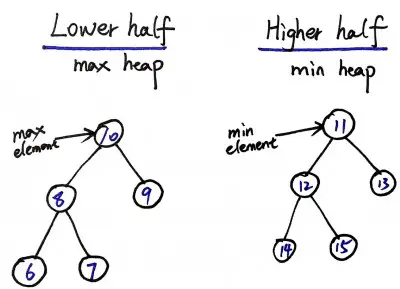
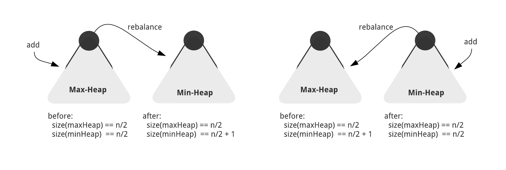
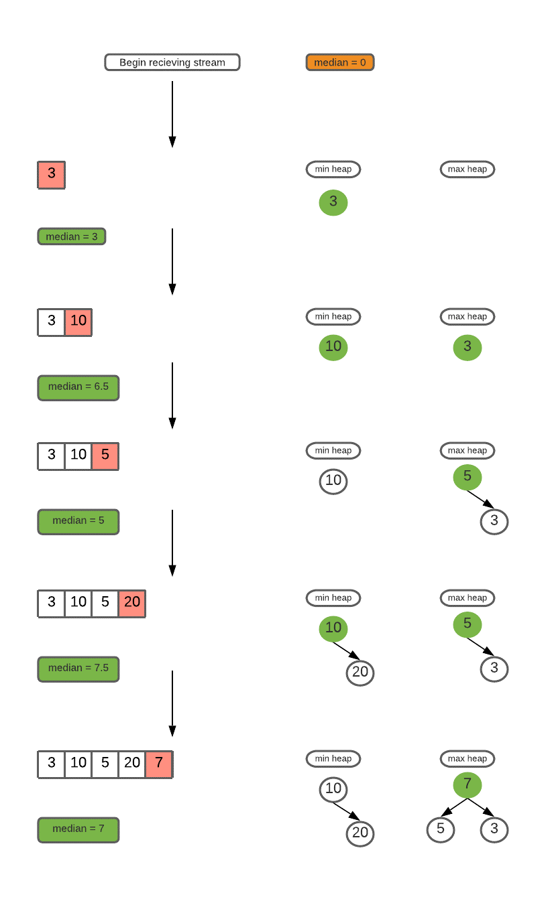

# INDEX

- [INDEX](#index)
  - [Notes](#notes)
  - [Kth Largest Element in an Array](#kth-largest-element-in-an-array)
  - [K Closest Points to Origin](#k-closest-points-to-origin)
  - [Top K Frequent Elements](#top-k-frequent-elements)
    - [Solution 1: using Heap](#solution-1-using-heap)
    - [Solution 2: using Bucket Sort](#solution-2-using-bucket-sort)
  - [Top K Frequent Words](#top-k-frequent-words)
  - [Reorganize String](#reorganize-string)
  - [Task Scheduler](#task-scheduler)
  - [Kth Largest Element in a Stream](#kth-largest-element-in-a-stream)
  - [Two Heaps Technique](#two-heaps-technique)
    - [Find Median from Data Stream](#find-median-from-data-stream)
    - [Sliding Window Median](#sliding-window-median)

---

## Notes

- By design, heaps are data structures that resemble binary trees, but they are not binary search trees.

---

## Kth Largest Element in an Array

Given an integer array `nums` and an integer `k`, return the `kth` largest element in the array.

**You must solve it in O(n) time complexity.**

- EX: `nums = [3, 2, 1, 5, 6, 4], k = 2` --> `5`

  - Explanation: The largest element in the array is `6`, the second largest element is `5`.

- Steps:
  1. we will use a maxHeap instead of sorting the array because we want `O(n)` time complexity and not `O(nlogn)`
  2. push all the elements in the array to the maxHeap -> `O(n)`
  3. pop the top element of the maxHeap `k` times to get the `kth` largest element -> `O(k log(n))`

So the overall complexity will be `O(n + k log(n))` --> `O(n)`

```py
# slower solution ❌
def find_kth_largest(nums, k):
    heap = []
    for num in nums:
        heapq.heappush(heap, num)
    for _ in range(len(nums)-k):
        heapq.heappop(heap)
    return heapq.heappop(heap)

# --------------------------------------------- #

# faster solution ✅
def find_kth_largest(nums, k):
    heap = []
    for num in nums:
        if len(heap) < k:
            heapq.heappush(heap, num)
        elif num > heap[0]:
            # if the current number is greater than the root of the heap, then pop the root and push the current number
            heapq.heappop(heap)
            heapq.heappush(heap, num)
            # now the root of the heap is the kth largest element
    return heapq.heappop(heap)
```

> Note: it can also be solved with section sort in `O(n)` time complexity average case, but `O(n^2)` worst case

---

## K Closest Points to Origin

Given an array of points where `points[i] = [xi, yi]` represents a point on the X-Y plane and an integer `k`, return the `k` closest points to the origin `(0, 0)`.
The distance between two points on the X-Y plane is the Euclidean distance (i.e., `√(x1 - x2)^2 + (y1 - y2)^2`).

- EX: `points = [[1, 3], [-2, 2]], k = 1` --> `[[-2, 2]]`

  - Explanation: The distance between `(1, 3)` and the origin is `sqrt(10)`, the distance between `(-2, 2)` and the origin is `sqrt(8)`, since `sqrt(8) < sqrt(10)`, therefore `(-2, 2)` is closer to the origin. We only want the closest `k = 1` points from the origin, so the answer is just `[[-2, 2]]`.

- Steps:
  1. we will use a minHeap instead of sorting the array because we want `O(n)` time complexity and not `O(nlogn)`
  2. push all the elements in the array to the minHeap -> `O(n)`
     - we don't need to calculate the root of the distance because we can compare the distance without calculating the root
  3. pop the top element of the minHeap `k` times to get the `k` closest points -> `O(k log(n))`

So the overall complexity will be `O(n + k log(n))` --> `O(n)`

```py
def k_closest(points, k):
    res = []
    minHeap = []

    for x, y in points:
        dist = (x ** 2) + (y ** 2)
        heapq.heappush(minHeap, [dist, x, y])

    for _ in range(k):
        dist, x, y = heapq.heappop(minHeap)
        res.append([x, y])

    return res
```

---

## Top K Frequent Elements

Given an integer array `nums` and an integer `k`, return the `k` most frequent elements. You may return the answer in **any order**.

- EX: `nums = [1, 1, 1, 2, 2, 3], k = 2` --> `[1, 2]`

  - Explanation: The answer `[1, 2]` would also be accepted.

### Solution 1: using Heap

- Steps:
  
  1. we will use a minHeap instead of sorting the array because we want `O(n)` time complexity and not `O(nlogn)`
  2. create a dictionary to store the frequency of each element in the array -> `O(n)`
  3. push all the elements in the dictionary to the minHeap (with the negative of the frequency-value because we want to pop the elements with the highest frequency) -> `O(n)`
  4. pop the top element of the minHeap `k` times to get the `k` most frequent elements -> `O(k log(n))`
  5. return the elements in the minHeap


```py
def top_k_frequent(nums, k):
    res = []
    minHeap = []
    freq = {}

    for num in nums:
        freq[num] = freq.get(num, 0) + 1

    for key, val in freq.items():
        heapq.heappush(minHeap, [-val, key])

    # now it's a minHeap but like a maxHeap
    for _ in range(k):
        res.append(heapq.heappop(minHeap)[1])

    return res
```

### Solution 2: using Bucket Sort

- Steps:
  

  1. create a dictionary to store the frequency of each element in the array
  2. create a list of lists (buckets) with the `length of the array + 1`
     - index will be the frequency of the element and the value will be the elements with that frequency
  3. loop through the dictionary and append the key to the bucket with the index of the value (frequency)
  4. loop through the buckets from the end (max frequency) and append the elements to the result list until the length of the result list is `k` -> `O(n)`
  5. return the result list

```py
def top_k_frequent(nums, k):
    res = []
    count = {}
    freq_buckets = [[] for _ in range(len(nums)+1)]

    for num in nums:
        count[num] = count.get(num, 0) + 1

    for n, c in count.items():
        freq_buckets[c].append(n)

    # now freq_buckets is a list of lists with the index as the frequency and the value as the elements with that frequency, so we can loop through it from the end and append the elements to the result list
    for i in range(len(freq_buckets)-1, -1, -1):
        for n in freq_buckets[i]:
            res.append(n)
            if len(res) == k:
                return res
```

---

## Top K Frequent Words

Given an array of strings `words` and an integer `k`, return the `k` most frequent strings.
Return the answer **sorted** by the **frequency** from highest to lowest. Sort the words with the same frequency by their **lexicographical order**.

- EX: `words = ["i", "love", "leetcode", "i", "love", "coding"], k = 2` --> `["i", "love"]`

  - Explanation: "i" and "love" are the two most frequent words.
    Note that "i" comes before "love" due to a lower alphabetical order.

```py
def top_k_frequent(words, k):
    res = []
    freq = {}
    buckets = [[] for _ in range(len(words)+1)]

    for word in words:
        freq[word] = freq.get(word, 0) + 1

    for word, count in freq.items():
        buckets[count].append(word)

    for i in range(len(buckets)-1, -1, -1):
        if len(res) == k:
            break
        if buckets[i]:
            buckets[i].sort()
            res.extend(buckets[i])

    return res
```

---

## Reorganize String

Given a string `s`, rearrange the characters of `s` so that any two adjacent characters are not the same.
Return any possible rearrangement of `s` or return `""` if not possible.

- EX: `s = "aab"` --> `"aba"`
  - Explanation: `aab` --> `aba`
- EX: `s = "aaab"` --> `""`
- EX: `s = "aaabc"` --> `"abaca"`

- Explanation:
  - To solve this we need to use the most frequent characters first and then the less frequent characters
    - we can use a dictionary to store the frequency of each character
    - we can use a maxHeap to store the characters with the most frequency
  - on each iteration we will pop the top element of the maxHeap and append it to the result string
    - if the last element of the result string is the same as the current element, pop the next element and append it to the result string
    - if the maxHeap is empty and the last element of the result string is the same as the current element, this means that we can't reorganize the string so we return `""`
- Steps:
  1. create a dictionary to store the frequency of each character in the string -> `O(n)`
  2. push all the elements in the dictionary to the maxHeap -> `O(n)`
  3. pop the top element of the maxHeap and append it to the result string
     - if the last element of the result string is the same as the current element, pop the next element and append it to the result string
     - if the maxHeap is empty and the last element of the result string is the same as the current element, return `""`
  4. return the result string

```py
def reorganize_string(s):
    maxHeap = []
    freqDict = {}

    # create a dictionary to store the frequency of each character in the string
    for char in s:
        freqDict[char] = freqDict.get(char, 0) + 1
    # push all the elements in the dictionary to the maxHeap by their frequency in negative form (because we want to pop the elements with the highest frequency)
    for key, val in freqDict.items():
        heapq.heappush(maxHeap, [-val, key]) # python heapify pairs by the first element

    res = ''
    prev = None
    # pop the top element of the maxHeap and append it to the result string
    while maxHeap or prev:
        # if the maxHeap is empty and the last element of the result string is the same as the current element, return ""
        if prev and not maxHeap:
            return ''

        # 1. pop the top element of the maxHeap + append it to the result + decrement the frequency by 1 to reach 0
        freq, char = heapq.heappop(maxHeap)
        res += char
        freq += 1 # decrement the frequency by 1 to reach 0

        # 2. if prev is not None, we will push it back to the maxHeap with updated frequency
        if prev:
            heapq.heappush(maxHeap, prev)
            prev = None

        # 3. if the frequency of the popped element not 0, we will store the popped element as prev
        if freq != 0:
            prev = [freq, char]

    return res
```

---

## Task Scheduler

Given a characters array `tasks`, representing the tasks a CPU needs to do, where each letter represents a different task. Tasks could be done in any order. Each task is done in one unit of time. For each unit of time, the CPU could complete either one task or just be idle.

However, there is a non-negative integer `n` that represents the **cooldown** period between two **same tasks** (the same letter in the array), that is that there must be at least `n` units of time between any two same tasks.

Return the least number of units of times that the CPU will take to finish all the given tasks.

- EX: `tasks = ["A","A","A","B","B","B"], n = 2` --> `8`

  - Explanation:
    - A -> B -> idle -> A -> B -> idle -> A -> B
    - There is at least 2 units of time between any two same tasks.

- Explanation:
  - The idea here that we can't process the same task twice without a cooldown period of `n`, so we will process the most frequent tasks first and then the less frequent tasks
  - we can use a dictionary to store the frequency of each task -> `count`
    
  - We want to process the most frequent tasks first, so that we can process the less frequent tasks while we are waiting for the cooldown period to end. so we will use a `maxHeap` to store the tasks with the most frequency
    
  - we can use a `queue` to store the tasks that we can't process yet because of the cooldown period -> `q`
    
  - on each iteration we will pop the top element of the `maxHeap` and append it to the result string
    - if the cooldown period is over in the `queue`, we will push the element back to the `maxHeap`, so that we can process it again
      
    - if the `maxHeap` is empty, we will add idle time to the result, because we can't process any task yet

```py
def least_interval(tasks, n):
    count = Counter(tasks)
    maxHeap = [-val for val in count.values()] # python heapify pairs by the first element
    heapq.heapify(maxHeap)

    time = 0
    q = deque()

    while maxHeap or q:
        if maxHeap:
            time += 1
            freq = heapq.heappop(maxHeap) + 1 # we add 1 to the frequency because we processed the task
            if freq:
                q.append([freq, time + n]) # push to the queue with updated frequency and the time

        # if the maxHeap is empty, we will make time = the time of the next element in the queue
        else:
            time = q[0][1]

        # if the cooldown period is over, we will push the element back to the maxHeap
        if q and q[0][1] == time:
            heapq.heappush(maxHeap, q.popleft()[0]) # push the frequency only

    return time
```

---

## Kth Largest Element in a Stream

Design a class to find the `kth` largest element in a stream. Note that it is the `kth` largest element in the sorted order, not the `kth` distinct element.

Implement `KthLargest` class

- Ex:

  - input: `["KthLargest", "add", "add", "add", "add", "add"]`, `[[3, [4, 5, 8, 2]], [3], [5], [10], [9], [4]]`
  - output: `[null, 4, 5, 5, 8, 8]`

- Explanation:
  - Use `minHeap` to store the largest `k` elements by popping the top element if the size of the minHeap is larger than `k`, so that after popping the top element, the minHeap will contain the largest `k` elements.
  - and now to get the `kth` largest element, we just need to return the top element of the minHeap -> `minHeap[0]`

```py
class KthLargest:
    def __init__(self, k: int, nums: List[int]):
        self.k = k
        self.nums = nums

        # create a minHeap with the first k elements
        heapq.heapify(self.nums)
        # pop the top element of the minHeap until the size of the minHeap is equal to k
        while len(self.nums) > k:
            heapq.heappop(self.nums)

    def add(self, val: int) -> int:
        heapq.heappush(self.nums, val)
        if len(self.nums) > self.k:
            heapq.heappop(self.nums)
        return self.nums[0]
```

---

## Two Heaps Technique

### Find Median from Data Stream

The median is the middle value in an ordered integer list. If the size of the list is even, there is no middle value and the median is the mean of the two middle values.

- EX: `[2,3,4]` --> `3`
- EX: `[2,3]` --> `2.5`
  - Explanation: `(2 + 3) / 2 = 2.5`
- EX: `[2,3,4,5]` --> `3.5`

  - Explanation: `(3 + 4) / 2 = 3.5`

- Design a data structure that supports the following two operations:

  - `addNum(int num)` - Add a integer number from the data stream to the data structure.
  - `findMedian()` - Return the median of all elements so far.

- **Solution:**

  1. The idea here that we need the data to be sorted to get the middle value (median). So we need to insert elements **in order**, we'll use 2 heaps:
     
     - we can use a `minHeap` to store the larger half of the data
     - we can use a `maxHeap` to store the smaller half of the data
       - remember to use negative values to make it a maxHeap in python
     - we can use a variable to store the median
  2. on each `addNum()` call, we will add the new element to the `minHeap` if it's larger than the median, otherwise we will add it to the `maxHeap`
     

     - if the size of the `minHeap` is larger than the `maxHeap` by 2, we will pop the top element of the `minHeap` and push it to the `maxHeap`
     - if the size of the `maxHeap` is larger than the `minHeap` by 2, we will pop the top element of the `maxHeap` and push it to the `minHeap`

  3. on each `findMedian()` call, we will check the size of the `minHeap` and `maxHeap`: (if one heap is larger than the other by 1, we know that we have **odd** number of elements, so the median will be the top element of the larger heap)
     
     - if the size of the `minHeap` is equal to the `maxHeap`, we will calculate the median by getting the average of the top elements of the `minHeap` and `maxHeap`
     - if the size of the `minHeap` is larger than the `maxHeap`, the median will be the top element of the `minHeap`
     - if the size of the `maxHeap` is larger than the `minHeap`, the median will be the top element of the `maxHeap`

```py
class MedianFinder:

    def __init__(self):
        """
        initialize your data structure here.
        """
        # two heaps, large, small, minheap, maxheap
        # heaps should be equal size
        self.small, self.large = [], []  # maxHeap, minHeap (python default)


    def addNum(self, num: int) -> None:
        if self.large and num > self.large[0]:
            heapq.heappush(self.large, num)
        else:
            heapq.heappush(self.small, -1 * num) # negative the num to make it a maxHeap

        # uneven heaps size ?
        if len(self.small) > len(self.large) + 1:
            val = -1 * heapq.heappop(self.small)
            heapq.heappush(self.large, val)
        if len(self.large) > len(self.small) + 1:
            val = heapq.heappop(self.large)
            heapq.heappush(self.small, -1 * val)

    def findMedian(self) -> float:
        # if odd number of elements:
        if len(self.small) > len(self.large):
            return -1 * self.small[0]
        elif len(self.large) > len(self.small):
            return self.large[0]
        # if even number of elements:
        return (-1 * self.small[0] + self.large[0]) / 2
```

---

### Sliding Window Median

Given an array of integers `nums` and an integer `k`, return the median of the sliding window of size `k`.

You're given an array of integers `nums`, there is a sliding window of size `k` which is moving from the very `left` of the array to the very `right`. You can only see the `k` numbers in the window. Each time the sliding window moves right by one position.

- EX: `nums = [1, 3, -1, -3, 5, 3, 6, 7], k = 3` --> `[1, -1, -1, 3, 5, 6]`

  - Explanation:

    ```py
    # window position                median
    # ---------------                -----
    [1  3  -1] -3  5  3  6  7        1
     1 [3  -1  -3] 5  3  6  7       -1
     1  3 [-1  -3  5] 3  6  7       -1
     1  3  -1 [-3  5  3] 6  7        3
     1  3  -1  -3 [5  3  6] 7        5
     1  3  -1  -3  5 [3  6  7]       6
    ```

- Explanation:
  - The idea here that we need the data to be sorted to get the middle value (median). So we need to insert elements **in order**, we'll use 2 heaps:
    
    - we can use a `minHeap` to store the larger half of the data
    - we can use a `maxHeap` to store the smaller half of the data
      - remember to use negative values to make it a maxHeap in python

```py
def median_sliding_window(nums, k):
    res = []
    small, large = [], []

    for i in range(len(nums)):
        # add the new element to the minHeap if it's larger than the median, otherwise add it to the maxHeap
        if not small or nums[i] > small[0]:
            heapq.heappush(small, nums[i])
        else:
            heapq.heappush(large, -nums[i])

        # Balance the 2 heaps
        if len(small) > len(large) + 1:
            heapq.heappush(large, -heapq.heappop(small))
        if len(large) > len(small) + 1:
            heapq.heappush(small, -heapq.heappop(large))

        # if the window is full, we will calculate the median
        if i >= k-1:
            # if the size of the minHeap is equal to the maxHeap, we will calculate the median by getting the average of the top elements of the minHeap and maxHeap
            if len(small) == len(large):
                res.append((-large[0] + small[0]) / 2)
            # if the size of the minHeap is larger than the maxHeap, the median will be the top element of the minHeap
            elif len(small) > len(large):
                res.append(small[0])
            # if the size of the maxHeap is larger than the minHeap, the median will be the top element of the maxHeap
            else:
                res.append(-large[0])

            # TODO: remove the element that is out of the window from the heap


    return res
```

---
