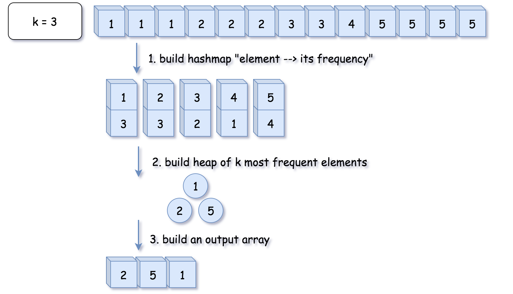

# INDEX

- [INDEX](#index)
  - [Notes](#notes)
  - [Top/Smallest/Frequent k Elements Technique](#topsmallestfrequent-k-elements-technique)
    - [Kth Largest Element in an Array](#kth-largest-element-in-an-array)
    - [Kth Largest Element in a Stream](#kth-largest-element-in-a-stream)
    - [Kth Smallest Element in an array](#kth-smallest-element-in-an-array)
    - [K Closest Points to Origin](#k-closest-points-to-origin)
    - [Connect Ropes](#connect-ropes)
    - [Top K Frequent Elements](#top-k-frequent-elements)
      - [Solution 1: using Heap](#solution-1-using-heap)
      - [Solution 2: using Bucket Sort](#solution-2-using-bucket-sort)
    - [Sort Characters By Frequency](#sort-characters-by-frequency)
    - [Top K Frequent Words](#top-k-frequent-words)
    - [Find K Closest Elements](#find-k-closest-elements)
    - [Least Number of Unique Integers after K Removals](#least-number-of-unique-integers-after-k-removals)
    - [Reorganize String](#reorganize-string)
  - [Delayed processing (K distance apart) Technique](#delayed-processing-k-distance-apart-technique)
    - [Rearrange String K Distance Apart](#rearrange-string-k-distance-apart)
    - [Task Scheduler](#task-scheduler)
  - [K-way Merge Technique](#k-way-merge-technique)
    - [Merge k Sorted Lists](#merge-k-sorted-lists)
    - [Kth Smallest Element in a Sorted Matrix](#kth-smallest-element-in-a-sorted-matrix)
    - [Smallest Range Covering Elements from K Lists](#smallest-range-covering-elements-from-k-lists)
    - [Find K Pairs with Smallest Sums](#find-k-pairs-with-smallest-sums)
  - [Two Heaps Technique](#two-heaps-technique)
    - [Find Median from Data Stream](#find-median-from-data-stream)
    - [IPO](#ipo)
    - [Sliding Window Median](#sliding-window-median)

---

## Notes

- By design, heaps are data structures that resemble binary trees, but they are not binary search trees.

---

## Top/Smallest/Frequent k Elements Technique

The best data structure to use to solve problems that involve finding the top/smallest/frequent `k` elements is **Heap**. Because the heap data structure allows us to add and remove elements in `O(logn)` time where `n` is the number of elements in the heap.

### Kth Largest Element in an Array

Given an integer array `nums` and an integer `k`, return the `kth` largest element in the array.

**You must solve it in O(n) time complexity.**

- EX: `nums = [3, 2, 1, 5, 6, 4], k = 2` --> `5`

  - Explanation: The largest element in the array is `6`, the second largest element is `5`.

- Explanation:
  - A brute force solution would be to sort the array and return the `kth` largest element, but the time complexity will be `O(nlogn)`
  - We can solve it in `O(n)` time complexity using a `Heap`:
    1. We iterate through the array and keep `k` largest elements in the heap such that each time we find a larger element than the smallest element in the heap, we do two things:
       - remove the smallest element from the heap
       - add the larger element to the heap
         
         
         
         
    2. This will ensure that the heap contains only the largest `k` elements at any time
    3. since that we can find the smallest element in the heap in `O(1)` time, and since the smallest number is always at the `root` of the heap, so we can call `heap[0]` to get the smallest element
       - So, extracting the smallest element from a heap of `k` elements will take `O(logN)` time

So the overall complexity will be `O(n + k log(n))` --> `O(n)`

```py
def find_kth_largest(nums, k):
    heap = []
    for i in range(k):
        heapq.heappush(heap, nums[i])

    for i in range(k, len(nums)):
        # if the current number is greater than the root of the heap, then pop the root and push the current number
        if nums[i] > heap[0]:
            heapq.heappop(heap)
            heapq.heappush(heap, nums[i])

    # now the root of the heap is the kth largest element
    return heap[0]
```

> Note: it can also be solved with section sort in `O(n)` time complexity average case, but `O(n^2)` worst case

---

### Kth Largest Element in a Stream

Design a class to find the `kth` largest element in a stream. Note that it is the `kth` largest element in the sorted order, not the `kth` distinct element.

Implement `KthLargest` class

- Ex:

  - input: `["KthLargest", "add", "add", "add", "add", "add"]`, `[[3, [4, 5, 8, 2]], [3], [5], [10], [9], [4]]`
  - output: `[null, 4, 5, 5, 8, 8]`

- Explanation:
  - Use `minHeap` to store the largest `k` elements by popping the top element if the size of the minHeap is larger than `k`, so that after popping the top element, the minHeap will contain the largest `k` elements.
  - and now to get the `kth` largest element, we just need to return the top element of the minHeap -> `minHeap[0]`

```py
class KthLargest:
    def __init__(self, k: int, nums: List[int]):
        self.k = k
        self.nums = nums

        # create a minHeap with the first k elements
        heapq.heapify(self.nums)
        # pop the top element of the minHeap until the size of the minHeap is equal to k
        while len(self.nums) > k:
            heapq.heappop(self.nums)

    def add(self, val: int) -> int:
        heapq.heappush(self.nums, val)
        if len(self.nums) > self.k:
            heapq.heappop(self.nums)
        return self.nums[0]
```

---

### Kth Smallest Element in an array

Given an unsorted array of numbers, find the ‘K’ smallest numbers in it.

```py
# Here we will use a maxHeap instead of a minHeap because we want to pop the largest element

def find_kth_smallest(nums, k):
    maxHeap = []
    for i in range(k):
        heapq.heappush(maxHeap, -nums[i])

    for i in range(k, len(nums)):
        if nums[i] < -maxHeap[0]:
            heapq.heappop(maxHeap)
            heapq.heappush(maxHeap, -nums[i])

    return -maxHeap[0]
```

---

### K Closest Points to Origin

Given an array of points where `points[i] = [xi, yi]` represents a point on the X-Y plane and an integer `k`, return the `k` closest points to the origin `(0, 0)`.
The distance between two points on the X-Y plane is the Euclidean distance (i.e., `√(x1 - x2)^2 + (y1 - y2)^2`).

- EX: `points = [[1, 3], [-2, 2]], k = 1` --> `[[-2, 2]]`

  - Explanation: The distance between `(1, 3)` and the origin is `sqrt(10)`, the distance between `(-2, 2)` and the origin is `sqrt(8)`, since `sqrt(8) < sqrt(10)`, therefore `(-2, 2)` is closer to the origin. We only want the closest `k = 1` points from the origin, so the answer is just `[[-2, 2]]`.

- Steps:
  1. we will use a minHeap instead of sorting the array because we want `O(n)` time complexity and not `O(nlogn)`
  2. push all the elements in the array to the minHeap -> `O(n)`
     - we don't need to calculate the root of the distance because we can compare the distance without calculating the root
  3. pop the top element of the minHeap `k` times to get the `k` closest points -> `O(k log(n))`

So the overall complexity will be `O(n + k log(n))` --> `O(n)`

```py
def k_closest(points, k):
    res = []
    minHeap = []

    for x, y in points:
        dist = (x ** 2) + (y ** 2)
        heapq.heappush(minHeap, [dist, x, y])

    for _ in range(k):
        dist, x, y = heapq.heappop(minHeap)
        res.append([x, y])

    return res
```

---

### Connect Ropes

Given `n` ropes of different lengths, we need to connect these ropes into one rope. We can connect only 2 ropes at a time. The cost required to connect 2 ropes is equal to the sum of their lengths. The length of this connected rope is also equal to the sum of their lengths. This process is repeated until n ropes are connected into a single rope. Find the min possible cost required to connect all ropes.

- EX:

  - Input: `[1, 3, 11, 5]`
  - Output: `33`
  - Explanation:
    - First, connect ropes of lengths `1` and `3` to generate a rope of length `4`.
    - Next, connect ropes of lengths `4` and `5` to generate a rope of length `9`.
    - Next, connect ropes of lengths `9` and `11` to generate a rope of length `20`.
    - Finally, connect the ropes of length `20` and `33` to generate a rope of length `33`.

- Explanation:
  - The idea here that we need to connect the smallest ropes first to get the minimum cost, so we can use a `minHeap` to store the smallest ropes
- Time Complexity: `O(n log(n))`, because we are pushing all the ropes to the `minHeap` and popping the top 2 ropes of the `minHeap` and adding them to the cost and pushing the sum of them to the `minHeap`

```py
def connect_ropes(ropes):
    minHeap = []
    cost = 0

    # push all the ropes to the minHeap
    for rope in ropes:
        heapq.heappush(minHeap, rope)

    # pop the top 2 ropes of the minHeap and add them to the cost and push the sum of them to the minHeap
    while len(minHeap) > 1:
        rope1 = heapq.heappop(minHeap)
        rope2 = heapq.heappop(minHeap)
        cost += rope1 + rope2
        heapq.heappush(minHeap, rope1 + rope2)

    return cost
```

---

### Top K Frequent Elements

Given an integer array `nums` and an integer `k`, return the `k` most frequent elements. You may return the answer in **any order**.

- EX: `nums = [1, 1, 1, 2, 2, 3], k = 2` --> `[1, 2]`

  - Explanation: The answer `[1, 2]` would also be accepted.

#### Solution 1: using Heap

- Steps:
  
  1. we will use a minHeap instead of sorting the array because we want `O(n)` time complexity and not `O(nlogn)`
  2. create a dictionary to store the frequency of each element in the array -> `O(n)`
  3. push all the elements in the dictionary to the minHeap (with the negative of the frequency-value because we want to pop the elements with the highest frequency) -> `O(n)`
  4. pop the top element of the minHeap `k` times to get the `k` most frequent elements -> `O(k log(n))`
  5. return the elements in the minHeap

```py
def top_k_frequent(nums, k):
    res = []
    minHeap = []
    freq = {}

    for num in nums:
        freq[num] = freq.get(num, 0) + 1

    for key, val in freq.items():
        heapq.heappush(minHeap, [-val, key])

    # now it's a minHeap but like a maxHeap
    for _ in range(k):
        res.append(heapq.heappop(minHeap)[1])

    return res
```

#### Solution 2: using Bucket Sort

- Steps:
  

  1. create a dictionary to store the frequency of each element in the array
  2. create a list of lists (buckets) with the `length of the array + 1`
     - index will be the frequency of the element and the value will be the elements with that frequency
  3. loop through the dictionary and append the key to the bucket with the index of the value (frequency)
  4. loop through the buckets from the end (max frequency) and append the elements to the result list until the length of the result list is `k` -> `O(n)`
  5. return the result list

```py
def top_k_frequent(nums, k):
    res = []
    count = {}
    freq_buckets = [[] for _ in range(len(nums)+1)]

    for num in nums:
        count[num] = count.get(num, 0) + 1

    for n, c in count.items():
        freq_buckets[c].append(n)

    # now freq_buckets is a list of lists with the index as the frequency and the value as the elements with that frequency, so we can loop through it from the end and append the elements to the result list
    for i in range(len(freq_buckets)-1, -1, -1):
        for n in freq_buckets[i]:
            res.append(n)
            if len(res) == k:
                return res
```

---

### Sort Characters By Frequency

Given a string `s`, sort it in **decreasing order** based on the **frequency** of characters, and return the sorted string.

- EX: `s = "tree"` --> `"eert"`

  - Explanation: `'e'` appears twice while `'r'` and `'t'` both appear once. So `'e'` must appear before both `'r'` and `'t'`. Therefore `"eetr"` is also a valid answer.

- Solution 1: using Heap

  ```py
  def frequency_sort(s):
      maxHeap = []
      freqDict = {}

      for char in s:
          freqDict[char] = freqDict.get(char, 0) + 1
      for key, val in freqDict.items():
          heapq.heappush(maxHeap, [-val, key]) # python heapify pairs by the first element

      res = ''
      while maxHeap:
          freq, char = heapq.heappop(maxHeap)
          for _ in range(-freq):
              res += char

      return res
  ```

- Solution 2: using Bucket Sort

  ```py
  def frequency_sort(s):
      freq = {}
      buckets = [[] for _ in range(len(s)+1)]

      for char in s:
          freq[char] = freq.get(char, 0) + 1
      for char, count in freq.items():
          buckets[count].append(char)

      res = ''
      for i in range(len(buckets)-1, -1, -1):
          if buckets[i]:
              for char in buckets[i]:
                  res += char * i

      return res
  ```

---

### Top K Frequent Words

Given an array of strings `words` and an integer `k`, return the `k` most frequent strings.
Return the answer **sorted** by the **frequency** from highest to lowest. Sort the words with the same frequency by their **lexicographical order**.

- EX: `words = ["i", "love", "leetcode", "i", "love", "coding"], k = 2` --> `["i", "love"]`

  - Explanation: "i" and "love" are the two most frequent words.
    Note that "i" comes before "love" due to a lower alphabetical order.

```py
def top_k_frequent(words, k):
    res = []
    freq = {}
    buckets = [[] for _ in range(len(words)+1)]

    for word in words:
        freq[word] = freq.get(word, 0) + 1

    for word, count in freq.items():
        buckets[count].append(word)

    for i in range(len(buckets)-1, -1, -1):
        if len(res) == k:
            break
        if buckets[i]:
            buckets[i].sort()
            res.extend(buckets[i])

    return res
```

---

### Find K Closest Elements

Given a **sorted** integer array `arr`, two integers `k` and `x`, return the `k` closest integers to `x` in the array. The result should also be sorted in ascending order.

An integer `a` is closer to `x` than an integer `b` if:

- `|a - x| < |b - x|`, or
- `|a - x| == |b - x|` and `a < b`

- EX: `arr = [1, 2, 3, 4, 5], k = 4, x = 3` --> `[1, 2, 3, 4]`

  - Explanation: The closest elements to the target are `[3, 4, 5]`, and their absolute difference is `|3 - 3| = 0`, `|4 - 3| = 1`, and `|5 - 3| = 2`. Among them, `[1, 2, 3, 4]` is the **sorted** array.

- Solution 1

  ```py
  def find_closest_elements(arr, k, x):
      res = []
      minHeap = []

      for num in arr:
          heapq.heappush(minHeap, [abs(num - x), num])

      for _ in range(k):
          res.append(heapq.heappop(minHeap)[1])

      res.sort()
      return res
  ```

- Solution 2: more optimized using `binary search`

  ```py
  def find_closest_elements(arr, k, x):
      idx = binary_search(arr, x)
      l, r = idx - k, idx + k
      l = max(l, 0) # to make sure that l is not out of bounds
      r = min(r, len(arr) - 1) # to make sure that r is not out of bounds

      minHeap = []
      for i in range(l, r + 1):
          heapq.heappush(minHeap, [abs(arr[i] - x), arr[i]])

      res = []
      for _ in range(k):
          res.append(heapq.heappop(minHeap)[1])

      res.sort()
      return res

  def binary_search(arr, target):
      l, r = 0, len(arr) - 1
      while l <= r:
          mid = (l + r) // 2
          if arr[mid] == target:
              return mid
          elif arr[mid] < target:
              l = mid + 1
          else:
              r = mid - 1
      return l
  ```

---

### Least Number of Unique Integers after K Removals

Given an array of integers `arr` and an integer `k`. Find the least number of unique integers after removing **exactly** `k` elements.

- EX: `arr = [5, 5, 4], k = 1` --> `1`

  - Explanation: Remove the single `4`, only `5` is left.

```py
def find_least_num_of_unique_ints(arr, k):
    freq = {}
    for num in arr:
        freq[num] = freq.get(num, 0) + 1

    minHeap = []
    for key, val in freq.items():
        heapq.heappush(minHeap, [val, key])

    for _ in range(k):
        freq, key = heapq.heappop(minHeap)
        freq -= 1
        if freq > 0:
            heapq.heappush(minHeap, [freq, key])

    return len(minHeap)
```

---

### Reorganize String

Given a string `s`, rearrange the characters of `s` so that any two adjacent characters are not the same.
Return any possible rearrangement of `s` or return `""` if not possible.

- EX: `s = "aab"` --> `"aba"`
  - Explanation: `aab` --> `aba`
- EX: `s = "aaab"` --> `""`
- EX: `s = "aaabc"` --> `"abaca"`

- Explanation:
  - To solve this we need to use the most frequent characters first and then the less frequent characters. For which we can use a `maxHeap`
  - on each iteration we will pop the top element of the maxHeap and append it to the result string
    - By appending the most frequent character first, we have the best chance to find a string where no two same characters come next to each other.
    - if the last element of the result string is the same as the current element, pop the next element and append it to the result string
    - if the `maxHeap` is empty and the last element of the result string is the same as the current element, this means that we can't reorganize the string so we return `""`

```py
def reorganize_string(s):
    maxHeap = []
    freqDict = {}

    # create a dictionary to store the frequency of each character in the string
    for char in s:
        freqDict[char] = freqDict.get(char, 0) + 1
    # push all the elements in the dictionary to the maxHeap by their frequency in negative form (because we want to pop the elements with the highest frequency)
    for key, val in freqDict.items():
        heapq.heappush(maxHeap, [-val, key]) # python heapify pairs by the first element

    res = ''
    prev = None
    # pop the top element of the maxHeap and append it to the result string
    while maxHeap or prev:
        # if the maxHeap is empty and the last element of the result string is the same as the current element, return ""
        if prev and not maxHeap:
            return ''

        # 1. pop the top element of the maxHeap + append it to the result + decrement the frequency by 1 to reach 0
        freq, char = heapq.heappop(maxHeap)
        res += char
        freq += 1 # decrement the frequency by 1 to reach 0

        # 2. if prev is not None, we will push it back to the maxHeap with updated frequency
        if prev:
            heapq.heappush(maxHeap, prev)
            prev = None

        # 3. if the frequency of the popped element not 0, we will store the popped element as prev
        if freq != 0:
            prev = [freq, char]

    return res
```

---

## Delayed processing (K distance apart) Technique

This technique is used when we need to process the same element with a delay of `k` elements.

- It can be solved using:
  - `heap` -> to store the elements with the most (frequency / largest value / highest priority)
  - `queue` -> to store the elements that we can't process yet because of the distance `k`

### Rearrange String K Distance Apart

Given a non-empty string `s` and an integer `k`, rearrange the string such that the same characters are at least distance `k` from each other.

- EX: `s = "aabbcc", k = 3` --> `"abcabc"`

  - Explanation: The same letters are at least distance 3 from each other.

- Explanation:
  - We can follow similar approach to the previous problem, but we need to use a `queue` to store the elements that we can't process yet because of the distance `k`

```py
def rearrange_string(s, k):
    count = Counter(s)
    maxHeap = []
    for key, val in count.items():
        heapq.heappush(maxHeap, [-val, key])

    q = deque()
    res = ''
    while maxHeap:
      freq, char = heapq.heappop(maxHeap)
      res += char
      freq += 1 # decrement the frequency by 1 to reach 0

      # append the element to the queue with updated frequency
      q.append([freq, char])
      if len(q) == k:
        # if the distance is k, we will pop the element from the queue and push it back to the maxHeap
        freq, char = q.popleft()
        if freq != 0:
          heapq.heappush(maxHeap, [freq, char]) # It's already negative, so we don't need to make it negative again

    # if the length of the result string is equal to the length of the input string, return the result string because we processed all the elements
    return res if len(res) == len(s) else ''

```

---

### Task Scheduler

Given a characters array `tasks`, representing the tasks a CPU needs to do, where each letter represents a different task. Tasks could be done in any order. Each task is done in one unit of time. For each unit of time, the CPU could complete either one task or just be idle.

However, there is a non-negative integer `n` that represents the **cooldown** period between two **same tasks** (the same letter in the array), that is that there must be at least `n` units of time between any two same tasks.

Return the least number of units of times that the CPU will take to finish all the given tasks.

- EX: `tasks = ["A","A","A","B","B","B"], n = 2` --> `8`

  - Explanation:
    - A -> B -> idle -> A -> B -> idle -> A -> B
    - There is at least 2 units of time between any two same tasks.

- Explanation:
  - The idea here that we can't process the same task twice without a cooldown period of `n`, so we will process the most frequent tasks first and then the less frequent tasks
  - we can use a dictionary to store the frequency of each task -> `count`
    
  - We want to process the most frequent tasks first, so that we can process the less frequent tasks while we are waiting for the cooldown period to end. so we will use a `maxHeap` to store the tasks with the most frequency
    
  - we can use a `queue` to store the tasks that we can't process yet because of the cooldown period -> `q`
    
  - on each iteration we will pop the top element of the `maxHeap` and append it to the result string
    - if the cooldown period is over in the `queue`, we will push the element back to the `maxHeap`, so that we can process it again
      
    - if the `maxHeap` is empty, we will add idle time to the result, because we can't process any task yet

```py
def least_interval(tasks, n):
    count = Counter(tasks)
    maxHeap = [-val for val in count.values()] # python heapify pairs by the first element
    heapq.heapify(maxHeap)

    time = 0
    q = deque()

    while maxHeap or q:
        if maxHeap:
            time += 1
            freq = heapq.heappop(maxHeap) + 1 # we add 1 to the frequency because we processed the task
            if freq:
                q.append([freq, time + n]) # push to the queue with updated frequency and the time

        # if the maxHeap is empty, we will make time = the time of the next element in the queue
        else:
            time = q[0][1]

        # if the cooldown period is over, we will push the element back to the maxHeap
        if q and q[0][1] == time:
            heapq.heappush(maxHeap, q.popleft()[0]) # push the frequency only

    return time
```

---

## K-way Merge Technique

Whenever we're given `k` sorted arrays, we can use a `minHeap` to perform a **K-way merge**.

- We push the smallest element of each array to the `minHeap` and pop the top element of the `minHeap` and push it to the result array.
- We repeat this process until we have no more elements in the `minHeap`.

### Merge k Sorted Lists

Merge `k` sorted linked lists and return it as one sorted list. Analyze and describe its complexity.

- EX:

  - input: `lists = [[1, 4, 5], [1, 3, 4], [2, 6]]`
  - output: `[1, 1, 2, 3, 4, 4, 5, 6]`

- Explanation:

  - A brute force solution could be to add all elements of the given `K` lists to one list and sort it. If there are a total of `N` elements in all the input lists, then the brute force solution will have a time complexity of `O(nlog(n))` as we will need to sort the merged list. Can we do better than this? How can we utilize the fact that the input lists are individually sorted?
  - If we have to find the smallest element of all the input lists, we have to compare only the smallest (i.e. the first) element of all the lists. Once we have the smallest element, we can put it in the merged list. Following a similar pattern, we can then find the next smallest element of all the lists to add it to the merged list.

- **Solution 1:** using `merge_sorted_lists` function above

  - **Time Complexity:** `O(nk log(n))`
  - **Space Complexity:** `O(nk)`
  - **Steps:**
    1. create an empty list to store the merged lists
    2. merge the lists in a pairwise fashion until only one list remains
    3. return the first list in the merged_lists

  ```py
  def mergeKLists(self, lists: List[ListNode]) -> ListNode:
      if not lists or len(lists) == 0:
          return None

      merged_lists = []

      # merge the lists in a pairwise fashion until only one list remains
      for lst in lists:
          merged_lists = self.merge_sorted_lists(merged_lists, lst)

      # return the first list in the merged_lists
      return merged_lists

  def merge_sorted_lists(self, l1: ListNode, l2: ListNode) -> ListNode:
      dummy = ListNode(0)
      curr = dummy
      while l1 and l2:
          if l1.val < l2.val:
              curr.next = l1
              l1 = l1.next
          else:
              curr.next = l2
              l2 = l2.next
          curr = curr.next
      curr.next = l1 or l2
      return [dummy.next]
  ```

- **Solution 2:** using **Priority Queue** (`minHeap`) ✅

  - **Time Complexity:** `O(N log(k))`
    - `N` is the total number of elements in all the `k` input arrays
  - **Space Complexity:** `O(k)`
  - **Steps:**
    1. insert the first element of each array in a `minHeap`
       
    2. pop the smallest element from the `minHeap` and add it to the result array
       
    3. After removing the smallest element from the heap, we can insert the next element of the same list into the heap
       
    4. We can repeat steps 2 and 3 to populate the result array with the next smallest number

  ```py
  def mergeKLists(self, lists: List[ListNode]) -> ListNode:
      # modify the ListNode class to support comparison operators
      ListNode.__eq__ = lambda self, other: self.val == other.val
      ListNode.__lt__ = lambda self, other: self.val < other.val

      minHeap = []

      for root in lists:
          if root:
              heapq.heappush(minHeap, (root.val, root))

      # take the smallest element from the minHeap and add it to the result array
      resHead, resTail = None, None
      while minHeap:
          _, node = heapq.heappop(minHeap)
          if not resHead:
              resHead = resTail = node
          else:
              resTail.next = node
              resTail = resTail.next
          # if the node has a next, push it to the minHeap
          if node.next:
              heapq.heappush(minHeap, (node.next.val, node.next))

      return resHead
  ```

---

### Kth Smallest Element in a Sorted Matrix

Given an `n x n` `matrix` where each of the rows and columns are sorted in ascending order, return the `kth` smallest element in the matrix.

Note that it is the `kth` smallest element **in the sorted order**, not the `kth` distinct element.

- EX: `matrix = [[1, 5, 9], [10, 11, 13], [12, 13, 15]], k = 8` --> `13`

  - Explanation: The elements in the matrix are `[1, 5, 9, 10, 11, 12, 13, 13, 15]`, and the 8th smallest number is `13`

```py
def kth_smallest(matrix, k):
    minHeap = []
    for i in range(len(matrix)):
        for j in range(len(matrix[0])):
            heapq.heappush(minHeap, matrix[i][j])

    for _ in range(k):
        res = heapq.heappop(minHeap)

    return res

# ---------------------------------------------- #

# Optimized Solution (need more understanding ⚠️)
def kth_smallest(matrix, k):
    minHeap = []
    # push the first element of each row to the minHeap (smallest element in each row)
    for i in range(len(matrix)):
        heapq.heappush(minHeap, (matrix[i][0], 0, matrix[i]))
    # pop the top element of the minHeap and push the next element of the same row to the minHeap
    for _ in range(k):
        val, idx, row = heapq.heappop(minHeap)
        if idx + 1 < len(row):
            heapq.heappush(minHeap, (row[idx + 1], idx + 1, row))

    return val
```

- it can also be solved using `binary search` ❌
  
  
  

---

### Smallest Range Covering Elements from K Lists

You have `k` lists of sorted integers in **non-decreasing order**. Find the **smallest** range that includes at least one number from each of the `k` lists.

We define the range `[a, b]` is smaller than range `[c, d]` if `b - a < d - c` or `a < c` if `b - a == d - c`.

- EX: `nums = [[4, 10, 15, 24, 26], [0, 9, 12, 20], [5, 18, 22, 30]]` --> `[20, 24]`

  - Explanation: `[20, 24]` is the smallest range that includes at least one number from each of the 3 lists.
    - `4` --> `[4, 10, 15, 24, 26]`
    - `20` --> `[20]`
    - `5` --> `[5, 18, 22, 30]`

- Time Complexity: `O(n log(k))`
  - n is the total number of elements in all the `k` input arrays
- Space Complexity: `O(k)`

```py
def smallest_range(nums):
    minHeap = []
    maxVal = float('-inf')
    rangeStart, rangeEnd = 0, float('inf')

    # push the first element of each list to the minHeap
    for i in range(len(nums)):
        heapq.heappush(minHeap, (nums[i][0], i, 0))
        maxVal = max(maxVal, nums[i][0])

    while len(minHeap) == len(nums):
        val, row, col = heapq.heappop(minHeap)
        # if the range is smaller than the current range, update the range
        if rangeEnd - rangeStart > maxVal - val:
            rangeStart = val
            rangeEnd = maxVal
        # if the current list has more elements, push the next element to the minHeap
        if col + 1 < len(nums[row]):
            heapq.heappush(minHeap, (nums[row][col + 1], row, col + 1))
            maxVal = max(maxVal, nums[row][col + 1])

    return [rangeStart, rangeEnd]
```

---

### Find K Pairs with Smallest Sums

Given two integer arrays `nums1` and `nums2`, return the `k` pairs `(u, v)`

- EX:

  - input: `nums1 = [1, 7, 11], nums2 = [2, 4, 6], k = 3`
  - output: `[[1, 2], [1, 4], [1, 6]]`
  - explanation: The first 3 pairs are returned from the sequence:
    - `[1, 2], [1, 4], [1, 6], [7, 2], [7, 4], [11, 2], [7, 6], [11, 4], [11, 6]`

- Explanation:

  - if we tried to push all the pairs to a `minHeap`, then push the top `k` pairs to the result list, we will get a **Time Limit Exceeded** error
  - Instead, we can start by pushing the first `k` pairs to the `minHeap`, then on each iteration we will pop the top element of the `minHeap` and push the next element of the same list to the `minHeap`

- Time Complexity: `O(k log(k))`
  - `k` is the number of pairs we need to return
- Space Complexity: `O(k)`

```py
def kSmallestPairs(nums1, nums2, k):
    minHeap = []
    # start with pairs of the first element of nums2 with all the elements of nums1
    for i in range(min(k, len(nums1))):
        heapq.heappush(minHeap, (nums1[i] + nums2[0], i, 0))

    res = []
    while minHeap and k > 0:
        _, i, j = heapq.heappop(minHeap)
        res.append([nums1[i], nums2[j]])
        # if there are more elements in nums2, push the next element to the minHeap
        if j + 1 < len(nums2):
            heapq.heappush(minHeap, (nums1[i] + nums2[j + 1], i, j + 1))
        # decrement k by 1
        k -= 1

    return res


```

---

## Two Heaps Technique

### Find Median from Data Stream

The median is the middle value in an ordered integer list. If the size of the list is even, there is no middle value and the median is the mean of the two middle values.

- EX: `[2,3,4]` --> `3`
- EX: `[2,3]` --> `2.5`
  - Explanation: `(2 + 3) / 2 = 2.5`
- EX: `[2,3,4,5]` --> `3.5`

  - Explanation: `(3 + 4) / 2 = 3.5`

- Design a data structure that supports the following two operations:

  - `addNum(int num)` - Add a integer number from the data stream to the data structure.
  - `findMedian()` - Return the median of all elements so far.

- **Solution:**

  1. The idea here that we need the data to be sorted to get the middle value (median). So we need to insert elements **in order**, we'll use 2 heaps:
     
     - we can use a `minHeap` to store the larger half of the data
     - we can use a `maxHeap` to store the smaller half of the data
       - remember to use negative values to make it a maxHeap in python
     - we can use a variable to store the median
  2. on each `addNum()` call, we will add the new element to the `minHeap` if it's larger than the median, otherwise we will add it to the `maxHeap`
     

     - if the size of the `minHeap` is larger than the `maxHeap` by 2, we will pop the top element of the `minHeap` and push it to the `maxHeap`
     - if the size of the `maxHeap` is larger than the `minHeap` by 2, we will pop the top element of the `maxHeap` and push it to the `minHeap`

  3. on each `findMedian()` call, we will check the size of the `minHeap` and `maxHeap`: (if one heap is larger than the other by 1, we know that we have **odd** number of elements, so the median will be the top element of the larger heap)
     
     - if the size of the `minHeap` is equal to the `maxHeap`, we will calculate the median by getting the average of the top elements of the `minHeap` and `maxHeap`
     - if the size of the `minHeap` is larger than the `maxHeap`, the median will be the top element of the `minHeap`
     - if the size of the `maxHeap` is larger than the `minHeap`, the median will be the top element of the `maxHeap`

```py
class MedianFinder:

    def __init__(self):
        """
        initialize your data structure here.
        """
        # two heaps, large, small, minheap, maxheap
        # heaps should be equal size
        self.small, self.large = [], []  # maxHeap, minHeap (python default)


    def addNum(self, num: int) -> None:
        if self.large and num > self.large[0]:
            heapq.heappush(self.large, num)
        else:
            heapq.heappush(self.small, -1 * num) # negative the num to make it a maxHeap

        # uneven heaps size ?
        if len(self.small) > len(self.large) + 1:
            val = -1 * heapq.heappop(self.small)
            heapq.heappush(self.large, val)
        if len(self.large) > len(self.small) + 1:
            val = heapq.heappop(self.large)
            heapq.heappush(self.small, -1 * val)

    def findMedian(self) -> float:
        # if odd number of elements:
        if len(self.small) > len(self.large):
            return -1 * self.small[0]
        elif len(self.large) > len(self.small):
            return self.large[0]
        # if even number of elements:
        return (-1 * self.small[0] + self.large[0]) / 2
```

---

### IPO

Suppose LeetCode will start its IPO soon. In order to sell a good price of its shares to Venture Capital, LeetCode would like to work on some projects to increase its capital before the IPO. Since it has limited resources, it can only finish at most `k` distinct projects before the IPO. Help LeetCode design the best way to maximize its total capital after finishing at most `k` distinct projects.

You are given `n` projects where the `ith` project has a pure profit `profits[i]` and a minimum capital of `capital[i]` is needed to start it.

Initially, you have `w` capital. When you finish a project, you will obtain its pure profit and the profit will be added to your total capital.

Pick a list of **at most** `k` distinct projects from given projects to maximize your final capital, and return the final maximized capital.

- EX: `k = 2, w = 0, profits = [1, 2, 3], capital = [0, 1, 1]` --> `4`

  - Explanation:
    - Since your initial capital is 0, you can only start the project indexed 0.
    - After finishing it you will obtain profit 1 and your capital becomes 1.
    - With capital 1, you can either start the project indexed 1 or the project indexed 2.
    - Since you can choose at most 2 projects, you need to finish the project indexed 2 to get the maximum capital.
    - Therefore, output the final maximized capital, which is 0 + 1 + 3 = 4.

- Explanation:
  - The thing here is that we can only add the profit of the project to the capital if the capital is greater than or equal to the minimum capital of the project
    
  - So we need to find the maximum profit that we can get with the current capital, so we can use a `maxHeap` to get the maximum profit
  - We will use a `minHeap` to store the projects that we can't process yet because the capital is less than the minimum capital of the project and then pop the top element of the `minHeap` and add it to the `maxHeap` when the capital is greater than or equal to the minimum capital of the project
    
  - on each iteration we will pop the top element of the `maxHeap` and add it to the capital because we know that the capital is greater than or equal to the minimum capital of the project
    - Meaning that we will go like this:
      - smaller capital --> larger capital (`minHeap`)
      - Larger profit --> smaller profit (`maxHeap`)
        

```py
def find_maximized_capital(k, w, profits, capital):
    minHeap = [] # for the projects that we can't process yet because the capital is less than the minimum capital of the project
    maxHeap = [] # for the projects that we can process

    # push all the projects to the minHeap by their capital
    for i in range(len(profits)):
        heapq.heappush(minHeap, [capital[i], profits[i]]) # based on the capital

    # loop k times
    for _ in range(k):
        # while the minHeap is not empty and the capital of the top element is less than or equal to w, we will push the profit of the top element to the maxHeap
        while minHeap and minHeap[0][0] <= w:
            capital, profit = heapq.heappop(minHeap)
            heapq.heappush(maxHeap, -profit)

        # if the maxHeap is empty, break (as we can't get more profit)
        if not maxHeap:
            break

        # add the top element of the maxHeap to w
        w -= heapq.heappop(maxHeap)

    return w
```

---

### Sliding Window Median

Given an array of integers `nums` and an integer `k`, return the median of the sliding window of size `k`.

You're given an array of integers `nums`, there is a sliding window of size `k` which is moving from the very `left` of the array to the very `right`. You can only see the `k` numbers in the window. Each time the sliding window moves right by one position.

- EX: `nums = [1, 3, -1, -3, 5, 3, 6, 7], k = 3` --> `[1, -1, -1, 3, 5, 6]`

  - Explanation:

    ```py
    # window position                median
    # ---------------                -----
    [1  3  -1] -3  5  3  6  7        1
     1 [3  -1  -3] 5  3  6  7       -1
     1  3 [-1  -3  5] 3  6  7       -1
     1  3  -1 [-3  5  3] 6  7        3
     1  3  -1  -3 [5  3  6] 7        5
     1  3  -1  -3  5 [3  6  7]       6
    ```

- Explanation:
  - The idea here that we need the data to be sorted to get the middle value (median). So we need to insert elements **in order**, we'll use 2 heaps:
    
    - we can use a `minHeap` to store the larger half of the data
    - we can use a `maxHeap` to store the smaller half of the data
      - remember to use negative values to make it a maxHeap in python

```py
def median_sliding_window(nums, k):
    res = []
    small, large = [], []

    for i in range(len(nums)):
        # add the new element to the minHeap if it's larger than the median, otherwise add it to the maxHeap
        if not small or nums[i] > small[0]:
            heapq.heappush(small, nums[i])
        else:
            heapq.heappush(large, -nums[i])

        # Balance the 2 heaps
        if len(small) > len(large) + 1:
            heapq.heappush(large, -heapq.heappop(small))
        if len(large) > len(small) + 1:
            heapq.heappush(small, -heapq.heappop(large))

        # if the window is full, we will calculate the median
        if i >= k-1:
            # if the size of the minHeap is equal to the maxHeap, we will calculate the median by getting the average of the top elements of the minHeap and maxHeap
            if len(small) == len(large):
                res.append((-large[0] + small[0]) / 2)
            # if the size of the minHeap is larger than the maxHeap, the median will be the top element of the minHeap
            elif len(small) > len(large):
                res.append(small[0])
            # if the size of the maxHeap is larger than the minHeap, the median will be the top element of the maxHeap
            else:
                res.append(-large[0])

            # TODO: remove the element that is out of the window from the heap


    return res
```

---
