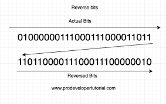

# INDEX

- [INDEX](#index)
  - [Notes](#notes)
  - [Single Number](#single-number)
  - [Single Number II](#single-number-ii)
  - [Single Number III](#single-number-iii)
  - [Reverse Bits](#reverse-bits)
  - [Complement of Base 10 Integer](#complement-of-base-10-integer)
  - [Flipping an Image](#flipping-an-image)

---

## Notes

```py
# AND
1 & 1 = 1

# OR
1 | 0 = 1

# XOR
1 ^ 0 = 1
1 ^ 1 = 0

# NOT
~1 = 0

# Bit shifting
1 << 1 = 10 # shift left
10 >> 1 = 1 # shift right
```

- properties of `XOR`:

  ```py
  a ^ a = 0 # same numbers cancel each other
  a ^ 0 = a # any number XOR 0 is the number itself
  a ^ b ^ a = b # XOR is associative and commutative
  ```

- Count number of bits in a number

  ```py
  def count_bits(n):
      count = 0
      while n:
          count += n & 1 # check if the last bit is 1
          n >>= 1 # shift the number to the right by 1 bit
      return count
  ```

---

## Single Number

Given a **non-empty** array of integers `nums`, every element appears _twice_ except for one. Find that single one.

- Ex:

  - Input: `nums = [2,2,1]`
  - Output: `1`

- Explanation:
  - One way to solve this problem is to use a **hash table** to store the number of times each number appears in the array, and then loop through the hash table to find the number that appears only once
    - This will be `O(n)` time and `O(n)` space
  - We can do better by using **bit manipulation**
    - We can use the **bitwise XOR** operator to get the number that appears only once
      - `a ^ a = 0` -> same numbers cancel each other
      - So, if we XOR all the numbers in the array, we will get the number that appears only once

```py
def single_number(nums):
    res = 0
    for num in nums:
        res ^= num
    return res
```

---

## Single Number II

Given an integer array `nums` where every element appears **three times** except for one, which appears **exactly once**. Find the single element and return it.

- Ex:

  - Input: `nums = [2,2,3,2]`
  - Output: `3`

- Explanation:
  - It's similar to the previous problem, but now each number appears 3 times instead of 2
  - To do so, we can use 2 variables `ones` and `twos`
    - `ones` will store the number that appears once
    - `twos` will store the number that appears twice

```py
def single_number(nums):
    ones = 0
    twos = 0

    for num in nums:
        ones = (ones ^ num) & ~twos # XOR the number with ones and then AND it with the complement of twos
        twos = (twos ^ num) & ~ones # XOR the number with twos and then AND it with the complement of ones

    return ones
```

---

## Single Number III

Given an integer array `nums`, in which exactly two elements appear only once and all the other elements appear exactly twice. Find the two elements that appear only once. You can return the answer in **any order**.

- Ex:

  - Input: `nums = [1,2,1,3,2,5]`
  - Output: `[3,5]`

- Explanation:

  - It's similar to the previous problem, but now each number appears twice except for 2 numbers that appear once
  - Let's assume `num1` and `num2` are the 2 numbers that appear once, if we do `XOR` on all the numbers in the array, we will be left with `XOR` of `num1` and `num2`
  - now, we want to find `num1` and `num2` separately

    - we know that `num1` and `num2` are different, so their `XOR` result will have at least 1 bit set

      ```py
      1 ^ 0 = 1
      ```

    - We can take any bit which is ‘1’ in `n1xn2` and partition all numbers in the given array into two groups based on that bit. One group will have all those numbers with that bit set to ‘0’ and the other with the bit set to ‘1’. This will ensure that `num1` will be in one group and `num2` will be in the other. We can take XOR of all numbers in each group separately to get `num1` and `num2`, as all other numbers in each group will cancel each other. Here are the steps of our algorithm:
      1. Taking XOR of all numbers in the given array will give us XOR of `num1` and `num2`, calling this XOR as `n1xn2`.
      2. Find any bit which is set in `n1xn2`. We can take the rightmost bit which is ‘1’. Let’s call this `rightmostSetBit`.
      3. Iterate through all numbers of the input array to partition them into two groups based on `rightmostSetBit`. Take XOR of all numbers in both the groups separately. Both these XORs are equal to `num1` and `num2`.

```py
def single_number(nums):
    # Get the XOR of all the numbers -> which is the XOR of the 2 numbers that appear once
    n1xn2 = 0
    for num in nums:
        n1xn2 ^= num

    # get the rightmost set bit that is '1'
    rightmost_set_bit = 1
    while (rightmost_set_bit & n1xn2) == 0:
        rightmost_set_bit = rightmost_set_bit << 1 # shift the number to the left by 1 bit

    # partition the numbers into 2 groups based on the rightmost set bit
    num1, num2 = 0, 0
    for num in nums:
        if (num & rightmost_set_bit) != 0:
            num1 ^= num
        else:
            num2 ^= num

    return [num1, num2]
```

---

## Reverse Bits

Reverse bits of a given 32 bits unsigned integer.

- Ex:

  - Input: `n = 00000010100101000001111010011100`
  - Output: `964176192 (00111001011110000010100101000000)`
  - Explanation: The input binary string `00000010100101000001111010011100` represents the unsigned integer `43261596`, so return `964176192` which its binary representation is `00111001011110000010100101000000`.

- Explanation:
  
  - We can use the **bitwise AND** operator to get the last bit of the number
    - `n & 1` -> This will give us the last bit of the number
      - Ex: `n = 5` -> `n & 1` -> `101 & 001` -> `001`
  - We can then shift the number to the right by 1 bit
    - `n >> 1` -> This will shift the number to the right by 1 bit
      - Ex: `n = 5` -> `n >> 1` -> `101 >> 1` -> `10`
  - We can then shift the result to the left by 1 bit
    - `result << 1` -> This will shift the result to the left by 1 bit
      - Ex: `result = 0` -> `result << 1` -> `0 << 1` -> `0`
  - Finally, we can add the last bit to the result
    - `result | (n & 1)` -> This will add the last bit to the result
      - Ex: `result = 0` -> `result | (n & 1)` -> `0 | (101 & 001)` -> `0 | 001` -> `1`

```py
def reverseBits(n):
    result = 0

    for _ in range(32):
        # shift the result to the left by 1 bit
        result = result << 1
        # add the last bit to the result
        result = result | (n & 1)
        # shift the number to the right by 1 bit
        n = n >> 1

    return result
```

---

## Complement of Base 10 Integer

The complement of an integer is the integer you get when you flip all the `0`'s to `1`'s and all the `1`'s to `0`'s in its binary representation.

- Every non-negative integer `n` has a binary representation, for example:

  - `8` can be represented as `"1000"` in binary
  - its complement is `"0111"` in binary, which is `7` in base-10

- Ex:

  - Input: `n = 5`
  - Output: `2`
  - Explanation: `5` is `"101"` in binary, with complement `"010"` in binary, which is `2` in base-10

- Solution 1

  ```py
  def bitwiseComplement(n):
      if n == 0:
          return 1

      # get the number of bits in n
      num_bits = n.bit_length()

      mask = (1 << num_bits) - 1 # 1 << num_bits = 1 << 3 = 1000 -> 1000 - 1 = 0111

      # XOR the number with the mask to get the complement
      return n ^ mask
  ```

- Solution 2:

  ```py
  def bitwiseComplement(n):
      bitCount = 0
      while n > 0:
          bitCount += 1
          n = n >> 1
      # now n = 0, bitCount = number of bits in n

      all_bits_set = pow(2, bitCount) - 1 # 2 ^ bitCount = 2 ^ 3 = 1000 -> 1000 - 1 = 0111

      # XOR the number with the mask to get the complement
      return n ^ all_bits_set
  ```

---

## Flipping an Image

Given an `n x n` binary matrix `image`, flip the image **horizontally**, then invert it, and return _the resulting image_.

- To flip an image horizontally means that each row of the image is reversed.
  - For example, flipping `[1,1,0]` horizontally results in `[0,1,1]`.
- To invert an image means that each `0` is replaced by `1`, and each `1` is replaced by `0`.

  - For example, inverting `[0,1,1]` results in `[1,0,0]`.

- Ex:
  - Input: `image = [[1,1,0],[1,0,1],[0,0,0]]`
  - Output: `[[1,0,0],[0,1,0],[1,1,1]]`
  - Explanation: First reverse each row: `[[0,1,1],[1,0,1],[0,0,0]]`.
    Then, invert the image: `[[1,0,0],[0,1,0],[1,1,1]]`

```py
def flipAndInvertImage(image):
    for row in image:
        # reverse the row
        row.reverse()

        # invert the row
        for i in range(len(row)):
            row[i] = row[i] ^ 1 # XOR the number with 1 to invert it

    return image
```
