# INDEX

- [INDEX](#index)
  - [Algorithm Analysis (Big-Oh)](#algorithm-analysis-big-oh)
    - [O(n)](#on)
      - [Polynomials](#polynomials)
    - [O(1)](#o1)
    - [O(n^2)](#on2)
    - [O(log(n))](#ologn)
    - [O(n log(n))](#on-logn)
    - [O(n!)](#on-1)
    - [Rules to improve Big o](#rules-to-improve-big-o)
    - [Notes](#notes)
  - [Recursion](#recursion)
    - [Helper Method Recursion](#helper-method-recursion)
    - [Big-O Runtime for Recursive Functions](#big-o-runtime-for-recursive-functions)
    - [Maximum Recursive Depth](#maximum-recursive-depth)
      - [When recursion goes wrong](#when-recursion-goes-wrong)
  - [Dynamic Programming](#dynamic-programming)
    - [Memoization](#memoization)
  - [Sorting](#sorting)
    - [Elementary Sorting Algorithms](#elementary-sorting-algorithms)
      - [Bubble Sort](#bubble-sort)
      - [Selection Sort](#selection-sort)
      - [Insertion Sort](#insertion-sort)
    - [Merge Sort](#merge-sort)
    - [Quick Sort](#quick-sort)
      - [Quick sort Pseudocode](#quick-sort-pseudocode)
    - [Radix Sort](#radix-sort)
    - [Sorting Notes](#sorting-notes)
  - [Searching](#searching)
    - [Linear(sequential) Search](#linearsequential-search)
    - [Binary Search](#binary-search)
      - [How it works](#how-it-works)
      - [Traversals](#traversals)
      - [Breadth First Search/Traversal BFS](#breadth-first-searchtraversal-bfs)
      - [Depth First Search/Traversal DFS](#depth-first-searchtraversal-dfs)
        - [PreOrder DFS](#preorder-dfs)
        - [PostOrder DFS](#postorder-dfs)
        - [InOrder DFS](#inorder-dfs)
      - [Shortest Path](#shortest-path)
      - [Dijkstra's Algorithm](#dijkstras-algorithm)

---

## Algorithm Analysis (Big-Oh)

It tells us **How well a problem is solved**, it's the language we use to telling (how the runtime of an algorithm grows as the inputs grow)

> Why?
>
> - to have a benchmark on how our code performs
> - useful for discussing trade-offs between different approaches
> - when code slows down or crashes, identifying parts of the code that are inefficient can help us find pain-points in our apps

- Elements of good code:

  - readable

  - scalable:
    - **speed** --> CPU --> **Time complexity** --> **Big O**
      - compare algorithms on which one is better in scale
    - **memory** --> **space complexity**:
      - heap --> store variable
        - most primitives(`booleans`, `numbers`, `undefined`, `null`) are constant space
          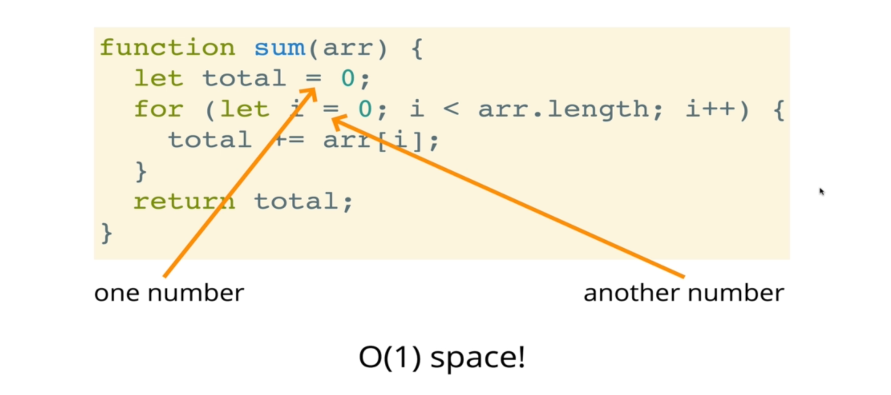
        - strings require `O(n)` space (`n` is the string length)
        - reference-types are generally `O(n)`, where `n` is the length(for arrays) or the number of keys(for objects)
          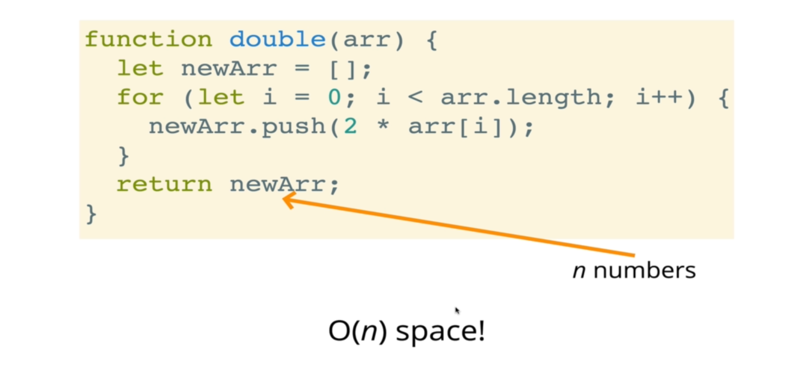
      - stack --> operations

- This is done by measuring the performance (**number of steps / operations**) which varies between devices so we need something standard, instead of measuring time, but why is that?
  - problem with time:
    - different machines will record different times
    - the same machine will record different times
    - for fast algorithms, speed measurements may not be precise enough
    - Experiments can be done only on a limited set of test inputs; hence, they leave out the running times of inputs not included in the experiment (and these inputs may be important)
  - so instead of time, we count the number of simple operations the computer has to perform
- When we talk about `big O`, we talk about the "worst case"

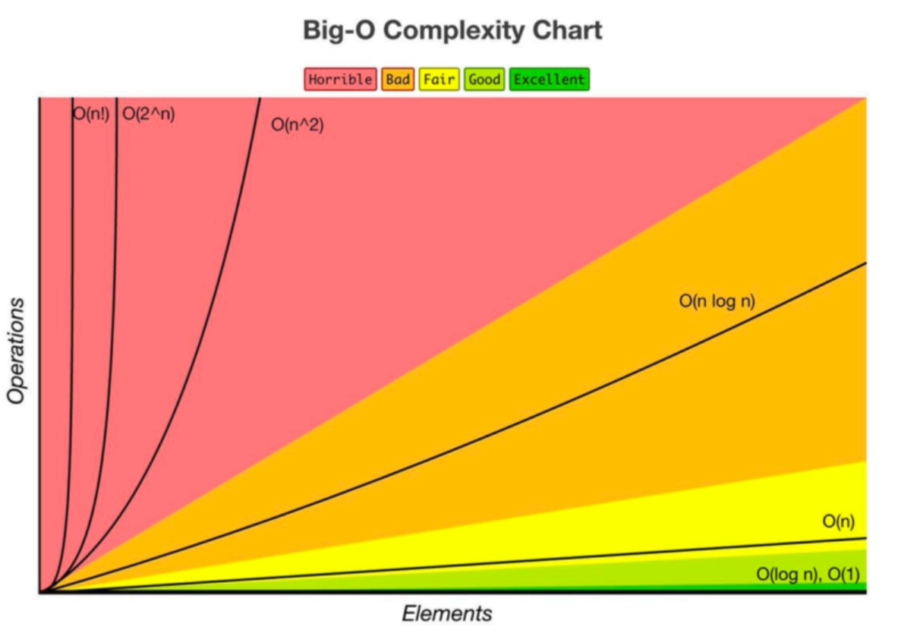

> here we see when elements (input) increases, how much the algorithm slow down (how many operation do we need to do) ?

---

### O(n)

This is called **linear Time** Algorithm.

Ex: looping on array using `for-loop`
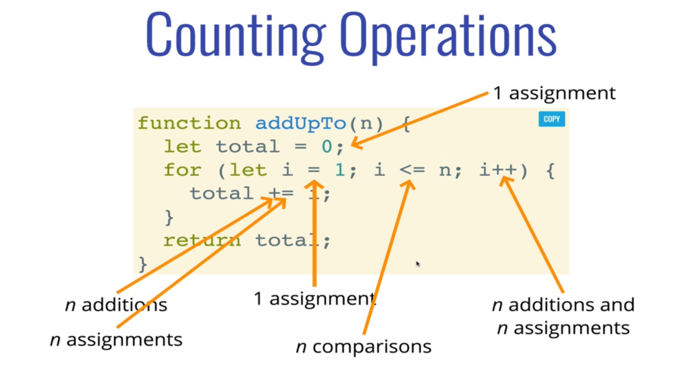

- we will simply count how many **primitive operations** are executed, and use this number t as a measure of the running time of the algorithm.
- depending on what we count, the number of operations can be as slow as `2n` or as high as `5n+2`. But regardless of the exact number, the number of operations grows roughly proportionally with `n`
  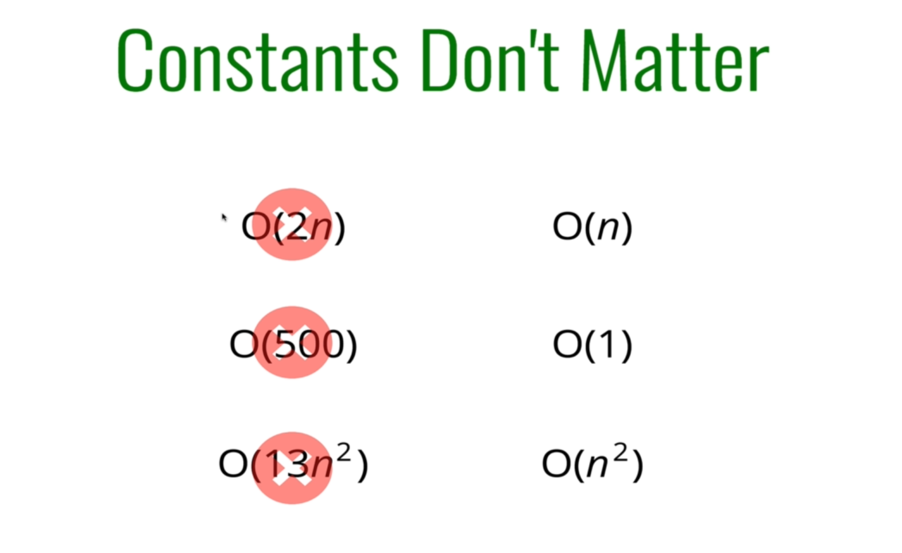

#### Polynomials

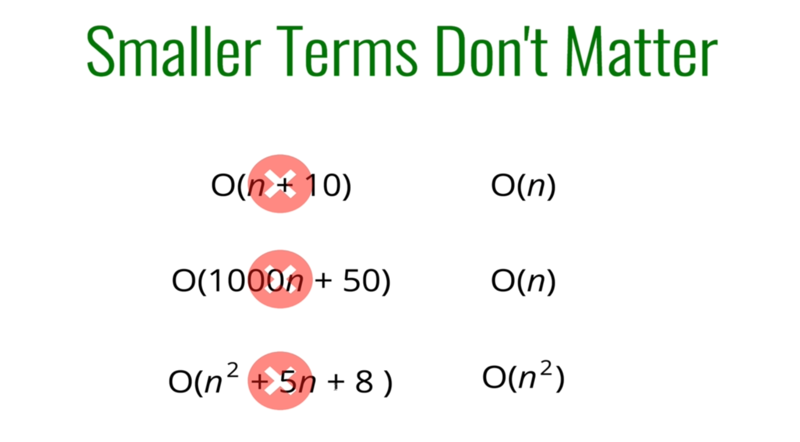

---

### O(1)

These are called **"Constant-Time Operations"**, we say that this function runs in `O(1)` time; that is, the running time of this function is independent of the length, `n` of the list.

- computer hardware supports constant-time access to an element based on its memory address. Therefore, we say that the expression `data[j]` is evaluated in `O(1)` time for a Python list.

Ex:

```js
// O(1)
function(arr){
  console.log(arr[0]);
}

// O(2) -> also called O(1) as it's constant time
function(arr){
  console.log(arr[0]);
  console.log(arr[1]);
}
```

---

### O(n^2)

this is called **Quadratic Time**
Ex: usually nested loops

---

### O(log(n))

**`O(log N)`** means that the choice of the next element on which to perform some sort of action is one of several possibilities and only one needs to be chosen --> **"Divide and conquer**

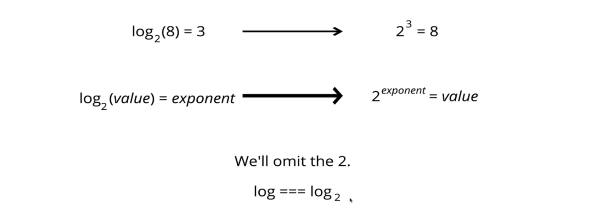

- The value `b` is known as the base of the logarithm. The most common base for the logarithm function in computer science is `2`,

  - as computers store integers in **binary**, and because a common operation in many algorithms is to repeatedly divide an input in half. In fact, this base is so common that we will typically omit it from the notation when it is `2`. That is, for us,

    ```s
    log(n) = log2(n)
    ```

```js
// x = log(b) n if and only if bx = n
//
level1 = 2^0 = 1;
level2 = 2^1 = 2;
level3 = 2^2 = 4;
level4 = 2^3 = 8;
numOfNodes = (2^h - 1) = 15; // h is the height starting from count of 1
log numOfNodes = stepsOrHeight; // log 15 = 3
```

---

### O(n log(n))

This function grows a little more rapidly than the `linear function O(n)` and a lot less rapidly than the `quadratic function O(n^2)`; therefore,

- we would greatly prefer an algorithm with a running time that is proportional to `nlogn`, than one with `quadratic` running time.

---

### O(n!)

this is called **Factorial Time** or **oh no!**

- you won't encounter it most likely
- means that we're adding nested loop for every input that we have
- Ex: usually nested loops

---

### Rules to improve Big o

1. worst case
   - always measure the worst case
   - Worst-case analysis is much easier than average-case analysis, as it requires only the ability to identify the worst-case input, which is often simple
2. remove constants
   - `O(n/2 + 124)` will be `O(n+1)`
3. different terms for inputs

   ```js
   function compressBoxesTwice(boxes, boxes2) {
     boxes.forEach(function (boxes) {
       console.log(boxes);
     });

     boxes2.forEach(function (boxes) {
       console.log(boxes);
     });
   }

   // result is O(n+m) and not O(n) as we have 2 different input lengths
   ```

4. drop non-dominant terms

   - `O(n^2 + n)` will be `O(n^2)`

---

### Notes

- interview question: what is the time complexity of getting the length here?

  ```js
  'sdfsdgdfsgdfgsfdg'.length;
  ```

  - answer is: it depends on how the method (`.length) works here in this language
    - for example, here we use javascript which has `length` property (not method) to each string, so it's a simple lookup --> `O(1)`

---

## Recursion

> **Recursion** is a technique by which a function makes one or more calls to itself during execution, or by which a data structure relies upon smaller instances of the very same type of structure in its representation.

It's not actually an Algorithm, it's more of a concept that we use in our Algorithms

- it's used Everywhere; mostly in:
  - `traversing`
    - ex: `DOM-traversing` and (`document.getElementById`)
  - `nested operations`
    - ex: Object-traversal like ->`JSON.parse()` and `JSON.stringify()`
  - `file systems`
- Advantages:
  - DRY
  - Readability
- When the execution of a function leads to a nested function call, the execution of the former call is suspended and its activation record stores the place in the source code at which the flow of control should continue upon return of the nested call. This process is used both in the standard case of one function calling a different function, or in the recursive case in which a function invokes itself. The key point is that there is a different activation record for each active call.

- Steps:
  1. identify and test for the **Base case** (the condition when the recursion ends)
     - We begin by testing for a set of base cases (there should be at least one). These base cases should be defined so that every possible chain of recursive calls will eventually reach a base case, and the handling of each base case should not use recursion.
  2. identify the **recursive case**
     - If not a base case, we perform one or more recursive calls. This recursive step may involve a test that decides which of several possible recursive calls to make. We should define each possible recursive call so that it makes progress towards a base case.
  3. get closer and closer and return when needed. usually have 2 returns
- Rules:
  - Every time you're using a `tree` or converting something into a `tree`, consider **recursion**
- Divide and conquer using recursion:
  1. divided into a number of sub-problems that are smaller instances of the same problem
  2. each instance of the sub-problem is identical in nature
  3. the solutions of each sub-problem can be combined to solve the problem at hand

---

### Helper Method Recursion

It's a pattern when using recursion, it consists of `outer function` that contains the `helper(recursion)` function which calls itself

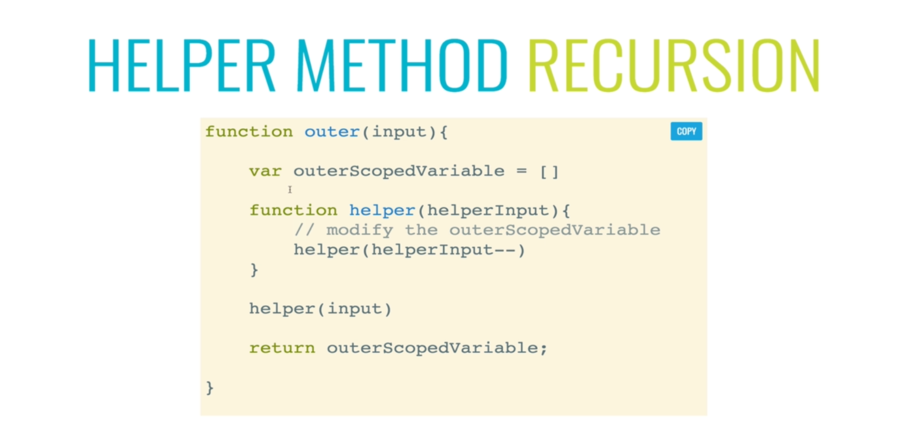

---

### Big-O Runtime for Recursive Functions

The Big-O runtime for a recursive function is equivalent to the number of recursive function calls. This value **varies** depending on the complexity of the algorithm of the recursive function. For example:

- A recursive function of input `N` that is called `N` times will have a runtime of `O(N)`.
- On the other hand, a recursive function of input `N` that calls itself twice per function may have a runtime of `O(2^N)`.

> **Note**: a bad use of recursion can lead to `Big-O` of `O(2^n)` which is extremely inefficient

### Maximum Recursive Depth

Another danger in the misuse of recursion is known as infinite recursion. If each recursive call makes another recursive call, without ever reaching a base case, then we have an infinite series of such calls. This is a fatal error. An infinite recursion can quickly swamp computing resources, not only due to rapid use of the CPU, but because each successive call creates an activation record requiring additional memory

```py
def fib(n):
  return fib(n)
```

#### When recursion goes wrong

- some cases where recursion can go wrong:

  - no base case
  - forgetting to return or returning the wrong thing
  - stack overflow!

- biggest problem with recursion is **stack overflow (large stack)** in memory, so if used, we need to allocate memory for it

- for this you always need to return the recursive calls to bubble-up the returned value from the last call
- A programmer should ensure that each recursive call is in some way progressing toward a base case (for example, by having a parameter value that **decreases** with each call).

> **Note**: Fortunately, the Python interpreter can be dynamically reconfigured to change the default recursive limit. This is done through use of a module named sys, which supports a `getrecursionlimit` function and a `setrecursionlimit`. Sample usage of those functions is demonstrated as follows:
>
> ```py
> import sys
> old = sys.getrecursionlimit() # perhaps 1000 is typical
> sys.setrecursionlimit(1000000) # change to allow 1 million nested calls
> ```

---

## Dynamic Programming

It's an optimization technique using `"caching"` (Do you have something you can cache?)


- It's a way to solve problems by breaking it down into a collection of sub-problems, solving each of those sub-problems just once and storing their solutions in case next sub-problem occurs.

### Memoization

**Memoization**: is a specific kind of caching used to involves caching the **return value** of functions based on their parameters

- it's better when using `Memoization` to save the cache in the local variable of the function instead of the global scope, you can do that in Javascript, using **closures**
- What if I told you that you can reduce the time complexity of any complex operation to **`O(n)`** with using `Memoization` to reach the optimal solution
  
  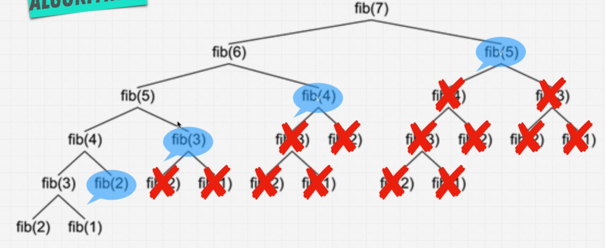

---

## Sorting

**Sorting**: is the process of rearranging the items in a collection (e.g. `array`) so that the items are in some kind of order

> As more and more data is handled by our computers, **sorting** and **searching** are two of the biggest computer science problems in the software world

- usually the built-in sorting methods are different from language to another; for example, in `javascript`, it convert inputs to `strings` then sort them based on their **"character unicode"**
  - usually for `Javascript` as it uses `ECMA` so it's standard and the browser(engine) is the one who decides which algorithms to use
    - `Chrome`, `Mozilla`, ...
- There're many different ways to sort things, and each technique has its own advantages and disadvantages

### Elementary Sorting Algorithms

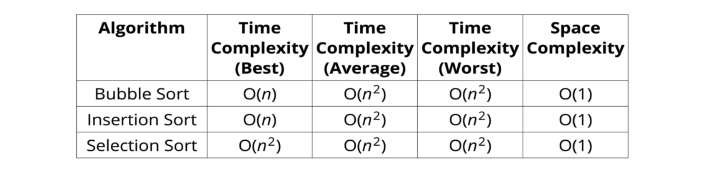

#### Bubble Sort

It's a sorting algorithm where the largest values **bubble up to the top**

> it's also called **sinking sort** as the largest values **sink down to the end**

- it works on the concept of moving the largest number to the end (bubbling the largest number up)
- it loops on each numbers and compare the 2 values-pairs at hand
  - if the number in the left is larger than the left one, we swap them, else we continue to the next pair until we have the largest number at the end.
  - by that we would go to the next iteration and repeat
- it's one of the simplest sorting algorithms, but the has least performance
  - one of its performance drawbacks, is that if the array is **almost-sorted**, it will continue to do all looping and checking steps even if we reached sorted-result after the first few steps

---

#### Selection Sort

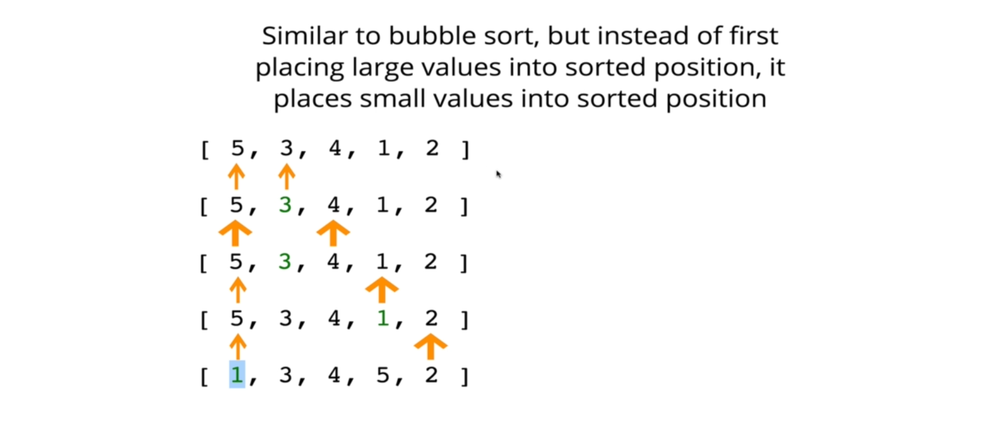

- it works by scanning a list of items for the smallest element and then swapping that element for the one in the first position
- also one of the simplest but not efficient either
- steps:
  1. store the first element as the smallest value you've seen so far
  2. compare this item to the next item in the array until you find a smaller number
     - if smaller number is found, designate that smaller number to be the new **minimum** and continue to the end of the array
     - if the **minimum** is not the value(index) you initially began with, we swap the two values
  3. repeat this with the next element until the array is sorted

> it's better than **Bubble sort** only in one condition:
>
> - if you want to minimize the number of **swaps** on each loop

---

#### Insertion Sort

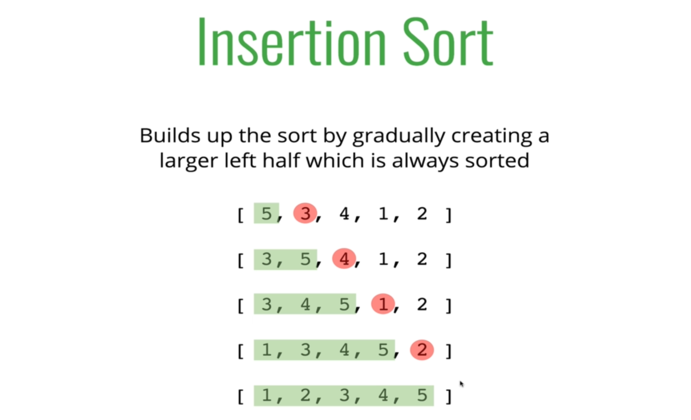

Taking elements one at a time and **inserting** it in the right spot

- it's used when you know or think that the list is **"almost/already sorted"**
  - ex: `online-algorithm` -> algorithm that can work when the data is coming-in, it doesn't have to have the entire array(data) at once, as we "keep one side of the array sorted and insert the others in their correct order"
- works well with small datasets
- steps:
  1. start by picking the second element in the array
  2. now compare the second element with (the one before it) and swap if necessary
  3. continue to the next element and if it is in the (incorrect order), iterate through the sorted portion (the left side) to place the element in the correct place
  4. repeat until the array is sorted

---

### Merge Sort


- It's a combination of 2 things: (`merging` & `sorting`)
- it exploits the fact that arrays of `0` or `1` element are always sorted
  - as it works by decomposing an array into smaller arrays of `0` or `1` elements, then building up a newly sorted array
- it uses the technique: "Divide & Conquer" by implementing `recursion` and combining the solutions which gives us **`O(n log n)`** time complexity which is better than **`O(n^2)`**
  - the number of times we **divide**(split-up/decompose) is equal to `log(n)` and the number of **merging**(comparisons) is `n`
    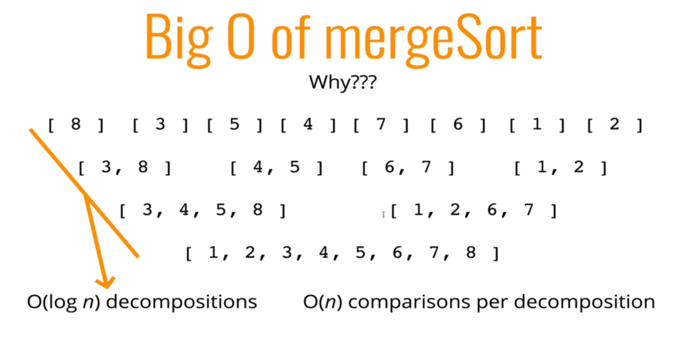
- usually the "divide" part is done by **recursion**
  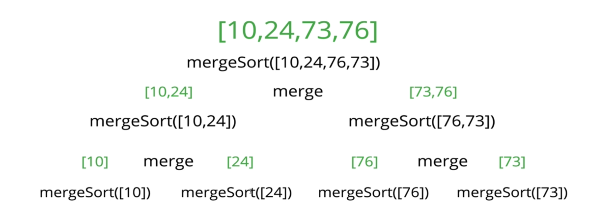
- it's one of the most efficient ways to sort lists
- one downside is that it has a bigger space-complexity : **space-complexity of `O(n)`** unlike most sorting algorithms which has `O(1)`
  - this is due to holding off to the divided lists in memory
  - so we use it if we have enough memory

---

### Quick Sort

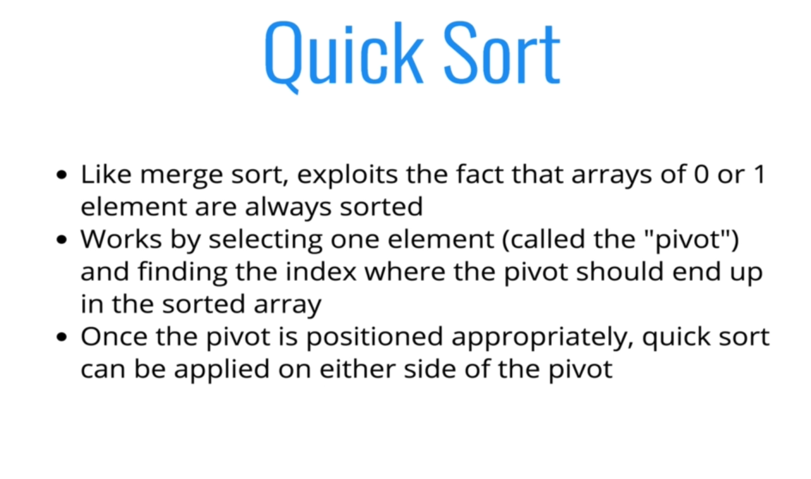

- it also uses the technique: "Divide & Conquer"
- it may have a worst-case for time-complexity of `O(n^2)` if the **"pivot point"** is the smallest point and is the first element,
- it has better **space-complexity of `O(log(n))`**, so it can be sorted in memory if the database is not massive

#### Quick sort Pseudocode

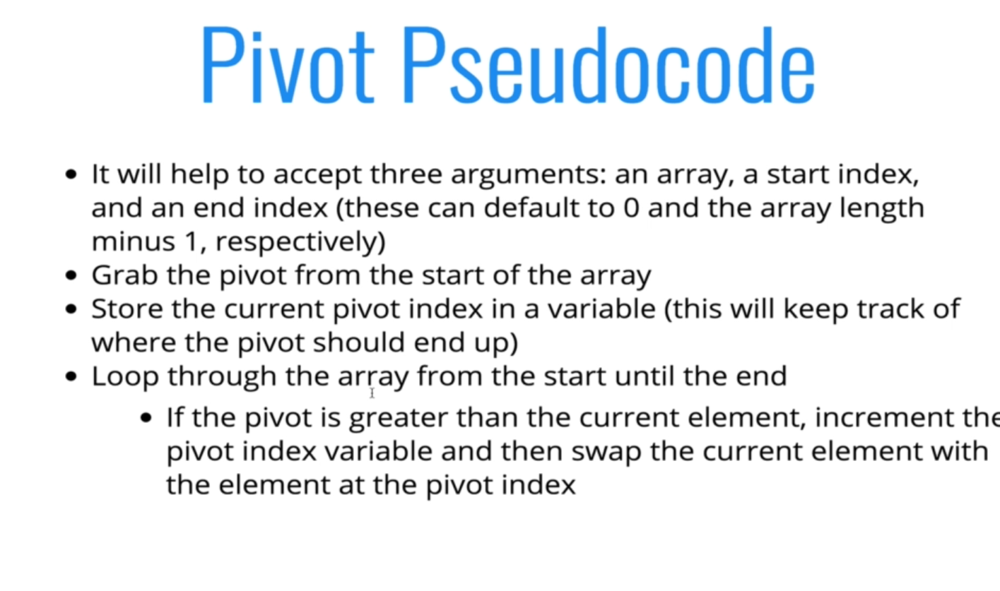

---

### Radix Sort

- The previous sorting-algorithms were called: "Comparison Sorts", but the question is: "can we do better for the time-complexity?"

  - the answer is "sort of", as we yes can; but not by making direct-comparisons

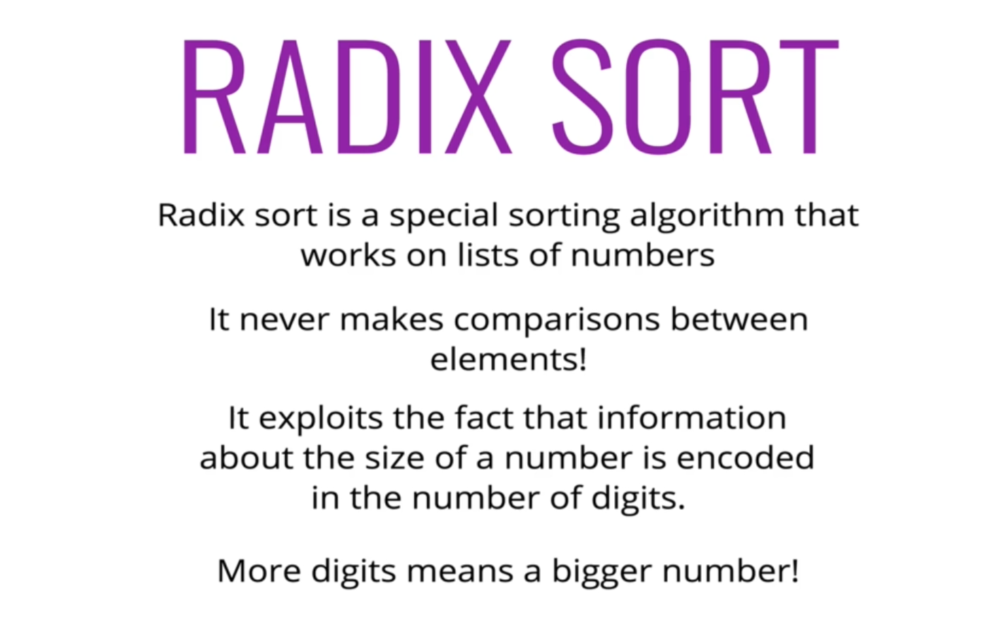

- number of times we need to do the "mapping-bucket-operations" depends on how many digits the largest number has

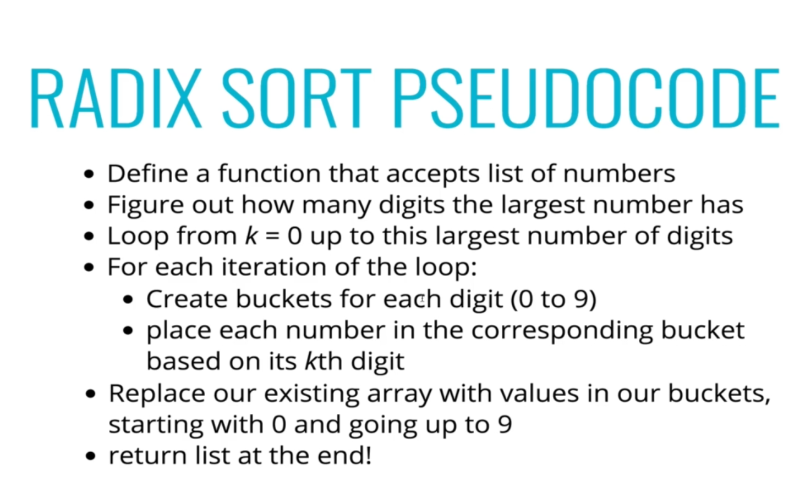
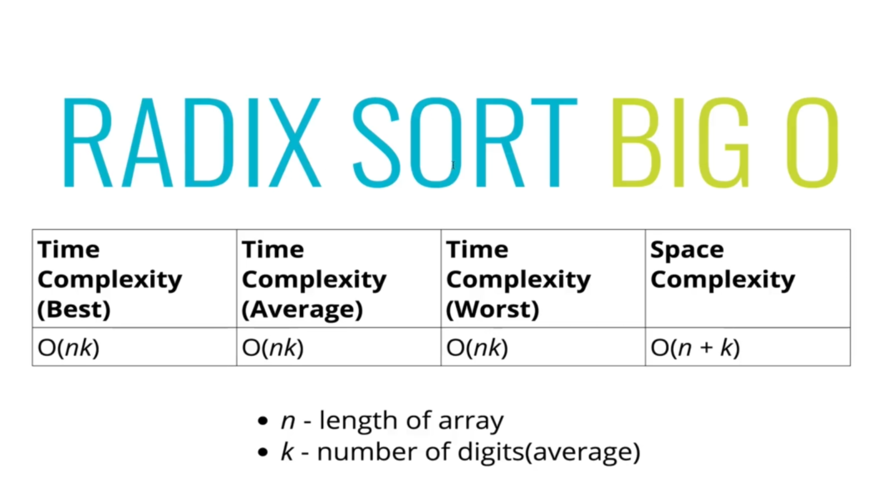

---

### Sorting Notes

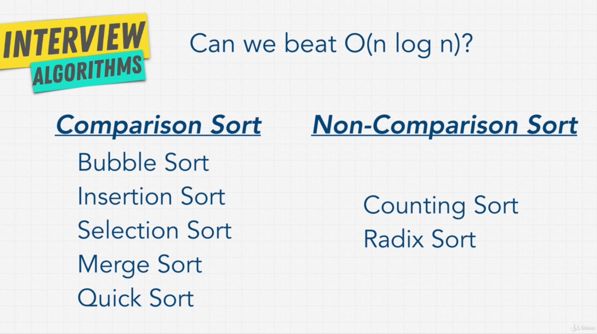

- the best sorting time complexity will always be `O(nlog(n))` as the `"n"` says that we do a comparison between the elements of the list

---

## Searching

- When the sequence is **unsorted**, the standard approach to search for a target value is to use a loop to examine every element, until either finding the target or exhausting the data set. This is known as the **"sequential search algorithm"**. This algorithm runs in `O(n)` time (i.e., linear time) since every element is inspected in the worst case.
- When the sequence is **sorted** and indexable, there is a much more efficient algorithm, like [Binary Search](#binary-search).

### Linear(sequential) Search

It's a method of finding a target value within the list.

- It sequentially iterate on each element of the list and checks for the target value until a match is found or until all the elements have been searched
- It's usually the default searching algorithm in built-in sorting-methods in programming languages like in Javascript: `.indexOf()`, `.find()`

---

### Binary Search

- if we know tha list is **sorted**:
  - Rather than eliminating one element at a time, you can eliminate **half** of the remaining elements at a time
  - we can pick a number in the list and discard it's left/right side based on the number we're searching for
- we are essentially creating a **"binary search tree** from the list
- so it's a `divide&conquer` approach, so it gives us `O(log(n))`

#### How it works

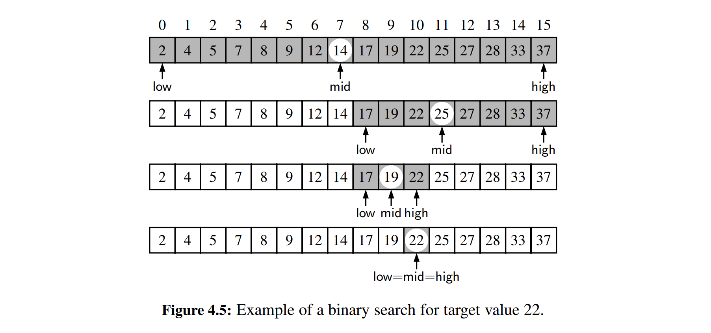

- We call an element of the sequence a **"candidate"**
- we get the middle element: the item `data[mid]` with index:

  ```js
  mid = (low + high) / 2;
  ```

- We consider three cases:

  1. If the target equals `data[mid]`, then we have found the item we are looking for, and the search terminates successfully
  2. If `target < data[mid]`, then we recur on the first half of the sequence, that is, on the interval of indices from low to `mid−1`.
  3. If `target > data[mid]`, then we recur on the second half of the sequence, that is, on the interval of indices from `mid+1` to high.

- Here worst case is `O(log(n))` with log-base of `2` as we divide each group by `2` each time

> **Notes**:
>
> - An unsuccessful search occurs if we reached the end of array where: `start = middle = end`, so we won't be able to continue as the next step would result this: `low > high`, as the interval `[low,high]` is empty
>
>   - so we need to create an edge case to prevent infinite loop
>
> - making a copy of half the list would already take `O(n)` time, negating the whole benefit of the binary search algorithm.

#### Traversals

it means going through each item in the list, like checking for something on each item in a `tree` --> **(visiting every node O(n))**

- Graph traversal use cases:
  - peer-to-peer networking
  - web crawlers
  - finding `closest` / `matches` / `recommendations`
  - shortest path problems
    - GPS navigation
    - solving mazes
    - AI


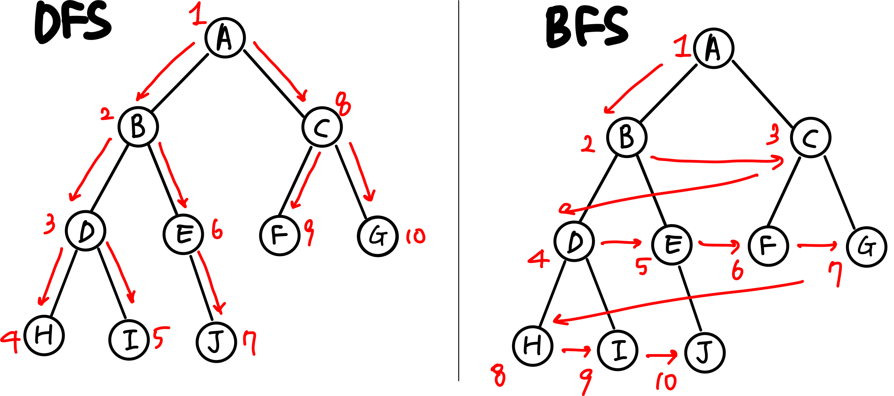

- The time-complexity of **BFS** vs **DFS** is the same as we visit each node one time, but the difference here is in the space-complexity as it depends on the structure of the tree:
  - if we're talking about a breadth-first on a wide tree vs on depth-first, we will not be storing all the nodes across the tree in **BFS** as we only need to keep-track of the nodes in a given branch all the way down to the end
    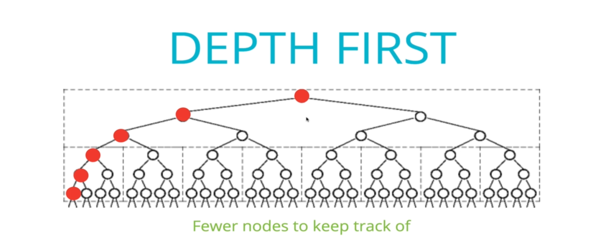

#### Breadth First Search/Traversal BFS

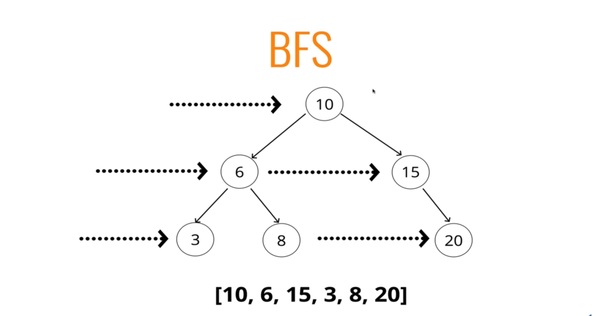

- start with the root-node, then go to the left then the right of the second level of the tree, the the same for the next level
  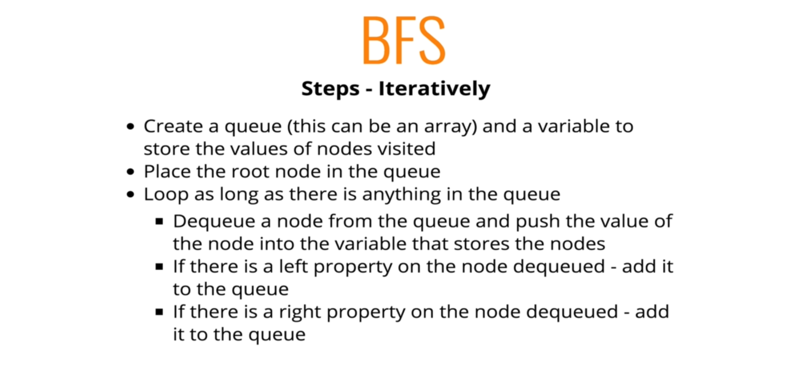
- it uses additional memory as it tracks the child nodes for a given node on each level (track every node and its children in order)
  - this is done using a **Queue** data structure
    - we use a `queue` because we need to remember the things that need to come next to be visited
  - if we have a very wide-tree, the `Queue` can get really big, which requires more memory
- used to find the **shortest path**
- also used with `Graphs`

---

#### Depth First Search/Traversal DFS

- the search follows one branch of the tree down as many levels as possible until the target notice is found or the end is reached, then it continues at the next ancestor with an unexplored children
  - the idea is to go as deep as possible from the left side and then start going to the right until the traversal of the tree is done
  - it's like "solving a maze"
- it might take long time
- it has lower memory requirements, as it doesn't need to store all the child pointers at each level
- usually it's implemented using **recursion**
- used to determine whether a path exists between two nodes or if a node exists
- also used with graphs

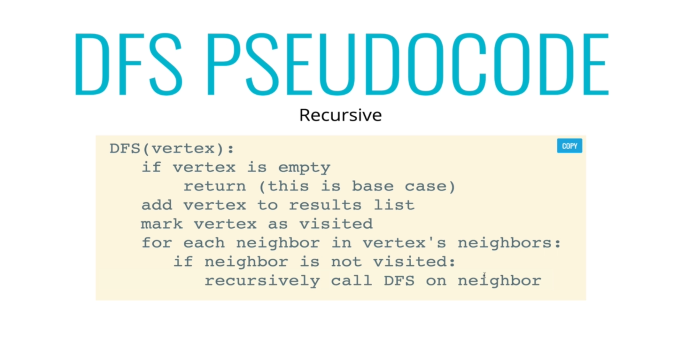


##### PreOrder DFS

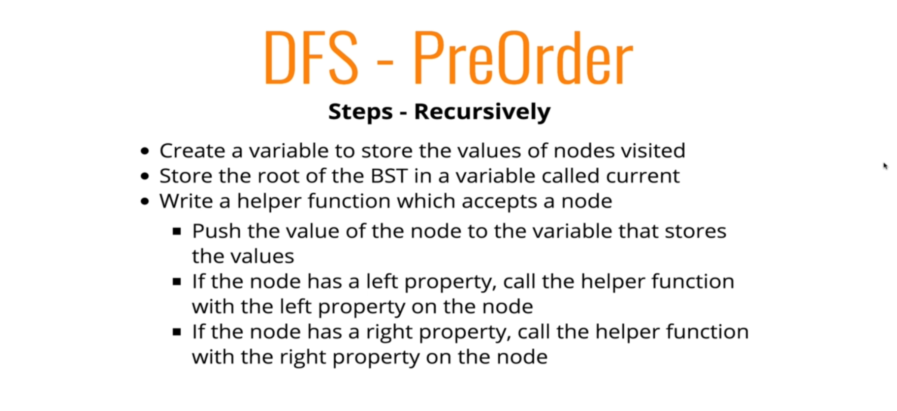

##### PostOrder DFS

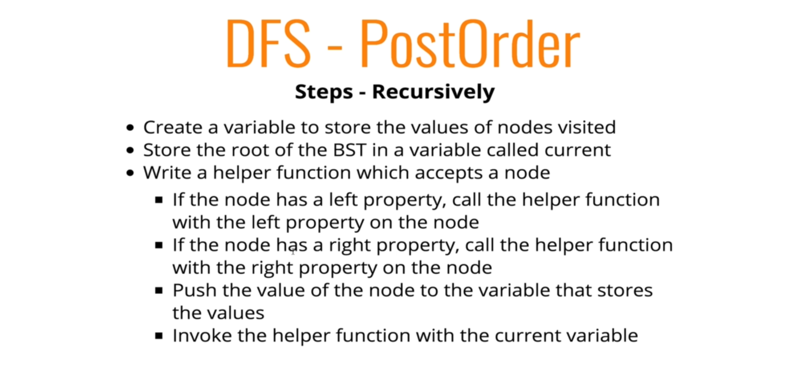

##### InOrder DFS

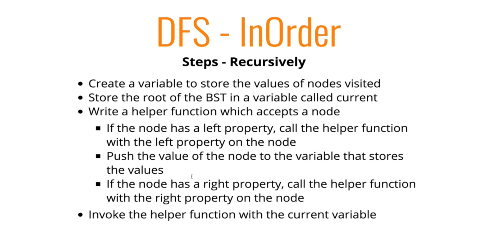

---

#### Shortest Path

- Beliman-Ford
- Dijkstra

---

#### Dijkstra's Algorithm

It's one of the most famous and widely used algorithms around. It finds the **shortest path** between 2 vertices on a **weighted-graph**

- Steps:
  1. Every time we look to visit a new node, we pick the node with the smallest known distance to visit first
  2. once we've move to the node we're going to visit, we look at each of its neighbors
  3. for each neighboring node, we calculate the distance by summing the total edges that lead to the node we're checking from the starting node
  4. if the new total distance to a node is less than the previous total, we store the new shorter distance for that node
