# INDEX

- [INDEX](#index)
  - [Algorithm](#algorithm)
  - [Algorithm Analysis (Big-Oh)](#algorithm-analysis-big-oh)
    - [Elements of good code](#elements-of-good-code)
    - [Average case vs Worst case](#average-case-vs-worst-case)
    - [Asymptotic Analysis](#asymptotic-analysis)
      - [Asymptotic notation](#asymptotic-notation)
    - [Runtime Analysis](#runtime-analysis)
    - [Determining Complexity](#determining-complexity)
      - [Time complexity](#time-complexity)
      - [Space complexity](#space-complexity)
      - [Big O Rules](#big-o-rules)
    - [O(n)](#on)
      - [Polynomials](#polynomials)
    - [O(1)](#o1)
    - [O(n^2)](#on2)
      - [Explaining O(n^2) for loops](#explaining-on2-for-loops)
    - [O(log(n))](#ologn)
    - [O(n log(n))](#on-logn)
    - [O(!n)](#on-1)
    - [Rules to improve Big o](#rules-to-improve-big-o)
    - [Notes](#notes)
  - [Recursion](#recursion)
    - [Recursion Types](#recursion-types)
    - [How recursion works with the call stack](#how-recursion-works-with-the-call-stack)
    - [Recursion Steps](#recursion-steps)
    - [Big-O Runtime for Recursive Functions](#big-o-runtime-for-recursive-functions)
    - [Maximum Recursive Depth](#maximum-recursive-depth)
      - [When recursion goes wrong](#when-recursion-goes-wrong)
    - [Eliminating Tail Recursion](#eliminating-tail-recursion)
  - [Dynamic Programming](#dynamic-programming)
    - [Memoization](#memoization)
    - [Dynamic programming types](#dynamic-programming-types)
      - [Top-down approach (Recursion + Memoization)](#top-down-approach-recursion--memoization)
      - [Bottom-up approach (Iteration + Tabulation)](#bottom-up-approach-iteration--tabulation)
    - [Dynamic Programming vs Divide and Conquer (Brute Force)](#dynamic-programming-vs-divide-and-conquer-brute-force)
  - [Sorting](#sorting)
    - [Stable vs Unstable Sorting](#stable-vs-unstable-sorting)
    - [Insertion Sort](#insertion-sort)
    - [Bubble Sort](#bubble-sort)
    - [Selection Sort](#selection-sort)
    - [Heap Sort](#heap-sort)
    - [Divide \& Conquer](#divide--conquer)
    - [Merge Sort](#merge-sort)
      - [Merge sort implementation](#merge-sort-implementation)
    - [Quick Sort](#quick-sort)
      - [Quick sort implementation](#quick-sort-implementation)
      - [Hoare's Partitioning Scheme (Quick Select) (NOT IMPORTANT ⚠️)](#hoares-partitioning-scheme-quick-select-not-important-️)
        - [Implementing Quick sort using Hoare's Partitioning Scheme (Quick Select)](#implementing-quick-sort-using-hoares-partitioning-scheme-quick-select)
    - [Bucket Sort](#bucket-sort)
    - [Radix Sort](#radix-sort)
    - [Sorting Notes](#sorting-notes)
  - [Searching](#searching)
    - [Linear(sequential) Search](#linearsequential-search)
    - [Binary Search](#binary-search)
      - [How it works](#how-it-works)
  - [Graph Traversals](#graph-traversals)
    - [Breadth First Search/Traversal BFS](#breadth-first-searchtraversal-bfs)
      - [BFS Implementation](#bfs-implementation)
    - [Depth First Search/Traversal DFS](#depth-first-searchtraversal-dfs)
      - [PreOrder DFS traversal](#preorder-dfs-traversal)
      - [PostOrder DFS traversal](#postorder-dfs-traversal)
      - [InOrder DFS traversal](#inorder-dfs-traversal)
      - [Tree Traversal Notes](#tree-traversal-notes)
  - [Shortest Path](#shortest-path)
    - [Dijkstra's Algorithm](#dijkstras-algorithm)
      - [How Dijkstra's Algorithm works](#how-dijkstras-algorithm-works)
      - [Implementing Dijkstra's algorithm](#implementing-dijkstras-algorithm)
    - [Bellman-Ford Algorithm](#bellman-ford-algorithm)
      - [How Bellman-Ford Algorithm works](#how-bellman-ford-algorithm-works)
  - [Topological Sort](#topological-sort)
    - [Implementing Topological Sort](#implementing-topological-sort)
  - [Union Find](#union-find)
  - [Matrix graph](#matrix-graph)
    - [Matrix DFS](#matrix-dfs)
      - [Matrix BFS](#matrix-bfs)
  - [Least recently used (LRU)](#least-recently-used-lru)

---

## Algorithm

It's a set of instructions to solve a problem/perform a task

> or: It's a step-by-step procedure for performing some task in a finite amount of time

- We use Big O to analyze the performance of an algorithm (how fast it is, how much memory it takes up, etc.)
- It's not enough to know how long an algorithm takes to run—you need to know how the running time increases as the list size increases. hat’s where Big O notation comes in.
- Algorithm speed isn’t measured in seconds, but in growth of the number of operations.

---

## Algorithm Analysis (Big-Oh)

**Big O:** It tells us how time scales with respect to some input variables

> It tells us **How well/fast a problem is solved**, it's the language we use to telling (how the runtime of an algorithm grows as the inputs grow)

- Big O doesn't tell you the speed in **seconds**. Big O notation lets you compare the number of operations. It tells you how fast the algorithm grows.
  - we don't use seconds because:
    - different machines will record different times for the same algorithm
    - the same machine will record different times for the same algorithm if it runs at different times of the day
    - to study the running time of an algorithm, we need to fully implement it (which takes time specially for complex algorithms and large inputs)
- `O(n)` -> `n` is the number of operations an algorithm will make
- `O(log(n))` -> `log(n)` is the number of operations an algorithm will make
- `O(n^2)` -> `n^2` is the number of operations an algorithm will make
- Many `Big O` times don't use `n` as it's just a variable and any letter will do!, but it's still the number of operations an algorithm will make
  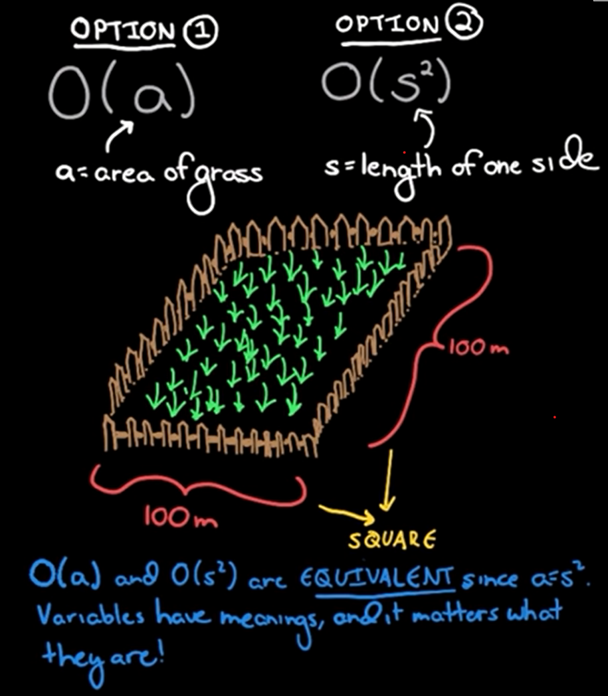

> Why we use it?
>
> - to have a benchmark on how our code performs
> - useful for discussing trade-offs between different approaches
> - when code slows down or crashes, identifying parts of the code that are inefficient can help us find pain-points in our apps

---

### Elements of good code

- **readable**

- **scalable**

  - **speed** --> CPU --> **Time complexity** --> **Big O**
    - compare algorithms on which one is better in scale
  - **memory** --> **space complexity**:
    - heap --> store variable
      - most primitives(`booleans`, `numbers`, `undefined`, `null`) are constant space
        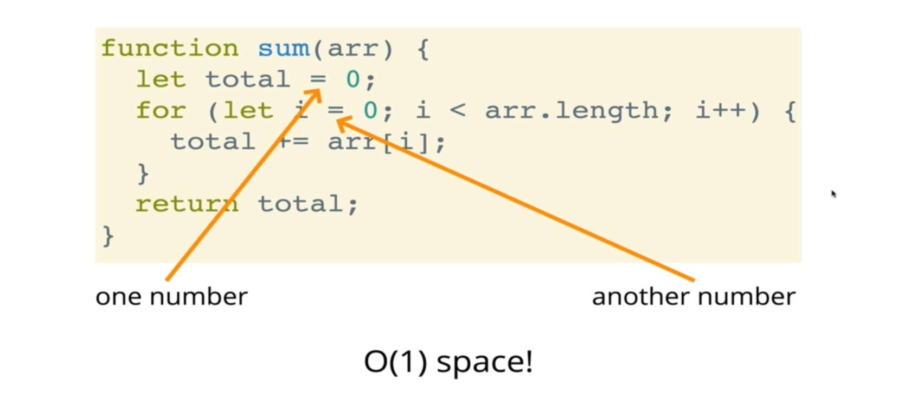
      - strings require `O(n)` space (`n` is the string length)
      - reference-types are generally `O(n)`, where `n` is the length(for arrays) or the number of keys(for objects)
        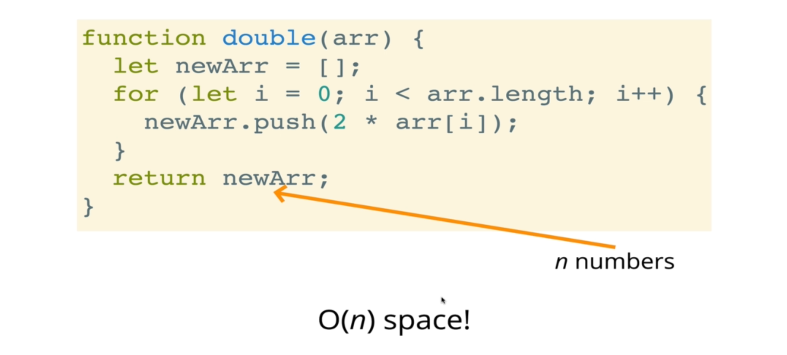
    - stack --> operations

---

### Average case vs Worst case

- **Average-case analysis** usually requires that we calculate expected running times based on a given input distribution, which usually involves sophisticated probability theory.
  - Therefore, we usually characterize running times in terms of the worst case, as a function of the input size, `n`, of the algorithm.
- **Worst-case analysis** is much easier than average-case analysis, as it requires only the ability to identify the worst-case input, which is often simple.
  - Also, this approach typically leads to better algorithms. Making the standard of success for an algorithm to perform well in the worst case necessarily requires that it will do well on every input. That is, designing for the worst case leads to stronger algorithmic “muscles,”.

> get more info about **Big Omega & Big Theta**

---

### Asymptotic Analysis

- In **algorithm analysis**, we focus on the growth rate of the running time as a function of the input size `n`, taking a “big-picture” approach. For example, it is often enough just to know that the running time of an algorithm grows proportionally to `n`.
  - we characterize the running times of algorithms by using functions that map the size of the input, `n`, to values that correspond to the main factor that determines the growth rate in terms of `n`.
  - This approach reflects that each basic step in a pseudo-code description or a high-level language implementation may correspond to a small number of primitive operations.
- Thus, we can perform an analysis of an algorithm by estimating the number of primitive operations executed up to a constant factor, rather than getting bogged down in language-specific or hardware-specific analysis of the exact number of operations that execute on the computer.

---

#### Asymptotic notation

We analyze different Algorithms by counting the maximum number of guesses we need to make. But what we really want to know is how long these algorithms take. We're interested in time, not just guesses. The running times of linear search and binary search include the time needed to make and check guesses, but there's more to these algorithms.

- The running time of an algorithm depends on how long it takes a computer to run the lines of code of the algorithm—and that depends on the speed of the computer, the programming language, and the compiler that translates the program from the programming language into code that runs directly on the computer, among other factors.
- To calculating the running time of an algorithm more carefully. We can use a combination of two ideas: **asymptotic analysis** and **asymptotic notation**.

  1. we think about the running time of the algorithm as a **function of the size of its input**.
  2. we think about how fast a function grows with the input size. We call this the **"rate of growth"** of the running time.
     - For example, suppose that an algorithm, running on an input of size `n`, takes `6n^2 + 100n + 300` machine instructions. The `6n^2` becomes larger than the remaining terms, `100n + 300`, once `n` becomes large enough, `20` in this case. Here's a chart showing values of `6n^2` and `100n + 300` for values of `n` from `0` to `100`:
       
     - We would say that the running time of this algorithm grows as `n^2` dropping the coefficient `6` and the remaining terms `100n + 300`. It doesn't really matter what coefficients we use; as long as the running time is `an^2 + bn + c`, where `a`, `b`, and `c` are constants: `a > 0`
       - > There will always be a Value of `n` for which `an^2` is greater than `bn + c`, and this difference increases as `n` increases. We say that `an^2` **dominates** `bn + c` as `n` increases.

- By dropping the less significant terms and the constant coefficients, we can focus on the important part of an algorithm's running time—its rate of growth—without getting mired in details that complicate our understanding. When we drop the constant coefficients and the less significant terms, we use **asymptotic notation**. We'll see three forms of it:
  - `big-O` notation
  - `big-Theta` notation
  - `big-Omega` notation.

---

### Runtime Analysis

- This is done by measuring the performance (**number of steps / operations**) which varies between devices so we need something standard, instead of measuring time, but why is that?
  - problem with time:
    - different machines will record different times
    - the same machine will record different times
    - for fast algorithms, speed measurements may not be precise enough
    - Experiments can be done only on a limited set of test inputs; hence, they leave out the running times of inputs not included in the experiment (and these inputs may be important)
  - so instead of time, we count the number of simple operations the computer has to perform
- When we talk about `big O`, we talk about the **"worst c ase scenario"**
  - It's a reassurance that no matter what happens, the algorithm will never be slower than the `big O` we've calculated


> here we see when elements (input) increases, how much the algorithm slow down (how many operation do we need to do) ?

---

### Determining Complexity

> **Data structures are just saving memory, and Algorithms are just actions taken on that memory**

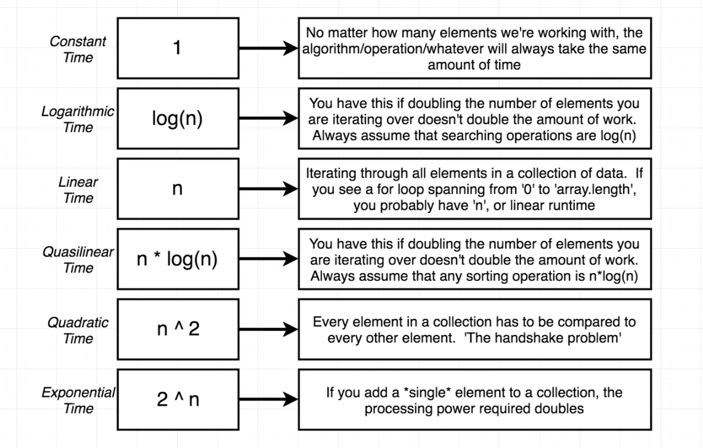

#### Time complexity

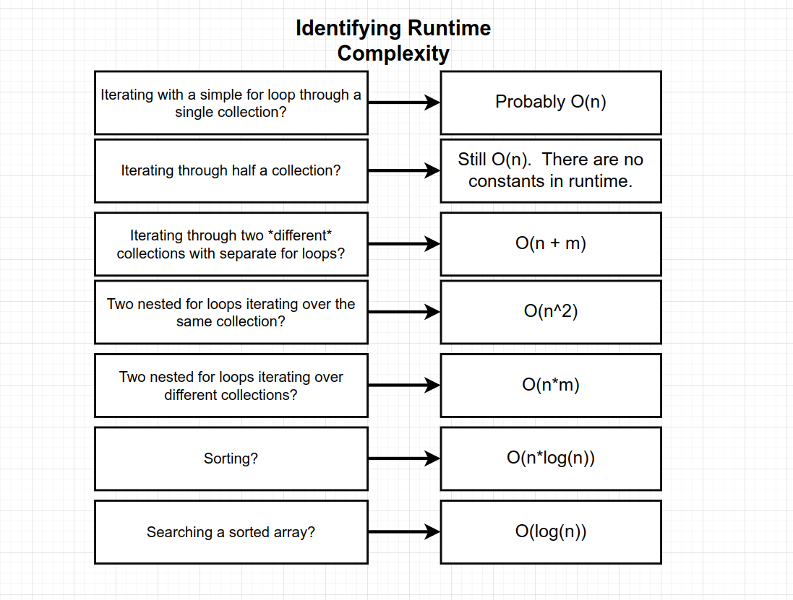

- Examples

  ```py
  # O(a/b) -> O(a)
  def div(a, b):
    count = 0
    sum = b
    while sum <= a:
      sum += b
      count += 1
    return count

  # Time complexity -> O(sqrt(n))
  def sqrt(n):
    i = 1
    while i * i <= n:
      i += 1
    return i - 1

  # Time complexity -> O(log n)
  def sumDigits(n):
    sum = 0
    while n > 0:
      sum += n % 10
      n //= 10 # O(log n) because we're dividing n by 10 in each iteration
    return sum
  ```

- Hard Examples

  ```py
  # code prints all strings of length k where the characters are in sorted order O(k*26^k)
  def printSortedStrings(remaining, prefix=""):
    if remaining == 0:
      if isInOrder(prefix):
        print(prefix)
    else:
      for c in range(ord('a'), ord('z') + 1):
        printSortedStrings(remaining - 1, prefix + chr(c))
  # helper
  def isInOrder(s):
    for i in range(1, len(s)):
      prev = s[i - 1]
      curr = s[i]
      if prev > curr:
        return False
    return True
  ```

> **Note:** when you encounter a pattern `1 + 2 + 3 + ... + n` in a **nested `for` loop** (usually by reducing the inner loop by 1 in each iteration), it's usually `O(n^2)`
>
> - to remember it. remember the **`Gauss formula` story (the kid who solved the problem in seconds)**, and that the formula is `n(n+1)/2` which is `O(n^2)`
>   - The story says that he wanted to sum numbers from `1` to `100`, so he wrote `1 + 2 + 3 + ... + 100` on the board, and then he realized that he can just write `100 + 1` and `99 + 2` and `98 + 3` and so on, and then he realized that he can just write `101` 100 times, and then he realized that he can just write `100 * 101` and then divide it by `2` to get the result, and that's how he solved the problem in seconds.
>   - So the formula is `(n+1) * n / 2` which is `O(n^2)` (because we have `n^2` in the formula)

---

#### Space complexity

- It's the same as time complexity, but instead of measuring the time to run program, **we measure memory usage of a specific program**
- What makes space complexity increase?
  - Assigning variables
  - Creating new data structures
  - function calls and allocations

```py
# memory complexity -> O(1)
def test1():
  for i in range(1000):
    # O(1) because we're not creating new data structure or assigning variables other than i
    print(i)

# memory complexity -> O(n)
def test2():
  arr = []
  for i in range(1000):
    # O(n) because we're creating new data structure (arr) and assigning variables (i) in each iteration to the memory
    arr.append(i)

# memory complexity -> O(log n), Time complexity -> O(log n)
def sqrt(n):
  return sqrt_helper(n, 1, n)

def sqrt_helper(n, min, max):
  if max < min:
    return -1
  guess = (min + max) // 2
  if guess * guess == n:
    return guess
  elif guess * guess < n:
    return sqrt_helper(n, guess + 1, max)
  else:
    return sqrt_helper(n, min, guess - 1)
```

- **Notes**
  - when needing to create a bigger fixed array to insert new elements to a full fixed array, we use `O(n)` space complexity of the new array and not the sum of the two arrays
    - This is because we're not creating a new array in each iteration, we're just creating a new array once and then adding elements to it and then **deleting the old array**.

---

#### Big O Rules

1. Different steps get added

   ```py
   # O(a + b)
   def something():
    step1() # O(a)
    step2() # O(b)
   ```

2. Drop constants -> [example](#polynomials)

   - because we're looking for how things scale roughly. is it `linear`, `quadratic`, etc.

3. Different inputs -> Different variables

   - 2 different arrays with different lengths (`a`, `b`) can't have same `n`

   ```py
     # O(a + b) not O(n + n) or O(2n)
     def something(arr1, arr2):
       for i in arr1:
         print(i)
       for i in arr2:
         print(i)
   ```

4. Drop non-dominant terms

   - `O(n + n^2) -> O(n^2)`
   - `O(2^n + 3^n) -> O(3^n)` -> `O(n)` -> because `3^n` is bigger than `2^n`
   - `O(n + n/2) -> O(n)` -> because `n/2` is smaller than `n`

---

### O(n)

This is called **linear Time** Algorithm.

Ex: looping on array using `for-loop`
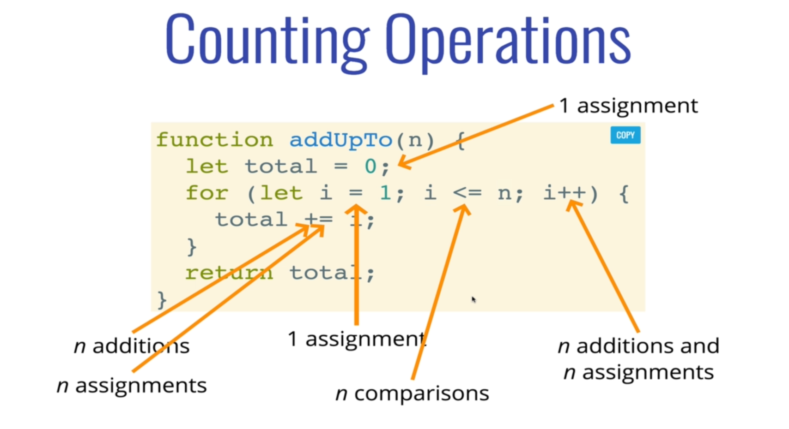

- we will simply count how many **primitive operations** are executed, and use this number t as a measure of the running time of the algorithm.
  - Ex of **primitive operations**: (They correspond to low-level instructions that take constant time to perform.)
    - assignment
    - comparison
    - arithmetic
    - calling a function
    - entering and returning from a function
  - > Instead of trying to determine the specific execution time of an algorithm, we can simply count the number of primitive operations performed.
- depending on what we count, the number of operations can be as slow as `2n` or as high as `5n+2`. But regardless of the exact number, the number of operations grows roughly proportionally with `n`
  

#### Polynomials

where `a0`,`a1`,...,`ad` are constants, called the **coefficients** of the polynomial, and `ad` != 0. Integer `d`, which indicates the highest power in the polynomial, is called the **degree** of the polynomial.

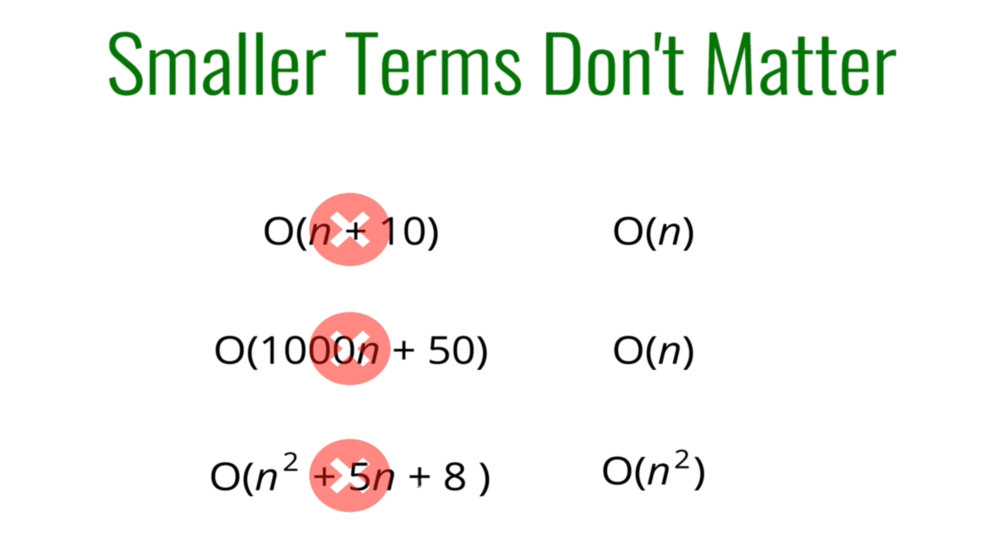

- Constant almost never matters for simple search versus binary search, because O(log n) is so much faster than O(n) when your list gets big.

---

### O(1)

These are called **"Constant-Time Operations"**, we say that this function runs in `O(1)` time; that is, the running time of this function is independent of the length, `n` of the list.

> `O(1)` is called constant time. It doesn’t mean **"instant / single operation"**. It means the time taken will stay the same, regardless of how big the input is **(constant number of operations)**.

- Computer hardware supports constant-time access to an element based on its memory address. Therefore, we say that the expression `data[j]` is evaluated in `O(1)` time for a Python list.
- The constant function characterizes the number of steps needed to do a **basic operation** on a computer, like adding two numbers, assigning a value to some variable, or comparing two numbers.

Ex:

```js
// O(1)
function(arr){
  console.log(arr[0]);
}

// O(2) -> also called O(1) as it's constant time
function(arr){
  console.log(arr[0]);
  console.log(arr[1]);
}
```

---

### O(n^2)

this is called **Quadratic Time**
Ex: usually nested loops

#### Explaining O(n^2) for loops

Usually when we have nested loops, we always think of `O(n^2)`, but that's not always the case.

- we don't always loop through the whole array in the inner loop, sometimes we loop through half of it or a quarter of it, etc.
- so when we say that It's `O(n^2)`, we're talking about the worst case scenario, which is looping through the whole array in the inner loop.
- Plus that the final number of operations will be **bounded by `n^2`** (the number of operations will never be more than `n^2`)
  - `O(c * n^2) -> O(n^2)`
    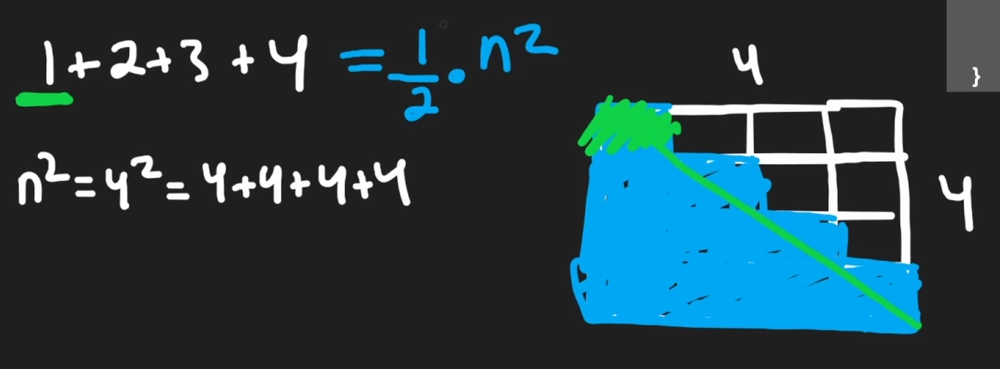

---

### O(log(n))

**`O(log N)`** means that the choice of the next element on which to perform some sort of action is one of several possibilities and only one needs to be chosen --> **"Divide and conquer**

- **Logarithms**

  - `log10(100)` is like asking:
    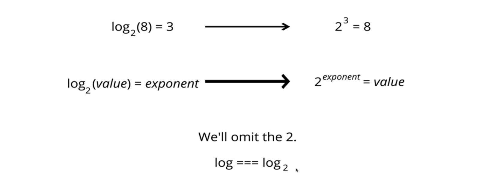
    - how many `10s` do we need to multiply together to get `100`? - `10 * 10 = 100` --> `2`
    - or how many times we need to divide `100` by `10` to get `1`? - `100 / 10 / 10 = 1` --> `2`

- The value `b` is known as the base of the logarithm. The most common base for the logarithm function in computer science is `2`

  - as computers store integers in **binary**, and because a common operation in many algorithms is to repeatedly divide an input in half.
  - In fact, this base is so common that we will typically omit it from the notation when it is `2`. That is, for us:

    ```sh
    log(n) = log2(n)
    ```

- In big O notation, we use the base `2` for the logarithm function, and we drop the base when it is `2`.

---

### O(n log(n))

This function grows a little more rapidly than the `linear function O(n)` and a lot less rapidly than the `quadratic function O(n^2)`; therefore,

- we would greatly prefer an algorithm with a running time that is proportional to `n log(n)`, than one with `quadratic` running time.

---

### O(!n)

This is called **Factorial Time** or **oh no!**

- It's considered **Exponential** Time even though it's not a polynomial
- you won't encounter it most likely
- means that we're adding nested loop for every input that we have
- Ex:
  - usually nested loops
  - The traveling salesperson problem
    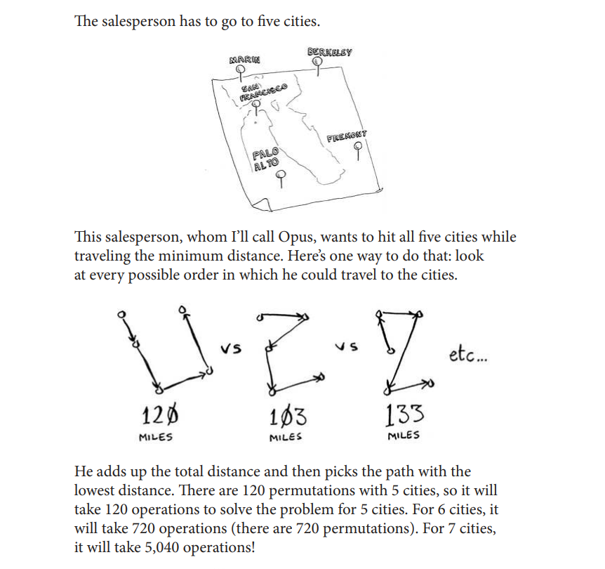

---

### Rules to improve Big o

1. worst case
   - always measure the worst case
   - Worst-case analysis is much easier than average-case analysis, as it requires only the ability to identify the worst-case input, which is often simple
     - > An average-case analysis usually requires that we calculate expected running times based on a given input distribution, which usually involves sophisticated probability theory **(big-input data distribution)**. Therefore, for the remainder of this book, unless we specify otherwise, we will characterize running times in terms of the worst case, as a function of the input size `n` of the algorithm.
2. remove constants
   - `O(n/2 + 124)` will be `O(n+1)`
3. different terms for inputs

   ```js
   function compressBoxesTwice(boxes, boxes2) {
     boxes.forEach(function (boxes) {
       console.log(boxes);
     });

     boxes2.forEach(function (boxes) {
       console.log(boxes);
     });
   }

   // result is O(n+m) and not O(n) as we have 2 different input lengths
   ```

4. drop non-dominant terms

   - `O(n^2 + n)` will be `O(n^2)`

---

### Notes

- interview question: what is the time complexity of getting the length here?

  ```js
  'sdfsdgdfsgdfgsfdg'.length;
  ```

  - answer is: it depends on how the method (`.length) works here in this language
    - for example, here we use javascript which has `length` property (not method) to each string, so it's a simple lookup --> `O(1)`

- slicing `arr[0:j+1]`, also uses `O(j + 1)` time, as it constructs a new list instance for storage.

---

## Recursion

> **Recursion** is a technique by which a function makes one or more calls to itself during execution, or by which a data structure relies upon **smaller** instances of the very same type of structure in its representation.

It's not actually an Algorithm, it's more of a concept that we use in our Algorithms

- it's used Everywhere; mostly in:
  - `traversing`
    - ex: `DOM-traversing` and (`document.getElementById`)
  - `nested operations`
    - ex: Object-traversal like ->`JSON.parse()` and `JSON.stringify()`
  - `file systems`
- **Advantages:**

  - DRY
  - Readability

- Ex: looking for a key in boxes:
  - looping
    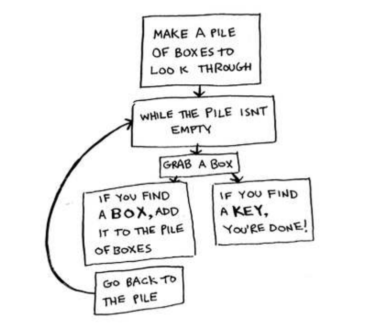
  - recursion
    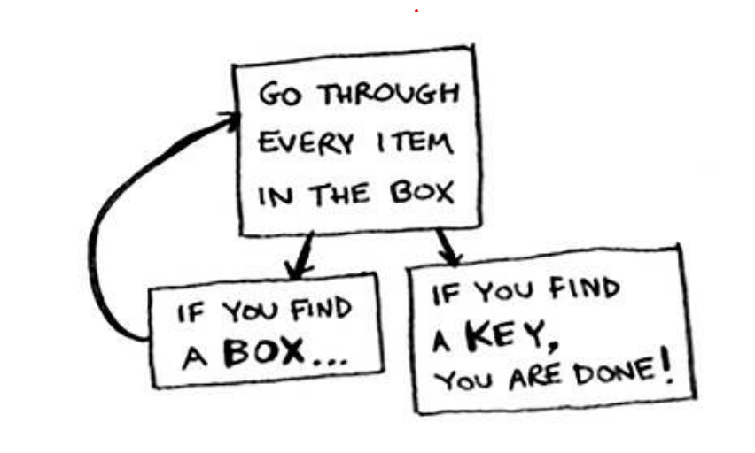
  - Both approaches have the same time complexity, but recursion is more readable
  - **Note:** There's no performance gain in using recursion over looping. In fact recursion is slower than looping in most cases.
    - This is because **recursion uses more memory than looping**, as each recursive call adds a new stack frame to the call stack, which can lead to stack overflow if the recursion is too deep.

> Quote: "Loops may achieve a performance gain for your program. Recursion may achieve a performance gain for your programmer."

- **Notes**:

  - Every time you're using a `tree` or converting something into a `tree`, consider **recursion**

- **Divide and conquer using recursion:**
  1. divided into a number of sub-problems that are smaller instances of the same problem
  2. each instance of the sub-problem is identical in nature
  3. the solutions of each sub-problem can be combined to solve the problem at hand

---

### Recursion Types

- Functional Recursion:
  - function returns result, then computer uses the result for recursive call(s)
- Procedural Recursion:
  - no return value, and the task is accomplished during recursive calls
- Linear Recursion:
  - each invocation of the body makes at most one new recursive call
- Binary Recursion:

  - When a function makes two recursive calls

    ```py
    return binary sum(S, start, mid) + binary sum(S, mid, stop)
    ```

- Multiple Recursion
  - function may make more than two recursive calls

---

### How recursion works with the call stack

When the execution of a function leads to a nested function call, the execution of the former call is **suspended** and its activation record stores the place in the source code at which the flow of control should continue upon return of the nested call.

- This process is used both in the standard case of one function calling a different function, or in the recursive case in which a function invokes itself. The key point is that there is a different activation record for each active call.
- The handling of the suspending and resuming of the execution of functions is done by the **call stack**.
- It can be a replacement for looping

- When a function is called, the function is pushed to the top of the call stack.
- When the function returns, the function is popped off the call stack.

- Ex: `factorial` function

  ```py
  def factorial(n):
      if n == 1:
          return 1
      else:
          return n * factorial(n-1)
  ```

  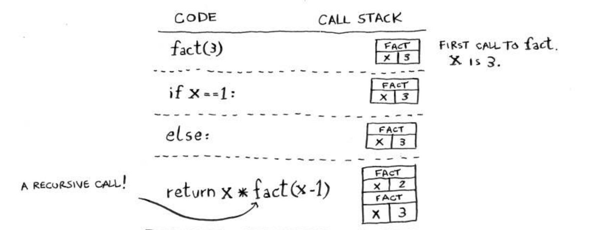
  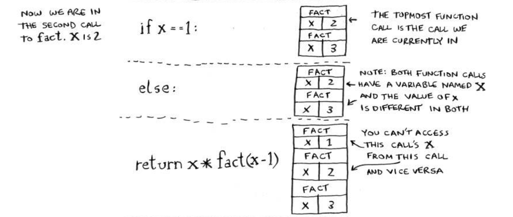
  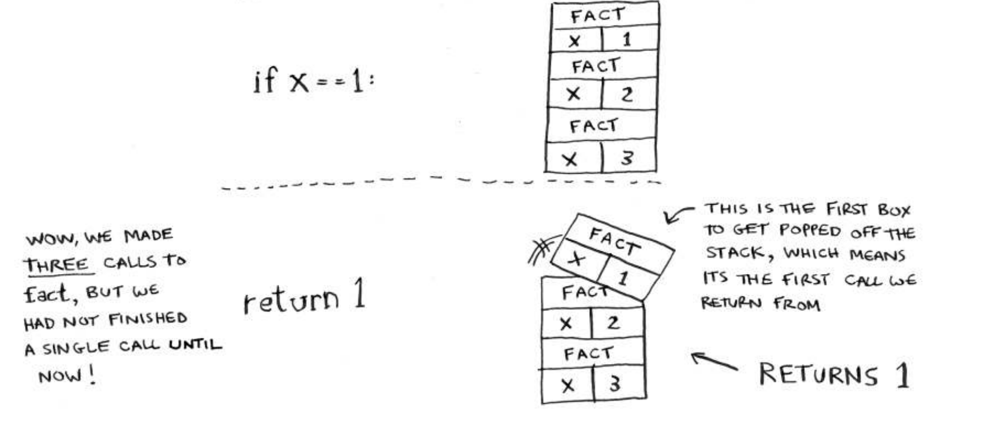
  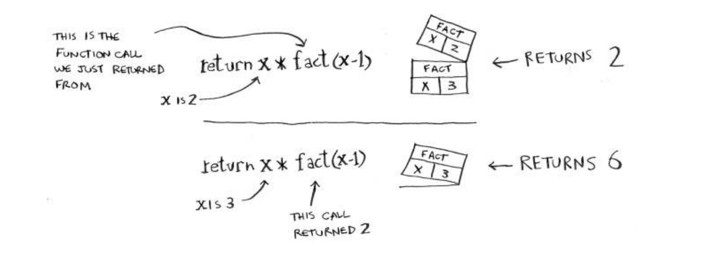

---

### Recursion Steps

- Steps:
  1. identify and test for the **Base case** (the condition when the recursion ends | when the function doesn't call itself anymore)
     - We begin by testing for a set of base cases (there should be at least one). These base cases should be defined so that every possible chain of recursive calls will eventually reach a base case (should ensure that each recursive call is in some way progressing toward a base case), and the handling of each base case should not use recursion.
     - > **Note:** When writing a recursive function involving an array, the base case is often an empty array or an array with one element.
  2. identify the **recursive case** (when the function calls itself)
     - If not a base case, we perform one or more recursive calls. This recursive step may involve a test that decides which of several possible recursive calls to make. We should define each possible recursive call so that it makes progress towards a base case.
  3. get closer and closer and return when needed. usually have 2 returns

---

### Big-O Runtime for Recursive Functions

The Big-O runtime for a recursive function is equivalent to the number of recursive calls. This **varies** depending on the complexity of the algorithm of the recursive function. For example:

- A recursive function of input `N` that calls itself twice per function may have a runtime of `O(2^N)`.
  - `2` -> because it calls itself twice (2 branches)
  - `N` -> because it's a linear recursion (height of the decision tree)

> **Note**: a bad use of recursion can lead to `O(2^n)` which is extremely inefficient

---

### Maximum Recursive Depth

Another danger in the misuse of recursion is known as infinite recursion. If each recursive call makes another recursive call, without ever reaching a base case, then we have an infinite series of such calls. This is a fatal error. An infinite recursion can quickly swamp computing resources, not only due to rapid use of the CPU, but because each successive call creates an activation record requiring additional memory

```py
def fib(n):
  return fib(n)
```

#### When recursion goes wrong

- some cases where recursion can go wrong:

  - no base case
  - forgetting to return or returning the wrong thing
  - stack overflow!

- biggest problem with recursion is **stack overflow (large stack)** in memory, so if used, we need to allocate memory for it

- for this you always need to return the recursive calls to bubble-up the returned value from the last call
- A programmer should ensure that each recursive call is in some way progressing toward a base case (for example, by having a parameter value that **decreases** with each call).

- **Note**: Fortunately, the Python interpreter can be dynamically reconfigured to change the default recursive limit. This is done through use of a module named sys, which supports a `getrecursionlimit` function and a `setrecursionlimit`. Sample usage of those functions is demonstrated as follows:

  ```py
  import sys
  old = sys.getrecursionlimit() # perhaps 1000 is typical
  sys.setrecursionlimit(1000000) # change to allow 1 million nested calls
  ```

---

### Eliminating Tail Recursion

> By making our algorithm description exploit the repetitive structure in a recursive way, we can often avoid complex case analyses and nested loops. This approach can lead to more readable algorithm descriptions, while still being quite efficient.

**Tail recursion** is a version of recursion impacts the final phase of a recursive function. In tail recursion, the recursive call is the last thing that happens in the function. This means that **the return value of the recursive call is returned as the return value of the function**, without any additional processing.

- This is important because it means that the function does not have to wait for the recursive call to be resolved. It can return immediately with the recursive call, and the recursive call can be resolved later.
- It results a much better space complexity, because we don't need to store the recursive calls in the call stack, we can just return the result of the recursive call and then return the final result of the function.

  ```py
  # Normal recursion | Space complexity -> O(n)
  def sum(n):
    if n == 0:
      return 0
    else:
      return n + sum(n-1) # we will have to wait for the recursive call to be resolved before returning the final result

  # Tail recursion | Space complexity -> O(1)
  def sum(n, running_total=0):
    if n == 0:
      return running_total
    else:
      return sum(n-1, running_total + n) # we don't have to wait for the recursive call to be resolved before returning the final result because we're returning the result of the recursive call directly
  ```

  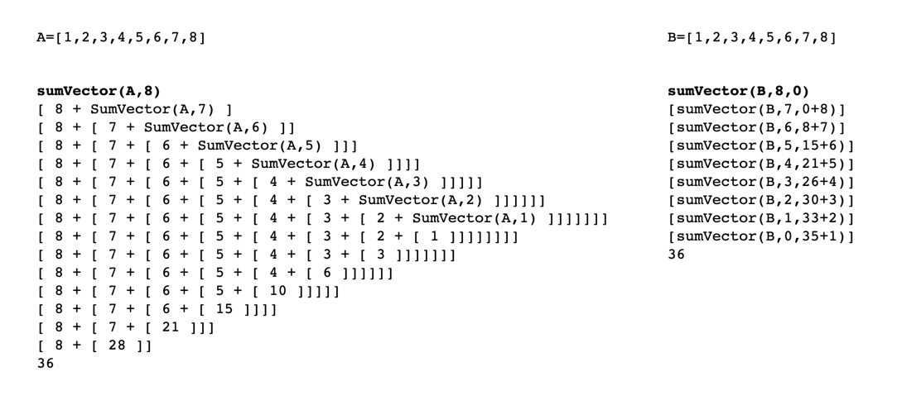

- a tail recursion must be a linear recursion (since there is no way to make a second recursive call if you must immediately return the result of the first).
- Example:

  - This is not a tail recursion because an additional multiplication is performed after the recursive call is completed.

    ```py
    return n factorial(n−1)
    ```

- Any tail recursion can be reimplemented non-recursively by enclosing the body in a loop for repetition, and replacing a recursive call with new parameters by a reassignment of the existing parameters to those values.

---

## Dynamic Programming

It's a technique to solve the problems by breaking it down into a collection of sub-problems, solving each of those sub-problems just once, and storing their solutions using a memory-based data structure (`array`, `map`, etc).

> It's an optimization technique using `"caching"` ("Do you have something you can cache?")


- It's a way to solve problems by breaking it down into a collection of sub-problems, solving each of those sub-problems just once and storing their solutions in case next sub-problem occurs.

### Memoization

**Memoization**: is a specific kind of caching used to involves caching the **return value** of functions based on their parameters

- What we memoize is the **return value** of the function based on its parameters which is usually calculated from something called **Reccurence Relation** (the relation between the current problem and the sub-problems)

- Example of using memoization

  ```py
  cache = {}

  def fib(n):
      if n in cache:
          return cache[n]
      elif n < 2:
          return n
      else:
          result = fib(n-1) + fib(n-2)
          cache[n] = result
          return result
  ```

- it's better when using `Memoization` to save the cache in the local variable of the function instead of the global scope, you can do that in Javascript, using **closures**
- What if I told you that you can reduce the time complexity of any complex operation to **`O(n)`** with using `Memoization` to reach the optimal solution, it's because we're saving the results of the sub-problems in the cache, so we don't need to solve them again, we just return the result from the cache. So it becomes linear time complexity.
  
  

---

### Dynamic programming types

#### Top-down approach (Recursion + Memoization)

We start with the **big picture** and then break it down into smaller pieces
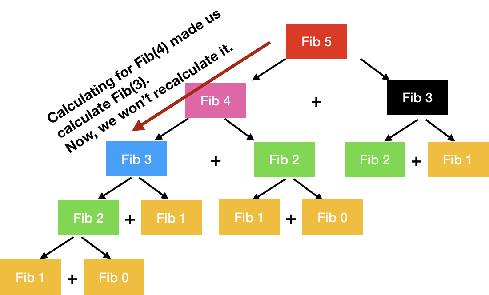

- It uses **memoization** (storing the result of each sub-problem in an array or map) and **recursion** (calling the function itself) to solve the problem.
- **Memoization** is a top-down approach

#### Bottom-up approach (Iteration + Tabulation)

We start with the **smaller pieces** and then build it up into the big picture -> Real Dynamic Programming

- It's the opposite of `Memoization` and `recursion`, because we start from the bottom **(base case)** and build it up to the top until we reach the final result.
  - the `bottom` (base case) is the smallest sub-problem that we already know the answer for it
- It uses **tabulation** (storing the result of each sub-problem in an array or map) and **iteration** (looping) to solve the problem.

> `Bottom-up` solution usually has less code than the `top-down` solution (recursion), but it's harder to think of

- Solving `Fibonacci` problem using `Bottom-up` approach
  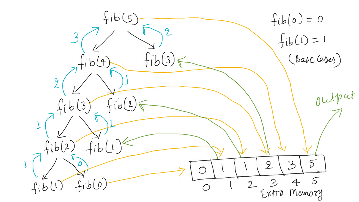
  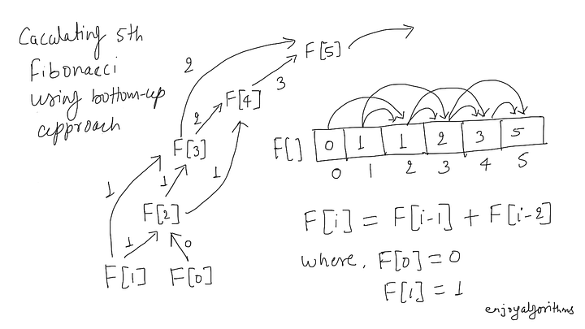

  - Notice that we don't even need array of `5` elements, we just need the last 2 elements, so we can use array of `2` elements instead of `5` elements. so we can reduce the space complexity to `O(1)` instead of `O(n)`
    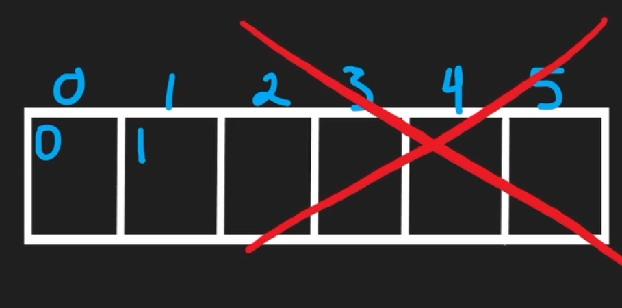

  ```py
  # Bottom-up Dynamic Programming
  def dp(n):
    if n < 2:
      return n

    arr = [0, 1]
    for i in range(2, n + 1):
      temp = arr[1]
      arr[1] = arr[0] + arr[1]
      arr[0] = temp

    return arr[1]
  ```

---

### Dynamic Programming vs Divide and Conquer (Brute Force)

We can use DP to improve problems that are solved using Divide and Conquer usually `graph` and `tree` problems, Ex:

**Q:** count the number of unique paths from `top-left` to `bottom-left`. You're only allowed to move `down` or `right` at any point in time.

- Brute Force Solution - Time and space: `O(2^(n+m))`

  ```py
  def bruteForce(r, c, rows, cols):
    if r == rows or c == cols:
      return 0
    if r == rows - 1 and c == cols - 1:
      return 1
    return bruteForce(r + 1, c, rows, cols) + bruteForce(r, c + 1, rows, cols)

  print(bruteForce(0, 0, 4, 4))
  ```

- Tob-down (Memoization) Solution - Time and space: `O(n*m)`
  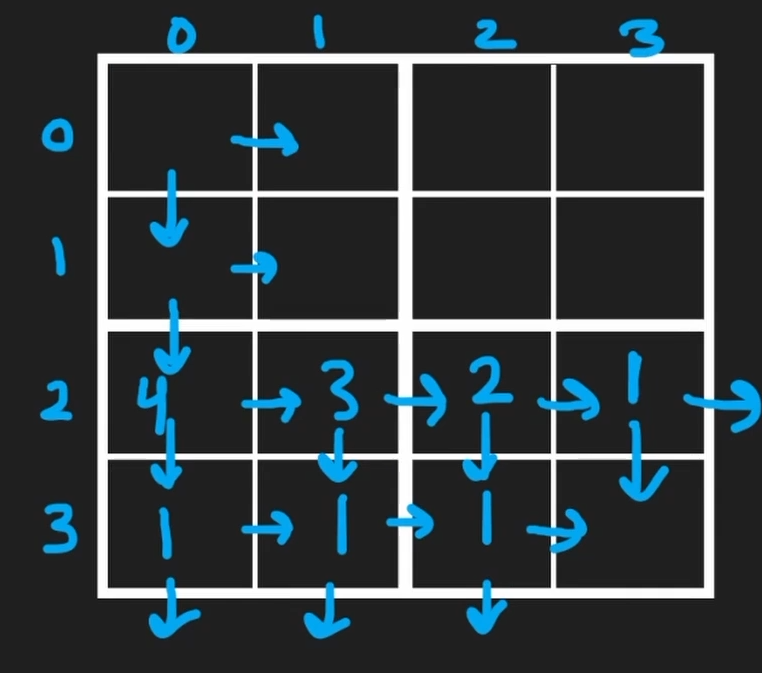

  ```py
  # Top-down Dynamic Programming
  def memoization(r, c, rows, cols, cache):
    if r == rows or c == cols:
      return 0
    if cache[r][c] > 0:
      return cache[r][c]
    if r == rows - 1 and c == cols - 1:
      return 1

    cache[r][c] = memoization(r + 1, c, rows, cols, cache) + memoization(r, c + 1, rows, cols, cache)
    return cache[r][c]

  print(memoization(0, 0, 4, 4, [[0] * 4 for _ in range(4)]))
  ```

- Bottom-up (Tabulation) Solution - Time: `O(n*m)` and space: `O(m)`, where `m` is the number of columns and `n` is the number of rows
  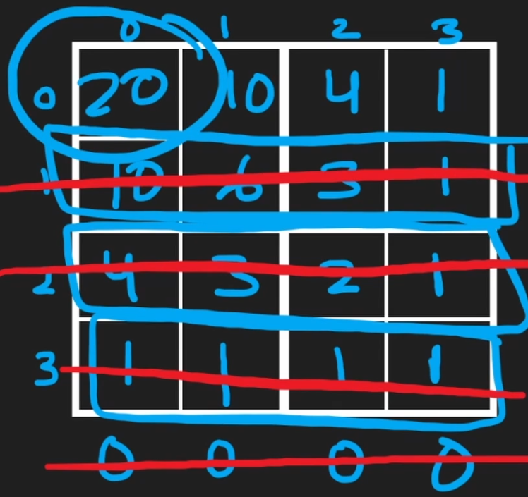

  ```py
  # Bottom-up Dynamic Programming
  def tabulation(rows, cols):
    prevRow = [0] * cols

    for r in range(rows -1, -1, -1):
      currRow = [0] * cols
      currRow[cols - 1] = 1 # last column is always 1
      for c in range(cols - 2, -1, -1):
        currRow[c] = currRow[c + 1] + prevRow[c] # add the right and bottom cells
      prevRow = currRow # set the current row as the previous row

    return prevRow[0] # return the first element of the previous row

  print(tabulation(4, 4))
  ```

---

## Sorting

**Sorting**: is the process of rearranging the items in a collection (e.g. `array`) so that the items are in some kind of order

> As more and more data is handled by our computers, **sorting** and **searching** are two of the biggest computer science problems in the software world

- usually the built-in sorting methods are different from language to another; for example, in `javascript`, it convert inputs to `strings` then sort them based on their **"character unicode"**

  - usually for `Javascript` as it uses `ECMA` so it's standard and the browser(engine) is the one who decides which algorithms to use
    - `Chrome`, `Mozilla`, ...

- Sorting algorithms use the fact that a collection of a single element is always sorted, and then they build up the collection from there and making sure that the collection is sorted at each step
- Sorting Algorithms
  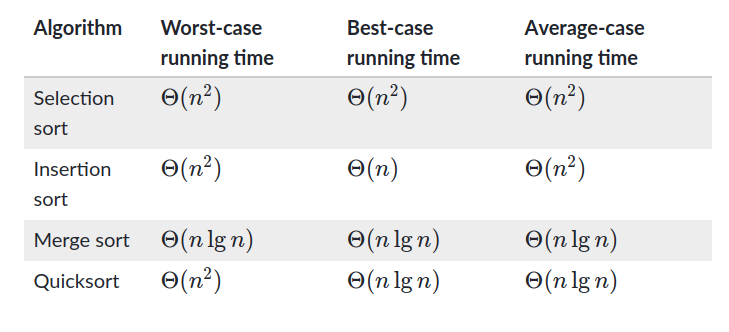

---

### Stable vs Unstable Sorting

A sorting algorithm is said to be **stable** if two objects with equal keys appear in the same order in sorted output as they appear in the input data set

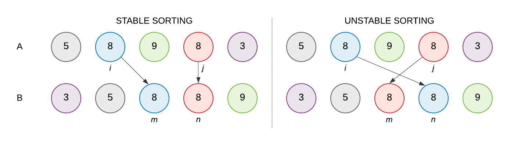

- **Stable Sorting Algorithms**: maintains the relative order of records with equal keys (if the keys are equal, the order of the records remains unchanged)
  

  - Ex: `Merge Sort`, `Insertion Sort`, `Bubble Sort`

- **Unstable Sorting Algorithms**: does not maintain the relative order of records with equal keys (if the keys are equal, the order of the records may change)
  - Ex: `Quick Sort`, `Selection Sort`

> When equal elements are indistinguishable, such as with integers, or more generally, any data where the entire element is the key, stability is not an issue. **Stability is also not an issue if all keys are different.**

- Any given sorting algorithm which is not stable can be modified to be stable. There can be algorithm-specific ways to make it stable, but in general, **any comparison-based sorting algorithm which is not stable by nature can be modified to be stable by changing the key comparison operation** so that the comparison of two keys considers position as a factor for objects with equal keys.

- Where stable sorting algorithms are useful?

  - When we want to sort objects by multiple attributes
  - Consider the following dataset of Student Names and their respective class sections:

    ```py
    [(Alice, 2), (Bob, 1), (John, 2), (Mary, 1), (Mike, 2), (Sarah, 1), (Tom, 1)]
    ```

    - If we sort this dataset by name, we get the following:

      ```py
      [(Alice, 2), (Bob, 1), (John, 2), (Mary, 1), (Mike, 2), (Sarah, 1), (Tom, 1)]
      ```

    - But if we sort this dataset by class section, we get the following:

      ```py
      [(Bob, 1), (Mary, 1), (Sarah, 1), (Tom, 1), (Alice, 2), (John, 2), (Mike, 2)]
      ```

      - Notice that the relative order of students with class section `1` and students with class section `2` is maintained in the sorted output
      - if we used unstable sorting algorithm, the relative order of students with class section `1` and students with class section `2` may change in the sorted output

---

### Insertion Sort

It's a sorting algorithm where we **insert** each element in the correct place in the sorted part of the array (the left side of the array)

> It's called **"Insertion Sort"** because we take an element and **insert it in the correct place in the sorted array**

- it's used when you know or think that the list is **"almost/already sorted"**

  - ex: `online-algorithm` -> algorithm that can work when the data is coming-in, it doesn't have to have the entire array(data) at once, as we "keep one side of the array sorted and insert the others in their correct order"

- **steps:**
  

  1. start by picking the `second` element in the array because we assume that the `first` element is already sorted.
     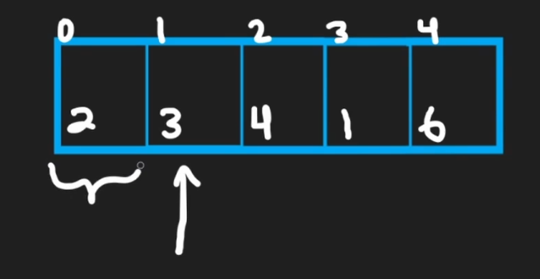
  2. now compare the second element with (the one before it) and **swap** if necessary, then repeat until the element is in the correct order
     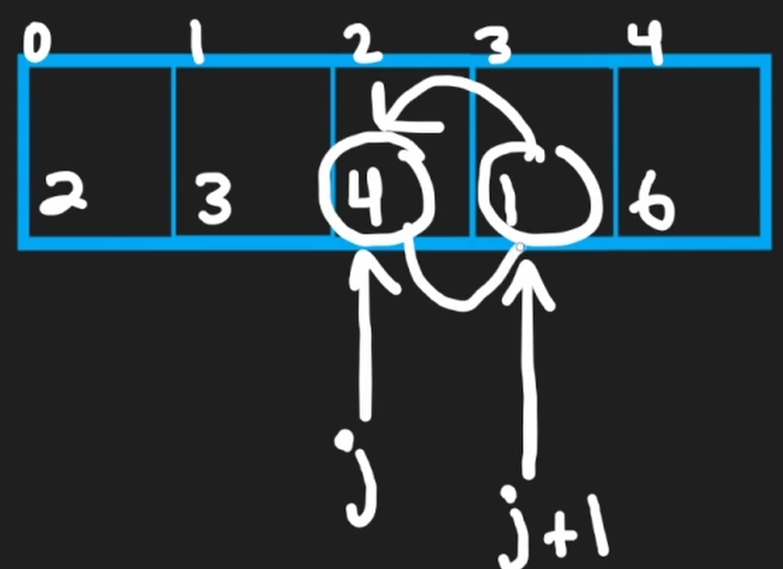
  3. continue to the next element and if it is in the (incorrect order), iterate through the sorted portion (the left side) to place the element in the correct place
     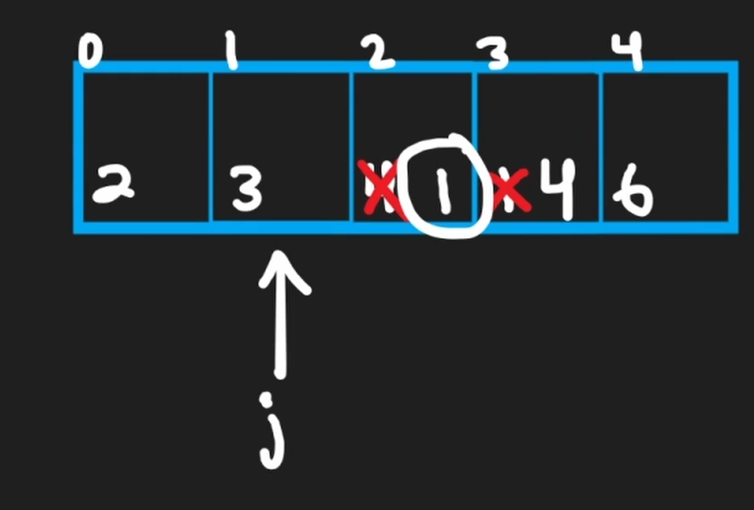
     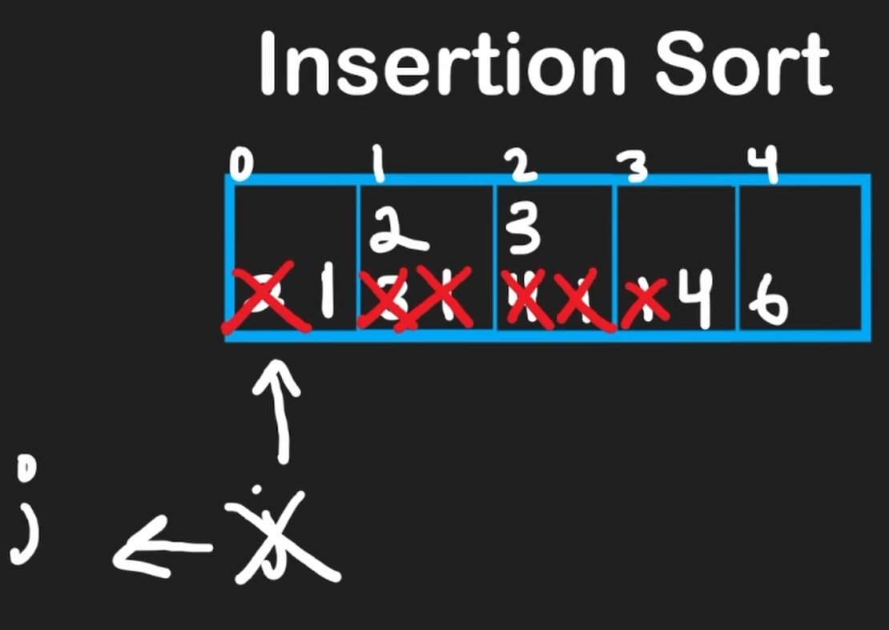
  4. repeat until the array is sorted

- Time complexity:
  - **Best case**: `O(n)` -> when the array is already sorted (because we don't even go inside the `while` loop and just iterate through the array once)
  - **Worst case**: `O(n^2)` -> when the array is sorted in reverse order
  - **Average case**: `O(n^2)`

```py
def insertion_sort(arr):
  for i in range(1, len(arr)):
    j = i - 1 # index of element before current element
    # keep swapping the element with the one before it until it's in the correct place
    while j >= 0 and arr[j + 1] < arr[j]:
      arr[j], arr[j + 1] = arr[j + 1], arr[j] # swap
      j -= 1

  return arr
```

---

### Bubble Sort

It's a sorting algorithm where the largest values **bubble up to the top**

> it's also called **sinking sort** as the largest values **sink down to the end**

- it works on the concept of moving the largest number to the end (bubbling the largest number up)
- It's like `element-1` tells `element-2` "Hey, if you're larger than me, you go ahead and swap with me", and so on.
  
  - it loops on each numbers and compare the 2 values-pairs at hand
    - if the number in the left is larger than the left one, we swap them, else we continue to the next pair until we have the largest number at the end.
    - by that we would go to the next iteration and repeat
- it's one of the simplest sorting algorithms, but the has least performance
  - Time complexity: `O(n^2)`
    - this is because we have 2 nested loops and at each iteration, we're looping through the whole array
  - one of its performance drawbacks, is that if the array is **almost-sorted**, it will continue to do all looping and checking steps even if we reached sorted-result after the first few steps

```py
def bubble_sort(arr):
  for i in range(len(arr)):
    for j in range(len(arr) - 1):
      # if the number in the left is larger than the left one, we swap them
      if arr[j] > arr[j + 1]:
        arr[j], arr[j + 1] = arr[j + 1], arr[j]
  return arr
```

---

### Selection Sort

It's a sorting algorithm where we **select** the smallest element and put it in the first position, then select the next smallest element and put it in the second position, and so on.

- it works by scanning a list of items for the smallest element and then swapping that element for the one in the first position
- also one of the simplest but not efficient either
  - the first operation takes `n` steps, the second takes `n-1` steps, and so on, until the last operation takes `1` step -> `n + (n-1) + (n-2) + ... + 1` -> `O(n^2)`
- **steps:**
  

  1. store the first element as the smallest value you've seen so far
  2. compare this item to the next item in the array until you find a smaller number **(in each iteration, we select the smallest item that hasn't yet been sorted)**
     - if smaller number is found, designate that smaller number to be the new **minimum** and continue to the end of the array
     - if the **minimum** is not the value(index) you initially began with, we swap the two values
  3. repeat this with the next element until the array is sorted

```py
def selection_sort(arr):
  for i in range(len(arr)):
    min_index = i
    # loop from the next element to the end of the array and find the smallest element
    for j in range(i + 1, len(arr)):
      if arr[j] < arr[min_index]:
        min_index = j
    # if the minimum is not the value(index) you initially began with, we swap the two values
    if min_index != i:
      arr[i], arr[min_index] = arr[min_index], arr[i]
  return arr

# ----------------------------------------------- or -----------------------------------------------

# helper function to find the index of the smallest element in the array
def find_smallest(arr):
  smallest = arr[0]
  smallest_index = 0
  for i in range(1, len(arr)):
    if arr[i] < smallest:
      smallest = arr[i]
      smallest_index = i
  return smallest_index

def selection_sort(arr):
  new_arr = []
  for i in range(len(arr)):
    smallest = find_smallest(arr)
    # pop the smallest element from the array and append it to the new array
    new_arr.append(arr.pop(smallest))
  return new_arr
```

> it's better than **Bubble sort** only in one condition:
>
> - if you want to minimize the number of **swaps** on each loop

- **Notes**
  - You will notice that this algorithm is doing a lot of unnecessary work, because after the first iteration, the smallest number is already in the first position
  - In the sorting algorithm, the number of elements to check decreases as you go through the operations until you only have to check one element. However, the runtime is still `O(n^2)` because of constants in Big O notation. On average, you check a list that has `1/2 * n` elements, but constants like `1/2` are ignored in Big O notation, so the runtime is written as `O(n^2)`.

---

### Heap Sort

It's a sorting algorithm where we use a **heap** data structure to sort the array

- It usually implements sorting **in-place** (no extra memory needed)
- It's not a stable sorting algorithm (it doesn't maintain the relative order of records with equal keys)
- It's not an online algorithm (it can't sort a list as it receives it) as it needs the entire array to start sorting

```py
import heapq

def heapSort(arr):
  heap = []
  for element in arr:
    heapq.heappush(heap, element)

  for i in range(len(arr)):
    arr[i] = heapq.heappop(heap)
```

- Time complexity: `O(n log n)`
  - `O(n)` to create the heap
  - `O(log n)` to insert each element to the heap **(Bottom-up approach)**

---

### Divide & Conquer

Both merge sort and quicksort employ a common algorithmic paradigm based on **recursion**. This paradigm, **divide-and-conquer**, breaks a problem into subproblems that are similar to the original problem, recursively solves the subproblems, and finally combines the solutions to the subproblems to solve the original problem.


- Merge Sort vs Quick Sort
  - Quick sort is risky, In worst case, it can be `O(n^2)`, but in average case, it's `O(n log(n))`
  - unlike `merge sort` which is always `O(n log n)`
  - Sometimes the constant can make a difference. `Quicksort` versus `merge sort` is one example. `Quicksort` has a smaller constant than `merge sort`. So if they're both `O(n log n)` time, `quicksort` is faster. And `quicksort` is faster in practice because it hits the average case way more often than the worst case.

---

### Merge Sort

It's all about continually **splitting** the array into halves until you have arrays that are empty or have one element (can't split anymore), then you **merge** those arrays, while sorting them at the same time

> So it's about breaking down the problem of sorting into sub-problems, and then building up a solution from the sub-problems


- It's a combination of 2 things: `dividing` & `merging`
- it exploits the fact that arrays of `0` or `1` elements are always sorted
  - as it works by decomposing an array into smaller arrays of `0` or `1` elements, then building up a newly sorted array
- it uses the technique: "Divide & Conquer" by implementing `recursion` and combining the solutions which gives us **`O(n log n)`** time complexity which is better than **`O(n^2)`**

  - the number of times we **divide**(split-up/decompose) is equal to `log(n)` and the number of **merging**(comparisons) is `n`

- The "divide" part is done by **recursion**
- The "conquer" part is done by **Two pointers** (one for each array) or **slicing** and a `while` loop

- it's one of the most efficient ways to sort lists
- one downside is that it has a bigger space-complexity: **space-complexity of `O(n)`** unlike most sorting algorithms which has `O(1)`
  - this is due to storing the divided lists in memory
  - so we use it if we have enough memory

#### Merge sort implementation

Consists of 2 functions: `merge` & `merge_sort`
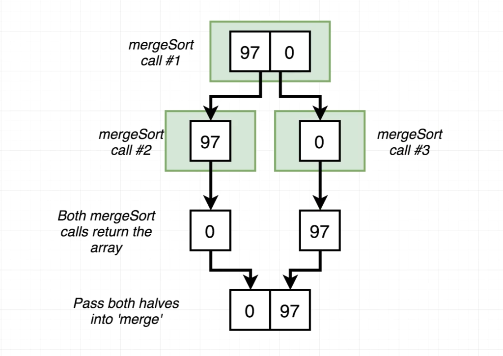

1. `merge` function

   - is used to merge 2 sorted arrays into one sorted array
   - while there are still elements in both arrays (`arr1`, `arr2`) we haven't looked at:
     - if the first value in the first array is smaller than the first value in the second array, push the value in the first array into our `results` and move on to the next value in the first array
     - if the value in the first array is larger than the value in the second array, push the value in the second array into our results and move on to the next value in the second array
   - once we exhaust one array, push in all remaining values from the other array
   - > **Note:** To make the `merge` function **stable**, we can change the comparison operator to `<=` instead of `<`

2. `merge_sort` function

   - is used to split the array into halves until we have arrays that are empty or have one element
   - then we merge those arrays, while sorting them at the same time
   - it uses the technique: "Divide & Conquer" by implementing `recursion` and combining the solutions

```py
def merge(arr1, arr2):
  results = []
  i = 0 # pointer for arr1
  j = 0 # pointer for arr2

  while i < len(arr1) and j < len(arr2):
    if arr1[i] <= arr2[j]: # to make it stable, change the comparison operator to <=
      results.append(arr1[i])
      i += 1 # move on to the next value in the first array
    else:
      results.append(arr2[j])
      j += 1 # move on to the next value in the second array

  # once we exhaust one array, push in all remaining values from the other arrays
  while i < len(arr1):
    results.append(arr1[i])
    i += 1

  while j < len(arr2):
    results.append(arr2[j])
    j += 1

  return results

 # ------------------------------------------------------------------------------ #

def merge_sort(arr):
  # base case (Single element array is already sorted)
  if len(arr) <= 1:
    return arr

  # divide
  mid = len(arr) // 2
  left = merge_sort(arr[:mid])
  right = merge_sort(arr[mid:])

  # conquer
  return merge(left, right)
```

- Time complexity: **`O(n log n)`**
  
  - `log(n)` -> the number of times we **divide by 2**(split-up/decompose)`is equal to`log(n)`
  - `n` -> the number of **merging**(comparisons)

---

### Quick Sort

It's all about continually **picking** an element as a **"pivot point"** and **partitioning** the given array around the picked pivot

- it also uses the technique: "Divide & Conquer" like `merge sort` by implementing `recursion` and combining the solutions
- it has better **space-complexity of `O(log(n))`**, so it can be sorted in memory if the database is not massive

- **How it works:**

  - it picks an element as a **"pivot point"** and partitions the given array around the picked pivot
  - it uses the technique: "Divide & Conquer" by implementing `recursion` and combining the solutions
  - it's a combination of 2 things: `partitioning` & `sorting`
    - `partitioning` is done by splitting the array into 2 sub-arrays: `left` & `right` sub-arrays relative to the **"pivot point"**, where the `left` sub-array has all the elements smaller than the **"pivot point"** and the `right` sub-array has all the elements larger than the **"pivot point"**
      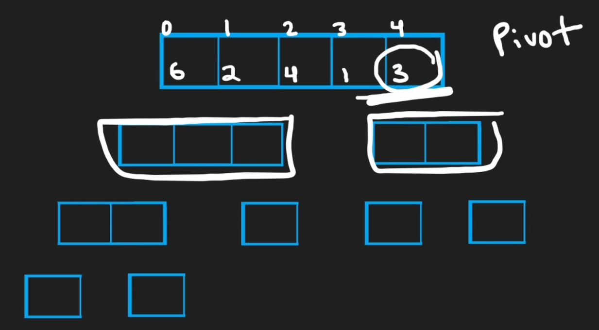
    - we perform the partitioning **in-place** (less memory), and we do this by using `2 pointers`:
      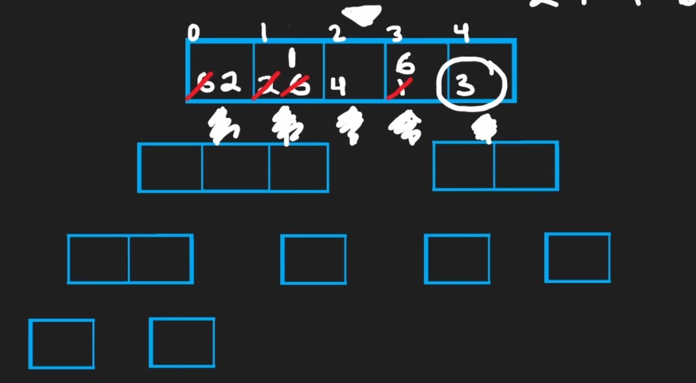
      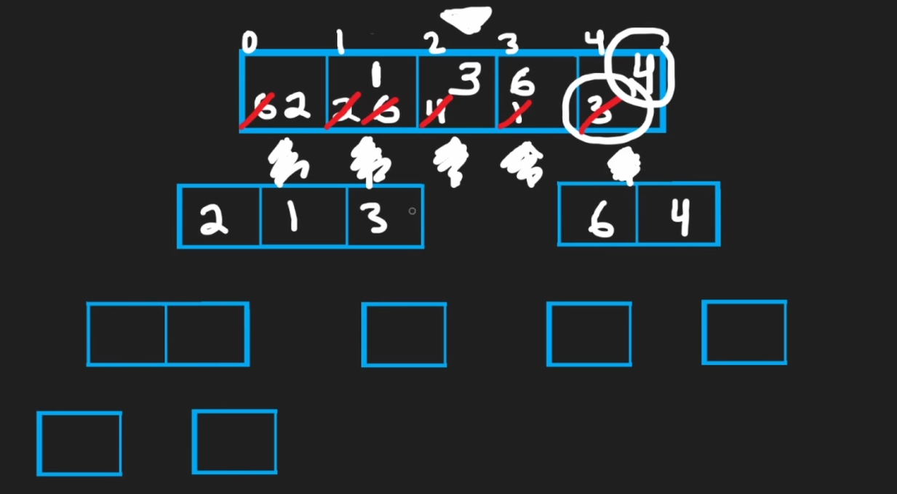
      - `i` -> keeps track of the index of the last element in the `left` sub-array which is the middle-point between the `left` sub-array and the `right` sub-array
      - `j` -> keeps track of the index of the first element in the `right` sub-array so that we can swap it with any element smaller than the **"pivot point"** in the `left` sub-array
    - After the partitioning is done, we **recursively** apply the above steps to the `left` sub-array and the `right` sub-array until the entire array is sorted
      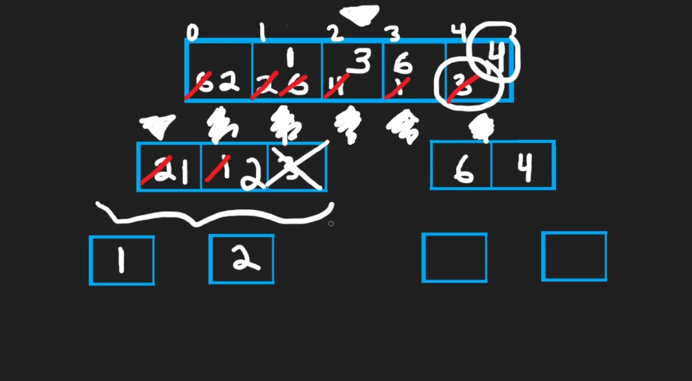
      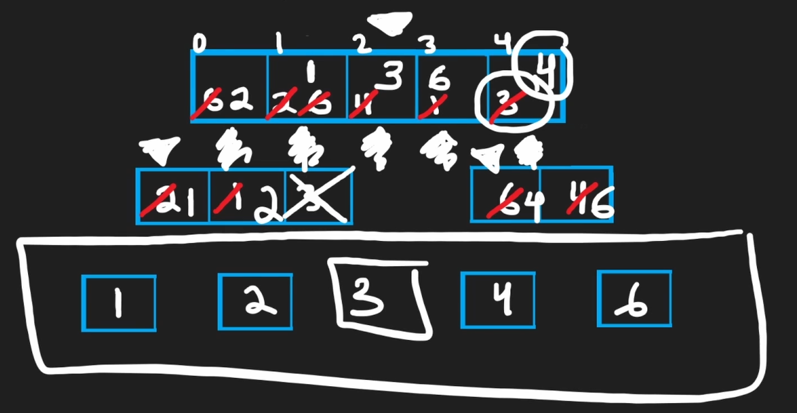

- Quick sort is unique, because its speed depends on the `pivot point` you choose

- **Time complexity:**
  - **best case** for time-complexity is `O(n log n)`
    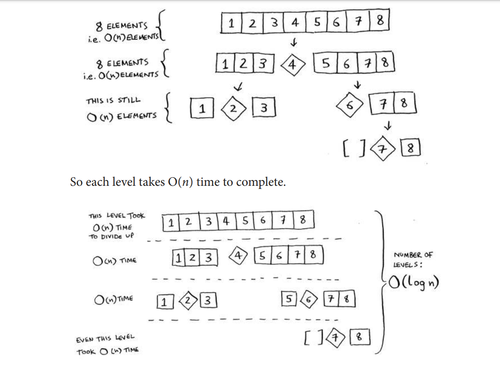
    - In this example, there are `O(log n)` levels (the technical way to say that is, “he height of the call stack is `O(log n)`”). And each level takes `O(n)` time. he entire algorithm will take `O(n) * O(log n) = O(n log n)` time. This is the best-case scenario.
  - it may have a **worst-case** for time-complexity of `O(n^2)` if the **"pivot point"** is the smallest point and is the first element. because we're not splitting by half, we're splitting by `1` element at a time
    - `n * n-1 * n-2 * ... * 1` -> `O(n^2)`
      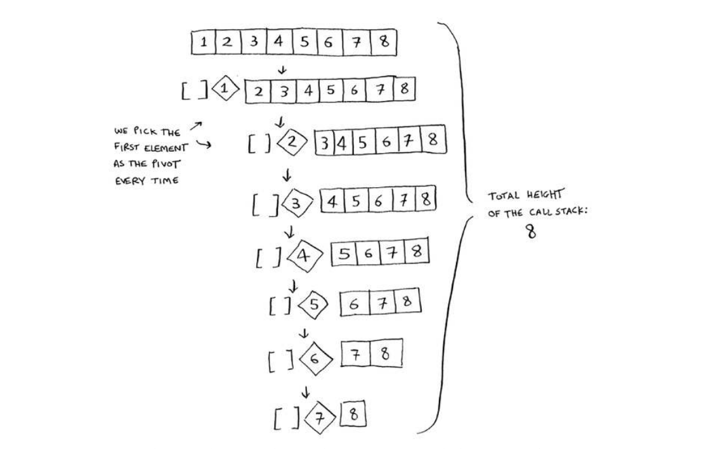
    - In this example, there're `O(n)` levels, so the entire algorithm will take `O(n) * O(n) = O(n^2)` time
    - This is worst than `selection sort` and `insertion sort`, but it usually doesn't happen because we usually choose the **"pivot point"** randomly
  - average case for time-complexity is `O(n log n)`
    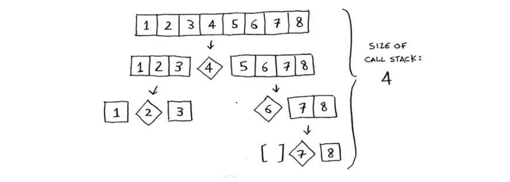
    - > **Note:** The best case is also the average case. If you always choose a random element in the array as the pivot, quicksort will complete in O(n log n) time on average. **Quicksort is one of the fastest sorting algorithms out there**, and it’s a very good example of D&C.

> **Note:** To avoid the worst-case scenario, we can choose the **"pivot point"** randomly but not the last element/first element, and there're optimizations that can be done to avoid the worst-case scenario

#### Quick sort implementation

- **Quick sort Steps:**
  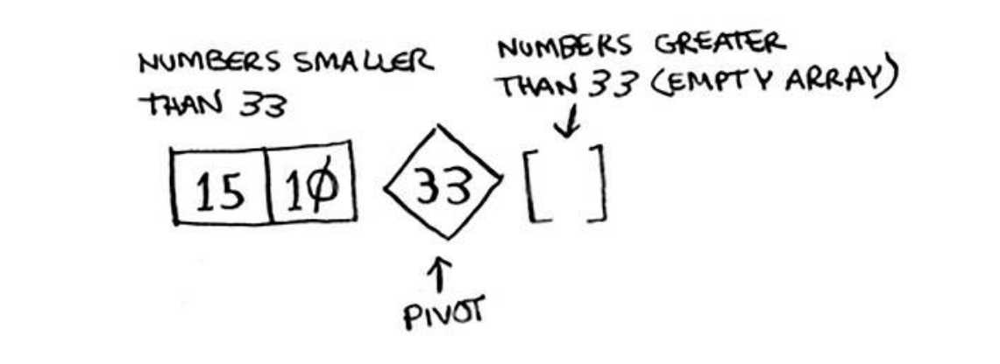

  1. pick a `pivot` point
  2. partition the array into `2` sub-arrays: one with all the elements less than the pivot point, and one with all the elements greater than the pivot point
  3. call `quicksort` recursively on both `sub-arrays`

- **Implementation 1:** using `2` sub-arrays
  

  - it's not an `in-place` implementation, because we're creating `2` new arrays
  - it's a `stable` sort, because it preserves the order of the elements with the same value

  ```py
  def quicksort(array):
    # base case -> if the array has 0 or 1 element, it's already sorted
    if len(array) < 2:
      return array

    # recursive case
    # choose a pivot point
    pivot = array[0]
    # sub-array of all the elements less than the pivot
    less = [i for i in array[1:] if i <= pivot]
    # sub-array of all the elements greater than the pivot
    greater = [i for i in array[1:] if i > pivot]

    return quicksort(less) + [pivot] + quicksort(greater)
  ```

- **Implementation 2:** using `2` pointers + swapping **(in-place)**
  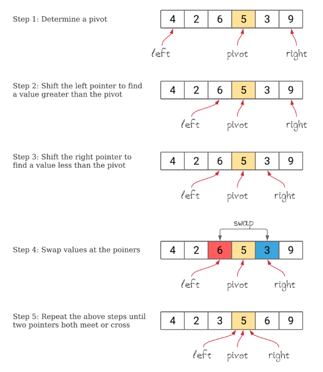
  

  - it's an `in-place` implementation, because we're not creating `2` new arrays
  - it's not a `stable` sort, because it doesn't preserve the order of the elements with the same value

  ```py
  def quicksort(array, low, high):
    # base case
    if low < high:
      # partition the array into 2 sub-arrays
      pivot = partition(array, low, high)
      # call quicksort recursively on both sub-arrays without the pivot
      quicksort(array, low, pivot - 1)
      quicksort(array, pivot + 1, high)

    return array

  # helper function to partition the array into 2 sub-arrays
  def partition(arr, low, high):
    pivot = arr[high]
    i = low - 1

    # walk from low to high and swap the elements that are smaller than the pivot with the elements that are larger than the pivot
    for j in range(low, high):
      if arr[j] <= pivot:
        i += 1
        arr[i], arr[j] = arr[j], arr[i] # swap

    # Now, all the elements that are smaller than the pivot are on the left side of the arr[i], and all the elements that are larger than the pivot are on the right side of the arr[i]

    # swap the pivot with the element at index i + 1
    arr[i + 1], arr[high] = arr[high], arr[i + 1]
    return i + 1 # return the index of the pivot
  ```

---

#### Hoare's Partitioning Scheme (Quick Select) (NOT IMPORTANT ⚠️)

It's a partitioning scheme that is used in `quick sort` to choose the `pivot point` and partition the array into 2 sub-arrays

- Explanation:

  - It uses 2 pointers: `i` & `j`
    - `i` -> keeps track of the index of the last element in the `left` sub-array which is the middle-point between the `left` sub-array and the `right` sub-array
    - `j` -> keeps track of the index of the first element in the `right` sub-array so that we can swap it with any element smaller than the **"pivot point"** in the `left` sub-array
  - It starts from the ends of the array and works its way **inwards**
  - `i` starts from the left side of the array and moves to the right until it finds an element that is greater than the **"pivot point"**
  - `j` starts from the right side of the array and moves to the left until it finds an element that is smaller than the **"pivot point"**
  - then we swap the 2 elements
  - we repeat this process until `i` and `j` cross each other
  - then we swap the **"pivot point"** with the element at index `j`
  - then we return the index of the **"pivot point"**

  ```py
  def partition(arr, low, high):
    pivot = arr[low]
    i = low - 1
    j = high + 1

    while True:
      i += 1
      while arr[i] < pivot:
        i += 1

      j -= 1
      while arr[j] > pivot:
        j -= 1

      if i >= j:
        return j

      arr[i], arr[j] = arr[j], arr[i]
  ```

##### Implementing Quick sort using Hoare's Partitioning Scheme (Quick Select)

```py
def partition(arr, low, high):
  pivot = arr[low]
  i = low - 1
  j = high + 1

  while True:
    i += 1
    while arr[i] < pivot:
      i += 1

    j -= 1
    while arr[j] > pivot:
      j -= 1

    if i >= j:
      return j

    arr[i], arr[j] = arr[j], arr[i]

def quicksort(array, low, high):
  # base case
  if low < high:
    # partition the array into 2 sub-arrays
    pivot = partition(array, low, high)
    # call quicksort recursively on both sub-arrays
    quicksort(array, low, pivot)
    quicksort(array, pivot + 1, high)

  return array

# Using it
arr = [10, 7, 8, 9, 1, 5]
print(quicksort(arr, 0, len(arr) - 1))
```

---

### Bucket Sort

It's a sorting algorithm that works by distributing the elements of an array into a number of buckets and then each bucket is sorted individually using a different sorting algorithm or by recursively applying the bucket sorting algorithm

- It's a rare sorting algorithm, because it requires specific conditions to work:
  - the elements of the array must be uniformly distributed -> the elements must be evenly distributed across the range of the array
  - all the unique elements must fit within a **finite** range
- For every single element in the array, we need to create a bucket for it
  - The bucket is just a container that holds the elements with the index of the element as the key
    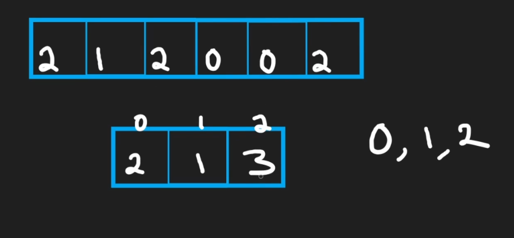
    - here:
      - bucket `0` holds the number of times `0` appears in the array
      - bucket `1` holds the number of times `1` appears in the array
      - bucket `2` holds the number of times `2` appears in the array
- Then we sort the buckets
  - we will go through each bucket and add the `index` of of the bucket to the sorted array as many times as the value of the `bucket[index]`
    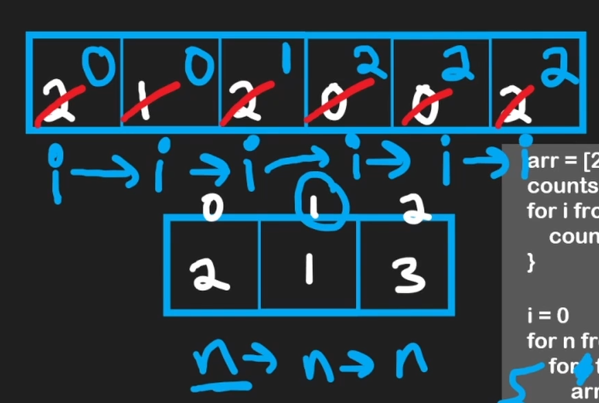
- it's a **non-comparison** sorting algorithm, as it doesn't compare the elements of the array, it just distributes the elements into buckets

```py
def bucket_sort(array, max_val):
  # fill the buckets
  buckets = [0] * (max_val + 1)
  for i in array:
    buckets[i] += 1

  # sort the elements

  # Option 1: using extra space
  sorted_array = []
  for j in range(len(buckets)):
    for _ in range(buckets[j]):
      sorted_array.append(j)

  return sorted_array

  # ----------------------------------------------

  # Option 2: in-place
  i = 0
  for j in range(len(buckets)):
    for _ in range(buckets[j]):
      array[i] = j
      i += 1

  return array
```

- Time complexity:
  - `O(n + k)`, where `n` is the number of elements in the array and `k` is the number of buckets
  - notice that its's not `O(n^2)`, even though it has 2 nested loops, because the inner loop doesn't depend on the outer loop
- **Notes:**
  - the bucket sort is **not a stable sort**, because it doesn't preserve the order of the elements with the same value
    - one way to make it stable is to use a **linked list** instead of an array to store the buckets
  - Normally, you won't be able to use the bucket sort, because the elements of the array won't be uniformly distributed
    - but if you know that the elements are uniformly distributed, then you should use it because it has the best time complexity `O(n)`

---

### Radix Sort

- The previous sorting-algorithms were called: "Comparison Sorts", but the question is: "can we do better for the time-complexity?"

  - the answer is "sort of", as we yes can; but not by making direct-comparisons

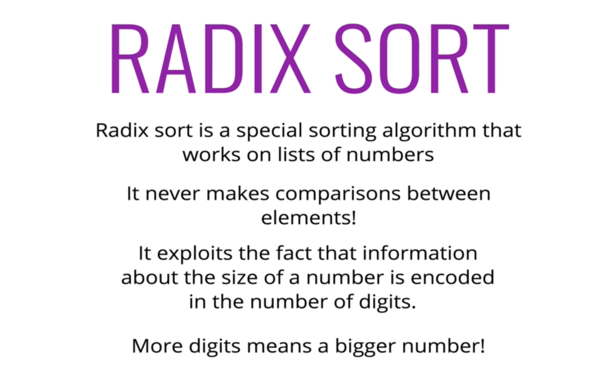

- number of times we need to do the "mapping-bucket-operations" depends on how many digits the largest number has

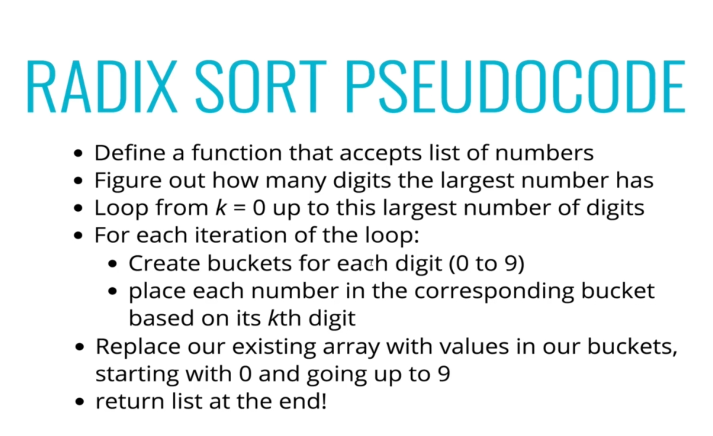
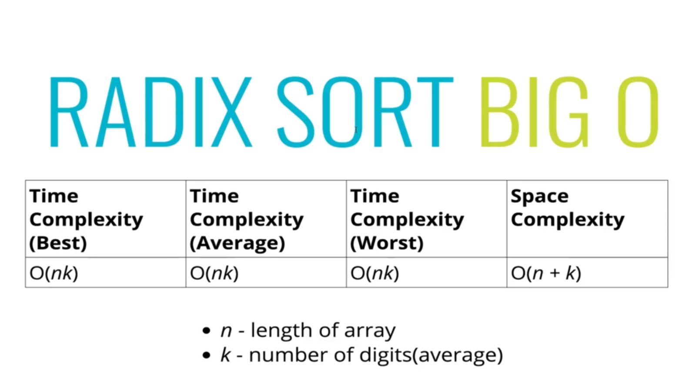

---

### Sorting Notes

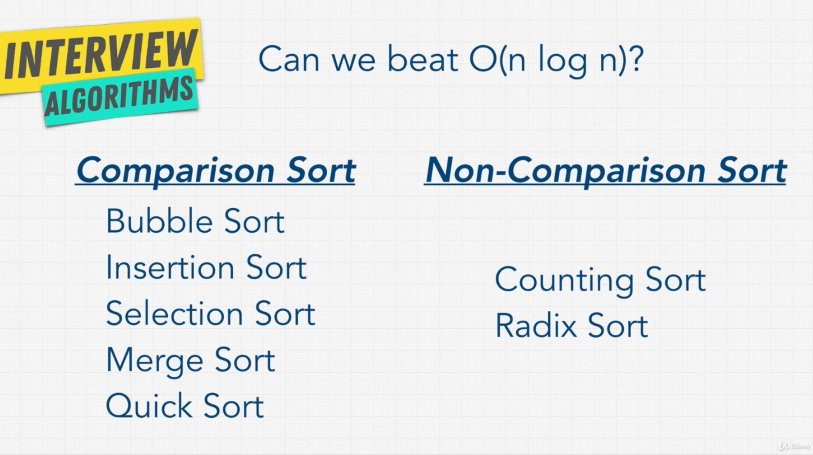

- the best sorting time complexity will always be `O(nlog(n))` as the `"n"` says that we do a comparison between the elements of the list

---

## Searching

- When the sequence is **unsorted**, the standard approach to search for a target value is to use a loop to examine every element, until either finding the target or exhausting the data set. This is known as the **"sequential search algorithm"**. This algorithm runs in `O(n)` time (i.e., linear time) since every element is inspected in the worst case.
- When the sequence is **sorted** and indexable, there is a much more efficient algorithm, like [Binary Search](#binary-search).

### Linear(sequential) Search

It's a method of finding a target value within the list.

- It sequentially iterate on each element of the list and checks for the target value until a match is found or until all the elements have been searched
- It's usually the default searching algorithm in built-in sorting-methods in programming languages like in Javascript: `.indexOf()`, `.find()`

---

### Binary Search

Binary search is a search algorithm that finds the position of a target value within a **sorted** array.

- if we know tha list is **sorted**:
  - Rather than eliminating one element at a time, you can eliminate **half** of the remaining elements at a time
  - we can pick a number in the list and discard it's left/right side based on the number we're searching for
- we are essentially creating a **"binary search tree** from the list
- so it's a `divide&conquer` approach, so it gives us `O(log(n))`

#### How it works


- We call an element of the sequence a **"candidate"**
- we get the middle element: the item `data[mid]` with index:

  ```py
  mid = (low + high) // 2;
  # or
  mid = low + (high - low) // 2 # to avoid integer overflow
  ```

- We consider three cases:

  1. If the target equals `data[mid]`, then we have found the item we are looking for, and the search terminates successfully
  2. If `target < data[mid]`, then we recur on the first half of the sequence, that is, on the interval of indices from low to `mid−1`.
  3. If `target > data[mid]`, then we recur on the second half of the sequence, that is, on the interval of indices from `mid+1` to high.

- Here worst case is `O(log(n))` with log-base of `2` as we divide each group by `2` each time

```py
# 1. Recursive Binary Search
def binary_search(data, target, low, high):
  if low > high:
    return False  # interval is empty; no match
  else:
    mid = (low + high) // 2
    if target == data[mid]:  # found a match
      return True
    elif target < data[mid]:
      # recur on the portion left of the middle
      return binary_search(data, target, low, mid - 1)
    else:
      # recur on the portion right of the middle
      return binary_search(data, target, mid + 1, high)

# -------------------------------------------------------------------------------------------------

# 2. Iterative Binary Search ✅
def binary_search_iterative(nums, target):
  l, r = 0, len(nums) - 1

  while l <= r:
    midIdx = (l + r) // 2
    if nums[midIdx] > target:
      r = midIdx - 1
    elif nums[midIdx] < target:
      l = midIdx + 1
    else:
      return midIdx

  return -1
```

- Time complexity: `O(log(n))`

  - Because we divide the search space in half at each step, the total number of steps required to find the target is `log(n)`, where `n` is the number of elements in the list

    ```py
    # n is the number of elements in the list (r-l+1)
    # k is the number of steps required to find the target
    n/2^k = 1
    n = 2^k
    log(n) = log(2^k)
    log(n) = k log(2)
    log(n) = k
    ```

- **Notes**:
  - An unsuccessful search occurs if we reached the end of array where: `start = middle = end`, so we won't be able to continue as the next step would result this: `low high`, as the interval `[low,high]` is empty
    - so we need to create an edge case to prevent infinite loop
  - making a copy of half the list would already take `O(n)` time, negating the whole benefit of the binary search algorithm.
  - when we get the middle element, we use: `mid = (low + high) // 2`, Actually this can lead to an **integer overflow**. Imagine that `low` and `high` are very large numbers. Adding them up will cause an integer overflow.
    - A better way is to compute `mid` as `mid = low + (high - low) // 2`. Dividing `high - low` before adding `low` avoids the integer overflow.

---

## Graph Traversals

it means going through each item in the list, like checking for something on each item in a `tree` --> **(visiting every node O(n))**

- Graph traversal use cases:
  - peer-to-peer networking
  - web crawlers
  - finding `closest` / `matches` / `recommendations`
  - shortest path problems
    - GPS navigation
    - solving mazes
    - AI

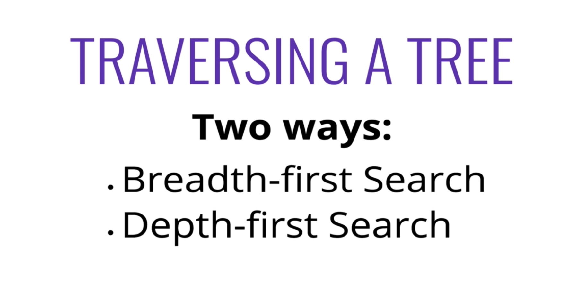

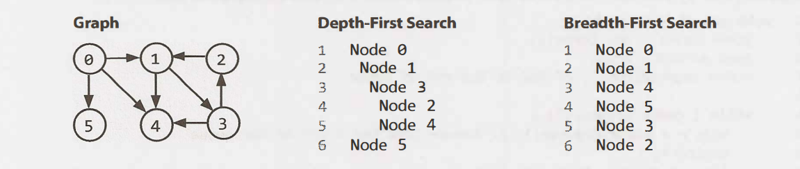

- The time-complexity of **BFS** vs **DFS** is the same as we visit each node one time, but the difference here is in the space-complexity as it depends on the structure of the tree:
  - if we're talking about a breadth-first on a wide tree vs on depth-first, we will not be storing all the nodes across the tree in **BFS** as we only need to keep-track of the nodes in a given branch all the way down to the end
    

> **Note:** when you want to preserve the structural shape of the tree, you need to use **DFS** as it goes all the way down to the end of the tree, then it goes back up to the next branch

---

### Breadth First Search/Traversal BFS

It's an algorithm for traversing or searching tree or graph data structures. It starts at the tree root, and explores all of the `neighbor` nodes at the present depth before moving on to the nodes at the next depth level.

It's also called **"Level Order Traversal"**

- **It's all about finding a Path**
- It can answer questions like:
  - Is there a path from node `A` to node `B`?
  - What is the shortest path from node `A` to node `B`?


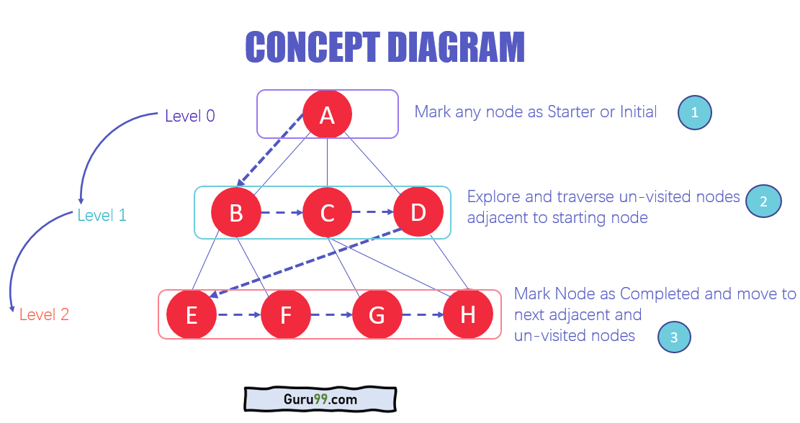

- start with the root-node, then go to the left then the right of the second level of the tree, the the same for the next level
  
- it uses additional memory as it tracks the child nodes for a given node on each level (track every node and its children in order)
  - this is done using a **Queue** data structure
    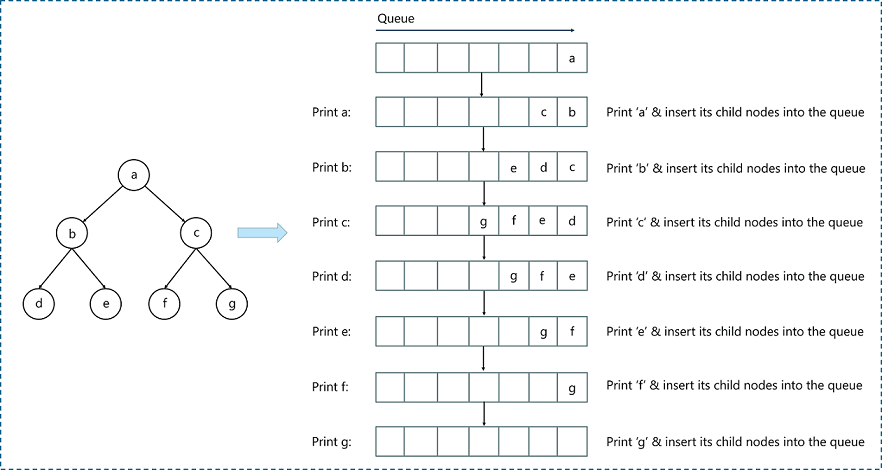
    - we use a `queue` because we need to remember the things that need to come next to be visited
    - we need to search data in the order that they're added. So we need to use a `queue` as it's a `FIFO` data structure
      - Similar to tree's level-order traversal, the nodes closer to the root node will be traversed earlier.
  - if we have a very wide-tree, the `Queue` can get really big, which requires more memory
- used to find the **shortest path** (the fewest segments) between two nodes
  - > **Note:** It's not necessarily the shortest path in terms of distance (fastest path), but the shortest path in terms of number of segments, To get the fastest path, we need to use [Dijkstra's algorithm](#dijkstras-algorithm)
- also used with `Graphs`
- BFS takes `O(number of people + number of edges)`, and it's more commonly written as `O(V+E)` (`V` for number of vertices, `E` for number of edges).
- Notes:
  - To calculate the shortest path in an unweighted graph, use `breadth-first search`. To calculate the shortest path in a weighted graph, use `Dijkstra’s algorithm`

#### BFS Implementation

- **BFS implementation**

  ```py
  from collections import deque

  def bfs(root):
    # create a queue
    queue = deque()
    if root: queue.append(root)

    level = 0
    while len(queue) > 0:
      # loop through the queue
      for i in range(len(queue)):
        curr = queue.popleft()
        print(curr.val)

        # add the children to the queue
        if curr.left: queue.append(curr.left)
        if curr.right: queue.append(curr.right)

      # increment the level
      level += 1
  ```

- BFS Implementation for a "mango seller example"
  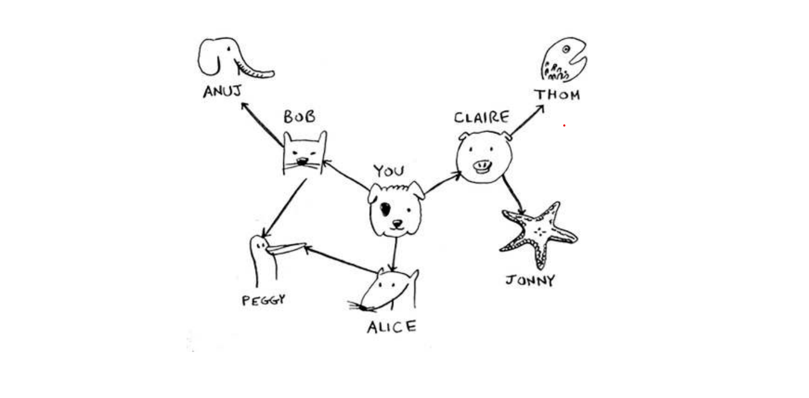
  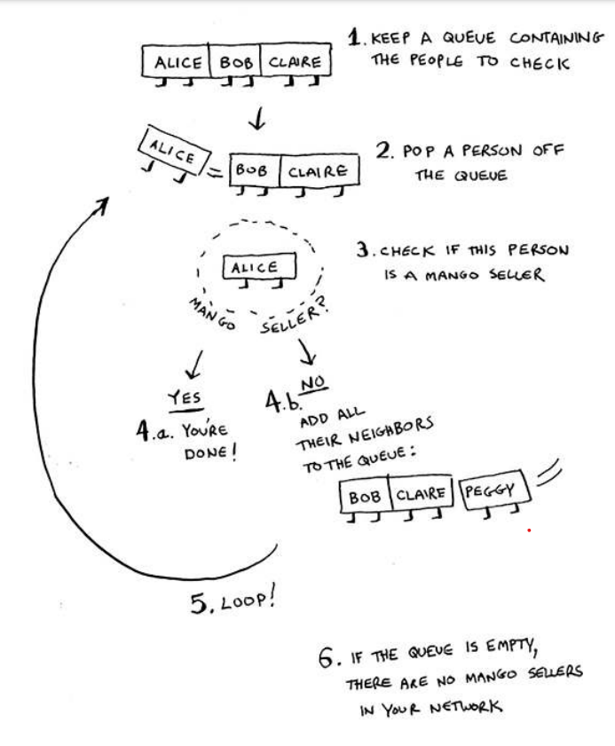

  ```py
  from collections import deque

  # create a graph
  graph = {}
  graph["you"] = ["alice", "bob", "claire"]
  graph["bob"] = ["anuj", "peggy"]
  graph["alice"] = ["peggy"]
  graph["claire"] = ["thom", "jonny"]
  graph["anuj"] = []
  graph["peggy"] = []
  graph["thom"] = []
  graph["jonny"] = []

  # helper: check if a person is a mango seller
  def person_is_seller(name):
    # mango sellers' names end with 'm' letter (e.g. thom)
    return name[-1] == "m"


  def search(name):
    # Create a new queue
    search_queue = deque()
    # Add all of your neighbors to the search queue
    search_queue += graph[name]

    # This array is how you keep track of which people you've searched before.
    searched = []

    while search_queue:
      # pop the first person off the queue
      person = search_queue.popleft()
      # Only search this person if you haven't already searched them to avoid infinite loops (the search queue will keep going back and forth between neighbors nodes)
      if not person in searched:
        if person_is_seller(person):
          print(person + " is a mango seller!")
          return True
        else:
          # add this person's friends to the search queue
          search_queue += graph[person]
          # Marks this person as searched
          searched.append(person)
    return False


  search("you") # thom is a mango seller!
  ```

---

### Depth First Search/Traversal DFS

It's an algorithm for traversing or searching tree or graph data structures. It starts at the tree root, and explores as far as possible along each branch before backtracking.

- **It's all about "Exploring" and Backtracking**

  - **"Backtracking"** means that when you reach a dead-end, you go back to the last intersection (last valid point) and try another path from there

    - it consists of 3 steps:

      ```py
      # Ex of backtracking with the 3 steps
      def dfs(node):
        # 1. "Adding a node" to the list of visited nodes or do operations on it
        visited.append(node)
        # 2. "Validating" if the node is a valid node to visit
        if node is None:
          return
        # 3. Removing the node from the list of visited nodes or undoing the operations on it
        visited.pop()
      ```

      1. **"Adding a node"** to the list of visited nodes or do operations on it
      2. **"Validating / Making decision"** if the node is a valid node to visit
      3. **Removing** the node from the list of visited nodes or undoing the operations on it

  - Think of it as a **maze**, where you're trying to find a way out and you're exploring all the possible paths until you find the exit and when you reach a dead-end, you go back to the last intersection and try another path
  - Usually time-complexity is `O(n)` as we visit each node once

> It's called `Depth First Search` because we go deep into the tree before we go wide (asking its children)

- the search follows one branch of the tree down as many levels as possible until the target notice is found or the end is reached, then it continues at the next ancestor with an unexplored children
  - the idea is to go as deep as possible from the left side and then start going to the right until the traversal of the tree is done
  - it's like "solving a maze"
- it might take long time
- it has lower memory requirements, as it doesn't need to store all the child pointers at each level
- usually it's implemented using **recursion**
- used to determine whether a path exists between two nodes or if a node exists
- also used with graphs


- Graph DFS

  ```py
  def dfs(graph, node):
    visited = []
    stack = [node]

    while stack:
      current = stack.pop()

      # prevent visiting the same node twice
      if current not in visited:
        visited.append(current)
        stack += graph[current]
    return visited
  ```

#### PreOrder DFS traversal

Here, we visit the `root` node first, then the sub-trees at its children nodes, if the tree is ordered from `left` to `right`, then the `left` node, then the `right` node and so on.

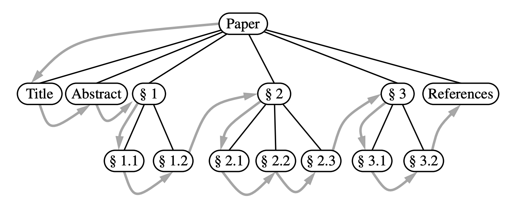

```py
def preOrderDFS(root):
  if root is None:
    return

  print(root.value)
  preOrderDFS(root.left)
  preOrderDFS(root.right)
```

#### PostOrder DFS traversal

it recursively traverses the subtrees tooted at the children of the root first, then visits the root node itself.

Here, we visit the `left` node first, then the `right` node, then the `root` node and so on.

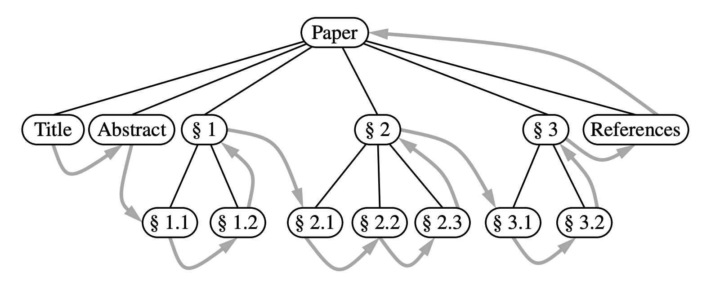

```py
def postOrderDFS(root):
  if root is None:
    return

  postOrderDFS(root.left)
  postOrderDFS(root.right)
  print(root.value)
```

#### InOrder DFS traversal

Inorder means traversing the tree in a sorted order (smaller to larger) and to do so, we need to visit the `left` node first, then the `root` node, then the `right` node and so on
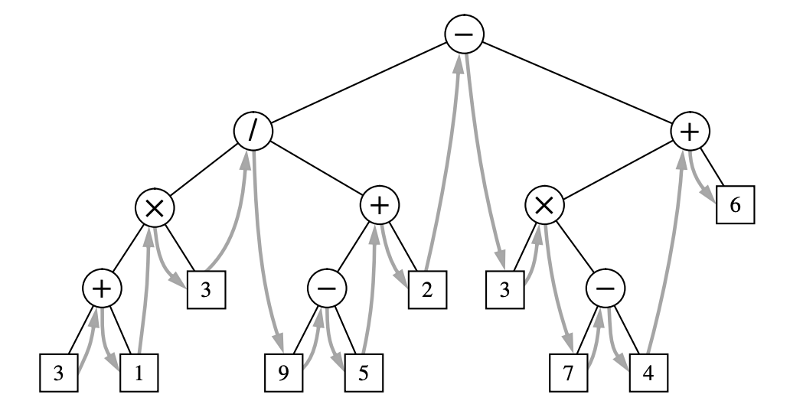

- we do this by :

  1. recursively calling the function on the **left** node to reach the smallest node
  2. then we print the value of the node
  3. then we recursively call the function on the **right** node to reach the largest node

  ```py
  def inOrderDFS(root):
    if root is None:
      return

    inOrderDFS(root.left)
    print(root.value)
    inOrderDFS(root.right)
  ```

- Only works with **Binary Trees** (not graphs)
- Application for `InOrder DFS`:
  - if we have a **Binary Search Tree**, we can use `InOrder DFS` to get the elements in a sorted order, as left node is always smaller than the root node and the right node is always larger than the root node
    - So we traverse the tree in `InOrder DFS` and we get the elements in a sorted order

---

#### Tree Traversal Notes

- Why do we have 3 different types of tree traversals?
  - Sometimes, it depends on how the current language handles memory and recursion
  - Because we can use them to do different things
    - `PreOrder DFS`: can be used to **"export"** a tree structure so that it can be copied or reconstructed later
    - `PostOrder DFS`: can be used to **"delete"** a tree
    - `InOrder DFS`: can be used to get the elements in a **"sorted"** order
- For all the 3 types of DFS, the time-complexity is `O(n)` as we visit each node once
- For all of them, if we want to do it in a **reverse order**, we just need to change the order of the recursive calls
  - replace `left` with `right` and vice versa to visit the nodes in a reverse order (biggest to smallest) -> (right to left)

---

## Shortest Path

- Dijkstra algorithm (positive-weighted edges)
- Bellman-Ford algorithm (negative-weighted edges)

---

### Dijkstra's Algorithm

It's one of the most famous and widely used algorithms around. It finds (the **shortest path** between 2 vertices on a **weighted-graph**)

> Shortest path doesn't have to be about the physical distance, it can be about minimizing something.

- It's a **greedy algorithm** (it always chooses the cheapest next step)

#### How Dijkstra's Algorithm works

- Each segment has a travel time in minutes. You’ll use Dijkstra’s algorithm to go from start to finish in the shortest possible time.
  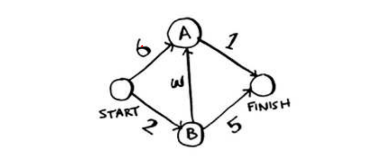
- Cost of a node is how long it takes to get to that node from the start.
- If you ran breadth-first search on this graph, you’d get this shortest path.
  

  - But that path takes 7 minutes. Let’s see if you can ind a path that takes less time!

- EX: Trading for a piano

  - In this graph, the nodes are all the items Rama can trade for. he weights on the edges are the amount of money he would have to pay to make the trade
    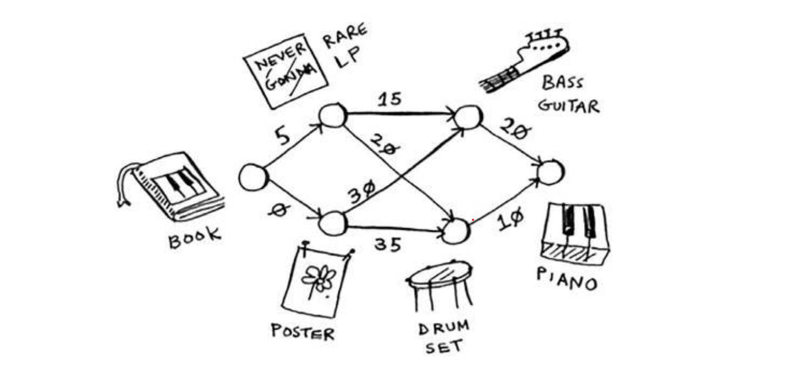
    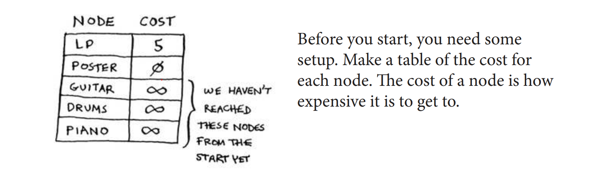
    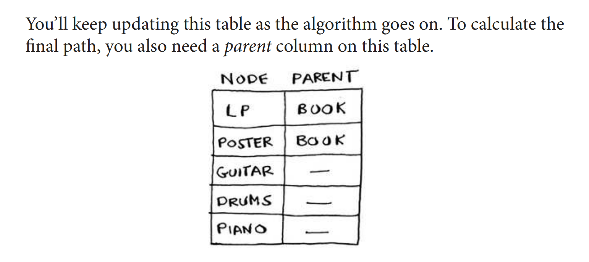
  - **Steps:**

    1. Find the **cheapest** node: pick the node with the smallest known distance to visit first

       - This is the node you can get to in the least amount of time.

    2. Update the costs of the neighbors of this node (Figure out how long it takes to get to its neighbors).
       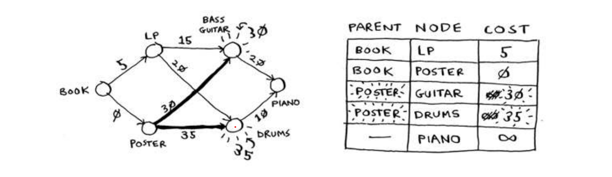
       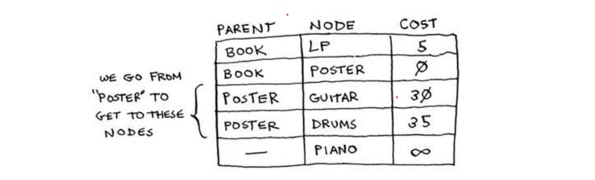
       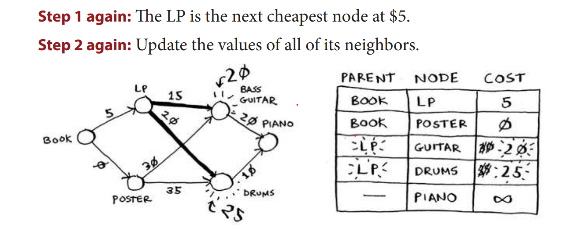

       - for each neighboring node, we calculate the distance by summing the total edges that lead to the node we're checking from the starting node
       - Mark the node as processed.
         - we do this to avoid calculating the same node more than once

    3. Repeat until you've done this for every node in the graph.
       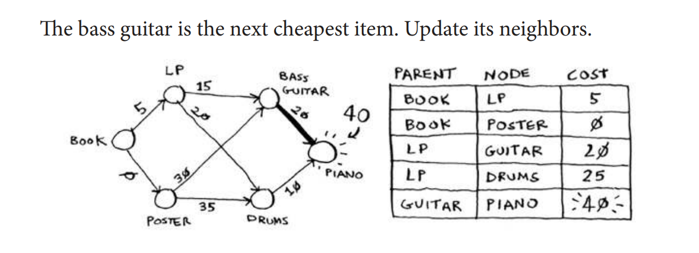
    4. Calculate the final path.
       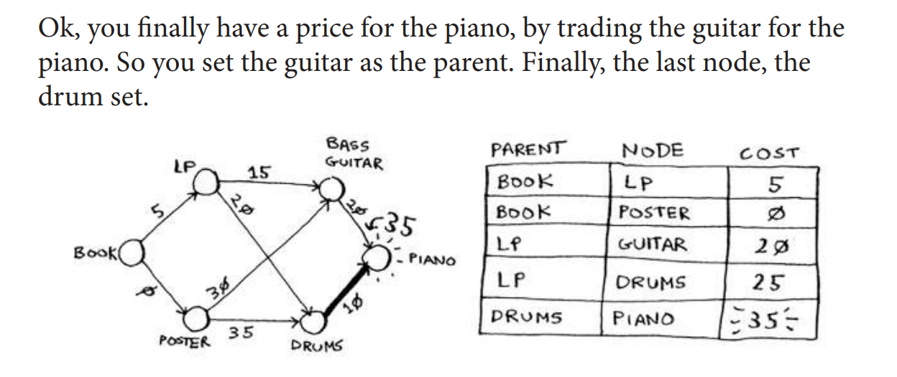

       - if the new total distance to a node is less than the previous total, we store the new shorter distance for that node
       - We can get the piano even cheaper by trading the drum set for the piano instead. So the cheapest set of trades will cost us `$35`.
         

- **Notes:**
  - Dijkstra’s algorithm only works with **directed acyclic graphs**, called `DAGs` for short.
    - because undirected graphs can have cycles, which can lead to infinite loops or double-counting
  - We can't use Dijkstra’s algorithm if we have **negative-weighted edges**.
  - To find if we can't reach a node, we check if the distance to the node is `infinity` after we're done with the algorithm

---

#### Implementing Dijkstra's algorithm

- It depends on 2 columns: `cost`(shortest path) and `parent/previous vertex`
  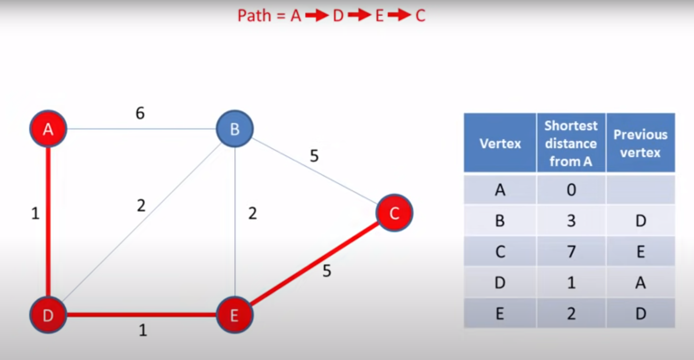
- We also use 2 lists: `visited` and `unvisited`

  - `visited` list: keeps track of all the nodes we've already processed
  - `unvisited` list: keeps track of all the nodes we haven't processed yet

- **Steps:**
  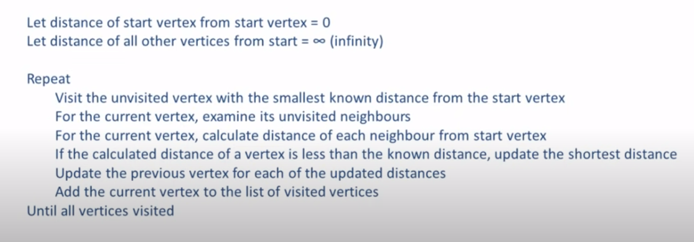

  1. We start by adding the starting node to the `unvisited` list and setting the cost to `0` and others to `infinity` and the parent to `None`
     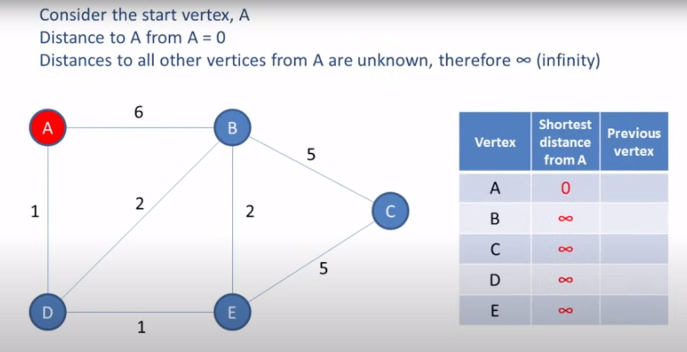
  2. We find the node with the lowest cost (cheapest node) and we add it to the `visited` list and examine all its neighbors
  3. We will use `Min Heap` to get the node with the lowest cost
  4. We then calculate the cost to reach each of those neighbors. If it's cheaper to get to a neighbor through the current node, we update the cost and the parent.
     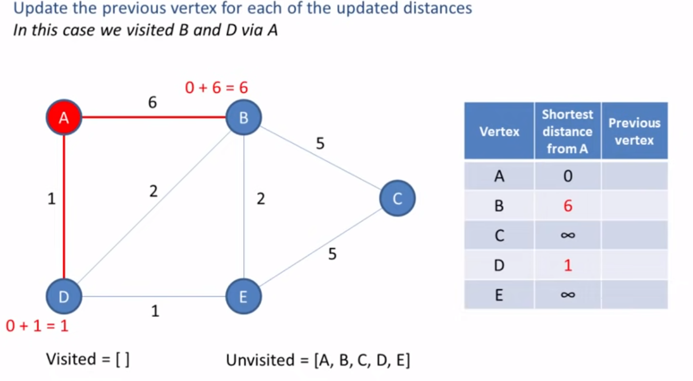
  5. Add the node to the `visited` list update the `unvisited` list and repeat the process until we've visited every node in the graph.
     

```py
def dijkstra(graph, start):
  # initialize the distance to all nodes to infinity
  distances = {node: float("inf") for node in graph}
  # set the distance to the starting node to 0
  distances[start] = 0

  # initialize the unvisited set
  unvisited = set(graph.keys())

  # initialize the previous vertex dict
  previous_vertices = {node: None for node in graph}

  while len(unvisited) > 0:
    # select the unvisited node with the smallest distance
    current_node = min(unvisited, key=lambda node: distances[node])

    # break if the smallest distance among the unvisited nodes is infinity
    if distances[current_node] == float("inf"):
      break # means that we can't reach any other node from the starting node

    # remove the current node from the unvisited set
    unvisited.remove(current_node)

    # go through each neighbor of the current node
    for neighbor, weight in graph[current_node].items():
      # calculate the distance to the neighbor through the current node
      distance = distances[current_node] + weight

      # update the distance if the new distance is shorter than the existing distance to the neighbor
      if distance < distances[neighbor]:
        distances[neighbor] = distance
        # set the current node as the previous vertex of the neighbor
        previous_vertices[neighbor] = current_node

  return distances, previous_vertices
```

- Time complexity: `O(V^2)`, where `V` is the number of vertices in the graph
  - because we're going through each node in the graph and for each node, we're going through each of its neighbors
  - > You might think that it will be `O(E.V)`, where `E` is the number of edges in the graph, but `E` can be as large as `V^2`, so `O(E.V)` is actually `O(V^3)`, also we don't visit each edge more than once, so it's `O(V^2)`
  - If we use `min heap` to get the node with the lowest cost, then the time complexity will be `O(E.log(V))`, where `E` is the number of edges in the graph and `V` is the number of vertices in the graph
    - because we're going through each node in the graph and for each node, we're going through each of its neighbors, and we're using `min heap` to get the node with the lowest cost, so it will take `log(V)` time to get the node with the lowest cost

---

### Bellman-Ford Algorithm

It's an algorithm that computes shortest paths from a **single source** vertex to all of the other vertices in a weighted digraph.

- It's slower than Dijkstra's algorithm, but it can handle **negative edge weights**.
- It uses `Dynamic Programming` to solve the problem
- It uses decision trees to solve the problem by breaking it down into sub-problems and then solving those sub-problems and then combining the solutions to solve the original problem
  - `DP` is used here to **Memoize** the results of the sub-problems to avoid solving them again
    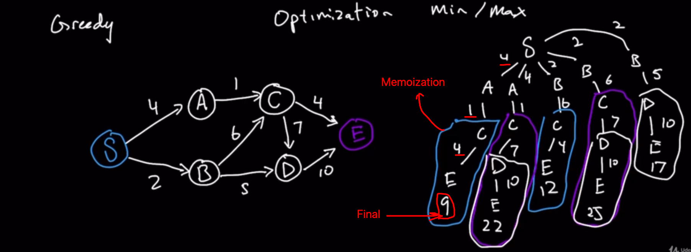

#### How Bellman-Ford Algorithm works

- It's used to find the shortest path between 2 nodes in a graph, So it's a **path-finding algorithm**
- We start by setting the distance to the starting node to `0` and the distance to all other nodes to `infinity`
- Then we go through each of the edges and update the `distance` to each of the neighboring nodes by adding the cost of the edge to the distance to the current node
- We repeat this process `V-1` times, where `V` is the number of vertices in the graph
- This is because the longest possible path without a cycle is `V-1` edges

```py
def bellman_ford(graph, start):
  # initialize the distance to all nodes to infinity
  distances = {node: float("inf") for node in graph}
  # set the distance to the starting node to 0
  distances[start] = 0

  # repeat this process V-1 times, where V is the number of vertices in the graph
  for _ in range(len(graph) - 1):
    # go through each edge in the graph
    for node in graph:
      for neighbor in graph[node]:
        # if the distance to the neighbor is shorter than the current distance, update the distance to the shorter distance
        if distances[neighbor] > distances[node] + graph[node][neighbor]:
          distances[neighbor] = distances[node] + graph[node][neighbor]

  return distances
```

---

## Topological Sort

A **topological sort** of a directed graph is a way of ordering the list of nodes such that if `(a, b)` is an edge in the graph then `a` will appear before `b` in the list. (Ordering the vertices of a directed acyclic graph such that each vertex is visited before its children)

It returns a specific ordering of the nodes in a directed graph as long as the graph is **acyclic**.

- Every `vertex` has `indgree` and `outdegree`:

  - `indegree`: the number of edges that **point to** the vertex
    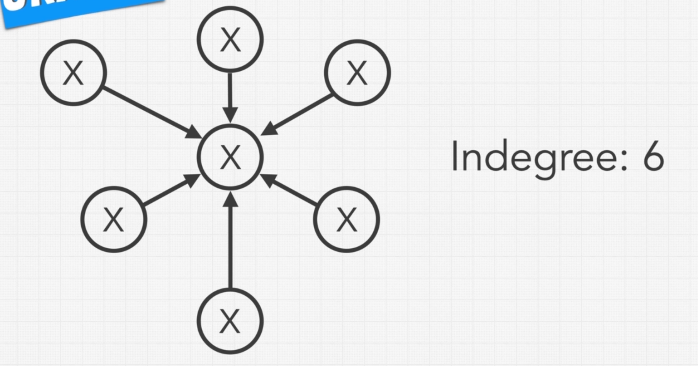
  - `outdegree`: the number of edges that **point from** the vertex

- Mainly in `Topological Sort`, we're trying to find the `indegee` value of each node, then we start with the node with `indegree = 0` and we add it to the `sorted_list`, then we remove all the edges that point from it, then we repeat the process until we have no more nodes left.

  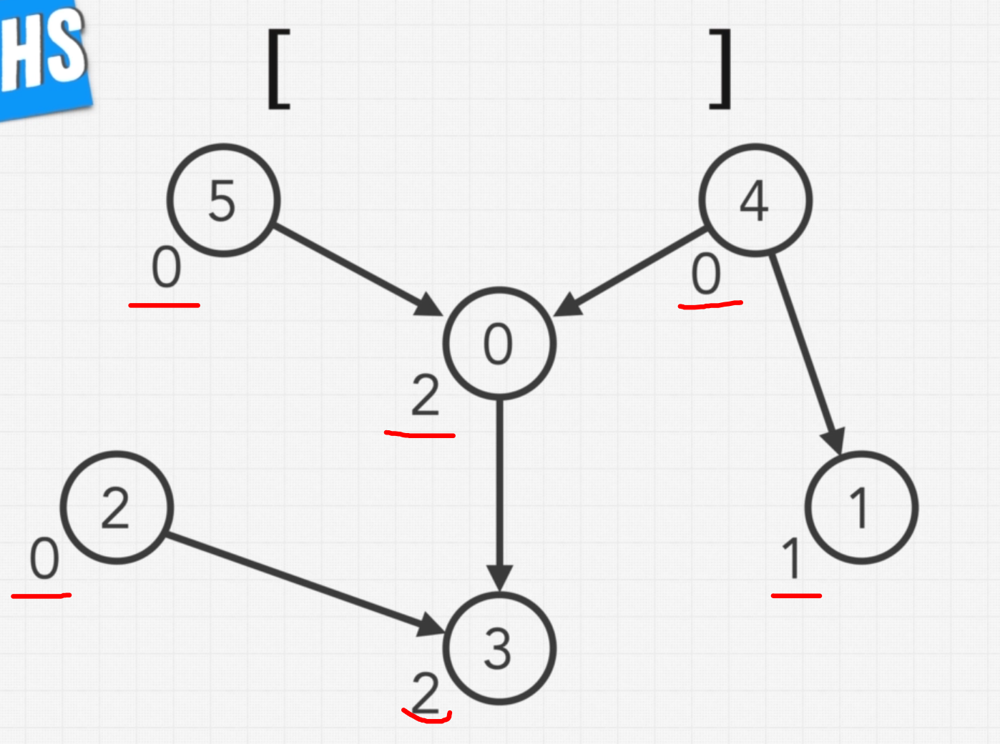
  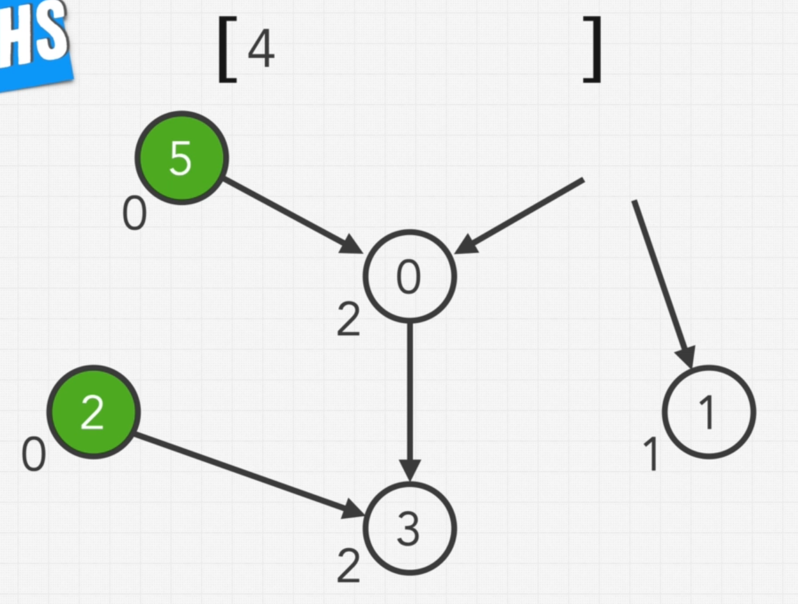
  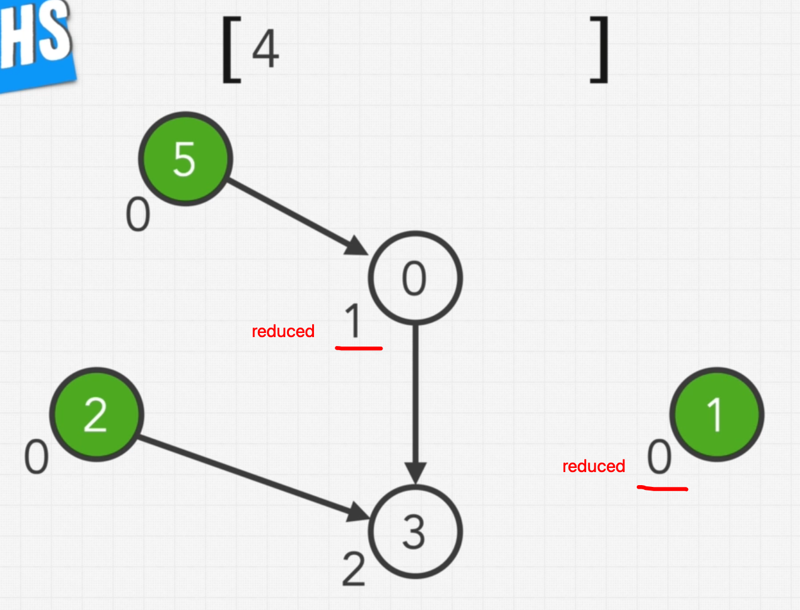
  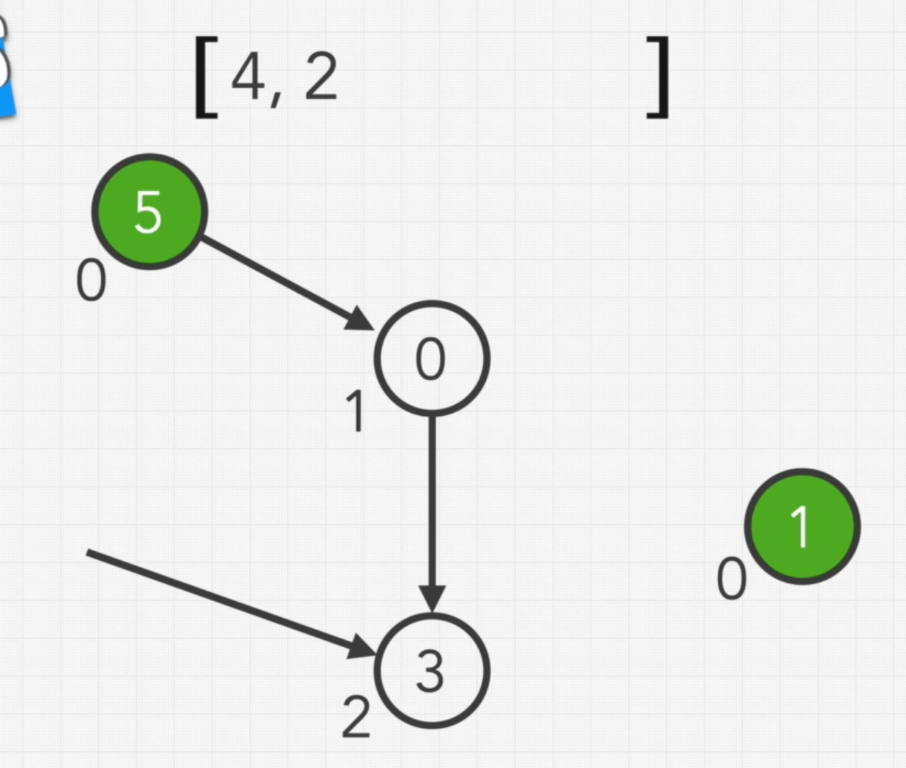
  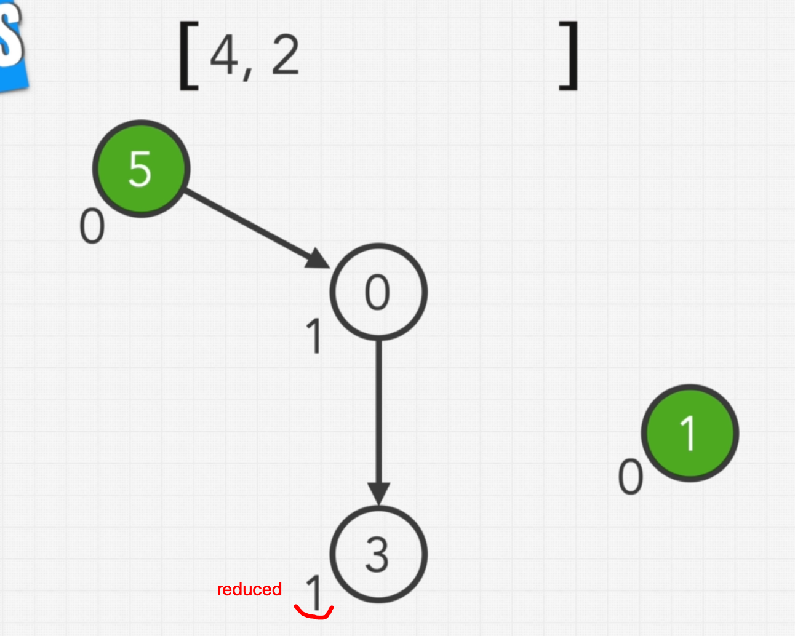
  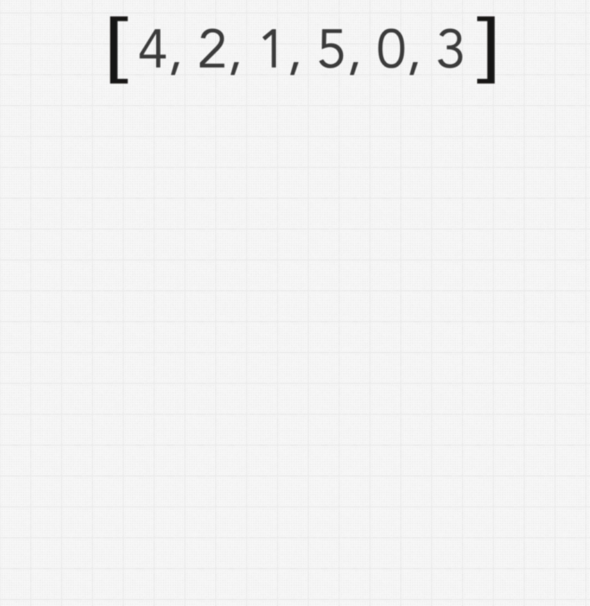

- It only works on **directed acyclic graphs** (DAGs).

  - This is because the `top sort` only add the `vertices` with `indegree = 0` to the `sorted_list`, so if we have a cycle, then we will never be able to reach a `vertex` with `indegree = 0` as we will always have a `vertex` with `indegree > 0` that points to it.
    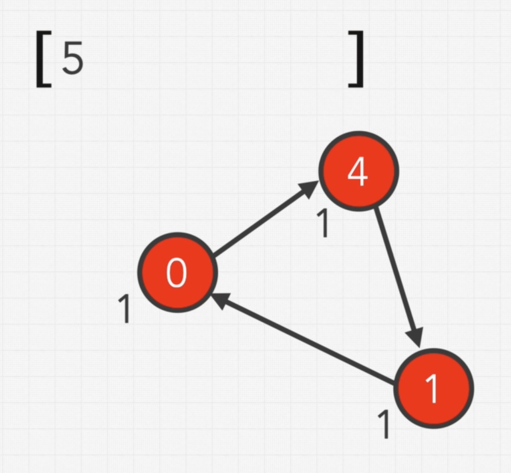

- Another way of thinking about topological sort is that it's a way of arranging the nodes of a graph in a line such that all the edges point in the same direction to the right.
  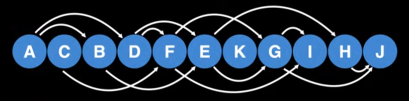

> Many real world situations can be modelled as a `graph` with directed edges where some events must occur before others.

- **Examples:**

  - "Applying in class `X`", but we won't be able to take the class, until we take class `A`, `B`, `C` first as prerequisites.
    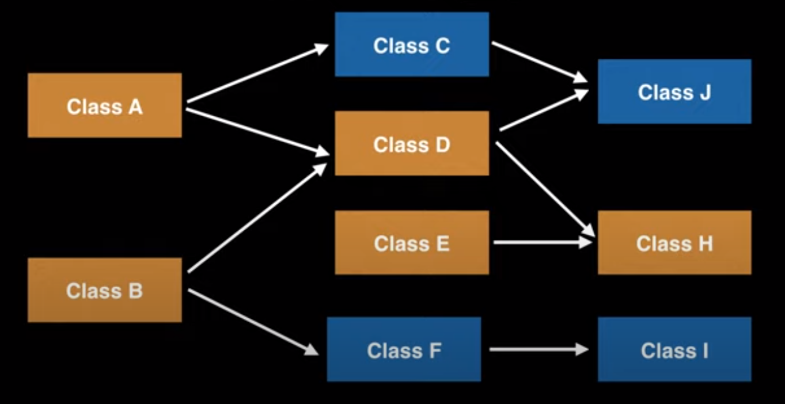
    - The topological sort algorithm tells us the ordering on which we should enroll in classes such that we never enroll in a course that we don't have the prerequisites for.
  - program/package build dependencies
  - How to get dressed in the morning
    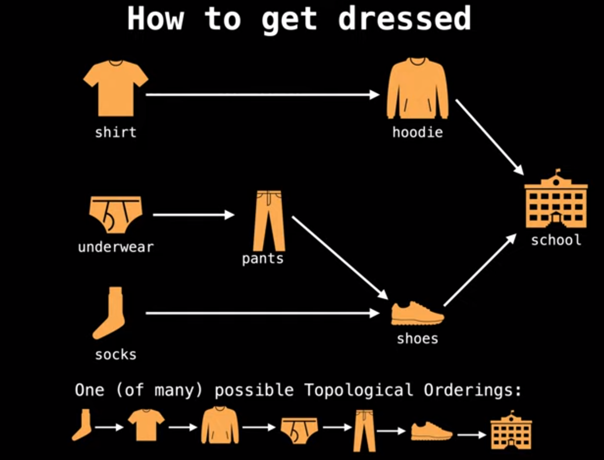

  - The topological sort algorithm tells us the order in which we should install the packages such that we never install a package that depends on another package that we haven't installed yet.

- Only certain types of graphs can be topologically sorted. These are **directed acyclic graphs** (DAGs).
  - "DACs" are directed graphs with no directed cycles.
    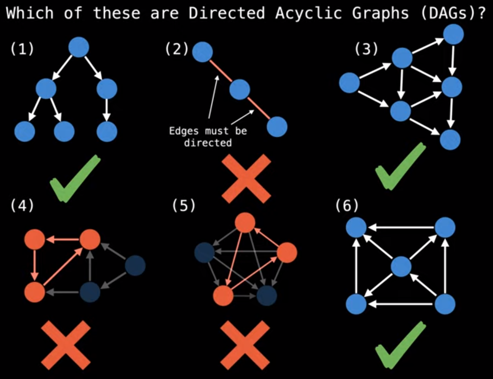
  - If a graph has **cycles** or is **not directed**, then there is no topological sort.

### Implementing Topological Sort

There are two common implementations of topological sort:

1. **Khan's algorithm (iterative)**
   - It's the most common implementation of topological sort
   - It's a `BFS` and `queue` based algorithm
   - Here, we fill the ordering from the beginning of the list to the end
2. **Depth-first search (recursive)**
   - It's a `DFS` and `stack` based algorithm
   - Here, we fill the ordering from the end of the list to the beginning
   - the recursive implementation is a **PostOrder DFS** traversal, meaning that we assign the order of the nodes after we've visited all of their children/neighbors (as they don't need to be visited in a specific order)

- We can construct a topological sort using **Khan's algorithm**:
  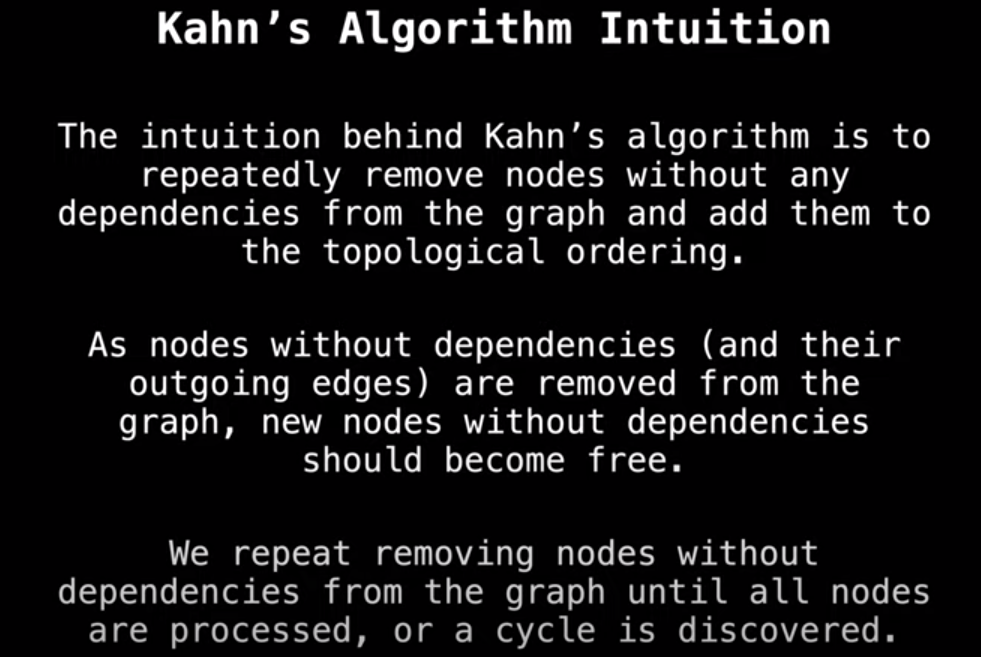

  1. Find a node with no incoming edges (i.e., no edges directed towards it) and add it to the sorted list.

     - We know that such a node must exist if there's no cycle. After all, if we picked an arbitrary node we could just walk edges backwards arbitrarily.
     - We'll either stop at some point (in which case we've found a node with no incoming edges) or we'll return to a prior node (in which case there is a cycle).

  2. Remove that node from the graph, along with its outgoing edges.
     - Those nodes have already been added to the topological sort, so they're basically irrelevant. We can't violate those edges anymore.
  3. Repeat steps 1 and 2 until the graph is empty.
     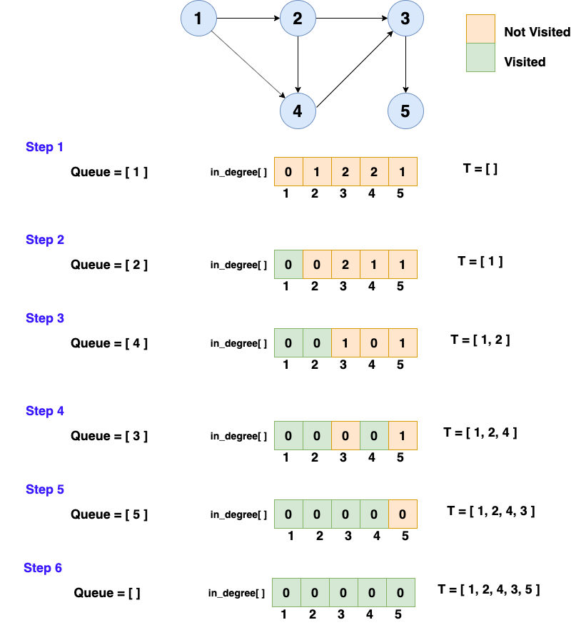
     - Repeat the above, adding nodes with no incoming edges and removing their outbound edges.
     - When all the nodes have been added to the topological sort, then we are done.
  4. If the graph is not empty, then we have detected a cycle, which means no valid topological sort exists.
  5. Return the sorted list.

- Topological sort is not unique, there can be multiple valid topological sorts for a graph and all of them are correct.
- Topological sort algorithm is not the most efficient algorithm,
- it runs in `O(V + E)` time, where

  - `V` is the number of vertices
  - `E` is the number of edges in the graph.

- Steps:
  
  1. create queues: `processing_queue` and a list `sorted_list`, which are empty at the beginning.
  2. find all the nodes with **no incoming edges** and add them to the `processing_queue` so that we can process them first.
  3. while the `processing_queue` is not empty:
     - remove a node from the `processing_queue` and add it to the `sorted_list`.
     - remove all of its outgoing edges.
     - if any of the nodes that were connected to the removed node now have no incoming edges, add them to the `processing_queue`.
  4. if order contains all nodes, then it has succeeded. Otherwise, the topological sort has failed due to a cycle.

```py
def topological_sort(graph):
    processing_queue = Queue()
    sorted_list = []

    # find all the nodes with no incoming edges and add them to the processing_queue so that we can process them first.
    for node in graph.nodes:
        if len(node.incoming_edges) == 0:
            processing_queue.enqueue(node)

    # while the processing_queue is not empty:
    while processing_queue.size() > 0:
        # remove a node from the processing_queue and add it to the sorted_list.
        node = processing_queue.dequeue()
        sorted_list.append(node)

        # remove all of its outgoing edges.
        edges = list(node.outgoing_edges)
        for edge in edges:
            edge.destroy()

        # if any of the nodes that were connected to the removed node now have no incoming edges, add them to the processing_queue.
        for node in nodes:
            if len(node.incoming_edges) == 0:
                processing_queue.enqueue(node)

    # if order contains all nodes, then it has succeeded. Otherwise, the topological sort has failed due to a cycle.
    if len(sorted_list) == len(graph.nodes):
        return sorted_list
    else:
        return None
```

---

## Union Find

It's a data structure that keeps track of elements which are split into one or more disjoint sets.

The Union Find data structure allows us to **detect a cycle in an undirected graph** by iterating over just its edges. (Instead of doing the full `O(V+E)` search. This way we get an `O(E)` complexity).

- Each node starts off as its own separate set, as we iterate over the edges, we will **union** the nodes together if they are not already in the same set.
- if we find an edge where both nodes are in the same set, then we have found a cycle.

---

## Matrix graph

### Matrix DFS

When dealing with matrix, we can use `DFS` to traverse the matrix for many types of problems

- Ex: count num of unique paths from topLeft to bottomRight

  ```py
  def uniquePaths(grid, m: int, n: int) -> int:
    ROWS, COLS = m, n
    visited = set()

    def dfs(r, c):
      # base case
      if (
        min(r, c) < 0 or
        r >= ROWS or
        c >= COLS or
        (r, c) in visited or
        grid[r][c] == 1
      ):
        return 0 # invalid path

      # if we reached the bottomRight cell, we found a valid path
      if r == ROWS - 1 and c == COLS - 1:
        return 1 # valid path

      # mark the current cell as visited
      visited.add((r, c))

      # explore all the neighbors
      paths = (
        dfs(r + 1, c) +
        dfs(r - 1, c) +
        dfs(r, c + 1) +
        dfs(r, c - 1)
      )

      # backtrack: remove the current cell from visited
      visited.remove((r, c))

      return paths

    return dfs(0, 0)
  ```

---

#### Matrix BFS

When dealing with matrix, we can use `BFS` to traverse the matrix for many types of problems especially when we need to **find the shortest path**

- Here, we use a `queue` to keep track of the cells we need to visit next instead of recursion like in `DFS`

- Ex: find the length of the shortest path from topLeft to bottomRight

  ```py
  def shortestPath(grid, m: int, n: int) -> int:
    ROWS, COLS = m, n
    visited = set()

    def bfs(r, c):
      queue = deque([(r, c, 0)]) # (row, col, distance)
      visited.add((r, c))

      while queue:
        row, col, distance = queue.popleft()

        # if we reached the bottomRight cell, we found a valid path
        if row == ROWS - 1 and col == COLS - 1:
          return distance

        # explore all the neighbors
        for (nr, nc) in [
          (row + 1, col),
          (row - 1, col),
          (row, col + 1),
          (row, col - 1)
        ]:
          if (
            min(nr, nc) < 0 or
            nr >= ROWS or
            nc >= COLS or
            (nr, nc) in visited or
            grid[nr][nc] == 1
          ):
            continue # invalid path

          # mark the current cell as visited
          visited.add((nr, nc))

          # add the neighbor to the queue
          queue.append((nr, nc, distance + 1))

      return -1 # no valid path

    return bfs(0, 0)
  ```

---

## Least recently used (LRU)

It's a **caching** algorithm that evicts the least recently used item (the item that was accessed the least recently) first.

The idea is simple: The main memory can't hold all the references to all the pages, so we need to keep track of the most recently used pages and evict the least recently used pages when we need to free up some space.

The goal of caching is to store the most frequently used items in the fastest memory possible.
