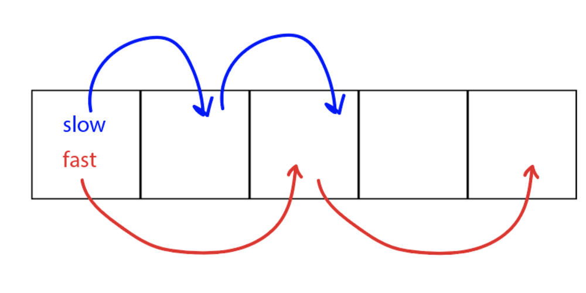
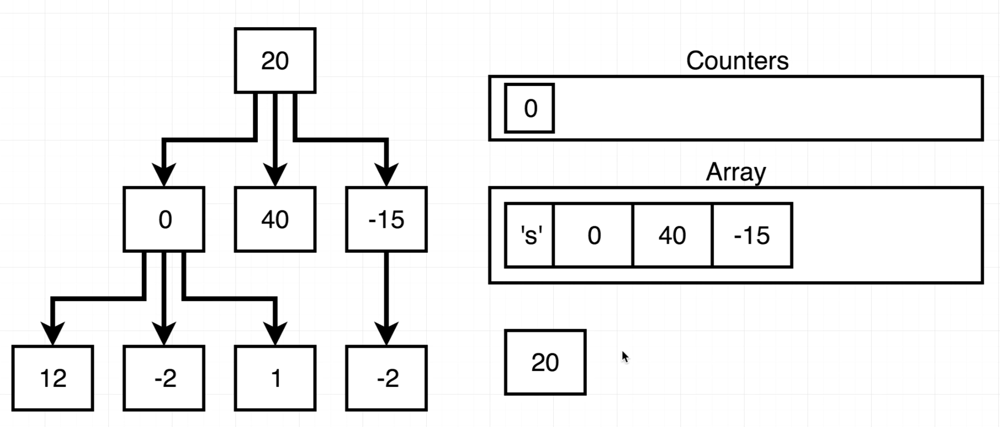
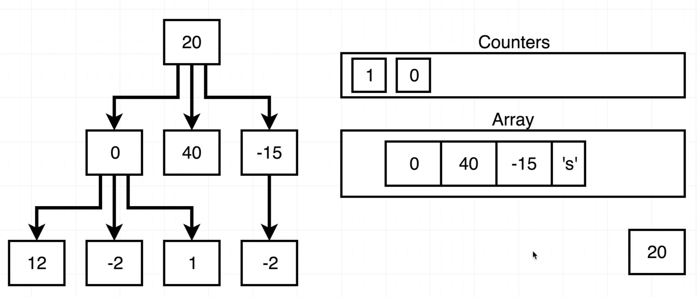

# INDEX

- [INDEX](#index)
  - [Problem Solving](#problem-solving)
    - [Problem Solving Patterns](#problem-solving-patterns)
      - [Frequency Counter](#frequency-counter)
      - [Multiple Pointers](#multiple-pointers)
      - [Sliding Window](#sliding-window)
      - [Divide and Conquer](#divide-and-conquer)
      - [Dynamic Programming](#dynamic-programming)
      - [Greedy Algorithms](#greedy-algorithms)
      - [Backtracking](#backtracking)
  - [Testing and Debugging](#testing-and-debugging)
    - [Testing](#testing)
      - [Test fail situations](#test-fail-situations)
      - [Testing order](#testing-order)
    - [Debugging](#debugging)
  - [String](#string)
    - [Substring (Sliding Window)](#substring-sliding-window)
      - [Count Vowel Substrings of a String](#count-vowel-substrings-of-a-string)
    - [Reversing Problems](#reversing-problems)
      - [Palindrome](#palindrome)
      - [Reverse Integer](#reverse-integer)
    - [String Character Maps](#string-character-maps)
      - [Anagram](#anagram)
  - [Arrays](#arrays)
    - [Array chunk (split array into smaller chunks)](#array-chunk-split-array-into-smaller-chunks)
    - [Matrix](#matrix)
      - [Create a Spiral Matrix](#create-a-spiral-matrix)
      - [Return elements of Spiral Matrix](#return-elements-of-spiral-matrix)
  - [Queues and Stacks](#queues-and-stacks)
    - [Queue](#queue)
      - [Queue using two stacks](#queue-using-two-stacks)
  - [Linked Lists](#linked-lists)
    - [Singly Linked List](#singly-linked-list)
      - [Reverse a Linked List](#reverse-a-linked-list)
      - [Middle Point of a Linked List](#middle-point-of-a-linked-list)
      - [Circular Linked List](#circular-linked-list)
      - [From Last](#from-last)
  - [Trees](#trees)
    - [General Tree Questions](#general-tree-questions)
      - [Level Width](#level-width)
    - [Binary Search Trees (BST)](#binary-search-trees-bst)
  - [Creating Shapes](#creating-shapes)
    - [Steps shape](#steps-shape)
    - [Pyramid](#pyramid)
    - [Solution 1 - using for loops](#solution-1---using-for-loops)
      - [Solution 2 - using recursion](#solution-2---using-recursion)
  - [Numbers](#numbers)
    - [Series](#series)
      - [Fibonacci Number](#fibonacci-number)
        - [Recursion solution steps](#recursion-solution-steps)
        - [Fibonacci looping solution](#fibonacci-looping-solution)

---

## Problem Solving


### Problem Solving Patterns

#### Frequency Counter

- uses objects or sets to collect Values/frequencies of Values
- this can often avoid the need for nested loops or `O(n^2)` operations with arrays / strings
- this is done by: instead of looping over the first array and then checking for each value in a sub-loop over the second array, we can loop over each array one time individually.
  - this will give us `O(2n) ~= O(n)` instead of `O(n^2)`

---

#### Multiple Pointers

Creating pointers or values that correspond to an `index` or `position` and move towards the beginning, and/or middle based on certain condition

- very efficient for solving problems with minimal **space-complexity**.
- `EX`: function that accepts **sorted** array of integers and find the first pair where the sum is `0`.

  - instead of creating nested-loop to check for every element and the elements after it, we can use the `multiple pointers` pattern
  - here we select 2 pairs(first and last elements of the array) as the array is sorted(they will be smallest and biggest number)
  - then we check these pair for the desired condition, and if not we change one of the numbers in pair and check again and so on...

  ```py
  # time-complexity: O(n), space-complexity: O(1)
  def sum_zero(arr):
    left = 0
    right = len(arr) -1
    while left < right:
      sum = arr[left] + arr[right]
      if sum == 0:
        return [arr[left], arr[right]]
      elif sum > 0:
        right -= 1 # as the right is the bigger number as arr is sorted
      else:
        left += 1 # as the left is the smaller number as arr is sorted
  ```

---

#### Sliding Window

this pattern involves creating a window which can either be an array or number from one position to another

- depending on a certain condition, the window either increases or closes (and a new window is created)
- very useful for keeping track of a subset of data in an `array`/`string`


- EX: finding max-sum of window of 3 elements in an array:
  - instead of summing the first 3 elements and then do a nested loop to check for the remaining sum of windows -> `O(n^2`
  - we instead use a "sliding-window" pattern to keep track of the sum of the window and then compare it with a temporary sum of other windows
    - the sum here is calculated by not looping again, but with subtracting the previous number and adding the next number
      

---

#### Divide and Conquer

This pattern involves dividing a dataset into smaller chunks and then repeating a process with a subset of data

- this pattern can tremendously decrease **time-complexity**
- EX: **Binary Search**

---

#### Dynamic Programming

#### Greedy Algorithms

#### Backtracking

---

## Testing and Debugging

Testing is the process of experimentally checking the correctness of a program, while debugging is the process of tracking the execution of a program and discovering the errors in it.

### Testing

- we should aim at executing the program on a representative subset of `inputs`. At the very minimum, we should make sure that every method of a class is tested at least once (**method coverage**). Even better, each code statement in the program should be executed at least once (statement coverage).

#### Test fail situations

Programs often tend to fail on a lot of situations like these:

- special **inputs** to the program
  - For example, when testing a method that `sorts` a sequence of integers, we should consider the following inputs:
    - The sequence has zero length (no elements).
    - The sequence has one element.
    - All the elements of the sequence are the same.
    - The sequence is already sorted.
    - The sequence is reverse sorted.
- special conditions for the **structures** used by the program:
  - For example, if we use a Python list to store data, we should make sure that **boundary cases**, such as `inserting` or `removing` at the beginning or end of the list, are properly handled.

#### Testing order

The dependencies among the classes and functions of a program induce a hierarchy. Namely, a component A is above a component B in the hierarchy if A depends upon B, such as when function A calls function B, or function A relies on a parameter that is an instance of class B. There are two main testing strategies, **top-down** and **bottom-up**, which differ in the order in which components are tested.

- **Top-down** testing proceeds from the top to the bottom of the program hierarchy. It is typically used in conjunction with **stubbing**, a boot-strapping technique that replaces a lower-level component with a **"stub"**,
  - > `stub`: a replacement for the component that simulates the functionality of the original.
  - > For example, if function A calls function B to get the first line of a file, when testing A we can replace B with a stub that returns a fixed string.
- **Bottom-up** testing proceeds from lower-level components to higher-level components. For example, bottom-level functions, which do not invoke other functions, are tested first, followed by functions that call only bottom-level functions, and so on. Similarly a class that does not depend upon any other classes can be tested before another class that depends on the former. This form of testing is usually described as **"unit testing"**,
  - as the functionality of a specific component is tested in isolation of the larger software project.

---

### Debugging

The simplest debugging technique consists of using `print` statements to track the values of variables during the execution of the program. A problem with this approach is that eventually the print statements need to be removed or commented out, so they are not executed when the software is finally released.

A better approach is to run the program within a **debugger**, which is a specialized environment for controlling and monitoring the execution of a program. The basic functionality provided by a debugger is the insertion of breakpoints within the code. When the program is executed within the debugger, it stops at each breakpoint. While the program is stopped, the current value of variables can be inspected.

---

## String

### Substring (Sliding Window)

#### Count Vowel Substrings of a String

Given a string `s` return the number of substrings that have **all vowels** in order.

- EX: `s = "abciiidef"` -> `3` (substrings: `"ae"`, `"ei"`, `"iii"`)
- Steps:
  - we can use a **sliding-window** pattern to check for all the substrings of the string
  - then we check these pair for the desired condition, and if not we change one of the numbers in pair and check again and so on...

```py
def countVowelSubstrings(word):
    # Store vowels in a set for O(1) lookup.
    vowels = {'a', 'e', 'i', 'o', 'u'}

    # Initialize the sliding-window with the first vowel in the string and the last vowel in the string
    ans, last_consonant = 0, -1

    # Initialize a dictionary to keep track of the last seen vowel
    last_seen_vowels = {v: -2 for v in vowels} # -2 is the smallest possible index

    for i, x in enumerate(word):
        # If the current character is a consonant, update the last_consonant variable.
        if x not in vowels:
            last_consonant = i
        # Otherwise, we've found a vowel.
        else:
            # Update the last_seen_vowels dictionary with the current index.
            last_seen_vowels[x] = i
            # Update the answer variable with the maximum of the current value and the minimum of the last seen vowel's
            # index and the last consonant's index.
            ans += max(min(last_seen_vowels.values())-last_consonant, 0)
    return ans
```

---

### Reversing Problems

#### Palindrome

A palindrome is a word, phrase, number, or other sequence of characters which **reads the same backward or forward**. Allowances may be made for adjustments to capital letters, punctuation, and word dividers.

- EX: `racecar`, `tacocat`, `madam`, `kayak`, `level`
- Here's a possible approach to solve this problem:

  1. Convert the string to lowercase to ignore any case differences.
  2. Remove any non-alphanumeric characters from the string.
  3. Use two pointers to iterate through the string from both ends.
  4. Compare the characters at each pointer position. If they are not equal, the string is not a palindrome. If they are equal, move both pointers towards the center of the string.
  5. If the pointers meet in the middle of the string, the string is a palindrome.

```py
def is_palindrome(s):
    s = s.lower()
    s = ''.join(c for c in s if c.isalnum())
    i, j = 0, len(s) - 1
    while i < j:
        if s[i] != s[j]:
            return False
        i += 1
        j -= 1
    return True

# --------------------------------------------------

# Or: using regex and all() function to check if all elements in an iterable are True
def is_palindrome(s):
    s = s.lower().replace(r'[^a-z0-9]', '')
    return all(s[i] == s[-i-1] for i in range(len(s)//2))
```

---

#### Reverse Integer

1. Convert the integer to a string to access its individual digits.
2. Reverse the string using a string slicing operation.
3. Convert the reversed string back to an integer using the int() function.
4. Handle potential overflow by checking whether the reversed integer is within the range of a 32-bit signed integer (-2^31 to 2^31-1).

```py
def reverse_integer(num):
    sign = -1 if x < 0 else 1
      s = str(x)[::-1] # reverse the string using slicing
      # separate the sign from the rest of the reversed string before converting it to an integer if we have a negative sign at the end if the original integer (e.g. 123-)
      rev = sign * int(s[:-1]) if s[-1] == '-' else sign * int(s)
      if rev < -2147483648 or rev > 2147483647: # check for overflow
          return 0
      else:
          return rev
```

---

### String Character Maps

#### Anagram

An anagram is a word or phrase formed by rearranging the letters of a different word or phrase, typically using all the original letters exactly once.

- EX: `cinema` and `iceman` are anagrams of each other.

```py
def is_anagram(s1, s2):
    # remove spaces and convert to lowercase
    s1 = s1.replace(' ', '').lower()
    # or use Regex: s1 = re.sub(r'[^a-z0-9]', '', s1.lower())
    s2 = s2.replace(' ', '').lower()
    # return false if the two strings have different lengths
    if len(s1) != len(s2):
        return False

    # create a dictionary to store the count of each character in s1
    letters_count = {}
    for letter in s1:
        letters_count[letter] = letters_count.get(letter, 0) + 1

    # loop through each character in s2 and decrement the letters_count for each character
    for letter in s2:
        if letter in letters_count:
            letters_count[letter] -= 1
        else:
            letters_count[letter] = 1

    # if the letters_count for any character is not zero, the two strings are not anagrams
    for k in letters_count:
        if letters_count[k] != 0:
            return False
    return True

```

---

## Arrays

### Array chunk (split array into smaller chunks)

Given an array and chunk size, divide the array into many subarrays where each subarray is of length size.

- EX: `chunk([1, 2, 3, 4], 2) --> [[1, 2], [3, 4]]`

```py
def chunk(arr, size):
    chunked = []
    for i in range(0, len(arr), size):
        chunked.append(arr[i:i+size])
        # i += size # without the iteration-step
    return chunked

# -------------------------------------------------

def chunk(arr, size):
    result = []
    subarray = []
    for i in arr:
        subarray.append(i)
        # if the subarray is full, append it to the result and reset the subarray
        if len(subarray) == size:
            result.append(subarray)
            subarray = []
    if subarray:
        result.append(subarray)
    return result
```

---

### Matrix

#### Create a Spiral Matrix

Given a positive integer n, generate an n x n matrix filled with elements from 1 to n^2 in spiral order.

- EX: `n = 3` --> `[[1, 2, 3], [8, 9, 4], [7, 6, 5]]`

- Steps:
  

```py
def spiral_matrix(n):
    matrix = [[0] * n for _ in range(n)]
    start, right, top, bottom = 0, n - 1, 0, n - 1
    num = 1 # the number to fill in the matrix

    while start <= right and top <= bottom:
        # fill the top row
        for i in range(start, right + 1):
            matrix[top][i] = num
            num += 1
        top += 1

        # fill the right column
        for i in range(top, bottom + 1):
            matrix[i][right] = num
            num += 1
        right -= 1

        # fill the bottom row
        for i in range(right, start - 1, -1):
            matrix[bottom][i] = num
            num += 1
        bottom -= 1

        # fill the start column
        for i in range(bottom, top - 1, -1):
            matrix[i][start] = num
            num += 1
        start += 1

    return matrix
```

---

#### Return elements of Spiral Matrix

Given a matrix of m x n elements (m rows, n columns), return all elements of the matrix in spiral order.


- EX: `[[1, 2, 3], [4, 5, 6], [7, 8, 9]] --> [1, 2, 3, 6, 9, 8, 7, 4, 5]`

```py
def spiral_matrix(matrix):
    result = []
    while matrix:
        # add the first row to the result
        result += matrix.pop(0)
        # add the last element of each row to the result
        for row in matrix:
            if row: result.append(row.pop())
        # add the last row to the result in reverse order
        if matrix:
            result += matrix.pop()[::-1]
        # add the first element of each row to the result in reverse order
        for row in matrix[::-1]:
            if row: result.append(row.pop(0))
    return result
```

---

## Queues and Stacks

### Queue

#### Queue using two stacks

Implement a queue data structure using two stacks. Do not create an array inside of the 'Queue' class. Queue should implement the methods 'add', 'remove', and 'peek'. Adding to the queue should store an element until it is removed.

- EX: `q = Queue()` --> `q.add(1)` --> `q.add(2)` --> `q.peek()` --> `1` --> `q.remove()` --> `1` --> `q.remove()` --> `2`
- Here, we want to use two stacks to implement a queue. We can use one stack for adding elements and the other stack for removing elements. When we want to remove an element, we move all elements from the first stack to the second stack, then pop the top element from the second stack. When we want to peek an element, we move all elements from the first stack to the second stack, then peek the top element of the second stack. When we want to add an element, we just push it to the first stack.
  

```py
class Queue:
    def __init__(self):
        self.stack1 = []
        self.stack2 = []

    def add(self, item):
        self.stack1.append(item)

    def remove(self):
        # Move all items from stack1 to stack2
        if not self.stack2:
            while self.stack1:
                self.stack2.append(self.stack1.pop())
        return self.stack2.pop()

    def peek(self):
        # Move all items from stack1 to stack2
        if not self.stack2:
            while self.stack1:
                self.stack2.append(self.stack1.pop())
        return self.stack2[-1]

    def empty(self):
        return not self.stack1 and not self.stack2
```

---

## Linked Lists

- **Tips:**

  - To check if linked list is empty --> `if not head:`
  - To check if linked list has only one node --> `if head and not head.next:`
  - To remove the first node --> `head = head.next`
  - To remove the last node --> `prev.next = None`
    1. create 2 variables: `prev` and `curr`
    2. `prev` starts at the head, `curr` starts at the head's next node
    3. if `curr` is the last node, `prev.next` will be `None` --> `prev.next = None`
    4. then `prev` will be `curr` --> `prev = curr` --> `prev` is now the last node

- **Code reuse in Linked Lists (Interview discussion):**
  - rather than creating a new function to (`insert` / `remove` / `get`) the first/last node, we can reuse the function to remove the last node by passing in the head/tail index as the argument
    

### Singly Linked List

#### Reverse a Linked List

Write a function that accepts a linked list and reverses it in place.

- EX: `1 -> 2 -> 3 -> 4 -> 5` --> `5 -> 4 -> 3 -> 2 -> 1`

```py
def reverse_linked_list(head):
    prev = None
    curr = head
    while curr:
        next = curr.next
        curr.next = prev
        prev = curr
        curr = next
    return prev
```

---

#### Middle Point of a Linked List

Write a function that accepts a linked list and returns the middle node in the list. If the list has an even number of elements, return the node at the end of the first half of the list. **Do not use a counter variable**, **do not retrieve the size of the list**, and **only iterate through the list one time**.

- EX: `1 -> 2 -> 3 -> 4 -> 5` --> `3`
- **Steps:**
  
  1. create 2 variables: `slow` and `fast`
  2. `slow` and `fast` starts at the head
  3. `slow` moves **1 step** at a time, `fast` moves **2 steps** at a time
  4. when `fast` reaches the end of the list, `slow` will be at the middle node

```py
def middle_point(head):
    slow = head
    fast = head

    # check if there're 2 next nodes ahead of `fast`
    while fast and fast.next:
        slow = slow.next
        fast = fast.next.next
    return slow
```

---

#### Circular Linked List

Write a function that accepts a linked list and returns true if the linked list contains a **circular reference**.

> Circular Linked List is a linked list where a node's next point actually points back to a previous node in the list.

- EX: `1 -> 2 -> 3 -> 4 -> 5` --> `5.next = 2` --> `True`
- **Steps:**
  
  1. create 2 variables: `slow` and `fast`
  2. `slow` and `fast` starts at the head
  3. `slow` moves **1 step** at a time, `fast` moves **2 steps** at a time
  4. if `slow` and `fast` ever meet, then there's a circular reference

```py
def circular_linked_list(head):
    slow = head
    fast = head

    # check if there're 2 next nodes ahead of `fast`
    while fast and fast.next:
        slow = slow.next
        fast = fast.next.next
        # if `slow` and `fast` ever meet, then there's a circular reference
        if slow == fast:
            return True
    return False
```

---

#### From Last

Write a function that accepts a linked list and a number `n`. The function should return the node `n` spaces from the last node in the list. Do not call the `size` method of the linked list. Assume that `n` will always be less than the length of the list.

- EX: `1 -> 2 -> 3 -> 4 -> 5`, `n = 2` --> `3`
- **Steps:**
  1. create 2 variables: `slow` and `fast`
  2. `slow` and `fast` starts at the head
  3. `fast` moves `n` steps ahead of `slow`, so that `fast` is `n` spaces ahead of `slow`
  4. when `fast` reaches the end of the list, `slow` will be at the node `n` spaces from the last node

```py
def from_last(head, n):
    slow = head
    fast = head

    # move `fast` `n` steps ahead of `slow`
    while n > 0:
        fast = fast.next
        n -= 1

    # move `slow` and `fast` at the same pace
    while fast.next:
        slow = slow.next
        fast = fast.next
    return slow

# -------------------------------------------------
# Remove nth node from the end of a linked list (same Idea)
# Create two pointers, slow and fast
def removeNthFromEnd(head, n):
    slow = fast = head
    # Move fast pointer n nodes ahead
    for i in range(n):
        fast = fast.next
    # If fast pointer is None, remove the head
    if not fast:
        return head.next
    # Move both pointers until fast pointer reaches the end
    while fast.next:
        slow = slow.next
        fast = fast.next
    # Remove the nth node by updating previous node's nex   pointer
    slow.next = slow.next.next
    return head
```

---

## Trees

- **Trees Tips:**
  - Whenever you see the word **"width"** in any tree question, it's a **Breadth First Search** problem
  - Always ask if the tree is binary search tree (BST) or not, so that you can use the BST properties to solve the problem (e.g. left < root < right)
  -

### General Tree Questions

#### Level Width

Write a function that accepts a root node of a tree and return an array where each element is the width of the tree at each level.

- EX: this tree returns `[1, 3, 2]`
- explanation:

  - To solve this problem, we can use BFS (Breadth-First Search) to traverse the tree level by level. At each level, we can keep track of the indices of the leftmost and rightmost non-null nodes. The width of the level is then calculated as the difference between the indices plus one.

  - We can use a queue to store the nodes that we need to visit. We start by adding the root node to the queue along with its index, which we set to 0. We also initialize two variables, max_width and level_width, to 0. max_width will be used to store the maximum width we have seen so far, and level_width will be used to store the width of the current level.

  - Then, we start the BFS loop. In each iteration of the loop, we first get the number of nodes in the current level by getting the size of the queue. We then loop through all the nodes in the current level and update the leftmost and rightmost indices as necessary. We also add the children of each node to the queue along with their indices, which we calculate based on the indices of their parent node.

  - At the end of each level, we update the max_width variable with the level_width if it is greater than max_width. We then reset the level_width variable to 0 for the next level.

  - Once we have processed all the nodes in the tree, we return the max_width variable as the answer.

- **Steps:** (BFS)

  1. create an array to store the width of each level and initialize the array with `0`
  2. create an array to store the nodes of each level and initialize the array with (the root node and a `'s'` token)
     
  3. while the nodes-array is not empty
     1. `pop` the first node in the array
        
     2. if the node is a `'s' (reference token)`, it means we've reached the end of the current level
        
        1. add a `'s'` to the end of the array to mark the end of the next level
        2. add `0` to the end of the width array
           
     3. if the node is not a `'s'`, add its children to the end of the array
     4. increment the last element in the width array by `1`
  4. return the width array

  ```sh
          0          # level 1
       /  |   \
     1    2    3     # level 2
    / \
   4   5             # level 3
  ```

```py
def level_width(root):
    # create an array to store the width of each level
    widths = [0]
    # create an array to store the nodes of each level
    # initialize the array with the root node
    nodes = [root, 's']

    # while the nodes-array is not empty (will be empty if it only contains one element which is the 's' token)
    while len(nodes) > 1:
        # pop the first node in the array
        node = nodes.pop(0)

        # if the node is a 's', it means we've reached the end of the current level
        # add a 's' to the end of the array to mark the end of the next level
        if node == 's':
            nodes.append('s')
            widths.append(0)
        # if the node is not a 's', add its children to the end of the array
        else:
            nodes.extend(node.children)
            # increment the width of the current level
            widths[-1] += 1
    return widths
```

---

### Binary Search Trees (BST)

- **Binary Search Trees Tips:**
  - When you're asked to find the **closest value** in a BST, you can use a **Depth First Search** to traverse the tree
  - When you're asked to find the **closest value** in a BST, you can use a **Breadth First Search** to traverse the tree
  - When you're asked to find the **closest value** in a BST, you can use a **Binary Search** to traverse the tree

---

## Creating Shapes

### Steps shape

Write a function that accepts a positive number N. The function should print a step shape with N levels using the # character. Make sure the step has **spaces** on the right hand side!

- EX: `steps(3) --> '#  ', '## ', '###'`

```py
# Solution 1 - using for loops
def print_steps(n):
    for i in range(1, n + 1):
        step = '#' * i
        spaces = ' ' * (n - i)
        print(step + spaces)

# -------------------------------------------------

# Solution 2 - using recursion
def print_steps(n, row=0, step=''):
    # Base case: when we've printed all rows, stop recursion
    if n == row:
        return

    # If we've printed all the #s for the current row, print a new line and start a new row
    if n == len(step):
        print(step)
        return print_steps(n, row + 1) # must return to stop the function from executing the rest of the code

    # If we're still printing characters in the current row, decide whether to add a '#' or ' '
    if len(step) <= row:
        step += '#'
    else:
        step += ' '

    # Recursively call print_steps to print the next character in the current row
    print_steps(n, row, step)
```

---

### Pyramid

Write a function that accepts a positive number N. The function should console log a pyramid shape with N levels using the # character. Make sure the pyramid has spaces on both the left and right hand sides!

- EX:

  ```py
  pyramid(3)
  '  #  '
  ' ### '
  '#####'`
  ```

### Solution 1 - using for loops

- steps:

  1. Find the midpoint of the row
  2. Add the # to the left of the midpoint
  3. Add the # to the right of the midpoint
  4. Repeat until you reach N levels

```py
def pyramid(n):
    midpoint = (2 * n - 1) // 2

    # loop through each row in the pyramid (n rows)
    for row in range(n):
        level = ''
        for column in range(2 * n - 1):
            if midpoint - row <= column <= midpoint + row:
                level += '#' # add a # to the level when the column is within the range of the midpoint +/- the current row
            else:
                level += ' '
        print(level)
```

#### Solution 2 - using recursion

```py
def pyramid(n):
    if N == 0:
        return

    print_pyramid(N - 1)

    num_chars = 2 * N - 1
    num_spaces = (2 * N - 1 - num_chars) // 2
    level = " " * num_spaces + "#" * num_chars + " " * num_spaces

    print(level)

# ---------------------------OR------------------------------

def pyramid(n, row=0, level=''):
    # Base case: when we've printed all rows, stop recursion
    if n == row:
        return

    # If we've printed all the #s for the current row, print a new line and start a new row
    if len(level) == 2 * n - 1:
        print(level)
        return pyramid(n, row + 1) # must return to stop the function from executing the rest of the code

    midpoint = (2 * n - 1) // 2
    add = ''
    if midpoint - row <= len(level) <= midpoint + row:
        add = '#'
    else:
        add = ' '

    # Recursively call pyramid to print the next character in the current row
    pyramid(n, row, level + add)
```

---

## Numbers

### Series

#### Fibonacci Number

The Fibonacci sequence is a series of numbers where a number is the sum of the two preceding numbers. The sequence starts with `0, 1, 1, 2, 3, 5, 8, 13, 21, 34, ...`

- EX: nth entry = `fib(4) --> 3`

##### Recursion solution steps

- The function takes an integer n as input, which represents the position of the number we want to find in the Fibonacci sequence.
- If n is not 0 or 1, the function returns the sum of the previous two numbers in the sequence, which are found by recursively calling the function with `n-1` and `n-2` as inputs.
  - For example, if we call `fib(5)`, the function will return the sum of the previous two numbers in the sequence: `fib(4)` + `fib(3)`. To find `fib(4)`, it will call `fib(3)` and `fib(2)`, and so on, until it reaches the base cases of `fib(0)` and `fib(1)`.
    
  - we will neglect `fib(0)` as it returns 0, and will only focus on `fib(1)`, which returns 1. This means that `fib(2)` will return 1, and `fib(3)` will return 2. This means that `fib(4)` will return 3, and `fib(5)` will return 5.
    

```py
# Solution 1 - using recursion O(2^n) --> exponential time (BAD)
def fib(n):
    if n < 2:
        return n
    return fib(n - 1) + fib(n - 2)
```

**INTERVIEW QUESTION:** How can we improve this `O(2^n)` performance?

- **Memoization:** In the current implementation, the function recalculates the same values multiple times, which can be inefficient. We can use memoization to store the results of previous calculations and avoid redundant calculations.
  

```py
cache = {}

def fib(n):
    if n in cache:
        return cache[n]
    elif n < 2:
        return n
    else:
        result = fib(n-1) + fib(n-2)
        cache[n] = result
        return result
```

- using generic memoization function (useful for interviews)

  ```py
  # def slowFib(n):
  #   if (n < 2):
  #     return n
  #   return fib(n - 1) + fib(n - 2)

  # # generic memoization function
  # def memoize(fn):
  #   cache = {}
  #   def memoized(*args):
  #     if args in cache:
  #       return cache[args]
  #     res = fn(*args)
  #     cache[args] = res
  #     return res
  #   return memoized

  # # apply memoization to fib function
  # fib = memoize(slowFib)
  ```

---

##### Fibonacci looping solution

```py
# Solution 1 - using loops O(n)
def fib(n):
    # base case
    if n < 2:
        return n

    # initialize first 2 elements (a and b)
    a, b = 0, 1

    # loop through n -> [a, b, c] and change the values of a, b, and c or create an array and append the values of c
    for i in range(2, n + 1):
        # update a, b, and c
        c = a + b
        a = b
        b = c
    return b

# -------------------------------------------------

# Solution 2 - using loops O(n)
def fib(n):
    total = 0
    fib0, fib1 = 0, 1
    for x in range(n+1):
        if x > 0:
            if x == 1:
                total = 1
            else:
                total = fib0 + fib1
                fib0 = fib1
                fib1 = total
    return total
```
