# INDEX

- [INDEX](#index)
  - [Problem Solving](#problem-solving)
    - [Problem Solving Patterns](#problem-solving-patterns)
      - [Frequency Counter](#frequency-counter)
      - [Two Pointers (multiple pointers)](#two-pointers-multiple-pointers)
      - [Sliding Window](#sliding-window)
      - [Monotonic decreasing stack](#monotonic-decreasing-stack)
      - [Monotonic decreasing queue](#monotonic-decreasing-queue)
      - [Divide and Conquer](#divide-and-conquer)
        - [Inductive proofs](#inductive-proofs)
      - [Dynamic Programming](#dynamic-programming)
      - [Greedy Algorithms](#greedy-algorithms)
      - [Backtracking](#backtracking)
  - [Testing and Debugging](#testing-and-debugging)
    - [Testing](#testing)
      - [Test fail situations](#test-fail-situations)
      - [Testing order](#testing-order)
    - [Debugging](#debugging)
  - [String](#string)
    - [Substring (Sliding Window)](#substring-sliding-window)
      - [Longest Substring Without Repeating Characters](#longest-substring-without-repeating-characters)
      - [Longest Repeating Character Replacement](#longest-repeating-character-replacement)
      - [Count Vowel Substrings of a String](#count-vowel-substrings-of-a-string)
      - [Minimum Window Substring](#minimum-window-substring)
    - [Reversing Problems](#reversing-problems)
      - [Valid Palindrome](#valid-palindrome)
      - [Reverse Integer](#reverse-integer)
  - [Arrays](#arrays)
    - [Modify array in plave](#modify-array-in-plave)
      - [Remove Duplicates From Sorted Array](#remove-duplicates-from-sorted-array)
      - [Remove Element](#remove-element)
    - [Array chunk (split array into smaller chunks)](#array-chunk-split-array-into-smaller-chunks)
    - [Array Sums](#array-sums)
      - [Two Sum II](#two-sum-ii)
      - [Three Sum](#three-sum)
      - [4 Sum](#4-sum)
      - [Continuous SubArray Sum](#continuous-subarray-sum)
    - [Product of Array Except Self](#product-of-array-except-self)
    - [Container with most water](#container-with-most-water)
    - [Trapping Rain Water](#trapping-rain-water)
      - [Solution 1: Extra memory used (O(n) space)](#solution-1-extra-memory-used-on-space)
      - [Solution 2: Two pointers Less memory used (O(1) space)](#solution-2-two-pointers-less-memory-used-o1-space)
    - [Interval scheduling problems (overlapping intervals)](#interval-scheduling-problems-overlapping-intervals)
      - [Meeting Rooms](#meeting-rooms)
      - [Meeting Rooms II](#meeting-rooms-ii)
    - [Matrix](#matrix)
      - [Rotate Image](#rotate-image)
      - [Create a Spiral Matrix](#create-a-spiral-matrix)
      - [Return elements of Spiral Matrix](#return-elements-of-spiral-matrix)
  - [Queues and Stacks](#queues-and-stacks)
    - [Queue](#queue)
      - [Queue using two stacks](#queue-using-two-stacks)
      - [Sliding Window Maximum](#sliding-window-maximum)
    - [Stacks](#stacks)
      - [Implement Stack using Queues](#implement-stack-using-queues)
      - [Next Greater Element I](#next-greater-element-i)
      - [Next Greater Element II](#next-greater-element-ii)
      - [Daily Temperatures](#daily-temperatures)
  - [Heaps](#heaps)
    - [Kth Largest Element in an Array](#kth-largest-element-in-an-array)
    - [K Closest Points to Origin](#k-closest-points-to-origin)
    - [Top K Frequent Elements](#top-k-frequent-elements)
      - [Solution 1: using Heap](#solution-1-using-heap)
      - [Solution 2: using Bucket Sort](#solution-2-using-bucket-sort)
    - [Top K Frequent Words](#top-k-frequent-words)
    - [Reorganize String](#reorganize-string)
    - [Find Median from Data Stream](#find-median-from-data-stream)
  - [Linked Lists](#linked-lists)
    - [Singly Linked List](#singly-linked-list)
      - [Reverse a Linked List](#reverse-a-linked-list)
      - [Middle Point of a Linked List](#middle-point-of-a-linked-list)
      - [Circular Linked List](#circular-linked-list)
      - [From Last](#from-last)
      - [Merge Two Sorted Linked Lists](#merge-two-sorted-linked-lists)
      - [Merge k Sorted Lists](#merge-k-sorted-lists)
      - [Reorder List](#reorder-list)
    - [Doubly Linked List](#doubly-linked-list)
      - [Design Browser History](#design-browser-history)
  - [Hash Tables](#hash-tables)
    - [Two sum](#two-sum)
    - [Valid Anagram](#valid-anagram)
    - [Group Anagrams](#group-anagrams)
    - [Unique Number of Occurrences](#unique-number-of-occurrences)
    - [Contains Duplicate II](#contains-duplicate-ii)
    - [Missing Number](#missing-number)
    - [Find the Duplicate Number](#find-the-duplicate-number)
    - [Verifying an Alien Dictionary](#verifying-an-alien-dictionary)
    - [Hand of Straights](#hand-of-straights)
    - [4Sum II](#4sum-ii)
    - [Repeated DNA Sequences](#repeated-dna-sequences)
  - [Trees](#trees)
    - [General Tree Questions](#general-tree-questions)
      - [Level Width](#level-width)
      - [Number of islands](#number-of-islands)
      - [Path Sum](#path-sum)
      - [Symmetric Tree](#symmetric-tree)
      - [Lowest Common Ancestor of a Binary Tree](#lowest-common-ancestor-of-a-binary-tree)
      - [Vertical Order Traversal of a Binary Tree](#vertical-order-traversal-of-a-binary-tree)
      - [Flatten Binary Tree to Linked List](#flatten-binary-tree-to-linked-list)
    - [Binary Search Trees (BST)](#binary-search-trees-bst)
      - [BST Insertion](#bst-insertion)
      - [Validate BST](#validate-bst)
      - [Binary Tree Inorder Traversal](#binary-tree-inorder-traversal)
      - [Binary Tree Postorder Traversal](#binary-tree-postorder-traversal)
      - [Maximum Depth of Binary Tree](#maximum-depth-of-binary-tree)
      - [Check Completeness of a Binary Tree](#check-completeness-of-a-binary-tree)
      - [Binary Tree Zigzag Level Order Traversal](#binary-tree-zigzag-level-order-traversal)
      - [Sum of Left Leaves](#sum-of-left-leaves)
      - [Diameter of Binary Tree](#diameter-of-binary-tree)
      - [Minimum Absolute Difference in BST](#minimum-absolute-difference-in-bst)
      - [Invert Binary Tree](#invert-binary-tree)
      - [Kth Smallest Element in a BST](#kth-smallest-element-in-a-bst)
      - [Lowest Common Ancestor of a Binary Search Tree](#lowest-common-ancestor-of-a-binary-search-tree)
  - [Tries](#tries)
    - [Implement Trie (Prefix Tree)](#implement-trie-prefix-tree)
  - [Sorting and searching](#sorting-and-searching)
    - [Searching](#searching)
      - [Binary Search](#binary-search)
      - [Search a 2D Matrix](#search-a-2d-matrix)
      - [Koko Eating Bananas](#koko-eating-bananas)
      - [Search in Rotated Sorted Array](#search-in-rotated-sorted-array)
      - [Find Minimum in Rotated Sorted Array](#find-minimum-in-rotated-sorted-array)
      - [Time Based Key-Value Store](#time-based-key-value-store)
      - [Single Element in a Sorted Array](#single-element-in-a-sorted-array)
      - [Find First and Last Position of Element in Sorted Array](#find-first-and-last-position-of-element-in-sorted-array)
    - [Sorting](#sorting)
      - [Insertion Sort List](#insertion-sort-list)
      - [Largest Number](#largest-number)
      - [Merge Intervals](#merge-intervals)
      - [Non-overlapping Intervals](#non-overlapping-intervals)
      - [Sort colors](#sort-colors)
      - [Median of Two Sorted Arrays](#median-of-two-sorted-arrays)
      - [Squares of a Sorted Array](#squares-of-a-sorted-array)
  - [Creating Shapes](#creating-shapes)
    - [Steps shape](#steps-shape)
    - [Pyramid](#pyramid)
    - [Solution 1 - using for loops](#solution-1---using-for-loops)
      - [Solution 2 - using recursion](#solution-2---using-recursion)
  - [Numbers \& Math](#numbers--math)
    - [Power of Two](#power-of-two)
    - [Pow(x, n)](#powx-n)
    - [Climbing Stairs](#climbing-stairs)
    - [Partitioning Into Minimum Number Of Deci-Binary Numbers](#partitioning-into-minimum-number-of-deci-binary-numbers)
  - [Recursion \& Backtracking](#recursion--backtracking)
    - [Fibonacci Number](#fibonacci-number)
      - [Recursion solution steps](#recursion-solution-steps)
      - [Fibonacci looping solution](#fibonacci-looping-solution)
    - [Restore IP Addresses](#restore-ip-addresses)
    - [Permutations](#permutations)
    - [Permutations II](#permutations-ii)
    - [Combinations](#combinations)
    - [Subsets](#subsets)
    - [Subsets II](#subsets-ii)
    - [Sum of All Subset XOR Totals](#sum-of-all-subset-xor-totals)
    - [Count Number of Maximum Bitwise-OR Subsets](#count-number-of-maximum-bitwise-or-subsets)
    - [Letter combinations of a phone number](#letter-combinations-of-a-phone-number)
    - [N-Queens](#n-queens)
    - [Combination Sum](#combination-sum)
    - [Combination Sum II](#combination-sum-ii)
    - [Word Break](#word-break)
    - [Word Search](#word-search)
    - [Word Search II](#word-search-ii)
  - [Graphs](#graphs)
    - [Flood Fill](#flood-fill)
    - [Max Area of Island](#max-area-of-island)
    - [Rotting Oranges](#rotting-oranges)
    - [All Paths From Source to Target](#all-paths-from-source-to-target)
    - [Clone Graph](#clone-graph)
    - [Course Schedule](#course-schedule)
    - [Course Schedule II](#course-schedule-ii)
    - [Network Delay Time](#network-delay-time)
    - [Path with Maximum Probability](#path-with-maximum-probability)
    - [Redundant Connection](#redundant-connection)
    - [Accounts Merge](#accounts-merge)
    - [Sort Items by Groups Respecting Dependencies](#sort-items-by-groups-respecting-dependencies)
    - [Find if Path Exists in Graph](#find-if-path-exists-in-graph)
    - [Check if There is a Valid Path in a Grid](#check-if-there-is-a-valid-path-in-a-grid)
    - [Couples Holding Hands](#couples-holding-hands)
    - [Minimum Obstacle Removal to Reach Corner](#minimum-obstacle-removal-to-reach-corner)
    - [Trapping Rain Water II](#trapping-rain-water-ii)
    - [Longest Increasing Path in a Matrix](#longest-increasing-path-in-a-matrix)

---

## Problem Solving

- Problem Solving Steps:

  1. Understand the problem
  2. Explore concrete examples (test cases) and verify the constraints (if any) and edge cases, Ex:

     - When dealing with numbers: we may ask if the number is positive or negative, or if it is an integer or a decimal.
     - we may ask if there're duplicates in the input
     - will there always be a result or can there be no result? and what to return in that case?

  3. Break it down
  4. Solve/Simplify

     - first write a brute force solution
     - then test it with the test cases
     - then optimize it

  5. Look back and refactor and double-check for errors
  6. Analyze the time and space complexity of the solution
     - Check if the input size in increased, how much will the time and space complexity increase?
     - If you found that:
       - the time complexity is `O(n^2)` or `O(n^3)` or `O(2^n)` or `O(n!)`
       - and the space complexity is `O(n)` or `O(1)
       - then you can try to optimize it by using the`Problem Solving Patterns` below. and use some space to save time.

---

### Problem Solving Patterns

#### Frequency Counter

- uses objects or sets to collect Values/frequencies of Values
- this can often avoid the need for nested loops or `O(n^2)` operations with arrays / strings
- this is done by: instead of looping over the first array and then checking for each value in a sub-loop over the second array, we can loop over each array one time individually.
  - this will give us `O(2n) ~= O(n)` instead of `O(n^2)`

---

#### Two Pointers (multiple pointers)

Creating pointers or values that correspond to an `index` or `position` and move towards the beginning, and/or middle based on certain condition


- very efficient for solving problems with minimal **space-complexity**.
- `EX`: function that accepts **sorted** array of integers and find the first pair where the sum is `0`.

  - instead of creating nested-loop to check for every element and the elements after it, we can use the `multiple pointers` pattern
  - here we select 2 pairs(first and last elements of the array) as the array is sorted(they will be smallest and biggest number)
  - then we check these pair for the desired condition, and if not we change one of the numbers in pair and check again and so on...

  ```py
  # time-complexity: O(n), space-complexity: O(1)
  def sum_zero(arr):
    left = 0
    right = len(arr) -1
    while left < right:
      sum = arr[left] + arr[right]
      if sum == 0:
        return [arr[left], arr[right]]
      elif sum > 0:
        right -= 1 # as the right is the bigger number as arr is sorted
      else:
        left += 1 # as the left is the smaller number as arr is sorted
  ```

---

#### Sliding Window

this pattern involves creating a window which can either be an array or number from one position to another

- depending on a certain condition, the window either increases or closes (and a new window is created)
- very useful for keeping track of a subset of data in an `array`/`string`


- EX: finding max-sum of window of 3 elements in an array:
  - instead of summing the first 3 elements and then do a nested loop to check for the remaining sum of windows -> `O(n^2`
  - we instead use a "sliding-window" pattern to keep track of the sum of the window and then compare it with a temporary sum of other windows
    - the sum here is calculated by not looping again, but with subtracting the previous number and adding the next number
      

---

#### Monotonic decreasing stack

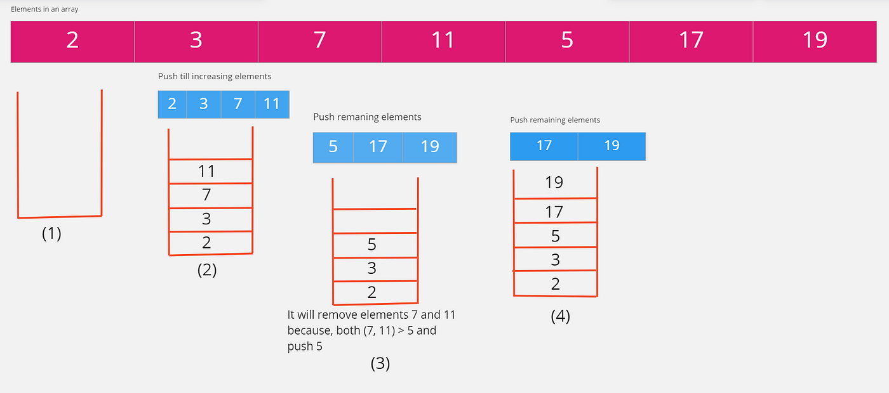

It's a stack that is always sorted in a decreasing order, so the top of the stack is always the smallest element in the stack

- usually used in problems that require finding the next greater/smaller element in an array
  

---

#### Monotonic decreasing queue

It's a queue that is always sorted in a decreasing order, so the front of the queue is always the smallest element in the queue

- usually used in problems that require finding the next greater/smaller element in an array

---

#### Divide and Conquer

This pattern involves dividing a dataset into smaller chunks and then repeating a process with a subset of data

- How it works:

  1. Figure out a simple case as the base case
  2. Figure out how to reduce your problem and get to the base case

- Divide and conquer algorithms are often recursive algorithms, To solve a problem using `D&C`, we need to:

  1. Divide (decrease) the problem into a number of subproblems that are smaller instances of the same problem until it becomes the base case.
  2. Conquer the subproblems by solving them recursively. If they are small enough, solve the subproblems as base cases.
  3. Combine the solutions to the subproblems into the solution for the original problem.

- this pattern can tremendously decrease **time-complexity**
- EX: **Binary Search**, **Merge Sort**, **Quick Sort**

##### Inductive proofs

**Inductive proofs** are a way to prove that an algorithm works and involve two steps - the base case and the inductive case. In the case of quicksort, the algorithm's effectiveness is proven for arrays of different sizes through the base case and the inductive case. Inductive proofs are considered fun and complement the Divide and Conquer technique.

- Ex: for `quicksort`. In the base case, The algorithm works for the base case: arrays of size `0` and `1`. In the inductive case, It's shown that if quicksort works for an array of size `1`, it will work for an array of size `2`. And if it works for arrays of size `2`, it will work for arrays of size `3`, and so on. hen I can say that quicksort will work for all arrays of any size.

---

#### Dynamic Programming

#### Greedy Algorithms

It's an algorithm that makes the locally optimal choice at each stage with the hope of finding a global optimum.

- Ex: **Dijkstra's algorithm** for finding the shortest path between two nodes in a graph.

#### Backtracking

---

## Testing and Debugging

Testing is the process of experimentally checking the correctness of a program, while debugging is the process of tracking the execution of a program and discovering the errors in it.

### Testing

- we should aim at executing the program on a representative subset of `inputs`. At the very minimum, we should make sure that every method of a class is tested at least once (**method coverage**). Even better, each code statement in the program should be executed at least once (statement coverage).

#### Test fail situations

Programs often tend to fail on a lot of situations like these:

- special **inputs** to the program
  - For example, when testing a method that `sorts` a sequence of integers, we should consider the following inputs:
    - The sequence has zero length (no elements).
    - The sequence has one element.
    - All the elements of the sequence are the same.
    - The sequence is already sorted.
    - The sequence is reverse sorted.
- special conditions for the **structures** used by the program:
  - For example, if we use a Python list to store data, we should make sure that **boundary cases**, such as `inserting` or `removing` at the beginning or end of the list, are properly handled.

#### Testing order

The dependencies among the classes and functions of a program induce a hierarchy. Namely, a component A is above a component B in the hierarchy if A depends upon B, such as when function A calls function B, or function A relies on a parameter that is an instance of class B. There are two main testing strategies, **top-down** and **bottom-up**, which differ in the order in which components are tested.

- **Top-down** testing proceeds from the top to the bottom of the program hierarchy. It is typically used in conjunction with **stubbing**, a boot-strapping technique that replaces a lower-level component with a **"stub"**,
  - > `stub`: a replacement for the component that simulates the functionality of the original.
  - > For example, if function A calls function B to get the first line of a file, when testing A we can replace B with a stub that returns a fixed string.
- **Bottom-up** testing proceeds from lower-level components to higher-level components. For example, bottom-level functions, which do not invoke other functions, are tested first, followed by functions that call only bottom-level functions, and so on. Similarly a class that does not depend upon any other classes can be tested before another class that depends on the former. This form of testing is usually described as **"unit testing"**,
  - as the functionality of a specific component is tested in isolation of the larger software project.

---

### Debugging

The simplest debugging technique consists of using `print` statements to track the values of variables during the execution of the program. A problem with this approach is that eventually the print statements need to be removed or commented out, so they are not executed when the software is finally released.

A better approach is to run the program within a **debugger**, which is a specialized environment for controlling and monitoring the execution of a program. The basic functionality provided by a debugger is the insertion of breakpoints within the code. When the program is executed within the debugger, it stops at each breakpoint. While the program is stopped, the current value of variables can be inspected.

---

## String

### Substring (Sliding Window)

#### Longest Substring Without Repeating Characters

Given a string `s`, find the length of the **longest substring** without repeating characters.

- EX: `s = "abcabcbb"` -> `3` (substring: `"abc"`)
- we can use a **sliding-window** pattern to check for all the substrings of the string
  
  

```py
def lengthOfLongestSubstring(s):
    # Initialize a set to keep track of the characters in the current window
    window = set()

    # Initialize the sliding-window with the first character in the string
    ans = 0
    left = 0

    # Iterate over the string
    for right in range(len(s)):
        # If the current character is in the window, remove it and slide the window
        while s[right] in window:
            window.remove(s[left])
            # Slide the window to the right
            left += 1

        # Add the current character to the window
        window.add(s[right])

        # Update the maximum window size
        ans = max(ans, right - left + 1)

    return ans
```

---

#### Longest Repeating Character Replacement

You are given a string `s` and an integer `k`. You can choose any character of the string and change it to any other uppercase English character. You can perform this operation at most `k` times.

Return the length of the longest substring containing the same letter you can get after performing the above operations.

- EX: `s = "AABABBA", k = 1` -> `4` (substring: `"AABA"`)
- Explanation:

  - We can choose any of the underlined characters in the string, and turn them into 'B': "AABABBA" -> "AABBBBA"
  - After doing so, we have the longest substring of one repeating character of length `4`.

- **Steps:**
  
  1. we want to replace the (least frequent characters) in the current window with the (most frequent character in the window)
  2. to do this, we will need to keep track of the (character frequencies) inside the current window
  3. and check the `window length` against the `max character frequency` to see if the window is valid (valid means `<= k`)


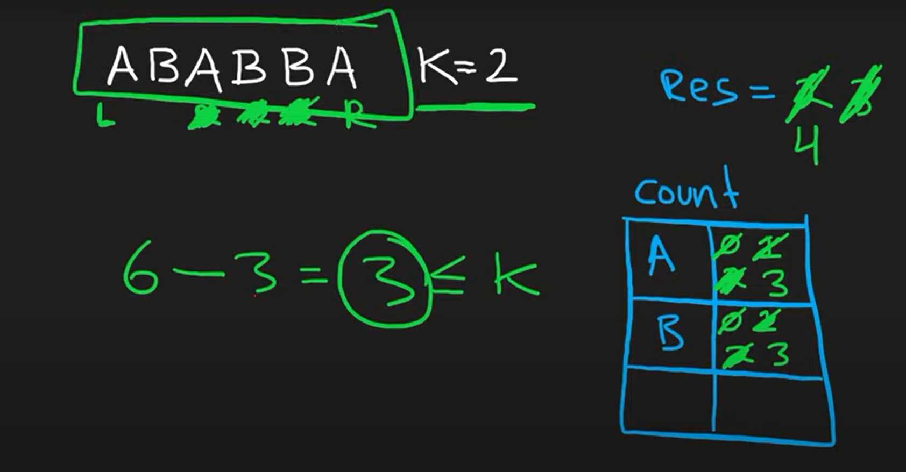


```py
# O(n)
def characterReplacement(s, k):
    # Initialize a dictionary to keep track of the characters in the current window
    char_count = {}

    # Initialize the sliding-window with the first character in the string
    ans = 0
    left = 0
    max_character_frequency = 0

    # Iterate over the string
    for right in range(len(s)):
        # Add the current character to the window if it is not already in it
        char_count[s[right]] = char_count.get(s[right], 0) + 1

        # Update the maximum window size
        max_character_frequency = max(max_character_frequency, char_count[s[right]])

        # If the current window is invalid, slide the window to the right until it becomes valid
        while right - left + 1 - max_character_frequency > k:
            char_count[s[left]] -= 1
            # Slide the window to the right
            left += 1

        # Update the maximum window size if window is valid
        ans = max(ans, right - left + 1)

    return ans
```

---

#### Count Vowel Substrings of a String

Given a string `s` return the number of substrings that have **all vowels** in order.

- EX: `s = "abciiidef"` -> `3` (substrings: `"ae"`, `"ei"`, `"iii"`)
- Steps:
  - we can use a **sliding-window** pattern to check for all the substrings of the string
  - then we check these pair for the desired condition, and if not we change one of the numbers in pair and check again and so on...

```py
def countVowelSubstrings(word):
    # Store vowels in a set for O(1) lookup.
    vowels = {'a', 'e', 'i', 'o', 'u'}

    # Initialize the sliding-window with the first vowel in the string and the last vowel in the string
    ans = 0
    last_consonant = -1

    # Initialize a dictionary to keep track of the last seen vowel
    last_seen_vowels = {v: -2 for v in vowels} # -2 is the smallest possible index

    for i, x in enumerate(word):
        # If the current character is a consonant, update the last_consonant variable.
        if x not in vowels:
            last_consonant = i
        # Otherwise, we've found a vowel.
        else:
            # Update the last_seen_vowels dictionary with the current index.
            last_seen_vowels[x] = i
            # Update the answer variable with the maximum of the current value and the minimum of the last seen vowel's
            # index and the last consonant's index.
            ans += max(min(last_seen_vowels.values())-last_consonant, 0)
    return ans
```

---

#### Minimum Window Substring

Given two strings `s` and `t` of lengths `m` and `n` respectively, return the **minimum window substring** of `s` such that every character in `t` (**including duplicates**) is included in the window. If there is no such substring, return the empty string `""`.

- EX: `s = "ADOBECODEBANC", t = "ABC"` -> `"BANC"`
- Explanation:

  - The minimum window substring `"BANC"` includes `'A'`, `'B'`, and `'C'` from string `t`.

- **Steps:**
  

  1. we want to find the smallest window in `s` that contains all the characters in `t`
  2. we can use a **sliding-window** pattern to check for all the substrings of the string
  3. then we check these pair for the desired condition, and if not we change one of the numbers in pair and check again and so on...

  - **Condition:** check if the current window contains all the characters in `t`
    - this is done by checking if the frequency of **each** character in the window in the `char_count` dictionary is greater than or equal to the frequency of the same character in the `target_count` dictionary
      - if we have enough of each character in the window, then we have a valid window
      - if not, then we need to slide the window **to the right** until we have a valid window

- **Slow Solution** (checks the entire character count dictionary for each character in the string each time)

  ```py
  # O(n)
  def minWindow(s, t):
      # Initialize dictionaries to keep track of the characters in the current window and the target string
      char_count = {}
      target_count = {}

      for c in t:
          target_count[c] = target_count.get(c, 0) + 1

      # Initialize the sliding-window with the first character in the string
      ans = ""
      min_window_size = float('inf')
      left = 0

      # Iterate over the string
      for right in range(len(s)):
          # Add the current character to the window if it is not already in it
          char = s[right]
          char_count[char] = char_count.get(char, 0) + 1

          # If the current window is invalid, slide the window to the right until it becomes valid
          while all(char_count.get(char, 0) >= target_count.get(char, 0) for char in target_count):
              # Update the minimum window size
              if right - left + 1 < min_window_size:
                  min_window_size = right - left + 1
                  ans = s[left:right+1]

              # keep popping values from the left until we have a valid window
              char_count[s[left]] -= 1
              # Slide the window to the right
              left += 1

      return ans
  ```

- **Faster Solution** (uses a counter to keep track of the number of characters in the window that are also in the target string) -> `have` and `need` counters

  - first, we initialize the `have` and `need` counters to `0` and `len(target_count)` respectively and we iterate over the string `s` using the sliding-window pattern
    
    
    
    
  - then if `have` is equal to `need` we have a valid window and we can update the answer, and try to find a smaller window by moving the left pointer to the right
    

  ```py
  # O(n)
  def minWindow(s, t):
      # edge case
      if t == "": return ""

      # Initialize dictionaries to keep track of the characters in the current window and the target string
      window_char_count = {}
      target_count = {}

      for c in t:
          target_count[c] = target_count.get(c, 0) + 1

      # Initialize the sliding-window with the first character in the string
      ans = ""
      min_window_size = float('inf')
      left = 0
      have, need = 0, len(target_count) # have is the number of characters in the window that are also in the target string

      # Iterate over the string
      for right in range(len(s)):
          # Add the current character to the window if it is not already in it
          char = s[right]
          window_char_count[char] = window_char_count.get(char, 0) + 1

          # if the current character is in the target string and the number of times it appears in the window is equal to the number of times it appears in the target string, then we have one more character in the window that is also in the target string
          if char in target_count and window_char_count[char] == target_count[char]:
              have += 1

          # here we only check if the current window is valid if we have all the characters in the target string in the window instead in the slow solution where we check if the current window is valid for each character in the string
          while have == need:
              # Update the minimum window size
              windowSize = right - left + 1
              if windowSize < min_window_size:
                  min_window_size = windowSize
                  ans = s[left : right+1]

              # keep popping values from the left until we have a valid window
              window_char_count[s[left]] -= 1
              # if the current character is in the target string and the number of times it appears in the window is less than the number of times it appears in the target string, then we have one less character in the window that is also in the target string
              if s[left] in target_count and window_char_count[s[left]] < target_count[s[left]]:
                  have -= 1
              # Slide the window to the right
              left += 1

      return ans
  ```

---

### Reversing Problems

#### Valid Palindrome

A palindrome is a word, phrase, number, or other sequence of characters which **reads the same backward or forward**. Allowances may be made for adjustments to capital letters, punctuation, and word dividers.

- EX: `racecar`, `tacocat`, `madam`, `kayak`, `level`
- Here's a possible approach to solve this problem:

  1. Convert the string to lowercase to ignore any case differences.
  2. Remove any non-alphanumeric characters from the string.

     - > **Note:** numbers within the string will be considered alphanumeric.

  3. Use two pointers to iterate through the string from both ends.
  4. Compare the characters at each pointer position. If they are not equal, the string is not a palindrome. If they are equal, move both pointers towards the center of the string.
  5. If the pointers meet in the middle of the string, the string is a palindrome.

```py
# using two pointers
# helper
def isAlphaNum(char):
            # using ASCII values
           return (ord('A') <= ord(char) <= ord('Z') or
                   ord('a') <= ord(char) <= ord('z') or
                   ord('0') <= ord(char) <= ord('9'))
# or use the built-in isalnum() string-method

def is_palindrome(s):
  # First & last pointers
  left, right = 0, len(s)-1

  while left < right:
    while left < right and not isAlphaNum(s[left]):
      left += 1
    while left < right and not isAlphaNum(s[right]):
      right -= 1

    if s[left].lower() != s[right].lower():
      return False

    left += 1
    right -= 1

  return True

# --------------------------------------------------

# Or
newStr = ''
for char in s:
  if char.isalnum():
    newStr += char.lower()

return newStr == newStr[::-1]
```

- recursive solution

  ```py
  def isPalindrome(s):
      if len(s) <= 1:
          return True
      if s[0] != s[-1]:
          return False
      return isPalindrome(s[1:-1])
  ```

---

#### Reverse Integer

1. Convert the integer to a string to access its individual digits.
2. Reverse the string using a string slicing operation.
3. Convert the reversed string back to an integer using the int() function.
4. Handle potential overflow by checking whether the reversed integer is within the range of a 32-bit signed integer (-2^31 to 2^31-1).

```py
def reverse_integer(num):
    sign = -1 if x < 0 else 1
      s = str(x)[::-1] # reverse the string using slicing
      # separate the sign from the rest of the reversed string before converting it to an integer if we have a negative sign at the end if the original integer (e.g. 123-)
      rev = sign * int(s[:-1]) if s[-1] == '-' else sign * int(s)
      if rev < -2147483648 or rev > 2147483647: # check for overflow
          return 0
      else:
          return rev
```

---

## Arrays

### Modify array in plave

#### Remove Duplicates From Sorted Array

Given a sorted array `nums`, remove the duplicates **in-place** such that each element appears only once and returns the new length.

- Ex:

  - `nums = [1,1,2]` -> `2` (nums = [1,2])
  - `nums = [0,0,1,1,1,2,2,3,3,4]` -> `5` (nums = [0,1,2,3,4])

- Explanation:
  
  - we can use a **two pointers** pattern to check for all the elements in the array
  - we can use the first pointer to keep track of the last unique element in the array
  - and the second pointer to iterate over the array and check if the current element is equal to the last unique element
  - if it is, then we skip it, if not, then we increment the last unique index **and then** update the last unique element

```py
def removeDuplicates(nums):
    if len(nums) == 0: return 0

    # initialize the index of the last unique element
    last_unique = 0

    for i in range(1, len(nums)):
        # if the current element is not equal to the last unique element, increment the last unique index and then update the last unique element
        if nums[i] != nums[last_unique]:
            last_unique += 1
            nums[last_unique] = nums[i]

    # return the length of the array
    return last_unique + 1
```

---

#### Remove Element

Given an array `nums` and a value `val`, remove all instances of that value **in-place** and return the new length.

- Ex:

  - `nums = [3,2,2,3], val = 3` -> `2` (`nums = [2,2]`)

- Explanation:
  - we can use a **two pointers** pattern to check for all the elements in the array
  - we can use the first pointer to keep track of the last non-val element in the array
  - and the second pointer to iterate over the array and check if the current element is equal to val
  - if it is, then we skip it, if not, then we update the last non-val element **and then** update the last non-val index

```py
def removeElement(nums, val):
    # initialize the index of the last non-val element
    last_non_val = 0

    for i in range(len(nums)):
        # if the current element is not equal to val, update the last non-val element and then increment the last non-val index
        if nums[i] != val:
            nums[last_non_val] = nums[i]
            last_non_val += 1

    # return the length of the array
    return last_non_val
```

---

### Array chunk (split array into smaller chunks)

Given an array and chunk size, divide the array into many subarrays where each subarray is of length size.

- EX: `chunk([1, 2, 3, 4], 2) --> [[1, 2], [3, 4]]`

```py
def chunk(arr, size):
    chunked = []
    for i in range(0, len(arr), size):
        chunked.append(arr[i:i+size])
        # i += size # without the iteration-step
    return chunked

# --------------------------OR-----------------------------------

def chunk(arr, size):
    result = []
    subarray = []
    for i in arr:
        subarray.append(i)
        # if the subarray is full, append it to the result and reset the subarray
        if len(subarray) == size:
            result.append(subarray)
            subarray = []
    if subarray:
        result.append(subarray)
    return result
```

---

### Array Sums

#### Two Sum II

Given a 1-indexed array of integers numbers that is already sorted in non-decreasing order, find two numbers such that they add up to a specific target number. Let these two numbers be `numbers[index1]` and `numbers[index2]` where `1 <= index1 < index2 <= numbers.length`.

- EX: `nums = [2, 7, 11, 15], target = 9` --> `[0, 1]` because `nums[0] + nums[1] == 9`

```py
def two_sum(numbers, target):
    # Set the left and right pointers
    left = 0
    right = len(numbers) - 1

    while left < right:
        # If the sum of the left and right pointers is the target, return the indices adding 1 to each since the problem is 1-indexed
        if numbers[left] + numbers[right] == target:
            return [left + 1, right + 1]
        elif numbers[left] + numbers[right] < target:
            left += 1
        else:
            right -= 1
    # If the target was not found, return [-1, -1]
    return [-1, -1]
```

---

#### Three Sum

Given an array `nums` of n integers, are there elements a, b, c in `nums` such that a + b + c = 0? Find all unique triplets in the array which gives the sum of zero.

- EX: `nums = [-1, 0, 1, 2, -1, -4]` --> `[[-1, 0, 1], [-1, -1, 2]]`
- **Steps:**
  

  - Sort the array
  - Loop through the array
    - If the current value is the same as the previous value, skip it, because we've already tried it (To avoid duplicates)
    - Set left and right pointers to find the other two values
    - If the sum is less than zero, move the left pointer to the right to get a larger value
    - If the sum is greater than zero, move the right pointer to the left to get a smaller value
    - If the sum is zero, append the three values to the result
    - Move the left and right pointers to the next unique values to avoid duplicates

- Method 1:

  - sort the input array first. Use two pointers to find the third element that sums to zero, instead of iterating over all possible pairs of elements. Avoid generating duplicate triplets by skipping over duplicates in the input array and avoiding identical pairs of i, `j`, `k` values.

  ```py
  # Time: O(nlog(n)) + O(n^2) = O(n^2)
  def three_sum(nums):
      nums.sort()
      result = []

      for i in range(len(nums)):
          # if the current value is the same as the previous value, skip it, because we've already tried it (To avoid duplicates)
          if i > 0 and nums[i] == nums[i-1]:
              continue

          # set left and right pointers to find the other two values
          left, right = i+1, len(nums)-1
          while left < right:
              total = nums[i] + nums[left] + nums[right]
              # if the sum is less than zero, move the left pointer to the right to get a larger value
              if total < 0:
                  left += 1
              # if the sum is greater than zero, move the right pointer to the left to get a smaller value
              elif total > 0:
                  right -= 1
              # otherwise, we have found the triplet
              else:
                  result.append([nums[i], nums[left], nums[right]])
                  # move both pointers to the middle to see if we have more triplets
                  left += 1
                  right -= 1
                  # skip duplicates
                  while left < right and nums[left] == nums[left-1]:
                      left += 1
                  while left < right and nums[right] == nums[right+1]:
                      right -= 1
      return result
  ```

- Method 2:

  - use three pointers to iterate through the array. Fix `i` at the start and use `j` and `k` to find a pair of elements that sum to the negation of the value at index `i`. Move `j` and `k` towards each other until they meet or the sum is greater than or equal to zero. Add the triplet to a set to remove duplicates. Move `i` to the next unique value and repeat the process.

  ```py
  # Time: O(nlog(n)) + O(n^2) = O(n^2)
  def three_sum(nums):
      result = set()
      nums.sort()

      for i in range(len(nums)):
          # if the current value is the same as the previous value, skip it, because we've already tried it (To avoid duplicates)
          if i > 0 and nums[i] == nums[i-1]:
              continue

          # set left and right pointers to find the other two values
          left, right = i+1, len(nums)-1
          while left < right:
              total = nums[i] + nums[left] + nums[right]
              # if the sum is less than zero, move the left pointer to the right to get a larger value
              if total < 0:
                  left += 1
              # if the sum is greater than zero, move the right pointer to the left to get a smaller value
              elif total > 0:
                  right -= 1
              # otherwise, we have found the triplet
              else:
                  result.add((nums[i], nums[left], nums[right]))
                  # move both pointers to the middle to see if we have more triplets
                  left += 1
                  right -= 1
      return result
  ```

---

#### 4 Sum

Given an array `nums` of `n` integers, return an array of all the **unique** quadruplets `[nums[a], nums[b], nums[c], nums[d]]` such that:

- `0 <= a, b, c, d < n`
- `a`, `b`, `c`, and `d` are **distinct**.
- `nums[a] + nums[b] + nums[c] + nums[d] == target`

You may return the answer in **any order**.

- EX: `nums = [1, 0, -1, 0, -2, 2], target = 0` --> `[[-2, -1, 1, 2], [-2, 0, 0, 2], [-1, 0, 0, 1]]`

- **Steps:**
  

  - Sort the array
  - Loop through the array
    - If the current value is the same as the previous value, skip it, because we've already tried it (To avoid duplicates)
    - Set left and right pointers to find the other three values
    - If the sum is less than zero, move the left pointer to the right to get a larger value
    - If the sum is greater than zero, move the right pointer to the left to get a smaller value
    - If the sum is zero, append the four values to the result
    - Move the left and right pointers to the next unique values to avoid duplicates

```py
# Time: O(n^3)

def four_sum(nums, target):
    nums.sort()
    result = []

    for i in range(len(nums)):
        # if the current value is the same as the previous value, skip it, because we've already tried it (To avoid duplicates)
        if i > 0 and nums[i] == nums[i-1]:
            continue

        for j in range(i+1, len(nums)):
            # if the current value is the same as the previous value, skip it, because we've already tried it (To avoid duplicates)
            if j > i+1 and nums[j] == nums[j-1]:
                continue

            # set left and right pointers to find the other two values
            left, right = j+1, len(nums)-1
            while left < right:
                total = nums[i] + nums[j] + nums[left] + nums[right]
                # if the sum is less than zero, move the left pointer to the right to get a larger value
                if total < target:
                    left += 1
                # if the sum is greater than zero, move the right pointer to the left to get a smaller value
                elif total > target:
                    right -= 1
                # otherwise, we have found the quadruplet
                else:
                    result.append([nums[i], nums[j], nums[left], nums[right]])
                    # move both pointers to the middle to see if we have more quadruplets
                    left += 1
                    right -= 1
                    # skip duplicates
                    while left < right and nums[left] == nums[left-1]:
                        left += 1
                    while left < right and nums[right] == nums[right+1]:
                        right -= 1
    return result
```

---

#### Continuous SubArray Sum

Given an integer array `nums` and an integer `k`, return `true` if `nums` has a continuous subarray of size at least two whose elements sum up to a multiple of `k`, or `false` otherwise.

An integer `x` is a multiple of `k` if there exists an integer `n` such that `x = n * k`. `0` is **always** a multiple of `k`.

- EX: `nums = [23, 2, 4, 6, 7], k = 6` --> `true` because `[2, 4]` is a continuous subarray of size 2 and sums up to 6 which is a multiple of 6.

- the brute force solution is to loop through the array and check every possible subarray, but that would be O(n^2) time complexity
- But we can solve it in O(n) time complexity using a dictionary to store the `remainder` and its ending `index`:
  - If the `remainder` is in the dictionary, check if the difference between the current index and the index of the `remainder` is greater than 1
    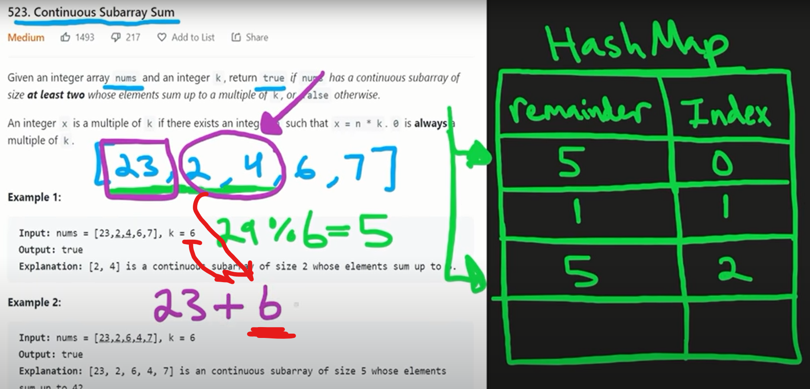
    - if so, return `True` as we have found a continuous subarray of size at least two whose elements sum up to a multiple of `k`
    - because if the remainder is in the dictionary, that means we have seen it before, and the difference between the current index and the index of the `remainder` is the size of the subarray **because the sum of the elements between the two indices is a multiple of `k`**
    - and if the difference is greater than 1, that means there is at least one element between the two indices, and the sum of the elements between the two indices is a multiple of `k`
  - If the `remainder` is not in the dictionary, add it to the dictionary
    - If the `remainder` is not in the dictionary, that means we have not seen it before, so we add it to the dictionary
  - > **Note:** We initialize the dictionary with `0: -1` because the sum of the first element is 0 and the size of the subarray must be at least 2 and if the first element is a multiple of `k`, we will get index as 0 and 0 - (-1) = 1 which is not greater than 1, so we need to initialize the dictionary with `0: -1` to avoid this case

```py
def check_subarray_sum(nums, k):
    # Create a dictionary to store the remainder and its index
    remaindersDict = {0: -1} # Initialize the dictionary with 0: -1 because the sum of the first element is 0 and the size of the subarray must be at least 2
    total = 0

    for i in range(len(nums)):
        total += nums[i]
        # If k is not 0, get the remainder of the sum by dividing by k
        if k != 0:
            remainder = total % k
        # If the remainder is in the dictionary, check if the difference between the current index and the index of the remainder is greater than 1 -> len(subarray) >= 2
        if remainder not in remaindersDict:
            # If the remainder is not in the dictionary, add it to the dictionary
            remaindersDict[remainder] = i
        elif i - remaindersDict[remainder] > 1:
            return True

    return False
```

---

### Product of Array Except Self

Given an integer array `nums`, return an array `answer` such that `answer[i]` is equal to the product of all the elements of `nums` except `nums[i]`.

The product of any prefix or suffix of `nums` is **guaranteed** to fit in a **32-bit** integer.

You must write an algorithm that runs in `O(n)` time and without using the division operation.

- EX: `nums = [1, 2, 3, 4]` --> `answer = [24, 12, 8, 6]`

  - `answer[0] = 2 * 3 * 4 = 24`
  - `answer[1] = 1 * 3 * 4 = 12`
  - `answer[2] = 1 * 2 * 4 = 8`
  - `answer[3] = 1 * 2 * 3 = 6`

- **Steps**:

  1. Brute force solution:

     - Loop through the array and multiply all the elements except the current element
     - Time complexity: `O(n^2)`
     - Space complexity: `O(n)`

  2. Optimal solution:
     
     

     - We can use two arrays to store the products of the elements to the left and right of the current element -> `prefix` and `postfix`
     - Then we can multiply the elements of the two arrays to get the final result
     - Time complexity: `O(n)`
     - Space complexity: `O(n)`

```py
def product_except_self(nums):
    # Create two arrays to store the products of the elements to the left and right of the current element
    prefix = [1] * len(nums) # Initialize the array with 1 because the product of the first element is (1 * first element = first element)
    postfix = [1] * len(nums)
    result = []

    # Loop through the array and multiply all the elements to the left of the current element
    for i in range(1, len(nums)):
        prefix[i] = prefix[i-1] * nums[i-1]

    # Loop through the array and multiply all the elements to the right of the current element
    for i in range(len(nums)-2, -1, -1):
        postfix[i] = postfix[i+1] * nums[i+1]

    # Multiply the elements of the two arrays to get the final result
    for i in range(len(nums)):
        result.append(prefix[i] * postfix[i])

    return result

# ----------------------------------------------------------------

# Time complexity: O(n) | Space complexity: O(1) as the output array does not count as extra space
def product_except_self(nums):
    result = [1] * len(nums) # Initialize the array with 1 because the product of the first element is (1 * first element = first element)

    prefix = 1
    # Loop through the array and multiply all the elements to the left of the current element
    for i in range(len(nums)):
        result[i] = prefix
        prefix *= nums[i]

    postfix = 1
    # Loop through the array and multiply all the elements to the right of the current element
    for i in range(len(nums)-1, -1, -1):
        result[i] *= postfix # Multiply instead of assigning
        postfix *= nums[i]

    return result
```

---

### Container with most water

Given n non-negative integers `a1`, `a2`, ..., `an` , where each represents a point at coordinate `(i, ai)`. `n` vertical lines are drawn such that the two endpoints of the line `i` is at `(i, ai)` and `(i, 0)`. Find two lines, which, together with the x-axis forms a container, such that the container contains the most water.

- EX: height =`[1, 8, 6, 2, 9, 4]`-->`24`
  
- Notes:

  - Here, the width has a direct impact on the area, so the distance between indexes matters.
  - We don't know if we should increase or decrease the width, so we will see which one is shorter and move the pointer in that direction.

- **Steps**:

  1. Verify the constraints:

     - Does the thickness of the lines matter? No.
     - Do the left and right sides of the container form a wall? No.
     - Does a higher line inside the container affect the area, breaking it into 2 parts? No.
       

  2. Initialize **two pointers**, one at the beginning and one at the end of the array constituting the length of the lines.
  3. At every step, find out the area formed between them
     - width = `right index - left index`
     - height = `min(height[left], height[right])`
  4. update the result and move the pointer pointing to the shorter line towards the other end by one step. This is because the farther the lines, the more will be the area obtained.

```py
def max_area(height):
    max_area = 0
    # Two pointers at the beginning and the end of the array
    left, right = 0, len(height) - 1

    while left < right:
        # The width is the distance between them, and the height is the lower line.
        area = (right - left) * min(height[left], height[right])
        # Update max_area if we have a new maximum
        max_area = max(max_area, area)
        # Move the left and right pointers, depending on which line is shorter
        if height[left] < height[right]:
            left += 1
        else:
            right -= 1
    return max_area
```

---

### Trapping Rain Water

Given `n` non-negative integers representing an elevation map where the width of each bar is `1`, compute how much water it can trap after raining.

- EX: `height = [0,1,0,2,1,0,3,1,0,1,2]` --> `8` units of water
  
- **Explanation:**

  - Here, we will need to use the entire array to find the maximum area, so the distance between indexes doesn't matter.
  - We know that the height of water cannot exceed the height of the shorter wall.
  - Formula for the area of water above any **point**:

    ```py
    current_water = min(left_max, right_max) - height[i]

    # height[i] is the height of the current wall
    # left_max is the height of the tallest wall to the left of the current wall.
    # right_max is the height of the tallest wall to the right of the current wall.
    ```

  - To ge the wanted amount of water, we need to **find the area of water above each point and add them up**.
    - if the water is above the current wall, the area will be positive, otherwise it will be negative. So we will only add the positive areas to the total.

#### Solution 1: Extra memory used (O(n) space)


- **Steps**:

  1. Verify the constraints:

     - Do the left and right sides of the container form a wall? No.
     - will there be negative numbers? No.

  2. Initialize variables to keep track of the maximum height on both the left and right sides of each bar
     - Loop through the list of heights to find the maximum height on the left side of each bar
     - Loop through the list of heights in reverse order to find the maximum height on the right side of each bar
  3. Loop through the list of heights again and calculate the amount of water that can be trapped above each bar using the formula above.
  4. Add up the amount of water trapped above each bar to get the total amount of water trapped.

```py
def trap(height):
    # initialize two lists to store the max height of the left and right
    # of each position
    left_max = [0] * len(height)
    right_max = [0] * len(height)
    total_water = 0

    # calculate the max height of the left of each position
    max_height = 0
    for i in range(len(height)):
        left_max[i] = max_height
        max_height = max(max_height, height[i])

    # calculate the max height of the right of each position
    max_height = 0
    # loop through the list in reverse order
    for i in range(len(height)-1, -1, -1):
        right_max[i] = max_height
        max_height = max(max_height, height[i])

    # calculate the water in each position
    for i in range(len(height)):
        water = min(left_max[i], right_max[i]) - height[i]
        # add the water to the total if it's positive (above the current wall)
        if water > 0:
            total_water += water

    return total_water
```

#### Solution 2: Two pointers Less memory used (O(1) space)


- In [solution-1](#solution-1-extra-memory-used-on-space), we actually used 2 pointers (1 individual pointer with one iteration for each) but we were iterating pointers **outwards**. Here we will use 2 pointers to iterate **inwards**.
- We can't use the 2 pointers in order to single handedly figure out what (the walls are for some container and the water inside), but what we can keep track of is the **maximum height of the left and right walls**.

  - meaning that we keep track of every value that we have seen and keep track of the maximum value that is's seen and then decide which one to move inwards.
    
    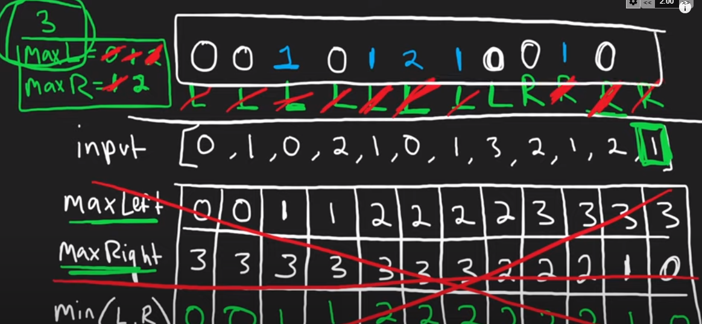

  - This is because we need only the minimum of the two walls to calculate the water above the current wall. so if the left wall is shorter, we move the left pointer inwards, otherwise we move the right pointer inwards. knowing that the minimum of the two walls is the maximum height of the water above the current wall.

- Here, **we calculate water per vertical-block for each point and not the area**

```py
def trap(height):
    # initialize two lists to store the max height of the left and right of each position
    left_max = 0
    right_max = 0
    total_water = 0

    # initialize two pointers, one at the beginning and one at the end
    l, r = 0, len(height) - 1

    while l < r:
        # update the left_max and right_max
        if height[l] < height[r]:
            # 1. get current left wall height
            left_max = max(left_max, height[l]) # Update the left_max if the current wall is taller than the previous one
            # 2. calculate the water above the current wall
            total_water += left_max - height[l]
            l += 1
        else:
            right_max = max(right_max, height[r])
            total_water += right_max - height[r]
            r -= 1

    return total_water
```

---

### Interval scheduling problems (overlapping intervals)

#### Meeting Rooms

Given an array of meeting time intervals `intervals` where `intervals[i] = [starti, endi]`, determine if a person could attend all meetings.

- EX: `intervals = [[0,30],[5,10],[15,20]]` --> `false`

- Solution : Sort and compare

- **Steps**:

  1. Sort the intervals **by the start time**
  2. Loop through the sorted intervals and check if the end time of the current interval is greater than the start time of the next interval. If it is, then return `false`.
     - check if a meeting starts before the previous meeting ends. we will only need to check the end time of the previous meeting and the start time of the current meeting. and not compare with all the previous meetings. because the meetings are sorted by the start time. (meaning that if the current meeting starts after the previous meeting ends, then it will start after all the previous meetings end and also the all upcoming meetings will start after the current meeting ends) so no need to compare with all the previous meetings.
       
  3. If the loop finishes, return `true`.

```py
"""
Definition of Interval:
class Interval(object):
    def __init__(self, start, end):
        self.start = start
        self.end = end
"""

def canAttendMeetings(intervals):
    # sort the intervals by the start time
    intervals.sort(key=lambda x: x.start)

    # loop through the sorted intervals (we start from the second interval because we need to compare it with the previous interval)
    for i in range(1, len(intervals)):
        # check if the end time of the previous interval is greater than the start time of the current interval
        if intervals[i-1].end > intervals[i].start:
            return False


    return True
```

---

#### Meeting Rooms II

Given an array of meeting time intervals `intervals` where `intervals[i] = [starti, endi]`, return the minimum number of conference rooms required.

- EX: `intervals = [[0,30],[5,10],[15,20]]` --> `2`
  

- Steps:

  1. use two arrays to keep track of the start times and end times separately.
  2. then sort the two arrays and use two pointers to iterate over them.
  3. We start with the first start time and the first end time. If the start time is less than the end time, we need to allocate a new room and move the start pointer forward. If the start time is greater than or equal to the end time, we can reuse the room and move both pointers forward.

     - we iterate over the start times array and compare each start time with the current end time. If the start time is less than the end time, we need to allocate a new room and move the start pointer forward.
     - If the start time is greater than or equal to the end time, we can reuse the room and move both pointers forward

  4. Finally, we return the number of rooms allocated, which represents the minimum number of meeting rooms required to schedule all the meetings.

```py
"""
Definition of Interval:
class Interval(object):
    def __init__(self, start, end):
        self.start = start
        self.end = end
"""

def minMeetingRooms(intervals):
    if not intervals:
        return 0

    # initialize two arrays to keep track of the start times and end times
    start_times = sorted([interval.start for interval in intervals])
    end_times = sorted([interval.end for interval in intervals])

    # initialize two pointers to iterate over the start and end times
    start_ptr = end_ptr = 0
    num_rooms = 0

    while start_ptr < len(start_times):
        # check if the start time is less than the end time
        if start_times[start_ptr] < end_times[end_ptr]:
            num_rooms += 1
        else:
            end_ptr += 1

        start_ptr += 1

    return num_rooms
```

---

### Matrix

#### Rotate Image

You are given an n x n 2D matrix representing an image, rotate the image by 90 degrees (clockwise). You have to rotate the image **in-place**, which means you have to modify the input 2D matrix directly. **DO NOT** allocate another 2D matrix and do the rotation.

- EX: `matrix = [[1,2,3],[4,5,6],[7,8,9]]` --> `[[7,4,1],[8,5,2],[9,6,3]]`
  

- Solution 1: Transpose and then reverse

  - **Steps**:

    - perform a matrix transpose and then reverse each row of the resulting matrix.
    - **Transpose**: swap the elements of the matrix across the diagonal.

      - This is done by iterating through the matrix and swapping the element at index `[i]` `[j]` with the element at index `[j]` `[i]`.

        ```py
        matrix[i][j], matrix[j][i] = matrix[j][i], matrix[i][j]
        ```

    - The nested loop will iterate over the `range(row)`

  ```py
  # Time: O(n^2) | Space: O(1) -> (in-place)
  def rotate(matrix):
    # transpose the matrix
    for i in range(len(matrix)):
        for j in range(i):
            matrix[i][j], matrix[j][i] = matrix[j][i], matrix[i][j]
    # Reverse each row
    for i in range(len(matrix)):
        matrix[i].reverse()
  ```

- Solution 2: using 4 pointers -> **(complex)**

  - We initialize two pointers `l` and `r` to point to the leftmost and rightmost columns of the matrix, respectively.
    
  - Swap each element in a cycle of four, using four pointers to keep track of the `top`, `bottom`, `left`, and `right` boundaries of the current cycle.
    
  - Iterate through all elements in the current cycle, from left to right, using a loop variable i.
  - For each element in the current cycle, swap the element with its corresponding element in the cycle, using four pointers to keep track of the top, bottom, left, and right boundaries of the cycle.
    
  - After swapping all elements in the current cycle, move the top pointer down by one row and the bottom pointer up by one row, and move the left pointer to the right by one column and the right pointer to the left by one column. This moves the boundaries of the current cycle inward by one element.
    - That's where we use the `for` loop to iterate over the current cycle. and the `i` variable to keep track of the current element in the cycle.
      - top left -> `matrix[top][left + i]` instead of `matrix[top][left]`

  ```py
  def rotate(matrix):
    # initialize the pointers to point to the leftmost and rightmost columns
    l,r = 0, len(matrix) - 1

    while l < r:
        # loop through the entire row except the last element
        for i in range(r - l):
            top, bottom = l, r
            # Temporarily save the top-left element for later
            top_left = matrix[top][l + i]

            # 1. move the bottom-left element to the top-left
            matrix[top][l + i] = matrix[bottom - i][l]
            # 2. move the bottom-right element to the bottom-left
            matrix[bottom - i][l] = matrix[bottom][r - i]
            # 3. move the top-right element to the bottom-right
            matrix[bottom][r - i] = matrix[top + i][r]
            # 4. move the top-left element to the top-right
            matrix[top + i][r] = top_left


        # move the pointers to the next cycle
        l += 1
        r -= 1
  ```

---

#### Create a Spiral Matrix

Given a positive integer n, generate an n x n matrix filled with elements from 1 to n^2 in spiral order.

- EX: `n = 3` --> `[[1, 2, 3], [8, 9, 4], [7, 6, 5]]`

- Steps:
  

```py
def spiral_matrix(n):
    matrix = [[0] * n for _ in range(n)]
    start, right, top, bottom = 0, n - 1, 0, n - 1
    num = 1 # the number to fill in the matrix

    while start <= right and top <= bottom:
        # fill the top row
        for i in range(start, right + 1):
            matrix[top][i] = num
            num += 1
        top += 1

        # fill the right column
        for i in range(top, bottom + 1):
            matrix[i][right] = num
            num += 1
        right -= 1

        # fill the bottom row
        for i in range(right, start - 1, -1):
            matrix[bottom][i] = num
            num += 1
        bottom -= 1

        # fill the start column
        for i in range(bottom, top - 1, -1):
            matrix[i][start] = num
            num += 1
        start += 1

    return matrix
```

---

#### Return elements of Spiral Matrix

Given a matrix of m x n elements (m rows, n columns), return all elements of the matrix in spiral order.


- EX: `[[1, 2, 3], [4, 5, 6], [7, 8, 9]] --> [1, 2, 3, 6, 9, 8, 7, 4, 5]`

```py
def spiral_matrix(matrix):
    result = []
    while matrix:
        # add the first row to the result
        result += matrix.pop(0)
        # add the last element of each row to the result
        for row in matrix:
            if row: result.append(row.pop())
        # add the last row to the result in reverse order
        if matrix:
            result += matrix.pop()[::-1]
        # add the first element of each row to the result in reverse order
        for row in matrix[::-1]:
            if row: result.append(row.pop(0))
    return result
```

---

## Queues and Stacks

### Queue

#### Queue using two stacks

Implement a queue data structure using two stacks. Do not create an array inside of the 'Queue' class. Queue should implement the methods 'add', 'remove', and 'peek'. Adding to the queue should store an element until it is removed.

- EX: `q = Queue()` --> `q.add(1)` --> `q.add(2)` --> `q.peek()` --> `1` --> `q.remove()` --> `1` --> `q.remove()` --> `2`
- Here, we want to use two stacks to implement a queue. We can use one stack for adding elements and the other stack for removing elements. When we want to remove an element, we move all elements from the first stack to the second stack, then pop the top element from the second stack. When we want to peek an element, we move all elements from the first stack to the second stack, then peek the top element of the second stack. When we want to add an element, we just push it to the first stack.
  

```py
class Queue:
    def __init__(self):
        self.stack1 = []
        self.stack2 = []

    def add(self, item):
        self.stack1.append(item)

    def remove(self):
        # Move all items from stack1 to stack2
        if not self.stack2:
            while self.stack1:
                self.stack2.append(self.stack1.pop())
        return self.stack2.pop()

    def peek(self):
        # Move all items from stack1 to stack2
        if not self.stack2:
            while self.stack1:
                self.stack2.append(self.stack1.pop())
        return self.stack2[-1]

    def empty(self):
        return not self.stack1 and not self.stack2
```

---

#### Sliding Window Maximum

You are given an array of integers `nums`, there is a sliding window of size `k` which is moving from the very left of the array to the very right. You can only see the `k` numbers in the window. Each time the sliding window moves right by one position.

Return the max sliding window.

- EX: `nums = [1, 3, -1, -3, 5, 3, 6, 7], k = 3` --> `[3, 3, 5, 5, 6, 7]`

  - Explanation:
    | Window Position | Max |
    | --------------- | --- |
    | [1 3 -1] -3 5 3 6 7 | 3 |
    | 1 [3 -1 -3] 5 3 6 7 | 3 |
    | 1 3 [-1 -3 5] 3 6 7 | 5 |
    | 1 3 -1 [-3 5 3] 6 7 | 5 |
    | 1 3 -1 -3 [5 3 6] 7 | 6 |
    | 1 3 -1 -3 5 [3 6 7] | 7 |

- **Explanation:** (recap: it's like (next greater element) using a stack, but we use dqueue to remove from left as well)

  - to get a better solution than `O(n.k)`, we will use the `next greater element` approach, using a **Monotonic decreasing queue (double-ended queue (`deque`))** to store the indices of the elements in the window.
    - > `deque` allows for fast appends and pops **from both ends**.
  - The first element in the queue is the index of the maximum element in the window.
  - When we move the window to the right, we need to remove the element that is out of the window, and remove all elements that are smaller than the current element. Then we add the current element to the queue.
    - This is done because we know that when going to the next window, the first element in the queue is out of the window, so we remove it.
    - Then we remove all elements that are smaller than the current element, because **they will never be the maximum element in the window**. Then we add the current element to the queue.
  - we use queue and not a stack, because we want to remove elements from the left side of the queue, and we want to remove the first element in the queue, which is the maximum element in the window.

- **Steps:**
  1. Initialize a deque `q` to store the indices of the elements in the current sliding window, and initialize `l` and `r` pointers to `0`
  2. iterate over the array `nums` and do the following:
     - pop smaller values from `q` until we find a value that is greater than the current value
     - append the current index ('r') to `q`
     - remove the left val from the window
       - If the index of the oldest element in the sliding window (`l`) is outside of the current sliding window, remove it from the deque `q` using the `popleft()` method
     - check if the window is at least size `k` to add the maximum element (`nums[q[0]]`) to the result


```py
def max_sliding_window(nums, k):
    if not nums: return []
    result = []
    q = collections.deque() # indices of the elements in the window
    l = r = 0

    while r < len(nums):
      # pop smaller values from q if the current value is greater than the last value in q to always make the queue contain the max element
      while q and nums[q[-1]] < nums[r]:
          q.pop()
      q.append(r)

      # remove left val from window if it is outside of the current window
      if l > q[0]:
        q.popleft()

      # check if the window is at least size k to start adding the maximum element to the result
      if (r+1) >= k:
        result.append(nums[q[0]])
        l += 1 # left pointer will only move when the window is at least size k
      r += 1

    return res
```

---

### Stacks

#### Implement Stack using Queues

```py
class MyStack:

    def __init__(self):
        self.q = collections.deque()

    def push(self, x: int) -> None:
        self.q.append(x)
        # rotate the queue so that the last element is the first one
        for _ in range(len(self.q) - 1):
            self.q.append(self.q.popleft())

    def pop(self) -> int:
        return self.q.popleft()

    def top(self) -> int:
        return self.q[0]

    def empty(self) -> bool:
        return len(self.q) == 0
```

---

#### Next Greater Element I

You are given two arrays (without duplicates) `nums1` and `nums2` where `nums1`’s elements are subset of `nums2`. Find all the next greater numbers for `nums1`'s elements in the corresponding places of `nums2`.

The Next Greater Number of a number `x` in `nums1` is the first greater number to its right in `nums2`. If it does not exist, output -1 for this number.

- EX: `nums1 = [4, 1, 2], nums2 = [1, 3, 4, 2]` --> `[-1, 3, -1]`
  - For number `4` in the first array, you cannot find the next greater number for it in the second array, so output `-1`.
  - For number `1` in the first array, the next greater number for it in the second array is `3`.
  - For number `2` in the first array, there is no next greater number for it in the second array, so output `-1`.
- **Explanation**
  
  
  

> **Note:** we start by checking the stack and not with appending to it because the last element in `nums2` won't have any next greater elements by default

```py
def next_greater_element(nums1, nums2):
  # create a stack to store the numbers that we have not found the next greater element for them
  stack = []
  # create a dictionary to store the index for each element in nums1
  nums1Idx = {num: i for i, num in enumerate(nums1)}
  # for each element in nums1, store its index in the dictionary
  res = [-1] * len(nums1)

  for cur in nums2:
    # if the stack is not empty and the current number is greater than the top element of the stack (using while loop to check all the elements in the stack that are smaller than the current number to get the next greater element for them)
    while stack and cur > stack[-1]:
      # pop the top element of the stack and store the next greater element for it
      val = stack.pop()
      idx = nums1Idx[val]
      res[idx] = cur

    # if the current number is in nums1, push it to the stack
    if cur in nums1Idx:
          stack.append(cur)

  return res
```

---

#### Next Greater Element II

Given a circular array (the next element of the last element is the first element of the array), print the Next Greater Number for every element. The Next Greater Number of a number `x` is the first greater number to its traversing-order next in the array, which means you could search circularly to find its next greater number. If it doesn't exist, output -1 for this number.

- EX: `[1, 2, 1]` --> `[2, -1, 2]`
  - The first 1's next greater number is 2;
  - The number 2 can't find next greater number;
  - The second 1's next greater number needs to search circularly, which is also 2.
- **Steps:**
  1. We create an empty stack and an empty result array of the same length as the input array `nums`.
  2. We iterate through the input array `nums` twice, but treat it as a circular list by iterating through it (twice length of the array).
  3. Here, we don't use a hash map as we're going to be indexing the stack (adding indexes not values) -- we can use a hash map, but it will be un-useful space
  4. for each element in the input array, we check if the stack is not empty and the current number is greater than the top element of the stack. If so, we pop the top element of the stack and store the next greater element for it.

```py
def next_greater_element(nums):
    n = len(nums)
    # create a stack to store the indices of the numbers that we have not found the next greater element for them
    stack = []
    result = [-1] * n

    # we need to traverse the array twice because it is circular, so we need to double the length of the array
    for i in range(2 * n):
        # if the stack is not empty and the current number is greater than the top element of the stack
        while stack and nums[i % n] > nums[stack[-1]]:
            # pop the top element of the stack and store the next greater element for it
            result[stack.pop()] = nums[i % n]

        # push the current number to the stack
        stack.append(i % n)

    return result
```

---

#### Daily Temperatures

Given a list of daily temperatures `T`, return a list such that, for each day in the input, tells you how many days you would have to wait until a warmer temperature. If there is no future day for which this is possible, put `0` instead.

- EX: `[73, 74, 75, 71, 69, 72, 76, 73]` --> `[1, 1, 4, 2, 1, 1, 0, 0]`
  - For the first 3 days, the next warmer day is just `1` day away.
  - For the rest of the days, you would have to wait until the next warmer day (`4` days for the `3rd` day, `2` days for the `4th` day, etc).
- Steps:
  

```py
def daily_temperatures(temperatures):
    res = [0] * len(temperatures)
    stack = []

    for i, t in enumerate(temperatures):
      while stack and temperatures[stack[-1]] < t:
          idx = stack.pop()
          res[idx] = i - idx
      stack.append(i)

    return res
```

---

## Heaps

### Kth Largest Element in an Array

Given an integer array `nums` and an integer `k`, return the `kth` largest element in the array.

**You must solve it in O(n) time complexity.**

- EX: `nums = [3, 2, 1, 5, 6, 4], k = 2` --> `5`

  - Explanation: The largest element in the array is `6`, the second largest element is `5`.

- Steps:
  1. we will use a maxHeap instead of sorting the array because we want `O(n)` time complexity and not `O(nlogn)`
  2. push all the elements in the array to the maxHeap -> `O(n)`
  3. pop the top element of the maxHeap `k` times to get the `kth` largest element -> `O(k log(n))`

So the overall complexity will be `O(n + k log(n))` --> `O(n)`

```py
def find_kth_largest(nums, k):
    heap = []
    for num in nums:
        heapq.heappush(heap, num)
    for _ in range(len(nums)-k):
        heapq.heappop(heap)
    return heapq.heappop(heap)
```

> Note: it can also be solved with section sort in `O(n)` time complexity average case, but `O(n^2)` worst case

---

### K Closest Points to Origin

Given an array of points where `points[i] = [xi, yi]` represents a point on the X-Y plane and an integer `k`, return the `k` closest points to the origin `(0, 0)`.
The distance between two points on the X-Y plane is the Euclidean distance (i.e., `√(x1 - x2)^2 + (y1 - y2)^2`).

- EX: `points = [[1, 3], [-2, 2]], k = 1` --> `[[-2, 2]]`

  - Explanation: The distance between `(1, 3)` and the origin is `sqrt(10)`, the distance between `(-2, 2)` and the origin is `sqrt(8)`, since `sqrt(8) < sqrt(10)`, therefore `(-2, 2)` is closer to the origin. We only want the closest `k = 1` points from the origin, so the answer is just `[[-2, 2]]`.

- Steps:
  1. we will use a minHeap instead of sorting the array because we want `O(n)` time complexity and not `O(nlogn)`
  2. push all the elements in the array to the minHeap -> `O(n)`
     - we don't need to calculate the root of the distance because we can compare the distance without calculating the root
  3. pop the top element of the minHeap `k` times to get the `k` closest points -> `O(k log(n))`

So the overall complexity will be `O(n + k log(n))` --> `O(n)`

```py
def k_closest(points, k):
    res = []
    minHeap = []

    for x, y in points:
        dist = (x ** 2) + (y ** 2)
        heapq.heappush(minHeap, [dist, x, y])

    for _ in range(k):
        dist, x, y = heapq.heappop(minHeap)
        res.append([x, y])

    return res
```

---

### Top K Frequent Elements

Given an integer array `nums` and an integer `k`, return the `k` most frequent elements. You may return the answer in **any order**.

- EX: `nums = [1, 1, 1, 2, 2, 3], k = 2` --> `[1, 2]`

  - Explanation: The answer `[1, 2]` would also be accepted.

#### Solution 1: using Heap

- Steps:
  
  1. we will use a minHeap instead of sorting the array because we want `O(n)` time complexity and not `O(nlogn)`
  2. create a dictionary to store the frequency of each element in the array -> `O(n)`
  3. push all the elements in the dictionary to the minHeap (with the negative of the frequency-value because we want to pop the elements with the highest frequency) -> `O(n)`
  4. pop the top element of the minHeap `k` times to get the `k` most frequent elements -> `O(k log(n))`
  5. return the elements in the minHeap


```py
def top_k_frequent(nums, k):
    res = []
    minHeap = []
    freq = {}

    for num in nums:
        freq[num] = freq.get(num, 0) + 1

    for key, val in freq.items():
        heapq.heappush(minHeap, [-val, key])

    # now it's a minHeap but like a maxHeap
    for _ in range(k):
        res.append(heapq.heappop(minHeap)[1])

    return res
```

#### Solution 2: using Bucket Sort

- Steps:
  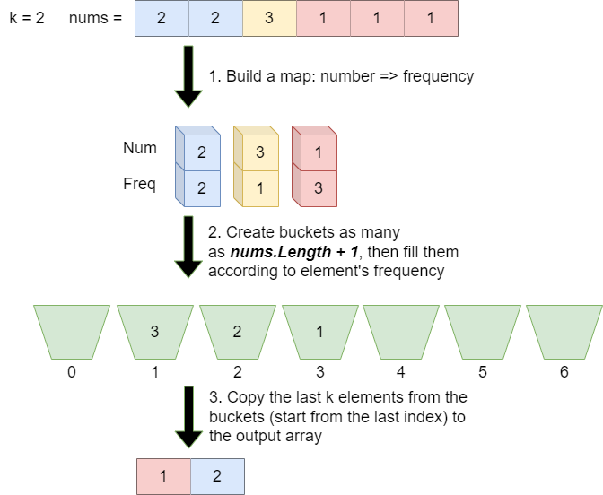

  1. create a dictionary to store the frequency of each element in the array
  2. create a list of lists (buckets) with the `length of the array + 1`
     - index will be the frequency of the element and the value will be the elements with that frequency
  3. loop through the dictionary and append the key to the bucket with the index of the value (frequency)
  4. loop through the buckets from the end (max frequency) and append the elements to the result list until the length of the result list is `k` -> `O(n)`
  5. return the result list

```py
def top_k_frequent(nums, k):
    res = []
    count = {}
    freq_buckets = [[] for _ in range(len(nums)+1)]

    for num in nums:
        count[num] = count.get(num, 0) + 1

    for n, c in count.items():
        freq_buckets[c].append(n)

    for i in range(len(freq_buckets)-1, -1, -1):
        if len(res) == k:
            break
        if freq_buckets[i]:
            res.extend(buckets[i])

    return res
```

---

### Top K Frequent Words

Given an array of strings `words` and an integer `k`, return the `k` most frequent strings.
Return the answer **sorted** by the **frequency** from highest to lowest. Sort the words with the same frequency by their **lexicographical order**.

- EX: `words = ["i", "love", "leetcode", "i", "love", "coding"], k = 2` --> `["i", "love"]`

  - Explanation: "i" and "love" are the two most frequent words.
    Note that "i" comes before "love" due to a lower alphabetical order.

```py
def top_k_frequent(words, k):
    res = []
    freq = {}
    buckets = [[] for _ in range(len(words)+1)]

    for word in words:
        freq[word] = freq.get(word, 0) + 1

    for word, count in freq.items():
        buckets[count].append(word)

    for i in range(len(buckets)-1, -1, -1):
        if len(res) == k:
            break
        if buckets[i]:
            buckets[i].sort()
            res.extend(buckets[i])

    return res
```

---

### Reorganize String

Given a string `s`, rearrange the characters of `s` so that any two adjacent characters are not the same.
Return any possible rearrangement of `s` or return `""` if not possible.

- EX: `s = "aab"` --> `"aba"`
  - Explanation: `aab` --> `aba`
- EX: `s = "aaab"` --> `""`
- EX: `s = "aaabc"` --> `"abaca"`

- Explanation:
  - To solve this we need to use the most frequent characters first and then the less frequent characters
    - we can use a dictionary to store the frequency of each character
    - we can use a maxHeap to store the characters with the most frequency
  - on each iteration we will pop the top element of the maxHeap and append it to the result string
    - if the last element of the result string is the same as the current element, pop the next element and append it to the result string
    - if the maxHeap is empty and the last element of the result string is the same as the current element, this means that we can't reorganize the string so we return `""`
- Steps:
  1. create a dictionary to store the frequency of each character in the string -> `O(n)`
  2. push all the elements in the dictionary to the maxHeap -> `O(n)`
  3. pop the top element of the maxHeap and append it to the result string
     - if the last element of the result string is the same as the current element, pop the next element and append it to the result string
     - if the maxHeap is empty and the last element of the result string is the same as the current element, return `""`
  4. return the result string

```py
def reorganize_string(s):
    maxHeap = []
    freq = {}

    # create a dictionary to store the frequency of each character in the string
    for char in s:
        freq[char] = freq.get(char, 0) + 1
    # push all the elements in the dictionary to the maxHeap by their frequency in negative form (because we want to pop the elements with the highest frequency)
    for key, val in freq.items():
        heapq.heappush(maxHeap, [-val, key]) # python heapify pairs by the first element

    res = ''
    prev = None
    # pop the top element of the maxHeap and append it to the result string
    while maxHeap or prev:
        # 1. pop the top element of the maxHeap + append it to the result + decrement the frequency by 1 to reach 0
        freq, char = heapq.heappop(maxHeap)
        res += char
        freq += 1

        # 2. if prev is not None, we will push it to the maxHeap
        if prev:
            heapq.heappush(maxHeap, prev)
            prev = None

        # 3. if the frequency of the popped element not 0, we will store the popped element as prev
        if freq != 0:
            prev = [freq, char]

        # 4. if the maxHeap is empty and the last element of the result string is the same as the current element, return ""
        if prev and not maxHeap:
            return ''

    return res
```

---

### Find Median from Data Stream

The median is the middle value in an ordered integer list. If the size of the list is even, there is no middle value and the median is the mean of the two middle values.

- EX: `[2,3,4]` --> `3`
- EX: `[2,3]` --> `2.5`
  - Explanation: `(2 + 3) / 2 = 2.5`
- EX: `[2,3,4,5]` --> `3.5`

  - Explanation: `(3 + 4) / 2 = 3.5`

- Design a data structure that supports the following two operations:

  - `addNum(int num)` - Add a integer number from the data stream to the data structure.
  - `findMedian()` - Return the median of all elements so far.

- **Solution:**

  1. The idea here that we need the data to be sorted to get the middle value (median). So we need to insert elements **in order**, we'll use 2 heaps:
     
     - we can use a `minHeap` to store the larger half of the data
     - we can use a `maxHeap` to store the smaller half of the data
       - remember to use negative values to make it a maxHeap in python
     - we can use a variable to store the median
  2. on each `addNum()` call, we will add the new element to the `minHeap` if it's larger than the median, otherwise we will add it to the `maxHeap`
     

     - if the size of the `minHeap` is larger than the `maxHeap` by 2, we will pop the top element of the `minHeap` and push it to the `maxHeap`
     - if the size of the `maxHeap` is larger than the `minHeap` by 2, we will pop the top element of the `maxHeap` and push it to the `minHeap`

  3. on each `findMedian()` call, we will check the size of the `minHeap` and `maxHeap`: (if one heap is larger than the other by 1, we know that we have **odd** number of elements, so the median will be the top element of the larger heap)
     
     - if the size of the `minHeap` is equal to the `maxHeap`, we will calculate the median by getting the average of the top elements of the `minHeap` and `maxHeap`
     - if the size of the `minHeap` is larger than the `maxHeap`, the median will be the top element of the `minHeap`
     - if the size of the `maxHeap` is larger than the `minHeap`, the median will be the top element of the `maxHeap`

```py
class MedianFinder:

    def __init__(self):
        """
        initialize your data structure here.
        """
        # two heaps, large, small, minheap, maxheap
        # heaps should be equal size
        self.small, self.large = [], []  # maxHeap, minHeap (python default)


    def addNum(self, num: int) -> None:
        if self.large and num > self.large[0]:
            heapq.heappush(self.large, num)
        else:
            heapq.heappush(self.small, -1 * num) # negative the num to make it a maxHeap

        # uneven heaps size ?
        if len(self.small) > len(self.large) + 1:
            val = -1 * heapq.heappop(self.small)
            heapq.heappush(self.large, val)
        if len(self.large) > len(self.small) + 1:
            val = heapq.heappop(self.large)
            heapq.heappush(self.small, -1 * val)

    def findMedian(self) -> float:
        # if odd number of elements:
        if len(self.small) > len(self.large):
            return -1 * self.small[0]
        elif len(self.large) > len(self.small):
            return self.large[0]
        # if even number of elements:
        return (-1 * self.small[0] + self.large[0]) / 2
```

---

## Linked Lists

- **Tips:**

  - To check if linked list is empty --> `if not head:`
  - To check if linked list has only one node --> `if head and not head.next:`
  - To remove the first node --> `head = head.next`
  - To remove the last node --> `prev.next = None`
    1. create 2 variables: `prev` and `curr`
    2. `prev` starts at the head, `curr` starts at the head's next node
    3. if `curr` is the last node, `prev.next` will be `None` --> `prev.next = None`
    4. then `prev` will be `curr` --> `prev = curr` --> `prev` is now the last node

- **Code reuse in Linked Lists (Interview discussion):**
  - rather than creating a new function to (`insert` / `remove` / `get`) the first/last node, we can reuse the function to remove the last node by passing in the head/tail index as the argument
    

### Singly Linked List

#### Reverse a Linked List

Write a function that accepts a linked list and reverses it in place.

- EX: `1 -> 2 -> 3 -> 4 -> 5` --> `5 -> 4 -> 3 -> 2 -> 1`
  is `None`

- **Steps**:
  - It's done using 3 pointers: `prev`, `curr`, and `next`
    

```py
def reverse_linked_list(head):
    prev = None # Initialize previous pointer to None
    curr = head
    nextNode = head.next

    # Loop until current pointer is None
    while curr:
        curr.next = prev
        # Shift the previous pointer to the current node
        prev = curr
        # Shift the current pointer to the next node
        curr = nextNode
        # Shift the next pointer to the next node of the next node
        if nextNode:
            nextNode = nextNode.next
    # Return the previous node, which is the new head of the reversed list
    return prev
```

---

#### Middle Point of a Linked List

Write a function that accepts a linked list and returns the middle node in the list. If the list has an even number of elements, return the node at the end of the first half of the list. **Do not use a counter variable**, **do not retrieve the size of the list**, and **only iterate through the list one time**.

- EX: `1 -> 2 -> 3 -> 4 -> 5` --> `3`
- **Steps:**
  
  1. create 2 variables: `slow` and `fast`
  2. `slow` and `fast` starts at the head
  3. `slow` moves **1 step** at a time, `fast` moves **2 steps** at a time
  4. when `fast` reaches the end of the list, `slow` will be at the middle node

```py
def middle_point(head):
    slow = head
    fast = head

    # check if there're 2 next nodes ahead of `fast`
    while fast and fast.next:
        slow = slow.next
        fast = fast.next.next
    return slow
```

---

#### Circular Linked List

Write a function that accepts a linked list and returns true if the linked list contains a **circular reference**.

> Circular Linked List is a linked list where a node's next point actually points back to a previous node in the list.

- EX: `1 -> 2 -> 3 -> 4 -> 5` --> `5.next = 2` --> `True`
- **Steps:**
  
  1. create 2 variables: `slow` and `fast`
  2. `slow` and `fast` starts at the head
  3. `slow` moves **1 step** at a time, `fast` moves **2 steps** at a time
  4. if `slow` and `fast` ever meet, then there's a circular reference

```py
def circular_linked_list(head):
    slow = head
    fast = head

    # check if there're 2 next nodes ahead of `fast`
    while fast and fast.next:
        slow = slow.next
        fast = fast.next.next
        # if `slow` and `fast` ever meet, then there's a circular reference
        if slow == fast:
            return True
    return False
```

---

#### From Last

Write a function that accepts a linked list and a number `n`. The function should return the node `n` spaces from the last node in the list. Do not call the `size` method of the linked list. Assume that `n` will always be less than the length of the list.

- EX: `1 -> 2 -> 3 -> 4 -> 5`, `n = 2` --> `3`
- **Steps:**
  1. create 2 variables: `slow` and `fast`
  2. `slow` and `fast` starts at the head
  3. `fast` moves `n` steps ahead of `slow`, so that `fast` is `n` spaces ahead of `slow`
  4. when `fast` reaches the end of the list, `slow` will be at the node `n` spaces from the last node

```py
def from_last(head, n):
    slow = head
    fast = head

    # move `fast` `n` steps ahead of `slow`
    while n > 0:
        fast = fast.next
        n -= 1

    # move `slow` and `fast` at the same pace
    while fast.next:
        slow = slow.next
        fast = fast.next
    return slow

# -------------------------------------------------
# Remove nth node from the end of a linked list (same Idea)
# Create two pointers, slow and fast
def removeNthFromEnd(head, n):
    slow = fast = head
    # Move fast pointer n nodes ahead
    for i in range(n):
        fast = fast.next
    # If fast pointer is None, remove the head
    if not fast:
        return head.next
    # Move both pointers until fast pointer reaches the end
    while fast.next:
        slow = slow.next
        fast = fast.next
    # Remove the nth node by updating previous node's nex   pointer
    slow.next = slow.next.next
    return head
```

---

#### Merge Two Sorted Linked Lists

Write a function that accepts two sorted linked lists and returns a new linked list containing the combined sorted values from both lists.

- EX:
  

- **Steps:**
  1. create a dummy node and a pointer `curr` to the dummy node.
     - to avoid edge cases like `l1` or `l2` is empty
  2. iterate over the two input lists and compare the values of the current nodes pointed to by `l1` and `l2`.
     - You append the node with the smaller value to the `curr.next` pointer
     - then advance the pointer of the list from which the smaller value was appended.
  3. If either `l1` or `l2` becomes None, you append the remaining nodes of the other list to the curr.next pointer.
  4. Finally, you return the `head` of the merged sorted list

```py
def merge_sorted_lists(l1, l2):
    # create a dummy node to avoid edge case of inserting to empty list
    dummy = ListNode(0)
    # create a pointer to the dummy node
    curr = dummy

    # while both lists are not empty
    while l1 and l2:
        # if l1's value is smaller than l2's value
        if l1.value < l2.value:
            # set curr's next node to l1
            curr.next = l1
            # move l1 to the next node
            l1 = l1.next
        # if l2's value is smaller than l1's value
        else:
            # set curr's next node to l2
            curr.next = l2
            # move l2 to the next node
            l2 = l2.next
        # move curr to the next node
        curr = curr.next

    # if l1 is not empty after the while loop
    if l1:
        # set curr's next node to l1 (the rest of l1)
        curr.next = l1
    # if l2 is not empty after the while loop
    if l2:
        # set curr's next node to l2 (the rest of l2)
        curr.next = l2

    # return the next node of the dummy node
    return dummy.next
```

---

#### Merge k Sorted Lists

Merge `k` sorted linked lists and return it as one sorted list. Analyze and describe its complexity.

- EX:
  

- **Method 1:** using `merge_sorted_lists` function above

  - **Time Complexity:** `O(nk log(n))`
  - **Space Complexity:** `O(nk)`
  - **Steps:**
    1. create an empty list to store the merged lists
    2. merge the lists in a pairwise fashion until only one list remains
    3. return the first list in the merged_lists

  ```py
  def mergeKLists(self, lists: List[ListNode]) -> ListNode:
      # if lists is empty
      if not lists or len(lists) == 0:
          return None

      # create an empty list to store the merged lists
      merged_lists = []

      # merge the lists in a pairwise fashion until only one list remains
      for lst in lists:
          merged_lists = self.merge_sorted_lists(merged_lists, lst)
      # Or: use an approach like merge sort to merge the lists in a pairwise fashion
      # while len(lists) > 1:
      #     # create an empty list to store the merged lists
      #     merged_lists = []

      #     # merge the lists in a pairwise fashion until only one list remains
      #     for i in range(0, len(lists), 2):
      #         l1 = lists[i]
      #         l2 = lists[i+1] if (i+1) < len(lists) else None
      #         merged_lists.append(self.merge_sorted_lists(l1, l2))
      #     lists = merged_lists


      # return the first list in the merged_lists
      return merged_lists

  def merge_sorted_lists(self, l1: ListNode, l2: ListNode) -> ListNode:
      dummy = ListNode(0)
      curr = dummy
      while l1 and l2:
          if l1.val < l2.val:
              curr.next = l1
              l1 = l1.next
          else:
              curr.next = l2
              l2 = l2.next
          curr = curr.next
      curr.next = l1 or l2
      return [dummy.next]
  ```

- Another solution using **Priority Queue** (Min Heap)

  - **Time Complexity:** `O(nk log(k))`
  - **Space Complexity:** `O(k)`
  - **Steps:**
    1. create a priority queue and add the head of each list to the queue
    2. create a dummy node and a pointer `curr` to the dummy node
    3. while the queue is not empty
       - pop the node with the smallest value from the queue
       - append the node to the curr.next pointer
       - if the popped node has a next node, add it to the queue
       - advance the curr pointer to the next node
    4. return the next node of the dummy node

  ```py
  def mergeKLists(self, lists: List[ListNode]) -> ListNode:
      # modify the ListNode class to support comparison operators
      ListNode.__eq__ = lambda self, other: self.val == other.val
      ListNode.__lt__ = lambda self, other: self.val < other.val

      h = []
      head = tail = ListNode(0)
      for i in lists:
          if i:
              heapq.heappush(h, (i.val, i))

      while h:
          node = heapq.heappop(h)[1]
          tail.next = node
          tail = tail.next
          if node.next:
              heapq.heappush(h, (node.next.val, node.next))

      return head.next
  ```

---

#### Reorder List

Given a singly linked list `L: L0 -> L1 -> ... -> Ln-1 -> Ln`, reorder it to: `L0 -> Ln -> L1 -> Ln-1 -> L2 -> Ln-2 -> ...`


- **Steps:**
  1. Split the list into two halves
     - find the middle of the list using the **slow and fast pointer** technique
  2. Reverse the second half of the list using the **reverse linked list** technique
  3. Merge the two halves of the list by alternating the nodes
     
     - this is done by breaking the links between the nodes of the two lists and inserting the second list between the nodes of the first list
     - we do so by storing a temporary reference to the next node of the first list and then setting the next node of the first list to the current node of the second list
     - > **Note:** the first half of the list is always longer than or equal to the second half of the list

```py
def reorder_list(head):
    # 1. find the middle of the list
    slow = fast = head
    while fast and fast.next:
        slow = slow.next
        fast = fast.next.next

    # 2. disconnect 2 lists
    head2 = slow.next
    slow.next = None # break the link between the first and second half

    # 3. Reverse the second half of the list
    prev = None
    curr = head2
    while curr:
        nxt = curr.next
        curr.next = prev
        prev = curr
        curr = nxt
    # Now, `head2` will be set to the head of the reversed second half of the list, `prev` will be set to the tail of the reversed second half of the list which is now the new head of the second half of the list

    # 4. Merge the two lists (alternating the nodes)
    head1 = head
    head2 = prev
    while head2:
      # TEMP
      head1_next = head1.next
      head2_next = head2.next

      head1.next = head2
      head2.next = head1_next

      # update pointers
      head1 = head1_next
      head2 = head2_next
```

---

### Doubly Linked List

#### Design Browser History

You have a browser of one tab where you start on the homepage and you can visit another url, get back in the history number of steps or move forward in the history number of steps.

Implement the `BrowserHistory` class:

- `BrowserHistory(string homepage)` Initializes the object with the homepage of the browser.
- `void visit(string url)` Visits `url` from the current page. It clears up all the forward history.
- `string back(int steps)` Move `steps` back in history. If you can only return `x` steps in the history and `steps > x`, you will return only `x` steps. Return the current `url` after moving back in history **at most** `steps`.
- `string forward(int steps)` Move `steps` forward in history. If you can only forward `x` steps in the history and `steps > x`, you will forward only `x` steps. Return the current `url` after forwarding in history **at most** `steps`.
- **Solution 1: Doubly linked list**

  - we can use a pointer to store the current page
  - we can use a pointer to store the last page
  - we can use a pointer to store the next page
  - we can use a variable to store the number of pages in the history
  - we can use a variable to store the number of pages in the future
  - **Time Complexity:**
    - `visit`: `O(1)`
    - `back`: `O(n)`
    - `forward`: `O(n)`
  - **Space Complexity:** `O(n)`

  ```py
  class Node:
      def __init__(self, val, prev=None, next=None):
          self.val = val
          self.prev = prev
          self.next = next

  class BrowserHistory:
      def __init__(self, homepage: str):
          self.cur = Node(homepage)

      def visit(self, url: str) -> None:
          # make current page point to the new page and make the new page point back to the current page
          self.cur.next = Node(url, self.cur)
          # update the current page
          self.cur = self.cur.next

      def back(self, steps: int) -> str:
          # if the number of steps is greater than the number of pages in the history, we will move back to the first page
          # use cur.prev to make sure that we don't pass the first page
          while steps > 0 and self.cur.prev:
              self.cur = self.cur.prev
              steps -= 1
          return self.cur.val

      def forward(self, steps: int) -> str:
          # if the number of steps is greater than the number of pages in the future, we will move forward to the last page
          # use cur.next to make sure that we don't pass the last page
          while steps > 0 and self.cur.next:
              self.cur = self.cur.next
              steps -= 1
          return self.cur.val
  ```

- **Solution 2: Array (Better ✅)**

  ```py
  class BrowserHistory:
      def __init__(self, homepage: str):
          self.history = [homepage]
          self.curIdx = 0

      def visit(self, url: str) -> None:
          # if we are not at the end of the history, we will remove all the pages after the current page
          if self.curIdx < len(self.history) - 1:
              self.history = self.history[:self.curIdx+1]
          # append the new page to the history
          self.history.append(url)
          # update the current page
          self.curIdx += 1

      def back(self, steps: int) -> str:
          # if the number of steps is greater than the number of pages in the history, we will move back to the first page
          self.curIdx = max(self.curIdx - steps, 0)
          return self.history[self.curIdx]

      def forward(self, steps: int) -> str:
          # if the number of steps is greater than the number of pages in the future, we will move forward to the last page
          self.curIdx = min(self.curIdx + steps, len(self.history) - 1)
          return self.history[self.curIdx]
  ```

---

## Hash Tables

### Two sum

Given an array of integers `nums` and an integer `target`, return indices of the two numbers such that they add up to `target`.

- You may assume that each input would have **exactly one solution**, and you may not use the same element twice.

- EX:

  - Input: `nums = [2,7,11,15], target = 9`
  - Output: `[0,1]`
  - Output: Because `nums[0] + nums[1] == 9`, we return `[0, 1]`.

- Explanation:
  - if we know that the array has 2 numbers that add up to the target, we can find the second number by subtracting the first number from the target
  - we can use a dictionary to store the number and its index and then iterate through the array and check if the complement is in the dictionary

```py
def twoSum(self, nums: List[int], target: int) -> List[int]:
    # create a dictionary to store the number and its index
    num_index = {}

    # iterate through the nums
    for i, num in enumerate(nums):
        complement = target - num
        # if the complement is in the dictionary, return the indices
        if complement in num_index:
            return [num_index[complement], i]
        # if the complement is not in the dictionary, add the number and its index to the dictionary
        num_index[num] = i
```

---

### Valid Anagram

An anagram is a word or phrase formed by rearranging the letters of a different word or phrase, typically using all the original letters exactly once.

- EX: `cinema` and `iceman` are anagrams of each other.

```py
# Time: O(s + t) | Space: O(s + t)
def is_anagram(s, t):
    if len (s) != len(t):
        return False

    countS, countT = {}, {}
    for i in range(len(s)):
        countS[s[i]] = 1 + countS.get(s[i], 0)
        countT[t[i]] = 1 + countT.get(t[i], 0)
    for c in countS:
        if countS[c] != countT.get(c, 0):
            return False
    return True

# Solution: 2 (using O(1) memory)
# Time: O(n log(n)) | Space: O(1)
def is_anagram(s, t):
    return sorted(s) == sorted(t)
```

---

### Group Anagrams

Given an array of strings `strs`, group the anagrams together. You can return the answer in **any order**.

- EX:

  - Input: `strs = ["eat","tea","tan","ate","nat","bat"]`
  - Output: `[["bat"],["nat","tan"],["ate","eat","tea"]]`
    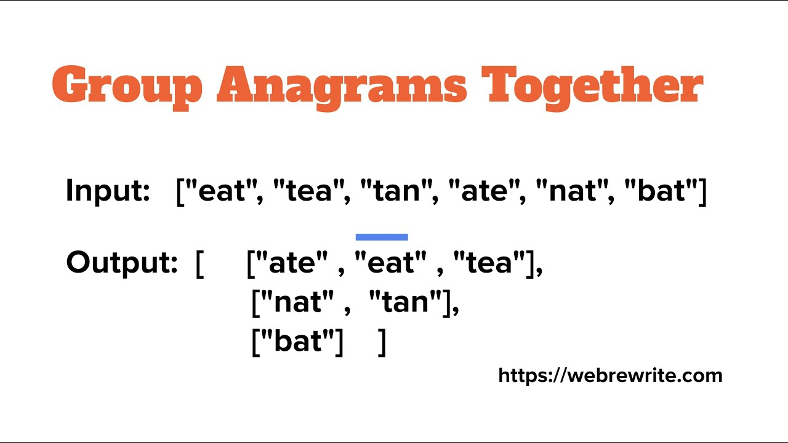

- **Solution 1: O(n log(n))**

  - we can use a dictionary to store the sorted string as the key and the list of anagrams as the value
  - we can iterate through the array and sort each string and then add it to the dictionary

  ```py
  def group_anagrams(strs):
      # key: sorted string | value: list of anagrams
      anagrams = {}

      for s in strs:
          sorted_s = ''.join(sorted(s)) # joining because sorted returns an array
          if sorted_s not in anagrams:
              anagrams[sorted_s] = [s]
          else:
              anagrams[sorted_s].append(s)

      return anagrams.values()
  ```

- **Solution 2: O(n)**

  - we can use a dictionary to store the (count of each characters in a string) as the key and the list of anagrams as the value
  - we can iterate through the array and count the frequency of each character and then add it to the dictionary
  - Time complexity: `O(n.m.26)` -> `O(n.m)` where:
    - `n` is the length of the array
    - `m` is the length of the longest string in the array

  ```py
  def group_anagrams(strs):
      # key: charCount | value: list of anagrams
      anagrams = {}

      for s in strs:
          # create an array to store the frequency of each character in the string
          count = [0] * 26 # a ... z
          for c in s:
              idx = ord(c) - ord('a') # a = 80 - 80 = 0, b = 81 - 80 = 1, ...
              count[idx] += 1

          # convert the array to a tuple to use it as a key in the dictionary
          key = tuple(count)

          if key not in anagrams:
              anagrams[key] = [s]
          else:
              anagrams[key].append(s)

      return anagrams.values()
  ```

---

### Unique Number of Occurrences

Given an array of integers arr, return true if the number of occurrences of each value in the array is unique or false otherwise.

- EX:

  - Input: `arr = [1,2,2,1,1,3]`
  - Output: `true`
  - Explanation: The value `1` has 3 occurrences, 2 and 3 both have 2 occurrences, so the answer is `true`.

```py
def uniqueOccurrences(arr):
  # Count the number of occurrences of each value
  count = {}
  for num in arr:
      count[num] = count.get(num, 0) + 1

  # Check if the number of occurrences is unique
  occurrences = set(count.values())
  return len(occurrences) == len(count)
```

---

### Contains Duplicate II

Given an integer array `nums` and an integer `k`, return `true` if there are two distinct indices `i` and `j` in the array such that `nums[i] == nums[j]` and `abs(i - j) <= k`.

- EX:

  - Input: `nums = [1,2,3,1], k = 3`
  - Output: `true`

- **Solution 1:** using HashMap

  ```py
  def containsNearbyDuplicate(nums, k):
      num_index = {} # num: idx

      for i, num in enumerate(nums):
          if num in num_index and i - num_index[num] <= k:
              return True
          num_index[num] = i

      return False
  ```

- **Solution 2:** sliding window

  ```py
  def containsNearbyDuplicate(nums, k):
      window = set() # window must has length <= k
      l = 0
      for r in range(len(nums)):
          if nums[r] in window:
              return True
          window.add(nums[r])

          # shrink the window if invalid-window
          if (r - l + 1) > k:
              window.remove(nums[l])
              l += 1

      return False
  ```

---

### Missing Number

Given an array `nums` containing `n` distinct numbers in the range `[0, n]`, return the only number in the range that is missing from the array.

- Follow up: Could you implement a solution using only `O(1)` extra space complexity and `O(n)` runtime complexity?

- EX:

  - Input: `nums = [3,0,1]`
  - Output: `2`
  - Explanation: `n = 3` since there are `3` numbers, so all numbers are in the range `[0,3]`. `2` is the missing number in the range since it does not appear in `nums`.

- **Solution 1:** using HashMap -> `O(n)` time and `O(n)` space

  ```py
  def missingNumber(nums):
      # Create a dictionary to store the presence of each number
      presence = {}
      for num in nums:
          presence[num] = True

      # Check each number in the range [0, n]
      n = len(nums)
      for i in range(n+1):
          if i not in presence:
              return i
  ```

- **Solution 2:** using `sum` function -> `O(n)` time and `O(1)` space

  ```py
  def missingNumber(nums):
    # Calculate the expected sum of the range [0, n]
    n = len(nums)
    expected_sum = n * (n + 1) // 2

    # Calculate the actual sum of the elements in the array
    actual_sum = sum(nums)

    # Return the difference between the expected sum and the actual sum
    return expected_sum - actual_sum
  ```

---

### Find the Duplicate Number

Given an array of integers `nums` containing `n + 1` integers where each integer is in the range `[1, n]` inclusive.

There is only **one repeated number** in `nums`, return this repeated number.

- You must solve the problem **without** modifying the array `nums` and uses only constant extra space.

- EX:

  - Input: `nums = [1,3,4,2,2]`
  - Output: `2`

- **Solution 1:** using HashMap **(not what the problem wants)** -> `O(n)` time and `O(n)` space

  ```py
  def findDuplicate(nums):
      # Create a dictionary to store the presence of each number
      presence = {}
      for num in nums:
          if num in presence:
              return num
          presence[num] = True
  ```

- **Solution 2:** using **Floyd's Cycle Detection** -> `O(n)` time and `O(1)` space

  - To solve this problem without using space, we can use Floyd's Cycle Detection algorithm. This algorithm is used to detect cycles in a `linked list`.
    - It works by using two pointers, a `slow` pointer and a `fast` pointer. The `slow` pointer moves one step at a time, while the `fast` pointer moves two steps at a time.
    - If the two pointers ever meet, it means that there is a cycle in the linked list. Otherwise, if the `fast` pointer reaches the end of the linked list, it means that there is no cycle in the linked list.
  - **Explanation**
    1. We need to find the **intersection point** of the two runners, because it is the duplicate number that we are looking for.
       
       - We start both runners at the beginning of the linked list and keep moving them until they meet. The fast runner will move two steps at a time, while the slow runner will move one step at a time.
    2. Once the two runners meet, we know that there is a cycle in the linked list. We then need to find the "entrance" to the cycle, which is the duplicate number that we are looking for.
       
       - We start a new pointer at the beginning of the linked list and move it one step at a time. We also move the slow runner one step at a time. When the two runners meet, we have found the "entrance" to the cycle, which is the duplicate number that we are looking for.

  ```py
  def findDuplicate(nums):
      # Find the intersection point of the two runners
      slow = fast = 0
      while True:
          slow = nums[slow] # move 1 step
          fast = nums[nums[fast]] # move 2 steps
          if slow == fast:
              break # found the intersection point

      # Find the "entrance" to the cycle
      slow2 = 0
      while slow2 != fast:
          slow2 = nums[slow2] # move 1 step
          fast = nums[fast] # move 1 step

      return slow2
  ```

---

### Verifying an Alien Dictionary

In an alien language, surprisingly they also use English lowercase letters, but possibly in a different order. The order of the alphabet is some permutation of lowercase letters.

Given a sequence of `words` written in the alien language, and the `order` of the alphabet, return `true` if and only if the given `words` are sorted lexicographicaly in this alien language.

- EX:

  - Input: `words = ["hello","leetcode"], order = "hlabcdefgijkmnopqrstuvwxyz"`
  - Output: `true`
  - Explanation: As 'h' comes before 'l' in this language, then the sequence is sorted.

- Explanation:
  - We can use a dictionary to store the order of each character in the alien language
  - Then we can iterate through the words and compare each pair of adjacent words
    - If the first word is a substring of the second word (`len(word1)` less than `len(word2)`), then the words are sorted
    - If the first word is lexicographically greater than the second word, then the words are not sorted
  - Time complexity: `O(n)` where `n` is the total number of characters in all the words
  - Space complexity: `O(1)`

```py
def isAlienSorted(words, order):
    # Create a dictionary to store the order of each character in the alien language
    order_index = {c: i for i, c in enumerate(order)}

    # Iterate through the words and compare each pair words to check if they're in-order
    for i in range(len(words) - 1):
        w1 = words[i]
        w2 = words[i+1]

        # looping through the characters of the first word because the first word is a substring of the second word
        for j in range(len(w1)):
            # If we reached the end of word2 but not word1, then the words are not sorted
            if j == len(w2):
                return False
            # If the first word is lexicographically greater than the second word, then the words are not sorted
            if w1[j] != w2[j]:
                # check order index for each character
                if order_index[w1[j]] > order_index[w2[j]]:
                    return False
                break # because we found the different character, and it's valid

    return True
```

---

### Hand of Straights

Alice has a `hand` of cards, given as an array of integers. Now she wants to rearrange the cards into groups so that each group is size `W`, and consists of `W` **consecutive** cards. Return `true` if and only if she can.

- EX:

  - Input: `hand = [1,2,3,6,2,3,4,7,8], W = 3`
  - Output: `true`
  - Explanation: Alice's hand can be rearranged as `[1,2,3],[2,3,4],[6,7,8]`

- Explanation:

  - we can be **greedy** and look for the minimum value available each time and start a group from there

    - because we know that the minimum value will be the start of a group -> `[1, 2, 3]` and we can't have `1` again in the next group because it's already used
      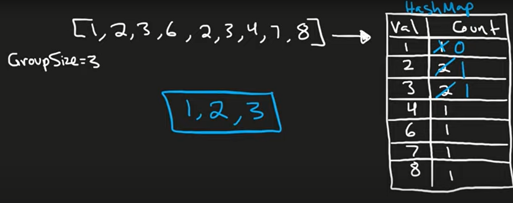

    - we will use a `minHeap` for this to get the minimum value in `O(1)` time instead of getting the minimum of `freq.values()` each time in `O(n)` time
      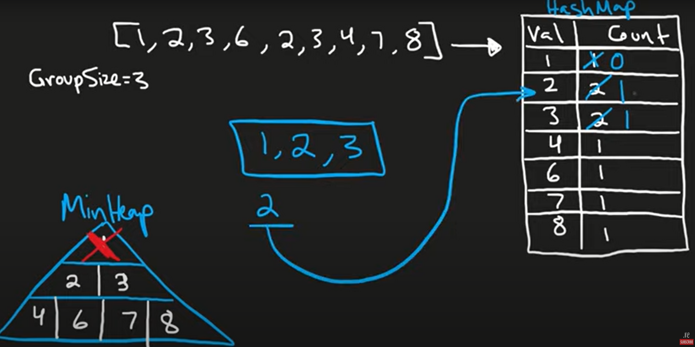

  - We can use a dictionary to store the frequency of each card
  - Then we can **sort** the hand and iterate through the hand
    - If the current card is not in the dictionary, continue
    - If the current card is in the dictionary, iterate through the next `W` cards, starting from the current card because the hand is sorted and we want to check if the next `W` cards are consecutive -> `[card, card+1, card+2, ..., card+W-1]` -> `[1, 2, 3], [2, 3, 4], [3, 4, 5], ...`
      - If the card is not in the dictionary, return `False`
      - If the card is in the dictionary, decrement its frequency
      - If the card's frequency is `0`, remove it from the dictionary
  - If the dictionary is empty, return `True`

```py
def isNStraightHand(hand, groupSize):
    # if the hand is not divisible by the groupSize
    if len(hand) % groupSize != 0:
        return False

    # create a dictionary to store the frequency of each card
    freq = {}
    for card in hand:
        freq[card] = freq.get(card, 0) + 1

    # use a minHeap to get the minimum value in O(1) time
    minHeap = list(freq.keys())
    heapq.heapify(minHeap)

    while minHeap:
        # get the minimum value
        first = minHeap[0]

        for i in range(first, first + groupSize):
            # if the card is not in the dictionary, return False
            if i not in freq:
                return False
            # if the card is in the dictionary, decrement its frequency
            freq[i] -= 1
            # if the card's frequency is 0, remove it from the dictionary
            if freq[i] == 0:
                if i != first:
                    return False
                heapq.heappop(minHeap)

    return True
```

- Another solution: using a sorted array instead of a minHeap **(Better ✅)**

  ```py
  def isNStraightHand(self, hand: List[int], groupSize: int) -> bool:
      # if the hand is not dividable by the groupSize
      if len(hand) % groupSize != 0:
          return False

      # create a dictionary to store the frequency of each card
      freq = {}
      for card in hand:
          freq[card] = freq.get(card, 0) + 1

      # sort the hand
      hand.sort()

      # iterate through the hand
      for card in hand:
          # if the card is not in the dictionary, continue
          if card not in freq:
              continue

          # iterate through the next `groupSize` cards, starting from the current card because the hand is sorted and we want to check if the next `groupSize` cards are consecutive -> [card, card+1, card+2, ..., card+groupSize-1] -> [1, 2, 3, ..., groupSize], [2, 3, 4, ..., groupSize+1], [3, 4, 5, ..., groupSize+2], ...
          for i in range(card, card + groupSize):
              # if the card is not in the dictionary, return False
              if i not in freq:
                  return False
              # if the card is in the dictionary, decrement its frequency
              freq[i] -= 1
              # if the card's frequency is 0, remove it from the dictionary
              if freq[i] == 0:
                  del freq[i]

      # if the dictionary is empty, return True
      return len(freq) == 0
  ```

---

### 4Sum II

Given four lists `A`, `B`, `C`, `D` of integer values, compute how many tuples `(i, j, k, l)` there are such that `A[i] + B[j] + C[k] + D[l]` is zero.

- Ex: `A = [ 1, 2], B = [-2,-1], C = [-1, 2], D = [ 0, 2]`

  - Output: `2`
  - Explanation: The two tuples are:
    1. `(0, 0, 0, 1)` -> `A[0] + B[0] + C[0] + D[1] = 1 + (-2) + (-1) + 2 = 0`
    2. `(1, 1, 0, 0)` -> `A[1] + B[1] + C[0] + D[0] = 2 + (-1) + (-1) + 0 = 0`

- **Solution 1:** using a dictionary -> `O(n^2)` time and `O(n^2)` space

  ```py
  def fourSumCount(A, B, C, D):
      # create a dictionary to store the sum of each pair of numbers in A and B
      sumAB = {}
      for a in A:
          for b in B:
              sumAB[a+b] = sumAB.get(a+b, 0) + 1

      # create a dictionary to store the sum of each pair of numbers in C and D
      sumCD = {}
      for c in C:
          for d in D:
              sumCD[c+d] = sumCD.get(c+d, 0) + 1

      # iterate through the keys of the first dictionary
      count = 0
      for sum1 in sumAB:
          # if the complement is in the second dictionary, add the product of the frequencies to the count
          if -sum1 in sumCD:
              count += sumAB[sum1] * sumCD[-sum1]

      return count
  ```

- Solution 2: using a dictionary **(Better ✅)** -> `O(n^2)` time and `O(n)` space

  ```py
  def fourSumCount(A, B, C, D):
      # create a dictionary to store the sum of each pair of numbers in A and B
      sumAB = {}
      for a in A:
          for b in B:
              sumAB[a+b] = sumAB.get(a+b, 0) + 1

      # iterate through the keys of the first dictionary
      count = 0
      for c in C:
          for d in D:
              # if the complement is in the first dictionary, add the product of the frequencies to the count
              if -(c+d) in sumAB:
                  count += sumAB[-(c+d)]

      return count
  ```

---

### Repeated DNA Sequences

The **DNA sequence** is composed of series of nucleotides abbreviated as `'A'`, `'C'`, `'G'`, and `'T'`.

- For example, `"ACGAATTCCG"` is a **DNA sequence**.

Given a **DNA sequence** `s`, return all the **10-letter-long** sequences (substrings) that occur more than once in a DNA molecule. You may return the answer in **any order**.

- Ex: `s = "AAAAACCCCCAAAAACCCCCCAAAAAGGGTTT"`

  - Output: `["AAAAACCCCC", "CCCCCAAAAA"]`
  - Explanation: `"AAAAACCCCC"` appears twice, and `"CCCCCAAAAA"` appears twice.

```py
def findRepeatedDnaSequences(s):
    seen = set()
    repeated = set()
    for i in range(len(s)-9):
        # get the current substring
        cur = s[i:i+10]
        if cur in seen:
            repeated.add(cur)
        seen.add(cur)
```

---

## Trees

- **Trees Tips:**
  - Whenever you see the word **"width"** in any tree question, it's a **Breadth First Search** problem
  - Always ask if the tree is binary search tree (BST) or not, so that you can use the BST properties to solve the problem (e.g. left < root < right)

### General Tree Questions

#### Level Width

Write a function that accepts a root node of a tree and return an array where each element is the width of the tree at each level.

- EX: this tree returns `[1, 3, 2]`
- explanation:

  - To solve this problem, we can use BFS (Breadth-First Search) to traverse the tree level by level. At each level, we can keep track of the indices of the leftmost and rightmost non-null nodes. The width of the level is then calculated as the difference between the indices plus one.

  - We can use a queue to store the nodes that we need to visit. We start by adding the root node to the queue along with its index, which we set to 0. We also initialize two variables, max_width and level_width, to 0. max_width will be used to store the maximum width we have seen so far, and level_width will be used to store the width of the current level.

  - Then, we start the BFS loop. In each iteration of the loop, we first get the number of nodes in the current level by getting the size of the queue. We then loop through all the nodes in the current level and update the leftmost and rightmost indices as necessary. We also add the children of each node to the queue along with their indices, which we calculate based on the indices of their parent node.

  - At the end of each level, we update the max_width variable with the level_width if it is greater than max_width. We then reset the level_width variable to 0 for the next level.

  - Once we have processed all the nodes in the tree, we return the max_width variable as the answer.

- **Steps:** (BFS)

  1. create an array to store the width of each level and initialize the array with `0`
  2. create an array to store the nodes of each level and initialize the array with (the root node and a `'s'` token)
     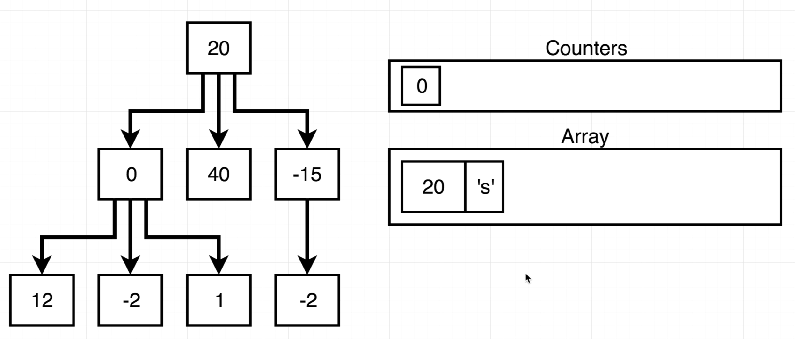
  3. while the nodes-array is not empty
     1. `pop` the first node in the array
        
     2. if the node is a `'s' (reference token)`, it means we've reached the end of the current level
        
        1. add a `'s'` to the end of the array to mark the end of the next level
        2. add `0` to the end of the width array
           
     3. if the node is not a `'s'`, add its children to the end of the array
     4. increment the last element in the width array by `1`
  4. return the width array

  ```sh
          0          # level 1
       /  |   \
     1    2    3     # level 2
    / \
   4   5             # level 3
  ```

```py
def level_width(root):
    # create an array to store the width of each level
    widths = [0]
    # create an array to store the nodes of each level
    # initialize the array with the root node
    nodes = [root, 's']

    # while the nodes-array is not empty (will be empty if it only contains one element which is the 's' token)
    while len(nodes) > 1:
        # pop the first node in the array
        node = nodes.pop(0)

        # if the node is a 's', it means we've reached the end of the current level
        # add a 's' to the end of the array to mark the end of the next level
        if node == 's':
            nodes.append('s')
            widths.append(0)
        # if the node is not a 's', add its children to the end of the array
        else:
            nodes.extend(node.children)
            # increment the width of the current level
            widths[-1] += 1
    return widths
```

---

#### Number of islands

Given a 2D grid map of `'1'`s (land) and `'0'`s (water), count the number of islands. An island is surrounded by water and is formed by connecting adjacent lands horizontally or vertically. You may assume all four edges of the grid are all surrounded by water.


- EX: `numIslands(grid) --> 1`
  

- It can be solved using `BFS`, where we create layers of islands and keep track of the number of layers we have created.
  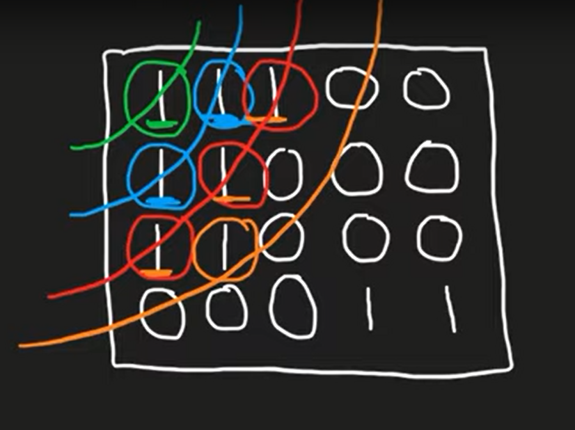

- **Steps:** -> `BFS`
  - loop through the rows of the grid (i) and loop through the columns of the grid (j) and if the current cell is a `'1'`, increment the number of islands by 1 and call the helper function to mark the current island as visited
  - the bfs-helper-function (`mark_island`) will mark the current cell as visited and then recursively call itself on the adjacent cells (up, down, left, right) that are `'1'`s
  - once the helper function is done, we return the number of islands

```py
def numIslands(grid):
    # if the grid is empty, return 0
    if not grid:
        return 0

    # initialize number of islands to 0
    num_islands = 0
    # get dimensions of the grid
    rows, cols = len(grid), len(grid[0])
    # initialize set of visited islands to mark visited positions
    visited = set()

    # Helper BFS function to mark the current island as visited
    def mark_island(r, c):
        if grid[r][c] != '1' or (r, c) in visited:
            return
        # mark the current cell as visited
        visited.add((r, c))
        # recursively call the helper function on the adjacent cells (up, down, left, right) that are '1's
        if r > 0:
            mark_island(r - 1, c)
        if r < rows - 1:
            mark_island(r + 1, c)
        if c > 0:
            mark_island(r, c - 1)
        if c < cols - 1:
            mark_island(r, c + 1)

    for r in range(rows):
        for c in range(cols):
            # if the current cell is a '1', increment the number of islands by 1
            # and call the helper function to mark the current island as visited
            if grid[r][c] == '1' and (r, c) not in visited:
                mark_island(r, c)
                num_islands += 1

    return num_islands
```

---

#### Path Sum

Given the `root` of a binary tree and an integer `targetSum`, return `true` if the tree has a **root-to-leaf** path such that adding up all the values along the path equals `targetSum`.

- Explanation:
  

  - We can use a **Depth-First Search** to traverse the tree and keep track of the current sum of the path from the root to the current node. If we reach a leaf node and the current sum is equal to the target sum, then we return `True`. Otherwise, we return `False`.

- Solution 1: by subtracting the current node's value from the target sum

  ```py
  def hasPathSum(root, targetSum):
      if root is None:
          return False

      # if the root is a leaf node, check if the current sum is equal to the target sum
      if root.left is None and root.right is None:
        return root.val == targetSum

      targetSum -= root.val
      return hasPathSum(root.left, targetSum) or hasPathSum(root.right, targetSum)
  ```

- Solution 2: by adding the current node's value to the current sum

  ```py
  def hasPathSum(root, targetSum):
      def dfs(node, curSum):
          if node is None:
              return False

          curSum += node.val
          # if the root is a leaf node, check if the current sum is equal to the target sum
          if not node.left and not node.right:
              return curSum == targetSum

          return dfs(node.left, curSum) or dfs(node.right, curSum)

      return dfs(root, 0)
  ```

---

#### Symmetric Tree

Given the `root` of a binary tree, check whether it is a mirror of itself (i.e., symmetric around its center).

- Explanation:
  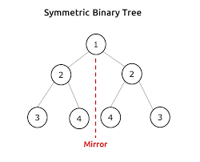

  - We can use a **Depth-First Search** to traverse the tree and check if the left subtree of the root is a mirror of the right subtree of the root.
  - because this is a mirror, we need to check:
    - if the `left` child of the `left` subtree is equal to the `right` child of the `right` subtree
    - and if the `right` child of the `left` subtree is equal to the `left` child of the `right` subtree
  - we will know that the tree is symmetric if the above conditions are true for all nodes in the tree and when we reach `null` nodes

- Time complexity: `O(n)` where `n` is the number of nodes in the tree
- Space complexity: `O(h)` where `h` is the height of the tree (as it's a `BFS` algorithm)

```py
def isSymmetric(root):
    def dfs(left, right):
        # if both nodes are null, return True
        if not left and not right:
            return True
        # if one of the nodes is null, return False
        if not left or not right:
            return False
        # if the values of the nodes are not equal, return False
        if left.val != right.val:
            return False

        return dfs(left.left, right.right) and dfs(left.right, right.left)

    return dfs(root.left, root.right)
```

---

#### Lowest Common Ancestor of a Binary Tree

Given a binary tree, find the lowest common ancestor (LCA) of two given nodes in the tree.

> "The lowest common ancestor is defined between two nodes `p` and `q` as the lowest node in `T` that has both `p` and `q` as descendants (where we allow **a node to be a descendant of itself**)."

- Ex:
  

  - The lowest common ancestor of `p = 6` and `q = 7` is `3`.

- Explanation:
  - We can use a **Depth-First Search** to traverse the tree and check:
    - if the current node is equal to `p` or `q`
    - or if the current node is equal to the lowest common ancestor of `p` and `q`.
  - We can use a **Bottom-Up Approach** to solve this problem.
    1. We start by checking if the current node is equal to `p` or `q`. If it is, then we return the current node. Otherwise, we recursively call the function on the left and right subtrees.
    2. If both the left and right subtrees return a non-null value, then we know that the current node is the lowest common ancestor of `p` and `q`.
    3. Otherwise, we return the non-null value that was returned by either the left or right subtree.

```py
def lowestCommonAncestor(root, p, q):
    # base case
    if not root:
      return None

    # if the node is equal to p or q, then we know that the current node is the lowest common ancestor of p and q
    if root == p or root == q:
        return root

    # recursively call the function on the left and right subtrees
    left = lowestCommonAncestor(root.left, p, q)
    right = lowestCommonAncestor(root.right, p, q)

    # if both the left and right subtrees return a non-null value, then we know that the current node is the lowest common ancestor of p and q
    if left and right:
        return root
    # otherwise, we return the non-null value that was returned by either the left or right subtree
    return left or right
```

---

#### Vertical Order Traversal of a Binary Tree

Given the `root` of a binary tree, calculate the **vertical order traversal** of the binary tree.

For each node at position `(row, col)`, its left and right children will be at positions `(row + 1, col - 1)` and `(row + 1, col + 1)` respectively. The root of the tree is at `(0, 0)`.

> The **vertical order traversal** of a binary tree is a list of top-to-bottom orderings for each column index starting from the leftmost column and ending on the rightmost column. There may be multiple nodes in the same row and same column. In such a case, sort these nodes by their values.


- Solution 1: using `queue`

  ```py
  def verticalTraversal(root):
      # dictionary to store the nodes of each column
      columns = {} # {col: [(row, val), (row, val), ...]}

      # queue to store the nodes that we need to visit
      queue = [(root, 0, 0)]

      # while the queue is not empty
      while queue:
          # pop the first node in the queue
          node, row, col = queue.pop(0)

          # if the node is not null, add it to the dictionary
          if node:
              columns[col] = columns.get(col, []) + [(row, node.val)]
              # add the left and right children of the node to the queue
              queue.append((node.left, row + 1, col - 1))
              queue.append((node.right, row + 1, col + 1))

      # sort the nodes of each column by their row and value
      result = []
      for col in sorted(columns):
          result.append([val for row, val in sorted(columns[col])])

      return result
  ```

- Solution 2: using `DFS`

  ```py
  def verticalTraversal(root):
      # dictionary to store the nodes of each column
      columns = {} # {col: [(row, val), (row, val), ...]}

      # helper function to do the DFS
      def dfs(node, row, col):
          if node:
              columns[col] = columns.get(col, []) + [(row, node.val)]
              dfs(node.left, row + 1, col - 1)
              dfs(node.right, row + 1, col + 1)

      # call the helper function
      dfs(root, 0, 0)

      # sort the nodes of each column by their row and value
      result = []
      for col in sorted(columns):
          result.append([val for row, val in sorted(columns[col])])

      return result
  ```

---

#### Flatten Binary Tree to Linked List

Given the `root` of a binary tree, flatten the tree into a "linked list":

- The "linked list" should use the same `TreeNode` class where the `right` child pointer points to the next node in the list and the `left` child pointer is always `null`.
- The "linked list" should be in the same order as a **pre-order traversal** of the binary tree.
- Ex: `flatten(root) --> [1, null, 2, null, 3, null, 4, null, 5, null, 6]`
  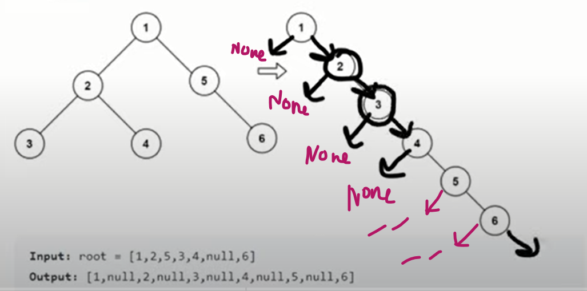

- Solution 1:

  - We can use a **Depth-First Search** to traverse the tree and keep track of the previous node in the linked list.
  - At each node, we set the previous node's `right` child to the current node and set the current node's `left` child to `null`.
  - We then update the previous node to the current node and recursively call the function on the left and right subtrees.

  ```py
  # Time complexity: O(n) where n is the number of nodes in the tree
  # Space complexity: O(h) where h is the height of the tree
  def flatten(root):
      prev = None # current tail of the linked list

      def dfs(node):
          if node:
              # set the previous node's right child to the current node
              # and set the current node's left child to null
              if prev:
                  prev.right = node
                  prev.left = None
              # update the previous node to the current node
              prev = node
              # recursively call the function on the left and right subtrees
              dfs(node.left)
              dfs(node.right)

      # call the helper function
      dfs(root)
  ```

- Another solution:

  ```py
  def flatten(root):
    # flatten the root tree and return the list tail
    def dfs(root):
      if not root:
        return

      leftTail = dfs(root.left)
      rightTail = dfs(root.right)

      if root.left:
        # connect the leftTail to the current root's right child
        leftTail.right = root.right
        # connect the current root's left child to the current root's right child
        root.right = root.left
        root.left = None

      last = rightTail or leftTail or root
      return last

    dfs(root)
  ```

---

### Binary Search Trees (BST)

- **Binary Search Trees Tips:**
  - When you're asked to find the **closest value** in a BST, you can use a **Depth First Search** to traverse the tree
  - When you're asked to find the **closest value** in a BST, you can use a **Breadth First Search** to traverse the tree
  - When you're asked to find the **closest value** in a BST, you can use a **Binary Search** to traverse the tree

#### BST Insertion

Write a function that accepts a root node of a BST and a value to insert into the tree. The function should return the root node of the BST after the insertion.

- EX: `insert(root, 5) --> root`
  

```py
def insert(root, value):
    # if the root is None, create a new node with the value and return it
    if root is None:
        return Node(value)

    # if the value is less than the root's value, insert it to the left
    if value < root.value:
        root.left = insert(root.left, value)
    # if the value is greater than the root's value, insert it to the right
    else:
        root.right = insert(root.right, value)

    return root
```

---

#### Validate BST

Write a function that accepts a root node of a BST and returns `True` if the tree is a valid BST and `False` if it is not.

- EX: `validate(root) --> True`
- Explanation:
  - The first solution that comes into mind is to check the right & left children of each node and check if they're less than or greater than the root node
    - but that's not enough because the right child of the root node might be less than the root node, but it's greater than the left child of the root node.
      
  - So we can't just check the neighbors and children one time and we have to check the whole tree for each node -> `O(n^2)` **BAD!**
- **Solution** is to use ranges for each point:
  

  - root node should be in the range of `(-inf, inf)`
  - left child of the root node should be in the range of `(-inf, root.value)`
  - right child of the root node should be in the range of `(root.value, inf)`

- **Solution 1:** Using min and max ranges

  - **Steps:**
    1. create a function that accepts a `root` node, a `min` value and a `max` value
    2. if the root is None, return `True`
    3. if the root's value is less than or equal to the `min` value or greater than or equal to the `max` value, return `False`
    4. recursively call the function with the root's left node and the `min` value and the root's value
    5. recursively call the function with the root's right node and the root's value and the `max` value
    6. return `True`

  ```py
  def isValidBST(root):
      # helper function
      def validate(root, min, max):
          if root is None:
              return True
          if root.value <= min or root.value >= max:
              return False

          # recursively call the function with the root's left/right node and the min/max value and the root's value
          return validate(root.left, min, root.value) and validate(root.right, root.value, max)

      # return the result of the function
      return validate(root, float('-inf'), float('inf'))
  ```

- **Solution 2:** Using In-Order Traversal

  - **Steps:**
    1. create a function that accepts a `root` node
    2. create an array to store the `values` of the nodes in the tree
    3. create a function that accepts a `root` node and adds the `values` of the nodes in the tree to the array, then call the function with the `root`'s `right` node
    4. call the function with the `root` node
    5. loop through the array and check if the values are in ascending order
    6. if the values are in ascending order, return `True`

  ```py
  def validate(root):
      # create an array to store the values of the nodes in the tree
      values = []

      # create a function that accepts a root node
      def traverse(root):
          # if the root is None, return
          if root is None:
              return

          # call the function with the root's left node
          traverse(root.left)
          # add the root's value to the array
          values.append(root.value)
          # call the function with the root's right node
          traverse(root.right)

      # call the function with the root node
      traverse(root)

      # loop through the array and check if the values are in ascending order
      for i in range(len(values) - 1):
          # if the values are not in ascending order, return False
          if values[i] > values[i + 1]:
              return False

      # if the values are in ascending order, return True
      return True
  ```

---

#### Binary Tree Inorder Traversal

Given the `root` of a binary tree, return the inorder traversal of its nodes' values.


- Explanation:

  - We can use a `DFS` to traverse the tree and add the values of the nodes to an array.
  - We can use a helper function to do the `DFS` and then return the array.

- Solution 1: using `DFS` **recursively**

  ```py
  def inorderTraversal(root):
      values = []

      def traverse(root):
          if root is None:
              return
          # 1. recursively call the function with the root's left node until we reach a leaf node (None)
          traverse(root.left)
          # 2. add the root's value to the array
          values.append(root.value)
          # 3. recursively call the function with the root's right node until we reach a leaf node (None)
          traverse(root.right)

      traverse(root)
      return values
  ```

- Solution 2: using `DFS` + `stack` **iteratively**
  

  ```py
  def inorderTraversal(root):
      values = []
      stack = []
      cur = root

      # while the stack is not empty or the cur is not None
      while stack or cur:
          # 1. loop through the left nodes of the cur and add them to the stack
          while cur:
              stack.append(cur)
              cur = cur.left

          # 2. add the node's value to the array
          node = stack.pop()
          values.append(node.value)
          # 4. set the root to the node's right node
          cur = node.right

      return values
  ```

---

#### Binary Tree Postorder Traversal

Given the `root` of a binary tree, return the postorder traversal of its nodes' values.

- Solution 1: **Recursive**

  - the recursive solution uses the `call stack` to store the nodes of the tree

  ```py
  def postorderTraversal(root):
      values = []

      def traverse(root):
          if root is None:
              return
          # 1. recursively call the function with the root's left node until we reach a leaf node (None)
          traverse(root.left)
          # 2. recursively call the function with the root's right node until we reach a leaf node (None)
          traverse(root.right)
          # 3. add the root's value to the array
          values.append(root.value)

      traverse(root)
      return values
  ```

- Solution 2: **Iterative**

  - The iterative solution uses a `stack` to store the nodes of the tree
    - for each node, before going to the left node, we need to add the node and the right node to the stack **(to come back to them later)**
    - we only want to add the value of a node to the `result` array when we reach a leaf node (a node that has no children)
      - which means that when visiting the node for the second time, we need to check if the node has been visited before or not
        - if the node has been visited before, we can add its value to the `result` array
        - if the node has not been visited before, we need to add it to the stack and visit its left node

  ```py
  def postorderTraversal(root):
      stack = [root]
      visit = [False]
      res = []

      while stack:
        cur, visited = stack.pop(), visit.pop()
        if cur:
          if visited:
            res.append(cur.val)
          else:
            # append everything (right first because we want to visit it last)
            stack.append(cur)
            visit.append(True)
            stack.append(cur.right)
            visit.append(False)
            stack.append(cur.left)
            visit.append(False)

      return res
  ```

---

#### Maximum Depth of Binary Tree

Given the `root` of a binary tree, return its maximum depth.

A binary tree's **maximum depth** is the number of nodes along the longest path from the root node down to the farthest leaf node.

- Explanation:
  - We will use **recursive DFS** to solve this problem
    

```py
def maxDepth(root):
    # if the root is None, return 0
    if root is None:
        return 0

    # recursively call the function with the root's left node and the root's right node
    left = maxDepth(root.left)
    right = maxDepth(root.right)

    # return the maximum depth of the tree
    return max(left, right) + 1
```

- **Other solutions without recursion**

  - **Solution 1:** using `BFS` + `queue` -> **level-order traversal**
    

    ```py
    def maxDepth(root):
        if root is None:
            return 0

        level = 0
        q = deque([root])

        # while the queue is not empty
        while queue:
            # loop through the queue to add the children of each node to the queue (BFS) + update level when finished
            for i in range(len(queue)):
                # pop the first node in the queue
                node = q.popleft()
                if node.left:
                  q.append(node.left)
                if node.right:
                  q.append(node.right)
            # increment the level by 1
            level += 1

        return level
    ```

  - **Solution 2:** using `DFS` + `stack`

    ```py
    def maxDepth(root):
        if root is None:
            return 0

        level = 0
        stack = [(root, 1)] # (node, level)

        # while the stack is not empty
        while stack:
            # pop the first node in the stack
            node, level = stack.pop()
            if node.left:
                stack.append((node.left, level + 1))
            if node.right:
                stack.append((node.right, level + 1))

        return level
    ```

---

#### Check Completeness of a Binary Tree

Given the `root` of a binary tree, determine if it is a **complete binary tree**. In a **complete binary tree**, every level, except possibly the last, is completely filled, and all nodes in the last level are as far left as possible. It can have between `1` and `2h` nodes inclusive at the last level `h`.

- EX: `isCompleteTree(root) --> True`

- Explanation:

  - in a complete binary tree, if we draw the tree level by level, we can see that the **last level is filled from left to right**
  - So, when we pop the last node in the queue, we should not see any more nodes in the queue
    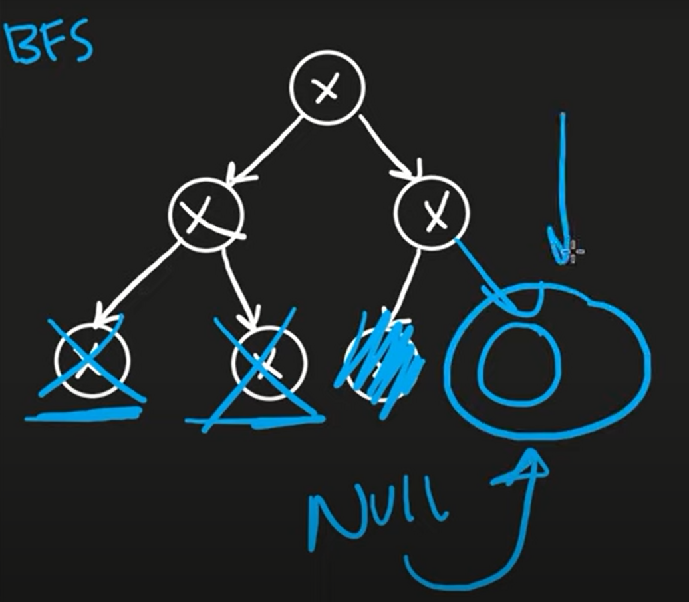
  - To do so, we'll use `BFS` because we want to traverse the tree **level by level**, and then check if the last level is filled from **left-to-right**
    - We know that the last level will be filled with `None` nodes
    - So when we reach the first `None` node, we should not see any more nodes in the queue when popping/
      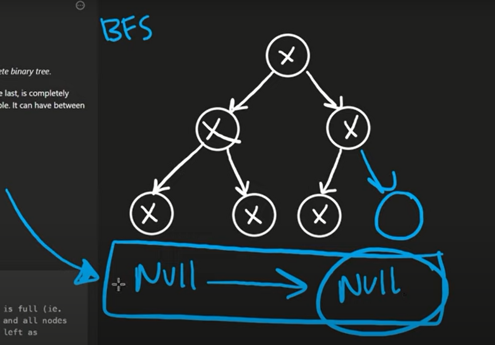

- **Solution:** using `BFS` + `queue`

  ```py
  # Time complexity: O(n), Space complexity: O(n)
  def isCompleteTree(root):
      if root is None:
          return True

      # create a queue to store the nodes of each level
      q = deque([root])
      # create a flag to indicate if we've reached the last level
      reached_last_level = False

      # while the queue is not empty
      while q:
          # pop the first node in the queue
          node = q.popleft()

          # if we've reached the last level, but the current node is not None, return False
          if reached_last_level and node is not None:
              return False

          # if the current node is None, set the flag to True
          if node is None:
              reached_last_level = True
          # else add its children to the queue
          else:
              q.append(node.left)
              q.append(node.right)

      # if we didn't return False, return True
      return True
  ```

- **Another solution** without using a boolean state variable:

  ```py
  def isCompleteTree(root):
      q = deque([root])

      while q:
          node = q.popleft()

          if node:
              q.append(node.left)
              q.append(node.right)
          else:
              while q:
                  # if we found a non-null node
                  if q.popleft():
                      return False

      return True
  ```

---

#### Binary Tree Zigzag Level Order Traversal

Given the `root` of a binary tree, return the zigzag level order traversal of its nodes' values. (i.e., from `left` to `right`, then `right` to `left` for the next level and alternate between).

- Ex:

  - Input: `root = [3,9,20,null,null,15,7]`
  - Output: `[[3],[20,9],[15,7]]`

- Explanation:

  - we want to take every level and reverse it if it's an odd level and then add it to the result array
    
  - we can use BFS to traverse the tree level by level and:
    1. use a flag to indicate if we're going from left to right or from right to left and toggle it on each level
    2. use a double-ended queue (deque) to store the nodes of each level
    3. reverse the odd levels after adding them to the result array

- **Solution 1** `DFS` + Iterative + `deque`

  ```py
  def zigzagLevelOrder(root):
      if root is None:
          return []

      result = []
      # create a queue to store the nodes of each level
      q = deque([root])

      while q:
          # create an array to store the nodes of the current level
          level = []
          # loop through the queue
          for i in range(len(q)):
              # pop the first node in the queue
              node = q.popleft()
              # add the node's value to the level array
              level.append(node.value)
              # add the node's children to the queue
              if node.left:
                  q.append(node.left)
              if node.right:
                  q.append(node.right)

          # reverse if it's an odd level
          level = reversed(level) if len(result) % 2 else level
          result.append(level)

      return result
  ```

- **Solution 2**: `DFS` + recursive

  ```py
  def zigzagLevelOrder(root):
      if root is None:
          return []

      result = []

      def dfs(node, level):
          if node is None:
              return

          # if the current level is greater than the length of the result array, add a new array to the result array
          if level >= len(result):
              result.append([])

          # add the node's value to the array
          result[level].append(node.value)
          # recursively call the function with the node's left and right nodes and the next level
          dfs(node.left, level + 1)
          dfs(node.right, level + 1)

      dfs(root, 0)

      # reverse the odd levels
      for i in range(len(result)):
          if i % 2:
              result[i] = reversed(result[i])

      return result
  ```

---

#### Sum of Left Leaves

Given the `root` of a binary tree, return the sum of all left leaves.

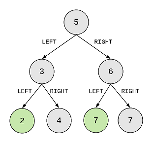

- **Solution 1:** using `DFS` + `stack`

  ```py
  def sumOfLeftLeaves(root):
      if root is None:
          return 0

      stack = [(root, False)] # (node, is_left)
      sum = 0

      while stack:
          node, is_left = stack.pop()
          # if the node is a left leaf, add its value to the sum
          if is_left and node.left is None and node.right is None:
              sum += node.value
          if node.left:
              stack.append((node.left, True))
          if node.right:
              stack.append((node.right, False))

      return sum
  ```

- **Solution 2:** using `BFS` + `recursion`

  ```py
  def sumOfLeftLeaves(root):
      if root is None:
          return 0

      # If root has a left child and the left child is a leaf node, add it to the sum
      if root.left and root.left.left is None and root.left.right is None:
          return root.left.value + sumOfLeftLeaves(root.right)
      # Otherwise, recursively call sumOfLeftLeaves on the left and right children
      else:
          return sumOfLeftLeaves(root.left) + sumOfLeftLeaves(root.right)
  ```

---

#### Diameter of Binary Tree

Given the `root` of a binary tree, return the length of the **diameter** of the tree.

The diameter of a binary tree is the **length** of the longest path between any two nodes in a tree. This path may or may not pass through the `root`.
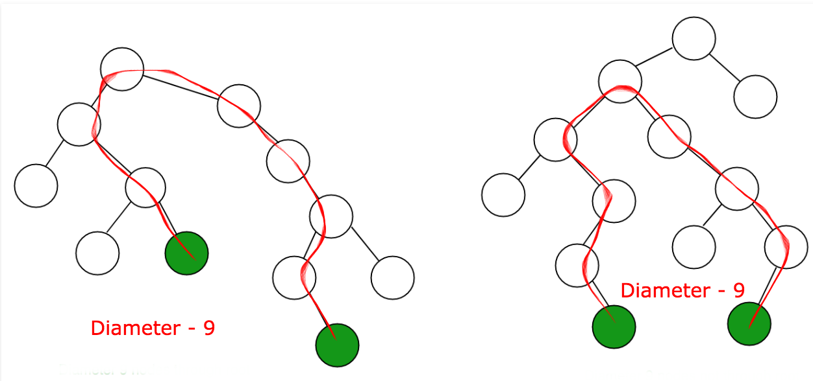

- **Explanation**
  - To solve this, we can use a **Depth First Search** to traverse the tree and keep track of the **diameter** of the tree
  - we do so by calculating the diameter for each node recursively and then return the maximum diameter
  - to calculate the diameter of a node, we need to calculate the **height** of the left subtree and the **height** of the right subtree and then add them together
    
    - the **height** of a subtree is the number of edges between the root node and the farthest leaf node
    - `diameter` = `left_height` + `right_height`
    - we add them because the diameter of a node is the longest path between any two nodes in a tree and this path may or may not pass through the `root` (see picture)
      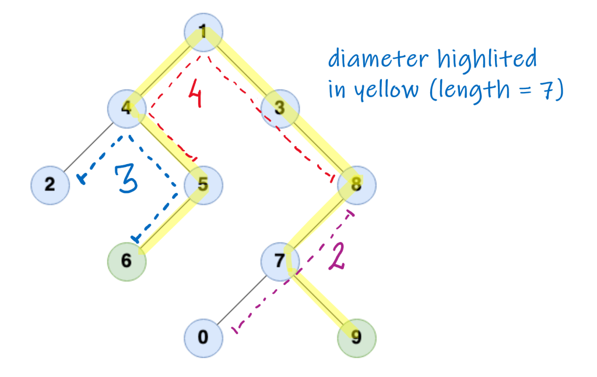
- So, the approach for solving this problem is to calculate the `height` of each node's `left` and `right` subtrees and find the maximum `sum` of heights for any node. This `sum` represents the longest path that passes through that node. We can do this recursively for each node in the tree and keep track of the maximum diameter found so far.

```py
def diameterOfBinaryTree(root):
    # create a variable to store the diameter of the tree
    diameter = 0

    # create a function that accepts a root node and returns the height of the tree
    def height(root):
        # if the root is None, return 0
        if root is None:
            return 0

        # recursively call the function with the root's left node and the root's right node
        left = height(root.left)
        right = height(root.right)

        # update the diameter of the tree
        diameter = max(diameter, left + right)

        # return the height of the tree (1 for the current node)
        return max(left, right) + 1

    height(root)
    return diameter
```

---

#### Minimum Absolute Difference in BST

Given the `root` of a Binary Search Tree (BST), return the minimum absolute difference between the values of any two different nodes in the tree.

- Ex:

  - Input: `root = [4,2,6,1,3]`
  - Output: `1`

- **Explanation**
  - We can use a **inorder DFS** to traverse the tree and keep track of the **minimum absolute difference** between the values of any two different nodes in the tree
  - we do so by calculating the **absolute difference** between the current node's value and the **previous** node's value and then return the minimum absolute difference
    - > Here, `prev` is the node below and not above
  - we create a recursive function `traverse()`:
    - it takes a node as input and recursively traverses its **left subtree** until it reaches a leaf node
      - > because the values in the **left** subtree are less than the current node's value
    - then checks if the `prev` variable is not `None`. If it is not None, it calculates the absolute difference between the current node and the previous node, and updates the `min_diff` variable with the minimum of the current minimum absolute difference and the absolute difference between the current node and the previous node.
    - It then sets the `prev` variable to the current node and recursively traverses the **right subtree**.
      - we go to `left` subtree first because the values in the `left` subtree are less than the current node's value

```py
def getMinimumDifference(root):
    min_diff = float('inf')
    prev = None

    def traverse(root):
        if not root:
            return

        traverse(root.left)

        # if the previous node's value is not None, update the minimum absolute difference
        if prev:
            min_diff = min(min_diff, root.value - prev.val)

        # update the previous node's value
        prev = root

        # recursively call the function with the root's right node
        traverse(root.right)

    # call the function with the root node
    traverse(root)
    return min_diff
```

---

#### Invert Binary Tree

Given the `root` of a binary tree, invert the tree, and return its root.

- Ex:
  

  - Input: `root = [4,2,7,1,3,6,9]`
  - Output: `[4,7,2,9,6,3,1]`

- Explanation:
  - here, we want to visit every node and swap its `left` and `right` children
  - do this recursively for each node with `DFS`

```py
def invertTree(root):
    if not root:
        return None

    # swap the children
    root.left, root.right = root.right, root.left

    # recursively call the function with the root's left node and the root's right node
    invertTree(root.left)
    invertTree(root.right)

    return root

# -------------------------------------------------------------------
# Different method (DFS)
def invertTree(root):
    if not root:
      return None

    # recursively call the function with the root's left node and the root's right node
    left = invertTree(root.left)
    right = invertTree(root.right)

    # swap the children
    root.left = right
    root.right = left

    return root
```

---

#### Kth Smallest Element in a BST

Given the `root` of a binary search tree, and an integer `k`, return the `kth` smallest value (`1-indexed`) of all the values of the nodes in the tree.

- Ex:

  - Input: `root = [3,1,4,null,2], k = 1`
  - Output: `1`

- Explanation:
- **Solution 1:** using `DFS` + sorting **(recursively)**

  - we can use `DFS` to traverse the tree and add the values of the nodes to an array
  - then we can sort the array and return the `kth` smallest value

  ```py
  def kthSmallest(root, k):
      values = []

      def traverse(root):
          if root is None:
              return

          # Traverse in-order
          traverse(root.left)
          values.append(root.value)
          traverse(root.right)

      traverse(root)
      values.sort()
      return values[k - 1]
  ```

- **Solution 2:** using `DFS` + `stack` **(iteratively)**

  - we go left as far down as we can with adding the values to the stack and then go up by popping the nodes from the stack and adding their values to the array

    - we can use a `stack` to store the nodes of the tree in descending order
    - then we can pop the first `k` nodes from the stack and return the last node's value

    ```py
    def kthSmallest(root, k):
        stack = []
        cur = root

        while stack or cur:
            # loop through the left nodes of the cur and add them to the stack
            while cur:
                stack.append(cur)
                cur = cur.left

            # pop the first node in the stack
            node = stack.pop()
            k -= 1
            if k == 0:
                return node.value

            # set the root to the node's right node
            cur = node.right
    ```

---

#### Lowest Common Ancestor of a Binary Search Tree

Given a binanaary search tree (BST), find the lowest common ancestor (LCA) of two given nodes in the BST.

> "The lowest common ancestor is defined between two nodes `p` and `q` as the lowest node in `T` that has both `p` and `q` as descendants (where we allow **a node to be a descendant of itself**)."

- Explanation:
  - This is different from the **lowest common ancestor of a binary tree** problem because in a **binary tree**, we can have nodes with only one child, and also the nodes can be in any order.
  - But in a **binary search tree**, we know that the nodes in the left subtree are less than the root node and the nodes in the right subtree are greater than the root node.
  - So, we can use this property to find the lowest common ancestor of two nodes in a BST.

```py
def lowestCommonAncestor(root, p, q):
    cur = root

    while cur:
      # if the current node is bigger than both p and q, go left (smaller value)
      if cur.value > p.value and cur.value > q.value:
        cur = cur.left
      # else if the current node is smaller than both p and q, go right (bigger value)
      elif cur.value < p.value and cur.value < q.value:
        cur = cur.right
      # else return the current node -> it's the lowest common ancestor
      else:
        return cur
```

---

## Tries

### Implement Trie (Prefix Tree)

A **trie** (pronounced as "try") or **prefix tree** is a tree data structure used to efficiently store and retrieve keys in a dataset of strings. There are various applications of this data structure, such as autocomplete and spellchecker.

- Steps
  - when inserting a word, we loop through each character in the word and check if the character is in the trie
    - if the character is in the trie, we move to the next character until we reach the end of the word
    - if the character is not in the trie, we add it to the trie by creating a node for that character
  - when adding all the characters of a word, we need to mark the last character as the end of the word by adding a `*` to the node

```py
class TrieNode:
    def __init__(self):
        """
        # Ex: children = {'a': TrieNode(), 'b': TrieNode()}
        # or: children['a'] = TrieNode()
        """
        self.children = {}
        self.end_of_word = False

class Trie:
    def __init__(self):
        self.root = TrieNode()

    def insert(self, word):
        cur = self.root

        for char in word:
            # if the character is not in the trie, add it
            if char not in cur.children:
                cur.children[char] = TrieNode()
            # move to the next character if it's in the trie
            cur = cur.children[char]

        # mark the last character as the end of the word
        cur.end_of_word = True

    def search(self, word):
        cur = self.root

        for char in word:
            # if the character is not in the trie, return False
            if char not in cur.children:
                return False
            # move to the next character
            cur = cur.children[char]

        # return True if the last character is the end of the word
        return cur.end_of_word

    def startsWith(self, prefix):
        cur = self.root

        for char in prefix:
            # if the character is not in the trie, return False
            if char not in cur.children:
                return False
            # move to the next character
            cur = cur.children[char]

        # return True if we reach the end of the prefix
        return True
```

---

## Sorting and searching

### Searching

- **Note:** In `binary search`, when we get the middle element, we use: `mid = (low + high) // 2`, Actually this can lead to an **integer overflow**. Imagine that `low` and `high` are very large numbers. Adding them up will cause an integer overflow.
  - A better way is to compute `mid` as `mid = low + (high - low) // 2`. Dividing `high - low` before adding `low` avoids the integer overflow.

#### Binary Search

```py
def binary_search(arr, target):
    l, r = 0, len(arr) - 1

    while l <= r:
        mid = (l + r) // 2

        if arr[mid] == target:
            return mid
        elif arr[mid] < target:
            l = mid + 1
        else:
            r = mid - 1

    return -1
```

> Interview question: what if `left` and `right` values are in the upper limit of the `32` bit integer? so adding them will result in an **"overflow"**
>
> - Answer: we can instead get the `mid` value by using `mid = left + (right - left) // 2`

---

#### Search a 2D Matrix

You are given an `m x n` integer matrix `matrix` sorted in ascending order, and an integer `target`. Return `true` if `target` is in `matrix`, or `false` otherwise.

- Each row of `matrix` is sorted in ascending order.
- The first integer of each row is greater than the last integer of the previous row

- Ex:
  

  - `matrix = [[1, 3, 5, 7], [10, 11, 16, 20], [23, 30, 34, 60]]`
  - `target = 3 --> True`
  - `target = 13 --> False`

- Explanation
  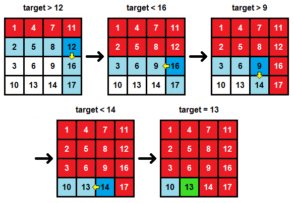

  - We can make use of that each row is sorted to perform a binary search on each row
    - this will be `O(m * log(n))`, where `m` is the number of rows and `n` is the number of columns
  - We can do even better, by performing a binary search on the entire matrix to make use of that the last element of each row is smaller than the first element of the next row
    - this will be `O(log(m) + log(n))`, where `m` is the number of rows and `n` is the number of columns

- Solution 1 -> `O(log(m) + log(n))` -> double binary-search

  ```py
  def searchMatrix(matrix, target):
      ROWS, COLS = len(matrix), len(matrix[0])
      top, bottom = 0, ROWS - 1

      # Perform binary search
      while top <= bottom:
        row = (top + bottom) // 2
        # if the target is smaller than the first element of the row, go up
        if target < matrix[row][0]:
          bottom = row - 1
        # if the target is bigger than the last element of the row, go down
        elif target > matrix[row][COLS - 1]:
          top = row + 1
        else:
          # Perform binary search on the row
          left, right = 0, COLS - 1
          while left <= right:
            mid = (left + right) // 2
            if target < matrix[row][mid]:
              right = mid - 1
            elif target > matrix[row][mid]:
              left = mid + 1
            else:
              return True
          return False # MUST RETURN FALSE HERE AND NOT OUTSIDE THE WHILE LOOP
  ```

- Solution 2 -> `O(m + n)`

  ```py
  def searchMatrix(matrix, target):
      if not matrix or not matrix[0]:
          return False

      row = 0
      col = len(matrix[0]) - 1

      # Perform binary search
      while row < len(matrix) and col >= 0:
          if matrix[row][col] == target:
              return True
          elif matrix[row][col] > target:
              col -= 1
          else:
              row += 1

      return False
  ```

---

#### Koko Eating Bananas

Koko loves to eat bananas. There are `n` piles of bananas, the `ith` pile has `piles[i]` bananas. The guards have gone and will come back in `h` hours.

Koko can decide her bananas-per-hour eating speed of `k`. Each hour, she chooses some pile of bananas and eats `k` bananas from that pile. If the pile has less than `k` bananas, she eats all of them instead and will not eat any more bananas during this hour.

Return _the minimum integer_ `k` _such that she can eat all the bananas within_ `h` _hours_.

- Ex:

  - `piles = [3, 6, 7, 11], h = 8 --> 4`
  - `piles = [30, 11, 23, 4, 20], h = 5 --> 30`
  - `piles = [30, 11, 23, 4, 20], h = 6 --> 23`

- Explanation:

  - We want to get the minimum `k` number where `k` is the maximum number of bananas Koko can eat per hour (eating speed)
  - for example: `piles = [3, 6, 7, 11], h = 8`
    - `k = 1` -> we will require `3` hours to eat the first pile, then `6` hours to eat the second pile, then `7` hours to eat the third pile, then `11` hours to eat the fourth pile, this will exceed the `8` hours threshold
    - `k = 4` -> we will require `1` hour to eat the first pile, then `2` hours to eat the second pile, then `2` hours to eat the third pile, then `3` hours to eat the fourth pile, this will not exceed the `8` hours threshold so this is the minimum `k` number

- Steps:
  - Instead of brute-forcing all the possible `k` values (`1` -> `max(piles)`), we can use **binary search** to find the minimum `k` value
    
  - We can start with `k = 1` and `k = max(piles)`, then we can get the `mid` value and check if it is possible to eat all the bananas within `h` hours
    
  - If it is possible, then we can try to get a smaller `k` value, so we can set `right = mid - 1`
  - If it is not possible, then we can try to get a bigger `k` value, so we can set `left = mid + 1`
    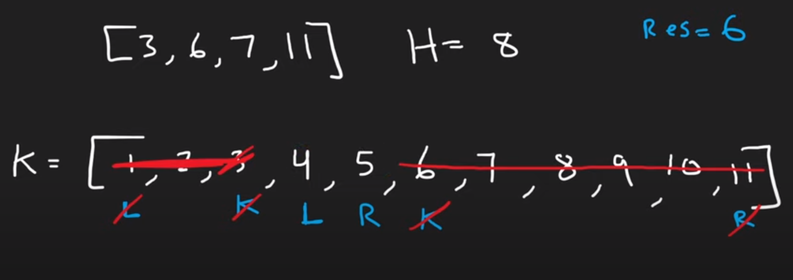

```py
def minEatingSpeed(piles, h):
    l, r = 1, max(piles)
    res = r # if we can't eat all the bananas within h hours, then we will return the upper bound

    while l <= r:
        # k = mid
        k = (l + r) // 2
        totalTime = 0
        for p in piles:
            totalTime += math.ceil(p / k)

        if totalTime <= h:
          res = min(res, k)
          r = k - 1
        else:
          l = k + 1

    return res
```

---

#### Search in Rotated Sorted Array

You are given an integer array `nums` sorted in ascending order, and an integer `target`. Suppose that `nums` is rotated at some pivot unknown to you beforehand (i.e., `[0, 1, 2, 4, 5, 6, 7]` might become `[4, 5, 6, 7, 0, 1, 2]`). Given `nums` and `target`, return the index of `target` if it is in `nums`, or `-1` if it is not in `nums`. **You must write an algorithm with `O(log n)` runtime complexity.**

- Ex:

  - `nums = [4, 5, 6, 7, 0, 1, 2], target = 0 --> 4`
  - `nums = [4, 5, 6, 7, 0, 1, 2], target = 3 --> -1`

- Steps:
  - We can use **binary search** to find the target value
  - We can check if the `mid` value is equal to the `target` value
  - Also we will chack if the left/right side of the `mid` value is sorted (we have 2 sorted halves in the array after the rotation)
    
  - to choose which side to search in, we can check if the `mid` value is greater than the `left` value or less than the `right` value
    
    - If the `left` side is sorted, then we can check if the `target` value is in the `left` side
    - If the `right` side is sorted, then we can check if the `target` value is in the `right` side
    - If the `target` value is not in the left/right side, then we can set `left = mid + 1` or `right = mid - 1`

```py
def search(nums, target):
    l, r = 0, len(nums) - 1

    while l <= r:
        mid = (l + r) // 2
        if nums[mid] == target:
            return mid

        # left sorted side
        if nums[l] <= nums[mid]:
            # check if the target is in the left side
            if nums[l] <= target <= nums[mid]:
                r = mid - 1
            else:
                l = mid + 1
        # left sorted side
        else:
            if nums[mid] <= target <= nums[r]:
                l = mid + 1
            else:
                r = mid - 1

    return -1
```

---

#### Find Minimum in Rotated Sorted Array

Same as the previous problem, but instead of returning the index of the target value, we will return the minimum value in the array

- Explanation
  - We can use **binary search** to find the minimum value
  - We can check if the `mid` value in the `left` portion or the `right` portion
    - if we're in the `left` portion, then we can check if the `mid` value is less than the `right` value
      - This is because the `left` side will have values greater than every value in the `right` side, so the minimum value will be in the `right` side
        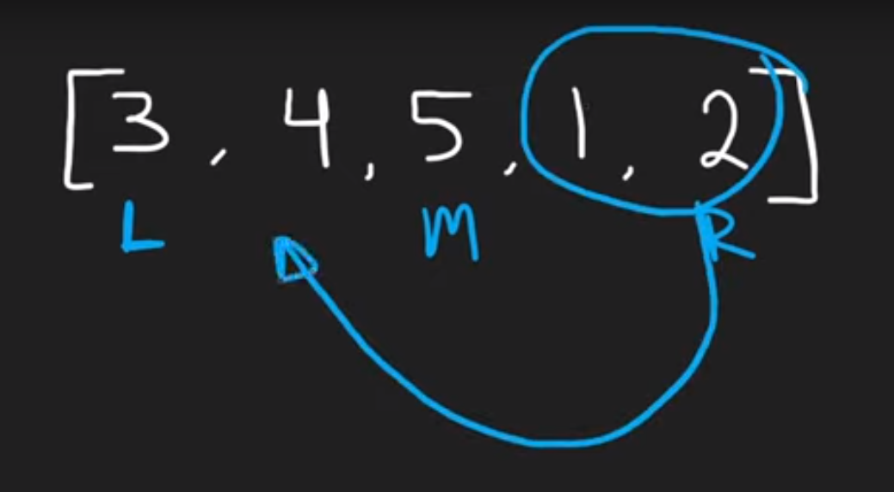
  - To check if the `mid` value is in the `left` portion, we can check if the `mid` value is greater than the first value in the `left` portion
    
  - If the `mid` value is in the `right` portion, then we can check if the `mid` value is less than the `right` value and repeat
    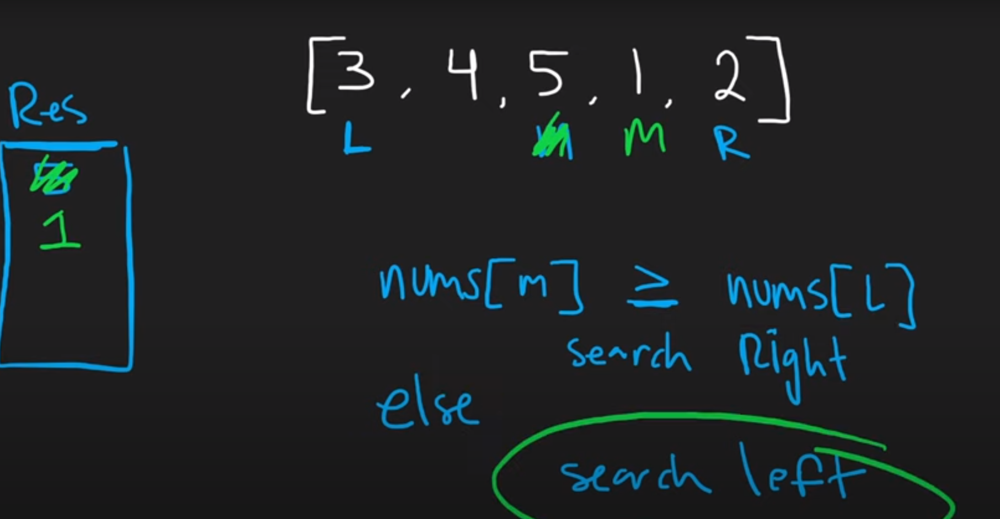

```py
def findMin(nums):
    l, r = 0, len(nums) - 1
    curMin = nums[0]

    while l <= r:
        mid = (l + r) // 2
        curMin = min(curMin, nums[mid])

        # right side is not sorted -> right side has the minimum value
        if nums[r] < nums[mid]:
            l = mid + 1
        # left side has the min
        else:
            r = mid - 1

    return curMin
```

---

#### Time Based Key-Value Store

Design a time-based key-value data structure that can store multiple values for the same key at different time stamps and retrieve the key's value at a certain timestamp.

- Ex: 

- Solution:
  - `"All the timestamps timestamp of set are strictly increasing"` -> sorted
- Ex: 
  - So, we can use **binary search** to find the value at a certain timestamp

```py
class TimeMap:
    def __init__(self):
        self.store = {} # key: list of [val, timestamp]

    def set(self, key, val, timestamp):
        if key not in self.store:
            self.store[key] = []
        self.store[key].append([val, timestamp])

    def get(self, key, timestamp):
      res = ''
      values = self.store.get(key, []) # To handle the case where the key is not in the store

      # Binary search
      l, r = 0, len(values) - 1
      while l <= r:
        mid = (l + r) // 2
        if values[mid][1] <= timestamp:
          res = values[mid][0] # The closest value to the timestamp we've seen so far
          l = mid + 1
        else:
          r = mid - 1

      return res
```

---

#### Single Element in a Sorted Array

You are given a sorted array consisting of only integers where every element appears exactly twice, except for one element which appears exactly once. Find this single element that appears only once. **Do it in O(logn) time and O(1) space**.

- Ex:

  - `nums = [1, 1, 2, 3, 3, 4, 4, 8, 8] --> 2`

- Explanation:
  - We can use **binary search** to find the single element
  - We will make use of that **"the array is sorted"**, We can check if the `mid` value is the single element by checking if the `mid` value is equal to the value before and after it
  - If the `mid` value is not the single element, then we want to know which side the single element is in
    - This can be figured out by also using another operation that **"All the elements are repeated twice, except for one element which appears exactly once"** -> So the length of the array will be **odd**
      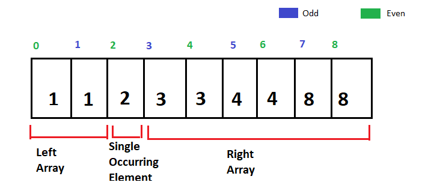
    - So we will use the length of the left/right sides to determine which side the single element is in
      - If the length of the left side is odd, then the single element is in the left side
      - If the length of the right side is odd, then the single element is in the right side

```py
def singleNonDuplicate(nums):
    l, r = 0, len(nums) - 1

    while l <= r:
        m = l + (r - l) // 2

        if (
          (m - 1 < 0 or nums[m - 1] != nums[m]) and
          (m + 1 >= len(nums) or nums[m + 1] != nums[m])
        ):
            return nums[m]

        leftSize = m - 1 if nums[m - 1] == nums[m] else m
        if leftSize % 2:
            r = m - 1
        else:
            l = m + 1
```

---

#### Find First and Last Position of Element in Sorted Array

Given an array of integers `nums` sorted in ascending order, find the starting and ending position of a given `target` value. If `target` is not found in the array, return `[-1, -1]`.

**You must write an algorithm with `O(log n)` runtime complexity.**

- Ex:

  - `nums = [5, 7, 7, 8, 8, 10], target = 8 --> [3, 4]`
  - `nums = [5, 7, 7, 8, 8, 10], target = 6 --> [-1, -1]`

- Explanation:
  - We can use **binary search** to find the starting and ending position of the target value
  - We will use **two binary searches** to find the starting and ending position
    - The first binary search will find the starting position
      - If the `mid` value is equal to the target value, then we will check if the `mid` value is the starting position by checking if the value before it is less than the `mid` value
    - The second binary search will find the ending position
      - If the `mid` value is equal to the target value, then we will check if the `mid` value is the ending position by checking if the value after it is greater than the `mid` value

```py
def searchRange(nums, target):
    def search(leftBias):
        """
        leftBias(boolean): True if we are looking for the left most index
        """
        l, r = 0, len(nums) - 1
        res = -1

        while l <= r:
            m = l + (r - l) // 2

            if nums[m] == target:
                res = m
                # If we are looking for the left most index, then we want to keep searching the left side
                if leftBias:
                    r = m - 1
                else:
                    l = m + 1
            elif nums[m] < target:
                l = m + 1
            else:
                r = m - 1

        return res

    return [search(True), search(False)]
```

---

### Sorting

#### Insertion Sort List

Sort a linked list using insertion sort.

---

#### Largest Number

Given a list of non-negative integers `nums`, arrange them such that they form the largest number.

> Note: The result may be very large, so you need to return a string instead of an integer.

- Ex:

  - `nums = [10, 2] --> '210'`
  - `nums = [3, 30, 34, 5, 9] --> '9534330'`

- Explanation:
  - We can sort the numbers by comparing the first digit of each number
  - If the first digit of `a` is bigger than the first digit of `b`, then `a` should come before `b`
  - If the first digit of `a` is smaller than the first digit of `b`, then `b` should come before `a`
  - If the first digit of `a` is equal to the first digit of `b`, then we need to compare the second digit of each number
  - We can do this by converting the numbers to strings and comparing the strings

```py
def largestNumber(nums):
    def compare(x, y):
        if int(str(x)+str(y)) > int(str(y)+str(x)):
            return -1
        else:
            return 1

    # sort the numbers using the compare function
    nums = sorted(nums, key=cmp_to_key(compare))
    return str(int(''.join(map(str, nums))))
```

---

#### Merge Intervals

Given an array of intervals where `intervals[i] = [starti, endi]`, merge all overlapping intervals, and return an array of the non-overlapping intervals that cover all the intervals in the input.

- Ex:

  - `intervals = [[1, 3], [2, 6], [8, 10], [15, 18]] --> [[1, 6], [8, 10], [15, 18]]`
    

- Explanation:
  - We can sort the intervals by the `start` time
  - Then we can check if the current interval overlaps with the previous interval
    - If there is no overlap, then we can add the current interval to the merged intervals
    - If there is overlap, then we can merge the current interval with the previous interval

```py
def merge(intervals):
    # sort the intervals by the start time
    intervals.sort(key=lambda x: x[0])

    merged = []
    for interval in intervals:
        # check if interval does not overlap with the previous one
        if not merged or merged[-1][1] < interval[0]:
            merged.append(interval)
        else:
            # otherwise, there is overlap, so we merge the current and previous interval (which is the last interval in the `merged` list)
            merged[-1][1] = max(merged[-1][1], interval[1])

    return merged

# another way

def merge(intervals):
    intervals.sort(key=lambda x: x[0])

    res = [intervals[0]]
    for interval in intervals[1:]:
        lastEnd = res[-1][1]

        # check if start of current interval is less than or equal to the end of the last interval
        if interval[0] <= lastEnd:
            res[-1][1] = max(lastEnd, interval[1])
        else:
            res.append(interval)

    return res
```

---

#### Non-overlapping Intervals

Given an array of intervals `intervals` where `intervals[i] = [starti, endi]`, return the **minimum** number of intervals you need to remove to make the rest of the intervals non-overlapping.

- Ex:

  - `intervals = [[1, 2], [2, 3], [3, 4], [1, 3]] --> 1`
  - Explanation: [1, 3] can be removed and the rest of intervals are non-overlapping.

- Explanation:
  - We can sort the intervals by the `start` time
  - Then we can check if the current interval overlaps with the previous interval
    - If there is no overlap, then we can add the current interval to the merged intervals
    - If there is overlap, then we can merge the current interval with the previous interval

```py
def eraseOverlapIntervals(intervals):
    # sort the intervals by the start time
    intervals.sort(key=lambda x: x[0])

    res = 0
    prevEnd = intervals[0][1]
    for start, end in intervals[1:]:
        # overlap
        if start < prevEnd:
            res += 1
            prevEnd = min(prevEnd, end) # remove the interval with the larger end time
        # no overlap
        else:
            prevEnd = end

    return res
```

---

#### Sort colors

Given an array `nums` with `n` objects colored red, white, or blue, sort them **in-place** so that objects of the same color are adjacent, with the colors in the order red, white, and blue.

- Ex:

  - `nums = [2, 0, 2, 1, 1, 0] --> [0, 0, 1, 1, 2, 2]`

- Explanation:

  - We know that the array only contains 3 colors: red, white, and blue (represented by 0, 1, and 2) -> **Finite range**
    - So we can use `bucket sort` to sort the array in-place
  - We can also use the 3-way partitioning algorithm to sort the array in-place

- Solution 1: Bucket sort

  ```py
  def sortColors(nums):
      # count the number of 0s, 1s, and 2s
      buckets = [0] * (1+max(nums))
      for num in nums:
          buckets[num] += 1

      # overwrite the original array with the sorted array
      i = 0
      for j in range(len(buckets)):
          while buckets[j] > 0:
              nums[i] = j
              i += 1
              buckets[j] -= 1
  ```

- Solution 2: 3-way partitioning **(not fully understood ❌)**

  ```py
  def sortColors(nums):
      # 3-way partitioning
      low, mid, high = 0, 0, len(nums)-1

      while mid <= high:
          if nums[mid] == 0:
              nums[low], nums[mid] = nums[mid], nums[low]
              low += 1
              mid += 1
          elif nums[mid] == 1:
              mid += 1
          else:
              nums[mid], nums[high] = nums[high], nums[mid]
              high -= 1
  ```

---

#### Median of Two Sorted Arrays

Given two sorted arrays `nums1` and `nums2` of size `m` and `n` respectively, return **the median** of the two sorted arrays.

**The overall run time complexity should be `O(log(m+n))`.**

- Ex:

  - `nums1 = [1, 3], nums2 = [2] --> 2.00000`
  - `nums1 = [1, 2], nums2 = [3, 4] --> 2.50000`
  - `nums1 = [0, 0], nums2 = [0, 0] --> 0.00000`
  - `nums1 = [], nums2 = [1] --> 1.00000`

- Explanation:
  - Here It requires solving it with `O(log(n+m))`, so we can't just merge the two arrays and find the median as we would do in `O(n+m)`
  - To do so, we can use the **binary search** algorithm
    - We will have 2 partitions, one in each array, and the `median` will be the average of the max of the left partition and the min of the right partition
      - if the total length of the two arrays is **odd**, then the median will be the middle element
        
      - if the total length of the two arrays is **even**, then the median will be the average of the middle 2 elements
        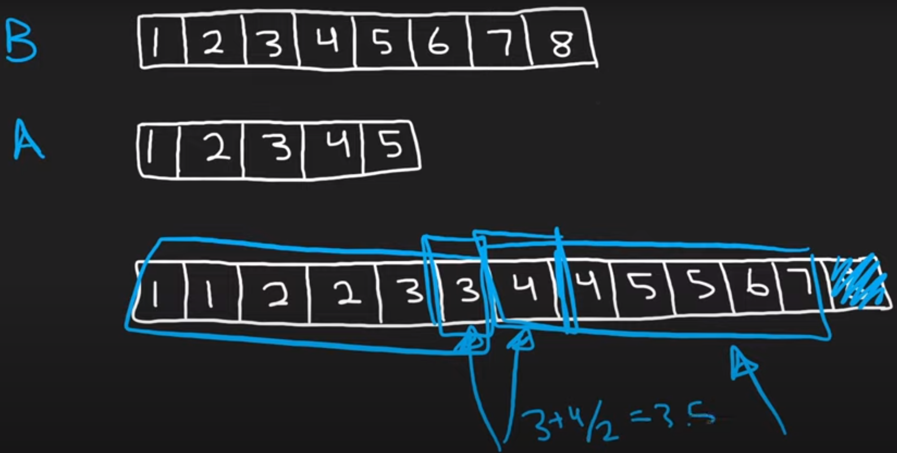
  - The total number of elements in the left partition should be equal to the total number of elements in the right partition (half of the total number of elements in the two arrays)
    - `len(left_part) == len(right_part)`
    - `half` = `(len(nums1) + len(nums2) + 1) // 2`
  - we use the `half` to find the correct partition in the two arrays
    - `partitionX = (low + high) // 2`
      
    - `partitionY = half - partitionX`
      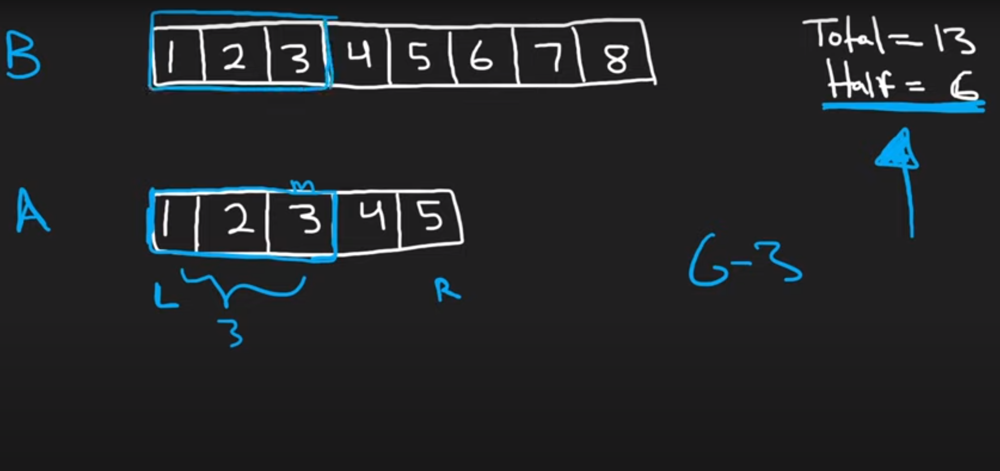
  - Now We need to know if the `left` partition is correct or not
    - So, we will check if the overall left partition is less than the overall right partition
    - This is done by checking if the max of the left partition in `nums1` is less than the min of the right partition in `nums2` and vice versa
      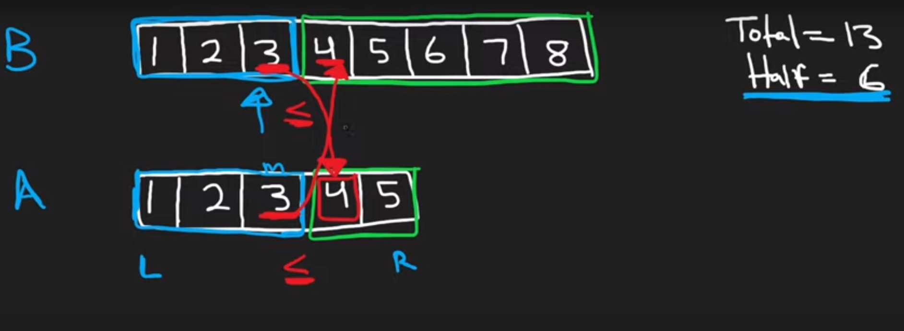
      - `maxLeftX <= minRightY`
      - `maxLeftY <= minRightX`
  - If the left partition is correct, then we can return the median
    
    - if the total length of the two arrays is **odd**, then the median will be the middle element which is the **minimum** of the `2 mins` of the right partitions
      
    - if the total length of the two arrays is **even**, then the median will be the average of the middle 2 elements which are:
      
      - the **maximum** of the `2 maxs` of the left partitions
      - the **minimum** of the `2 mins` of the right partitions
  - If the left partition is not correct, then we need to move the `low` or `high` pointer to the correct position
    - if `maxLeftX > minRightY`, then we need to move `high` pointer to the left
    - if `maxLeftY > minRightX`, then we need to move `low` pointer to the right
      
      

```py
def findMedianSortedArrays(nums1, nums2):
    A, B = nums1, nums2
    total = len(nums1) + len(nums2)
    half = total // 2

    # make sure that A is the smaller array
    if len(A) > len(B):
        A, B = B, A

    # set the low and high pointers
    low, high = 0, len(A) - 1

    # loop until we find the correct partition
    while True:
        # get the partition of A
        i = (low + high) // 2
        # get the partition of B
        j = half - i - 2 # -2 because we start from 0

        # get the elements of the left and right partitions
        Aleft = A[i] if i >= 0 else float('-inf')
        Aright = A[i + 1] if (i + 1) < len(A) else float('inf')
        Bleft = B[j] if j >= 0 else float('-inf')
        Bright = B[j + 1] if (j + 1) < len(B) else float('inf')

        # check if the left partition is correct
        if Aleft <= Bright and Bleft <= Aright:
            # check if the total length is odd or even
            if total % 2:
                # return the median
                return min(Aright, Bright)
            else:
                # return the median
                return (max(Aleft, Bleft) + min(Aright, Bright)) / 2
        else:
            # if the max of the left partition in A is greater than the min of the right partition in B
            if Aleft > Bright:
                # move the high pointer to the left
                high = i - 1
            # if the max of the left partition in B is greater than the min of the right partition in A
            else:
                # move the low pointer to the right
                low = i + 1
```

---

#### Squares of a Sorted Array

Given an integer array `nums` sorted in **non-decreasing** order, return an array of **the squares of each number sorted in non-decreasing order**.

- EX: `[-4,-1,0,3,10] --> [0,1,9,16,100]`

- Explanation:
  - We can solve it normally in `O(nlogn)` time by squaring each element and then sorting the array
  - But we can do better in `O(n)` time by using **2 pointers**
    
    - This is done by using 2 pointers, one at the start of the array and one at the end of the array
    - this is because the array is sorted in **non-decreasing** order so we can get the largest element by comparing the absolute values of the 2 pointers (both sides)
    - we can then square the largest element and add it to the result array using the index of the responding pointer

```py
def sortedSquares(nums):
    l, r = 0, len(nums) - 1
    result = [0] * len(nums)
    # set the index of the result array
    index = len(nums) - 1

    # loop until the left pointer is greater than the right pointer
    while l <= r:
        left_abs, right_abs = abs(nums[l]), abs(nums[r])

        # check if the left absolute value is greater than the right absolute value and change the result array accordingly
        if left_abs > right_abs:
            result[index] = left_abs ** 2
            l += 1
        else:
            result[index] = right_abs ** 2
            r -= 1

        # move the index pointer to the left
        index -= 1

    return result
```

---

## Creating Shapes

### Steps shape

Write a function that accepts a positive number N. The function should print a step shape with N levels using the # character. Make sure the step has **spaces** on the right hand side!

- EX: `steps(3) --> '#  ', '## ', '###'`

```py
# Solution 1 - using for loops
def print_steps(n):
    for i in range(1, n + 1):
        step = '#' * i
        spaces = ' ' * (n - i)
        print(step + spaces)

# -------------------------------------------------

# Solution 2 - using recursion
def print_steps(n, row=0, step=''):
    # Base case: when we've printed all rows, stop recursion
    if n == row:
        return

    # If we've printed all the #s for the current row, print a new line and start a new row
    if n == len(step):
        print(step)
        return print_steps(n, row + 1) # must return to stop the function from executing the rest of the code

    # If we're still printing characters in the current row, decide whether to add a '#' or ' '
    if len(step) <= row:
        step += '#'
    else:
        step += ' '

    # Recursively call print_steps to print the next character in the current row
    print_steps(n, row, step)
```

---

### Pyramid

Write a function that accepts a positive number N. The function should console log a pyramid shape with N levels using the # character. Make sure the pyramid has spaces on both the left and right hand sides!

- EX:

  ```py
  pyramid(3)
  '  #  '
  ' ### '
  '#####'`
  ```

### Solution 1 - using for loops

- steps:

  1. Find the midpoint of the row
  2. Add the # to the left of the midpoint
  3. Add the # to the right of the midpoint
  4. Repeat until you reach N levels

```py
def pyramid(n):
    midpoint = (2 * n - 1) // 2

    # loop through each row in the pyramid (n rows)
    for row in range(n):
        level = ''
        for column in range(2 * n - 1):
            if midpoint - row <= column <= midpoint + row:
                level += '#' # add a # to the level when the column is within the range of the midpoint +/- the current row
            else:
                level += ' '
        print(level)
```

#### Solution 2 - using recursion

```py
def pyramid(n):
    if N == 0:
        return

    print_pyramid(N - 1)

    num_chars = 2 * N - 1
    num_spaces = (2 * N - 1 - num_chars) // 2
    level = " " * num_spaces + "#" * num_chars + " " * num_spaces

    print(level)

# ---------------------------OR------------------------------

def pyramid(n, row=0, level=''):
    # Base case: when we've printed all rows, stop recursion
    if n == row:
        return

    # If we've printed all the #s for the current row, print a new line and start a new row
    if len(level) == 2 * n - 1:
        print(level)
        return pyramid(n, row + 1) # must return to stop the function from executing the rest of the code

    midpoint = (2 * n - 1) // 2
    add = ''
    if midpoint - row <= len(level) <= midpoint + row:
        add = '#'
    else:
        add = ' '

    # Recursively call pyramid to print the next character in the current row
    pyramid(n, row, level + add)
```

---

## Numbers & Math

### Power of Two

Given an integer `n`, return `true` if it is a power of two. Otherwise, return `false`.
An integer `n` is a power of two, if there exists an integer `x` such that `n == 2^x`.

- Solution 1: using loop (reusable for any number and not just `2`)

  ```py
  def is_power_of_two(n):
      if n == 0:
          return False

      while n > 1:
          if n % 2 != 0:
            return False
          n //= 2

      return True
  ```

- Solution 2: using bitwise operators

  

  - We can check this by using the **bitwise AND** operator between `n` and `n - 1`
  - This is because `n` and `n - 1` will have all the same bits as `n`, except for the rightmost `1` in `n`, **so all the bits in `n` and `n - 1` will be different**
    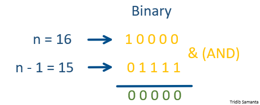

  ```py
  def is_power_of_two(n):
      return n > 0 and n & (n - 1) == 0
  ```

---

### Pow(x, n)

Implement `pow(x, n)`, which calculates `x` raised to the power `n` (i.e., `x^n`).

- Explanation:

  - instead of looping and multiplying `x` by itself `n` times, we can use **Divide & conquer** to reduce the number of multiplications
    - `x^n = x^(n/2) * x^(n/2) * x^(n%2)`
    - `x^10` = `x^5 * x^5`
      - `x^5` = `x^2 * x^2 * x`
        - `x^2` = `x * x`
          - `x^1` = `x`
            - `x^0` = `1`

- Time complexity: `O(log n)`

```py
def my_pow(x, n):
    if n == 0:
        return 1

    if n > 0:
        partial = my_pow(x, n // 2)
        if n % 2 == 0:
            return partial * partial
        else:
            return partial * partial * x
    else:
        partial = my_pow(x, -n // 2)
        if n % 2 == 0:
            return 1 / (partial * partial)
        else:
            return 1 / (partial * partial * x)

# ---------------------------OR------------------------------

def my_pow(x, n):
    def helper(x, n):
      if x == 0: return 0 # base case
      if n == 0: return 1 # base case

      res = helper(x, n // 2)
      return res * res * x if n % 2 else res * res

    return helper(x, n) if n >= 0 else 1 / helper(x, -n)
```

---

### Climbing Stairs

You are climbing a staircase. It takes `n` steps to reach the top.

Each time you can either climb `1` or `2` steps. In how many distinct ways can you climb to the top?

- Ex:

  - Input: `n = 2`
  - Output: `2`
  - Explanation: There are two ways to climb to the top.
    1. `1 step + 1 step`
    2. `2 steps`

- **Explanation**
  
  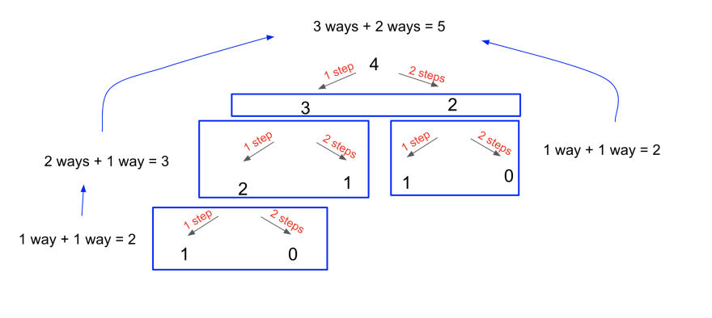
  - We can use **dynamic programming** to solve this problem
  - We can use a **bottom-up** approach to solve this problem
  - We can create an array of size `n + 1` to store the number of ways to reach each step
  - We can then loop through the array and calculate the number of ways to reach each step
    - The number of ways to reach the current step is equal to the number of ways to reach the previous step + the number of ways to reach the step before the previous step
    - We can then return the last element in the array

```py
def climbStairs(n):
    # create an array of size n + 1 to store the number of ways to reach each step
    dp = [0] * (n + 1)

    # set the first two elements in the array to 1
    dp[0] = 1
    dp[1] = 1

    # loop through the array and calculate the number of ways to reach each step
    for i in range(2, n + 1):
        dp[i] = dp[i - 1] + dp[i - 2]

    # return the last element in the array
    return dp[-1]
```

---

### Partitioning Into Minimum Number Of Deci-Binary Numbers

A decimal number is called **deci-binary** if each of its digits is either `0` or `1` without any leading zeros. For example, `101` and `1100` are **deci-binary**, while `112` and `3001` are not.

Given a string `n` that represents a positive decimal integer, return the **minimum** number of positive **deci-binary** numbers needed so that they sum up to `n`.

- EX:

  - Input: `n = "32"`
    - Output: `3`
    - Explanation: `10 + 11 + 11 = 32`
  - Input: `n = "82734"`
  - Output: `8`

- Explanation:

  - If each deci-binary number has no higher than a `1` in the each position, then it will take at least `x` numbers to sum up to `n`, where `x` is the largest digit in `n`
  - This means that the largest character in any position in `n` will determine how many deci-binary numbers must be added together to obtain `n`.
    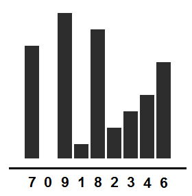
    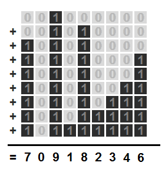

  ```py
  # 82734 - 11111 = 71623
  # 71623 - 11111 = 60512
  # 60512 - 10111 = 50401
  # 50401 - 10101 = 40300
  # 40300 - 10100 = 30200
  # 30200 - 10100 = 20100
  # 20100 - 10100 = 10000
  # 10000 - 10000 = 0

  # -> 8 times

  # 42 - 1111 = 37
  # 37 - 1111 = 26
  # 26 - 1111 = 15
  # 15 - 1111 = 4
  # 4 - 1111 = -7 (stop)
  ```

```py
def min_partitions(n):
    # convert the string to a list of integers
    nums = [int(num) for num in n]

    # return the largest digit in the list
    return max(nums)
```

---

## Recursion & Backtracking

- Usually the time complexity of backtracking is `O(2^n)`
  - `2` because we have two choices at each step
  - `n` because we have to make `n` decisions which is usually the `height` of the decision tree

### Fibonacci Number

The Fibonacci sequence is a series of numbers where a number is the sum of the two preceding numbers. The sequence starts with `0, 1, 1, 2, 3, 5, 8, 13, 21, 34, ...`

- EX: nth entry = `fib(4) --> 3`

#### Recursion solution steps

- The function takes an integer n as input, which represents the position of the number we want to find in the Fibonacci sequence.
- If n is not 0 or 1, the function returns the sum of the previous two numbers in the sequence, which are found by recursively calling the function with `n-1` and `n-2` as inputs.

  - For example, if we call `fib(5)`, the function will return the sum of the previous two numbers in the sequence: `fib(4)` + `fib(3)`. To find `fib(4)`, it will call `fib(3)` and `fib(2)`, and so on, until it reaches the base cases of `fib(0)` and `fib(1)`.
    
  - we will neglect `fib(0)` as it returns 0, and will only focus on `fib(1)`, which returns 1. This means that `fib(2)` will return 1, and `fib(3)` will return 2. This means that `fib(4)` will return 3, and `fib(5)` will return 5.
    

- Solution 1 - using recursion `O(2^n)` --> exponential time (BAD)

  - `O(2^n)` because we're calling the function twice for each number in the sequence and doing this for each level(`n` levels)

  ```py
  def fib(n):
      if n < 2:
          return n
      return fib(n - 1) + fib(n - 2)
  ```

**INTERVIEW QUESTION:** How can we improve this `O(2^n)` performance?

- **Memoization:** In the current implementation, the function recalculates the same values multiple times, which can be inefficient. We can use memoization to store the results of previous calculations and avoid redundant calculations.
  

  ```py
  cache = {}

  def fib(n):
      if n in cache:
          return cache[n]
      elif n < 2:
          return n
      else:
          result = fib(n-1) + fib(n-2)
          cache[n] = result
          return result
  ```

- using generic memoization function (useful for interviews)

  ```py
  def slowFib(n):
    if (n < 2):
      return n
    return fib(n - 1) + fib(n - 2)

  # generic memoization function
  def memoize(fn):
    cache = {}
    def memoized(*args):
      if args in cache:
        return cache[args]
      res = fn(*args)
      cache[args] = res
      return res
    return memoized

  # apply memoization to fib function
  fib = memoize(slowFib)
  ```

---

#### Fibonacci looping solution

```py
# O(n)
def fib(n):
    total = 0
    fib0, fib1 = 0, 1
    for x in range(n+1):
        if x > 0:
            if x == 1:
                total = 1
            else:
                total = fib0 + fib1
                fib0 = fib1
                fib1 = total
    return total
```

---

### Restore IP Addresses

Given a string s containing only digits, return all possible valid IP addresses that can be obtained from s. You can return them in any order.

A valid IP address consists of exactly four integers, each integer is between `0` and `255`, separated by single dots and cannot have leading zeros. For example, `"0.1.2.201"` and `"192.168.1.1"` are valid IP addresses and `"0.011.255.245"`, `"192.168.1.312"` and `"

- Ex: `s = "25525511135"`

  - Output: `["255.255.11.135", "255.255.111.35"]`

- Explanation:

  - What we want to do is to just know **where to insert the dots**.
  - We can use **Decision Tree** to solve this problem.
    - we can put the first `dot` after the first number, **or** after the second number, **or** after the third number.
      - this will result `3` possible combinations for each number
        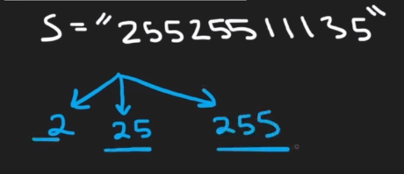
      - for each of these combinations, We check if it's valid -> **(if the number is less than `256` or length of the combination is less than `3` or it doesn't start with `0`)**. If it's valid, we then can put the second `dot` after the second number **or** after the third number and so on.
        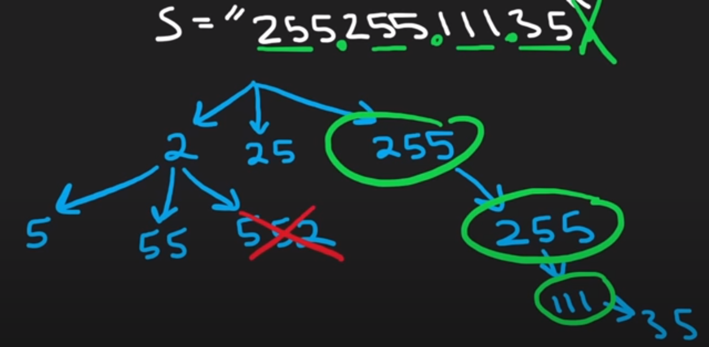
  - We can do this by using a helper function that will add the dots to the string. We can then use a `for` loop to iterate through the string and add the dots to the string. We can then use a helper function to check if the current string is a valid IP address. If it is, we can add it to the result list. We can then return the result list.
  - Time complexity: `O(3^4) = O(1)` because we are only checking 3 possible combinations for each number, and we have a total of 4 numbers (4 levels).

- Example with steps for explanation
  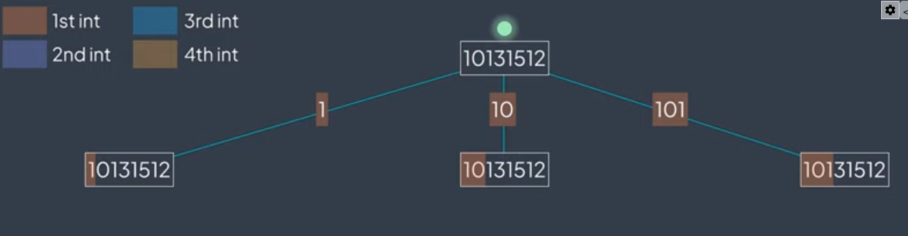
  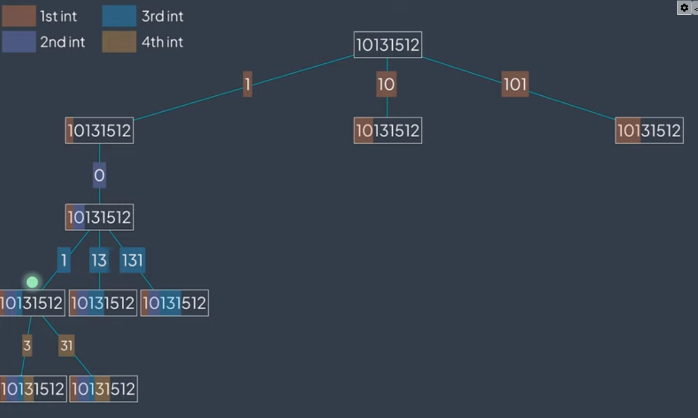
  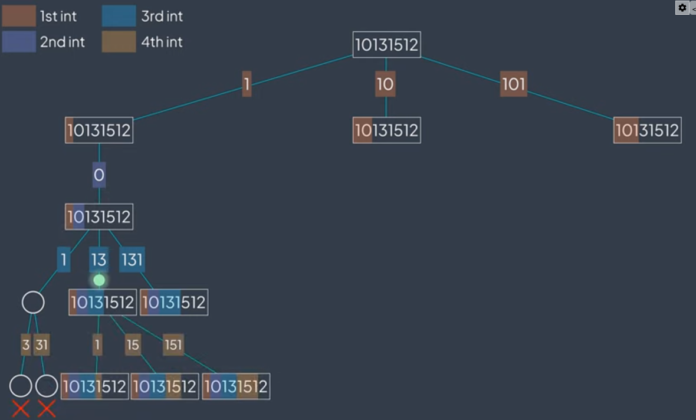
  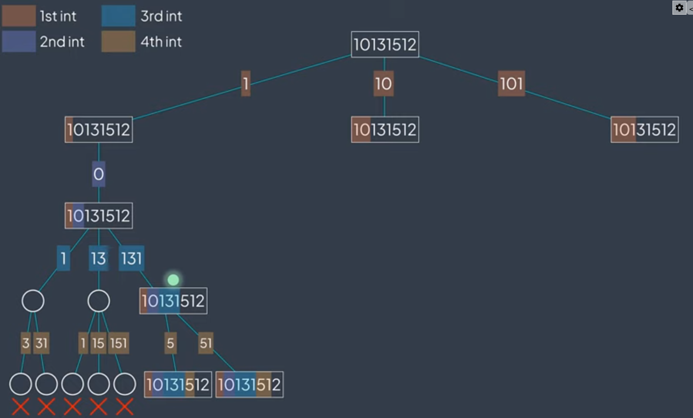
  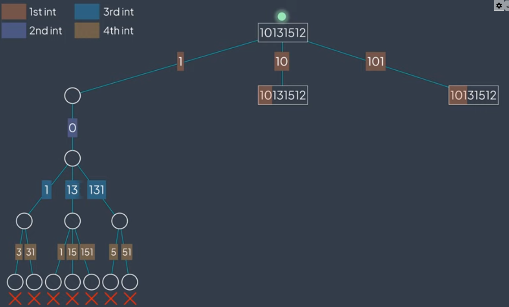
  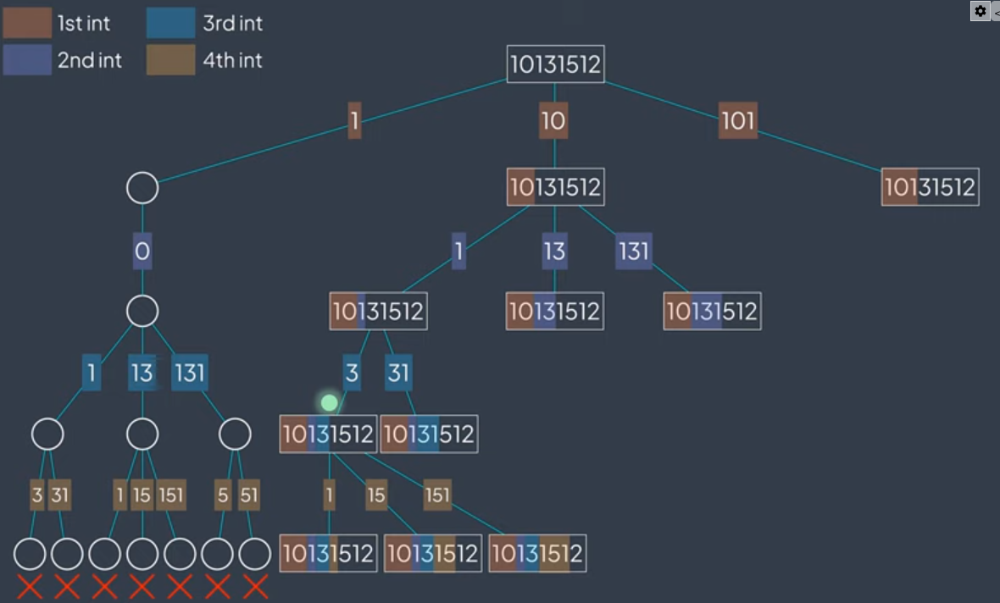
  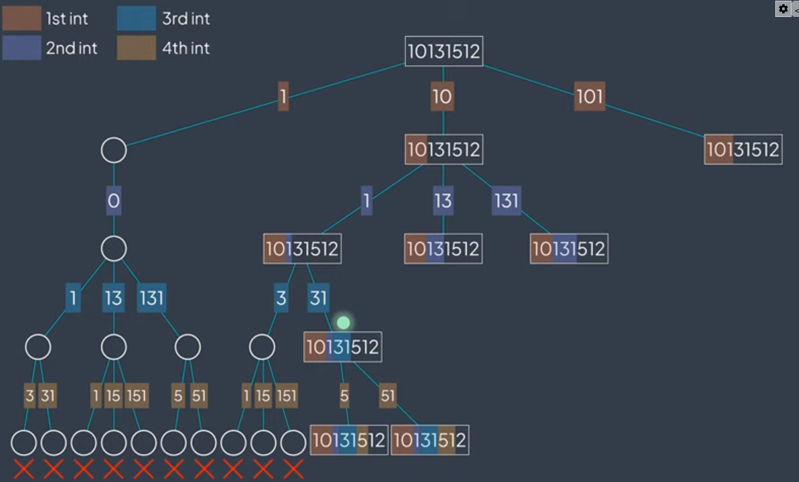
  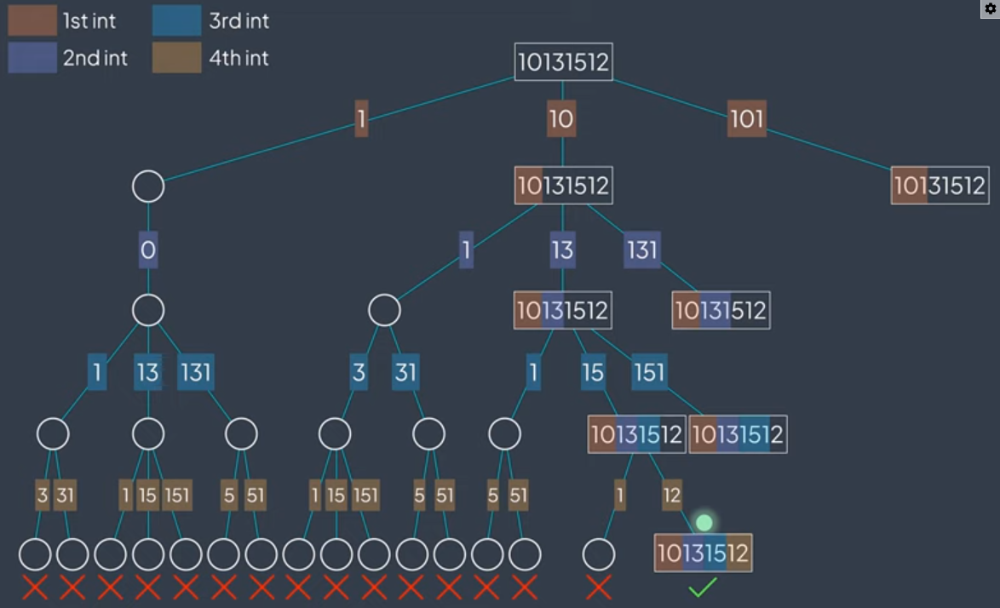

```py
def restoreIpAddresses(s):
    res = []
    # check if the string is valid
    if len(s) > 12 or len(s) < 4:
        return res

    def backtrack(i, dots, curIP):
      """
      i: current index in the string
      dots: number of inserted dots in the current IP address so far
      curIP: current IP address that we are building
      """
      # base case
      if dots == 4 and i == len(s):
        res.append(curIP[:-1]) # remove the last dot and append to the result
        return
      if dots > 4:
        return

      # loop through the string and add the dots to the string (using min -> to avoid index out of range error if the string is less than 3 characters)
      for j in range(i, min(i+3, len(s))):
        # check if the current string is a valid IP address (if the number is less than 256 or the starting character is not 0)
        if int(s[i:j+1]) <= 255 and (i == j or s[i] != '0'):
          backtrack(j+1, dots+1, curIP + s[i:j+1] + '.')

    backtrack(0, 0, '')
    return res
```

---

### Permutations

Given an array `nums` of distinct integers, return all the possible permutations. You can return the answer in **any order**.

- Ex: `nums = [1, 2, 3]`

  - Output: `[[1,2,3], [1,3,2], [2,1,3], [2,3,1], [3,1,2], [3,2,1]]`

- Explanation:

  - We can use **Decision Tree** to solve this problem.
  - For each element, we can either choose to include it in the permutation or not include it in the permutation.
    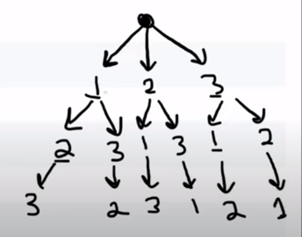
    - if we choose to include it in the permutation, we can then choose to include the next element in the permutation or not include the next element in the permutation.
    - if we choose to not include it in the permutation, we can then choose to include the next element in the permutation or not include the next element in the permutation.
      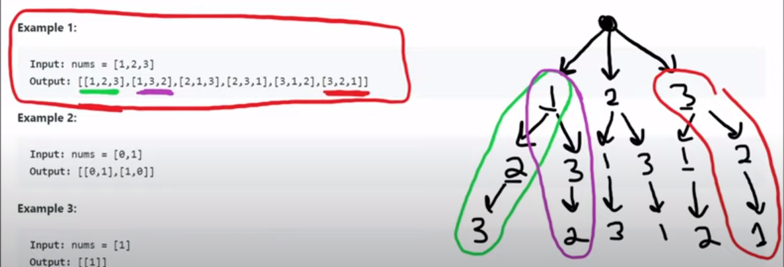
  - We can do so by dividing the problem into subproblems by removing the element and getting the permutations of the remaining elements until we have no more elements left.
    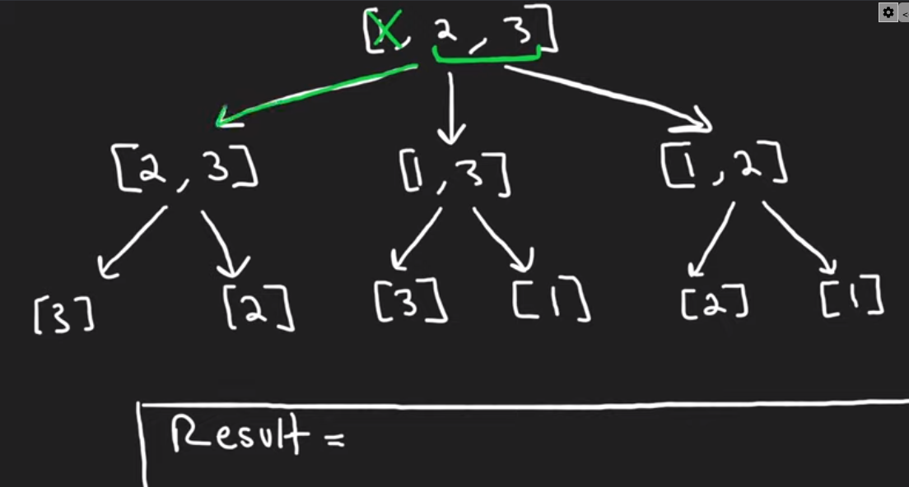
    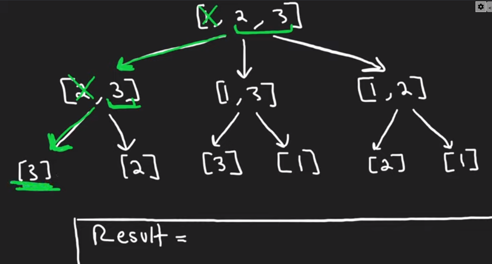
  - Then we can go up the tree and add the element back to the permutation and remove the next element and get the permutations of the remaining elements.
    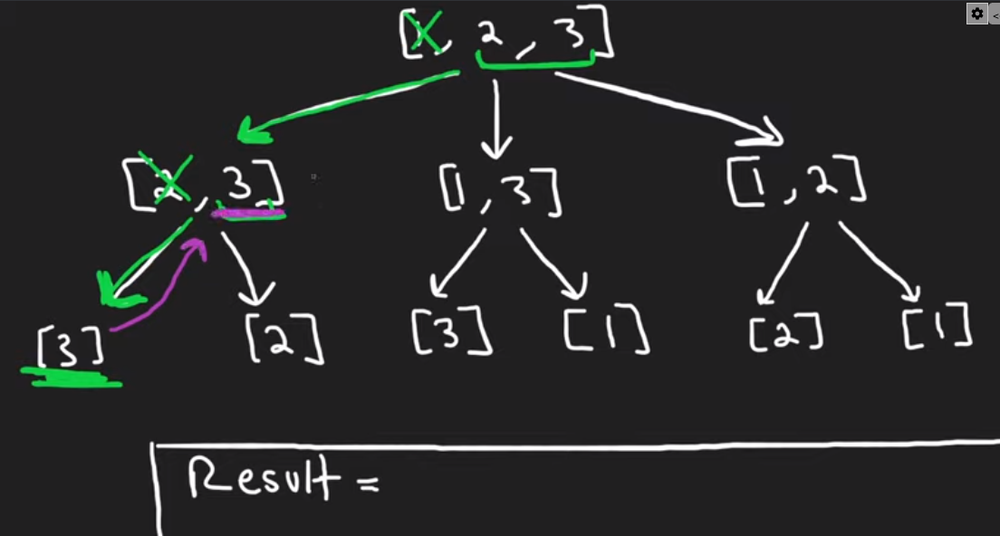
    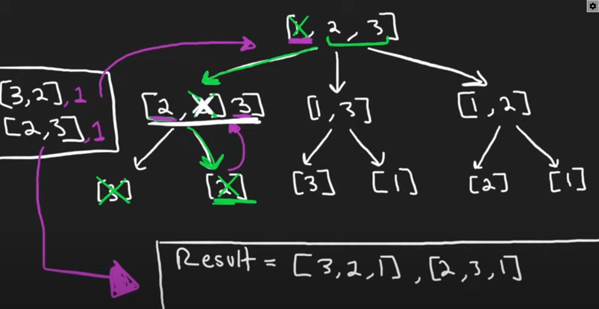
  - When we have no more elements left, we can append the current permutation to the result list.
    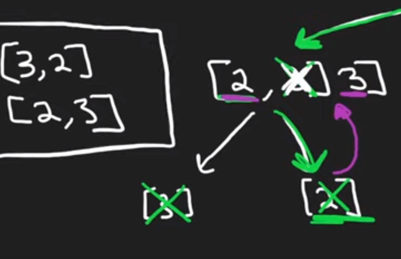

  

```py
def permute(nums):
    res = []

    def backtrack(nums, cur):
        # base case
        if not nums:
            res.append(cur)
            return

        # loop through the nums and remove the current element and get the permutations of the remaining elements
        for i in range(len(nums)):
            backtrack(nums[:i] + nums[i+1:], cur + [nums[i]])

    backtrack(nums, [])
    return res
```

---

### Permutations II

Given a collection of numbers, `nums`, that might contain duplicates, return all possible unique permutations in any order.

- Ex: `nums = [1, 1, 2]`

  - Output: `[[1,1,2], [1,2,1], [2,1,1]]`

- Solution 1: **sorting**

  - Explanation:
    - We can use **Decision Tree** to solve this problem.
    - Same as the previous problem, but we need to check if the current element is the same as the previous element. If it is, we can skip it.
      - This is done by **sorting** the array first. so that the same elements are next to each other.

  ```py
  def permuteUnique(nums):
      res = []
      nums.sort()

      def backtrack(nums, cur):
          # base case
          if not nums:
              res.append(cur)
              return

          for i in range(len(nums)):
              # skip the current element if it is the same as the previous element
              if i > 0 and nums[i] == nums[i-1]:
                  continue
              backtrack(nums[:i] + nums[i+1:], cur + [nums[i]])

      backtrack(nums, [])
      return res
  ```

- Solution 2: **HashMap**

  - Explanation:
    - Same as the previous problem, but we need to check if the current element is the same as the previous element. If it is, we can skip it.
      - This is done using a **HashMap** to keep track of the elements that we have seen so far.
    - We create a Hashmap with the count of each element in the array. to have unique keys
      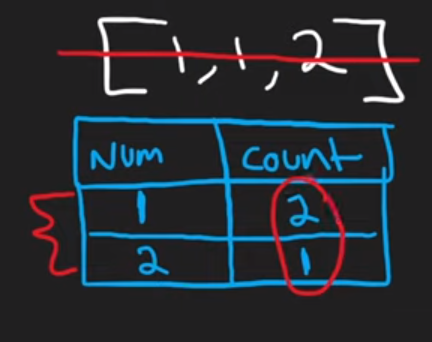
    - we use this hashmap to create the decision tree.
      - we update the hashmap by decrementing the count of the current element on each level of the decision tree.
        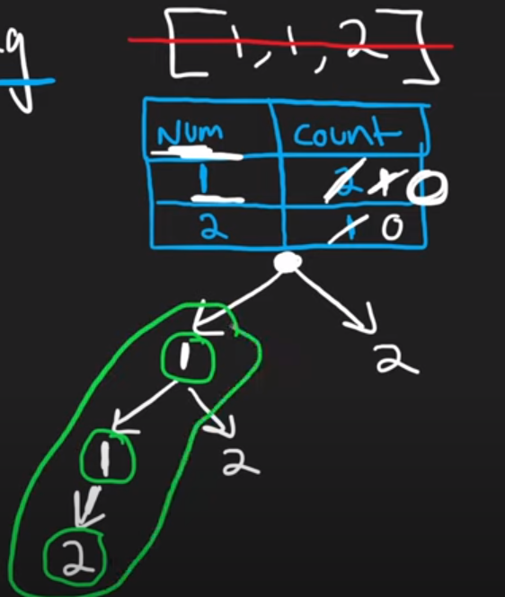

  ```py
  def permuteUnique(nums):
      res = []
      count = {}
      for num in nums:
          count[num] = count.get(num, 0) + 1

      def backtrack(cur):
          # base case
          if cur and len(cur) == len(nums):
              res.append(cur)
              return

          # loop through the hashmap (unique keys) and add the current element to the permutation if the count is greater than 0
          for num in count:
              if count[num] > 0:
                  count[num] -= 1
                  backtrack(cur + [num])
                  count[num] += 1

      backtrack([])
      return res
  ```

---

### Combinations

Given two integers `n` and `k`, return all possible combinations of `k` numbers out of the range `[1, n]`.

You may return the answer in **any order**.

- Ex: `n = 4, k = 2`

  - Output: `[[1,2], [1,3], [1,4], [2,3], [2,4], [3,4]]`

> - **Compination:** s a mathematical technique that determines the number of possible arrangements in a collection of items where the **order of the selection does not matter**
> - **Compination vs Permutation (تباديل و توافيق)** > 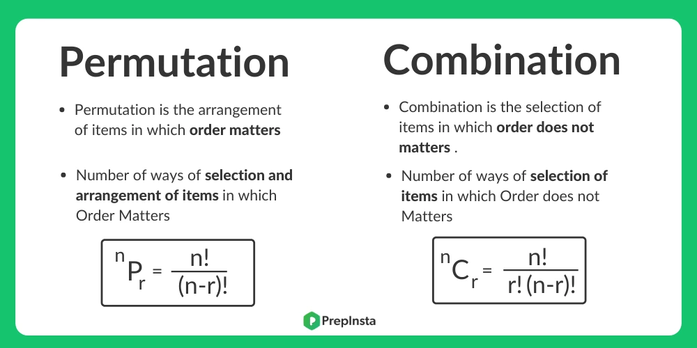

- Explanation:

  - We can use **Decision Tree** to solve this problem. (Backtracking)
  - For each element, we can either choose to include it in the combination or not include it in the combination.
  - The height of the decision tree is `k` because we need to choose `k` elements.
    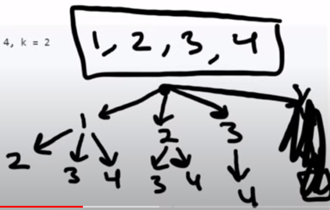
  - As this is a `combination` problem and not a `permutation` problem, meaning that the order doesn't matter so we don't want duplicates like (`[1,2]` and `[2, 1]`)
    - So, we need to make sure that we don't include the same element twice in the combination.
    - To do so, we need to keep track of the `start` index of the elements that we can choose from. so that we don't choose the same element twice.

  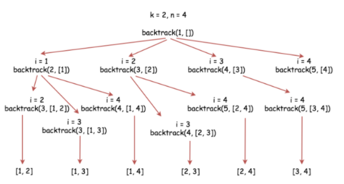

```py
# Time complexity: O(K * n^k) -> O(n^k) Exponential
def combine(n, k):
    res = []

    def backtrack(start, cur):
        # base case
        if len(cur) == k:
            res.append(cur)
            return

        # loop through the numbers from start to n (including n)
        for i in range(start, n+1):
            backtrack(i+1, cur + [i])

    backtrack(1, [])
    return res
```

---

### Subsets

Given an integer array `nums` of **unique** elements, return all possible subsets (the power set).

The solution set **must not** contain duplicate subsets. Return the solution in **any order**.

- Ex: `nums = [1, 2, 3]`

  - Output: `[[], [1], [2], [3], [1,2], [1,3], [2,3], [1,2,3]]`

- Explanation:

  - We can use **Decision Tree** to solve this problem.
    - For each element, we can either choose to include it in the subset or not include it in the subset.
      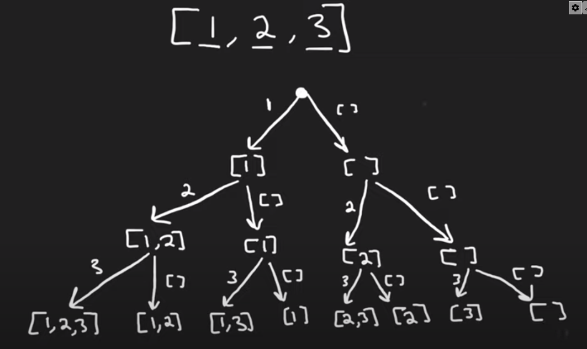
      - if we choose to include it in the subset, we can then **choose to include the next element in the subset or not**.
      - if we choose to not include it in the subset, we can then choose to include the next element in the subset or not include the next element in the subset.

  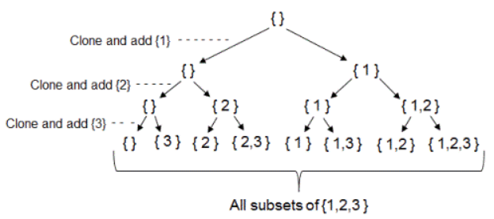

- Steps:

  - We can use a helper function `dfs` to build the subsets.
  - We can then use a `for` loop to iterate through the array and call the helper function.
  - We can then return the result list.
  - Time complexity: `O(2^n)` because we are making 2 decisions for each element in the array.

- Time complexity: `O(n * 2^n)`

```py
def subsets(nums):
    res = []

    def dfs(i, cur):
        # base case
        if i == len(nums):
            res.append(cur)
            return

        # decision to include the current element in the subset
        dfs(i+1, cur + [nums[i]])
        # decision to not include the current element in the subset
        dfs(i+1, cur)

    dfs(0, [])
    return res
```

---

### Subsets II

Given an integer array `nums` that may contain duplicates, return all possible subsets (the power set).

The solution set **must not** contain duplicate subsets. Return the solution in **any order**.

- Ex: `nums = [1, 2, 2]`

  - Output: `[[], [1], [1,2], [1,2,2], [2], [2,2]]`

- Explanation:
  - Difference between this problem and the previous problem is that this problem contains duplicates.
    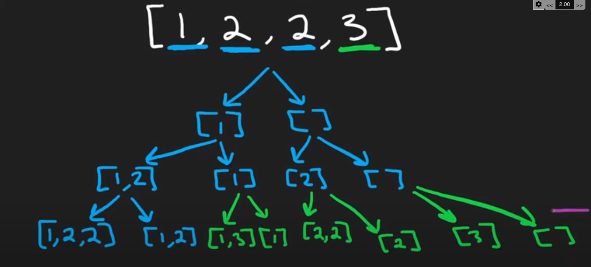
  - To avoid duplicates, we can sort the array first. then we can **skip** the current element if it is the same as the previous element (by checking `nums[i] == nums[i+1]` and that the next-index is not out of bounds) and then we can skip the current element. by `i += 1`.
    - We **only skip it for the second decision**, for example, if we are at the first decision which to include/exclude `2` in the subset, we can't skip it because we need to make sure that we include `2` in the subset. So we add it to the left subtree.
      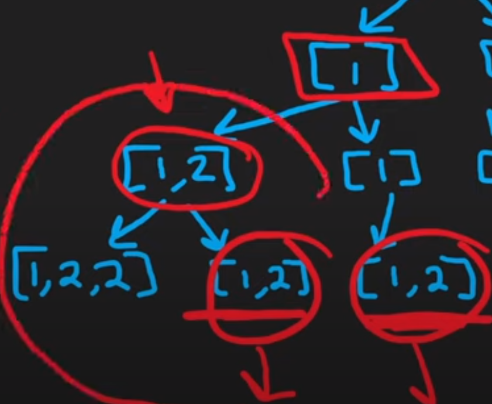
    - But if we include it in the right subtree, we will have duplicates. So we need to skip it (by moving the index to the next element)
      
      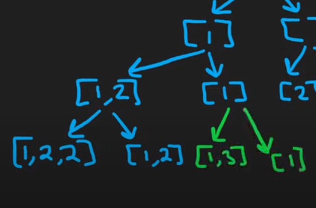

```py
def subsetsWithDup(nums):
    res = []
    nums.sort()

    def dfs(i, cur):
        # base case
        if i == len(nums):
            res.append(cur)
            return

        # include the current element in the subset
        dfs(i+1, cur + [nums[i]])

        # skip the current element if it is the same as the next element
        while i+1 < len(nums) and nums[i] == nums[i+1]:
          i += 1

        # not include the current element in the subset
        dfs(i+1, cur)

    dfs(0, [])
    return res
```

---

### Sum of All Subset XOR Totals

The **XOR total** of an array is defined as the bitwise `XOR` of **all its elements**, or `0` if the array is **empty**.

- Ex: `nums = [1, 3]`

  - Output: `6`
  - Explanation: `1 XOR 3 = 2`

- Explanation:

  - We can use **Decision Tree** to solve this problem.
  - we need to get all the `XOR` of all the **subsets**.
    - getting the subsets is the same as the previous problems. (include the current element in the subset or not include the current element in the subset)
    - Then we can get the `XOR` of each subset and add it to the result.

- `XOR` is calculated by `^` operator.

```py
def subsetXORSum(nums):
    res = 0

    def dfs(i, cur):
        nonlocal res
        # base case
        if i == len(nums):
            res += cur
            return

        # include the current element in the subset
        dfs(i+1, cur ^ nums[i])

        # not include the current element in the subset
        dfs(i+1, cur)

    dfs(0, 0)
    return res
```

---

### Count Number of Maximum Bitwise-OR Subsets

Given an integer array `nums`, find the **maximum** possible `bitwise OR` of a **subset** of `nums` and return the number of different **non-empty** subsets with the **maximum** `bitwise OR`.

An array `a` is a **subset** of an array `b` if `a` can be obtained from `b` by deleting some (possibly zero) elements of `b`. Two subsets are considered **different** if the indices of the elements chosen are different.

The `bitwise OR` of an array `a` is equal to `a[0] OR a[1] OR ... OR a[a.length - 1]` (**0-indexed**).

- Ex: `nums = [3, 1]`

  - Output: `2`
  - Explanation: The maximum possible bitwise OR of a subset is `3`. There are `2` subsets with a bitwise OR of `3`:
    - `[3]`
    - `[3,1]`

- Explanation:

  - **We just want to count the number of subsets that have the maximum `bitwise OR`**.
  - We can use **Decision Tree** to solve this problem.
    - For each element, we can either choose to include it in the subset or not include it in the subset.
  - **Maximum Bitwise-OR Subsets** is the maximum bitwise `OR` of a subset -> so we calculate the maximum bitwise `OR` of the array first.
    - which is the (`OR` of all the elements in the array).
  - Time complexity: `O(2^n)` because we are making 2 decisions for each element in the array.

- `OR` is calculated by `|` operator.

```py
def countMaxOrSubsets(nums):
    res = 0
    max_or = 0
    for num in nums:
        max_or |= num

    def dfs(i, cur):
        nonlocal res
        # base case
        if i == len(nums):
            # max is the maximum bitwise OR of a subset which is the max number in the array
            if cur == max_or:
                res += 1
            return

        # include the current element in the subset
        dfs(i+1, cur | nums[i])

        # not include the current element in the subset
        dfs(i+1, cur)

    dfs(0, 0)
    return res
```

---

### Letter combinations of a phone number

Given a string containing digits from `2-9` inclusive, return all possible letter combinations that the number could represent. Return the answer in **any order**.

- A mapping of digit to letters (just like on the telephone buttons) is given below. Note that `1` does not map to any letters.
  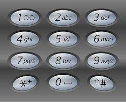

- EX:

  - Input: `digits = "23"`

- Explanation:
  - We can use a **backtracking** approach to solve this problem.
    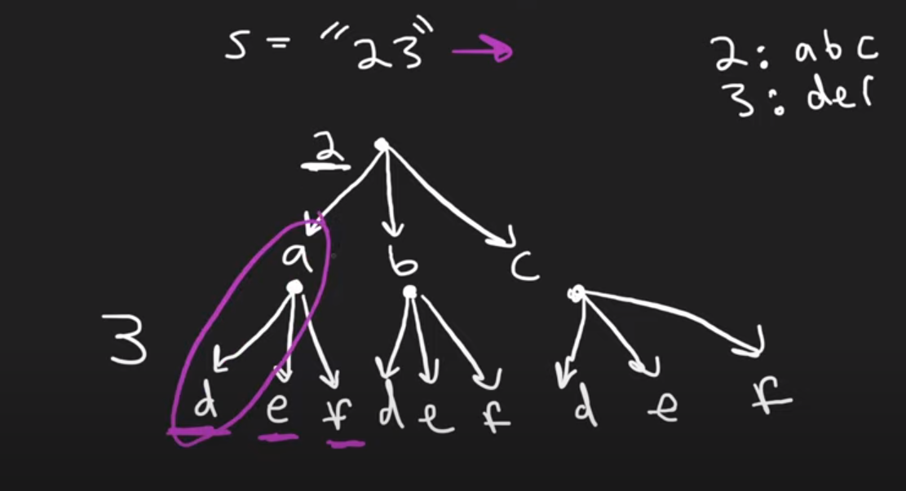
    1. We can start with an empty string and then append each letter of the first digit to the string.
    2. Then we can **recursively** call the function with the next digit and append each letter of the next digit to the string. We can continue this process until we reach the end of the string.
    3. Once we reach the end of the string, we can add the string to the result array.
  - Time complexity: `O(n.4^n)` where `n` is the length of the input string; `4` because some digits has 4 letters

```py
def letterCombinations(digits):
    # create a dictionary to store the mapping of each digit to its letters
    digit_letters = {
        '2': 'abc',
        '3': 'def',
        '4': 'ghi',
        '5': 'jkl',
        '6': 'mno',
        '7': 'pqrs',
        '8': 'tuv',
        '9': 'wxyz'
    }

    # create an array to store the result
    result = []

    # create a helper function to do the backtracking
    def backtrack(i, curStr):
        """
        i: the index of the current digit in input digits
        curStr: the current string that we're building
        """
        # if we reached the end of the string, add the string to the result array
        if i == len(digits):
            result.append(curStr)
            return

        # Else: we continue building the string
        # iterate through the letters of the current digit
        for letter in digit_letters[digits[i]]:
            # recursively call the function with the next digit (i+1 because we're moving to the next digit, and add the updated string)
            backtrack(i+1, curStr+letter)

    # call the helper function
    if digits:
        backtrack(0, '')
    return result
```

---

### N-Queens

The **n-queens** puzzle is the problem of placing `n` queens on an `n x n` chessboard such that no two queens attack each other.

Given an integer `n`, return _all distinct solutions to the **n-queens puzzle**_. You may return the answer in **any order**.

Each solution contains a distinct board configuration of the n-queens' placement, where `'Q'` and `'.'` both indicate a queen and an empty space, respectively.

- Ex: `n = 4`
  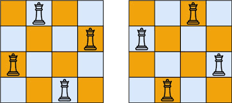

  - Output: `[[".Q..","...Q","Q...","..Q."],["..Q.","Q...","...Q",".Q.."]]`

- Explanation:
  - To prevent any queen from attacking another queen, we need to make sure that no two queens are in the same row, column, or diagonal. as the queen moves like this: (Horizontal, Vertical, Positive/Negative Diagonals)
    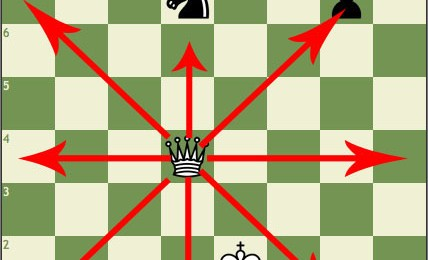
  - So:
    - Each queen must be in a different `row`
    - Each queen must be in a different `column`
    - Each queen must be in a different `diagonal`
      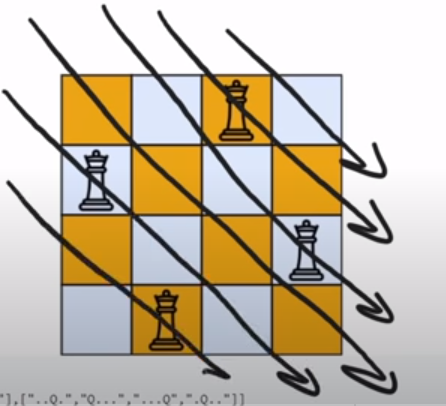
      - Positive diagonals goes from bottom left to top right **(UP)**
        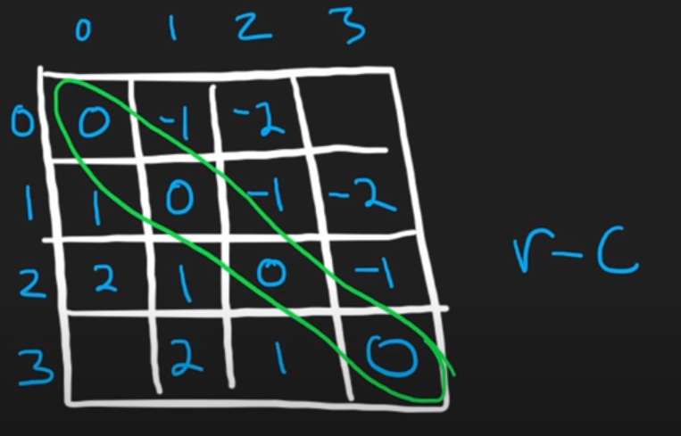
      - Negative diagonals goes from top left to bottom right **(DOWN)**
        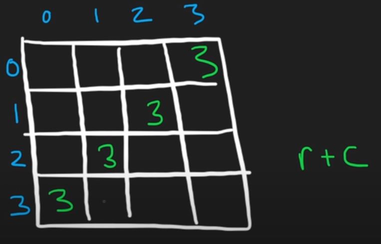
  - We can use **Decision Tree** to solve this problem.
    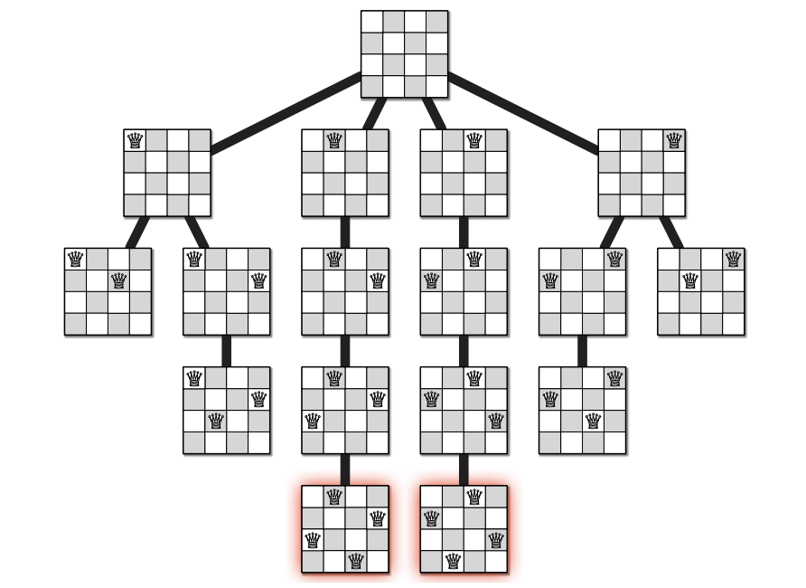
  - Each time we place a queen, we will move to the next row and then, We will need to maintain 3 sets:
    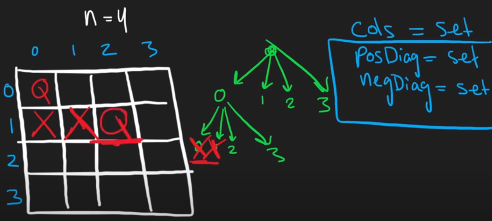
    - `cols`: to keep track of the columns that have been used
    - `positive_diagonals`: to keep track of the positive diagonals that have been used
    - `negative_diagonals`: to keep track of the negative diagonals that have been used

```py
def solveNQueens(n):
    colSet = set()
    posDiag = set() # (row + col) is the same for all cells in the same positive diagonal (r + c)
    negDiag = set() # (row - col) is the same for all cells in the same negative diagonal (r - c)

    # create a board with all empty cells
    board = [['.'] * n for _ in range(n)]

    # create an array to store the result
    res = []

    def backtrack(row):
        # if we reached the end of the board, add the board to the result array
        if row == n:
            res.append([''.join(row) for row in board])
            return

        # Else: we continue building the board
        # iterate through the columns
        for col in range(n):
            # check if the current column is not used and the current positive diagonal is not used and the current negative diagonal is not used
            if col not in colSet and (row + col) not in posDiag and (row - col) not in negDiag:
                # place the queen
                board[row][col] = 'Q'

                # add the current pos to our sets
                colSet.add(col)
                posDiag.add(row + col)
                negDiag.add(row - col)

                # recursively call the function with the next row
                backtrack(row + 1)

                # remove the queen
                board[row][col] = '.'

                # remove the current pos from our sets
                colSet.remove(col)
                posDiag.remove(row + col)
                negDiag.remove(row - col)

    backtrack(0)
    return res
```

---

### Combination Sum

Given an array of **distinct** integers `candidates` and a target integer `target`, return a list of all **unique combinations** of `candidates` where the chosen numbers sum to `target`. You may return the combinations in **any order**.

The **same** number may be chosen from `candidates` an **unlimited number of times**. Two combinations are unique if the frequency of at least one of the chosen numbers is different.

- Ex: `candidates = [2, 3, 6, 7], target = 7`

  - Output: `[[2, 2, 3], [7]]`

- Explanation:

  - Here we won't be able to solve it like [combination-sum-2](#Combinations), because we want **Unique** combinations and if we used the same decision tree, we will have duplicate combinations like this:
    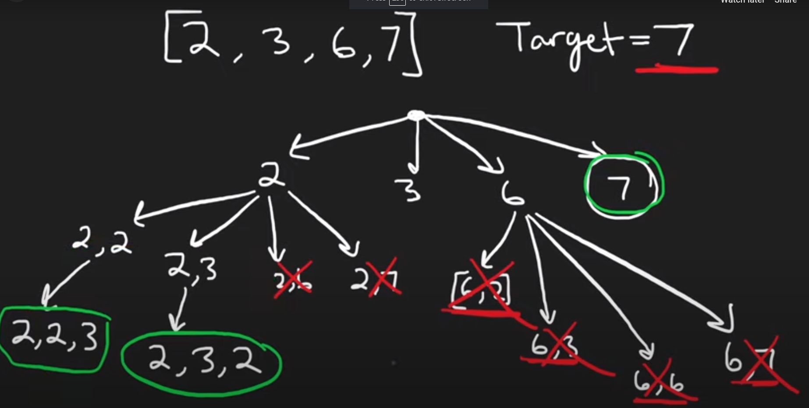
  - To overcome this problem, we will use the same same decision tree in [subsets](#Subsets) problem, because it will not lead to duplicate combinations as it doesn't use the same element twice in the same combination.
    - For each element, we can either choose to include it in the combination or not include it in the combination.
    - we can use the decision tree below, because it will not lead to duplicate combinations as it doesn't use the same element twice in the same combination.
      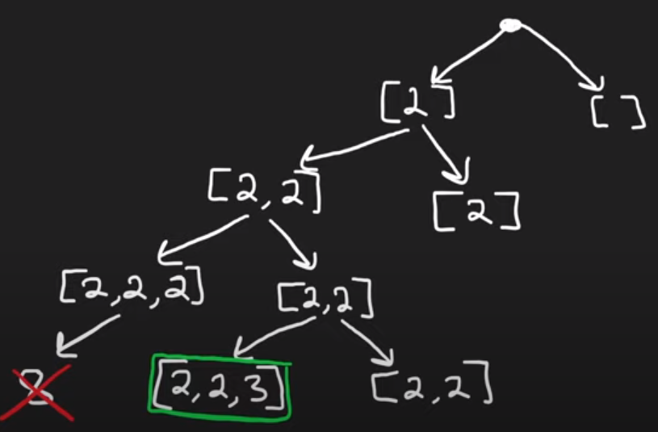
    - Now we garentee that we will not have duplicate combinations, because in the second side of the tree, we will not include the same element twice in the same combination.
    - if we choose to include it in the combination, we can then choose to include the next element in the combination or not include the next element in the combination.
    - if we choose to not include it in the combination, we can then choose to include the next element in the combination or not include the next element in the combination.

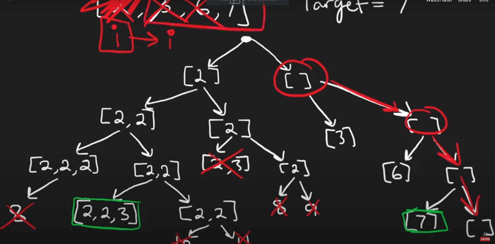

- Time complexity: `O(2^target)` because we are making `2` decisions for each element in the array, and we have `target` levels (height of the decision tree).

```py
def combinationSum(candidates, target):
    res = []

    def dfs(i, cur, total):
        """
        i: pointer to the current index in the array
        cur: current combination that we are building
        total: total sum of the current combination (used instead of sum(cur) to avoid calling sum() function -> O(n)) each time
        """
        if total == target:
            res.append(cur)
            return
        if i >= len(candidates) or total > target:
            return

        # decision to include or not the current element in the combination
        dfs(i, cur + [candidates[i]], total + candidates[i]) # i stays the same because we can use the same element multiple times

        dfs(i+1, cur, total) # i increases by 1 because we want to skip the current element to avoid duplicate combinations

    dfs(0, [], 0)
    return res
```

---

### Combination Sum II

Given a collection of candidate numbers (`candidates`) and a target number (`target`), find all unique combinations in `candidates` where the candidate numbers sum to `target`.

Each number in `candidates` may only be used **once** in the combination. -> **The solution set must not contain duplicate combinations**

- Ex: `candidates = [10, 1, 2, 7, 6, 1, 5], target = 8`

  - Output: `[[1, 1, 6], [1, 2, 5], [1, 7], [2, 6]]`
  - Notice how `1` is used **twice** in the same combination, but it is not used twice in the same combination.

- Explanation:

  - Same as the previous problem, but we need to avoid duplicate combinations.
  - we do so by sorting the array, and then skipping the duplicates.

- Time complexity: `O(nlog(n) . 2^target)`

```py
def combinationSum2(candidates, target):
    res = []
    candidates.sort()

    def dfs(i, cur, total):
        if total == target:
            res.append(cur)
            return
        if i >= len(candidates) or total > target:
            return

        dfs(i+1, cur + [candidates[i]], total + candidates[i])

        # skip the duplicates
        while i < len(candidates) - 1 and candidates[i] == candidates[i+1]:
            i += 1

        dfs(i+1, cur, total)

    dfs(0, [], 0)
    return res
```

---

### Word Break

Given a string `s` and a dictionary of strings `wordDict`, return `true` if `s` can be segmented into a space-separated sequence of one or more dictionary words.

> Note that the same word in the dictionary may be reused multiple times in the segmentation.

- Ex: `s = "leetcode", wordDict = ["leet", "code"]`

  - Output: `true`
  - Explanation: Return true because "leetcode" can be segmented as "leet code".

- Explanation:

  - What we want is to find the index on which we split the string into two substrings, and both substrings are in the dictionary.
    - This is done by using **Dynamic Programming (Backtracking)**.
  - We can check each substring of the string, and check if it is in the dictionary.
    - If it is in the dictionary, then we can check the rest of the string.
      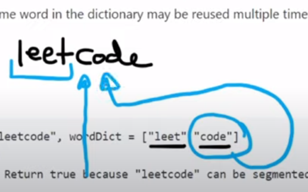
    - If it is not in the dictionary, then we can skip it and check the next substring.
      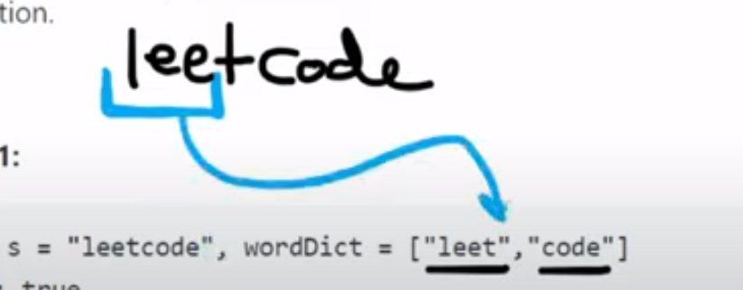
  - We can use a `dp` array to store the result of the subproblems.
    - `dp[i]` will be `true` if the substring `s[:i]` can be segmented into a space-separated sequence of one or more dictionary words.
  - We can iterate through the string, and for each index `i`, we can check if the substring `s[:i]` can be segmented into a space-separated sequence of one or more dictionary words.
    - We can do so by iterating through the string from `0` to `i`, and for each index `j`, we can check if the substring `s[:j]` can be segmented into a space-separated sequence of one or more dictionary words, and if the substring `s[j:i]` is in the dictionary.
  - So if we can get to the **last index** in the `db` and then:
    - If both conditions are `true`, then we can set `dp[i]` to `true`.
      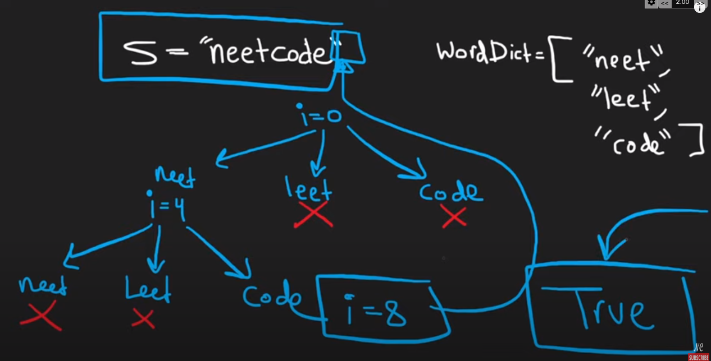
    - Else: we set `dp[i]` to `false`.
      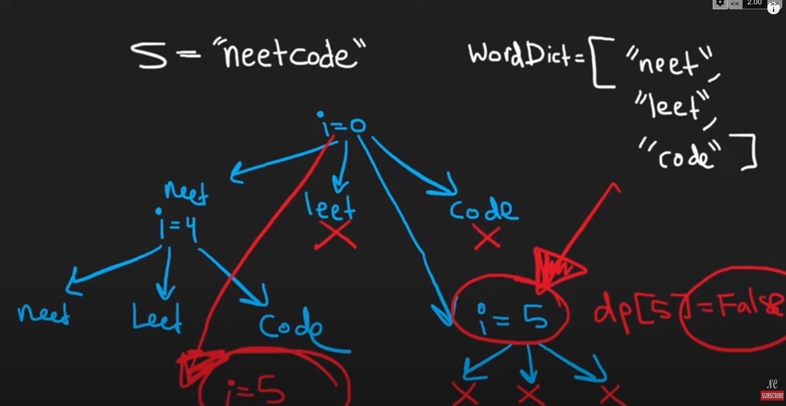
    - We can return `dp[-1]` as the result.

- Time complexity: `O(n.m)` where `n` is the length of the string, and `m` is the length of the dictionary.

```py
# Solution 1 ✅
def wordBreak(s, wordDict):
    res = [0] * (len(s))
    l = 0
    for r in range(len(s)):
        if s[l:r+1] in wordDict:
            while l <= r:
                res[l]  True
                l += 1
    return res[-1]

# ------------------------------------------------------
# Or
def wordBreak(s, wordDict):
    dp = [False] * (len(s) + 1)
    dp[0] = True

    for i in range(1, len(s) + 1):
        for j in range(i):
            if dp[j] and s[j:i] in wordDict:
                dp[i] = True
                break

    return dp[-1]

# ----------------------------------------------------------

# Solution 2
def wordBreak(s, wordDict):
    dp = [False] * (len(s) + 1)
    dp[len(s)] = True # base case -> empty string is in the dictionary

    for i in range(len(s)-1, -1, -1):
        for w in wordDict:
            # check if the substring s[i:] is in the dictionary (we first check if there is enough characters to check the substring s[i:])
            if i + len(w) <= len(s) and s[i:i+len(w)] == w:
                dp[i] = dp[i+len(w)]
            if dp[i]:
                # if the substring s[i:] is in the dictionary, then we can break the loop
                break

    # return the result of the subproblem s[:0]
    return dp[0]
```

---

### Word Search

Given an `m x n` grid of characters `board` and a string `word`, return `true` if `word` exists in the grid.

The word can be constructed from letters of sequentially adjacent cells, where adjacent cells are horizontally or vertically neighboring. The same letter cell may not be used more than once.

- Ex: `board = [["A","B","C","E"],["S","F","C","S"],["A","D","E","E"]], word = "SEE"`

  - Output: `true`
    img
    
  - Output: `true`

- Explanation:

  - We can use **Backtracking** to solve this problem.
    1. Scan board, find starting position with matching word first letter
    2. From starting position, DFS (4 (`up`, `down`, `left`, `right` **4 directions**) match word's rest letters)
    3. For each visited letter, mark it as visited, by adding it to the `path` set.
       - This is done so that if we started at a letter, and then we went to the right, then when calling `dfs` again on the new letter, we don't go back to the letter we started at (left).
    4. If found any matching, terminate, Otherwise, no matching found, return false.

- Solution Example
  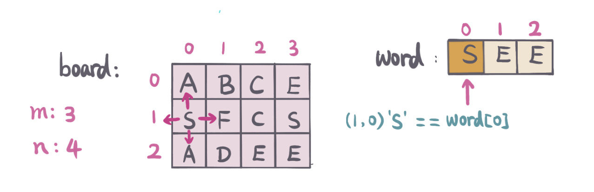
  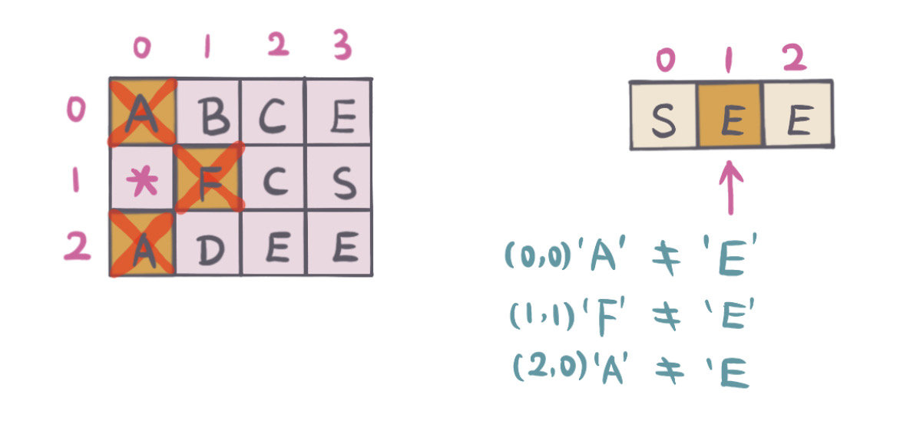
  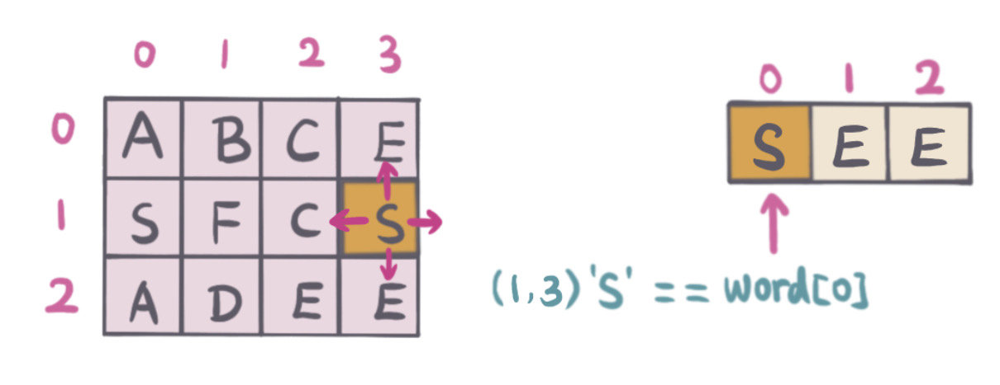
  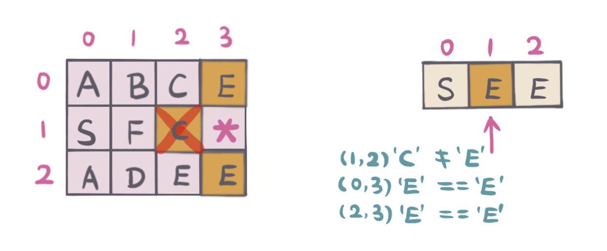
  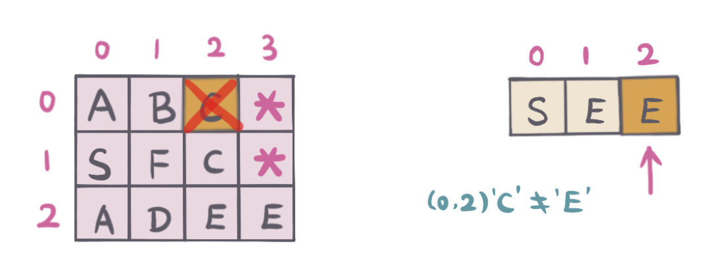
  
  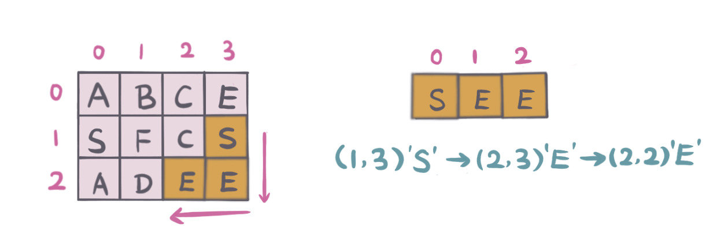

- Time complexity: `O(n.m.4^s)` where:
  - `n` is the number of rows
  - `m` is the number of columns
  - `s` is the length of the word -> `4` because we have `4` directions

```py
def exist(board, word):
    ROWS, COLS = len(board), len(board[0])
    path = set() # to keep track of the current path and make sure we don't visit the same cell twice

    def dfs(r, c, i):
        if i == len(word):
            return True

        # check if out of bounds or if the current cell is not equal to the current character of the word or if the current cell is in the current path
        if r < 0 or r >= ROWS or c < 0 or c >= COLS or (r, c) in path or board[r][c] != word[i]:
            return False

        # Else we can add the current cell to the current path
        path.add((r, c))

        # Check the neighbors
        res = (
            dfs(r + 1, c, i + 1)
            or dfs(r - 1, c, i + 1)
            or dfs(r, c + 1, i + 1)
            or dfs(r, c - 1, i + 1)
        )

        # Remove the current cell from the current path
        path.remove((r, c))

        return res

    for r in range(ROWS):
      for c in range(COLS):
        if dfs(r, c, 0):
          return True

    return False
```

---

### Word Search II

Given an `m x n` `board` of characters and a list of strings `words`, return all words on the board.

Each word must be constructed from letters of sequentially adjacent cells, where adjacent cells are horizontally or vertically neighboring. **The same letter cell may not be used more than once in a word**.

- Ex: `board = [["o","a","a","n"],["e","t","a","e"],["i","h","k","r"],["i","f","l","v"]], words = ["oath","pea","eat","rain"]`
  

  - Output: `["eat","oath"]`

- Explanation:

  - The difference here between this problem and the previous one is that we have a list of words instead of one word.
    - So if we used the same solution as the previous problem, we will have to call the `exist` function for each word in the list of words, which will result in a **bad** time complexity as we use the `dfs` function for each word in the list of words without making use of current iterations in other words
  - So the better solution is to use a **Trie** data structure to store the list of words and make use of the **prefixes**, and then we can use the `dfs` function to check if the current word is in the Trie or not.
    - If it is, then we can add it to the result list, otherwise, we can continue searching for other words.
  - Steps:
    1. start with the prefix from the board, ex: `"a"` and check if it is in the Trie or not
       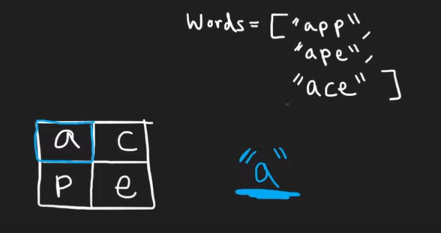
    2. do the same for `"ap"` and so on
       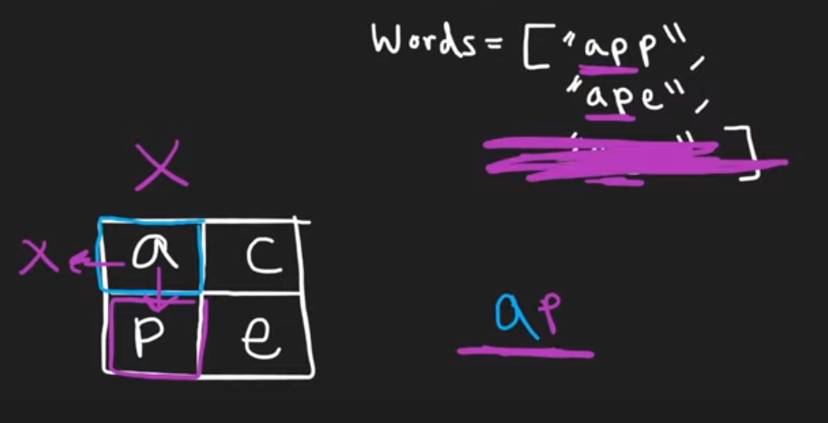
       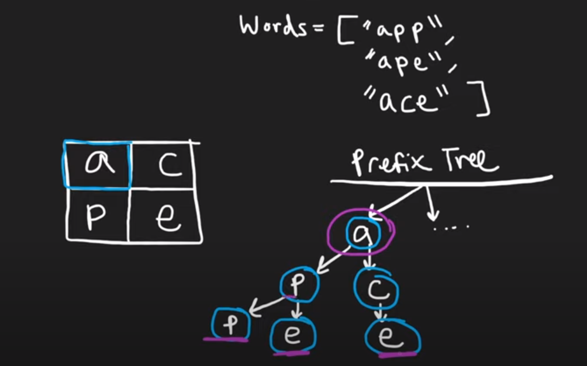
    3. if we didn't have a word with prefix `"ap"` in the Trie, then we can stop searching for other words with the same prefix
       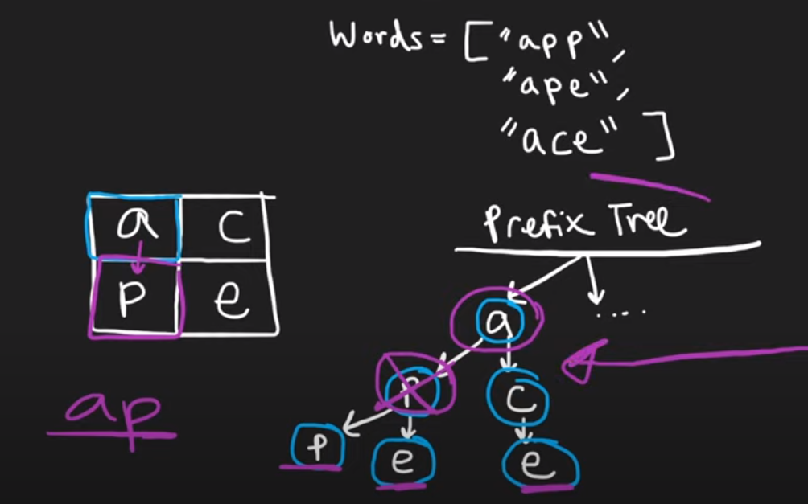
    4. if we found a word (in the path that we're maintaining), ex: called `"ape"` then we can add it to the result list
       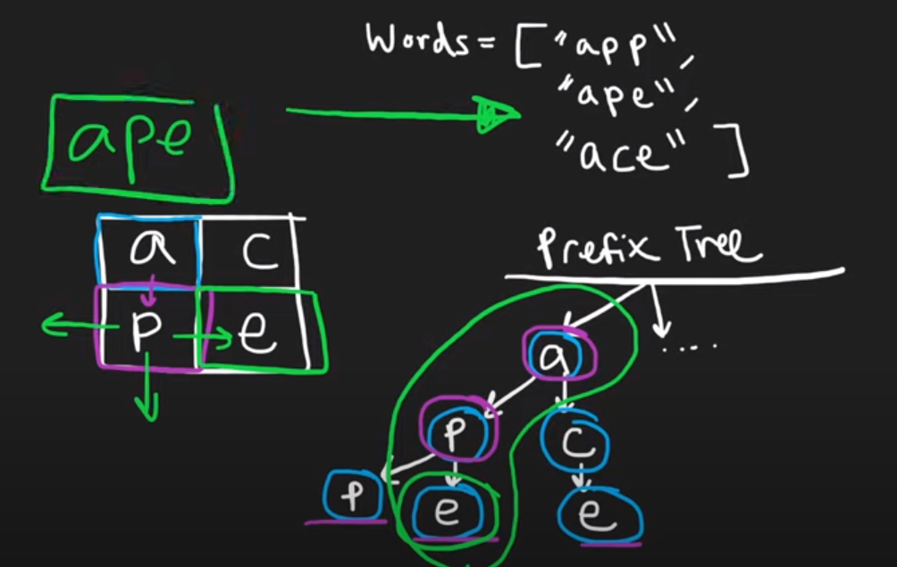

- Time complexity: `O(n.m.4^s + w.l)` where:
  - `n` is the number of rows
  - `m` is the number of columns
  - `s` is the length of the word -> `4` because we have `4` directions
  - `w` is the number of words
  - `l` is the length of the longest word

```py
class TrieNode:
    def __init__(self):
        self.children = {}
        self.isWord = False # mark if the current node is the end of a word
        self.refs = 0 # to keep track of the number of words that end at the current node

    def addWord(self, word):
        cur = self
        cur.refs += 1 # increment the number of words that end at the current node
        for c in word:
            if c not in cur.children:
                cur.children[c] = TrieNode() # insert the current character in the Trie
            cur = cur.children[c] # move to the next character
            cur.refs += 1 # increment the number of words that end at the current node

        cur.isWord = True # mark the end of the word

    def removeWord(self, word):
        cur = self
        cur.refs -= 1
        for c in word:
            if c in cur.children:
                cur = cur.children[c]
                cur.refs -= 1

class Solution:
    def findWords(self, board: List[List[str]], words: List[str]) -> List[str]:
        # build the Trie
        root = TrieNode()
        for w in words:
            root.addWord(w)

        ROWS, COLS = len(board), len(board[0])
        res, visit = set(), set() # to avoid duplicates

        def dfs(r, c, node, word):
            # node is the current node in the Trie
            # Base case
            if (
              r not in range(ROWS)  or
              c not in range(COLS) or
              board[r][c] not in node.children or
              node.children[board[r][c]].refs < 1 or
              (r, c) in visit
            ):
                return

            visit.add((r, c)) # mark the current cell as visited

            # update node & word
            node = node.children[board[r][c]]
            word += board[r][c]

            if node.isWord:
                res.add(word)
                node.isWord = False # to avoid duplicates
                root.removeWord(word) # to avoid duplicates

            # check the neighbors
            dfs(r + 1, c, node, word)
            dfs(r - 1, c, node, word)
            dfs(r, c + 1, node, word)
            dfs(r, c - 1, node, word)

            visit.remove((r, c)) # backtrack

        for r in range(ROWS):
            for c in range(COLS):
                dfs(r, c, root, "")

        return res
```

---

## Graphs

### Flood Fill

An image is represented by an `m x n` integer grid `image` where `image[i][j]` represents the pixel value of the image.

You are also given three integers `sr`, `sc`, and `newColor`. You should perform a **flood fill** on the image starting from the pixel `image[sr][sc]`.

To perform a **flood fill**, consider the starting pixel, plus any pixels connected **4-directionally** to the starting pixel of the same color as the starting pixel, plus any pixels connected **4-directionally** to those pixels (also with the same color), and so on. Replace the color of all of the aforementioned pixels with `newColor`.

Return _the modified image after performing the flood fill_.

- Ex: `image = [[1,1,1],[1,1,0],[1,0,1]], sr = 1, sc = 1, newColor = 2`
  

  - Output: `[[2,2,2],[2,2,0],[2,0,1]]`


- Explanation:

  - From the center of the image `(sr, sc) = (1, 1)` (i.e., the red pixel), all pixels connected by a path of the same color as the starting pixel (i.e., the blue pixels) are colored with the new color.
    - Note the bottom corner is not colored 2, because it is not 4-directionally connected to the starting pixel.
  - Basically, we need to change the color of the current pixel and all the pixels that are connected to it (4-directionally) to the new color.
  - We can use **DFS** to solve this problem.
    - We start with the current pixel `(sr, sc)` and change its color to the new color.
    - Then we check the **horizontal/vertical** neighbors of the current pixel and if they have the same color as the current pixel, we change their color to the new color and do the same for their neighbors and so on.
      
    - We can use a `visited` set to keep track of the visited pixels to avoid infinite loops.
    - Base cases:
      
      - If the current pixel is not in the image (row/column out of bound), we return.
      - If the current pixel has a different color than the starting pixel, we return.
      - If the current pixel is already visited, we return.

- Time Complexity: `O(n.m)` -> `n` is the number of rows and `m` is the number of columns because in the worst case we will visit all the pixels in the image.
  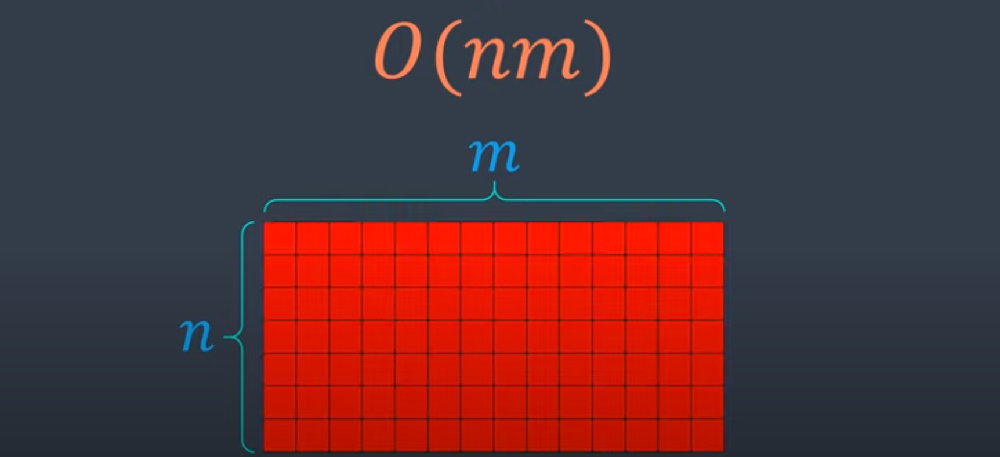
- Space Complexity: `O(n.m)` -> call stack + visited set
  

```py
class Solution:
    def floodFill(self, image: List[List[int]], sr: int, sc: int, newColor: int) -> List[List[int]]:
        ROWS, COLS = len(image), len(image[0])
        color = image[sr][sc]
        visit = set()

        def dfs(r, c):
            # Base case
            if (
              r not in range(ROWS) or
              c not in range(COLS) or
              image[r][c] != color or
              (r, c) in visit
            ):
                return

            visit.add((r, c)) # mark the current cell as visited
            image[r][c] = newColor # change the color of the current cell

            # check the neighbors (bottom, top, right, left)
            dfs(r + 1, c)
            dfs(r - 1, c)
            dfs(r, c + 1)
            dfs(r, c - 1)

        dfs(sr, sc)
        return image
```

---

### Max Area of Island

You are given an `m x n` binary matrix `grid`. An island is a group of `1`'s (representing land) connected **4-directionally** (horizontal or vertical.) You may assume all four edges of the grid are surrounded by water.

The **area** of an island is the number of cells with a value `1` in the island.

Return _the maximum **area** of an island in `grid`_. If there is no island, return `0`.

- Ex: `grid = [[0,0,1,0,0,0,0,1,0,0,0,0,0],
[0,0,0,0,0,0,0,1,1,1,0,0,0],
[0,1,1,0,1,0,0,0,0,0,0,0,0],
[0,1,0,0,1,1,0,0,1,0,1,0,0],
[0,1,0,0,1,1,0,0,1,1,1,0,0],
[0,0,0,0,0,0,0,0,0,0,1,0,0],
[0,0,0,0,0,0,0,1,1,1,0,0,0],
[0,0,0,0,0,0,0,1,1,0,0,0,0]]`
  

  - Output: `6`
  - Explanation: The answer is not `11`, because the island must be connected 4-directionally.

- Time Complexity: `O(n.m)` = size of the grid -> `n` is the number of rows and `m` is the number of columns because in the worst case we will visit all the cells in the grid.

```py
class Solution:
    def maxAreaOfIsland(self, grid: List[List[int]]) -> int:
        ROWS, COLS = len(grid), len(grid[0])
        visit = set()

        def dfs(r, c):
            # Base case
            if (
              r < 0 or r == ROWS or
              c < 0 or c == COLS or
              grid[r][c] == 0 or
              (r, c) in visit
            ):
                return 0

            visit.add((r, c)) # mark the current cell as visited
            return (
              1 +
              dfs(r + 1, c) +
              dfs(r - 1, c) +
              dfs(r, c + 1) +
              dfs(r, c - 1)
            )

        max_area = 0
        for r in range(ROWS):
            for c in range(COLS):
                max_area = max(max_area, dfs(r, c))

        return max_area
```

- **Optimization:** if you don't want to use a `set`, You can ask the interviewer if you can modify the grid. If `yes`, you can change the value of the current cell to `0` to mark it as visited.

---

### Rotting Oranges

You are given an `m x n` grid `grid` where each cell can have one of three values:

- `0` representing an empty cell,
- `1` representing a fresh orange, or
- `2` representing a rotten orange.

Every minute, any fresh orange that is **4-directionally adjacent** to a rotten orange becomes rotten. Return _the minimum number of minutes that must elapse until no cell has a fresh orange_. If this is impossible, return `-1`.

- Ex: `grid = [[2,1,1],[1,1,0],[0,1,1]]`
  

  - Output: `4`
  - Explanation: The orange in the bottom left corner (row 2, column 0) is never rotten, because rotting only happens 4-directionally.

- Explanation:

  - Here we can't use `DFS` because we need to know the time it takes for each orange to rot. as there may be multiple rotten oranges at the same time. which simultaneously rotting neibouring oranges.
  - So, we can use `BFS` to solve this problem. as it can simultaneously process all the nodes at the same level at the same time. -> **Multi source BFS**
    - Out sources will be the rotten oranges. which will be added to the `queue` at the beginning.
    - Then we add the neibouring oranges to the `queue` and mark them as rotten.
    - once we finish processing all the oranges in the current level, we increment the time by `1`.
    - once the queue is empty, we stop and return the time.
  - We also we need to store the number of fresh oranges in the grid. to know when to stop. if there are no fresh oranges left, we return the time. if there are still fresh oranges left, we return `-1`.

- Time and Space Complexity: `O(n.m)` = size of the grid

```py
class Solution:
    def orangesRotting(self, grid: List[List[int]]) -> int:
        ROWS, COLS = len(grid), len(grid[0])
        queue = deque()
        fresh_oranges = 0
        time = 0

        # Step 1). build the initial queue of rotten oranges and count the fresh oranges
        for r in range(ROWS):
            for c in range(COLS):
                if grid[r][c] == 2:
                    queue.append((r, c))
                elif grid[r][c] == 1:
                    fresh_oranges += 1

        while queue and fresh_oranges > 0:
            for i in range(len(queue)):
                r, c = queue.popleft()

                # nr: new row, nc: new column
                for nr, nc in (
                  (r + 1, c),
                  (r - 1, c),
                  (r, c + 1),
                  (r, c - 1)):
                    # check if it's not a fresh orange
                    if (
                      nr < 0 or nr == ROWS or
                      nc < 0 or nc == COLS or
                      grid[nr][nc] != 1
                    ):
                        continue

                    # if it's a fresh orange, set it as rotten
                    grid[nr][nc] = 2
                    fresh_oranges -= 1
                    queue.append((nr, nc))

            # after this level, increment the time by 1
            time += 1

        return time if fresh_oranges == 0 else -1
```

---

### All Paths From Source to Target

Given a directed acyclic graph (**DAG**) of `n` nodes labeled from `0` to `n - 1`, find all possible paths from node `0` to node `n - 1`, and return them in any order.

The graph is given as follows: `graph[i]` is a list of all nodes you can visit from node `i` (i.e., there is a directed edge from node `i` to node `graph[i][j]`).

- Ex: `graph = [[1,2],[3],[3],[]]`

  

  - Output: `[[0,1,3],[0,2,3]]`
  - Explanation: There are two paths: 0 -> 1 -> 3 and 0 -> 2 -> 3.

- Explanation:

  - We can use `DFS` to solve this problem.
    
  - We start from node `0` and keep going until we reach node `n-1`
    - We keep track of the current `path` and add it to the result when we reach node `n-1`.

- Solution 1: `DFS` with backtracking

  - Time and Space Complexity: `O(2^n)` = number of nodes in the graph

  ```py
  def allPathsSourceTarget(graph):
      def dfs(node, path):
          # Base case
          if node == len(graph) - 1:
              result.append(path)
              return

          for neighbor in graph[node]:
              dfs(neighbor, path + [neighbor])

      result = []
      dfs(0, [0])
      return result
  ```

- Solution 2: `BFS`

  - We will use a `queue` to store the current `node` and the current `path`.
  - Time and Space Complexity: `O(2^n)` = number of nodes in the graph

  ```py
  def allPathsSourceTarget(graph):
      queue = deque([(0, [0])])
      result = []
      end = len(graph) - 1

      while queue:
          node, path = queue.popleft()

          if node == end:
              result.append(path)
              continue

          for neighbor in graph[node]:
              queue.append((neighbor, path + [neighbor]))

      return result
  ```

---

### Clone Graph

Given a reference of a node in a **connected** undirected graph. Return a **deep copy** (clone) of the graph.

- The clone should have the exact structure and values as the original graph.
  

- Explanation:

  - We will need to clone each node and also its neighbors **(recursively)**.
  - We will create a `HashMap` to keep track of the cloned nodes.
    - The key will be the original node, and the value will be the cloned node.
    - We will use this `HashMap` to check if we already cloned a node or not, so that we don't clone it again and just return the cloned node from the `HashMap`.
    - if a node is already cloned, then we make it double sided (pointing to each other).
      

- Time and Space Complexity: `O(V+E)` = `O(numCourses + prerequisites)` = `O(n)`
  - This is because we may visit all nodes (`V`) and edges (`E`) in the graph, because we need to create a clone for each one

```py
def cloneGraph(node):
    # Create a HashMap to keep track of the cloned nodes
    oldToNew = {}

    def dfs(node):
        # Check if the node is already cloned
        if node in oldToNew:
            return oldToNew[node] # Return the cloned node to double-side it

        # Create a clone for the node
        clone = Node(node.val, [])

        # Add the node to the HashMap
        oldToNew[node] = clone

        # Loop through the neighbors of the node
        for neighbor in node.neighbors:
            # Clone the neighbor and add it to the clone's neighbors
            clone.neighbors.append(dfs(neighbor))

        return clone

    return dfs(node) if node else None
```

---

### Course Schedule

There are a total of `numCourses` courses you have to take, labeled from `0` to `numCourses - 1`. You are given an array `prerequisites` where `prerequisites[i] = [ai, bi]` indicates that you must take course `bi` first if you want to take course `ai`.

For example, the pair `[0, 1]`, indicates that to take course `0` you have to first take course `1`. Return `true` if you can finish all courses. Otherwise, return `false`.

- Ex: `numCourses = 2, prerequisites = [[1,0]]`
  - Output: `true`
  - Explanation: There are a total of 2 courses to take. To take course 1 you should have finished course 0. So it is possible.
- Ex: `numCourses = 2, prerequisites = [[1,0],[0,1]]`

  - Output: `false`
  - Explanation: There are a total of 2 courses to take. To take course 1 you should have finished course 0, and to take course 0 you should also have finished course 1. So it is impossible.

- Explanation:

  - To check if we can take any course, we need to check if there is a **cycle** or not in the graph.
  - We create a graph from the prerequisites in the adjacency list format.
    - This is because we want to know if for each node, can we reach the end node or not (finish all courses).
      
    - We notice that our `base` cases are the nodes that don't have any prerequisites (no neighbours).
      - To keep track of these nodes, we use a `HashMap` with adjacency list.
        
  - Then we use `DFS` to check if there is a cycle or not.
    - we run it from `[0 : n-1]` nodes, and we check if we can reach the end node or not by running `DFS` on its prequisites in the `HashMap`.
      
    - To prevent running `DFS` on the same node twice, we remove it from the `HashMap` after we run `DFS` on it and knowing that it can be completed.
      
    - if all nodes can be completed, then we return `true`
      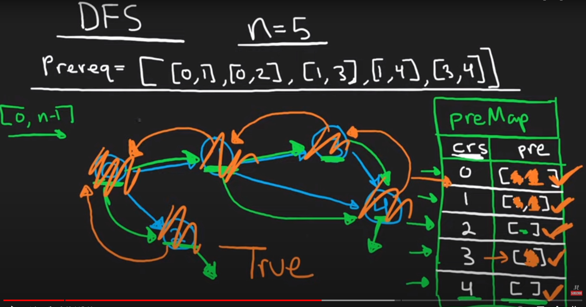
    - If there is a cycle, then we return `false`.
      
      
      - A cycle is detected using a `visited` set .
        

- Time and Space Complexity: `O(V+E)` = `O(numCourses + prerequisites)`
  - This is because we may visit all nodes (`V`) and edges (`E`) in the graph.

```py
def canFinish(numCourses, prerequisites):
    # Create a graph from the prerequisites
    preMap = {i: [] for i in range(numCourses)}
    # preMap = collections.defaultdict(list)
    for course, pre in prerequisites:
        preMap[course].append(pre)

    # Create a set to keep track of the visited nodes
    visited = set()

    def dfs(node):
        # Base case
        if node in visited:
            return False
        if preMap[node] == []:
            return True

        # Add the node to the visited set
        visited.add(node)

        # Loop through the prerequisites of the node
        for pre in preMap[node]:
            # Check if there is a cycle
            if not dfs(pre):
                return False

        # Remove the node from the visited set
        visited.remove(node)

        preMap[node] = [] # Remove the node from the graph map

        return True

    for node in range(numCourses):
        if dfs(node) == False:
            return False

    # Else
    return True
```

---

### Course Schedule II

Same as above, but return the order of the courses to take.

- Ex: `numCourses = 2, prerequisites = [[1,0]]`

  - Output: `[0,1]`
  - Explanation: There are a total of 2 courses to take. To take course 1 you should have finished course 0. So the correct course order is `[0,1]`.

- Explanation:

  - We use the same approach as above, with a preMap to create a graph from the prerequisites.
    
  - We use `DFS` to check if there is a cycle or not.
    - we run it from `[0 : n-1]` nodes, and we check if we can reach the end node or not by running `DFS` on its prequisites in the `HashMap`.
      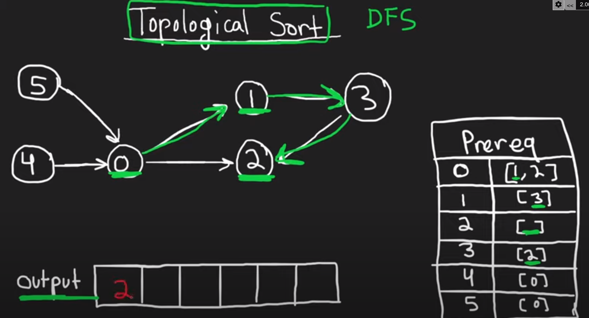
    - To prevent running `DFS` on the same node twice, we remove it from the `HashMap` after we run `DFS` on it and knowing that it can be completed, and then go back to the previous node and repeat the process.
      
      
      
    - if all nodes can be completed, then we return `true`
      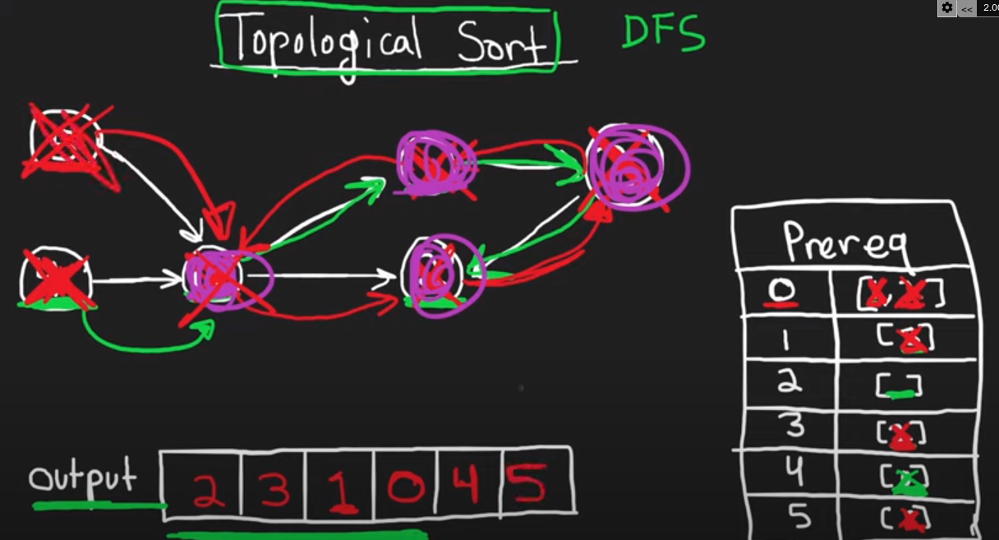
    - If there is a cycle, then we return `false`.
      - A cycle is detected using a `visited` set .

```py
def findOrder(numCourses, prerequisites):
    # Create a graph from the prerequisites
    preMap = {course: [] for course in range(numCourses)}
    for course, pre in prerequisites:
        preMap[course].append(pre)

    # Create sets to keep track of the visited nodes and potential cycles
    visited, cycle = set(), set()

    # Create a output to keep track of the order of the courses
    output = []

    def dfs(node):
        # Base case
        if node in cycle:
            return False
        if node in visited:
            return True # so that we don't stop the algotithm

        # Add the node to the cycle set
        cycle.add(node)

        # Loop through the prerequisites of the node
        for pre in preMap[node]:
            # Check if there is a cycle
            if not dfs(pre):
                return False

        # Remove the node from the cycle set
        cycle.remove(node)

        # Finally add the node to the visited set
        visited.add(node)

        output.append(node)
        return True

    for course in range(numCourses):
        if dfs(course) == False:
            return []

    # Else
    return output
```

---

### Network Delay Time

You are given a network of `n` nodes, labeled from `1` to `n`. You are also given `times`, a list of travel times as directed edges `times[i] = (ui, vi, wi)`, where `ui` is the source node, `vi` is the target node, and `wi` is the time it takes for a signal to travel from source to target.

We will send a signal from a given node `k`. Return the time it takes for all the `n` nodes to receive the signal. If it is impossible for all the `n` nodes to receive the signal, return `-1`.

- Ex: `times = [[2,1,1],[2,3,1],[3,4,1]], n = 4, k = 2`
  

  - Output: `2`
  - Explanation: The signal will take 1 minute to travel from node 2 to node 1, and 1 minute to travel from node 2 to node 3.
    - Then, it will take 1 minute for all the nodes to receive the signal.

- Explanation:

  - We use `Dijkstra's Algorithm` to find the shortest path from the source node to all other nodes.
  - This is also a `BFS` algorithm, but we use a `Priority Queue` to keep track of the shortest path.
    - `BFS` because we will go through the neighbors of the source node first, then the neighbors of the neighbors, and so on. -> **Layer by Layer**
      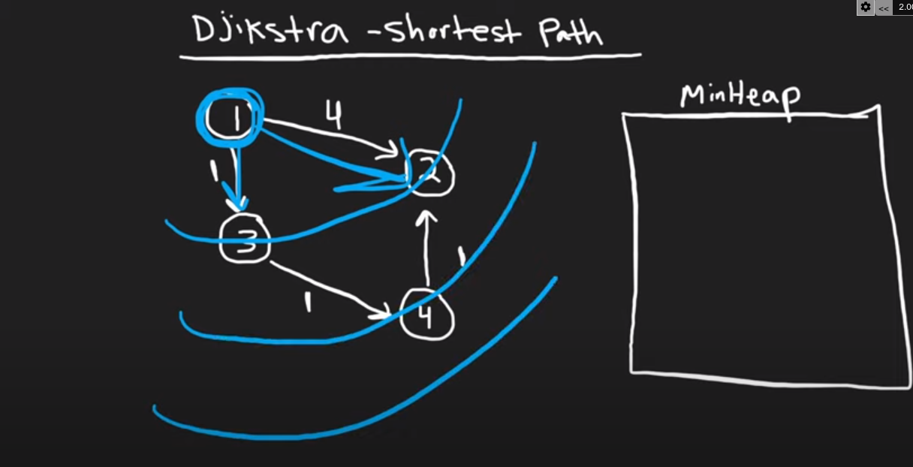
    - Here we will usre a `min heap` to keep track of the shortest path.
      - It's logical to search the node with shortest distance, So we will use the `min heap` to pop the node with the shortest distance from the source node and add its neighbors to the `Priority Queue` with their distance from the source node.
        
  - Starting at the source node `k`, we loop through its neighbors and add them to the `Priority Queue` with their distance from the source node.
    
    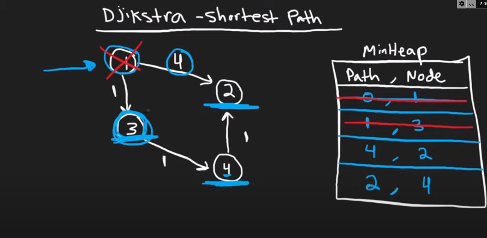

- Time complexity: `O(ElogV)`
  - `E` is the number of edges
  - `V` is the number of vertices

```py
def networkDelayTime(times, n, k):
    # Create a graph from the times
    graph = collections.defaultdict(list)
    for u, v, w in times:
        graph[u].append((v, w))

    # Create a min heap to keep track of the shortest path
    minHeap = [(0, k)] # (path-distance, node)

    visit = set()
    res = 0

    while minHeap:
      w1, n1 = heapq.heappop(minHeap)
      if n1 not in visit:
        visit.add(n1)
        res = max(res, w1) # max because we want the path to the farthest node (n-1) which indicate the delay time

        for n2, w2 in graph[n1]:
          if n2 not in visit:
            heapq.heappush(minHeap, (w1 + w2, n2))

    return res if len(visit) == n else -1
```

---

### Path with Maximum Probability

You are given an undirected weighted graph of `n` nodes `(0-indexed)`, represented by an edge list where `edges[i] = [a, b]` is an undirected edge connecting the nodes `a` and `b` with a probability of success of traversing that edge `succProb[i]`.

Given two nodes `start` and `end`, find the path with the maximum probability of success to go from `start` to `end` and return its success probability.

If there is no path from `start` to `end`, return `0`.

- Ex: `n = 3, edges = [[0,1],[1,2],[0,2]], succProb = [0.5,0.5,0.2], start = 0, end = 2`

  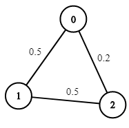

  - Output: `0.25`
  - Explanation: There are two paths from start to end, one having a probability of success = 0.2 and the other has 0.5 \* 0.5 = 0.25.

- Explanation:

  - Here, we want to find the path with the maximum probability of success to go from `start` to `end`. So we can use `Dijkstra's Algorithm` to find the shortest path from `start` to `end`, but instead of keeping track of the shortest path, we keep track of the path with the maximum probability of success aka "longest path".
  - We will use a `Priority Queue` to keep track of the path with the maximum probability of success.
    - Here we will usre a `max heap` to keep track of the path with the maximum probability of success.
      - we will use the `max heap` to pop the node with the maximum probability of success from the source node and add its neighbors to the `Priority Queue` with their probability of success.
        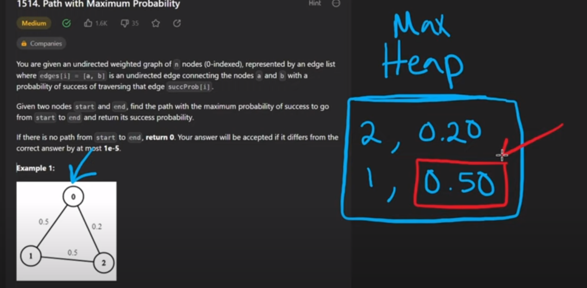
        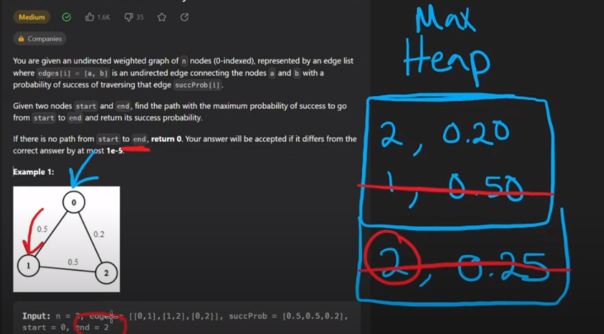
    - Python doesn't have a `max heap`, so we will use a `min heap` and multiply the probability of success by `-1` to get the maximum probability of success.
      - `heapq.heappush(minHeap, (-1 * w1 * w2, n2))`
      - `heapq.heappop(minHeap)[0] * -1`

- Time complexity: `O(ElogV)`

```py
def maxProbability(n, edges, succProb, start, end):
    # Create a graph from the edges
    graph = collections.defaultdict(list)
    for i in range(len(edges)):
        src, dst = edges[i]
        # Add the probability of success to the graph to the 2 sides of the edge
        graph[src].append((dst, succProb[i]))
        graph[dst].append((src, succProb[i]))


    # Create a max heap to keep track of the path with the maximum probability of success
    minHeap = [(-1, start)] # (path-probability, node)

    visit = set()

    while minHeap:
      prob, cur = heapq.heappop(minHeap)
      visit.add(cur)

      if cur == end:
        return prob * -1

      for nei, edgeProb in graph[cur]:
        if nei not in visit:
          heapq.heappush(minHeap, (prob * edgeProb, nei))

    # If there is no path from start to end
    return 0
```

---

### Redundant Connection

In this problem, a tree is an undirected graph that is connected and has no cycles.

You are given a graph that started as a tree with `n` nodes labeled from `1` to `n`, with one additional edge added. The added edge has two different vertices chosen from `1` to `n`, and was not an edge that already existed. The graph is represented as an array `edges` of length `n` where `edges[i] = [ai, bi]` indicates that there is an edge between nodes `ai` and `bi` in the graph.

Return an edge that can be removed so that the resulting graph is a tree of `n` nodes. If there are multiple answers, return the answer that occurs last in the input.

- Ex: `edges = [[1,2],[1,3],[2,3]]`

  

  - Output: `[2,3]`


- Explanation:

  - The problem is called "Redundant Connection" because we want to find the edge that is `redundant` aka the edge that we can remove to make the graph a tree.
  - We want to know what edge we can remove to make the graph a tree **(no cycles)**.
  - We can use **Union Find** to find the redundant connection.
    - This is because we know that a tree is an undirected graph that is **connected** and has no cycles.
    - So if we find a cycle in the graph, then we know that the edge that created the cycle is the **redundant connection**.
    - `union find` algo will be used in 2 steps:
      1. `union` the nodes together if they don't have the same parent -> **no cycle**
         
      2. `find` the parent of each node and check if the parent of the 2 nodes are the same -> **cycle**

- Solution 1: DFS

  - Time complexity: `O(n^2)`

  ```py
  def findRedundantConnection(edges):
      # Create a graph from the edges
      graph = collections.defaultdict(list)
      for node1, node2 in edges:
          graph[node1].append(node2)
          graph[node2].append(node1)

      def dfs(node1, node2):
          # If we found a cycle, then return True
          if node1 == node2:
              return True
          # If we haven't visited the node yet, then visit it
          if node1 not in visit:
              visit.add(node1)
              # Check if there is a cycle in the graph
              return any(dfs(nei, node2) for nei in graph[node1])

      for node1, node2 in edges:
          visit = set()
          # If there is a cycle in the graph, then return the edge that created the cycle
          if dfs(node1, node2):
              return [node1, node2]
  ```

- Solution 2: Union Find by **rank** ✅

  - Time complexity: `O(nlogn)`
  - Steps:
    1. We start with nodes that are not connected to any other nodes, and the rank of each node is `1` -> size of the starting tree.
       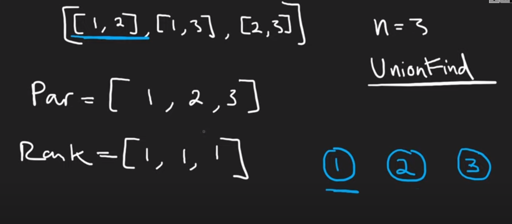
    2. we will go through each edge and `union` (connecting) the nodes together in the shape of a `tree` if they don't have the same parent.
       - If the parent of the 2 nodes are the same, then we found a cycle.
       - If the parent of the 2 nodes are not the same, then we `union` the nodes together and update:
         - the rank of the parent node as the size of the tree will increase by `1`.
           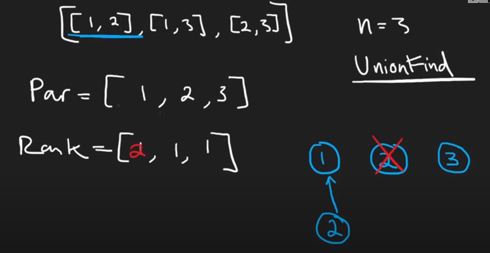
         - The parent of the node1 as the parent of the `node2`.
           
    3. repeat step 2 until we find a cycle in the graph.
       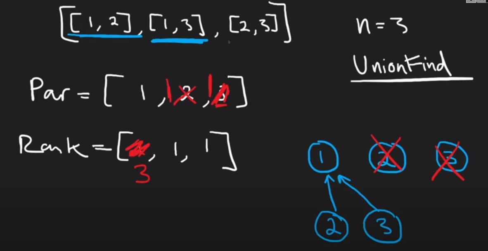
       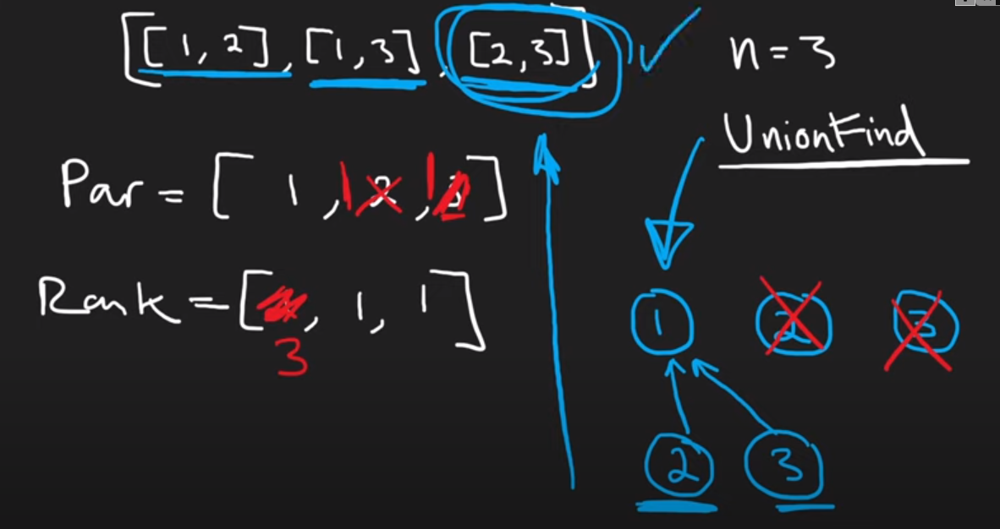

  ```py
  def findRedundantConnection(edges):
      # Create a parent array to keep track of the parent of each node
      parent = [i for i in range(len(edges) + 1)]
      # Create a rank array to keep track of the rank of each node
      rank = [1 for i in range(len(edges) + 1)]

      def find(node):
          p = parent[node] # going up the parent of the node
          # If the parent of the node is itself, then we found the Top parent
          while p != parent[p]:
              parent[p] = parent[parent[p]] # path compression to make the tree flat -> O(logn)
              p = parent[p]
          return p

      # Union the nodes together if they don't have the same parent
      def union(node1, node2):
          p1, p2 = find(node1), find(node2)

          if p1 == p2:
              return False

          # check the rank of the 2 nodes to see which one is the parent and update the rank of the parent
          if rank[p1] > rank[p2]:
              parent[p2] = p1
              rank[p1] += rank[p2]
          else:
              parent[p1] = p2
              rank[p2] += rank[p1]

          return True

      for node1, node2 in edges:
          # If the parent of the 2 nodes are the same, then we found a cycle
          if not union(node1, node2):
              return [node1, node2]
  ```

- Solution 3: Union Find

  - Time complexity: `O(nlogn)`

  ```py
  def findRedundantConnection(edges):
      # Create a parent array to keep track of the parent of each node
      parent = [i for i in range(len(edges) + 1)]

      def find(node):
          p = parent[node] # going up the parent of the node
          # If the parent of the node is itself, then we found the Top parent
          if p == node:
            return p
          p = find(p)

      # Union the nodes together if they don't have the same parent
      def union(node1, node2):
          # make the parent of node1 the parent of node2
          parent[find(node1)] = find(node2)

      for node1, node2 in edges:
          # If the parent of the 2 nodes are the same, then we found a cycle
          if find(node1) == find(node2):
              return [node1, node2]
          else:
              union(node1, node2)

      return []
  ```

---

### Accounts Merge

problem: [Here](https://leetcode.com/problems/accounts-merge/)

- Explanation:

  - first string will be the `name` of the account, and the rest of the strings will be the `emails` of the account.
    - The problem is that they might be multiple accounts that belong to the same person (same name), and we want to merge them together.
    - We will know that 2 accounts belong to the same person if they have at least 1 email in common.
  - So eventually, we want to merge (union) all the accounts that belong to the same person together, and return the result in the form of a list of lists.
  - So this is a **Graph** problem and can be solved using `union find`.
    - After connecting all the nodes together, we will have a graph that looks like this:
      
    - We will go through each node and do a `DFS` to find all the nodes that belong to the same person and append them to a list.
    - We will also keep track of the emails that we have visited so that we don't visit the same email twice.
    - We will also sort the emails in the list so that we can return the result in the correct order.

  ```py
  class UnionFind:
    def __init__(self, n):
        self.par = [i for i in range(n)]
        self.rank = [1] * n

    def find(self, x):
        while x != self.par[x]:
            self.par[x] = self.par[self.par[x]]
            x = self.par[x]
        return x

    def union(self, x1, x2):
        p1, p2 = self.find(x1), self.find(x2)
        if p1 == p2:
            return False
        if self.rank[p1] > self.rank[p2]:
            self.par[p2] = p1
            self.rank[p1] += self.rank[p2]
        else:
            self.par[p1] = p2
            self.rank[p2] += self.rank[p1]
        return True

  class Solution:
    def accountsMerge(self, accounts: List[List[str]]) -> List[List[str]]:
        uf = UnionFind(len(accounts))
        emailToAcc = {} # email -> index of acc

        for i, a in enumerate(accounts):
            for e in a[1:]:
                if e in emailToAcc:
                    uf.union(i, emailToAcc[e])
                else:
                    emailToAcc[e] = i

        emailGroup = defaultdict(list) # index of acc -> list of emails
        for e, i in emailToAcc.items():
            leader = uf.find(i)
            emailGroup[leader].append(e)

        res = []
        for i, emails in emailGroup.items():
            name = accounts[i][0]
            res.append([name] + sorted(emailGroup[i])) # array concat
        return res
  ```

---

### Sort Items by Groups Respecting Dependencies

problem: [Here](https://leetcode.com/problems/sort-items-by-groups-respecting-dependencies/)

- Explanation:

  - At first glance it is clear that this is a **topological sorting** problem, but it's difficulty rise from the fact that there is grouping, thus we need to think about dependancies between the nodes(items) in each group and between groups as a whole.
  - We start by creating a new representation for the groups using dictionaries where each `groups[groupId]` is a set of all nodes with `id == groupId`, and we create a new group for each node that is not in any group.
  - Then we find the dependencies within each `group` and between `groups`.
  - lastly we sort each group by it self using the depenancies between the nodes inside said group, and the groups by their `id` using the between groups depencancy topologically and merge the results.

- Time and space complexity:

  - Time: `O(n + m)` where `n` is the number of items and `m` is the number of dependencies.
  - Space: `O(n + m)`

```py

```

---

### Find if Path Exists in Graph

problem: [Here](https://leetcode.com/problems/find-if-path-exists-in-graph/description/)

- BFS

  ```py
  def validPath(n: int, edges: List[List[int]], start: int, end: int) -> bool:
      graph = defaultdict(list)
      for u, v in edges:
          graph[u].append(v)
          graph[v].append(u)

      visited = set()
      queue = deque([start])
      while queue:
          node = queue.popleft()
          if node == end:
              return True
          if node in visited:
              continue
          visited.add(node)
          for nei in graph[node]:
              queue.append(nei)
      return False
  ```

- DFS

  ```py
  def validPath(n: int, edges: List[List[int]], start: int, end: int) -> bool:
      graph = defaultdict(list)
      for u, v in edges:
          graph[u].append(v)
          graph[v].append(u)

      visited = set()
      def dfs(node):
          if node == end:
              return True
          if node in visited:
              return False
          visited.add(node)
          for nei in graph[node]:
              if dfs(nei):
                  return True
          return False

      return dfs(start)
  ```

---

### Check if There is a Valid Path in a Grid

problem: [Here](https://leetcode.com/problems/check-if-there-is-a-valid-path-in-a-grid/)

- Explanation:

  - The idea is to use a `directions` dictionary to store the possible directions for each type of street.
  - Then we will use `DFS` to traverse the grid and check if we can reach the bottom right cell.

- Time and space complexity: `O(m * n)`

```py
def hasValidPath(grid: List[List[int]]) -> bool:
    ROWS, COLS = len(grid), len(grid[0])
    directions = {
        1: [(0, -1), (0, 1)],
        2: [(-1, 0), (1, 0)],
        3: [(0, -1), (1, 0)],
        4: [(0, 1), (1, 0)],
        5: [(0, -1), (-1, 0)],
        6: [(0, 1), (-1, 0)]
    }

    # Backtracking
    def dfs(r, c):
        # If we reach the bottom right square, it means we've found a path
        if r == ROWS - 1 and c == COLS - 1:
            return True
        # If we reach a square that has been visited or is a wall, we can't move forward
        if grid[r][c] == -1:
            return False
        # Mark the current square as visited
        oldVal = grid[r][c]
        grid[r][c] = -1

        # Try to move in each direction
        for dr, dc in directions[oldVal]:
            nr, nc = r + dr, c + dc
            # If we can move in a direction, return True if we can reach the bottom right square from there
            if 0 <= nr < ROWS and 0 <= nc < COLS and grid[nr][nc] != -1:
                # negative dr and dc because we are going backwards in the path
                if (-dr, -dc) in directions[grid[nr][nc]]:
                    if dfs(nr, nc):
                        return True
        # Backtrack
        return False

    return dfs(0, 0)
```

---

### Couples Holding Hands

There are `n` couples sitting in `2n` seats arranged in a row and want to hold hands. The people and seats are represented by an integer array `row` where `row[i]` is the ID of the person sitting in the `i`th seat. The couples are numbered in order, the first couple being `(0, 1)`, the second couple being `(2, 3)`, and so on with the last couple being `(2n - 2, 2n - 1)`.

Return the minimum number of swaps so that every couple is sitting side by side. A swap consists of choosing any two people, then they stand up and switch seats.

- Ex:

  - Input: row = [0, 2, 1, 3]
  - Output: 1
  - Explanation: We only need to swap the second (row[1]) and third (row[2]) person.

- Explanation:

  - The idea is to use a `couples` dictionary to store the index of each couple. Then we will iterate over the array and for each couple we will check if they are sitting side by side, if not we will swap the current person with the person sitting next to their partner.
  - This is a Graph problem, we can also solve it using `DFS` or `BFS`. We will create a graph where each node is a person and each edge is a couple, then we will count the number of connected components.
  - Time and space complexity: `O(n)`, where `n` is the number of couples.

- Look at this explanation: [https://medium.com/@jolyon129/765-couples-holding-hands-a9ce4d50b25e](https://medium.com/@jolyon129/765-couples-holding-hands-a9ce4d50b25e)

- Solution 1: `Greedy`

  ```py
  def minSwapsCouples(row: List[int]) -> int:
      swaps = 0
      couples = {}
      for i, person in enumerate(row):
          couples[person] = i

      # Iterate over the array by pairs
      for i in range(0, len(row), 2):
          # Get the partner of the current person using XOR
          partner = row[i] ^ 1 # XOR
          if row[i + 1] != partner:
              swaps += 1

              # Swap the current person with the person sitting next to their partner
              row[couples[partner]], row[i + 1] = row[i + 1], row[couples[partner]]

              # Update the index of the partner
              couples[row[couples[partner]]] = couples[partner]
              couples[partner] = i + 1
      return swaps
  ```

- Solution 2: `Union-Find`

  ```py
  class UnionFind:
      def __init__(self, n):
          self.parent = list(range(n))
          self.count = n # Number of connected components

      def find(self, x):
          if self.parent[x] != x:
              self.parent[x] = self.find(self.parent[x])
          return self.parent[x]

      def union(self, x, y):
          px, py = self.find(x), self.find(y)
          if px != py:
              self.parent[px] = py
              self.count -= 1 # Decrease the number of connected components

  def minSwapsCouples(row: List[int]) -> int:
      n = len(row) // 2
      uf = UnionFind(n)
      for i in range(0, len(row), 2):
          uf.union(row[i] // 2, row[i + 1] // 2)
      return n - uf.count
  ```

---

### Minimum Obstacle Removal to Reach Corner

Problem: [Here](https://leetcode.com/problems/minimum-obstacle-removal-to-reach-corner/)

- Explanation:

  - This can be solved using `Dijsktra` algorithm or `BFS`.

- Solution 1: `BFS`

  ```py
  def minimumEffortPath(heights: List[List[int]]) -> int:
      rows = len(grid)
      cols = len(grid[0])
      dist = [[inf] * cols for _ in range(rows)]
      dist[0][0] = 0
      dq = deque([(0, 0, 0)])
      directions = [[0,1],[0,-1],[1,0],[-1,0]]

      while dq:
          count, r, c = dq.popleft()
          for dr, dc in directions:
              row = r + dr
              col = c + dc
              if 0 <= row < rows and 0 <= col < cols and dist[row][col] == inf:
                  new_count = count
                  if grid[row][col] == 1:
                      dist[row][col] = count + 1
                      dq.append((count + 1, row, col))
                  else:
                      dist[row][col] = count
                      dq.appendleft((count, row, col))
      return dist[-1][-1]
  ```

- Solution 2: `Dijkstra`

  ```py
  m, n = len(grid), len(grid[0])
  distance = collections.defaultdict(int)
  for i in range(m):
      for j in range(n):
          distance[(i,j)] = float("inf")

  distance[(0,0)] = grid[0][0]
  stack = [(0,0,0)]

  while stack:
      weight, i, j = heapq.heappop(stack)

      if i == m-1 and j == n-1:
          return weight

      for ni,nj in [(i-1,j),(i+1,j),(i,j-1),(i,j+1)]:
          if 0 <= ni < m and 0 <= nj < n and distance[(ni,nj)] > weight + grid[ni][nj]:
              distance[(ni,nj)] = weight + grid[ni][nj]
              heapq.heappush(stack,(weight+grid[ni][nj],ni,nj))
  ```

---

### Trapping Rain Water II

Given an `m x n` integer matrix `heightMap` representing the height of each unit cell in a 2D elevation map, return the volume of water it can trap after raining.

- Ex:
  

  - Input: heightMap = [[1,4,3,1,3,2],[3,2,1,3,2,4],[2,3,3,2,3,1]]
  - Output: 4
  - Explanation: After the rain, water is trapped between the blocks.
    - We have two small pounds 1 and 3 units trapped.
    - The total volume of water trapped is 4.

- Explanation:

  - It's a `Graph` problem, because we will will be going to each `node` and then look into its neighbors to see if it can trap water.
  - This is a `BFS` problem, we will use a `priority queue` to store the cells with the lowest height.
    - We use a `priority queue` (`min heap`) because **we want to start with the lowest height**.
  - We will start by adding the cells on the **border** to the queue and mark them as visited. so that we can start at the boundaries and move **inwards**.
    
    - border cells because they can't trap water.
  - Then we will iterate over the queue and for each cell we will check its neighbors to calculate the amount of water it can trap.
    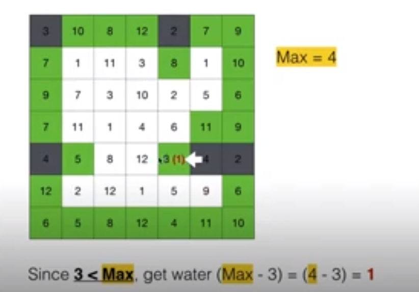
    - Formula: `min(current_cell_height, neighbor_height) - current_cell_height`
    - if the neighbor is lower than the current cell, we will add the difference between the heights to the result and update the height of the neighbor to the current cell height.
    - Then we will add the neighbor to the queue.
      - when doing so we want to make the height of the neighbor the maximum between the current cell height and the neighbor height. so that it can trap water.
  - Time and space complexity: `O(mnlog(mn))`, where `m` is the number of rows and `n` is the number of columns.

```py
def trapRainWater(heightMap: List[List[int]]) -> int:
    ROWS, COLS = len(heightMap), len(heightMap[0])
    visited = [[False] * COLS for _ in range(ROWS)]

    # Add the cells on the border to the queue and mark them as visited
    pq = []
    for r in range(ROWS):
        for c in range(COLS):
            if r == 0 or r == ROWS - 1 or c == 0 or c == COLS - 1:
                heapq.heappush(pq, (heightMap[r][c], r, c))
                visited[r][c] = True

    result = 0
    while pq:
        height, r, c = heapq.heappop(pq)

        # Check the neighbors for all 4 directions for each cell
        for dr, dc in [(0, 1), (0, -1), (1, 0), (-1, 0)]:
            nr, nc = r + dr, c + dc # new row, new column

            # check if the neighbor is in the grid and not visited
            if 0 <= nr < ROWS and 0 <= nc < COLS and not visited[nr][nc]:
                visited[nr][nc] = True
                # water = neighbor_height - current_cell_height, if neighbor_height < current_cell_height to prevent negative values
                result += max(0, height - heightMap[nr][nc])
                # update the height of the neighbor to the current cell height if it's higher
                heapq.heappush(pq, (max(height, heightMap[nr][nc]), nr, nc))

    return result
```

---

### Longest Increasing Path in a Matrix

Given an `m x n` integers matrix, return the length of the longest increasing path in matrix.

From each cell, you can either move in four directions: left, right, up, or down. You may not move diagonally or move outside the boundary (i.e., wrap-around is not allowed).

- Ex:

  

  - Input: `matrix = [[9,9,4],[6,6,8],[2,1,1]]`
  - Output: `4`
  - Explanation: The longest increasing path is `[1, 2, 6, 9]`.

- Explanation:

  - It's a `Graph` problem, because we will will be going to each `node` and then look into its neighbors to see if it can trap water.
  - Using `DFS`, we will use a `memoization` matrix to store the length of the longest increasing path for each cell.
    - We use a `memoization` because we will be visiting the same cell multiple times inside the recursion of the `dfs` function.
      
  - We will start by iterating over the matrix and for each cell we will call the `dfs` function.
    - The `dfs` function will return the length of the longest increasing path for the current cell.
    - We will check if the length is already calculated and return it if it is.
    - Then we will iterate over the neighbors of the current cell and call the `dfs` function for each neighbor.
      
      - We will only call the `dfs` function if the neighbor is greater than the current cell.
      - We will store the maximum length of the neighbors in a variable.

- Time and space complexity: `O(mn)`, where `m` is the number of rows and `n` is the number of columns.

```py
def longestIncreasingPath(matrix: List[List[int]]) -> int:
    ROWS, COLS = len(matrix), len(matrix[0])
    memo = [[0] * COLS for _ in range(ROWS)]

    def dfs(r, c):
        if memo[r][c] != 0:
            return memo[r][c]

        result = 1 # minimum length is 1 -> the cell itself
        for dr, dc in [(0, 1), (0, -1), (1, 0), (-1, 0)]:
            nr, nc = r + dr, c + dc
            # check if the neighbor is in the grid and greater than the current cell
            if 0 <= nr < ROWS and 0 <= nc < COLS and matrix[nr][nc] > matrix[r][c]:
                result = max(result, dfs(nr, nc) + 1)

        memo[r][c] = result
        return result

    result = 0
    for r in range(ROWS):
        for c in range(COLS):
            result = max(result, dfs(r, c))

    return result

# Or

def longestIncreasingPath(matrix: List[List[int]]) -> int:
    ROWS, COLS = len(matrix), len(matrix[0])
    memo = {} # (r, c) -> LTP

    def dfs(r, c, prevVal):
        if (
          r < 0 or r >= ROWS or
          c < 0 or c >= COLS or
          matrix[r][c] <= prevVal
          ):
            return 0

        if (r, c) in memo:
            return memo[(r, c)]

        res = 1 + max(
            dfs(r + 1, c, matrix[r][c]),
            dfs(r - 1, c, matrix[r][c]),
            dfs(r, c + 1, matrix[r][c]),
            dfs(r, c - 1, matrix[r][c])
        )

        memo[(r, c)] = res
        return res

    for r in range(ROWS):
        for c in range(COLS):
            dfs(r, c, -float('inf'))

    return max(memo.values())
```

---
