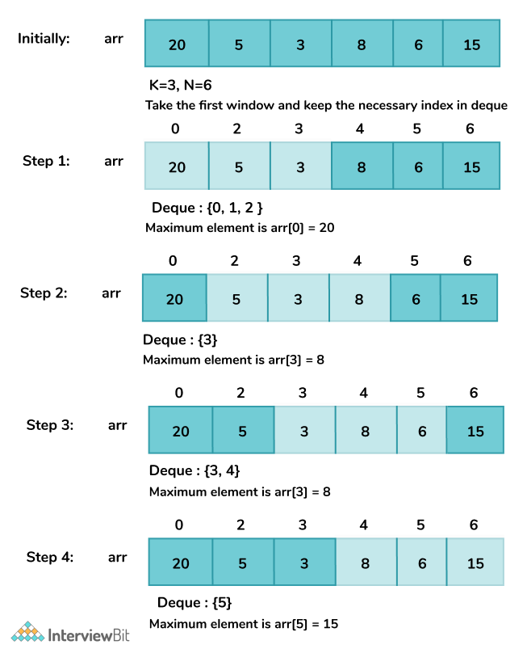

# INDEX

- [INDEX](#index)
  - [Notes](#notes)
  - [Queue](#queue)
    - [Queue using two stacks](#queue-using-two-stacks)
    - [Sliding Window Maximum](#sliding-window-maximum)
  - [Stacks](#stacks)
    - [Implement Stack using Queues](#implement-stack-using-queues)
    - [Valid Parentheses](#valid-parentheses)
    - [Valid Parenthesis String](#valid-parenthesis-string)
    - [Minimum Remove to Make Valid Parentheses](#minimum-remove-to-make-valid-parentheses)
    - [Minimum Add to Make Parentheses Valid](#minimum-add-to-make-parentheses-valid)
    - [Next Greater Element I](#next-greater-element-i)
    - [Next Greater Element II](#next-greater-element-ii)
    - [Daily Temperatures](#daily-temperatures)
    - [Tag Validator](#tag-validator)
  - [K Closest Points to Origin](#k-closest-points-to-origin)
  - [Top K Frequent Elements](#top-k-frequent-elements)
    - [Solution 1: using Heap](#solution-1-using-heap)
    - [Solution 2: using Bucket Sort](#solution-2-using-bucket-sort)
  - [Top K Frequent Words](#top-k-frequent-words)
  - [Reorganize String](#reorganize-string)
  - [Kth Largest Element in a Stream](#kth-largest-element-in-a-stream)
  - [Find Median from Data Stream](#find-median-from-data-stream)

---

## Notes

- You should think about using a stack or a queue when you have:
  - problem where the order of the elements matters -> `queue`
  - problem where the order of processing the elements matters -> `stack`
  - problem where you need to keep track of the last element -> `stack`

---

## Queue

### Queue using two stacks

Implement a queue data structure using two stacks. Do not create an array inside of the 'Queue' class. Queue should implement the methods 'add', 'remove', and 'peek'. Adding to the queue should store an element until it is removed.

- EX: `q = Queue()` --> `q.add(1)` --> `q.add(2)` --> `q.peek()` --> `1` --> `q.remove()` --> `1` --> `q.remove()` --> `2`
- Here, we want to use two stacks to implement a queue. We can use one stack for adding elements and the other stack for removing elements. When we want to remove an element, we move all elements from the first stack to the second stack, then pop the top element from the second stack. When we want to peek an element, we move all elements from the first stack to the second stack, then peek the top element of the second stack. When we want to add an element, we just push it to the first stack.
  

```py
class Queue:
    def __init__(self):
        self.stack1 = []
        self.stack2 = []

    def add(self, item):
        self.stack1.append(item)

    def remove(self):
        # Move all items from stack1 to stack2
        if not self.stack2:
            while self.stack1:
                self.stack2.append(self.stack1.pop())
        return self.stack2.pop()

    def peek(self):
        # Move all items from stack1 to stack2
        if not self.stack2:
            while self.stack1:
                self.stack2.append(self.stack1.pop())
        return self.stack2[-1]

    def empty(self):
        return not self.stack1 and not self.stack2
```

---

### Sliding Window Maximum

You are given an array of integers `nums`, there is a sliding window of size `k` which is moving from the very left of the array to the very right. You can only see the `k` numbers in the window. Each time the sliding window moves right by one position.

Return the max sliding window.

- EX: `nums = [1, 3, -1, -3, 5, 3, 6, 7], k = 3` --> `[3, 3, 5, 5, 6, 7]`

  - Explanation:
    | Window Position | Max |
    | --------------- | --- |
    | [1 3 -1] -3 5 3 6 7 | 3 |
    | 1 [3 -1 -3] 5 3 6 7 | 3 |
    | 1 3 [-1 -3 5] 3 6 7 | 5 |
    | 1 3 -1 [-3 5 3] 6 7 | 5 |
    | 1 3 -1 -3 [5 3 6] 7 | 6 |
    | 1 3 -1 -3 5 [3 6 7] | 7 |

- **Explanation:** (recap: it's like (next greater element) using a stack, but we use dqueue to remove from left as well)

  - to get a better solution than `O(n.k)`, we will use the `next greater element` approach, using a **Monotonic decreasing queue (double-ended queue (`deque`))** to store the indices of the elements in the window.
    - > `deque` allows for fast appends and pops **from both ends**.
  - The first element in the queue is the index of the maximum element in the window.
  - When we move the window to the right, we need to remove the element that is out of the window, and remove all elements that are smaller than the current element. Then we add the current element to the queue.
    - This is done because we know that when going to the next window, the first element in the queue is out of the window, so we remove it.
    - Then we remove all elements that are smaller than the current element, because **they will never be the maximum element in the window**. Then we add the current element to the queue.
  - we use queue and not a stack, because we want to remove elements from the left side of the queue, and we want to remove the first element in the queue, which is the maximum element in the window.

- **Steps:**
  1. Initialize a deque `q` to store the indices of the elements in the current sliding window, and initialize `l` and `r` pointers to `0`
  2. iterate over the array `nums` and do the following:
     - pop smaller values from `q` until we find a value that is greater than the current value
     - append the current index ('r') to `q`
     - remove the left val from the window
       - If the index of the oldest element in the sliding window (`l`) is outside of the current sliding window, remove it from the deque `q` using the `popleft()` method
     - check if the window is at least size `k` to add the maximum element (`nums[q[0]]`) to the result



```py
def max_sliding_window(nums, k):
    if not nums: return []
    result = []
    q = collections.deque() # indices of the elements in the window
    l = r = 0

    while r < len(nums):
      # pop smaller values from q if the current value is greater than the last value in q to always make the queue contain the max element
      while q and nums[q[-1]] < nums[r]:
          q.pop()
      q.append(r)

      # remove left val from window if it is outside of the current window
      if l > q[0]:
        q.popleft()

      # check if the window is at least size k to start adding the maximum element to the result
      if (r+1) >= k:
        result.append(nums[q[0]])
        l += 1 # left pointer will only move when the window is at least size k
      r += 1

    return res
```

---

## Stacks

### Implement Stack using Queues

```py
class MyStack:

    def __init__(self):
        self.q = collections.deque()

    def push(self, x: int) -> None:
        self.q.append(x)
        # rotate the queue so that the last element is the first one
        for _ in range(len(self.q) - 1):
            self.q.append(self.q.popleft())

    def pop(self) -> int:
        return self.q.popleft()

    def top(self) -> int:
        return self.q[0]

    def empty(self) -> bool:
        return len(self.q) == 0
```

---

### Valid Parentheses

Given a string `s` containing just the characters `'('`, `')'`, `'{'`, `'}'`, `'['` and `']'`, determine if the input string is valid.

- An input string is valid if:

  - Open brackets must be closed by the same type of brackets.
  - Open brackets must be closed in the correct order.

- EX: `s = "()[]{}"` --> `true`
- EX: `s = "([)]"` --> `false`

- Explanation:
  - Each time we encounter an `opening` bracket, we push it onto the stack.
  - Each time we encounter a `closing` bracket, we check if the top element of the stack is the corresponding opening bracket.
    - If it is, then we pop it off the stack. If it isn't, or if the stack is empty, then we return `false`.

```py
# Solution 1
def isValid(s):
    stack = []
    for char in s:
        if char == '(':
            stack.append(')')
        elif char == '[':
            stack.append(']')
        elif char == '{':
            stack.append('}')
        elif not stack or stack.pop() != char:
            return False
    return not stack
```

---

### Valid Parenthesis String

Same as [Valid Parentheses](#valid-parentheses) but here we have a third type of brackets `*` which can be used as a `left`, `right` or `empty` bracket.

- EX: `s = "(*))"` --> `true`
- EX: `s = "(*))"` --> `true`

```py
def checkValidString(s):
    left_stack = []
    star_stack = []

    for i in range(len(s)):
        if s[i] == '(':
            left_stack.append(i)
        elif s[i] == '*':
            star_stack.append(i)
        # if the current char is a right bracket
        else:
            # pop the top element from either the left_stack or the star_stack
            if left_stack:
                left_stack.pop()
            elif star_stack:
                star_stack.pop()
            # if both stacks are empty, return False
            else:
                return False

    while left_stack and star_stack:
        # if the top element of the left_stack is greater than the top element of the star_stack -> '*' is used as an empty string
        if left_stack[-1] > star_stack[-1]:
            return False
        # pop the top element of the left_stack and star_stack
        left_stack.pop()
        star_stack.pop()

    # if the left_stack is not empty -> there are more left brackets than right brackets
    if left_stack:
        return False

    return True
```

---

### Minimum Remove to Make Valid Parentheses

Given a string `s` of `'('` , `')'` and lowercase English characters. Remove the minimum number of parentheses ( `'('` or `')'`, in any positions ) so that the resulting parentheses string is valid and return **any** valid string.

- parenthesis string is valid if and only if:

  - It is the empty string, contains only lowercase characters, or
  - It can be written as `AB` (`A` concatenated with `B`), where `A` and `B` are valid strings, or
  - It can be written as `(A)`, where `A` is a valid string.

- EX: `s = "lee(t(c)o)de)"` --> `"lee(t(c)o)de"`

- Explanation:
  - To solve this problem, we need to use a stack to store the indices of the opening brackets.
  - so, it's better to convert the string into an array of characters, so we can modify it.
  - We iterate over the string and do the following:
    - If the current character is an opening bracket `(`, we push its `index` to the stack.
    - If the current character is a closing bracket `)`
      - if the stack is not empty, we pop the top element from the stack.
        - This indicates that we have found a matching opening bracket and closing bracket.
      - If the stack is empty, we replace the current character with an empty string `""`.
        - This means that the current closing bracket doesn't have a corresponding opening bracket, so we need to remove it.
    - at the end, if the stack is not empty, this means that there are more opening brackets than closing brackets, so we need to remove them. by replacing the indices of the opening brackets in the stack with empty strings `""`.

```py
def minRemoveToMakeValid(s):
    stack = []
    s = list(s)

    for i in range(len(s)):
        if s[i] == '(':
            stack.append(i)
        elif s[i] == ')':
            if stack:
                stack.pop()
            else:
                s[i] = ''

    # if the stack is not empty, this means that there are more opening brackets than closing brackets
    while stack:
        s[stack.pop()] = ''

    return ''.join(s)
```

---

### Minimum Add to Make Parentheses Valid

Given a string `s` of `'('` and `')'` parentheses, we add the minimum number of parentheses ( `'('` or `')'`, and in any positions ) so that the resulting parentheses string is valid.

- EX: `s = "())"` --> `1`
- EX: `s = "((("` --> `3`

- Explanation:
  - Same as previous problem, but we need to count the number of opening brackets that don't have a corresponding closing bracket.
  - So, we need to add the number of opening brackets that are left in the stack at the end to the result.
  - We don't need to check if the stack is empty or not, because we know that the string is valid, so the stack will be empty at the end.

```py
def minAddToMakeValid(s):
    res = 0
    stack = []

    for char in s:
        if char == '(':
            stack.append(char)
        elif char == ')':
            if stack:
                stack.pop()
            else:
                res += 1

    return res + len(stack) # add the number of opening brackets that are left in the stack at the end to the result
```

---

### Next Greater Element I

You are given two arrays (without duplicates) `nums1` and `nums2` where `nums1`’s elements are subset of `nums2`. Find all the next greater numbers for `nums1`'s elements in the corresponding places of `nums2`.

The Next Greater Number of a number `x` in `nums1` is the first greater number to its right in `nums2`. If it does not exist, output -1 for this number.

- EX: `nums1 = [4, 1, 2], nums2 = [1, 3, 4, 2]` --> `[-1, 3, -1]`
  - For number `4` in the first array, you cannot find the next greater number for it in the second array, so output `-1`.
  - For number `1` in the first array, the next greater number for it in the second array is `3`.
  - For number `2` in the first array, there is no next greater number for it in the second array, so output `-1`.
- **Explanation**
  
  
  

> **Note:** we start by checking the stack and not with appending to it because the last element in `nums2` won't have any next greater elements by default

```py
def next_greater_element(nums1, nums2):
  # create a stack to store the numbers that we have not found the next greater element for them
  stack = []
  # create a dictionary to store the index for each element in nums1
  nums1Idx = {num: i for i, num in enumerate(nums1)}
  # for each element in nums1, store its index in the dictionary
  res = [-1] * len(nums1)

  for cur in nums2:
    # if the stack is not empty and the current number is greater than the top element of the stack (using while loop to check all the elements in the stack that are smaller than the current number to get the next greater element for them)
    while stack and cur > stack[-1]:
      # pop the top element of the stack and store the next greater element for it
      val = stack.pop()
      idx = nums1Idx[val]
      res[idx] = cur

    # if the current number is in nums1, push it to the stack
    if cur in nums1Idx:
          stack.append(cur)

  return res
```

---

### Next Greater Element II

Given a circular array (the next element of the last element is the first element of the array), print the Next Greater Number for every element. The Next Greater Number of a number `x` is the first greater number to its traversing-order next in the array, which means you could search circularly to find its next greater number. If it doesn't exist, output -1 for this number.

- EX: `[1, 2, 1]` --> `[2, -1, 2]`
  - The first 1's next greater number is 2;
  - The number 2 can't find next greater number;
  - The second 1's next greater number needs to search circularly, which is also 2.
- **Steps:**
  1. We create an empty stack and an empty result array of the same length as the input array `nums`.
  2. We iterate through the input array `nums` twice, but treat it as a circular list by iterating through it (twice length of the array).
  3. Here, we don't use a hash map as we're going to be indexing the stack (adding indexes not values) -- we can use a hash map, but it will be un-useful space
  4. for each element in the input array, we check if the stack is not empty and the current number is greater than the top element of the stack. If so, we pop the top element of the stack and store the next greater element for it.

```py
def next_greater_element(nums):
    n = len(nums)
    # create a stack to store the indices of the numbers that we have not found the next greater element for them
    stack = []
    result = [-1] * n

    # we need to traverse the array twice because it is circular, so we need to double the length of the array
    for i in range(2 * n):
        # if the stack is not empty and the current number is greater than the top element of the stack
        while stack and nums[i % n] > nums[stack[-1]]:
            # pop the top element of the stack and store the next greater element for it
            result[stack.pop()] = nums[i % n]

        # push the current number to the stack
        stack.append(i % n)

    return result
```

---

### Daily Temperatures

Given a list of daily temperatures `T`, return a list such that, for each day in the input, tells you how many days you would have to wait until a warmer temperature. If there is no future day for which this is possible, put `0` instead.

- EX: `[73, 74, 75, 71, 69, 72, 76, 73]` --> `[1, 1, 4, 2, 1, 1, 0, 0]`
  - For the first 3 days, the next warmer day is just `1` day away.
  - For the rest of the days, you would have to wait until the next warmer day (`4` days for the `3rd` day, `2` days for the `4th` day, etc).
- Steps:
  

```py
def daily_temperatures(temperatures):
    res = [0] * len(temperatures)
    stack = []

    for i, t in enumerate(temperatures):
      while stack and temperatures[stack[-1]] < t:
          idx = stack.pop()
          res[idx] = i - idx
      stack.append(i)

    return res
```

---

### Tag Validator

Given a string `code` representing a **valid** code snippet, implement a function `tag_validator` to parse the HTML code and return whether it is **valid**.

- EX: `code = "<DIV>This is the first line <![CDATA[<div>]]></DIV>"` --> `true`
  - Explanation:
    - The code is wrapped in a closed tag : `<DIV>`.
    - There is no leading or trailing whitespace.
    - The four tags ( `<DIV>`, `<![CDATA[`, `</DIV>` and `]]>`) are nested correctly.

````py
def tag_validator(code):
    stack = []
    i = 0

    while i < len(code):
        # check if the current tag is a closing tag
        if i > 0 and stack[-1] == '<':
            # get the tag name
            j = code.find('>', i)
            tag = code[i+1:j]
            # check if the tag name is valid
            if not tag.isupper() or len(tag) < 1 or len(tag) > 9:
                return False
            # check if the tag is the same as the last opening tag
            if not stack or stack.pop() != tag:
                return False
            i = j
        # check if the current tag is an opening tag
        elif code.startswith('<![CDATA[', i):
            # check if the stack is empty or the last element in the stack is not an opening tag
            if not stack or stack[-1] != '<':
                return False
            # get the index of the closing tag
            j = code.find(']]>', i)
            # check if the closing tag exists
            if j < 0:
                return False
            i = j + 3
        # check if the current tag is an opening tag
        elif code.startswith('</', i):
            # get the index of the closing tag
            j = code.find('>', i)
            # get the tag name
            tag = code[i+2:j]
            # check if the tag name is valid
            if not tag.isupper() or len(tag) < 1 or len(tag) > 9:
                return False
            # check if the stack is empty or the last element in the stack is not an opening tag
            if not stack or stack.pop() != tag:
                return False
            i = j
        # check if the current tag is an opening tag
        elif code.startswith('<', i):
            # get the index of the closing tag
            j = code.find('>', i)
            # get the tag name
            tag = code[i+1:j]
            # check if the tag name is valid
            if not tag.isupper() or len(tag) < 1 or len(tag) > 9:
                return False
            # add the tag to the stack
            stack.append(tag)
            i = j
        else:
            i


---

## Heaps

## Kth Largest Element in an Array

Given an integer array `nums` and an integer `k`, return the `kth` largest element in the array.

**You must solve it in O(n) time complexity.**

- EX: `nums = [3, 2, 1, 5, 6, 4], k = 2` --> `5`

  - Explanation: The largest element in the array is `6`, the second largest element is `5`.

- Steps:
  1. we will use a maxHeap instead of sorting the array because we want `O(n)` time complexity and not `O(nlogn)`
  2. push all the elements in the array to the maxHeap -> `O(n)`
  3. pop the top element of the maxHeap `k` times to get the `kth` largest element -> `O(k log(n))`

So the overall complexity will be `O(n + k log(n))` --> `O(n)`

```py
def find_kth_largest(nums, k):
    heap = []
    for num in nums:
        heapq.heappush(heap, num)
    for _ in range(len(nums)-k):
        heapq.heappop(heap)
    return heapq.heappop(heap)
````

> Note: it can also be solved with section sort in `O(n)` time complexity average case, but `O(n^2)` worst case

---

## K Closest Points to Origin

Given an array of points where `points[i] = [xi, yi]` represents a point on the X-Y plane and an integer `k`, return the `k` closest points to the origin `(0, 0)`.
The distance between two points on the X-Y plane is the Euclidean distance (i.e., `√(x1 - x2)^2 + (y1 - y2)^2`).

- EX: `points = [[1, 3], [-2, 2]], k = 1` --> `[[-2, 2]]`

  - Explanation: The distance between `(1, 3)` and the origin is `sqrt(10)`, the distance between `(-2, 2)` and the origin is `sqrt(8)`, since `sqrt(8) < sqrt(10)`, therefore `(-2, 2)` is closer to the origin. We only want the closest `k = 1` points from the origin, so the answer is just `[[-2, 2]]`.

- Steps:
  1. we will use a minHeap instead of sorting the array because we want `O(n)` time complexity and not `O(nlogn)`
  2. push all the elements in the array to the minHeap -> `O(n)`
     - we don't need to calculate the root of the distance because we can compare the distance without calculating the root
  3. pop the top element of the minHeap `k` times to get the `k` closest points -> `O(k log(n))`

So the overall complexity will be `O(n + k log(n))` --> `O(n)`

```py
def k_closest(points, k):
    res = []
    minHeap = []

    for x, y in points:
        dist = (x ** 2) + (y ** 2)
        heapq.heappush(minHeap, [dist, x, y])

    for _ in range(k):
        dist, x, y = heapq.heappop(minHeap)
        res.append([x, y])

    return res
```

---

## Top K Frequent Elements

Given an integer array `nums` and an integer `k`, return the `k` most frequent elements. You may return the answer in **any order**.

- EX: `nums = [1, 1, 1, 2, 2, 3], k = 2` --> `[1, 2]`

  - Explanation: The answer `[1, 2]` would also be accepted.

### Solution 1: using Heap

- Steps:
  
  1. we will use a minHeap instead of sorting the array because we want `O(n)` time complexity and not `O(nlogn)`
  2. create a dictionary to store the frequency of each element in the array -> `O(n)`
  3. push all the elements in the dictionary to the minHeap (with the negative of the frequency-value because we want to pop the elements with the highest frequency) -> `O(n)`
  4. pop the top element of the minHeap `k` times to get the `k` most frequent elements -> `O(k log(n))`
  5. return the elements in the minHeap


```py
def top_k_frequent(nums, k):
    res = []
    minHeap = []
    freq = {}

    for num in nums:
        freq[num] = freq.get(num, 0) + 1

    for key, val in freq.items():
        heapq.heappush(minHeap, [-val, key])

    # now it's a minHeap but like a maxHeap
    for _ in range(k):
        res.append(heapq.heappop(minHeap)[1])

    return res
```

### Solution 2: using Bucket Sort

- Steps:
  

  1. create a dictionary to store the frequency of each element in the array
  2. create a list of lists (buckets) with the `length of the array + 1`
     - index will be the frequency of the element and the value will be the elements with that frequency
  3. loop through the dictionary and append the key to the bucket with the index of the value (frequency)
  4. loop through the buckets from the end (max frequency) and append the elements to the result list until the length of the result list is `k` -> `O(n)`
  5. return the result list

```py
def top_k_frequent(nums, k):
    res = []
    count = {}
    freq_buckets = [[] for _ in range(len(nums)+1)]

    for num in nums:
        count[num] = count.get(num, 0) + 1

    for n, c in count.items():
        freq_buckets[c].append(n)

    for i in range(len(freq_buckets)-1, -1, -1):
        if len(res) == k:
            break
        if freq_buckets[i]:
            res.extend(buckets[i])

    return res
```

---

## Top K Frequent Words

Given an array of strings `words` and an integer `k`, return the `k` most frequent strings.
Return the answer **sorted** by the **frequency** from highest to lowest. Sort the words with the same frequency by their **lexicographical order**.

- EX: `words = ["i", "love", "leetcode", "i", "love", "coding"], k = 2` --> `["i", "love"]`

  - Explanation: "i" and "love" are the two most frequent words.
    Note that "i" comes before "love" due to a lower alphabetical order.

```py
def top_k_frequent(words, k):
    res = []
    freq = {}
    buckets = [[] for _ in range(len(words)+1)]

    for word in words:
        freq[word] = freq.get(word, 0) + 1

    for word, count in freq.items():
        buckets[count].append(word)

    for i in range(len(buckets)-1, -1, -1):
        if len(res) == k:
            break
        if buckets[i]:
            buckets[i].sort()
            res.extend(buckets[i])

    return res
```

---

## Reorganize String

Given a string `s`, rearrange the characters of `s` so that any two adjacent characters are not the same.
Return any possible rearrangement of `s` or return `""` if not possible.

- EX: `s = "aab"` --> `"aba"`
  - Explanation: `aab` --> `aba`
- EX: `s = "aaab"` --> `""`
- EX: `s = "aaabc"` --> `"abaca"`

- Explanation:
  - To solve this we need to use the most frequent characters first and then the less frequent characters
    - we can use a dictionary to store the frequency of each character
    - we can use a maxHeap to store the characters with the most frequency
  - on each iteration we will pop the top element of the maxHeap and append it to the result string
    - if the last element of the result string is the same as the current element, pop the next element and append it to the result string
    - if the maxHeap is empty and the last element of the result string is the same as the current element, this means that we can't reorganize the string so we return `""`
- Steps:
  1. create a dictionary to store the frequency of each character in the string -> `O(n)`
  2. push all the elements in the dictionary to the maxHeap -> `O(n)`
  3. pop the top element of the maxHeap and append it to the result string
     - if the last element of the result string is the same as the current element, pop the next element and append it to the result string
     - if the maxHeap is empty and the last element of the result string is the same as the current element, return `""`
  4. return the result string

```py
def reorganize_string(s):
    maxHeap = []
    freq = {}

    # create a dictionary to store the frequency of each character in the string
    for char in s:
        freq[char] = freq.get(char, 0) + 1
    # push all the elements in the dictionary to the maxHeap by their frequency in negative form (because we want to pop the elements with the highest frequency)
    for key, val in freq.items():
        heapq.heappush(maxHeap, [-val, key]) # python heapify pairs by the first element

    res = ''
    prev = None
    # pop the top element of the maxHeap and append it to the result string
    while maxHeap or prev:
        # 1. pop the top element of the maxHeap + append it to the result + decrement the frequency by 1 to reach 0
        freq, char = heapq.heappop(maxHeap)
        res += char
        freq += 1

        # 2. if prev is not None, we will push it to the maxHeap
        if prev:
            heapq.heappush(maxHeap, prev)
            prev = None

        # 3. if the frequency of the popped element not 0, we will store the popped element as prev
        if freq != 0:
            prev = [freq, char]

        # 4. if the maxHeap is empty and the last element of the result string is the same as the current element, return ""
        if prev and not maxHeap:
            return ''

    return res
```

---

## Kth Largest Element in a Stream

Design a class to find the `kth` largest element in a stream. Note that it is the `kth` largest element in the sorted order, not the `kth` distinct element.

Implement `KthLargest` class

- Ex:

  - input: `["KthLargest", "add", "add", "add", "add", "add"]`, `[[3, [4, 5, 8, 2]], [3], [5], [10], [9], [4]]`
  - output: `[null, 4, 5, 5, 8, 8]`

- Explanation:
  - Use `minHeap` to store the largest `k` elements by popping the top element if the size of the minHeap is larger than `k`, so that after popping the top element, the minHeap will contain the largest `k` elements.
  - and now to get the `kth` largest element, we just need to return the top element of the minHeap -> `minHeap[0]`

```py
class KthLargest:
    def __init__(self, k: int, nums: List[int]):
        self.k = k
        self.nums = nums

        # create a minHeap with the first k elements
        heapq.heapify(self.nums)
        # pop the top element of the minHeap until the size of the minHeap is equal to k
        while len(self.nums) > k:
            heapq.heappop(self.nums)

    def add(self, val: int) -> int:
        heapq.heappush(self.nums, val)
        if len(self.nums) > self.k:
            heapq.heappop(self.nums)
        return self.nums[0]
```

---

## Find Median from Data Stream

The median is the middle value in an ordered integer list. If the size of the list is even, there is no middle value and the median is the mean of the two middle values.

- EX: `[2,3,4]` --> `3`
- EX: `[2,3]` --> `2.5`
  - Explanation: `(2 + 3) / 2 = 2.5`
- EX: `[2,3,4,5]` --> `3.5`

  - Explanation: `(3 + 4) / 2 = 3.5`

- Design a data structure that supports the following two operations:

  - `addNum(int num)` - Add a integer number from the data stream to the data structure.
  - `findMedian()` - Return the median of all elements so far.

- **Solution:**

  1. The idea here that we need the data to be sorted to get the middle value (median). So we need to insert elements **in order**, we'll use 2 heaps:
     
     - we can use a `minHeap` to store the larger half of the data
     - we can use a `maxHeap` to store the smaller half of the data
       - remember to use negative values to make it a maxHeap in python
     - we can use a variable to store the median
  2. on each `addNum()` call, we will add the new element to the `minHeap` if it's larger than the median, otherwise we will add it to the `maxHeap`
     

     - if the size of the `minHeap` is larger than the `maxHeap` by 2, we will pop the top element of the `minHeap` and push it to the `maxHeap`
     - if the size of the `maxHeap` is larger than the `minHeap` by 2, we will pop the top element of the `maxHeap` and push it to the `minHeap`

  3. on each `findMedian()` call, we will check the size of the `minHeap` and `maxHeap`: (if one heap is larger than the other by 1, we know that we have **odd** number of elements, so the median will be the top element of the larger heap)
     
     - if the size of the `minHeap` is equal to the `maxHeap`, we will calculate the median by getting the average of the top elements of the `minHeap` and `maxHeap`
     - if the size of the `minHeap` is larger than the `maxHeap`, the median will be the top element of the `minHeap`
     - if the size of the `maxHeap` is larger than the `minHeap`, the median will be the top element of the `maxHeap`

```py
class MedianFinder:

    def __init__(self):
        """
        initialize your data structure here.
        """
        # two heaps, large, small, minheap, maxheap
        # heaps should be equal size
        self.small, self.large = [], []  # maxHeap, minHeap (python default)


    def addNum(self, num: int) -> None:
        if self.large and num > self.large[0]:
            heapq.heappush(self.large, num)
        else:
            heapq.heappush(self.small, -1 * num) # negative the num to make it a maxHeap

        # uneven heaps size ?
        if len(self.small) > len(self.large) + 1:
            val = -1 * heapq.heappop(self.small)
            heapq.heappush(self.large, val)
        if len(self.large) > len(self.small) + 1:
            val = heapq.heappop(self.large)
            heapq.heappush(self.small, -1 * val)

    def findMedian(self) -> float:
        # if odd number of elements:
        if len(self.small) > len(self.large):
            return -1 * self.small[0]
        elif len(self.large) > len(self.small):
            return self.large[0]
        # if even number of elements:
        return (-1 * self.small[0] + self.large[0]) / 2
```
