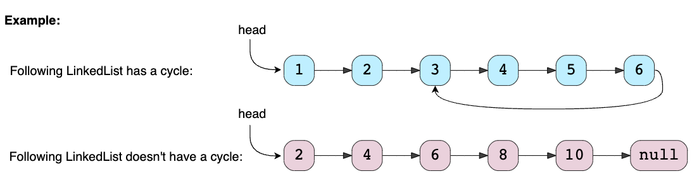
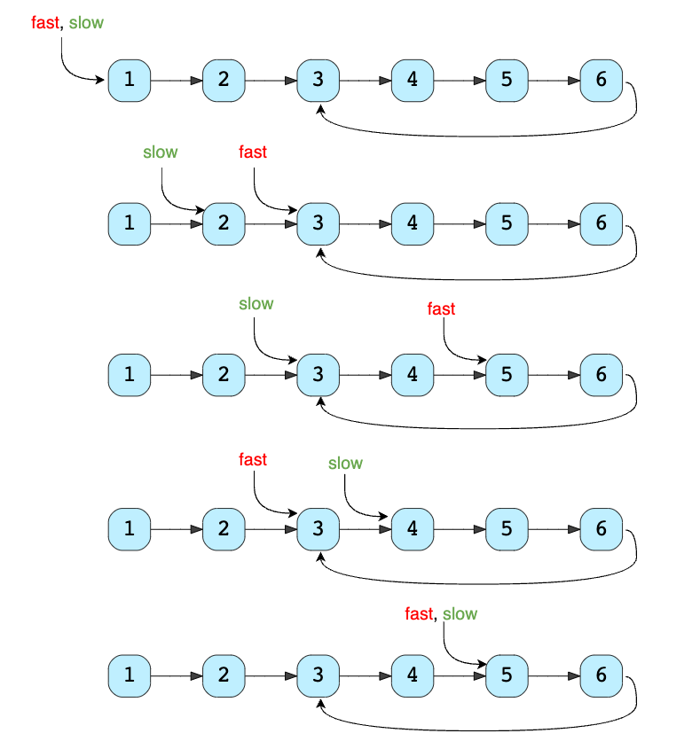
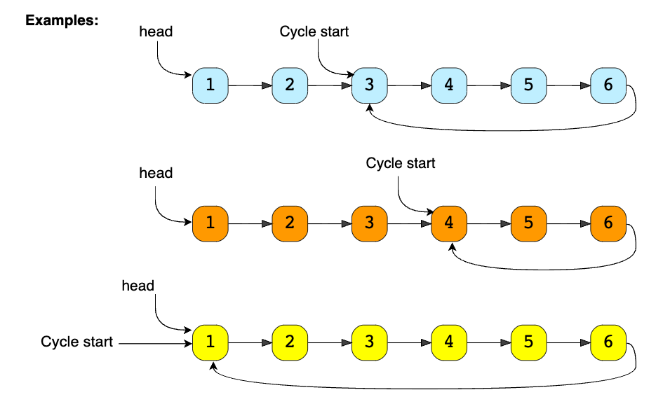
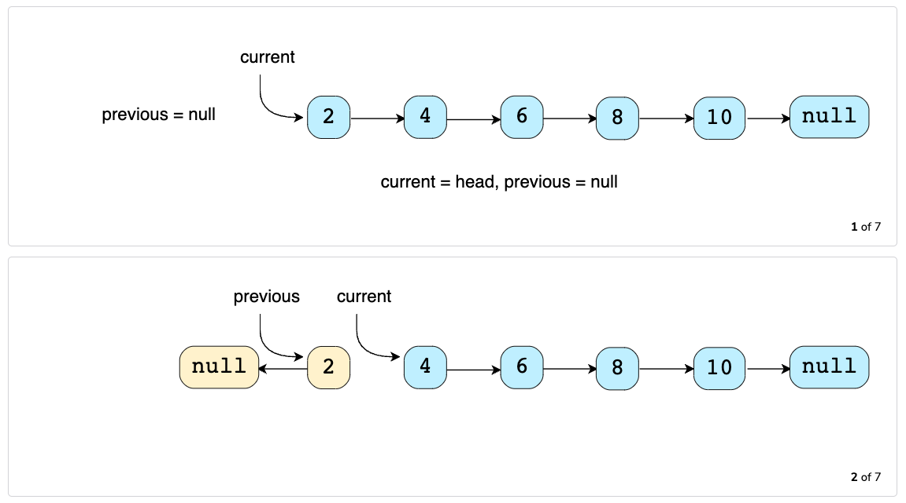
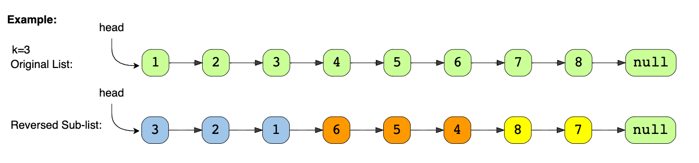
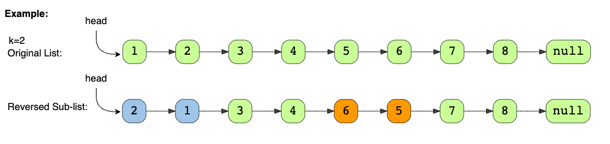

# INDEX

- [INDEX](#index)
  - [Tips](#tips)
  - [Fast \& Slow Pointer](#fast--slow-pointer)
    - [Linked List Cycle](#linked-list-cycle)
    - [Linked List Cycle Length](#linked-list-cycle-length)
    - [Linked List Cycle II](#linked-list-cycle-ii)
    - [Happy Number](#happy-number)
    - [Palindrome Linked List](#palindrome-linked-list)
    - [Reorder List](#reorder-list)
    - [Maximum Twin Sum of a Linked List](#maximum-twin-sum-of-a-linked-list)
  - [Singly Linked List](#singly-linked-list)
    - [Reverse a Linked List](#reverse-a-linked-list)
    - [Reverse Linked List II (Reverse a sub-list)](#reverse-linked-list-ii-reverse-a-sub-list)
    - [Reverse Nodes in k-Group](#reverse-nodes-in-k-group)
    - [Reverse alternating K-element Sub-list](#reverse-alternating-k-element-sub-list)
    - [Rotate List](#rotate-list)
    - [Middle Point of a Linked List](#middle-point-of-a-linked-list)
    - [Circular Linked List](#circular-linked-list)
    - [From Last](#from-last)
    - [Merge Two Sorted Linked Lists](#merge-two-sorted-linked-lists)
  - [Doubly Linked List](#doubly-linked-list)
    - [Design Browser History](#design-browser-history)
    - [Flatten a Multilevel Doubly Linked List](#flatten-a-multilevel-doubly-linked-list)

---

## Tips

- To check if linked list is empty --> `if not head:`
- To check if linked list has only one node --> `if head and not head.next:`
- To remove the first node --> `head = head.next`
- To remove the last node --> `prev.next = None`

  1. create 2 variables: `prev` and `curr`
  2. `prev` starts at the head, `curr` starts at the head's next node
  3. if `curr` is the last node, `prev.next` will be `None` --> `prev.next = None`
  4. then `prev` will be `curr` --> `prev = curr` --> `prev` is now the last node

- **Code reuse in Linked Lists (Interview discussion):**
  - rather than creating a new function to (`insert` / `remove` / `get`) the first/last node, we can reuse the function to remove the last node by passing in the head/tail index as the argument
    

---

## Fast & Slow Pointer

It's a technique that uses two pointers to traverse the list at different speeds (`slow` and `fast`). This technique is useful for solving problems involving cycles in linked lists.

```py
slow = head
fast = head

while fast and fast.next:
    slow = slow.next
    fast = fast.next.next

# now `slow` is at the middle of the list, and `fast` is at the end of the list
```

- **Floyd's tortoise and hare algorithm**
  - It's a cycle detection algorithm that uses two pointers to traverse the list at different speeds. It's a solution that doesn't require extra space (space to store the nodes that have been visited).
    - "tortoise" 🐢 -> moves 1 step at a time (Slow)
    - "hare" 🐰 -> moves 2 steps at a time (Fast)
  - We can use two pointers, `fast` and `slow`. The `fast` pointer moves two steps at a time while the `slow` pointer moves one step. If the list has a cycle, the `fast` pointer will eventually meet the `slow` pointer.
    
- This approach is quite useful when dealing with **cyclic** LinkedLists or arrays.

### Linked List Cycle

Given `head`, the head of a linked list, determine if the linked list has a cycle in it.



- Explanation:

  - To detect if a list is cyclic, we can :

    1. check whether a node had been visited before.
       - We go through each node one by one and record each node's reference (or memory address) in a hash table. If the current node is `null`, we have reached the end of the list and it must not be cyclic. If current node’s reference is in the **hash set**, then return true.
       - **Time Complexity:** `O(n)`
       - **Space Complexity:** `O(n)`
    2. **Floyd's tortoise and hare algorithm 🐢🐰**

       
       

       - **Time Complexity:** `O(n)`
       - **Space Complexity:** `O(1)`

```py
# Method 1: using hash set
def hasCycle(self, head: ListNode) -> bool:
    visited = set()
    while head:
        if head in visited:
            return True
        visited.add(head)
        head = head.next
    return False

# Method 2: using Floyd's Cycle-Finding Algorithm ✅
def hasCycle(self, head: ListNode) -> bool:
    slow = fast = head
    while fast and fast.next:
        slow = slow.next
        fast = fast.next.next
        if slow == fast:
            return True
    return False
```

---

### Linked List Cycle Length

Given the `head` of a LinkedList with a cycle, find the length of the cycle.

```py
def findCycleLength(head):
    slow = fast = head
    while fast and fast.next:
        slow = slow.next
        fast = fast.next.next
        if slow == fast:
            return calculateCycleLength(slow)
    return 0

def calculateCycleLength(slow):
    current = slow
    cycleLength = 0
    while True:
        current = current.next
        cycleLength += 1
        if current == slow:
            break
    return cycleLength
```

---

### Linked List Cycle II

Given a linked list, **return the node where the cycle begins**. If there is no cycle, return `null`.

It's very similar to the previous problem, but this time we need to return the node where the cycle begins.


- Explanation:

  - to solve it we can use the same approach as the previous problem, but we need to add a few more steps:
    - **Step 1:** Find the meeting point. We use the same approach as the previous problem to detect a cycle. Once the `fast` and `slow` pointers meet, we know there is a cycle, and we can return the node where the two pointers meet.
    - **Step 2:** Find the `entrance` to the cycle. We create a new pointer at `head` and move it one step at a time towards the `entrance` of the cycle. Since the `head` is `k` nodes away from the `entrance` and the `meeting point` is also `k` nodes away from the `entrance`, the two pointers will meet at the `entrance` of the cycle.
      
      
      
      

```py
def detectCycle(self, head: ListNode) -> ListNode:
    slow = fast = head
    while fast and fast.next:
        slow = slow.next
        fast = fast.next.next
        if slow == fast:
            break
    else:
        return None
    # now fast points to the meeting point

    # new pointer starts at head
    slow = head
    while slow != fast:
        slow = slow.next
        fast = fast.next
    return slow
```

---

### Happy Number

Write an algorithm to determine if a number `n` is happy. A **happy number** is a number defined by the following process:

- Starting with any positive integer, replace the number by the sum of the squares of its digits.
- Repeat the process until the number equals 1 (where it will stay), or it **loops endlessly in a cycle** which does not include `1`.
- Those numbers for which this process **ends in `1`** are happy.

- EX:

  - Input: `n = 23`
  - Output: `true`
  - Explanation:
    - `2^2 + 3^2 = 13`
    - `1^2 + 3^2 = 10`
    - `1^2 + 0^2 = 1` --> `true`

- Solution 1: Using "Slow and Fast" pointers ✅

  - **Time Complexity:** `O(log(n))`
  - **Space Complexity:** `O(1)

    ```py
    def isHappy(self, n: int) -> bool:
        slow = fast = n
        while True:
            slow = self.calculateSquareSum(slow)
            fast = self.calculateSquareSum(self.calculateSquareSum(fast))
            if slow == fast:
                break
        return slow == 1

    def calculateSquareSum(self, n):
        squareSum = 0
        while n > 0:
            digit = n % 10 # get the last digit
            squareSum += digit * digit
            n //= 10 # remove the last digit
        return squareSum
    ```

- Solution 2: Using a hash set

  - **Time Complexity:** `O(log(n))`
  - **Space Complexity:** `O(log(n))`

    ```py
    def isHappy(self, n: int) -> bool:
        visited = set()
        while n not in visited:
            visited.add(n)
            n = self.calculateSquareSum(n)
        return n == 1

    def calculateSquareSum(self, n):
        squareSum = 0
        while n > 0:
            digit = n % 10 # get the last digit
            squareSum += digit * digit
            n //= 10 # remove the last digit
        return squareSum
    ```

---

### Palindrome Linked List

Given the `head` of a singly linked list, return `true` if it is a palindrome.

- EX:

  - Input: `head = [1,2,2,1]`
  - Output: `true`
  - Explanation: The first and last nodes of the list are 1. The second and second to last nodes are 2. Since each of these pairs are equal, we return true.

- Explanation:
  1. First, we find the middle of the linked list using the `fast` and `slow` pointers.
  2. Then, we reverse the second half of the linked list.
  3. Finally, we compare the first half with the reversed second half to see if the linked list is a palindrome.

```py
def isPalindrome(self, head: ListNode) -> bool:
    slow = fast = head
    while fast and fast.next:
        slow = slow.next
        fast = fast.next.next

    # reverse the second half
    prev = None
    while slow:
        nextNode = slow.next
        slow.next = prev
        prev = slow
        slow = nextNode

    # compare the first and second half
    while prev:
        if prev.val != head.val:
            return False
        prev = prev.next
        head = head.next
    return True
```

---

### Reorder List

Given a singly linked list `L: L0 -> L1 -> ... -> Ln-1 -> Ln`, reorder it to: `L0 -> Ln -> L1 -> Ln-1 -> L2 -> Ln-2 -> ...`


- **Steps:**
  1. Split the list into two halves
     - find the middle of the list using the **slow and fast pointer** technique
  2. Reverse the second half of the list using the **reverse linked list** technique
  3. Merge the two halves of the list by alternating the nodes
     
     - this is done by breaking the links between the nodes of the two lists and inserting the second list between the nodes of the first list
     - we do so by storing a temporary reference to the next node of the first list and then setting the next node of the first list to the current node of the second list
     - > **Note:** the first half of the list is always longer than or equal to the second half of the list

```py
def reorder_list(head):
    # 1. find the middle of the list
    slow = fast = head
    while fast and fast.next:
        slow = slow.next
        fast = fast.next.next

    # 2. disconnect 2 lists
    head2 = slow.next
    slow.next = None # break the link between the first and second half

    # 3. Reverse the second half of the list
    prev = None
    curr = head2
    while curr:
        nxt = curr.next
        curr.next = prev
        prev = curr
        curr = nxt
    # Now, `prev` will be set to the head of the reversed second half of the list

    # 4. Merge the two lists (alternating the nodes)
    head1 = head
    head2 = prev
    while head2:
      # TEMP
      head1_next = head1.next
      head2_next = head2.next

      head1.next = head2
      head2.next = head1_next

      # update pointers
      head1 = head1_next
      head2 = head2_next
```

---

### Maximum Twin Sum of a Linked List

Given a singly linked list, return the maximum twin sum of the given linked list.

The twin sum of a linked list is the maximum possible sum of a linked list's first half and second half.

Twin nodes of a linked list are the nodes that are equidistant from the list's ends.

```py
def maxTwinSum(self, head: ListNode) -> int:
    # find the middle of the linked list
    slow = fast = head
    while fast and fast.next:
        slow = slow.next
        fast = fast.next.next

    # reverse the second half
    prev = None
    while slow:
        nextNode = slow.next
        slow.next = prev
        prev = slow
        slow = nextNode

    # compare the first and second half
    maxSum = 0
    while prev:
        maxSum = max(maxSum, prev.val + head.val)
        prev = prev.next
        head = head.next
    return maxSum
```

---

## Singly Linked List

### Reverse a Linked List

Write a function that accepts a linked list and reverses it in place.

- EX: `1 -> 2 -> 3 -> 4 -> 5` --> `5 -> 4 -> 3 -> 2 -> 1`
  is `None`

- **Steps**:
  - It's done using 3 pointers: `prev`, `curr`, and `next`
    
    

```py
def reverse_linked_list(head):
    prev = None # Initialize previous pointer to None
    curr = head
    nextNode = head.next

    # Loop until current pointer is None
    while curr:
        nextNode = curr.next
        curr.next = prev
        # Shift the previous pointer to the current node
        prev = curr
        # Shift the current pointer to the next node
        curr = nextNode
    # Return the previous node, which is the new head of the reversed list
    return prev
```

---

### Reverse Linked List II (Reverse a sub-list)

> TODO: watch neetcode video

Given the `head` of a singly linked list and two integers `left` and `right` where `left <= right`, reverse the nodes of the list from position `left` to position `right`, and return the reversed list.


- Example:

  - Input: `head = [1,2,3,4,5], left = 2, right = 4`
  - Output: `[1,4,3,2,5]`

- Define constraints:
  - will `left` and `right` always be valid? (within the range of the list)
    - if not, we can add a check to make sure that `left` and `right` are valid
- Steps:
  1. Skip the first `left - 1` nodes, to reach the node at position `left`
  2. Remember the node at position `left - 1` to connect the reversed sub-list to the list later
  3. Reverse the nodes from position `left` to position `right`
  4. Connect `left - 1` and `right + 1` to the reversed sub-list

```py
def reverseBetween(self, head: ListNode, left: int, right: int) -> ListNode:
    # if left == right, no need to reverse
    if left == right:
        return head

    # create a dummy node to avoid edge case of inserting to empty list
    dummy = ListNode(0, head)

    # 1. reach node at position `left`
    leftPrev, cur = dummy, head
    for _ in range(left - 1):
        leftPrev = cur
        cur = cur.next
    # Now `cur` is at position `left`, `leftPrev` is at position `left - 1`
    tail = cur # save the node at position `left` to connect to the reversed nodes later

    # 2. reverse the nodes from position `left` to position `right`
    prev = None
    for _ in range(right - left + 1):
        nxt = cur.next
        cur.next = prev
        prev = cur
        cur = nxt

    # Now `prev` is at position `right`, `cur` is at position `right + 1`
    start = prev # save the node at position `right` to connect to the rest of the list later

    # 3. connect the reversed nodes to the rest of the list
    leftPrev.next = start # connect the node at position `left - 1` to the node at position `right`
    tail.next = cur # connect the node at position `left` to the node at position `right + 1`

    return dummy.next
```

---

### Reverse Nodes in k-Group

// TODO: watch neetcode video

Given a linked list, reverse the nodes of a linked list `k` at a time and return its modified list.

`k` is a positive integer and is less than or equal to the length of the linked list. If the number of nodes is not a multiple of `k` then left-out nodes, in the end, should remain as it is.

- EX:
  
  - input: `1 -> 2 -> 3 -> 4 -> 5 -> 6 -> 7 -> 8`, `k = 3`
  - output: `3 -> 2 -> 1 -> 6 -> 5 -> 4 -> 8 -> 7`

```py
def reverseKGroup(self, head: ListNode, k: int) -> ListNode:
    dummy = ListNode(0)
    curr = dummy
    start = head

    while start:
        end = start
        # move `end` `k` steps ahead of `start`
        for _ in range(k - 1):
            end = end.next
            # if `end` is None, we reached the end of the list
            if not end:
                break

        if not end:
            # set curr's next node to start (the rest of the list)
            curr.next = start
            break

        # save the next node of `end` to connect to the rest of the list later
        nxt = end.next
        # set `end`'s next node to None to break the link between `end` and the rest of the list
        end.next = None
        # reverse the nodes from position `start` to position `end`
        prev = None
        currNode = start
        while currNode:
            nextNode = currNode.next
            currNode.next = prev
            prev = currNode
            currNode = nextNode

        # Now `prev` is at position `end`, `currNode` is at position `end + 1`

        # connect the reversed nodes to the rest of the list
        curr.next = prev # connect the node at position `start - 1` to the node at position `end`
        start.next = nxt # connect the node at position `start` to the node at position `end + 1`

        # update pointers
        curr = start
        start = nxt

    # return the next node of the dummy node
    return dummy.next
```

---

### Reverse alternating K-element Sub-list



```py
def reverse_alternate_k_elements(head, k):
    if k <= 1 or not head:
        return head

    curr = head
    prev = None

    while True:
        last_node_of_prev_part = prev
        last_node_of_sub_list = curr

        # reverse `k` nodes
        i = 0
        while curr and i < k:
            nextNode = curr.next
            curr.next = prev
            prev = curr
            curr = nextNode
            i += 1

        # connect with the previous part
        if last_node_of_prev_part:
            last_node_of_prev_part.next = prev
        else:
            head = prev

        # connect with the next part
        last_node_of_sub_list.next = curr

        # skip `k` nodes
        i = 0
        while curr and i < k:
            prev = curr
            curr = curr.next
            i += 1

        if not curr:
            break

    return head
```

---

### Rotate List

// TODO: watch neetcode video

Given the `head` of a linked list, rotate the list to the right by `k` places.

- EX:
  
  - input: `1 -> 2 -> 3 -> 4 -> 5`, `k = 2`
  - output: `4 -> 5 -> 1 -> 2 -> 3`

- Explanation:
  - **Step 1:** Connect the last node of the LinkedList to the `head`, because the list will have a different `tail` after the rotation.
  - **Step 2:** The new `head` of the LinkedList will be the node at the beginning of the `sub-list`.
  - **Step 3:** The node right before the start of `sub-list` will be the new `tail` of the rotated LinkedList.

```py
def rotateRight(self, head: ListNode, k: int) -> ListNode:
    if not head or not head.next or k == 0:
        return head

    # find the length of the list
    length = 1
    lastNode = head
    while lastNode.next:
        lastNode = lastNode.next
        length += 1

    # connect the last node to the first node to make it a circular list
    lastNode.next = head

    # find the length of the new list to rotate
    k = k % length
    skipLength = length - k

    # find the last node of the new list
    last_node_of_rotated_list = head
    for _ in range(skipLength - 1):
        last_node_of_rotated_list = last_node_of_rotated_list.next
    # now, `last_node_of_rotated_list` is at the last node of the new list

    # break the link between the last node of the new list and the first node of the new list
    head = last_node_of_rotated_list.next
    last_node_of_rotated_list.next = None
    return head
```

---

### Middle Point of a Linked List

Write a function that accepts a linked list and returns the middle node in the list. If the list has an even number of elements, return the node at the end of the first half of the list. **Do not use a counter variable**, **do not retrieve the size of the list**, and **only iterate through the list one time**.

- EX: `1 -> 2 -> 3 -> 4 -> 5` --> `3`
- **Steps:**
  
  1. create 2 variables: `slow` and `fast`
  2. `slow` and `fast` starts at the head
  3. `slow` moves **1 step** at a time, `fast` moves **2 steps** at a time
  4. when `fast` reaches the end of the list, `slow` will be at the middle node

```py
def middle_point(head):
    slow = head
    fast = head

    # check if there're 2 next nodes ahead of `fast`
    while fast and fast.next:
        slow = slow.next
        fast = fast.next.next
    return slow
````

---

### Circular Linked List

Write a function that accepts a linked list and returns true if the linked list contains a **circular reference**.

> Circular Linked List is a linked list where a node's next point actually points back to a previous node in the list.

- EX: `1 -> 2 -> 3 -> 4 -> 5` --> `5.next = 2` --> `True`
- **Steps:**
  
  1. create 2 variables: `slow` and `fast`
  2. `slow` and `fast` starts at the head
  3. `slow` moves **1 step** at a time, `fast` moves **2 steps** at a time
  4. if `slow` and `fast` ever meet, then there's a circular reference

```py
def circular_linked_list(head):
    slow = head
    fast = head

    # check if there're 2 next nodes ahead of `fast`
    while fast and fast.next:
        slow = slow.next
        fast = fast.next.next
        # if `slow` and `fast` ever meet, then there's a circular reference
        if slow == fast:
            return True
    return False
```

---

### From Last

Write a function that accepts a linked list and a number `n`. The function should return the node `n` spaces from the last node in the list. Do not call the `size` method of the linked list. Assume that `n` will always be less than the length of the list.

- EX: `1 -> 2 -> 3 -> 4 -> 5`, `n = 2` --> `3`
- **Steps:**
  1. create 2 variables: `slow` and `fast`
  2. `slow` and `fast` starts at the head
  3. `fast` moves `n` steps ahead of `slow`, so that `fast` is `n` spaces ahead of `slow`
  4. when `fast` reaches the end of the list, `slow` will be at the node `n` spaces from the last node

```py
def from_last(head, n):
    slow = head
    fast = head

    # move `fast` `n` steps ahead of `slow`
    while n > 0:
        fast = fast.next
        n -= 1

    # move `slow` and `fast` at the same pace
    while fast.next:
        slow = slow.next
        fast = fast.next
    return slow

# -------------------------------------------------
# Remove nth node from the end of a linked list (same Idea)
# Create two pointers, slow and fast
def removeNthFromEnd(head, n):
    slow = fast = head
    # Move fast pointer n nodes ahead
    for i in range(n):
        fast = fast.next
    # If fast pointer is None, remove the head
    if not fast:
        return head.next
    # Move both pointers until fast pointer reaches the end
    while fast.next:
        slow = slow.next
        fast = fast.next
    # Remove the nth node by updating previous node's nex   pointer
    slow.next = slow.next.next
    return head
```

---

### Merge Two Sorted Linked Lists

Write a function that accepts two sorted linked lists and returns a new linked list containing the combined sorted values from both lists.

- EX:
  

- **Steps:**
  1. create a dummy node and a pointer `curr` to the dummy node.
     - to avoid edge cases like `l1` or `l2` is empty
  2. iterate over the two input lists and compare the values of the current nodes pointed to by `l1` and `l2`.
     - You append the node with the smaller value to the `curr.next` pointer
     - then advance the pointer of the list from which the smaller value was appended.
  3. If either `l1` or `l2` becomes None, you append the remaining nodes of the other list to the curr.next pointer.
  4. Finally, you return the `head` of the merged sorted list

```py
def merge_sorted_lists(l1, l2):
    # create a dummy node to avoid edge case of inserting to empty list
    dummy = ListNode(0)
    # create a pointer to the dummy node
    curr = dummy

    # while both lists are not empty
    while l1 and l2:
        # if l1's value is smaller than l2's value
        if l1.value < l2.value:
            # set curr's next node to l1
            curr.next = l1
            # move l1 to the next node
            l1 = l1.next
        # if l2's value is smaller than l1's value
        else:
            # set curr's next node to l2
            curr.next = l2
            # move l2 to the next node
            l2 = l2.next
        # move curr to the next node
        curr = curr.next

    # if l1 is not empty after the while loop
    if l1:
        # set curr's next node to l1 (the rest of l1)
        curr.next = l1
    # if l2 is not empty after the while loop
    if l2:
        # set curr's next node to l2 (the rest of l2)
        curr.next = l2

    # return the next node of the dummy node
    return dummy.next
```

---

## Doubly Linked List

### Design Browser History

You have a browser of one tab where you start on the homepage and you can visit another url, get back in the history number of steps or move forward in the history number of steps.

Implement the `BrowserHistory` class:

- `BrowserHistory(string homepage)` Initializes the object with the homepage of the browser.
- `void visit(string url)` Visits `url` from the current page. It clears up all the forward history.
- `string back(int steps)` Move `steps` back in history. If you can only return `x` steps in the history and `steps > x`, you will return only `x` steps. Return the current `url` after moving back in history **at most** `steps`.
- `string forward(int steps)` Move `steps` forward in history. If you can only forward `x` steps in the history and `steps > x`, you will forward only `x` steps. Return the current `url` after forwarding in history **at most** `steps`.
- **Solution 1: Doubly linked list**

  - we can use a pointer to store the current page
  - we can use a pointer to store the last page
  - we can use a pointer to store the next page
  - we can use a variable to store the number of pages in the history
  - we can use a variable to store the number of pages in the future
  - **Time Complexity:**
    - `visit`: `O(1)`
    - `back`: `O(n)`
    - `forward`: `O(n)`
  - **Space Complexity:** `O(n)`

  ```py
  class Node:
      def __init__(self, val, prev=None, next=None):
          self.val = val
          self.prev = prev
          self.next = next

  class BrowserHistory:
      def __init__(self, homepage: str):
          self.cur = Node(homepage)

      def visit(self, url: str) -> None:
          # make current page point to the new page and make the new page point back to the current page
          self.cur.next = Node(url, self.cur)
          # update the current page
          self.cur = self.cur.next

      def back(self, steps: int) -> str:
          # if the number of steps is greater than the number of pages in the history, we will move back to the first page
          # use cur.prev to make sure that we don't pass the first page
          while steps > 0 and self.cur.prev:
              self.cur = self.cur.prev
              steps -= 1
          return self.cur.val

      def forward(self, steps: int) -> str:
          # if the number of steps is greater than the number of pages in the future, we will move forward to the last page
          # use cur.next to make sure that we don't pass the last page
          while steps > 0 and self.cur.next:
              self.cur = self.cur.next
              steps -= 1
          return self.cur.val
  ```

- **Solution 2: Array (Better ✅)**

  ```py
  class BrowserHistory:
      def __init__(self, homepage: str):
          self.history = [homepage]
          self.curIdx = 0

      def visit(self, url: str) -> None:
          # if we are not at the end of the history, we will remove all the pages after the current page
          if self.curIdx < len(self.history) - 1:
              self.history = self.history[:self.curIdx+1]
          # append the new page to the history
          self.history.append(url)
          # update the current page
          self.curIdx += 1

      def back(self, steps: int) -> str:
          # if the number of steps is greater than the number of pages in the history, we will move back to the first page
          self.curIdx = max(self.curIdx - steps, 0)
          return self.history[self.curIdx]

      def forward(self, steps: int) -> str:
          # if the number of steps is greater than the number of pages in the future, we will move forward to the last page
          self.curIdx = min(self.curIdx + steps, len(self.history) - 1)
          return self.history[self.curIdx]
  ```

---

### Flatten a Multilevel Doubly Linked List

You are given a doubly linked list which in addition to the `next` and `previous` pointers, it could have a `child` pointer, which may or may not point to a separate doubly linked list. These child lists may have one or more children of their own, and so on, to produce a multilevel data structure, as shown in the example below.

Given the `head` of a multilevel doubly linked list, **flatten** the list so that all the nodes appear in a single-level, doubly linked list. You are given the `head` of the first level of the list.

- Ex:

  - input: `head = [1,2,3,4,5,6,null,null,null,7,8,9,10,null,null,11,12]`
    
  - output: `[1,2,3,7,8,11,12,9,10,4,5,6]`
  - explanation:
    

- Explanation:

  - Here, we have 3 levels of depth depicted in the figure above. Also, there are 2 lists at each level.
  - We want to flatten from the child list to the parent list (Bottom-up), So that the nodes in the parent list are in the same order as the nodes in the child list.
    
    
  - We can use a **stack** to store the nodes in the parent list, and then we can pop the nodes from the stack and append them to the child list.
  - We can use a pointer to store the current node in the parent list.
  - We can use a pointer to store the current node in the child list.

- Solution 1: Using stack ✅

  ```py
  # Time Complexity: O(n) | Space Complexity: O(n)
  def flatten(self, head: 'Node') -> 'Node':
      if not head:
          return None

      # create a dummy node to avoid edge case of inserting to empty list
      dummy = Node(0, None, head, None)
      stack = [head]
      prev = dummy

      while stack:
          # pop the node from the stack
          curr = stack.pop()
          # connect the current node to the previous node
          prev.next = curr
          curr.prev = prev

          # if the current node has a next node, push the next node to the stack
          if curr.next:
              stack.append(curr.next)
          # if the current node has a child node, push the child node to the stack
          if curr.child:
              stack.append(curr.child)
              # set the child node to None
              curr.child = None

          # update the previous node
          prev = curr

      newHead = dummy.next
      newHead.prev = None # set the previous node's next node to None
      return newHead
  ```

- Solution 2: Using pointers | less space

  ```py
  # Time Complexity: O(n) | Space Complexity: O(1)
  def flatten(self, head: 'Node') -> 'Node':
      if not head:
          return None

      # create a dummy node to avoid edge case of inserting to empty list
      dummy = Node(0, None, head, None)
      prev = dummy

      while head:
          # if the current node has a child node
          if head.child:
              # connect the current node to the child node
              prev.next = head.child
              head.child.prev = prev

              # find the tail of the child node
              tail = head.child
              while tail.next:
                  tail = tail.next

              # connect the tail of the child node to the next node
              tail.next = head.next
              if head.next:
                  head.next.prev = tail

              # set the child node to None
              head.child = None

          # update the previous node
          prev = head
          # move to the next node
          head = head.next

      newHead = dummy.next
      newHead.prev = None # set the previous node's next node to None
      return newHead
  ```
