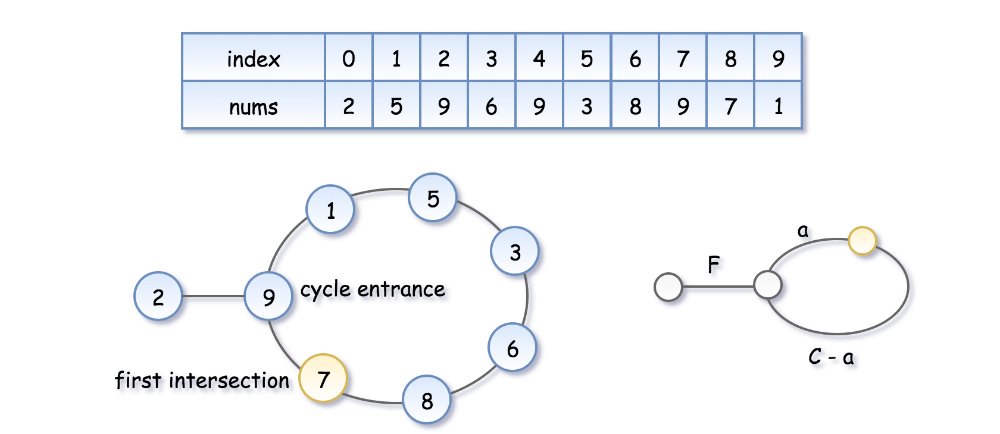

# INDEX

- [INDEX](#index)
  - [Two sum](#two-sum)
  - [Valid Anagram](#valid-anagram)
  - [Group Anagrams](#group-anagrams)
  - [Unique Number of Occurrences](#unique-number-of-occurrences)
  - [Contains Duplicate II](#contains-duplicate-ii)
  - [Missing Number](#missing-number)
  - [Find the Duplicate Number](#find-the-duplicate-number)
  - [Verifying an Alien Dictionary](#verifying-an-alien-dictionary)
  - [Hand of Straights](#hand-of-straights)
  - [4Sum II](#4sum-ii)
  - [Repeated DNA Sequences](#repeated-dna-sequences)

---

## Two sum

Given an array of integers `nums` and an integer `target`, return indices of the two numbers such that they add up to `target`.

- You may assume that each input would have **exactly one solution**, and you may not use the same element twice.

- EX:

  - Input: `nums = [2,7,11,15], target = 9`
  - Output: `[0,1]`
  - Output: Because `nums[0] + nums[1] == 9`, we return `[0, 1]`.

- Explanation:
  - if we know that the array has 2 numbers that add up to the target, we can find the second number by subtracting the first number from the target
  - we can use a dictionary to store the number and its index and then iterate through the array and check if the complement is in the dictionary

```py
def twoSum(self, nums: List[int], target: int) -> List[int]:
    # create a dictionary to store the number and its index
    num_index = {}

    # iterate through the nums
    for i, num in enumerate(nums):
        complement = target - num
        # if the complement is in the dictionary, return the indices
        if complement in num_index:
            return [num_index[complement], i]
        # if the complement is not in the dictionary, add the number and its index to the dictionary
        num_index[num] = i
```

---

## Valid Anagram

An anagram is a word or phrase formed by rearranging the letters of a different word or phrase, typically using all the original letters exactly once.

- EX: `cinema` and `iceman` are anagrams of each other.

```py
# Time: O(s + t) | Space: O(s + t)
def is_anagram(s, t):
    if len (s) != len(t):
        return False

    countS, countT = {}, {}
    for i in range(len(s)):
        countS[s[i]] = 1 + countS.get(s[i], 0)
        countT[t[i]] = 1 + countT.get(t[i], 0)
    for c in countS:
        if countS[c] != countT.get(c, 0):
            return False
    return True

# Solution: 2 (using O(1) memory)
# Time: O(n log(n)) | Space: O(1)
def is_anagram(s, t):
    return sorted(s) == sorted(t)
```

---

## Group Anagrams

Given an array of strings `strs`, group the anagrams together. You can return the answer in **any order**.

- EX:

  - Input: `strs = ["eat","tea","tan","ate","nat","bat"]`
  - Output: `[["bat"],["nat","tan"],["ate","eat","tea"]]`
    

- **Solution 1: O(n log(n))**

  - we can use a dictionary to store the sorted string as the key and the list of anagrams as the value
  - we can iterate through the array and sort each string and then add it to the dictionary

  ```py
  def group_anagrams(strs):
      # key: sorted string | value: list of anagrams
      anagrams = {}

      for s in strs:
          sorted_s = ''.join(sorted(s)) # joining because sorted returns an array
          if sorted_s not in anagrams:
              anagrams[sorted_s] = [s]
          else:
              anagrams[sorted_s].append(s)

      return anagrams.values()
  ```

- **Solution 2: O(n)**

  - we can use a dictionary to store the (count of each characters in a string) as the key and the list of anagrams as the value
  - we can iterate through the array and count the frequency of each character and then add it to the dictionary
  - Time complexity: `O(n.m.26)` -> `O(n.m)` where:
    - `n` is the length of the array
    - `m` is the length of the longest string in the array

  ```py
  def group_anagrams(strs):
      # key: charCount | value: list of anagrams
      anagrams = {}

      for s in strs:
          # create an array to store the frequency of each character in the string
          count = [0] * 26 # a ... z
          for c in s:
              idx = ord(c) - ord('a') # a = 80 - 80 = 0, b = 81 - 80 = 1, ...
              count[idx] += 1

          # convert the array to a tuple to use it as a key in the dictionary
          key = tuple(count)

          if key not in anagrams:
              anagrams[key] = [s]
          else:
              anagrams[key].append(s)

      return anagrams.values()
  ```

---

## Unique Number of Occurrences

Given an array of integers arr, return true if the number of occurrences of each value in the array is unique or false otherwise.

- EX:

  - Input: `arr = [1,2,2,1,1,3]`
  - Output: `true`
  - Explanation: The value `1` has 3 occurrences, 2 and 3 both have 2 occurrences, so the answer is `true`.

```py
def uniqueOccurrences(arr):
  # Count the number of occurrences of each value
  count = {}
  for num in arr:
      count[num] = count.get(num, 0) + 1

  # Check if the number of occurrences is unique
  occurrences = set(count.values())
  return len(occurrences) == len(count)
```

---

## Contains Duplicate II

Given an integer array `nums` and an integer `k`, return `true` if there are two distinct indices `i` and `j` in the array such that `nums[i] == nums[j]` and `abs(i - j) <= k`.

- EX:

  - Input: `nums = [1,2,3,1], k = 3`
  - Output: `true`

- **Solution 1:** using HashMap

  ```py
  def containsNearbyDuplicate(nums, k):
      num_index = {} # num: idx

      for i, num in enumerate(nums):
          if num in num_index and i - num_index[num] <= k:
              return True
          num_index[num] = i

      return False
  ```

- **Solution 2:** sliding window

  ```py
  def containsNearbyDuplicate(nums, k):
      window = set() # window must has length <= k
      l = 0
      for r in range(len(nums)):
          if nums[r] in window:
              return True
          window.add(nums[r])

          # shrink the window if invalid-window
          if (r - l + 1) > k:
              window.remove(nums[l])
              l += 1

      return False
  ```

---

## Missing Number

Given an array `nums` containing `n` distinct numbers in the range `[0, n]`, return the only number in the range that is missing from the array.

- Follow up: Could you implement a solution using only `O(1)` extra space complexity and `O(n)` runtime complexity?

- EX:

  - Input: `nums = [3,0,1]`
  - Output: `2`
  - Explanation: `n = 3` since there are `3` numbers, so all numbers are in the range `[0,3]`. `2` is the missing number in the range since it does not appear in `nums`.

- **Solution 1:** using HashMap -> `O(n)` time and `O(n)` space

  ```py
  def missingNumber(nums):
      # Create a dictionary to store the presence of each number
      presence = {}
      for num in nums:
          presence[num] = True

      # Check each number in the range [0, n]
      n = len(nums)
      for i in range(n+1):
          if i not in presence:
              return i
  ```

- **Solution 2:** using `sum` function -> `O(n)` time and `O(1)` space

  ```py
  def missingNumber(nums):
    # Calculate the expected sum of the range [0, n]
    n = len(nums)
    expected_sum = n * (n + 1) // 2

    # Calculate the actual sum of the elements in the array
    actual_sum = sum(nums)

    # Return the difference between the expected sum and the actual sum
    return expected_sum - actual_sum
  ```

---

## Find the Duplicate Number

Given an array of integers `nums` containing `n + 1` integers where each integer is in the range `[1, n]` inclusive.

There is only **one repeated number** in `nums`, return this repeated number.

- You must solve the problem **without** modifying the array `nums` and uses only constant extra space.

- EX:

  - Input: `nums = [1,3,4,2,2]`
  - Output: `2`

- **Solution 1:** using HashMap **(not what the problem wants)** -> `O(n)` time and `O(n)` space

  ```py
  def findDuplicate(nums):
      # Create a dictionary to store the presence of each number
      presence = {}
      for num in nums:
          if num in presence:
              return num
          presence[num] = True
  ```

- **Solution 2:** using **Floyd's Cycle Detection** -> `O(n)` time and `O(1)` space

  - To solve this problem without using space, we can use Floyd's Cycle Detection algorithm. This algorithm is used to detect cycles in a `linked list`.
    - It works by using two pointers, a `slow` pointer and a `fast` pointer. The `slow` pointer moves one step at a time, while the `fast` pointer moves two steps at a time.
    - If the two pointers ever meet, it means that there is a cycle in the linked list. Otherwise, if the `fast` pointer reaches the end of the linked list, it means that there is no cycle in the linked list.
  - **Explanation**
    1. We need to find the **intersection point** of the two runners, because it is the duplicate number that we are looking for.
       
       - We start both runners at the beginning of the linked list and keep moving them until they meet. The fast runner will move two steps at a time, while the slow runner will move one step at a time.
    2. Once the two runners meet, we know that there is a cycle in the linked list. We then need to find the "entrance" to the cycle, which is the duplicate number that we are looking for.
       
       - We start a new pointer at the beginning of the linked list and move it one step at a time. We also move the slow runner one step at a time. When the two runners meet, we have found the "entrance" to the cycle, which is the duplicate number that we are looking for.

  ```py
  def findDuplicate(nums):
      # Find the intersection point of the two runners
      slow = fast = 0
      while True:
          slow = nums[slow] # move 1 step
          fast = nums[nums[fast]] # move 2 steps
          if slow == fast:
              break # found the intersection point

      # Find the "entrance" to the cycle
      slow2 = 0
      while slow2 != fast:
          slow2 = nums[slow2] # move 1 step
          fast = nums[fast] # move 1 step

      return slow2
  ```

---

## Verifying an Alien Dictionary

In an alien language, surprisingly they also use English lowercase letters, but possibly in a different order. The order of the alphabet is some permutation of lowercase letters.

Given a sequence of `words` written in the alien language, and the `order` of the alphabet, return `true` if and only if the given `words` are sorted lexicographicaly in this alien language.

- EX:

  - Input: `words = ["hello","leetcode"], order = "hlabcdefgijkmnopqrstuvwxyz"`
  - Output: `true`
  - Explanation: As 'h' comes before 'l' in this language, then the sequence is sorted.

- Explanation:
  - We can use a dictionary to store the order of each character in the alien language
  - Then we can iterate through the words and compare each pair of adjacent words
    - If the first word is a substring of the second word (`len(word1)` less than `len(word2)`), then the words are sorted
    - If the first word is lexicographically greater than the second word, then the words are not sorted
  - Time complexity: `O(n)` where `n` is the total number of characters in all the words
  - Space complexity: `O(1)`

```py
def isAlienSorted(words, order):
    # Create a dictionary to store the order of each character in the alien language
    order_index = {c: i for i, c in enumerate(order)}

    # Iterate through the words and compare each pair words to check if they're in-order
    for i in range(len(words) - 1):
        w1 = words[i]
        w2 = words[i+1]

        # looping through the characters of the first word because the first word is a substring of the second word
        for j in range(len(w1)):
            # If we reached the end of word2 but not word1, then the words are not sorted
            if j == len(w2):
                return False
            # If the first word is lexicographically greater than the second word, then the words are not sorted
            if w1[j] != w2[j]:
                # check order index for each character
                if order_index[w1[j]] > order_index[w2[j]]:
                    return False
                break # because we found the different character, and it's valid

    return True
```

---

## Hand of Straights

Alice has a `hand` of cards, given as an array of integers. Now she wants to rearrange the cards into groups so that each group is size `W`, and consists of `W` **consecutive** cards. Return `true` if and only if she can.

- EX:

  - Input: `hand = [1,2,3,6,2,3,4,7,8], W = 3`
  - Output: `true`
  - Explanation: Alice's hand can be rearranged as `[1,2,3],[2,3,4],[6,7,8]`

- Explanation:

  - we can be **greedy** and look for the minimum value available each time and start a group from there

    - because we know that the minimum value will be the start of a group -> `[1, 2, 3]` and we can't have `1` again in the next group because it's already used
      

    - we will use a `minHeap` for this to get the minimum value in `O(1)` time instead of getting the minimum of `freq.values()` each time in `O(n)` time
      

  - We can use a dictionary to store the frequency of each card
  - Then we can **sort** the hand and iterate through the hand
    - If the current card is not in the dictionary, continue
    - If the current card is in the dictionary, iterate through the next `W` cards, starting from the current card because the hand is sorted and we want to check if the next `W` cards are consecutive -> `[card, card+1, card+2, ..., card+W-1]` -> `[1, 2, 3], [2, 3, 4], [3, 4, 5], ...`
      - If the card is not in the dictionary, return `False`
      - If the card is in the dictionary, decrement its frequency
      - If the card's frequency is `0`, remove it from the dictionary
  - If the dictionary is empty, return `True`

```py
def isNStraightHand(hand, groupSize):
    # if the hand is not divisible by the groupSize
    if len(hand) % groupSize != 0:
        return False

    # create a dictionary to store the frequency of each card
    freq = {}
    for card in hand:
        freq[card] = freq.get(card, 0) + 1

    # use a minHeap to get the minimum value in O(1) time
    minHeap = list(freq.keys())
    heapq.heapify(minHeap)

    while minHeap:
        # get the minimum value
        first = minHeap[0]

        for i in range(first, first + groupSize):
            # if the card is not in the dictionary, return False
            if i not in freq:
                return False
            # if the card is in the dictionary, decrement its frequency
            freq[i] -= 1
            # if the card's frequency is 0, remove it from the dictionary
            if freq[i] == 0:
                if i != first:
                    return False
                heapq.heappop(minHeap)

    return True
```

- Another solution: using a sorted array instead of a minHeap **(Better ✅)**

  ```py
  def isNStraightHand(self, hand: List[int], groupSize: int) -> bool:
      # if the hand is not dividable by the groupSize
      if len(hand) % groupSize != 0:
          return False

      # create a dictionary to store the frequency of each card
      freq = {}
      for card in hand:
          freq[card] = freq.get(card, 0) + 1

      # sort the hand
      hand.sort()

      # iterate through the hand
      for card in hand:
          # if the card is not in the dictionary, continue
          if card not in freq:
              continue

          # iterate through the next `groupSize` cards, starting from the current card because the hand is sorted and we want to check if the next `groupSize` cards are consecutive -> [card, card+1, card+2, ..., card+groupSize-1] -> [1, 2, 3, ..., groupSize], [2, 3, 4, ..., groupSize+1], [3, 4, 5, ..., groupSize+2], ...
          for i in range(card, card + groupSize):
              # if the card is not in the dictionary, return False
              if i not in freq:
                  return False
              # if the card is in the dictionary, decrement its frequency
              freq[i] -= 1
              # if the card's frequency is 0, remove it from the dictionary
              if freq[i] == 0:
                  del freq[i]

      # if the dictionary is empty, return True
      return len(freq) == 0
  ```

---

## 4Sum II

Given four lists `A`, `B`, `C`, `D` of integer values, compute how many tuples `(i, j, k, l)` there are such that `A[i] + B[j] + C[k] + D[l]` is zero.

- Ex: `A = [ 1, 2], B = [-2,-1], C = [-1, 2], D = [ 0, 2]`

  - Output: `2`
  - Explanation: The two tuples are:
    1. `(0, 0, 0, 1)` -> `A[0] + B[0] + C[0] + D[1] = 1 + (-2) + (-1) + 2 = 0`
    2. `(1, 1, 0, 0)` -> `A[1] + B[1] + C[0] + D[0] = 2 + (-1) + (-1) + 0 = 0`

- **Solution 1:** using a dictionary -> `O(n^2)` time and `O(n^2)` space

  ```py
  def fourSumCount(A, B, C, D):
      # create a dictionary to store the sum of each pair of numbers in A and B
      sumAB = {}
      for a in A:
          for b in B:
              sumAB[a+b] = sumAB.get(a+b, 0) + 1

      # create a dictionary to store the sum of each pair of numbers in C and D
      sumCD = {}
      for c in C:
          for d in D:
              sumCD[c+d] = sumCD.get(c+d, 0) + 1

      # iterate through the keys of the first dictionary
      count = 0
      for sum1 in sumAB:
          # if the complement is in the second dictionary, add the product of the frequencies to the count
          if -sum1 in sumCD:
              count += sumAB[sum1] * sumCD[-sum1]

      return count
  ```

- Solution 2: using a dictionary **(Better ✅)** -> `O(n^2)` time and `O(n)` space

  ```py
  def fourSumCount(A, B, C, D):
      # create a dictionary to store the sum of each pair of numbers in A and B
      sumAB = {}
      for a in A:
          for b in B:
              sumAB[a+b] = sumAB.get(a+b, 0) + 1

      # iterate through the keys of the first dictionary
      count = 0
      for c in C:
          for d in D:
              # if the complement is in the first dictionary, add the product of the frequencies to the count
              if -(c+d) in sumAB:
                  count += sumAB[-(c+d)]

      return count
  ```

---

## Repeated DNA Sequences

The **DNA sequence** is composed of series of nucleotides abbreviated as `'A'`, `'C'`, `'G'`, and `'T'`.

- For example, `"ACGAATTCCG"` is a **DNA sequence**.

Given a **DNA sequence** `s`, return all the **10-letter-long** sequences (substrings) that occur more than once in a DNA molecule. You may return the answer in **any order**.

- Ex: `s = "AAAAACCCCCAAAAACCCCCCAAAAAGGGTTT"`

  - Output: `["AAAAACCCCC", "CCCCCAAAAA"]`
  - Explanation: `"AAAAACCCCC"` appears twice, and `"CCCCCAAAAA"` appears twice.

```py
def findRepeatedDnaSequences(s):
    seen = set()
    repeated = set()
    for i in range(len(s)-9):
        # get the current substring
        cur = s[i:i+10]
        if cur in seen:
            repeated.add(cur)
        seen.add(cur)
```

---
